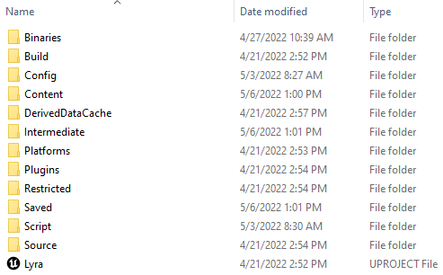
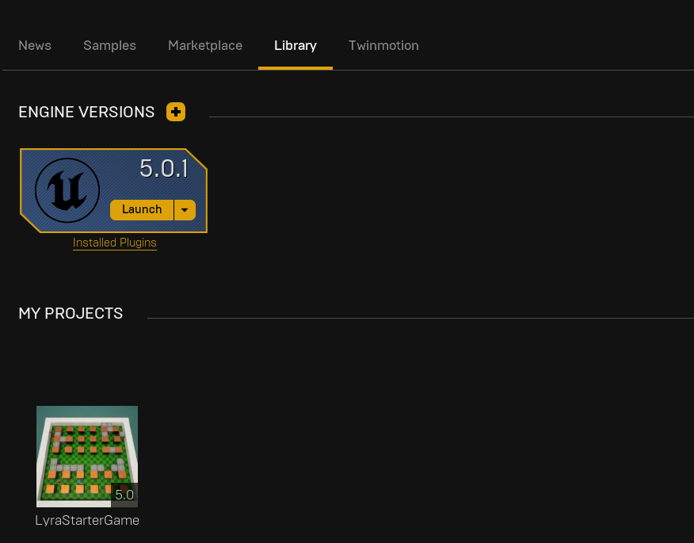
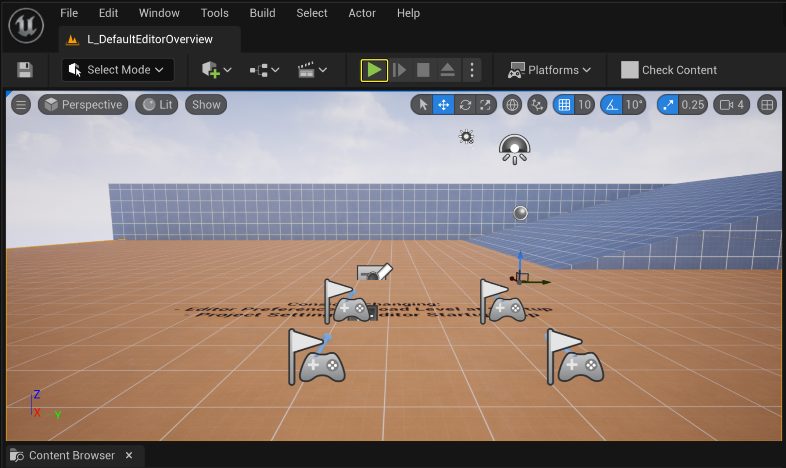
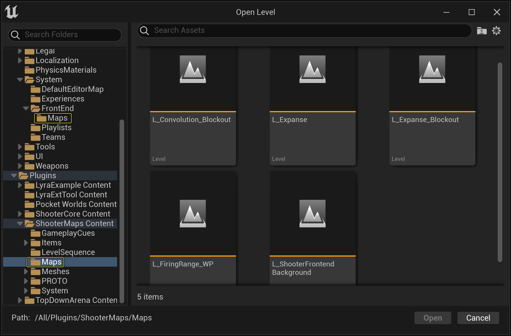
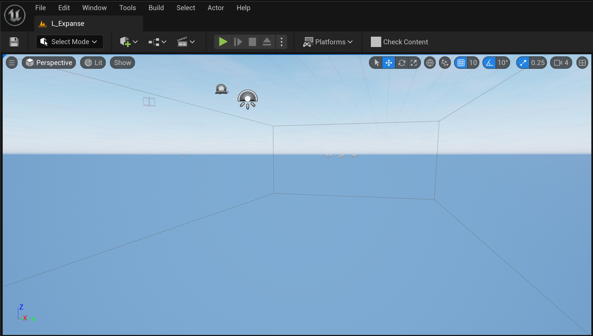
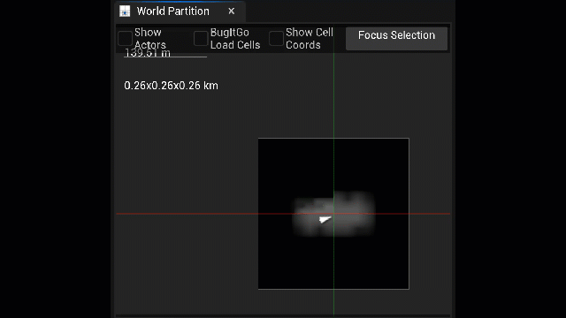
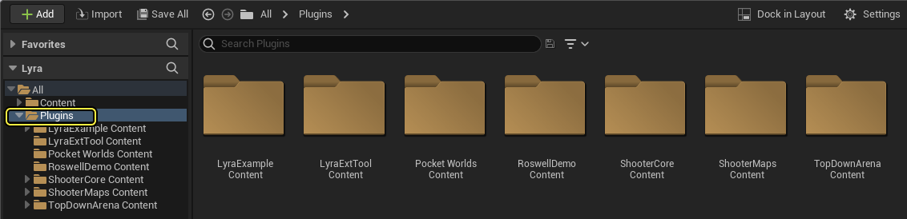
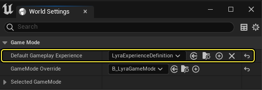

# UE5_Lyra学习指南_001_项目介绍

本文章仅为小刚-B站课堂-虚幻引擎视频课程Lyra-精讲的演讲手稿.
本套课程链接:[[UE5]虚幻引擎游戏案例Lyra精讲](https://www.bilibili.com/cheese/play/ss112001159)
前置课程链接:[[UE5]虚幻引擎UEC++从基础到进阶](https://www.bilibili.com/cheese/play/ss28043)

文章内容由小刚撰写,采用了以下多种方式:

1.口述转文字
2.AI重构
3.参考引擎源码
4.Lyra工程源码
5.结合社区论坛各位大佬的解析

可能存在内容不是完全准确,请以视频内容呈现为最终效果.

- [UE5\_Lyra学习指南\_001\_项目介绍](#ue5_lyra学习指南_001_项目介绍)
  - [简介](#简介)
    - [下载游戏](#下载游戏)
    - [下载适用于引擎源构建的Lyra](#下载适用于引擎源构建的lyra)
    - [运行游戏示例](#运行游戏示例)
    - [Lyra框架系统](#lyra框架系统)
    - [其他拓展链接](#其他拓展链接)
  - [项目概述](#项目概述)
    - [下载与安装](#下载与安装)
    - [项目结构与运行](#项目结构与运行)
    - [核心系统与插件](#核心系统与插件)
    - [功能模块](#功能模块)
    - [总结](#总结)
  - [参考文献:](#参考文献)

## 简介
Epic 的开发人员和美术人员制作了这些游戏示例项目，用于简化游戏，给予特定游戏类型快速的获取渠道。当然，这些并不是制作此类游戏的 唯一 方法，只是一种可能的做法。

他们希望用户们能够对这些示例分析后选取所需要的部分来使用。这些示例的文档都是为了这个目的来编写的，以帮助了解每个游戏是如何设计并制作的。用户可以自由选择在自己的游戏中使用哪些系统。

Lyra 是一款供你学习用的游戏示例，可以帮助你理解虚幻引擎5（UE5）的框架。其架构设计为模块化形式，包含一个核心系统和一些插件，它们会随着UE5的开发而定期更新。

跨平台兼容性和可扩展性。

对Epic在线服务和主机在线子系统的在线多人玩家和跨平台游戏支持。

可在三种不同的游戏模式之间选择：淘汰（团队死亡竞赛）、控制（捕获控制点）和爆炸器（自上而下的派对游戏）。

自定义的Gameplay技能系统。

Niagara FX。

项目的Gameplay概念的虚幻示意图形（UMG）控件类和UI图标，包括菜单设置、手柄按键摇杆，以及生命值、法力和武器的显示。这些UI功能是以模块化方式设计的，因此你可以独立于Lyra在自己的游戏中使用其系统。

优化的手工制作内容，包括移动动画资产、声音以及与Pawn兼容的武器系统。

新的UE5人体模型Manny和Quinn。这些人体模型是可操作角色，拥有与MetaHuman相同的核心骨架层级，并带有兼容的动画系统。
### 下载游戏

要安装Lyra初学者游戏示例项目，请按以下步骤操作：

1.通过 Fab 访问[Lyra初学者游戏示例](!https://www.fab.com/zh-cn/listings/93faede1-4434-47c0-85f1-bf27c0820ad0)，点击 添加到我的库（Add to My Library），让项目文件出现在 Epic Games启动程序 中。

或者，你也可以在UE的Fab插件中搜索该示例项目。

2.在 Epic Games启动程序 中，找到 虚幻引擎 > 库 > Fab库 以访问项目。

只有在你安装了兼容的引擎版本时，示例项目才会出现在 Fab库 中。

点击 创建项目（Create Project） 并按照屏幕上的提示下载示例并启动新项目。

关于访问示例内容及虚幻引擎的Fab插件，详见[示例与教程](https://dev.epicgames.com/documentation/zh-cn/unreal-engine/samples-and-tutorials-for-unreal-engine)。

### 下载适用于引擎源构建的Lyra
你可以下载虚幻引擎的源构建，具体方法请参阅[下载虚幻引擎源代码](https://dev.epicgames.com/documentation/zh-cn/unreal-engine/downloading-source-code-in-unreal-engine)。

完成虚幻引擎源构建的下载之后，需要下载Lyra并安装到自定义构建引擎的顶层目录中。在选择顶层目录之后，系统将会创建一个LyraStarterGame子目录，然后创建一个包含源代码和内容的LyraStarterGame.uproject文件。

要启动你安装的示例副本，可以双击.uproject文件，或者直接从启动程序的"库（Library）"选项卡中直接启动示例。

如果你使用的是自定义构建版本的引擎，那么可以重新创建项目文件，并在源代码编辑器中（例如Visual Studio）将Lyra作为项目进行启动。

如果右键点击LyraStarterGame.uproject文件，并且安装了多个副本，那么可以选择将其与其他已安装的引擎版本相关联，或者生成项目文件以便使用源代码编辑器编译。

### 运行游戏示例

在启动Lyra时，DefaultEditorOverview 关卡将会加载为 默认地图（Default Map） 。 在编辑器中，点击 在编辑器中运行（Play In Editor） (PIE) 可以启动默认关卡。

在PIE中时，你的玩家控制器将控制Lyra Pawn。在关卡中，将有多个门户加载到 体验（Experienece） 。

| 游戏模式地图 | 说明 | 内容文件路径 |
| ----------- | ----------- | ----------- |
| 控制（Control） | 和队友一起保护控制点，以提高得分并获胜。 | /ShooterMaps/Maps/L_Convolution_Blockout
| 淘汰（Elimination） | 在这个经典的正面交锋团队竞赛中寻找并淘汰足够的敌人以获胜。 | /ShooterMaps/Maps/L_Expanse
| 前端（Front End） | 包含Lyra示例游戏的主菜单。 | /Game/System/FrontEnd/Maps/L_LyraFrontEnd
| 默认地图（Default Map） | 用于测试ShooterCore插件功能的小型测试关卡。 | /Game/System/DefaultEditorMap/L_DefaultEditorOverview
| 射击训练场（Shooter Gym） | 在这个自上而下的派对游戏中摧毁路障，收集强化道具，避免被炸死。 | /ShooterCore/Maps/L_ShooterGym
| 爆炸器（Exploder） | 在这个自上而下的派对游戏中摧毁路障，收集强化道具，避免被炸死。 | /TopDownArena/Maps/L_TopDownArenaGym

依次点击 文件（File） > 打开关卡（Open Level） 并找到上面列出的内容文件路径，可以在编辑器中直接加载每种游戏模式的地图。

大部分地图都位于游戏功能插件内部。在首次加载 广阔区域（Expanse） 等地图时，编辑器视口（editor viewport） 将会是空的，因为它是 世界分区（World Partition） 地图。

要查看关卡Actor，在右下角的 世界分区（World Partition） 详细信息面板中点击并拖动，从而选择 世界分区网格单元 ，然后右键点击并选择 加载选定单元格（Load Selected Cells） 以加载地图的这一部分。

如果走入了默认地图上的相应门户，则在某个游戏模式关卡打开时使用PIE将会加载适当的游戏模式。

如需获得Lyra游戏地图和菜单的更多信息，请参阅[Lyra](https://dev.epicgames.com/documentation/zh-cn/unreal-engine/tour-of-lyra-in-unreal-engine)简介参考页面。

### Lyra框架系统
Lyra中利用了各种 Gameplay功能插件，这意味着内容文件夹仅包含常规资产和主大厅，但是，插件文件夹包含用于创建Lyra新手游戏的不同核心元素。

在大厅中选择游戏体验时，游戏将会加载所需的插件。例如，选择 广阔区域（Expanse） 团队死斗_ 将会为Pawn和机制加载 ShooterCore ，为关卡加载 ShooterMaps 。

| 插件文件夹名称 | 说明 |
| ----------- | ----------- |
| Lyra示例内容（Lyra Example Content） | 包含共享的材质，例如网格。 |
| 设计游戏核心内容（Shooter Core Content） | LyraShooterGame体验的核心元素。其中包括用于游戏模式的Gameplay逻辑、特定Gameplay能力（例如"猛冲"）	以及适用于各种Actor的蓝图，例如传送点和手雷、机器人、武器和用户界面元素。 |
| ShooterMaps元素（ShooterMaps Content） | LyraShooterGame（广阔区域和盘旋）使用的地图，具有关联的材质和内容。 |
| TopDownArena内容（TopDownArena Content） | TopDownArena体验的内容，包括从地图生成器到道具的各种内容。 |

体验是使用 LyraExperienceDefinition 类进行定义的。找到 工具栏（Toolbar） > 窗口（Window） > 世界设置（World Settings） > 游戏模式（Game Mode） ，可以在世界设置中访问 默认Gameplay体验（Default Gameplay Experience） 。

你可以将体验视为游戏模式的高级版本。插件中可以存在多种体验，例如"团队死斗"和"控制点"都使用ShooterCore插件，从同一个父类（B_LyraShooterGameVase ，这是LyraExperienceDefinition的子类）派生出来。

这些类包含Lyra的输入和gameplay机制中使用的信息。但是，其他选项则包含得分系统等信息（对于团队死斗，基于杀敌数量得分；而对于控制点，则基于占领事件得分）

### 其他拓展链接

[通用用户插件](https://dev.epicgames.com/documentation/zh-cn/unreal-engine/common-user-plugin-in-unreal-engine-for-lyra-sample-game)
通用用户插件在C++、蓝图脚本和在线子系统（OSS）或其他在线后端提供了一个通用接口。

[Lyra中的技能](https://dev.epicgames.com/documentation/zh-cn/unreal-engine/abilities-in-lyra-in-unreal-engine)
介绍Lyra如何将GAS系统用于游戏玩法。

[Lyra中的动画](https://dev.epicgames.com/documentation/zh-cn/unreal-engine/animation-in-lyra-sample-game-in-unreal-engine)
关于Lyra中动画系统的概述

[Lyra游戏设置](https://dev.epicgames.com/documentation/zh-cn/unreal-engine/lyra-sample-game-settings-in-unreal-engine)
Lyra游戏示例的游戏设置概述。

[Lyra中的几何体工具](https://dev.epicgames.com/documentation/zh-cn/unreal-engine/lyra-geometry-tools-in-unreal-engine)
概述如何在Lyra中使用几何体工具在蓝图中创建参数化关卡设计几何体对象，以及关卡设计师用于通过这些工具构建关卡的工作流程。

[Lyra输入设置](https://dev.epicgames.com/documentation/zh-cn/unreal-engine/lyra-input-settings-in-unreal-engine)
关于Lyra如何使用其输入设置系统解决许多常见输入配置设置的概述。

[Lyra交互系统](https://dev.epicgames.com/documentation/zh-cn/unreal-engine/lyra-sample-game-interaction-system-in-unreal-engine)
关于Lyra游戏示例的Lyra交互系统概述。

[Lyra物品栏和装备](https://dev.epicgames.com/documentation/zh-cn/unreal-engine/lyra-inventory-and-equipment-in-unreal-engine)
探索Lyra示例游戏中使用的物品栏和装备系统。

[Lyra可拓展性和设备描述](https://dev.epicgames.com/documentation/zh-cn/unreal-engine/scalability-and-device-profiles-in-lyra-sample-game-for-unreal-engine)
虚幻引擎的Lyra示例游戏中的可扩展性和设备描述

[Lyra之旅](https://dev.epicgames.com/documentation/zh-cn/unreal-engine/tour-of-lyra-in-unreal-engine)
虚幻引擎Lyra示例的参考页面

[将Lyra初学者包升级到最新引擎版本](https://dev.epicgames.com/documentation/zh-cn/unreal-engine/upgrading-the-lyra-starter-game-to-the-latest-engine-release-in-unreal-engine)
记录每个引擎版本对Lyra所做的主要更改，并载明信息来帮助你升级现有游戏，以便利用最新版本虚幻引擎5。

[将Epic在线服务用于Lyra](https://dev.epicgames.com/documentation/zh-cn/unreal-engine/using-lyra-with-epic-online-services-in-unreal-engine)
详细介绍如何通过Lyra示例游戏使用Epic在线服务。

## 项目概述
- **Lyra 版本**：当前版本为 5.6。  
- **项目目的**：由 Epic 开发人员和美术人员制作，用于简化特定游戏类型的快速开发渠道。  
  - 并非唯一方法，仅为一种可能的实现方式。  
  - 用户可自由选择所需部分使用。  
- **功能特点**：  
  - 模块化架构，包含核心系统和插件，定期随 UE5 更新。  
  - 跨平台兼容性和可拓展性，支持多人游戏和跨平台功能。  
  - 三种游戏模式：淘汰赛、控制点占领、爆炸器（派对游戏）。  
  - 自定义 Gameplay 技能系统、粒子系统、UMG 控件内核 UI。  
  - 手工制作内容：移动动画、资产、声音、武器系统等。  

---

### 下载与安装  
**方式一：通过 Epic 商城安装**  
1. 访问 Epic 商城，搜索 "Lyra"，找到 "Lyra Starter Game"。  
2. 点击“添加到我的库”，通过 Epic 启动程序下载。  
3. 安装兼容的引擎版本（如 5.6.0），注意勾选调试符号。  
4. 创建工程并命名为 "Lyra"。  

**注意事项**：  
- 若下载版本不符，可能是本地缓存问题，需清理缓存后重新下载。  

**方式二：源码构建（可选）**  
1. 下载 UE5 源码引擎（5.6 版本）。  
2. 从 Epic 商城下载 Lyra 的 Content 内容。  
3. 结合源码和 Content 构建项目。  

---

### 项目结构与运行  
- **默认地图**：启动后显示预览关卡（Default Atrium）。  
- **游戏模式选择**：  
  - Frontend：主菜单界面。  
  - Control：控制点占领模式。  
  - Elimination：淘汰赛模式。  
  - Shooter Jam：测试地图。  
  - Exploder：俯视角派对游戏。  
- **世界分区**：使用世界分区技术加载大地图内容。  

---

### 核心系统与插件  
- **Game Feature 架构**：  
  - UE5 新增的项目架构方式，插件内容反向引用主项目。  
  - 不同游戏模式通过插件实现，核心系统保持不变。  
- **Experience 系统**：  
  - 替代传统 GameMode，定义关卡玩法、输入和机制。  
  - 不同模式派生自同一核心，仅调整获胜条件和积分方式。  

---

### 功能模块  
1. **用户插件**：通用玩家接口（在线子系统等）。  
2. **技能系统**：基于 GAS（Gameplay Ability System）实现。  
3. **动画系统**：支持新 UE5 人体模型（MetaHuman 兼容）。  
4. **交互系统**：与场景交互（拾取、开关等）。  
5. **设备支持**：可拓展手柄和自定义设备接入。  

---

### 总结  

本节简要介绍了 Lyra 项目的背景、下载安装方法、核心架构及功能模块。后续将根据实际使用场景展开详细讲解。  

--- 

## 参考文献:

[Lyra官方文档](https://dev.epicgames.com/documentation/zh-cn/unreal-engine/lyra-sample-game-in-unreal-engine)