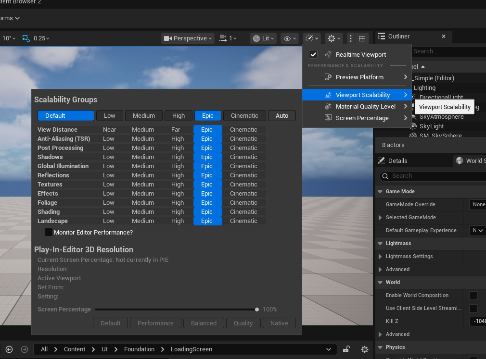

# UE5_Lyra学习指南_028_GameUserSettings

本文章仅为小刚-B站课堂-虚幻引擎视频课程Lyra-精讲的演讲手稿.  
本套课程链接:[[UE5]虚幻引擎游戏案例Lyra精讲](https://www.bilibili.com/cheese/play/ss112001159)  
前置课程链接:[[UE5]虚幻引擎UEC++从基础到进阶](https://www.bilibili.com/cheese/play/ss28043)  

文章内容由小刚撰写,采用了以下多种方式:  
1.口述转文字  
2.AI重构  
3.参考引擎源码  
4.Lyra工程源码  
5.结合社区论坛各位大佬的解析  

- [UE5\_Lyra学习指南\_028\_GameUserSettings](#ue5_lyra学习指南_028_gameusersettings)
	- [概述](#概述)
	- [配置位置](#配置位置)
	- [初始化位置](#初始化位置)
		- [读取ini配置](#读取ini配置)
		- [实例化](#实例化)
			- [堆栈](#堆栈)
			- [调用位置](#调用位置)
			- [访问引擎获取音频质量等级](#访问引擎获取音频质量等级)
	- [加载设置](#加载设置)
		- [恢复默认设置](#恢复默认设置)
		- [FQualityLevels](#fqualitylevels)
		- [加载持久化设置](#加载持久化设置)
			- [配置文件的路径](#配置文件的路径)
			- [Scalability::LoadState](#scalabilityloadstate)
	- [应用设置](#应用设置)
		- [调用堆栈](#调用堆栈)
		- [应用分辨率设置](#应用分辨率设置)
			- [请求修改分辨率](#请求修改分辨率)
		- [验证设置](#验证设置)
			- [Version](#version)
			- [修正分辨率](#修正分辨率)
		- [应用无分辨率设置](#应用无分辨率设置)
		- [保存设置](#保存设置)
	- [基础测试](#基础测试)
	- [总结](#总结)


## 概述
本节我们将探讨关于GameUserSettings的作用.
## 配置位置
DefaultEngine.ini
```ini
[/Script/Engine.Engine]
; 用户游戏设置所使用的类
GameUserSettingsClassName=/Script/LyraGame.LyraSettingsLocal
```
Engine.h
``` cpp
UCLASS(abstract, config=Engine, defaultconfig, transient, MinimalAPI)
class UEngine
	: public UObject
	, public FExec
{
	/** Sets the GameUserSettings class, which can be overridden to support game-specific options for Graphics/Sound/Gameplay. */
	/** 设置 GameUserSettings 类，该类可被重写以支持与游戏相关的特定图形、声音和游戏玩法选项。*/
	UPROPERTY(globalconfig, noclear, EditAnywhere, Category=DefaultClasses, meta=(MetaClass="/Script/Engine.GameUserSettings", DisplayName="Game User Settings Class", ConfigRestartRequired=true), AdvancedDisplay)
	FSoftClassPath GameUserSettingsClassName;

	UPROPERTY()
	TSubclassOf<class UGameUserSettings> GameUserSettingsClass;
}
```
## 初始化位置
### 读取ini配置
UnrealEngine.cpp 3374行
``` cpp
/**
* Loads all Engine object references from their corresponding config entries.
* 加载所有引擎对象的引用，这些引用来自其对应的配置项。
*/
void UEngine::InitializeObjectReferences()
{
	// ...
	LoadEngineClass<UConsole>(ConsoleClassName, ConsoleClass);
	LoadEngineClass<UGameViewportClient>(GameViewportClientClassName, GameViewportClientClass);
	LoadEngineClass<ULocalPlayer>(LocalPlayerClassName, LocalPlayerClass);
	LoadEngineClass<AWorldSettings>(WorldSettingsClassName, WorldSettingsClass);
	LoadEngineClass<UNavigationSystemBase>(NavigationSystemClassName, NavigationSystemClass);
	LoadEngineClass<UNavigationSystemConfig>(NavigationSystemConfigClassName, NavigationSystemConfigClass);
	if (AvoidanceManagerClassName.IsValid())
	{
		LoadEngineClass<UAvoidanceManager>(AvoidanceManagerClassName, AvoidanceManagerClass);
	}
	LoadEngineClass<UGameUserSettings>(GameUserSettingsClassName, GameUserSettingsClass);
	LoadEngineClass<ALevelScriptActor>(LevelScriptActorClassName, LevelScriptActorClass);

	// ...
}

```
### 实例化

UnrealEngine.cpp - 17485行
``` cpp
void UEngine::CreateGameUserSettings()
{
	UGameUserSettings::LoadConfigIni();
	GameUserSettings = NewObject<UGameUserSettings>(GetTransientPackage(), GEngine->GameUserSettingsClass);
	GameUserSettings->SetToDefaults();
	GameUserSettings->LoadSettings();
}
```
#### 堆栈
引擎初始化调用.在第一次调用中,如果没有就去实例化
``` txt
UEngine::CreateGameUserSettings() UnrealEngine.cpp:17487
UEngine::GetGameUserSettings() UnrealEngine.cpp:17507
FAudioDevice::GetQualityLevelSettings() AudioDevice.cpp:463
FAudioDeviceManager::FAudioDeviceContainer::FAudioDeviceContainer(const FAudioDeviceParams &, unsigned int, FAudioDeviceManager *) AudioDeviceManager.cpp:1601
FAudioDeviceManager::CreateNewDevice(const FAudioDeviceParams &) AudioDeviceManager.cpp:512
FAudioDeviceManager::RequestAudioDevice(const FAudioDeviceParams &) AudioDeviceManager.cpp:310
FAudioDeviceManager::CreateMainAudioDevice() AudioDeviceManager.cpp:456
UEngine::InitializeAudioDeviceManager() UnrealEngine.cpp:3867
UEngine::Init(IEngineLoop *) UnrealEngine.cpp:2288
UEditorEngine::InitEditor(IEngineLoop *) EditorEngine.cpp:950
UEditorEngine::Init(IEngineLoop *) EditorEngine.cpp:1311
UUnrealEdEngine::Init(IEngineLoop *) UnrealEdEngine.cpp:93
ULyraEditorEngine::Init(IEngineLoop *) LyraEditorEngine.cpp:27
FEngineLoop::Init() LaunchEngineLoop.cpp:4571
EditorInit(IEngineLoop &) UnrealEdGlobals.cpp:167
GuardedMain(const wchar_t *) Launch.cpp:164
LaunchWindowsStartup(HINSTANCE__ *, HINSTANCE__ *, char *, int, const wchar_t *) LaunchWindows.cpp:271
WinMain(HINSTANCE__ *, HINSTANCE__ *, char *, int) LaunchWindows.cpp:339
```
#### 调用位置
在UnrealEngine.cpp-2288行初始化音频设备
``` cpp
void UEngine::Init(IEngineLoop* InEngineLoop)
{
	// Initialize the audio device after a world context is setup
	// 在世界上下文中设置完成后，初始化音频设备
	InitializeAudioDeviceManager();
}
```

在UnrealEngine.cpp-3863行创建主要音频设备
``` cpp
void UEngine::InitializeAudioDeviceManager()
{
	FAudioDeviceManager::Initialize();
	AudioDeviceManager = FAudioDeviceManager::Get();
	if (AudioDeviceManager)
	{
		AudioDeviceManager->CreateMainAudioDevice();
		MainAudioDeviceHandle = AudioDeviceManager->GetMainAudioDeviceHandle();
	}
}
```
AudioDeviceManager.cpp
这部分代码可以忽略.主要是在这个过程中会去请求当前的音频级别访问到了我们的设置
``` cpp
bool FAudioDeviceManager::CreateMainAudioDevice()
{
	if (!MainAudioDeviceHandle)
	{
		// Initialize the main audio device.
		FAudioDeviceParams MainDeviceParams;
		MainDeviceParams.Scope = EAudioDeviceScope::Shared;
		MainDeviceParams.bIsNonRealtime = false;
		MainDeviceParams.AssociatedWorld = GWorld;

		MainAudioDeviceHandle = RequestAudioDevice(MainDeviceParams);
	}
	// ....
}
FAudioDeviceHandle FAudioDeviceManager::RequestAudioDevice(const FAudioDeviceParams& InParams)
{
	FScopeLock ScopeLock(&DeviceMapCriticalSection);
	
	// If the device class is not multiclient capable then fall back to sharing the device.
	// Note that this ignores the bCreateNewAudioDeviceForPlayInEditor editor pref.
	if (InParams.Scope == EAudioDeviceScope::Unique && AudioDeviceModule->IsAudioDeviceClassMulticlient())
	{
		return CreateNewDevice(InParams);
	}
	else
	{
		// See if we already have a device we can use.
		for (auto& Device : Devices)
		{
			if (CanUseAudioDevice(InParams, Device.Value))
			{
				RegisterWorld(InParams.AssociatedWorld, Device.Key);
				return BuildNewHandle(Device.Value, Device.Key, InParams);
			}
		}

		// If we did not find a suitable device, build one.
		return CreateNewDevice(InParams);
	}
}
FAudioDeviceHandle FAudioDeviceManager::CreateNewDevice(const FAudioDeviceParams& InParams)
{
	const Audio::FDeviceId DeviceID = GetNewDeviceID();

	FString DeviceInfo = AudioDeviceManagerUtils::PrintDeviceInfo(DeviceID, InParams.Scope, InParams.bIsNonRealtime);
	UE_LOG(LogAudio, Display, TEXT("Creating Audio Device: %s"), *DeviceInfo);
	Devices.Emplace(DeviceID, FAudioDeviceContainer(InParams, DeviceID, this));
}
```

``` cpp
FAudioDeviceManager::FAudioDeviceContainer::FAudioDeviceContainer(const FAudioDeviceParams& InParams, Audio::FDeviceId InDeviceID, FAudioDeviceManager* DeviceManager)
	: NumberOfHandlesToThisDevice(0)
	, Scope(InParams.Scope)
	, bIsNonRealtime(InParams.bIsNonRealtime)
	, SpecifiedModule(InParams.AudioModule)
{
	// ....
	// Set to highest max channels initially provided by any quality setting, so that
	// setting to lower quality but potentially returning to higher quality later at
	// runtime is supported.
	const int32 HighestMaxChannels = GetDefault<UAudioSettings>()->GetHighestMaxChannels();
	if (Device->Init(InDeviceID, HighestMaxChannels, InParams.BufferSizeOverride, InParams.NumBuffersOverride))
	{
		const FAudioQualitySettings& QualitySettings = Device->GetQualityLevelSettings();
		Device->SetMaxChannels(QualitySettings.MaxChannels);
		Device->FadeIn();
	}
	else
	{
		UE_LOG(LogAudio, Warning, TEXT("FAudioDevice::Init Failed!"));
		Device->Teardown();
		delete Device;
		Device = nullptr;
	}
}
```
#### 访问引擎获取音频质量等级
就是在这里请求的
``` cpp
const FAudioQualitySettings& FAudioDevice::GetQualityLevelSettings()
{
	const UAudioSettings* AudioSettings = GetDefault<UAudioSettings>();
	const int32 QualityLevel = GEngine ? GEngine->GetGameUserSettings()->GetAudioQualityLevel() : 0;
	return AudioSettings->GetQualityLevelSettings(QualityLevel);
}
```
实例化的位置!
``` cpp
void UEngine::CreateGameUserSettings()
{
	UGameUserSettings::LoadConfigIni();
	GameUserSettings = NewObject<UGameUserSettings>(GetTransientPackage(), GEngine->GameUserSettingsClass);
	GameUserSettings->SetToDefaults();
	GameUserSettings->LoadSettings();
}

const UGameUserSettings* UEngine::GetGameUserSettings() const
{
	if (GameUserSettings == NULL)
	{
		UEngine* ConstThis = const_cast< UEngine* >( this );	// Hack because Header Generator doesn't yet support mutable keyword
		ConstThis->CreateGameUserSettings();
	}
	return GameUserSettings;
}
```

``` cpp
	/** Returns the user's audio quality level setting */
	UFUNCTION(BlueprintPure, Category=Settings)
	int32 GetAudioQualityLevel() const { return AudioQualityLevel; }

```
## 加载设置
``` cpp
/**
 * Stores user settings for a game (for example graphics and sound settings), with the ability to save and load to and from a file.
 * 为游戏保存用户设置（例如图形和声音设置），并具备将设置保存至文件、从文件加载设置以及从文件中加载并应用设置的功能。
 */
UCLASS(config=GameUserSettings, configdonotcheckdefaults, MinimalAPI)
class UGameUserSettings : public UObject
{
	GENERATED_UCLASS_BODY()

	// ...

	UFUNCTION(BlueprintCallable, Category=Settings)
	ENGINE_API virtual void SetToDefaults();
	
	// ...

	/** Loads the user settings from persistent storage */
	/** 从持久存储中加载用户设置 */
	UFUNCTION(BlueprintCallable, Category=Settings)
	ENGINE_API virtual void LoadSettings(bool bForceReload = false);


}
```
### 恢复默认设置


GameUserSettings.ini
此处列举一个ini文件作为对照参考.
注意这个里面的设置是经过LyraSettingsLocal拓展之后的.
然后这个文件的位置是在Saved目录下.
Gyra\Saved\Config\WindowsEditor.
[Gyra项目是以Lyra项目为基础,魔改开发的.此处只是为了方便顺手 找的文件.]
``` ini
;METADATA=(Diff=true, UseCommands=true)
[/Script/GyraGame.GyraSettingsLocal]
DisplayStatList=()
DisplayGamma=2.200000
FrameRateLimit_OnBattery=60.000000
FrameRateLimit_InMenu=144.000000
FrameRateLimit_WhenBackgrounded=30.000000
MobileFrameRateLimit=30
UserChosenDeviceProfileSuffix=
bUseHeadphoneMode=False
bUseHDRAudioMode=False
AudioOutputDeviceId=
OverallVolume=1.000000
MusicVolume=1.000000
SoundFXVolume=1.000000
DialogueVolume=1.000000
VoiceChatVolume=1.000000
SafeZoneScale=-1.000000
ControllerPlatform=None
ControllerPreset=Default
InputConfigName=Default
bShouldAutoRecordReplays=False
NumberOfReplaysToKeep=5
bUseVSync=False
bUseDynamicResolution=False
ResolutionSizeX=1920
ResolutionSizeY=1080
LastUserConfirmedResolutionSizeX=1920
LastUserConfirmedResolutionSizeY=1080
WindowPosX=-1
WindowPosY=-1
FullscreenMode=1
LastConfirmedFullscreenMode=1
PreferredFullscreenMode=1
Version=5
AudioQualityLevel=0
LastConfirmedAudioQualityLevel=0
FrameRateLimit=0.000000
DesiredScreenWidth=1280
DesiredScreenHeight=720
LastUserConfirmedDesiredScreenWidth=1280
LastUserConfirmedDesiredScreenHeight=720
LastRecommendedScreenWidth=-1.000000
LastRecommendedScreenHeight=-1.000000
LastCPUBenchmarkResult=-1.000000
LastGPUBenchmarkResult=-1.000000
LastGPUBenchmarkMultiplier=1.000000
bUseHDRDisplayOutput=False
HDRDisplayOutputNits=1000

[/Script/Engine.GameUserSettings]
bUseDesiredScreenHeight=False

```

``` cpp

void UGameUserSettings::SetToDefaults()
{
	/** 游戏屏幕的分辨率宽度（以像素为单位）。*/
	ResolutionSizeX = LastUserConfirmedResolutionSizeX = GetDefaultResolution().X;
	/** 游戏屏幕分辨率的高度（以像素为单位）。*/
	ResolutionSizeY = LastUserConfirmedResolutionSizeY = GetDefaultResolution().Y;

	// 禁用过期警告
	PRAGMA_DISABLE_DEPRECATION_WARNINGS
	/** Window PosX */
	// 	UE_DEPRECATED(5.6, "Use the WindowPositions array instead.")
	WindowPosX_DEPRECATED = GetDefaultWindowPosition().X;
	/** Window PosX */
	//	UE_DEPRECATED(5.6, "Use the WindowPositions array instead.")
	WindowPosY_DEPRECATED = GetDefaultWindowPosition().Y;
	PRAGMA_ENABLE_DEPRECATION_WARNINGS

	/** 存储的窗口位置。多个实例同时运行时可以使用不同的位置。*/
	WindowPositions.Reset();

	/**
	* 游戏窗口全屏模式
	* 0 = 全屏模式
	* 1 = 窗口式全屏模式
	* 2 = 窗口式模式
	*/
	FullscreenMode = GetDefaultWindowMode();

	/** 帧率限制 */
	FrameRateLimit = 0.0f;
		// 禁用过期警告
	PRAGMA_DISABLE_DEPRECATION_WARNINGS
	/** 我们在当前显示模式下允许的最小分辨率缩放比例 */
	// 	UE_DEPRECATED(5.3, "MinResolutionScale is now always Scalability::MinResolutionScale=0 that fallbacks to default project wide behavior defined by r.ScreenPercentage.Default")
	MinResolutionScale = Scalability::MinResolutionScale;
	PRAGMA_ENABLE_DEPRECATION_WARNINGS

	/** 用户更改显示模式时用于计算分辨率缩放比例所需的期望屏幕宽度 */
	DesiredScreenWidth = 1280;
	/** 用户更改显示模式时用于计算分辨率缩放比例所需的期望屏幕高度 */
	DesiredScreenHeight = 720;

	/** 用户更改显示模式时用于计算分辨率缩放比例所需的期望屏幕宽度 */
	LastUserConfirmedDesiredScreenWidth = DesiredScreenWidth;
	/** 用户更改显示模式时用于计算分辨率缩放比例所需的期望屏幕高度 */
	LastUserConfirmedDesiredScreenHeight = DesiredScreenHeight;

	/** 最后一次基准测试的结果（CPU）；若未进行过基准测试，则显示 -1 */
	LastCPUBenchmarkResult = -1.0f;
	/** 最后一次基准测试的结果（使用 GPU）；若未进行过基准测试，则显示 -1 */
	LastGPUBenchmarkResult = -1.0f;

	/** 最后一次 CPU 基准测试中每个单独子部分的结果；若未进行过基准测试，则该部分为空 */
	LastCPUBenchmarkSteps.Empty();
	/** 最后一次 GPU 基准测试中每个单独子部分的结果；若未进行过基准测试，则该部分为空 */
	LastGPUBenchmarkSteps.Empty();

	/**
	 * 用于最后一轮 GPU 测试的乘数值
	 */
	LastGPUBenchmarkMultiplier = 1.0f;

	/** 最后一次基准测试的结果；计算出的应使用的分辨率。*/
	LastRecommendedScreenWidth = -1.0f;

	/** 最后一次基准测试的结果；计算出的应使用的分辨率。*/
	LastRecommendedScreenHeight = -1.0f;


	/** 用于在窗口模式与全屏模式之间切换时所采用的全屏模式。其值与 r.FullScreenMode 中的值相同。*/
	static const auto CVar = IConsoleManager::Get().FindTConsoleVariableDataInt(TEXT("r.FullScreenMode"));
	PreferredFullscreenMode = CVar->GetValueOnGameThread();

	// 为用户界面缓存，若存储在控制台变量中则为当前状态
	ScalabilityQuality.SetDefaults();

	/**
	* 检查此应用程序是否能够进行任何渲染操作。
	* 某些应用程序类型永远不会进行渲染，而对于其他应用程序，其这种行为可以通过切换至 NullRHI 来控制。
	* 这可用于做出诸如忽略在服务器或在无窗口模式下运行的游戏中的无意义代码路径之类的决策（例如自动化测试）。
	*
	* 如果应用程序能够进行渲染，则返回 true，否则返回 false。
	*/
	if (FApp::CanEverRender())
	{
		// 更新分辨率质量
		UpdateResolutionQuality();
	}

	/** 是否启用动态分辨率功能？（设为公开属性以便用户界面能够与之连接） */
	bUseDynamicResolution = false;

	/** HDR */
	bUseHDRDisplayOutput = FPlatformMisc::UseHDRByDefault();

	/** HDR */
	HDRDisplayOutputNits = 1000;
}

```


### FQualityLevels
``` cpp
namespace Scalability
{ 
/**
* 用于保存引擎可扩展性组状态的结构
* 通过“GetQualityLevels()”方法可以获取的实际引擎状态。
* 
**/
	/**
	 * Structure for holding the state of the engine scalability groups
	 * Actual engine state you can get though GetQualityLevels().
	**/
	struct FQualityLevels
	{
		float ResolutionQuality;
		int32 ViewDistanceQuality;
		int32 AntiAliasingQuality;
		int32 ShadowQuality;
		int32 GlobalIlluminationQuality;
		int32 ReflectionQuality;
		int32 PostProcessQuality;
		int32 TextureQuality;
		int32 EffectsQuality;
		int32 FoliageQuality;
		int32 ShadingQuality;
		int32 LandscapeQuality;

		float CPUBenchmarkResults;
		float GPUBenchmarkResults;
		TArray<float> CPUBenchmarkSteps;
		TArray<float> GPUBenchmarkSteps;
		//  ......

		// Sets all other settings based on an overall value
		// @param Value 0:low, 1:medium, 2:high, 3:epic, 4:cinematic (gets clamped if needed)
		// 根据总体值设置所有其他设置
		// @参数 值 0：低，1：中等，2：高，3：史诗级，4：电影级（如有需要会进行限制）
		ENGINE_API void SetFromSingleQualityLevel(int32 Value);
		// ....
		// Sets view distance quality
		// @param Value 0:low, 1:medium, 2:high, 3:epic, 4:cinematic (gets clamped if needed)
		// 设置视图距离质量
		// @参数 值 0：低，1：中等，2：高，3：史诗级，4：电影级（如需调整则会进行限制）
		// ....
		ENGINE_API void SetViewDistanceQuality(int32 Value);

	}
}


```
编辑器对照图片如下:



### 加载持久化设置
注释这里这是加载设置得一个位置.但是并没有真正应用设置.应用设置在后面
``` cpp
/** 从持久存储中加载用户设置 */
void UGameUserSettings::LoadSettings(bool bForceReload/*=false*/)
{
	/**
	 *	#define QUICK_SCOPE_CYCLE_COUNTER(Stat) \
	 *	DECLARE_SCOPE_CYCLE_COUNTER(TEXT(#Stat),Stat,STATGROUP_Quick)
	 *	记录代码块执行时间得宏
	 */
	QUICK_SCOPE_CYCLE_COUNTER(GameUserSettings_LoadSettings);

	// 是否强制重载
	if (bForceReload)
	{	
		/** 我们这样做是为了从监听的云子系统中读取配置文件内容，然后再打开它。*/
        if (OnUpdateGameUserSettingsFileFromCloud.IsBound())
        {
			// 这个路径就是Saved路径. 在后面得代码块展开看.
            FString IniFileLocation = FPaths::GeneratedConfigDir() + UGameplayStatics::GetPlatformName() + "/" +  GGameUserSettingsIni + ".ini";
            UE_LOG(LogGameUserSettings, Verbose, TEXT("%s"), *IniFileLocation);

            if (!OnUpdateGameUserSettingsFileFromCloud.Execute(FString(*IniFileLocation)))
            {
                UE_LOG(LogGameUserSettings, Warning, TEXT("Failed to read the ini file from the Cloud interface %s"), *IniFileLocation);
            }
        }
        /** 将用户 .ini 文件中的设置加载到 GConfig 中 */
		LoadConfigIni(bForceReload);
	}
	// 从一个.ini 文件中导入属性值。
	LoadConfig(GetClass(), *GGameUserSettingsIni);

	// Note: Scalability::LoadState() should not be needed as we already loaded the settings earlier (needed so the engine can startup with that before the game is initialized)
	// 注意：无需调用 Scalability::LoadState() 函数，因为我们之前已经加载了相关设置（这样做是为了让引擎在游戏初始化之前就能使用这些设置启动）
	// 后续代码块会给大家展示是在int32 FEngineLoop::PreInitPreStartupScreen(const TCHAR* CmdLine)已经调用了
	ScalabilityQuality = Scalability::GetQualityLevels();

	// Allow override using command-line settings
	// 允许通过命令行设置进行覆盖操作
	bool bDetectingResolution = ResolutionSizeX == 0 || ResolutionSizeY == 0;

	if (bDetectingResolution)
	{
		/** 将当前视频模式设置（全屏模式/分辨率）标记为用户已确认的设置 */
		ConfirmVideoMode();
	}

	// Update r.FullScreenMode CVar
	// 更新全屏模式的 CVar 变量 r.FullScreenMode
	SetPreferredFullscreenMode(PreferredFullscreenMode);

	// Window position backwards compatability
	// 窗口位置的向后兼容性
	PRAGMA_DISABLE_DEPRECATION_WARNINGS
	const FIntPoint OldWindowPosition(WindowPosX_DEPRECATED, WindowPosY_DEPRECATED);
	PRAGMA_ENABLE_DEPRECATION_WARNINGS

	if (OldWindowPosition != GetDefaultWindowPosition())
	{
		if (WindowPositions.IsEmpty())
		{
			WindowPositions.SetNum(1);
		}
		WindowPositions[0] = OldWindowPosition;

		// Write out the non-deprecated value
		// 输出未被弃用的值
		SaveConfig(CPF_Config, *GGameUserSettingsIni);
	}
}

```


#### 配置文件的路径
``` cpp

FString FPaths::GeneratedConfigDir()
{
	return FPlatformMisc::GeneratedConfigDir();
}
const TCHAR* FGenericPlatformMisc::GeneratedConfigDir()
{
	static FString Dir = FPaths::ProjectSavedDir() / TEXT("Config/");
	return *Dir;
}

```

#### Scalability::LoadState
``` cpp
int32 FEngineLoop::PreInit(const TCHAR* CmdLine)
{
	// ....
	FBootProfiling::InitCounters();

	const int32 rv1 = PreInitPreStartupScreen(CmdLine);
	if (rv1 != 0)
	{
		PreInitContext.Cleanup();
		return rv1;
	}

	const int32 rv2 = PreInitPostStartupScreen(CmdLine);
	if (rv2 != 0)
	{
		PreInitContext.Cleanup();
		return rv2;
	}

	return 0;
}
int32 FEngineLoop::PreInitPreStartupScreen(const TCHAR* CmdLine)
{
			// ...
		{
			SCOPED_BOOT_TIMING("Scalability::LoadState");
			// As early as possible to avoid expensive re-init of subsystems,
			// after SystemSettings.ini file loading so we get the right state,
			// before ConsoleVariables.ini so the local developer can always override.
			// after InitializeCVarsForActiveDeviceProfile() so the user can override platform defaults
			// 应尽早执行，以避免对子系统进行昂贵的重新初始化操作，
			// 在加载 SystemSettings.ini 文件之后，这样我们就能获得正确的状态，
			// 在 ConsoleVariables.ini 文件之前，以便本地开发人员能够随时进行覆盖。
			// 在 InitializeCVarsForActiveDeviceProfile() 之后，这样用户就能覆盖平台默认设置。
			Scalability::LoadState((bHasEditorToken && !GEditorSettingsIni.IsEmpty()) ? GEditorSettingsIni : GGameUserSettingsIni);
		}
		// ...
}		
```

## 应用设置
### 调用堆栈
应用设置得堆栈
``` txt
UEditorEngine::Init(IEngineLoop *) EditorEngine.cpp:1338
UUnrealEdEngine::Init(IEngineLoop *) UnrealEdEngine.cpp:93
ULyraEditorEngine::Init(IEngineLoop *) LyraEditorEngine.cpp:27
FEngineLoop::Init() LaunchEngineLoop.cpp:4571
EditorInit(IEngineLoop &) UnrealEdGlobals.cpp:167
GuardedMain(const wchar_t *) Launch.cpp:164
LaunchWindowsStartup(HINSTANCE__ *, HINSTANCE__ *, char *, int, const wchar_t *) LaunchWindows.cpp:271
WinMain(HINSTANCE__ *, HINSTANCE__ *, char *, int) LaunchWindows.cpp:339

```
EditorEngine.cpp-1336行
``` cpp
void UEditorEngine::Init(IEngineLoop* InEngineLoop)
{
	// ....

	// Init editor.
	SlowTask.EnterProgressFrame(40);
	GEditor = this;
	InitEditor(InEngineLoop);

	LoadEditorFeatureLevel();

	// ....

	// Load game user settings and apply
	UGameUserSettings* MyGameUserSettings = GetGameUserSettings();
	if (MyGameUserSettings)
	{
		MyGameUserSettings->LoadSettings();
		MyGameUserSettings->ApplySettings(true);
	}

	UEditorStyleSettings* Settings = GetMutableDefault<UEditorStyleSettings>();
	Settings->OnSettingChanged().AddUObject(this, &UEditorEngine::HandleSettingChanged);
}	

```

``` cpp

void UGameUserSettings::ApplySettings(bool bCheckForCommandLineOverrides)
{
	{
		// Push recreate render state context to force single recreate instead of multiple recreates for each changed cvar
		// 将重置渲染状态上下文的操作发送出去，以强制进行一次重置操作，而非针对每个更改的控制变量分别进行多次重置操作。
		
		/** 会销毁所有组件的渲染状态，或者销毁指定的一组组件的渲染状态，然后在该对象被销毁时重新创建这些状态 */
		FGlobalComponentRecreateRenderStateContext Context;
		// 应用分辨率设置
		ApplyResolutionSettings(bCheckForCommandLineOverrides);
		
		// 应用无分辨率设置
		ApplyNonResolutionSettings();
	}
	// 请求UI更新激活代理
	RequestUIUpdate();
	/** 将用户设置保存至持久存储中（此操作会自动作为“应用设置”流程的一部分进行） */
	SaveSettings();
}

```
### 应用分辨率设置
``` cpp
void UGameUserSettings::ApplyResolutionSettings(bool bCheckForCommandLineOverrides)
{
	// 只有客户端才有渲染画面的需求
#if !UE_SERVER
	QUICK_SCOPE_CYCLE_COUNTER(GameUserSettings_ApplyResolutionSettings);

	// 固定分辨率 无须进行任何操作
	if (FPlatformProperties::HasFixedResolution())
	{
		return;
	}
	/** 对用户设置进行验证，并将无效的设置重置为默认值。如需删除过时的用户设置文件，则会执行相应操作。*/
	ValidateSettings();

	// 获取窗口设置
	EWindowMode::Type NewFullscreenMode = GetFullscreenMode();

	// Request a resolution change
	// 请求更改解决方案
	/** 请求对指定的分辨率和窗口模式进行更改。可选地，还可以应用命令行参数进行覆盖。*/
	RequestResolutionChange(ResolutionSizeX, ResolutionSizeY, NewFullscreenMode, bCheckForCommandLineOverrides);

	if (NewFullscreenMode == EWindowMode::Fullscreen || NewFullscreenMode == EWindowMode::WindowedFullscreen)
	{
		SetPreferredFullscreenMode(NewFullscreenMode == EWindowMode::Fullscreen ? 0 : 1);
	}
	/**
	只有在自上次操作后有更改发生的情况下才会调用这些函数。
	应该在极少数情况下调用这些函数：
	- 在加载初始化文件之后
	- 在用户通过控制台输入操作之后
	- 当用户主动更改了控制台变量（需要向用户明确说明 cvar 可以改变，例如游戏选项菜单）
	- 在每一轮循环开始时（以捕获意外的 Set() 调用，这类调用通常是不好的做法）
	*/
	IConsoleManager::Get().CallAllConsoleVariableSinks();
#endif
}
```

#### 请求修改分辨率
``` cpp
void UGameUserSettings::RequestResolutionChange(int32 InResolutionX, int32 InResolutionY, EWindowMode::Type InWindowMode, bool bInDoOverrides /* = true */)
{
	if (FPlatformProperties::HasFixedResolution())
	{
		return;
	}

	if (bInDoOverrides)
	{
		/**
		* 如果在命令行中指定了任何覆盖设置，则会修改游戏窗口的分辨率设置
		* 并且覆盖设置已启用（请参阅“启用游戏窗口设置覆盖”）*
		* @参数 ResolutionX	（输入/输出）游戏窗口的宽度（以像素为单位）
		* @参数 ResolutionY	（输入/输出）游戏窗口的高度（以像素为单位）
		* @参数 WindowMode	（输入/输出）游戏应处于何种窗口模式
		*/
		UGameEngine::ConditionallyOverrideSettings(InResolutionX, InResolutionY, InWindowMode);
	}

	FSystemResolution::RequestResolutionChange(InResolutionX, InResolutionY, InWindowMode);
}
```
我们主要看这个命令.此处不再继续延申.
``` cpp
// Helper function for changing system resolution via the r.setres console command
// 用于通过“r.setres”控制台命令更改系统分辨率的辅助函数
void FSystemResolution::RequestResolutionChange(int32 InResX, int32 InResY, EWindowMode::Type InWindowMode)
{
	if (FPlatformMisc::FullscreenSameAsWindowedFullscreen() && (InWindowMode == EWindowMode::Fullscreen))
	{
		InWindowMode = EWindowMode::WindowedFullscreen;
	}

	FString WindowModeSuffix;
	switch (InWindowMode)
	{
	case EWindowMode::Windowed:
	{
		WindowModeSuffix = TEXT("w");
	} break;
	case EWindowMode::WindowedFullscreen:
	{
		WindowModeSuffix = TEXT("wf");
	} break;
	case EWindowMode::Fullscreen:
	{
		WindowModeSuffix = TEXT("f");
	} break;
	}

	FString NewValue = FString::Printf(TEXT("%dx%d%s"), InResX, InResY, *WindowModeSuffix);
	CVarSystemResolution->SetWithCurrentPriority(*NewValue);
}
```
``` cpp
static FAutoConsoleVariable CVarSystemResolution(
	TEXT("r.SetRes"),
	TEXT("1280x720w"),
	TEXT("Set the display resolution for the current game view. Has no effect in the editor.\n")
	TEXT("e.g. 1280x720w for windowed\n")
	TEXT("     1920x1080f for fullscreen\n")
	TEXT("     1920x1080wf for windowed fullscreen\n")
);

```
### 验证设置
``` cpp

void UGameUserSettings::ValidateSettings()
{
	// Should we wipe all user settings?
	// 我们是否应该清除所有用户设置？
	if (!IsVersionValid())
	{
		// First try loading the settings, if they haven't been loaded before.
		// 首先尝试加载设置，如果这些设置之前尚未被加载过的话。
		LoadSettings(true);

		// If it still an old version, delete the user settings file and reload defaults.
		// 如果仍是旧版本，则删除用户设置文件并重新加载默认设置。
		if (!IsVersionValid())
		{
			// Force reset if there aren't any default .ini settings.
			// 若不存在任何默认的 .ini 设置，则强制重置。
			SetToDefaults();
			static const auto CVarVSync = IConsoleManager::Get().FindTConsoleVariableDataInt(TEXT("r.VSync"));
			SetVSyncEnabled(CVarVSync->GetValueOnGameThread() != 0);

			if (GEngine)
			{
				SetDynamicResolutionEnabled(GEngine->GetDynamicResolutionUserSetting());
			}

			FConfigBranch* Branch = GConfig->FindBranch(FName("GameUserSettings"), FString());
			Branch->Delete();

			LoadSettings(true);
		}
	}

	if (ResolutionSizeX <= 0 || ResolutionSizeY <= 0)
	{
		SetScreenResolution(FIntPoint(GSystemResolution.ResX, GSystemResolution.ResY));

		// Set last confirmed video settings
		// 设置最后确认的视频设置
		LastConfirmedFullscreenMode = FullscreenMode;
		LastUserConfirmedResolutionSizeX = ResolutionSizeX;
		LastUserConfirmedResolutionSizeY = ResolutionSizeY;
	}

	const int32 ScreenWidth = (FullscreenMode == EWindowMode::WindowedFullscreen) ? GetDesktopResolution().X : ResolutionSizeX;
	const int32 ScreenHeight = (FullscreenMode == EWindowMode::WindowedFullscreen) ? GetDesktopResolution().Y : ResolutionSizeY;
	const int32 ClampedWidth = (ScreenWidth > 0 && DesiredScreenWidth > ScreenWidth) ? ScreenWidth : DesiredScreenWidth;
	const int32 ClampedHeight = (ScreenHeight > 0 && DesiredScreenHeight > ScreenHeight) ? ScreenHeight : DesiredScreenHeight;

	LastUserConfirmedDesiredScreenWidth = DesiredScreenWidth;
	LastUserConfirmedDesiredScreenHeight = DesiredScreenHeight;


	// We do not modify the user setting on console if HDR is not supported
	// 若不支持高动态范围功能，则不会在控制台中修改用户设置
	if (!FPlatformMisc::UseHDRByDefault())
	{
		if (bUseHDRDisplayOutput && !SupportsHDRDisplayOutput())
		{
			bUseHDRDisplayOutput = false;
		}
	}

	LastConfirmedAudioQualityLevel = AudioQualityLevel;

	// The user settings have now been validated for the current version.
	// 用户设置现已针对当前版本进行了验证。
	UpdateVersion();
}

```

#### Version
``` cpp
protected:
	/**
	 * Check if the current version of the game user settings is valid. Sub-classes can override this to provide game-specific versioning as necessary.
	 * @return True if the current version is valid, false if it is not
	 */
	/**
	* 检查当前游戏用户设置的版本是否有效。子类可以在此基础上进行重写，以根据需要提供特定于游戏的版本控制。
	* @返回值：如果当前版本有效则返回 true，否则返回 false
	*/
	ENGINE_API virtual bool IsVersionValid();

	/** Update the version of the game user settings to the current version */
	/** 将游戏用户设置的版本更新为当前版本 */
	ENGINE_API virtual void UpdateVersion();

```

#### 修正分辨率
``` cpp
void UGameUserSettings::SetScreenResolution(FIntPoint Resolution)
{
	if (ResolutionSizeX != Resolution.X || ResolutionSizeY != Resolution.Y)
	{
		ResolutionSizeX = Resolution.X;
		ResolutionSizeY = Resolution.Y;
		UpdateResolutionQuality();
	}
}
```
``` cpp
void UGameUserSettings::UpdateResolutionQuality()
{
	const int32 MinHeight = UKismetSystemLibrary::GetMinYResolutionFor3DView();
	const int32 ScreenWidth = (FullscreenMode == EWindowMode::WindowedFullscreen) ? GetDesktopResolution().X : ResolutionSizeX;
	const int32 ScreenHeight = (FullscreenMode == EWindowMode::WindowedFullscreen) ? GetDesktopResolution().Y : ResolutionSizeY;
	PRAGMA_DISABLE_DEPRECATION_WARNINGS
	MinResolutionScale = Scalability::MinResolutionScale;
	PRAGMA_ENABLE_DEPRECATION_WARNINGS

	if (bUseDesiredScreenHeight)
	{
		ScalabilityQuality.ResolutionQuality = GetDefaultResolutionScale();
	}
	else
	{
		ScalabilityQuality.ResolutionQuality = FMath::Max(ScalabilityQuality.ResolutionQuality, Scalability::MinResolutionScale);
	}
}

```


### 应用无分辨率设置
``` cpp
void UGameUserSettings::ApplyNonResolutionSettings()
{
	QUICK_SCOPE_CYCLE_COUNTER(GameUserSettings_ApplyNonResolutionSettings);

	ValidateSettings();

	// Update vsync cvar
	// 更新 vsync 变量值
	{
		FString ConfigSection = TEXT("SystemSettings");
#if WITH_EDITOR
		if (GIsEditor)
		{
			ConfigSection = TEXT("SystemSettingsEditor");
		}
#endif
		int32 VSyncValue = 0;
		if (GConfig->GetInt(*ConfigSection, TEXT("r.Vsync"), VSyncValue, GEngineIni))
		{
			// VSync was already set by system settings. We are capable of setting it here.
		}
		else
		{
			static auto CVar = IConsoleManager::Get().FindConsoleVariable(TEXT("r.VSync"));
			CVar->Set(IsVSyncEnabled(), ECVF_SetByGameSetting);
		}
	}

	GEngine->SetDynamicResolutionUserSetting(IsDynamicResolutionEnabled());

	if (!IsRunningDedicatedServer())
	{
		/** 将帧率限制的 CVar 设置为传入的值，值为 0.0 表示无限制 */
		SetFrameRateLimitCVar(GetEffectiveFrameRateLimit());
	}

	// in init those are loaded earlier, after that we apply consolevariables.ini
	// 在初始化阶段，这些内容会更早加载，之后我们会应用 consolevariables.ini 文件。
	if (GEngine->IsInitialized())
	{
		/** 若设置为“false”，则不会将可扩展性设置（即“可扩展性质量”）视为用户设置
		 * 即这些设置不会被保存和应用。
		 */
		if (bEnableScalabilitySettings)
		{
			/** 这是设置当前状态的唯一推荐方法——切勿直接设置游戏变量（CVars） **/
			Scalability::SetQualityLevels(ScalabilityQuality);
		}
	}

	FAudioDeviceHandle AudioDevice = GEngine->GetMainAudioDevice();
	if (AudioDevice)
	{
		// 获取音频质量 又执行了一次.
		FAudioQualitySettings AudioSettings = AudioDevice->GetQualityLevelSettings();

		/**
		 * 动态设定最大通道数。不能将上限值提高到初始值之上，但可以将其降低。
		 */
		AudioDevice->SetMaxChannels(AudioSettings.MaxChannels);
	}
	// 刷新命令行变量
	IConsoleManager::Get().CallAllConsoleVariableSinks();

	// HDR相关
	bool bEnableHDR = (IsHDRAllowed() && bUseHDRDisplayOutput);

	EnableHDRDisplayOutputInternal(bEnableHDR, HDRDisplayOutputNits, true);

}

```
### 保存设置
``` cpp
void UGameUserSettings::SaveSettings()
{
	QUICK_SCOPE_CYCLE_COUNTER(GameUserSettings_SaveSettings);

	// Save the Scalability state to the same ini file as it was loaded from in FEngineLoop::Preinit
	// 将可扩展性状态保存至与在 FEngineLoop::Preinit 中加载时相同的 ini 文件中
	if (bEnableScalabilitySettings)
	{
		Scalability::SaveState(GIsEditor ? GEditorSettingsIni : GGameUserSettingsIni);
	}
	// 重载一下窗口位置
	ReloadWindowPositions();
	// 存储设置
	SaveConfig(CPF_Config, *GGameUserSettingsIni);
    
    if (OnUpdateCloudDataFromGameUserSettings.IsBound())
    {
        FString IniFileLocation = FPaths::GeneratedConfigDir() + UGameplayStatics::GetPlatformName() + "/" +  GGameUserSettingsIni + ".ini";
        UE_LOG(LogGameUserSettings, Verbose, TEXT("%s"), *IniFileLocation);

        bool bDidSucceed = false;
		/**
		 * 我们这样做是为了通知任何正在监听的云子系统，我们已经更新了配置文件。
         */
        bDidSucceed = OnUpdateCloudDataFromGameUserSettings.Execute(FString(*IniFileLocation));
        
        if (!bDidSucceed)
        {
            UE_LOG(LogGameUserSettings, Warning, TEXT("Failed to load the ini file from the Cloud interface %s"), *IniFileLocation);
        }
    }
}

```
## 基础测试
``` cpp
	/** Runs the hardware benchmark and populates ScalabilityQuality as well as the last benchmark results config members, but does not apply the settings it determines. Designed to be called in conjunction with ApplyHardwareBenchmarkResults */
	/** 执行硬件基准测试，并将“可扩展性质量”以及最后的基准测试结果配置成员填充进去，但不会应用其确定的设置。设计用于与“应用硬件基准测试结果”函数一同调用 */
	UFUNCTION(BlueprintCallable, Category=Settings)
	ENGINE_API virtual void RunHardwareBenchmark(int32 WorkScale = 10, float CPUMultiplier = 1.0f, float GPUMultiplier = 1.0f);

	/** Applies the settings stored in ScalabilityQuality and saves settings */
	/** 应用存储在“可扩展性质量”中的设置并保存这些设置 */
	UFUNCTION(BlueprintCallable, Category=Settings)
	ENGINE_API virtual void ApplyHardwareBenchmarkResults();

```

## 总结
本节简明扼要的介绍了游戏用户设置的选项.
主要需要理解这个结构体	Scalability::FQualityLevels ScalabilityQuality;即可
同时关于帧数,分辨率显示,基准性能测试等也可以从这里进行拓展.