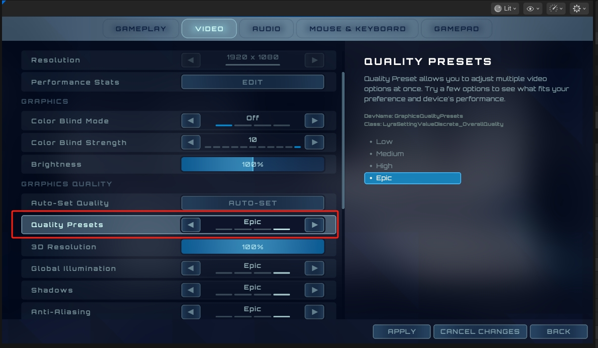
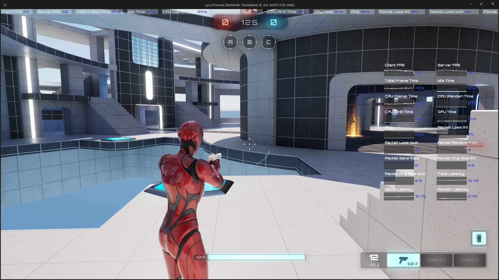
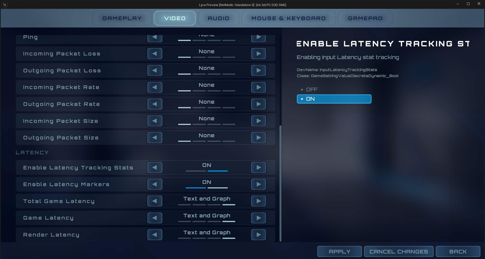
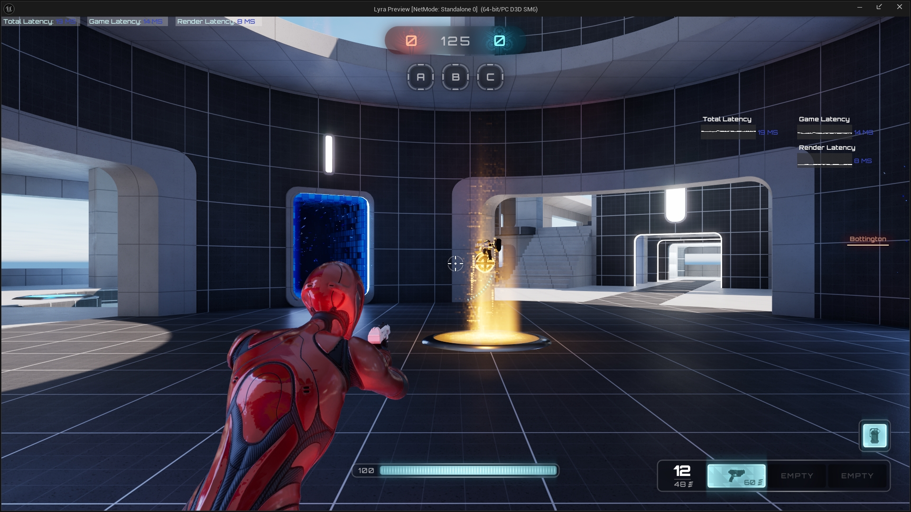

# UE5_Lyra学习指南_029_Lyra本地游戏设置

本文章仅为小刚-B站课堂-虚幻引擎视频课程Lyra-精讲的演讲手稿.  
本套课程链接:[[UE5]虚幻引擎游戏案例Lyra精讲](https://www.bilibili.com/cheese/play/ss112001159)  
前置课程链接:[[UE5]虚幻引擎UEC++从基础到进阶](https://www.bilibili.com/cheese/play/ss28043)  

文章内容由小刚撰写,采用了以下多种方式:  
1.口述转文字  
2.AI重构  
3.参考引擎源码  
4.Lyra工程源码  
5.结合社区论坛各位大佬的解析  

- [UE5\_Lyra学习指南\_029\_Lyra本地游戏设置](#ue5_lyra学习指南_029_lyra本地游戏设置)
	- [概述](#概述)
	- [音频设置](#音频设置)
		- [切换音频设备](#切换音频设备)
			- [函数入口](#函数入口)
			- [蓝图调用](#蓝图调用)
			- [执行逻辑](#执行逻辑)
		- [设置音量大小](#设置音量大小)
			- [函数入口](#函数入口-1)
			- [成员变量](#成员变量)
		- [HDR音频](#hdr音频)
	- [应用无分辨率设置](#应用无分辨率设置)
		- [入口](#入口)
		- [执行逻辑](#执行逻辑-1)
			- [设置控制平台](#设置控制平台)
			- [耳机模式](#耳机模式)
			- [视频质量预设后缀](#视频质量预设后缀)
				- [注册调用](#注册调用)
				- [执行逻辑](#执行逻辑-2)
			- [调整伽马值(如果有渲染)](#调整伽马值如果有渲染)
			- [调整安全区大小(如果有渲染)](#调整安全区大小如果有渲染)
			- [更新配置文件和帧率(如果有渲染)](#更新配置文件和帧率如果有渲染)
			- [变更显示状态控件](#变更显示状态控件)
				- [绑定位置](#绑定位置)
		- [更新帧率控制](#更新帧率控制)
			- [移动端帧率控制](#移动端帧率控制)
				- [执行逻辑](#执行逻辑-3)
				- [1.获取移动端帧率控制](#1获取移动端帧率控制)
				- [2.限制移动端质量](#2限制移动端质量)
					- [a.默认设置限制](#a默认设置限制)
					- [b.画面质量控制](#b画面质量控制)
					- [c.如果超过画面则重设](#c如果超过画面则重设)
					- [d.如果修改了帧率则根据帧率再改画面](#d如果修改了帧率则根据帧率再改画面)
				- [3.设置动态分辨率帧时间](#3设置动态分辨率帧时间)
			- [控制台帧率控制](#控制台帧率控制)
			- [桌面端帧率控制](#桌面端帧率控制)
	- [焦点帧率设置](#焦点帧率设置)
	- [父类重写方法](#父类重写方法)
	- [性能数据](#性能数据)
	- [延迟记录](#延迟记录)
		- [注册位置](#注册位置)
		- [延迟闪烁指示器](#延迟闪烁指示器)
		- [延迟跟踪数据](#延迟跟踪数据)
		- [统计数据](#统计数据)
		- [延迟标记](#延迟标记)
		- [切换延迟记录模块](#切换延迟记录模块)
	- [前端性能测试](#前端性能测试)
	- [基准测试](#基准测试)
	- [回放](#回放)
	- [代码](#代码)
		- [LyraSettingsLocal.h](#lyrasettingslocalh)
	- [总结](#总结)


## 概述
本节主要是介绍Lyra项目继承自GameUserSettings的子类拓展而成的Lyra本地游戏设置ULyraSettingsLocal.
它实现了图像质量,音量控制,音频设备切换,帧率控制,延迟显示,回放等等功能.
## 音频设置
### 切换音频设备
#### 函数入口
``` cpp
public:
	/** Returns the user's audio device id */
	/** 返回用户的音频设备 ID */
	UFUNCTION()
	FString GetAudioOutputDeviceId() const { return AudioOutputDeviceId; }

	/** Sets the user's audio device by id */
	/** 根据 ID 设置用户的音频设备 */
	UFUNCTION()
	void SetAudioOutputDeviceId(const FString& InAudioOutputDeviceId);
	private:
	// 音频设备ID
	UPROPERTY(Config)
	FString AudioOutputDeviceId;
```
``` cpp
	
void ULyraSettingsLocal::SetAudioOutputDeviceId(const FString& InAudioOutputDeviceId)
{
	AudioOutputDeviceId = InAudioOutputDeviceId;
	OnAudioOutputDeviceChanged.Broadcast(InAudioOutputDeviceId);
}
```
#### 蓝图调用
暴露给UI进行调用
``` cpp
UGameSettingCollection* ULyraGameSettingRegistry::InitializeAudioSettings(ULyraLocalPlayer* InLocalPlayer)
{
			// ......

			ULyraSettingValueDiscreteDynamic_AudioOutputDevice* Setting = NewObject<ULyraSettingValueDiscreteDynamic_AudioOutputDevice>();
			Setting->SetDevName(TEXT("AudioOutputDevice"));
			Setting->SetDisplayName(LOCTEXT("AudioOutputDevice_Name", "Audio Output Device"));
			Setting->SetDescriptionRichText(LOCTEXT("AudioOutputDevice_Description", "Changes the audio output device for game audio (not voice chat)."));

			Setting->SetDynamicGetter(GET_LOCAL_SETTINGS_FUNCTION_PATH(GetAudioOutputDeviceId));
			Setting->SetDynamicSetter(GET_LOCAL_SETTINGS_FUNCTION_PATH(SetAudioOutputDeviceId));

			Setting->AddEditCondition(FWhenPlayingAsPrimaryPlayer::Get());
			Setting->AddEditCondition(FWhenPlatformHasTrait::KillIfMissing(
				TAG_Platform_Trait_SupportsChangingAudioOutputDevice,
				TEXT("Platform does not support changing audio output device"))
			);

			Sound->AddSetting(Setting);

			// ....
}	
```
#### 执行逻辑
``` cpp

void ULyraLocalPlayer::PostInitProperties()
{
	Super::PostInitProperties();

	if (ULyraSettingsLocal* LocalSettings = GetLocalSettings())
	{
		LocalSettings->OnAudioOutputDeviceChanged.AddUObject(this, &ULyraLocalPlayer::OnAudioOutputDeviceChanged);
	}
}

void ULyraLocalPlayer::OnAudioOutputDeviceChanged(const FString& InAudioOutputDeviceId)
{
	FOnCompletedDeviceSwap DevicesSwappedCallback;
	DevicesSwappedCallback.BindUFunction(this, FName("OnCompletedAudioDeviceSwap"));

	/**
	 * 将音频输出设备更改为所请求的设备
	 * @参数 新设备标识 - 要更换的设备标识
	 * @参数 完成设备更换事件 - 当音频端点设备获取完毕时触发的事件
	 * 
	 */
	UAudioMixerBlueprintLibrary::SwapAudioOutputDevice(GetWorld(), InAudioOutputDeviceId, DevicesSwappedCallback);
}
void ULyraLocalPlayer::OnCompletedAudioDeviceSwap(const FSwapAudioOutputResult& SwapResult)
{
	if (SwapResult.Result == ESwapAudioOutputDeviceResultState::Failure)
	{
	}
}

```

### 设置音量大小
音频设置及子系统在其他节介绍.
#### 函数入口
``` cpp
// 获取整体音量大小
	UFUNCTION()
	float GetOverallVolume() const;
	// 设置整体音量大小
	UFUNCTION()
	void SetOverallVolume(float InVolume);

	// 获取音乐音量大小
	UFUNCTION()
	float GetMusicVolume() const;
	// 设置音乐音量大小
	UFUNCTION()
	void SetMusicVolume(float InVolume);

	// 获取音效音量大小
	UFUNCTION()
	float GetSoundFXVolume() const;
	// 设置音效音量大小
	UFUNCTION()
	void SetSoundFXVolume(float InVolume);

	// 获取对话音量大小
	UFUNCTION()
	float GetDialogueVolume() const;
	// 设置对话音量大小
	UFUNCTION()
	void SetDialogueVolume(float InVolume);

	// 获取聊天音量大小
	UFUNCTION()
	float GetVoiceChatVolume() const;
	//设置聊天音量大小
	UFUNCTION()
	void SetVoiceChatVolume(float InVolume);

private:
	// 设置指定控制总线的音量大小
	void SetVolumeForControlBus(USoundControlBus* InSoundControlBus, float InVolume);


private:
	// 加载用户控制总线混合
	void LoadUserControlBusMix();

```

#### 成员变量
``` cpp
// 整体音量值
	UPROPERTY(Config)
	float OverallVolume = 1.0f;

	// 音乐音量值
	UPROPERTY(Config)
	float MusicVolume = 1.0f;

	// 音效音量值
	UPROPERTY(Config)
	float SoundFXVolume = 1.0f;

	// 对话音量值
	UPROPERTY(Config)
	float DialogueVolume = 1.0f;

	// 聊天音量值
	UPROPERTY(Config)
	float VoiceChatVolume = 1.0f;

	// 临时变量 防止GC 持有音频总线的指针
	UPROPERTY(Transient)
	TMap<FName/*SoundClassName*/, TObjectPtr<USoundControlBus>> ControlBusMap;

	// 临时变量 防止GC 用于持有当前的控制总线混合
	UPROPERTY(Transient)
	TObjectPtr<USoundControlBusMix> ControlBusMix = nullptr;

	// 控制总线混合是否已经加载
	UPROPERTY(Transient)
	bool bSoundControlBusMixLoaded;

```


### HDR音频
``` cpp
	/** Returns if we're using High Dynamic Range Audio mode (HDR Audio) **/
	/** 返回我们是否正在使用高动态范围音频模式（HDR 音频） **/
	UFUNCTION()
	bool IsHDRAudioModeEnabled() const;

	/** Enables or disables High Dynamic Range Audio mode (HDR Audio) */
	/** 启用或禁用高动态范围音频模式（HDR 音频） */
	UFUNCTION()
	void SetHDRAudioModeEnabled(bool bEnabled);

	/** Whether to use High Dynamic Range Audio mode (HDR Audio) **/
	/** 是否启用高动态范围音频模式（HDR 音频） **/
	UPROPERTY(config)
	bool bUseHDRAudioMode;
```
``` cpp
void ULyraSettingsLocal::SetHDRAudioModeEnabled(bool bEnabled)
{
	bUseHDRAudioMode = bEnabled;

	if (GEngine)
	{
		if (const UWorld* World = GEngine->GetCurrentPlayWorld())
		{
			if (ULyraAudioMixEffectsSubsystem* LyraAudioMixEffectsSubsystem = World->GetSubsystem<
				ULyraAudioMixEffectsSubsystem>())
			{
				LyraAudioMixEffectsSubsystem->ApplyDynamicRangeEffectsChains(bEnabled);
			}
		}
	}
}

```

## 应用无分辨率设置
在体验加载完成或热更修复完成之后主动重载无分辨率设置

### 入口
``` cpp

	// 应用非分辨率设置
	virtual void ApplyNonResolutionSettings() override;

	// 在ExperienceManagerComponent加载体验完成后主动调用 重新加载可能发生变动的设置
	void OnExperienceLoaded();

	// 热更完成之后 主动在HotFixManager中调用 重新加载可能发生的变动设置
	void OnHotfixDeviceProfileApplied();

		// 重新应用可能的设备文件配置变动
	void ReapplyThingsDueToPossibleDeviceProfileChange();
```
``` cpp
void ULyraSettingsLocal::OnExperienceLoaded()
{
	ReapplyThingsDueToPossibleDeviceProfileChange();
}

void ULyraSettingsLocal::OnHotfixDeviceProfileApplied()
{
	ReapplyThingsDueToPossibleDeviceProfileChange();
}

void ULyraSettingsLocal::ReapplyThingsDueToPossibleDeviceProfileChange()
{
	ApplyNonResolutionSettings();
}
```

### 执行逻辑
``` cpp

void ULyraSettingsLocal::ApplyNonResolutionSettings()
{
	Super::ApplyNonResolutionSettings();

	// Check if Control Bus Mix references have been loaded,
	// Might be false if applying non resolution settings without touching any of the setters from UI

	// 检查控制总线混合参考是否已加载，
	// 如果未更改任何来自用户界面的设置而直接应用非解析设置，则该值可能为假。
	
	if (!bSoundControlBusMixLoaded)
	{
		LoadUserControlBusMix();
	}

	// In this section, update each Control Bus to the currently cached UI settings
	// 在此部分，将每个控制总线更新为当前缓存的用户界面设置。
	{
		// 重新设置总体音量大小
		if (TObjectPtr<USoundControlBus>* ControlBusDblPtr = ControlBusMap.Find(TEXT("Overall")))
		{
			if (USoundControlBus* ControlBusPtr = *ControlBusDblPtr)
			{
				SetVolumeForControlBus(ControlBusPtr, OverallVolume);
			}
		}

		// 重新设置音乐音量大小
		if (TObjectPtr<USoundControlBus>* ControlBusDblPtr = ControlBusMap.Find(TEXT("Music")))
		{
			if (USoundControlBus* ControlBusPtr = *ControlBusDblPtr)
			{
				SetVolumeForControlBus(ControlBusPtr, MusicVolume);
			}
		}

		// 重新设置音效音量大小
		if (TObjectPtr<USoundControlBus>* ControlBusDblPtr = ControlBusMap.Find(TEXT("SoundFX")))
		{
			if (USoundControlBus* ControlBusPtr = *ControlBusDblPtr)
			{
				SetVolumeForControlBus(ControlBusPtr, SoundFXVolume);
			}
		}

		// 重新设置对话音量大小
		if (TObjectPtr<USoundControlBus>* ControlBusDblPtr = ControlBusMap.Find(TEXT("Dialogue")))
		{
			if (USoundControlBus* ControlBusPtr = *ControlBusDblPtr)
			{
				SetVolumeForControlBus(ControlBusPtr, DialogueVolume);
			}
		}

		// 重新设置聊天音量大小
		if (TObjectPtr<USoundControlBus>* ControlBusDblPtr = ControlBusMap.Find(TEXT("VoiceChat")))
		{
			if (USoundControlBus* ControlBusPtr = *ControlBusDblPtr)
			{
				SetVolumeForControlBus(ControlBusPtr, VoiceChatVolume);
			}
		}
	}

	// 设置输入类型
	if (UCommonInputSubsystem* InputSubsystem = UCommonInputSubsystem::Get(GetTypedOuter<ULocalPlayer>()))
	{
		InputSubsystem->SetGamepadInputType(ControllerPlatform);
	}

	// 设置是否开启耳机模式
	if (bUseHeadphoneMode != bDesiredHeadphoneMode)
	{
		SetHeadphoneModeEnabled(bDesiredHeadphoneMode);
	}

	// 设置用户选择平台后缀
	if (DesiredUserChosenDeviceProfileSuffix != UserChosenDeviceProfileSuffix)
	{
		UserChosenDeviceProfileSuffix = DesiredUserChosenDeviceProfileSuffix;
	}

	/**
	 * 检查此应用程序是否能够进行任何渲染操作。
	 * 某些应用程序类型永远不会进行渲染，而对于其他应用程序，其这种行为可以通过切换至 NullRHI 来控制。
	 * 这可用于做出诸如忽略在服务器或在无窗口模式下运行的游戏中的无意义代码路径之类的决策（例如自动化测试）。*
	 * @返回值：如果应用程序能够进行渲染则返回 true，否则返回 false。
	 * 
	 */
	if (FApp::CanEverRender())
	{
		// 设置伽马值
		ApplyDisplayGamma();

		// 设置完全区
		ApplySafeZoneScale();

		// 根据游戏模式配置文件和帧数
		UpdateGameModeDeviceProfileAndFps();
	}

	// 变更显示状态的控件
	PerfStatSettingsChangedEvent.Broadcast();
}

```

#### 设置控制平台
``` cpp
	// Sets the controller representation to use, a single platform might support multiple kinds of controllers.  For
	// example, Win64 games could be played with both an XBox or Playstation controller.
	// 设置控制器的使用类型，由于同一平台可能支持多种类型的控制器，所以需要指定具体使用的控制器类型。对于
	// 例如，Windows 64 位游戏既可以用 Xbox 控制器也可以用 PlayStation 控制器来玩。
	UFUNCTION()
	void SetControllerPlatform(const FName InControllerPlatform);
	UFUNCTION()
	FName GetControllerPlatform() const;

	/**
	 * The name of the controller the player is using.  This is maps to the name of a UCommonInputBaseControllerData
	 * that is available on this current platform.  The gamepad data are registered per platform, you'll find them
	 * in <Platform>Game.ini files listed under +ControllerData=...
	 */
	/**
	 * 玩家所使用的控制器的名称。
	 * 这与当前平台可用的 UCommonInputBaseControllerData 的名称相对应。
	 * 游戏手柄数据是按平台进行注册的，您可以在 <平台>Game.ini 文件中找到它们，这些文件位于 +ControllerData=... 项下。
	 * 
	 */
	UPROPERTY(Config)
	FName ControllerPlatform;

	UPROPERTY(Config)
	FName ControllerPreset = TEXT("Default");

	/** The name of the current input config that the user has selected. */
	/** 当前用户所选输入配置的名称。*/
	UPROPERTY(Config)
	FName InputConfigName = TEXT("Default");


```
#### 耳机模式


``` cpp
public:
	/** Returns if we're using headphone mode (HRTF) **/
	/** 返回我们是否处于耳机模式（头部相关传递函数）的状态 **/
	UFUNCTION()
	bool IsHeadphoneModeEnabled() const;

	/** Enables or disables headphone mode (HRTF) - NOTE this setting will be overruled if au.DisableBinauralSpatialization is set */
	/** 开启或关闭耳机模式（头部相关传递函数） - 注意：若将 au.DisableBinauralSpatialization 设置为“开启”，则此设置将被忽略 */
	UFUNCTION()
	void SetHeadphoneModeEnabled(bool bEnabled);

	/** Returns if we can enable/disable headphone mode (i.e., if it's not forced on or off by the platform) */
	/** 返回是否能够启用/禁用耳机模式（即，是否不受平台强制设定而自动开启或关闭） */
	UFUNCTION()
	bool CanModifyHeadphoneModeEnabled() const;

public:
	/** Whether we *want* to use headphone mode (HRTF); may or may not actually be applied **/
	/** 我们是否*需要*启用耳机模式（基于头骨反射率的音频处理技术）；该功能可能会启用也可能不会启用 **/
	UPROPERTY(Transient)
	bool bDesiredHeadphoneMode;

private:
	/** Whether to use headphone mode (HRTF) **/
	/** 是否启用耳机模式（头相关传输函数） **/
	UPROPERTY(config)
	bool bUseHeadphoneMode;

```
#### 视频质量预设后缀

##### 注册调用
``` cpp
UGameSettingCollection* ULyraGameSettingRegistry::InitializeVideoSettings(ULyraLocalPlayer* InLocalPlayer)
{
		//----------------------------------------------------------------------------------
		{
			// Console-style device profile selection
			UGameSettingValueDiscreteDynamic* Setting = NewObject<UGameSettingValueDiscreteDynamic>();
			Setting->SetDevName(TEXT("DeviceProfileSuffix"));
			Setting->SetDisplayName(LOCTEXT("DeviceProfileSuffix_Name", "Quality Presets"));
			Setting->SetDescriptionRichText(LOCTEXT("DeviceProfileSuffix_Description", "Choose between different quality presets to make a trade off between quality and speed."));
			Setting->SetDynamicGetter(GET_LOCAL_SETTINGS_FUNCTION_PATH(GetDesiredDeviceProfileQualitySuffix));
			Setting->SetDynamicSetter(GET_LOCAL_SETTINGS_FUNCTION_PATH(SetDesiredDeviceProfileQualitySuffix));

			const ULyraPlatformSpecificRenderingSettings* PlatformSettings = ULyraPlatformSpecificRenderingSettings::Get();

			Setting->SetDefaultValueFromString(PlatformSettings->DefaultDeviceProfileSuffix);
			for (const FLyraQualityDeviceProfileVariant& Variant : PlatformSettings->UserFacingDeviceProfileOptions)
			{
				if (FPlatformMisc::GetMaxRefreshRate() >= Variant.MinRefreshRate)
				{
					Setting->AddDynamicOption(Variant.DeviceProfileSuffix, Variant.DisplayName);
				}
			}

			if (Setting->GetDynamicOptions().Num() > 1)
			{
				GraphicsQuality->AddSetting(Setting);
			}
		}
}
```



##### 执行逻辑
``` cpp
public:

	// 获取需求的设备配置文件质量后缀
	UFUNCTION()
	FString GetDesiredDeviceProfileQualitySuffix() const;

	// 设置需求的设备配置文件质量后缀
	UFUNCTION()
	void SetDesiredDeviceProfileQualitySuffix(const FString& InDesiredSuffix);

private:
	// 需求的驱动文件后缀
	UPROPERTY(Transient)
	FString DesiredUserChosenDeviceProfileSuffix;

	// 现在使用的设备配置文件经过重写后缀
	UPROPERTY(Transient)
	FString CurrentAppliedDeviceProfileOverrideSuffix;

	// 用户选择的驱动文件后缀
	UPROPERTY(config)
	FString UserChosenDeviceProfileSuffix;


```

#### 调整伽马值(如果有渲染)
``` cpp
public:
	// 获取伽马值
	UFUNCTION()
	float GetDisplayGamma() const;

	//设置伽马值
	UFUNCTION()
	void SetDisplayGamma(float InGamma);
	private:
	// 应用伽马值设置
	void ApplyDisplayGamma();

	// 伽马值
	UPROPERTY(Config)
	float DisplayGamma = 2.2;

```
#### 调整安全区大小(如果有渲染)
``` cpp
	//////////////////////////////////////////////////////////////////
	// Safezone
	// 安全区

public:
	//是否设置了安全区
	UFUNCTION()
	bool IsSafeZoneSet() const { return SafeZoneScale != -1; }

	//获取安全区大小
	UFUNCTION()
	float GetSafeZone() const { return SafeZoneScale >= 0 ? SafeZoneScale : 0; }

	// 设置安全区
	UFUNCTION()
	void SetSafeZone(float Value)
	{
		SafeZoneScale = Value;
		ApplySafeZoneScale();
	}

	// 应用安全区
	void ApplySafeZoneScale();

	// 安全区规模大小
	UPROPERTY(Config)
	float SafeZoneScale = -1;


```
#### 更新配置文件和帧率(如果有渲染)
这里需要提前讲这个ULyraPlatformSpecificRenderingSettings.参照补充文档.
此处贴出执行逻辑代码.
``` cpp

void ULyraSettingsLocal::UpdateGameModeDeviceProfileAndFps()
{
#if WITH_EDITOR
	// 如果没有在编辑器下开启平台模拟 则跳过
	if (GIsEditor && !CVarApplyDeviceProfilesInPIE.GetValueOnGameThread())
	{
		return;
	}
#endif

	UDeviceProfileManager& Manager = UDeviceProfileManager::Get();
	// 获取到平台特定渲染配置
	const ULyraPlatformSpecificRenderingSettings* PlatformSettings = ULyraPlatformSpecificRenderingSettings::Get();
	// 读取用户自定义的配置
	const TArray<FLyraQualityDeviceProfileVariant>& UserFacingVariants = PlatformSettings->
		UserFacingDeviceProfileOptions;

	//@TODO: Might want to allow specific experiences to specify a suffix to attempt to use as well
	// The code below will handle searching with this suffix (alone or in conjunction with the frame rate), but nothing sets it right now
	//@待办事项：或许应该允许特定的体验设定一个后缀，以便尝试使用该后缀进行搜索（无论是单独使用还是与帧率结合使用），但目前还没有任何设置能够实现这一点。
	FString ExperienceSuffix;

	// Make sure the chosen setting is supported for the current display, walking down the list to try fallbacks
	// 确保所选设置适用于当前的显示设备，并逐个检查列表中的选项以尝试使用备用设置
	const int32 PlatformMaxRefreshRate = FPlatformMisc::GetMaxRefreshRate();

	// Lambda函数 比对后缀是否一致
	int32 SuffixIndex = UserFacingVariants.IndexOfByPredicate([&](const FLyraQualityDeviceProfileVariant& Data)
	{
		return Data.DeviceProfileSuffix == UserChosenDeviceProfileSuffix;
	});

	// 循环 保证能找到一个小于设备最大刷新率的索引,这样整个配置才可用
	while (UserFacingVariants.IsValidIndex(SuffixIndex))
	{
		if (PlatformMaxRefreshRate >= UserFacingVariants[SuffixIndex].MinRefreshRate)
		{
			break;
		}
		else
		{
			--SuffixIndex;
		}
	}
	// 获取一个有效用户配置后缀
	//  此处应该是空的
	const FString EffectiveUserSuffix = UserFacingVariants.IsValidIndex(SuffixIndex)
		                                    ? UserFacingVariants[SuffixIndex].DeviceProfileSuffix
		                                    : PlatformSettings->DefaultDeviceProfileSuffix;

	// Build up a list of names to try
	// 构建一个需要尝试的姓名列表

	// 此处是空的 所以应该是没有
	const bool bHadUserSuffix = !EffectiveUserSuffix.IsEmpty();

	// 此处是空的 并没有接入Experience的设置
	const bool bHadExperienceSuffix = !ExperienceSuffix.IsEmpty();
	/**
	 * 获取所选设备的配置文件名称，该名称可以是平台名称，也可以是设备配置文件选择模块所提供的名称。*
	 * @返回 选中的配置文件。
	 * 
	 */
	FString BasePlatformName = UDeviceProfileManager::GetPlatformDeviceProfileName();
	FName PlatformName; // Default unless in editor// 默认情况下如此，但在编辑器中则不然
#if WITH_EDITOR
	if (GIsEditor)
	{
		// 编辑器的情况下去拿到平台的模拟设置
		const ULyraPlatformEmulationSettings* Settings = GetDefault<ULyraPlatformEmulationSettings>();
		const FName PretendBaseDeviceProfile = Settings->GetPretendBaseDeviceProfile();

		if (PretendBaseDeviceProfile != NAME_None)
		{
			BasePlatformName = PretendBaseDeviceProfile.ToString();
		}

		PlatformName = Settings->GetPretendPlatformName();
	}
#endif

	TArray<FString> ComposedNamesToFind;

	// 如果既有体验设置也有用户设置
	if (bHadExperienceSuffix && bHadUserSuffix)
	{
		ComposedNamesToFind.Add(BasePlatformName + TEXT("_") + ExperienceSuffix + TEXT("_") + EffectiveUserSuffix);
	}
	// 只有用户设置
	if (bHadUserSuffix)
	{
		ComposedNamesToFind.Add(BasePlatformName + TEXT("_") + EffectiveUserSuffix);
	}
	// 只有体验设置
	if (bHadExperienceSuffix)
	{
		ComposedNamesToFind.Add(BasePlatformName + TEXT("_") + ExperienceSuffix);
	}
	// 编辑器下
	if (GIsEditor)
	{
		ComposedNamesToFind.Add(BasePlatformName);
	}

	// See if any of the potential device profiles actually exists
	// 查看是否有任何潜在的设备配置确实存在

	FString ActualProfileToApply;
	for (const FString& TestProfileName : ComposedNamesToFind)
	{
		/**
		 * 用于检查是否可调用“CreateProfile”函数来使用指定的设备配置文件的测试操作。*
		 * @参数 ProfileName - 账户名称。
	     * @参数 ProfileToCopy - 要复制的账户名称。*
	 	 * @返回创建的配置文件。
		 * 
		 */
		if (Manager.HasLoadableProfileName(TestProfileName, PlatformName))
		{
			ActualProfileToApply = TestProfileName;

			/**
			 * 根据姓名查找相应的资料。
			 * @参数 ProfileName - 要查找的配置文件名称。
			 * @参数 bCreateProfileOnFail - 若对象尚未存在，则是否从配置中创建该配置文件。
			 * @参数 OptionalPlatformName - 用于加载的平台名称。
			 * @返回 找到的配置文件。
			 * 
			 */
			UDeviceProfile* Profile = Manager.FindProfile(TestProfileName, /*bCreateOnFail=*/ false);
			if (Profile == nullptr)
			{
				/**
				 * 从副本中创建设备配置文件的副本。
				 * @参数 ProfileName - 账户名称。
				 * @参数 ProfileToCopy - 要复制的账户名称。
				 * @返回创建的配置文件。
				 * 
				 */
				Profile = Manager.CreateProfile(TestProfileName, TEXT(""), TestProfileName, *PlatformName.ToString());
			}

			UE_LOG(LogConsoleResponse, Log, TEXT("Profile %s exists"), *Profile->GetName());
			break;
		}
	}

	UE_LOG(LogConsoleResponse, Log,
	       TEXT(
		       "UpdateGameModeDeviceProfileAndFps MaxRefreshRate=%d, ExperienceSuffix='%s', UserPicked='%s'->'%s', PlatformBase='%s', AppliedActual='%s'"
	       ),
	       PlatformMaxRefreshRate, *ExperienceSuffix, *UserChosenDeviceProfileSuffix, *EffectiveUserSuffix,
	       *BasePlatformName, *ActualProfileToApply);

	// Apply the device profile if it's different to what we currently have
	// 如果设备的配置与我们当前所使用的配置不同，则应用该设备配置。
	if (ActualProfileToApply != CurrentAppliedDeviceProfileOverrideSuffix)
	{
		if (Manager.GetActiveDeviceProfileName() != ActualProfileToApply)
		{
			// Restore the default first
			// 恢复默认设置（首先）
			if (GIsEditor)
			{
#if ALLOW_OTHER_PLATFORM_CONFIG
				/**
				 * 恢复预览状态。
				 * 
				 */
				Manager.RestorePreviewDeviceProfile();
#endif
			}
			else
			{
				/**
				 * 将设备配置恢复为该设备的默认设置
				 */
				Manager.RestoreDefaultDeviceProfile();
			}

			// Apply the new one (if it wasn't the default)
			// 应用新的设置（如果该设置并非默认值）
			if (Manager.GetActiveDeviceProfileName() != ActualProfileToApply)
			{
				UDeviceProfile* NewDeviceProfile = Manager.FindProfile(ActualProfileToApply);
				ensureMsgf(NewDeviceProfile != nullptr, TEXT("DeviceProfile %s not found "), *ActualProfileToApply);
				if (NewDeviceProfile)
				{
					if (GIsEditor)
					{
#if ALLOW_OTHER_PLATFORM_CONFIG
						UE_LOG(LogConsoleResponse, Log, TEXT("Overriding *preview* device profile to %s"),
						       *ActualProfileToApply);
						Manager.SetPreviewDeviceProfile(NewDeviceProfile);

						// Reload the default settings from the pretend profile
						// 从模拟配置文件中重新加载默认设置
						// 这一步就是把当前设置填充到我们的默认拓展里面,因为我们根据配置文件进行了修改.
						LyraSettingsHelpers::FillScalabilitySettingsFromDeviceProfile(DeviceDefaultScalabilitySettings);
#endif
					}
					else
					{
						UE_LOG(LogConsoleResponse, Log, TEXT("Overriding device profile to %s"), *ActualProfileToApply);
						Manager.SetOverrideDeviceProfile(NewDeviceProfile);

						if (!bEnableScalabilitySettings)
						{
							// We don't support persistence of the scalability settings but at least we may
							// provide up to date values if anybody queries them using the settings API.

							// 我们不支持对可扩展性设置的持久保存功能，但至少如果有人通过设置 API 进行查询，我们仍能够提供最新的值。
							// 这里因为是没有开启自定义拓展性能设置,但是我们可以缓存一下.
							ScalabilityQuality = Scalability::GetQualityLevels();
						}
					}
				}
			}
		}
		CurrentAppliedDeviceProfileOverrideSuffix = ActualProfileToApply;
	}

	// 现在根据我们的帧率控制模型来修改帧率
	switch (PlatformSettings->FramePacingMode)
	{
		// 移动端模式
	case ELyraFramePacingMode::MobileStyle:
		UpdateMobileFramePacing();
		break;
		// 控制台模式
	case ELyraFramePacingMode::ConsoleStyle:
		UpdateConsoleFramePacing();
		break;
		// 桌面模式
	case ELyraFramePacingMode::DesktopStyle:
		UpdateDesktopFramePacing();
		break;
	}
}
```
该执行流程已详细注释.自行阅读即可.注意区分编辑器嵌入了编辑器下预览逻辑即可.

#### 变更显示状态控件
``` cpp

	// 获取性能显示指标模式切换的代理进行绑定
	FPerfStatSettingsChanged& OnPerfStatDisplayStateChanged() { return PerfStatSettingsChangedEvent; }


	// Event for display stat widget containers to bind to
	// 用于显示状态小部件容器的事件，用于进行绑定操作
	FPerfStatSettingsChanged PerfStatSettingsChangedEvent;


```
##### 绑定位置
这里设置到了UI了,回头再详细展开.
ULyraPerfStatContainerBase.
ULyraPerfStatWidgetBase.

``` cpp
void ULyraPerfStatContainerBase::NativeConstruct()
{
	Super::NativeConstruct();
	UpdateVisibilityOfChildren();

	ULyraSettingsLocal::Get()->OnPerfStatDisplayStateChanged().AddUObject(this, &ThisClass::UpdateVisibilityOfChildren);
}

```
根据枚举类型切换展示类型.
``` cpp
void ULyraPerfStatContainerBase::UpdateVisibilityOfChildren()
{
	ULyraSettingsLocal* UserSettings = ULyraSettingsLocal::Get();

	const bool bShowTextWidgets = (StatDisplayModeFilter == ELyraStatDisplayMode::TextOnly) || (StatDisplayModeFilter == ELyraStatDisplayMode::TextAndGraph);
	const bool bShowGraphWidgets = (StatDisplayModeFilter == ELyraStatDisplayMode::GraphOnly) || (StatDisplayModeFilter == ELyraStatDisplayMode::TextAndGraph);
	
	check(WidgetTree);
	WidgetTree->ForEachWidget([&](UWidget* Widget)
	{
		if (ULyraPerfStatWidgetBase* TypedWidget = Cast<ULyraPerfStatWidgetBase>(Widget))
		{
			const ELyraStatDisplayMode SettingMode = UserSettings->GetPerfStatDisplayState(TypedWidget->GetStatToDisplay());

			bool bShowWidget = false;
			switch (SettingMode)
			{
			case ELyraStatDisplayMode::Hidden:
				bShowWidget = false;
				break;
			case ELyraStatDisplayMode::TextOnly:
				bShowWidget = bShowTextWidgets;
				break;
			case ELyraStatDisplayMode::GraphOnly:
				bShowWidget = bShowGraphWidgets;
				break;
			case ELyraStatDisplayMode::TextAndGraph:
				bShowWidget = bShowTextWidgets || bShowGraphWidgets;
				break;
			}

			TypedWidget->SetVisibility(bShowWidget ? ESlateVisibility::HitTestInvisible : ESlateVisibility::Collapsed);
		}
	});
}


```


### 更新帧率控制
#### 移动端帧率控制
##### 执行逻辑
``` cpp

void ULyraSettingsLocal::UpdateMobileFramePacing()
{
	//@TODO: Handle different limits for in-front-end or low-battery mode on mobile
	//@待办事项：针对移动端的前端模式或低电量模式，处理不同的限制条件。

	// Choose the closest supported frame rate to the user desired setting without going over the device imposed limit
	// 选择与用户期望设置最接近且不超过设备限制的可支持帧率。
	const ULyraPlatformSpecificRenderingSettings* PlatformSettings = ULyraPlatformSpecificRenderingSettings::Get();
	const TArray<int32>& PossibleRates = PlatformSettings->MobileFrameRateLimits;

	// Lambda函数 获取到最大可用的帧率
	const int32 LimitIndex = PossibleRates.FindLastByPredicate([this](const int32& TestRate)
	{
		return (TestRate <= MobileFrameRateLimit) && IsSupportedMobileFramePace(TestRate);
	});

	// 是否可用,不可用的话就采用默认的配置即可
	const int32 TargetFPS = PossibleRates.IsValidIndex(LimitIndex)
		                        ? PossibleRates[LimitIndex]
		                        : GetDefaultMobileFrameRate();

	UE_LOG(LogConsoleResponse, Log, TEXT("Setting frame pace to %d Hz."), TargetFPS);
	/**
	 * 设定我们希望达到的运行速度（30 表示 30 帧每秒，0 表示无固定节奏）。
	 * 通用实现会根据 FPlatformMisc:：GetMaxRefreshRate() 的值来设置 rhi.SyncInterval 的值。
	 * @返回我们将采用的跑步速度。
	 * 
	 */
	FPlatformRHIFramePacer::SetFramePace(TargetFPS);

	// 设置移动端质量
	ClampMobileQuality();

	// 更新动态分辨率帧时间
	UpdateDynamicResFrameTime((float)TargetFPS);
}

```


##### 1.获取移动端帧率控制
``` cpp
bool ULyraSettingsLocal::IsSupportedMobileFramePace(int32 TestFPS)
{
	// 是否是默认的
	const bool bIsDefault = (TestFPS == GetDefaultMobileFrameRate());

	// 是否超出限制
	const bool bDoesNotExceedLimit = (TestFPS <= GetMaxMobileFrameRate());

	/**
	 * FPlatformRHIFramePacer::SupportsFramePace(TestFPS)
	 * 返回该硬件是否能够以指定的帧率进行帧率同步的处理
	 * 
	 */
	// Allow all paces in the editor, as we'd only be doing this when simulating another platform
	// 允许编辑器中所有操作，因为我们只会在这种情况下进行此类操作（即在模拟其他平台时）
	const bool bIsSupportedPace = FPlatformRHIFramePacer::SupportsFramePace(TestFPS) || GIsEditor;

	return bIsDefault || (bDoesNotExceedLimit && bIsSupportedPace);
}

int32 ULyraSettingsLocal::GetDefaultMobileFrameRate()
{
	return CVarDeviceProfileDrivenMobileDefaultFrameRate.GetValueOnGameThread();
}

int32 ULyraSettingsLocal::GetMaxMobileFrameRate()
{
	return CVarDeviceProfileDrivenMobileMaxFrameRate.GetValueOnGameThread();
}

static TAutoConsoleVariable<int32> CVarDeviceProfileDrivenMobileDefaultFrameRate(
	TEXT("Lyra.DeviceProfile.Mobile.DefaultFrameRate"),
	30,
	TEXT("Default FPS when being driven by device profile"),
	ECVF_Default | ECVF_Preview);

static TAutoConsoleVariable<int32> CVarDeviceProfileDrivenMobileMaxFrameRate(
	TEXT("Lyra.DeviceProfile.Mobile.MaxFrameRate"),
	30,
	TEXT("Max FPS when being driven by device profile"),
	ECVF_Default | ECVF_Preview);
```
DefaultDeviceProfiles.ini
``` ini
; Default all devices to 30fps vsync
+CVars=r.VSync=1
+CVars=Lyra.DeviceProfile.Mobile.DefaultFrameRate=30

```

##### 2.限制移动端质量
``` cpp
void ULyraSettingsLocal::ClampMobileQuality()
{
	const ULyraPlatformSpecificRenderingSettings* PlatformSettings = ULyraPlatformSpecificRenderingSettings::Get();
	if (PlatformSettings->FramePacingMode == ELyraFramePacingMode::MobileStyle)
	{
		// Clamp the resultant settings to the device default, it's known viable maximum.
		// This is a clamp rather than override to preserve allowed user settings

		// 将生成的设置限制为设备的默认值，因为这是已知的可行的最大值。
		// 这是一种限制操作，而非覆盖操作，目的是保留用户允许设置的完整性。

		Scalability::FQualityLevels CurrentLevels = Scalability::GetQualityLevels();

		/** On mobile, disables the 3D Resolution clamp that reverts the setting set by the user on boot.*/
		/** 在移动端，会禁用 3D 分辨率限制功能，该功能会恢复用户在开机时所设置的参数值。*/

		bool bMobileDisableResolutionReset = true;
		if (bMobileDisableResolutionReset)
		{
			DeviceDefaultScalabilitySettings.Qualities.ResolutionQuality = CurrentLevels.ResolutionQuality;
		}

		/* 根据当前设备配置文件的默认允许范围对输入电平进行限制 */
		ClampQualityLevelsToDeviceProfile(DeviceDefaultScalabilitySettings.Qualities, /*inout*/ CurrentLevels);

		/** 这是设置当前状态的唯一推荐方法——切勿直接设置游戏变量（CVars） **/
		Scalability::SetQualityLevels(CurrentLevels);

		// Clamp quality levels if required at the current frame rate
		// 根据当前帧率对质量级别进行限制（如有必要）
		ClampMobileFPSQualityLevels(/*bWriteBack=*/ true);

		// 拿到最大的移动端帧率
		const int32 MaxMobileFrameRate = GetMaxMobileFrameRate();

		// 拿到默认的移动端帧率
		const int32 DefaultMobileFrameRate = GetDefaultMobileFrameRate();

		// 确保默认的帧率小于最大的
		ensureMsgf(DefaultMobileFrameRate <= MaxMobileFrameRate,
		           TEXT("Default mobile frame rate (%d) is higher than the maximum mobile frame rate (%d)!"),
		           DefaultMobileFrameRate, MaxMobileFrameRate);

		// Choose the closest supported frame rate to the user desired setting without going over the device imposed limit
		// 选择与用户期望设置最接近且不超过设备限制的可支持帧率。
		const TArray<int32>& PossibleRates = PlatformSettings->MobileFrameRateLimits;
		const int32 LimitIndex = PossibleRates.FindLastByPredicate([this](const int32& TestRate)
		{
			return (TestRate <= DesiredMobileFrameRateLimit) && IsSupportedMobileFramePace(TestRate);
		});
		const int32 ActualLimitFPS = PossibleRates.IsValidIndex(LimitIndex)
			                             ? PossibleRates[LimitIndex]
			                             : GetDefaultMobileFrameRate();
		// 根据帧率设置分辨率
		ClampMobileResolutionQuality(ActualLimitFPS);
	}
}

```
执行逻辑:
1.先拿默认设置对用户的设置进行限制
2.根据帧率对画面质量进行限制.如果超出了就必须重设
3.根据实际帧率去设置分辨率比例.

###### a.默认设置限制
``` cpp
void ULyraSettingsLocal::ClampQualityLevelsToDeviceProfile(const Scalability::FQualityLevels& ClampLevels,
                                                           Scalability::FQualityLevels& InOutLevels)
{
	static_assert(sizeof(Scalability::FQualityLevels) == 88,
	              "This function may need to be updated to account for new members");

	// Clamps any valid (non-negative) settings
	// 对所有有效的（非负）设置进行限制
	InOutLevels.ResolutionQuality = (ClampLevels.ResolutionQuality >= 0.f)
		                                ? FMath::Min(ClampLevels.ResolutionQuality, InOutLevels.ResolutionQuality)
		                                : InOutLevels.ResolutionQuality;
	InOutLevels.ViewDistanceQuality = (ClampLevels.ViewDistanceQuality >= 0)
		                                  ? FMath::Min(ClampLevels.ViewDistanceQuality, InOutLevels.ViewDistanceQuality)
		                                  : InOutLevels.ViewDistanceQuality;
	InOutLevels.AntiAliasingQuality = (ClampLevels.AntiAliasingQuality >= 0)
		                                  ? FMath::Min(ClampLevels.AntiAliasingQuality, InOutLevels.AntiAliasingQuality)
		                                  : InOutLevels.AntiAliasingQuality;
	InOutLevels.ShadowQuality = (ClampLevels.ShadowQuality >= 0)
		                            ? FMath::Min(ClampLevels.ShadowQuality, InOutLevels.ShadowQuality)
		                            : InOutLevels.ShadowQuality;
	InOutLevels.GlobalIlluminationQuality = (ClampLevels.GlobalIlluminationQuality >= 0)
		                                        ? FMath::Min(ClampLevels.GlobalIlluminationQuality,
		                                                     InOutLevels.GlobalIlluminationQuality)
		                                        : InOutLevels.GlobalIlluminationQuality;
	InOutLevels.ReflectionQuality = (ClampLevels.ReflectionQuality >= 0)
		                                ? FMath::Min(ClampLevels.ReflectionQuality, InOutLevels.ReflectionQuality)
		                                : InOutLevels.ReflectionQuality;
	InOutLevels.PostProcessQuality = (ClampLevels.PostProcessQuality >= 0)
		                                 ? FMath::Min(ClampLevels.PostProcessQuality, InOutLevels.PostProcessQuality)
		                                 : InOutLevels.PostProcessQuality;
	InOutLevels.TextureQuality = (ClampLevels.TextureQuality >= 0)
		                             ? FMath::Min(ClampLevels.TextureQuality, InOutLevels.TextureQuality)
		                             : InOutLevels.TextureQuality;
	InOutLevels.EffectsQuality = (ClampLevels.EffectsQuality >= 0)
		                             ? FMath::Min(ClampLevels.EffectsQuality, InOutLevels.EffectsQuality)
		                             : InOutLevels.EffectsQuality;
	InOutLevels.FoliageQuality = (ClampLevels.FoliageQuality >= 0)
		                             ? FMath::Min(ClampLevels.FoliageQuality, InOutLevels.FoliageQuality)
		                             : InOutLevels.FoliageQuality;
	InOutLevels.ShadingQuality = (ClampLevels.ShadingQuality >= 0)
		                             ? FMath::Min(ClampLevels.ShadingQuality, InOutLevels.ShadingQuality)
		                             : InOutLevels.ShadingQuality;
}
```
###### b.画面质量控制
这里会去获取当前帧率限制下的最大画面质量,不可以超过.超过了就需要根据运行的最大画面质量进行重设
``` cpp
void ULyraSettingsLocal::ClampMobileFPSQualityLevels(bool bWriteBack)
{
	const ULyraPlatformSpecificRenderingSettings* PlatformSettings = ULyraPlatformSpecificRenderingSettings::Get();
	if (PlatformSettings->FramePacingMode == ELyraFramePacingMode::MobileStyle)
	{
		const int32 QualityLimit = LyraSettingsHelpers::GetApplicableOverallQualityLimit(DesiredMobileFrameRateLimit);
		const int32 CurrentQualityLevel = GetHighestLevelOfAnyScalabilityChannel();
		// 如果超过了质量限制 就必须重设
		if ((QualityLimit >= 0) && (CurrentQualityLevel > QualityLimit))
		{
			SetOverallScalabilityLevel(QualityLimit);

			if (bWriteBack)
			{
				Scalability::SetQualityLevels(ScalabilityQuality);
			}
			UE_LOG(LogConsoleResponse, Log, TEXT("Mobile FPS clamped overall quality (%d -> %d)."), CurrentQualityLevel,
			       QualityLimit);
		}
	}
}
```
``` cpp
	int32 GetApplicableOverallQualityLimit(int32 FrameRate)
	{
		return OverallQualityLimits.Query(FrameRate);
	}
```

此处需要讲解TMobileQualityWrapper这个类.
简而言之
TMobileQualityWrapper<int32> OverallQualityLimits(-1, CVarMobileQualityLimits);
``` cpp
	T Query(int32 TestValue)
	{
		UpdateCache();

		for (const FLimitPair& Pair : Thresholds)
		{
			if (TestValue >= Pair.Limit)
			{
				return Pair.Value;
			}
		}

		return DefaultValue;
	}

```
``` ini
[IOS_Epic DeviceProfile]
BaseProfileName=IOS
+CVars=sg.ViewDistanceQuality=3
+CVars=sg.AntiAliasingQuality=3
+CVars=sg.ShadowQuality=3
+CVars=sg.PostProcessQuality=3
+CVars=sg.TextureQuality=3
+CVars=sg.EffectsQuality=3
+CVars=sg.FoliageQuality=3
+CVars=sg.ShadowQuality.Frontend=0
+CVars=r.RenderTargetPoolMin=200
+CVars=p.RigidBodyNode=1
+CVars=Lyra.DeviceProfile.Mobile.MaxFrameRate=60
+CVars=Lyra.DeviceProfile.Mobile.OverallQualityLimits=60:2
```
###### c.如果超过画面则重设
``` cpp
void ULyraSettingsLocal::SetOverallScalabilityLevel(int32 Value)
{
	/**
	 * 用于保存/恢复值的异常安全保护机制。
	 * 常用于确保即使代码在未来提前退出，值也能被恢复。
	 * 使用方法：
	 *  	TGuardValue<bool> GuardSomeBool(bSomeBool， false)； // 将 bSomeBool 设置为 false，并在析构函数中恢复其值。
	 *  	
	 */
	TGuardValue Guard(bSettingOverallQualityGuard, true);

	Value = FMath::Clamp(Value, 0, 3);

	float CurrentMobileResolutionQuality = ScalabilityQuality.ResolutionQuality;

	Super::SetOverallScalabilityLevel(Value);

	const ULyraPlatformSpecificRenderingSettings* PlatformSettings = ULyraPlatformSpecificRenderingSettings::Get();
	if (PlatformSettings->FramePacingMode == ELyraFramePacingMode::MobileStyle)
	{
		// Restore the resolution quality, mobile decouples this from overall quality
		// 恢复分辨率质量，移动端将此功能与整体质量分离开来
		ScalabilityQuality.ResolutionQuality = CurrentMobileResolutionQuality;

		// Changing the overall quality can end up adjusting the frame rate on mobile since there are limits
		// 改变整体画质可能会导致在移动端调整帧率，因为存在一定的限制。
		const int32 ConstrainedFrameRateLimit = LyraSettingsHelpers::ConstrainFrameRateToBeCompatibleWithOverallQuality(
			DesiredMobileFrameRateLimit, Value);
		if (ConstrainedFrameRateLimit != DesiredMobileFrameRateLimit)
		{
			SetDesiredMobileFrameRateLimit(ConstrainedFrameRateLimit);
		}
	}
}


```
此时再次计算约束后的帧率,因为调整了画面
``` cpp
	int32 ConstrainFrameRateToBeCompatibleWithOverallQuality(int32 FrameRate, int32 OverallQuality)
	{
		const ULyraPlatformSpecificRenderingSettings* PlatformSettings = ULyraPlatformSpecificRenderingSettings::Get();
		const TArray<int32>& PossibleRates = PlatformSettings->MobileFrameRateLimits;

		// Choose the closest frame rate (without going over) to the user preferred one that is supported and compatible with the desired overall quality
		// 选择与用户偏好帧率最为接近（且不超过该值）的帧率，该帧率需支持且与预期的整体画质相兼容。
		int32 LimitIndex = PossibleRates.FindLastByPredicate([=](const int32& TestRate)
		{
			const bool bAtOrBelowDesiredRate = (TestRate <= FrameRate);

			const int32 LimitQuality = GetApplicableResolutionQualityLimit(TestRate);
			const bool bQualityDoesntExceedLimit = (LimitQuality < 0) || (OverallQuality <= LimitQuality);

			const bool bIsSupported = ULyraSettingsLocal::IsSupportedMobileFramePace(TestRate);

			return bAtOrBelowDesiredRate && bQualityDoesntExceedLimit && bIsSupported;
		});

		return PossibleRates.IsValidIndex(LimitIndex)
			       ? PossibleRates[LimitIndex]
			       : ULyraSettingsLocal::GetDefaultMobileFrameRate();
	}

```
###### d.如果修改了帧率则根据帧率再改画面
注意此时bWriteBack为false.
``` cpp
void ULyraSettingsLocal::SetDesiredMobileFrameRateLimit(int32 NewLimitFPS)
{
	const int32 OldLimitFPS = DesiredMobileFrameRateLimit;

	RemapMobileResolutionQuality(OldLimitFPS, NewLimitFPS);

	DesiredMobileFrameRateLimit = NewLimitFPS;

	ClampMobileFPSQualityLevels(/*bWriteBack=*/ false);
}
```


##### 3.设置动态分辨率帧时间
``` cpp
void ULyraSettingsLocal::UpdateDynamicResFrameTime(float TargetFPS)
{
	static IConsoleVariable* CVarDyResFrameTimeBudget = IConsoleManager::Get().FindConsoleVariable(
		TEXT("r.DynamicRes.FrameTimeBudget"));
	if (CVarDyResFrameTimeBudget)
	{
		if (ensure(TargetFPS > 0.0f))
		{
			const float DyResFrameTimeBudget = 1000.0f / TargetFPS;
			CVarDyResFrameTimeBudget->Set(DyResFrameTimeBudget, ECVF_SetByGameSetting);
		}
	}
}

```


#### 控制台帧率控制
设置即可
``` cpp
void ULyraSettingsLocal::UpdateConsoleFramePacing()
{
	// Apply device-profile-driven frame sync and frame pace
	// 应用基于设备配置文件的帧同步和帧频率设置
	const int32 FrameSyncType = CVarDeviceProfileDrivenFrameSyncType.GetValueOnGameThread();
	if (FrameSyncType != -1)
	{
		UE_LOG(LogConsoleResponse, Log, TEXT("Setting frame sync mode to %d."), FrameSyncType);
		SetSyncTypeCVar(FrameSyncType);
	}

	const int32 TargetFPS = CVarDeviceProfileDrivenTargetFps.GetValueOnGameThread();
	if (TargetFPS != -1)
	{
		UE_LOG(LogConsoleResponse, Log, TEXT("Setting frame pace to %d Hz."), TargetFPS);
		FPlatformRHIFramePacer::SetFramePace(TargetFPS);

		// Set the CSV metadata and analytics Fps mode strings
		// 设置 CSV 元数据和分析帧率模式字符串
#if CSV_PROFILER
		const FString TargetFramerateString = FString::Printf(TEXT("%d"), TargetFPS);
		CSV_METADATA(TEXT("TargetFramerate"), *TargetFramerateString);
#endif
	}
}
```
#### 桌面端帧率控制
设置即可.
``` cpp
void ULyraSettingsLocal::UpdateDesktopFramePacing()
{
	// For desktop the frame rate limit is handled by the parent class based on the value already
	// applied via UpdateEffectiveFrameRateLimit()
	// So this function is only doing 'second order' effects of desktop frame pacing preferences
	// 对于桌面端而言，帧率限制是由父类根据通过“UpdateEffectiveFrameRateLimit()”函数已应用的值来处理的
	// 因此，此函数仅执行桌面端帧率控制偏好所产生“二级”影响的效果


	const float TargetFPS = GetEffectiveFrameRateLimit();
	const float ClampedFPS = (TargetFPS <= 0.0f) ? 60.0f : FMath::Clamp(TargetFPS, 30.0f, 60.0f);
	UpdateDynamicResFrameTime(ClampedFPS);
}

```
## 焦点帧率设置
当App焦点切换时,我们可以调整其帧率
``` cpp
void ULyraSettingsLocal::OnAppActivationStateChanged(bool bIsActive)
{
	// We might want to adjust the frame rate when the app loses/gains focus on multi-window platforms
	// 在多窗口平台上，当应用程序失去/获得焦点时，我们可能需要调整帧率。
	UpdateEffectiveFrameRateLimit();
}

```
绑定位置
``` cpp
ULyraSettingsLocal::ULyraSettingsLocal()
{
	//如果不是CDO对象,并且当前App已经初始化好了
	if (!HasAnyFlags(RF_ClassDefaultObject) && FSlateApplication::IsInitialized())
	{
		// 当APP的焦点状态发生变化了触发回调
		OnApplicationActivationStateChangedHandle = FSlateApplication::Get().OnApplicationActivationStateChanged().
		                                                                     AddUObject(
			                                                                     this,
			                                                                     &ThisClass::OnAppActivationStateChanged);
	}
```
销毁时回收句柄
``` cpp
void ULyraSettingsLocal::BeginDestroy()
{
	if (FSlateApplication::IsInitialized())
	{
		FSlateApplication::Get().OnApplicationActivationStateChanged().
		                         Remove(OnApplicationActivationStateChangedHandle);
	}

	Super::BeginDestroy();
}

```
更新帧率
``` cpp
void ULyraSettingsLocal::UpdateEffectiveFrameRateLimit()
{
	// DS服务器不需要进行该项设置
	if (!IsRunningDedicatedServer())
	{
		// 设置最大帧率
		SetFrameRateLimitCVar(GetEffectiveFrameRateLimit());
	}
}
```
根据不同情况设置不同的帧率
``` cpp
float ULyraSettingsLocal::GetEffectiveFrameRateLimit()
{
	const ULyraPlatformSpecificRenderingSettings* PlatformSettings = ULyraPlatformSpecificRenderingSettings::Get();

#if WITH_EDITOR
	if (GIsEditor && !CVarApplyFrameRateSettingsInPIE.GetValueOnGameThread())
	{
		return Super::GetEffectiveFrameRateLimit();
	}
#endif

	if (PlatformSettings->FramePacingMode == ELyraFramePacingMode::ConsoleStyle)
	{
		return 0.0f;
	}

	float EffectiveFrameRateLimit = Super::GetEffectiveFrameRateLimit();

	if (ShouldUseFrontendPerformanceSettings())
	{
		// 选择两者的最小值
		EffectiveFrameRateLimit = CombineFrameRateLimits(EffectiveFrameRateLimit, FrameRateLimit_InMenu);
	}

	if (PlatformSettings->FramePacingMode == ELyraFramePacingMode::DesktopStyle)
	{
		// 是否使用电池
		if (FPlatformMisc::IsRunningOnBattery())
		{
			EffectiveFrameRateLimit = CombineFrameRateLimits(EffectiveFrameRateLimit, FrameRateLimit_OnBattery);
		}
		// 是否是在后台
		if (FSlateApplication::IsInitialized() && !FSlateApplication::Get().IsActive())
		{
			EffectiveFrameRateLimit = CombineFrameRateLimits(EffectiveFrameRateLimit, FrameRateLimit_WhenBackgrounded);
		}
	}

	return EffectiveFrameRateLimit;
}

```
## 父类重写方法
``` cpp
	//~UGameUserSettings interface

	// 恢复到默认状态
	virtual void SetToDefaults() override;

	/** 从持久存储中加载用户设置   */
	virtual void LoadSettings(bool bForceReload) override;

	/** 将当前视频模式设置（全屏模式/分辨率）标记为用户已确认的设置 */
	virtual void ConfirmVideoMode() override;

	/** 返回实际的帧率限制值（默认情况下会返回 FrameRateLimit 成员的值） */
	virtual float GetEffectiveFrameRateLimit() override;

	/** 此函数会将所有设置重置为当前系统的设置 */
	virtual void ResetToCurrentSettings() override;

	// 应用非分辨率设置
	virtual void ApplyNonResolutionSettings() override;

	// 返回整体的可扩展性等级（若设置为自定义，则可能返回 -1）
	virtual int32 GetOverallScalabilityLevel() const override;

	// 根据单一的整体质量标准一次性更改所有可扩展性设置
	// @参数 值 0：低，1：中等，2：高，3：史诗级，4：电影级
	virtual void SetOverallScalabilityLevel(int32 Value) override;

	//~End of UGameUserSettings interface

```
## 性能数据
如图所示

``` cpp
	//////////////////////////////////////////////////////////////////
	// Performance stats
	// 性能数据
public:
	/** Returns the display mode for the specified performance stat */
	/** 返回指定性能指标的显示模式 */
	ELyraStatDisplayMode GetPerfStatDisplayState(ELyraDisplayablePerformanceStat Stat) const;

	/** Sets the display mode for the specified performance stat */
	/** 为指定的性能指标设置显示模式 */
	void SetPerfStatDisplayState(ELyraDisplayablePerformanceStat Stat, ELyraStatDisplayMode DisplayMode);

	/** Fired when the display state for a performance stat has changed, or the settings are applied */
	/** 当性能指标的显示状态发生变化，或者设置被应用时触发此事件 */
	DECLARE_EVENT(ULyraSettingsLocal, FPerfStatSettingsChanged);

	// 获取性能显示指标模式切换的代理进行绑定
	FPerfStatSettingsChanged& OnPerfStatDisplayStateChanged() { return PerfStatSettingsChangedEvent; }
private:
	// List of stats to display in the HUD
	// 屏幕顶部显示的统计数据列表
	UPROPERTY(Config)
	TMap<ELyraDisplayablePerformanceStat, ELyraStatDisplayMode> DisplayStatList;

	// Event for display stat widget containers to bind to
	// 用于显示状态小部件容器的事件，用于进行绑定操作
	FPerfStatSettingsChanged PerfStatSettingsChangedEvent;

```
## 延迟记录
### 注册位置

``` cpp
UGameSettingCollection* ULyraGameSettingRegistry::InitializeVideoSettings(ULyraLocalPlayer* InLocalPlayer)
{
		//----------------------------------------------------------------------------------
		{
			AddPerformanceStatPage(Display, InLocalPlayer);
		}
		//----------------------------------------------------------------------------------
}
```


``` cpp
void ULyraGameSettingRegistry::AddPerformanceStatPage(UGameSettingCollection* PerfStatsOuterCategory, ULyraLocalPlayer* InLocalPlayer)
{
			//----------------------------------------------------------------------------------
			{
				UGameSettingValueDiscreteDynamic_Bool* Setting = NewObject<UGameSettingValueDiscreteDynamic_Bool>();
				Setting->SetDevName(TEXT("InputLatencyTrackingStats"));
				Setting->SetDisplayName(LOCTEXT("InputLatencyTrackingStats_Name", "Enable Latency Tracking Stats"));
				Setting->SetDescriptionRichText(LOCTEXT("InputLatencyTrackingStats_Description", "Enabling Input Latency stat tracking"));

				Setting->SetDynamicGetter(GET_LOCAL_SETTINGS_FUNCTION_PATH(GetEnableLatencyTrackingStats));
				Setting->SetDynamicSetter(GET_LOCAL_SETTINGS_FUNCTION_PATH(SetEnableLatencyTrackingStats));

				// Set the default value to true if the platform supports latency tracking stats
				Setting->SetDefaultValue(ULyraSettingsLocal::DoesPlatformSupportLatencyTrackingStats());
				Setting->AddEditCondition(MakeShared<FGameSettingEditCondition_LatencyStatsSupported>());
				
				StatCategory_Latency->AddSetting(Setting);
			}
			//----------------------------------------------------------------------------------
			{
				UGameSettingValueDiscreteDynamic_Bool* Setting = NewObject<UGameSettingValueDiscreteDynamic_Bool>();
				Setting->SetDevName(TEXT("InputLatencyMarkers"));
				Setting->SetDisplayName(LOCTEXT("InputLatencyMarkers_Name", "Enable Latency Markers"));
				Setting->SetDescriptionRichText(LOCTEXT("InputLatencyMarkers_Description", "Enabling Input Latency Markers to flash the screen"));

				Setting->SetDynamicGetter(GET_LOCAL_SETTINGS_FUNCTION_PATH(GetEnableLatencyFlashIndicators));
				Setting->SetDynamicSetter(GET_LOCAL_SETTINGS_FUNCTION_PATH(SetEnableLatencyFlashIndicators));
				Setting->SetDefaultValue(false);

				// Latency markers require the stats to be supported and enabled
				Setting->AddEditCondition(MakeShared<FGameSettingEditCondition_LatencyStatsSupported>());
				Setting->AddEditCondition(MakeShared<FGameSettingEditCondition_LatencyStatsCurrentlyEnabled>());
				
				Setting->AddEditCondition(MakeShared<FGameSettingEditCondition_LatencyMarkersSupported>());

				StatCategory_Latency->AddSetting(Setting);
			}
			// ......
}
```
### 延迟闪烁指示器
``` cpp

	// Latency flash indicators
	// 延迟闪烁指示器
	static bool DoesPlatformSupportLatencyMarkers();

	// 延迟闪烁指示器设置变更的代理
	DECLARE_EVENT(ULyraSettingsLocal, FLatencyFlashInidicatorSettingChanged);

	// 开启延迟闪烁指示器功能
	UFUNCTION()
	void SetEnableLatencyFlashIndicators(const bool bNewVal);

	// 获取是否开启了延迟闪烁指示器
	UFUNCTION()
	bool GetEnableLatencyFlashIndicators() const { return bEnableLatencyFlashIndicators; }

	// 获取延迟闪烁指示器 变更的代理
	FLatencyFlashInidicatorSettingChanged& OnLatencyFlashInidicatorSettingsChangedEvent()
	{
		return LatencyFlashInidicatorSettingsChangedEvent;
	}
```

### 延迟跟踪数据
``` cpp
// Latency tracking stats
	// 延迟跟踪统计数据
	static bool DoesPlatformSupportLatencyTrackingStats();

	// 延迟跟踪统计数据
	DECLARE_EVENT(ULyraSettingsLocal, FLatencyStatEnabledSettingChanged);

	// 延迟跟踪数据的代理
	FLatencyStatEnabledSettingChanged& OnLatencyStatIndicatorSettingsChangedEvent()
	{
		return LatencyStatIndicatorSettingsChangedEvent;
	}

	// 开启延迟跟踪数据
	UFUNCTION()
	void SetEnableLatencyTrackingStats(const bool bNewVal);

	// 获取是否开启了延迟跟踪数据统计
	UFUNCTION()
	bool GetEnableLatencyTrackingStats() const { return bEnableLatencyTrackingStats; }

private:
	// 应用延迟追踪的性能追踪设置
	void ApplyLatencyTrackingStatSetting();

```


### 统计数据
此处应结合项目进行演示.
绑定和解除绑定已省略.该类代码不在这个阶段进行编写!


``` cpp
void FLyraPerformanceStatCache::ProcessFrame(const FFrameData& FrameData)
{
			// Finally, record some input latency related stats if they are enabled
			TArray<ILatencyMarkerModule*> LatencyMarkerModules = IModularFeatures::Get().GetModularFeatureImplementations<ILatencyMarkerModule>(ILatencyMarkerModule::GetModularFeatureName());
			for (ILatencyMarkerModule* LatencyMarkerModule : LatencyMarkerModules)
			{
				if (LatencyMarkerModule->GetEnabled())
				{
					const float TotalLatencyMs = LatencyMarkerModule->GetTotalLatencyInMs();
					if (TotalLatencyMs > 0.0f)
					{
						// Record some stats about the latency of the game
						RecordStat(ELyraDisplayablePerformanceStat::Latency_Total, TotalLatencyMs);
						RecordStat(ELyraDisplayablePerformanceStat::Latency_Game, LatencyMarkerModule->GetGameLatencyInMs());
						RecordStat(ELyraDisplayablePerformanceStat::Latency_Render, LatencyMarkerModule->GetRenderLatencyInMs());
						// ...
					}
			}	}
}
```
### 延迟标记
绑定和解除绑定已省略.该类代码不在这个阶段进行编写!
``` cpp
bool ULyraPlayerInput::InputKey(const FInputKeyEventArgs& Params)
{
	const bool bResult = Super::InputKey(Params);

	// Note: Since Lyra is only going to support the "Reflex" plugin to handle latency markers,
	// we could #if PLATFORM_DESKTOP this away to save on other platforms. However, for the sake
	// of extensibility for this same project we will not do that. 
	ProcessInputEventForLatencyMarker(Params);

	return bResult;
}

void ULyraPlayerInput::ProcessInputEventForLatencyMarker(const FInputKeyEventArgs& Params)
{
	if (!bShouldTriggerLatencyFlash)
	{
		return;
	}
	
	// Flash the latency marker on left mouse down
	if (Params.Key == EKeys::LeftMouseButton)
	{
		TArray<ILatencyMarkerModule*> LatencyMarkerModules = IModularFeatures::Get().GetModularFeatureImplementations<ILatencyMarkerModule>(ILatencyMarkerModule::GetModularFeatureName());

		for (ILatencyMarkerModule* LatencyMarkerModule : LatencyMarkerModules)
		{
			// TRIGGER_FLASH is 7
			LatencyMarkerModule->SetCustomLatencyMarker(7, GFrameCounter);
		}
	}
}
```
### 切换延迟记录模块
``` cpp
void ULyraSettingsLocal::ApplyLatencyTrackingStatSetting()
{
	// Since this function will be called on load of the settings, we check if the slate app is initalized.
	// If it isn't then we are not in a target which can even have latency stats (like a headless cooker) so we
	// will exit early and do nothing.
	// 由于此函数将在设置加载时被调用，因此我们先检查滑板应用程序是否已初始化。
	// 如果尚未初始化，那么当前环境显然不具备可以记录延迟数据的条件（比如无显示的烹饪设备），所以我们将提前退出并不做任何处理。
	if (!FSlateApplication::IsInitialized())
	{
		return;
	}

	// Don't bother doing anything if the platform doesn't even support tracking stats.
	// 如果该平台甚至都不支持统计追踪功能，那就别费心去做任何事情了。
	if (!DoesPlatformSupportLatencyTrackingStats())
	{
		return;
	}

	// Actually enable or disable the latency marker modules based on this setting
	// 实际上会根据此设置来启用或禁用延迟标记模块
	TArray<ILatencyMarkerModule*> LatencyMarkerModules = IModularFeatures::Get().GetModularFeatureImplementations<
		ILatencyMarkerModule>(ILatencyMarkerModule::GetModularFeatureName());
	for (ILatencyMarkerModule* LatencyMarkerModule : LatencyMarkerModules)
	{
		/*
		 * bEnableLatencyTrackingStats
		 *
		 * 如果为真，则游戏将通过 ILatencyMarkerModule 模块来记录延迟数据。
		 * 这使您能够查看更多与延迟相关的性能数据。
		 * 默认值会根据平台支持情况而定，若平台支持则设为真，否则设为假。
		 */
		LatencyMarkerModule->SetEnabled(bEnableLatencyTrackingStats);
	}
	// 打印一个日志 开启或禁用了 多少潜在性能追踪标记模块.
	UE_CLOG(!LatencyMarkerModules.IsEmpty(),
	        LogConsoleResponse,
	        Log,
	        TEXT("%s %d Latency Marker Module(s)"),
	        bEnableLatencyTrackingStats ? TEXT("Enabled") : TEXT("Disabled"), LatencyMarkerModules.Num());
}

```


## 前端性能测试
	//////////////////////////////////////////////////////////////////
	// Frontend state
	// 前端状态

public:
	// 设置是否使用前端性能测试设置 在GameFeatureAction中去添加调用
	void SetShouldUseFrontendPerformanceSettings(bool bInFrontEnd);

protected:
	// 是否可以使用前端性能测试设置
	bool ShouldUseFrontendPerformanceSettings() const;

private:
	// 前端是否有开启性能测试的意图
	bool bInFrontEndForPerformancePurposes = false;
## 基准测试
``` cpp
public:
	/** Returns true if this platform can run the auto benchmark */
	/** 如果此平台能够运行自动基准测试，则返回 true */
	UFUNCTION(BlueprintCallable, Category = Settings)
	bool CanRunAutoBenchmark() const;

	/** Returns true if this user should run the auto benchmark as it has never been run */
	/** 如果此用户从未运行过自动基准测试，则返回 true 表示应执行该自动基准测试 */
	UFUNCTION(BlueprintCallable, Category = Settings)
	bool ShouldRunAutoBenchmarkAtStartup() const;

	/** Run the auto benchmark, optionally saving right away */
	/** 运行自动基准测试，可选择立即保存结果 */
	UFUNCTION(BlueprintCallable, Category = Settings)
	void RunAutoBenchmark(bool bSaveImmediately);
```
这里的基准测试其实也是调用的父类
``` cpp
void ULyraSettingsLocal::RunAutoBenchmark(bool bSaveImmediately)
{
	RunHardwareBenchmark();

	// Always apply, optionally save
	// 始终启用（可选：保存）
	ApplyScalabilitySettings();
	ApplyLatencyTrackingStatSetting();

	if (bSaveImmediately)
	{
		SaveSettings();
	}
}

```
## 回放
``` cpp
	// Replays
	// 回放

public:
	// 是否自动记录回放
	UFUNCTION()
	bool ShouldAutoRecordReplays() const { return bShouldAutoRecordReplays; }

	// 设置是否自动记录回放
	UFUNCTION()
	void SetShouldAutoRecordReplays(bool bEnabled) { bShouldAutoRecordReplays = bEnabled; }

	// 获取保持的回放数量
	UFUNCTION()
	int32 GetNumberOfReplaysToKeep() const { return NumberOfReplaysToKeep; }

	// 设置保持的回放数量
	UFUNCTION()
	void SetNumberOfReplaysToKeep(int32 InNumberOfReplays) { NumberOfReplaysToKeep = InNumberOfReplays; }

private:
	// 是否应该自动记录回放
	UPROPERTY(Config)
	bool bShouldAutoRecordReplays = false;

	// 回放的保持数量
	UPROPERTY(Config)
	int32 NumberOfReplaysToKeep = 5;


```

## 代码
### LyraSettingsLocal.h
``` cpp

/**
 * ULyraSettingsLocal
 * 本地游戏设置
 */
UCLASS()
class ULyraSettingsLocal : public UGameUserSettings
{
	GENERATED_BODY()

public:
	// 构造函数
	ULyraSettingsLocal();

	static ULyraSettingsLocal* Get();

	//~UObject interface
	virtual void BeginDestroy() override;
	//~End of UObject interface

	//~UGameUserSettings interface

	// 恢复到默认状态
	virtual void SetToDefaults() override;

	/** 从持久存储中加载用户设置   */
	virtual void LoadSettings(bool bForceReload) override;

	/** 将当前视频模式设置（全屏模式/分辨率）标记为用户已确认的设置 */
	virtual void ConfirmVideoMode() override;

	/** 返回实际的帧率限制值（默认情况下会返回 FrameRateLimit 成员的值） */
	virtual float GetEffectiveFrameRateLimit() override;

	/** 此函数会将所有设置重置为当前系统的设置 */
	virtual void ResetToCurrentSettings() override;

	// 应用非分辨率设置
	virtual void ApplyNonResolutionSettings() override;

	// 返回整体的可扩展性等级（若设置为自定义，则可能返回 -1）
	virtual int32 GetOverallScalabilityLevel() const override;

	// 根据单一的整体质量标准一次性更改所有可扩展性设置
	// @参数 值 0：低，1：中等，2：高，3：史诗级，4：电影级
	virtual void SetOverallScalabilityLevel(int32 Value) override;

	//~End of UGameUserSettings interface

	// 在ExperienceManagerComponent加载体验完成后主动调用 重新加载可能发生变动的设置
	void OnExperienceLoaded();

	// 热更完成之后 主动在HotFixManager中调用 重新加载可能发生的变动设置
	void OnHotfixDeviceProfileApplied();

	//////////////////////////////////////////////////////////////////
	// Frontend state
	// 前端状态

public:
	// 设置是否使用前端性能测试设置 在GameFeatureAction中去添加调用
	void SetShouldUseFrontendPerformanceSettings(bool bInFrontEnd);

protected:
	// 是否可以使用前端性能测试设置
	bool ShouldUseFrontendPerformanceSettings() const;

private:
	// 前端是否有开启性能测试的意图
	bool bInFrontEndForPerformancePurposes = false;

	//////////////////////////////////////////////////////////////////
	// Performance stats
	// 性能数据
public:
	/** Returns the display mode for the specified performance stat */
	/** 返回指定性能指标的显示模式 */
	ELyraStatDisplayMode GetPerfStatDisplayState(ELyraDisplayablePerformanceStat Stat) const;

	/** Sets the display mode for the specified performance stat */
	/** 为指定的性能指标设置显示模式 */
	void SetPerfStatDisplayState(ELyraDisplayablePerformanceStat Stat, ELyraStatDisplayMode DisplayMode);

	/** Fired when the display state for a performance stat has changed, or the settings are applied */
	/** 当性能指标的显示状态发生变化，或者设置被应用时触发此事件 */
	DECLARE_EVENT(ULyraSettingsLocal, FPerfStatSettingsChanged);

	// 获取性能显示指标模式切换的代理进行绑定
	FPerfStatSettingsChanged& OnPerfStatDisplayStateChanged() { return PerfStatSettingsChangedEvent; }

	// Latency flash indicators
	// 延迟闪烁指示器
	static bool DoesPlatformSupportLatencyMarkers();

	// 延迟闪烁指示器设置变更的代理
	DECLARE_EVENT(ULyraSettingsLocal, FLatencyFlashInidicatorSettingChanged);

	// 开启延迟闪烁指示器功能
	UFUNCTION()
	void SetEnableLatencyFlashIndicators(const bool bNewVal);

	// 获取是否开启了延迟闪烁指示器
	UFUNCTION()
	bool GetEnableLatencyFlashIndicators() const { return bEnableLatencyFlashIndicators; }

	// 获取延迟闪烁指示器 变更的代理
	FLatencyFlashInidicatorSettingChanged& OnLatencyFlashInidicatorSettingsChangedEvent()
	{
		return LatencyFlashInidicatorSettingsChangedEvent;
	}

	// Latency tracking stats
	// 延迟跟踪统计数据
	static bool DoesPlatformSupportLatencyTrackingStats();

	// 延迟跟踪统计数据
	DECLARE_EVENT(ULyraSettingsLocal, FLatencyStatEnabledSettingChanged);

	// 延迟跟踪数据的代理
	FLatencyStatEnabledSettingChanged& OnLatencyStatIndicatorSettingsChangedEvent()
	{
		return LatencyStatIndicatorSettingsChangedEvent;
	}

	// 开启延迟跟踪数据
	UFUNCTION()
	void SetEnableLatencyTrackingStats(const bool bNewVal);

	// 获取是否开启了延迟跟踪数据统计
	UFUNCTION()
	bool GetEnableLatencyTrackingStats() const { return bEnableLatencyTrackingStats; }

private:
	// 应用延迟追踪的性能追踪设置
	void ApplyLatencyTrackingStatSetting();

	// List of stats to display in the HUD
	// 屏幕顶部显示的统计数据列表
	UPROPERTY(Config)
	TMap<ELyraDisplayablePerformanceStat, ELyraStatDisplayMode> DisplayStatList;

	// Event for display stat widget containers to bind to
	// 用于显示状态小部件容器的事件，用于进行绑定操作
	FPerfStatSettingsChanged PerfStatSettingsChangedEvent;

	// If true, enable latency flash markers which can be used to measure input latency.
	// 若为真，则启用延迟闪烁标记，这些标记可用于测量输入延迟。
	UPROPERTY(Config)
	bool bEnableLatencyFlashIndicators = false;

	// Event for when the latency flash indicator setting had changed for player input to bind to.
	// 当玩家输入绑定的延迟闪烁指示器设置发生更改时触发的事件。
	FLatencyFlashInidicatorSettingChanged LatencyFlashInidicatorSettingsChangedEvent;

	// Event for when the latency stats being toggled on or off has changed
	// 当延迟统计数据的开启或关闭状态发生改变时的事件
	FLatencyStatEnabledSettingChanged LatencyStatIndicatorSettingsChangedEvent;

	// If true, then the game will track latency stats via ILatencyMarkerModule modules.
	// This enables you to view some more latency oriented performance stats.
	// The default value is set to true if the platform supports it, false otherwise.
	// 如果为真，则游戏将通过 ILatencyMarkerModule 模块来跟踪延迟数据。
	// 这使您能够查看更多与延迟相关的性能数据。
	// 默认值会根据平台支持情况而定：若平台支持则设为真，否则设为假。
	UPROPERTY(Config)
	bool bEnableLatencyTrackingStats;

	//////////////////////////////////////////////////////////////////
	// Brightness/Gamma
	// 亮度/伽马值

public:
	// 获取伽马值
	UFUNCTION()
	float GetDisplayGamma() const;

	//设置伽马值
	UFUNCTION()
	void SetDisplayGamma(float InGamma);

private:
	// 应用伽马值设置
	void ApplyDisplayGamma();

	// 伽马值
	UPROPERTY(Config)
	float DisplayGamma = 2.2;

	//////////////////////////////////////////////////////////////////
	// Display
	// 显示
public:
	// 获取电池使用时的帧率限制
	UFUNCTION()
	float GetFrameRateLimit_OnBattery() const;

	// 设置电池使用的帧率限制
	UFUNCTION()
	void SetFrameRateLimit_OnBattery(float NewLimitFPS);

	// 获取菜单显示时的帧率
	UFUNCTION()
	float GetFrameRateLimit_InMenu() const;
	
	// 设置菜单显示时的帧率
	UFUNCTION()
	void SetFrameRateLimit_InMenu(float NewLimitFPS);

	// 获取后台时的帧率
	UFUNCTION()
	float GetFrameRateLimit_WhenBackgrounded() const;

	// 设置后台时的帧率
	UFUNCTION()
	void SetFrameRateLimit_WhenBackgrounded(float NewLimitFPS);

	// 获取一般帧率限制
	UFUNCTION()
	float GetFrameRateLimit_Always() const;
	// 设置一般帧率限制
	UFUNCTION()
	void SetFrameRateLimit_Always(float NewLimitFPS);

protected:
	
	// 更新帧率限制
	void UpdateEffectiveFrameRateLimit();

private:
	// 电池使用帧率限制
	UPROPERTY(Config)
	float FrameRateLimit_OnBattery;

	//菜单帧率限制
	UPROPERTY(Config)
	float FrameRateLimit_InMenu;

	//后台帧率限制
	UPROPERTY(Config)
	float FrameRateLimit_WhenBackgrounded;

	//////////////////////////////////////////////////////////////////
	// Display - Mobile quality settings
	// 显示 - 手机质量设置
public:
	
	// 获取默认移动端帧率
	static int32 GetDefaultMobileFrameRate();

	// 获取移动端最大帧率
	static int32 GetMaxMobileFrameRate();

	// 是否在移动端支持该测试帧率
	static bool IsSupportedMobileFramePace(int32 TestFPS);

	// Returns the first frame rate at which overall quality is restricted/limited by the current device profile
	// 返回当前设备配置所限制/约束整体质量的首个帧率值
	int32 GetFirstFrameRateWithQualityLimit() const;

	// Returns the lowest quality at which there's a limit on the overall frame rate (or -1 if there is no limit)
	// 返回整体帧率存在上限的最低质量等级（若不存在上限，则返回 -1）
	int32 GetLowestQualityWithFrameRateLimit() const;

	// 重置移动端为默认设置
	void ResetToMobileDeviceDefaults();

	// 获取最高的支持质量级别
	int32 GetMaxSupportedOverallQualityLevel() const;

private:
	// 设置移动端帧率
	void SetMobileFPSMode(int32 NewLimitFPS);

	// 根据FPS设置移动端分辨率质量
	void ClampMobileResolutionQuality(int32 TargetFPS);
	
	// 重设移动端分辨率质量,根据新旧FPS
	void RemapMobileResolutionQuality(int32 FromFPS, int32 ToFPS);

	// 设置移动端帧率质量,根据FPS的帧率,根据需要可以是否写入后台
	void ClampMobileFPSQualityLevels(bool bWriteBack);

	// 设置移动端质量
	void ClampMobileQuality();

	// 返回整数可扩展性设置中的最大级别（忽略分辨率质量） 在移动端使用
	int32 GetHighestLevelOfAnyScalabilityChannel() const;

	/* Modifies the input levels based on the active mode's overrides */
	/* 根据当前模式的设置对输入级别进行调整 */
	void OverrideQualityLevelsToScalabilityMode(const FLyraScalabilitySnapshot& InMode,
	                                            Scalability::FQualityLevels& InOutLevels);

	/* Clamps the input levels based on the active device profile's default allowed levels */
	/* 根据当前设备配置文件的默认允许范围对输入电平进行限制 */
	void ClampQualityLevelsToDeviceProfile(const Scalability::FQualityLevels& ClampLevels,
	                                       Scalability::FQualityLevels& InOutLevels);

public:
	// 获取需求的移动端帧率限制
	int32 GetDesiredMobileFrameRateLimit() const { return DesiredMobileFrameRateLimit; }

	// 设置新的移动端限制帧率
	void SetDesiredMobileFrameRateLimit(int32 NewLimitFPS);

private:
	// 移动平台帧率限制
	UPROPERTY(Config)
	int32 MobileFrameRateLimit = 30;

	// 设备默认的拓展性设置
	FLyraScalabilitySnapshot DeviceDefaultScalabilitySettings;

	// 是否正在重写质量设置
	bool bSettingOverallQualityGuard = false;

	// 需求的移动平台帧率限制
	int32 DesiredMobileFrameRateLimit = 0;

private:
	//////////////////////////////////////////////////////////////////
	// Display - Console quality presets
	// 显示 - 控制台品质预设
public:

	// 获取需求的设备配置文件质量后缀
	UFUNCTION()
	FString GetDesiredDeviceProfileQualitySuffix() const;

	// 设置需求的设备配置文件质量后缀
	UFUNCTION()
	void SetDesiredDeviceProfileQualitySuffix(const FString& InDesiredSuffix);

protected:
	/** Updates device profiles, FPS mode etc for the current game mode */
	/** 根据当前游戏模式更新设备配置、帧率模式等信息 */
	void UpdateGameModeDeviceProfileAndFps();

	// 更新命令行端帧速管理
	void UpdateConsoleFramePacing();

	// 更新桌面端帧数管理
	void UpdateDesktopFramePacing();

	// 更新移动端帧数股那里
	void UpdateMobileFramePacing();

	// 更新动态分辨率帧时间
	void UpdateDynamicResFrameTime(float TargetFPS);

private:
	// 需求的驱动文件后缀
	UPROPERTY(Transient)
	FString DesiredUserChosenDeviceProfileSuffix;

	// 现在使用的设备配置文件经过重写后缀
	UPROPERTY(Transient)
	FString CurrentAppliedDeviceProfileOverrideSuffix;

	// 用户选择的驱动文件后缀
	UPROPERTY(config)
	FString UserChosenDeviceProfileSuffix;

	//////////////////////////////////////////////////////////////////
	// Audio - Volume
	// 音量 - 音量调节

	
public:
	// 定义音频设备切换的代理
	DECLARE_EVENT_OneParam(ULyraSettingsLocal, FAudioDeviceChanged, const FString& /*DeviceId*/);

	// 音频设备变换的代理
	FAudioDeviceChanged OnAudioOutputDeviceChanged;

public:
	/** Returns if we're using headphone mode (HRTF) **/
	/** 返回我们是否处于耳机模式（头部相关传递函数）的状态 **/
	UFUNCTION()
	bool IsHeadphoneModeEnabled() const;

	/** Enables or disables headphone mode (HRTF) - NOTE this setting will be overruled if au.DisableBinauralSpatialization is set */
	/** 开启或关闭耳机模式（头部相关传递函数） - 注意：若将 au.DisableBinauralSpatialization 设置为“开启”，则此设置将被忽略 */
	UFUNCTION()
	void SetHeadphoneModeEnabled(bool bEnabled);

	/** Returns if we can enable/disable headphone mode (i.e., if it's not forced on or off by the platform) */
	/** 返回是否能够启用/禁用耳机模式（即，是否不受平台强制设定而自动开启或关闭） */
	UFUNCTION()
	bool CanModifyHeadphoneModeEnabled() const;

public:
	/** Whether we *want* to use headphone mode (HRTF); may or may not actually be applied **/
	/** 我们是否*需要*启用耳机模式（基于头骨反射率的音频处理技术）；该功能可能会启用也可能不会启用 **/
	UPROPERTY(Transient)
	bool bDesiredHeadphoneMode;

private:
	/** Whether to use headphone mode (HRTF) **/
	/** 是否启用耳机模式（头相关传输函数） **/
	UPROPERTY(config)
	bool bUseHeadphoneMode;

public:
	/** Returns if we're using High Dynamic Range Audio mode (HDR Audio) **/
	/** 返回我们是否正在使用高动态范围音频模式（HDR 音频） **/
	UFUNCTION()
	bool IsHDRAudioModeEnabled() const;

	/** Enables or disables High Dynamic Range Audio mode (HDR Audio) */
	/** 启用或禁用高动态范围音频模式（HDR 音频） */
	UFUNCTION()
	void SetHDRAudioModeEnabled(bool bEnabled);

	/** Whether to use High Dynamic Range Audio mode (HDR Audio) **/
	/** 是否启用高动态范围音频模式（HDR 音频） **/
	UPROPERTY(config)
	bool bUseHDRAudioMode;

public:
	/** Returns true if this platform can run the auto benchmark */
	/** 如果此平台能够运行自动基准测试，则返回 true */
	UFUNCTION(BlueprintCallable, Category = Settings)
	bool CanRunAutoBenchmark() const;

	/** Returns true if this user should run the auto benchmark as it has never been run */
	/** 如果此用户从未运行过自动基准测试，则返回 true 表示应执行该自动基准测试 */
	UFUNCTION(BlueprintCallable, Category = Settings)
	bool ShouldRunAutoBenchmarkAtStartup() const;

	/** Run the auto benchmark, optionally saving right away */
	/** 运行自动基准测试，可选择立即保存结果 */
	UFUNCTION(BlueprintCallable, Category = Settings)
	void RunAutoBenchmark(bool bSaveImmediately);

	/** Apply just the quality scalability settings */
	/** 仅应用质量可扩展性设置 */
	void ApplyScalabilitySettings();

	// 获取整体音量大小
	UFUNCTION()
	float GetOverallVolume() const;
	// 设置整体音量大小
	UFUNCTION()
	void SetOverallVolume(float InVolume);

	// 获取音乐音量大小
	UFUNCTION()
	float GetMusicVolume() const;
	// 设置音乐音量大小
	UFUNCTION()
	void SetMusicVolume(float InVolume);

	// 获取音效音量大小
	UFUNCTION()
	float GetSoundFXVolume() const;
	// 设置音效音量大小
	UFUNCTION()
	void SetSoundFXVolume(float InVolume);

	// 获取对话音量大小
	UFUNCTION()
	float GetDialogueVolume() const;
	// 设置对话音量大小
	UFUNCTION()
	void SetDialogueVolume(float InVolume);

	// 获取聊天音量大小
	UFUNCTION()
	float GetVoiceChatVolume() const;
	//设置聊天音量大小
	UFUNCTION()
	void SetVoiceChatVolume(float InVolume);

	//////////////////////////////////////////////////////////////////
	// Audio - Sound
	// 音频 - 声音

public:
	/** Returns the user's audio device id */
	/** 返回用户的音频设备 ID */
	UFUNCTION()
	FString GetAudioOutputDeviceId() const { return AudioOutputDeviceId; }

	/** Sets the user's audio device by id */
	/** 根据 ID 设置用户的音频设备 */
	UFUNCTION()
	void SetAudioOutputDeviceId(const FString& InAudioOutputDeviceId);

private:
	// 音频设备ID
	UPROPERTY(Config)
	FString AudioOutputDeviceId;

	// 多余代码 注释掉
	// void SetVolumeForSoundClass(FName ChannelName, float InVolume);


	//////////////////////////////////////////////////////////////////
	// Safezone
	// 安全区

public:
	//是否设置了安全区
	UFUNCTION()
	bool IsSafeZoneSet() const { return SafeZoneScale != -1; }

	//获取安全区大小
	UFUNCTION()
	float GetSafeZone() const { return SafeZoneScale >= 0 ? SafeZoneScale : 0; }

	// 设置安全区
	UFUNCTION()
	void SetSafeZone(float Value)
	{
		SafeZoneScale = Value;
		ApplySafeZoneScale();
	}

	// 应用安全区
	void ApplySafeZoneScale();

private:
	// 设置指定控制总线的音量大小
	void SetVolumeForControlBus(USoundControlBus* InSoundControlBus, float InVolume);

	//////////////////////////////////////////////////////////////////
	// Keybindings
	// 快捷键设置

public:
	// Sets the controller representation to use, a single platform might support multiple kinds of controllers.  For
	// example, Win64 games could be played with both an XBox or Playstation controller.
	// 设置控制器的使用类型，由于同一平台可能支持多种类型的控制器，所以需要指定具体使用的控制器类型。对于
	// 例如，Windows 64 位游戏既可以用 Xbox 控制器也可以用 PlayStation 控制器来玩。
	UFUNCTION()
	void SetControllerPlatform(const FName InControllerPlatform);
	UFUNCTION()
	FName GetControllerPlatform() const;

private:
	// 加载用户控制总线混合
	void LoadUserControlBusMix();

	// 整体音量值
	UPROPERTY(Config)
	float OverallVolume = 1.0f;

	// 音乐音量值
	UPROPERTY(Config)
	float MusicVolume = 1.0f;

	// 音效音量值
	UPROPERTY(Config)
	float SoundFXVolume = 1.0f;

	// 对话音量值
	UPROPERTY(Config)
	float DialogueVolume = 1.0f;

	// 聊天音量值
	UPROPERTY(Config)
	float VoiceChatVolume = 1.0f;

	// 临时变量 防止GC 持有音频总线的指针
	UPROPERTY(Transient)
	TMap<FName/*SoundClassName*/, TObjectPtr<USoundControlBus>> ControlBusMap;

	// 临时变量 防止GC 用于持有当前的控制总线混合
	UPROPERTY(Transient)
	TObjectPtr<USoundControlBusMix> ControlBusMix = nullptr;

	// 控制总线混合是否已经加载
	UPROPERTY(Transient)
	bool bSoundControlBusMixLoaded;

	// 安全区规模大小
	UPROPERTY(Config)
	float SafeZoneScale = -1;

	/**
	 * The name of the controller the player is using.  This is maps to the name of a UCommonInputBaseControllerData
	 * that is available on this current platform.  The gamepad data are registered per platform, you'll find them
	 * in <Platform>Game.ini files listed under +ControllerData=...
	 */
	/**
	 * 玩家所使用的控制器的名称。
	 * 这与当前平台可用的 UCommonInputBaseControllerData 的名称相对应。
	 * 游戏手柄数据是按平台进行注册的，您可以在 <平台>Game.ini 文件中找到它们，这些文件位于 +ControllerData=... 项下。
	 * 
	 */
	UPROPERTY(Config)
	FName ControllerPlatform;

	UPROPERTY(Config)
	FName ControllerPreset = TEXT("Default");

	/** The name of the current input config that the user has selected. */
	/** 当前用户所选输入配置的名称。*/
	UPROPERTY(Config)
	FName InputConfigName = TEXT("Default");

	// Replays
	// 回放

public:
	// 是否自动记录回放
	UFUNCTION()
	bool ShouldAutoRecordReplays() const { return bShouldAutoRecordReplays; }

	// 设置是否自动记录回放
	UFUNCTION()
	void SetShouldAutoRecordReplays(bool bEnabled) { bShouldAutoRecordReplays = bEnabled; }

	// 获取保持的回放数量
	UFUNCTION()
	int32 GetNumberOfReplaysToKeep() const { return NumberOfReplaysToKeep; }

	// 设置保持的回放数量
	UFUNCTION()
	void SetNumberOfReplaysToKeep(int32 InNumberOfReplays) { NumberOfReplaysToKeep = InNumberOfReplays; }

private:
	// 是否应该自动记录回放
	UPROPERTY(Config)
	bool bShouldAutoRecordReplays = false;

	// 回放的保持数量
	UPROPERTY(Config)
	int32 NumberOfReplaysToKeep = 5;

private:
	// 应用焦点发生变化时 进行帧率设置
	void OnAppActivationStateChanged(bool bIsActive);

	// 重新应用可能的设备文件配置变动
	void ReapplyThingsDueToPossibleDeviceProfileChange();

private:
	// 应用焦点切换时激活代理的句柄
	FDelegateHandle OnApplicationActivationStateChangedHandle;
};

```

## 总结
本节内容较多.
如果理解起来可以直接复制粘贴即可!
因为这种属于框架型的内容.写好后不需要反复更改.只需要不同项目稍微调整适配即可!
部分涉及到UI框架和输入系统的代码.不在本节编写.