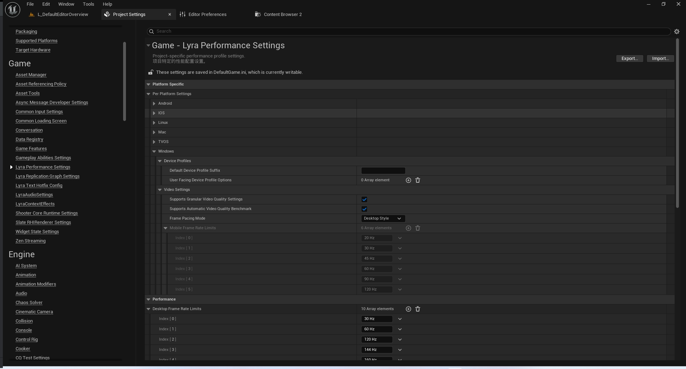
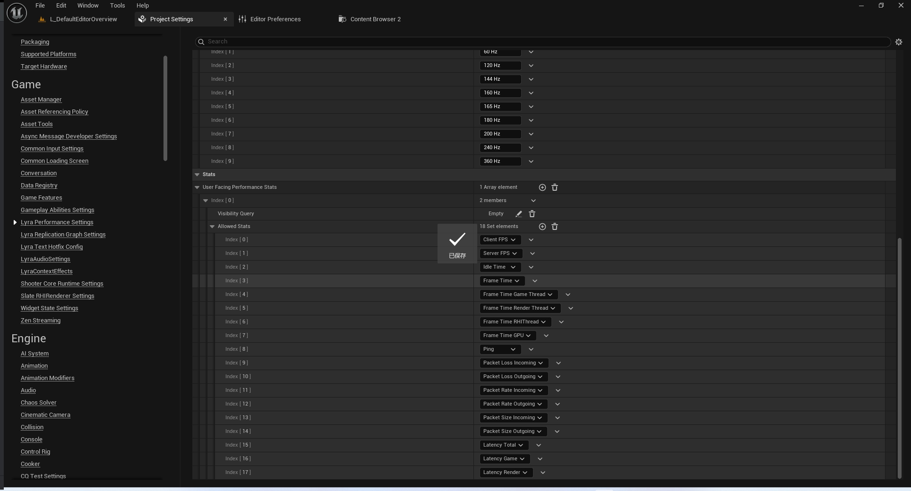

# UE5_Lyra学习指南_031_平台渲染设置

本文章仅为小刚-B站课堂-虚幻引擎视频课程Lyra-精讲的演讲手稿.  
本套课程链接:[[UE5]虚幻引擎游戏案例Lyra精讲](https://www.bilibili.com/cheese/play/ss112001159)  
前置课程链接:[[UE5]虚幻引擎UEC++从基础到进阶](https://www.bilibili.com/cheese/play/ss28043)  

文章内容由小刚撰写,采用了以下多种方式:  
1.口述转文字  
2.AI重构  
3.参考引擎源码  
4.Lyra工程源码  
5.结合社区论坛各位大佬的解析  

- [UE5\_Lyra学习指南\_031\_平台渲染设置](#ue5_lyra学习指南_031_平台渲染设置)
	- [概述](#概述)
	- [UPlatformSettings](#uplatformsettings)
	- [LyraPerformanceSettings](#lyraperformancesettings)
		- [初始化](#初始化)
		- [性能调试指标](#性能调试指标)
		- [统计数据的枚举类型](#统计数据的枚举类型)
		- [统计数据的显示类型](#统计数据的显示类型)
	- [LyraPlatformSpecificRenderingSettings](#lyraplatformspecificrenderingsettings)
		- [控制图像设置的策略](#控制图像设置的策略)
		- [用户的特定版本配置](#用户的特定版本配置)
		- [跨平台ini](#跨平台ini)
	- [代码](#代码)
	- [总结](#总结)


## 概述
ULyraPerformanceSettings和ULyraPlatformSpecificRenderingSettings搭配使用.
从而实现了针对不同平台进行自定义配置.



## UPlatformSettings
来自引擎源码的注释
``` txt
/**
 * The base class of any per platform settings.  The pattern for using these is as follows.
 * 
 * Step 1) Subclass UPlatformSettings, UMyPerPlatformSettings : public UPlatformSettings.
 * 
 * Step 2) For your system should already have a UDeveloperSettings that you created so that
 *         users can customize other properties for your system in the project.  On that class
 *         you need to create a property of type FPerPlatformSettings, e.g. 
 *         UPROPERTY(EditAnywhere, Category=Platform)
 *         FPerPlatformSettings PlatformOptions
 * 
 * Step 3) In your UDeveloperSettings subclasses construct, there should be a line like this,
 *         PlatformOptions.Settings.Initialize(UMyPerPlatformSettings::StaticClass());
 *         This will actually ensure that you initialize the settings exposed in the editor to whatever
 *         the current platform configuration is for them.
 * 
 * Step 4) Nothing else needed.  In your system code, you will just call 
 *         UMyPerPlatformSettings* MySettings = UPlatformSettingsManager::Get().GetSettingsForPlatform<UMyPerPlatformSettings>()
 *         that will get you the current settings for the active platform, or the simulated platform in the editor.
 */

```
``` txt
/**
任何针对特定平台的设置的基类。使用这些设置的模式如下所示。*
* 第 1 步）创建子类 UPlatformSettings，UMyPerPlatformSettings（继承自 UPlatformSettings）：public UPlatformSettings。*
* 第 2 步）由于您的系统已经有一个由您创建的 UDeveloperSettings 类，因此
*  用户可以在项目中为您的系统自定义其他属性。 在该类中，您需要创建一个类型为 FPerPlatformSettings 的属性，例如：
*  UPROPERTY(EditAnywhere， Category=平台)
*  FPerPlatformSettings 平台选项*
* 第 3 步）在您的 UDeveloperSettings 子类的构造函数中，应该有一行类似这样的代码：
*         PlatformOptions.Settings.Initialize(UMyPerPlatformSettings:：StaticClass())；
*         这实际上会确保您将编辑器中显示的设置初始化为当前平台配置所对应的值。*
* 第 4 步）无需其他操作。在您的系统代码中，您只需调用
*         UMyPerPlatformSettings* MySettings = UPlatformSettingsManager::Get().GetSettingsForPlatform<UMyPerPlatformSettings>()
*         这样就能获取到当前活动平台或编辑器中模拟平台的设置信息。*/

```
简而言之,你需要创建两个类.
第一个类继承自UPlatformSettings,作为自己的定义.
第二个类继承自UDeveloperSettingsBackedByCVars,用来持有.
然后在第二个类中调用初始化第一个类的类类型就可以完成映射.
## LyraPerformanceSettings
### 初始化
``` cpp
/**
 * Project-specific performance profile settings.
 * 项目特定的性能配置设置。
 */
UCLASS(config=Game, defaultconfig, meta=(DisplayName="Lyra Performance Settings"))
class ULyraPerformanceSettings : public UDeveloperSettingsBackedByCVars
{
	GENERATED_BODY()

public:
	ULyraPerformanceSettings();

private:
	// This is a special helper to expose the per-platform settings so they can be edited in the project settings
	// It never needs to be directly accessed
	// 这是一个专门的辅助工具，用于展示各个平台的设置信息，以便在项目设置中对其进行编辑
	// 无需直接访问此功能
	UPROPERTY(EditAnywhere, Category = "PlatformSpecific")
	FPerPlatformSettings PerPlatformSettings;
}
```

``` cpp
ULyraPerformanceSettings::ULyraPerformanceSettings()
{
	PerPlatformSettings.Initialize(ULyraPlatformSpecificRenderingSettings::StaticClass());
	//..

}

```

### 性能调试指标
``` cpp
	// The list of performance stats that can be enabled in Options by the user
	// 用户可在“选项”中启用的性能统计数据列表
	UPROPERTY(EditAnywhere, Config, Category=Stats)
	TArray<FLyraPerformanceStatGroup> UserFacingPerformanceStats;

```
``` cpp
// Describes a set of performance stats that the user can enable in settings,
// predicated on passing a visibility query on platform traits
// 描述了一组用户可在设置中启用的性能统计数据，
// 其条件是需在平台上进行特征查询以确定可见性
USTRUCT()
struct FLyraPerformanceStatGroup
{
	GENERATED_BODY()

	// A query on platform traits to determine whether or not it will be possible
	// to show a set of stats
	// 对平台特性进行查询，以确定是否能够展示一组统计数据
	UPROPERTY(EditAnywhere, meta=(Categories = "Input,Platform.Trait"))
	FGameplayTagQuery VisibilityQuery;

	// The set of stats to allow if the query passes
	// 如果查询通过，则允许使用的统计信息集合
	UPROPERTY(EditAnywhere)
	TSet<ELyraDisplayablePerformanceStat> AllowedStats;
};


```

### 统计数据的枚举类型
``` cpp

// Different kinds of stats that can be displayed on-screen
// 可以在屏幕上显示的各种统计数据
UENUM(BlueprintType)
enum class ELyraDisplayablePerformanceStat : uint8
{
	// stat fps (in Hz)
	// 显示帧率（单位：赫兹）
	ClientFPS,

	// server tick rate (in Hz)
	// 服务器更新频率（单位：赫兹）
	ServerFPS,
	
	// idle time spent waiting for vsync or frame rate limit (in seconds)
	// 空闲时间（以秒为单位）用于等待垂直同步或帧率限制完成
	IdleTime,

	// Stat unit overall (in seconds)
	// 总计统计单位（以秒为单位）
	FrameTime,

	// Stat unit (game thread, in seconds)
	// 状态单位（游戏线程，以秒为单位）
	FrameTime_GameThread,

	// Stat unit (render thread, in seconds)
	// 统计单位（渲染线程，以秒为单位）
	FrameTime_RenderThread,

	// Stat unit (RHI thread, in seconds)
	// 状态单位（RHI 线程，以秒为单位）
	FrameTime_RHIThread,

	// Stat unit (inferred GPU time, in seconds)
	// 状态单位（推断出的 GPU 运行时间，单位为秒）
	FrameTime_GPU,

	// Network ping (in ms)
	// 网络响应时间（以毫秒为单位）
	Ping,

	// The incoming packet loss percentage (%)
	// 正在传输的数据包丢失率（%）
	PacketLoss_Incoming,

	// The outgoing packet loss percentage (%)
	// 丢弃数据包的百分比（%）
	PacketLoss_Outgoing,

	// The number of packets received in the last second
	// 上一秒接收到的数据包数量
	PacketRate_Incoming,

	// The number of packets sent in the past second
	// 在过去一秒内发送的数据包数量
	PacketRate_Outgoing,

	// The avg. size (in bytes) of packets received
	// 接收的报文的平均大小（以字节为单位）
	PacketSize_Incoming,

	// The avg. size (in bytes) of packets sent
	// 发送的报文的平均大小（以字节为单位）
	PacketSize_Outgoing,

	// The total latency in MS of the game
	// 游戏的总延迟时间（以毫秒为单位）
	Latency_Total,

	// Game simulation start to driver submission end
	// 游戏模拟从驾驶员提交开始到结束
	Latency_Game,

	// OS render queue start to GPU render end
	// 操作系统渲染队列从开始到发送至 GPU 完成渲染
	Latency_Render,

	// New stats should go above here
	// 新的统计数据应在此处列出
	Count UMETA(Hidden)
};
// 定义枚举的对应的整型顺序
ENUM_RANGE_BY_COUNT(ELyraDisplayablePerformanceStat, ELyraDisplayablePerformanceStat::Count);
```

.注意最后那个宏.类似的还有从1,或者不连续的.此处不全部列出.点击看源码即可.
``` cpp
/**
 * Defines a contiguous enum range containing Count values, starting from zero:
 *
 * Example:
 *
 * enum class ECountedThing
 * {
 *     First,
 *     Second,
 *     Third,
 *
 *     Count
 * };
 *
 * // Defines iteration over ECountedThing to be: First, Second, Third
 * ENUM_RANGE_BY_COUNT(ECountedThing, ECountedThing::Count)
 */
#define ENUM_RANGE_BY_COUNT(EnumType, Count) ENUM_RANGE_BY_FIRST_AND_LAST(EnumType, 0, (std::underlying_type_t<EnumType>)(Count) - 1)
```

### 统计数据的显示类型
``` cpp
// Way to display the stat
// 显示状态的方式
UENUM(BlueprintType)
enum class ELyraStatDisplayMode : uint8
{
	// Don't show this stat
	// 不显示此统计数据
	Hidden,

	// Show this stat in text form
	// 以文本形式显示此统计数据
	TextOnly,

	// Show this stat in graph form
	// 将此数据以图表形式展示出来
	GraphOnly,

	// Show this stat as both text and graph
	// 将此统计数据以文字和图表两种形式展示出来
	TextAndGraph
};
```

## LyraPlatformSpecificRenderingSettings
此处只给出结构体和枚举的定义即可.成员变量的含义已在下面代码详细注释中.

### 控制图像设置的策略

``` cpp

// How hare frame pacing and overall graphics settings controlled/exposed for the platform?
// 在该平台上，帧率设置和整体图形设置是如何进行控制或展示的？
UENUM()
enum class ELyraFramePacingMode : uint8
{
	// Manual frame rate limits, user is allowed to choose whether or not to lock to vsync
	// 手动设定帧率限制，用户可以选择是否锁定到垂直同步机制。
	DesktopStyle,

	// Limits handled by choosing present intervals driven by device profiles
	// 通过选择由设备配置文件驱动的当前时间间隔来处理限制条件
	ConsoleStyle,

	// Limits handled by a user-facing choice of frame rate from among ones allowed by device profiles for the specific device
	// 用户可通过针对特定设备选择设备配置文件所允许的帧率范围来限制画面的刷新速率。
	MobileStyle
};
```

### 用户的特定版本配置
``` cpp

// Describes one platform-specific device profile variant that the user can choose from in the UI
// 描述了一个用户在用户界面中可以选择的平台特定设备配置版本。
USTRUCT()
struct FLyraQualityDeviceProfileVariant
{
	GENERATED_BODY()

	// The display name for this device profile variant (visible in the options screen)
	// 此设备配置版本的显示名称（可在选项界面中查看）
	UPROPERTY(EditAnywhere)
	FText DisplayName;

	// The suffix to append to the base device profile name for the current platform
	// 用于当前平台的基设备配置文件名称的后缀名称
	UPROPERTY(EditAnywhere)
	FString DeviceProfileSuffix;

	// The minimum required refresh rate to enable this mode
	// (e.g., if this is set to 120 Hz and the device is connected
	// to a 60 Hz display, it won't be available)
	
	// 使此模式生效所需的最低刷新率
	// （例如，如果将此设置为 120 赫兹，而设备连接到 60 赫兹的显示器，那么此模式将不可用）
	UPROPERTY(EditAnywhere)
	int32 MinRefreshRate = 0;
};


```

### 跨平台ini
AndroidGame.ini
``` ini
[LyraPlatformSpecificRenderingSettings_Android LyraPlatformSpecificRenderingSettings]
FramePacingMode=MobileStyle
bSupportsGranularVideoQualitySettings=false
bSupportsAutomaticVideoQualityBenchmark=false
```
IOSGame.ini
``` ini
[LyraPlatformSpecificRenderingSettings_IOS LyraPlatformSpecificRenderingSettings]
FramePacingMode=MobileStyle
bSupportsGranularVideoQualitySettings=false
bSupportsAutomaticVideoQualityBenchmark=false

```
DefaultGame.ini
``` ini
[LyraPlatformSpecificRenderingSettings_Windows LyraPlatformSpecificRenderingSettings]
DefaultDeviceProfileSuffix=
bSupportsGranularVideoQualitySettings=True
bSupportsAutomaticVideoQualityBenchmark=True
FramePacingMode=DesktopStyle
+MobileFrameRateLimits=20
+MobileFrameRateLimits=30
+MobileFrameRateLimits=45
+MobileFrameRateLimits=60
+MobileFrameRateLimits=90
+MobileFrameRateLimits=120
```
## 代码
LyraPerformanceSettings.h
``` cpp


UCLASS(config=Game, defaultconfig)
class ULyraPlatformSpecificRenderingSettings : public UPlatformSettings
{
	GENERATED_BODY()

public:
	ULyraPlatformSpecificRenderingSettings();

	// Helper method to get the performance settings object, directed via platform settings
	// 用于获取性能设置对象的辅助方法，通过平台设置进行引导
	static const ULyraPlatformSpecificRenderingSettings* Get();

public:
	// The default variant suffix to append, should typically be a member of
	// UserFacingDeviceProfileOptions unless there is only one for the current platform
	//
	// Note that this will usually be set from platform-specific ini files, not via the UI
	// 默认要添加的变体后缀，通常应为“用户可见设备配置选项”中的一个选项，除非当前平台仅有一个此类选项。
	// 
	// 请注意，通常此设置是通过特定平台的配置文件进行设定的，而非通过用户界面来完成的。
	UPROPERTY(EditAnywhere, Config, Category=DeviceProfiles)
	FString DefaultDeviceProfileSuffix;

	// The list of device profile variations to allow users to choose from in settings
	//
	// These should be sorted from slowest to fastest by target frame rate:
	//   If the current display doesn't support a user chosen refresh rate, we'll try
	//   previous entries until we find one that works
	//
	// Note that this will usually be set from platform-specific ini files, not via the UI
	//
	// 设备配置文件的多种变体列表，供用户在设置中进行选择使用//
	// 应按照目标帧率从慢到快的顺序对这些进行排序：
	//   如果当前显示设备不支持用户选择的刷新率，我们将依次尝试之前的设置，直到找到可行的设置为止。
	//
	// 请注意，通常此设置是通过特定平台的配置文件进行设定的，而非通过用户界面来完成的。
	UPROPERTY(EditAnywhere, Config, Category=DeviceProfiles)
	TArray<FLyraQualityDeviceProfileVariant> UserFacingDeviceProfileOptions;

	// Does the platform support granular video quality settings?
	// 该平台是否支持精细的视频质量设置？
	UPROPERTY(EditAnywhere, Config, Category=VideoSettings)
	bool bSupportsGranularVideoQualitySettings = true;

	// Does the platform support running the automatic quality benchmark (typically this should only be true if bSupportsGranularVideoQualitySettings is also true)
	// 该平台是否支持运行自动质量基准测试（通常情况下，只有在 bSupportsGranularVideoQualitySettings 也为真的情况下，此功能才应处于启用状态）
	UPROPERTY(EditAnywhere, Config, Category=VideoSettings)
	bool bSupportsAutomaticVideoQualityBenchmark = true;

	// How is frame pacing controlled
	// 帧节奏是如何被控制的
	UPROPERTY(EditAnywhere, Config, Category=VideoSettings)
	ELyraFramePacingMode FramePacingMode = ELyraFramePacingMode::DesktopStyle;

	// Potential frame rates to display for mobile
	// Note: This is further limited by Lyra.DeviceProfile.Mobile.MaxFrameRate from the
	// 适用于移动设备的潜在显示帧率
	// 注意：此值还会受到平台特定设备配置文件中的“Lyra.DeviceProfile.Mobile.MaxFrameRate”以及平台帧速率调节器所报告的可支持的帧率的限制
	UPROPERTY(EditAnywhere, Config, Category=VideoSettings, meta=(EditCondition="FramePacingMode==ELyraFramePacingMode::MobileStyle", ForceUnits=Hz))
	TArray<int32> MobileFrameRateLimits;
};

//////////////////////////////////////////////////////////////////////

/**
 * Project-specific performance profile settings.
 * 项目特定的性能配置设置。
 */
UCLASS(config=Game, defaultconfig, meta=(DisplayName="Lyra Performance Settings"))
class ULyraPerformanceSettings : public UDeveloperSettingsBackedByCVars
{
	GENERATED_BODY()

public:
	ULyraPerformanceSettings();

private:
	// This is a special helper to expose the per-platform settings so they can be edited in the project settings
	// It never needs to be directly accessed
	// 这是一个专门的辅助工具，用于展示各个平台的设置信息，以便在项目设置中对其进行编辑
	// 无需直接访问此功能
	UPROPERTY(EditAnywhere, Category = "PlatformSpecific")
	FPerPlatformSettings PerPlatformSettings;

public:
	// The list of frame rates to allow users to choose from in the various
	// "frame rate limit" video settings on desktop platforms
	// 在桌面平台的各种“帧率限制”视频设置中，可供用户选择的帧率列表
	UPROPERTY(EditAnywhere, Config, Category=Performance, meta=(ForceUnits=Hz))
	TArray<int32> DesktopFrameRateLimits;

	// The list of performance stats that can be enabled in Options by the user
	// 用户可在“选项”中启用的性能统计数据列表
	UPROPERTY(EditAnywhere, Config, Category=Stats)
	TArray<FLyraPerformanceStatGroup> UserFacingPerformanceStats;
};

```

## 总结
此节作为本地游戏设置的外部调用补充节.