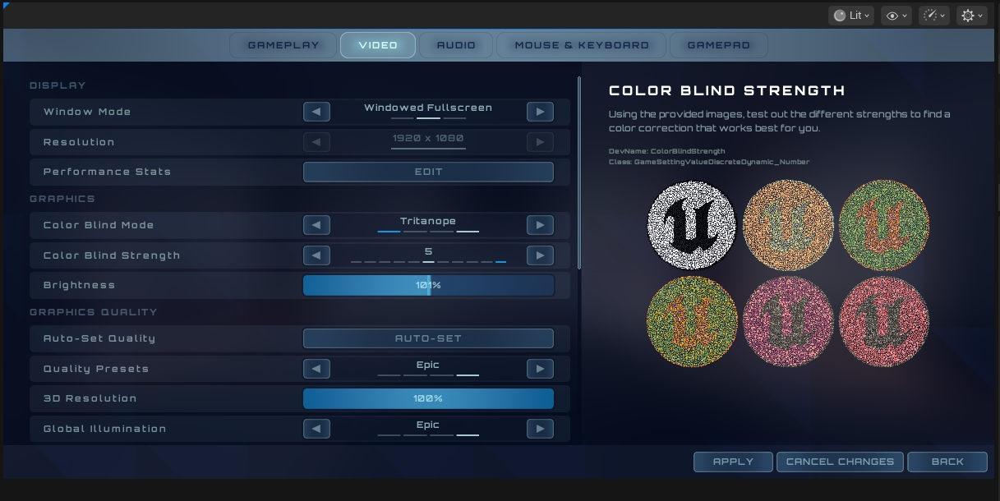

# UE5_Lyra学习指南_033_Lyra共享游戏设置

本文章仅为小刚-B站课堂-虚幻引擎视频课程Lyra-精讲的演讲手稿.  
本套课程链接:[[UE5]虚幻引擎游戏案例Lyra精讲](https://www.bilibili.com/cheese/play/ss112001159)  
前置课程链接:[[UE5]虚幻引擎UEC++从基础到进阶](https://www.bilibili.com/cheese/play/ss28043)  

文章内容由小刚撰写,采用了以下多种方式:  
1.口述转文字  
2.AI重构  
3.参考引擎源码  
4.Lyra工程源码  
5.结合社区论坛各位大佬的解析  

- [UE5\_Lyra学习指南\_033\_Lyra共享游戏设置](#ue5_lyra学习指南_033_lyra共享游戏设置)
	- [概述](#概述)
		- [通用功能](#通用功能)
			- [读取](#读取)
			- [存储](#存储)
			- [应用](#应用)
			- [变更属性触发代理](#变更属性触发代理)
		- [字幕](#字幕)
		- [后台音量](#后台音量)
		- [文化语言](#文化语言)
		- [鼠标灵敏度](#鼠标灵敏度)
		- [手柄灵敏度](#手柄灵敏度)
		- [力反馈](#力反馈)
		- [色盲](#色盲)
	- [版本设置](#版本设置)
	- [代码](#代码)
	- [总结](#总结)


## 概述
LyraSettingsShared存储的设置主要是用户可以在不同设备进行共享的设置.如是否开启力反馈,色盲,控制器灵敏度,字幕,文化语言等.

### 通用功能
#### 读取
``` cpp

	/** Creates a temporary settings object, this will be replaced by one loaded from the user's save game */
	/** 创建一个临时的设置对象，该对象将被从用户的游戏存档中加载的设置对象所替换 */
	static ULyraSettingsShared* CreateTemporarySettings(const ULyraLocalPlayer* LocalPlayer);
	
	/** Synchronously loads a settings object, this is not valid to call before login */
	/** 同步加载一个设置对象，此操作在登录之前不可执行 */
	static ULyraSettingsShared* LoadOrCreateSettings(const ULyraLocalPlayer* LocalPlayer);

	/** Starts an async load of the settings object, calls Delegate on completion */
	/** 启动对设置对象的异步加载过程，完成时调用委托函数 */
	static bool AsyncLoadOrCreateSettings(const ULyraLocalPlayer* LocalPlayer, FOnSettingsLoadedEvent Delegate);
```
这里均是调用父类的方法.
在加载完成之后需要手动调用应用设置
``` cpp
ULyraSettingsShared* ULyraSettingsShared::CreateTemporarySettings(const ULyraLocalPlayer* LocalPlayer)
{
	// This is not loaded from disk but should be set up to save
	// 这并非从磁盘加载而来，而是应当进行设置以便进行保存操作。

	// 这里是直接调用的父类的方法
	ULyraSettingsShared* SharedSettings = Cast<ULyraSettingsShared>(CreateNewSaveGameForLocalPlayer(ULyraSettingsShared::StaticClass(), LocalPlayer, SHARED_SETTINGS_SLOT_NAME));

	SharedSettings->ApplySettings();

	return SharedSettings;
}

```

#### 存储
``` cpp
void ULyraSettingsShared::SaveSettings()
{
	// Schedule an async save because it's okay if it fails
	// 安排一次异步保存操作，因为即便保存失败也没关系。
	AsyncSaveGameToSlotForLocalPlayer();

	// TODO_BH: Move this to the serialize function instead with a bumped version number
	// 待办事项_BH：将此内容移至序列化函数中，并使用更高的版本号进行处理
	if (UEnhancedInputLocalPlayerSubsystem* System = ULocalPlayer::GetSubsystem<UEnhancedInputLocalPlayerSubsystem>(OwningPlayer))
	{
		if (UEnhancedInputUserSettings* InputSettings = System->GetUserSettings())
		{
			InputSettings->AsyncSaveSettings();
		}
	}
}

```
这里又引入了一个输入设置UEnhancedInputUserSettings
引擎源码注释:
``` cpp
/**
 * The Enhanced Input User Settings class is a place where you can put all of your Input Related settings
 * that you want your user to be able to change. Things like their key mappings, aim sensitivity, accessibility
 * settings, etc. This also provides a Registration point for Input Mappings Contexts (IMC) from possibly unloaded
 * plugins (i.e. Game Feature Plugins). You can register your IMC from a Game Feature Action plugin here, and then
 * have access to all the key mappings available. This is very useful for building settings screens because you can
 * now access all the mappings in your game, even if the entire plugin isn't loaded yet. 
 *
 * The user settings are stored on each UEnhancedPlayerInput object, so each instance of the settings can represent
 * a single User or Local Player.
 *
 * To customize this for your game, you can create a subclass of it and change the "UserSettingsClass" in the
 * Enhanced Input Project Settings.
 */
UCLASS(MinimalAPI, config=GameUserSettings, DisplayName="Enhanced Input User Settings", Category="Enhanced Input|User Settings")
class UEnhancedInputUserSettings : public USaveGame
{
	GENERATED_BODY()
}

```
``` txt
/**
* “增强型输入用户设置”类是一个存放所有与输入相关设置的区域，这些设置是你希望用户能够进行更改的。比如按键映射、瞄准灵敏度、可访问性设置等等。此外，它还为来自可能未加载的插件（例如游戏功能插件）的输入映射上下文（IMC）提供了注册点。你可以在此处从游戏功能操作插件中注册你的 IMC，然后就能访问到所有可用的按键映射。这对于构建设置界面非常有用，因为现在你可以访问到游戏中的所有映射，即便整个插件尚未加载完成。
用户设置存储在每个 UEnhancedPlayerInput 对象中，因此每个设置实例都可以代表一个单独的用户或本地玩家。
若要根据您的游戏进行此设置的个性化调整，您可以创建其子类，并在“增强输入项目设置”中更改“用户设置类”。
*/

```
项目实际实现
``` cpp
/** 
 * Custom settings class for any input related settings for the Lyra game.
 * This will be serialized out at the same time as the Lyra Shared Settings and is
 * compatible with cloud saves through by calling the "Serialize" function.
 *
 * 用于 Lyra 游戏中所有与输入相关设置的自定义设置类。
 * 这些设置将在与 Lyra 共享设置一同序列化输出，并且通过调用“序列化”函数可与云保存功能兼容。
 */
UCLASS(MinimalAPI)
class ULyraInputUserSettings : public UEnhancedInputUserSettings
{
	GENERATED_BODY()
public:
	//~ Begin UEnhancedInputUserSettings interface
	UE_API virtual void ApplySettings() override;
	//~ End UEnhancedInputUserSettings interface

	// Add any additional Input Settings here!
	// Some ideas could be:
	// - "toggle vs. hold" to trigger in game actions
	// - aim sensitivity should go here
	// - etc

	// 在此添加任何额外的输入设置！
	// 可能的设置包括：
	// - “切换与保持”以触发游戏中的操作
	// - 目标灵敏度应设置于此处
	// - 等等

	// Make sure to mark your properties with the "SaveGame" metadata to have them serialize when saved
	//UPROPERTY(SaveGame, BlueprintReadWrite, Category="Enhanced Input|User Settings")
	// bool bSomeExampleProperty;

	// 请务必为您的属性添加“SaveGame”元数据，以便在保存时对其进行序列化处理
	//UPROPERTY(SaveGame，蓝图可读可写，类别“增强输入|用户设置”)
	// bool b某些示例属性
};
```

#### 应用
``` cpp
void ULyraSettingsShared::ApplySettings()
{
	// 应用字幕设置
	ApplySubtitleOptions();
	
	// 应用后台音量设置
	ApplyBackgroundAudioSettings();

	// 应用文化设置
	ApplyCultureSettings();

	// 应用输入设置
	if (UEnhancedInputLocalPlayerSubsystem* System = ULocalPlayer::GetSubsystem<UEnhancedInputLocalPlayerSubsystem>(OwningPlayer))
	{
		if (UEnhancedInputUserSettings* InputSettings = System->GetUserSettings())
		{
			InputSettings->ApplySettings();
		}
	}
}


```
#### 变更属性触发代理

如果修改的这个值和原值不一样,标记自身为脏,然后触发设置变更的代理.
``` cpp
	////////////////////////////////////////////////////////
	/// Dirty and Change Reporting
	/// 污染与变更报告
private:
	// 如果值有改变 则改变并标记为脏
	template<typename T>
	bool ChangeValueAndDirty(T& CurrentValue, const T& NewValue)
	{
		if (CurrentValue != NewValue)
		{
			CurrentValue = NewValue;
			bIsDirty = true;
			OnSettingChanged.Broadcast(this);
			
			return true;
		}

		return false;
	}

	bool bIsDirty = false;
```

### 字幕

``` cpp
void ULyraSettingsShared::ApplySubtitleOptions()
{
	// 获取字幕展示的子系统
	if (USubtitleDisplaySubsystem* SubtitleSystem = USubtitleDisplaySubsystem::Get(OwningPlayer))
	{
		// 字幕格式
		FSubtitleFormat SubtitleFormat;
		SubtitleFormat.SubtitleTextSize = SubtitleTextSize;
		SubtitleFormat.SubtitleTextColor = SubtitleTextColor;
		SubtitleFormat.SubtitleTextBorder = SubtitleTextBorder;
		SubtitleFormat.SubtitleBackgroundOpacity = SubtitleBackgroundOpacity;

		SubtitleSystem->SetSubtitleDisplayOptions(SubtitleFormat);
	}
}
```
成员变量
``` cpp
	// 是否开启字幕
	UPROPERTY()
	bool bEnableSubtitles = true;

	// 字体大小
	UPROPERTY()
	ESubtitleDisplayTextSize SubtitleTextSize = ESubtitleDisplayTextSize::Medium;

	// 字体颜色
	UPROPERTY()
	ESubtitleDisplayTextColor SubtitleTextColor = ESubtitleDisplayTextColor::White;

	// 字体边框
	UPROPERTY()
	ESubtitleDisplayTextBorder SubtitleTextBorder = ESubtitleDisplayTextBorder::None;

	// 字体背景透明度
	UPROPERTY()
	ESubtitleDisplayBackgroundOpacity SubtitleBackgroundOpacity = ESubtitleDisplayBackgroundOpacity::Medium;
```

Get,Set方法
``` cpp
	////////////////////////////////////////////////////////
	// Subtitles
	// 字幕
public:

	// 获取字幕是否开启
	UFUNCTION()
	bool GetSubtitlesEnabled() const { return bEnableSubtitles; }

	// 开启字幕
	UFUNCTION()
	void SetSubtitlesEnabled(bool Value) { ChangeValueAndDirty(bEnableSubtitles, Value); }

	// 获取字体大小
	UFUNCTION()
	ESubtitleDisplayTextSize GetSubtitlesTextSize() const { return SubtitleTextSize; }

	// 设置字体大小
	UFUNCTION()
	void SetSubtitlesTextSize(ESubtitleDisplayTextSize Value) { ChangeValueAndDirty(SubtitleTextSize, Value); ApplySubtitleOptions(); }

	// 获取字体颜色
	UFUNCTION()
	ESubtitleDisplayTextColor GetSubtitlesTextColor() const { return SubtitleTextColor; }

	// 设置字体颜色
	UFUNCTION()
	void SetSubtitlesTextColor(ESubtitleDisplayTextColor Value) { ChangeValueAndDirty(SubtitleTextColor, Value); ApplySubtitleOptions(); }

	// 获取字体边框
	UFUNCTION()
	ESubtitleDisplayTextBorder GetSubtitlesTextBorder() const { return SubtitleTextBorder; }

	// 设置字体边框
	UFUNCTION()
	void SetSubtitlesTextBorder(ESubtitleDisplayTextBorder Value) { ChangeValueAndDirty(SubtitleTextBorder, Value); ApplySubtitleOptions(); }

	// 获取字幕背景和透明度
	UFUNCTION()
	ESubtitleDisplayBackgroundOpacity GetSubtitlesBackgroundOpacity() const { return SubtitleBackgroundOpacity; }

	// 设置题目背景和透明度
	UFUNCTION()
	void SetSubtitlesBackgroundOpacity(ESubtitleDisplayBackgroundOpacity Value) { ChangeValueAndDirty(SubtitleBackgroundOpacity, Value); ApplySubtitleOptions(); }

	// 应用字幕设置
	void ApplySubtitleOptions();

```


### 后台音量
``` cpp
void ULyraSettingsShared::ApplyBackgroundAudioSettings()
{
	if (OwningPlayer && OwningPlayer->IsPrimaryPlayer())
	{
		/**
		 * 设置未聚焦音量倍数
		 * 
		 */
		FApp::SetUnfocusedVolumeMultiplier((AllowAudioInBackground != ELyraAllowBackgroundAudioSetting::Off) ? 1.0f : 0.0f);
	}
}

```
枚举:

``` cpp
// 允许的后台音乐设置
UENUM(BlueprintType)
enum class ELyraAllowBackgroundAudioSetting : uint8
{
	// 关闭
	Off,
	// 所有
	AllSounds,
	// 最大数量
	Num UMETA(Hidden),
};
```
Get,Set方法
``` cpp
	////////////////////////////////////////////////////////
	// Shared audio settings
public:
	// 获取是否允许后台音频
	UFUNCTION()
	ELyraAllowBackgroundAudioSetting GetAllowAudioInBackgroundSetting() const { return AllowAudioInBackground; }

	// 设置后台音量
	UFUNCTION()
	void SetAllowAudioInBackgroundSetting(ELyraAllowBackgroundAudioSetting NewValue);

	// 应用后台音量设置
	void ApplyBackgroundAudioSettings();

private:
	// 后台音量设置模式
	UPROPERTY()
	ELyraAllowBackgroundAudioSetting AllowAudioInBackground = ELyraAllowBackgroundAudioSetting::Off;
```
### 文化语言
执行逻辑:
``` cpp


void ULyraSettingsShared::ApplyCultureSettings()
{
	// 是否需要重置到默认
	if (bResetToDefaultCulture)
	{
		const FCulturePtr SystemDefaultCulture = FInternationalization::Get().GetDefaultCulture();
		check(SystemDefaultCulture.IsValid());

		const FString CultureToApply = SystemDefaultCulture->GetName();

		/**
		 * 按名称设置当前文化。
		 * @注意 此函数功能强大，会同时设置语言和区域设置，并清除可能已设置的任何资产组文化。
		 * @注意 在核心/引擎代码中应避免使用 SetCurrentCulture，因为这可能会覆盖编辑器/游戏用户的设置。
		 * 
		 */
		if (FInternationalization::Get().SetCurrentCulture(CultureToApply))
		{
			// Clear this string
			GConfig->RemoveKey(TEXT("Internationalization"), TEXT("Culture"), GGameUserSettingsIni);
			GConfig->Flush(false, GGameUserSettingsIni);
		}
		bResetToDefaultCulture = false;
	}
	else if (!PendingCulture.IsEmpty())
	{
		// SetCurrentCulture may trigger PendingCulture to be cleared (if a culture change is broadcast) so we take a copy of it to work with
		// 设置当前文化可能会导致“待处理文化”被清除（如果进行了文化变更广播的话），因此我们先复制一份该文化信息以便进行处理。
		const FString CultureToApply = PendingCulture;
		if (FInternationalization::Get().SetCurrentCulture(CultureToApply))
		{
			// Note: This is intentionally saved to the users config
			// We need to localize text before the player logs in and very early in the loading screen

			// 注意：此内容是特意保存至用户配置文件中的。
			// 我们需要在玩家登录之前以及在加载界面的早期阶段对文本进行本地化处理。
			GConfig->SetString(TEXT("Internationalization"), TEXT("Culture"), *CultureToApply, GGameUserSettingsIni);
			GConfig->Flush(false, GGameUserSettingsIni);
		}
		ClearPendingCulture();
	}
}

```
Get,Set函数
``` cpp

	////////////////////////////////////////////////////////
	// Culture / language
	// 文化 / 语言

public:
	
	/** Gets the pending culture */
	/** 获取待选文化 */
	const FString& GetPendingCulture() const;

	/** Sets the pending culture to apply */
	/** 设置要应用的待定文化 */
	void SetPendingCulture(const FString& NewCulture);

	// Called when the culture changes.
	// 当文化发生改变时触发此事件。
	void OnCultureChanged();

	/** Clears the pending culture to apply */
	/** 清除待应用的语言设置 */
	void  ClearPendingCulture();

	// 是否在使用默认的文化
	bool IsUsingDefaultCulture() const;

	// 恢复至默认文化
	void ResetToDefaultCulture();
	// 是否需要恢复至默认文化
	bool ShouldResetToDefaultCulture() const { return bResetToDefaultCulture; }

	// 应用文化设置
	void ApplyCultureSettings();
	// 恢复到现在得设置 放弃更改
	void ResetCultureToCurrentSettings();

private:
	/** The pending culture to apply */
	/** 正在应用的待定文化 */
	UPROPERTY(Transient)
	FString PendingCulture;

	/* If true, resets the culture to default. */
	/* 若为真，则将语言设置重置为默认值。*/
	bool bResetToDefaultCulture = false;
```

### 鼠标灵敏度
``` cpp
private:
	/** Holds the mouse horizontal sensitivity */
	/** 存储鼠标水平灵敏度值 */
	UPROPERTY()
	double MouseSensitivityX = 1.0;

	/** Holds the mouse vertical sensitivity */
	/** 存储鼠标垂直灵敏度值 */
	UPROPERTY()
	double MouseSensitivityY = 1.0;

	/** Multiplier applied while Aiming down sights. */
	/** 在瞄准瞄准镜时所使用的乘数。*/
	UPROPERTY()
	double TargetingMultiplier = 0.5;

	/** If true then the vertical look axis should be inverted */
	/** 如果为真，则垂直观察轴应进行反转 */
	UPROPERTY()
	bool bInvertVerticalAxis = false;

	/** If true then the horizontal look axis should be inverted */
	/** 如果为真，则水平观察轴应进行反转 */
	UPROPERTY()
	bool bInvertHorizontalAxis = false;

```
### 手柄灵敏度
枚举:
``` cpp
// 灵敏度
UENUM(BlueprintType)
enum class ELyraGamepadSensitivity : uint8
{
	// 无效
	Invalid = 0		UMETA(Hidden),

	// 慢
	Slow			UMETA(DisplayName = "01 - Slow"),

	// 慢+
	SlowPlus		UMETA(DisplayName = "02 - Slow+"),

	// 慢++
	SlowPlusPlus	UMETA(DisplayName = "03 - Slow++"),

	// 正常
	Normal			UMETA(DisplayName = "04 - Normal"),

	// 正常+
	NormalPlus		UMETA(DisplayName = "05 - Normal+"),

	// 正常++
	NormalPlusPlus	UMETA(DisplayName = "06 - Normal++"),

	// 快
	Fast			UMETA(DisplayName = "07 - Fast"),

	// 快++
	FastPlus		UMETA(DisplayName = "08 - Fast+"),

	// 快++
	FastPlusPlus	UMETA(DisplayName = "09 - Fast++"),

	// 疯狂
	Insane			UMETA(DisplayName = "10 - Insane"),

	MAX				UMETA(Hidden),
};
```
``` cpp
private:
	UPROPERTY()
	ELyraGamepadSensitivity GamepadLookSensitivityPreset = ELyraGamepadSensitivity::Normal;
	UPROPERTY()
	ELyraGamepadSensitivity GamepadTargetingSensitivityPreset = ELyraGamepadSensitivity::Normal;

```

### 力反馈


``` cpp
public:

	// 获取力反馈
	UFUNCTION()
	bool GetForceFeedbackEnabled() const { return bForceFeedbackEnabled; }

	// 更改力反馈
	UFUNCTION()
	void SetForceFeedbackEnabled(const bool NewValue) { ChangeValueAndDirty(bForceFeedbackEnabled, NewValue); }
	
private:
	/** Is force feedback enabled when a controller is being used? */
	/** 当使用控制器时，力反馈功能是否已开启？*/
	UPROPERTY()
	bool bForceFeedbackEnabled = true;

```
### 色盲
枚举定义
``` cpp
// 色盲模式
UENUM(BlueprintType)
enum class EColorBlindMode : uint8
{
	// 关闭
	Off,
	// Deuteranope (green weak/blind)
	// 褐色盲（绿色视觉较弱/失明）
	Deuteranope,
	// Protanope (red weak/blind)
	// 蓝红色弱视/盲视者
	Protanope,
	// Tritanope(blue weak / bind)
	// 三色盲（蓝色较弱/易褪色）
	Tritanope
};
```


执行逻辑
``` cpp
void ULyraSettingsShared::SetColorBlindMode(EColorBlindMode InMode)
{
	if (ColorBlindMode != InMode)
	{
		ColorBlindMode = InMode;
		FSlateApplication::Get().GetRenderer()->SetColorVisionDeficiencyType(
			(EColorVisionDeficiency)(int32)ColorBlindMode, (int32)ColorBlindStrength, true, false);
	}
}

```
``` cpp
private:
	// 色盲模式
	UPROPERTY()
	EColorBlindMode ColorBlindMode = EColorBlindMode::Off;

	UPROPERTY()
	int32 ColorBlindStrength = 10;

```

## 版本设置
``` cpp
int32 ULyraSettingsShared::GetLatestDataVersion() const
{
	// 0 = before subclassing ULocalPlayerSaveGame
	// 1 = first proper version

	// 0 = 在对 ULocalPlayerSaveGame 进行子类化之前
	// 1 = 第一个正式版本
	
	return 1;
}

```

## 代码
``` cpp
/**
 * ULyraSettingsShared - The "Shared" settings are stored as part of the USaveGame system, these settings are not machine
 * specific like the local settings, and are safe to store in the cloud - and 'share' them.  Using the save game system
 * we can also store settings per player, so things like controller keybind preferences should go here, because if those
 * are stored in the local settings all users would get them.
 *
 * ULyraSettingsShared - “共享”设置被存储在 USaveGame 系统中，与本地设置不同，这些设置并非针对特定机器的，而且可以安全地存储在云端并进行“共享”。通过使用保存游戏系统，我们还可以为每个玩家存储设置，比如控制器按键绑定偏好就应存放在这里，因为如果这些设置存放在本地设置中，那么所有用户都会获取到它们。
 *
 */
UCLASS()
class ULyraSettingsShared : public ULocalPlayerSaveGame
{
	GENERATED_BODY()

public:
	
	// 共享设置变更代理 用于控制器绑定获取是否开启力反馈
	DECLARE_EVENT_OneParam(ULyraSettingsShared, FOnSettingChangedEvent, ULyraSettingsShared* Settings);
	FOnSettingChangedEvent OnSettingChanged;

public:
	// 构造函数 绑定本地化变更代理 初始化手柄盲区值
	ULyraSettingsShared();

	//~ULocalPlayerSaveGame interface
	// 修改存档版本值
	int32 GetLatestDataVersion() const override;
	//~End of ULocalPlayerSaveGame interface

	// 是否有修改
	bool IsDirty() const { return bIsDirty; }

	// 清楚修改标记
	void ClearDirtyFlag() { bIsDirty = false; }

	/** Creates a temporary settings object, this will be replaced by one loaded from the user's save game */
	/** 创建一个临时的设置对象，该对象将被从用户的游戏存档中加载的设置对象所替换 */
	static ULyraSettingsShared* CreateTemporarySettings(const ULyraLocalPlayer* LocalPlayer);
	
	/** Synchronously loads a settings object, this is not valid to call before login */
	/** 异步加载一个设置对象，此操作在登录之前不可执行 */
	static ULyraSettingsShared* LoadOrCreateSettings(const ULyraLocalPlayer* LocalPlayer);

	DECLARE_DELEGATE_OneParam(FOnSettingsLoadedEvent, ULyraSettingsShared* Settings);

	/** Starts an async load of the settings object, calls Delegate on completion */
	/** 启动对设置对象的异步加载过程，完成时调用委托函数 */
	static bool AsyncLoadOrCreateSettings(const ULyraLocalPlayer* LocalPlayer, FOnSettingsLoadedEvent Delegate);

	/** Saves the settings to disk */
	/** 将设置保存至磁盘 */
	void SaveSettings();

	/** Applies the current settings to the player */
	/** 将当前设置应用到玩家身上 */
	void ApplySettings();
	
public:
	////////////////////////////////////////////////////////
	// Color Blind Options
	// 色盲选项
		
	// 获取色盲模式
	UFUNCTION()
	EColorBlindMode GetColorBlindMode() const;

	// 设置色盲模式
	UFUNCTION()
	void SetColorBlindMode(EColorBlindMode InMode);

	// 获取色盲模式强度
	UFUNCTION()
	int32 GetColorBlindStrength() const;

	// 设置蛇魔模式强度
	UFUNCTION()
	void SetColorBlindStrength(int32 InColorBlindStrength);

private:
	// 色盲模式
	UPROPERTY()
	EColorBlindMode ColorBlindMode = EColorBlindMode::Off;

	UPROPERTY()
	int32 ColorBlindStrength = 10;

    ////////////////////////////////////////////////////////
	// Gamepad Vibration
	// 手柄震动
	
public:

	// 获取力反馈
	UFUNCTION()
	bool GetForceFeedbackEnabled() const { return bForceFeedbackEnabled; }

	// 更改力反馈
	UFUNCTION()
	void SetForceFeedbackEnabled(const bool NewValue) { ChangeValueAndDirty(bForceFeedbackEnabled, NewValue); }
	
private:
	/** Is force feedback enabled when a controller is being used? */
	/** 当使用控制器时，力反馈功能是否已开启？*/
	UPROPERTY()
	bool bForceFeedbackEnabled = true;

	////////////////////////////////////////////////////////
	// Gamepad Deadzone
	// 游戏手柄死区

	
public:
	/** Getter for gamepad move stick dead zone value. */
	/** 获取游戏手柄移动摇杆的无效区域值的获取器。*/
	UFUNCTION()
	float GetGamepadMoveStickDeadZone() const { return GamepadMoveStickDeadZone; }

	/** Setter for gamepad move stick dead zone value. */
	/** 游戏手柄移动杆死区值的设置器。*/
	UFUNCTION()
	void SetGamepadMoveStickDeadZone(const float NewValue) { ChangeValueAndDirty(GamepadMoveStickDeadZone, NewValue); }

	/** Getter for gamepad look stick dead zone value. */
	/** 获取游戏手柄瞄准杆盲区值的获取器。*/
	UFUNCTION()
	float GetGamepadLookStickDeadZone() const { return GamepadLookStickDeadZone; }

	/** Setter for gamepad look stick dead zone value. */
	/** 游戏手柄视角操纵杆死区值的设置器。*/
	UFUNCTION()
	void SetGamepadLookStickDeadZone(const float NewValue) { ChangeValueAndDirty(GamepadLookStickDeadZone, NewValue); }

private:
	/** Holds the gamepad move stick dead zone value. */
	/** 保存游戏手柄移动操纵杆的死区值。*/
	UPROPERTY()
	float GamepadMoveStickDeadZone;

	/** Holds the gamepad look stick dead zone value. */
	/** 存储游戏手柄瞄准杆的盲区值。*/
	UPROPERTY()
	float GamepadLookStickDeadZone;

	////////////////////////////////////////////////////////
	// Gamepad Trigger Haptics
	// 游戏手柄触觉反馈
public:
	UFUNCTION()
	bool GetTriggerHapticsEnabled() const { return bTriggerHapticsEnabled; }
	UFUNCTION()
	void SetTriggerHapticsEnabled(const bool NewValue) { ChangeValueAndDirty(bTriggerHapticsEnabled, NewValue); }

	UFUNCTION()
	bool GetTriggerPullUsesHapticThreshold() const { return bTriggerPullUsesHapticThreshold; }
	UFUNCTION()
	void SetTriggerPullUsesHapticThreshold(const bool NewValue) { ChangeValueAndDirty(bTriggerPullUsesHapticThreshold, NewValue); }

	UFUNCTION()
	uint8 GetTriggerHapticStrength() const { return TriggerHapticStrength; }
	UFUNCTION()
	void SetTriggerHapticStrength(const uint8 NewValue) { ChangeValueAndDirty(TriggerHapticStrength, NewValue); }

	UFUNCTION()
	uint8 GetTriggerHapticStartPosition() const { return TriggerHapticStartPosition; }
	UFUNCTION()
	void SetTriggerHapticStartPosition(const uint8 NewValue) { ChangeValueAndDirty(TriggerHapticStartPosition, NewValue); }
	
private:
	/** Are trigger haptics enabled? */
	/** 触觉触发功能已启用吗？*/
	UPROPERTY()
	bool bTriggerHapticsEnabled = false;
	
	/** Does the game use the haptic feedback as its threshold for judging button presses? */
	/** 游戏是否将触觉反馈作为判断按键操作的阈值？*/
	UPROPERTY()
	bool bTriggerPullUsesHapticThreshold = true;
	
	/** The strength of the trigger haptic effects. */
	/** 触发器触觉效果的强度。*/
	UPROPERTY()
	uint8 TriggerHapticStrength = 8;
	/** The start position of the trigger haptic effects */
	/** 触发式震动效果的起始位置 */
	UPROPERTY()
	uint8 TriggerHapticStartPosition = 0;

	////////////////////////////////////////////////////////
	// Subtitles
	// 字幕
public:

	// 获取字幕是否开启
	UFUNCTION()
	bool GetSubtitlesEnabled() const { return bEnableSubtitles; }

	// 开启字幕
	UFUNCTION()
	void SetSubtitlesEnabled(bool Value) { ChangeValueAndDirty(bEnableSubtitles, Value); }

	// 获取字体大小
	UFUNCTION()
	ESubtitleDisplayTextSize GetSubtitlesTextSize() const { return SubtitleTextSize; }

	// 设置字体大小
	UFUNCTION()
	void SetSubtitlesTextSize(ESubtitleDisplayTextSize Value) { ChangeValueAndDirty(SubtitleTextSize, Value); ApplySubtitleOptions(); }

	// 获取字体颜色
	UFUNCTION()
	ESubtitleDisplayTextColor GetSubtitlesTextColor() const { return SubtitleTextColor; }

	// 设置字体颜色
	UFUNCTION()
	void SetSubtitlesTextColor(ESubtitleDisplayTextColor Value) { ChangeValueAndDirty(SubtitleTextColor, Value); ApplySubtitleOptions(); }

	// 获取字体边框
	UFUNCTION()
	ESubtitleDisplayTextBorder GetSubtitlesTextBorder() const { return SubtitleTextBorder; }

	// 设置字体边框
	UFUNCTION()
	void SetSubtitlesTextBorder(ESubtitleDisplayTextBorder Value) { ChangeValueAndDirty(SubtitleTextBorder, Value); ApplySubtitleOptions(); }

	// 获取字幕背景和透明度
	UFUNCTION()
	ESubtitleDisplayBackgroundOpacity GetSubtitlesBackgroundOpacity() const { return SubtitleBackgroundOpacity; }

	// 设置题目背景和透明度
	UFUNCTION()
	void SetSubtitlesBackgroundOpacity(ESubtitleDisplayBackgroundOpacity Value) { ChangeValueAndDirty(SubtitleBackgroundOpacity, Value); ApplySubtitleOptions(); }

	// 应用字幕设置
	void ApplySubtitleOptions();

private:

	// 是否开启字幕
	UPROPERTY()
	bool bEnableSubtitles = true;

	// 字体大小
	UPROPERTY()
	ESubtitleDisplayTextSize SubtitleTextSize = ESubtitleDisplayTextSize::Medium;

	// 字体颜色
	UPROPERTY()
	ESubtitleDisplayTextColor SubtitleTextColor = ESubtitleDisplayTextColor::White;

	// 字体边框
	UPROPERTY()
	ESubtitleDisplayTextBorder SubtitleTextBorder = ESubtitleDisplayTextBorder::None;

	// 字体背景透明度
	UPROPERTY()
	ESubtitleDisplayBackgroundOpacity SubtitleBackgroundOpacity = ESubtitleDisplayBackgroundOpacity::Medium;

	////////////////////////////////////////////////////////
	// Shared audio settings
public:
	// 获取是否允许后台音频
	UFUNCTION()
	ELyraAllowBackgroundAudioSetting GetAllowAudioInBackgroundSetting() const { return AllowAudioInBackground; }

	// 设置后台音量
	UFUNCTION()
	void SetAllowAudioInBackgroundSetting(ELyraAllowBackgroundAudioSetting NewValue);

	// 应用后台音量设置
	void ApplyBackgroundAudioSettings();

private:
	// 后台音量设置模式
	UPROPERTY()
	ELyraAllowBackgroundAudioSetting AllowAudioInBackground = ELyraAllowBackgroundAudioSetting::Off;

	////////////////////////////////////////////////////////
	// Culture / language
	// 文化 / 语言

public:
	
	/** Gets the pending culture */
	/** 获取待选文化 */
	const FString& GetPendingCulture() const;

	/** Sets the pending culture to apply */
	/** 设置要应用的待定文化 */
	void SetPendingCulture(const FString& NewCulture);

	// Called when the culture changes.
	// 当文化发生改变时触发此事件。
	void OnCultureChanged();

	/** Clears the pending culture to apply */
	/** 清除待应用的语言设置 */
	void  ClearPendingCulture();

	// 是否在使用默认的文化
	bool IsUsingDefaultCulture() const;

	// 恢复至默认文化
	void ResetToDefaultCulture();
	// 是否需要恢复至默认文化
	bool ShouldResetToDefaultCulture() const { return bResetToDefaultCulture; }

	// 应用文化设置
	void ApplyCultureSettings();
	// 恢复到现在得设置 放弃更改
	void ResetCultureToCurrentSettings();

private:
	/** The pending culture to apply */
	/** 正在应用的待定文化 */
	UPROPERTY(Transient)
	FString PendingCulture;

	/* If true, resets the culture to default. */
	/* 若为真，则将语言设置重置为默认值。*/
	bool bResetToDefaultCulture = false;

	////////////////////////////////////////////////////////
	// Gamepad Sensitivity
	// 游戏手柄灵敏度
public:

	// 设置鼠标水平（x）轴的灵敏度。设置值越高，使用鼠标左右移动时，摄像机移动的速度就越快。
	UFUNCTION()
	double GetMouseSensitivityX() const { return MouseSensitivityX; }
	UFUNCTION()
	void SetMouseSensitivityX(double NewValue) { ChangeValueAndDirty(MouseSensitivityX, NewValue); ApplyInputSensitivity(); }

	// 设置鼠标垂直（y 轴）方向的灵敏度。设置值越高，使用鼠标上下移动时，摄像机移动的速度就越快。
	UFUNCTION()
	double GetMouseSensitivityY() const { return MouseSensitivityY; }
	UFUNCTION()
	void SetMouseSensitivityY(double NewValue) { ChangeValueAndDirty(MouseSensitivityY, NewValue); ApplyInputSensitivity(); }

	// 设置在进行目标攻击时降低鼠标灵敏度的调节值。将数值设为 100% 时，在进行目标攻击时不会出现操作迟缓的情况。数值越低，在进行目标攻击时操作迟缓的情况就越明显。
	UFUNCTION()
	double GetTargetingMultiplier() const { return TargetingMultiplier; }
	UFUNCTION()
	void SetTargetingMultiplier(double NewValue) { ChangeValueAndDirty(TargetingMultiplier, NewValue); ApplyInputSensitivity(); }

	// 启用垂直视角轴的反转功能。
	UFUNCTION()
	bool GetInvertVerticalAxis() const { return bInvertVerticalAxis; }
	UFUNCTION()
	void SetInvertVerticalAxis(bool NewValue) { ChangeValueAndDirty(bInvertVerticalAxis, NewValue); ApplyInputSensitivity(); }

	// 启用水平视角轴的反转功能。
	UFUNCTION()
	bool GetInvertHorizontalAxis() const { return bInvertHorizontalAxis; }
	UFUNCTION()
	void SetInvertHorizontalAxis(bool NewValue) { ChangeValueAndDirty(bInvertHorizontalAxis, NewValue); ApplyInputSensitivity(); }
	
private:
	/** Holds the mouse horizontal sensitivity */
	/** 存储鼠标水平灵敏度值 */
	UPROPERTY()
	double MouseSensitivityX = 1.0;

	/** Holds the mouse vertical sensitivity */
	/** 存储鼠标垂直灵敏度值 */
	UPROPERTY()
	double MouseSensitivityY = 1.0;

	/** Multiplier applied while Aiming down sights. */
	/** 在瞄准瞄准镜时所使用的乘数。*/
	UPROPERTY()
	double TargetingMultiplier = 0.5;

	/** If true then the vertical look axis should be inverted */
	/** 如果为真，则垂直观察轴应进行反转 */
	UPROPERTY()
	bool bInvertVerticalAxis = false;

	/** If true then the horizontal look axis should be inverted */
	/** 如果为真，则水平观察轴应进行反转 */
	UPROPERTY()
	bool bInvertHorizontalAxis = false;
	
	////////////////////////////////////////////////////////
	// Gamepad Sensitivity
	// 游戏手柄灵敏度
public:
	// 你的视角旋转的速度有多快。
	UFUNCTION()
	ELyraGamepadSensitivity GetGamepadLookSensitivityPreset() const { return GamepadLookSensitivityPreset; }
	UFUNCTION()
	void SetLookSensitivityPreset(ELyraGamepadSensitivity NewValue) { ChangeValueAndDirty(GamepadLookSensitivityPreset, NewValue); ApplyInputSensitivity(); }

	// 在瞄准瞄准镜时，你的视野旋转的速度有多快。
	UFUNCTION()
	ELyraGamepadSensitivity GetGamepadTargetingSensitivityPreset() const { return GamepadTargetingSensitivityPreset; }
	UFUNCTION()
	void SetGamepadTargetingSensitivityPreset(ELyraGamepadSensitivity NewValue) { ChangeValueAndDirty(GamepadTargetingSensitivityPreset, NewValue); ApplyInputSensitivity(); }

	void ApplyInputSensitivity();
	
private:
	UPROPERTY()
	ELyraGamepadSensitivity GamepadLookSensitivityPreset = ELyraGamepadSensitivity::Normal;
	UPROPERTY()
	ELyraGamepadSensitivity GamepadTargetingSensitivityPreset = ELyraGamepadSensitivity::Normal;
	
	////////////////////////////////////////////////////////
	/// Dirty and Change Reporting
	/// 污染与变更报告
private:
	// 如果值有改变 则改变并标记为脏
	template<typename T>
	bool ChangeValueAndDirty(T& CurrentValue, const T& NewValue)
	{
		if (CurrentValue != NewValue)
		{
			CurrentValue = NewValue;
			bIsDirty = true;
			OnSettingChanged.Broadcast(this);
			
			return true;
		}

		return false;
	}

	bool bIsDirty = false;
};

```


## 总结
共享设置的功能比较简单.并且主要是供给中转给外部调用.所以大部分内容都是定义成员函数及变量.