# UE5_Lyra学习指南_034_GameFeature

本文章仅为小刚-B站课堂-虚幻引擎视频课程Lyra-精讲的演讲手稿.  
本套课程链接:[[UE5]虚幻引擎游戏案例Lyra精讲](https://www.bilibili.com/cheese/play/ss112001159)  
前置课程链接:[[UE5]虚幻引擎UEC++从基础到进阶](https://www.bilibili.com/cheese/play/ss28043)  

文章内容由小刚撰写,采用了以下多种方式:  
1.口述转文字  
2.AI重构  
3.参考引擎源码  
4.Lyra工程源码  
5.结合社区论坛各位大佬的解析  

- [UE5\_Lyra学习指南\_034\_GameFeature](#ue5_lyra学习指南_034_gamefeature)
	- [概述](#概述)
		- [UGameFeatureData](#ugamefeaturedata)
			- [定义](#定义)
			- [添加资产类型](#添加资产类型)
			- [创建ShooterCore](#创建shootercore)
			- [State](#state)
			- [TagPath](#tagpath)
			- [插件依赖](#插件依赖)
			- [插件状态](#插件状态)
			- [Actions](#actions)
			- [AssetManager](#assetmanager)
		- [GameFeatureAction](#gamefeatureaction)
			- [添加组件](#添加组件)
				- [GameFeatureAction\_AddComponents](#gamefeatureaction_addcomponents)
				- [FGameFeatureComponentEntry](#fgamefeaturecomponententry)
				- [接收者注册](#接收者注册)
				- [添加规则](#添加规则)
				- [执行逻辑](#执行逻辑)
				- [绑定和移除](#绑定和移除)
				- [添加到世界](#添加到世界)
		- [添加作弊指令](#添加作弊指令)
			- [头文件](#头文件)
		- [块规则重写](#块规则重写)
			- [头文件](#头文件-1)
		- [添加Actor工厂](#添加actor工厂)
			- [以相机为例](#以相机为例)
			- [头文件](#头文件-2)
		- [添加数据注册](#添加数据注册)
			- [头文件](#头文件-3)
			- [核心逻辑](#核心逻辑)
		- [添加数据源注册](#添加数据源注册)
		- [GameFeatureAction\_AddWPContent](#gamefeatureaction_addwpcontent)
		- [GameFeatureAction\_AddWorldPartitionContent](#gamefeatureaction_addworldpartitioncontent)
		- [LyraGameFeautreAction](#lyragamefeautreaction)
	- [总结](#总结)


## 概述
本节主要简单介绍一下GameFeature的使用.以便后续在体验中进行调用.
注意:在这里我们不会去讲GameFeature底层代码是如何写的.
强烈建议详细阅读大钊老师关于GameFeature的剖析!
[《InsideUE5》GameFeatures架构（一）发展由来](https://zhuanlan.zhihu.com/p/467236675)
### UGameFeatureData
#### 定义
引擎源码注释
``` txt
/** Data related to a game feature, a collection of code and content that adds a separable discrete feature to the game */
```
``` txt
/** 与游戏功能相关的数据，即一系列代码和内容，它们为游戏增添了可独立区分的特定功能 */```
```
#### 添加资产类型
需要在ProjectSettings-Game-AssetManager里面添加该资产类型
否则会报错.
``` txt
(PrimaryAssetType="GameFeatureData",AssetBaseClass="/Script/GameFeatures.GameFeatureData",bHasBlueprintClasses=False,bIsEditorOnly=False,Directories=((Path="/Game/Unused")),SpecificAssets=,Rules=(Priority=-1,ChunkId=-1,bApplyRecursively=True,CookRule=AlwaysCook))
```
#### 创建ShooterCore
通过插件目录创建GameFeature插件,如下图所示.
注意GameFeature插件的上级目录必须是Plugins/GameFeatures/....
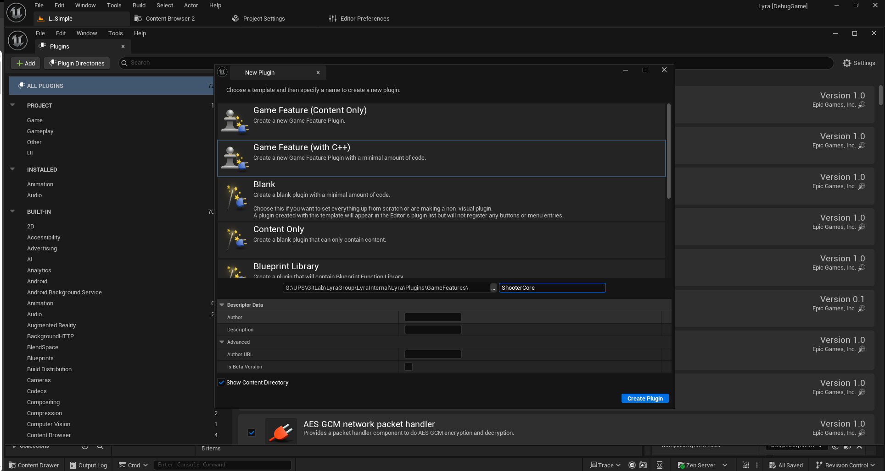
创建完成后如图所示
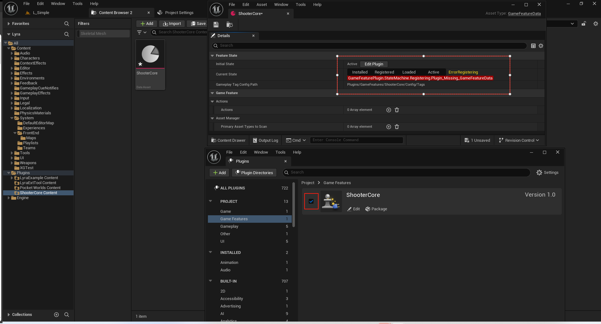
请确保这个插件在插件管理中是开启的状态!
因为我之前有遇到这个GameFeature插件创建后.它不是开启状态,或者在项目重启之后,或者在插件激活的类型发生改变后,插件关闭了.
现在我们需要重新启动项目以修复警告!
重启后,你会发现这个插件真的被关闭了.就很无语.但是无需纠结.再开启就行再重启就行.之后就不会产生这个问题.
其实就是说这个插件需要在项目的.uproject里面确保它开启就行了.

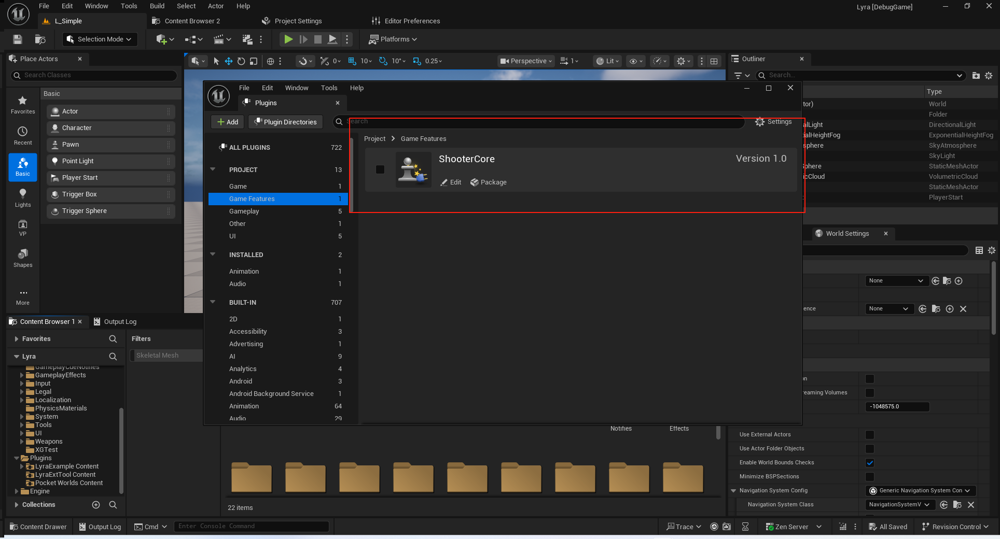

#### State
我们需要把InitalState调整为Registered.
同时把CurrentState调整为Registered.
这是因为玩法插件是需要根据不同的体验去开启的.
很显然这个玩法是第三人称射击.只需要在歼灭作战和控点作战中通过Experience去开启它即可!
如果你有一些其他的玩法是常备的,你也可以让它一直处于Active状态即可
#### TagPath
在这个路径下可以配置针对这个玩法的特定GameplayTag
Lyra\Plugins\GameFeatures\ShooterCore\Config\Tags\ShooterCoreTags.ini
``` ini
[/Script/GameplayTags.GameplayTagsList]
GameplayTagList=(Tag="Ability.ActivateFail.MagazineFull",DevComment="")
GameplayTagList=(Tag="Ability.ActivateFail.NoSpareAmmo",DevComment="")
GameplayTagList=(Tag="Event.Movement.ADS",DevComment="")
GameplayTagList=(Tag="Event.Movement.Dash",DevComment="")
GameplayTagList=(Tag="Event.Movement.Melee",DevComment="")
GameplayTagList=(Tag="Event.Movement.Reload",DevComment="")
GameplayTagList=(Tag="Event.Movement.WeaponFire",DevComment="")
GameplayTagList=(Tag="Gameplay.Message.ADS",DevComment="Message to UI, Reticle")
GameplayTagList=(Tag="Gameplay.Message.Nameplate.Add",DevComment="Register Nameplate Source")
GameplayTagList=(Tag="Gameplay.Message.Nameplate.Discover",DevComment="Looking for nameplates")
GameplayTagList=(Tag="Gameplay.Message.Nameplate.Remove",DevComment="Unregister Nameplate Source")
GameplayTagList=(Tag="GameplayCue.Character.Spawn",DevComment="At spawning of the player in shooter game")
GameplayTagList=(Tag="GameplayCue.ShooterGame.Interact.Collect",DevComment="")
GameplayTagList=(Tag="GameplayCue.ShooterGame.Interact.WeaponPickup",DevComment="GCN for weapon pick FX attached to pawn")
GameplayTagList=(Tag="GameplayCue.ShooterGame.UserMessage.MatchDecided",DevComment="")
GameplayTagList=(Tag="GameplayCue.ShooterGame.UserMessage.WaitingForPlayers",DevComment="")
GameplayTagList=(Tag="GameplayEvent.ReloadDone",DevComment="")
GameplayTagList=(Tag="HUD.Slot.EliminationFeed",DevComment="")
GameplayTagList=(Tag="HUD.Slot.Equipment",DevComment="")
GameplayTagList=(Tag="HUD.Slot.ModeStatus",DevComment="")
GameplayTagList=(Tag="HUD.Slot.PerfStats.Graph",DevComment="")
GameplayTagList=(Tag="HUD.Slot.PerfStats.Text",DevComment="")
GameplayTagList=(Tag="HUD.Slot.Reticle",DevComment="")
GameplayTagList=(Tag="HUD.Slot.TeamScore",DevComment="")
GameplayTagList=(Tag="HUD.Slot.TopAccolades",DevComment="")
GameplayTagList=(Tag="InputTag.Ability.Emote",DevComment="")
GameplayTagList=(Tag="InputTag.Ability.Interact",DevComment="")
GameplayTagList=(Tag="InputTag.Ability.Quickslot.CycleBackward",DevComment="")
GameplayTagList=(Tag="InputTag.Ability.Quickslot.CycleForward",DevComment="")
GameplayTagList=(Tag="InputTag.Ability.Quickslot.SelectSlot",DevComment="Used to directly select one of the quickbar slots. Intended to be accompanied with a 0-based slot index.")
GameplayTagList=(Tag="InputTag.Ability.ShowLeaderboard",DevComment="")
GameplayTagList=(Tag="InputTag.Ability.ToggleInventory",DevComment="")
GameplayTagList=(Tag="InputTag.Ability.ToggleMap",DevComment="")
GameplayTagList=(Tag="InputTag.Ability.ToggleMarkerInWorld",DevComment="")
GameplayTagList=(Tag="Lyra.AddNotification.KillFeed",DevComment="SendKillFeedInfo to UI")
GameplayTagList=(Tag="Lyra.ShooterGame.Accolade.EliminationChain",DevComment="")
GameplayTagList=(Tag="Lyra.ShooterGame.Accolade.EliminationChain.2x",DevComment="")
GameplayTagList=(Tag="Lyra.ShooterGame.Accolade.EliminationChain.3x",DevComment="")
GameplayTagList=(Tag="Lyra.ShooterGame.Accolade.EliminationChain.4x",DevComment="")
GameplayTagList=(Tag="Lyra.ShooterGame.Accolade.EliminationChain.5x",DevComment="")
GameplayTagList=(Tag="Lyra.ShooterGame.Accolade.EliminationStreak",DevComment="")
GameplayTagList=(Tag="Lyra.ShooterGame.Accolade.EliminationStreak.5",DevComment="")
GameplayTagList=(Tag="Lyra.ShooterGame.Accolade.EliminationStreak.10",DevComment="")
GameplayTagList=(Tag="Lyra.ShooterGame.Accolade.EliminationStreak.15",DevComment="")
GameplayTagList=(Tag="Lyra.ShooterGame.Accolade.EliminationStreak.20",DevComment="")
GameplayTagList=(Tag="Lyra.ShooterGame.TDM.TeamScore",DevComment="")
GameplayTagList=(Tag="Lyra.ShooterGame.Weapon.MagazineAmmo",DevComment="")
GameplayTagList=(Tag="Lyra.ShooterGame.Weapon.MagazineSize",DevComment="")
GameplayTagList=(Tag="Lyra.ShooterGame.Weapon.SpareAmmo",DevComment="")
GameplayTagList=(Tag="ShooterGame.ControlPoint.Captured.Message",DevComment="Fired when a control point has been captured by a team")
GameplayTagList=(Tag="ShooterGame.ControlPoint.TeamScore",DevComment="")
GameplayTagList=(Tag="ShooterGame.ExtensionPoint.AbilityBar",DevComment="")
GameplayTagList=(Tag="ShooterGame.GamePhase.Playing",DevComment="")
GameplayTagList=(Tag="ShooterGame.GamePhase.PostGame",DevComment="")
GameplayTagList=(Tag="ShooterGame.GamePhase.Warmup",DevComment="")
GameplayTagList=(Tag="ShooterGame.Score.Assists",DevComment="")
GameplayTagList=(Tag="ShooterGame.Score.ControlPointCapture",DevComment="")
GameplayTagList=(Tag="ShooterGame.Score.Deaths",DevComment="")
GameplayTagList=(Tag="ShooterGame.Score.Eliminations",DevComment="")
GameplayTagList=(Tag="TODO.GameModeDamageImmunity",DevComment="")

```
#### 插件依赖
不同玩法的插件之间可以形成依赖关系.从而确保链接正常
``` json
{
	"FileVersion": 3,
	"Version": 1,
	"VersionName": "1.0",
	"FriendlyName": "ShooterCore",
	"Description": "Gameplay systems for Game1 / Shooter Game",
	"Category": "Game Features",
	"CreatedBy": "Epic Games, Inc.",
	"CreatedByURL": "https://www.epicgames.com",
	"DocsURL": "",
	"MarketplaceURL": "",
	"SupportURL": "",
	"CanContainContent": true,
	"IsBetaVersion": false,
	"IsExperimentalVersion": false,
	"Installed": false,
	"ExplicitlyLoaded": true,
	"EnabledByDefault": false,
	"BuiltInInitialFeatureState": "Registered",
	"Modules": [
		{
			"Name": "ShooterCoreRuntime",
			"Type": "Runtime",
			"LoadingPhase": "Default"
		}
	],
	"Plugins": [
		{
			"Name": "GameplayAbilities",
			"Enabled": true
		},
		{
			"Name": "ModularGameplay",
			"Enabled": true
		},
		{
			"Name": "GameplayMessageRouter",
			"Enabled": true
		},
		{
			"Name": "AsyncMixin",
			"Enabled": true
		},
		{
			"Name": "CommonUI",
			"Enabled": true
		},
		{
			"Name": "CommonGame",
			"Enabled": true
		},
		{
			"Name": "GameSubtitles",
			"Enabled": true
		},
		{
			"Name": "EnhancedInput",
			"Enabled": true
		},
		{
			"Name": "LyraExampleContent",
			"Enabled": true
		}
	]
}
```
#### 插件状态
该部分内容不需要关注.只需要理解Installed Registered Loaded Active即可!!
引擎源码注释
``` txt
每个状态的描述如下所示在 EGameFeaturePluginState 中。
目标状态带有 * 。这些是外部来源可以通过调用 SetDestinationState() 来请求转换到的唯一状态。
错误状态带有 ！ 。如果在转换过程中出现错误，这些状态将成为目标状态。
过渡状态通常会在完成一些工作后将机器转换到另一个状态。
```
``` cpp
/*
*************** GameFeaturePlugin state machine graph ***************
Descriptions for each state are below in EGameFeaturePluginState.
Destination states have a *. These are the only states that external sources can ask to transition to via SetDestinationState().
Error states have !. These states become destinations if an error occurs during a transition.
Transition states are expected to transition the machine to another state after doing some work.

                         +--------------+
                         |              |
                         |Uninitialized |
                         |              |
                         +------+-------+
     +------------+             |
     |     *      |             |
     |  Terminal  <-------------~-----------------------------------------------
     |            |             |                                              |
     +--^------^--+             ----------------------------                   |
        |      |                                           |                   |
        |      |                                    +------v--------+          |
        |      |                                    |      *        |          |
        |      -------------------------------------+ UnknownStatus |          |
        |           ^                      ^        |               |          |
        |           |                      |        +-------+-------+          |
        |           |                      |                |                  |
        |    +------+-------+              |                |                  |
        |    |      *       |              |                |                  |
        |    | Uninstalled  +--------------~--------------->|                  |
        |    |              |              |                |                  |
        |    +------^-------+              |                |                  |
        |           |                      |                |                  |
        |    +------+-------+    *---------+---------+      |                  |
        |    |              |    |         !         |      |                  |
        |    | Uninstalling <----> ErrorUninstalling |      |                  |
        |    |              |    |                   |      |                  |
        |    +---^----------+    +---------+---------+      |                  |
        |        |                         |                |                  |
        |        |    ----------------------                |                  |
        |        |    |                                     |                  |
        |        |    |                     -----------------                  |
        |        |    |                     |                                  |
        |        |    |         +-----------v---+     +--------------------+   |
        |        |    |         |               |     |         !          |   |
        |        |    |         |CheckingStatus <-----> ErrorCheckingStatus+-->|
        |        |    |         |               |     |                    |   |
        |        |    |         +------+------^-+     +--------------------+   |
        |        |    |                |      |                                |
        |        |    |                |      |       +--------------------+   |
        ---------~    |                |      |       |         !          |   |
                 |    |<----------------      --------> ErrorUnavailable   +----
                 |    |                               |                    |
                 |    |                               +--------------------+
                 |    |
            +----+----v----+
            |      *       |
         ---> StatusKnown  +----------------------------------------------
         |  |              |                                 |           |
         |  +----------^---+                                 |           |
         |                                                   |           |
         |                                                   |           |
         |                                                   |           |
         |                                                   |           |
         |                                                   |           |
      +--+---------+      +-------------------+       +------v-------+   |
      |            |      |         !         |       |              |   |
      | Releasing  <------> ErrorManagingData <-------> Downloading  |   |
      |            |      |                   |       |              |   |
      +--^---------+      +-------------------+       +-------+------+   |
         |                                                   |           |
         |                                                   |           |
         |     +-------------+                               |           |
         |     |      *      |                               v           |
         ------+ Installed   <--------------------------------------------
               |             |
               +-^---------+-+
                 |         |
           ------~---------~--------------------------------
           |     |         |                               |
        +--v-----+--+    +-v---------+               +-----v--------------+
        |           |    |           |               |         !          |
        |Unmounting |    | Mounting  <---------------> ErrorMounting      |
        |           |    |           |               |                    |
        +--^-----^--+    +--+--------+               +--------------------+
           |     |          |
           ------~----------~-------------------------------
                 |          |                              |
                 |       +--v--------------------+   +-----+-----------------------+
                 |       |                       |   |         !                   |
                 |       |WaitingForDependencies <---> ErrorWaitingForDependencies |
                 |       |                       |   |                             |
                 |       +-----+-----------------+   +-----------------------------+
                 |             |
                 |    ---------~-----------------------------------
                 |    |        |                                  |
+----------------+----v---+ +--v----------------------+     +-----v-------------------------+
|                         | |                         |     |             !                 |
|AssetDependencyStreamOut | |AssetDependencyStreaming <-----> ErrorAssetDependencyStreaming |
|                         | |                         |     |                               |
+----------------^--------+ +--+----------------------+     +-------------------------------+
                 |             |
           ------~-------------~----------------------------
           |     |             |                           |
        +--v-----+----+  +-----v----- +              +-----v--------------+
        |             |  |            |              |         !          |
        |Unregistering|  |Registering <--------------> ErrorRegistering   |
        |             |  |            |              |                    |
        +--------^----+  ++-----------+              +--------------------+
                 |        |
               +-+--------v-+
               |      *     |
               | Registered |
               |            |
               +-^--------+-+
                 |        |
           ------~--------~---------------------------------------
           |     |        |                               ^      |
        +--v-----+--+  +--v--------+                      |    +-+------------+
        |           |  |           |                      |    |      !       |
        | Unloading |  |  Loading  <----------------------~----> ErrorLoading |
        |           |  |           |                      |    |              |
        +--------^--+  +--+--------+                      |    +--------------+
                 |        |                               |
               +-+--------v-+                             |
               |      *     |                             |
               |   Loaded   |                             |
               |            |                             |
               +-^--------+-+                             |
		         |        |                               |
        +--------+---+  +-v------------------------+   +--+--------------------------+
        |            |  |                          |   |             !               |
        |Deactivating|  |  ActivatingDependencies  <---> ErrorActivatingDependencies |
        |            |  |                          |   |                             |
        +-^----------+  +---------------------+----+   +-----------------------------+
          |                                   |
		  |  +-----------------------------+  |
		  |  |              !              |  |
		  |  |ErrorDeactivatingDependencies|  |
		  |  |                             |  |
		  |  +--^--------------------------+  |
		  |     |                             |
		+-+-----v----------------+          +-v----------+
		|		                 |          |            |
		|DeactivatingDependencies|          | Activating |
		|	   	                 |          |            |
		+----------------------^-+          +---+--------+
		                       |                |
		     	             +-+----------------v-+
                             |          *         |
                             |       Active       |
                             |                    |
                             +--------------------+
*/
```


``` txt
/** 
  GFP States 
  Desitination states must be fully ordered, Transistion and Error states should be in between the Destination states they transition to/from.
  See the state chart in GameFeaturePluginStateMachine.h for reference.
*/
#define GAME_FEATURE_PLUGIN_STATE_LIST(XSTATE)	\
	XSTATE(Uninitialized,					NSLOCTEXT("GameFeatures", "UninitializedStateDisplayName", "Uninitialized"))									/* Unset. Not yet been set up. */ \
	XSTATE(Terminal,						NSLOCTEXT("GameFeatures", "TerminalStateDisplayName", "Terminal"))												/* Final State before removal of the state machine. */ \
	XSTATE(UnknownStatus,					NSLOCTEXT("GameFeatures", "UnknownStatusStateDisplayName", "UnknownStatus"))									/* Initialized, but the only thing known is the URL to query status. */ \
	XSTATE(Uninstalled,						NSLOCTEXT("GameFeatures", "UninstalledStateDisplayName", "Uninstalled"))										/* All installed data for this plugin has now been uninstalled from local storage (i.e the hard drive) */ \
	XSTATE(Uninstalling,					NSLOCTEXT("GameFeatures", "UninstallingStateDisplayName", "Uninstalling"))										/* Transition state between StatusKnown -> Terminal for any plugin that can have data that needs to have local data uninstalled. */ \
	XSTATE(ErrorUninstalling,				NSLOCTEXT("GameFeatures", "ErrorUninstallingStateDisplayName", "ErrorUninstalling"))							/* Error state for Uninstalling -> Terminal transition. */  \
	XSTATE(CheckingStatus,					NSLOCTEXT("GameFeatures", "CheckingStatusStateDisplayName", "CheckingStatus"))									/* Transition state UnknownStatus -> StatusKnown. The status is in the process of being queried. */ \
	XSTATE(ErrorCheckingStatus,				NSLOCTEXT("GameFeatures", "ErrorCheckingStatusStateDisplayName", "ErrorCheckingStatus"))						/* Error state for UnknownStatus -> StatusKnown transition. */ \
	XSTATE(ErrorUnavailable,				NSLOCTEXT("GameFeatures", "ErrorUnavailableStateDisplayName", "ErrorUnavailable"))								/* Error state for UnknownStatus -> StatusKnown transition. */ \
	XSTATE(StatusKnown,						NSLOCTEXT("GameFeatures", "StatusKnownStateDisplayName", "StatusKnown"))										/* The plugin's information is known, but no action has taken place yet. */ \
	XSTATE(Releasing,						NSLOCTEXT("GameFeatures", "ReleasingStateDisplayName", "Releasing"))											/* Transition State for Installed -> StatusKnown. Releases local data from any relevant caches. */ \
	XSTATE(ErrorManagingData,				NSLOCTEXT("GameFeatures", "ErrorManagingDataStateDisplayName", "ErrorManagingData"))							/* Error state for Installed -> StatusKnown and StatusKnown -> Installed transitions. */ \
	XSTATE(Downloading,						NSLOCTEXT("GameFeatures", "DownloadingStateDisplayName", "Downloading"))										/* Transition state StatusKnown -> Installed. In the process of adding to local storage. */ \
	XSTATE(Installed,						NSLOCTEXT("GameFeatures", "InstalledStateDisplayName", "Installed"))											/* The plugin is in local storage (i.e. it is on the hard drive) */ \
	XSTATE(ErrorMounting,					NSLOCTEXT("GameFeatures", "ErrorMountingStateDisplayName", "ErrorMounting"))									/* Error state for Installed -> Registered and Registered -> Installed transitions. */ \
	XSTATE(ErrorWaitingForDependencies,		NSLOCTEXT("GameFeatures", "ErrorWaitingForDependenciesStateDisplayName", "ErrorWaitingForDependencies"))		/* Error state for Installed -> Registered and Registered -> Installed transitions. */ \
	XSTATE(ErrorRegistering,				NSLOCTEXT("GameFeatures", "ErrorRegisteringDisplayName", "ErrorRegistering"))									/* Error state for Installed -> Registered and Registered -> Installed transitions. */ \
	XSTATE(WaitingForDependencies,			NSLOCTEXT("GameFeatures", "WaitingForDependenciesStateDisplayName", "WaitingForDependencies"))					/* Transition state Installed -> Registered. In the process of loading code/content for all dependencies into memory. */ \
	XSTATE(AssetDependencyStreamOut,		NSLOCTEXT("GameFeatures", "AssetDependencyStreamOutDisplayName", "AssetDependencyStreamOut"))					/* Transition state Registered -> Installed. In the process of streaming out individual assets from dependencies. */ \
	XSTATE(ErrorAssetDependencyStreaming,	NSLOCTEXT("GameFeatures", "ErrorAssetDependencyStreamingStateDisplayName", "ErrorAssetDependencyStreaming"))	/* Error state for Installed -> Registered and Registered -> Installed transitions. */ \
	XSTATE(AssetDependencyStreaming,		NSLOCTEXT("GameFeatures", "AssetDependencyStreamingDisplayName", "AssetDependencyStreaming"))					/* Transition state Installed -> Registered. In the process of streaming individual assets from dependencies. */ \
	XSTATE(Unmounting,						NSLOCTEXT("GameFeatures", "UnmountingStateDisplayName", "Unmounting"))											/* Transition state Registered -> Installed. The content file(s) (i.e. pak file) for the plugin is unmounting. */ \
	XSTATE(Mounting,						NSLOCTEXT("GameFeatures", "MountingStateDisplayName", "Mounting"))												/* Transition state Installed -> Registered. The content files(s) (i.e. pak file) for the plugin is getting mounted. */ \
	XSTATE(Unregistering,					NSLOCTEXT("GameFeatures", "UnregisteringStateDisplayName", "Unregistering"))									/* Transition state Registered -> Installed. Cleaning up data gathered in Registering. */ \
	XSTATE(Registering,						NSLOCTEXT("GameFeatures", "RegisteringStateDisplayName", "Registering"))										/* Transition state Installed -> Registered. Discovering assets in the plugin, but not loading them, except a few for discovery reasons. */ \
	XSTATE(Registered,						NSLOCTEXT("GameFeatures", "RegisteredStateDisplayName", "Registered"))											/* The assets in the plugin are known, but have not yet been loaded, except a few for discovery reasons. */ \
	XSTATE(ErrorLoading,					NSLOCTEXT("GameFeatures", "ErrorLoadingDisplayName", "ErrorLoading"))											/* Error state for Loading -> Loaded transition */ \
	XSTATE(Unloading,						NSLOCTEXT("GameFeatures", "UnloadingStateDisplayName", "Unloading"))											/* Transition state Loaded -> Registered. In the process of removing code/content from memory. */ \
	XSTATE(Loading,							NSLOCTEXT("GameFeatures", "LoadingStateDisplayName", "Loading"))												/* Transition state Registered -> Loaded. In the process of loading code/content into memory. */ \
	XSTATE(Loaded,							NSLOCTEXT("GameFeatures", "LoadedStateDisplayName", "Loaded"))													/* The plugin is loaded into memory, but not registered with game systems and active. */ \
	XSTATE(ErrorActivatingDependencies,		NSLOCTEXT("GameFeatures", "ErrorActivatingDependenciesStateDisplayName", "ErrorActivatingDependencies"))		/* Error state for Registered -> Active transition. */ \
	XSTATE(ActivatingDependencies,			NSLOCTEXT("GameFeatures", "ActivatingDependenciesStateDisplayName", "ActivatingDependencies"))					/* Transition state Registered -> Active. In the process of selectively activating dependencies.*/ \
	XSTATE(Deactivating,					NSLOCTEXT("GameFeatures", "DeactivatingStateDisplayName", "Deactivating"))										/* Transition state Active -> Loaded. Currently unregistering with game systems. */ \
	XSTATE(ErrorDeactivatingDependencies,	NSLOCTEXT("GameFeatures", "ErrorDeactivatingDependenciesStateDisplayName", "DeactivatingDependencies"))			/* Error state for Active -> Loaded transition. */ \
	XSTATE(DeactivatingDependencies,		NSLOCTEXT("GameFeatures", "DeactivatingDependenciesStateDisplayName", "DeactivatingDependencies"))				/* Transition state Active -> Loaded. In the process of selectively deactivating dependencies.*/ \
	XSTATE(Activating,						NSLOCTEXT("GameFeatures", "ActivatingStateDisplayName", "Activating"))											/* Transition state Loaded -> Active. Currently registering plugin code/content with game systems. */ \
	XSTATE(Active,							NSLOCTEXT("GameFeatures", "ActiveStateDisplayName", "Active"))													/* Plugin is fully loaded and active. It is affecting the game.  */ 


```


#### Actions
Actions即需要执行的动作!
对于不同阶段,不同类型的去执行.比如
增加组件.增加数据注册,增加视觉特效扫描路径,增加输入映射,增加作弊指令等等!
这部分的操作也可以在体验中进行复用!
#### AssetManager
PrimaryAssettypesToScan
扫描资产.和我们在项目设置中的用法一致.但是这里针对的该插件的内容!
``` txt
(PrimaryAssetType="LyraExperienceDefinition",AssetBaseClass="/Script/LyraGame.LyraExperienceDefinition",bHasBlueprintClasses=True,bIsEditorOnly=False,Directories=((Path="Experiences"),(Path="System/Experiences")),SpecificAssets=,Rules=(Priority=-1,ChunkId=-1,bApplyRecursively=True,CookRule=Unknown))
```

### GameFeatureAction
GameFeatureAction所有操作的父类,提供了嵌入执行的接口.
``` cpp

/** Represents an action to be taken when a game feature is activated */
/** 表示当某个游戏功能被激活时应采取的操作 */
UCLASS(MinimalAPI, DefaultToInstanced, EditInlineNew, Abstract)
class UGameFeatureAction : public UObject
{
	GENERATED_BODY()

public:
	UE_API virtual UGameFeatureData* GetGameFeatureData() const;

	/** Called when the object owning the action is registered for possible activation, this is called even if a feature never activates */
	/** 当拥有该操作的对象被注册为可能的激活对象时会调用此方法，即便某个功能从未被激活，此方法也会被调用 */
	virtual void OnGameFeatureRegistering() {}

	/** Called to unregister an action, it will not be activated again without being registered again */
	/** 被调用以取消注册一个操作，若不再次进行注册，该操作将不会再次被激活 */
	virtual void OnGameFeatureUnregistering() {}
	
	/** Called to indicate that a feature is being loaded for activation in the near future */
	/** 被调用以表示某个功能即将在不久之后被加载并激活 */
	virtual void OnGameFeatureLoading() {}

	/** Called to indicate that a feature is being unloaded */
	/** 被调用以表示某个功能正在被卸载 */
	virtual void OnGameFeatureUnloading() {}

	/** Called when the feature is actually applied */
	/** 当该功能实际应用时会调用此函数 */
	UE_API virtual void OnGameFeatureActivating(FGameFeatureActivatingContext& Context);

	/** Older-style activation function with no context, called by base class if context version is not overridden */
	/** 无上下文的较旧式激活函数，若基类中未重写上下文版本，则由其调用 */
	virtual void OnGameFeatureActivating() {}

	/** Called when the feature is fully active */
	/** 当该功能完全启用时调用 */
	virtual void OnGameFeatureActivated() {}

	/** Called when game feature is deactivated, it may be activated again in the near future */
	/** 当游戏功能被停用时会调用此函数，该功能可能在不久的将来会被重新启用 */
	virtual void OnGameFeatureDeactivating(FGameFeatureDeactivatingContext& Context) {}

	/** Returns whether the action game feature plugin is registered or not. */
	/** 返回动作游戏功能插件是否已注册的状态。*/
	UE_API bool IsGameFeaturePluginRegistered(bool bCheckForRegistering = false) const;

	/** Returns whether the action game feature plugin is active or not. */
	/** 返回动作游戏功能插件是否处于启用状态。*/
	UE_API bool IsGameFeaturePluginActive(bool bCheckForActivating = false) const;

#if WITH_EDITORONLY_DATA
	virtual void AddAdditionalAssetBundleData(FAssetBundleData& AssetBundleData) {}
#endif
};

#undef UE_API

```
#### 添加组件
##### GameFeatureAction_AddComponents
这个代码实现很有意思.我们主要以这个为例进行阐述一下即可
头文件
``` cpp
//////////////////////////////////////////////////////////////////////
// UGameFeatureAction_AddComponents
// 添加组件

/**
 * Adds actor<->component spawn requests to the component manager
 *
 * @see UGameFrameworkComponentManager
 */
UCLASS(MinimalAPI, meta = (DisplayName = "Add Components"))
class UGameFeatureAction_AddComponents final : public UGameFeatureAction
{
	GENERATED_BODY()

public:
	//~UGameFeatureAction interface
	// 激活时调用
	virtual void OnGameFeatureActivating(FGameFeatureActivatingContext& Context) override;
	// 取消激活时调用
	virtual void OnGameFeatureDeactivating(FGameFeatureDeactivatingContext& Context) override;
#if WITH_EDITORONLY_DATA
	// 添加规则 比如客户端还是服务器!
	virtual void AddAdditionalAssetBundleData(FAssetBundleData& AssetBundleData) override;
#endif
	//~End of UGameFeatureAction interface

	//~UObject interface
#if WITH_EDITOR
	// 编辑器接口 资产验证
	virtual EDataValidationResult IsDataValid(class FDataValidationContext& Context) const override;
#endif
	//~End of UObject interface

	/** List of components to add to gameplay actors when this game feature is enabled */
	/** 当此游戏功能启用时，需添加到游戏角色中的组件列表 */
	UPROPERTY(EditAnywhere, Category="Components", meta=(TitleProperty="{ActorClass} -> {ComponentClass}"))
	TArray<FGameFeatureComponentEntry> ComponentList;

private:
	// 上下文的句柄
	struct FContextHandles
	{
		FDelegateHandle GameInstanceStartHandle;
		TArray<TSharedPtr<FComponentRequestHandle>> ComponentRequestHandles;
	};

	// 将添加组件的请求传递给世界 并获取句柄用以结束之后的卸载
	void AddToWorld(const FWorldContext& WorldContext, FContextHandles& Handles);

	// 绑定事件 用于获取游戏开始的回调
	void HandleGameInstanceStart(UGameInstance* GameInstance, FGameFeatureStateChangeContext ChangeContext);

	// 容器用于存储句柄!
	TMap<FGameFeatureStateChangeContext, FContextHandles> ContextHandles;
};

```

##### FGameFeatureComponentEntry
``` cpp

// Description of a component to add to a type of actor when this game feature is enabled
// (the actor class must be game feature aware, it does not happen magically)
//@TODO: Write more documentation here about how to make an actor game feature / modular gameplay aware
// 当此游戏功能启用时，需向某一类型的角色添加的组件描述
// （该角色类必须具备游戏功能感知能力，这种能力并非自动产生）
//@TODO：在此处补充关于如何使角色具备游戏功能/模块化游戏玩法感知能力的更多文档说明
USTRUCT()
struct FGameFeatureComponentEntry
{
	GENERATED_BODY()

	UE_API FGameFeatureComponentEntry();

	// 基础的演员类，用于添加组件
	UPROPERTY(EditAnywhere, Category="Components", meta=(AllowAbstract="True"))
	TSoftClassPtr<AActor> ActorClass;

	// 用于添加到指定类型角色中的组件类
	UPROPERTY(EditAnywhere, Category="Components")
	TSoftClassPtr<UActorComponent> ComponentClass;
	
	// 是否应为客户端提供此组件？
	UPROPERTY(EditAnywhere, Category="Components")
	uint8 bClientComponent:1;

	// Should this component be added on servers
	// 这个组件是否应该添加到服务器端？
	UPROPERTY(EditAnywhere, Category="Components")
	uint8 bServerComponent:1;

	// Observe these rules when adding the component, if any
	// 在添加该组件时（如果有）请遵守这些规则
	UPROPERTY(EditAnywhere, Category = "Components", meta = (Bitmask, BitmaskEnum = "/Script/ModularGameplay.EGameFrameworkAddComponentFlags"))
	uint8 AdditionFlags;
};	

```
使用截图如下:
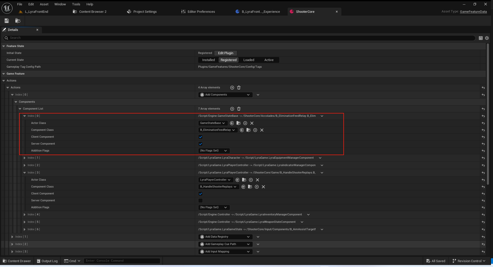

注意这里有两个地方很有意思 分别时感知力和添加规则!
##### 接收者注册
简单回顾一下,项目所使用的统一基类均有类似代码!
``` cpp
void AModularCharacter::BeginPlay()
{
	UGameFrameworkComponentManager::SendGameFrameworkComponentExtensionEvent(this, UGameFrameworkComponentManager::NAME_GameActorReady);

	Super::BeginPlay();
}

void AModularCharacter::EndPlay(const EEndPlayReason::Type EndPlayReason)
{
	UGameFrameworkComponentManager::RemoveGameFrameworkComponentReceiver(this);

	Super::EndPlay(EndPlayReason);
}

```
##### 添加规则
``` cpp
// Bitflag enum to control how this AddComponents action should actually run
// 位标志枚举，用于控制此“添加组件”操作的实际运行方式
UENUM(BlueprintType, meta = (Bitflags, UseEnumValuesAsMaskValuesInEditor = "true"))
enum class EGameFrameworkAddComponentFlags : uint8
{
	// If 0, no specific rule is applied and the component will be always created on the receiver"),
	None =						0			UMETA(Hidden),
	AddUnique =					0b00000001	UMETA(DisplayName = "Add Unique", ToolTip="If AddUnique is set, it will be added only if there is no existing component on ActorInstance of ComponentClass."),
	AddIfNotChild =				0b00000010	UMETA(DisplayName = "Add Unique If Not Child", ToolTip = "If AddIfNotChild is set, it will be added only if ComponentClass is not a child of an existing component on ActorInstance."),
	UseAutoGeneratedName =		0b00000100	UMETA(DisplayName = "Use Auto Generated Name", ToolTip = "If UseAutoGeneratedName is set, it will generate a new name and not re-use the class name directly (which can lead to component recycling)."),
};
```
``` cpp
class UGameFrameworkComponentManager : public UGameInstanceSubsystem
{
	GENERATED_BODY()

public:
	/** 
	* Adds a request to instantiate components on actors of the given classes. 
	* 
	* @param ReceiverClass		The class on which we should add the component onto
	* @param ComponentClass		The component class to add on the new instance
	* @param AdditionFlags (optional)	Set of flags to considered at component creation
	* 
	* @return Returns a handle that will keep the request "alive" until it is destructed, at which point the request is removed. Will return null if there is already an active request with same Receiver & Component classes.
	*/
	/**
	* 增加了一个请求，用于在指定类的参与者中实例化组件。*
	* @参数 ReceiverClass：我们应将组件添加到的类
	* @参数 ComponentClass：要添加到新实例上的组件类
	* @参数 AdditionFlags（可选）：在组件创建时需考虑的一组标志*
	* @返回 返回一个句柄，该句柄将使请求保持“活跃”状态，直至其被销毁（此时请求将被移除）。如果存在具有相同接收者和组件类的现有活跃请求，则将返回 null 。*/
	UE_API TSharedPtr<FComponentRequestHandle> AddComponentRequest(const TSoftClassPtr<AActor>& ReceiverClass, TSubclassOf<UActorComponent> ComponentClass, const EGameFrameworkAddComponentFlags AdditionFlags = EGameFrameworkAddComponentFlags::None);
}

```
##### 执行逻辑
##### 绑定和移除
在游戏玩法插件激活时去注册代理
在游戏玩法插件取消激活去移除代理
``` cpp
void UGameFeatureAction_AddComponents::OnGameFeatureActivating(FGameFeatureActivatingContext& Context)
{
	FContextHandles& Handles = ContextHandles.FindOrAdd(Context);

	// 对于尚未开始的游戏进行绑定
	Handles.GameInstanceStartHandle = FWorldDelegates::OnStartGameInstance.AddUObject(this, 
		&UGameFeatureAction_AddComponents::HandleGameInstanceStart, FGameFeatureStateChangeContext(Context));

	// 确保该世界在此之前通过自己执行过组件添加
	ensure(Handles.ComponentRequestHandles.Num() == 0);

	// Add to any worlds with associated game instances that have already been initialized
	// 适用于已初始化且与游戏实例相关联的任何世界中
	for (const FWorldContext& WorldContext : GEngine->GetWorldContexts())
	{
		if (Context.ShouldApplyToWorldContext(WorldContext))
		{
			AddToWorld(WorldContext, Handles);
		}
	}
}
```
``` cpp
void UGameFeatureAction_AddComponents::OnGameFeatureDeactivating(FGameFeatureDeactivatingContext& Context)
{
	FContextHandles& Handles = ContextHandles.FindOrAdd(Context);

	// 移除绑定
	FWorldDelegates::OnStartGameInstance.Remove(Handles.GameInstanceStartHandle);

	// Releasing the handles will also remove the components from any registered actors too
	// 拧松这些把手还会将这些组件从任何已注册的角色中移除掉。
	Handles.ComponentRequestHandles.Empty();
}
```
##### 添加到世界
尚未开始的游戏入口:
``` cpp
void UGameFeatureAction_AddComponents::HandleGameInstanceStart(UGameInstance* GameInstance, FGameFeatureStateChangeContext ChangeContext)
{
	if (FWorldContext* WorldContext = GameInstance->GetWorldContext())
	{
		if (ChangeContext.ShouldApplyToWorldContext(*WorldContext))
		{
			FContextHandles* Handles = ContextHandles.Find(ChangeContext);
			if (ensure(Handles))
			{
				AddToWorld(*WorldContext, *Handles);
			}
		}
	}
}

```
已经开始的游戏直接执行即可
``` cpp
void UGameFeatureAction_AddComponents::AddToWorld(const FWorldContext& WorldContext, FContextHandles& Handles)
{
	UWorld* World = WorldContext.World();
	UGameInstance* GameInstance = WorldContext.OwningGameInstance;

	//非空判定
	if ((GameInstance != nullptr) && (World != nullptr) && World->IsGameWorld())
	{
		//获取游戏框架的子系统
		if (UGameFrameworkComponentManager* GFCM = UGameInstance::GetSubsystem<UGameFrameworkComponentManager>(GameInstance))
		{
			const ENetMode NetMode = World->GetNetMode();
			const bool bIsServer = NetMode != NM_Client;
			const bool bIsClient = NetMode != NM_DedicatedServer;

			UE_LOG(LogGameFeatures, Verbose, TEXT("Adding components for %s to world %s (client: %d, server: %d)"), *GetPathNameSafe(this), *World->GetDebugDisplayName(), bIsClient ? 1 : 0, bIsServer ? 1 : 0);
			
			for (const FGameFeatureComponentEntry& Entry : ComponentList)
			{
				const bool bShouldAddRequest = (bIsServer && Entry.bServerComponent) || (bIsClient && Entry.bClientComponent);
				if (bShouldAddRequest)
				{
					if (!Entry.ActorClass.IsNull())
					{
						UE_SCOPED_ENGINE_ACTIVITY(TEXT("Adding component to world %s (%s)"), *World->GetDebugDisplayName(), *Entry.ComponentClass.ToString());
						TSubclassOf<UActorComponent> ComponentClass = Entry.ComponentClass.LoadSynchronous();
						if (ComponentClass)
						{
							Handles.ComponentRequestHandles.Add(GFCM->AddComponentRequest(Entry.ActorClass, ComponentClass, static_cast<EGameFrameworkAddComponentFlags>(Entry.AdditionFlags)));
						}
						else if (!Entry.ComponentClass.IsNull())
						{
							UE_LOG(LogGameFeatures, Error, TEXT("[GameFeatureData %s]: Failed to load component class %s. Not applying component."), *GetPathNameSafe(this), *Entry.ComponentClass.ToString());
						}
					}
				}
			}
		}
	}
}
```

### 添加作弊指令
UGameFeatureAction_AddCheats
/**
为每位玩家的作弊管理器添加了作弊管理器扩展功能*/

其实本质就是给指定的作弊管理器添加一个拓展
核心执行逻辑
``` cpp
void UGameFeatureAction_AddCheats::SpawnCheatManagerExtension(UCheatManager* CheatManager, const TSubclassOf<UCheatManagerExtension>& CheatManagerClass)
{
	if ((CheatManagerClass->ClassWithin == nullptr) || CheatManager->IsA(CheatManagerClass->ClassWithin))
	{
		UCheatManagerExtension* Extension = NewObject<UCheatManagerExtension>(CheatManager, CheatManagerClass);
		SpawnedCheatManagers.Add(Extension);
		CheatManager->AddCheatManagerExtension(Extension);
	}
}

```
以下为使用截图:


#### 头文件
``` cpp
/**
 * Adds cheat manager extensions to the cheat manager for each player
 */
UCLASS(MinimalAPI, meta=(DisplayName="Add Cheats"))
class UGameFeatureAction_AddCheats final : public UGameFeatureAction
{
	GENERATED_BODY()

public:
	//~UGameFeatureAction interface
	// 注册作弊器创建后的执行代理
	virtual void OnGameFeatureActivating() override;
	// 移除添加的拓展
	virtual void OnGameFeatureDeactivating(FGameFeatureDeactivatingContext& Context) override;
	//~End of UGameFeatureAction interface

	//~UObject interface
#if WITH_EDITOR
	// 编辑器接口 非空判定
	virtual EDataValidationResult IsDataValid(class FDataValidationContext& Context) const override;
#endif
	//~End of UObject interface

private:
	// 在激活时绑定在作弊器上创建回调执行!
	// 这里会同步或者异步读取要创建作弊器拓展类类型
	void OnCheatManagerCreated(UCheatManager* CheatManager);
	// 创建作弊器拓展附加到作弊器上
	void SpawnCheatManagerExtension(UCheatManager* CheatManager, const TSubclassOf<UCheatManagerExtension>& CheatManagerClass);

public:
	/** Cheat managers to setup for the game feature plugin */
	// 暴露给蓝图进行配置使用
	UPROPERTY(EditAnywhere, Category="Cheats")
	TArray<TSoftClassPtr<UCheatManagerExtension>> CheatManagers;

	// 是否需要虚部加载
	UPROPERTY(EditAnywhere, Category="Cheats")
	bool bLoadCheatManagersAsync;

private:
    // 注册代理的句柄
	FDelegateHandle CheatManagerRegistrationHandle;

	// 临时持有对象 以便后续进行回收移除
	UPROPERTY(Transient)
	TArray<TWeakObjectPtr<UCheatManagerExtension>> SpawnedCheatManagers;

	// 该Action是否是已激活状态
	bool bIsActive = false;
};


```


### 块规则重写
// 这里录制前 进行重写!
UGameFeatureAction_AddChunkOverride

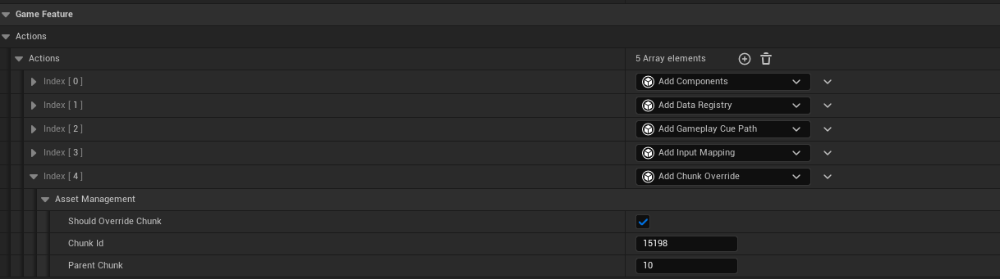

覆写前打包

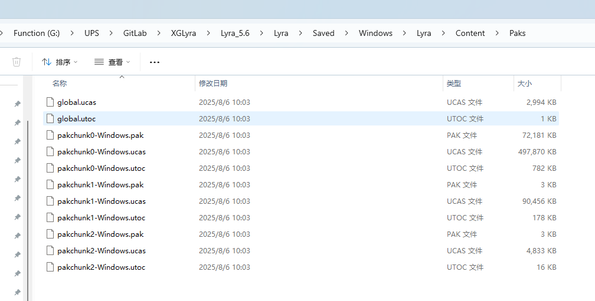
覆写后打包

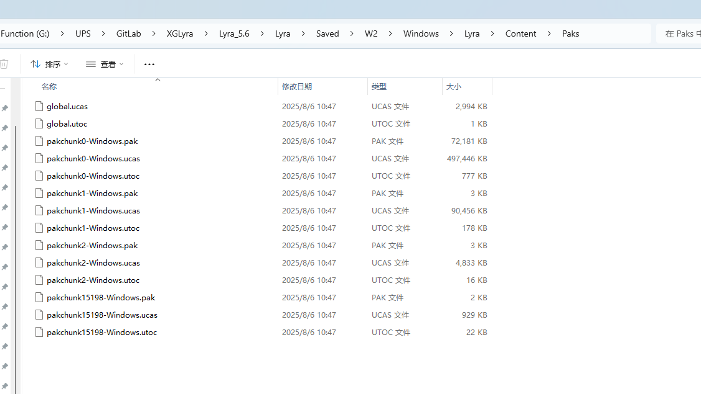

通过命令行查看Pak内容.
这里需要在ProjectSettings-Packaing里面关闭IOStore


正确打包演示的结果如下:

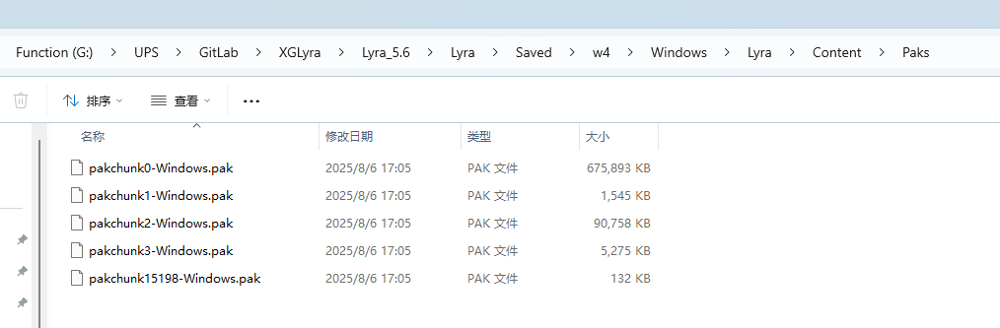


``` txt
E:\Epic\UE\UE_5.6\Engine\Binaries\Win64\UnrealPak.exe  G:\UPS\Gyra\Gyra\Windows\Gyra\Content\Paks\pakchunk0-Windows.pak  -list
```
此处比较绕 需要结合视频演示.
此处引用一篇精简的文章
[虚幻引擎应用实例分享（四）：如何分块打包
](https://indienova.com/indie-game-development/unreal-engine-example-sharing-part-4/)

#### 头文件
``` cpp

/**
 * Used to cook assets from a GFP into a specified chunkId.
 * This can be useful when individually cooking GFPs for iteration or splitting up a packaged
 * game into smaller downloadable chunks.
 * 用于将来自 GFP 的资产转换为指定的 chunkId。
 * 在对 GFP 进行单独处理以进行迭代，或者将打包好的游戏拆分成较小的可下载分块时，这会非常有用。
 */
UCLASS(MinimalAPI, meta=(DisplayName="Add Chunk Override"), Config=Engine)
class UGameFeatureAction_AddChunkOverride final : public UGameFeatureAction
{
	GENERATED_BODY()

public:
	//~Start of UGameFeatureAction interface
	virtual void OnGameFeatureRegistering() override;
	virtual void OnGameFeatureUnregistering() override;
	//~End of UGameFeatureAction interface

	DECLARE_DELEGATE_RetVal_OneParam(bool, FShouldAddChunkOverride, const UGameFeatureData*);
	
	
	/**
	 * Optionally bound delegate to determine when to add the chunk override.
	 * When bound this will be checked before attempting to add the chunk override.
	 * Bound delegates should return true if the GameFeatureData should have a chunk id overriden; otherwise, false.
	 */
	/**
	 * 可以选择绑定委托来确定何时添加块覆盖项。
	 * 绑定后，在尝试添加块覆盖项之前会对其进行检查。
	 * 绑定的委托应返回 true 表示游戏功能数据应有块 ID 被覆盖；否则返回 false 。
	 */
	GAMEFEATURES_API static FShouldAddChunkOverride ShouldAddChunkOverride;

#if WITH_EDITOR
	/**
	 * Given the package name will check if this is a package from a GFP that we want to assign a specific chunk to.
	 * returns the override chunk for this package if one is set.
	 * 
	 * Should be used in combination with overriding UAssetManager::GetPackageChunkIds so that you are able to reassign a startup package.
	 * This can be necessary to reassign startup packages such as the GameFeatureData asset.
	 */
	/**
	 * 该函数会检查包名，以确定这是否是我们想要为其分配特定块的通用功能包。
	 * 如果设置了覆盖块，则返回此包的覆盖块。*
	 * 应与重写 UAssetManager::GetPackageChunkIds 方法结合使用，以便能够重新分配启动包。
	 * 有时可能需要这样做，以重新分配诸如“GameFeatureData”资产之类的启动包。
	 */
	GAMEFEATURES_API static TOptional<int32> GetChunkForPackage(const FString& PackageName);

	GAMEFEATURES_API static TArray<FString> GetPluginNameFromChunkID(int32 ChunkID);

	/** UObject overrides */
	virtual void PostRename(UObject* OldOuter, const FName OldName) override;
	virtual void PostEditChangeProperty(FPropertyChangedEvent& PropertyChangedEvent) override;
	/** ~UObject overrides */

	bool ShouldOverrideChunk() const { return bShouldOverrideChunk; }

	int32 GetChunkID() const { return ChunkId; };

	GAMEFEATURES_API static int32 GetLowestAllowedChunkId();
#endif // WITH_EDITOR
	
private:
#if WITH_EDITORONLY_DATA
	/**
	 * Should this GFP have their packages cooked into the specified ChunkId
	 */

	/**
	* 如果这些 GFP 需要将其包内容整合到指定的 ChunkId 中的话
	*/
	UPROPERTY(EditAnywhere, Category = "Asset Management")
	bool bShouldOverrideChunk = false;

	/**
	 * What ChunkId to place the packages inside for this particular GFP.
	 */
	/**
	 * 对于这个特定的 GFP 来说，应将包裹放置在哪个“块标识符”内。
	 */
	UPROPERTY(EditAnywhere, Category = "Asset Management", meta=(EditCondition="bShouldOverrideChunk"))
	int32 ChunkId = -1;

	/**
	 * What Chunk we are parented to.
	 * This is used by the ChunkDependencyInfo for when mutiple chunk overrides might conflict requiring assets to be pulled into a lower chunk
	 */
	/**
	 * 我们隶属于哪个分块。
	 * 这一信息由“分块依赖信息”使用，用于在多个分块的覆盖内容可能产生冲突时发挥作用，即需要将相关资产拉入更低层级的分块中。
	 */
	UPROPERTY(EditAnywhere, Category = "Asset Management", meta=(EditCondition="bShouldOverrideChunk"))
	int32 ParentChunk = 10;

	/**
	 * Config defined value for what is the smallest chunk index the autogeneration code can generate.
	 * If autogeneration produces a chunk index lower than this value users will need to manually define the chunk index this GFP will cook into.
	 */
	/**
	 * 定义的配置值表示自动生成代码所能生成的最小块索引值。
	 * 如果自动生成过程产生的块索引低于此值，用户则需要手动指定该 GFP 将将其生成的块索引值。
	 */
	UPROPERTY(config)
	int32 LowestAllowedChunkIndexForAutoGeneration = INDEX_NONE;
#endif

	void AddChunkIdOverride();
	void RemoveChunkIdOverride();

#if WITH_EDITOR
	/**
	 * Attempts to generate a unique int32 id for the given plugin based on the name of the plugin.
	 * returns -1 if a unique name couldn't be generated with consideration to other plugins that have an override id.
	 */
	/**
	 * 根据插件的名称尝试为该插件生成一个唯一的 32 位整数标识符。
	 * 如果在考虑到其他具有覆盖标识符的插件的情况下无法生成唯一的名称，则返回 -1 。
	 */
	int32 GenerateUniqueChunkId() const;
#endif // WITH_EDITOR
};

```


### 添加Actor工厂
UGameFeatureAction_AddActorFactory
/**
* 游戏功能操作：在该插件注册时添加一个角色工厂。
* 适用于那些可能从插件中加载 BP 类的工厂，而这些类可能尚未被发现。*/

简而言之就是方便拖拽去资产去生成Actor, 使用前需要注册

#### 以相机为例
匹配支持和Actor即可
``` cpp
UCLASS()
class UGameplayCameraActorFactory : public UActorFactory
{
	GENERATED_BODY()

public:

	UGameplayCameraActorFactory(const FObjectInitializer& ObjInit);

public:

	// UActorFactory interface.
	virtual AActor* SpawnActor(UObject* InAsset, ULevel* InLevel, const FTransform& InTransform, const FActorSpawnParameters& InSpawnParams) override;
	virtual bool CanCreateActorFrom( const FAssetData& AssetData, FText& OutErrorMsg ) override;
	virtual UObject* GetAssetFromActorInstance(AActor* ActorInstance) override;
};


```
使用前需要注册
``` cpp
class FGameplayCamerasEditorModule : public IGameplayCamerasEditorModule
{ 	// ...
	void OnPostEngineInit()
	{
		using namespace UE::Cameras;

		SGameplayCamerasDebugger::RegisterTabSpawners();

		GameplayCameraActorFactory.Reset(NewObject<UGameplayCameraActorFactory>());
		GameplayCameraRigActorFactory.Reset(NewObject<UGameplayCameraRigActorFactory>());
		GEditor->ActorFactories.Add(GameplayCameraActorFactory.Get());
		GEditor->ActorFactories.Add(GameplayCameraRigActorFactory.Get());
		if (UPlacementSubsystem* PlacementSubsystem = GEditor->GetEditorSubsystem<UPlacementSubsystem>())
		{
			PlacementSubsystem->RegisterAssetFactory(GameplayCameraActorFactory.Get());
			PlacementSubsystem->RegisterAssetFactory(GameplayCameraRigActorFactory.Get());
		}
	}

	void OnPreExit()
	{
		using namespace UE::Cameras;

		SGameplayCamerasDebugger::UnregisterTabSpawners();

		GEditor->ActorFactories.RemoveAll([this](const UActorFactory* ActorFactory)
				{
					return ActorFactory == GameplayCameraActorFactory.Get() || ActorFactory == GameplayCameraRigActorFactory.Get();
				});
		if (UPlacementSubsystem* PlacementSubsystem = GEditor->GetEditorSubsystem<UPlacementSubsystem>())
		{
			PlacementSubsystem->UnregisterAssetFactory(GameplayCameraActorFactory.Get());
		}
	}
	// ...
```


#### 头文件
这块比较简单 看一眼即可!
``` cpp
/**
 * GameFeatureAction to add an actor factory when this plugin registers.
 * Useful for factories that might load BP classes within a plugin which might not have been discovered yet.
 */
UCLASS(MinimalAPI, meta=(DisplayName="Add Actor Factory"), Config=Engine)
class UGameFeatureAction_AddActorFactory final : public UGameFeatureAction
{
	GENERATED_BODY()

public:
	//~Start of UGameFeatureAction interface
	virtual void OnGameFeatureRegistering() override;
	virtual void OnGameFeatureUnregistering() override;
	//~End of UGameFeatureAction interface

#if WITH_EDITOR

	/** UObject overrides */
	virtual void PostRename(UObject* OldOuter, const FName OldName) override;
	virtual void PostEditChangeProperty(FPropertyChangedEvent& PropertyChangedEvent) override;
	/** ~UObject overrides */
#endif // WITH_EDITOR
	
protected:
#if WITH_EDITORONLY_DATA
	/**
	 * The actor factory class to add once this plugin registers
	 * Actor factories should be setup with bShouldAutoRegister so that they do not register during engine boot.
	 */
	UPROPERTY(EditAnywhere, Category = "Actor Factory")
	TSoftClassPtr<UObject> ActorFactory;

	TWeakObjectPtr<UObject> AddedFactory;
#endif

	void AddActorFactory();
	void RemoveActorFactory();
};


```

### 添加数据注册
UGameFeatureAction_DataRegistry
/** 指定要加载并使用此功能进行初始化的数据注册表列表 */
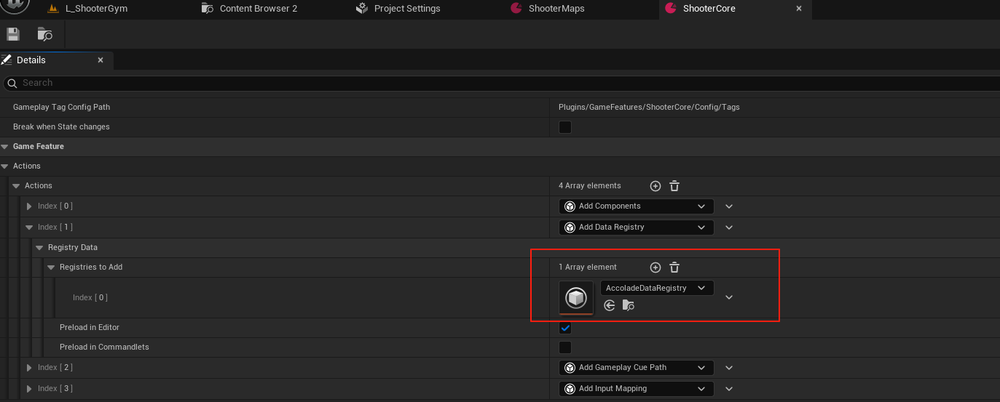

#### 头文件
``` cpp
/** Specifies a list of Data Registries to load and initialize with this feature */
/** 指定要加载并使用此功能进行初始化的数据注册表列表 */
UCLASS(MinimalAPI, meta = (DisplayName = "Add Data Registry"))
class UGameFeatureAction_DataRegistry : public UGameFeatureAction
{
	GENERATED_BODY()

public:
	virtual void OnGameFeatureRegistering() override;
	virtual void OnGameFeatureUnregistering() override;
	virtual void OnGameFeatureActivating() override;
	virtual void OnGameFeatureDeactivating(FGameFeatureDeactivatingContext& Context) override;

	/** If true, we should load the registry at registration time instead of activation time */
	/** 如果为真，则应在注册时加载注册表，而非在激活时加载 */
	virtual bool ShouldPreloadAtRegistration();

#if WITH_EDITORONLY_DATA
	virtual void AddAdditionalAssetBundleData(FAssetBundleData& AssetBundleData) override;
#endif

	//~UObject interface
#if WITH_EDITOR
	virtual EDataValidationResult IsDataValid(class FDataValidationContext& Context) const override;
#endif
	//~End of UObject interface

private:
	/** List of registry assets to load and initialize */
	/** 需要加载并初始化的注册表资产列表 */
	UPROPERTY(EditAnywhere, Category = "Registry Data")
	TArray<TSoftObjectPtr<UDataRegistry> > RegistriesToAdd;

	/** If true, this will preload the registries when the feature is registered in the editor to support the editor pickers */
	/** 若为真，则在将该功能注册到编辑器时会预先加载注册表，以支持编辑器中的选择器 */
	UPROPERTY(EditAnywhere, Category = "Registry Data")
	bool bPreloadInEditor;

	/** If true, this will preload the registries when the feature is registered whilst a commandlet is running */
	/** 如果为真，则在运行命令行工具时，当该功能被注册时，会预先加载注册表 */
	UPROPERTY(EditAnywhere, Category = "Registry Data")
	bool bPreloadInCommandlets;
};


```

#### 核心逻辑
载入
``` cpp
{
UDataRegistrySubsystem* DataRegistrySubsystem = UDataRegistrySubsystem::Get();
		if (ensure(DataRegistrySubsystem))
		{
			for (const TSoftObjectPtr<UDataRegistry>& RegistryToAdd : RegistriesToAdd)
			{
				if (!RegistryToAdd.IsNull())
				{
					const FSoftObjectPath RegistryPath = RegistryToAdd.ToSoftObjectPath();

					UE_LOG(LogGameFeatures, Log, TEXT("OnGameFeatureRegistering %s: Preloading DataRegistry %s for editor preview"), *GetPathName(), *RegistryPath.ToString())
					DataRegistrySubsystem->LoadRegistryPath(RegistryPath);
				}
			}
		}
}

```
移除
``` cpp
UDataRegistrySubsystem* DataRegistrySubsystem = UDataRegistrySubsystem::Get();
		if (ensure(DataRegistrySubsystem))
		{
			for (const TSoftObjectPtr<UDataRegistry>& RegistryToAdd : RegistriesToAdd)
			{
				if (!RegistryToAdd.IsNull())
				{
					const FSoftObjectPath RegistryPath = RegistryToAdd.ToSoftObjectPath();

					// This should only happen when the user is manually changing phase via the feature editor UI
					UE_LOG(LogGameFeatures, Log, TEXT("OnGameFeatureUnregistering %s: Temporarily disabling preloaded DataRegistry %s"), *GetPathName(), *RegistryPath.ToString())

					DataRegistrySubsystem->IgnoreRegistryPath(RegistryPath);
				}
			}
		}

```
### 添加数据源注册
UGameFeatureAction_DataRegistrySource
/** 指定在启用此功能时应添加到数据注册库中的源资产列表 */
与前者相似.
简而言之就是往DataRegistry塞入DataTable即可.
以Gyra项目做一个简单的演示.
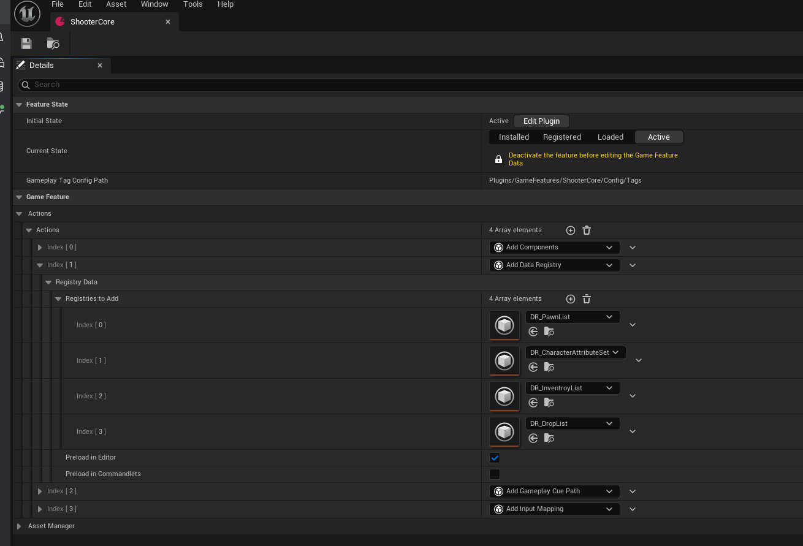
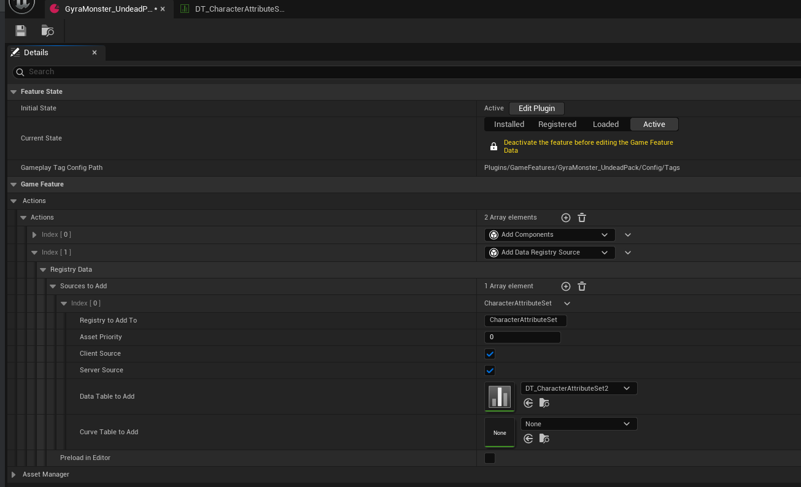

### GameFeatureAction_AddWPContent
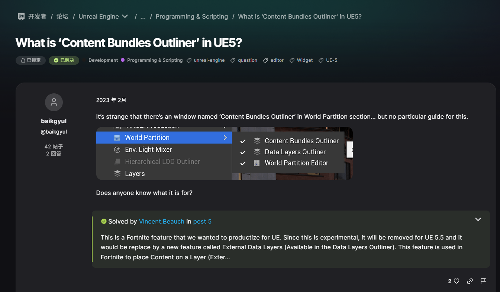
略.
参考AI文档有个概念即可
使用DataLayer即可

### GameFeatureAction_AddWorldPartitionContent
略.
需要从ini开启才能使用

``` cpp
/**
 * Implements Editor settings for experimental features.
 */
UCLASS(config=EditorPerProjectUserSettings, MinimalAPI)
class UEditorExperimentalSettings
	: public UObject
{
	GENERATED_UCLASS_BODY()
	
	UPROPERTY(EditAnywhere, config, Category = WorldPartition)
	bool bEnableWorldPartitionExternalDataLayers;
};
```


``` cpp
TArray<UClass*> UGameFeatureData::GetDisallowedActions() const
{
	TArray<UClass*> DisallowedClasses;

	if (!GetDefault<UEditorExperimentalSettings>()->bEnableWorldPartitionExternalDataLayers)
	{
		DisallowedClasses.Add(UGameFeatureAction_AddWorldPartitionContent::StaticClass());
	}

	return DisallowedClasses;
}
```
核心逻辑
``` cpp
{
		UExternalDataLayerEngineSubsystem::Get().ActivateExternalDataLayerAsset(ExternalDataLayerAsset, this);

		UExternalDataLayerEngineSubsystem::Get().DeactivateExternalDataLayerAsset(ExternalDataLayerAsset, this);
}


```
### LyraGameFeautreAction
该部分内容由Lyra进行拓展了GameFeature的Action操作!
不在此处进行讲解.
## 总结
本文简单介绍了GameFeature的使用.并列举了其中一个Action的添加组件的详细实现逻辑.
后续我们将直接复刻Lyra中的GameFeature执行逻辑.