# UE5_Lyra学习指南_035_LyraGameFeature

本文章仅为小刚-B站课堂-虚幻引擎视频课程Lyra-精讲的演讲手稿.  
本套课程链接:[[UE5]虚幻引擎游戏案例Lyra精讲](https://www.bilibili.com/cheese/play/ss112001159)  
前置课程链接:[[UE5]虚幻引擎UEC++从基础到进阶](https://www.bilibili.com/cheese/play/ss28043)  

文章内容由小刚撰写,采用了以下多种方式:  
1.口述转文字  
2.AI重构  
3.参考引擎源码  
4.Lyra工程源码  
5.结合社区论坛各位大佬的解析  

- [UE5\_Lyra学习指南\_035\_LyraGameFeature](#ue5_lyra学习指南_035_lyragamefeature)
	- [概述](#概述)
	- [GameFeatureAction\_WorldActionBase](#gamefeatureaction_worldactionbase)
	- [GameFeatureAction\_AddAbilities](#gamefeatureaction_addabilities)
		- [需要应用的数据](#需要应用的数据)
		- [存储前后执行的句柄](#存储前后执行的句柄)
		- [资产校验](#资产校验)
		- [执行逻辑](#执行逻辑)
			- [注册该类拓展能力事件](#注册该类拓展能力事件)
			- [添加或移除能力](#添加或移除能力)
			- [添加能力](#添加能力)
			- [移除能力](#移除能力)
		- [查找组件](#查找组件)
		- [定义的能力集资产](#定义的能力集资产)
	- [GameFeatureAction\_AddGameplayCuePath](#gamefeatureaction_addgameplaycuepath)
	- [GameFeatureAction\_AddInputBinding](#gamefeatureaction_addinputbinding)
		- [预定义ULyraHeroComponent](#预定义ulyraherocomponent)
		- [预定义ULyraInputConfig](#预定义ulyrainputconfig)
		- [激活调用](#激活调用)
	- [GameFeatureAction\_AddInputContextMapping](#gamefeatureaction_addinputcontextmapping)
		- [头文件](#头文件)
		- [键位映射的注册](#键位映射的注册)
		- [调用位置](#调用位置)
	- [GameFeatureAction\_AddWidget](#gamefeatureaction_addwidget)
		- [头文件](#头文件-1)
		- [绑定位置](#绑定位置)
		- [事件的触发](#事件的触发)
		- [Ready事件得触发](#ready事件得触发)
		- [移除事件的触发](#移除事件的触发)
		- [核心推送逻辑](#核心推送逻辑)
		- [推送布局](#推送布局)
			- [根布局的创建](#根布局的创建)
			- [在根布局上面推送Layer](#在根布局上面推送layer)
				- [几个UI的顶级父类](#几个ui的顶级父类)
				- [推送到指定Layer](#推送到指定layer)
					- [UPrimaryGameLayout](#uprimarygamelayout)
					- [ContainerBase](#containerbase)
					- [UCommonActivatableWidgetStack](#ucommonactivatablewidgetstack)
		- [推送控件](#推送控件)
			- [注册执行拓展程序](#注册执行拓展程序)
			- [注册执行拓展点](#注册执行拓展点)
			- [调用注册](#调用注册)
			- [实际执行逻辑](#实际执行逻辑)
			- [UUIExtensionPointWidget](#uuiextensionpointwidget)
			- [UUIExtensionSubsystem](#uuiextensionsubsystem)
	- [GameFeatureAction\_SplitscreenConfig](#gamefeatureaction_splitscreenconfig)
	- [LyraGameFeaturePolicy](#lyragamefeaturepolicy)
		- [配置位置](#配置位置)
		- [插入观察者](#插入观察者)
		- [限制加载部分内容](#限制加载部分内容)
		- [ULyraGameFeature\_HotfixManager](#ulyragamefeature_hotfixmanager)
		- [ULyraGameFeature\_AddGameplayCuePaths](#ulyragamefeature_addgameplaycuepaths)
	- [回归之前的GameFeature使用点](#回归之前的gamefeature使用点)
		- [Target.cs文件中](#targetcs文件中)
		- [Experience加载过程中](#experience加载过程中)
	- [总结](#总结)


## 概述
本节主要阐述Lyra项目对于GameFeature的实战应用.
实际Lyra的设计是基于一个玩法去设计一个GameFeature.
我在自己的项目中尝试过一个角色去设计一个GameFeaure...很灵活.但是就是粒度做的太细了.

## GameFeatureAction_WorldActionBase
这个类主要是用于简化绑定解绑的操作.
因为Lyra项目这些Action很多都是基于世界去操作的.所以需要绑定到世界上.
``` cpp
/**
 * Base class for GameFeatureActions that wish to do something world specific.
 * 用于那些希望针对特定世界环境执行操作的游戏功能操作类的基类。
 */
UCLASS(Abstract)
class UGameFeatureAction_WorldActionBase : public UGameFeatureAction
{
	GENERATED_BODY()

public:
	//~ Begin UGameFeatureAction interface
	// 游戏玩法激活
	virtual void OnGameFeatureActivating(FGameFeatureActivatingContext& Context) override;
	// 游戏玩法取消激活
	virtual void OnGameFeatureDeactivating(FGameFeatureDeactivatingContext& Context) override;
	//~ End UGameFeatureAction interface

private:
	// 绑定到游戏实例上等待游戏开始时去执行AddToWorld 如果游戏已经开始了则应该直接调用AddToWorld 不在此处
	void HandleGameInstanceStart(UGameInstance* GameInstance, FGameFeatureStateChangeContext ChangeContext);

	/** Override with the action-specific logic */
	/** 请根据具体操作需求进行覆盖并编写相应逻辑 */
	virtual void AddToWorld(const FWorldContext& WorldContext, const FGameFeatureStateChangeContext& ChangeContext) PURE_VIRTUAL(UGameFeatureAction_WorldActionBase::AddToWorld,);

private:
	// 句柄 用于取消激活后移除代理
	TMap<FGameFeatureStateChangeContext, FDelegateHandle> GameInstanceStartHandles;
};

```

## GameFeatureAction_AddAbilities
添加能力集.包括GA,GE,AttributeSet.等等.
激活时添加,取消激活时移除. 注意激活时可以传一个表进行初始化等等.
这个稍微有点复杂.实际Lyra中只使用了AbilitySet的复合技能效果属性组合集.
### 需要应用的数据
``` cpp
// 授予的能力
USTRUCT(BlueprintType)
struct FLyraAbilityGrant
{
	GENERATED_BODY()

	// Type of ability to grant
	// 赋予的能力类型
	UPROPERTY(EditAnywhere, BlueprintReadOnly, meta=(AssetBundles="Client,Server"))
	TSoftClassPtr<UGameplayAbility> AbilityType;

	// Input action to bind the ability to, if any (can be left unset)
// 	UPROPERTY(EditAnywhere, BlueprintReadOnly)
// 	TSoftObjectPtr<UInputAction> InputAction;
};

```

``` cpp
// 授予的属性集
USTRUCT(BlueprintType)
struct FLyraAttributeSetGrant
{
	GENERATED_BODY()

	// Ability set to grant
	// 能力设定为授予
	UPROPERTY(EditAnywhere, BlueprintReadOnly, meta=(AssetBundles="Client,Server"))
	TSoftClassPtr<UAttributeSet> AttributeSetType;

	// Data table referent to initialize the attributes with, if any (can be left unset)
	// 数据表用于初始化相关属性（如果有，则可不设置）
	UPROPERTY(EditAnywhere, BlueprintReadOnly, meta=(AssetBundles="Client,Server"))
	TSoftObjectPtr<UDataTable> InitializationData;
};


```

``` cpp
/**
 * ULyraAbilitySet
 *
 *	Non-mutable data asset used to grant gameplay abilities and gameplay effects.
 *  不可变的数据资产，用于赋予游戏能力及游戏效果。
 */
UCLASS(BlueprintType, Const)
class ULyraAbilitySet : public UPrimaryDataAsset
{
	GENERATED_BODY()

public:

	ULyraAbilitySet(const FObjectInitializer& ObjectInitializer = FObjectInitializer::Get());

	// Grants the ability set to the specified ability system component.
	// The returned handles can be used later to take away anything that was granted.
	// 将指定的能力设置应用到指定的能力系统组件上。
	// 返回的句柄可用于稍后撤销已赋予的任何内容。
	void GiveToAbilitySystem(ULyraAbilitySystemComponent* LyraASC, FLyraAbilitySet_GrantedHandles* OutGrantedHandles, UObject* SourceObject = nullptr) const;

protected:

	// Gameplay abilities to grant when this ability set is granted.
	// 当此能力集被激活时所赋予的游戏玩法能力。
	UPROPERTY(EditDefaultsOnly, Category = "Gameplay Abilities", meta=(TitleProperty=Ability))
	TArray<FLyraAbilitySet_GameplayAbility> GrantedGameplayAbilities;

	// Gameplay effects to grant when this ability set is granted.
	// 当此能力组合被激活时所产生游戏效果。
	UPROPERTY(EditDefaultsOnly, Category = "Gameplay Effects", meta=(TitleProperty=GameplayEffect))
	TArray<FLyraAbilitySet_GameplayEffect> GrantedGameplayEffects;

	// Attribute sets to grant when this ability set is granted.
	// 当此能力集被授予时所赋予的属性组合。
	UPROPERTY(EditDefaultsOnly, Category = "Attribute Sets", meta=(TitleProperty=AttributeSet))
	TArray<FLyraAbilitySet_AttributeSet> GrantedAttributes;
};


```


``` cpp
// 操作拓展能力的入口
USTRUCT()
struct FGameFeatureAbilitiesEntry
{
	GENERATED_BODY()

	// The base actor class to add to
	// 用于添加的基类角色类
	UPROPERTY(EditAnywhere, Category="Abilities")
	TSoftClassPtr<AActor> ActorClass;

	// List of abilities to grant to actors of the specified class
	// 指定角色所属类别的可赋予能力列表
	UPROPERTY(EditAnywhere, Category="Abilities")
	TArray<FLyraAbilityGrant> GrantedAbilities;

	// List of attribute sets to grant to actors of the specified class
	// 指定类别的角色所拥有的属性集列表
	UPROPERTY(EditAnywhere, Category="Attributes")
	TArray<FLyraAttributeSetGrant> GrantedAttributes;

	// List of ability sets to grant to actors of the specified class
	// 指定职业的演员可获得的能力组合列表
	UPROPERTY(EditAnywhere, Category="Attributes", meta=(AssetBundles="Client,Server"))
	TArray<TSoftObjectPtr<const ULyraAbilitySet>> GrantedAbilitySets;
};

```

对应使用的截图如下,注意此处填写的使伪数据,并非项目真实的应用.
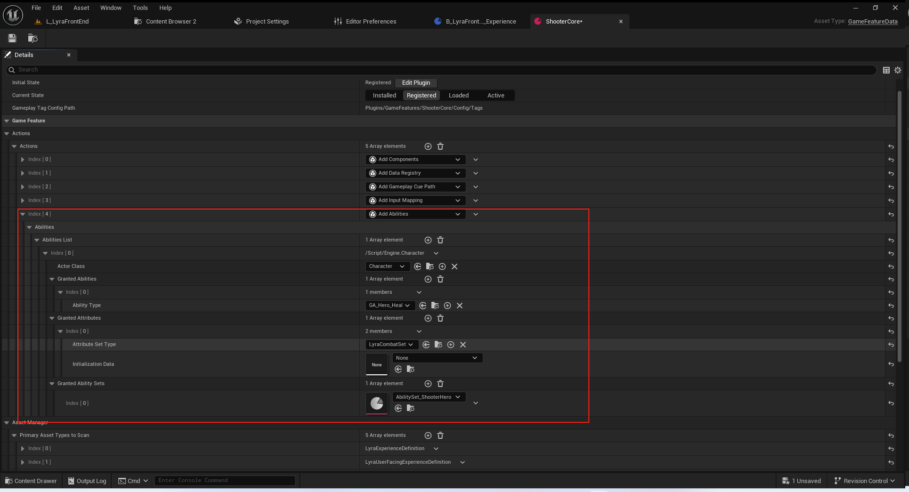
### 存储前后执行的句柄
``` cpp
	/**  操作的能力入口 */
	UPROPERTY(EditAnywhere, Category="Abilities", meta=(TitleProperty="ActorClass", ShowOnlyInnerProperties))
	TArray<FGameFeatureAbilitiesEntry> AbilitiesList;

private:
	// Actor的能力拓展
	struct FActorExtensions
	{
		// 添加的GA
		TArray<FGameplayAbilitySpecHandle> Abilities;
		
		// 添加的属性集
		TArray<UAttributeSet*> Attributes;
		
		// 添加的组合能力集
		TArray<FLyraAbilitySet_GrantedHandles> AbilitySetHandles;
	};

	// 每一个世界上下文的数据
	struct FPerContextData
	{
		// 每一个Actor 对应其施加的拓展
		TMap<AActor*, FActorExtensions> ActiveExtensions;
		// 使的每一个Actor保持活跃的添加的状态句柄
		TArray<TSharedPtr<FComponentRequestHandle>> ComponentRequests;
	};
	
	TMap<FGameFeatureStateChangeContext, FPerContextData> ContextData;	

```

### 资产校验
``` cpp
	//~ Begin UObject interface
#if WITH_EDITOR
	// 编辑器下接口 资产验证 不可为空
	virtual EDataValidationResult IsDataValid(class FDataValidationContext& Context) const override;
#endif
```
### 执行逻辑
#### 注册该类拓展能力事件
``` cpp
void UGameFeatureAction_AddAbilities::AddToWorld(const FWorldContext& WorldContext, const FGameFeatureStateChangeContext& ChangeContext)
{
	UWorld* World = WorldContext.World();
	UGameInstance* GameInstance = WorldContext.OwningGameInstance;

	// 获取到这个世界上下文对应的存储数据
	FPerContextData& ActiveData = ContextData.FindOrAdd(ChangeContext);
	

	if ((GameInstance != nullptr) && (World != nullptr) && World->IsGameWorld())
	{
		// 游戏实例不能为空
		// 世界不能为空
		// 必须使游戏世界

		// 获取到游戏框架子系统
		if (UGameFrameworkComponentManager* ComponentMan = UGameInstance::GetSubsystem<UGameFrameworkComponentManager>(GameInstance))
		{			
			int32 EntryIndex = 0;
			// 遍历
			for (const FGameFeatureAbilitiesEntry& Entry : AbilitiesList)
			{
				if (!Entry.ActorClass.IsNull())
				{
					// 声明一个代理 用于处理指定的Actor的拓展回调.
					UGameFrameworkComponentManager::FExtensionHandlerDelegate AddAbilitiesDelegate = UGameFrameworkComponentManager::FExtensionHandlerDelegate::CreateUObject(
						this, &UGameFeatureAction_AddAbilities::HandleActorExtension, EntryIndex, ChangeContext);

					/** 将一个扩展处理程序添加到特定类的参与者上运行。返回一个标识符，该标识符将使处理程序保持“活跃”状态，直到被销毁，届时委托将被移除 */
					TSharedPtr<FComponentRequestHandle> ExtensionRequestHandle = ComponentMan->AddExtensionHandler(Entry.ActorClass, AddAbilitiesDelegate);

					// 把这个句柄存储起来 保持有效
					ActiveData.ComponentRequests.Add(ExtensionRequestHandle);
					EntryIndex++;
				}
			}
		}
	}
}

```
#### 添加或移除能力
``` cpp
void UGameFeatureAction_AddAbilities::HandleActorExtension(AActor* Actor, FName EventName, int32 EntryIndex, FGameFeatureStateChangeContext ChangeContext)
{
	// 获取到对应的上下文数据
	FPerContextData* ActiveData = ContextData.Find(ChangeContext);
	// 数据必须有效
	if (AbilitiesList.IsValidIndex(EntryIndex) && ActiveData)
	{
		// 找到要操作的能力列表
		const FGameFeatureAbilitiesEntry& Entry = AbilitiesList[EntryIndex];
		if ((EventName == UGameFrameworkComponentManager::NAME_ExtensionRemoved) || (EventName == UGameFrameworkComponentManager::NAME_ReceiverRemoved))
		{
			// 移除
			RemoveActorAbilities(Actor, *ActiveData);
		}
		else if ((EventName == UGameFrameworkComponentManager::NAME_ExtensionAdded) || (EventName == ALyraPlayerState::NAME_LyraAbilityReady))
		{
			// 注意这个ALyraPlayerState::NAME_LyraAbilityReady
			// 	必须等待ALyraPlayerState 执行UGameFrameworkComponentManager::SendGameFrameworkComponentExtensionEvent(this, NAME_LyraAbilityReady)才会处理
	
			// 添加
			AddActorAbilities(Actor, Entry, *ActiveData);
		}
	}
}

```

#### 添加能力
``` cpp
void UGameFeatureAction_AddAbilities::AddActorAbilities(AActor* Actor, const FGameFeatureAbilitiesEntry& AbilitiesEntry, FPerContextData& ActiveData)
{
	check(Actor);
	// 只有权威端才能注册ASC
	if (!Actor->HasAuthority())
	{
		return;
	}

	// early out if Actor already has ability extensions applied
	// 若角色已应用了能力扩展，则提前退出（程序）
	if (ActiveData.ActiveExtensions.Find(Actor) != nullptr)
	{
		return;	
	}

	// 必须要由ASC组件
	if (UAbilitySystemComponent* AbilitySystemComponent = FindOrAddComponentForActor<UAbilitySystemComponent>(Actor, AbilitiesEntry, ActiveData))
	{
		// 扩容到指定大小
		FActorExtensions AddedExtensions;
		AddedExtensions.Abilities.Reserve(AbilitiesEntry.GrantedAbilities.Num());
		AddedExtensions.Attributes.Reserve(AbilitiesEntry.GrantedAttributes.Num());
		AddedExtensions.AbilitySetHandles.Reserve(AbilitiesEntry.GrantedAbilitySets.Num());

		// 授予GA
		for (const FLyraAbilityGrant& Ability : AbilitiesEntry.GrantedAbilities)
		{
			if (!Ability.AbilityType.IsNull())
			{
				FGameplayAbilitySpec NewAbilitySpec(Ability.AbilityType.LoadSynchronous());
				FGameplayAbilitySpecHandle AbilityHandle = AbilitySystemComponent->GiveAbility(NewAbilitySpec);

				AddedExtensions.Abilities.Add(AbilityHandle);
			}
		}

		// 授予属性集
		for (const FLyraAttributeSetGrant& Attributes : AbilitiesEntry.GrantedAttributes)
		{
			if (!Attributes.AttributeSetType.IsNull())
			{
				TSubclassOf<UAttributeSet> SetType = Attributes.AttributeSetType.LoadSynchronous();
				if (SetType)
				{
					UAttributeSet* NewSet = NewObject<UAttributeSet>(AbilitySystemComponent->GetOwner(), SetType);
					if (!Attributes.InitializationData.IsNull())
					{
						UDataTable* InitData = Attributes.InitializationData.LoadSynchronous();
						if (InitData)
						{
							NewSet->InitFromMetaDataTable(InitData);
						}
					}

					AddedExtensions.Attributes.Add(NewSet);
					AbilitySystemComponent->AddAttributeSetSubobject(NewSet);
				}
			}
		}

		// 授予符合技能集
		ULyraAbilitySystemComponent* LyraASC = CastChecked<ULyraAbilitySystemComponent>(AbilitySystemComponent);
		for (const TSoftObjectPtr<const ULyraAbilitySet>& SetPtr : AbilitiesEntry.GrantedAbilitySets)
		{
			if (const ULyraAbilitySet* Set = SetPtr.Get())
			{
				Set->GiveToAbilitySystem(LyraASC, &AddedExtensions.AbilitySetHandles.AddDefaulted_GetRef());
			}
		}

		ActiveData.ActiveExtensions.Add(Actor, AddedExtensions);
	}
	else
	{
		UE_LOG(LogGameFeatures, Error, TEXT("Failed to find/add an ability component to '%s'. Abilities will not be granted."), *Actor->GetPathName());
	}
}
```
#### 移除能力
``` cpp
void UGameFeatureAction_AddAbilities::RemoveActorAbilities(AActor* Actor, FPerContextData& ActiveData)
{
	if (FActorExtensions* ActorExtensions = ActiveData.ActiveExtensions.Find(Actor))
	{
		if (UAbilitySystemComponent* AbilitySystemComponent = Actor->FindComponentByClass<UAbilitySystemComponent>())
		{
			for (UAttributeSet* AttribSetInstance : ActorExtensions->Attributes)
			{
				AbilitySystemComponent->RemoveSpawnedAttribute(AttribSetInstance);
			}

			for (FGameplayAbilitySpecHandle AbilityHandle : ActorExtensions->Abilities)
			{
				AbilitySystemComponent->SetRemoveAbilityOnEnd(AbilityHandle);
			}

			ULyraAbilitySystemComponent* LyraASC = CastChecked<ULyraAbilitySystemComponent>(AbilitySystemComponent);
			for (FLyraAbilitySet_GrantedHandles& SetHandle : ActorExtensions->AbilitySetHandles)
			{
				SetHandle.TakeFromAbilitySystem(LyraASC);
			}
		}

		ActiveData.ActiveExtensions.Remove(Actor);
	}
}

```


### 查找组件
这里需要注意,它的实现逻辑里面需要区分原生组件和GameFrameworkComponent创建的组件
``` cpp
	template<class ComponentType>
	ComponentType* FindOrAddComponentForActor(AActor* Actor, const FGameFeatureAbilitiesEntry& AbilitiesEntry, FPerContextData& ActiveData)
	{
		//@TODO: Just find, no add?
		//@待办事项：只需查找，无需添加？
		return Cast<ComponentType>(FindOrAddComponentForActor(ComponentType::StaticClass(), Actor, AbilitiesEntry, ActiveData));
	}
	UActorComponent* FindOrAddComponentForActor(UClass* ComponentType, AActor* Actor, const FGameFeatureAbilitiesEntry& AbilitiesEntry, FPerContextData& ActiveData);
```


### 定义的能力集资产
这里为了方便我们就直接先把GAS的技能集资产进行定义了
``` cpp
// Copyright Epic Games, Inc. All Rights Reserved.

#pragma once

#include "ActiveGameplayEffectHandle.h"
#include "Engine/DataAsset.h"
#include "AttributeSet.h"
#include "GameplayTagContainer.h"

#include "GameplayAbilitySpecHandle.h"
#include "LyraAbilitySet.generated.h"

class UAttributeSet;
class UGameplayEffect;
class ULyraAbilitySystemComponent;
class ULyraGameplayAbility;
class UObject;


/**
 * FLyraAbilitySet_GameplayAbility
 *
 *	Data used by the ability set to grant gameplay abilities.
 *	该能力集所使用的数据用于赋予游戏中的各种能力。
 */
USTRUCT(BlueprintType)
struct FLyraAbilitySet_GameplayAbility
{
	GENERATED_BODY()

public:

	// Gameplay ability to grant.
	// 授予的游戏能力
	UPROPERTY(EditDefaultsOnly)
	TSubclassOf<ULyraGameplayAbility> Ability = nullptr;

	// Level of ability to grant.
	// 级别
	UPROPERTY(EditDefaultsOnly)
	int32 AbilityLevel = 1;

	// Tag used to process input for the ability.
	// 用以处理输入的Tag
	UPROPERTY(EditDefaultsOnly, Meta = (Categories = "InputTag"))
	FGameplayTag InputTag;
};


/**
 * FLyraAbilitySet_GameplayEffect
 *
 *	Data used by the ability set to grant gameplay effects.
 *  该能力所使用的数据用于赋予游戏效果。
 */
USTRUCT(BlueprintType)
struct FLyraAbilitySet_GameplayEffect
{
	GENERATED_BODY()

public:

	// Gameplay effect to grant.
	// 授予的游戏效果
	UPROPERTY(EditDefaultsOnly)
	TSubclassOf<UGameplayEffect> GameplayEffect = nullptr;

	// Level of gameplay effect to grant.
	// 游戏效果的级别
	UPROPERTY(EditDefaultsOnly)
	float EffectLevel = 1.0f;
};

/**
 * FLyraAbilitySet_AttributeSet
 *
 *	Data used by the ability set to grant attribute sets.
 * 该能力所使用的数据用于生成属性集。
 */
USTRUCT(BlueprintType)
struct FLyraAbilitySet_AttributeSet
{
	GENERATED_BODY()

public:
	// Gameplay effect to grant.
	// 授予的属性集
	UPROPERTY(EditDefaultsOnly)
	TSubclassOf<UAttributeSet> AttributeSet;

};

/**
 * FLyraAbilitySet_GrantedHandles
 *
 *	Data used to store handles to what has been granted by the ability set.
 * 用于存储由能力集所赋予内容的句柄的存储数据。
 */
USTRUCT(BlueprintType)
struct FLyraAbilitySet_GrantedHandles
{
	GENERATED_BODY()

public:

	// 添加GA的句柄
	void AddAbilitySpecHandle(const FGameplayAbilitySpecHandle& Handle);
	
	// 添加GE的句柄
	void AddGameplayEffectHandle(const FActiveGameplayEffectHandle& Handle);

	// 添加的属性集
	void AddAttributeSet(UAttributeSet* Set);

	// 根据句柄容器移除对应的GA,GE,属性集
	void TakeFromAbilitySystem(ULyraAbilitySystemComponent* LyraASC);

protected:

	// Handles to the granted abilities.
	// 容器句柄
	UPROPERTY()
	TArray<FGameplayAbilitySpecHandle> AbilitySpecHandles;

	// Handles to the granted gameplay effects.
	// 容器句柄
	UPROPERTY()
	TArray<FActiveGameplayEffectHandle> GameplayEffectHandles;

	// Pointers to the granted attribute sets
	// 容器句柄
	UPROPERTY()
	TArray<TObjectPtr<UAttributeSet>> GrantedAttributeSets;
};


/**
 * ULyraAbilitySet
 *
 *	Non-mutable data asset used to grant gameplay abilities and gameplay effects.
 *  不可变的数据资产，用于赋予游戏能力及游戏效果。
 */
UCLASS(BlueprintType, Const)
class ULyraAbilitySet : public UPrimaryDataAsset
{
	GENERATED_BODY()

public:

	ULyraAbilitySet(const FObjectInitializer& ObjectInitializer = FObjectInitializer::Get());

	// Grants the ability set to the specified ability system component.
	// The returned handles can be used later to take away anything that was granted.
	// 将指定的能力设置应用到指定的能力系统组件上。
	// 返回的句柄可用于稍后撤销已赋予的任何内容。
	void GiveToAbilitySystem(ULyraAbilitySystemComponent* LyraASC, FLyraAbilitySet_GrantedHandles* OutGrantedHandles, UObject* SourceObject = nullptr) const;

protected:

	// Gameplay abilities to grant when this ability set is granted.
	// 当此能力集被激活时所赋予的游戏玩法能力。
	UPROPERTY(EditDefaultsOnly, Category = "Gameplay Abilities", meta=(TitleProperty=Ability))
	TArray<FLyraAbilitySet_GameplayAbility> GrantedGameplayAbilities;

	// Gameplay effects to grant when this ability set is granted.
	// 当此能力组合被激活时所产生游戏效果。
	UPROPERTY(EditDefaultsOnly, Category = "Gameplay Effects", meta=(TitleProperty=GameplayEffect))
	TArray<FLyraAbilitySet_GameplayEffect> GrantedGameplayEffects;

	// Attribute sets to grant when this ability set is granted.
	// 当此能力集被授予时所赋予的属性组合。
	UPROPERTY(EditDefaultsOnly, Category = "Attribute Sets", meta=(TitleProperty=AttributeSet))
	TArray<FLyraAbilitySet_AttributeSet> GrantedAttributes;
};


```

实现也比较简单,不再此处列出.即将能力赋予后的句柄存储起来即可!
此时还需要定义一个最简单LyraGameplayAbility.
``` cpp
/**
 * ULyraGameplayAbility
 *
 *	The base gameplay ability class used by this project.
 */
UCLASS(MinimalAPI, Abstract, HideCategories = Input, Meta = (ShortTooltip = "The base gameplay ability class used by this project."))
class ULyraGameplayAbility : public UGameplayAbility
{
	GENERATED_BODY()
	friend class ULyraAbilitySystemComponent;
};

```
注意关注这两个方法即可.
``` cpp
UCLASS(BlueprintType, Const)
class ULyraAbilitySet : public UPrimaryDataAsset
{
	GENERATED_BODY()

	void GiveToAbilitySystem(ULyraAbilitySystemComponent* LyraASC, FLyraAbilitySet_GrantedHandles* OutGrantedHandles, UObject* SourceObject = nullptr) const;
}
```
``` cpp
USTRUCT(BlueprintType)
struct FLyraAbilitySet_GrantedHandles
{
	GENERATED_BODY()

public:

	// 根据句柄容器移除对应的GA,GE,属性集
	void TakeFromAbilitySystem(ULyraAbilitySystemComponent* LyraASC);
}
```
此处贴出蓝图的资产:
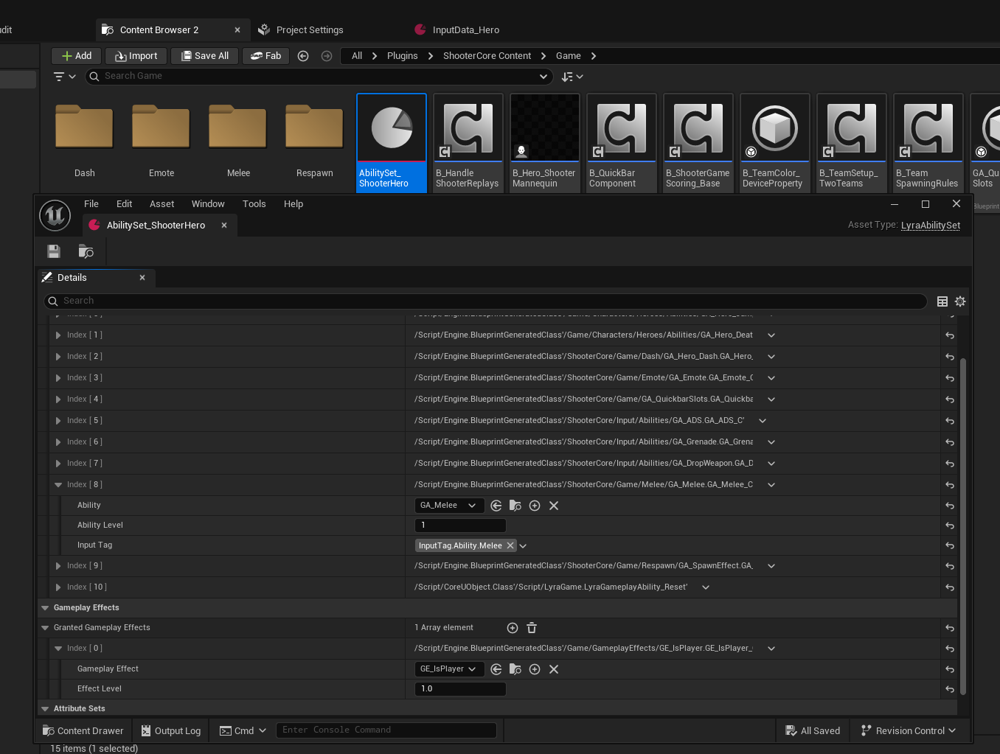


## GameFeatureAction_AddGameplayCuePath
这个主要是用来去管理视觉特效的访问路径.如果出现了编辑器,一个技能特效正常,但是打包后运行缺没有特效.大概率就是这个GameplayCue没有进包.相关路径没有指定好!
这里主要是一个配置的地方.调用并没有在这里.
在下一节详细讲解!
``` cpp
/**
 * GameFeatureAction responsible for adding gameplay cue paths to the gameplay cue manager.
 * 游戏功能操作 负责将游戏提示路径添加到游戏提示管理器中。
 *
 * @see UAbilitySystemGlobals::GameplayCueNotifyPaths
 */
UCLASS(MinimalAPI, meta = (DisplayName = "Add Gameplay Cue Path"))
class UGameFeatureAction_AddGameplayCuePath final : public UGameFeatureAction
{
	GENERATED_BODY()

public:

	UGameFeatureAction_AddGameplayCuePath();

	//~UObject interface
#if WITH_EDITOR
	// 编辑器接口 非空判定
	virtual EDataValidationResult IsDataValid(class FDataValidationContext& Context) const override;
#endif
	//~End of UObject interface

	const TArray<FDirectoryPath>& GetDirectoryPathsToAdd() const { return DirectoryPathsToAdd; }

private:
	/** List of paths to register to the gameplay cue manager. These are relative tot he game content directory */
	/** 用于向游戏提示管理器注册的路径列表。这些路径相对于游戏内容目录而言是相对路径 */
	UPROPERTY(EditAnywhere, Category = "Game Feature | Gameplay Cues", meta = (RelativeToGameContentDir, LongPackageName))
	TArray<FDirectoryPath> DirectoryPathsToAdd;
};


```

GameFeature使用图片:
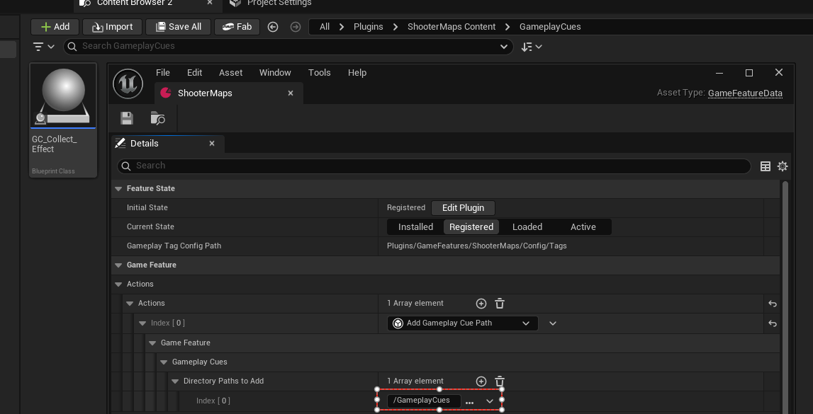
项目配置的图片:
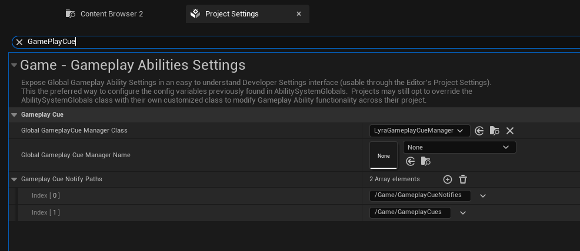

## GameFeatureAction_AddInputBinding
添加某个输入资产.
目前项目没有使用它.
项目是直接通过PawnData指定的.
### 预定义ULyraHeroComponent
我们需要先定义一个ULyraHeroComponent,空白的即可.
然后添加几个转发的函数方法.供GameFeature进行调用.
``` cpp
/**
 * Component that sets up input and camera handling for player controlled pawns (or bots that simulate players).
 * This depends on a PawnExtensionComponent to coordinate initialization.
 *
 * 用于为玩家控制的兵种（或模拟玩家的机器人）设置输入和摄像头处理的组件。
 * 这需要一个“兵种扩展组件”来协调初始化过程。
 */
UCLASS(MinimalAPI, Blueprintable, Meta=(BlueprintSpawnableComponent))
class ULyraHeroComponent : public UPawnComponent, public IGameFrameworkInitStateInterface
{
	GENERATED_BODY()

public:

	/** Adds mode-specific input config */
	/** 添加模式特定的输入配置 */
	UE_API void AddAdditionalInputConfig(const ULyraInputConfig* InputConfig);

	/** Removes a mode-specific input config if it has been added */
	/** 如果已添加了特定模式的输入配置，则将其删除 */
	UE_API void RemoveAdditionalInputConfig(const ULyraInputConfig* InputConfig);

	/** True if this is controlled by a real player and has progressed far enough in initialization where additional input bindings can be added */
	/** 如果此内容是由真实玩家控制的，并且在初始化过程中已经进展到足够深入的阶段，以便能够添加更多的输入绑定，则返回 true */
	UE_API bool IsReadyToBindInputs() const;

	/** The name of the extension event sent via UGameFrameworkComponentManager when ability inputs are ready to bind */
	/** 当能力输入准备好进行绑定时，通过 UGameFrameworkComponentManager 发送的扩展事件的名称 */
	static UE_API const FName NAME_BindInputsNow;

	/** The name of this component-implemented feature */
	/** 此组件实现的功能的名称 */
	static UE_API const FName NAME_ActorFeatureName;
	
};


```
### 预定义ULyraInputConfig
``` cpp

/**
 * FLyraInputAction
 *
 *	Struct used to map a input action to a gameplay input tag.
 *  该结构体用于将输入操作映射到游戏玩法的输入标签上。
 */
USTRUCT(BlueprintType)
struct FLyraInputAction
{
	GENERATED_BODY()

public:

	UPROPERTY(EditDefaultsOnly, BlueprintReadOnly)
	TObjectPtr<const UInputAction> InputAction = nullptr;

	UPROPERTY(EditDefaultsOnly, BlueprintReadOnly, Meta = (Categories = "InputTag"))
	FGameplayTag InputTag;
};

/**
 * ULyraInputConfig
 *
 *	Non-mutable data asset that contains input configuration properties.
 *	不可变的数据资产，其中包含输入配置属性。
 */
UCLASS(BlueprintType, Const)
class ULyraInputConfig : public UDataAsset
{
	GENERATED_BODY()

public:

	ULyraInputConfig(const FObjectInitializer& ObjectInitializer);

	// 找到基本输入的Tag所映射的输入资产
	UFUNCTION(BlueprintCallable, Category = "Lyra|Pawn")
	const UInputAction* FindNativeInputActionForTag(const FGameplayTag& InputTag, bool bLogNotFound = true) const;

	// 找到技能输入的Tag所映射的输入资产
	UFUNCTION(BlueprintCallable, Category = "Lyra|Pawn")
	const UInputAction* FindAbilityInputActionForTag(const FGameplayTag& InputTag, bool bLogNotFound = true) const;

public:
	// List of input actions used by the owner.  These input actions are mapped to a gameplay tag and must be manually bound.
	// 所有者使用的输入操作列表。这些输入操作会映射到游戏玩法标签上，并且必须手动进行绑定。
	UPROPERTY(EditDefaultsOnly, BlueprintReadOnly, Meta = (TitleProperty = "InputAction"))
	TArray<FLyraInputAction> NativeInputActions;

	// List of input actions used by the owner.  These input actions are mapped to a gameplay tag and are automatically bound to abilities with matching input tags.
	// 该玩家所使用的输入操作列表。这些输入操作被映射到游戏玩法标签上，并会自动与具有相同输入标签的技能绑定在一起。
	UPROPERTY(EditDefaultsOnly, BlueprintReadOnly, Meta = (TitleProperty = "InputAction"))
	TArray<FLyraInputAction> AbilityInputActions;
};

```
输入资产的使用截图:
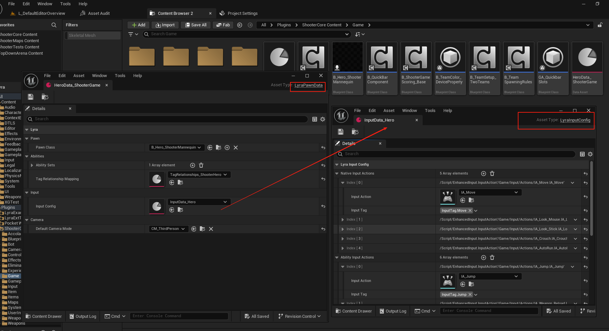

### 激活调用
注意项目并未走这套逻辑!
``` cpp

/**
 * Adds InputMappingContext to local players' EnhancedInput system. 
 * Expects that local players are set up to use the EnhancedInput system.
 * 在本地玩家的“增强输入”系统中添加了“输入映射上下文”。
 * 假定本地玩家已设置好使用“增强输入”系统。
 *
 * 在Lyra项目不再使用这个了
 */
UCLASS(MinimalAPI, meta = (DisplayName = "Add Input Binds"))
class UGameFeatureAction_AddInputBinding final : public UGameFeatureAction_WorldActionBase
{
	GENERATED_BODY()

public:
	//~ Begin UGameFeatureAction interface
	// 激活时 验证句柄是空的 之前没有执行过
	virtual void OnGameFeatureActivating(FGameFeatureActivatingContext& Context) override;
	// 取消激活时 重置句柄
	virtual void OnGameFeatureDeactivating(FGameFeatureDeactivatingContext& Context) override;
	//~ End UGameFeatureAction interface

	//~ Begin UObject interface
#if WITH_EDITOR
	// 编辑器接口 非空判定
	virtual EDataValidationResult IsDataValid(class FDataValidationContext& Context) const override;
#endif
	//~ End UObject interface

	UPROPERTY(EditAnywhere, Category="Input", meta=(AssetBundles="Client,Server"))
	TArray<TSoftObjectPtr<const ULyraInputConfig>> InputConfigs;

private:
	struct FPerContextData
	{
		TArray<TSharedPtr<FComponentRequestHandle>> ExtensionRequestHandles;
		TArray<TWeakObjectPtr<APawn>> PawnsAddedTo;
	};

	TMap<FGameFeatureStateChangeContext, FPerContextData> ContextData;

	//~ Begin UGameFeatureAction_WorldActionBase interface
	virtual void AddToWorld(const FWorldContext& WorldContext, const FGameFeatureStateChangeContext& ChangeContext) override;
	//~ End UGameFeatureAction_WorldActionBase interface
	
	// 重置数据
	void Reset(FPerContextData& ActiveData);
	// 用于处理Pawn的框架事件
	void HandlePawnExtension(AActor* Actor, FName EventName, FGameFeatureStateChangeContext ChangeContext);
	// 调用英雄组件去完成输入能力的注册
	void AddInputMappingForPlayer(APawn* Pawn, FPerContextData& ActiveData);
	// 移除输入能力的注册
	void RemoveInputMapping(APawn* Pawn, FPerContextData& ActiveData);


};


```
重点关注实现逻辑
在AddToWorld绑定接收者的框架事件
```cpp
void UGameFeatureAction_AddInputBinding::AddToWorld(const FWorldContext& WorldContext, const FGameFeatureStateChangeContext& ChangeContext)
{
	UWorld* World = WorldContext.World();
	UGameInstance* GameInstance = WorldContext.OwningGameInstance;
	FPerContextData& ActiveData = ContextData.FindOrAdd(ChangeContext);

	if ((GameInstance != nullptr) && (World != nullptr) && World->IsGameWorld())
	{
		if (UGameFrameworkComponentManager* ComponentManager = UGameInstance::GetSubsystem<UGameFrameworkComponentManager>(GameInstance))
		{
			UGameFrameworkComponentManager::FExtensionHandlerDelegate AddAbilitiesDelegate =
				UGameFrameworkComponentManager::FExtensionHandlerDelegate::CreateUObject(this, &ThisClass::HandlePawnExtension, ChangeContext);
			
			TSharedPtr<FComponentRequestHandle> ExtensionRequestHandle =
				ComponentManager->AddExtensionHandler(APawn::StaticClass(), AddAbilitiesDelegate);

			ActiveData.ExtensionRequestHandles.Add(ExtensionRequestHandle);
		}
	}
}
``` 
根据框架事件来执行对应的逻辑
``` cpp
void UGameFeatureAction_AddInputBinding::HandlePawnExtension(AActor* Actor, FName EventName, FGameFeatureStateChangeContext ChangeContext)
{
	APawn* AsPawn = CastChecked<APawn>(Actor);
	FPerContextData& ActiveData = ContextData.FindOrAdd(ChangeContext);

	if ((EventName == UGameFrameworkComponentManager::NAME_ExtensionRemoved) || (EventName == UGameFrameworkComponentManager::NAME_ReceiverRemoved))
	{
		RemoveInputMapping(AsPawn, ActiveData);
	}
	else if ((EventName == UGameFrameworkComponentManager::NAME_ExtensionAdded) || (EventName == ULyraHeroComponent::NAME_BindInputsNow))
	{
		// 	UGameFrameworkComponentManager::SendGameFrameworkComponentExtensionEvent(const_cast<APlayerController*>(PC), NAME_BindInputsNow);
		// 接收绑定输入的事件 来自元HeroComponent的调用
		
		AddInputMappingForPlayer(AsPawn, ActiveData);
	}
}

```
转发调用英雄组件
``` cpp
void UGameFeatureAction_AddInputBinding::AddInputMappingForPlayer(APawn* Pawn, FPerContextData& ActiveData)
{
	APlayerController* PlayerController = Cast<APlayerController>(Pawn->GetController());

	if (ULocalPlayer* LocalPlayer = PlayerController ? PlayerController->GetLocalPlayer() : nullptr)
	{
		if (UEnhancedInputLocalPlayerSubsystem* InputSystem = LocalPlayer->GetSubsystem<UEnhancedInputLocalPlayerSubsystem>())
		{
			ULyraHeroComponent* HeroComponent = Pawn->FindComponentByClass<ULyraHeroComponent>();
			if (HeroComponent && HeroComponent->IsReadyToBindInputs())
			{
				for (const TSoftObjectPtr<const ULyraInputConfig>& Entry : InputConfigs)
				{
					if (const ULyraInputConfig* BindSet = Entry.Get())
					{
						HeroComponent->AddAdditionalInputConfig(BindSet);
					}
				}
			}
			ActiveData.PawnsAddedTo.AddUnique(Pawn);
		}
		else
		{
			UE_LOG(LogGameFeatures, Error, TEXT("Failed to find `UEnhancedInputLocalPlayerSubsystem` for local player. Input mappings will not be added. Make sure you're set to use the EnhancedInput system via config file."));
		}
	}
}
```
其余逻辑大同小异.
**注意项目必须开启增强型输入并设置相关增强型输入组件.**
后续我们会定义LyraInputComponent.这个在3C章节.

## GameFeatureAction_AddInputContextMapping
### 头文件
``` cpp

USTRUCT()
struct FInputMappingContextAndPriority
{
	GENERATED_BODY()

	// 引擎底层输入上下文类
	UPROPERTY(EditAnywhere, Category="Input", meta=(AssetBundles="Client,Server"))
	TSoftObjectPtr<UInputMappingContext> InputMapping;

	// Higher priority input mappings will be prioritized over mappings with a lower priority.
	// 较高的优先级输入映射将优先于优先级较低的映射。
	UPROPERTY(EditAnywhere, Category="Input")
	int32 Priority = 0;
	
	/** If true, then this mapping context will be registered with the settings when this game feature action is registered. */
	/** 若为真，则在注册此游戏功能操作时，此映射上下文将被一同注册到设置中。*/
	UPROPERTY(EditAnywhere, Category="Input")
	bool bRegisterWithSettings = true;
};

/**
 * Adds InputMappingContext to local players' EnhancedInput system. 
 * Expects that local players are set up to use the EnhancedInput system.
 *
 * 在本地玩家的“增强输入”系统中添加了“输入映射上下文”。
 * 假定本地玩家已设置好使用“增强输入”系统。
 */
UCLASS(MinimalAPI, meta = (DisplayName = "Add Input Mapping"))
class UGameFeatureAction_AddInputContextMapping final : public UGameFeatureAction_WorldActionBase
{
	GENERATED_BODY()

public:
	//~UGameFeatureAction interface
	// 用以注册键位映射绑定
	virtual void OnGameFeatureRegistering() override;
	// 激活上下文
	virtual void OnGameFeatureActivating(FGameFeatureActivatingContext& Context) override;
	// 取消激活上下文
	virtual void OnGameFeatureDeactivating(FGameFeatureDeactivatingContext& Context) override;
	// 取消注册到UserSettings中的键位映射绑定
	virtual void OnGameFeatureUnregistering() override;
	//~End of UGameFeatureAction interface

	//~UObject interface
#if WITH_EDITOR
	// 编辑器接口 非空判定
	virtual EDataValidationResult IsDataValid(class FDataValidationContext& Context) const override;
#endif
	//~End of UObject interface

	// 需要进行注册和使用的上下文事件
	UPROPERTY(EditAnywhere, Category="Input")
	TArray<FInputMappingContextAndPriority> InputMappings;

private:
	// 句柄
	struct FPerContextData
	{
		TArray<TSharedPtr<FComponentRequestHandle>> ExtensionRequestHandles;
		TArray<TWeakObjectPtr<APlayerController>> ControllersAddedTo;
	};
	// 句柄的容器
	TMap<FGameFeatureStateChangeContext, FPerContextData> ContextData;
	
	/** Delegate for when the game instance is changed to register IMC's */
	/** 当游戏实例发生更改时用于注册 IMC 的委托函数 */
	FDelegateHandle RegisterInputContextMappingsForGameInstanceHandle;

	/** Registers owned Input Mapping Contexts to the Input Registry Subsystem. Also binds onto the start of GameInstances and the adding/removal of Local Players. */
	/** 将所拥有的输入映射上下文注册到输入注册系统中。同时还会绑定到游戏实例的启动阶段以及本地玩家的添加/移除操作上。*/
	void RegisterInputMappingContexts();
	
	/** Registers owned Input Mapping Contexts to the Input Registry Subsystem for a specified GameInstance. This also gets called by a GameInstance Start. */
	/** 将所拥有的输入映射上下文注册到输入注册系统中，以供指定的游戏实例使用。此操作也会在游戏实例启动时执行。*/
	void RegisterInputContextMappingsForGameInstance(UGameInstance* GameInstance);

	/** Registers owned Input Mapping Contexts to the Input Registry Subsystem for a specified Local Player. This also gets called when a Local Player is added. */
	/** 将所拥有的输入映射上下文注册到输入注册系统中，以供指定的本地玩家使用。此操作在添加本地玩家时也会被调用。*/
	void RegisterInputMappingContextsForLocalPlayer(ULocalPlayer* LocalPlayer);

	/** Unregisters owned Input Mapping Contexts from the Input Registry Subsystem. Also unbinds from the start of GameInstances and the adding/removal of Local Players. */
	/** 从输入注册子系统中注销已拥有的输入映射上下文。同时解除与游戏实例的启动以及本地玩家的添加/移除的关联。*/
	void UnregisterInputMappingContexts();

	/** Unregisters owned Input Mapping Contexts from the Input Registry Subsystem for a specified GameInstance. */
	/** 从指定的游戏实例的输入注册子系统中注销其拥有的输入映射上下文。*/
	void UnregisterInputContextMappingsForGameInstance(UGameInstance* GameInstance);

	/** Unregisters owned Input Mapping Contexts from the Input Registry Subsystem for a specified Local Player. This also gets called when a Local Player is removed. */
	/** 从输入注册子系统中注销指定本地玩家所拥有的输入映射上下文。此操作在本地玩家被移除时也会执行。*/
	void UnregisterInputMappingContextsForLocalPlayer(ULocalPlayer* LocalPlayer);

	//~UGameFeatureAction_WorldActionBase interface
	virtual void AddToWorld(const FWorldContext& WorldContext, const FGameFeatureStateChangeContext& ChangeContext) override;
	//~End of UGameFeatureAction_WorldActionBase interface

	// 重置容器里面的数据 取消已经激活的输入上下文
	void Reset(FPerContextData& ActiveData);

	// 用于接收框架事件的通知
	void HandleControllerExtension(AActor* Actor, FName EventName, FGameFeatureStateChangeContext ChangeContext);

	// 激活输入上下文
	void AddInputMappingForPlayer(UPlayer* Player, FPerContextData& ActiveData);

	//取消激活输入上下文
	void RemoveInputMapping(APlayerController* PlayerController, FPerContextData& ActiveData);
	
};


```


### 键位映射的注册
注意通过这种方式注册输入啥下文可以在前端界面进行键位绑定!
键位绑定的内容下章讲解!
``` cpp
USTRUCT()
struct FInputMappingContextAndPriority
{
	GENERATED_BODY()

	// ...

	/** If true, then this mapping context will be registered with the settings when this game feature action is registered. */
	/** 若为真，则在注册此游戏功能操作时，此映射上下文将被一同注册到设置中。*/
	UPROPERTY(EditAnywhere, Category="Input")
	bool bRegisterWithSettings = true;
};


```

在GameFeature注册的时候就把键位绑定的信息传递进去了
``` cpp
void UGameFeatureAction_AddInputContextMapping::RegisterInputMappingContextsForLocalPlayer(ULocalPlayer* LocalPlayer)
{
	if (ensure(LocalPlayer))
	{
		ULyraAssetManager& AssetManager = ULyraAssetManager::Get();
		
		if (UEnhancedInputLocalPlayerSubsystem* EISubsystem = ULocalPlayer::GetSubsystem<UEnhancedInputLocalPlayerSubsystem>(LocalPlayer))
		{
			// 编辑器下这里可能会有问题 导致通过GameFeatureData去注册上下文时 这里的UserSettings获取不到 可以通过Experience来做!
			if (UEnhancedInputUserSettings* Settings = EISubsystem->GetUserSettings())
			{
				for (const FInputMappingContextAndPriority& Entry : InputMappings)
				{
					// Skip entries that don't want to be registered
					// 跳过那些不想进行注册的条目
					if (!Entry.bRegisterWithSettings)
					{
						continue;
					}

					// Register this IMC with the settings!
					// 将此 IMC 注册到设置中！
					/**
					 * 将此映射上下文与用户设置进行关联。这将遍历该上下文中的所有键映射，并为每个被标记为可映射的映射创建一个初始的玩家可映射键。
					 */
					if (UInputMappingContext* IMC = AssetManager.GetAsset(Entry.InputMapping))
					{
						Settings->RegisterInputMappingContext(IMC);
					}
				}
			}
		}
	}
}
```
观察这个函数及它操作的TSet键位映射的容器
``` cpp
UCLASS(MinimalAPI, config=GameUserSettings, DisplayName="Enhanced Input User Settings", Category="Enhanced Input|User Settings")
class UEnhancedInputUserSettings : public USaveGame
{
	GENERATED_BODY()

public:
	
	/**
	 * All of the known Key Profiles for this user, including the currently active profile.
	 */
	UPROPERTY(Transient)
	TMap<FString, TObjectPtr<UEnhancedPlayerMappableKeyProfile>> SavedKeyProfilesMap;

	/**
	 * Set of currently registered input mapping contexts that may not be currently
	 * active on the user, but you want to track for creating a menu for key mappings.
	 */
	UPROPERTY(Transient)
	TSet<TObjectPtr<const UInputMappingContext>> RegisteredMappingContexts;
};

bool UEnhancedInputUserSettings::RegisterInputMappingContext(const UInputMappingContext* IMC)
{
	if (!IMC)
	{
		UE_LOG(LogEnhancedInput, Error, TEXT("Attempting to register a null mapping context with the user settings!"));
		ensure(false);
		return false;
	}

	// There is no need to re-register an IMC if it is has already been registered.
	if (RegisteredMappingContexts.Contains(IMC))
	{
		return false;
	}
	
	// Keep track of all the registered IMC's
	RegisteredMappingContexts.Add(IMC);

	bool bResult = true;

	// Register the mappings of this IMC to every saved key profile
	for (TPair<FString, TObjectPtr<UEnhancedPlayerMappableKeyProfile>>& Pair : SavedKeyProfilesMap)
	{
		bResult &= RegisterKeyMappingsToProfile(*Pair.Value, IMC);
	}

	if (bResult)
	{
		OnMappingContextRegistered.Broadcast(IMC);
	}
	
	return bResult;
}
```
在做UI映射的时候,读取整个SavedKeyProfilesMap.
此处有个影响即可.
``` cpp
UGameSettingCollection* ULyraGameSettingRegistry::InitializeMouseAndKeyboardSettings(ULyraLocalPlayer* InLocalPlayer)
{
	// ...
	// Bindings for Mouse & Keyboard - Automatically Generated
	// 鼠标和键盘的绑定 - 自动生成的设置
	////////////////////////////////////////////////////////////////////////////////////
	{
		UGameSettingCollection* KeyBinding = NewObject<UGameSettingCollection>();
		KeyBinding->SetDevName(TEXT("KeyBindingCollection"));
		KeyBinding->SetDisplayName(LOCTEXT("KeyBindingCollection_Name", "Keyboard & Mouse"));
		Screen->AddSetting(KeyBinding);

		// 获取玩家对应的增强型输入子系统
		const UEnhancedInputLocalPlayerSubsystem* EISubsystem = InLocalPlayer->GetSubsystem<UEnhancedInputLocalPlayerSubsystem>();
		// 获取用户的增强型输入设置
		const UEnhancedInputUserSettings* UserSettings = EISubsystem->GetUserSettings();

		// If you want to just get one profile pair, then you can do UserSettings->GetCurrentProfile
		// 如果您只想获取一对用户配置文件，那么您可以执行“用户设置” -> “获取当前配置文件”操作。
		
		// A map of key bindings mapped to their display category
		// 映射表：将按键绑定与显示类别进行关联
		TMap<FString, UGameSettingCollection*> CategoryToSettingCollection;

		// Returns an existing setting collection for the display category if there is one.
		// If there isn't one, then it will create a new one and initialize it
		// 如果存在显示类别相关的现有设置集合，则返回该集合。
		// 如果不存在，则会创建一个新的集合并对其进行初始化。
		auto GetOrCreateSettingCollection = [&CategoryToSettingCollection, &Screen](FText DisplayCategory) -> UGameSettingCollection*
		{
			static const FString DefaultDevName = TEXT("Default_KBM");
			static const FText DefaultDevDisplayName = NSLOCTEXT("LyraInputSettings", "LyraInputDefaults", "Default Experiences");

			// 如果是空的 就给一个默认的名字
			if (DisplayCategory.IsEmpty())
			{
				DisplayCategory = DefaultDevDisplayName;
			}
			// 转换成字符串
			FString DisplayCatString = DisplayCategory.ToString();

			// 看看是不是已经创建过了
			if (UGameSettingCollection** ExistingCategory = CategoryToSettingCollection.Find(DisplayCatString))
			{
				return *ExistingCategory;
			}
			
			UGameSettingCollection* ConfigSettingCollection = NewObject<UGameSettingCollection>();
			ConfigSettingCollection->SetDevName(FName(DisplayCatString));
			ConfigSettingCollection->SetDisplayName(DisplayCategory);
			Screen->AddSetting(ConfigSettingCollection);
			// 缓存起来 避免重复创建
			CategoryToSettingCollection.Add(DisplayCatString, ConfigSettingCollection);
			
			return ConfigSettingCollection;
		};

		static TSet<FName> CreatedMappingNames;
		CreatedMappingNames.Reset();
		// 这里需要解释一下为什么编辑器看不到键位选项 是因为没有注册输入配置 说白了就是空的!!!! 因为编辑器下和打包之后 那个UserSettings的实例化时机不一样
		// 如何修复也很简单 直接在Experience里面添加以下指定的设置即可!
		for (const TPair<FString, TObjectPtr<UEnhancedPlayerMappableKeyProfile>>& ProfilePair : UserSettings->GetAllAvailableKeyProfiles())
		{
			const FString& ProfileName = ProfilePair.Key;
			const TObjectPtr<UEnhancedPlayerMappableKeyProfile>& Profile = ProfilePair.Value;

			for (const TPair<FName, FKeyMappingRow>& RowPair : Profile->GetPlayerMappingRows())
			{
				// Create a setting row for anything with valid mappings and that we haven't created yet
				// 为具有有效映射关系且尚未创建的任何内容创建一个设置行
				if (RowPair.Value.HasAnyMappings() /* && !CreatedMappingNames.Contains(RowPair.Key)*/)
				{
					// We only want keyboard keys on this settings screen, so we will filter down by mappings
					// that are set to keyboard keys
					// 我们只希望在该设置界面中显示键盘按键，因此我们将通过筛选具有键盘按键映射设置的选项来进行过滤。
					FPlayerMappableKeyQueryOptions Options = {};
					Options.KeyToMatch = EKeys::W;
					Options.bMatchBasicKeyTypes = true;
															
					const FText& DesiredDisplayCategory = RowPair.Value.Mappings.begin()->GetDisplayCategory();
					
					if (UGameSettingCollection* Collection = GetOrCreateSettingCollection(DesiredDisplayCategory))
					{
						// Create the settings widget and initialize it, adding it to this config's section
						ULyraSettingKeyboardInput* InputBinding = NewObject<ULyraSettingKeyboardInput>();

						InputBinding->InitializeInputData(Profile, RowPair.Value, Options);
						InputBinding->AddEditCondition(WhenPlatformSupportsMouseAndKeyboard);

						Collection->AddSetting(InputBinding);
						CreatedMappingNames.Add(RowPair.Key);
					}
					else
					{
						ensure(false);
					}
				}
			}
		}
	}

	return Screen;
}
```
### 调用位置
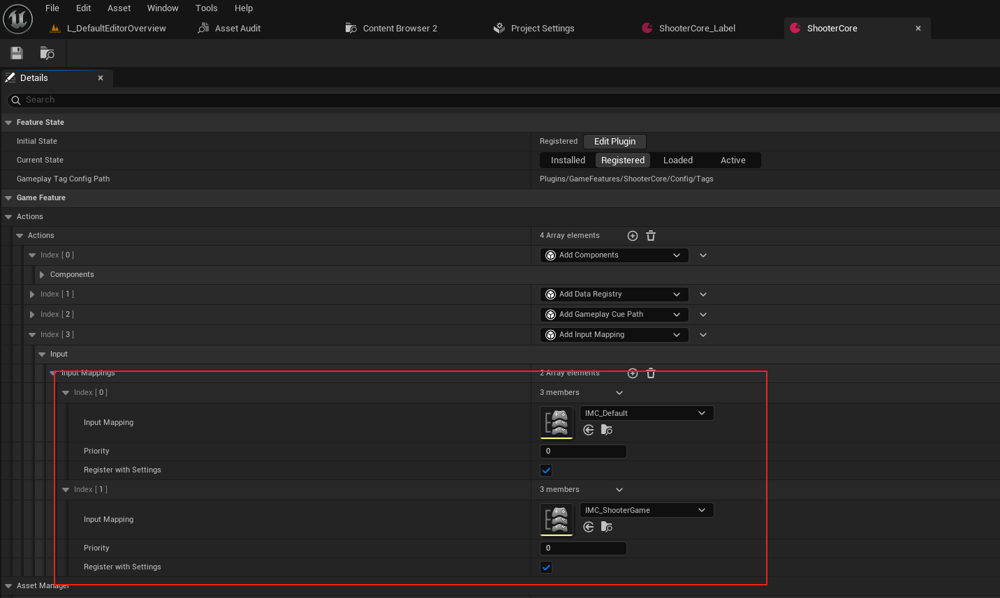
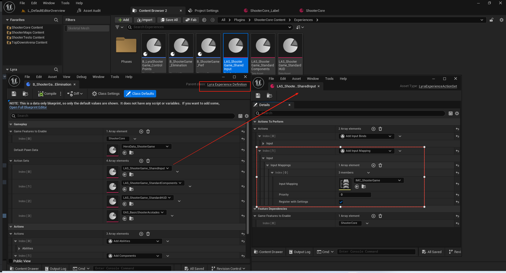


## GameFeatureAction_AddWidget
这个Action得重点讲一下.因为这个UI得架构都是围绕着它来得.
### 头文件
``` cpp

// 控件布局请求
USTRUCT()
struct FLyraHUDLayoutRequest
{
	GENERATED_BODY()

	// The layout widget to spawn
	// 用于生成布局的组件
	UPROPERTY(EditAnywhere, Category=UI, meta=(AssetBundles="Client"))
	TSoftClassPtr<UCommonActivatableWidget> LayoutClass;

	// The layer to insert the widget in
	// 用于插入该控件的层级
	UPROPERTY(EditAnywhere, Category=UI, meta=(Categories="UI.Layer"))
	FGameplayTag LayerID;
};

// 控件元素请求
USTRUCT()
struct FLyraHUDElementEntry
{
	GENERATED_BODY()

	// The widget to spawn
	// 将要生成的组件
	UPROPERTY(EditAnywhere, Category=UI, meta=(AssetBundles="Client"))
	TSoftClassPtr<UUserWidget> WidgetClass;

	// The slot ID where we should place this widget
	// 我们应放置此控件的槽位编号
	UPROPERTY(EditAnywhere, Category = UI)
	FGameplayTag SlotID;
};

//////////////////////////////////////////////////////////////////////
// UGameFeatureAction_AddWidget

/**
 * GameFeatureAction responsible for adding widgets.
 * “GameFeatureAction” 负责添加小部件。
 */
UCLASS(MinimalAPI, meta = (DisplayName = "Add Widgets"))
class UGameFeatureAction_AddWidgets final : public UGameFeatureAction_WorldActionBase
{
	GENERATED_BODY()

public:
	//~ Begin UGameFeatureAction interface
	// 取消激活时 释放数据
	virtual void OnGameFeatureDeactivating(FGameFeatureDeactivatingContext& Context) override;
#if WITH_EDITORONLY_DATA
	// 编辑器接口 迎来添加Bundle描述 LoadStateClient(TEXT("Client"));
	virtual void AddAdditionalAssetBundleData(FAssetBundleData& AssetBundleData) override;
#endif
	//~ End UGameFeatureAction interface

	//~ Begin UObject interface
#if WITH_EDITOR
	// 编辑器接口 非空判定
	virtual EDataValidationResult IsDataValid(class FDataValidationContext& Context) const override;
#endif
	//~ End UObject interface

private:
	// [属性元数据] 用于结构体数组。表示结构体内部的一个单一属性，当数组项被折叠时，该属性将用作标题摘要。
	// Layout to add to the HUD
	// 需要添加的布局
	UPROPERTY(EditAnywhere, Category=UI, meta=(TitleProperty="{LayerID} -> {LayoutClass}"))
	TArray<FLyraHUDLayoutRequest> Layout;

	// Widgets to add to the HUD
	// 需要添加的控件
	UPROPERTY(EditAnywhere, Category=UI, meta=(TitleProperty="{SlotID} -> {WidgetClass}"))
	TArray<FLyraHUDElementEntry> Widgets;

private:

	struct FPerActorData
	{
		// 添加的控件
		TArray<TWeakObjectPtr<UCommonActivatableWidget>> LayoutsAdded;
		// 添加的控件的句柄
		TArray<FUIExtensionHandle> ExtensionHandles;
	};

	struct FPerContextData
	{
		// 因为是绑定在AHUD上面的 所以需要存储拓展事件的句柄
		TArray<TSharedPtr<FComponentRequestHandle>> ComponentRequests;
		TMap<FObjectKey, FPerActorData> ActorData; 
	};

	// 句柄的容器
	TMap<FGameFeatureStateChangeContext, FPerContextData> ContextData;

	//~ Begin UGameFeatureAction_WorldActionBase interface
	// 绑定在HUD的拓展事件上
	virtual void AddToWorld(const FWorldContext& WorldContext, const FGameFeatureStateChangeContext& ChangeContext) override;
	//~ End UGameFeatureAction_WorldActionBase interface

	void Reset(FPerContextData& ActiveData);

	// 拓展事件 用来添加和移除 
	void HandleActorExtension(AActor* Actor, FName EventName, FGameFeatureStateChangeContext ChangeContext);

	// 根据蓝图配置去添加
	void AddWidgets(AActor* Actor, FPerContextData& ActiveData);

	// 根据容器内的句柄去移除
	void RemoveWidgets(AActor* Actor, FPerContextData& ActiveData);
};

```
先直接贴出了头文件.重点关注以下提到几个点!
### 绑定位置
``` cpp
void UGameFeatureAction_AddWidgets::AddToWorld(const FWorldContext& WorldContext, const FGameFeatureStateChangeContext& ChangeContext)
{
	UWorld* World = WorldContext.World();
	UGameInstance* GameInstance = WorldContext.OwningGameInstance;
	FPerContextData& ActiveData = ContextData.FindOrAdd(ChangeContext);

	if ((GameInstance != nullptr) && (World != nullptr) && World->IsGameWorld())
	{
		if (UGameFrameworkComponentManager* ComponentManager = UGameInstance::GetSubsystem<UGameFrameworkComponentManager>(GameInstance))
		{			
			TSoftClassPtr<AActor> HUDActorClass = ALyraHUD::StaticClass();

			TSharedPtr<FComponentRequestHandle> ExtensionRequestHandle = ComponentManager->AddExtensionHandler(
				HUDActorClass,
				UGameFrameworkComponentManager::FExtensionHandlerDelegate::CreateUObject(this, &ThisClass::HandleActorExtension, ChangeContext));
			
			ActiveData.ComponentRequests.Add(ExtensionRequestHandle);
		}
	}
}
```
### 事件的触发

``` cpp
void UGameFeatureAction_AddWidgets::HandleActorExtension(AActor* Actor, FName EventName, FGameFeatureStateChangeContext ChangeContext)
{
	FPerContextData& ActiveData = ContextData.FindOrAdd(ChangeContext);
	if ((EventName == UGameFrameworkComponentManager::NAME_ExtensionRemoved) || (EventName == UGameFrameworkComponentManager::NAME_ReceiverRemoved))
	{
		RemoveWidgets(Actor, ActiveData);
	}
	else if ((EventName == UGameFrameworkComponentManager::NAME_ExtensionAdded) || (EventName == UGameFrameworkComponentManager::NAME_GameActorReady))
	{
		//NAME_GameActorReady这个事件来自ALyraHUD的BeginPlay
		
		AddWidgets(Actor, ActiveData);
	}
}

```

### Ready事件得触发
``` cpp
void ALyraHUD::BeginPlay()
{
	UGameFrameworkComponentManager::SendGameFrameworkComponentExtensionEvent(this, UGameFrameworkComponentManager::NAME_GameActorReady);

	Super::BeginPlay();
}
```
``` cpp

TSharedPtr<FComponentRequestHandle> UGameFrameworkComponentManager::AddExtensionHandler(const TSoftClassPtr<AActor>& ReceiverClass, FExtensionHandlerDelegate ExtensionHandler)
{
	// You must have a target and bound handler. The target cannot be AActor, that is too broad and would be bad for performance.
	if (!ensure(!ReceiverClass.IsNull()) || !ensure(ExtensionHandler.IsBound()) || !ensure(ReceiverClass.ToString() != TEXT("/Script/Engine.Actor")))
	{
		return nullptr;
	}

	FComponentRequestReceiverClassPath ReceiverClassPath(ReceiverClass);
	FExtensionHandlerEvent& HandlerEvent = ReceiverClassToEventMap.FindOrAdd(ReceiverClassPath);

	// This is a fake multicast delegate using a map, we store it in shared memory to avoid things being reallocated during execution
	// This avoids copying the delegate itself which is often expensive
	// 这是一个使用映射实现的虚假多播委托，我们将其存储在共享内存中，以避免在执行过程中发生重新分配操作
	// 这样可以避免对委托本身进行复制，而复制操作通常是比较耗费资源的。
	FDelegateHandle DelegateHandle(FDelegateHandle::EGenerateNewHandleType::GenerateNewHandle);
	TSharedRef<FExtensionHandlerRegisteredDelegate> RegisteredHandler = MakeShared<FExtensionHandlerRegisteredDelegate>(MoveTemp(ExtensionHandler));
	HandlerEvent.Add(DelegateHandle, RegisteredHandler);

	if (UClass* ReceiverClassPtr = ReceiverClass.Get())
	{
		UGameInstance* LocalGameInstance = GetGameInstance();
		if (ensure(LocalGameInstance))
		{
			UWorld* LocalWorld = LocalGameInstance->GetWorld();
			if (ensure(LocalWorld))
			{
				for (TActorIterator<AActor> ActorIt(LocalWorld, ReceiverClassPtr); ActorIt; ++ActorIt)
				{
					if (ActorIt->IsActorInitialized())
					{
						// 这里触发!
						RegisteredHandler->Execute(*ActorIt, NAME_ExtensionAdded);
					}
				}
			}
		}
	}
	else
	{
		// Actor class is not in memory, there will be no actor instances
		// 由于该演员类未在内存中，因此不会生成任何演员实例。
	}

	return MakeShared<FComponentRequestHandle>(this, ReceiverClass, DelegateHandle);
}


```


### 移除事件的触发

``` cpp
void ALyraHUD::EndPlay(const EEndPlayReason::Type EndPlayReason)
{
	UGameFrameworkComponentManager::RemoveGameFrameworkComponentReceiver(this);

	Super::EndPlay(EndPlayReason);
}

```


``` cpp
void UGameFeatureAction_AddWidgets::Reset(FPerContextData& ActiveData)
{
	// 这里会去释放 Layout FComponentRequestHandle的析构函数执行
	ActiveData.ComponentRequests.Empty();

	for (TPair<FObjectKey, FPerActorData>& Pair : ActiveData.ActorData)
	{
		// 这里释放控件
		for (FUIExtensionHandle& Handle : Pair.Value.ExtensionHandles)
		{
			Handle.Unregister();
		}
	}

	// 必须时最后才释放 要不然移除事件RemoveWidgets找不到这里的数据了
	ActiveData.ActorData.Empty();
}
FComponentRequestHandle::~FComponentRequestHandle()
{
	UGameFrameworkComponentManager* LocalManager = OwningManager.Get();
	if (LocalManager)
	{
		if (ComponentClass.Get())
		{
			LocalManager->RemoveComponentRequest(ReceiverClass, ComponentClass);
		}
		if (ExtensionHandle.IsValid())
		{
			LocalManager->RemoveExtensionHandler(ReceiverClass, ExtensionHandle);
		}
	}
}


void UGameFrameworkComponentManager::RemoveExtensionHandler(const TSoftClassPtr<AActor>& ReceiverClass, FDelegateHandle DelegateHandle)
{
	FComponentRequestReceiverClassPath ReceiverClassPath(ReceiverClass);

	if (FExtensionHandlerEvent* HandlerEvent = ReceiverClassToEventMap.Find(ReceiverClassPath))
	{
		TSharedRef<FExtensionHandlerRegisteredDelegate>* HandlerDelegate = HandlerEvent->Find(DelegateHandle);
		if (ensure(HandlerDelegate))
		{
			TSharedRef<FExtensionHandlerRegisteredDelegate> HandlerRef = *HandlerDelegate;
			// Call it once on unregister
			if (UClass* ReceiverClassPtr = ReceiverClass.Get())
			{
				UGameInstance* LocalGameInstance = GetGameInstance();
				if (ensure(LocalGameInstance))
				{
					UWorld* LocalWorld = LocalGameInstance->GetWorld();
					ensure(GIsEditor || (LocalWorld != nullptr));
					if (LocalWorld)
					{
						for (TActorIterator<AActor> ActorIt(LocalWorld, ReceiverClassPtr); ActorIt; ++ActorIt)
						{
							if (ActorIt->IsActorInitialized())
							{
								// 这里
								HandlerRef->Execute(*ActorIt, NAME_ExtensionRemoved);
							}
						}
					}
				}
			}
			else
			{
				// Actor class is not in memory, there will be no actor instances
			}

			// This stops it from executing further up the stack
			HandlerRef->bRemoved = true;
			HandlerEvent->Remove(DelegateHandle);

			if (HandlerEvent->IsEmpty())
			{
				ReceiverClassToEventMap.Remove(ReceiverClassPath);
			}
		}
	}
}
```
### 核心推送逻辑
``` cpp
void UGameFeatureAction_AddWidgets::AddWidgets(AActor* Actor, FPerContextData& ActiveData)
{
	ALyraHUD* HUD = CastChecked<ALyraHUD>(Actor);

	if (!HUD->GetOwningPlayerController())
	{
		return;
	}

	if (ULocalPlayer* LocalPlayer = Cast<ULocalPlayer>(HUD->GetOwningPlayerController()->Player))
	{
		FPerActorData& ActorData = ActiveData.ActorData.FindOrAdd(HUD);

		for (const FLyraHUDLayoutRequest& Entry : Layout)
		{
			if (TSubclassOf<UCommonActivatableWidget> ConcreteWidgetClass = Entry.LayoutClass.Get())
			{
				// 推送布局 记录句柄
				ActorData.LayoutsAdded.Add(UCommonUIExtensions::PushContentToLayer_ForPlayer(LocalPlayer, Entry.LayerID, ConcreteWidgetClass));
			}
		}

		UUIExtensionSubsystem* ExtensionSubsystem = HUD->GetWorld()->GetSubsystem<UUIExtensionSubsystem>();
		for (const FLyraHUDElementEntry& Entry : Widgets)
		{
			// 推送控件
			ActorData.ExtensionHandles.Add(ExtensionSubsystem->RegisterExtensionAsWidgetForContext(Entry.SlotID, LocalPlayer, Entry.WidgetClass.Get(), -1));
		}
	}
}

```
### 推送布局
这里的内容涉及到我们之前修复加载界面.很重要.必须掌握.是我们架构UI的核心.
``` cpp
	// 将布局推送给玩家
	UFUNCTION(BlueprintCallable, BlueprintCosmetic, Category = "Global UI Extensions")
	static UE_API UCommonActivatableWidget* PushContentToLayer_ForPlayer(const ULocalPlayer* LocalPlayer, UPARAM(meta = (Categories = "UI.Layer")) FGameplayTag LayerName, UPARAM(meta = (AllowAbstract = false)) TSubclassOf<UCommonActivatableWidget> WidgetClass);


```
``` cpp
UCommonActivatableWidget* UCommonUIExtensions::PushContentToLayer_ForPlayer(const ULocalPlayer* LocalPlayer, FGameplayTag LayerName, TSubclassOf<UCommonActivatableWidget> WidgetClass)
{
	// 非空判定
	if (!ensure(LocalPlayer) || !ensure(WidgetClass != nullptr))
	{
		return nullptr;
	}

	// 拿到我们的游戏UI管理子系统
	if (UGameUIManagerSubsystem* UIManager = LocalPlayer->GetGameInstance()->GetSubsystem<UGameUIManagerSubsystem>())
	{
		// 可以获取到我们当前的UI策略 这个是蓝图资产 并且需要在ini中配置才有
		if (UGameUIPolicy* Policy = UIManager->GetCurrentUIPolicy())
		{
			// 这个Layout是在LocalPlayer登录游戏实例时 通过游戏实例转发到游戏UI子系统根据UI策略构建的
			if (UPrimaryGameLayout* RootLayout = Policy->GetRootLayout(CastChecked<UCommonLocalPlayer>(LocalPlayer)))
			{
				// 真正的去创建布局
				return RootLayout->PushWidgetToLayerStack(LayerName, WidgetClass);
			}
		}
	}

	return nullptr;
}


```

#### 根布局的创建
本地玩家类登录的时候就创建了
``` cpp
int32 UCommonGameInstance::AddLocalPlayer(ULocalPlayer* NewPlayer, FPlatformUserId UserId)
{
	// 重写父类方法 转发给游戏UI子系统创建根布局UI
	int32 ReturnVal = Super::AddLocalPlayer(NewPlayer, UserId);
	if (ReturnVal != INDEX_NONE)
	{
		if (!PrimaryPlayer.IsValid())
		{
			UE_LOG(LogCommonGame, Log, TEXT("AddLocalPlayer: Set %s to Primary Player"), *NewPlayer->GetName());
			PrimaryPlayer = NewPlayer;
		}
		// 转发到UI子系统 这里根据UI策略创建了Layout
		GetSubsystem<UGameUIManagerSubsystem>()->NotifyPlayerAdded(Cast<UCommonLocalPlayer>(NewPlayer));
	}
	
	return ReturnVal;
}
```
``` cpp
void UGameUIManagerSubsystem::NotifyPlayerAdded(UCommonLocalPlayer* LocalPlayer)
{
	if (ensure(LocalPlayer) && CurrentPolicy)
	{
		CurrentPolicy->NotifyPlayerAdded(LocalPlayer);
	}
}
```
``` cpp
void UGameUIPolicy::NotifyPlayerAdded(UCommonLocalPlayer* LocalPlayer)
{
	// 在玩家控制前修改时调用这个函数进行重设
	LocalPlayer->OnPlayerControllerSet.AddWeakLambda(this, [this](UCommonLocalPlayer* LocalPlayer, APlayerController* PlayerController)
	{
		// 清理之前的
		NotifyPlayerRemoved(LocalPlayer);

		// 坚持是否已经创建 如果已经创建过了 就进行复用
		if (FRootViewportLayoutInfo* LayoutInfo = RootViewportLayouts.FindByKey(LocalPlayer))
		{
			AddLayoutToViewport(LocalPlayer, LayoutInfo->RootLayout);
			LayoutInfo->bAddedToViewport = true;
		}
		else
		{
			// 没有需要重新创建以下
			CreateLayoutWidget(LocalPlayer);
		}
	});

	// 检查是否创建过了
	if (FRootViewportLayoutInfo* LayoutInfo = RootViewportLayouts.FindByKey(LocalPlayer))
	{
		AddLayoutToViewport(LocalPlayer, LayoutInfo->RootLayout);
		LayoutInfo->bAddedToViewport = true;
	}
	else
	{
		CreateLayoutWidget(LocalPlayer);
	}
}

```
``` cpp
void UGameUIPolicy::CreateLayoutWidget(UCommonLocalPlayer* LocalPlayer)
{
	if (APlayerController* PlayerController = LocalPlayer->GetPlayerController(GetWorld()))
	{
		TSubclassOf<UPrimaryGameLayout> LayoutWidgetClass = GetLayoutWidgetClass(LocalPlayer);
		if (ensure(LayoutWidgetClass && !LayoutWidgetClass->HasAnyClassFlags(CLASS_Abstract)))
		{
			UPrimaryGameLayout* NewLayoutObject = CreateWidget<UPrimaryGameLayout>(PlayerController, LayoutWidgetClass);
			RootViewportLayouts.Emplace(LocalPlayer, NewLayoutObject, true);
			
			AddLayoutToViewport(LocalPlayer, NewLayoutObject);
		}
	}
}
```
``` cpp
void UGameUIPolicy::AddLayoutToViewport(UCommonLocalPlayer* LocalPlayer, UPrimaryGameLayout* Layout)
{
	UE_LOG(LogCommonGame, Log, TEXT("[%s] is adding player [%s]'s root layout [%s] to the viewport"), *GetName(), *GetNameSafe(LocalPlayer), *GetNameSafe(Layout));

	Layout->SetPlayerContext(FLocalPlayerContext(LocalPlayer));
	Layout->AddToPlayerScreen(1000);

	OnRootLayoutAddedToViewport(LocalPlayer, Layout);
}
```
``` cpp
void UGameUIPolicy::OnRootLayoutAddedToViewport(UCommonLocalPlayer* LocalPlayer, UPrimaryGameLayout* Layout)
{
#if WITH_EDITOR
	if (GIsEditor && LocalPlayer->IsPrimaryPlayer())
	{
		// So our controller will work in PIE without needing to click in the viewport
		// 因此，我们的控制器能够在 PIE 环境中运行，而无需在视图区域内进行点击操作。
		FSlateApplication::Get().SetUserFocusToGameViewport(0);
	}
#endif
}
```

#### 在根布局上面推送Layer
##### 几个UI的顶级父类
这里需要区分以下UPrimaryGameLayout,ULyraHUDLayout,ALyraHUD这几个UI相关的类.
简单掠过以下即可.我们在CommonUI章节再详细展开.要不然这节真写不完了....
``` cpp
// An activatable widget that automatically drives the desired input config when activated
// 一个可激活的组件，激活时会自动执行所需的输入配置操作
UCLASS(Abstract, Blueprintable)
class ULyraActivatableWidget : public UCommonActivatableWidget
{
	GENERATED_BODY()

public:
	ULyraActivatableWidget(const FObjectInitializer& ObjectInitializer);
};


/**
 * ULyraHUDLayout
 *
 *	Widget used to lay out the player's HUD (typically specified by an Add Widgets action in the experience)
 * 用于布置玩家头显界面的组件（通常通过“添加组件”操作在体验中进行指定）
 */
UCLASS(Abstract, BlueprintType, Blueprintable, Meta = (DisplayName = "Lyra HUD Layout", Category = "Lyra|HUD"))
class ULyraHUDLayout : public ULyraActivatableWidget
{
	GENERATED_BODY()

public:

	ULyraHUDLayout(const FObjectInitializer& ObjectInitializer);
};


/**
 * The primary game UI layout of your game.  This widget class represents how to layout, push and display all layers
 * of the UI for a single player.  Each player in a split-screen game will receive their own primary game layout.
 *
 * * 您游戏的主要用户界面布局。此组件类描述了如何为单个玩家布局、推送和显示整个用户界面的各个层。在分屏游戏中，每个玩家都将拥有自己的主要游戏布局。
 */
UCLASS(MinimalAPI, Abstract, meta = (DisableNativeTick))
class UPrimaryGameLayout : public UCommonUserWidget
{
	GENERATED_BODY()
};
```
##### 推送到指定Layer
``` cpp
UCLASS(MinimalAPI, Abstract, meta = (DisableNativeTick))
class UPrimaryGameLayout : public UCommonUserWidget
{
	GENERATED_BODY()
	template <typename ActivatableWidgetT = UCommonActivatableWidget>
	ActivatableWidgetT* PushWidgetToLayerStack(FGameplayTag LayerName, UClass* ActivatableWidgetClass)
	{
		return PushWidgetToLayerStack<ActivatableWidgetT>(LayerName, ActivatableWidgetClass, [](ActivatableWidgetT&) {});
	}

	template <typename ActivatableWidgetT = UCommonActivatableWidget>
	ActivatableWidgetT* PushWidgetToLayerStack(FGameplayTag LayerName, UClass* ActivatableWidgetClass, TFunctionRef<void(ActivatableWidgetT&)> InitInstanceFunc)
	{
		// 类型判定
		static_assert(TIsDerivedFrom<ActivatableWidgetT, UCommonActivatableWidget>::IsDerived, "Only CommonActivatableWidgets can be used here");

		if (UCommonActivatableWidgetContainerBase* Layer = GetLayerWidget(LayerName))
		{
			return Layer->AddWidget<ActivatableWidgetT>(ActivatableWidgetClass, InitInstanceFunc);
		}

		return nullptr;
	}
}	
UCommonActivatableWidgetContainerBase* UPrimaryGameLayout::GetLayerWidget(FGameplayTag LayerName)
{
	return Layers.FindRef(LayerName);
}

void UPrimaryGameLayout::RegisterLayer(FGameplayTag LayerTag, UCommonActivatableWidgetContainerBase* LayerWidget)
{
	if (!IsDesignTime())
	{
		LayerWidget->OnTransitioningChanged.AddUObject(this, &UPrimaryGameLayout::OnWidgetStackTransitioning);
		// TODO: Consider allowing a transition duration, we currently set it to 0, because if it's not 0, the
		//       transition effect will cause focus to not transition properly to the new widgets when using
		//       gamepad always.
		// 注意事项：考虑允许设置过渡持续时间。目前我们将该时间设置为 0，因为如果设置不为 0，那么在使用游戏手柄始终模式时，过渡效果会导致焦点无法正确转移到新的控件上。
		LayerWidget->SetTransitionDuration(0.0);

		Layers.Add(LayerTag, LayerWidget);
	}
}


```
请结合下面两张蓝图使用进行理解即可.
在UPrimaryGameLayout里面出了Layer.这个Layer注册的时候时绑定了Tag的.
当我们推送布局到根布局的时候.需要对应布局的Tag.
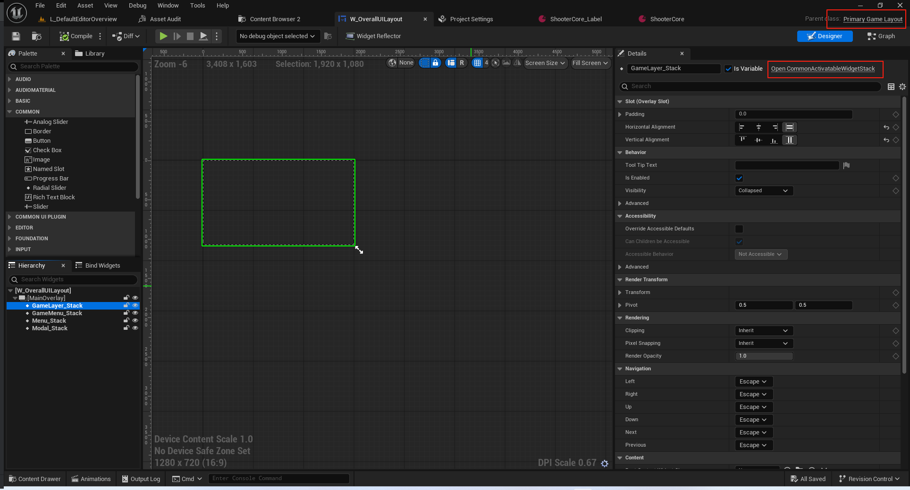
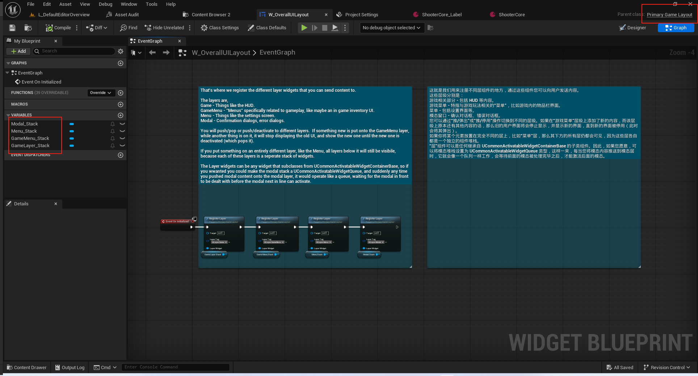

###### UPrimaryGameLayout
此处直接给出头文件注释.实现都比较简单
``` cpp

/**
 * The primary game UI layout of your game.  This widget class represents how to layout, push and display all layers
 * of the UI for a single player.  Each player in a split-screen game will receive their own primary game layout.
 *
 * * 您游戏的主要用户界面布局。此组件类描述了如何为单个玩家布局、推送和显示整个用户界面的各个层。在分屏游戏中，每个玩家都将拥有自己的主要游戏布局。
 */
UCLASS(MinimalAPI, Abstract, meta = (DisableNativeTick))
class UPrimaryGameLayout : public UCommonUserWidget
{
	GENERATED_BODY()

public:
	// 获取对应的根布局 从世界上下文,玩家控制器或本地玩家对象
	static UE_API UPrimaryGameLayout* GetPrimaryGameLayoutForPrimaryPlayer(const UObject* WorldContextObject);
	static UE_API UPrimaryGameLayout* GetPrimaryGameLayout(APlayerController* PlayerController);
	static UE_API UPrimaryGameLayout* GetPrimaryGameLayout(ULocalPlayer* LocalPlayer);

public:
	// 构造函数无作用
	UE_API UPrimaryGameLayout(const FObjectInitializer& ObjectInitializer);

	/** A dormant root layout is collapsed and responds only to persistent actions registered by the owning player */
	/** 休眠状态下的根布局会被折叠起来，并且仅对由所属玩家注册的持续性操作做出响应 */
	UE_API void SetIsDormant(bool Dormant);
	bool IsDormant() const { return bIsDormant; }

public:
	// 异步推送布局
	template <typename ActivatableWidgetT = UCommonActivatableWidget>
	TSharedPtr<FStreamableHandle> PushWidgetToLayerStackAsync(FGameplayTag LayerName, bool bSuspendInputUntilComplete, TSoftClassPtr<UCommonActivatableWidget> ActivatableWidgetClass)
	{
		return PushWidgetToLayerStackAsync<ActivatableWidgetT>(LayerName, bSuspendInputUntilComplete, ActivatableWidgetClass, [](EAsyncWidgetLayerState, ActivatableWidgetT*) {});
	}

	template <typename ActivatableWidgetT = UCommonActivatableWidget>
	TSharedPtr<FStreamableHandle> PushWidgetToLayerStackAsync(FGameplayTag LayerName, bool bSuspendInputUntilComplete, TSoftClassPtr<UCommonActivatableWidget> ActivatableWidgetClass, TFunction<void(EAsyncWidgetLayerState, ActivatableWidgetT*)> StateFunc)
	{
		// 类型判定
		static_assert(TIsDerivedFrom<ActivatableWidgetT, UCommonActivatableWidget>::IsDerived, "Only CommonActivatableWidgets can be used here");

		// 中断的原因
		static FName NAME_PushingWidgetToLayer("PushingWidgetToLayer");
		// 这里可以决定是否要阻断输入
		const FName SuspendInputToken = bSuspendInputUntilComplete ? UCommonUIExtensions::SuspendInputForPlayer(GetOwningPlayer(), NAME_PushingWidgetToLayer) : NAME_None;

		FStreamableManager& StreamableManager = UAssetManager::Get().GetStreamableManager();
		TSharedPtr<FStreamableHandle> StreamingHandle = StreamableManager.RequestAsyncLoad(ActivatableWidgetClass.ToSoftObjectPath(), FStreamableDelegate::CreateWeakLambda(this,
			[this, LayerName, ActivatableWidgetClass, StateFunc, SuspendInputToken]()
			{
				// 恢复输入
				UCommonUIExtensions::ResumeInputForPlayer(GetOwningPlayer(), SuspendInputToken);

				// 调用同步接口
				ActivatableWidgetT* Widget = PushWidgetToLayerStack<ActivatableWidgetT>(LayerName, ActivatableWidgetClass.Get(), [StateFunc](ActivatableWidgetT& WidgetToInit) {
					StateFunc(EAsyncWidgetLayerState::Initialize, &WidgetToInit);
				});
				// 外部的回调事件
				StateFunc(EAsyncWidgetLayerState::AfterPush, Widget);
			})
		);

		// Setup a cancel delegate so that we can resume input if this handler is canceled.
		// 设置一个取消委托，以便在该处理程序被取消时能够恢复输入操作。
		StreamingHandle->BindCancelDelegate(FStreamableDelegate::CreateWeakLambda(this,
			[this, StateFunc, SuspendInputToken]()
			{
				UCommonUIExtensions::ResumeInputForPlayer(GetOwningPlayer(), SuspendInputToken);
				StateFunc(EAsyncWidgetLayerState::Canceled, nullptr);
			})
		);

		return StreamingHandle;
	}

	template <typename ActivatableWidgetT = UCommonActivatableWidget>
	ActivatableWidgetT* PushWidgetToLayerStack(FGameplayTag LayerName, UClass* ActivatableWidgetClass)
	{
		return PushWidgetToLayerStack<ActivatableWidgetT>(LayerName, ActivatableWidgetClass, [](ActivatableWidgetT&) {});
	}

	template <typename ActivatableWidgetT = UCommonActivatableWidget>
	ActivatableWidgetT* PushWidgetToLayerStack(FGameplayTag LayerName, UClass* ActivatableWidgetClass, TFunctionRef<void(ActivatableWidgetT&)> InitInstanceFunc)
	{
		static_assert(TIsDerivedFrom<ActivatableWidgetT, UCommonActivatableWidget>::IsDerived, "Only CommonActivatableWidgets can be used here");

		if (UCommonActivatableWidgetContainerBase* Layer = GetLayerWidget(LayerName))
		{
			return Layer->AddWidget<ActivatableWidgetT>(ActivatableWidgetClass, InitInstanceFunc);
		}

		return nullptr;
	}

	// Find the widget if it exists on any of the layers and remove it from the layer.
	// 如果该组件存在于任何一层中，则将其从该层中移除。
	UE_API void FindAndRemoveWidgetFromLayer(UCommonActivatableWidget* ActivatableWidget);

	// Get the layer widget for the given layer tag.
	// 根据给定的图层标签获取该图层的组件。
	UE_API UCommonActivatableWidgetContainerBase* GetLayerWidget(FGameplayTag LayerName);

protected:
	/** Register a layer that widgets can be pushed onto. */
	/** 注册一个可将控件推入其中的层。*/
	UFUNCTION(BlueprintCallable, Category="Layer")
	UE_API void RegisterLayer(UPARAM(meta = (Categories = "UI.Layer")) FGameplayTag LayerTag, UCommonActivatableWidgetContainerBase* LayerWidget);

	// 休眠状态发生改变 触发事件
	UE_API virtual void OnIsDormantChanged();

	// 信号量 控制输入操作的是否暂停
	UE_API void OnWidgetStackTransitioning(UCommonActivatableWidgetContainerBase* Widget, bool bIsTransitioning);
	
private:
	bool bIsDormant = false;

	// Lets us keep track of all suspended input tokens so that multiple async UIs can be loading and we correctly suspend
	// for the duration of all of them.
	// 让我们记录所有被暂停的输入令牌，以便多个异步用户界面能够同时加载，同时我们也能在所有这些操作持续进行期间正确地暂停操作。
	TArray<FName> SuspendInputTokens;

	// The registered layers for the primary layout.
	// 主布局所注册的层。
	UPROPERTY(Transient, meta = (Categories = "UI.Layer"))
	TMap<FGameplayTag, TObjectPtr<UCommonActivatableWidgetContainerBase>> Layers;
};

#undef UE_API

```
注意一个细节即可
``` cpp
UCLASS(MinimalAPI)
class UCommonUIExtensions : public UBlueprintFunctionLibrary
{
	GENERATED_BODY()
	
public:

	UFUNCTION(BlueprintCallable, BlueprintCosmetic, Category = "Global UI Extensions")
	static UE_API FName SuspendInputForPlayer(APlayerController* PlayerController, FName SuspendReason);

	static UE_API FName SuspendInputForPlayer(ULocalPlayer* LocalPlayer, FName SuspendReason);

	UFUNCTION(BlueprintCallable, BlueprintCosmetic, Category = "Global UI Extensions")
	static UE_API void ResumeInputForPlayer(APlayerController* PlayerController, FName SuspendToken);

	static UE_API void ResumeInputForPlayer(ULocalPlayer* LocalPlayer, FName SuspendToken);
};
```
``` cpp
FName UCommonUIExtensions::SuspendInputForPlayer(ULocalPlayer* LocalPlayer, FName SuspendReason)
{
	// 通过子系统来调用
	if (UCommonInputSubsystem* CommonInputSubsystem = UCommonInputSubsystem::Get(LocalPlayer))
	{
		InputSuspensions++;
		FName SuspendToken = SuspendReason;
		SuspendToken.SetNumber(InputSuspensions);

		CommonInputSubsystem->SetInputTypeFilter(ECommonInputType::MouseAndKeyboard, SuspendToken, true);
		CommonInputSubsystem->SetInputTypeFilter(ECommonInputType::Gamepad, SuspendToken, true);
		CommonInputSubsystem->SetInputTypeFilter(ECommonInputType::Touch, SuspendToken, true);

		return SuspendToken;
	}

	return NAME_None;
}
```

###### ContainerBase
``` cpp
/** 
 * Base of widgets built to manage N activatable widgets, displaying one at a time.
 * Intentionally meant to be black boxes that do not expose child/slot modification like a normal panel widget.
 * 这些小部件的底座设计用于管理 N 个可激活的小部件，每次仅显示一个。
 * 其设计初衷是作为“黑匣子”，不像普通面板小部件那样允许对子部件/槽进行修改。
 */
UCLASS(MinimalAPI, Abstract)
class UCommonActivatableWidgetContainerBase : public UWidget
{
	GENERATED_BODY()


	/** 
	 * Adds a widget of the given class to the container. 
	 * Note that all widgets added to the container are pooled, so the caller should not try to cache and re-use the created widget.
	 * 
	 * It is possible for multiple instances of the same class to be added to the container at once, so any instance created in the past
	 * is not guaranteed to be the one returned this time.
	 *
	 * So in practice, you should not trust that any prior state has been retained on the returned widget, and establish all appropriate properties every time.
	 */
	/**
	 * 将指定类别的控件添加到容器中。
	 * 请注意，添加到容器中的所有控件都是被池化的，因此调用者不应尝试缓存并重复使用所创建的控件。
	 * 同一个类的多个实例可以一次性被添加到容器中，因此过去创建的任何实例都不能保证就是这次返回的那个实例。
	 * 因此在实际应用中，您不应假定返回的控件中会保留之前的任何状态，而应每次都重新设置所有必要的属性。

	 */
	UFUNCTION(BlueprintCallable, Category = ActivatableWidgetStack, meta = (DeterminesOutputType = ActivatableWidgetClass, DisplayName = "Push Widget"))
	UE_API UCommonActivatableWidget* BP_AddWidget(TSubclassOf<UCommonActivatableWidget> ActivatableWidgetClass);


	/** 
	 * Generates (either creates or pulls from the inactive pool) instance of the given widget class and adds it to the container.
	 * The provided lambda is called after the instance has been generated and before it is actually added to the container.
	 * So if you've got setup to do on the instance before it potentially activates, the lambda is the place to do it.
	 */
	/**
	 * 生成（要么创建，要么从未激活的池中提取）指定控件类的实例，并将其添加到容器中。
	 * 提供的 lambda 表达式在实例生成之后、实际添加到容器之前被调用。
	 * 因此，如果您需要在实例可能激活之前对其进行设置，那么 lambda 表达式就是执行这些设置的地方。
	 */
	template <typename ActivatableWidgetT = UCommonActivatableWidget>
	ActivatableWidgetT* AddWidget(TSubclassOf<UCommonActivatableWidget> ActivatableWidgetClass, TFunctionRef<void(ActivatableWidgetT&)> InstanceInitFunc)
	{
		// Don't actually add the widget if the cast will fail
		// 若转换操作会失败，则不要实际添加该组件
		if (ActivatableWidgetClass && ActivatableWidgetClass->IsChildOf<ActivatableWidgetT>())
		{
			return Cast<ActivatableWidgetT>(AddWidgetInternal(ActivatableWidgetClass, [&InstanceInitFunc] (UCommonActivatableWidget& WidgetInstance) 
				{
					InstanceInitFunc(*CastChecked<ActivatableWidgetT>(&WidgetInstance));
				}));
		}
		return nullptr;
	}}

	/**
	 * Gets an instance of a widget of the given class.
	 * The underlying slate is stored automatically as well, so the returned widget is fully constructed and GetCachedWidget will return a valid SWidget.
	 */
	/**
	 * 获取指定类的某个控件实例。
	 * 同时，底层的滑板也会自动保存下来，因此返回的控件是完全构建好的，调用 GetCachedWidget 方法将返回一个有效的 SWidget 对象。
	 */
	template <typename UserWidgetT = UUserWidget>
	UserWidgetT* GetOrCreateInstance(TSubclassOf<UserWidgetT> WidgetClass)
	{
		// Just make a normal SObjectWidget, same as would happen in TakeWidget
		return AddActiveWidgetInternal(WidgetClass,
			[] (UUserWidget* Widget, TSharedRef<SWidget> Content)
			{
				return SNew(SObjectWidget, Widget)[Content];
			});
	}

	template <typename UserWidgetT = UUserWidget>
	UserWidgetT* AddActiveWidgetInternal(TSubclassOf<UserWidgetT> WidgetClass, WidgetConstructFunc ConstructWidgetFunc)
	{
		if (!ensure(IsInitialized()) || !WidgetClass)
		{
			return nullptr;
		}

		UUserWidget* WidgetInstance = nullptr;
		for (UUserWidget* InactiveWidget : InactiveWidgets)
		{
			if (InactiveWidget->GetClass() == WidgetClass)
			{
				WidgetInstance = InactiveWidget;
				InactiveWidgets.RemoveSingleSwap(InactiveWidget);
				break;
			}
		}

		UWidget* OwningWidgetPtr = OwningWidget.Get();
		if (!WidgetInstance)
		{
			if (OwningWidgetPtr)
			{
				WidgetInstance = CreateWidget(OwningWidgetPtr, WidgetClass);
			}
			else if (APlayerController* PlayerControllerPtr = DefaultPlayerController.Get())
			{
				WidgetInstance = CreateWidget(PlayerControllerPtr, WidgetClass);
			}
			else
			{
				WidgetInstance = CreateWidget(OwningWorld.Get(), WidgetClass);
			}
		}

		if (WidgetInstance)
		{
			ActiveWidgets.Add(WidgetInstance);
			
			// For pools owned by a widget, we never want to construct Slate widgets before the owning widget itself has built any Slate
			if (!OwningWidgetPtr || OwningWidgetPtr->GetCachedWidget().IsValid())
			{
				TSharedPtr<SWidget>& CachedSlateWidget = CachedSlateByWidgetObject.FindOrAdd(WidgetInstance);
				if (!CachedSlateWidget.IsValid())
				{
					CachedSlateWidget = WidgetInstance->TakeDerivedWidget(ConstructWidgetFunc);
				}
			}
		}

		return Cast<UserWidgetT>(WidgetInstance);
	}


};


UCommonActivatableWidget* UCommonActivatableWidgetContainerBase::AddWidgetInternal(TSubclassOf<UCommonActivatableWidget> ActivatableWidgetClass, TFunctionRef<void(UCommonActivatableWidget&)> InitFunc)
{
	if (UCommonActivatableWidget* WidgetInstance = GeneratedWidgetsPool.GetOrCreateInstance(ActivatableWidgetClass))
	{
		InitFunc(*WidgetInstance);
		RegisterInstanceInternal(*WidgetInstance);
		return WidgetInstance;
	}
	return nullptr;
}
void UCommonActivatableWidgetContainerBase::RegisterInstanceInternal(UCommonActivatableWidget& NewWidget)
{
	UE_LOG(LogCommonUI, VeryVerbose, TEXT("UCommonActivatableWidgetContainerBase::RegisterInstanceInternal() NewWidget: %s"), *NewWidget.GetName());
	
	// @TODO: Log if bAutoActivate is true on the provided widget, since it quite simply makes no sense.
	if (ensure(!WidgetList.Contains(&NewWidget)))
	{
		WidgetList.Add(&NewWidget);
		OnWidgetAddedToList(NewWidget);
	}
}

```
###### UCommonActivatableWidgetStack
这就是基于堆栈管理的UILayout
``` cpp
void UCommonActivatableWidgetContainerBase::SetSwitcherIndex(int32 TargetIndex, bool bInstantTransition /*= false*/)
{
	UE_LOG(LogCommonUI, VeryVerbose, TEXT("UCommonActivatableWidgetContainerBase::SetSwitcherIndex() TargetIndex: %d, bInstantTransition: %d"), TargetIndex, bInstantTransition);
	
	if (MySwitcher && MySwitcher->GetActiveWidgetIndex() != TargetIndex)
	{
		if (DisplayedWidget)
		{
			DisplayedWidget->OnDeactivated().RemoveAll(this);
			if (DisplayedWidget->IsActivated())
			{
				DisplayedWidget->DeactivateWidget();
			}
			else if (MySwitcher->GetActiveWidgetIndex() != 0)
			{
				// The displayed widget has already been deactivated by something other than us, so it should be removed from the container
				// We still need it to remain briefly though until we transition to the new index - then we can remove this entry's slot
				// 显示的控件已被我们之外的其他因素停用，因此应将其从容器中移除
				// 但我们仍需要让它短暂地保持存在状态，直到我们切换到新的索引页面——之后我们就可以移除此条目所占用的槽位了
				bRemoveDisplayedWidgetPostTransition = true;
			}
		}

		MySwitcher->TransitionToIndex(TargetIndex, bInstantTransition);
	}
}
```
``` cpp

/** 
 * A display queue of ActivatableWidget elements. 
 *
 * - Only one widget is active/displayed at a time, all others in the queue are deactivated.
 * - When the active widget deactivates, it is automatically removed from the widget, 
 *		released back to the pool, and the next widget in the queue (if any) is displayed
 */
/**
* 一个包含可激活组件元素的显示队列。*
* - 一次只能有一个小部件处于激活/显示状态，队列中的其他所有小部件都会被停用。
* - 当处于激活状态的小部件停止运行时，它会自动从小部件池中移除，并重新释放回池中，然后队列中的下一个小部件（如果有）会显示出来。*/
UCLASS(MinimalAPI)
class UCommonActivatableWidgetQueue : public UCommonActivatableWidgetContainerBase
{
	GENERATED_BODY()

protected:
	UE_API virtual void OnWidgetAddedToList(UCommonActivatableWidget& AddedWidget) override;
};

```
``` cpp
void UCommonActivatableWidgetQueue::OnWidgetAddedToList(UCommonActivatableWidget& AddedWidget)
{
	if (MySwitcher)
	{
		UE_LOG(LogCommonUI, VeryVerbose, TEXT("UCommonActivatableWidgetQueue::OnWidgetAddedToList() PriorNumWidgets: %d"), MySwitcher->GetNumWidgets() - 1);
		
		// Insert after the empty slot 0 and before the already queued widgets
		MySwitcher->AddSlot(1) [AddedWidget.TakeWidget()];

		if (MySwitcher->GetNumWidgets() == 2)
		{
			// The queue was empty, so we'll show this one immediately
			SetSwitcherIndex(1);
		}
		else if (DisplayedWidget && !DisplayedWidget->IsActivated() && MySwitcher->GetNumWidgets() == 3)
		{
			//The displayed widget is on its way out and we should not be going to 0 anymore, we should go to the new one
			SetSwitcherIndex(1, true); //and get there fast, we need to finish and evict the old widget before anything else happens
		}

	}
}
```

### 推送控件
这个地方有点绕.
需要理解拓展点和拓展程序.
先注册拓展点.
然后我们可以执行不同的拓展程序.从而实现一个tag推送不同的UI在这个tag对应的位置进行使用.
#### 注册执行拓展程序
``` cpp
void UGameFeatureAction_AddWidgets::AddWidgets(AActor* Actor, FPerContextData& ActiveData)
{
	// ...
		UUIExtensionSubsystem* ExtensionSubsystem = HUD->GetWorld()->GetSubsystem<UUIExtensionSubsystem>();
		for (const FLyraHUDElementEntry& Entry : Widgets)
		{
			// 推送控件
			ActorData.ExtensionHandles.Add(ExtensionSubsystem->RegisterExtensionAsWidgetForContext(Entry.SlotID, LocalPlayer, Entry.WidgetClass.Get(), -1));
		}
	// ...
}

```

#### 注册执行拓展点
``` cpp
void UUIExtensionPointWidget::RegisterExtensionPoint()
{
	if (UUIExtensionSubsystem* ExtensionSubsystem = GetWorld()->GetSubsystem<UUIExtensionSubsystem>())
	{
		TArray<UClass*> AllowedDataClasses;

		// 添加合规性子类 
		AllowedDataClasses.Add(UUserWidget::StaticClass());
		AllowedDataClasses.Append(DataClasses);

		// 这里注册两个 音可能没有LocalPlayer
		ExtensionPointHandles.Add(ExtensionSubsystem->RegisterExtensionPoint(
			ExtensionPointTag, ExtensionPointTagMatch, AllowedDataClasses,
			FExtendExtensionPointDelegate::CreateUObject(this, &ThisClass::OnAddOrRemoveExtension)
		));

		ExtensionPointHandles.Add(ExtensionSubsystem->RegisterExtensionPointForContext(
			ExtensionPointTag, GetOwningLocalPlayer(), ExtensionPointTagMatch, AllowedDataClasses,
			FExtendExtensionPointDelegate::CreateUObject(this, &ThisClass::OnAddOrRemoveExtension)
		));
	}
}
```
#### 调用注册
``` cpp
/**
 * UI控制推送推展的子系统
 */
UCLASS(MinimalAPI)
class UUIExtensionSubsystem : public UWorldSubsystem
{
	GENERATED_BODY()

public:
	// 注册拓展点!!!
	UE_API FUIExtensionPointHandle RegisterExtensionPoint(const FGameplayTag& ExtensionPointTag, EUIExtensionPointMatch ExtensionPointTagMatchType, const TArray<UClass*>& AllowedDataClasses, FExtendExtensionPointDelegate ExtensionCallback);
	UE_API FUIExtensionPointHandle RegisterExtensionPointForContext(const FGameplayTag& ExtensionPointTag, UObject* ContextObject, EUIExtensionPointMatch ExtensionPointTagMatchType, const TArray<UClass*>& AllowedDataClasses, FExtendExtensionPointDelegate ExtensionCallback);

	// 注册拓展程序!!!
	UE_API FUIExtensionHandle RegisterExtensionAsWidget(const FGameplayTag& ExtensionPointTag, TSubclassOf<UUserWidget> WidgetClass, int32 Priority);
	UE_API FUIExtensionHandle RegisterExtensionAsWidgetForContext(const FGameplayTag& ExtensionPointTag, UObject* ContextObject, TSubclassOf<UUserWidget> WidgetClass, int32 Priority);
	UE_API FUIExtensionHandle RegisterExtensionAsData(const FGameplayTag& ExtensionPointTag, UObject* ContextObject, UObject* Data, int32 Priority);
}
```
先看图片.如何在Layout中使用.
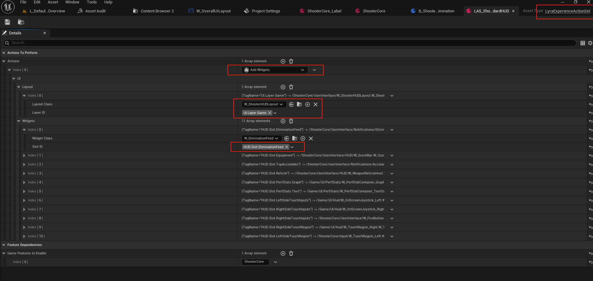
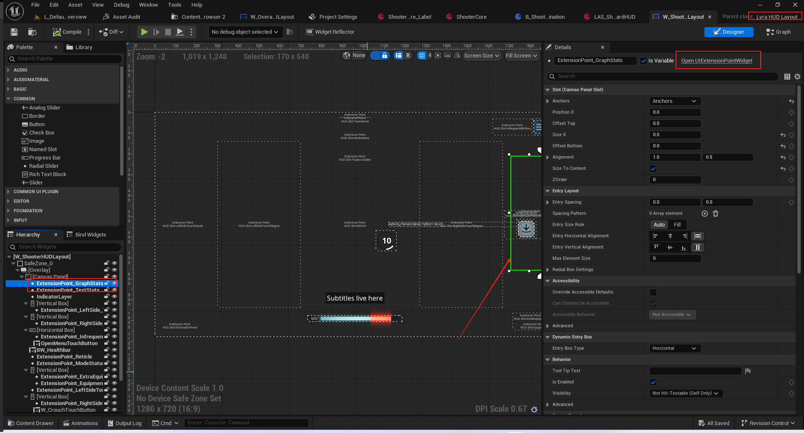

#### 实际执行逻辑
这里避免把大家绕晕了.
直接给出口诀.
先注册拓展点.即UI.
后注册这些拓展程序.GameFeature.即推送控件.
拓展点的收到拓展程序,合规性判定同归,拓展点执行拓展请求.请求中的数据由拓展程序注册时传递过来!
#### UUIExtensionPointWidget
``` cpp

/**
* 用于支持在设计阶段和运行阶段动态生成任意数量自动生成条目的组件的基础框架。
* 包含创建、构建和缓存任意数量条目组件所需的所有功能，但不提供任何条目创建或删除的方法。
* 由子类自行决定如何实现数据填充（有些可能完全自行完成，而不暴露任何相关机制）*
* @参见 UDynamicEntryBox，可获取一个现成可用的版本*/
/**
 * A slot that defines a location in a layout, where content can be added later
 * 一个用于定义布局中位置的槽位，此后可在该位置添加内容
 */
UCLASS(MinimalAPI)
class UUIExtensionPointWidget : public UDynamicEntryBoxBase
{
	GENERATED_BODY()

public:

	DECLARE_DYNAMIC_DELEGATE_RetVal_OneParam(TSubclassOf<UUserWidget>, FOnGetWidgetClassForData, UObject*, DataItem);
	DECLARE_DYNAMIC_DELEGATE_TwoParams(FOnConfigureWidgetForData, UUserWidget*, Widget, UObject*, DataItem);

	// 构造函数无作用
	UE_API UUIExtensionPointWidget(const FObjectInitializer& ObjectInitializer);

	//~UWidget interface
	// 释放资源
	UE_API virtual void ReleaseSlateResources(bool bReleaseChildren) override;
	/** 所有 UWidget 子类所实现的函数会在底层 SWidget 需要进行构建时被调用。*/
	// 逻辑嵌入的地方
	UE_API virtual TSharedRef<SWidget> RebuildWidget() override;
#if WITH_EDITOR
	// 编辑器接口 验证Tag是否有效
	UE_API virtual void ValidateCompiledDefaults(IWidgetCompilerLog& CompileLog) const override;
#endif
	//~End of UWidget interface

private:
	// 清理之前注册的数据
	void ResetExtensionPoint();
	// 向UI拓展子系统中注册拓展点
	void RegisterExtensionPoint();
	// 上下文是PlayerState
	void RegisterExtensionPointForPlayerState(UCommonLocalPlayer* LocalPlayer, APlayerState* PlayerState);
	void OnAddOrRemoveExtension(EUIExtensionAction Action, const FUIExtensionRequest& Request);

protected:
	/** The tag that defines this extension point */
	/** 定义此扩展点的标签 */
	UPROPERTY(EditAnywhere, BlueprintReadOnly, Category = "UI Extension")
	FGameplayTag ExtensionPointTag;

	/** How exactly does the extension need to match the extension point tag. */
	/** 该扩展究竟需要如何与扩展点标签相匹配。*/
	UPROPERTY(EditAnywhere, BlueprintReadOnly, Category = "UI Extension")
	EUIExtensionPointMatch ExtensionPointTagMatch = EUIExtensionPointMatch::ExactMatch;

	// 获取的数据的类类型容器 必须是其中的类型 当然项目置空即可 因为我们会添加UUserWidget::StaticClass()
	UPROPERTY(EditAnywhere, BlueprintReadOnly, Category = "UI Extension")
	TArray<TObjectPtr<UClass>> DataClasses;

	// 从数据中去获取控制的类的代理
	UPROPERTY(EditAnywhere, BlueprintReadOnly, Category="UI Extension", meta=( IsBindableEvent="True" ))
	FOnGetWidgetClassForData GetWidgetClassForData;

	// 对于获取的控件的类进行确认
	UPROPERTY(EditAnywhere, BlueprintReadOnly, Category="UI Extension", meta=( IsBindableEvent="True" ))
	FOnConfigureWidgetForData ConfigureWidgetForData;

	TArray<FUIExtensionPointHandle> ExtensionPointHandles;

	UPROPERTY(Transient)
	TMap<FUIExtensionHandle, TObjectPtr<UUserWidget>> ExtensionMapping;
};


```
#### UUIExtensionSubsystem
``` cpp


/**
 * UI控制推送推展的子系统
 */
UCLASS(MinimalAPI)
class UUIExtensionSubsystem : public UWorldSubsystem
{
	GENERATED_BODY()

public:
	// 注册拓展程序!!!
	UE_API FUIExtensionPointHandle RegisterExtensionPoint(const FGameplayTag& ExtensionPointTag, EUIExtensionPointMatch ExtensionPointTagMatchType, const TArray<UClass*>& AllowedDataClasses, FExtendExtensionPointDelegate ExtensionCallback);
	UE_API FUIExtensionPointHandle RegisterExtensionPointForContext(const FGameplayTag& ExtensionPointTag, UObject* ContextObject, EUIExtensionPointMatch ExtensionPointTagMatchType, const TArray<UClass*>& AllowedDataClasses, FExtendExtensionPointDelegate ExtensionCallback);

	// 注册一个拓展点!!!
	UE_API FUIExtensionHandle RegisterExtensionAsWidget(const FGameplayTag& ExtensionPointTag, TSubclassOf<UUserWidget> WidgetClass, int32 Priority);
	UE_API FUIExtensionHandle RegisterExtensionAsWidgetForContext(const FGameplayTag& ExtensionPointTag, UObject* ContextObject, TSubclassOf<UUserWidget> WidgetClass, int32 Priority);
	UE_API FUIExtensionHandle RegisterExtensionAsData(const FGameplayTag& ExtensionPointTag, UObject* ContextObject, UObject* Data, int32 Priority);

	UFUNCTION(BlueprintCallable, BlueprintCosmetic, Category = "UI Extension")
	UE_API void UnregisterExtension(const FUIExtensionHandle& ExtensionHandle);

	UFUNCTION(BlueprintCallable, BlueprintCosmetic, Category = "UI Extension")
	UE_API void UnregisterExtensionPoint(const FUIExtensionPointHandle& ExtensionPointHandle);

	static UE_API void AddReferencedObjects(UObject* InThis, FReferenceCollector& Collector);

protected:
	// 无作用
	UE_API virtual void Initialize(FSubsystemCollectionBase& Collection) override;
	// 无作用
	UE_API virtual void Deinitialize() override;

	// 通知拓展点有拓展的程序进来了.看看合规不.合规就执行拓展点的回调.
	UE_API void NotifyExtensionPointOfExtensions(TSharedPtr<FUIExtensionPoint>& ExtensionPoint);
	UE_API void NotifyExtensionPointsOfExtension(EUIExtensionAction Action, TSharedPtr<FUIExtension>& Extension);

	UFUNCTION(BlueprintCallable, BlueprintCosmetic, Category="UI Extension", meta = (DisplayName = "Register Extension Point"))
	UE_API FUIExtensionPointHandle K2_RegisterExtensionPoint(FGameplayTag ExtensionPointTag, EUIExtensionPointMatch ExtensionPointTagMatchType, const TArray<UClass*>& AllowedDataClasses, FExtendExtensionPointDynamicDelegate ExtensionCallback);
	
	UFUNCTION(BlueprintCallable, BlueprintCosmetic, Category = "UI Extension", meta = (DisplayName = "Register Extension (Widget)"))
	UE_API FUIExtensionHandle K2_RegisterExtensionAsWidget(FGameplayTag ExtensionPointTag, TSubclassOf<UUserWidget> WidgetClass, int32 Priority = -1);

	/**
	 * Registers the widget (as data) for a specific player.  This means the extension points will receive a UIExtensionForPlayer data object
	 * that they can look at to determine if it's for whatever they consider their player.
	 *
	 * 为特定的玩家注册该组件（作为数据的形式）。这意味着扩展点将接收到一个名为“UIExtensionForPlayer”的数据对象，
	 * 通过该对象，它们能够判断这是否是针对他们所认为的玩家的。
	 * 
	 */
	UFUNCTION(BlueprintCallable, BlueprintCosmetic, Category = "UI Extension", meta = (DisplayName = "Register Extension (Widget For Context)"))
	UE_API FUIExtensionHandle K2_RegisterExtensionAsWidgetForContext(FGameplayTag ExtensionPointTag, TSubclassOf<UUserWidget> WidgetClass, UObject* ContextObject, int32 Priority = -1);

	/**
	 * Registers the extension as data for any extension point that can make use of it.
	 * 将该扩展注册为可用于任何可利用该扩展的扩展点的数据。
	 */
	UFUNCTION(BlueprintCallable, BlueprintCosmetic, Category="UI Extension", meta = (DisplayName = "Register Extension (Data)"))
	UE_API FUIExtensionHandle K2_RegisterExtensionAsData(FGameplayTag ExtensionPointTag, UObject* Data, int32 Priority = -1);

	/**
	 * Registers the extension as data for any extension point that can make use of it.
	 * 将该扩展注册为可用于任何可利用该扩展的扩展点的数据。
	 * 
	 */
	UFUNCTION(BlueprintCallable, BlueprintCosmetic, Category="UI Extension", meta = (DisplayName = "Register Extension (Data For Context)"))
	UE_API FUIExtensionHandle K2_RegisterExtensionAsDataForContext(FGameplayTag ExtensionPointTag, UObject* ContextObject, UObject* Data, int32 Priority = -1);

	// 根据拓展的程序来创建拓展的请求 然后传递给拓展点
	UE_API FUIExtensionRequest CreateExtensionRequest(const TSharedPtr<FUIExtension>& Extension);

private:
	// 容器
	typedef TArray<TSharedPtr<FUIExtensionPoint>> FExtensionPointList;
	TMap<FGameplayTag, FExtensionPointList> ExtensionPointMap;
	// 容器
	typedef TArray<TSharedPtr<FUIExtension>> FExtensionList;
	TMap<FGameplayTag, FExtensionList> ExtensionMap;
};

```
## GameFeatureAction_SplitscreenConfig
底层接口
``` cpp
UCLASS(Within=Engine, transient, config=Engine, MinimalAPI)
class UGameViewportClient : public UScriptViewportClient, public FExec
{
	/** Allows game code to disable splitscreen (useful when in menus) */
	/** 允许游戏代码禁用分屏模式（在菜单界面使用时很有用） */

	ENGINE_API void SetForceDisableSplitscreen(const bool bDisabled);
};

```
这里注意一下这种类似于信号量的设计思想即可
``` cpp
TMap<FObjectKey, int32> UGameFeatureAction_SplitscreenConfig::GlobalDisableVotes;

void UGameFeatureAction_SplitscreenConfig::OnGameFeatureDeactivating(FGameFeatureDeactivatingContext& Context)
{
	Super::OnGameFeatureDeactivating(Context);

	for (int32 i = LocalDisableVotes.Num() - 1; i >= 0; i-- )
	{
		FObjectKey ViewportKey = LocalDisableVotes[i];
		UGameViewportClient* GVP = Cast<UGameViewportClient>(ViewportKey.ResolveObjectPtr());
		const FWorldContext* WorldContext = GEngine->GetWorldContextFromGameViewport(GVP);
		if (GVP && WorldContext)
		{
			if (!Context.ShouldApplyToWorldContext(*WorldContext))
			{
				// Wrong context so ignore it, dead objects count as part of this context
				// 错误的上下文，因此忽略它。已损坏的对象也应视为此上下文的一部分。
				continue;
			}
		}

		int32& VoteCount = GlobalDisableVotes[ViewportKey];
		// 只在最后一次的时候去关闭
		if (VoteCount <= 1)
		{
			GlobalDisableVotes.Remove(ViewportKey);

			if (GVP && WorldContext)
			{
				// 恢复
				GVP->SetForceDisableSplitscreen(false);
			}
		}
		else
		{
			--VoteCount;
		}
		LocalDisableVotes.RemoveAt(i);
	}
}

void UGameFeatureAction_SplitscreenConfig::AddToWorld(const FWorldContext& WorldContext, const FGameFeatureStateChangeContext& ChangeContext)
{
	if (bDisableSplitscreen)
	{
		if (UGameInstance* GameInstance = WorldContext.OwningGameInstance)
		{
			if (UGameViewportClient* VC = GameInstance->GetGameViewportClient())
			{
				/** FObjectKey 是一种不可变且可复制的键，可用于在整个应用程序的运行期间唯一标识一个对象 */			
				FObjectKey ViewportKey(VC);

				// 记录一下 开启了禁用分屏
				
				LocalDisableVotes.Add(ViewportKey);

				int32& VoteCount = GlobalDisableVotes.FindOrAdd(ViewportKey);
				VoteCount++;
				// 只在第一次的时候去禁用
				if (VoteCount == 1)
				{
					/** 允许游戏代码禁用分屏模式（在菜单界面使用时很有用） */
					VC->SetForceDisableSplitscreen(true);
				}
			}
		}
	}
}

```
## LyraGameFeaturePolicy
### 配置位置
DefaultGame
``` ini

[/Script/GameFeatures.GameFeaturesSubsystemSettings]
; 配置Gamfeature的管理类
GameFeaturesManagerClassName=/Script/LyraGame.LyraGameFeaturePolicy
```

### 插入观察者

它的作用主要用于注入IGameFeatureStateChangeObserver.
``` txt
/**
* 在您的游戏中，此类方法应被重写，以处理与游戏特定功能插件相关的游戏反应（包括插件的安装或卸载）*
* 通常情况下，您应倾向于在游戏功能数据资产中使用 UGameFeatureAction 实例，而非使用这种形式，尤其是在涉及数据的情况下更是如此。*
* 如果您确实要使用这些功能，请在您的 UGameFeaturesProjectPolicies 子类中创建它们，并通过在 UGameFeaturesSubsystem 上调用 AddObserver / RemoveObserver 来进行注册。*/
```
``` cpp
class IGameFeatureStateChangeObserver
{
	GENERATED_BODY()

public:

	// Invoked after a game feature plugin has been registered
	virtual void OnGameFeatureRegistering(const UGameFeatureData* GameFeatureData, const FString& PluginName, const FString& PluginURL) {}
	// ...

}
```
``` cpp
void ULyraGameFeaturePolicy::InitGameFeatureManager()
{
	Observers.Add(NewObject<ULyraGameFeature_HotfixManager>());
	Observers.Add(NewObject<ULyraGameFeature_AddGameplayCuePaths>());

	UGameFeaturesSubsystem& Subsystem = UGameFeaturesSubsystem::Get();
	for (UObject* Observer : Observers)
	{
		Subsystem.AddObserver(Observer);
	}

	Super::InitGameFeatureManager();
}

```
### 限制加载部分内容
``` cpp
void ULyraGameFeaturePolicy::GetGameFeatureLoadingMode(bool& bLoadClientData, bool& bLoadServerData) const
{
	// Editor will load both, this can cause hitching as the bundles are set to not preload in editor
	// 编辑器会同时加载这两部分内容，这可能会导致卡顿现象，因为这些包的设置不允许在编辑器中进行预加载。
	bLoadClientData = !IsRunningDedicatedServer();
	bLoadServerData = !IsRunningClientOnly();
}

```
### ULyraGameFeature_HotfixManager
主要用于触发资产修复
``` cpp
void ULyraGameFeature_HotfixManager::OnGameFeatureLoading(const UGameFeatureData* GameFeatureData, const FString& PluginURL)
{
	if (ULyraHotfixManager* HotfixManager = Cast<ULyraHotfixManager>(UOnlineHotfixManager::Get(nullptr)))
	{
		HotfixManager->RequestPatchAssetsFromIniFiles();
	}
}


```
### ULyraGameFeature_AddGameplayCuePaths
主要用于触发GameplayCuePaths在UGameFeatureAction_AddGameplayCuePath的修改.
这部分下节讲解!实现先留白即可.避免编译报错.也可以先创建空白类.
创建空白类的写法不再赘述.
``` cpp
UCLASS()
class ULyraGameFeature_AddGameplayCuePaths : public UObject, public IGameFeatureStateChangeObserver
{
	GENERATED_BODY()

public:
	virtual void OnGameFeatureRegistering(const UGameFeatureData* GameFeatureData, const FString& PluginName, const FString& PluginURL) override;
	virtual void OnGameFeatureUnregistering(const UGameFeatureData* GameFeatureData, const FString& PluginName, const FString& PluginURL) override;
};


```

## 回归之前的GameFeature使用点
请自行回归.或者翻阅之前的文档
### Target.cs文件中
Target.cs文件
``` cpp
	// 用于配置我们希望启用哪些游戏功能插件
	// 这是一种相对简单的实现方式，但您也可以根据当前分支的目标发布版本来构建不同的插件，例如，在主分支中启用正在进行中的功能，而在当前发布分支中则禁用这些功能。
	static public void ConfigureGameFeaturePlugins(TargetRules Target)
	{
		//...
	}

```

### Experience加载过程中
ExpericeMangerComponent
``` cpp
void ULyraExperienceManagerComponent::OnExperienceFullLoadCompleted()
{
	//....
};
```


## 总结
本节文档内容较多.主要GameFeatureActor一个功能实际上就对应了一个模块.
我们在这里重点讲述了关于UI拓展的一部分内容.下一节就会讲GameplayCueManager的部分内容.
涉及到GAS和输入的将在后续章节详细讲解.本章有个基础印象即可!!!!!