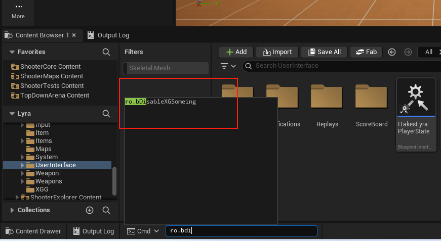
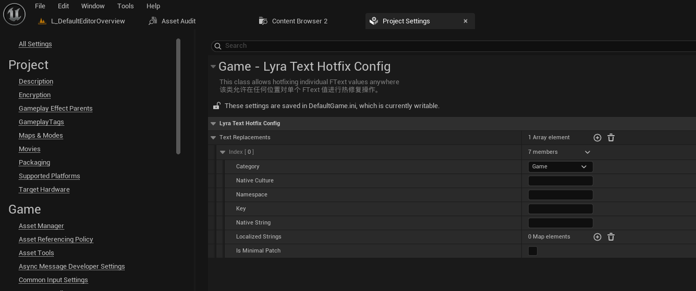

# UE5_Lyra学习指南_036_LyraHotFix

本文章仅为小刚-B站课堂-虚幻引擎视频课程Lyra-精讲的演讲手稿.  
本套课程链接:[[UE5]虚幻引擎游戏案例Lyra精讲](https://www.bilibili.com/cheese/play/ss112001159)  
前置课程链接:[[UE5]虚幻引擎UEC++从基础到进阶](https://www.bilibili.com/cheese/play/ss28043)  

文章内容由小刚撰写,采用了以下多种方式:  
1.口述转文字  
2.AI重构  
3.参考引擎源码  
4.Lyra工程源码  
5.结合社区论坛各位大佬的解析  

- [UE5\_Lyra学习指南\_036\_LyraHotFix](#ue5_lyra学习指南_036_lyrahotfix)
	- [概述](#概述)
	- [OnlineTitleFile](#onlinetitlefile)
		- [OnlineTitleFileEOS](#onlinetitlefileeos)
		- [FOnlineTitleFileEOSPlus](#fonlinetitlefileeosplus)
		- [初始化位置](#初始化位置)
		- [代码](#代码)
	- [OnlineHotfixManager](#onlinehotfixmanager)
		- [调用位置](#调用位置)
		- [初始化](#初始化)
		- [绑定回调](#绑定回调)
		- [修复完成](#修复完成)
	- [LyraHotfixManager](#lyrahotfixmanager)
	- [LyraRuntimeOptions](#lyraruntimeoptions)
		- [URuntimeOptionsBase](#uruntimeoptionsbase)
		- [调用入口](#调用入口)
		- [核心逻辑](#核心逻辑)
	- [LyraTextHotfixConfig](#lyratexthotfixconfig)
	- [总结](#总结)


## 概述
本节主要接单介绍一下LyraHitFix的相关接口.
因为热更修复的话并非我们课程的重点内容.所以这里只是简单提及.
而且这个东西依赖于EOS服务.而实际我们上线Steam并不需要使用和关心这块的内容!
这部分代码可以直接移除.或者复制粘贴均可!
## OnlineTitleFile
``` cpp
	/** The online interface to use for downloading the hotfix files */
	/** 用于下载补丁文件的在线接口 */
	IOnlineTitleFilePtr OnlineTitleFile;
```
它有两个子类
### OnlineTitleFileEOS
``` cpp
class FOnlineTitleFileEOS
	: public IOnlineTitleFile, public TSharedFromThis<FOnlineTitleFileEOS, ESPMode::ThreadSafe>
{
public:
	FOnlineTitleFileEOS() = delete;
	virtual ~FOnlineTitleFileEOS() = default;
}
```
### FOnlineTitleFileEOSPlus
``` cpp
/**
 * Interface for encapsulating the platform title file interface
 * 用于封装平台标题文件接口的接口
 */
class FOnlineTitleFileEOSPlus :
	public IOnlineTitleFile,
	public TSharedFromThis<FOnlineTitleFileEOSPlus, ESPMode::ThreadSafe>
{
public:
	FOnlineTitleFileEOSPlus() = delete;
	virtual ~FOnlineTitleFileEOSPlus();

}
```

### 初始化位置
``` cpp
	/** 
	 * Get the interface for accessing title file online services
	 * @param SubsystemName - Name of the requested online service
	 * @return Interface pointer for the appropriate service
	 */
	/**
	 * 获取用于访问在线服务的标题文件接口
	 * @参数 子系统名称 - 所需在线服务的名称
	 * @返回 与相应服务对应的接口指针
	 */
	IMPLEMENT_GET_INTERFACE(TitleFile);
```

``` cpp

UCLASS(MinimalAPI, Config=Engine)
class UOnlineHotfixManager :
	public UObject
{
	GENERATED_BODY()

protected:
	/** The online interface to use for downloading the hotfix files */
	IOnlineTitleFilePtr OnlineTitleFile;
	
	// ......

	/** Tells the hotfix manager which OSS to use. Uses the default if empty */
	UPROPERTY(Config)
	FString OSSName;

}
```


``` cpp
void UOnlineHotfixManager::Init()
{
	bHotfixingInProgress = true;
	bHotfixNeedsMapReload = false;
	TotalFiles = 0;
	NumDownloaded = 0;
	TotalBytes = 0;
	NumBytes = 0;
	ChangedOrRemovedPakCount = 0;
	OnlineTitleFile = Online::GetTitleFileInterface(OSSName.Len() ? FName(*OSSName, FNAME_Find) : NAME_None);
	if (OnlineTitleFile.IsValid())
	{
		OnEnumerateFilesCompleteDelegateHandle = OnlineTitleFile->AddOnEnumerateFilesCompleteDelegate_Handle(OnEnumerateFilesCompleteDelegate);
		OnReadFileProgressDelegateHandle = OnlineTitleFile->AddOnReadFileProgressDelegate_Handle(OnReadFileProgressDelegate);
		OnReadFileCompleteDelegateHandle = OnlineTitleFile->AddOnReadFileCompleteDelegate_Handle(OnReadFileCompleteDelegate);
	}
}
```

### 代码
略.请自行查看即可.都是一些网络服务很常见的增删改查接口.

## OnlineHotfixManager
``` cpp
/**
* 该类负责下载并应用补丁数据
* 补丁数据是一组下载并应用于游戏的非可执行文件
* 基本实现方式能够处理 INI、PAK 和 locres 文件
* 注意事项：每个 INI/PAK 文件必须以它们所针对的平台名称作为前缀*/
UCLASS(MinimalAPI, Config=Engine)
class UOnlineHotfixManager :
	public UObject
{
	GENERATED_BODY()

protected:


	/** Starts the fetching of hotfix data from the OnlineTitleFileInterface that is registered for this game */
	UFUNCTION(BlueprintCallable, Category="Hotfix")
	UE_API virtual void StartHotfixProcess();

```

### 调用位置
``` cpp
void UUpdateManager::StartHotfixCheck()
{
	if (bCheckHotfixAvailabilityOnly)
	{
		// Just check for the presence of a hotfix
		StartHotfixAvailabilityCheck();
	}
	else
	{
		SetUpdateState(EUpdateState::CheckingForHotfix);

		if (FLoadingScreenConfig::CheckForHotfixes())
		{
			UOnlineHotfixManager* HotfixManager = GetHotfixManager<UOnlineHotfixManager>();
			HotfixProgressDelegateHandle = HotfixManager->AddOnHotfixProgressDelegate_Handle(FOnHotfixProgressDelegate::CreateUObject(this, &ThisClass::OnHotfixProgress));
			HotfixProcessedFileDelegateHandle = HotfixManager->AddOnHotfixProcessedFileDelegate_Handle(FOnHotfixProcessedFileDelegate::CreateUObject(this, &ThisClass::OnHotfixProcessedFile));
			HotfixCompleteDelegateHandle = HotfixManager->AddOnHotfixCompleteDelegate_Handle(FOnHotfixCompleteDelegate::CreateUObject(this, &ThisClass::OnHotfixCheckComplete));

			HotfixManager->StartHotfixProcess();
		}
		else
		{
			OnHotfixCheckComplete(EHotfixResult::SuccessNoChange);
		}
	}
}

```

### 初始化
``` cpp
void UOnlineHotfixManager::StartHotfixProcess()
{
	UE_LOG(LogHotfixManager, Log, TEXT("Starting Hotfix Process"));

	// Patching the editor this way seems like a bad idea
	const bool bShouldHotfix = ShouldPerformHotfix();
	if (!bShouldHotfix)
	{
		UE_LOG(LogHotfixManager, Warning, TEXT("Hotfixing skipped when not running game/server"));
		TriggerHotfixComplete(EHotfixResult::SuccessNoChange);
		return;
	}

	if (bHotfixingInProgress)
	{
		UE_LOG(LogHotfixManager, Warning, TEXT("Hotfixing already in progress"));
		return;
	}

	Init();
	// Kick off an enumeration of the files that are available to download
	if (OnlineTitleFile.IsValid())
	{
		OnlineTitleFile->EnumerateFiles();
	}
	else
	{
		UE_LOG(LogHotfixManager, Error, TEXT("Failed to start the hotfixing process due to no OnlineTitleInterface present for OSS(%s)"), *OSSName);
		TriggerHotfixComplete(EHotfixResult::Failed);
	}
}

```
### 绑定回调
``` cpp
void UOnlineHotfixManager::Init()
{
	bHotfixingInProgress = true;
	bHotfixNeedsMapReload = false;
	TotalFiles = 0;
	NumDownloaded = 0;
	TotalBytes = 0;
	NumBytes = 0;
	ChangedOrRemovedPakCount = 0;
	OnlineTitleFile = Online::GetTitleFileInterface(OSSName.Len() ? FName(*OSSName, FNAME_Find) : NAME_None);
	if (OnlineTitleFile.IsValid())
	{
		OnEnumerateFilesCompleteDelegateHandle = OnlineTitleFile->AddOnEnumerateFilesCompleteDelegate_Handle(OnEnumerateFilesCompleteDelegate);
		OnReadFileProgressDelegateHandle = OnlineTitleFile->AddOnReadFileProgressDelegate_Handle(OnReadFileProgressDelegate);
		OnReadFileCompleteDelegateHandle = OnlineTitleFile->AddOnReadFileCompleteDelegate_Handle(OnReadFileCompleteDelegate);
	}
}

```
``` cpp
UOnlineHotfixManager::UOnlineHotfixManager() :
	Super(),
	TotalFiles(0),
	NumDownloaded(0),
	TotalBytes(0),
	NumBytes(0),
	bHotfixingInProgress(false),
	bHotfixNeedsMapReload(false),
	ChangedOrRemovedPakCount(0)
{
	OnEnumerateFilesCompleteDelegate = FOnEnumerateFilesCompleteDelegate::CreateUObject(this, &UOnlineHotfixManager::OnEnumerateFilesComplete);
	OnReadFileProgressDelegate = FOnReadFileProgressDelegate::CreateUObject(this, &UOnlineHotfixManager::OnReadFileProgress);
	OnReadFileCompleteDelegate = FOnReadFileCompleteDelegate::CreateUObject(this, &UOnlineHotfixManager::OnReadFileComplete);
#if !UE_BUILD_SHIPPING
	bLogMountedPakContents = FParse::Param(FCommandLine::Get(), TEXT("LogHotfixPakContents"));
#endif
	GameContentPath = FString() / FApp::GetProjectName() / TEXT("Content");

	if (this != GetClass()->GetDefaultObject())
	{
		if (!UObject::IsGarbageEliminationEnabled())
		{
			FCoreUObjectDelegates::GetPreGarbageCollectDelegate().AddUObject(this, &UOnlineHotfixManager::StopTrackingInvalidHotfixedAssets);
		}

		UE::DynamicConfig::HotfixPluginForBranch.AddUObject(this, &UOnlineHotfixManager::HotfixDynamicBranch);
	}
}


```

### 修复完成
``` cpp
void UOnlineHotfixManager::OnEnumerateFilesComplete(bool bWasSuccessful, const FString& ErrorStr)
{
	UE_LOG(LogHotfixManager, Log, TEXT("EnumerateFiles Http Request Complete"));

	if (bWasSuccessful)
	{
		check(OnlineTitleFile.IsValid());
		// Cache our current set so we can compare for differences
		LastHotfixFileList = HotfixFileList;
		HotfixFileList.Empty();
		// Get the new header data
		OnlineTitleFile->GetFileList(HotfixFileList);
		FilterHotfixFiles();
		// Reduce the set of work to just the files that changed since last run
		BuildHotfixFileListDeltas();
		// Sort after filtering so that the comparison below doesn't fail to different order from the server
		ChangedHotfixFileList.Sort<FHotfixFileSortPredicate>(FHotfixFileSortPredicate(PlatformPrefix, ServerPrefix, DefaultPrefix));
		// Read any changed files
		if (ChangedHotfixFileList.Num() > 0)
		{
			// Update our totals for our progress delegates
			TotalFiles = ChangedHotfixFileList.Num();
			for (const FCloudFileHeader& FileHeader : ChangedHotfixFileList)
			{
				TotalBytes += FileHeader.FileSize;
			}
			ReadHotfixFiles();
		}
		else
		{
			if (RemovedHotfixFileList.Num() > 0)
			{
				UE_LOG(LogHotfixManager, Display, TEXT("Files have been removed since last check. Reverting."));

				// Prevent async loading while reverting hotfixes.
				check(!AsyncFlushContext);
				AsyncFlushContext = MakeUnique<FAsyncLoadingFlushContext>(TEXT("RevertHotfix"));
				AsyncFlushContext->Flush(
					FOnAsyncLoadingFlushComplete::CreateWeakLambda(
						this,
						[this]()
						{
							// No changes, just reverts
							// Perform any undo operations needed
							RestoreBackupIniFiles();
							UnmountHotfixFiles();

							for (const FCloudFileHeader& FileHeader : RemovedHotfixFileList)
							{
								TriggerOnHotfixRemovedFileDelegates(FileHeader.FileName);
							}
							
							TriggerHotfixComplete(EHotfixResult::SuccessNoChange);
						}));
			}
			else
			{
				UE_LOG(LogHotfixManager, Display, TEXT("Returned hotfix data is the same as last application, skipping the apply phase"));
				TriggerHotfixComplete(EHotfixResult::SuccessNoChange);
			}
		}
	}
	else
	{
		UE_LOG(LogHotfixManager, Warning, TEXT("Enumeration of hotfix files failed"));
		TriggerHotfixComplete(EHotfixResult::Failed);
	}
}


```

``` cpp
#if !UE_BUILD_SHIPPING
	// Apply this here so it overwrites any downloaded hotfix changes
	FString IniFilename;
	if (FParse::Value(FCommandLine::Get(), TEXT("-TestHotfixIniFile="), IniFilename))
	{
		ApplyLocalTestHotfix(IniFilename);
	}
#endif
	
	if (HotfixResult != EHotfixResult::Failed && HotfixResult != EHotfixResult::SuccessNoChange)
	{
		/** 在所有补丁应用完成后，会调用此函数以对来自.ini文件数据的某些资产类型进行最后的即时更改 */
		PatchAssetsFromIniFiles();
	}

	TriggerOnHotfixCompleteDelegates(HotfixResult);
	if (HotfixResult == EHotfixResult::Failed)
	{
		HotfixFileList.Empty();
		UnmountHotfixFiles();
	}
	Cleanup();

```

## LyraHotfixManager
DefaultEngine.ini
``` ini
[/Script/Hotfix.OnlineHotfixManager]
; 热更新的管理类
HotfixManagerClassName=/Script/LyraGame.LyraHotfixManager
```

``` cpp

// 用于在修复时触发代理进行调试,并驱动其他需要重载的系统类
UCLASS()
class ULyraHotfixManager : public UOnlineHotfixManager
{
	GENERATED_BODY()

public:
	// 代理 是否有新的热更新需要变动
	DECLARE_MULTICAST_DELEGATE_OneParam(FOnPendingGameHotfix, bool);
	FOnPendingGameHotfix OnPendingGameHotfixChanged;

	ULyraHotfixManager();
	virtual ~ULyraHotfixManager();

	// 调用父类的PatchAssetsFromIniFiles
	/** 在所有补丁应用完成后，会调用此函数以对某些资产类型进行最后的即时更改，这些更改基于 .ini 文件中的数据 */
	void RequestPatchAssetsFromIniFiles();

protected:
	// 绑定在父类的修复完成 用来重新启动我们的系统
	void OnHotfixCompleted(EHotfixResult HotfixResult);

	virtual FString GetCachedDirectory() override
	{
		return FPaths::ProjectPersistentDownloadDir() / TEXT("Hotfix/");
	}

	// 开始处理热更流程 编辑器下无须处理
	virtual void StartHotfixProcess() override;

	/**
	 * 继承此方法以查看任何游戏特定的热修复处理所需的文件信息
	 * 注意：务必调用 Super 来获取文件的默认处理方式*
	 * @参数 FileHeader - 有关该文件的相关信息，用于判断是否需要对其进行特殊处理*
	 * @返回值：如果该文件需要进行某种处理，则返回 true；若要修复功能忽略该文件，则返回 false。
	 * 
	 */
	virtual bool WantsHotfixProcessing(const struct FCloudFileHeader& FileHeader) override;

	/**
	 * 当需要对文件进行特殊处理时会调用此方法（详见上文）。请重写此方法以提供您自己的处理逻辑。
	 * @参数 FileHeader - 该文件的相关头部信息
	 * @返回值 表示文件是否已成功处理完毕
	 * 
	 */
	virtual bool ApplyHotfixProcessing(const struct FCloudFileHeader& FileHeader) override;

	// 缺失时是否进行提示
	virtual bool ShouldWarnAboutMissingWhenPatchingFromIni(const FString& AssetPath) const override;

	/** 在所有补丁应用完成后，会调用此函数以对某些资产类型进行最后的即时更改，这些更改基于 .ini 文件中的数据 */
	virtual void PatchAssetsFromIniFiles() override;

	/** 由 CheckAvailability() 方法使用的通知信息 */
	virtual void OnHotfixAvailablityCheck(const TArray<FCloudFileHeader>& PendingChangedFiles, const TArray<FCloudFileHeader>& PendingRemoveFiles) override;


	/**
	 * 更改此设置可更改默认的 INI 文件处理方式（将 INI 文件中的差异更新合并到配置缓存中）*
	 * @参数 FileName - 正在合并到配置缓存中的 INI 文件的名称
	 * @参数 IniData - INI 文件的内容（预期为增量内容，而非整个文件）*
	 * @返回值 表示合并操作是否成功
	 * 
	 */
	virtual bool HotfixIniFile(const FString& FileName, const FString& IniData) override;

private:
#if !UE_BUILD_SHIPPING
	// Error reporting
	// 错误报告
	FDelegateHandle OnScreenMessageHandle;
	void GetOnScreenMessages(TMultiMap<FCoreDelegates::EOnScreenMessageSeverity, FText>& OutMessages);
#endif // !UE_BUILD_SHIPPING

private:
	/** get the current game instance */
	/** 获取当前的游戏实例 */
	template<typename T>
	T* GetGameInstance() const
	{
		return GetTypedOuter<T>();
	}
	// 初始化函数 
	void Init() override;

private:
	// 用来下一帧重载设置的句柄
	FTSTicker::FDelegateHandle RequestPatchAssetsHandle;
	// 修复完成的回调句柄
	FDelegateHandle HotfixCompleteDelegateHandle;

	// 是否有潜在的修复
	bool bHasPendingGameHotfix = false;
	
	// 是否有潜在的设备文件配置修复
	bool bHasPendingDeviceProfileHotfix = false;

	// 计数
	static int32 GameHotfixCounter;
};


```


## LyraRuntimeOptions
这个类似于开发者设置.可以方便我们自定义一些快捷使用的命令行变量
``` cpp
/**
* ULyraRuntimeOptions：支持在运行时检查功能是否已启用/禁用、更改配置参数、使用控制台作弊功能以及设置启动命令。
* 添加一个新的属性，该属性会在默认状态下（无论是自然设定还是在构造函数中设定）处于所需的状态（例如 bDisableSomething）。如果日后您需要在实际游戏中突然禁用这个功能，您也能做到。
* 
* 在测试时，您可以使用 -ro.bDisableSomething=true 参数来覆盖默认设置。此功能仅在非正式发布的版本中可用。
* 变量会在控制台中以“ro”命名空间的形式进行注册。例如：ro.bDisableSomething
*/
UCLASS(MinimalAPI, config = RuntimeOptions, BlueprintType)
class ULyraRuntimeOptions : public URuntimeOptionsBase
{
	GENERATED_BODY()

public:
	static UE_API const ULyraRuntimeOptions& Get();

	UE_API ULyraRuntimeOptions();

	// 单例用来访问 我们自己声明的变量
	UFUNCTION(BlueprintPure, Category = Options)
	static UE_API ULyraRuntimeOptions* GetRuntimeOptions();

	UPROPERTY(EditAnywhere, BlueprintReadWrite, Category = Options)
	bool bDisableXGSomeing = false;
	
};

ULyraRuntimeOptions::ULyraRuntimeOptions()
{
	OptionCommandPrefix = TEXT("ro");
}

```
使用截图:

### URuntimeOptionsBase
``` cpp
/**
*
* URuntimeOptionsBase：这是一个设计用于在游戏中进行子类化的基类。
* 支持在运行时检查功能是否已启用/禁用，并通过控制台作弊功能或启动命令来更改配置参数。
* 将新的配置属性添加到您的子类中，这些属性默认处于期望的正常状态
* 这可以通过仅用于开发的工具（命令行或 cvar）进行调整，或者通过在配置层次结构中进行覆盖来根据需要进行调整（例如，通过热修复）。*
在非“发货”版本中，每个属性都会以控制台变量和命令行参数两种形式呈现，以便在开发过程中进行便捷的测试。
* 调试控制台语法（在发货配置中已禁用）：
*   前缀.属性名 值
* 命令行语法（在发货配置中已禁用）：
*   -前缀.属性名=值
* 默认运行时选项.ini 语法（请注意，这些选项没有前缀）：
*   [/脚本/您的模块.您的运行时选项子类]
*   属性名=值*
* 如果前缀是由“OptionCommandPrefix”的值来设定的（默认值为“ro”，但可以被更改）
* 您还可以在自定义的 UCLASS() 声明中更改用于收集设置信息的 ini 文件的名称。
*/
```

### 调用入口
``` cpp
	//~UObject interface
	ENGINE_API virtual void PostInitProperties() override;
	ENGINE_API virtual void PostReloadConfig(FProperty* PropertyThatWasLoaded) override;
	//~End of UObject interface
```
### 核心逻辑
``` cpp
	// Re-apply command line options
	// 重新应用命令行选项
	ApplyCommandlineOverrides();

	// CVars hold an internal cache that can be misleading, so update it
	// 变量缓存中存在一些内部数据，这些数据可能会产生误导，因此需要对其进行更新
	RegisterSupportedConsoleVariables(true);

```
``` cpp
void URuntimeOptionsBase::ApplyCommandlineOverrides()
{
#if UE_RUNTIMEOPTIONSBASE_SUPPORT_COMMANDLINE
	// In non-shipping builds check the commandline for overrides and register variables with the console
	for (const FProperty* Property : TFieldRange<const FProperty>(GetClass()))
	{
		const FString FullyQualifiedName = FString::Printf(TEXT("%s.%s"), *OptionCommandPrefix, *Property->GetName());

		FString CommandLineOverride;
		if (FParse::Value(FCommandLine::Get(), *FString::Printf(TEXT("%s="), *FullyQualifiedName), /*out*/ CommandLineOverride))
		{
			Property->ImportText_InContainer(*CommandLineOverride, this, this, PPF_None);
		}
	}
#endif
}
```
``` cpp
void URuntimeOptionsBase::RegisterSupportedConsoleVariables(bool bDuringReload)
{
#if UE_RUNTIMEOPTIONSBASE_SUPPORT_CVARS
	for (const FProperty* Property : TFieldRange<const FProperty>(GetClass()))
	{
		const FString FullyQualifiedName = FString::Printf(TEXT("%s.%s"), *OptionCommandPrefix, *Property->GetName());

		uint8* DataPtr = Property->ContainerPtrToValuePtr<uint8>(this, 0);

		FString DisplayName;
#if WITH_EDITOR
		DisplayName = Property->GetMetaData("DisplayName");
#endif

		if (bDuringReload)
		{
			IConsoleManager::Get().UnregisterConsoleObject(*FullyQualifiedName, /*bKeepState=*/ false);
		}
		
		if (IConsoleObject* ExistingObj = IConsoleManager::Get().FindConsoleObject(*FullyQualifiedName, /*bTrackFrequentCalls=*/ false))
		{
			UE_LOG(LogRuntimeOptionsBase, Error, TEXT("A conflicting CVar '%s' already exists when trying to register a runtime option for the property %s%s::%s"),
				*FullyQualifiedName,
				GetClass()->GetPrefixCPP(),
				*GetClass()->GetName(),
				*Property->GetName());
		}
		else
		{
			if (const FNumericProperty* NumericProperty = CastField<const FNumericProperty>(Property))
			{
				if (NumericProperty->IsFloatingPoint())
				{
					IConsoleManager::Get().RegisterConsoleVariableRef(*FullyQualifiedName, *(float*)DataPtr, *DisplayName, ECVF_Default);
				}
				else if (NumericProperty->IsInteger())
				{
					IConsoleManager::Get().RegisterConsoleVariableRef(*FullyQualifiedName, *(int32*)DataPtr, *DisplayName, ECVF_Default);
				}
			}
			else if (const FBoolProperty* BoolProperty = CastField<FBoolProperty>(Property))
			{
				IConsoleManager::Get().RegisterConsoleVariableRef(*FullyQualifiedName, *(bool*)DataPtr, *DisplayName, ECVF_Default);
			}
			else if (const FStrProperty* StringProperty = CastField<FStrProperty>(Property))
			{
				IConsoleManager::Get().RegisterConsoleVariableRef(*FullyQualifiedName, *(FString*)DataPtr, *DisplayName, ECVF_Default);
			}
		}
	}
#endif
}
```

## LyraTextHotfixConfig
``` cpp

/**
 * This class allows hotfixing individual FText values anywhere
 * 该类允许在任何位置对单个 FText 值进行热修复操作。
 * 
 */

UCLASS(config=Game, defaultconfig)
class ULyraTextHotfixConfig : public UDeveloperSettings
{
	GENERATED_BODY()

public:
	ULyraTextHotfixConfig(const FObjectInitializer& ObjectInitializer);

	// UObject interface
	virtual void PostInitProperties() override;
	virtual void PostReloadConfig(FProperty* PropertyThatWasLoaded) override;
#if WITH_EDITOR
	virtual void PostEditChangeProperty(FPropertyChangedEvent& PropertyChangedEvent) override;
#endif
	// End of UObject interface

private:
	void ApplyTextReplacements() const;

private:
	// The list of FText values to hotfix
	// 需要进行热修复的 FText 值列表
	UPROPERTY(Config, EditAnywhere)
	TArray<FPolyglotTextData> TextReplacements;
};


```
使用截图:


## 总结
本节的代码有个印象即可,并不影响工程核心逻辑.