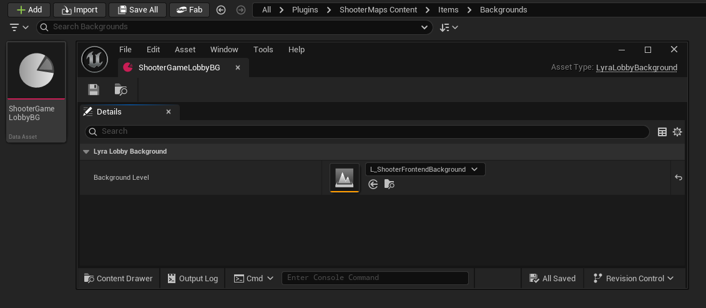
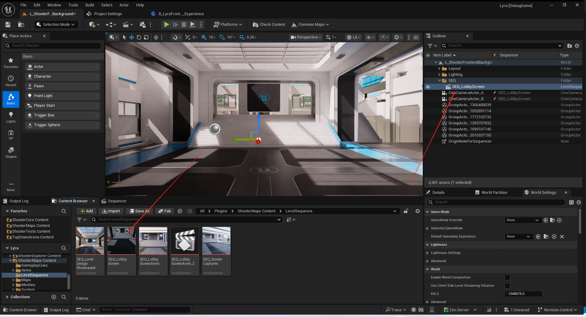
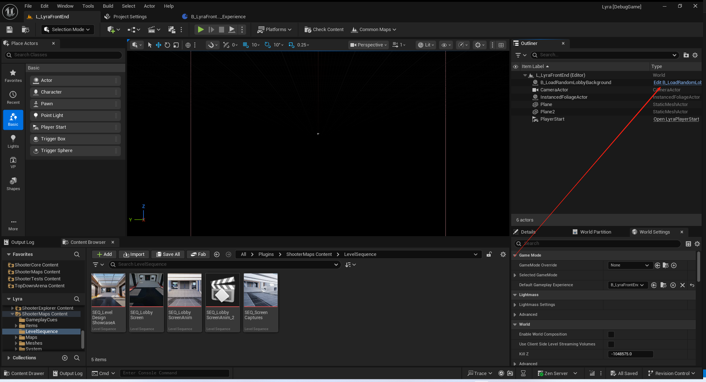
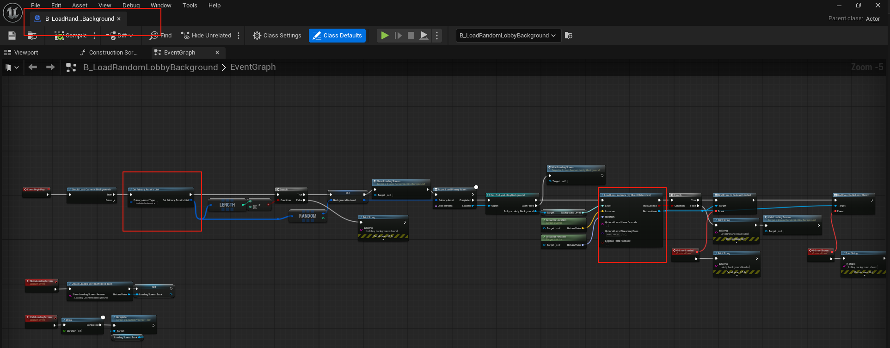
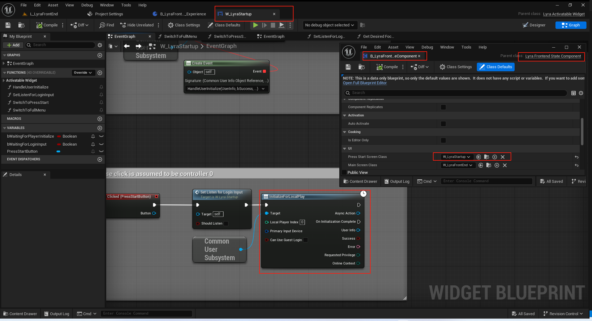

# UE5_Lyra学习指南_040_登录流程

本文章仅为小刚-B站课堂-虚幻引擎视频课程Lyra-精讲的演讲手稿.  
本套课程链接:[[UE5]虚幻引擎游戏案例Lyra精讲](https://www.bilibili.com/cheese/play/ss112001159)  
前置课程链接:[[UE5]虚幻引擎UEC++从基础到进阶](https://www.bilibili.com/cheese/play/ss28043)  

文章内容由小刚撰写,采用了以下多种方式:  
1.口述转文字  
2.AI重构  
3.参考引擎源码  
4.Lyra工程源码  
5.结合社区论坛各位大佬的解析  

- [UE5\_Lyra学习指南\_040\_登录流程](#ue5_lyra学习指南_040_登录流程)
	- [概述](#概述)
	- [ApplyFrontendPerfSettingsAction](#applyfrontendperfsettingsaction)
	- [LyraLobbyBackground](#lyralobbybackground)
		- [资产定义](#资产定义)
		- [播放的序列](#播放的序列)
		- [加载的位置](#加载的位置)
	- [LyraFrontendStateComponent](#lyrafrontendstatecomponent)
		- [体验加载后开始登录](#体验加载后开始登录)
			- [绑定回调](#绑定回调)
			- [创建ControlFlow](#创建controlflow)
		- [登录流程](#登录流程)
			- [清理残余信息](#清理残余信息)
			- [显示按键启动界面](#显示按键启动界面)
				- [C++开始用户登录](#c开始用户登录)
				- [蓝图开始用户登录](#蓝图开始用户登录)
				- [蓝图中的C++登录](#蓝图中的c登录)
				- [DS服务器登录](#ds服务器登录)
			- [用户登录回调](#用户登录回调)
				- [C++登录回调](#c登录回调)
				- [蓝图登录回调](#蓝图登录回调)
				- [DS登录回调](#ds登录回调)
				- [游戏实例接收登录回调](#游戏实例接收登录回调)
		- [会话处理](#会话处理)
		- [推送主界面UI](#推送主界面ui)
	- [代码](#代码)
	- [总结](#总结)


## 概述
本节主要讲解关于前端界面从加载到显示游戏主界面的过程.
这里面主要添加了部分关于用户登录和会话的代码.

## ApplyFrontendPerfSettingsAction
这是一个我们前面漏掉的GameFeature.主要用于跟我们的游戏设置交互.开启和关闭前端性能限制的bool值
``` cpp
/**
 * GameFeatureAction responsible for telling the user settings to apply frontend/menu specific performance settings
 * 游戏功能操作：负责向用户告知应应用前端/菜单特定的性能设置。
 */
UCLASS(MinimalAPI, meta = (DisplayName = "Use Frontend Perf Settings"))
class UApplyFrontendPerfSettingsAction final : public UGameFeatureAction
{
	GENERATED_BODY()

public:
	//~UGameFeatureAction interface
	virtual void OnGameFeatureActivating(FGameFeatureActivatingContext& Context) override;
	virtual void OnGameFeatureDeactivating(FGameFeatureDeactivatingContext& Context) override;
	//~End of UGameFeatureAction interface

private:
	static int32 ApplicationCounter;
};
```
``` cpp
		ULyraSettingsLocal::Get()->SetShouldUseFrontendPerformanceSettings(true);
		ULyraSettingsLocal::Get()->SetShouldUseFrontendPerformanceSettings(false);
```

``` cpp
void ULyraSettingsLocal::SetShouldUseFrontendPerformanceSettings(bool bInFrontEnd)
{
	bInFrontEndForPerformancePurposes = bInFrontEnd;
	UpdateEffectiveFrameRateLimit();
}
void ULyraSettingsLocal::UpdateEffectiveFrameRateLimit()
{
	// DS服务器不需要进行该项设置
	if (!IsRunningDedicatedServer())
	{
		// 设置最大帧率
		SetFrameRateLimitCVar(GetEffectiveFrameRateLimit());
	}
}

float ULyraSettingsLocal::GetEffectiveFrameRateLimit()
{
	const ULyraPlatformSpecificRenderingSettings* PlatformSettings = ULyraPlatformSpecificRenderingSettings::Get();

#if WITH_EDITOR
	if (GIsEditor && !CVarApplyFrameRateSettingsInPIE.GetValueOnGameThread())
	{
		return Super::GetEffectiveFrameRateLimit();
	}
#endif

	if (PlatformSettings->FramePacingMode == ELyraFramePacingMode::ConsoleStyle)
	{
		return 0.0f;
	}

	float EffectiveFrameRateLimit = Super::GetEffectiveFrameRateLimit();

	if (ShouldUseFrontendPerformanceSettings())
	{
		// 选择两者的最小值
		EffectiveFrameRateLimit = CombineFrameRateLimits(EffectiveFrameRateLimit, FrameRateLimit_InMenu);
	}

	if (PlatformSettings->FramePacingMode == ELyraFramePacingMode::DesktopStyle)
	{
		// 是否使用电池
		if (FPlatformMisc::IsRunningOnBattery())
		{
			EffectiveFrameRateLimit = CombineFrameRateLimits(EffectiveFrameRateLimit, FrameRateLimit_OnBattery);
		}
		// 是否是在后台
		if (FSlateApplication::IsInitialized() && !FSlateApplication::Get().IsActive())
		{
			EffectiveFrameRateLimit = CombineFrameRateLimits(EffectiveFrameRateLimit, FrameRateLimit_WhenBackgrounded);
		}
	}

	return EffectiveFrameRateLimit;
}
```
## LyraLobbyBackground
用来在前端界面流送背景关卡的资产定义
``` cpp
/**
 * Developer settings / editor cheats
 * 开发者设置 / 编辑器作弊功能
 *
 * 用来加载背景的资产,这个资产需要进行扫描
 */
UCLASS(config=EditorPerProjectUserSettings, MinimalAPI)
class ULyraLobbyBackground : public UPrimaryDataAsset
{
	GENERATED_BODY()

public:
	
	UPROPERTY(EditAnywhere, BlueprintReadOnly)
	TSoftObjectPtr<UWorld> BackgroundLevel;
};

```
### 资产定义

### 播放的序列


### 加载的位置

这个蓝图 创建了一个关于加载界面的显示任务 在加载背景关卡资产时!
``` cpp
/*static*/ ULoadingProcessTask* ULoadingProcessTask::CreateLoadingScreenProcessTask(UObject* WorldContextObject, const FString& ShowLoadingScreenReason)
{
	UWorld* World = GEngine->GetWorldFromContextObject(WorldContextObject, EGetWorldErrorMode::LogAndReturnNull);
	UGameInstance* GameInstance = World ? World->GetGameInstance() : nullptr;
	ULoadingScreenManager* LoadingScreenManager = GameInstance ? GameInstance->GetSubsystem<ULoadingScreenManager>() : nullptr;

	if (LoadingScreenManager)
	{
		ULoadingProcessTask* NewLoadingTask = NewObject<ULoadingProcessTask>(LoadingScreenManager);
		NewLoadingTask->SetShowLoadingScreenReason(ShowLoadingScreenReason);

		LoadingScreenManager->RegisterLoadingProcessor(NewLoadingTask);
		
		return NewLoadingTask;
	}

	return nullptr;
}

void ULoadingProcessTask::Unregister()
{
	ULoadingScreenManager* LoadingScreenManager = Cast<ULoadingScreenManager>(GetOuter());
	LoadingScreenManager->UnregisterLoadingProcessor(this);
}

void ULoadingProcessTask::SetShowLoadingScreenReason(const FString& InReason)
{
	Reason = InReason;
}

bool ULoadingProcessTask::ShouldShowLoadingScreen(FString& OutReason) const
{
	OutReason = Reason;
	return true;
}

```


记得配置检索路径!
在ShooterMaps.GameFeatureData中!
不配置话的就找不到这个资产!!!!
``` txt
(PrimaryAssetType="LyraLobbyBackground",AssetBaseClass="/Script/LyraGame.LyraLobbyBackground",bHasBlueprintClasses=False,bIsEditorOnly=False,Directories=((Path="Items/Backgrounds")),SpecificAssets=,Rules=(Priority=-1,ChunkId=-1,bApplyRecursively=True,CookRule=AlwaysCook))
```
## LyraFrontendStateComponent
这个组件是基于体验添加到GameState上的.
里面有一个ControlFlow的使用流程.这个ControlFlow在UEC++基础课程中已经详细讲过了.不再赘述.
### 体验加载后开始登录
#### 绑定回调
``` cpp
void ULyraFrontendStateComponent::BeginPlay()
{
	Super::BeginPlay();

	// Listen for the experience load to complete
	// 监听体验加载完成的进程

	AGameStateBase* GameState = GetGameStateChecked<AGameStateBase>();
	ULyraExperienceManagerComponent* ExperienceComponent = GameState->FindComponentByClass<ULyraExperienceManagerComponent>();
	check(ExperienceComponent);

	// This delegate is on a component with the same lifetime as this one, so no need to unhook it in
	// 此委托与当前组件具有相同的生命周期，因此无需对其进行解绑操作。
	ExperienceComponent->CallOrRegister_OnExperienceLoaded_HighPriority(FOnLyraExperienceLoaded::FDelegate::CreateUObject(this, &ThisClass::OnExperienceLoaded));
}

```
#### 创建ControlFlow
``` cpp
void ULyraFrontendStateComponent::OnExperienceLoaded(const ULyraExperienceDefinition* Experience)
{
	// 创建一个ControlFlow 来执行我们用户得登录过程
	FControlFlow& Flow = FControlFlowStatics::Create(this, TEXT("FrontendFlow"))
		.QueueStep(TEXT("Wait For User Initialization"), this, &ThisClass::FlowStep_WaitForUserInitialization)
		.QueueStep(TEXT("Try Show Press Start Screen"), this, &ThisClass::FlowStep_TryShowPressStartScreen)
		.QueueStep(TEXT("Try Join Requested Session"), this, &ThisClass::FlowStep_TryJoinRequestedSession)
		.QueueStep(TEXT("Try Show Main Screen"), this, &ThisClass::FlowStep_TryShowMainScreen);

	// 开始执行
	Flow.ExecuteFlow();

	// 持有它的智能指针 以便用于访问节点进度
	FrontEndFlow = Flow.AsShared();
}
```
### 登录流程
#### 清理残余信息
``` cpp
void ULyraFrontendStateComponent::FlowStep_WaitForUserInitialization(FControlFlowNodeRef SubFlow)
{
	// If this was a hard disconnect, explicitly destroy all user and session state
	// TODO: Refactor the engine disconnect flow so it is more explicit about why it happened
	// 如果此次断开连接是因故障导致的，则需明确销毁所有用户及会话状态
	// TODO：对引擎断开连接流程进行重构，使其更清晰地说明断开的原因
	
	bool bWasHardDisconnect = false;
	AGameModeBase* GameMode = GetWorld()->GetAuthGameMode<AGameModeBase>();
	UGameInstance* GameInstance = UGameplayStatics::GetGameInstance(this);

	// 确认为故障导致的
	if (ensure(GameMode) && UGameplayStatics::HasOption(GameMode->OptionsString, TEXT("closed")))
	{
		bWasHardDisconnect = true;
	}

	// Only reset users on hard disconnect
	// 仅在硬断开连接时重置用户信息
	UCommonUserSubsystem* UserSubsystem = GameInstance->GetSubsystem<UCommonUserSubsystem>();
	if (ensure(UserSubsystem) && bWasHardDisconnect)
	{
		UserSubsystem->ResetUserState();
	}

	// Always reset sessions
	// 总是需要重置会话
	UCommonSessionSubsystem* SessionSubsystem = GameInstance->GetSubsystem<UCommonSessionSubsystem>();
	if (ensure(SessionSubsystem))
	{
		SessionSubsystem->CleanUpSessions();
	}

	// 历史状态已清理 推进下一步
	SubFlow->ContinueFlow();
}

```
#### 显示按键启动界面

##### C++开始用户登录


``` cpp
void ULyraFrontendStateComponent::FlowStep_TryShowPressStartScreen(FControlFlowNodeRef SubFlow)
{
	const UGameInstance* GameInstance = UGameplayStatics::GetGameInstance(this);
	UCommonUserSubsystem* UserSubsystem = GameInstance->GetSubsystem<UCommonUserSubsystem>();

	// Check to see if the first player is already logged in, if they are, we can skip the press start screen.
	// 检查以确定第一个玩家是否已经登录，如果已经登录，我们就可以跳过启动按键画面。
	if (const UCommonUserInfo* FirstUser = UserSubsystem->GetUserInfoForLocalPlayerIndex(0))
	{
		if (FirstUser->InitializationState == ECommonUserInitializationState::LoggedInLocalOnly ||
			FirstUser->InitializationState == ECommonUserInitializationState::LoggedInOnline)
		{
			SubFlow->ContinueFlow();
			return;
		}
	}

	// Check to see if the platform actually requires a 'Press Start' screen.  This is only
	// required on platforms where there can be multiple online users where depending on what player's
	// controller presses 'Start' establishes the player to actually login to the game with.
	// 请检查该平台是否确实需要一个“开始游戏”界面。只有在存在多个在线用户且取决于玩家所操作的控制器何时按下“开始”键才能确定该玩家是否实际登录到游戏的情况下，才需要这个界面。

	// 这里是去读取的平台特征
	// !HasTraitTag(FCommonUserTags::Platform_Trait_SingleOnlineUser.GetTag());
	// 需要通过ProjectSettings-CommonUIFrameWork去查看
	// 开发时通过 EditorPreferences-LyraPlatformEmulationSettings 去压制(GameplayTags=((TagName="Platform.Trait.SingleOnlineUser")))
	if (!UserSubsystem->ShouldWaitForStartInput())
	{
		// 单人会进来 直接开始登录!
		
		// Start the auto login process, this should finish quickly and will use the default input device id
		// 开始自动登录流程，这一过程应该会很快完成，并会使用默认的输入设备标识符。
		InProgressPressStartScreen = SubFlow;
		UserSubsystem->OnUserInitializeComplete.AddDynamic(this, &ULyraFrontendStateComponent::OnUserInitialized);

		/**
		 * 尝试启动创建或更新本地玩家的流程，包括登录操作和创建玩家控制器。
		 * 当该流程成功或失败时，会广播“OnUserInitializeComplete”委托。
		 * @参数 LocalPlayerIndex：游戏实例中本地玩家的期望索引值，0 表示为主玩家，1 及以上表示本地多人游戏模式
		 * @参数 PrimaryInputDevice：应与该用户关联的物理控制器，无效时将使用默认设备
		 * @参数 bCanUseGuestLogin：如果为真，则此玩家可以作为访客存在，无需拥有真实的唯一网络标识符
		 * @返回值：如果进程已启动则返回 true，若在正确启动之前失败则返回 false
		 * 
		 */
		UserSubsystem->TryToInitializeForLocalPlay(0, FInputDeviceId(), false);

		return;
	}

	// Add the Press Start screen, move to the next flow when it deactivates.
	// 添加“开始”界面，当该界面停用时则切换至下一个流程。
	if (UPrimaryGameLayout* RootLayout = UPrimaryGameLayout::GetPrimaryGameLayoutForPrimaryPlayer(this))
	{
		constexpr bool bSuspendInputUntilComplete = true;
		RootLayout->PushWidgetToLayerStackAsync<UCommonActivatableWidget>(FrontendTags::TAG_UI_LAYER_MENU, bSuspendInputUntilComplete, PressStartScreenClass,
			[this, SubFlow](EAsyncWidgetLayerState State, UCommonActivatableWidget* Screen) {
			switch (State)
			{
			case EAsyncWidgetLayerState::AfterPush:
				// 按键登录控件加载成功 等待该控件接收按键 然后触发取消激活事件 从而在这里激活下一步流程.
				// 这里监听的是从蓝图过来的尝试用户登录结果
				bShouldShowLoadingScreen = false;
				Screen->OnDeactivated().AddWeakLambda(this, [this, SubFlow]() {
					SubFlow->ContinueFlow();
				});
				break;
				// 如果这个按键登录控件加载失败了 直接推进流程
			case EAsyncWidgetLayerState::Canceled:
				bShouldShowLoadingScreen = false;
				SubFlow->ContinueFlow();
				return;
			}
		});
	}
}


```

##### 蓝图开始用户登录


##### 蓝图中的C++登录
注意这里绑定的是特定按键也会触发登录.如Space和Enter.并非点击Clicked!
``` cpp
/**
* 开始监听用户对新控制器和现有控制器的操作输入，并将这些输入记录下来。
* 这会将一个按键输入处理程序插入到活动的游戏视图客户端中，并通过再次调用空的按键数组来关闭该处理程序。*
* @参数 AnyUserKeys：监听任何用户的这些按键，包括默认用户。将此设置为初始启动屏幕的参数值或留空可禁用该功能。
* @参数 NewUserKeys：监听新用户的这些按键（该用户没有玩家控制器）。将此设置为分屏/本地多人游戏的参数值或留空可禁用该功能。
* @参数 Params：在检测到按键输入后传递给 TryToInitializeUser 的参数值。*/
void UCommonUserSubsystem::ListenForLoginKeyInput(TArray<FKey> AnyUserKeys, TArray<FKey> NewUserKeys, FCommonUserInitializeParams Params)
{
	UGameViewportClient* ViewportClient = GetGameInstance()->GetGameViewportClient();
	if (ensure(ViewportClient))
	{
		const bool bIsMapped = LoginKeysForAnyUser.Num() > 0 || LoginKeysForNewUser.Num() > 0;
		const bool bShouldBeMapped = AnyUserKeys.Num() > 0 || NewUserKeys.Num() > 0;

		if (bIsMapped && !bShouldBeMapped)
		{
			// Set it back to wrapped handler
			ViewportClient->OnOverrideInputKey() = WrappedInputKeyHandler;
			WrappedInputKeyHandler.Unbind();
		}
		else if (!bIsMapped && bShouldBeMapped)
		{
			// Set up a wrapped handler
			WrappedInputKeyHandler = ViewportClient->OnOverrideInputKey();
			ViewportClient->OnOverrideInputKey().BindUObject(this, &UCommonUserSubsystem::OverrideInputKeyForLogin);
		}

		LoginKeysForAnyUser = AnyUserKeys;
		LoginKeysForNewUser = NewUserKeys;

		if (bShouldBeMapped)
		{
			ParamsForLoginKey = Params;
		}
		else
		{
			ParamsForLoginKey = FCommonUserInitializeParams();
		}
	}
}
```
``` cpp
bool UCommonUserSubsystem::OverrideInputKeyForLogin(FInputKeyEventArgs& EventArgs)
{
	int32 NextLocalPlayerIndex = INDEX_NONE;

	const UCommonUserInfo* MappedUser = GetUserInfoForInputDevice(EventArgs.InputDevice);
	if (EventArgs.Event == IE_Pressed)
	{
		if (MappedUser == nullptr || !MappedUser->IsLoggedIn())
		{
			if (MappedUser)
			{
				NextLocalPlayerIndex = MappedUser->LocalPlayerIndex;
			}
			else
			{
				// Find next player
				for (int32 i = 0; i < MaxNumberOfLocalPlayers; i++)
				{
					if (GetLocalPlayerInitializationState(i) == ECommonUserInitializationState::Unknown)
					{
						NextLocalPlayerIndex = i;
						break;
					}
				}
			}

			if (NextLocalPlayerIndex != INDEX_NONE)
			{
				if (LoginKeysForAnyUser.Contains(EventArgs.Key))
				{
					// If we're in the middle of logging in just return true to ignore platform-specific input
					if (MappedUser && MappedUser->IsDoingLogin())
					{
						return true;
					}

					// Press start screen
					FCommonUserInitializeParams NewParams = ParamsForLoginKey;
					NewParams.LocalPlayerIndex = NextLocalPlayerIndex;
					NewParams.PrimaryInputDevice = EventArgs.InputDevice;

					return TryToInitializeUser(NewParams);
				}

				// See if this controller id is mapped
				MappedUser = GetUserInfoForInputDevice(EventArgs.InputDevice);

				if (!MappedUser || MappedUser->LocalPlayerIndex == INDEX_NONE)
				{
					if (LoginKeysForNewUser.Contains(EventArgs.Key))
					{
						// If we're in the middle of logging in just return true to ignore platform-specific input
						if (MappedUser && MappedUser->IsDoingLogin())
						{
							return true;
						}

						// Local multiplayer
						FCommonUserInitializeParams NewParams = ParamsForLoginKey;
						NewParams.LocalPlayerIndex = NextLocalPlayerIndex;
						NewParams.PrimaryInputDevice = EventArgs.InputDevice;

						return TryToInitializeUser(NewParams);
					}
				}
			}
		}
	}
	if (WrappedInputKeyHandler.IsBound())
	{
		return WrappedInputKeyHandler.Execute(EventArgs);
	}

	return false;
}
```


##### DS服务器登录
这部分内容已经讲过了 简单回忆下即可!
DS 服务器上不会有前端界面这个关卡.也不会有UI!!!!
``` cpp

bool ALyraGameMode::TryDedicatedServerLogin()
{
	// Some basic code to register as an active dedicated server, this would be heavily modified by the game
	// 一些用于注册为活跃专用服务器的基本代码，这些代码会由游戏进行大幅修改
	FString DefaultMap = UGameMapsSettings::GetGameDefaultMap();
	UWorld* World = GetWorld();
	UGameInstance* GameInstance = GetGameInstance();
	if (GameInstance && World && World->GetNetMode() == NM_DedicatedServer && World->URL.Map == DefaultMap)
	{
		// Only register if this is the default map on a dedicated server
		// 仅在该服务器为专用服务器且此为默认地图的情况下才进行注册
		UCommonUserSubsystem* UserSubsystem = GameInstance->GetSubsystem<UCommonUserSubsystem>();

		// Dedicated servers may need to do an online login
		// 专用服务器可能需要进行在线登录操作
		UserSubsystem->OnUserInitializeComplete.AddDynamic(this, &ALyraGameMode::OnUserInitializedForDedicatedServer);

		// There are no local users on dedicated server, but index 0 means the default platform user which is handled by the online login code
		// 在专用服务器上没有本地用户，但索引 0 表示默认的平台用户，该用户由在线登录代码进行处理。
		if (!UserSubsystem->TryToLoginForOnlinePlay(0))
		{
			OnUserInitializedForDedicatedServer(nullptr, false, FText(), ECommonUserPrivilege::CanPlayOnline, ECommonUserOnlineContext::Default);
		}

		return true;
	}

	return false;
}

```

#### 用户登录回调
##### C++登录回调
``` cpp
void ULyraFrontendStateComponent::OnUserInitialized(const UCommonUserInfo* UserInfo, bool bSuccess, FText Error, ECommonUserPrivilege RequestedPrivilege, ECommonUserOnlineContext OnlineContext)
{
	// 这里监听的是从C++过来的尝试登录后回调结果
	
	FControlFlowNodePtr FlowToContinue = InProgressPressStartScreen;
	UGameInstance* GameInstance = UGameplayStatics::GetGameInstance(this);
	UCommonUserSubsystem* UserSubsystem = GameInstance->GetSubsystem<UCommonUserSubsystem>();

	if (ensure(FlowToContinue.IsValid() && UserSubsystem))
	{
		UserSubsystem->OnUserInitializeComplete.RemoveDynamic(this, &ULyraFrontendStateComponent::OnUserInitialized);
		InProgressPressStartScreen.Reset();

		if (bSuccess)
		{
			// On success continue flow normally
			// 正常推进即可
			FlowToContinue->ContinueFlow();
		}
		else
		{
			// TODO: Just continue for now, could go to some sort of error screen
			// 注意：目前先继续进行吧，之后可能会转到某种错误界面。
			FlowToContinue->ContinueFlow();
		}
	}
}


```

##### 蓝图登录回调

4:
``` cpp
void ULyraFrontendStateComponent::FlowStep_TryShowPressStartScreen(FControlFlowNodeRef SubFlow)
{
	// ....
	// Add the Press Start screen, move to the next flow when it deactivates.
	// 添加“开始”界面，当该界面停用时则切换至下一个流程。
	if (UPrimaryGameLayout* RootLayout = UPrimaryGameLayout::GetPrimaryGameLayoutForPrimaryPlayer(this))
	{
		constexpr bool bSuspendInputUntilComplete = true;
		RootLayout->PushWidgetToLayerStackAsync<UCommonActivatableWidget>(FrontendTags::TAG_UI_LAYER_MENU, bSuspendInputUntilComplete, PressStartScreenClass,
			[this, SubFlow](EAsyncWidgetLayerState State, UCommonActivatableWidget* Screen) {
			switch (State)
			{
			case EAsyncWidgetLayerState::AfterPush:
				// 按键登录控件加载成功 等待该控件接收按键 然后触发取消激活事件 从而在这里激活下一步流程.
				// 这里监听的是从蓝图过来的尝试用户登录结果
				bShouldShowLoadingScreen = false;
				Screen->OnDeactivated().AddWeakLambda(this, [this, SubFlow]() {
					SubFlow->ContinueFlow();
				});
				break;
				// 如果这个按键登录控件加载失败了 直接推进流程
			case EAsyncWidgetLayerState::Canceled:
				bShouldShowLoadingScreen = false;
				SubFlow->ContinueFlow();
				return;
			}
		});
	}
}


```
``` cpp
/**
 * The state of an async load operation for the UI.
 * 用户界面的异步加载操作的状态。
 */
enum class EAsyncWidgetLayerState : uint8
{
	Canceled,
	Initialize,
	AfterPush
};

```
``` cpp
UCLASS(MinimalAPI, Abstract, meta = (DisableNativeTick))
class UPrimaryGameLayout : public UCommonUserWidget
{
	GENERATED_BODY()

	template <typename ActivatableWidgetT = UCommonActivatableWidget>
	TSharedPtr<FStreamableHandle> PushWidgetToLayerStackAsync(FGameplayTag LayerName, bool bSuspendInputUntilComplete, TSoftClassPtr<UCommonActivatableWidget> ActivatableWidgetClass, TFunction<void(EAsyncWidgetLayerState, ActivatableWidgetT*)> StateFunc)
	{
		// 类型判定
		static_assert(TIsDerivedFrom<ActivatableWidgetT, UCommonActivatableWidget>::IsDerived, "Only CommonActivatableWidgets can be used here");

		// 中断的原因
		static FName NAME_PushingWidgetToLayer("PushingWidgetToLayer");
		// 这里可以决定是否要阻断输入
		const FName SuspendInputToken = bSuspendInputUntilComplete ? UCommonUIExtensions::SuspendInputForPlayer(GetOwningPlayer(), NAME_PushingWidgetToLayer) : NAME_None;

		FStreamableManager& StreamableManager = UAssetManager::Get().GetStreamableManager();
		TSharedPtr<FStreamableHandle> StreamingHandle = StreamableManager.RequestAsyncLoad(ActivatableWidgetClass.ToSoftObjectPath(), FStreamableDelegate::CreateWeakLambda(this,
			[this, LayerName, ActivatableWidgetClass, StateFunc, SuspendInputToken]()
			{
				// 恢复输入
				UCommonUIExtensions::ResumeInputForPlayer(GetOwningPlayer(), SuspendInputToken);

				// 调用同步接口
				ActivatableWidgetT* Widget = PushWidgetToLayerStack<ActivatableWidgetT>(LayerName, ActivatableWidgetClass.Get(), [StateFunc](ActivatableWidgetT& WidgetToInit) {
					StateFunc(EAsyncWidgetLayerState::Initialize, &WidgetToInit);
				});
				// 外部的回调事件
				StateFunc(EAsyncWidgetLayerState::AfterPush, Widget);
			})
		);

		// Setup a cancel delegate so that we can resume input if this handler is canceled.
		// 设置一个取消委托，以便在该处理程序被取消时能够恢复输入操作。
		StreamingHandle->BindCancelDelegate(FStreamableDelegate::CreateWeakLambda(this,
			[this, StateFunc, SuspendInputToken]()
			{
				UCommonUIExtensions::ResumeInputForPlayer(GetOwningPlayer(), SuspendInputToken);
				StateFunc(EAsyncWidgetLayerState::Canceled, nullptr);
			})
		);

		return StreamingHandle;
	}
}
```
关于UCommonActivatableWidget的源码注释
``` txt
/** 
 * The base for widgets that are capable of being "activated" and "deactivated" during their lifetime without being otherwise modified or destroyed. 
 *
 * This is generally desired for one or more of the following purposes:
 *	- This widget can turn on/off without being removed from the hierarchy (or otherwise reconstructing the underlying SWidgets), so Construct/Destruct are insufficient
 *	- You'd like to be able to "go back" from this widget, whether that means back a breadcrumb, closing a modal, or something else. This is built-in here.
 *	- This widget's place in the hierarchy is such that it defines a meaningful node-point in the tree of activatable widgets through which input is routed to all widgets.
 *
 * By default, an activatable widget:
 *	- Is not automatically activated upon construction
 *	- Does not register to receive back actions (or any other actions, for that matter)
 *	- If classified as a back handler, is automatically deactivated (but not destroyed) when it receives a back action
 * 
 * Note that removing an activatable widget from the UI (i.e. triggering Destruct()) will always deactivate it, even if the UWidget is not destroyed.
 * Re-constructing the underlying SWidget will only result in re-activation if auto-activate is enabled.
 */
```
``` txt
/**
这些小部件的基底具备在其生命周期内能够被“激活”和“停用”的特性，且在这一过程中不会发生任何其他修改或损坏。*
通常出于以下一种或多种目的而需要这样设计：
- 该组件无需从层级结构中移除（或无需重新构建底层的 S 组件）即可开启/关闭，因此“构造”和“销毁”操作是不够的。
- 您希望能够从该组件“返回”（无论是返回面包屑导航、关闭模态窗口还是其他操作）。此功能在此处已内置。
- 该组件在层级结构中的位置使得它在可激活组件的树状结构中定义了一个有意义的节点点，通过该节点点输入将被路由到所有组件。*
* 默认情况下，可激活的控件：
* - 在构建时不会自动激活
* - 不会注册以接收返回操作（或者任何其他操作）
* - 如果被分类为后退处理程序，当接收到后退操作时，会自动停用（但不会被销毁）*
* 请注意，从用户界面中移除可激活的控件（即触发“销毁”操作）会始终导致该控件失去激活状态，即便该 UWidget 未被销毁也是如此。
* 重新构建底层的 SWidget 只有在启用自动激活的情况下才会导致其重新激活。*/

```


##### DS登录回调
已讲解过 略.并非本节内容
``` cpp
void ALyraGameMode::OnUserInitializedForDedicatedServer(const UCommonUserInfo* UserInfo, bool bSuccess, FText Error, ECommonUserPrivilege RequestedPrivilege, ECommonUserOnlineContext OnlineContext)
{
	UGameInstance* GameInstance = GetGameInstance();
	if (GameInstance)
	{
		// Unbind
		// 解除绑定
		UCommonUserSubsystem* UserSubsystem = GameInstance->GetSubsystem<UCommonUserSubsystem>();
		UserSubsystem->OnUserInitializeComplete.RemoveDynamic(this, &ALyraGameMode::OnUserInitializedForDedicatedServer);

		// Dedicated servers do not require user login, but some online subsystems may expect it
		// 专用服务器无需用户登录，但某些在线子系统可能仍要求用户登录。
		if (bSuccess && ensure(UserInfo))
		{
			UE_LOG(LogLyraExperience, Log, TEXT("Dedicated server user login succeeded for id %s, starting online server"), *UserInfo->GetNetId().ToString());
		}
		else
		{
			UE_LOG(LogLyraExperience, Log, TEXT("Dedicated server user login unsuccessful, starting online server as login is not required"));
		}
		
		HostDedicatedServerMatch(ECommonSessionOnlineMode::Online);
	}
}

```

##### 游戏实例接收登录回调
``` cpp
void ULyraGameInstance::HandlerUserInitialized(const UCommonUserInfo* UserInfo, bool bSuccess, FText Error, ECommonUserPrivilege RequestedPrivilege, ECommonUserOnlineContext OnlineContext)
{
	Super::HandlerUserInitialized(UserInfo, bSuccess, Error, RequestedPrivilege, OnlineContext);

	// If login succeeded, tell the local player to load their settings
	// 如果登录成功，就告知本地玩家加载他们的设置
	if (bSuccess && ensure(UserInfo))
	{
		ULyraLocalPlayer* LocalPlayer = Cast<ULyraLocalPlayer>(GetLocalPlayerByIndex(UserInfo->LocalPlayerIndex));

		// There will not be a local player attached to the dedicated server user
		// 专用服务器用户不会关联本地玩家。
		if (LocalPlayer)
		{
			LocalPlayer->LoadSharedSettingsFromDisk();
		}
	}
}

```
### 会话处理
``` cpp

void ULyraFrontendStateComponent::FlowStep_TryJoinRequestedSession(FControlFlowNodeRef SubFlow)
{
	UCommonGameInstance* GameInstance = Cast<UCommonGameInstance>(UGameplayStatics::GetGameInstance(this));
	
	if (GameInstance->GetRequestedSession() != nullptr && GameInstance->CanJoinRequestedSession())
	{
		UCommonSessionSubsystem* SessionSubsystem = GameInstance->GetSubsystem<UCommonSessionSubsystem>();
		if (ensure(SessionSubsystem))
		{
			// Bind to session join completion to continue or cancel the flow
			// TODO:  Need to ensure that after session join completes, the server travel completes.
			
			// 将会话加入完成事件与继续或取消流程的操作相绑定
			// TODO： 需要确保在会话加入完成后，服务器行程也能完成。
			
			OnJoinSessionCompleteEventHandle = SessionSubsystem->OnJoinSessionCompleteEvent.AddWeakLambda(this, [this, SubFlow, SessionSubsystem](const FOnlineResultInformation& Result)
			{
				// Unbind delegate. SessionSubsystem is the object triggering this event, so it must still be valid.
				// 解除委托绑定。SessionSubsystem 是触发此事件的对象，因此该对象仍需保持有效状态。
				SessionSubsystem->OnJoinSessionCompleteEvent.Remove(OnJoinSessionCompleteEventHandle);
				OnJoinSessionCompleteEventHandle.Reset();

				if (Result.bWasSuccessful)
				{
					// No longer transitioning to the main menu
					// 不再转到主菜单
					SubFlow->CancelFlow();
				}
				else
				{
					// Proceed to the main menu
					// 进入主菜单
					SubFlow->ContinueFlow();
					// 这里返回了 不需要考虑会话相关内容 正常推进
					return;
				}
			});
			// 不再考虑推进流程 直接进入会话
			GameInstance->JoinRequestedSession();
			return;
		}
	}
	// Skip this step if we didn't start requesting a session join
	// 如果我们并未开始请求加入会话，则跳过此步骤
	SubFlow->ContinueFlow();
}

```
### 推送主界面UI
``` cpp
void ULyraFrontendStateComponent::FlowStep_TryShowMainScreen(FControlFlowNodeRef SubFlow)
{
	// 此时 登录流程基本结束 将前端界面推送到主界面即可!
	if (UPrimaryGameLayout* RootLayout = UPrimaryGameLayout::GetPrimaryGameLayoutForPrimaryPlayer(this))
	{
		constexpr bool bSuspendInputUntilComplete = true;
		RootLayout->PushWidgetToLayerStackAsync<UCommonActivatableWidget>(FrontendTags::TAG_UI_LAYER_MENU, bSuspendInputUntilComplete, MainScreenClass,
			[this, SubFlow](EAsyncWidgetLayerState State, UCommonActivatableWidget* Screen) {
			switch (State)
			{
			case EAsyncWidgetLayerState::AfterPush:
				bShouldShowLoadingScreen = false;
				SubFlow->ContinueFlow();
				return;
			case EAsyncWidgetLayerState::Canceled:
				bShouldShowLoadingScreen = false;
				SubFlow->ContinueFlow();
				return;
			}
		});
	}
}
```


## 代码
``` cpp

UCLASS(Abstract)
class ULyraFrontendStateComponent : public UGameStateComponent, public ILoadingProcessInterface
{
	GENERATED_BODY()

public:

	// 构造函数 无作用
	ULyraFrontendStateComponent(const FObjectInitializer& ObjectInitializer = FObjectInitializer::Get());

	//~UActorComponent 
	// 必须等待前端体验加载完成才能创建ControlFlow得流程
	virtual void BeginPlay() override;
	// 无作用
	virtual void EndPlay(const EEndPlayReason::Type EndPlayReason) override;
	//~End of UActorComponent interface

	//~ILoadingProcessInterface interface
	// 反馈给加载界面用于是否开启 以及具体提示
	virtual bool ShouldShowLoadingScreen(FString& OutReason) const override;
	//~End of ILoadingProcessInterface

private:
	// 体验加载完成回调
	void OnExperienceLoaded(const ULyraExperienceDefinition* Experience);

	// 用户的登录结果回调 只在不显示按键登录时使用
	UFUNCTION()
	void OnUserInitialized(const UCommonUserInfo* UserInfo, bool bSuccess, FText Error, ECommonUserPrivilege RequestedPrivilege, ECommonUserOnlineContext OnlineContext);

	// 初始化前端界面状态 如果是故障导致的 则需要重置用户状态
	void FlowStep_WaitForUserInitialization(FControlFlowNodeRef SubFlow);
	// 尝试显示按键登录  单人Tag下不需要显示 
	void FlowStep_TryShowPressStartScreen(FControlFlowNodeRef SubFlow);
	// 尝试加入会话 如果可以加入会话 直接跳过前端界面
	void FlowStep_TryJoinRequestedSession(FControlFlowNodeRef SubFlow);
	// 尝试显示前端界面
	void FlowStep_TryShowMainScreen(FControlFlowNodeRef SubFlow);

	// 是否需要显示加载屏幕界面
	bool bShouldShowLoadingScreen = true;

	// 按键登录界面
	UPROPERTY(EditAnywhere, Category = UI)
	TSoftClassPtr<UCommonActivatableWidget> PressStartScreenClass;

	// 前端主要界面
	UPROPERTY(EditAnywhere, Category = UI)
	TSoftClassPtr<UCommonActivatableWidget> MainScreenClass;

	// 登录流程的智能指针对象
	TSharedPtr<FControlFlow> FrontEndFlow;
	
	// If set, this is the in-progress press start screen task
	// 若已设置，则此为正在运行的“开始发布”屏幕任务
	FControlFlowNodePtr InProgressPressStartScreen;

	// 如果有会话需要加入 持有的回调句柄
	FDelegateHandle OnJoinSessionCompleteEventHandle;
};

```

## 总结
本节结合前端界面将项目中涉及到用户登录触发,执行,回调都依次讲解了.