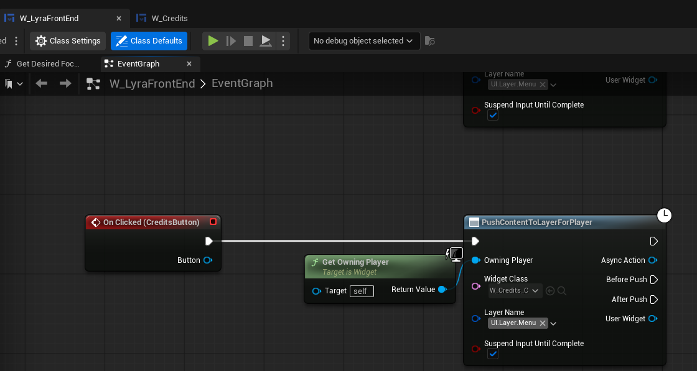

# UE5_Lyra学习指南_042_异步推送控件的激活时机
本文章仅为小刚-B站课堂-虚幻引擎视频课程Lyra-精讲的演讲手稿.  
本套课程链接:[[UE5]虚幻引擎游戏案例Lyra精讲](https://www.bilibili.com/cheese/play/ss112001159)  
前置课程链接:[[UE5]虚幻引擎UEC++从基础到进阶](https://www.bilibili.com/cheese/play/ss28043)  

文章内容由小刚撰写,采用了以下多种方式:  
1.口述转文字  
2.AI重构  
3.参考引擎源码  
4.Lyra工程源码  
5.结合社区论坛各位大佬的解析  

- [UE5\_Lyra学习指南\_042\_异步推送控件的激活时机](#ue5_lyra学习指南_042_异步推送控件的激活时机)
	- [概述](#概述)
	- [注册](#注册)
	- [激活](#激活)
	- [停用](#停用)
	- [代码](#代码)
	- [总结](#总结)


## 概述
这节主要是简单讲解一下当一个控件被推送到根布局之后,它会自动激活.当它停用的时候,它会从根布局进行移除.
注意它的激活并非由控件自身完成,而是由容器完成.
这个涉及到Slate和UMG相互绑定调用.不必完全记住流程.掌握使用效果.知道为什么会这样表现即可!
注意.这个控件必须是激活后才能响应输入!
## 注册
以W_Credits这个控件为例.
当它被push到UI.Layer.Menu之后.


``` cpp

void UAsyncAction_PushContentToLayerForPlayer::Activate()
{
	if (UPrimaryGameLayout* RootLayout = UPrimaryGameLayout::GetPrimaryGameLayout(OwningPlayerPtr.Get()))
	{
		TWeakObjectPtr<UAsyncAction_PushContentToLayerForPlayer> WeakThis = this;
		StreamingHandle = RootLayout->PushWidgetToLayerStackAsync<UCommonActivatableWidget>(LayerName, bSuspendInputUntilComplete, WidgetClass, [this, WeakThis](EAsyncWidgetLayerState State, UCommonActivatableWidget* Widget) {
			if (WeakThis.IsValid())
			{
				switch (State)
				{
					case EAsyncWidgetLayerState::Initialize:
						BeforePush.Broadcast(Widget);
						break;
					case EAsyncWidgetLayerState::AfterPush:
						AfterPush.Broadcast(Widget);
						SetReadyToDestroy();
						break;
					case EAsyncWidgetLayerState::Canceled:
						SetReadyToDestroy();
						break;
				}
			}
			SetReadyToDestroy();
		});
	}
	else
	{
		SetReadyToDestroy();
	}
}
```
``` cpp

	template <typename ActivatableWidgetT = UCommonActivatableWidget>
	TSharedPtr<FStreamableHandle> PushWidgetToLayerStackAsync(FGameplayTag LayerName, bool bSuspendInputUntilComplete, TSoftClassPtr<UCommonActivatableWidget> ActivatableWidgetClass, TFunction<void(EAsyncWidgetLayerState, ActivatableWidgetT*)> StateFunc)
	{
		// 类型判定
		static_assert(TIsDerivedFrom<ActivatableWidgetT, UCommonActivatableWidget>::IsDerived, "Only CommonActivatableWidgets can be used here");

		// 中断的原因
		static FName NAME_PushingWidgetToLayer("PushingWidgetToLayer");
		// 这里可以决定是否要阻断输入
		const FName SuspendInputToken = bSuspendInputUntilComplete ? UCommonUIExtensions::SuspendInputForPlayer(GetOwningPlayer(), NAME_PushingWidgetToLayer) : NAME_None;

		FStreamableManager& StreamableManager = UAssetManager::Get().GetStreamableManager();
		TSharedPtr<FStreamableHandle> StreamingHandle = StreamableManager.RequestAsyncLoad(ActivatableWidgetClass.ToSoftObjectPath(), FStreamableDelegate::CreateWeakLambda(this,
			[this, LayerName, ActivatableWidgetClass, StateFunc, SuspendInputToken]()
			{
				// 恢复输入
				UCommonUIExtensions::ResumeInputForPlayer(GetOwningPlayer(), SuspendInputToken);

				// 调用同步接口
				ActivatableWidgetT* Widget = PushWidgetToLayerStack<ActivatableWidgetT>(LayerName, ActivatableWidgetClass.Get(), [StateFunc](ActivatableWidgetT& WidgetToInit) {
					StateFunc(EAsyncWidgetLayerState::Initialize, &WidgetToInit);
				});
				// 外部的回调事件
				StateFunc(EAsyncWidgetLayerState::AfterPush, Widget);
			})
		);


```

``` cpp
	template <typename ActivatableWidgetT = UCommonActivatableWidget>
	ActivatableWidgetT* PushWidgetToLayerStack(FGameplayTag LayerName, UClass* ActivatableWidgetClass)
	{
		return PushWidgetToLayerStack<ActivatableWidgetT>(LayerName, ActivatableWidgetClass, [](ActivatableWidgetT&) {});
	}

	template <typename ActivatableWidgetT = UCommonActivatableWidget>
	ActivatableWidgetT* PushWidgetToLayerStack(FGameplayTag LayerName, UClass* ActivatableWidgetClass, TFunctionRef<void(ActivatableWidgetT&)> InitInstanceFunc)
	{
		static_assert(TIsDerivedFrom<ActivatableWidgetT, UCommonActivatableWidget>::IsDerived, "Only CommonActivatableWidgets can be used here");

		if (UCommonActivatableWidgetContainerBase* Layer = GetLayerWidget(LayerName))
		{
			return Layer->AddWidget<ActivatableWidgetT>(ActivatableWidgetClass, InitInstanceFunc);
		}

		return nullptr;
	}

```

```cpp
	/** 
	 * Generates (either creates or pulls from the inactive pool) instance of the given widget class and adds it to the container.
	 * The provided lambda is called after the instance has been generated and before it is actually added to the container.
	 * So if you've got setup to do on the instance before it potentially activates, the lambda is the place to do it.
	 */
	/**
	* 生成（要么创建，要么从未激活的池中提取）指定控件类的实例，并将其添加到容器中。
	* 提供的 lambda 表达式在实例生成之后、实际添加到容器之前被调用。
	* 因此，如果您需要在实例可能激活之前对其进行设置，那么 lambda 表达式就是执行这些设置的地方。*/
	template <typename ActivatableWidgetT = UCommonActivatableWidget>
	ActivatableWidgetT* AddWidget(TSubclassOf<UCommonActivatableWidget> ActivatableWidgetClass, TFunctionRef<void(ActivatableWidgetT&)> InstanceInitFunc)
	{
		// Don't actually add the widget if the cast will fail
		if (ActivatableWidgetClass && ActivatableWidgetClass->IsChildOf<ActivatableWidgetT>())
		{
			return Cast<ActivatableWidgetT>(AddWidgetInternal(ActivatableWidgetClass, [&InstanceInitFunc] (UCommonActivatableWidget& WidgetInstance) 
				{
					InstanceInitFunc(*CastChecked<ActivatableWidgetT>(&WidgetInstance));
				}));
		}
		return nullptr;
	}

```

``` cpp
UCommonActivatableWidget* UCommonActivatableWidgetContainerBase::AddWidgetInternal(TSubclassOf<UCommonActivatableWidget> ActivatableWidgetClass, TFunctionRef<void(UCommonActivatableWidget&)> InitFunc)
{
	if (UCommonActivatableWidget* WidgetInstance = GeneratedWidgetsPool.GetOrCreateInstance(ActivatableWidgetClass))
	{
		InitFunc(*WidgetInstance);
		RegisterInstanceInternal(*WidgetInstance);
		return WidgetInstance;
	}
	return nullptr;
}

void UCommonActivatableWidgetContainerBase::RegisterInstanceInternal(UCommonActivatableWidget& NewWidget)
{
	UE_LOG(LogCommonUI, VeryVerbose, TEXT("UCommonActivatableWidgetContainerBase::RegisterInstanceInternal() NewWidget: %s"), *NewWidget.GetName());
	
	// @TODO: Log if bAutoActivate is true on the provided widget, since it quite simply makes no sense.
	// （待办事项：如果所提供的控件中 bAutoActivate 的值为 true，则记录这一情况，因为这显然毫无意义。）
	if (ensure(!WidgetList.Contains(&NewWidget)))
	{
		WidgetList.Add(&NewWidget);
		OnWidgetAddedToList(NewWidget);
	}
}
```
## 激活
``` cpp
class UCommonActivatableWidgetContainerBase : public UWidget
{
	GENERATED_BODY()

public:
	virtual void OnWidgetAddedToList(UCommonActivatableWidget& AddedWidget) { unimplemented(); }
}
```

``` cpp
/** 
 * A display stack of ActivatableWidget elements. 
 * 
 * - Only the widget at the top of the stack is displayed and activated. All others are deactivated.
 * - When that top-most displayed widget deactivates, it's automatically removed and the preceding entry is displayed/activated.
 * - If RootContent is provided, it can never be removed regardless of activation state
 */
/**
一个由可激活组件元素组成的显示堆栈。*
一个由可激活组件元素组成的显示堆栈。*
* - 只有堆栈顶部的那个小部件会被显示并激活。其余所有小部件都会被禁用。
* - 只有堆栈顶部的那个小部件会被显示并激活。其余所有小部件都会被禁用。
* - 当顶部显示的那款小部件被禁用时，它会自动被移除，然后前面的那款小部件会被显示并激活。
* - 当顶部显示的那款小部件被禁用时，它会自动被移除，然后前面的那款小部件会被显示并激活。
* - 如果提供了“根内容”，那么无论其激活状态如何，该“根内容”都永远无法被移除。*
/* - 如果提供了“根内容”，那么无论其激活状态如何，该“根内容”都永远无法被移除。*/
UCLASS(MinimalAPI)
class UCommonActivatableWidgetStack : public UCommonActivatableWidgetContainerBase
{
	GENERATED_BODY()

public:

	UE_API UCommonActivatableWidget* GetRootContent() const;

protected:
	UE_API virtual void SynchronizeProperties() override;
	UE_API virtual void OnWidgetAddedToList(UCommonActivatableWidget& AddedWidget) override;
	
private:
	/** Optional widget to auto-generate as the permanent root element of the stack */
	UPROPERTY(EditAnywhere, Category = Content)
	TSubclassOf<UCommonActivatableWidget> RootContentWidgetClass;

	UPROPERTY(Transient)
	TObjectPtr<UCommonActivatableWidget> RootContentWidget;
};

```

``` cpp
void UCommonActivatableWidgetStack::OnWidgetAddedToList(UCommonActivatableWidget& AddedWidget)
{
	if (MySwitcher)
	{
		// Toss the widget onto the end of the switcher's children and transition to it immediately
		MySwitcher->AddSlot() [AddedWidget.TakeWidget()];

		SetSwitcherIndex(MySwitcher->GetNumWidgets() - 1);
	}
}
```


``` cpp
void UCommonActivatableWidgetContainerBase::SetSwitcherIndex(int32 TargetIndex, bool bInstantTransition /*= false*/)
{
	UE_LOG(LogCommonUI, VeryVerbose, TEXT("UCommonActivatableWidgetContainerBase::SetSwitcherIndex() TargetIndex: %d, bInstantTransition: %d"), TargetIndex, bInstantTransition);
	
	if (MySwitcher && MySwitcher->GetActiveWidgetIndex() != TargetIndex)
	{
		if (DisplayedWidget)
		{
			DisplayedWidget->OnDeactivated().RemoveAll(this);
			if (DisplayedWidget->IsActivated())
			{
				DisplayedWidget->DeactivateWidget();
			}
			else if (MySwitcher->GetActiveWidgetIndex() != 0)
			{
				// The displayed widget has already been deactivated by something other than us, so it should be removed from the container
				// We still need it to remain briefly though until we transition to the new index - then we can remove this entry's slot
				bRemoveDisplayedWidgetPostTransition = true;
			}
		}

		MySwitcher->TransitionToIndex(TargetIndex, bInstantTransition);
	}
}
```

``` cpp
void SCommonAnimatedSwitcher::TransitionToIndex(int32 NewWidgetIndex, bool bInstantTransition)
{			// ...
			SetActiveWidgetIndex(NewWidgetIndex);
			OnActiveIndexChanged.ExecuteIfBound(NewWidgetIndex);
			// ...
}
```
// 绑定的位置!
``` cpp
TSharedRef<SWidget> UCommonActivatableWidgetContainerBase::RebuildWidget()
{
	MyOverlay = SNew(SOverlay)
		+ SOverlay::Slot()
		[
			SAssignNew(MySwitcher, SCommonAnimatedSwitcher)
			.TransitionCurveType(TransitionCurveType)
			.TransitionDuration(TransitionDuration)
			.TransitionType(TransitionType)
			.TransitionFallbackStrategy(TransitionFallbackStrategy)
			.OnActiveIndexChanged_UObject(this, &UCommonActivatableWidgetContainerBase::HandleActiveIndexChanged)
			.OnIsTransitioningChanged_UObject(this, &UCommonActivatableWidgetContainerBase::HandleSwitcherIsTransitioningChanged)
		]
		+ SOverlay::Slot()
		[
			SAssignNew(MyInputGuard, SSpacer)
			.Visibility(EVisibility::Collapsed)
		];

	// We always want a 0th slot to be able to animate the first real entry in and out
	MySwitcher->AddSlot() [SNullWidget::NullWidget];

	return MyOverlay.ToSharedRef();
}
```
下面这段代码会释放没有激活的控件.并且去激活当前的控件!绑定它停用的后回调事件!
``` cpp
void UCommonActivatableWidgetContainerBase::HandleActiveIndexChanged(int32 ActiveWidgetIndex)
{
	UE_LOG(LogCommonUI, VeryVerbose, TEXT("UCommonActivatableWidgetContainerBase::HandleActiveIndexChanged() ActiveWidgetIndex: %d"), ActiveWidgetIndex);
	
	// Remove all slots above the currently active one and release the widgets back to the pool
	while (MySwitcher->GetNumWidgets() - 1 > ActiveWidgetIndex)
	{
		TSharedPtr<SWidget> WidgetToRelease = MySwitcher->GetWidget(MySwitcher->GetNumWidgets() - 1);
		if (ensure(WidgetToRelease))
		{
			ReleaseWidget(WidgetToRelease.ToSharedRef());
		}
	}

	// Also remove the widget that we just transitioned away from if desired
	if (DisplayedWidget && bRemoveDisplayedWidgetPostTransition)
	{
		if (TSharedPtr<SWidget> DisplayedSlateWidget = DisplayedWidget->GetCachedWidget())
		{
			ReleaseWidget(DisplayedSlateWidget.ToSharedRef());
		}
	}
	bRemoveDisplayedWidgetPostTransition = false;

	// Activate the widget that's now being displayed
	DisplayedWidget = ActivatableWidgetFromSlate(MySwitcher->GetActiveWidget());
	if (DisplayedWidget)
	{
		SetVisibility(ESlateVisibility::SelfHitTestInvisible);

		DisplayedWidget->OnDeactivated().AddUObject(this, &UCommonActivatableWidgetContainerBase::HandleActiveWidgetDeactivated, ToRawPtr(DisplayedWidget));
		DisplayedWidget->ActivateWidget();

		if (UWorld* MyWorld = GetWorld())
		{
			FTimerManager& TimerManager = MyWorld->GetTimerManager();
			TimerManager.SetTimerForNextTick(FTimerDelegate::CreateWeakLambda(this, [this]() { InvalidateLayoutAndVolatility(); }));
		}
	}
	else
	{
		SetVisibility(ESlateVisibility::Collapsed);
	}

	OnDisplayedWidgetChanged().Broadcast(DisplayedWidget);
}
``` 
## 停用
``` cpp
void UCommonActivatableWidgetContainerBase::HandleActiveWidgetDeactivated(UCommonActivatableWidget* DeactivatedWidget)
{
	UE_LOG(LogCommonUI, VeryVerbose, TEXT("UCommonActivatableWidgetContainerBase::HandleActiveWidgetDeactivated() DeactivatedWidget: %s"), *DeactivatedWidget->GetName());
	
	// When the currently displayed widget deactivates, transition the switcher to the preceding slot (if it exists)
	// We'll clean up this slot once the switcher index actually changes
	if (ensure(DeactivatedWidget == DisplayedWidget) && MySwitcher && MySwitcher->GetActiveWidgetIndex() > 0)
	{
		DisplayedWidget->OnDeactivated().RemoveAll(this);
		MySwitcher->TransitionToIndex(MySwitcher->GetActiveWidgetIndex() - 1);
	}
}

```
## 代码
``` cpp
/**
 * 推送控件到根布局!
 */
UCLASS(MinimalAPI, BlueprintType)
class UAsyncAction_PushContentToLayerForPlayer : public UCancellableAsyncAction
{
	GENERATED_UCLASS_BODY()

public:
	UE_API virtual void Cancel() override;

	UFUNCTION(BlueprintCallable, BlueprintCosmetic, meta=(WorldContext = "WorldContextObject", BlueprintInternalUseOnly="true"))
	static UE_API UAsyncAction_PushContentToLayerForPlayer* PushContentToLayerForPlayer(APlayerController* OwningPlayer, UPARAM(meta = (AllowAbstract=false)) TSoftClassPtr<UCommonActivatableWidget> WidgetClass, UPARAM(meta = (Categories = "UI.Layer")) FGameplayTag LayerName, bool bSuspendInputUntilComplete = true);

	// 开始异步行动 由蓝图自行调用 C++需要手动!
	UE_API virtual void Activate() override;

public:
	// 推送前执行的代理 注意 这个时候根据容器的执行逻辑 还没激活 只是实例化了
	UPROPERTY(BlueprintAssignable)
	FPushContentToLayerForPlayerAsyncDelegate BeforePush;
	// 推送后执行的代理 注意 这个时候根据容器的执行逻辑 已经激活 
	UPROPERTY(BlueprintAssignable)
	FPushContentToLayerForPlayerAsyncDelegate AfterPush;

private:

	// 图层名字
	FGameplayTag LayerName;

	// 是否中断输入
	bool bSuspendInputUntilComplete = false;

	// 玩家控制器
	TWeakObjectPtr<APlayerController> OwningPlayerPtr;

	// 推送的控件类的软引用
	TSoftClassPtr<UCommonActivatableWidget> WidgetClass;

	// 资产加载句柄
	TSharedPtr<FStreamableHandle> StreamingHandle;
};

```
## 总结
本节补充说明上一章关于UCommonActivatableWidgetStack的容器的使用.
