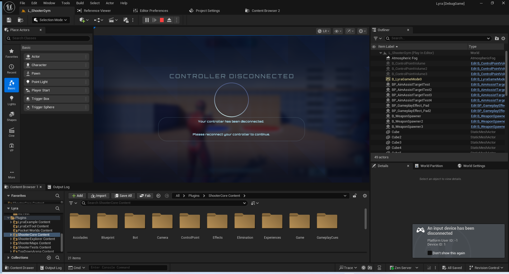

# UE5_Lyra学习指南_043_LyraHUDLayout

本文章仅为小刚-B站课堂-虚幻引擎视频课程Lyra-精讲的演讲手稿.  
本套课程链接:[[UE5]虚幻引擎游戏案例Lyra精讲](https://www.bilibili.com/cheese/play/ss112001159)  
前置课程链接:[[UE5]虚幻引擎UEC++从基础到进阶](https://www.bilibili.com/cheese/play/ss28043)  

文章内容由小刚撰写,采用了以下多种方式:  
1.口述转文字  
2.AI重构  
3.参考引擎源码  
4.Lyra工程源码  
5.结合社区论坛各位大佬的解析  

- [UE5\_Lyra学习指南\_043\_LyraHUDLayout](#ue5_lyra学习指南_043_lyrahudlayout)
	- [概述](#概述)
	- [注册回调](#注册回调)
	- [退出菜单](#退出菜单)
	- [手柄断联显示](#手柄断联显示)
	- [断联控件](#断联控件)
	- [代码](#代码)
		- [LyraHUDLayout](#lyrahudlayout)
		- [LyraControllerDisconnectedScreen](#lyracontrollerdisconnectedscreen)
	- [总结](#总结)


## 概述
这节我们主要讲解LyraHUDLayout和LyraControllerDisconnectedScreen两个类.及其配套的蓝图控件.
W_LyraGameMenu
W_ControllerDisconnected

LyraHUDLayout主要有两个功能:
1.退出菜单
2.手柄控制器断开连接时进行提示

## 注册回调
``` cpp
void ULyraHUDLayout::NativeOnInitialized()
{
	Super::NativeOnInitialized();

	// 绑定退出按键
	RegisterUIActionBinding(FBindUIActionArgs(FUIActionTag::ConvertChecked(TAG_UI_ACTION_ESCAPE), false, FSimpleDelegate::CreateUObject(this, &ThisClass::HandleEscapeAction)));

	// If we can display a controller disconnect screen, then listen for the controller state change delegates
	// 如果我们能够显示控制器断开连接的界面，那么就监听控制器状态变化的委托方法
	if (ShouldPlatformDisplayControllerDisconnectScreen())
	{
		// Bind to when input device connections change
		// 监听输入设备连接状态的变化情况
		IPlatformInputDeviceMapper& DeviceMapper = IPlatformInputDeviceMapper::Get();
		DeviceMapper.GetOnInputDeviceConnectionChange().AddUObject(this, &ThisClass::HandleInputDeviceConnectionChanged);
		DeviceMapper.GetOnInputDevicePairingChange().AddUObject(this, &ThisClass::HandleInputDevicePairingChanged);	
	}
}

```
``` cpp
void ULyraHUDLayout::NativeDestruct()
{
	Super::NativeDestruct();

	// Remove bindings to input device connection changing
	// 移除与输入设备连接变化相关的绑定操作
	IPlatformInputDeviceMapper& DeviceMapper = IPlatformInputDeviceMapper::Get();
	DeviceMapper.GetOnInputDeviceConnectionChange().RemoveAll(this);
	DeviceMapper.GetOnInputDevicePairingChange().RemoveAll(this);

	if (RequestProcessControllerStateHandle.IsValid())
	{
		FTSTicker::GetCoreTicker().RemoveTicker(RequestProcessControllerStateHandle);
		RequestProcessControllerStateHandle.Reset();
	}
}

```

## 退出菜单
在上节中,已经着重强调了.必须激活才行!否则没办法接收响应
``` cpp
void ULyraHUDLayout::HandleEscapeAction()
{
	if (ensure(!EscapeMenuClass.IsNull()))
	{
		UCommonUIExtensions::PushStreamedContentToLayer_ForPlayer(GetOwningLocalPlayer(), TAG_UI_LAYER_MENU, EscapeMenuClass);
	}
}

```
## 手柄断联显示
``` cpp
void ULyraHUDLayout::DisplayControllerDisconnectedMenu_Implementation()
{
	UE_LOG(LogLyra, Log, TEXT("[%hs] Display controller disconnected menu!"), __func__);

	if (ControllerDisconnectedScreen)
	{
		// Push the "controller disconnected" widget to the menu layer
		// 将“控制器断开连接”小部件推至菜单层
		SpawnedControllerDisconnectScreen = UCommonUIExtensions::PushContentToLayer_ForPlayer(GetOwningLocalPlayer(), TAG_UI_LAYER_MENU, ControllerDisconnectedScreen);
	}
}

void ULyraHUDLayout::HideControllerDisconnectedMenu_Implementation()
{
	UE_LOG(LogLyra, Log, TEXT("[%hs] Hide controller disconnected menu!"), __func__);
	
	UCommonUIExtensions::PopContentFromLayer(SpawnedControllerDisconnectScreen);
	SpawnedControllerDisconnectScreen = nullptr;
}
```
必须要有这个Tag
``` cpp
UE_DEFINE_GAMEPLAY_TAG_STATIC(TAG_UI_LAYER_MENU, "UI.Layer.Menu");
UE_DEFINE_GAMEPLAY_TAG_STATIC(TAG_UI_ACTION_ESCAPE, "UI.Action.Escape");
UE_DEFINE_GAMEPLAY_TAG_STATIC(TAG_Platform_Trait_Input_PrimarlyController, "Platform.Trait.Input.PrimarlyController");

bool ULyraHUDLayout::ShouldPlatformDisplayControllerDisconnectScreen() const
{
	// We only want this menu on primarily controller platforms
	// 我们只希望此菜单出现在主要的控制器平台上。
	bool bHasAllRequiredTags = ICommonUIModule::GetSettings().GetPlatformTraits().HasAll(PlatformRequiresControllerDisconnectScreen);

	// Check the tags that we may be emulating in the editor too
	// 检查我们在编辑器中可能要模拟的标签
#if WITH_EDITOR
	const FGameplayTagContainer& PlatformEmulationTags = UCommonUIVisibilitySubsystem::Get(GetOwningLocalPlayer())->GetVisibilityTags();
	bHasAllRequiredTags |= PlatformEmulationTags.HasAll(PlatformRequiresControllerDisconnectScreen);
#endif	// WITH_EDITOR

	return bHasAllRequiredTags;
}

```


## 断联控件
如果要显示切换用户的按钮必须要开启以下Tag
``` cpp
UE_DEFINE_GAMEPLAY_TAG_STATIC(TAG_Platform_Trait_Input_HasStrictControllerPairing, "Platform.Trait.Input.HasStrictControllerPairing");
bool ULyraControllerDisconnectedScreen::ShouldDisplayChangeUserButton() const
{
	bool bRequiresChangeUserButton = ICommonUIModule::GetSettings().GetPlatformTraits().HasAll(PlatformSupportsUserChangeTags);

	// Check the tags that we may be emulating in the editor too
	// 检查我们在编辑器中可能要模拟的标签
#if WITH_EDITOR
	const FGameplayTagContainer& PlatformEmulationTags = UCommonUIVisibilitySubsystem::Get(GetOwningLocalPlayer())->GetVisibilityTags();
	bRequiresChangeUserButton |= PlatformEmulationTags.HasAll(PlatformSupportsUserChangeTags);
#endif	// WITH_EDITOR

	return bRequiresChangeUserButton;
}
```

调用流程
``` cpp
void ULyraControllerDisconnectedScreen::NativeOnActivated()
{
	Super::NativeOnActivated();

	if (!HBox_SwitchUser)
	{
		UE_LOG(LogLyra, Error, TEXT("Unable to find HBox_SwitchUser on Widget %s"), *GetNameSafe(this));
		return;
	}

	if (!Button_ChangeUser)
	{
		UE_LOG(LogLyra, Error, TEXT("Unable to find Button_ChangeUser on Widget %s"), *GetNameSafe(this));
		return;
	}

	HBox_SwitchUser->SetVisibility(ESlateVisibility::Collapsed);
	Button_ChangeUser->SetVisibility(ESlateVisibility::Hidden);

	if (ShouldDisplayChangeUserButton())
	{
		// This is the platform user for "unpaired" input devices. Not every platform supports this, so
		// only set this to visible if the unpaired user is valid.

		// 这是针对“未配对”输入设备的平台用户设置。并非所有平台都支持此功能，因此只有在未配对的用户有效的情况下，才应将此设置设为可见状态。
		
		const FPlatformUserId UnpairedUserId = IPlatformInputDeviceMapper::Get().GetUserForUnpairedInputDevices();
		if (UnpairedUserId.IsValid())
		{
			HBox_SwitchUser->SetVisibility(ESlateVisibility::SelfHitTestInvisible);
			Button_ChangeUser->SetVisibility(ESlateVisibility::SelfHitTestInvisible);
		}		
	}

	Button_ChangeUser->OnClicked().AddUObject(this, &ThisClass::HandleChangeUserClicked);
}
```
因为这里我们的平台拿不到无效的用户ID,所以没办法显示按键.以下函数也不会执行.
``` cpp
void ULyraControllerDisconnectedScreen::HandleChangeUserClicked()
{
	ensure(ShouldDisplayChangeUserButton());

	UE_LOG(LogLyra, Log, TEXT("[%hs] Change user requested!"), __func__);

	const FPlatformUserId OwningPlayerId = GetOwningLocalPlayer()->GetPlatformUserId();
	const FInputDeviceId DeviceId = IPlatformInputDeviceMapper::Get().GetPrimaryInputDeviceForUser(OwningPlayerId);
	/**
	* 如果支持的话，异步显示平台特定的用户选择界面。*
	* @参数 InitiatingInputDeviceId：触发显示用户界面的输入设备（如适用）。该输入设备可能会与新选定的用户重新配对，具体取决于平台
	* @参数 Flags：用户选择界面的自定义选项
	* @参数 OnUserSelectionComplete：当用户选择操作完成时的回调函数
	* @返回值：如果将显示界面并调用回调函数，则返回 true
	* @返回值：如果平台不支持用户选择 API 或其当前不可用（则不会调用回调函数）则返回 false*/
	FGenericPlatformApplicationMisc::ShowPlatformUserSelector(
		DeviceId,
		EPlatformUserSelectorFlags::Default,
		[this](const FPlatformUserSelectionCompleteParams& Params)
		{
			HandleChangeUserCompleted(Params);
		});
}
```
## 代码
### LyraHUDLayout
``` cpp

/**
 * ULyraHUDLayout
 *
 *	Widget used to lay out the player's HUD (typically specified by an Add Widgets action in the experience)
 * 用于布置玩家头显界面的组件（通常通过“添加组件”操作在体验中进行指定）
 */
UCLASS(Abstract, BlueprintType, Blueprintable, Meta = (DisplayName = "Lyra HUD Layout", Category = "Lyra|HUD"))
class ULyraHUDLayout : public ULyraActivatableWidget
{
	GENERATED_BODY()

public:
	// 限定断开链接对应的主要控制器Tag
	ULyraHUDLayout(const FObjectInitializer& ObjectInitializer);

	// 绑定退出及断连的回调
	virtual void NativeOnInitialized() override;
	
	virtual void NativeDestruct() override;

protected:
	// 将退出菜单推送到主界面
	void HandleEscapeAction();
	
	/** 
	* Callback for when controllers are disconnected. This will check if the player now has 
	* no mapped input devices to them, which would mean that they can't play the game.
	* 
	* If this is the case, then call DisplayControllerDisconnectedMenu.
	*/
	/**
	 * 当控制器断开连接时的回调函数。此函数会检查玩家当前是否不再拥有与之对应的映射输入设备，如果不再有此类设备，则意味着玩家无法继续玩游戏。
 	 * 如果情况确实如此，那么就调用 DisplayControllerDisconnectedMenu 这个函数。
	 * 
	 */
	void HandleInputDeviceConnectionChanged(EInputDeviceConnectionState NewConnectionState, FPlatformUserId PlatformUserId, FInputDeviceId InputDeviceId);

	/**
	* Callback for when controllers change their owning platform user. We will use this to check
	* if we no longer need to display the "Controller Disconnected" menu
	*/
	/**
	 * 当控制器更换其所属平台用户时的回调函数。我们将利用此功能来检查是否不再需要显示“控制器断开连接”菜单。
	 * 
	 */
	void HandleInputDevicePairingChanged(FInputDeviceId InputDeviceId, FPlatformUserId NewUserPlatformId, FPlatformUserId OldUserPlatformId);
	
	/**
	* Notify this widget that the state of controllers for the player have changed. Queue a timer for next tick to 
	* process them and see if we need to show/hide the "controller disconnected" widget.
	*/
	/**
	 * 	通知此控件，玩家控制器的状态已发生变化。为下一次循环设置一个计时器，以便处理这些状态变化，并检查是否需要显示/隐藏“控制器断开连接”控件。
	 */
	void NotifyControllerStateChangeForDisconnectScreen();

	/**
	 * This will check the state of the connected controllers to the player. If they do not have
	 * any controllers connected to them, then we should display the Disconnect menu. If they do have
	 * controllers connected to them, then we can hide the disconnect menu if its showing.
	 */
	/**
	 * 	这将检查与玩家相连的控制器的状态。如果他们没有连接任何控制器，那么我们就应该显示“断开连接”菜单。如果他们确实连接了控制器，那么如果“断开连接”菜单正在显示，我们就应该将其隐藏起来。
	 * 	
	 */
	virtual void ProcessControllerDevicesHavingChangedForDisconnectScreen();

	/**
     * Returns true if this platform supports a "controller disconnected" screen. 
     */
	/**
     * 如果此平台支持“控制器断开连接”的界面，则返回真值。
	*/
    virtual bool ShouldPlatformDisplayControllerDisconnectScreen() const;
	
	/**
	* Pushes the ControllerDisconnectedMenuClass to the Menu layer (UI.Layer.Menu)
	*/
	/**
	 *  将“ControllerDisconnectedMenuClass”对象推送到“菜单”层（即“UI.Layer.Menu”）上。
	 */
	UFUNCTION(BlueprintNativeEvent, Category="Controller Disconnect Menu")
	void DisplayControllerDisconnectedMenu();

	/**
	* Hides the controller disconnected menu if it is active.
	*/
	/**
	 * 如果控制器已处于断开连接状态，则隐藏相应的“控制器断开连接”菜单。
	 */
	UFUNCTION(BlueprintNativeEvent, Category="Controller Disconnect Menu")
	void HideControllerDisconnectedMenu();
	
	/**
	 * The menu to be displayed when the user presses the "Pause" or "Escape" button
	 * 当用户按下“暂停”或“退出”按钮时将显示的菜单内容
	 */
	UPROPERTY(EditDefaultsOnly)
	TSoftClassPtr<UCommonActivatableWidget> EscapeMenuClass;

	/** 
	* The widget which should be presented to the user if all of their controllers are disconnected.
	* 当用户的所有控制器均处于断开状态时，应向用户展示的这个小部件。
	*/
	UPROPERTY(EditDefaultsOnly, Category="Controller Disconnect Menu")
	TSubclassOf<ULyraControllerDisconnectedScreen> ControllerDisconnectedScreen;

	/**
	 * The platform tags that are required in order to show the "Controller Disconnected" screen.
	 *
	 * If these tags are not set in the INI file for this platform, then the controller disconnect screen
	 * will not ever be displayed. 
	 */
	/**
	 * 显示“控制器断开连接”界面所需的平台标签。
	 * 如果在该平台的 INI 文件中未设置这些标签，那么控制台断开连接的屏幕将永远不会显示出来。
	 * 
	 */
	UPROPERTY(EditDefaultsOnly, Category="Controller Disconnect Menu")
	FGameplayTagContainer PlatformRequiresControllerDisconnectScreen;

	/** Pointer to the active "Controller Disconnected" menu if there is one. */
	/** 指向当前“控制器断开连接”菜单的指针（如果有该菜单的话）。*/
	UPROPERTY(Transient)
	TObjectPtr<UCommonActivatableWidget> SpawnedControllerDisconnectScreen;

	/** Handle from the FSTicker for when we want to process the controller state of our player */
	/** 处理来自 FSTicker 的内容，用于在我们需要处理玩家控制器状态时进行操作 */
	FTSTicker::FDelegateHandle RequestProcessControllerStateHandle;
};


```
### LyraControllerDisconnectedScreen
``` cpp

/**
 * A screen to display when the user has had all of their controllers disconnected and needs to
 * re-connect them to continue playing the game.
 * 当用户已将所有控制器断开连接，且需要重新连接控制器以继续游戏时，会显示这样一个屏幕。
 */
UCLASS(Abstract, BlueprintType, Blueprintable)
class ULyraControllerDisconnectedScreen : public UCommonActivatableWidget
{
	GENERATED_BODY()
public:
	ULyraControllerDisconnectedScreen(const FObjectInitializer& ObjectInitializer);
	
protected:
	virtual void NativeOnActivated() override;

	virtual void HandleChangeUserClicked();

	/**
	 * Called when the user has changed after selecting the prompt to change platform users.
	 * 当用户在选择“更改平台用户”提示后进行更改时会触发此事件。
	 */
	virtual void HandleChangeUserCompleted(const FPlatformUserSelectionCompleteParams& Params);

	/**
	 * Returns true if the Change User button should be displayed.
	 * This will check the ICommonUIModule's platform trait tags at runtime.
	 *
	 * 如果“更改用户”按钮应显示出来，则返回真值。
	 * 这将于运行时检查 ICommonUIModule 的平台特性标签。
	 */
	virtual bool ShouldDisplayChangeUserButton() const;

	/**
	 * Required platform traits that, when met, will display the "Change User" button
	 * allowing the player to change what signed in user is currently mapped to an input
	 * device.
	 *
	 * 必须具备以下平台特性：当这些特性得到满足时，将显示“更改用户”按钮，使玩家能够更改当前登录用户所关联的输入设备。
	 */
	UPROPERTY(EditDefaultsOnly)
	FGameplayTagContainer PlatformSupportsUserChangeTags;

	/**
	 * Platforms that have "strict" user pairing requirements may want to allow you to change your user right from
	 * the in-game UI here. These platforms are tagged with "Platform.Trait.Input.HasStrictControllerPairing" in
	 * Common UI.
	 *
	 * 那些有“严格”用户配对要求的平台可能希望允许您在此游戏界面中直接更改您的用户权限。这些平台在“通用界面”中被标记为“Platform.Trait.Input.HasStrictControllerPairing”。
	 *
	 * This HBox will be set to invisible if the platform you are on does NOT have that platform trait.
	 * 如果您所使用的平台不具备该平台特性，那么这个 HBox 将会被设置为不可见状态。
	 */
	UPROPERTY(meta = (BindWidget))
	TObjectPtr<UHorizontalBox> HBox_SwitchUser;

	/**
	* A button to handle changing the user on platforms with strict user pairing requirements.
	* 一个按钮，用于在具有严格用户配对要求的平台上处理用户切换事宜。
	* @see HBox_SwitchUser
	*/
	UPROPERTY(meta = (BindWidget))
	TObjectPtr<UCommonButtonBase> Button_ChangeUser;
};

```
## 总结
注意此时我们还未讲解按钮,对话框,富文本等功能.在随后的章节中讲解.