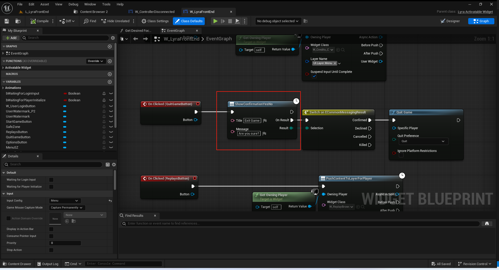
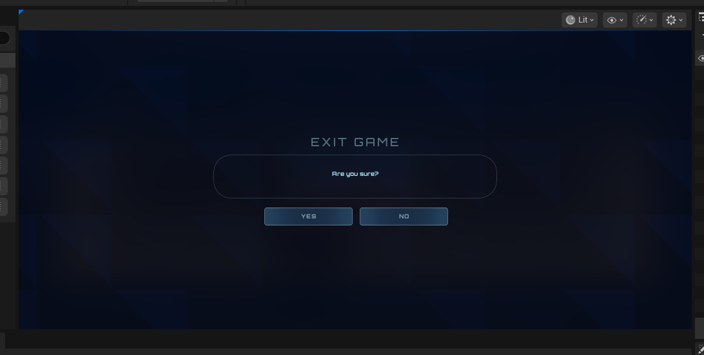

# UE5_Lyra学习指南_045_对话框

本文章仅为小刚-B站课堂-虚幻引擎视频课程Lyra-精讲的演讲手稿.  
本套课程链接:[[UE5]虚幻引擎游戏案例Lyra精讲](https://www.bilibili.com/cheese/play/ss112001159)  
前置课程链接:[[UE5]虚幻引擎UEC++从基础到进阶](https://www.bilibili.com/cheese/play/ss28043)  

文章内容由小刚撰写,采用了以下多种方式:  
1.口述转文字  
2.AI重构  
3.参考引擎源码  
4.Lyra工程源码  
5.结合社区论坛各位大佬的解析  

- [UE5\_Lyra学习指南\_045\_对话框](#ue5_lyra学习指南_045_对话框)
	- [概述](#概述)
	- [配置](#配置)
	- [对话框的框架定义](#对话框的框架定义)
		- [对话框可能结果](#对话框可能结果)
		- [对话框子系统](#对话框子系统)
		- [游戏实例的信息注册处理登录用户信息](#游戏实例的信息注册处理登录用户信息)
		- [对话框描述器](#对话框描述器)
		- [对话框基类](#对话框基类)
	- [实际运用](#实际运用)
		- [转发对话框描述器信息](#转发对话框描述器信息)
		- [生成对话框](#生成对话框)
	- [复习关于点击!](#复习关于点击)
		- [注册](#注册)
		- [调用](#调用)
	- [复习InputActionWidget的ICON](#复习inputactionwidget的icon)
	- [总结](#总结)


## 概述
我们主要讲解用户界面用于向用户提示信息进行确认的对话框.
该部分内容主要包含在CommomGame插件里面.
## 配置
DefaultGame.ini
```ini
[/Script/LyraGame.LyraUIMessaging]
; 确认对话框
ConfirmationDialogClass=/Game/UI/Foundation/Dialogs/W_ConfirmationDefault.W_ConfirmationDefault_C
; 错误对话框
ErrorDialogClass=/Game/UI/Foundation/Dialogs/W_ConfirmationError.W_ConfirmationError_C
```
## 对话框的框架定义
### 对话框可能结果
``` cpp
/** Possible results from a dialog */
/** 对话可能出现的结果 */
UENUM(BlueprintType)
enum class ECommonMessagingResult : uint8
{
	/** The "yes" button was pressed */
	/** “是”按钮已被按下 */
	Confirmed,
	/** The "no" button was pressed */
	/** “拒绝”按钮已被按下 */
	Declined,
	/** The "ignore/cancel" button was pressed */
	/** “忽略/取消”按钮已被按下 */
	Cancelled,
	/** The dialog was explicitly killed (no user input) */
	/** 该对话框已被明确关闭（未收到用户输入） */
	Killed,
	Unknown UMETA(Hidden)
};

```
``` cpp

DECLARE_DELEGATE_OneParam(FCommonMessagingResultDelegate, ECommonMessagingResult /* Result */);
```
### 对话框子系统
``` cpp
/**
 * 
 */
UCLASS(MinimalAPI, config = Game)
class UCommonMessagingSubsystem : public ULocalPlayerSubsystem
{
	GENERATED_BODY()

public:
	UCommonMessagingSubsystem() { }

	// 无作用
	UE_API virtual void Initialize(FSubsystemCollectionBase& Collection) override;
	// 无作用
	UE_API virtual void Deinitialize() override;
	// 避免重复创建
	UE_API virtual bool ShouldCreateSubsystem(UObject* Outer) const override;

	// 仅接口未实现
	UE_API virtual void ShowConfirmation(UCommonGameDialogDescriptor* DialogDescriptor, FCommonMessagingResultDelegate ResultCallback = FCommonMessagingResultDelegate());
	// 仅接口未实现
	UE_API virtual void ShowError(UCommonGameDialogDescriptor* DialogDescriptor, FCommonMessagingResultDelegate ResultCallback = FCommonMessagingResultDelegate());

private:

};


```

### 游戏实例的信息注册处理登录用户信息
``` cpp
void UCommonGameInstance::HandleSystemMessage(FGameplayTag MessageType, FText Title, FText Message)
{
	ULocalPlayer* FirstPlayer = GetFirstGamePlayer();
	// Forward severe ones to the error dialog for the first player
	// 将严重错误信息转发给第一个玩家的错误对话框中显示
	if (FirstPlayer && MessageType.MatchesTag(FCommonUserTags::SystemMessage_Error))
	{
		if (UCommonMessagingSubsystem* Messaging = FirstPlayer->GetSubsystem<UCommonMessagingSubsystem>())
		{
			Messaging->ShowError(UCommonGameDialogDescriptor::CreateConfirmationOk(Title, Message));
		}
	}
}


```

``` cpp

void UCommonGameInstance::Init()
{
	Super::Init();

	// After subsystems are initialized, hook them together
	// 在子系统初始化完成后，将它们连接起来
	FGameplayTagContainer PlatformTraits = ICommonUIModule::GetSettings().GetPlatformTraits();

	UCommonUserSubsystem* UserSubsystem = GetSubsystem<UCommonUserSubsystem>();
	if (ensure(UserSubsystem))
	{
		UserSubsystem->SetTraitTags(PlatformTraits);
		UserSubsystem->OnHandleSystemMessage.AddDynamic(this, &UCommonGameInstance::HandleSystemMessage);
		UserSubsystem->OnUserPrivilegeChanged.AddDynamic(this, &UCommonGameInstance::HandlePrivilegeChanged);
		UserSubsystem->OnUserInitializeComplete.AddDynamic(this, &UCommonGameInstance::HandlerUserInitialized);
	}

	UCommonSessionSubsystem* SessionSubsystem = GetSubsystem<UCommonSessionSubsystem>();
	if (ensure(SessionSubsystem))
	{
		SessionSubsystem->OnUserRequestedSessionEvent.AddUObject(this, &UCommonGameInstance::OnUserRequestedSession);
		SessionSubsystem->OnDestroySessionRequestedEvent.AddUObject(this, &UCommonGameInstance::OnDestroySessionRequested);
	}
}


```

``` cpp
void UCommonUserSubsystem::HandleUserInitializeFailed(FCommonUserInitializeParams Params, FText Error)
{
	UCommonUserInfo* LocalUserInfo = ModifyInfo(GetUserInfoForLocalPlayerIndex(Params.LocalPlayerIndex));

	if (!LocalUserInfo)
	{
		// The user info was reset since this was scheduled
		return;
	}

	UE_LOG(LogCommonUser, Warning, TEXT("TryToInitializeUser %d failed with error %s"), LocalUserInfo->LocalPlayerIndex, *Error.ToString());

	// If state is wrong, abort as we might have gotten canceled
	if (!ensure(LocalUserInfo->IsDoingLogin()))
	{
		return;
	}

	// If initial login failed or we ended up totally logged out, set to complete failure
	ELoginStatusType NewStatus = GetLocalUserLoginStatus(Params.PlatformUser, Params.OnlineContext);
	if (NewStatus == ELoginStatusType::NotLoggedIn || LocalUserInfo->InitializationState == ECommonUserInitializationState::DoingInitialLogin)
	{
		LocalUserInfo->InitializationState = ECommonUserInitializationState::FailedtoLogin;
	}
	else
	{
		LocalUserInfo->InitializationState = ECommonUserInitializationState::LoggedInLocalOnly;
	}

	FText TitleText = NSLOCTEXT("CommonUser", "LoginFailedTitle", "Login Failure");

	if (!Params.bSuppressLoginErrors)
	{
		SendSystemMessage(FCommonUserTags::SystemMessage_Error_InitializeLocalPlayerFailed, TitleText, Error);
	}
	
	// Call callbacks
	Params.OnUserInitializeComplete.ExecuteIfBound(LocalUserInfo, false, Error, Params.RequestedPrivilege, Params.OnlineContext);
	OnUserInitializeComplete.Broadcast(LocalUserInfo, false, Error, Params.RequestedPrivilege, Params.OnlineContext);
}

```
### 对话框描述器
``` cpp
UCLASS(MinimalAPI)
class UCommonGameDialogDescriptor : public UObject
{
	GENERATED_BODY()
	
public:
	static UE_API UCommonGameDialogDescriptor* CreateConfirmationOk(const FText& Header, const FText& Body);
	static UE_API UCommonGameDialogDescriptor* CreateConfirmationOkCancel(const FText& Header, const FText& Body);
	static UE_API UCommonGameDialogDescriptor* CreateConfirmationYesNo(const FText& Header, const FText& Body);
	static UE_API UCommonGameDialogDescriptor* CreateConfirmationYesNoCancel(const FText& Header, const FText& Body);

public:
	/** The header of the message to display */
	/** 显示的消息的标题 */
	UPROPERTY(EditAnywhere, BlueprintReadWrite)
	FText Header;
	
	/** The body of the message to display */
	/** 将要显示的消息主体 */
	UPROPERTY(EditAnywhere, BlueprintReadWrite)
	FText Body;

	/** The confirm button's input action to use. */
	/** 确认按钮的输入操作方式。*/
	UPROPERTY(BlueprintReadWrite)
	TArray<FConfirmationDialogAction> ButtonActions;
};
```
以最复杂的实现为例,存在确认,拒绝,取消这三个操作
``` cpp
UCommonGameDialogDescriptor* UCommonGameDialogDescriptor::CreateConfirmationYesNoCancel(const FText& Header, const FText& Body)
{
	UCommonGameDialogDescriptor* Descriptor = NewObject<UCommonGameDialogDescriptor>();
	Descriptor->Header = Header;
	Descriptor->Body = Body;

	FConfirmationDialogAction ConfirmAction;
	ConfirmAction.Result = ECommonMessagingResult::Confirmed;
	ConfirmAction.OptionalDisplayText = LOCTEXT("Yes", "Yes");

	FConfirmationDialogAction DeclineAction;
	DeclineAction.Result = ECommonMessagingResult::Declined;
	DeclineAction.OptionalDisplayText = LOCTEXT("No", "No");

	FConfirmationDialogAction CancelAction;
	CancelAction.Result = ECommonMessagingResult::Cancelled;
	CancelAction.OptionalDisplayText = LOCTEXT("Cancel", "Cancel");

	Descriptor->ButtonActions.Add(ConfirmAction);
	Descriptor->ButtonActions.Add(DeclineAction);
	Descriptor->ButtonActions.Add(CancelAction);

	return Descriptor;
}
```

``` cpp
USTRUCT(BlueprintType)
struct FConfirmationDialogAction
{
	GENERATED_BODY()

public:
	/** Required: The dialog option to provide. */
	/** 必填项：需提供的对话选项。*/
	UPROPERTY(EditAnywhere, BlueprintReadWrite)
	ECommonMessagingResult Result = ECommonMessagingResult::Unknown;

	/** Optional: Display Text to use instead of the action name associated with the result. */
	/** （可选）：显示用于替代与结果相关联的操作名称的文本内容。*/
	UPROPERTY(EditAnywhere, BlueprintReadWrite)
	FText OptionalDisplayText;

	bool operator==(const FConfirmationDialogAction& Other) const
	{
		return Result == Other.Result &&
			OptionalDisplayText.EqualTo(Other.OptionalDisplayText);
	}
};
```
### 对话框基类
``` cpp
UCLASS(MinimalAPI, Abstract)
class UCommonGameDialog : public UCommonActivatableWidget
{
	GENERATED_BODY()
	
public:
	// 无
	UE_API UCommonGameDialog();
	// 接口
	UE_API virtual void SetupDialog(UCommonGameDialogDescriptor* Descriptor, FCommonMessagingResultDelegate ResultCallback);
	// 接口
	UE_API virtual void KillDialog();
};

```
## 实际运用
### 转发对话框描述器信息
``` cpp
/**
 * 
 */
UCLASS()
class ULyraUIMessaging : public UCommonMessagingSubsystem
{
	GENERATED_BODY()

public:
	ULyraUIMessaging() { }

	virtual void Initialize(FSubsystemCollectionBase& Collection) override;

	virtual void ShowConfirmation(UCommonGameDialogDescriptor* DialogDescriptor, FCommonMessagingResultDelegate ResultCallback = FCommonMessagingResultDelegate()) override;
	virtual void ShowError(UCommonGameDialogDescriptor* DialogDescriptor, FCommonMessagingResultDelegate ResultCallback = FCommonMessagingResultDelegate()) override;

private:
	
	UPROPERTY()
	TSubclassOf<UCommonGameDialog> ConfirmationDialogClassPtr;

	UPROPERTY()
	TSubclassOf<UCommonGameDialog> ErrorDialogClassPtr;

	// 确认确定框的控件类
	UPROPERTY(config)
	TSoftClassPtr<UCommonGameDialog> ConfirmationDialogClass;

	// 错误对话框的控件类
	UPROPERTY(config)
	TSoftClassPtr<UCommonGameDialog> ErrorDialogClass;
};


```

``` cpp
void ULyraUIMessaging::ShowConfirmation(UCommonGameDialogDescriptor* DialogDescriptor, FCommonMessagingResultDelegate ResultCallback)
{
	if (UCommonLocalPlayer* LocalPlayer = GetLocalPlayer<UCommonLocalPlayer>())
	{
		if (UPrimaryGameLayout* RootLayout = LocalPlayer->GetRootUILayout())
		{
			RootLayout->PushWidgetToLayerStack<UCommonGameDialog>(TAG_UI_LAYER_MODAL, ConfirmationDialogClassPtr, [DialogDescriptor, ResultCallback](UCommonGameDialog& Dialog) {
				Dialog.SetupDialog(DialogDescriptor, ResultCallback);
			});
		}
	}
}

```

### 生成对话框
``` cpp

/**
 *	用于接收确认信息的对话框 需要蓝图进行绑定控件
 */
UCLASS(Abstract, BlueprintType, Blueprintable)
class ULyraConfirmationScreen : public UCommonGameDialog
{
	GENERATED_BODY()
public:
	// 根据描述器建立对话框
	virtual void SetupDialog(UCommonGameDialogDescriptor* Descriptor, FCommonMessagingResultDelegate ResultCallback) override;
	// 无
	virtual void KillDialog() override;

protected:
	// 绑定退出按钮
	virtual void NativeOnInitialized() override;
	// 关闭窗口 并推送对话框选择的结果
	virtual void CloseConfirmationWindow(ECommonMessagingResult Result);

#if WITH_EDITOR
	// 编辑器接口 确保取消行为有效
	virtual void ValidateCompiledDefaults(IWidgetCompilerLog& CompileLog) const override;
#endif

private:

	// 背景的退出按钮
	UFUNCTION()
	FEventReply HandleTapToCloseZoneMouseButtonDown(FGeometry MyGeometry, const FPointerEvent& MouseEvent);

	// 传递给蓝图的后续执行引脚对应的对话框结果
	FCommonMessagingResultDelegate OnResultCallback;

private:
	// 标题
	UPROPERTY(Meta = (BindWidget))
	TObjectPtr<UCommonTextBlock> Text_Title;

	// 描述
	UPROPERTY(Meta = (BindWidget))
	TObjectPtr<UCommonRichTextBlock> RichText_Description;

	// 按钮的容器 这里需要指定实例化的子类
	UPROPERTY(Meta = (BindWidget))
	TObjectPtr<UDynamicEntryBox> EntryBox_Buttons;

	// 关闭案例
	UPROPERTY(Meta = (BindWidget))
	TObjectPtr<UCommonBorder> Border_TapToCloseZone;

	// 取消的行为
	UPROPERTY(EditDefaultsOnly, meta = (RowType = "/Script/CommonUI.CommonInputActionDataBase"))
	FDataTableRowHandle CancelAction;
};


```
``` cpp

void ULyraConfirmationScreen::SetupDialog(UCommonGameDialogDescriptor* Descriptor, FCommonMessagingResultDelegate ResultCallback)
{
	Super::SetupDialog(Descriptor, ResultCallback);

	Text_Title->SetText(Descriptor->Header);
	RichText_Description->SetText(Descriptor->Body);

	EntryBox_Buttons->Reset<ULyraButtonBase>([](ULyraButtonBase& Button)
	{
		Button.OnClicked().Clear();
	});

	for (const FConfirmationDialogAction& Action : Descriptor->ButtonActions)
	{
		FDataTableRowHandle ActionRow;

		switch(Action.Result)
		{
			case ECommonMessagingResult::Confirmed:
				// 拿到我们配置的默认点击行为
				ActionRow = ICommonInputModule::GetSettings().GetDefaultClickAction();
				break;
				// 拿到我们配置的默认后退行为
			case ECommonMessagingResult::Declined:
				ActionRow = ICommonInputModule::GetSettings().GetDefaultBackAction();
				break;
				// 拿到UMG配置的取消行为
			case ECommonMessagingResult::Cancelled:
				ActionRow = CancelAction;
				break;
			default:
				ensure(false);
				continue;
		}

		ULyraButtonBase* Button = EntryBox_Buttons->CreateEntry<ULyraButtonBase>();
		Button->SetTriggeringInputAction(ActionRow);
		// 确保点击之后停用当前对话框,然后传递不同的对话框结果给代理
		Button->OnClicked().AddUObject(this, &ThisClass::CloseConfirmationWindow, Action.Result);
		Button->SetButtonText(Action.OptionalDisplayText);
	}

	OnResultCallback = ResultCallback;
}

```
蓝图使用示例:


## 复习关于点击!
### 注册
``` cpp
void UCommonButtonBase::SetTriggeringInputAction(const FDataTableRowHandle & InputActionRow)
{
	if (TriggeringInputAction != InputActionRow)
	{
		UnbindTriggeringInputActionToClick();

		TriggeredInputAction = {};
		TriggeringEnhancedInputAction = nullptr;
		TriggeringInputAction = InputActionRow;

		if (!IsDesignTime())
		{
			BindTriggeringInputActionToClick();
		}

		// Update the Input action widget whenever the triggering input action changes
		UpdateInputActionWidget();

		OnTriggeringInputActionChanged(InputActionRow);
	}
}

```
``` cpp
void UCommonButtonBase::BindTriggeringInputActionToClick()
{
	if (!TriggeredInputAction.IsNull())
	{
		return;
	}

	if (CommonUI::IsEnhancedInputSupportEnabled() && TriggeringEnhancedInputAction && !TriggeringBindingHandle.IsValid())
	{
		FBindUIActionArgs BindArgs(TriggeringEnhancedInputAction, false, FSimpleDelegate::CreateUObject(this, &UCommonButtonBase::HandleTriggeringActionCommited));
		BindArgs.OnHoldActionProgressed.BindUObject(this, &UCommonButtonBase::NativeOnActionProgress);
		BindArgs.OnHoldActionPressed.BindUObject(this, &UCommonButtonBase::NativeOnPressed);
		BindArgs.OnHoldActionReleased.BindUObject(this, &UCommonButtonBase::NativeOnReleased);
		BindArgs.bIsPersistent = bIsPersistentBinding;

		BindArgs.InputMode = InputModeOverride;

		TriggeringBindingHandle = RegisterUIActionBinding(BindArgs);
	}
	else if (!TriggeringInputAction.IsNull() && !TriggeringBindingHandle.IsValid())
	{
		FBindUIActionArgs BindArgs(TriggeringInputAction, false, FSimpleDelegate::CreateUObject(this, &UCommonButtonBase::HandleTriggeringActionCommited));
		BindArgs.OnHoldActionProgressed.BindUObject(this, &UCommonButtonBase::NativeOnActionProgress);
		BindArgs.OnHoldActionPressed.BindUObject(this, &UCommonButtonBase::NativeOnPressed);
		BindArgs.OnHoldActionReleased.BindUObject(this, &UCommonButtonBase::NativeOnReleased);
		BindArgs.bIsPersistent = bIsPersistentBinding;
		BindArgs.bForceHold = GetConvertInputActionToHold();

		BindArgs.InputMode = InputModeOverride;

		TriggeringBindingHandle = RegisterUIActionBinding(BindArgs);
	}
}
```
``` cpp
FUIActionBindingHandle UCommonUserWidget::RegisterUIActionBinding(const FBindUIActionArgs& BindActionArgs)
{
	if (UCommonUIActionRouterBase* ActionRouter = UCommonUIActionRouterBase::Get(*this))
	{
		FBindUIActionArgs FinalBindActionArgs = BindActionArgs;
		if (bDisplayInActionBar && !BindActionArgs.bDisplayInActionBar)
		{
			FinalBindActionArgs.bDisplayInActionBar = true;
		}
		FUIActionBindingHandle BindingHandle = ActionRouter->RegisterUIActionBinding(*this, FinalBindActionArgs);
		ActionBindings.Add(BindingHandle);
		return BindingHandle;
	}

	return FUIActionBindingHandle();
}

```
``` cpp
FUIActionBindingHandle UCommonUIActionRouterBase::RegisterUIActionBinding(const UWidget& Widget, const FBindUIActionArgs& BindActionArgs)
{
	FUIActionBindingHandle BindingHandle = FUIActionBinding::TryCreate(Widget, BindActionArgs, GetLocalPlayerIndex());

	// ...
}
```

``` cpp
FUIActionBindingHandle FUIActionBinding::TryCreate(const UWidget& InBoundWidget, const FBindUIActionArgs& BindArgs, int32 UserIndex)
{
	// ...
	AllRegistrationsByHandle.Add(Handle, MoveTemp(NewRegistration));

	return Handle;
}
```
记住这个AllRegistrationsByHandle!
### 调用
``` cpp
TSharedPtr<FUIActionBinding> FUIActionBinding::FindBinding(FUIActionBindingHandle Handle)
{
	if (TSharedPtr<FUIActionBinding>* Ptr = AllRegistrationsByHandle.Find(Handle))
	{
		return *Ptr;
	}

	return nullptr;
}

```
``` cpp

bool FActionRouterBindingCollection::ProcessNormalInput(ECommonInputMode ActiveInputMode, FKey Key, EInputEvent InputEvent, int32 UserIndex) const
{
	for (FUIActionBindingHandle BindingHandle : ActionBindings)
	{
		if (TSharedPtr<FUIActionBinding> Binding = FUIActionBinding::FindBinding(BindingHandle))
		{
			//...
}

```
## 复习InputActionWidget的ICON
``` cpp
void UCommonButtonBase::UpdateInputActionWidget()
{
	// Update the input action state of the input action widget contextually based on the current state of the button
	if (GetGameInstance() && InputActionWidget)
	{
		bool bIsEnhancedInputSupportEnabled = CommonUI::IsEnhancedInputSupportEnabled();

		// Prefer visualizing the triggering enhanced input action before all else
		if (bIsEnhancedInputSupportEnabled && TriggeringEnhancedInputAction)
		{
			InputActionWidget->SetEnhancedInputAction(TriggeringEnhancedInputAction);
		}
		// Prefer visualizing the triggering input action next
		else if (!TriggeringInputAction.IsNull())
		{
			InputActionWidget->SetInputAction(TriggeringInputAction);
		}
		// Fallback to visualizing the triggered input action, if it's available
		else if (!TriggeredInputAction.IsNull())
		{
			InputActionWidget->SetInputAction(TriggeredInputAction);
		}
		// Visualize the default click action when neither input action is bound and when the widget is enabled and hovered
		else if (bShouldUseFallbackDefaultInputAction && bButtonEnabled && IsHovered())
		{
			UInputAction* DefaultEnhancedClickAction = bIsEnhancedInputSupportEnabled ? ICommonInputModule::GetSettings().GetEnhancedInputClickAction() : nullptr;
			if (DefaultEnhancedClickAction)
			{
				InputActionWidget->SetEnhancedInputAction(DefaultEnhancedClickAction);
			}
			else
			{
				InputActionWidget->SetInputAction(ICommonInputModule::GetSettings().GetDefaultClickAction());
			}
		}
		else
		{
			if (bIsEnhancedInputSupportEnabled)
			{
				InputActionWidget->SetEnhancedInputAction(nullptr);
			}

			FDataTableRowHandle EmptyStateHandle;
			InputActionWidget->SetInputAction(EmptyStateHandle);
		}

		UpdateInputActionWidgetVisibility();
	}
}


```

## 总结
这个对话框看起来很复杂.其实很简单.但是因为好几个子类,父类是套在一起的.并且父类的逻辑没办法单独呈现,所以容易绕晕.主要用法的也是两种.一种是在C++绑定代理.还有一种就是通过蓝图异步节点去构建一个对话框的异步行动,创建对话框描述器,然后等待用户点击生成的对话框.最后回调给蓝图使用