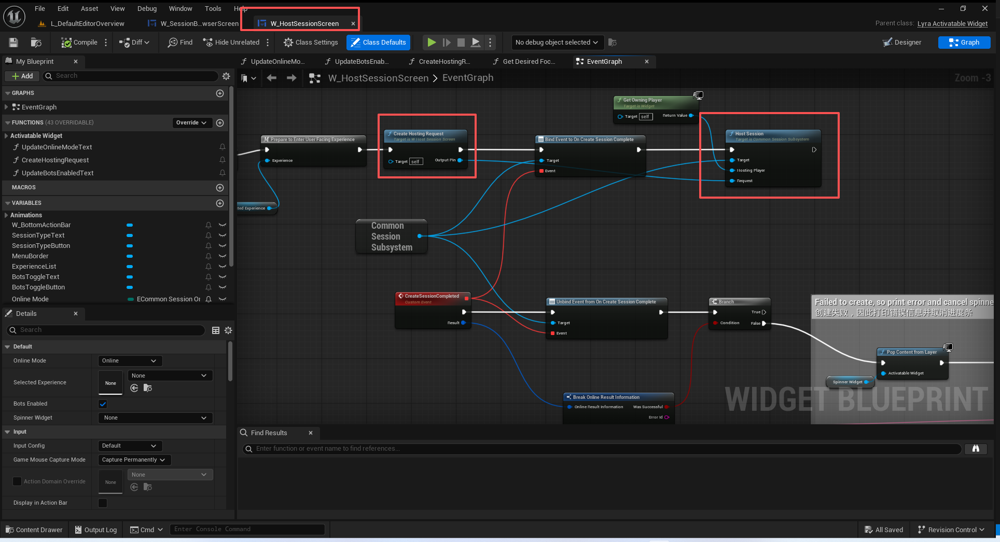
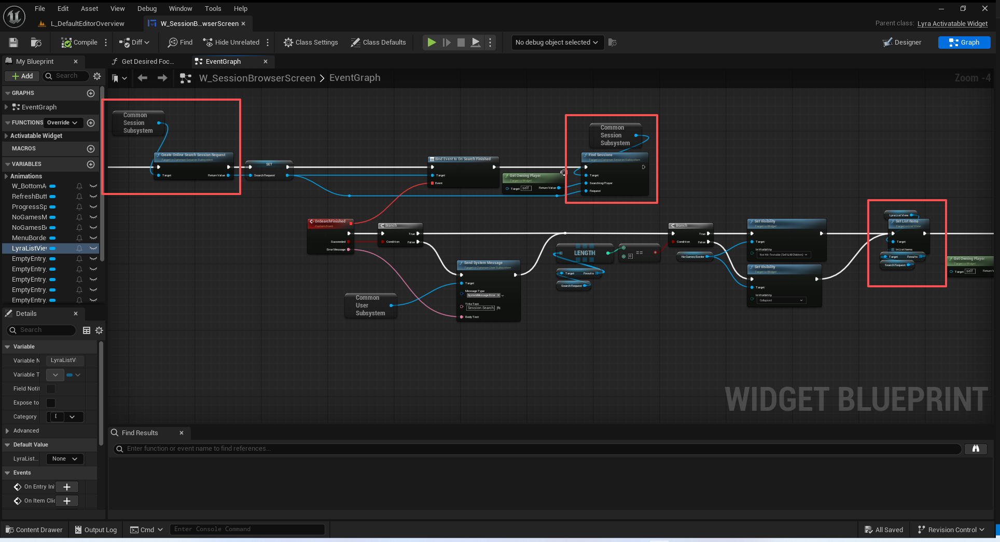
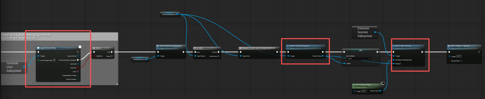
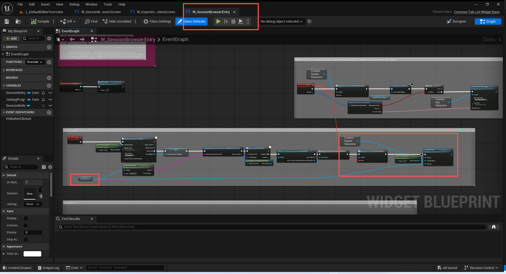

# UE5_Lyra学习指南_048_会话系统

本文章仅为小刚-B站课堂-虚幻引擎视频课程Lyra-精讲的演讲手稿.  
本套课程链接:[[UE5]虚幻引擎游戏案例Lyra精讲](https://www.bilibili.com/cheese/play/ss112001159)  
前置课程链接:[[UE5]虚幻引擎UEC++从基础到进阶](https://www.bilibili.com/cheese/play/ss28043)  

文章内容由小刚撰写,采用了以下多种方式:  
1.口述转文字  
2.AI重构  
3.参考引擎源码  
4.Lyra工程源码  
5.结合社区论坛各位大佬的解析  

- [UE5\_Lyra学习指南\_048\_会话系统](#ue5_lyra学习指南_048_会话系统)
	- [概述](#概述)
	- [联网模式](#联网模式)
	- [主持会话流程](#主持会话流程)
		- [创建会话请求](#创建会话请求)
		- [绑定会话代理](#绑定会话代理)
		- [执行主持会话](#执行主持会话)
		- [会话执行回调](#会话执行回调)
	- [搜索会话](#搜索会话)
		- [创建会话搜索请求](#创建会话搜索请求)
		- [会话搜索请求的设置参数](#会话搜索请求的设置参数)
		- [执行会话搜索](#执行会话搜索)
		- [使用搜索结果](#使用搜索结果)
	- [快速加入](#快速加入)
	- [加入会话](#加入会话)
	- [代码](#代码)
	- [总结](#总结)


## 概述
这节我们主要讲解CommonUser插件得使用.实际上,目前只需要当成黑盒使用即可.
因为这套服务的架构就是官方进行定义使用的.
完全不需要关心里面的实现.
如果需要自架后端的话就应该另外封装一套.如果不是的话.直接配置好,调用接口即可!
## 联网模式
``` cpp
UENUM(BlueprintType)
enum class ECommonSessionOnlineMode : uint8
{
	Offline,
	LAN,
	Online
};
```
Offline:单机
LAN:局域网
Online:类似于Steam的,房主开房.
此处未探讨关于托管DS服务.
以上三种事玩家可以通过前端进行设置的游戏模式.
## 主持会话流程

蓝图逻辑略过.
是在W_HostSessionScreen中执行,当体验的关卡选中之后.
如果是线上模式.玩家需要登录线上.然后创建一个会话请求,并设置参数,最后使用该会话请求主持会话即可!

### 创建会话请求
``` cpp

UCommonSession_HostSessionRequest* ULyraUserFacingExperienceDefinition::CreateHostingRequest(const UObject* WorldContextObject) const
{
	const FString ExperienceName = ExperienceID.PrimaryAssetName.ToString();
	const FString UserFacingExperienceName = GetPrimaryAssetId().PrimaryAssetName.ToString();

	UWorld* World = GEngine->GetWorldFromContextObject(WorldContextObject, EGetWorldErrorMode::ReturnNull);
	UGameInstance* GameInstance = World ? World->GetGameInstance() : nullptr;
	UCommonSession_HostSessionRequest* Result = nullptr;
	
	if (UCommonSessionSubsystem* Subsystem = GameInstance ? GameInstance->GetSubsystem<UCommonSessionSubsystem>() : nullptr)
	{
		Result = Subsystem->CreateOnlineHostSessionRequest();
	}

	if (!Result)
	{
		// Couldn't use the subsystem so create one
		// 由于无法使用该子系统，所以需要创建一个新的子系统。
		Result = NewObject<UCommonSession_HostSessionRequest>();
		Result->OnlineMode = ECommonSessionOnlineMode::Online;
		Result->bUseLobbies = true;
		Result->bUseLobbiesVoiceChat = false;
		// We always enable presence on this session because it is the primary session used for matchmaking. For online systems that care about presence, only the primary session should have presence enabled
		// 在本次会话中，我们总是会开启“在线状态”功能，因为这是用于匹配对战的主要会话。对于那些重视在线状态的在线系统而言，只有主会话才应开启“在线状态”功能。
		Result->bUsePresence = !IsRunningDedicatedServer();
	}
	Result->MapID = MapID;
	Result->ModeNameForAdvertisement = UserFacingExperienceName;
	Result->ExtraArgs = ExtraArgs;
	Result->ExtraArgs.Add(TEXT("Experience"), ExperienceName);
	Result->MaxPlayerCount = MaxPlayerCount;

	if (ULyraReplaySubsystem::DoesPlatformSupportReplays())
	{
		if (bRecordReplay)
		{
			Result->ExtraArgs.Add(TEXT("DemoRec"), FString());
		}
	}

	return Result;
}

```

``` cpp
UCommonSession_HostSessionRequest* UCommonSessionSubsystem::CreateOnlineHostSessionRequest()
{
	/** Game-specific subsystems can override this or you can modify after creation */
	/** 游戏特定的子系统可以覆盖此设置，或者您也可以在创建后对其进行修改 */
	
	UCommonSession_HostSessionRequest* NewRequest = NewObject<UCommonSession_HostSessionRequest>(this);
	NewRequest->OnlineMode = ECommonSessionOnlineMode::Online;
	NewRequest->bUseLobbies = bUseLobbiesDefault;
	NewRequest->bUseLobbiesVoiceChat = bUseLobbiesVoiceChatDefault;

	// We enable presence by default in the primary session used for matchmaking. For online systems that care about presence, only the primary session should have presence enabled
	// 我们默认在用于匹配的主会话中开启在线状态显示功能。对于那些重视在线状态显示的在线系统而言，只有主会话才应开启此功能。
	NewRequest->bUsePresence = !IsRunningDedicatedServer();

	return NewRequest;
}

```

注意这里的Presence主要用以显示在线状态.它的实现可以参考UCommonUserBasicPresence.代码已注释.
``` cpp
void UCommonUserBasicPresence::Initialize(FSubsystemCollectionBase& Collection)
{
	UCommonSessionSubsystem* CommonSession = Collection.InitializeDependency<UCommonSessionSubsystem>();
	if(ensure(CommonSession))
	{
		CommonSession->OnSessionInformationChangedEvent.AddUObject(this, &UCommonUserBasicPresence::OnNotifySessionInformationChanged);
	}
}
```

### 绑定会话代理

``` cpp
void UCommonSessionSubsystem::Initialize(FSubsystemCollectionBase& Collection)
{
	Super::Initialize(Collection);
	BindOnlineDelegates();
	GEngine->OnTravelFailure().AddUObject(this, &UCommonSessionSubsystem::TravelLocalSessionFailure);

	FCoreUObjectDelegates::PostLoadMapWithWorld.AddUObject(this, &UCommonSessionSubsystem::HandlePostLoadMap);

	UGameInstance* GameInstance = GetGameInstance();
	bIsDedicatedServer = GameInstance->IsDedicatedServerInstance();
}

```

``` cpp
void UCommonSessionSubsystem::BindOnlineDelegates()
{
#if COMMONUSER_OSSV1
	BindOnlineDelegatesOSSv1();
#else
	BindOnlineDelegatesOSSv2();
#endif
}

```
``` cpp
void UCommonSessionSubsystem::BindOnlineDelegatesOSSv1()
{
	IOnlineSubsystem* OnlineSub = Online::GetSubsystem(GetWorld());
	check(OnlineSub);

	const IOnlineSessionPtr SessionInterface = OnlineSub->GetSessionInterface();
	check(SessionInterface.IsValid());

	SessionInterface->AddOnCreateSessionCompleteDelegate_Handle(FOnCreateSessionCompleteDelegate::CreateUObject(this, &ThisClass::OnCreateSessionComplete));
	SessionInterface->AddOnStartSessionCompleteDelegate_Handle(FOnStartSessionCompleteDelegate::CreateUObject(this, &ThisClass::OnStartSessionComplete));
	SessionInterface->AddOnUpdateSessionCompleteDelegate_Handle(FOnUpdateSessionCompleteDelegate::CreateUObject(this, &ThisClass::OnUpdateSessionComplete));
	SessionInterface->AddOnEndSessionCompleteDelegate_Handle(FOnEndSessionCompleteDelegate::CreateUObject(this, &ThisClass::OnEndSessionComplete));
	SessionInterface->AddOnDestroySessionCompleteDelegate_Handle(FOnDestroySessionCompleteDelegate::CreateUObject(this, &ThisClass::OnDestroySessionComplete));
	SessionInterface->AddOnDestroySessionRequestedDelegate_Handle(FOnDestroySessionRequestedDelegate::CreateUObject(this, &ThisClass::OnDestroySessionRequested));

//	SessionInterface->AddOnMatchmakingCompleteDelegate_Handle(FOnMatchmakingCompleteDelegate::CreateUObject(this, &ThisClass::OnMatchmakingComplete));
//	SessionInterface->AddOnCancelMatchmakingCompleteDelegate_Handle(FOnCancelMatchmakingCompleteDelegate::CreateUObject(this, &ThisClass::OnCancelMatchmakingComplete));

	SessionInterface->AddOnFindSessionsCompleteDelegate_Handle(FOnFindSessionsCompleteDelegate::CreateUObject(this, &ThisClass::OnFindSessionsComplete));
// 	SessionInterface->AddOnCancelFindSessionsCompleteDelegate_Handle(FOnCancelFindSessionsCompleteDelegate::CreateUObject(this, &ThisClass::OnCancelFindSessionsComplete));
// 	SessionInterface->AddOnPingSearchResultsCompleteDelegate_Handle(FOnPingSearchResultsCompleteDelegate::CreateUObject(this, &ThisClass::OnPingSearchResultsComplete));
	SessionInterface->AddOnJoinSessionCompleteDelegate_Handle(FOnJoinSessionCompleteDelegate::CreateUObject(this, &ThisClass::OnJoinSessionComplete));

//	TWO_PARAM(OnSessionParticipantJoined, FName, const FUniqueNetId&);
//	THREE_PARAM(OnSessionParticipantLeft, FName, const FUniqueNetId&, EOnSessionParticipantLeftReason);
//	ONE_PARAM(OnQosDataRequested, FName);
//	TWO_PARAM(OnSessionCustomDataChanged, FName, const FOnlineSessionSettings&);
//	TWO_PARAM(OnSessionSettingsUpdated, FName, const FOnlineSessionSettings&);
//	THREE_PARAM(OnSessionParticipantSettingsUpdated, FName, const FUniqueNetId&, const FOnlineSessionSettings&);
//	FOUR_PARAM(OnSessionInviteReceived, const FUniqueNetId& /*UserId*/, const FUniqueNetId& /*FromId*/, const FString& /*AppId*/, const FOnlineSessionSearchResult& /*InviteResult*/);
//	THREE_PARAM(OnRegisterPlayersComplete, FName, const TArray< FUniqueNetIdRef >&, bool);
//	THREE_PARAM(OnUnregisterPlayersComplete, FName, const TArray< FUniqueNetIdRef >&, bool);

	SessionInterface->AddOnSessionUserInviteAcceptedDelegate_Handle(FOnSessionUserInviteAcceptedDelegate::CreateUObject(this, &ThisClass::HandleSessionUserInviteAccepted));
	SessionInterface->AddOnSessionFailureDelegate_Handle(FOnSessionFailureDelegate::CreateUObject(this, &ThisClass::HandleSessionFailure));
}


```
### 执行主持会话
``` cpp

void UCommonSessionSubsystem::HostSession(APlayerController* HostingPlayer, UCommonSession_HostSessionRequest* Request)
{
	if (Request == nullptr)
	{
		SetCreateSessionError(NSLOCTEXT("NetworkErrors", "InvalidRequest", "HostSession passed an invalid request."));
		OnCreateSessionComplete(NAME_None, false);
		return;
	}

	ULocalPlayer* LocalPlayer = (HostingPlayer != nullptr) ? HostingPlayer->GetLocalPlayer() : nullptr;
	if (LocalPlayer == nullptr && !bIsDedicatedServer)
	{
		SetCreateSessionError(NSLOCTEXT("NetworkErrors", "InvalidHostingPlayer", "HostingPlayer is invalid."));
		OnCreateSessionComplete(NAME_None, false);
		return;
	}

	FText OutError;
	if (!Request->ValidateAndLogErrors(OutError))
	{
		SetCreateSessionError(OutError);
		OnCreateSessionComplete(NAME_None, false);
		return;
	}

	if (Request->OnlineMode == ECommonSessionOnlineMode::Offline)
	{
		if (GetWorld()->GetNetMode() == NM_Client)
		{
			SetCreateSessionError(NSLOCTEXT("NetworkErrors", "CannotHostAsClient", "Cannot host offline game as client."));
			OnCreateSessionComplete(NAME_None, false);
			return;
		}
		else
		{
			// Offline so travel to the specified match URL immediately
			// 离线状态下，请立即前往指定的比赛页面。
			GetWorld()->ServerTravel(Request->ConstructTravelURL());
		}
	}
	else
	{
		CreateOnlineSessionInternal(LocalPlayer, Request);
	}

	NotifySessionInformationUpdated(ECommonSessionInformationState::InGame, Request->ModeNameForAdvertisement, Request->GetMapName());
}

```

``` cpp
void UCommonSessionSubsystem::CreateOnlineSessionInternal(ULocalPlayer* LocalPlayer, UCommonSession_HostSessionRequest* Request)
{
	CreateSessionResult = FOnlineResultInformation();
	PendingTravelURL = Request->ConstructTravelURL();

#if COMMONUSER_OSSV1
	CreateOnlineSessionInternalOSSv1(LocalPlayer, Request);
#else
	CreateOnlineSessionInternalOSSv2(LocalPlayer, Request);
#endif
}
```
``` cpp

#if COMMONUSER_OSSV1
void UCommonSessionSubsystem::CreateOnlineSessionInternalOSSv1(ULocalPlayer* LocalPlayer, UCommonSession_HostSessionRequest* Request)
{
	const FName SessionName(NAME_GameSession);
	const int32 MaxPlayers = Request->GetMaxPlayers();

	IOnlineSubsystem* const OnlineSub = Online::GetSubsystem(GetWorld());
	check(OnlineSub);

	IOnlineSessionPtr Sessions = OnlineSub->GetSessionInterface();
	check(Sessions);

	FUniqueNetIdPtr UserId;
	if (LocalPlayer)
	{
		UserId = LocalPlayer->GetPreferredUniqueNetId().GetUniqueNetId();
	}
	else if (bIsDedicatedServer)
	{
		UserId = OnlineSub->GetIdentityInterface()->GetUniquePlayerId(DEDICATED_SERVER_USER_INDEX);
	}

	//@TODO: You can get here on some platforms while trying to do a LAN session, does that require a valid user id?
	//@待办事项：在某些平台上，您在尝试进行局域网连接时可能会自动跳转到这里，这是否需要输入有效的用户账号呢？
	if (ensure(UserId.IsValid()))
	{
		FCommonSession_OnlineSessionSettings HostSettings(Request->OnlineMode == ECommonSessionOnlineMode::LAN, Request->bUsePresence, MaxPlayers);
		HostSettings.bUseLobbiesIfAvailable = Request->bUseLobbies;
		HostSettings.bUseLobbiesVoiceChatIfAvailable = Request->bUseLobbiesVoiceChat;
		HostSettings.Set(SETTING_GAMEMODE, Request->ModeNameForAdvertisement, EOnlineDataAdvertisementType::ViaOnlineService);
		HostSettings.Set(SETTING_MAPNAME, Request->GetMapName(), EOnlineDataAdvertisementType::ViaOnlineService);
		//@TODO: HostSettings.Set(SETTING_MATCHING_HOPPER, FString("TeamDeathmatch"), EOnlineDataAdvertisementType::DontAdvertise);
		HostSettings.Set(SETTING_MATCHING_TIMEOUT, 120.0f, EOnlineDataAdvertisementType::ViaOnlineService);
		HostSettings.Set(SETTING_SESSION_TEMPLATE_NAME, FString(TEXT("GameSession")), EOnlineDataAdvertisementType::ViaOnlineService);
		HostSettings.Set(SETTING_ONLINESUBSYSTEM_VERSION, true, EOnlineDataAdvertisementType::ViaOnlineService);
		/**
		 * 根据指定的设置对象创建一个在线会话。
		 * 注意：在线会话注册是一个异步过程，只有在调用“OnCreateSessionComplete”委托后才会完成。*
		 * @参数 HostingPlayerId：表示主持本次会话的玩家的索引
		 * @参数 SessionName：用于此会话的名称，以便在同一时间可以存在多个会话
		 * @参数 NewSessionSettings：用于新会话的设置参数*
		 * @返回值：如果成功创建会话则返回 true，否则返回 false
		 * 
		 */
		Sessions->CreateSession(*UserId, SessionName, HostSettings);
		NotifySessionInformationUpdated(ECommonSessionInformationState::InGame, Request->ModeNameForAdvertisement, Request->GetMapName());
	}
	else
	{
		OnCreateSessionComplete(SessionName, false);
	}
}

```
### 会话执行回调
``` cpp
void UCommonSessionSubsystem::OnCreateSessionComplete(FName SessionName, bool bWasSuccessful)
{
	UE_LOG(LogCommonSession, Log, TEXT("OnCreateSessionComplete(SessionName: %s, bWasSuccessful: %d)"), *SessionName.ToString(), bWasSuccessful);

#if COMMONUSER_OSSV1 // OSSv2 joins splitscreen players as part of the create call
	// Add the splitscreen player if one exists
#if 0 //@TODO:
	if (bWasSuccessful && LocalPlayers.Num() > 1)
	{
		IOnlineSessionPtr Sessions = Online::GetSessionInterface(GetWorld());
		if (Sessions.IsValid() && LocalPlayers[1]->GetPreferredUniqueNetId().IsValid())
		{
			Sessions->RegisterLocalPlayer(*LocalPlayers[1]->GetPreferredUniqueNetId(), NAME_GameSession,
				FOnRegisterLocalPlayerCompleteDelegate::CreateUObject(this, &ThisClass::OnRegisterLocalPlayerComplete_CreateSession));
		}
	}
	else
#endif
#endif
	{
		// We either failed or there is only a single local user
		// 或者我们失败了，或者这里只有一个本地用户。
		FinishSessionCreation(bWasSuccessful);
	}
}

```
跳转关卡.
``` cpp

void UCommonSessionSubsystem::FinishSessionCreation(bool bWasSuccessful)
{
	if (bWasSuccessful)
	{
		//@TODO Synchronize timing of this with join callbacks, modify both places and the comments if plan changes
		//@待办事项 将此操作的时间与连接回调操作的时间同步起来，修改这两处内容以及相关注释（如果计划有变动的话）
		CreateSessionResult = FOnlineResultInformation();
		CreateSessionResult.bWasSuccessful = true;

		if (bUseBeacons)
		{
			CreateHostReservationBeacon();
		}

		NotifyCreateSessionComplete(CreateSessionResult);

		// Travel to the specified match URL
		// 前往指定的比赛页面链接
		/**
		 * 将服务器提升至新级别。  如果 bAbsolute 为真且我们正在使用无缝移动功能，我们将进行绝对移动（URL 将被刷新）。*
		 * @参数 URL：我们即将前往的网址
		 * @参数 bAbsolute：我们是采用相对路径还是绝对路径进行访问
		 * @参数 bShouldSkipGameNotify：是否向客户端/游戏发送通知
		 * 
		 */
		GetWorld()->ServerTravel(PendingTravelURL);
	}
	else
	{
		if (CreateSessionResult.bWasSuccessful || CreateSessionResult.ErrorText.IsEmpty())
		{
			FString ReturnError = TEXT("GenericFailure"); // TODO: No good way to get session error codes out of OSSV1
			FText ReturnReason = NSLOCTEXT("NetworkErrors", "CreateSessionFailed", "Failed to create session.");

			CreateSessionResult.bWasSuccessful = false;
			CreateSessionResult.ErrorId = ReturnError;
			CreateSessionResult.ErrorText = ReturnReason;
		}

		UE_LOG(LogCommonSession, Error, TEXT("FinishSessionCreation(%s): %s"), *CreateSessionResult.ErrorId, *CreateSessionResult.ErrorText.ToString());

		NotifyCreateSessionComplete(CreateSessionResult);
		NotifySessionInformationUpdated(ECommonSessionInformationState::OutOfGame);
	}
}

```

## 搜索会话


蓝图逻辑略.
这里有一个ListView指定EntryWidgetClass的逻辑需要关注一下!
在W_SessionBrowserScreen中创建一个会话搜索请求,然后执行会话搜索,拿到会话搜索之后的结果去刷新UI即可.
注意同一时间只执行一个会话搜索即可.这个很耗时!
### 创建会话搜索请求
``` cpp
UCommonSession_SearchSessionRequest* UCommonSessionSubsystem::CreateOnlineSearchSessionRequest()
{
	/** Game-specific subsystems can override this or you can modify after creation */
	/** 游戏特定的子系统可以覆盖此设置，或者您也可以在创建后对其进行修改 */
	UCommonSession_SearchSessionRequest* NewRequest = NewObject<UCommonSession_SearchSessionRequest>(this);
	NewRequest->OnlineMode = ECommonSessionOnlineMode::Online;

	NewRequest->bUseLobbies = bUseLobbiesDefault;

	return NewRequest;
}

```
### 会话搜索请求的设置参数
``` cpp
/** Delegates called when a session search completes */
/** 当会话搜索完成时所调用的回调函数 */
DECLARE_MULTICAST_DELEGATE_TwoParams(FCommonSession_FindSessionsFinished, bool bSucceeded, const FText& ErrorMessage);
DECLARE_DYNAMIC_MULTICAST_DELEGATE_TwoParams(FCommonSession_FindSessionsFinishedDynamic, bool, bSucceeded, FText, ErrorMessage);


/** Request object describing a session search, this object will be updated once the search has completed */
/** 描述会话搜索的请求对象，该对象在搜索完成后会进行更新 */
UCLASS(MinimalAPI, BlueprintType)
class UCommonSession_SearchSessionRequest : public UObject
{
	GENERATED_BODY()

public:
	/** Indicates if the this is looking for full online games or a different type like LAN */
	/** 表示此功能是用于查找完整的在线游戏，还是查找诸如局域网游戏之类的其他类型的游戏 */
	UPROPERTY(BlueprintReadWrite, Category = Session)
	ECommonSessionOnlineMode OnlineMode;

	/** True if this request should look for player-hosted lobbies if they are available, false will only search for registered server sessions */
	/** 如果存在玩家自建的房间，则应执行此请求以查找这些房间；若为假，则仅搜索已注册的服务器会话 */
	UPROPERTY(BlueprintReadWrite, Category = Session)
	bool bUseLobbies;

	/** List of all found sessions, will be valid when OnSearchFinished is called */
	/** 所有找到的会话列表，当调用“OnSearchFinished”时该列表仍有效 */
	UPROPERTY(BlueprintReadOnly, Category=Session)
	TArray<TObjectPtr<UCommonSession_SearchResult>> Results;

	/** Native Delegate called when a session search completes */
	/** 当会话搜索完成时所调用的原生委托函数 */
	FCommonSession_FindSessionsFinished OnSearchFinished;

	/** Called by subsystem to execute finished delegates */
	/** 由子系统调用以执行已完成的委托 */
	COMMONUSER_API void NotifySearchFinished(bool bSucceeded, const FText& ErrorMessage);

private:
	/** Delegate called when a session search completes */
	/** 当会话搜索完成时所调用的委托函数 */
	UPROPERTY(BlueprintAssignable, Category = "Events", meta = (DisplayName = "On Search Finished", AllowPrivateAccess = true))
	FCommonSession_FindSessionsFinishedDynamic K2_OnSearchFinished;
};


```

### 执行会话搜索
``` cpp
void UCommonSessionSubsystem::FindSessions(APlayerController* SearchingPlayer, UCommonSession_SearchSessionRequest* Request)
{
	if (Request == nullptr)
	{
		UE_LOG(LogCommonSession, Error, TEXT("FindSessions passed a null request"));
		return;
	}

#if COMMONUSER_OSSV1
	FindSessionsInternal(SearchingPlayer, MakeShared<FCommonOnlineSearchSettingsOSSv1>(Request));
#else
	FindSessionsInternal(SearchingPlayer, MakeShared<FCommonOnlineSearchSettingsOSSv2>(Request));
#endif // COMMONUSER_OSSV1
}

```
``` cpp
void UCommonSessionSubsystem::FindSessionsInternal(APlayerController* SearchingPlayer, const TSharedRef<FCommonOnlineSearchSettings>& InSearchSettings)
{
	if (SearchSettings.IsValid())
	{
		//@TODO: This is a poor user experience for the API user, we should let the additional search piggyback and
		// just give it the same results as the currently pending one
		// (or enqueue the request and service it when the previous one finishes or fails)

		//@待办事项：对于 API 用户而言，这是一种糟糕的使用体验。我们应该让额外的搜索功能能够与当前操作并行进行，并且只需给它提供与当前正在进行的操作相同的结果（或者将请求排队，待前一个操作完成或失败后再进行处理）。
		UE_LOG(LogCommonSession, Error, TEXT("A previous FindSessions call is still in progress, aborting"));
		SearchSettings->SearchRequest->NotifySearchFinished(false, LOCTEXT("Error_FindSessionAlreadyInProgress", "Session search already in progress"));
	}

	ULocalPlayer* LocalPlayer = (SearchingPlayer != nullptr) ? SearchingPlayer->GetLocalPlayer() : nullptr;
	if (LocalPlayer == nullptr)
	{
		UE_LOG(LogCommonSession, Error, TEXT("SearchingPlayer is invalid"));
		InSearchSettings->SearchRequest->NotifySearchFinished(false, LOCTEXT("Error_FindSessionBadPlayer", "Session search was not provided a local player"));
		return;
	}

	SearchSettings = InSearchSettings;
#if COMMONUSER_OSSV1
	FindSessionsInternalOSSv1(LocalPlayer);
#else
	FindSessionsInternalOSSv2(LocalPlayer);
#endif
}

```
``` cpp
#if COMMONUSER_OSSV1
void UCommonSessionSubsystem::FindSessionsInternalOSSv1(ULocalPlayer* LocalPlayer)
{
	IOnlineSubsystem* OnlineSub = Online::GetSubsystem(GetWorld());
	check(OnlineSub);
	IOnlineSessionPtr Sessions = OnlineSub->GetSessionInterface();
	check(Sessions);

	SearchSettings->QuerySettings.Set(SETTING_SESSION_TEMPLATE_NAME, FString("GameSession"), EOnlineComparisonOp::Equals);

	if (!Sessions->FindSessions(*LocalPlayer->GetPreferredUniqueNetId().GetUniqueNetId(), StaticCastSharedRef<FCommonOnlineSearchSettingsOSSv1>(SearchSettings.ToSharedRef())))
	{
		// Some session search failures will call this delegate inside the function, others will not
		// 有些会话搜索失败的情况会在函数内部调用此委托，而其他情况则不会。
		OnFindSessionsComplete(false);
	}
}

#else


```
### 使用搜索结果
需要从当时创建的会话搜索请求对象的指针里面读取Result即可!!
注意 ,请在回调时读取!
``` cpp
/** Delegates called when a session search completes */
/** 当会话搜索完成时所调用的回调函数 */
DECLARE_MULTICAST_DELEGATE_TwoParams(FCommonSession_FindSessionsFinished, bool bSucceeded, const FText& ErrorMessage);
DECLARE_DYNAMIC_MULTICAST_DELEGATE_TwoParams(FCommonSession_FindSessionsFinishedDynamic, bool, bSucceeded, FText, ErrorMessage);


/** Request object describing a session search, this object will be updated once the search has completed */
/** 描述会话搜索的请求对象，该对象在搜索完成后会进行更新 */
UCLASS(MinimalAPI, BlueprintType)
class UCommonSession_SearchSessionRequest : public UObject
{
	GENERATED_BODY()

public:

	/** List of all found sessions, will be valid when OnSearchFinished is called */
	/** 所有找到的会话列表，当调用“OnSearchFinished”时该列表仍有效 */
	UPROPERTY(BlueprintReadOnly, Category=Session)
	TArray<TObjectPtr<UCommonSession_SearchResult>> Results;


};


```


## 快速加入

蓝图逻辑略.
原理基本一致.
W_ExperienceSelectionScreen中通过点击MenuButton实现.
注意需要先用户联网登录.
创建会话请求.执行会话快速匹配即可!
注意这里的会话搜索请求会更具会话请求创建!

``` cpp
	/** Starts a process to look for existing sessions or create a new one if no viable sessions are found */
	/** 启动一个进程，以查找现有的会话，若未找到可用的会话则创建一个新的会话 */
	UFUNCTION(BlueprintCallable, Category=Session)
	COMMONUSER_API virtual void QuickPlaySession(APlayerController* JoiningOrHostingPlayer, UCommonSession_HostSessionRequest* Request);

```
``` cpp
void UCommonSessionSubsystem::QuickPlaySession(APlayerController* JoiningOrHostingPlayer, UCommonSession_HostSessionRequest* HostRequest)
{
	UE_LOG(LogCommonSession, Log, TEXT("QuickPlay Requested"));

	if (HostRequest == nullptr)
	{
		UE_LOG(LogCommonSession, Error, TEXT("QuickPlaySession passed a null request"));
		return;
	}

	TStrongObjectPtr<UCommonSession_HostSessionRequest> HostRequestPtr = TStrongObjectPtr<UCommonSession_HostSessionRequest>(HostRequest);
	TWeakObjectPtr<APlayerController> JoiningOrHostingPlayerPtr = TWeakObjectPtr<APlayerController>(JoiningOrHostingPlayer);

	// 注意这里的会话搜索请求根据会话请求创建而来!
	UCommonSession_SearchSessionRequest* QuickPlayRequest = CreateOnlineSearchSessionRequest();
	QuickPlayRequest->OnSearchFinished.AddUObject(this, &UCommonSessionSubsystem::HandleQuickPlaySearchFinished, JoiningOrHostingPlayerPtr, HostRequestPtr);

	// We enable presence by default on the primary session used for matchmaking. For online systems that care about presence, only the primary session should have presence enabled
	// 我们默认会在用于匹配的主会话中开启在线状态显示功能。对于那些重视在线状态显示的在线系统而言，只有主会话才应开启此功能。
	
	HostRequestPtr->bUseLobbies = bUseLobbiesDefault;
	HostRequestPtr->bUseLobbiesVoiceChat = bUseLobbiesVoiceChatDefault;
	HostRequestPtr->bUsePresence = true;
	QuickPlayRequest->bUseLobbies = bUseLobbiesDefault;

	NotifySessionInformationUpdated(ECommonSessionInformationState::Matchmaking);
	FindSessionsInternal(JoiningOrHostingPlayer, CreateQuickPlaySearchSettings(HostRequest, QuickPlayRequest));
}

```
``` cpp
void UCommonSessionSubsystem::HandleQuickPlaySearchFinished(bool bSucceeded, const FText& ErrorMessage, TWeakObjectPtr<APlayerController> JoiningOrHostingPlayer, TStrongObjectPtr<UCommonSession_HostSessionRequest> HostRequest)
{
	const int32 ResultCount = SearchSettings->SearchRequest->Results.Num();
	UE_LOG(LogCommonSession, Log, TEXT("QuickPlay Search Finished %s (Results %d) (Error: %s)"), bSucceeded ? TEXT("Success") : TEXT("Failed"), ResultCount, *ErrorMessage.ToString());

	//@TODO: We have to check if the error message is empty because some OSS layers report a failure just because there are no sessions.  Please fix with OSS 2.0.
	//@待办事项：我们必须检查错误消息是否为空，因为某些开源软件层仅仅因为没有会话就报告失败了。请在使用 OSS 2.0 版本时进行修正。
	if (bSucceeded || ErrorMessage.IsEmpty())
	{
		// Join the best search result.
		if (ResultCount > 0)
		{
			//@TODO: We should probably look at ping?  maybe some other factors to find the best.  Idk if they come pre-sorted or not.
			//@待办事项：我们或许应该考虑一下“ping”这个指标？或许还需要考虑其他一些因素来找到最佳方案。我不知道它们是否已经预先排序好了。
			for (UCommonSession_SearchResult* Result : SearchSettings->SearchRequest->Results)
			{
				JoinSession(JoiningOrHostingPlayer.Get(), Result);
				return;
			}
		}
		else
		{
			HostSession(JoiningOrHostingPlayer.Get(), HostRequest.Get());
		}
	}
	else
	{
		//@TODO: This sucks, need to tell someone.
		//@待办事项：这太糟糕了，得找人说一说。
		NotifySessionInformationUpdated(ECommonSessionInformationState::OutOfGame);
	}
}


```

## 加入会话
蓝图逻辑略

W_SessionBrowserEntry这个是容器的按钮,被实例化的时候会指定一个搜索结果,被点击的时候直接加入会话即可.
注意,需要处理加入失败的情况!

``` cpp
void UCommonSessionSubsystem::JoinSession(APlayerController* JoiningPlayer, UCommonSession_SearchResult* Request)
{

	if (Request == nullptr)
	{
		UE_LOG(LogCommonSession, Error, TEXT("JoinSession passed a null request"));
		return;
	}

	ULocalPlayer* LocalPlayer = (JoiningPlayer != nullptr) ? JoiningPlayer->GetLocalPlayer() : nullptr;
	if (LocalPlayer == nullptr)
	{
		UE_LOG(LogCommonSession, Error, TEXT("JoiningPlayer is invalid"));
		return;
	}

	// Update presence here since we won't have the raw game mode and map name keys after client travel. If joining/travel fails, it is reset to main menu
	// 在此更新在线状态，因为客户端移动后我们将无法获取原始的游戏模式和地图名称键。如果加入或移动失败，则会重置为主菜单状态。
	FString SessionGameMode, SessionMapName;
	bool bEmpty;
#if COMMONUSER_OSSV1
	Request->GetStringSetting(SETTING_GAMEMODE, SessionGameMode, bEmpty);
	Request->GetStringSetting(SETTING_MAPNAME, SessionMapName, bEmpty);
	NotifySessionInformationUpdated(ECommonSessionInformationState::InGame, SessionGameMode, SessionMapName);
#else
	if(Request->Lobby.IsValid())
	{
		Request->GetStringSetting(SETTING_GAMEMODE, SessionGameMode, bEmpty);
		Request->GetStringSetting(SETTING_MAPNAME, SessionMapName, bEmpty);
		NotifySessionInformationUpdated(ECommonSessionInformationState::InGame, SessionGameMode, SessionMapName);
	}
#endif // COMMONUSER_OSSV1

	JoinSessionInternal(LocalPlayer, Request);
}


```

``` cpp
void UCommonSessionSubsystem::JoinSessionInternal(ULocalPlayer* LocalPlayer, UCommonSession_SearchResult* Request)
{
#if COMMONUSER_OSSV1
	JoinSessionInternalOSSv1(LocalPlayer, Request);
#else
	JoinSessionInternalOSSv2(LocalPlayer, Request);
#endif // COMMONUSER_OSSV1
}

#if COMMONUSER_OSSV1
void UCommonSessionSubsystem::JoinSessionInternalOSSv1(ULocalPlayer* LocalPlayer, UCommonSession_SearchResult* Request)
{
	IOnlineSubsystem* OnlineSub = Online::GetSubsystem(GetWorld());
	check(OnlineSub);
	IOnlineSessionPtr Sessions = OnlineSub->GetSessionInterface();
	check(Sessions);
	
	// We need to manually set that we want this to be our presence session
	// 我们需要手动设置，表明我们希望将此设为我们的会话状态。
	Request->Result.Session.SessionSettings.bUsesPresence = true;
	Request->Result.Session.SessionSettings.bUseLobbiesIfAvailable = bUseLobbiesDefault;

	Sessions->JoinSession(*LocalPlayer->GetPreferredUniqueNetId().GetUniqueNetId(), NAME_GameSession, Request->Result);
}

```

## 代码
因为代码量过多.就单独放在下一节吧!


## 总结
我们并没有讲解OnlineSessionInterface相关的内容.
因为CommonSession本质也是对它的封装和调用.
我们只需要掌握蓝图使用接口,不需要研究这块的C++代码!

