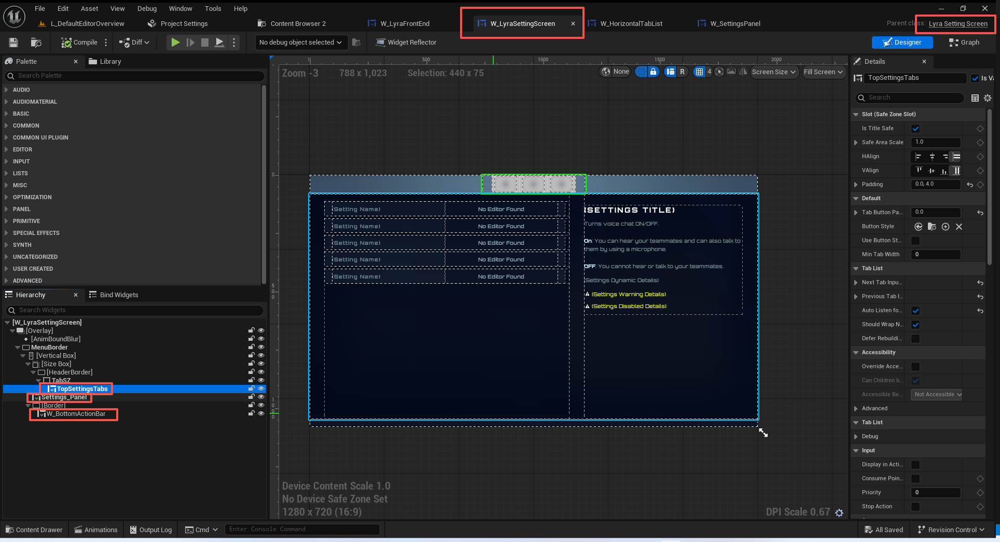
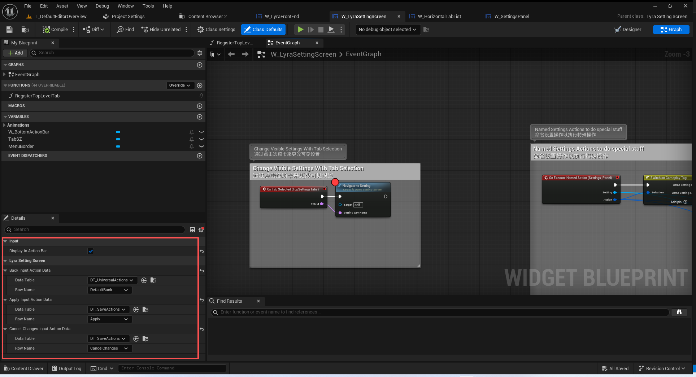
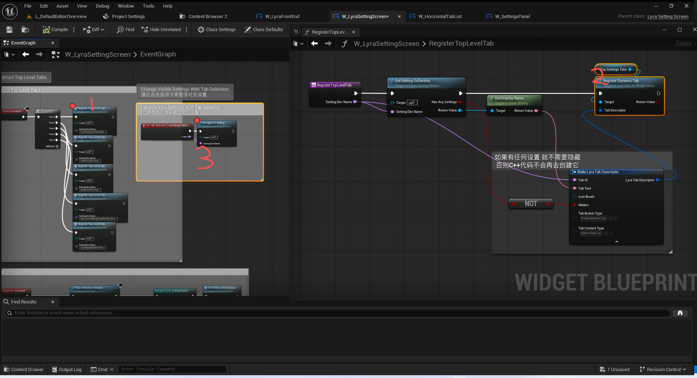
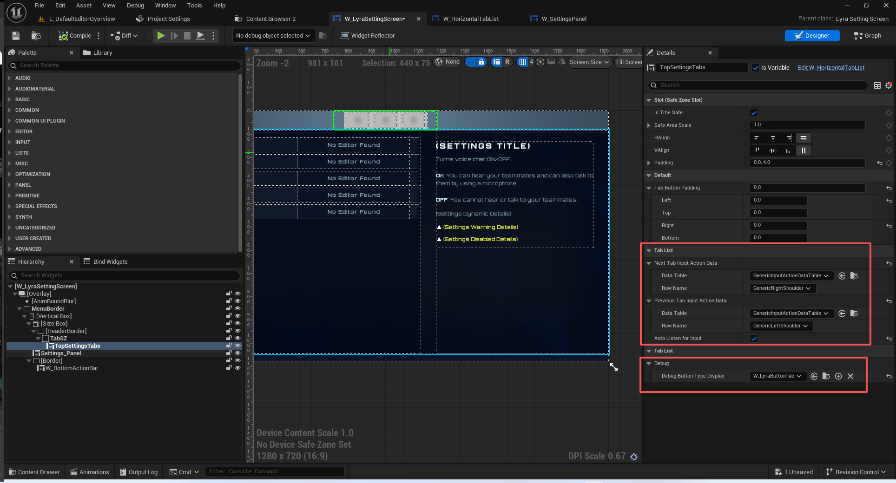
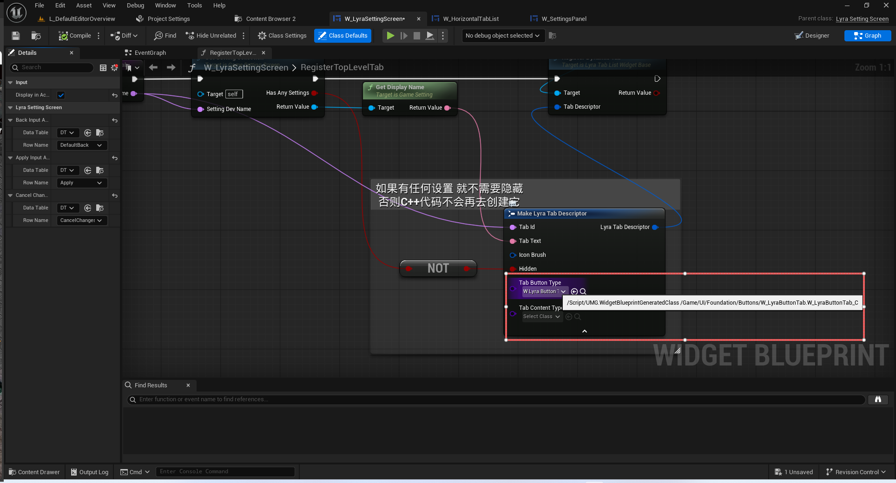

# UE5_Lyra学习指南_050_游戏设置界面

本文章仅为小刚-B站课堂-虚幻引擎视频课程Lyra-精讲的演讲手稿.  
本套课程链接:[[UE5]虚幻引擎游戏案例Lyra精讲](https://www.bilibili.com/cheese/play/ss112001159)  
前置课程链接:[[UE5]虚幻引擎UEC++从基础到进阶](https://www.bilibili.com/cheese/play/ss28043)  

文章内容由小刚撰写,采用了以下多种方式:  
1.口述转文字  
2.AI重构  
3.参考引擎源码  
4.Lyra工程源码  
5.结合社区论坛各位大佬的解析  

- [UE5\_Lyra学习指南\_050\_游戏设置界面](#ue5_lyra学习指南_050_游戏设置界面)
	- [概述](#概述)
	- [LyraSettingScreen](#lyrasettingscreen)
		- [输入操作](#输入操作)
		- [创建游戏设置注册器](#创建游戏设置注册器)
	- [GameSettingScreen](#gamesettingscreen)
		- [游戏设置追踪器的初始化](#游戏设置追踪器的初始化)
		- [游戏设置注册器的初始化](#游戏设置注册器的初始化)
	- [面板的顶部侧边栏联动设置具体面板](#面板的顶部侧边栏联动设置具体面板)
		- [TabButton样式的选择](#tabbutton样式的选择)
		- [TabButtonGroup](#tabbuttongroup)
			- [触发的回调](#触发的回调)
			- [增加一个Tab按钮 如果是第一个就默认被选中](#增加一个tab按钮-如果是第一个就默认被选中)
	- [GameSettingRegistryChangeTracker](#gamesettingregistrychangetracker)
	- [总结](#总结)


## 概述
从这一节开始我们来讲解游戏设置的界面!
这部分内容是目前前端最难的部分.无论是正着理解,还是反着理解,在第一次阅读的时候都是很困难的.但是只要完成一遍之后.之后就会很流畅!
## LyraSettingScreen
这个就是我们要进行推送的设置主界面!

红框标识的几个控件都非常重要!

``` cpp
// 设置的最上层面板
// 1.响应输入 如回退,确认,取消
// 2.如果有变动就显示确认和取消的按钮
// 3.创建游戏设置注册器UGameSettingRegistry!!!极其重要.是我们游戏设置有多少选项的底层入口!
// 4.持有顶部标签栏,当我们点击或者注册Tab页面时,更新具体设置面板
// 5.持有底部侧边栏,用以显示底部按钮
UCLASS(Abstract, meta = (Category = "Settings", DisableNativeTick))
class ULyraSettingScreen : public UGameSettingScreen
{
	GENERATED_BODY()

public:

protected:
	
	// 绑定输入映射
	virtual void NativeOnInitialized() override;

	// 极其重要!!! 创建设置注册器 调用逻辑见父类
	// 这里会去初始化我们底层有多少游戏设置.
	virtual UGameSettingRegistry* CreateRegistry() override;

	// 处理返回 尝试回退到上一次导航的位置(嵌套页面) 如果没有的话就应用变化 并退出
	void HandleBackAction();
	// 应用设置
	void HandleApplyAction();
	// 取消设置应用
	void HandleCancelChangesAction();

	// 设置变动时显示 应用和取消按钮
	virtual void OnSettingsDirtyStateChanged_Implementation(bool bSettingsDirty) override;
	
protected:
	// 绑定控件 用于切换显示的分类设置
	UPROPERTY(BlueprintReadOnly, Category = Input, meta = (BindWidget, OptionalWidget = true, AllowPrivateAccess = true))
	TObjectPtr<ULyraTabListWidgetBase> TopSettingsTabs;

	// 返回的输入映射
	UPROPERTY(EditDefaultsOnly)
	FDataTableRowHandle BackInputActionData;

	// 应用的输入映射
	UPROPERTY(EditDefaultsOnly)
	FDataTableRowHandle ApplyInputActionData;

	// 取消的输入映射
	UPROPERTY(EditDefaultsOnly)
	FDataTableRowHandle CancelChangesInputActionData;

	// 返回事件的句柄
	FUIActionBindingHandle BackHandle;

	// 应用设置的句柄
	FUIActionBindingHandle ApplyHandle;

	// 取消改变的句柄
	FUIActionBindingHandle CancelChangesHandle;
	
};


```

### 输入操作


``` cpp
void ULyraSettingScreen::NativeOnInitialized()
{
	Super::NativeOnInitialized();

	BackHandle = RegisterUIActionBinding(FBindUIActionArgs(BackInputActionData,
		true, FSimpleDelegate::CreateUObject(this, &ThisClass::HandleBackAction)));
	ApplyHandle = RegisterUIActionBinding(FBindUIActionArgs(ApplyInputActionData,
		true, FSimpleDelegate::CreateUObject(this, &ThisClass::HandleApplyAction)));
	CancelChangesHandle = RegisterUIActionBinding(FBindUIActionArgs(CancelChangesInputActionData,
		true, FSimpleDelegate::CreateUObject(this, &ThisClass::HandleCancelChangesAction)));
}
```
``` cpp
void ULyraSettingScreen::OnSettingsDirtyStateChanged_Implementation(bool bSettingsDirty)
{
	// 如果有设置变动 则添加应用设置和取消设置的按钮
	if (bSettingsDirty)
	{
		if (!GetActionBindings().Contains(ApplyHandle))
		{
			AddActionBinding(ApplyHandle);
		}
		if (!GetActionBindings().Contains(CancelChangesHandle))
		{
			AddActionBinding(CancelChangesHandle);
		}
	}
	else
	{
		RemoveActionBinding(ApplyHandle);
		RemoveActionBinding(CancelChangesHandle);
	}
}

```


### 创建游戏设置注册器
``` cpp
UGameSettingRegistry* ULyraSettingScreen::CreateRegistry()
{
	ULyraGameSettingRegistry* NewRegistry = NewObject<ULyraGameSettingRegistry>();

	if (ULyraLocalPlayer* LocalPlayer = CastChecked<ULyraLocalPlayer>(GetOwningLocalPlayer()))
	{
		// 极其重要
		NewRegistry->Initialize(LocalPlayer);
	}

	return NewRegistry;
}

```

## GameSettingScreen
``` cpp
/**
 * 游戏设置的主屏幕
 * 1. 持有游戏设置注册器
 * 2. 持有游戏设置变动追踪器
 * 3. 提供若干蓝图接口,如创建游戏设置器,应用或取消游戏设置,导航等逻辑
 */
UCLASS(MinimalAPI, Abstract, meta = (Category = "Settings", DisableNativeTick))
class UGameSettingScreen : public UCommonActivatableWidget
{
	GENERATED_BODY()
public:

protected:
	// 无
	UE_API virtual void NativeOnInitialized() override;
	// 初始化游戏设置注册器的追踪
	UE_API virtual void NativeOnActivated() override;
	// 无
	UE_API virtual void NativeOnDeactivated() override;

	// 重写一下聚焦对象 如果蓝图设置就走蓝图的 如果蓝图没就走设置的细节面板
	UE_API virtual UWidget* NativeGetDesiredFocusTarget() const override;

	// 导航设置 由蓝图调用 接收由TabList在注册Tag或点击Tag时调用!
	UFUNCTION(BlueprintCallable)
	UE_API void NavigateToSetting(FName SettingDevName);

	// 导航到对应的设置
	UFUNCTION(BlueprintCallable)
	UE_API void NavigateToSettings(const TArray<FName>& SettingDevNames);

	// 设置变动触发的回调
	UFUNCTION(BlueprintNativeEvent)
	UE_API void OnSettingsDirtyStateChanged(bool bSettingsDirty);
	virtual void OnSettingsDirtyStateChanged_Implementation(bool bSettingsDirty) { }

	// 尝试弹出导航栈
	UFUNCTION(BlueprintCallable)
	UE_API bool AttemptToPopNavigation();

	// 暴露给蓝图 获取对应的游戏设置集合!首次使用时创建,调用的位置是蓝图的注册Tab
	// W_LyraSettingScreen->Construct->RegitterTopLevelTab->GetSettingCollection
	UFUNCTION(BlueprintCallable)
	UE_API UGameSettingCollection* GetSettingCollection(FName SettingDevName, bool& HasAnySettings); 

protected:
	// 创建游戏设置注册器
	UE_API virtual UGameSettingRegistry* CreateRegistry() PURE_VIRTUAL(, return nullptr;);

	// 获取游戏设置注册器
	template <typename GameSettingRegistryT = UGameSettingRegistry>
	GameSettingRegistryT* GetRegistry() const { return Cast<GameSettingRegistryT>(const_cast<UGameSettingScreen*>(this)->GetOrCreateRegistry()); }

	// 取消变化
	UFUNCTION(BlueprintCallable)
	UE_API virtual void CancelChanges();

	// 应用变化
	UFUNCTION(BlueprintCallable)
	UE_API virtual void ApplyChanges();

	// 是否有设置变动
	UFUNCTION(BlueprintCallable)
	bool HaveSettingsBeenChanged() const { return ChangeTracker.HaveSettingsBeenChanged(); }

	// 清理脏的状态
	UE_API void ClearDirtyState();

	// 在GetOrCreateRegistry中进行绑定
	UE_API void HandleSettingChanged(UGameSetting* Setting, EGameSettingChangeReason Reason);

	FGameSettingRegistryChangeTracker ChangeTracker;

private:
	// 内部获取或创建游戏设置注册器
	UE_API UGameSettingRegistry* GetOrCreateRegistry();

private:
	// Bound Widgets
	// 固定的控件
	UPROPERTY(BlueprintReadOnly, meta = (BindWidget, BlueprintProtected = true, AllowPrivateAccess = true))
	TObjectPtr<UGameSettingPanel> Settings_Panel;

	// 由它持有 ok  没有问题
	UPROPERTY(Transient)
	mutable TObjectPtr<UGameSettingRegistry> Registry;
};

```


### 游戏设置追踪器的初始化
``` cpp
void UGameSettingScreen::NativeOnActivated()
{
	Super::NativeOnActivated();
	
	ChangeTracker.WatchRegistry(Registry);
	// 初始化一下 当前应该无设置变动
	OnSettingsDirtyStateChanged(HaveSettingsBeenChanged());
}
```
### 游戏设置注册器的初始化
``` cpp
UGameSettingRegistry* UGameSettingScreen::GetOrCreateRegistry()
{
	if (Registry == nullptr)
	{
		// 这里是交由子类去实现创建游戏设置注册器GameSettingRegistry
		UGameSettingRegistry* NewRegistry = this->CreateRegistry();
		// 有设置变化的代理回调绑定
		NewRegistry->OnSettingChangedEvent.AddUObject(this, &ThisClass::HandleSettingChanged);

		// 让显示具体设置的面板匹配游戏设置注册器
		Settings_Panel->SetRegistry(NewRegistry);

		// 持有游戏设置注册器 避免GC
		Registry = NewRegistry;
	}

	return Registry;
}
```

``` cpp
protected:

	// 暴露给蓝图 获取对应的游戏设置集合!首次使用时创建,调用的位置是蓝图的注册Tab
	// W_LyraSettingScreen->Construct->RegitterTopLevelTab->GetSettingCollection
	UFUNCTION(BlueprintCallable)
	UE_API UGameSettingCollection* GetSettingCollection(FName SettingDevName, bool& HasAnySettings); 


	// 获取游戏设置注册器
	template <typename GameSettingRegistryT = UGameSettingRegistry>
	GameSettingRegistryT* GetRegistry() const { return Cast<GameSettingRegistryT>(const_cast<UGameSettingScreen*>(this)->GetOrCreateRegistry()); }


	// 创建游戏设置注册器
	UE_API virtual UGameSettingRegistry* CreateRegistry() PURE_VIRTUAL(, return nullptr;);

```

``` cpp
UGameSettingCollection* UGameSettingScreen::GetSettingCollection(FName SettingDevName, bool& HasAnySettings)
{
	HasAnySettings = false;
	
	if (UGameSettingCollection* Collection = GetRegistry()->FindSettingByDevNameChecked<UGameSettingCollection>(SettingDevName))
	{
		TArray<UGameSetting*> InOutSettings;
		
		FGameSettingFilterState FilterState;
		Collection->GetSettingsForFilter(FilterState, InOutSettings);
		// 检测 是否有游戏设置 如果是空项目 调用者应当知道是否可以创建空的面板按钮!
		HasAnySettings = InOutSettings.Num() > 0;
		
		return Collection;
	}

	return nullptr;
}

```

此处先不讲游戏设置注册器!


## 面板的顶部侧边栏联动设置具体面板
蓝图逻辑:


``` cpp
void UGameSettingScreen::NavigateToSetting(FName SettingDevName)
{
	NavigateToSettings({SettingDevName});
}

void UGameSettingScreen::NavigateToSettings(const TArray<FName>& SettingDevNames)
{
	FGameSettingFilterState FilterState;

	// 创建好一个新的过滤器
	for (const FName SettingDevName : SettingDevNames)
	{
		// 在游戏设置注册器里面寻找是否有该游戏设置
		// 注意这里一般找的是UGameSettingCollection  它是GameSetting的子类
		if (UGameSetting* Setting = GetRegistry()->FindSettingByDevNameChecked<UGameSetting>(SettingDevName))
		{
			FilterState.AddSettingToRootList(Setting);
		}
	}

	// 使用该过滤器去过滤设置具体面板
	Settings_Panel->SetFilterState(FilterState);
}


```
为什么这里可以联动?
该问题比较复杂,让我们按照流程进行剖析!
首先是从蓝图过来注册对象的Tab.此处的Tab是上层逻辑即蓝图逻辑,即控件逻辑.与游戏设置注册器无直接关联!!!!
``` cpp

bool ULyraTabListWidgetBase::RegisterDynamicTab(const FLyraTabDescriptor& TabDescriptor)
{
	// If it's hidden we just ignore it.
	// 如果它是隐藏状态，我们就直接忽略它。
	if (TabDescriptor.bHidden)
	{
		return true;
	}
	
	PendingTabLabelInfoMap.Add(TabDescriptor.TabId, TabDescriptor);

	/**
	 * 会将一个与给定的控件实例相对应的新标签添加到列表中。如果该标签不在关联的切换器中，则会添加进去。
	 * @参数 TabID 用于跟踪此标签的名称标识符。尝试在已存在的重复标识符下注册标签将会失败。
	 * @参数 ButtonWidgetType 为该标签创建的控件类型
	 * @参数 ContentWidget 与注册的标签关联的控件
	 * @参数 TabIndex 决定将新标签插入到标签列表中的位置（-1 表示将标签添加到列表的末尾）
	 * @返回 如果新标签注册成功且不存在名称标识符冲突，则返回 True
	 * 
	 */
	return RegisterTab(TabDescriptor.TabId, TabDescriptor.TabButtonType, TabDescriptor.CreatedTabContentWidget);
}
```
以下代码主要关注这两行
``` cpp
	// There is no PlayerController in Designer
	UCommonButtonBase* const NewTabButton = TabButtonWidgetPool.GetOrCreateInstance<UCommonButtonBase>(ButtonWidgetType);
	// ....

	TabButtonGroup->AddWidget(NewTabButton);
	HandleTabCreation(TabNameID, NewTabInfo.TabButton);
	
	OnTabButtonCreation.Broadcast(TabNameID, NewTabInfo.TabButton);

```

``` cpp
bool UCommonTabListWidgetBase::RegisterTab(FName TabNameID, TSubclassOf<UCommonButtonBase> ButtonWidgetType, UWidget* ContentWidget, const int32 TabIndex /*= INDEX_NONE*/)
{
	bool bAreParametersValid = true;

	// Early out on redundant tab registration.
	if (!ensure(!RegisteredTabsByID.Contains(TabNameID)))
	{
		bAreParametersValid = false;
	}

	// Early out on invalid tab button type.
	if (!ensure(ButtonWidgetType))
	{
		bAreParametersValid = false;
	}
	
	// NOTE: Adding the button to the group may change it's selection, which raises an event we listen to,
	// which can only properly be handled if we already know that this button is associated with a registered tab.
	if (!ensure(TabButtonGroup))
	{
		bAreParametersValid = false;
	}

	if (!bAreParametersValid)
	{
		return false;
	}

	// There is no PlayerController in Designer
	UCommonButtonBase* const NewTabButton = TabButtonWidgetPool.GetOrCreateInstance<UCommonButtonBase>(ButtonWidgetType);
	if (!ensureMsgf(NewTabButton, TEXT("Failed to create tab button. Aborting tab registration.")))
	{
		return false;
	}

	const int32 NumRegisteredTabs = RegisteredTabsByID.Num();
	const int32 NewTabIndex = (TabIndex == INDEX_NONE) ? NumRegisteredTabs : FMath::Clamp(TabIndex, 0, NumRegisteredTabs);

	// If the new tab is being inserted before the end of the list, we need to rebuild the tab list.
	const bool bRequiresRebuild = (NewTabIndex < NumRegisteredTabs);

	if (bRequiresRebuild)
	{
		for (TPair<FName, FCommonRegisteredTabInfo>& Pair : RegisteredTabsByID)
		{
			if (NewTabIndex <= Pair.Value.TabIndex)
			{
				// Increment this tab's index as we are inserting the new tab before it.
				Pair.Value.TabIndex++;
			}
		}
	}

	// Tab book-keeping.
	FCommonRegisteredTabInfo NewTabInfo;
	NewTabInfo.TabIndex = NewTabIndex;
	NewTabInfo.TabButtonClass = ButtonWidgetType;
	NewTabInfo.TabButton = NewTabButton;
	NewTabInfo.ContentInstance = ContentWidget;
	RegisteredTabsByID.Add(TabNameID, NewTabInfo);

	// Enforce the "contract" that tab buttons require - single-selectability, but not toggleability.
	NewTabButton->SetIsSelectable(true);
	NewTabButton->SetIsToggleable(false);

	TabButtonGroup->AddWidget(NewTabButton);
	HandleTabCreation(TabNameID, NewTabInfo.TabButton);
	
	OnTabButtonCreation.Broadcast(TabNameID, NewTabInfo.TabButton);
	
	if (bRequiresRebuild)
	{
		if (bDeferRebuildingTabList)
		{
			if (!bPendingRebuild)
			{
				bPendingRebuild = true;

				FTSTicker::GetCoreTicker().AddTicker(FTickerDelegate::CreateUObject(this, &UCommonTabListWidgetBase::DeferredRebuildTabList));
			}
		}
		else
		{
			RebuildTabList();
		}
	}

	return true;
}

```
### TabButton样式的选择



### TabButtonGroup
``` cpp
void UCommonTabListWidgetBase::NativeOnInitialized()
{
	Super::NativeOnInitialized();

	// Create the button group once up-front
	TabButtonGroup = NewObject<UCommonButtonGroupBase>(this);
	SetSelectionRequired(true);
	TabButtonGroup->OnSelectedButtonBaseChanged.AddDynamic(this, &UCommonTabListWidgetBase::HandleTabButtonSelected);
}


```
#### 触发的回调
``` cpp
void UCommonTabListWidgetBase::HandleTabButtonSelected(UCommonButtonBase* SelectedTabButton, int32 ButtonIndex)
{
	for (auto& TabPair : RegisteredTabsByID)
	{
		FCommonRegisteredTabInfo& TabInfo = TabPair.Value;
			
		if (TabInfo.TabButton == SelectedTabButton)
		{
			ActiveTabID = TabPair.Key;

			if (TabInfo.ContentInstance && LinkedSwitcher.IsValid())
			{
				// There's already an instance of the widget to display, so go for it
				LinkedSwitcher->SetActiveWidget(TabInfo.ContentInstance);
			}

			OnTabSelected.Broadcast(TabPair.Key);
		}
	}
}

```
#### 增加一个Tab按钮 如果是第一个就默认被选中
``` cpp
	TabButtonGroup->AddWidget(NewTabButton);
```
``` cpp

void UCommonWidgetGroupBase::AddWidget(UWidget* InWidget)
{
	if (ensure(InWidget) && InWidget->IsA(GetWidgetType()))
	{
		OnWidgetAdded(InWidget);
	}
}
```

``` cpp
void UCommonButtonGroupBase::OnWidgetAdded(UWidget* NewWidget)
{
	if (UCommonButtonBase* Button = Cast<UCommonButtonBase>(NewWidget))
	{
		Button->OnSelectedChangedBase.AddUniqueDynamic(this, &UCommonButtonGroupBase::OnSelectionStateChangedBase);
		Button->OnButtonBaseClicked.AddUniqueDynamic(this, &UCommonButtonGroupBase::OnHandleButtonBaseClicked);
		Button->OnButtonBaseDoubleClicked.AddUniqueDynamic(this, &UCommonButtonGroupBase::OnHandleButtonBaseDoubleClicked);
		Button->OnButtonBaseHovered.AddUniqueDynamic(this, &UCommonButtonGroupBase::OnButtonBaseHovered);
		Button->OnButtonBaseUnhovered.AddUniqueDynamic(this, &UCommonButtonGroupBase::OnButtonBaseUnhovered);
		Button->OnButtonBaseLockClicked.AddUniqueDynamic(this, &UCommonButtonGroupBase::OnHandleButtonBaseLockClicked);
		Button->OnButtonBaseLockDoubleClicked.AddUniqueDynamic(this, &UCommonButtonGroupBase::OnHandleButtonBaseLockDoubleClicked);

		Buttons.Emplace(Button);

		// If selection in the group is required and this is the first button added, make sure it's selected (quietly)
		if (bSelectionRequired && Buttons.Num() == 1 && !Button->GetSelected())
		{
			Button->SetSelectedInternal(true, false);
		}
	}
}

```
``` cpp

void UCommonButtonBase::SetSelectedInternal(bool bInSelected, bool bAllowSound /*= true*/, bool bBroadcast /*= true*/)
{
	bool bValueChanged = bInSelected != bSelected;

	bSelected = bInSelected;

	SetButtonStyle();

	if (bSelected)
	{
		NativeOnSelected(bBroadcast);
		if (!bToggleable && IsInteractable())
		{
			// If the button isn't toggleable, then disable interaction with the root button while selected
			// The prevents us getting unnecessary click noises and events
			if (RootButton.IsValid())
			{
				RootButton->SetInteractionEnabled(bInteractableWhenSelected);
			}
		}

		if (bAllowSound)
		{
			// Selection was not triggered by a button click, so play the click sound
			FSlateApplication::Get().PlaySound(NormalStyle.PressedSlateSound);
		}
	}
	else
	{
		// Once deselected, restore the root button interactivity to the desired state
		if (RootButton.IsValid())
		{
			RootButton->SetInteractionEnabled(bInteractionEnabled);
		}

		NativeOnDeselected(bBroadcast);
	}

	UpdateInputActionWidgetVisibility();

	if (bValueChanged)
	{
		BroadcastBinaryPostStateChange(UWidgetSelectedStateRegistration::Bit, bSelected);
	}
}
```
```cpp
void UCommonButtonBase::NativeOnSelected(bool bBroadcast)
{
	BP_OnSelected();

	if (bBroadcast)
	{
		OnIsSelectedChanged().Broadcast(true);
		OnSelectedChangedBase.Broadcast(this, true);
		OnButtonBaseSelected.Broadcast(this);
	}
	NativeOnCurrentTextStyleChanged();
}
```
OnSelectedChangedBase回调被触发.
UCommonButtonBase->UCommonTabListWidgetBase::HandleTabButtonSelected->OnTabSelected->NaviagetToSetting
蓝图收束:


## GameSettingRegistryChangeTracker
``` cpp

/**
 * FNoncopyable
 * 用于不能被复制的类的实用模板。
 * 按照此类进行派生，即可使您的类无法被复制
 */
class FGameSettingRegistryChangeTracker : public FNoncopyable
{
public:
	UE_API FGameSettingRegistryChangeTracker();
	UE_API ~FGameSettingRegistryChangeTracker();

	// 清除之前的绑定 并重新绑定的新的游戏设置注册器
	UE_API void WatchRegistry(UGameSettingRegistry* InRegistry);
	// 清除之前的绑定 
	UE_API void StopWatchingRegistry();

	// 应用改变过的游戏设置变化
	UE_API void ApplyChanges();

	// 恢复改变过的游戏设置未初始值
	UE_API void RestoreToInitial();

	// 清除修改过的记录
	UE_API void ClearDirtyState();

	// 是否正在复原设置 避免同一时间 多次修改
	bool IsRestoringSettings() const { return bRestoringSettings; }

	// 是否有设置被修改过
	bool HaveSettingsBeenChanged() const { return bSettingsChanged; }

private:
	// 监听设置变化的事件 绑定在游戏设置注册器上
	UE_API void HandleSettingChanged(UGameSetting* Setting, EGameSettingChangeReason Reason);

	// 是否有设置变动过
	bool bSettingsChanged = false;
	// 是否正在复原设置
	bool bRestoringSettings = false;

	// 监听的游戏设置注册器
	TWeakObjectPtr<UGameSettingRegistry> Registry;

	// 被修改过的设置
	TMap<FObjectKey, TWeakObjectPtr<UGameSetting>> DirtySettings;
};


```
绑定设置变动代理.
``` cpp
void FGameSettingRegistryChangeTracker::WatchRegistry(UGameSettingRegistry* InRegistry)
{
	ClearDirtyState();
	StopWatchingRegistry();

	if (Registry.Get() != InRegistry)
	{
		Registry = InRegistry;
		InRegistry->OnSettingChangedEvent.AddRaw(this, &FGameSettingRegistryChangeTracker::HandleSettingChanged);
	}
}
```

## 总结
本节主要讲解了W_LyraSettingScreen如何呈上启下的.但是涉及到具体控件蓝图的配置生成,和底层游戏设置的注册在后续章节讲解!