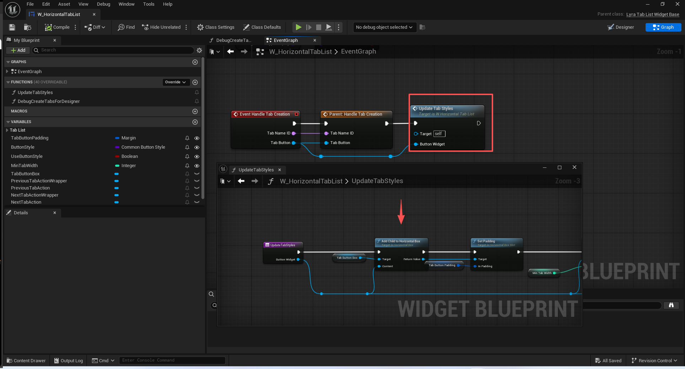
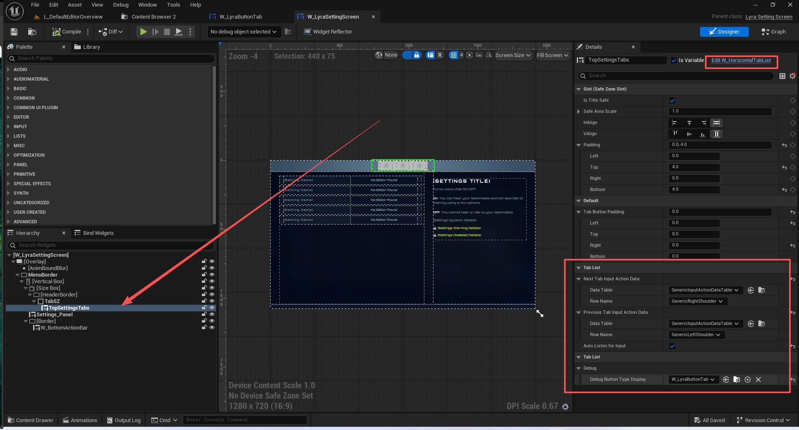
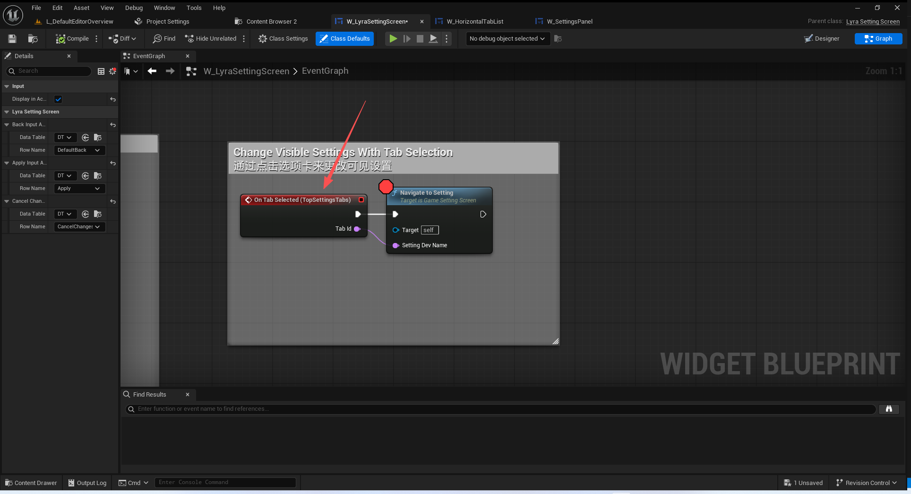

# Lyra学习指南_051_LyraTabListWidgetBase

本文章仅为小刚-B站课堂-虚幻引擎视频课程Lyra-精讲的演讲手稿.  
本套课程链接:[[UE5]虚幻引擎游戏案例Lyra精讲](https://www.bilibili.com/cheese/play/ss112001159)  
前置课程链接:[[UE5]虚幻引擎UEC++从基础到进阶](https://www.bilibili.com/cheese/play/ss28043)  

文章内容由小刚撰写,采用了以下多种方式:  
1.口述转文字  
2.AI重构  
3.参考引擎源码  
4.Lyra工程源码  
5.结合社区论坛各位大佬的解析  

- [Lyra学习指南\_051\_LyraTabListWidgetBase](#lyra学习指南_051_lyratablistwidgetbase)
	- [概述](#概述)
	- [描述器](#描述器)
	- [接口](#接口)
	- [Tab按钮](#tab按钮)
	- [TabList](#tablist)
		- [动态注册Tab](#动态注册tab)
		- [上下选中切换按钮](#上下选中切换按钮)
			- [绑定输入](#绑定输入)
			- [计算索引](#计算索引)
			- [真正选中](#真正选中)
	- [总结](#总结)


## 概述
本节主要讲解顶部栏W_HorizontalTabList的实现.
## 描述器
``` cpp
// Tab按钮的描述器
USTRUCT(BlueprintType)
struct FLyraTabDescriptor
{
	GENERATED_BODY()

public:
	FLyraTabDescriptor()
	: bHidden(false)
	, CreatedTabContentWidget(nullptr)
	{ }
	// 唯一性ID
	UPROPERTY(EditAnywhere, BlueprintReadOnly)
	FName TabId;

	// 显示的本地化文本
	UPROPERTY(EditAnywhere, BlueprintReadWrite)
	FText TabText;

	// 图标
	UPROPERTY(EditAnywhere, BlueprintReadWrite)
	FSlateBrush IconBrush;

	// 是否隐藏
	UPROPERTY(EditAnywhere, BlueprintReadOnly)
	bool bHidden;

	// 按钮的类类型
	UPROPERTY(EditAnywhere, BlueprintReadOnly)
	TSubclassOf<UCommonButtonBase> TabButtonType;

	//TODO NDarnell - This should become a TSoftClassPtr<>, the underlying common tab list needs to be able to handle lazy tab content construction.
	//待办事项：丹内尔 - 这应该变成一个 TSoftClassPtr<>() 类型的变量，底层通用的标签列表需要能够处理延迟的标签内容构建。
	UPROPERTY(EditAnywhere, BlueprintReadOnly)
	TSubclassOf<UCommonUserWidget> TabContentType;

	// 临时变量
	UPROPERTY(Transient)
	TObjectPtr<UWidget> CreatedTabContentWidget;
};

```
## 接口
``` cpp

UINTERFACE(BlueprintType)
class ULyraTabButtonInterface : public UInterface
{
	GENERATED_BODY()
};
// 接口用于给按钮子类根据描述器修改信息
class ILyraTabButtonInterface
{
	GENERATED_BODY()

public:
	UFUNCTION(BlueprintNativeEvent, Category = "Tab Button")
	void SetTabLabelInfo(const FLyraTabDescriptor& TabDescriptor);
};

```

## Tab按钮
``` cpp
UCLASS(MinimalAPI, Abstract, Blueprintable, meta = (DisableNativeTick))
class ULyraTabButtonBase : public ULyraButtonBase, public ILyraTabButtonInterface
{
	GENERATED_BODY()

public:

	UE_API void SetIconFromLazyObject(TSoftObjectPtr<UObject> LazyObject);
	UE_API void SetIconBrush(const FSlateBrush& Brush);

protected:

	UFUNCTION()
	UE_API virtual void SetTabLabelInfo_Implementation(const FLyraTabDescriptor& TabLabelInfo) override;

private:
	/**
	 * UCommonLazyImage
	 * 一种特殊的图像组件，能够显示未加载的图像，并且会自动处理加载过程！*
	 * UCommonLazyImage 是另一个针对 SLoadGuard 的封装类，但它仅负责图像的加载以及加载过程中显示的旋转指示器。*
	 * 如果此类别的内容改为显示任何文本，那么默认情况下它将采用 CoreStyle 样式。
	 * 
	 */
	UPROPERTY(meta = (BindWidgetOptional))
	TObjectPtr<UCommonLazyImage> LazyImage_Icon;
};


```

## TabList
只需要关心动态注册Tab流程即可.
预注册流程未使用.
Tab容器的切换未使用.

``` cpp
/** UCommonTabListWidgetBase 用于表示一组可选标签的基类，这些标签会相应地激活并显示关联切换器中的任意一个组件 */
/** Lyra用于表示一组可选标签的基类，这些标签会相应地激活并显示关联切换器中的任意一个组件 */
UCLASS(MinimalAPI, Blueprintable, BlueprintType, Abstract, meta = (DisableNativeTick))
class ULyraTabListWidgetBase : public UCommonTabListWidgetBase
{
	GENERATED_BODY()
	
public:
	// 获取已经预先注册的Tab描述器
	UFUNCTION(BlueprintCallable, BlueprintPure, Category = "Tab List")
	UE_API bool GetPreregisteredTabInfo(const FName TabNameId, FLyraTabDescriptor& OutTabInfo);

	/** Helper method to get at all the preregistered tab infos */
	/** 用于获取所有预先注册的标签信息的辅助方法 */
	const TArray<FLyraTabDescriptor>& GetAllPreregisteredTabInfos() { return PreregisteredTabInfoArray; }

	// Toggles whether or not a specified tab is hidden, can only be called before the switcher is associated
	// 控制指定标签是否被隐藏的功能，此操作仅能在切换器与界面关联之前执行。
	UFUNCTION(BlueprintCallable, Category = "Tab List")
	UE_API void SetTabHiddenState(FName TabNameId, bool bHidden);

	// 注册一个动态的标签 不是预激活的
	UFUNCTION(BlueprintCallable, Category = "Tab List")
	UE_API bool RegisterDynamicTab(const FLyraTabDescriptor& TabDescriptor);

	// 是不是首个激活 只比较了预激活的Tab
	UFUNCTION(BlueprintCallable, Category = "Tab List")
	UE_API bool IsFirstTabActive() const;

	// 是不是最后一个激活 只比较了预激活的Tab
	UFUNCTION(BlueprintCallable, Category = "Tab List")
	UE_API bool IsLastTabActive() const;

	// 指定的Tab是否可见
	UFUNCTION(BlueprintCallable, BlueprintPure, Category = "Tab List")
	UE_API bool IsTabVisible(FName TabId);

	// 有多少可见的Tab
	UFUNCTION(BlueprintCallable, BlueprintPure, Category = "Tab List")
	UE_API int32 GetVisibleTabCount();

	/** Delegate broadcast when a new tab is created. Allows hook ups after creation. */
	/** 用于在创建新标签页时进行广播的通知。允许在创建完成后进行连接操作。*/
	DECLARE_DYNAMIC_MULTICAST_DELEGATE_TwoParams(FOnTabContentCreated, FName, TabId, UCommonUserWidget*, TabWidget);
	DECLARE_EVENT_TwoParams(ULyraTabListWidgetBase, FOnTabContentCreatedNative, FName /* TabId */, UCommonUserWidget* /* TabWidget */);

	/** Broadcasts when a new tab is created. */
	/** 当创建新标签页时进行广播。*/
	UPROPERTY(BlueprintAssignable, Category = "Tab List")
	FOnTabContentCreated OnTabContentCreated;
	FOnTabContentCreatedNative OnTabContentCreatedNative;

protected:
	// UUserWidget interface
	// 无
	UE_API virtual void NativeOnInitialized() override;
	// 将预先注册的Tab实例化出来
	UE_API virtual void NativeConstruct() override;
	// 回收预先注册的Tab
	UE_API virtual void NativeDestruct() override;
	// End UUserWidget

	// 用于关联Tab的容器发生变化时进行切换 无作用
	UE_API virtual void HandlePreLinkedSwitcherChanged() override;
	UE_API virtual void HandlePostLinkedSwitcherChanged() override;

	// 在父类的RegisterDynamicTab中调用
	UE_API virtual void HandleTabCreation_Implementation(FName TabId, UCommonButtonBase* TabButton) override;

private:
	// 构建需要预先注册的Tab 本项目无 都是走的动态Tab
	UE_API void SetupTabs();

	// 预先注册好的的标签信息
	UPROPERTY(EditAnywhere, meta=(TitleProperty="TabId"))
	TArray<FLyraTabDescriptor> PreregisteredTabInfoArray;
	
	/**
	 * Stores label info for tabs that have been registered at runtime but not yet created. 
	 * Elements are removed once they are created.
	 */
	/**
	 * 为在运行时已注册但尚未创建的标签项存储标签信息。
	 * 创建完成后，相关元素将被移除。
	 * 
	 */
	UPROPERTY()
	TMap<FName, FLyraTabDescriptor> PendingTabLabelInfoMap;
};

```
### 动态注册Tab

``` cpp
bool ULyraTabListWidgetBase::RegisterDynamicTab(const FLyraTabDescriptor& TabDescriptor)
{
	// If it's hidden we just ignore it.
	// 如果它是隐藏状态，我们就直接忽略它。
	if (TabDescriptor.bHidden)
	{
		return true;
	}
	// 存一份等待注册的数据 等待创建后回调确认
	PendingTabLabelInfoMap.Add(TabDescriptor.TabId, TabDescriptor);

	/**
	 * 会将一个与给定的控件实例相对应的新标签添加到列表中。如果该标签不在关联的切换器中，则会添加进去。
	 * @参数 TabID 用于跟踪此标签的名称标识符。尝试在已存在的重复标识符下注册标签将会失败。
	 * @参数 ButtonWidgetType 为该标签创建的控件类型
	 * @参数 ContentWidget 与注册的标签关联的控件
	 * @参数 TabIndex 决定将新标签插入到标签列表中的位置（-1 表示将标签添加到列表的末尾）
	 * @返回 如果新标签注册成功且不存在名称标识符冲突，则返回 True
	 * 
	 */
	return RegisterTab(TabDescriptor.TabId, TabDescriptor.TabButtonType, TabDescriptor.CreatedTabContentWidget);
}


```
注册完毕后回调:
``` cpp

bool UCommonTabListWidgetBase::RegisterTab(FName TabNameID, TSubclassOf<UCommonButtonBase> ButtonWidgetType, UWidget* ContentWidget, const int32 TabIndex /*= INDEX_NONE*/)
{
	// ...


	TabButtonGroup->AddWidget(NewTabButton);
	HandleTabCreation(TabNameID, NewTabInfo.TabButton);
	
	OnTabButtonCreation.Broadcast(TabNameID, NewTabInfo.TabButton);
	
	// ....
}

```
重设一下样式参数
``` cpp
void ULyraTabListWidgetBase::HandleTabCreation_Implementation(FName TabId, UCommonButtonBase* TabButton)
{
	FLyraTabDescriptor* TabInfoPtr = nullptr;
	
	FLyraTabDescriptor TabInfo;

	// 看看是不是预先注册里面的
	if (GetPreregisteredTabInfo(TabId, TabInfo))
	{
		TabInfoPtr = &TabInfo;
	}
	else
	{
		TabInfoPtr = PendingTabLabelInfoMap.Find(TabId);
	}
	
	if (TabButton->GetClass()->ImplementsInterface(ULyraTabButtonInterface::StaticClass()))
	{
		if (ensureMsgf(TabInfoPtr, TEXT("A tab button was created with id %s but no label info was specified. RegisterDynamicTab should be used over RegisterTab to provide label info."), *TabId.ToString()))
		{
			ILyraTabButtonInterface::Execute_SetTabLabelInfo(TabButton, *TabInfoPtr);
		}
	}

	PendingTabLabelInfoMap.Remove(TabId);
}

```
添加到蓝图容器中

### 上下选中切换按钮
#### 绑定输入
蓝图逻辑略

父类绑定执行逻辑
``` cpp
void UCommonTabListWidgetBase::NativeConstruct()
{
	Super::NativeConstruct();
	
	if (bAutoListenForInput)
	{
		SetListeningForInput(true);
	}
}

```
``` cpp
void UCommonTabListWidgetBase::SetListeningForInput(bool bShouldListen)
{
	if (bShouldListen && !TabButtonGroup)
	{
		// If there's no tab button group, it means we haven't been constructed and we shouldn't listen to anything
		return;
	}

	if (GetUISubsystem() == nullptr)
	{
		// Shutting down
		return;
	}

	if (bShouldListen != bIsListeningForInput)
	{
		bIsListeningForInput = bShouldListen;
		UpdateBindings();
	}
}

```

``` cpp
void UCommonTabListWidgetBase::UpdateBindings()
{
	// New input system binding flow
	if (bIsListeningForInput)
	{
		bool bIsEnhancedInputSupportEnabled = CommonUI::IsEnhancedInputSupportEnabled();
		if (bIsEnhancedInputSupportEnabled && NextTabEnhancedInputAction)
		{
			NextTabActionHandle = RegisterUIActionBinding(FBindUIActionArgs(NextTabEnhancedInputAction, false, FSimpleDelegate::CreateUObject(this, &UCommonTabListWidgetBase::HandleNextTabAction)));
		}
		else
		{
			NextTabActionHandle = RegisterUIActionBinding(FBindUIActionArgs(NextTabInputActionData, false, FSimpleDelegate::CreateUObject(this, &UCommonTabListWidgetBase::HandleNextTabAction)));
		}

		if (bIsEnhancedInputSupportEnabled && PreviousTabEnhancedInputAction)
		{
			PrevTabActionHandle = RegisterUIActionBinding(FBindUIActionArgs(PreviousTabEnhancedInputAction, false, FSimpleDelegate::CreateUObject(this, &UCommonTabListWidgetBase::HandlePreviousTabAction)));
		}
		else
		{
			PrevTabActionHandle = RegisterUIActionBinding(FBindUIActionArgs(PreviousTabInputActionData, false, FSimpleDelegate::CreateUObject(this, &UCommonTabListWidgetBase::HandlePreviousTabAction)));
		}
	}
	else
	{
		NextTabActionHandle.Unregister();
		PrevTabActionHandle.Unregister();
	}
}

```
#### 计算索引
``` cpp
void UCommonTabListWidgetBase::HandleNextTabAction()
{
	if (ensure(TabButtonGroup))
	{
		TabButtonGroup->SelectNextButton(bShouldWrapNavigation);
	}
}


void UCommonTabListWidgetBase::HandlePreviousTabAction()
{
	if (ensure(TabButtonGroup))
	{
		TabButtonGroup->SelectPreviousButton(bShouldWrapNavigation);
	}
}
```
``` cpp
void UCommonButtonGroupBase::SelectNextButton(bool bAllowWrap /*= true*/)
{
	const int32 NumButtons = Buttons.Num();
	int32 NumRecursiveSelections = 0;

	std::function<void(int32, bool)> SelectNextButtonRecursive = [&](int32 SelectionIndex, bool bAllowWrap)
	{
		// We have recursively gone through every button in the group. Stop.
		if (NumRecursiveSelections > NumButtons)
		{
			return;
		}

		if (SelectionIndex < (NumButtons - 1))
		{
			++SelectionIndex;
		}
		else if (bAllowWrap)
		{
			SelectionIndex = 0;
		}
		else
		{
			// We are at the last button and aren't wrapping, so there isn't a next button. Stop.
			return;
		}

		if (Buttons.IsValidIndex(SelectionIndex))
		{
			UCommonButtonBase* NextButton = GetButtonBaseAtIndex(SelectionIndex);
			if (NextButton && NextButton->IsInteractionEnabled())
			{
				SelectButtonAtIndex(SelectionIndex);
			}
			else
			{
				NumRecursiveSelections++;
				SelectNextButtonRecursive(SelectionIndex, bAllowWrap);
			}
		}
	};

	SelectNextButtonRecursive(SelectedButtonIndex, bAllowWrap);
}


```

``` cpp

void UCommonButtonGroupBase::SelectPreviousButton(bool bAllowWrap /*= true*/)
{
	const int32 NumButtons = Buttons.Num();
	int32 NumRecursiveSelections = 0;

	std::function<void(int32, bool)> SelectPrevButtonRecursive = [&](int32 SelectionIndex, bool bAllowWrap)
	{
		// We have recursively gone through every button in the group. Stop.
		if (NumRecursiveSelections > NumButtons)
		{
			return;
		}

		if (SelectionIndex > 0)
		{
			--SelectionIndex;
		}
		else if (bAllowWrap)
		{
			SelectionIndex = NumButtons - 1;
		}
		else
		{
			// We are at the last button and aren't wrapping, so there isn't a next button. Stop.
			return;
		}

		if (Buttons.IsValidIndex(SelectionIndex))
		{
			UCommonButtonBase* PrevButton = GetButtonBaseAtIndex(SelectionIndex);
			if (PrevButton && PrevButton->IsInteractionEnabled())
			{
				SelectButtonAtIndex(SelectionIndex);
			}
			else
			{
				NumRecursiveSelections++;
				SelectPrevButtonRecursive(SelectionIndex, bAllowWrap);
			}
		}
	};

	SelectPrevButtonRecursive(SelectedButtonIndex, bAllowWrap);
}

```
#### 真正选中
``` cpp
void UCommonButtonGroupBase::SelectButtonAtIndex(int32 ButtonIndex, const bool bAllowSound)
{
	if (ButtonIndex < 0 || ButtonIndex >= Buttons.Num())
	{
		DeselectAll();
	}
	else if (ButtonIndex != SelectedButtonIndex)
	{
		UCommonButtonBase* ButtonToSelect = GetButtonBaseAtIndex(ButtonIndex);
		if (ButtonToSelect && !ButtonToSelect->GetSelected() && ButtonToSelect->GetIsEnabled())
		{
			SelectedButtonIndex = ButtonIndex;
			ButtonToSelect->SetSelectedInternal(true, bAllowSound);
		}
	}
}

```
``` cpp

void UCommonButtonBase::SetSelectedInternal(bool bInSelected, bool bAllowSound /*= true*/, bool bBroadcast /*= true*/)
{
	bool bValueChanged = bInSelected != bSelected;

	bSelected = bInSelected;

	SetButtonStyle();

	if (bSelected)
	{
		NativeOnSelected(bBroadcast);
		if (!bToggleable && IsInteractable())
		{
			// If the button isn't toggleable, then disable interaction with the root button while selected
			// The prevents us getting unnecessary click noises and events
			if (RootButton.IsValid())
			{
				RootButton->SetInteractionEnabled(bInteractableWhenSelected);
			}
		}

		if (bAllowSound)
		{
			// Selection was not triggered by a button click, so play the click sound
			FSlateApplication::Get().PlaySound(NormalStyle.PressedSlateSound);
		}
	}
	else
	{
		// Once deselected, restore the root button interactivity to the desired state
		if (RootButton.IsValid())
		{
			RootButton->SetInteractionEnabled(bInteractionEnabled);
		}

		NativeOnDeselected(bBroadcast);
	}

	UpdateInputActionWidgetVisibility();

	if (bValueChanged)
	{
		BroadcastBinaryPostStateChange(UWidgetSelectedStateRegistration::Bit, bSelected);
	}
}

```

``` cpp
void UCommonButtonBase::NativeOnSelected(bool bBroadcast)
{
	BP_OnSelected();

	if (bBroadcast)
	{
		OnIsSelectedChanged().Broadcast(true);
		OnSelectedChangedBase.Broadcast(this, true);
		OnButtonBaseSelected.Broadcast(this);
	}
	NativeOnCurrentTextStyleChanged();
}


```
最终触发蓝图导航!

## 总结
本节我们将顶部栏的几个控件都介绍完毕了.接下来就是SettingDetail和游戏设置注册器了!
