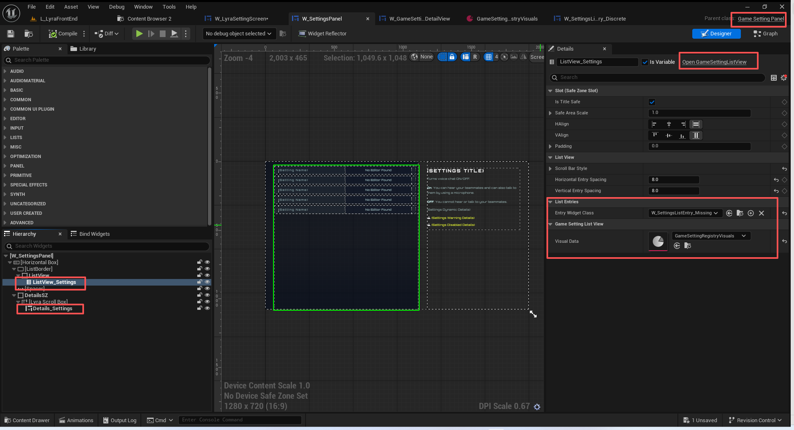
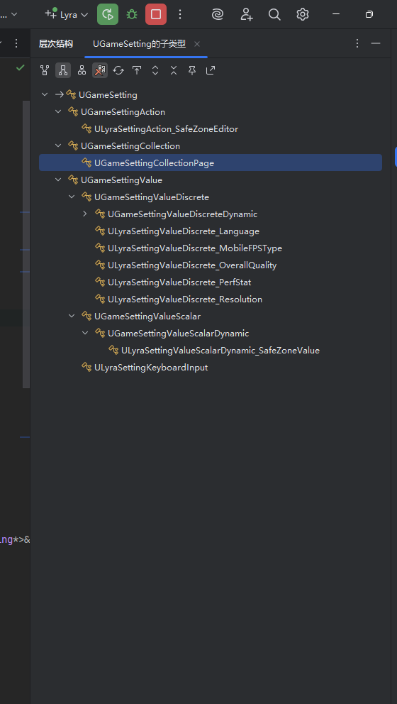

# UE5_Lyra学习指南_052_GameSettingPanel

本文章仅为小刚-B站课堂-虚幻引擎视频课程Lyra-精讲的演讲手稿.  
本套课程链接:[[UE5]虚幻引擎游戏案例Lyra精讲](https://www.bilibili.com/cheese/play/ss112001159)  
前置课程链接:[[UE5]虚幻引擎UEC++从基础到进阶](https://www.bilibili.com/cheese/play/ss28043)  

文章内容由小刚撰写,采用了以下多种方式:  
1.口述转文字  
2.AI重构  
3.参考引擎源码  
4.Lyra工程源码  
5.结合社区论坛各位大佬的解析  

- [UE5\_Lyra学习指南\_052\_GameSettingPanel](#ue5_lyra学习指南_052_gamesettingpanel)
	- [概述](#概述)
	- [GameSettingPanel](#gamesettingpanel)
	- [外部导航](#外部导航)
	- [悬停时更新细节面板](#悬停时更新细节面板)
	- [游戏设置注册器的事件](#游戏设置注册器的事件)
		- [绑定位置](#绑定位置)
		- [某项游戏设置编辑条件发生了变化](#某项游戏设置编辑条件发生了变化)
		- [安全区的命名操作行动](#安全区的命名操作行动)
		- [导航事件](#导航事件)
	- [过滤器的应用](#过滤器的应用)
	- [总结](#总结)


## 概述
GameSettingPanel主要以下功能:
1.容纳游戏设置的列表条目
2.容纳游戏设置的细节面板
3.用来中转游戏设置的三种事件(导航,命名操作,编辑条件发生变化)

注意区分游戏设置其实有三个子类,游戏操作,游戏设置集合和一般的游戏设置值.
UGameSettingAction,UGameSettingCollection,UGameSettingValue

我们不在这节介绍游戏设置及游戏设置注册器!
## GameSettingPanel
``` cpp

// 设置的具体面板
UCLASS(MinimalAPI, Abstract)
class UGameSettingPanel : public UCommonUserWidget
{
	GENERATED_BODY()

public:
	// 构造函数 设置可以被聚焦
	UE_API UGameSettingPanel();

	// 绑定监听的设置条目发生变化
	UE_API virtual void NativeOnInitialized() override;

	// 注册监听游戏设置注册器的三种类型事件
	UE_API virtual void NativeConstruct() override;

	// 停用监听游戏设置注册器的三种类型事件
	UE_API virtual void NativeDestruct() override;

	// Focus transitioning to subwidgets for the gamepad
	// 转向游戏手柄的子组件进行重点展示
	UE_API virtual FReply NativeOnFocusReceived(const FGeometry& InGeometry, const FFocusEvent& InFocusEvent) override;

	/**  设置游戏注册器 并注册其对应的事件 并刷新游戏设置的面板细节 */
	UE_API void SetRegistry(UGameSettingRegistry* InRegistry);

	/** Sets the filter for this panel, restricting which settings are available currently. */
	/** 为该面板设置筛选条件，以限制当前可使用的设置范围。*/
	UE_API void SetFilterState(const FGameSettingFilterState& InFilterState, bool bClearNavigationStack = true);

	/** Gets the currently visible and available settings based on the filter state. */
	/** 根据过滤状态获取当前可见且可用的设置。*/
	TArray<UGameSetting*> GetVisibleSettings() const { return VisibleSettings; }

	/** Can we pop the current navigation stack */
	/** 我们能否弹出当前的导航栈？ */
	UE_API bool CanPopNavigationStack() const;

	/** Pop the navigation stack */
	/** 弹出导航栈 */
	UE_API void PopNavigationStack();

	/**
	 * Gets the set of settings that are potentially available on this screen.
	 * MAY CONTAIN INVISIBLE SETTINGS.
	 * DOES NOT INCLUDED NESTED PAGES.
	 *
	 * 获取此屏幕上可能存在的设置列表。
	 * 可能包含不可见的设置。
	 * 不包含嵌套页面。
	 */
	UE_API TArray<UGameSetting*> GetSettingsWeCanResetToDefault() const;

	// 选中某项
	UE_API void SelectSetting(const FName& SettingDevName);
	// 获取当前选中的游戏设置
	UE_API UGameSetting* GetSelectedSetting() const;

	// 刷新设置列表
	UE_API void RefreshSettingsList();

	// 聚焦的设置项目发生改变后触发的代理
	FOnFocusedSettingChanged OnFocusedSettingChanged;

protected:
	// 注册 游戏注册器的事件
	UE_API void RegisterRegistryEvents();
	// 停用 游戏注册器的事件
	UE_API void UnregisterRegistryEvents();

	// 悬停时 更新细节面板
	UE_API void HandleSettingItemHoveredChanged(UObject* Item, bool bHovered);
	// 选中时 更新细节面板
	UE_API void HandleSettingItemSelectionChanged(UObject* Item);
	// 填充细节面板
	UE_API void FillSettingDetails(UGameSetting* InSetting);

	// 处理游戏设置注册器的操作事件
	UE_API void HandleSettingNamedAction(UGameSetting* Setting, FGameplayTag GameSettings_Action_Tag);
	// 处理游戏设置注册器的导航事件
	UE_API void HandleSettingNavigation(UGameSetting* Setting);
	// 处理游戏设置注册器的编辑检索条件发生变化的事件
	UE_API void HandleSettingEditConditionsChanged(UGameSetting* Setting);

private:

	// 对应的游戏设置注册器
	UPROPERTY(Transient)
	TObjectPtr<UGameSettingRegistry> Registry;

	// 当前可见的游戏设置
	UPROPERTY(Transient)
	TArray<TObjectPtr<UGameSetting>> VisibleSettings;

	// 上次悬停或选中的游戏设置
	UPROPERTY(Transient)
	TObjectPtr<UGameSetting> LastHoveredOrSelectedSetting;

	// 过滤器
	UPROPERTY(Transient)
	FGameSettingFilterState FilterState;

	// 导航的栈
	UPROPERTY(Transient)
	TArray<FGameSettingFilterState> FilterNavigationStack;

	// 在刷新之后需要进行选中的游戏设置项的名称
	FName DesiredSelectionPostRefresh;

	// 在刷新之后是否需要调整选中的游戏设置项
	bool bAdjustListViewPostRefresh = true;

private:
	// Bound Widgets
	// 固定的组件
	// 设置的条目容器
	UPROPERTY(BlueprintReadOnly, meta = (BindWidget, BlueprintProtected = true, AllowPrivateAccess = true))
	TObjectPtr<UGameSettingListView> ListView_Settings;

	// 具体的设置细节
	UPROPERTY(BlueprintReadOnly, meta = (BindWidgetOptional, BlueprintProtected = true, AllowPrivateAccess = true))
	TObjectPtr<UGameSettingDetailView> Details_Settings;

private:
	// 命名设置操作以执行特殊操作
	DECLARE_DYNAMIC_MULTICAST_DELEGATE_TwoParams(FOnExecuteNamedActionBP, UGameSetting*, Setting, FGameplayTag, Action);
	UPROPERTY(BlueprintAssignable, Category = Events, meta = (DisplayName = "On Execute Named Action"))
	FOnExecuteNamedActionBP BP_OnExecuteNamedAction;

private:
	// 用于刷新设置条目的句柄
	FTSTicker::FDelegateHandle RefreshHandle;
};

```

## 外部导航
``` cpp
	/** Sets the filter for this panel, restricting which settings are available currently. */
	/** 为该面板设置筛选条件，以限制当前可使用的设置范围。*/
	// 其实就是外部Screend导航过来的入口
	UE_API void SetFilterState(const FGameSettingFilterState& InFilterState, bool bClearNavigationStack = true);
```
``` cpp
void UGameSettingPanel::SetFilterState(const FGameSettingFilterState& InFilterState, bool bClearNavigationStack)
{
	FilterState = InFilterState;

	if (bClearNavigationStack)
	{
		FilterNavigationStack.Reset();
	}

	RefreshSettingsList();
}

```
交给ListView_Settings去实现即可!
``` cpp

void UGameSettingPanel::RefreshSettingsList()
{
	// 如果当前有刷新的句柄 则不应当重入
	if (RefreshHandle.IsValid())
	{
		return;
	}

	RefreshHandle = FTSTicker::GetCoreTicker().AddTicker(FTickerDelegate::CreateWeakLambda(this, [this](float DeltaTime)
	{
		QUICK_SCOPE_CYCLE_COUNTER(STAT_UGameSettingPanel_RefreshSettingsList);

		if (Registry->IsFinishedInitializing())
		{
			VisibleSettings.Reset();
			Registry->GetSettingsForFilter(FilterState, MutableView(VisibleSettings));

			// 这里填充了我们需要显示的游戏设置项
			ListView_Settings->SetListItems(VisibleSettings);

			RefreshHandle.Reset();

			int32 IndexToSelect = 0;
			if (DesiredSelectionPostRefresh != NAME_None)
			{
				for (int32 SettingIdx = 0; SettingIdx < VisibleSettings.Num(); ++SettingIdx)
				{
					UGameSetting* Setting = VisibleSettings[SettingIdx];
					if (Setting->GetDevName() == DesiredSelectionPostRefresh)
					{
						IndexToSelect = SettingIdx;
						break;
					}
				}
				DesiredSelectionPostRefresh = NAME_None;
			}

			// If the list directly has the focus, instead of a child widget, then it's likely the panel and items
			// were not yet available when we received focus, so lets go ahead and focus the first item now.
			// 如果列表本身直接获得了焦点（而非某个子控件），那么很可能在我们获得焦点时，面板和其中的项目尚未准备好，所以现在就让我们先将第一个项目设为焦点吧。
			
			//if (HasUserFocus(GetOwningPlayer()))
			if (bAdjustListViewPostRefresh)
			{
				ListView_Settings->NavigateToIndex(IndexToSelect);
				ListView_Settings->SetSelectedIndex(IndexToSelect);
			}

			bAdjustListViewPostRefresh = true;

			// finally, refresh the editable state, but only once.
			// 最后，刷新可编辑状态，但仅执行一次。
			for (int32 SettingIdx = 0; SettingIdx < VisibleSettings.Num(); ++SettingIdx)
			{
				if (UGameSetting* Setting = VisibleSettings[SettingIdx])
				{
					Setting->RefreshEditableState(false);
				}
			}			

			return false;
		}

		return true;
	}));
}
```

## 悬停时更新细节面板
``` cpp
void UGameSettingPanel::NativeOnInitialized()
{
	Super::NativeOnInitialized();

	// 在这里触发UMG悬停改变
	ListView_Settings->OnItemIsHoveredChanged().AddUObject(this, &ThisClass::HandleSettingItemHoveredChanged);
	ListView_Settings->OnItemSelectionChanged().AddUObject(this, &ThisClass::HandleSettingItemSelectionChanged);
}

```

``` cpp
void UGameSettingPanel::HandleSettingItemHoveredChanged(UObject* Item, bool bHovered)
{
	UGameSetting* Setting = bHovered ? Cast<UGameSetting>(Item) : ToRawPtr(LastHoveredOrSelectedSetting);
	if (bHovered && Setting)
	{
		LastHoveredOrSelectedSetting = Setting;
	}

	FillSettingDetails(Setting);
}

void UGameSettingPanel::HandleSettingItemSelectionChanged(UObject* Item)
{
	UGameSetting* Setting = Cast<UGameSetting>(Item);
	if (Setting)
	{
		LastHoveredOrSelectedSetting = Setting;
	}
	// 刷新细节面板 通过监听设置列表的变化随之变化!
	FillSettingDetails(Cast<UGameSetting>(Item));
}

```
交给细节面板去实现即可!
``` cpp
void UGameSettingPanel::FillSettingDetails(UGameSetting* InSetting)
{
	if (Details_Settings)
	{
		Details_Settings->FillSettingDetails(InSetting);
	}

	OnFocusedSettingChanged.Broadcast(InSetting);
}

```
## 游戏设置注册器的事件
### 绑定位置
``` cpp
UGameSettingRegistry* UGameSettingScreen::GetOrCreateRegistry()
{
	if (Registry == nullptr)
	{
		// 这里是交由子类去实现创建游戏设置注册器GameSettingRegistry
		UGameSettingRegistry* NewRegistry = this->CreateRegistry();
		// 有设置变化的代理回调绑定
		NewRegistry->OnSettingChangedEvent.AddUObject(this, &ThisClass::HandleSettingChanged);

		// 让显示具体设置的面板匹配游戏设置注册器
		Settings_Panel->SetRegistry(NewRegistry);

		// 持有游戏设置注册器 避免GC
		Registry = NewRegistry;
	}

	return Registry;
}

```
``` cpp
void UGameSettingPanel::SetRegistry(UGameSettingRegistry* InRegistry)
{
	if (Registry != InRegistry)
	{
		UnregisterRegistryEvents();

		if (RefreshHandle.IsValid())
		{
			FTSTicker::GetCoreTicker().RemoveTicker(RefreshHandle);
		}

		Registry = InRegistry;

		RegisterRegistryEvents();

		RefreshSettingsList();
	}
}

```
``` cpp
void UGameSettingPanel::RegisterRegistryEvents()
{
	if (Registry)
	{
		Registry->OnSettingEditConditionChangedEvent.AddUObject(this, &ThisClass::HandleSettingEditConditionsChanged);
		Registry->OnSettingNamedActionEvent.AddUObject(this, &ThisClass::HandleSettingNamedAction);
		Registry->OnExecuteNavigationEvent.AddUObject(this, &ThisClass::HandleSettingNavigation);
	}
}
```
### 某项游戏设置编辑条件发生了变化
``` cpp
void UGameSettingPanel::HandleSettingEditConditionsChanged(UGameSetting* Setting)
{
	const bool bWasSettingVisible = VisibleSettings.Contains(Setting);
	const bool bIsSettingVisible = Setting->GetEditState().IsVisible();

	if (bIsSettingVisible != bWasSettingVisible)
	{
		bAdjustListViewPostRefresh = Setting->GetAdjustListViewPostRefresh();
		RefreshSettingsList();
	}
}
```
### 安全区的命名操作行动
这里时触发的蓝图逻辑.先不讲.
``` cpp
void UGameSettingPanel::HandleSettingNamedAction(UGameSetting* Setting, FGameplayTag GameSettings_Action_Tag)
{
	BP_OnExecuteNamedAction.Broadcast(Setting, GameSettings_Action_Tag);
}
```

### 导航事件
实际上就是创建一个新的过滤器去过滤即可!
FGameSettingFilterState过滤器不在这里讲解.
``` cpp
void UGameSettingPanel::HandleSettingNavigation(UGameSetting* Setting)
{
	if (VisibleSettings.Contains(Setting))
	{
		FilterNavigationStack.Push(FilterState);

		// 新创建一个过滤的条件
		FGameSettingFilterState NewPageFilterState;
		NewPageFilterState.AddSettingToRootList(Setting);
		SetFilterState(NewPageFilterState, false);
	}
}

```

## 过滤器的应用
晚一点再讲.
``` cpp
TArray<UGameSetting*> UGameSettingPanel::GetSettingsWeCanResetToDefault() const
{
	TArray<UGameSetting*> AvailableSettings;

	if (ensure(Registry->IsFinishedInitializing()))
	{
		// We want to get all available settings on this "screen" so we include the same allowlist, but ignore
		// 我们希望获取此“屏幕”上的所有可用设置，因此我们采用了相同的允许列表，但会忽略某些项。
		FGameSettingFilterState AllAvailableFilter = FilterState;
		AllAvailableFilter.bIncludeDisabled = true;
		AllAvailableFilter.bIncludeHidden = true;
		AllAvailableFilter.bIncludeResetable = false;
		AllAvailableFilter.bIncludeNestedPages = false;

		Registry->GetSettingsForFilter(AllAvailableFilter, AvailableSettings);
	}

	return AvailableSettings;
}

```
``` cpp
void UGameSettingRegistry::GetSettingsForFilter(const FGameSettingFilterState& FilterState, TArray<UGameSetting*>& InOutSettings)
{
	// 准备好要过滤游戏设置
	TArray<UGameSetting*> RootSettings;

	// 如果游戏设置过滤状态中有根设置的话 就使用它的
	if (FilterState.GetSettingRootList().Num() > 0)
	{
		RootSettings.Append(FilterState.GetSettingRootList());
	}
	else
	{
		// 过滤器中没有的话,就使用我们自身的顶级设置
		RootSettings.Append(TopLevelSettings);
	}

	// 遍历根设置
	for (UGameSetting* TopLevelSetting : RootSettings)
	{
		// 是否可以转换城游戏设置的集合
		if (const UGameSettingCollection* TopLevelCollection = Cast<UGameSettingCollection>(TopLevelSetting))
		{
			// 如果是集合的话 则调用集合的处理方式
			TopLevelCollection->GetSettingsForFilter(FilterState, InOutSettings);
		}
		else
		{
			// 如果不是集合 则直接判定是否可以通过过滤
			if (FilterState.DoesSettingPassFilter(*TopLevelSetting))
			{
				InOutSettings.Add(TopLevelSetting);
			}
		}
	}
}

```


## 总结
本节简单介绍了GameSettingPanel,它的作用实际上也是转发指令到游戏设置的条目列表和细节面板.