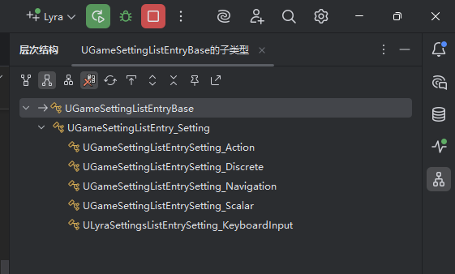
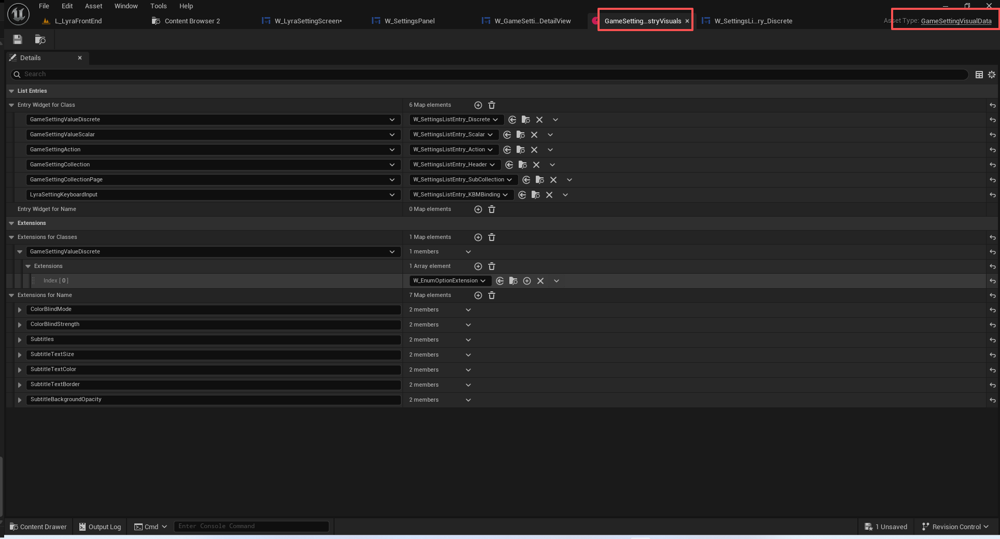

# UE5_Lyra学习指南_053_GameSettingListView

本文章仅为小刚-B站课堂-虚幻引擎视频课程Lyra-精讲的演讲手稿.  
本套课程链接:[[UE5]虚幻引擎游戏案例Lyra精讲](https://www.bilibili.com/cheese/play/ss112001159)  
前置课程链接:[[UE5]虚幻引擎UEC++从基础到进阶](https://www.bilibili.com/cheese/play/ss28043)  

文章内容由小刚撰写,采用了以下多种方式:  
1.口述转文字  
2.AI重构  
3.参考引擎源码  
4.Lyra工程源码  
5.结合社区论坛各位大佬的解析  

- [UE5\_Lyra学习指南\_053\_GameSettingListView](#ue5_lyra学习指南_053_gamesettinglistview)
	- [概述](#概述)
	- [代码](#代码)
		- [GameSettingListView](#gamesettinglistview)
			- [GameSettingListEntryBase](#gamesettinglistentrybase)
		- [GameSettingListEntry\_Setting](#gamesettinglistentry_setting)
		- [其余子项](#其余子项)
	- [VisualData](#visualdata)
	- [重写设置控件类](#重写设置控件类)
	- [总结](#总结)


## 概述
本节主要讲解容纳游戏设置项的容器以及其中的条目.核心就是根据配置的控件资产列表去实例化不同的控件.
## 代码

### GameSettingListView
由外部设置数据调用
``` cpp
void UGameSettingPanel::RefreshSettingsList()
{
	// ...
		// 这里填充了我们需要显示的游戏设置项
		ListView_Settings->SetListItems(VisibleSettings);
	// ...
}

```
``` cpp

/**
 * List of game settings.  Every entry widget needs to extend from GameSettingListEntryBase.
 * 游戏设置列表。每个条目控件都需要继承自 GameSettingListEntryBase 类。
 */
UCLASS(MinimalAPI, meta = (EntryClass = GameSettingListEntryBase))
class UGameSettingListView : public UListView
{
	GENERATED_BODY()

public:
	// 构造函数 无
	UE_API UGameSettingListView(const FObjectInitializer& ObjectInitializer);

	// 添加用于游戏设置的名称重写
	UE_API void AddNameOverride(const FName& DevName, const FText& OverrideName);

#if WITH_EDITOR
	// 编辑器接口 确保对应的控件资产必须要有!
	UE_API virtual void ValidateCompiledDefaults(IWidgetCompilerLog& InCompileLog) const override;
#endif

protected:
	UE_API virtual UUserWidget& OnGenerateEntryWidgetInternal(UObject* Item, TSubclassOf<UUserWidget> DesiredEntryClass, const TSharedRef<STableViewBase>& OwnerTable) override;

	UE_API virtual bool OnIsSelectableOrNavigableInternal(UObject* SelectedItem) override;

protected:
	// 指定的设置对应的控件类型数据!!!! 极其重要
	UPROPERTY(EditAnywhere)
	TObjectPtr<UGameSettingVisualData> VisualData;

private:
	TMap<FName, FText> NameOverrides;
};


```
#### GameSettingListEntryBase
``` cpp

// 游戏设置项的父类 必须用这个!
UCLASS(MinimalAPI, Abstract, NotBlueprintable, meta = (Category = "Settings", DisableNativeTick))
class UGameSettingListEntryBase : public UCommonUserWidget, public IUserObjectListEntry
{
	GENERATED_BODY()

public:
	// 设置对应的游戏设置 并绑定其变化的回调
	UE_API virtual void SetSetting(UGameSetting* InSetting);
	// 重写显示的名称
	UE_API virtual void SetDisplayNameOverride(const FText& OverrideName);

protected:
	// 当这个控件被释放的时触发 回收资源
	UE_API virtual void NativeOnEntryReleased() override;
	// 交由子类进行拓展!当设置变动时触发,需要关闭 暂停更新
	UE_API virtual void OnSettingChanged();
	// 绑定在游戏设置编辑条件变动时的回调事件
	UE_API virtual void HandleEditConditionChanged(UGameSetting* InSetting);
	// 刷新编辑状态 交由子类拓展 由编辑条件变动时触发
	UE_API virtual void RefreshEditableState(const FGameSettingEditableState& InEditableState);
	
protected:
	// Focus transitioning to subwidgets for the gamepad
	// 聚焦切换至游戏手柄的子组件
	UE_API virtual FReply NativeOnFocusReceived(const FGeometry& InGeometry, const FFocusEvent& InFocusEvent) override;

	// 交由蓝图拓展 获取手柄主要聚焦的控件
	UFUNCTION(BlueprintImplementableEvent)
	UE_API UWidget* GetPrimaryGamepadFocusWidget();

protected:
	// 是否暂停更新
	bool bSuspendChangeUpdates = false;

	// 对应的游戏设置
	UPROPERTY()
	TObjectPtr<UGameSetting> Setting;

	// 用于显示的本地化名称
	FText DisplayNameOverride = FText::GetEmpty();

private:
	// 绑定在游戏设置变动时的回调事件
	void HandleSettingChanged(UGameSetting* InSetting, EGameSettingChangeReason Reason);

	// 可选的背景控件 
	UPROPERTY(BlueprintReadOnly, meta = (BindWidgetOptional, BlueprintProtected = true, AllowPrivateAccess = true))
	TObjectPtr<UUserWidget> Background;
};


```

### GameSettingListEntry_Setting
``` cpp
//////////////////////////////////////////////////////////////////////////
// UGameSettingListEntry_Setting
//////////////////////////////////////////////////////////////////////////

UCLASS(MinimalAPI, Abstract, Blueprintable, meta = (Category = "Settings", DisableNativeTick))
class UGameSettingListEntry_Setting : public UGameSettingListEntryBase
{
	GENERATED_BODY()

public:
	UE_API virtual void SetSetting(UGameSetting* InSetting) override;
	
private:	// Bound Widgets
	UPROPERTY(BlueprintReadOnly, meta = (BindWidget, BlueprintProtected = true, AllowPrivateAccess = true))
	TObjectPtr<UCommonTextBlock> Text_SettingName;
};


```

### 其余子项
后续使用到,边使用边讲解

## VisualData
容器需要根据这个资产来寻找对应的控件蓝图类

``` cpp

/**
 * 用来映射不同游戏设置选项对应的实例化控件类型
 * 极其重要!!!
 */
UCLASS(MinimalAPI, BlueprintType)
class UGameSettingVisualData : public UDataAsset
{
	GENERATED_BODY()

public:
	UE_API TSubclassOf<UGameSettingListEntryBase> GetEntryForSetting(UGameSetting* InSetting);

	UE_API virtual TArray<TSoftClassPtr<UGameSettingDetailExtension>> GatherDetailExtensions(UGameSetting* InSetting);
	
protected:
	// 无
	UE_API virtual TSubclassOf<UGameSettingListEntryBase> GetCustomEntryForSetting(UGameSetting* InSetting);

protected:
	// 针对某一类型的游戏设置使用该控件类型进行实例化 一般用这个
	UPROPERTY(EditDefaultsOnly, Category = ListEntries, meta = (AllowAbstract))
	TMap<TSubclassOf<UGameSetting>, TSubclassOf<UGameSettingListEntryBase>> EntryWidgetForClass;
	// 针对某一个游戏设置使用该控件类型进行实例化 一般用不到
	UPROPERTY(EditDefaultsOnly, Category = ListEntries, meta = (AllowAbstract))
	TMap<FName, TSubclassOf<UGameSettingListEntryBase>> EntryWidgetForName;

	UPROPERTY(EditDefaultsOnly, Category = Extensions, meta = (AllowAbstract))
	TMap<TSubclassOf<UGameSetting>, FGameSettingClassExtensions> ExtensionsForClasses;

	UPROPERTY(EditDefaultsOnly, Category = Extensions)
	TMap<FName, FGameSettingNameExtensions> ExtensionsForName;
};

```
``` cpp
TSubclassOf<UGameSettingListEntryBase> UGameSettingVisualData::GetEntryForSetting(UGameSetting* InSetting)
{
	if (InSetting == nullptr)
	{
		return TSubclassOf<UGameSettingListEntryBase>();
	}

	// Check if there's a custom logic for finding this setting's visual element
	// 检查是否有关于查找此设置的视觉元素的自定义逻辑
	TSubclassOf<UGameSettingListEntryBase> CustomEntry = GetCustomEntryForSetting(InSetting);
	if (CustomEntry)
	{
		return CustomEntry;
	}

	// Check if there's a specific entry widget for a setting by name.  Hopefully this is super rare.
	// 检查是否存在一个以名称命名的特定设置项组件。希望这种情况极为罕见。
	{
		TSubclassOf<UGameSettingListEntryBase> EntryWidgetClassPtr = EntryWidgetForName.FindRef(InSetting->GetDevName());
		if (EntryWidgetClassPtr)
		{
			return EntryWidgetClassPtr;
		}
	}

	// Finally check to see if there's an entry for this setting following the classes we have entries for.
	// we use the super chain of the setting classes to find the most applicable entry widget for this class
	// of setting.
	// 最后，检查一下是否在我们已有的设置项类别之后存在与此设置相关的条目。
	// 我们利用设置类的超类链来找到适用于此设置类的最合适的条目控件。
	for (UClass* Class = InSetting->GetClass(); Class; Class = Class->GetSuperClass())
	{
		if (TSubclassOf<UGameSetting> SettingClass = TSubclassOf<UGameSetting>(Class))
		{
			TSubclassOf<UGameSettingListEntryBase> EntryWidgetClassPtr = EntryWidgetForClass.FindRef(SettingClass);
			if (EntryWidgetClassPtr)
			{
				return EntryWidgetClassPtr;
			}
		}
	}

	return TSubclassOf<UGameSettingListEntryBase>();
}

TArray<TSoftClassPtr<UGameSettingDetailExtension>> UGameSettingVisualData::GatherDetailExtensions(UGameSetting* InSetting)
{
	TArray<TSoftClassPtr<UGameSettingDetailExtension>> Extensions;

	// Find extensions by setting name
	// 按设置名称查找扩展程序
	FGameSettingNameExtensions* ExtensionsWithName = ExtensionsForName.Find(InSetting->GetDevName());
	if (ExtensionsWithName)
	{
		Extensions.Append(ExtensionsWithName->Extensions);
		// 如果不需要包含默认的拓展就直接返回
		if (!ExtensionsWithName->bIncludeClassDefaultExtensions)
		{
			return Extensions;
		}
	}

	// Find extensions for it using the super chain of the setting so that we get any
	// class based extensions for this setting.
	// 利用设置的超链来查找其相关扩展，以便获取与该设置相关的任何基于类的扩展。
	for (UClass* Class = InSetting->GetClass(); Class; Class = Class->GetSuperClass())
	{
		if (TSubclassOf<UGameSetting> SettingClass = TSubclassOf<UGameSetting>(Class))
		{
			FGameSettingClassExtensions* ExtensionForClass = ExtensionsForClasses.Find(SettingClass);
			if (ExtensionForClass)
			{
				Extensions.Append(ExtensionForClass->Extensions);
			}
		}
	}

	return Extensions;
}

TSubclassOf<UGameSettingListEntryBase> UGameSettingVisualData::GetCustomEntryForSetting(UGameSetting* InSetting)
{
	return TSubclassOf<UGameSettingListEntryBase>();
}


```
## 重写设置控件类
``` cpp

UUserWidget& UGameSettingListView::OnGenerateEntryWidgetInternal(UObject* Item, TSubclassOf<UUserWidget> DesiredEntryClass, const TSharedRef<STableViewBase>& OwnerTable)
{
	// 转换成游戏设置项
	UGameSetting* SettingItem = Cast<UGameSetting>(Item);

	// 默认的实例化控件类
	TSubclassOf<UGameSettingListEntryBase> SettingEntryClass = TSubclassOf<UGameSettingListEntryBase>(DesiredEntryClass);

	// 需要走查询控件对应的资产
	if (VisualData)
	{
		if (const TSubclassOf<UGameSettingListEntryBase> EntryClassSetting = VisualData->GetEntryForSetting(SettingItem))
		{
			// 覆写!
			SettingEntryClass = EntryClassSetting;
		}
		else
		{
			//UE_LOG(LogGameSettings, Error, TEXT("UGameSettingListView: No Entry Class Found!"));
		}
	}
	else
	{
		//UE_LOG(LogGameSettings, Error, TEXT("UGameSettingListView: No VisualData Defined!"));
	}

	// 生成控件
	UGameSettingListEntryBase& EntryWidget = GenerateTypedEntry<UGameSettingListEntryBase>(SettingEntryClass, OwnerTable);

	// 用于重写一下显示的名称
	if (!IsDesignTime())
	{
		if (const FText* Override = NameOverrides.Find(SettingItem->GetDevName()))
		{
			EntryWidget.SetDisplayNameOverride(*Override);
		}

		EntryWidget.SetSetting(SettingItem);
	}

	return EntryWidget;
}

```


## 总结
本节主要介绍了设置条目的列表,注意这些都是上层逻辑,都是属于蓝图层面的.

