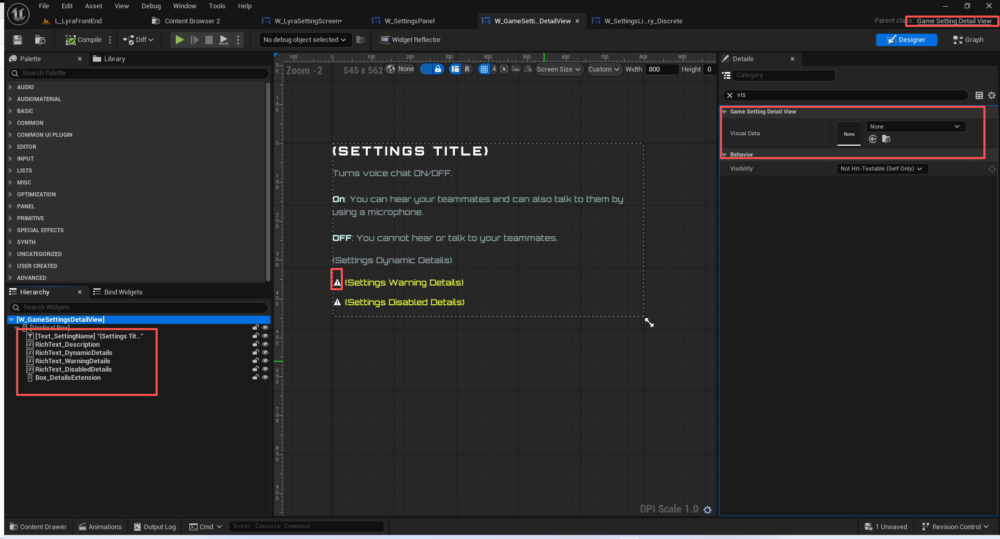

# UE5_Lyra学习指南_054_GameSettingDetailView

本文章仅为小刚-B站课堂-虚幻引擎视频课程Lyra-精讲的演讲手稿.  
本套课程链接:[[UE5]虚幻引擎游戏案例Lyra精讲](https://www.bilibili.com/cheese/play/ss112001159)  
前置课程链接:[[UE5]虚幻引擎UEC++从基础到进阶](https://www.bilibili.com/cheese/play/ss28043)  

文章内容由小刚撰写,采用了以下多种方式:  
1.口述转文字  
2.AI重构  
3.参考引擎源码  
4.Lyra工程源码  
5.结合社区论坛各位大佬的解析  

- [UE5\_Lyra学习指南\_054\_GameSettingDetailView](#ue5_lyra学习指南_054_gamesettingdetailview)
	- [概述](#概述)
	- [GameSettingDetailView](#gamesettingdetailview)
	- [填充细节面板](#填充细节面板)
	- [总结](#总结)


## 概述
本节主要讲解根据选中的设置项来修改对应的细节面板


## GameSettingDetailView
``` cpp
/**
 * 游戏设置细节面板
 */
UCLASS(MinimalAPI, Abstract)
class UGameSettingDetailView : public UUserWidget
{
	GENERATED_BODY()
public:
	// 构造函数 用来指定用户控件池
	UE_API UGameSettingDetailView(const FObjectInitializer& ObjectInitializer);

	// 根据游戏设置来填充细节面板
	UE_API void FillSettingDetails(UGameSetting* InSetting);

	//UVisual interface
	// 释放用户控件池子里面的资源
	UE_API virtual void ReleaseSlateResources(bool bReleaseChildren) override;
	//~ End UVisual Interface

protected:
	// 无
	UE_API virtual void NativeConstruct() override;
	// 初始化一下空的面板
	UE_API virtual void NativeOnInitialized() override;
	// 根据游戏设置的控件类 创建它 并添加到竖向框中
	UE_API void CreateDetailsExtension(UGameSetting* InSetting, TSubclassOf<UGameSettingDetailExtension> ExtensionClass);

protected:
	UPROPERTY(EditAnywhere)
	TObjectPtr<UGameSettingVisualData> VisualData;
	/**
	 * FUserWidgetPool
	 * 	将 UUserWidget 实例进行池化处理，以减少 UMG 元素（具有动态项）的 UObject 和 SWidget 分配量。*
	 * 请注意，如果在用户界面组件（UserWidget）变为非活动状态时，其底层的 Slate 实例被释放，那么当 UUserWidget 组件分别变为活动或非活动状态时，NativeConstruct 和 NativeDestruct 方法将会被调用。前提是该组件在 Slate 层次结构中没有被实际引用（即如果该组件的共享引用计数从非零变为零或从零变为非零）。*
	 * 警告：务必在所属控件的“释放 Slate 资源”方法中释放池中的“Slate 组件”，以防止因循环引用而出现资源泄漏
	 * 否则，对 SObjectWidget 的缓存引用将使 UUserWidget（以及它们所引用的所有内容）保持处于活动状态*
	 * @参见 UListView
	 * @参见 UDynamicEntryBox
	 * 
	 */
	UPROPERTY(Transient)
	FUserWidgetPool ExtensionWidgetPool;

	// 目前使用的游戏设置
	UPROPERTY(Transient)
	TObjectPtr<UGameSetting> CurrentSetting;

	// 异步加载得句柄 因为有些控件类使用时可能还没有加载
	TSharedPtr<FStreamableHandle> StreamingHandle;

private:
	// Bound Widgets
	// 绑定得控件
	UPROPERTY(BlueprintReadOnly, meta = (BindWidgetOptional, BlueprintProtected = true, AllowPrivateAccess = true))
	TObjectPtr<UCommonTextBlock> Text_SettingName;

	UPROPERTY(BlueprintReadOnly, meta = (BindWidgetOptional, BlueprintProtected = true, AllowPrivateAccess = true))
	TObjectPtr<UCommonRichTextBlock> RichText_Description;

	UPROPERTY(BlueprintReadOnly, meta = (BindWidgetOptional, BlueprintProtected = true, AllowPrivateAccess = true))
	TObjectPtr<UCommonRichTextBlock> RichText_DynamicDetails;

	UPROPERTY(BlueprintReadOnly, meta = (BindWidgetOptional, BlueprintProtected = true, AllowPrivateAccess = true))
	TObjectPtr<UCommonRichTextBlock> RichText_WarningDetails;
	
	UPROPERTY(BlueprintReadOnly, meta = (BindWidgetOptional, BlueprintProtected = true, AllowPrivateAccess = true))
	TObjectPtr<UCommonRichTextBlock> RichText_DisabledDetails;

	UPROPERTY(BlueprintReadOnly, meta = (BindWidgetOptional, BlueprintProtected = true, AllowPrivateAccess = true))
	TObjectPtr<UVerticalBox> Box_DetailsExtension;
};

```


``` cpp
// 以游戏设置的类进行拓展
USTRUCT(BlueprintType)
struct FGameSettingClassExtensions
{
	GENERATED_BODY()

public:
	// 游戏设置对应的拓展控件
	UPROPERTY(EditAnywhere, Category = Extensions)
	TArray<TSoftClassPtr<UGameSettingDetailExtension>> Extensions;
};
// 以游戏设置的名称进行拓展
USTRUCT(BlueprintType)
struct FGameSettingNameExtensions
{
	GENERATED_BODY()

public:
	// 是否包含默认的拓展
	UPROPERTY(EditAnywhere, Category = Extensions)
	bool bIncludeClassDefaultExtensions = false;

	// 游戏设置对应的拓展控件
	UPROPERTY(EditAnywhere, Category = Extensions)
	TArray<TSoftClassPtr<UGameSettingDetailExtension>> Extensions;
};


```

## 填充细节面板
1.注意这个控件创建拓展子控件通过ExtensionWidgetPool来进行管理的
2.同样需要在实例化的位置指定VisualData
3.部分子空间的类如果没有完全加载完需要异步加载
4.注意绑定可显示控件.

``` cpp
void UGameSettingDetailView::FillSettingDetails(UGameSetting* InSetting)
{
	// Ignore requests to show the same setting multiple times in a row.
	// 忽略连续多次请求显示相同设置的情况。
	if (InSetting && InSetting == CurrentSetting)
	{
		return;
	}

	CurrentSetting = InSetting;

	if (Text_SettingName)
	{
		Text_SettingName->SetText(InSetting ? InSetting->GetDisplayName() : FText::GetEmpty());
	}

	if (RichText_Description)
	{
		RichText_Description->SetText(InSetting ? InSetting->GetDescriptionRichText() : FText::GetEmpty());
	}

	if (RichText_DynamicDetails)
	{
		const FText DynamicDetails = InSetting ? InSetting->GetDynamicDetails() : FText::GetEmpty();
		RichText_DynamicDetails->SetText(DynamicDetails);
		// 空的则不显示
		RichText_DynamicDetails->SetVisibility(DynamicDetails.IsEmpty() ? ESlateVisibility::Collapsed : ESlateVisibility::HitTestInvisible);
	}

	if (RichText_WarningDetails)
	{
		if (InSetting && !InSetting->GetWarningRichText().IsEmpty())
		{
			const FText WarningText = FText::Format(LOCTEXT("WarningReasonLine", "<Icon.Warning></> {0}"), InSetting->GetWarningRichText());
			RichText_WarningDetails->SetText(WarningText);
			RichText_WarningDetails->SetVisibility(ESlateVisibility::HitTestInvisible);
		}
		else
		{
			RichText_WarningDetails->SetText(FText::GetEmpty());
			RichText_WarningDetails->SetVisibility(ESlateVisibility::Collapsed);
		}

	}

	// 显示一下禁用原因
	if (RichText_DisabledDetails)
	{
		TArray<FText> DisabledDetailLines;

		if (InSetting)
		{
			FGameSettingEditableState EditableState = InSetting->GetEditState();

			if (!EditableState.IsEnabled())
			{
				for (FText Reason : EditableState.GetDisabledReasons())
				{
					DisabledDetailLines.Add(FText::Format(LOCTEXT("DisabledReasonLine", "<Icon.Warning></> {0}"), Reason));
				}
			}

			if (EditableState.GetDisabledOptions().Num() > 0)
			{
				DisabledDetailLines.Add(LOCTEXT("DisabledOptionReasonLine", "<Icon.Warning></> There are fewer options than available due to Parental Controls."));
			}
		}

		RichText_DisabledDetails->SetText(FText::Join(FText::FromString(TEXT("\n")), DisabledDetailLines));
		RichText_DisabledDetails->SetVisibility(DisabledDetailLines.Num() == 0 ? ESlateVisibility::Collapsed : ESlateVisibility::HitTestInvisible);
	}
	
	if (Box_DetailsExtension)
	{
		// First release the widgets back into the pool.
		// 首先将这些组件放回池中。
		for (UWidget* ChildExtension : Box_DetailsExtension->GetAllChildren())
		{
			/** 将一个组件对象归还至池中，以便日后能够再次使用该组件 */
			ExtensionWidgetPool.Release(Cast<UUserWidget>(ChildExtension));
		}

		// Remove the widgets from their container.
		// 将这些组件从其所在的容器中移除。
		Box_DetailsExtension->ClearChildren();

		if (InSetting)
		{
			TArray<TSoftClassPtr<UGameSettingDetailExtension>> ExtensionClassPtrs;
			if (VisualData)
			{
				ExtensionClassPtrs = VisualData->GatherDetailExtensions(InSetting);
			}
			// 释放之前的异步加载句柄
			if (StreamingHandle.IsValid())
			{
				StreamingHandle->CancelHandle();
			}

			bool bEverythingAlreadyLoaded = true;

			TArray<FSoftObjectPath> ExtensionPaths;
			ExtensionPaths.Reserve(ExtensionClassPtrs.Num());
			// 检测是否所有资源已可用 否则需要进行异步加载
			for (TSoftClassPtr<UGameSettingDetailExtension> SoftClassPtr : ExtensionClassPtrs)
			{
				bEverythingAlreadyLoaded &= SoftClassPtr.IsValid();
				ExtensionPaths.Add(SoftClassPtr.ToSoftObjectPath());
			}

			if (bEverythingAlreadyLoaded)
			{
				// 如果都可用了则直接创建
				for (TSoftClassPtr<UGameSettingDetailExtension> SoftClassPtr : ExtensionClassPtrs)
				{
					CreateDetailsExtension(InSetting, SoftClassPtr.Get());
				}
				/** 重置所有缓存的底层 Slate 组件，仅针对池中处于非活动状态的组件。*/
				ExtensionWidgetPool.ReleaseInactiveSlateResources();
			}
			else
			{
				// 有部分资源不可用 异步加载完成之后创建
				TWeakObjectPtr<UGameSetting> SettingPtr = InSetting;

				StreamingHandle = UAssetManager::GetStreamableManager().RequestAsyncLoad(
					MoveTemp(ExtensionPaths),
					FStreamableDelegate::CreateWeakLambda(this, [this, SettingPtr, ExtensionClassPtrs] {
						for (TSoftClassPtr<UGameSettingDetailExtension> SoftClassPtr : ExtensionClassPtrs)
						{
							CreateDetailsExtension(SettingPtr.Get(), SoftClassPtr.Get());
						}

						ExtensionWidgetPool.ReleaseInactiveSlateResources();
					}
				));
			}
		}
	}
}


```

## 总结
细节面板和设置条目列表的思路基本一致.但是这个细节面板并未继承自UListView,但是都使用了FUserWidgetPool进行管理子控件.