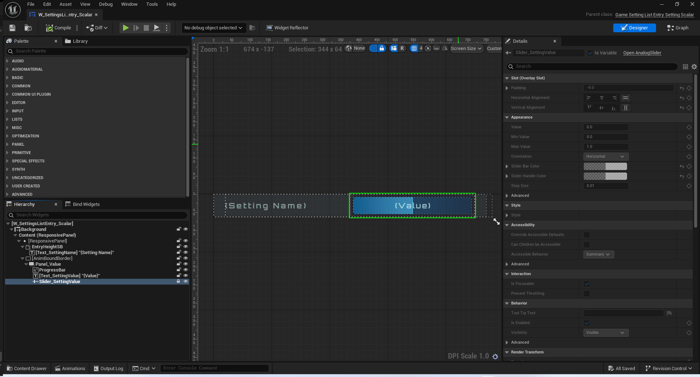
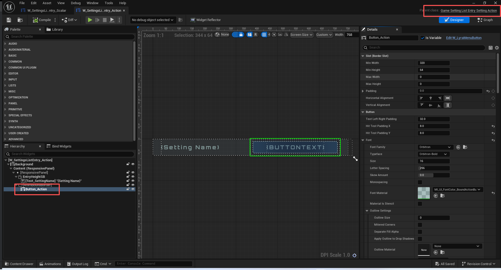

# UE5_Lyra学习指南_057_GameSetting

本文章仅为小刚-B站课堂-虚幻引擎视频课程Lyra-精讲的演讲手稿.  
本套课程链接:[[UE5]虚幻引擎游戏案例Lyra精讲](https://www.bilibili.com/cheese/play/ss112001159)  
前置课程链接:[[UE5]虚幻引擎UEC++从基础到进阶](https://www.bilibili.com/cheese/play/ss28043)  

文章内容由小刚撰写,采用了以下多种方式:  
1.口述转文字  
2.AI重构  
3.参考引擎源码  
4.Lyra工程源码  
5.结合社区论坛各位大佬的解析  

- [UE5\_Lyra学习指南\_057\_GameSetting](#ue5_lyra学习指南_057_gamesetting)
	- [概述](#概述)
	- [游戏设置](#游戏设置)
		- [GameSetting](#gamesetting)
		- [游戏设置变化的原因](#游戏设置变化的原因)
		- [游戏设置初始化流程](#游戏设置初始化流程)
			- [启动初始化](#启动初始化)
			- [初始化内容](#初始化内容)
			- [GameSettingValueScalarDynamic的初始化](#gamesettingvaluescalardynamic的初始化)
		- [游戏设置集合](#游戏设置集合)
			- [游戏设置集合的页面](#游戏设置集合的页面)
		- [游戏设置值类型](#游戏设置值类型)
			- [标量值](#标量值)
				- [动态标量值](#动态标量值)
			- [分离值](#分离值)
		- [游戏设置操作](#游戏设置操作)
			- [GameSettingAction](#gamesettingaction)
			- [使用案例](#使用案例)
	- [游戏设置过滤状态](#游戏设置过滤状态)
		- [过滤器](#过滤器)
			- [一次过滤验证](#一次过滤验证)
			- [文本内容搜索](#文本内容搜索)
		- [可编辑状态](#可编辑状态)
		- [编辑条件](#编辑条件)
			- [平台特征编辑条件](#平台特征编辑条件)
			- [主要玩家编辑条件](#主要玩家编辑条件)
	- [总结](#总结)


## 概述

## 游戏设置
### GameSetting
``` cpp

/**
 * 
 */
UCLASS(MinimalAPI, Abstract, BlueprintType)
class UGameSetting : public UObject
{
	GENERATED_BODY()

public:
	UGameSetting() { }

public:
	DECLARE_EVENT_TwoParams(UGameSetting, FOnSettingChanged, UGameSetting* /*InSetting*/, EGameSettingChangeReason /*InChangeReason*/);
	DECLARE_EVENT_OneParam(UGameSetting, FOnSettingApplied, UGameSetting* /*InSetting*/);
	DECLARE_EVENT_OneParam(UGameSetting, FOnSettingEditConditionChanged, UGameSetting* /*InSetting*/);

	// 游戏设置值改变
	FOnSettingChanged OnSettingChangedEvent;
	// 游戏设置被被应用
	FOnSettingApplied OnSettingAppliedEvent;
	// 游戏设置的编辑条件发生改变
	FOnSettingEditConditionChanged OnSettingEditConditionChangedEvent;

public:

	/**
	 * Gets the non-localized developer name for this setting.  This should remain constant, and represent a 
	 * unique identifier for this setting inside this settings registry.
	 */
	/**
	 *
	 * 获取此设置的非本地化开发者名称。此名称应保持不变，并代表此设置在该设置注册表中的唯一标识符。
	 */
	UFUNCTION(BlueprintCallable)
	FName GetDevName() const { return DevName; }
	// 设置开发者名称
	void SetDevName(const FName& Value) { DevName = Value; }

	bool GetAdjustListViewPostRefresh() const { return bAdjustListViewPostRefresh; }
	void SetAdjustListViewPostRefresh(const bool Value) { bAdjustListViewPostRefresh = Value; }

	// 设置本地化名称
	UFUNCTION(BlueprintCallable)
	FText GetDisplayName() const { return DisplayName; }
	void SetDisplayName(const FText& Value) { DisplayName = Value; }
#if !UE_BUILD_SHIPPING
	void SetDisplayName(const FString& Value) { SetDisplayName(FText::FromString(Value)); }
#endif
	UFUNCTION(BlueprintCallable)
	ESlateVisibility GetDisplayNameVisibility() { return DisplayNameVisibility; }
	void SetNameDisplayVisibility(ESlateVisibility InVisibility) { DisplayNameVisibility = InVisibility; }

	// 设置富文本描述
	UFUNCTION(BlueprintCallable)
	FText GetDescriptionRichText() const { return DescriptionRichText; }
	void SetDescriptionRichText(const FText& Value) { DescriptionRichText = Value; InvalidateSearchableText(); }
#if !UE_BUILD_SHIPPING
	/** This version is for cheats and other non-shipping items, that don't need to localize their text.  We don't permit this in shipping to prevent unlocalized text being introduced. */
	/** 此版本适用于作弊道具及其他非发货商品，这类商品无需对文本进行本地化处理。在发货环节中我们不允许采用此方式，以避免引入未本地化的文本内容。*/
	void SetDescriptionRichText(const FString& Value) { SetDescriptionRichText(FText::FromString(Value)); }
#endif

	UFUNCTION(BlueprintCallable)
	const FGameplayTagContainer& GetTags() const { return Tags; }
	void AddTag(const FGameplayTag& TagToAdd) { Tags.AddTag(TagToAdd); }

	// 设置注册器
	void SetRegistry(UGameSettingRegistry* InOwningRegistry) { OwningRegistry = InOwningRegistry; }

	/** Gets the searchable plain text for the description. */
	/** 获取描述内容的可搜索纯文本内容。*/
	UE_API const FString& GetDescriptionPlainText() const;

	/** Initializes the setting, giving it the owning local player.  Containers automatically initialize settings added to them. */
	/** 初始化设置，并将本地玩家对象作为其所属对象。  容器会自动初始化添加到其之中的设置。*/
	UE_API void Initialize(ULocalPlayer* InLocalPlayer);

	/** Gets the owning local player for this setting - which all initialized settings will have. */
	/** 获取此设置所对应的拥有者本地玩家对象——所有已初始化的设置都会具有此属性。*/
	ULocalPlayer* GetOwningLocalPlayer() const { return LocalPlayer; }
	
	/** Set the dynamic details callback, we query this when building the description panel.  This text is not searchable.*/
	/** 设置动态详情回调函数，我们在构建描述面板时会调用此函数。此文本不支持搜索。*/
	void SetDynamicDetails(const FGetGameSettingsDetails& InDynamicDetails) { DynamicDetails = InDynamicDetails; }

	/**
	 * Gets the dynamic details about this setting.  This may be information like, how many refunds are remaining 
	 * on their account, or the account number.
	 *
	 * 获取有关此设置的动态详细信息。这可能包括诸如账户中剩余的退款数量，或者账户号码等信息。
	 * 
	 */
	UFUNCTION(BlueprintCallable)
	UE_API FText GetDynamicDetails() const;

	UFUNCTION(BlueprintCallable)
	FText GetWarningRichText() const { return WarningRichText; }
	void SetWarningRichText(const FText& Value) { WarningRichText = Value; InvalidateSearchableText(); }
#if !UE_BUILD_SHIPPING
	/** This version is for cheats and other non-shipping items, that don't need to localize their text.  We don't permit this in shipping to prevent unlocalized text being introduced. */
	/** 此版本适用于作弊道具及其他非发货商品，这类商品无需对文本进行本地化处理。在发货环节中我们不允许采用此方式，以避免引入未本地化的文本内容。*/
	void SetWarningRichText(const FString& Value) { SetWarningRichText(FText::FromString(Value)); }
#endif

	/**
	 * Gets the edit state of this property based on the current state of its edit conditions as well as any additional
	 * filter state.
	 *
	 *	根据该属性的编辑条件当前状态以及任何附加的筛选状态，获取该属性的编辑状态。
	 */
	const FGameSettingEditableState& GetEditState() const { return EditableStateCache; }

	/** Adds a new edit condition to this setting, allowing you to control the visibility and edit-ability of this setting. */
	/** 为该设置添加一个新的编辑条件，使您能够控制此设置的可见性和可编辑性。*/
	UE_API void AddEditCondition(const TSharedRef<FGameSettingEditCondition>& InEditCondition);

	/** Add setting dependency, if these settings change, we'll re-evaluate edit conditions for this setting. */
	/** 添加设置依赖项，如果这些设置发生变化，我们将重新评估此设置的编辑条件。*/
	UE_API void AddEditDependency(UGameSetting* DependencySetting);

	/** The parent object that owns the setting, in most cases the collection, but for top level settings the registry. */
	/** 拥有该设置的父对象，在大多数情况下为集合，但对于顶级设置而言则是注册表。*/
	UE_API void SetSettingParent(UGameSetting* InSettingParent);
	UGameSetting* GetSettingParent() const { return SettingParent; }

	/** Should this setting be reported to analytics. */
	/** 是否应将此设置报告给分析系统。*/
	bool GetIsReportedToAnalytics() const { return bReportAnalytics; }
	void SetIsReportedToAnalytics(bool bReport) { bReportAnalytics = bReport; }

	/** Gets the analytics value for this setting. */
	/** 获取此设置的分析值。*/
	virtual FString GetAnalyticsValue() const { return TEXT(""); }

	/**
	 * Some settings may take an async amount of time to finish initializing.  The settings system will wait
	 * for all settings to be ready before showing the setting.
	 *
	 * 有些设置的初始化过程可能会耗费相当长的时间。设置系统会一直等待所有设置都准备就绪后，才会显示这些设置。
	 * 
	 */
	bool IsReady() const { return bReady; }

	/**
	 * Any setting can have children, this is so we can allow for the possibility of "collections" or "actions" that
	 * are not directly visible to the user, but are set by some means and need to have initial and restored values.
	 * In that case, you would likely have internal settings inside an action subclass that is set on another screen,
	 * but never directly listed on the settings panel.
	 *
	 * 任何设置都可以有子项，这是因为这样我们就能允许存在“集合”或“操作”这类对用户来说并不直接可见，但却是通过某种方式设定，并且需要有初始值和恢复值的情况。
	 * 在这种情况下，您可能会在某个操作子类中设置内部设置，这些设置是在另一屏幕中设定的，但不会直接列在设置面板中。
	 * 
	 */
	virtual TArray<UGameSetting*> GetChildSettings() { return TArray<UGameSetting*>(); }

	/**
	 * Refresh the editable state of the setting and notify that the state has changed so that any UI currently
	 * examining this setting is updated with the new options, or whatever.
	 */
	/**
	 * 重置设置的可编辑状态，并通知用户该状态已发生改变，以便当前正在检查此设置的任何用户界面能够根据新的选项等进行更新。
	 * 
	 */
	UE_API void RefreshEditableState(bool bNotifyEditConditionsChanged = true);

	/**
	 * We expect settings to change the live value immediately, but occasionally there are special settings
	 * that go are immediately stored to a temporary location but we don't actually apply them until later
	 * like selecting a new resolution.
	 *
	 * 我们期望设置能够立即更改实时值，但有时也会有一些特殊的设置，它们会立即被存储到临时位置，但直到稍后我们才会实际应用它们，比如选择新的分辨率。
	 * 
	 */
	UE_API void Apply();

	/** Gets the current world of the local player that owns these settings. */
	/** 获取当前属于拥有这些设置的本地玩家的世界。*/
	UE_API virtual UWorld* GetWorld() const override;

protected:
	/** 计划只执行一次的拓展启动接口 由UGameSetting::Initialize外部调用*/
	UE_API virtual void Startup();
	UE_API void StartupComplete();

	UE_API virtual void OnInitialized();
	UE_API virtual void OnApply();
	UE_API virtual void OnGatherEditState(FGameSettingEditableState& InOutEditState) const;
	UE_API virtual void OnDependencyChanged();

	/**  */
	UE_API virtual FText GetDynamicDetailsInternal() const;

	/** */
	UE_API void HandleEditDependencyChanged(UGameSetting* DependencySetting, EGameSettingChangeReason Reason);
	UE_API void HandleEditDependencyChanged(UGameSetting* DependencySetting);

	/** Regenerates the plain searchable text if it has been dirtied. */
	/** 如果原始可搜索文本已受损，则重新生成该文本。*/
	UE_API void RefreshPlainText() const;
	void InvalidateSearchableText() { bRefreshPlainSearchableText = true; }

	/** Notify that the setting changed */
	/** 发出设置已更改的通知 */
	UE_API void NotifySettingChanged(EGameSettingChangeReason Reason);
	UE_API virtual void OnSettingChanged(EGameSettingChangeReason Reason);

	/** Notify that the settings edit conditions changed.  This may mean it's now invisible, or disabled, or possibly that the options have changed in some meaningful way. */
	/** 通知设置编辑条件已发生变更。这可能意味着该设置现在不可见、已禁用，或者可能是其选项已发生了某种有意义的变化。*/
	UE_API void NotifyEditConditionsChanged();
	UE_API virtual void OnEditConditionsChanged();

	/** 计算可编辑状态 */
	UE_API FGameSettingEditableState ComputeEditableState() const;

protected:

	UPROPERTY(Transient)
	TObjectPtr<ULocalPlayer> LocalPlayer;

	UPROPERTY(Transient)
	TObjectPtr<UGameSetting> SettingParent;

	UPROPERTY(Transient)
	TObjectPtr<UGameSettingRegistry> OwningRegistry;

	FName DevName;
	FText DisplayName;
	ESlateVisibility DisplayNameVisibility = ESlateVisibility::SelfHitTestInvisible;
	FText DescriptionRichText;
	FText WarningRichText;

	/** A collection of tags for the settings.  These can just be arbitrary flags used by the UI to do different things. */
	/** 一组用于设置的标签。这些标签仅仅是用户界面用来执行不同操作的任意标志而已。*/
	FGameplayTagContainer Tags;

	FGetGameSettingsDetails DynamicDetails;

	/** Any edit conditions for this setting. */
	/** 此设置的任何编辑条件。*/
	TArray<TSharedRef<FGameSettingEditCondition>> EditConditions;

	class FStringCultureCache
	{
		FStringCultureCache(TFunction<FString()> InStringGetter);

		void Invalidate();

		FString Get() const;

	private:
		mutable FString StringCache;
		mutable FCultureRef Culture;
		TFunction<FString()> StringGetter;
	};

	/** When the text changes, we invalidate the searchable text. */
	/** 当文本发生更改时，我们将清除可搜索文本的缓存。*/
	mutable bool bRefreshPlainSearchableText = true;
	/** When we set the rich text for a setting, we automatically generate the plain text. */
	/** 当我们为某个设置设置富文本格式时，系统会自动生成相应的纯文本内容。*/
	mutable FString AutoGenerated_DescriptionPlainText;

	/** Report as part of analytics, by default no setting reports, except GameSettingValues. */
	/** 作为分析的一部分生成报告，默认情况下不会生成任何设置报告，但会生成“游戏设置值”报告。*/
	bool bReportAnalytics = false;

private:

	/** Most settings are immediately ready, but some may require startup time before it's safe to call their functions. */
	/** 大多数设置在启动时即可生效，但有些设置可能需要一段时间的初始化过程，只有在确认可以调用其相关函数时才可进行操作。*/
	bool bReady = false;

	/** Prevent re-entrancy problems when announcing a setting has changed. */
	/** 防止在宣布设置已更改时出现重复进入的问题。*/
	bool bOnSettingChangedEventGuard = false;

	/** Prevent re-entrancy problems when announcing a setting has changed edit conditions. */
	/** 防止在宣布设置已发生变化时出现重复进入的问题（即防止出现编辑条件重复生效的情况）。*/
	bool bOnEditConditionsChangedEventGuard = false;

	/**  */
	bool bAdjustListViewPostRefresh = true;

	/** We cache the editable state of a setting when it changes rather than reprocessing it any time it's needed.  */
	/** 我们会在设置的值发生变化时对其进行缓存，而不是每次需要使用该值时都重新处理它。*/
	FGameSettingEditableState EditableStateCache;
};

```

### 游戏设置变化的原因
``` cpp
/** Why did the setting change? */
/** 为何设置发生了变化？*/
enum class EGameSettingChangeReason : uint8
{
	Change,
	DependencyChanged,
	ResetToDefault,
	RestoreToInitial,
};


```

### 游戏设置初始化流程
#### 启动初始化
当从一个游戏设置集合中添加一个游戏设置时,这个游戏设置再添加后会自动初始化.
但是这个游戏设置集合必须自己申通调用初始化.

``` cpp
UGameSettingCollection* ULyraGameSettingRegistry::InitializeAudioSettings(ULyraLocalPlayer* InLocalPlayer)
{
	// 创建音频界面屏幕
	UGameSettingCollection* Screen = NewObject<UGameSettingCollection>();
	Screen->SetDevName(TEXT("AudioCollection"));
	Screen->SetDisplayName(LOCTEXT("AudioCollection_Name", "Audio"));
	Screen->Initialize(InLocalPlayer);
		// Volume
	// 音量
	////////////////////////////////////////////////////////////////////////////////////
	{
		// 创建音量的设置集合
		UGameSettingCollection* Volume = NewObject<UGameSettingCollection>();
		Volume->SetDevName(TEXT("VolumeCollection"));
		Volume->SetDisplayName(LOCTEXT("VolumeCollection_Name", "Volume"));
		Screen->AddSetting(Volume);
	}
}
```
``` cpp
void UGameSettingCollection::AddSetting(UGameSetting* Setting)
{
#if !UE_BUILD_SHIPPING
	ensureAlwaysMsgf(Setting->GetSettingParent() == nullptr, TEXT("This setting already has a parent!"));
	ensureAlwaysMsgf(!Settings.Contains(Setting), TEXT("This collection already includes this setting!"));
#endif

	Settings.Add(Setting);
	Setting->SetSettingParent(this);

	if (LocalPlayer)
	{
		Setting->Initialize(LocalPlayer);
	}
}

```
#### 初始化内容
``` cpp

void UGameSetting::Initialize(ULocalPlayer* InLocalPlayer)
{
	// If we've already gotten this local player we're already initialized.
	// 如果我们已经获取到了这个本地玩家，那么我们就已经完成了初始化。
	if (LocalPlayer == InLocalPlayer)
	{
		return;
	}

	LocalPlayer = InLocalPlayer;

	//TODO: GameSettings
	//LocalPlayer->OnPlayerLoggedIn().AddUObject(this, &UGameSetting::RefreshEditableState, true);

	//待办事项：游戏设置
	//本地玩家 -> 当玩家登录时的事件处理函数的注册。将此操作添加到此对象的 UObject 链中，调用 UGameSetting 类中的 RefreshEditableState 方法，并设置为启用（true）。
	

	// 确保开发者名称有效
	// 确保本地化名称不为空
#if !UE_BUILD_SHIPPING
	ensureAlwaysMsgf(DevName != NAME_None, TEXT("You must provide a DevName for the setting."));
	ensureAlwaysMsgf(!DisplayName.IsEmpty(), TEXT("You must provide a DisplayName for settings."));
#endif

	// 初始化编辑条件
	for (const TSharedRef<FGameSettingEditCondition>& EditCondition : EditConditions)
	{
		EditCondition->Initialize(LocalPlayer);
	}

	// If there are any child settings go ahead and initialize them as well.
	// 如果存在任何子设置，则也一并进行初始化。
	for (UGameSetting* Setting : GetChildSettings())
	{
		Setting->Initialize(LocalPlayer);
	}

	Startup();
}

```
``` cpp
void UGameSetting::Startup()
{
	StartupComplete();
}

```
``` cpp
void UGameSetting::StartupComplete()
{
	ensureMsgf(!bReady, TEXT("StartupComplete called twice."));

	if (!bReady)
	{
		bReady = true;
		OnInitialized();
	}
}
```
重新计算当前编辑状态
``` cpp
void UGameSetting::OnInitialized()
{
	ensureMsgf(bReady, TEXT("OnInitialized called directly instead of via StartupComplete."));
	EditableStateCache = ComputeEditableState();
}

```
``` cpp
FGameSettingEditableState UGameSetting::ComputeEditableState() const
{
	FGameSettingEditableState EditState;

	// Does this setting itself have any special rules?
	// 这个设置本身是否有任何特殊的规则？
	OnGatherEditState(EditState);

	// Run through any edit conditions
	// 运行任何编辑条件
	for (const TSharedRef<FGameSettingEditCondition>& EditCondition : EditConditions)
	{
		EditCondition->GatherEditState(LocalPlayer, EditState);
	}

	return EditState;
}
```

注意子类根据实际清空不同.会修改这个初始化内
#### GameSettingValueScalarDynamic的初始化
它需要去考虑数据源绑定的初始化,它改了Startup触发StartupComplete的执行逻辑.
``` cpp
void UGameSettingValueScalarDynamic::Startup()
{
	// Should I also do something with Setter?
	// 我是不是也应该对“Setter”这个部分做点什么呢？
	Getter->Startup(LocalPlayer, FSimpleDelegate::CreateUObject(this, &ThisClass::OnDataSourcesReady));
}

class FGameSettingDataSource : public TSharedFromThis<FGameSettingDataSource>
{
public:
	virtual ~FGameSettingDataSource() { }

	/**
	 * Some settings may take an async amount of time to finish initializing.  The settings system will wait
	 * for all settings to be ready before showing the setting.
	 *
	 *  有些设置的初始化过程可能会需要相当长的时间。设置系统会一直等待所有设置都准备就绪后，才会显示这些设置
	 */
	virtual void Startup(ULocalPlayer* InLocalPlayer, FSimpleDelegate StartupCompleteCallback) { StartupCompleteCallback.ExecuteIfBound(); }
}

void UGameSettingValueScalarDynamic::OnDataSourcesReady()
{
	StartupComplete();
}

```
``` cpp
void UGameSettingValueScalarDynamic::OnInitialized()
{
#if !UE_BUILD_SHIPPING
	ensureAlwaysMsgf(DisplayFormat, TEXT("%s: Has no DisplayFormat set.  Please call SetDisplayFormat."), *GetDevName().ToString());
#endif

#if !UE_BUILD_SHIPPING
	ensureAlways(Getter);
	ensureAlwaysMsgf(Getter->Resolve(LocalPlayer), TEXT("%s: %s did not resolve, are all functions and properties valid, and are they UFunctions/UProperties?"), *GetDevName().ToString(), *Getter->ToString());
	ensureAlways(Setter);
	ensureAlwaysMsgf(Setter->Resolve(LocalPlayer), TEXT("%s: %s did not resolve, are all functions and properties valid, and are they UFunctions/UProperties?"), *GetDevName().ToString(), *Setter->ToString());
#endif

	Super::OnInitialized();
}
```


### 游戏设置集合
``` cpp

UCLASS(MinimalAPI)
class UGameSettingCollection : public UGameSetting
{
	GENERATED_BODY()

public:
	// 无
	UE_API UGameSettingCollection();

	// 获取子游戏设置
	virtual TArray<UGameSetting*> GetChildSettings() override { return Settings; }
	// 获取子游戏设置集合 如果有的话
	UE_API TArray<UGameSettingCollection*> GetChildCollections() const;

	// 添加游戏设置 同时初始化它
	UE_API void AddSetting(UGameSetting* Setting);
	// 通过过滤器获取游戏设置
	UE_API virtual void GetSettingsForFilter(const FGameSettingFilterState& FilterState, TArray<UGameSetting*>& InOutSettings) const;

	// 不可被选中
	virtual bool IsSelectable() const { return false; }

protected:
	/** The settings owned by this collection. */
	/** 本集合所拥有的设置。*/
	UPROPERTY(Transient)
	TArray<TObjectPtr<UGameSetting>> Settings;
};


```
#### 游戏设置集合的页面
``` cpp
UCLASS(MinimalAPI)
class UGameSettingCollectionPage : public UGameSettingCollection
{
	GENERATED_BODY()

public:
	// 执行导航事件的代理
	DECLARE_EVENT_OneParam(UGameSettingCollectionPage, FOnExecuteNavigation, UGameSetting* /*Setting*/);
	FOnExecuteNavigation OnExecuteNavigationEvent;

public:
	// 构造函数无
	UE_API UGameSettingCollectionPage();

	// 获取导航的文本
	FText GetNavigationText() const { return NavigationText; }
	// 设置导航的文本
	void SetNavigationText(FText Value) { NavigationText = Value; }
#if !UE_BUILD_SHIPPING
	// 测试时 设置导航的文本
	void SetNavigationText(const FString& Value) { SetNavigationText(FText::FromString(Value)); }
#endif
	// 非空判定
	UE_API virtual void OnInitialized() override;
	// 使用过滤器过滤 因为是嵌套页面
	UE_API virtual void GetSettingsForFilter(const FGameSettingFilterState& FilterState, TArray<UGameSetting*>& InOutSettings) const override;
	// 可以被选中点击
	virtual bool IsSelectable() const override { return true; }

	/** 执行导航 */
	UE_API void ExecuteNavigation();

private:
	// 导航的文本
	FText NavigationText;
};

```
``` cpp
void UGameSettingCollectionPage::GetSettingsForFilter(const FGameSettingFilterState& FilterState, TArray<UGameSetting*>& InOutSettings) const
{
	// If we're including nested pages, call the super and dump them all, otherwise, we pretend we have none for the filtering.
	// because our settings are displayed on another page.
	// 如果包含嵌套页面，则调用父类方法并一次性将所有页面都列出，否则，我们就假装没有这些页面用于筛选操作。
	// 因为我们的设置是在另一个页面中显示的。
	if (FilterState.bIncludeNestedPages || FilterState.IsSettingInRootList(this))
	{
		Super::GetSettingsForFilter(FilterState, InOutSettings);
	}
}
```

注意这里的导航是从Panel中过来的.实际还是需要由蓝图控件触发.
不在这里讲解嵌套页面的导航流程.只是提一下.
``` cpp
void UGameSettingPanel::HandleSettingNavigation(UGameSetting* Setting)
{
	if (VisibleSettings.Contains(Setting))
	{
		FilterNavigationStack.Push(FilterState);

		// 新创建一个过滤的条件
		FGameSettingFilterState NewPageFilterState;
		NewPageFilterState.AddSettingToRootList(Setting);
		SetFilterState(NewPageFilterState, false);
	}
}


```


### 游戏设置值类型
``` cpp
/**
 * The base class for all settings that are conceptually a value, that can be 
 * changed, and thus reset or restored to their initial value.
 *
 * 所有概念上为数值、可进行更改且能够重置或恢复至初始值的设置的基类。
 */
UCLASS(MinimalAPI, Abstract)
class UGameSettingValue : public UGameSetting
{
	GENERATED_BODY()

public:
	UE_API UGameSettingValue();

	/** Stores an initial value for the setting.  This will be called on initialize, but should also be called if you 'apply' the setting. */
	/** 用于存储设置的初始值。此方法会在初始化时调用，但在您“应用”该设置时也应调用此方法。*/
	UE_API virtual void StoreInitial() PURE_VIRTUAL(, );

	/** Resets the property to the default. */
	/** 将该属性重置为默认值。*/
	UE_API virtual void ResetToDefault() PURE_VIRTUAL(, );

	/** Restores the setting to the initial value, this is the value when you open the settings before making any tweaks. */
	/** 将设置恢复至初始值，即在进行任何调整之前打开设置时所使用的值。*/
	UE_API virtual void RestoreToInitial() PURE_VIRTUAL(, );

protected:
	// 确保描述文本不为空
	UE_API virtual void OnInitialized() override;
};


```
#### 标量值
``` cpp
// 标量数值
UCLASS(MinimalAPI, abstract)
class UGameSettingValueScalar : public UGameSettingValue
{
	GENERATED_BODY()

public:
	// 构造函数 无
	UE_API UGameSettingValueScalar();
	// 传入归一化的值 然后根据范围 得到实际的值
	UE_API void SetValueNormalized(double NormalizedValue);

	// 获取当前归一化的值
	UE_API double GetValueNormalized() const;
	// 获取默认的归一化值
	TOptional<double> GetDefaultValueNormalized() const
	{
		TOptional<double> DefaultValue = GetDefaultValue();
		if (DefaultValue.IsSet())
		{
			return FMath::GetMappedRangeValueClamped(GetSourceRange(), TRange<double>(0, 1), DefaultValue.GetValue());
		}
		return TOptional<double>();
	}
	// 获取默认的值
	UE_API virtual TOptional<double> GetDefaultValue() const						PURE_VIRTUAL(, return TOptional<double>(););
	// 设置具体的值
	UE_API virtual void SetValue(double Value, EGameSettingChangeReason Reason = EGameSettingChangeReason::Change)	PURE_VIRTUAL(, );
	// 获取具体的值
	UE_API virtual double GetValue() const											PURE_VIRTUAL(, return 0;);
	/**
	* 范围模板。*
	* 注意：此类别不适用于区间运算（有关区间运算的相关内容请参阅 TInterval 类）。*
	* 一个范围表示的是一个连续的元素集合，它仅存储该集合的下限值和上限值（即端点值），以提高存储效率。必然的
	* 值可以是排他性的（该值不属于范围之内）、包含性的（该值属于范围之内）或者开放式的（没有对值的限制）。*
	该模板的主要关注点在于连续范围，但也可用于表示离散范围。离散范围的元素类型具有明确的步长，例如整数或日期，它将相邻的元素分隔开来。这与连续范围不同，在连续范围内，步长（如浮点数或时间跨度）并不重要，而且在任意两个元素之间可能会存在其他元素（尽管实际上由于计算机数值的有限精度，所有范围都是离散的）。
	* 在使用范围时，此模板的使用者需确保正确理解范围的起始和结束点。
	* 不同的语义会因范围是在连续域还是离散域中被解读而有所不同。*
	* 离散范围 [A, B) 的迭代包括从 A 到 B - 1 的所有元素。连续范围内的元素通常不进行迭代。同时，还需要考虑离散范围不同表示形式之间的等价性。对于
	例如，在离散域中，区间 [2, 6)、(1, 5] 和 [2, 5] 是等价的，
	但在连续域中则不同。为了使这个类保持简单，我们没有包含规范化函数或辅助模板参数，比如单位和最小/最大域元素。为了在大多数常见用例中便于使用，建议将所有操作限制在形式为 [A， B) 的规范区间内，其中下限包含在内，上限不包含在区间内。*
	* @参数 ElementType：表示该范围所代表元素的类型
	* @参考 RangeBound、TInterval*/
	// 映射的范围
	UE_API virtual TRange<double> GetSourceRange() const							PURE_VIRTUAL(, return TRange<double>(););
	// 步进的值
	UE_API virtual double GetSourceStep() const									PURE_VIRTUAL(, return 0.01;);
	// 获取归一化的每次步进的值
	double GetNormalizedStepSize() const
	{
		TRange<double> SourceRange = GetSourceRange();
		return GetSourceStep() / FMath::Abs(SourceRange.GetUpperBoundValue() - SourceRange.GetLowerBoundValue());
	}
	// 获取格式化后的文本
	UE_API virtual FText GetFormattedText() const									PURE_VIRTUAL(, return FText::GetEmpty(););
	// 获取用于分析的当前值
	virtual FString GetAnalyticsValue() const override
	{
		return LexToString(GetValue());
	}

protected:
};

```
##### 动态标量值
``` cpp
UCLASS(MinimalAPI)
class UGameSettingValueScalarDynamic : public UGameSettingValueScalar
{
	GENERATED_BODY()

public:
	// 格式化数字
	static UE_API FSettingScalarFormatFunction Raw;
	static UE_API FSettingScalarFormatFunction RawOneDecimal;
	static UE_API FSettingScalarFormatFunction RawTwoDecimals;
	static UE_API FSettingScalarFormatFunction ZeroToOnePercent;
	static UE_API FSettingScalarFormatFunction ZeroToOnePercent_OneDecimal;
	static UE_API FSettingScalarFormatFunction SourceAsPercent1;
	static UE_API FSettingScalarFormatFunction SourceAsPercent100;
	static UE_API FSettingScalarFormatFunction SourceAsInteger;
private:
	static const FNumberFormattingOptions& GetOneDecimalFormattingOptions();
	
public:
	// 构造函数 无
	UE_API UGameSettingValueScalarDynamic();

	/** UGameSettingValue */
	// 一次性接口 不执行父类 主要是用于等待对应的数据源初始化好 然后才使得自己初始化完成 Ready
	UE_API virtual void Startup() override;
	// 存储当前值为初始值
	UE_API virtual void StoreInitial() override;
	// 恢复默认值
	UE_API virtual void ResetToDefault() override;
	// 恢复初始值
	UE_API virtual void RestoreToInitial() override;

	/** UGameSettingValueScalar */
	// 获取默认值
	UE_API virtual TOptional<double> GetDefaultValue() const override;
	// 设置当前值
	UE_API virtual void SetValue(double Value, EGameSettingChangeReason Reason = EGameSettingChangeReason::Change) override;
	// 获取当前值
	UE_API virtual double GetValue() const override;
	// 获取源数据的范围
	UE_API virtual TRange<double> GetSourceRange() const override;
	// 获取源数据的步长
	UE_API virtual double GetSourceStep() const override;
	// 获取格式化后的展示文本
	UE_API virtual FText GetFormattedText() const override;

	/** UGameSettingValueDiscreteDynamic */
	UE_API void SetDynamicGetter(const TSharedRef<FGameSettingDataSource>& InGetter);
	UE_API void SetDynamicSetter(const TSharedRef<FGameSettingDataSource>& InSetter);
	UE_API void SetDefaultValue(double InValue);

	/**  */
	// 设置显示的格式
	UE_API void SetDisplayFormat(FSettingScalarFormatFunction InDisplayFormat);
	
	/** 设置源数据变动范围和 步进 */
	UE_API void SetSourceRangeAndStep(const TRange<double>& InRange, double InSourceStep);
	
	/**
	 * The SetSourceRangeAndStep defines the actual range the numbers could move in, but often
	 * the true minimum for the user is greater than the minimum source range, so for example, the range
	 * of some slider might be 0..100, but you want to restrict the slider so that while it shows 
	 * a bar that travels from 0 to 100, the user can't set anything lower than some minimum, e.g. 1.
	 * That is the Minimum Limit.
	 */

	/**
	 * “SetSourceRangeAndStep”定义了数字能够移动的实际范围，但通常
	 * 用户实际所需的最小值会大于源范围的最小值，例如，某些滑块的范围可能是 0 至 100，但您希望对滑块进行限制，使得尽管它显示的条形从 0 移动到 100，但用户无法将数值设置得低于某个最小值，比如 1。
	 * 这就是“最小限制”。
	 * 
	 */
	UE_API void SetMinimumLimit(const TOptional<double>& InMinimum);

	/**
	 * 	“SetSourceRangeAndStep”定义了数字能够移动的实际范围，但通常情况下
	 * 用户实际所能达到的最大值会小于源数据的最大范围，例如，某些滑块的范围可能是 0 到 100，但您希望对滑块进行限制，使得尽管它显示的条形从 0 移动到 100，但用户无法将数值设置得低于某个最大值，比如 95。
	 * 这就是最大限制值。
	 * 
	 */
	UE_API void SetMaximumLimit(const TOptional<double>& InMaximum);
	
protected:
	/** UGameSettingValue */
	// 非空判定
	UE_API virtual void OnInitialized() override;

	// 数据源准备好了
	UE_API void OnDataSourcesReady();

protected:

	TSharedPtr<FGameSettingDataSource> Getter;
	TSharedPtr<FGameSettingDataSource> Setter;

	TOptional<double> DefaultValue;
	double InitialValue = 0;

	TRange<double> SourceRange = TRange<double>(0, 1);
	double SourceStep = 0.01;
	/**
	* 当我们有一个可选值时，IsSet() 函数会返回真，并且 GetValue() 函数才有意义。
	* 反之，GetValue() 函数则没有意义。*/
	TOptional<double> Minimum;
	TOptional<double> Maximum;

	FSettingScalarFormatFunction DisplayFormat;
};

```

此处以整体音量为例子
``` cpp
		//----------------------------------------------------------------------------------
		{
			// 整体音量
			UGameSettingValueScalarDynamic* Setting = NewObject<UGameSettingValueScalarDynamic>();
			Setting->SetDevName(TEXT("OverallVolume"));
			Setting->SetDisplayName(LOCTEXT("OverallVolume_Name", "Overall"));
			Setting->SetDescriptionRichText(LOCTEXT("OverallVolume_Description", "Adjusts the volume of everything."));

			Setting->SetDynamicGetter(GET_LOCAL_SETTINGS_FUNCTION_PATH(GetOverallVolume));
			Setting->SetDynamicSetter(GET_LOCAL_SETTINGS_FUNCTION_PATH(SetOverallVolume));
			Setting->SetDefaultValue(GetDefault<ULyraSettingsLocal>()->GetOverallVolume());
			Setting->SetDisplayFormat(UGameSettingValueScalarDynamic::ZeroToOnePercent);

			Setting->AddEditCondition(FWhenPlayingAsPrimaryPlayer::Get());

			Volume->AddSetting(Setting);
		}

```
``` cpp
FSettingScalarFormatFunction UGameSettingValueScalarDynamic::ZeroToOnePercent([](double SourceValue, double NormalizedValue) {
	return FText::Format(PercentFormat, (int32)FMath::RoundHalfFromZero(100.0 * NormalizedValue));
});


```
#### 分离值
UGameSettingValueDiscrete.
使用思路大同小异.不需要再赘述.
``` cpp

UCLASS(MinimalAPI, Abstract)
class UGameSettingValueDiscrete : public UGameSettingValue
{
	GENERATED_BODY()

public:
	UE_API UGameSettingValueDiscrete();

	/** UGameSettingValueDiscrete */
	// 设置分离选项的索引
	UE_API virtual void SetDiscreteOptionByIndex(int32 Index) PURE_VIRTUAL(,);

	// 获取分离选项的索引
	UFUNCTION(BlueprintCallable)
	UE_API virtual int32 GetDiscreteOptionIndex() const PURE_VIRTUAL(,return INDEX_NONE;);

	/** Optional */
	// 可惜 默认分离选项的索引
	UFUNCTION(BlueprintCallable)
	virtual int32 GetDiscreteOptionDefaultIndex() const { return INDEX_NONE; }

	// 获取所有的选项文本
	UFUNCTION(BlueprintCallable)
	UE_API virtual TArray<FText> GetDiscreteOptions() const PURE_VIRTUAL(,return TArray<FText>(););

	// 获取分解后的值
	UE_API virtual FString GetAnalyticsValue() const;
};

```
UGameSettingValueDiscreteDynamic
UGameSettingValueDiscreteDynamic_Bool
UGameSettingValueDiscreteDynamic_Number
UGameSettingValueDiscreteDynamic_Enum
UGameSettingValueDiscreteDynamic_Color
UGameSettingValueDiscreteDynamic_Vector2D

### 游戏设置操作
#### GameSettingAction
``` cpp
UCLASS(MinimalAPI)
class UGameSettingAction : public UGameSetting
{
	GENERATED_BODY()

public:
	UE_API UGameSettingAction();

public:

	DECLARE_EVENT_TwoParams(UGameSettingAction, FOnExecuteNamedAction, UGameSetting* /*Setting*/, FGameplayTag /*GameSettings_Action_Tag*/);
	FOnExecuteNamedAction OnExecuteNamedActionEvent;

public:

	FText GetActionText() const { return ActionText; }
	void SetActionText(FText Value) { ActionText = Value; }
#if !UE_BUILD_SHIPPING
	void SetActionText(const FString& Value) { SetActionText(FText::FromString(Value)); }
#endif

	FGameplayTag GetNamedAction() const { return NamedAction; }
	void SetNamedAction(FGameplayTag Value) { NamedAction = Value; }

	bool HasCustomAction() const { return CustomAction.IsBound(); }
	void SetCustomAction(UGameSettingCustomAction InAction) { CustomAction = InAction; }
	UE_API void SetCustomAction(TFunction<void(ULocalPlayer*)> InAction);

	/**
	 * By default actions don't dirty the settings, since the majority of them either do things you can't
	 * revert, or they're things like show the credits or Eula.  However if that's not true, set this flag
	 * to true to fire the change event when this action is fired.
	 */
	/**
	 * 	默认情况下，操作不会影响设置，因为大多数操作要么无法恢复，要么就是诸如显示片尾字幕或许可协议这类内容。然而，如果情况并非如此，可将此标志设置为“真”，以便在执行此操作时触发更改事件。
	 */
	void SetDoesActionDirtySettings(bool Value) { bDirtyAction = Value; }

	UE_API virtual void ExecuteAction();

protected:
	/** UGameSettingValue */
	UE_API virtual void OnInitialized() override;

protected:
	FText ActionText;
	FGameplayTag NamedAction;
	UGameSettingCustomAction CustomAction;
	bool bDirtyAction = false;
};


```
#### 使用案例
``` cpp
	//----------------------------------------------------------------------------------
		{

			// 这里是游戏设置事件
			// 执行基准化测试
			UGameSettingAction* Setting = NewObject<UGameSettingAction>();
			
			Setting->SetDevName(TEXT("AutoSetQuality"));
			Setting->SetDisplayName(LOCTEXT("AutoSetQuality_Name", "Auto-Set Quality"));
			Setting->SetDescriptionRichText(LOCTEXT("AutoSetQuality_Description", "Automatically configure the graphics quality options based on a benchmark of the hardware."));

			Setting->SetDoesActionDirtySettings(true);
			Setting->SetActionText(LOCTEXT("AutoSetQuality_Action", "Auto-Set"));
			Setting->SetCustomAction([](ULocalPlayer* LocalPlayer)
			{
				const ULyraPlatformSpecificRenderingSettings* PlatformSettings = ULyraPlatformSpecificRenderingSettings::Get();
				if (PlatformSettings->FramePacingMode == ELyraFramePacingMode::MobileStyle)
				{
					ULyraSettingsLocal::Get()->ResetToMobileDeviceDefaults();
				}
				else
				{
					const ULyraLocalPlayer* LyraLocalPlayer = CastChecked<ULyraLocalPlayer>(LocalPlayer);
					// We don't save state until users apply the settings.
					// 在用户应用设置之前，我们不会保存状态。
					constexpr bool bImmediatelySaveState = false;
					LyraLocalPlayer->GetLocalSettings()->RunAutoBenchmark(bImmediatelySaveState);
				}
			});
			// 添加编辑条件 移动端不可以使用基准测试 以及是否桌面端开启了基准测试
			Setting->AddEditCondition(MakeShared<FWhenCondition>([](const ULocalPlayer* LocalPlayer, FGameSettingEditableState& InOutEditState)
			{
				const ULyraPlatformSpecificRenderingSettings* PlatformSettings = ULyraPlatformSpecificRenderingSettings::Get();
				const bool bCanUseDueToMobile = (PlatformSettings->FramePacingMode == ELyraFramePacingMode::MobileStyle);

				const ULyraLocalPlayer* LyraLocalPlayer = CastChecked<ULyraLocalPlayer>(LocalPlayer);
				const bool bCanBenchmark = LyraLocalPlayer->GetLocalSettings()->CanRunAutoBenchmark();

				if (!bCanUseDueToMobile && !bCanBenchmark)
				{
					InOutEditState.Kill(TEXT("Auto quality not supported"));
				}
			}));
			// 是否创建了移动端帧率选择这个功能 如果有的话 可以添加到对应移动端开启条件
			if (MobileFPSType != nullptr)
			{
				MobileFPSType->AddEditDependency(Setting);
			}

			GraphicsQuality->AddSetting(Setting);

			AutoSetQuality = Setting;
		}
```
``` cpp
//----------------------------------------------------------------------------------
		{
			ULyraSettingAction_SafeZoneEditor* Setting = NewObject<ULyraSettingAction_SafeZoneEditor>();
			Setting->SetDevName(TEXT("SafeZone"));
			Setting->SetDisplayName(LOCTEXT("SafeZone_Name", "Safe Zone"));
			Setting->SetDescriptionRichText(LOCTEXT("SafeZone_Description", "Set the UI safe zone for the platform."));
			Setting->SetActionText(LOCTEXT("SafeZone_Action", "Set Safe Zone"));
			Setting->SetNamedAction(GameSettings_Action_EditSafeZone);

			Setting->AddEditCondition(FWhenPlayingAsPrimaryPlayer::Get());
			// 这里我们获取不到安全区
			// 这个是针对移动端的操作
			Setting->AddEditCondition(MakeShared<FWhenCondition>([](const ULocalPlayer*, FGameSettingEditableState& InOutEditState) {
				FDisplayMetrics Metrics;
				FSlateApplication::Get().GetCachedDisplayMetrics(Metrics);
				if (Metrics.TitleSafePaddingSize.Size() == 0)
				{
					InOutEditState.Kill(TEXT("Platform does not have any TitleSafePaddingSize configured in the display metrics."));
				}
			}));

			Graphics->AddSetting(Setting);
		}
		//----------------------------------------------------------------------------------

```

``` cpp

//////////////////////////////////////////////////////////////////////////
// UGameSettingListEntrySetting_Action
//////////////////////////////////////////////////////////////////////////

UCLASS(MinimalAPI, Abstract, Blueprintable, meta = (Category = "Settings", DisableNativeTick))
class UGameSettingListEntrySetting_Action : public UGameSettingListEntry_Setting
{
	GENERATED_BODY()

public:
	UE_API virtual void SetSetting(UGameSetting* InSetting) override;

protected:
	UE_API virtual void NativeOnInitialized() override;
	UE_API virtual void NativeOnEntryReleased() override;
	UE_API virtual void RefreshEditableState(const FGameSettingEditableState& InEditableState) override;

	UE_API void HandleActionButtonClicked();

	UFUNCTION(BlueprintImplementableEvent)
	UE_API void OnSettingAssigned(const FText& ActionText);

protected:
	UPROPERTY()
	TObjectPtr<UGameSettingAction> ActionSetting;

private:	// Bound Widgets

	UPROPERTY(BlueprintReadOnly, meta = (BindWidget, BlueprintProtected = true, AllowPrivateAccess = true))
	TObjectPtr<UCommonButtonBase> Button_Action;
};

```



## 游戏设置过滤状态
### 过滤器
``` cpp


/**
 * The filter state is intended to be any and all filtering we support.
 * 该过滤器状态旨在涵盖我们所支持的所有过滤功能。
 */
USTRUCT()
struct FGameSettingFilterState
{
	GENERATED_BODY()

public:

	UE_API FGameSettingFilterState();

	// 是否包含禁用
	UPROPERTY()
	bool bIncludeDisabled = true;

	// 是否包含隐藏
	UPROPERTY()
	bool bIncludeHidden = false;

	// 是否包含可以重设的,
	// 如果是false则只忽略当前游戏设置状态为不可以重置的.
	// 如果是ture,就是直接通过
	UPROPERTY()
	bool bIncludeResetable = true;

	// 是否包含嵌套页面
	UPROPERTY()
	bool bIncludeNestedPages = false;

public:
	UE_API void SetSearchText(const FString& InSearchText);

	UE_API bool DoesSettingPassFilter(const UGameSetting& InSetting) const;

	// 添加到根游戏设置
	UE_API void AddSettingToRootList(UGameSetting* InSetting);

	// 添加到允许的游戏设置
	UE_API void AddSettingToAllowList(UGameSetting* InSetting);

	bool IsSettingInAllowList(const UGameSetting* InSetting) const
	{
		return SettingAllowList.Contains(InSetting);
	}

	// 获取根设置
	const TArray<UGameSetting*>& GetSettingRootList() const { return SettingRootList; }

	// 是否是根设置
	bool IsSettingInRootList(const UGameSetting* InSetting) const
	{
		return SettingRootList.Contains(InSetting);
	}

private:
	/** 定义了一个表达式评估器，可用于执行复杂的文本筛选查询 */
	FTextFilterExpressionEvaluator SearchTextEvaluator;

	//设置根列表
	UPROPERTY()
	TArray<TObjectPtr<UGameSetting>> SettingRootList;

	// If this is non-empty, then only settings in here are allowed
	// 如果此字段不为空，则仅允许在此处设置的选项生效
	UPROPERTY()
	TArray<TObjectPtr<UGameSetting>> SettingAllowList;
};

```
#### 一次过滤验证
``` cpp


bool FGameSettingFilterState::DoesSettingPassFilter(const UGameSetting& InSetting) const
{
	const FGameSettingEditableState& EditableState = InSetting.GetEditState();

	// 如果不包含隐藏的 并且本身状态时隐藏的 则不通过
	if (!bIncludeHidden && !EditableState.IsVisible())
	{
		return false;
	}
	// 如果不包含关闭的 并且本身状态时关闭的 则不通过
	if (!bIncludeDisabled && !EditableState.IsEnabled())
	{
		return false;
	}
	// 这里有点绕
	// 如果不包含可以恢复默认 并且本身是 不可以恢复至默认的 则不通过

	// 当前设置的状态是可以恢复到默认 直接通过
	// 当前要求的状态是包含可以恢复到默认的 直接通过
	// 当前要求的状态是不包含可以恢复到默认的 游戏设置的状态是可以恢复到默认的 直接通过
	// 当前要求的状态是不包含可以恢复到默认的 游戏设置的状态是不可以恢复到默认的 判定不通过.->只屏蔽不可重置的游戏设置.
	if (!bIncludeResetable && !EditableState.IsResetable())
	{
		return false;
	}

	// Are we filtering settings?
	// 我们是在筛选设置吗？
	if (SettingAllowList.Num() > 0)
	{
		if (!SettingAllowList.Contains(&InSetting))
		{
			bool bAllowed = false;
			const UGameSetting* NextSetting = &InSetting;
			while (const UGameSetting* Parent = NextSetting->GetSettingParent())
			{
				if (SettingAllowList.Contains(Parent))
				{
					bAllowed = true;
					break;
				}

				NextSetting = Parent;
			}

			if (!bAllowed)
			{
				return false;
			}
		}
	}

	// TODO more filters...

	// Always search text last, it's generally the most expensive filter.
	// 总是最后再搜索文本内容，因为这通常是最昂贵的筛选方式。
	if (!SearchTextEvaluator.TestTextFilter(FSettingFilterExpressionContext(InSetting)))
	{
		return false;
	}

	return true;
}
```
#### 文本内容搜索
``` cpp
class FSettingFilterExpressionContext : public ITextFilterExpressionContext
{
public:
	explicit FSettingFilterExpressionContext(const UGameSetting& InSetting) : Setting(InSetting) {}

	virtual bool TestBasicStringExpression(const FTextFilterString& InValue, const ETextFilterTextComparisonMode InTextComparisonMode) const override
	{
		return TextFilterUtils::TestBasicStringExpression(Setting.GetDescriptionPlainText(), InValue, InTextComparisonMode);
	}

	virtual bool TestComplexExpression(const FName& InKey, const FTextFilterString& InValue, const ETextFilterComparisonOperation InComparisonOperation, const ETextFilterTextComparisonMode InTextComparisonMode) const override
	{
		return false;
	}

private:
	/** Setting being filtered. */
	const UGameSetting& Setting;
};

```
### 可编辑状态
``` cpp

/**
 * Editable state captures the current visibility and enabled state of a setting. As well
 * as the reasons it got into that state.
 *
 * “可编辑状态”反映了设置的当前可见性和启用状态。也至于它陷入那种状态的原因。
 */
class FGameSettingEditableState
{
public:
	FGameSettingEditableState()
		: bVisible(true)
		, bEnabled(true)
		, bResetable(true)
		, bHideFromAnalytics(false)
	{
	}
	// 是否可见
	bool IsVisible() const { return bVisible; }
	// 是否可以启用
	bool IsEnabled() const { return bEnabled; }
	// 是否可以恢复至默认
	bool IsResetable() const { return bResetable; }
	// 是否从分析中排除
	bool IsHiddenFromAnalytics() const { return bHideFromAnalytics; }
	// 获取关闭的原因
	const TArray<FText>& GetDisabledReasons() const { return DisabledReasons; }

#if !UE_BUILD_SHIPPING
	// 获取隐藏的原因
	const TArray<FString>& GetHiddenReasons() const { return HiddenReasons; }
#endif
	// 获取关闭的选项
	const TArray<FString>& GetDisabledOptions() const { return DisabledOptions; }

	/** Hides the setting, you don't have to provide a user facing reason, but you do need to specify a developer reason. */
	/** 隐藏该设置，您无需提供面向用户的理由，但必须指明开发者方面的理由。*/
	UE_API void Hide(const FString& DevReason);

	/** Disables the setting, you need to provide a reason you disabled this setting. */
	/** 禁用此设置后，您需要说明为何要禁用此设置。*/
	UE_API void Disable(const FText& Reason);

	/** Discrete Options that should be hidden from the user. Currently used only by Parental Controls. */
	/** 一些应被隐藏起来、不向用户展示的离散选项。目前仅由家长控制功能使用。*/
	UE_API void DisableOption(const FString& Option);

	template<typename EnumType>
	void DisableEnumOption(EnumType InEnumValue)
	{
		DisableOption(StaticEnum<EnumType>()->GetNameStringByValue((int64)InEnumValue));
	}

	/**
	 * Prevents the setting from being reset if the user resets the settings on the screen to their defaults.
	 * 若用户在屏幕上将设置恢复至默认值，则会阻止设置被重新设置。
	 */
	UE_API void UnableToReset();

	/**
	 * Hide from analytics, you may want to do this if for example, we just want to prevent noise, such as platform
	 * specific edit conditions where it doesn't make sense to report settings for platforms where they don't exist.
	 *
	 * 隐藏于分析之外，如果您希望这样做的话（例如，如果我们只是想避免干扰因素，比如平台特定的编辑条件，在这些情况下就不应该为不存在的平台报告设置信息）。
	 */
	void HideFromAnalytics() { bHideFromAnalytics = true; }

	/** Hides it in every way possible.  Hides it visually.  Marks it as Immutable for being reset.  Hides it from analytics. */
	/** 以各种方式将其隐藏起来。 从视觉上将其隐藏。 为防止重置将其标记为不可变。 从分析中将其排除。*/
	void Kill(const FString& DevReason)
	{
		Hide(DevReason);
		HideFromAnalytics();
		UnableToReset();
	}

private:
	uint8 bVisible : 1;
	uint8 bEnabled : 1;
	uint8 bResetable : 1;
	uint8 bHideFromAnalytics : 1;

	TArray<FString> DisabledOptions;

	TArray<FText> DisabledReasons;

#if !UE_BUILD_SHIPPING
	TArray<FString> HiddenReasons;
#endif
};
```
### 编辑条件
``` cpp


/**
 * Edit conditions can monitor the state of the game or of other settings and adjust the 
 * visibility.
 *
 * 编辑条件能够监测游戏状态或其他设置的状态，并调整其可视性。
 */
class FGameSettingEditCondition : public TSharedFromThis<FGameSettingEditCondition>
{
public:
	FGameSettingEditCondition() { }
	virtual ~FGameSettingEditCondition() { }

	DECLARE_EVENT_OneParam(FGameSettingEditCondition, FOnEditConditionChanged, bool);
	FOnEditConditionChanged OnEditConditionChangedEvent;

	/** Broadcasts Event*/
	/** 发布事件 */
	void BroadcastEditConditionChanged()
	{
		OnEditConditionChangedEvent.Broadcast(true);
	}

	/** Called during the setting Initialization */
	/** 在设置初始化过程中被调用 */
	virtual void Initialize(const ULocalPlayer* InLocalPlayer)
	{
	}

	/** Called when the setting is 'applied'. */
	/** 当设置被应用时会调用此函数。*/
	virtual void SettingApplied(const ULocalPlayer* InLocalPlayer, UGameSetting* Setting) const
	{
	}

	/** Called when the setting is changed. */
	/** 当设置发生更改时会调用此函数。*/
	virtual void SettingChanged(const ULocalPlayer* InLocalPlayer, UGameSetting* Setting, EGameSettingChangeReason Reason) const
	{
	}

	/**
	 * Called when the setting needs to re-evaluate edit state. Usually this is in response to a 
	 * dependency changing, or if this edit condition emits an OnEditConditionChangedEvent.
	 * 
	 * 当需要重新评估编辑状态时会触发此事件。通常这是由于依赖项发生变化，或者由于此编辑条件发出“编辑条件已更改事件”所导致的。
	 */
	virtual void GatherEditState(const ULocalPlayer* InLocalPlayer, FGameSettingEditableState& InOutEditState) const
	{
	}

	/** Generate useful debugging text for this edit condition.  Helpful when things don't work as expected. */
	/** 生成与此编辑条件相关的有用调试信息。  在出现预期之外的情况时，此功能非常有用。*/
	virtual FString ToString() const { return TEXT(""); }
};


```

#### 平台特征编辑条件
``` cpp
//////////////////////////////////////////////////////////////////////
// FWhenPlatformHasTrait

// Edit condition for game settings that checks CommonUI's platform traits
// to determine whether or not to show a setting
// 对游戏设置的编辑条件，该条件会检查 CommonUI 的平台特性，以决定是否显示某个设置选项
class FWhenPlatformHasTrait : public FGameSettingEditCondition
{
public:
	// 创建一个平台特征查询 如果缺失就移除该项
	static UE_API TSharedRef<FWhenPlatformHasTrait> KillIfMissing(FGameplayTag InVisibilityTag, const FString& InKillReason);
	// 创建一个平台特征查询 如果缺失就禁用该项
	static UE_API TSharedRef<FWhenPlatformHasTrait> DisableIfMissing(FGameplayTag InVisibilityTag, const FText& InDisableReason);
	
	// 创建一个平台特征查询 如果拥有就移除该项
	static UE_API TSharedRef<FWhenPlatformHasTrait> KillIfPresent(FGameplayTag InVisibilityTag, const FString& InKillReason);
	// 创建一个平台特征查询 如果拥有就禁用该项
	static UE_API TSharedRef<FWhenPlatformHasTrait> DisableIfPresent(FGameplayTag InVisibilityTag, const FText& InDisableReason);

	// 计算编辑结果
	//~FGameSettingEditCondition interface
	UE_API virtual void GatherEditState(const ULocalPlayer* InLocalPlayer, FGameSettingEditableState& InOutEditState) const override;
	//~End of FGameSettingEditCondition interface

private:

	// 对应的Tag
	FGameplayTag VisibilityTag;

	// 是否需求该Tag
	bool bTagDesired;
	
	// 移除原因
	FString KillReason;

	// 禁用原因
	FText DisableReason;
};

```
#### 主要玩家编辑条件
``` cpp
class FWhenPlayingAsPrimaryPlayer : public FGameSettingEditCondition
{
public:
	static UE_API TSharedRef<FWhenPlayingAsPrimaryPlayer> Get();

	UE_API virtual void GatherEditState(const ULocalPlayer* InLocalPlayer, FGameSettingEditableState& InOutEditState) const override;
};

```


## 总结
本节介绍了游戏设置的核心概念.内容多且杂.
到此基本上对于整个游戏设置有了全面认识.
接下来编写项目中实例化游戏设置,执行配置相应控件的流程即可完成.
部分细节未在这几节详细阐述,因为它涉及到的控件类以及对应的游戏设置类非常多!得逐一去实现才行.
当然,键位绑定还没有讲解,因为涉及到输入系统,不在本节讲解.