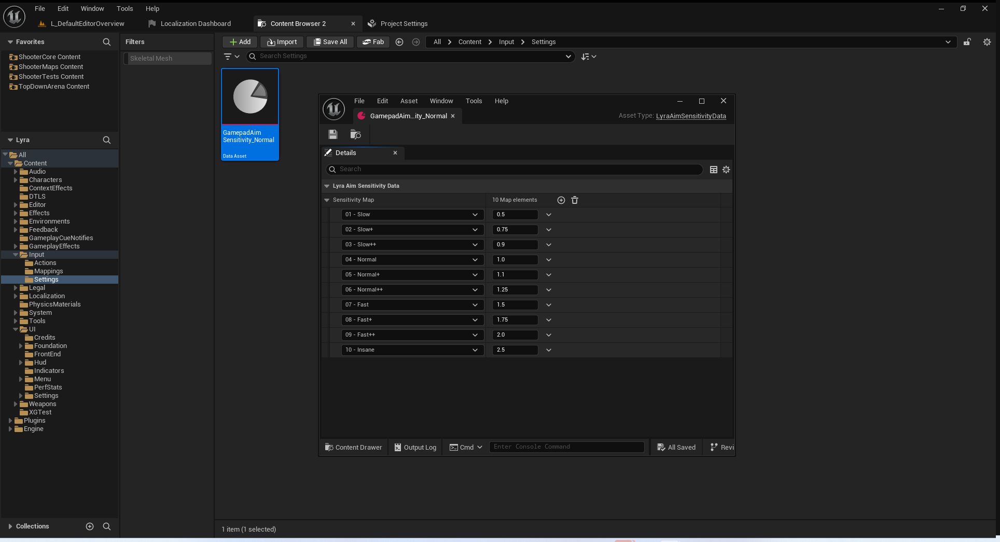
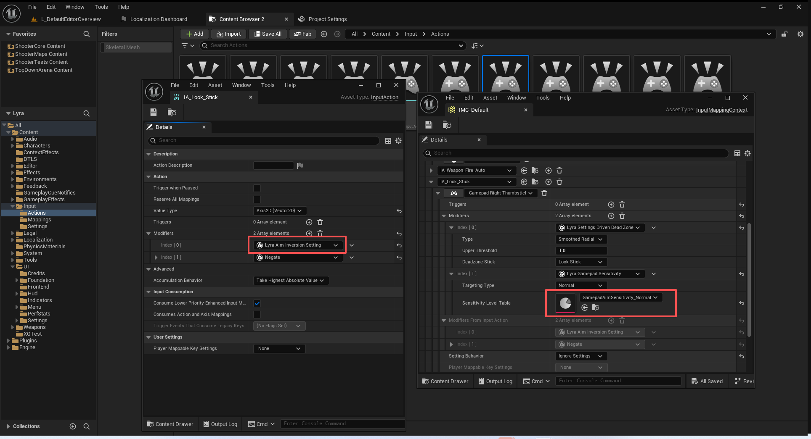

# UE5_Lyra学习指南_059_初始化手柄设置

本文章仅为小刚-B站课堂-虚幻引擎视频课程Lyra-精讲的演讲手稿.  
本套课程链接:[[UE5]虚幻引擎游戏案例Lyra精讲](https://www.bilibili.com/cheese/play/ss112001159)  
前置课程链接:[[UE5]虚幻引擎UEC++从基础到进阶](https://www.bilibili.com/cheese/play/ss28043)  

文章内容由小刚撰写,采用了以下多种方式:  
1.口述转文字  
2.AI重构  
3.参考引擎源码  
4.Lyra工程源码  
5.结合社区论坛各位大佬的解析  

- [UE5\_Lyra学习指南\_059\_初始化手柄设置](#ue5_lyra学习指南_059_初始化手柄设置)
	- [概述](#概述)
	- [代码](#代码)
	- [输入系统的修饰器](#输入系统的修饰器)
		- [灵敏度资产](#灵敏度资产)
		- [灵敏度级别](#灵敏度级别)
		- [指定修饰器](#指定修饰器)
			- [修改灵敏度](#修改灵敏度)
			- [反转](#反转)
	- [总结](#总结)


## 概述
本节无实际内容,单纯的配置代码和蓝图资产即可!
这里我们还没有讲输入系统.关于按键灵敏度和反转参考代码在LyraInputModifiers.h中.
## 代码
``` cpp
UGameSettingCollection* ULyraGameSettingRegistry::InitializeGameplaySettings(ULyraLocalPlayer* InLocalPlayer)
{
	UGameSettingCollection* Screen = NewObject<UGameSettingCollection>();
	Screen->SetDevName(TEXT("GameplayCollection"));
	Screen->SetDisplayName(LOCTEXT("GameplayCollection_Name", "Gameplay"));
	Screen->Initialize(InLocalPlayer);


{
		UGameSettingCollection* LanguageSubsection = NewObject<UGameSettingCollection>();
		LanguageSubsection->SetDevName(TEXT("LanguageCollection"));
		LanguageSubsection->SetDisplayName(LOCTEXT("LanguageCollection_Name", "Language"));
		Screen->AddSetting(LanguageSubsection);

		//----------------------------------------------------------------------------------
		{
			ULyraSettingValueDiscrete_Language* Setting = NewObject<ULyraSettingValueDiscrete_Language>();
			Setting->SetDevName(TEXT("Language"));
			Setting->SetDisplayName(LOCTEXT("LanguageSetting_Name", "Language"));
			Setting->SetDescriptionRichText(LOCTEXT("LanguageSetting_Description", "The language of the game."));
			
#if WITH_EDITOR
			if (GIsEditor)
			{
				Setting->SetDescriptionRichText(LOCTEXT("LanguageSetting_WithEditor_Description", "The language of the game.\n\n<text color=\"#ffff00\">WARNING: Language changes will not affect PIE, you'll need to run with -game to test this, or change your PIE language options in the editor preferences.</>"));
			}
#endif
			
			Setting->AddEditCondition(FWhenPlayingAsPrimaryPlayer::Get());

			LanguageSubsection->AddSetting(Setting);
		}
		//----------------------------------------------------------------------------------
	}

	{
		UGameSettingCollection* ReplaySubsection = NewObject<UGameSettingCollection>();
		ReplaySubsection->SetDevName(TEXT("ReplayCollection"));
		ReplaySubsection->SetDisplayName(LOCTEXT("ReplayCollection_Name", "Replays"));
		Screen->AddSetting(ReplaySubsection);

		//----------------------------------------------------------------------------------
		{
			UGameSettingValueDiscreteDynamic_Bool* Setting = NewObject<UGameSettingValueDiscreteDynamic_Bool>();
			Setting->SetDevName(TEXT("RecordReplay"));
			Setting->SetDisplayName(LOCTEXT("RecordReplaySetting_Name", "Record Replays"));
			Setting->SetDescriptionRichText(LOCTEXT("RecordReplaySetting_Description", "Automatically record game replays. Experimental feature, recorded demos may have playback issues."));

			Setting->SetDynamicGetter(GET_LOCAL_SETTINGS_FUNCTION_PATH(ShouldAutoRecordReplays));
			Setting->SetDynamicSetter(GET_LOCAL_SETTINGS_FUNCTION_PATH(SetShouldAutoRecordReplays));
			Setting->SetDefaultValue(GetDefault<ULyraSettingsLocal>()->ShouldAutoRecordReplays());

			Setting->AddEditCondition(FWhenPlayingAsPrimaryPlayer::Get());
			Setting->AddEditCondition(FWhenPlatformHasTrait::KillIfMissing(ULyraReplaySubsystem::GetPlatformSupportTraitTag(), TEXT("Platform does not support saving replays")));

			ReplaySubsection->AddSetting(Setting);

		}
		//----------------------------------------------------------------------------------

		//----------------------------------------------------------------------------------
		{
			UGameSettingValueDiscreteDynamic_Number* Setting = NewObject<UGameSettingValueDiscreteDynamic_Number>();
			Setting->SetDevName(TEXT("KeepReplayLimit"));
			Setting->SetDisplayName(LOCTEXT("KeepReplayLimitSetting_Name", "Keep Replay Limit"));
			Setting->SetDescriptionRichText(LOCTEXT("KeepReplayLimitSetting_Description", "Number of saved replays to keep, set to 0 for infinite."));

			Setting->SetDynamicGetter(GET_LOCAL_SETTINGS_FUNCTION_PATH(GetNumberOfReplaysToKeep));
			Setting->SetDynamicSetter(GET_LOCAL_SETTINGS_FUNCTION_PATH(SetNumberOfReplaysToKeep));
			Setting->SetDefaultValue(GetDefault<ULyraSettingsLocal>()->GetNumberOfReplaysToKeep());
			for (int32 Index = 0; Index <= 20; Index++)
			{
				Setting->AddOption(Index, FText::AsNumber(Index));
			}

			Setting->AddEditCondition(FWhenPlayingAsPrimaryPlayer::Get());
			Setting->AddEditCondition(FWhenPlatformHasTrait::KillIfMissing(ULyraReplaySubsystem::GetPlatformSupportTraitTag(), TEXT("Platform does not support saving replays")));

			ReplaySubsection->AddSetting(Setting);

		}
		//----------------------------------------------------------------------------------
	}
	

	
	return Screen;
}


```

## 输入系统的修饰器
### 灵敏度资产
``` cpp
/** Defines a set of gamepad sensitivity to a float value. */
/** 定义了一组游戏手柄的灵敏度值（以浮点数形式表示）。*/
UCLASS(MinimalAPI, BlueprintType, Const, Meta = (DisplayName = "Lyra Aim Sensitivity Data", ShortTooltip = "Data asset used to define a map of Gamepad Sensitivty to a float value."))
class ULyraAimSensitivityData : public UPrimaryDataAsset
{
	GENERATED_BODY()

public:
	UE_API ULyraAimSensitivityData(const FObjectInitializer& ObjectInitializer);
	
	UE_API const float SensitivtyEnumToFloat(const ELyraGamepadSensitivity InSensitivity) const;
	
protected:
	/** Map of SensitivityMap settings to their corresponding float */
	/** 保存了敏感度设置及其对应浮点数值的映射关系 */
	UPROPERTY(EditAnywhere, BlueprintReadWrite)
	TMap<ELyraGamepadSensitivity, float> SensitivityMap;
};
```
### 灵敏度级别
``` cpp
// 灵敏度
UENUM(BlueprintType)
enum class ELyraGamepadSensitivity : uint8
{
	// 无效
	Invalid = 0		UMETA(Hidden),

	// 慢
	Slow			UMETA(DisplayName = "01 - Slow"),

	// 慢+
	SlowPlus		UMETA(DisplayName = "02 - Slow+"),

	// 慢++
	SlowPlusPlus	UMETA(DisplayName = "03 - Slow++"),

	// 正常
	Normal			UMETA(DisplayName = "04 - Normal"),

	// 正常+
	NormalPlus		UMETA(DisplayName = "05 - Normal+"),

	// 正常++
	NormalPlusPlus	UMETA(DisplayName = "06 - Normal++"),

	// 快
	Fast			UMETA(DisplayName = "07 - Fast"),

	// 快++
	FastPlus		UMETA(DisplayName = "08 - Fast+"),

	// 快++
	FastPlusPlus	UMETA(DisplayName = "09 - Fast++"),

	// 疯狂
	Insane			UMETA(DisplayName = "10 - Insane"),

	MAX				UMETA(Hidden),
};




```
### 指定修饰器

#### 修改灵敏度

``` cpp
/** The type of targeting sensitity that should be considered */
/** 应考虑的靶向敏感性类型 */
UENUM()
enum class ELyraTargetingType : uint8
{
	/** Sensitivity to be applied why normally looking around */
	/** 正常情况下四处张望时所应具备的敏感度 */
	Normal = 0,

	/** The sensitivity that should be applied while Aiming Down Sights */
	/** 在瞄准瞄准镜时应采用的灵敏度设置 */
	ADS = 1,
};
```


``` cpp
FInputActionValue ULyraInputModifierGamepadSensitivity::ModifyRaw_Implementation(const UEnhancedPlayerInput* PlayerInput, FInputActionValue CurrentValue, float DeltaTime)
{
	// You can't scale a boolean action type
	ULyraLocalPlayer* LocalPlayer = LyraInputModifiersHelpers::GetLocalPlayer(PlayerInput);
	if (CurrentValue.GetValueType() == EInputActionValueType::Boolean || !LocalPlayer || !SensitivityLevelTable)
	{
		return CurrentValue;
	}
	
	ULyraSettingsShared* Settings = LocalPlayer->GetSharedSettings();
	ensure(Settings);

	const ELyraGamepadSensitivity Sensitivity = (TargetingType == ELyraTargetingType::Normal) ? Settings->GetGamepadLookSensitivityPreset() : Settings->GetGamepadTargetingSensitivityPreset();

	const float Scalar = SensitivityLevelTable->SensitivtyEnumToFloat(Sensitivity);

	return CurrentValue.Get<FVector>() * Scalar;
}
```


#### 反转
``` cpp
FInputActionValue ULyraInputModifierAimInversion::ModifyRaw_Implementation(const UEnhancedPlayerInput* PlayerInput, FInputActionValue CurrentValue, float DeltaTime)
{
	ULyraLocalPlayer* LocalPlayer = LyraInputModifiersHelpers::GetLocalPlayer(PlayerInput);
	if (!LocalPlayer)
	{
		return CurrentValue;
	}
	
	ULyraSettingsShared* Settings = LocalPlayer->GetSharedSettings();
	ensure(Settings);

	FVector NewValue = CurrentValue.Get<FVector>();
	
	if (Settings->GetInvertVerticalAxis())
	{
		NewValue.Y *= -1.0f;
	}
	
	if (Settings->GetInvertHorizontalAxis())
	{
		NewValue.X *= -1.0f;
	}
	
	return NewValue;
}


```


## 总结
本节主要是为了保证文档连贯性,部分演示内容看视频配置即可.