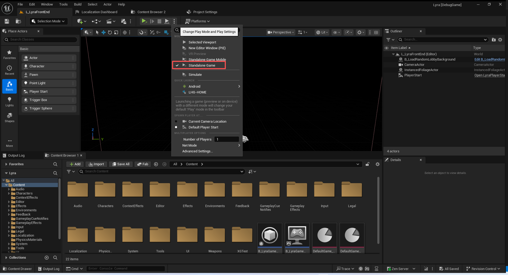
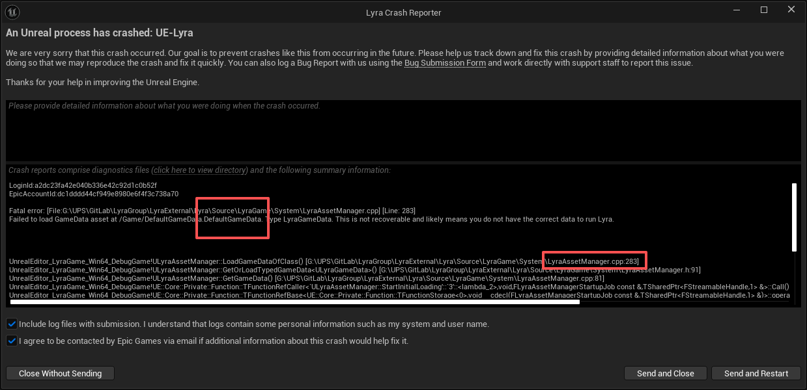
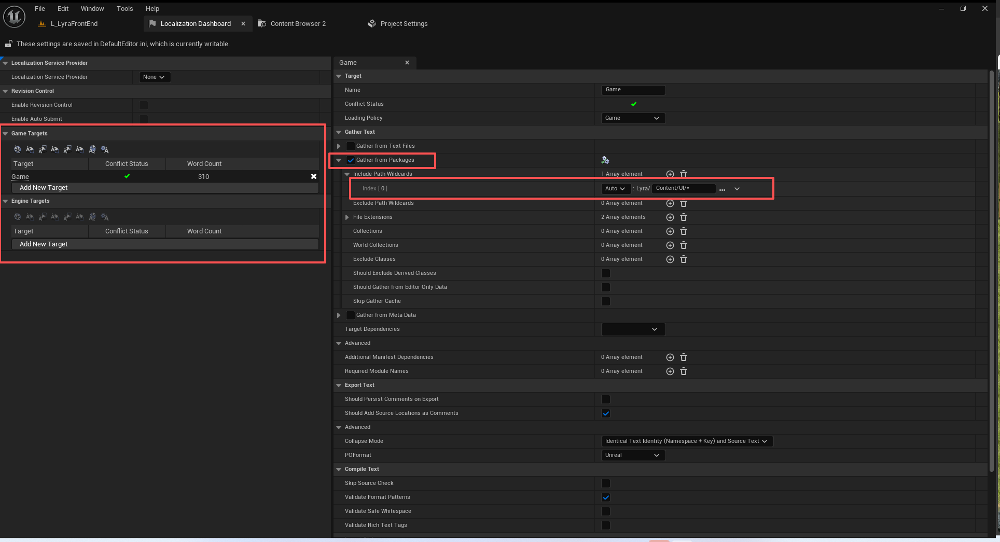
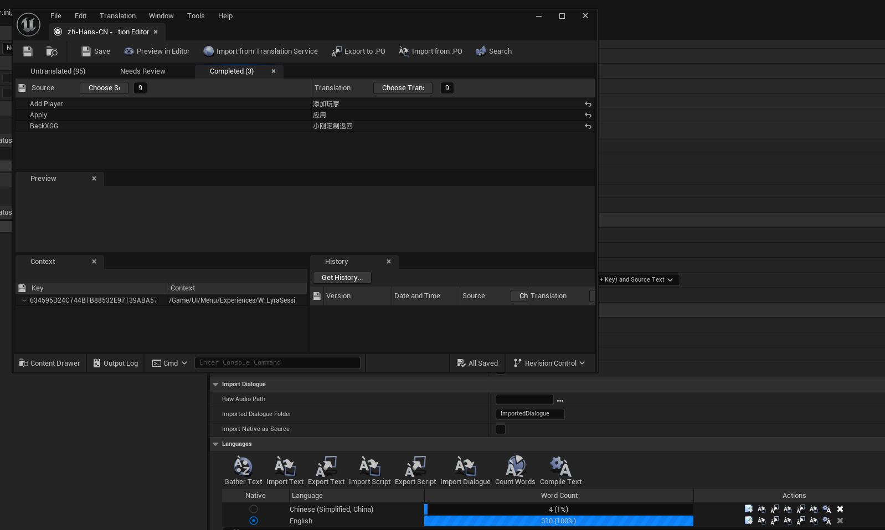
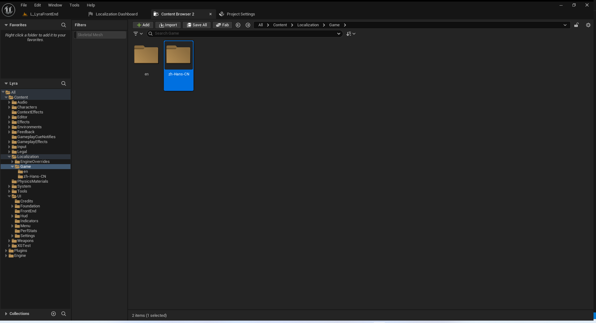
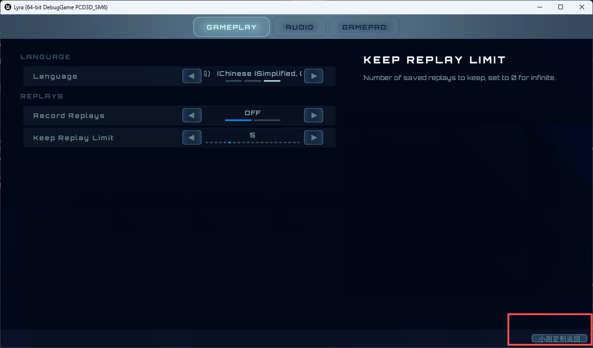

# UE5_Lyra学习指南_060_初始化游戏玩法设置

本文章仅为小刚-B站课堂-虚幻引擎视频课程Lyra-精讲的演讲手稿.  
本套课程链接:[[UE5]虚幻引擎游戏案例Lyra精讲](https://www.bilibili.com/cheese/play/ss112001159)  
前置课程链接:[[UE5]虚幻引擎UEC++从基础到进阶](https://www.bilibili.com/cheese/play/ss28043)  

文章内容由小刚撰写,采用了以下多种方式:  
1.口述转文字  
2.AI重构  
3.参考引擎源码  
4.Lyra工程源码  
5.结合社区论坛各位大佬的解析  

- [UE5\_Lyra学习指南\_060\_初始化游戏玩法设置](#ue5_lyra学习指南_060_初始化游戏玩法设置)
	- [概述](#概述)
	- [修复打包问题](#修复打包问题)
	- [最简单化的本地语言设置.](#最简单化的本地语言设置)
		- [代码](#代码)
			- [InitializeGameplaySettings](#initializegameplaysettings)
			- [ULyraSettingValueDiscrete\_Language](#ulyrasettingvaluediscrete_language)
		- [蓝图使用](#蓝图使用)
		- [演示效果](#演示效果)
	- [总结](#总结)


## 概述
本节我们主要添加以下游戏玩法设置,其中包含了语言设置和回放的功能设置.
## 修复打包问题


因为语言设置在编辑器下未生效,需要打包出来,或者是以独立的进程去StandaloneGame才可以看到.这里不是在说网络,PlayStandalone.是在模拟运行的时候选择.
当前打包或者烘焙资产没有问题.但是如果运行就会报错.报的错是显示没有找到GameData.
很显然这里是,我们漏了关于这个资产的定义在资产管理器中,需要配置它的扫描路径,指定该资产必须要进包.
编辑器下不会报错,因为它有.
打包之后,没有进包,所以错误!

``` txt
(PrimaryAssetType="LyraGameData",AssetBaseClass="/Script/LyraGame.LyraGameData",bHasBlueprintClasses=False,bIsEditorOnly=False,Directories=,SpecificAssets=("/Game/DefaultGameData.DefaultGameData"),Rules=(Priority=-1,ChunkId=-1,bApplyRecursively=True,CookRule=AlwaysCook))
```

## 最简单化的本地语言设置.
### 代码
代码,比较简单,不再赘述.
#### InitializeGameplaySettings
``` cpp
UGameSettingCollection* ULyraGameSettingRegistry::InitializeGameplaySettings(ULyraLocalPlayer* InLocalPlayer)
{
	UGameSettingCollection* Screen = NewObject<UGameSettingCollection>();
	Screen->SetDevName(TEXT("GameplayCollection"));
	Screen->SetDisplayName(LOCTEXT("GameplayCollection_Name", "Gameplay"));
	Screen->Initialize(InLocalPlayer);

	{
		UGameSettingCollection* LanguageSubsection = NewObject<UGameSettingCollection>();
		LanguageSubsection->SetDevName(TEXT("LanguageCollection"));
		LanguageSubsection->SetDisplayName(LOCTEXT("LanguageCollection_Name", "Language"));
		Screen->AddSetting(LanguageSubsection);

		//----------------------------------------------------------------------------------
		{
			ULyraSettingValueDiscrete_Language* Setting = NewObject<ULyraSettingValueDiscrete_Language>();
			Setting->SetDevName(TEXT("Language"));
			Setting->SetDisplayName(LOCTEXT("LanguageSetting_Name", "Language"));
			Setting->SetDescriptionRichText(LOCTEXT("LanguageSetting_Description", "The language of the game."));
			
#if WITH_EDITOR
			if (GIsEditor)
			{
				Setting->SetDescriptionRichText(LOCTEXT("LanguageSetting_WithEditor_Description", "The language of the game.\n\n<text color=\"#ffff00\">WARNING: Language changes will not affect PIE, you'll need to run with -game to test this, or change your PIE language options in the editor preferences.</>"));
			}
#endif
			
			Setting->AddEditCondition(FWhenPlayingAsPrimaryPlayer::Get());

			LanguageSubsection->AddSetting(Setting);
		}
		//----------------------------------------------------------------------------------
	}

	{
		UGameSettingCollection* ReplaySubsection = NewObject<UGameSettingCollection>();
		ReplaySubsection->SetDevName(TEXT("ReplayCollection"));
		ReplaySubsection->SetDisplayName(LOCTEXT("ReplayCollection_Name", "Replays"));
		Screen->AddSetting(ReplaySubsection);

		//----------------------------------------------------------------------------------
		{
			UGameSettingValueDiscreteDynamic_Bool* Setting = NewObject<UGameSettingValueDiscreteDynamic_Bool>();
			Setting->SetDevName(TEXT("RecordReplay"));
			Setting->SetDisplayName(LOCTEXT("RecordReplaySetting_Name", "Record Replays"));
			Setting->SetDescriptionRichText(LOCTEXT("RecordReplaySetting_Description", "Automatically record game replays. Experimental feature, recorded demos may have playback issues."));

			Setting->SetDynamicGetter(GET_LOCAL_SETTINGS_FUNCTION_PATH(ShouldAutoRecordReplays));
			Setting->SetDynamicSetter(GET_LOCAL_SETTINGS_FUNCTION_PATH(SetShouldAutoRecordReplays));
			Setting->SetDefaultValue(GetDefault<ULyraSettingsLocal>()->ShouldAutoRecordReplays());

			Setting->AddEditCondition(FWhenPlayingAsPrimaryPlayer::Get());
			Setting->AddEditCondition(FWhenPlatformHasTrait::KillIfMissing(ULyraReplaySubsystem::GetPlatformSupportTraitTag(), TEXT("Platform does not support saving replays")));

			ReplaySubsection->AddSetting(Setting);

		}
		//----------------------------------------------------------------------------------

		//----------------------------------------------------------------------------------
		{
			UGameSettingValueDiscreteDynamic_Number* Setting = NewObject<UGameSettingValueDiscreteDynamic_Number>();
			Setting->SetDevName(TEXT("KeepReplayLimit"));
			Setting->SetDisplayName(LOCTEXT("KeepReplayLimitSetting_Name", "Keep Replay Limit"));
			Setting->SetDescriptionRichText(LOCTEXT("KeepReplayLimitSetting_Description", "Number of saved replays to keep, set to 0 for infinite."));

			Setting->SetDynamicGetter(GET_LOCAL_SETTINGS_FUNCTION_PATH(GetNumberOfReplaysToKeep));
			Setting->SetDynamicSetter(GET_LOCAL_SETTINGS_FUNCTION_PATH(SetNumberOfReplaysToKeep));
			Setting->SetDefaultValue(GetDefault<ULyraSettingsLocal>()->GetNumberOfReplaysToKeep());
			for (int32 Index = 0; Index <= 20; Index++)
			{
				Setting->AddOption(Index, FText::AsNumber(Index));
			}

			Setting->AddEditCondition(FWhenPlayingAsPrimaryPlayer::Get());
			Setting->AddEditCondition(FWhenPlatformHasTrait::KillIfMissing(ULyraReplaySubsystem::GetPlatformSupportTraitTag(), TEXT("Platform does not support saving replays")));

			ReplaySubsection->AddSetting(Setting);

		}
		//----------------------------------------------------------------------------------
	}

	return Screen;
}

```
#### ULyraSettingValueDiscrete_Language
``` cpp
static const int32 SettingSystemDefaultLanguageIndex = 0;

ULyraSettingValueDiscrete_Language::ULyraSettingValueDiscrete_Language()
{
}

void ULyraSettingValueDiscrete_Language::OnInitialized()
{
	Super::OnInitialized();

	const TArray<FString> AllCultureNames = FTextLocalizationManager::Get().GetLocalizedCultureNames(ELocalizationLoadFlags::Game);
	for (const FString& CultureName : AllCultureNames)
	{
		if (FInternationalization::Get().IsCultureAllowed(CultureName))
		{
			AvailableCultureNames.Add(CultureName);
		}
	}

	AvailableCultureNames.Insert(TEXT(""), SettingSystemDefaultLanguageIndex);
}

void ULyraSettingValueDiscrete_Language::StoreInitial()
{
	// ?
}

void ULyraSettingValueDiscrete_Language::OnApply()
{
	if (UCommonMessagingSubsystem* Messaging = LocalPlayer->GetSubsystem<UCommonMessagingSubsystem>())
	{
		Messaging->ShowConfirmation(
			UCommonGameDialogDescriptor::CreateConfirmationOk(
			LOCTEXT("WarningLanguage_Title", "Language Changed"),
			LOCTEXT("WarningLanguage_Message", "You will need to restart the game completely for all language related changes to take effect.")
			)
		);
	}
}

void ULyraSettingValueDiscrete_Language::ResetToDefault()
{
	SetDiscreteOptionByIndex(SettingSystemDefaultLanguageIndex);
}

void ULyraSettingValueDiscrete_Language::RestoreToInitial()
{
	if (ULyraSettingsShared* Settings = CastChecked<ULyraLocalPlayer>(LocalPlayer)->GetSharedSettings())
	{
		Settings->ClearPendingCulture();
		NotifySettingChanged(EGameSettingChangeReason::RestoreToInitial);
	}
}

void ULyraSettingValueDiscrete_Language::SetDiscreteOptionByIndex(int32 Index)
{
	if (ULyraSettingsShared* Settings = CastChecked<ULyraLocalPlayer>(LocalPlayer)->GetSharedSettings())
	{
		if (Index == SettingSystemDefaultLanguageIndex)
		{
			Settings->ResetToDefaultCulture();
		}
		else if (AvailableCultureNames.IsValidIndex(Index))
		{
			Settings->SetPendingCulture(AvailableCultureNames[Index]);
		}
		
		NotifySettingChanged(EGameSettingChangeReason::Change);
	}
}

int32 ULyraSettingValueDiscrete_Language::GetDiscreteOptionIndex() const
{
	if (const ULyraSettingsShared* Settings = CastChecked<ULyraLocalPlayer>(LocalPlayer)->GetSharedSettings())
	{
		if (Settings->ShouldResetToDefaultCulture())
		{
			return SettingSystemDefaultLanguageIndex;
		}

		// We prefer the pending culture to the current culture as the options UI updates the pending culture before it 
		// gets applied, and we need the UI to reflect that choice
		// 我们更倾向于采用“待处理”文化模式，因为选项界面会在应用之前先更新“待处理”文化状态，这样用户界面就能反映出这一选择。
		FString PendingCulture = Settings->GetPendingCulture();
		if (PendingCulture.IsEmpty())
		{
			if (Settings->IsUsingDefaultCulture())
			{
				return SettingSystemDefaultLanguageIndex;
			}

			PendingCulture = FInternationalization::Get().GetCurrentCulture()->GetName();
		}

		// Try to find an exact match
		// 尝试寻找完全匹配的结果
		{
			const int32 ExactMatchIndex = AvailableCultureNames.IndexOfByKey(PendingCulture);
			if (ExactMatchIndex != INDEX_NONE)
			{
				return ExactMatchIndex;
			}
		}

		// Try to find a prioritized match (eg, allowing "en-US" to show as "en" in the UI)
		// 尝试找到一个优先级较高的匹配项（例如，在用户界面中将“en-US”显示为“en”）
		const TArray<FString> PrioritizedPendingCultures = FInternationalization::Get().GetPrioritizedCultureNames(PendingCulture);
		for (int32 i = 0; i < AvailableCultureNames.Num(); ++i)
		{
			if (PrioritizedPendingCultures.Contains(AvailableCultureNames[i]))
			{
				return i;
			}
		}
	}

	return 0;
}

TArray<FText> ULyraSettingValueDiscrete_Language::GetDiscreteOptions() const
{
	TArray<FText> Options;

	for (const FString& CultureName : AvailableCultureNames)
	{
		if (CultureName == TEXT(""))
		{
			const FCulturePtr SystemDefaultCulture = FInternationalization::Get().GetDefaultCulture();
			if (ensure(SystemDefaultCulture))
			{
				const FString& DefaultCultureDisplayName = SystemDefaultCulture->GetDisplayName();
				FText LocalizedSystemDefault = FText::Format(LOCTEXT("SystemDefaultLanguage", "System Default ({0})"), FText::FromString(DefaultCultureDisplayName));

				Options.Add(MoveTemp(LocalizedSystemDefault));
			}
		}
		else
		{
			FCulturePtr Culture = FInternationalization::Get().GetCulture(CultureName);
			if (ensureMsgf(Culture, TEXT("Unable to find Culture '%s'!"), *CultureName))
			{
				const FString CultureDisplayName = Culture->GetDisplayName();
				const FString CultureNativeName = Culture->GetNativeName();

				// Only show both names if they're different (to avoid repetition)
				// 仅在两人的名字不同时显示这两个名字（以避免重复）
				FString Entry = (!CultureNativeName.Equals(CultureDisplayName, ESearchCase::CaseSensitive))
					? FString::Printf(TEXT("%s (%s)"), *CultureNativeName, *CultureDisplayName)
					: CultureNativeName;

				Options.Add(FText::FromString(Entry));
			}
		}
	}

	return Options;
}
```

### 蓝图使用
这个本地化设置只演示最简单的使用.为了避免使用过程出现其他问题,将多余的扫描路径和多余的语言都删掉!
因为我们是拷贝过来的,这里会显示很多种语言,等我们初始化完成之后,就只会显示系统默认语言,中文和英文三种.

收集文本,编辑翻译即可.

注意观察以下路径
All/Content/Localization

### 演示效果


## 总结
本节演示了一个简单的本地化操作流程.但实际商业应用的时候是比较复杂的.
至少得一键翻译吧.
我们可以手动把keyvalue导出成文本,然后翻译好再导入进来.或者直接集成到引擎流程自动翻译即可.
记得映射关于设置的细节面板.