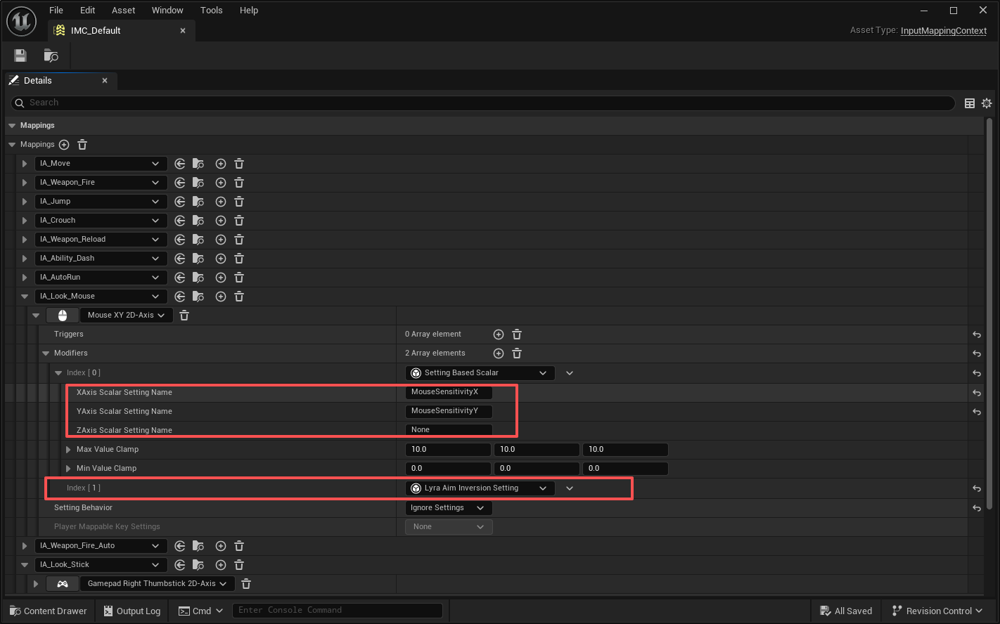
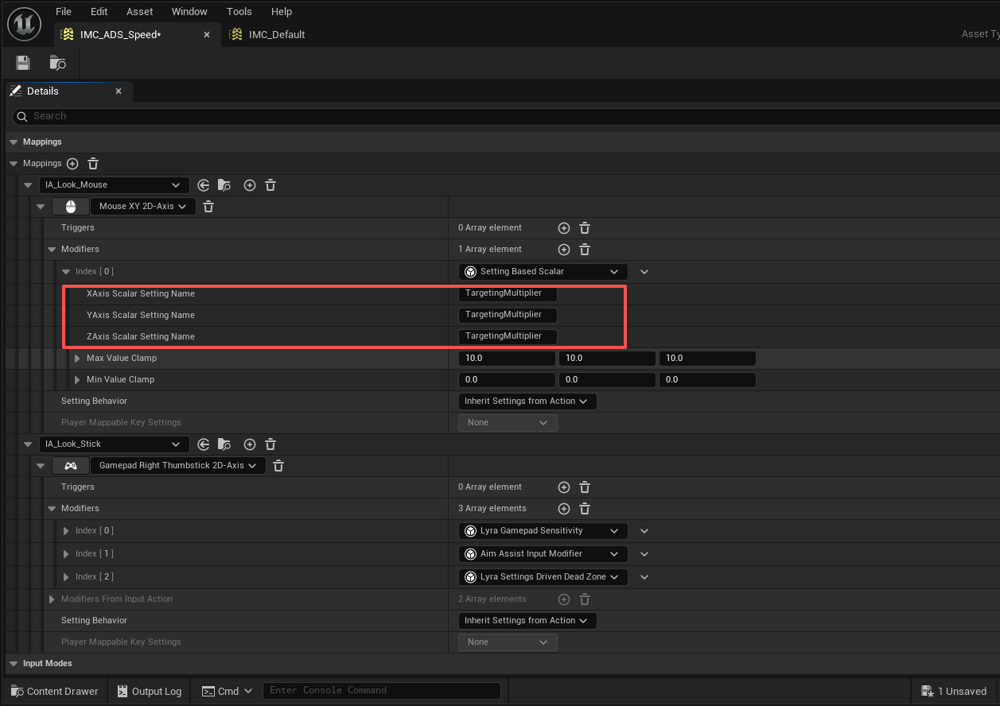
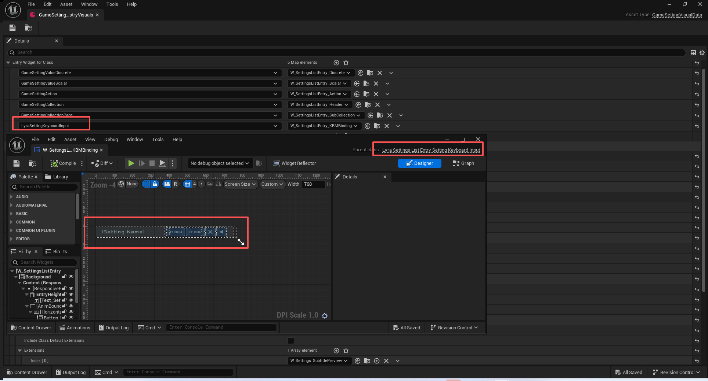
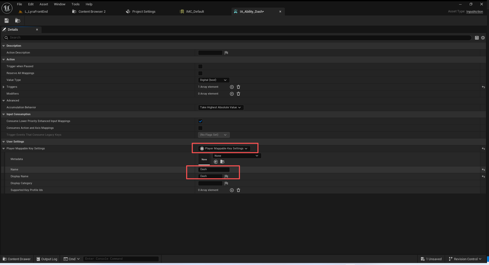
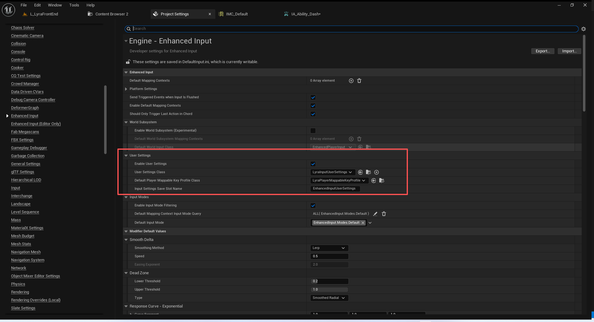
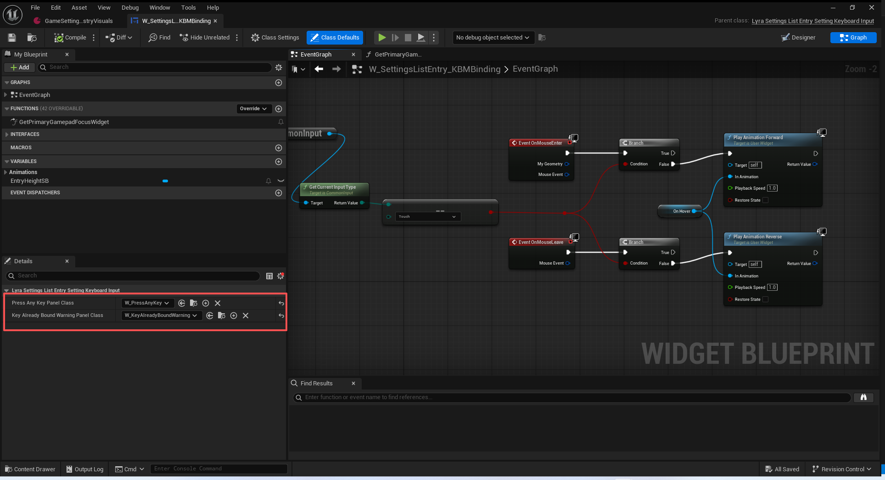
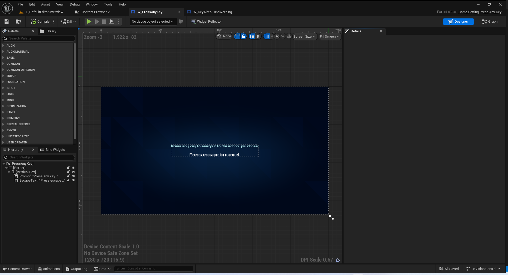
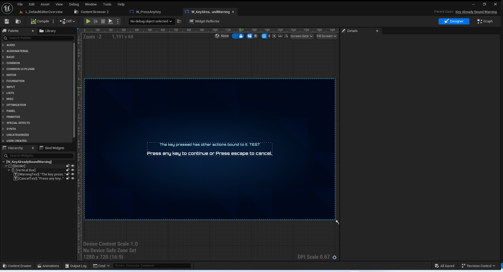

# UE5_UE5_Lyra学习指南_061_初始化键盘鼠标绑定设置

本文章仅为小刚-B站课堂-虚幻引擎视频课程Lyra-精讲的演讲手稿.  
本套课程链接:[[UE5]虚幻引擎游戏案例Lyra精讲](https://www.bilibili.com/cheese/play/ss112001159)  
前置课程链接:[[UE5]虚幻引擎UEC++从基础到进阶](https://www.bilibili.com/cheese/play/ss28043)  

文章内容由小刚撰写,采用了以下多种方式:  
1.口述转文字  
2.AI重构  
3.参考引擎源码  
4.Lyra工程源码  
5.结合社区论坛各位大佬的解析  

- [UE5\_UE5\_Lyra学习指南\_061\_初始化键盘鼠标绑定设置](#ue5_ue5_lyra学习指南_061_初始化键盘鼠标绑定设置)
	- [概述](#概述)
	- [鼠标灵敏度](#鼠标灵敏度)
	- [开镜灵敏度](#开镜灵敏度)
	- [反转](#反转)
	- [键位绑定设置](#键位绑定设置)
		- [蓝图指定控件实例](#蓝图指定控件实例)
		- [游戏设置\_键盘鼠标](#游戏设置_键盘鼠标)
		- [初始化输入数据](#初始化输入数据)
	- [增强型输入系统的拓展](#增强型输入系统的拓展)
		- [UEnhancedPlayerMappableKeyProfile](#uenhancedplayermappablekeyprofile)
		- [PlayerMappableKeySettings是如何传递的](#playermappablekeysettings是如何传递的)
		- [输入是如何注册进来的!](#输入是如何注册进来的)
	- [蓝图触发绑定](#蓝图触发绑定)
		- [键槽的枚举](#键槽的枚举)
		- [键位绑定的主控件](#键位绑定的主控件)
		- [监听按键](#监听按键)
		- [监听到重复按键](#监听到重复按键)
	- [总结](#总结)


## 概述
本节我们讲解关于键盘和鼠标的部分.
它这里的设置灵敏度是通过反射去做的,并且需要通过蓝图设置.
它的键盘鼠映射主要是通过输入上下文去做的.因为涉及到了体验,编辑器下会有点小bug.可以通过体验指定来临时处理
## 鼠标灵敏度
``` cpp
	{
		UGameSettingCollection* Sensitivity = NewObject<UGameSettingCollection>();
		Sensitivity->SetDevName(TEXT("MouseSensitivityCollection"));
		Sensitivity->SetDisplayName(LOCTEXT("MouseSensitivityCollection_Name", "Sensitivity"));
		Screen->AddSetting(Sensitivity);

		// 以下代码真牛逼 是通过反射去获取值 然后在蓝图配置的 所以导出都找不到代码!
		// ULyraSettingBasedScalar配置了对应的属性名称,然后在蓝图的输入上下文中针对某个输入资产进行配置修饰器!
		// IMC_Default
		//----------------------------------------------------------------------------------
		{
			// Yaw
			UGameSettingValueScalarDynamic* Setting = NewObject<UGameSettingValueScalarDynamic>();
			Setting->SetDevName(TEXT("MouseSensitivityYaw"));
			Setting->SetDisplayName(LOCTEXT("MouseSensitivityYaw_Name", "X-Axis Sensitivity"));
			Setting->SetDescriptionRichText(LOCTEXT("MouseSensitivityYaw_Description", "Sets the sensitivity of the mouse's horizontal (x) axis. With higher settings the camera will move faster when looking left and right with the mouse."));

			Setting->SetDynamicGetter(GET_SHARED_SETTINGS_FUNCTION_PATH(GetMouseSensitivityX));
			Setting->SetDynamicSetter(GET_SHARED_SETTINGS_FUNCTION_PATH(SetMouseSensitivityX));
			Setting->SetDefaultValue(GetDefault<ULyraSettingsShared>()->GetMouseSensitivityX());
			Setting->SetDisplayFormat(UGameSettingValueScalarDynamic::RawTwoDecimals);
			Setting->SetSourceRangeAndStep(TRange<double>(0, 10), 0.01);
			Setting->SetMinimumLimit(0.01);

			Setting->AddEditCondition(WhenPlatformSupportsMouseAndKeyboard);

			Sensitivity->AddSetting(Setting);
		}
	}
```
你在上面这段代码是找不到GetMouseSensitivityX的使用的.
是通过LyraSettingBasedScalar这个输入修饰器去做的.
``` cpp

/** 
*  Scales input basedon a double property in the SharedUserSettings
*  根据“共享用户设置”中的双属性来输入数值
*/
UCLASS(NotBlueprintable, MinimalAPI, meta = (DisplayName = "Setting Based Scalar"))
class ULyraSettingBasedScalar : public UInputModifier
{
	GENERATED_BODY()

public:

	/** Name of the property that will be used to clamp the X Axis of this value */
	/** 用于限制此值 X 轴范围的属性名称 */
	UPROPERTY(EditInstanceOnly, BlueprintReadWrite, Category=Settings)
	FName XAxisScalarSettingName = NAME_None;

	/** Name of the property that will be used to clamp the Y Axis of this value */
	/** 用于限制此值 Y 轴范围的属性名称 */
	UPROPERTY(EditInstanceOnly, BlueprintReadWrite, Category=Settings)
	FName YAxisScalarSettingName = NAME_None;

	/** Name of the property that will be used to clamp the Z Axis of this value */
	/** 用于限制此值 Z 轴范围的属性名称 */
	UPROPERTY(EditInstanceOnly, BlueprintReadWrite, Category=Settings)
	FName ZAxisScalarSettingName = NAME_None;
	
	/** Set the maximium value of this setting on each axis. */
	/** 设置此设置在每个轴上的最大值。*/
	UPROPERTY(EditInstanceOnly, BlueprintReadWrite, Category=Settings)
	FVector MaxValueClamp = FVector(10.0, 10.0, 10.0);
	
	/** Set the minimum value of this setting on each axis. */
	/** 设置此设置在每个轴上的最小值。*/
	UPROPERTY(EditInstanceOnly, BlueprintReadWrite, Category=Settings)
	FVector MinValueClamp = FVector::ZeroVector;

protected:
	virtual FInputActionValue ModifyRaw_Implementation(const UEnhancedPlayerInput* PlayerInput, FInputActionValue CurrentValue, float DeltaTime) override;

	/** FProperty Cache that will be populated with any found FProperty's on the settings class so that we don't need to look them up each frame */
	/** 一个用于缓存所找到的“FProperty”对象的属性缓存，这些“FProperty”对象将存储在设置类中，这样我们就不必在每一帧都去查找它们了 */
	TArray<const FProperty*> PropertyCache;
};

```
使用名称,然后通过反射去读取值
``` cpp

FInputActionValue ULyraSettingBasedScalar::ModifyRaw_Implementation(const UEnhancedPlayerInput* PlayerInput, FInputActionValue CurrentValue, float DeltaTime)
{
	if (ensureMsgf(CurrentValue.GetValueType() != EInputActionValueType::Boolean, TEXT("Setting Based Scalar modifier doesn't support boolean values.")))
	{
		if (ULyraLocalPlayer* LocalPlayer = LyraInputModifiersHelpers::GetLocalPlayer(PlayerInput))
		{
			const UClass* SettingsClass = ULyraSettingsShared::StaticClass();
			ULyraSettingsShared* SharedSettings = LocalPlayer->GetSharedSettings();
			
			const bool bHasCachedProperty = PropertyCache.Num() == 3;
			
			const FProperty* XAxisValue = bHasCachedProperty ? PropertyCache[0] : SettingsClass->FindPropertyByName(XAxisScalarSettingName);
			const FProperty* YAxisValue = bHasCachedProperty ? PropertyCache[1] : SettingsClass->FindPropertyByName(YAxisScalarSettingName);
			const FProperty* ZAxisValue = bHasCachedProperty ? PropertyCache[2] : SettingsClass->FindPropertyByName(ZAxisScalarSettingName);

			if (PropertyCache.IsEmpty())
			{
				PropertyCache.Emplace(XAxisValue);
				PropertyCache.Emplace(YAxisValue);
				PropertyCache.Emplace(ZAxisValue);
			}

			FVector ScalarToUse = FVector(1.0, 1.0, 1.0);

			switch (CurrentValue.GetValueType())
			{
			case EInputActionValueType::Axis3D:
				ScalarToUse.Z = ZAxisValue ? *ZAxisValue->ContainerPtrToValuePtr<double>(SharedSettings) : 1.0;
				//[[fallthrough]];
			case EInputActionValueType::Axis2D:
				ScalarToUse.Y = YAxisValue ? *YAxisValue->ContainerPtrToValuePtr<double>(SharedSettings) : 1.0;
				//[[fallthrough]];
			case EInputActionValueType::Axis1D:
				ScalarToUse.X = XAxisValue ? *XAxisValue->ContainerPtrToValuePtr<double>(SharedSettings) : 1.0;
				break;
			}

			ScalarToUse.X = FMath::Clamp(ScalarToUse.X, MinValueClamp.X, MaxValueClamp.X);
			ScalarToUse.Y = FMath::Clamp(ScalarToUse.Y, MinValueClamp.Y, MaxValueClamp.Y);
			ScalarToUse.Z = FMath::Clamp(ScalarToUse.Z, MinValueClamp.Z, MaxValueClamp.Z);
			
			return CurrentValue.Get<FVector>() * ScalarToUse;
		}
	}
	
	return CurrentValue;	
}

```

蓝图配置如下:


## 开镜灵敏度
``` cpp
//----------------------------------------------------------------------------------
		{
			// 设置在进行目标攻击时降低鼠标灵敏度的调节值。将数值设为 100% 时，在进行目标攻击时不会出现操作迟缓的情况。数值越低，在进行目标攻击时操作迟缓的情况就越明显。
			// 这个也是走蓝图配置的IMC_ADS_Speed
			UGameSettingValueScalarDynamic* Setting = NewObject<UGameSettingValueScalarDynamic>();
			Setting->SetDevName(TEXT("MouseTargetingMultiplier"));
			Setting->SetDisplayName(LOCTEXT("MouseTargetingMultiplier_Name", "Targeting Sensitivity"));
			Setting->SetDescriptionRichText(LOCTEXT("MouseTargetingMultiplier_Description", "Sets the modifier for reducing mouse sensitivity when targeting. 100% will have no slow down when targeting. Lower settings will have more slow down when targeting."));

			Setting->SetDynamicGetter(GET_SHARED_SETTINGS_FUNCTION_PATH(GetTargetingMultiplier));
			Setting->SetDynamicSetter(GET_SHARED_SETTINGS_FUNCTION_PATH(SetTargetingMultiplier));
			Setting->SetDefaultValue(GetDefault<ULyraSettingsShared>()->GetTargetingMultiplier());
			Setting->SetDisplayFormat(UGameSettingValueScalarDynamic::RawTwoDecimals);
			Setting->SetSourceRangeAndStep(TRange<double>(0, 10), 0.01);
			Setting->SetMinimumLimit(0.01);

			Setting->AddEditCondition(WhenPlatformSupportsMouseAndKeyboard);

			Sensitivity->AddSetting(Setting);
		}

```



## 反转
``` cpp
		{
			// 垂直翻转
			UGameSettingValueDiscreteDynamic_Bool* Setting = NewObject<UGameSettingValueDiscreteDynamic_Bool>();
			Setting->SetDevName(TEXT("InvertVerticalAxis"));
			Setting->SetDisplayName(LOCTEXT("InvertVerticalAxis_Name", "Invert Vertical Axis"));
			Setting->SetDescriptionRichText(LOCTEXT("InvertVerticalAxis_Description", "Enable the inversion of the vertical look axis."));

			Setting->SetDynamicGetter(GET_SHARED_SETTINGS_FUNCTION_PATH(GetInvertVerticalAxis));
			Setting->SetDynamicSetter(GET_SHARED_SETTINGS_FUNCTION_PATH(SetInvertVerticalAxis));
			Setting->SetDefaultValue(GetDefault<ULyraSettingsShared>()->GetInvertVerticalAxis());

			Setting->AddEditCondition(WhenPlatformSupportsMouseAndKeyboard);

			Sensitivity->AddSetting(Setting);
		}

```
``` cpp
//////////////////////////////////////////////////////////////////////
// ULyraInputModifierAimInversion

FInputActionValue ULyraInputModifierAimInversion::ModifyRaw_Implementation(const UEnhancedPlayerInput* PlayerInput, FInputActionValue CurrentValue, float DeltaTime)
{
	ULyraLocalPlayer* LocalPlayer = LyraInputModifiersHelpers::GetLocalPlayer(PlayerInput);
	if (!LocalPlayer)
	{
		return CurrentValue;
	}
	
	ULyraSettingsShared* Settings = LocalPlayer->GetSharedSettings();
	ensure(Settings);

	FVector NewValue = CurrentValue.Get<FVector>();
	
	if (Settings->GetInvertVerticalAxis())
	{
		NewValue.Y *= -1.0f;
	}
	
	if (Settings->GetInvertHorizontalAxis())
	{
		NewValue.X *= -1.0f;
	}
	
	return NewValue;
}


```

## 键位绑定设置
核心逻辑就是从UEnhancedInputLocalPlayerSubsystem读取到增强型用户输入设置,
然后将用户设置中的注册的键位读取出来,然后实例化键位的游戏设置ULyraSettingKeyboardInput进行添加即可!

``` cpp

	// Bindings for Mouse & Keyboard - Automatically Generated
	// 鼠标和键盘的绑定 - 自动生成的设置
	////////////////////////////////////////////////////////////////////////////////////
	{
		UGameSettingCollection* KeyBinding = NewObject<UGameSettingCollection>();
		KeyBinding->SetDevName(TEXT("KeyBindingCollection"));
		KeyBinding->SetDisplayName(LOCTEXT("KeyBindingCollection_Name", "Keyboard & Mouse"));
		Screen->AddSetting(KeyBinding);

		// 获取玩家对应的增强型输入子系统
		const UEnhancedInputLocalPlayerSubsystem* EISubsystem = InLocalPlayer->GetSubsystem<UEnhancedInputLocalPlayerSubsystem>();
		// 获取用户的增强型输入设置
		const UEnhancedInputUserSettings* UserSettings = EISubsystem->GetUserSettings();

		// If you want to just get one profile pair, then you can do UserSettings->GetCurrentProfile
		// 如果您只想获取一对用户配置文件，那么您可以执行“用户设置” -> “获取当前配置文件”操作。
		
		// A map of key bindings mapped to their display category
		// 映射表：将按键绑定与显示类别进行关联
		TMap<FString, UGameSettingCollection*> CategoryToSettingCollection;

		// Returns an existing setting collection for the display category if there is one.
		// If there isn't one, then it will create a new one and initialize it
		// 如果存在显示类别相关的现有设置集合，则返回该集合。
		// 如果不存在，则会创建一个新的集合并对其进行初始化。
		auto GetOrCreateSettingCollection = [&CategoryToSettingCollection, &Screen](FText DisplayCategory) -> UGameSettingCollection*
		{
			static const FString DefaultDevName = TEXT("Default_KBM");
			static const FText DefaultDevDisplayName = NSLOCTEXT("LyraInputSettings", "LyraInputDefaults", "Default Experiences");

			// 如果是空的 就给一个默认的名字
			if (DisplayCategory.IsEmpty())
			{
				DisplayCategory = DefaultDevDisplayName;
			}
			// 转换成字符串
			FString DisplayCatString = DisplayCategory.ToString();

			// 看看是不是已经创建过了
			if (UGameSettingCollection** ExistingCategory = CategoryToSettingCollection.Find(DisplayCatString))
			{
				return *ExistingCategory;
			}
			
			UGameSettingCollection* ConfigSettingCollection = NewObject<UGameSettingCollection>();
			ConfigSettingCollection->SetDevName(FName(DisplayCatString));
			ConfigSettingCollection->SetDisplayName(DisplayCategory);
			Screen->AddSetting(ConfigSettingCollection);
			// 缓存起来 避免重复创建
			CategoryToSettingCollection.Add(DisplayCatString, ConfigSettingCollection);
			
			return ConfigSettingCollection;
		};

		static TSet<FName> CreatedMappingNames;
		CreatedMappingNames.Reset();
		// 这里需要解释一下为什么编辑器看不到键位选项 是因为没有注册输入配置 说白了就是空的!!!! 因为编辑器下和打包之后 那个UserSettings的实例化时机不一样
		// 如何修复也很简单 直接在Experience里面添加以下指定的设置即可!
		for (const TPair<FString, TObjectPtr<UEnhancedPlayerMappableKeyProfile>>& ProfilePair : UserSettings->GetAllAvailableKeyProfiles())
		{
			const FString& ProfileName = ProfilePair.Key;
			const TObjectPtr<UEnhancedPlayerMappableKeyProfile>& Profile = ProfilePair.Value;

			for (const TPair<FName, FKeyMappingRow>& RowPair : Profile->GetPlayerMappingRows())
			{
				// Create a setting row for anything with valid mappings and that we haven't created yet
				// 为具有有效映射关系且尚未创建的任何内容创建一个设置行
				if (RowPair.Value.HasAnyMappings() /* && !CreatedMappingNames.Contains(RowPair.Key)*/)
				{
					// We only want keyboard keys on this settings screen, so we will filter down by mappings
					// that are set to keyboard keys
					// 我们只希望在该设置界面中显示键盘按键，因此我们将通过筛选具有键盘按键映射设置的选项来进行过滤。
					FPlayerMappableKeyQueryOptions Options = {};
					/** 若已指定，则在检查键类型及轴是否相同时，将使用此键进行匹配。*/
					Options.KeyToMatch = EKeys::W;
					/** 若为真，则仅将那些在“IsGamepadKey”、“IsTouch”和“IsGesture”这三个属性上具有相同值的键包含在本次查询的结果中 */
					Options.bMatchBasicKeyTypes = true;
															
					const FText& DesiredDisplayCategory = RowPair.Value.Mappings.begin()->GetDisplayCategory();
					
					if (UGameSettingCollection* Collection = GetOrCreateSettingCollection(DesiredDisplayCategory))
					{
						// Create the settings widget and initialize it, adding it to this config's section
						// 创建设置控件并对其进行初始化，将其添加到此配置的相应部分中
						ULyraSettingKeyboardInput* InputBinding = NewObject<ULyraSettingKeyboardInput>();

						InputBinding->InitializeInputData(Profile, RowPair.Value, Options);
						InputBinding->AddEditCondition(WhenPlatformSupportsMouseAndKeyboard);

						Collection->AddSetting(InputBinding);
						CreatedMappingNames.Add(RowPair.Key);
					}
					else
					{
						ensure(false);
					}
				}
			}
		}
	}


```
### 蓝图指定控件实例


### 游戏设置_键盘鼠标

``` cpp
//--------------------------------------
// ULyraSettingKeyboardInput
//--------------------------------------

UCLASS()
class ULyraSettingKeyboardInput : public UGameSettingValue
{
	GENERATED_BODY()

public:
	// 构造函数 设置不生成分析报告
	ULyraSettingKeyboardInput();

	/**
	 *	 初始化输入数据
	 * 
	 * @param KeyProfile  表示用户可以为其玩家可映射按键所创建的一个“配置文件” 这个必须存在 
	* @param MappingData  存储所有与单个映射名称绑定的映射。由于单个映射可以有多个与其相关的绑定，并且该系统应当与蓝图兼容， 所以这需要是一个结构体（蓝图不支持嵌套容器）。
	 * @param QueryOptions 在查询玩家可操作键配置文件中与特定操作相对应的按键时的选项。
	 */
	void InitializeInputData(const UEnhancedPlayerMappableKeyProfile* KeyProfile, const FKeyMappingRow& MappingData, const FPlayerMappableKeyQueryOptions& QueryOptions);

	// 根据槽位获取到映射的键位名称
	FText GetKeyTextFromSlot(const EPlayerMappableKeySlot InSlot) const;

	// 存储初始值
	virtual void StoreInitial() override;

	// 恢复默认值
	virtual void ResetToDefault() override;

	// 恢复到初始化值
	virtual void RestoreToInitial() override;

	// 映射键位值 通过UEnhancedInputUserSettings
	bool ChangeBinding(int32 InKeyBindSlot, FKey NewKey);
	// 获取到此键位所有的映射数量 避免重复映射
	void GetAllMappedActionsFromKey(int32 InKeyBindSlot, FKey Key, TArray<FName>& OutActionNames) const;

	/** Returns true if mappings on this setting have been customized */
	/** 如果此设置的映射已被个性化，则返回 true */
	bool IsMappingCustomized() const;
	
	FText GetSettingDisplayName() const;
	// 获取蓝图中配置的分类
	FText GetSettingDisplayCategory() const;

	//通过此操作的映射名称找到所有的映射按键
	const FKeyMappingRow* FindKeyMappingRow() const;
	// 找到对应的增强型输入玩家可配置键位映射文件
	UEnhancedPlayerMappableKeyProfile* FindMappableKeyProfile() const;
	// 获取用户的增强型输入设置
	UEnhancedInputUserSettings* GetUserSettings() const;
	
protected:
	/** ULyraSetting */
	virtual void OnInitialized() override;

protected:

	/** The name of this action's mappings */
	/** 此操作的映射名称 */
	FName ActionMappingName;

	/** The query options to filter down keys on this setting for */
	/** 用于根据此设置筛选出相关键的查询选项 */
	FPlayerMappableKeyQueryOptions QueryOptions;

	/** The profile identifier that this key setting is from */
	/** 此键设置所属的用户资料标识符 */
	FString ProfileIdentifier;

	/** Store the initial key mappings that are set on this for each slot */
	/** 存储在此处为每个槽位设置的初始键映射 */
	TMap<EPlayerMappableKeySlot, FKey> InitialKeyMappings;
};


```
### 初始化输入数据
``` cpp

void ULyraSettingKeyboardInput::InitializeInputData(const UEnhancedPlayerMappableKeyProfile* KeyProfile, const FKeyMappingRow& MappingData, const FPlayerMappableKeyQueryOptions& InQueryOptions)
{
	check(KeyProfile);
	///** 此配置文件的 ID。每个按键映射均可使用此 ID 来筛选出该按键配置文件所对应的具体装备要求。*/
	ProfileIdentifier = KeyProfile->GetProfileIdString();
	QueryOptions = InQueryOptions;
	
	for (const FPlayerKeyMapping& Mapping : MappingData.Mappings)
	{
		// Only add mappings that pass the query filters that have been provided upon creation
		// 仅添加那些在创建时已通过所设定查询过滤条件的映射关系。
		if (!KeyProfile->DoesMappingPassQueryOptions(Mapping, QueryOptions))
		{
			continue;
		}
		
		ActionMappingName = Mapping.GetMappingName();
		/** EPlayerMappableKeySlot
		* 玩家可使用的快捷键所在的“槽位”。
		* 由用户界面使用，以便玩家能够为单个玩家映射设置多个快捷键。*
		| | <映射名称> | 位置 1 | 位置 2 | 位置 3 | 位置......第 N 个 |*/
		InitialKeyMappings.Add(Mapping.GetSlot(), Mapping.GetCurrentKey());
		const FText& MappingDisplayName =Mapping.GetDisplayName();
		
		if (!MappingDisplayName.IsEmpty())
		{
			SetDisplayName(MappingDisplayName);	
		}
	}
	// 添加统一前缀
	const FString NameString = TEXT("KBM_Input_") + ActionMappingName.ToString();
	SetDevName(*NameString);
}

```
## 增强型输入系统的拓展
我们可以自己定义UEnhancedPlayerMappableKeyProfile,UEnhancedInputUserSettings,UPlayerMappableKeySettings.
目前项目中无实际应用


DefaultInput.ini
```ini
[/Script/EnhancedInput.EnhancedInputDeveloperSettings]
; 如果情况属实，那么在每个增强型输入子系统中都会创建一个“用户设置”类的实例。
bEnableUserSettings=True
; 每个增强输入子系统用于用户设置所应使用的类。
; 每个增强输入子系统都会实例化此类，并将其作为存储用户设置（如按键映射、辅助功能设置等）的场所。
; 继承此类以为您的游戏添加更多自定义选项。
UserSettingsClass=/Script/LyraGame.LyraInputUserSettings
; 玩家可映射按键配置文件的默认类，用于存储玩家在用户设置中设定的按键映射关系。
DefaultPlayerMappableKeyProfileClass=/Script/LyraGame.LyraPlayerMappableKeyProfile
```


``` cpp
/**
 * UEnhancedPlayerMappableKeyProfile
 * 代表了用户可用于其玩家可映射按键的“一个‘配置文件’”
 * 
 */
UCLASS(MinimalAPI)
class ULyraPlayerMappableKeyProfile : public UEnhancedPlayerMappableKeyProfile
{
	GENERATED_BODY()

protected:

	//~ Begin UEnhancedPlayerMappableKeyProfile interface
	UE_API virtual void EquipProfile() override;
	UE_API virtual void UnEquipProfile() override;
	//~ End UEnhancedPlayerMappableKeyProfile interface
};

#undef UE_API

```


``` cpp
/**
 * Player Mappable Key settings are settings that are accessible per-action key mapping.
 * This is where you could place additional metadata that may be used by your settings UI,
 * input triggers, or other places where you want to know about a key setting.
 *
 * 玩家可映射键设置是指每个操作对应的键映射设置。
 * 在此区域，您可以放置一些额外的元数据，这些数据可能会被您的设置界面、输入触发器或其他您希望了解键设置的区域所使用。
 * 
 */
UCLASS(MinimalAPI)
class ULyraPlayerMappableKeySettings : public UPlayerMappableKeySettings
{
	GENERATED_BODY()
	
public:

	/** Returns the tooltip that should be displayed on the settings screen for this key */
	/** 返回在设置界面中应显示的与该键相关的工具提示信息 */
	UE_API const FText& GetTooltipText() const;

protected:
	/** The tooltip that should be associated with this action when displayed on the settings screen */
	/** 在设置界面显示时，与该操作相关联的提示信息 */
	UPROPERTY(EditAnywhere, BlueprintReadOnly, Category = "Settings", meta=(AllowPrivateAccess=true))
	FText Tooltip = FText::GetEmpty();
};


```

``` cpp
/** 
 * Custom settings class for any input related settings for the Lyra game.
 * This will be serialized out at the same time as the Lyra Shared Settings and is
 * compatible with cloud saves through by calling the "Serialize" function.
 *
 * 用于 Lyra 游戏中所有与输入相关设置的自定义设置类。
 * 这些设置将在与 Lyra 共享设置一同序列化输出，并且通过调用“序列化”函数可与云保存功能兼容。
 */
UCLASS(MinimalAPI)
class ULyraInputUserSettings : public UEnhancedInputUserSettings
{
	GENERATED_BODY()
public:
	//~ Begin UEnhancedInputUserSettings interface
	UE_API virtual void ApplySettings() override;
	//~ End UEnhancedInputUserSettings interface

	// Add any additional Input Settings here!
	// Some ideas could be:
	// - "toggle vs. hold" to trigger in game actions
	// - aim sensitivity should go here
	// - etc

	// 在此添加任何额外的输入设置！
	// 可能的设置包括：
	// - “切换与保持”以触发游戏中的操作
	// - 目标灵敏度应设置于此处
	// - 等等

	// Make sure to mark your properties with the "SaveGame" metadata to have them serialize when saved
	//UPROPERTY(SaveGame, BlueprintReadWrite, Category="Enhanced Input|User Settings")
	// bool bSomeExampleProperty;

	// 请务必为您的属性添加“SaveGame”元数据，以便在保存时对其进行序列化处理
	//UPROPERTY(SaveGame，蓝图可读可写，类别“增强输入|用户设置”)
	// bool b某些示例属性
};
```


###  UEnhancedPlayerMappableKeyProfile

``` cpp

namespace UE::EnhancedInput
{
	UE_DEFINE_GAMEPLAY_TAG_STATIC(TAG_DefaultProfileIdentifier, "InputUserSettings.Profiles.Default");
	
	static const FString DefaultProfileIdentifierString = TEXT("InputUserSettings.Profiles.Default");
}


void UEnhancedInputUserSettings::Initialize(ULocalPlayer* InLocalPlayer)
{
	// If the local player hasn't changed, then we don't need to do anything.
	// This may be the case if the Player Controller has changed
	if (InLocalPlayer == GetLocalPlayer())
	{
		return;
	}
	
	OwningLocalPlayer = InLocalPlayer;
	ensureMsgf(OwningLocalPlayer.IsValid(), TEXT("UEnhancedInputUserSettings is missing an owning local player!"));

	// Create a default key mapping profile in the case where one doesn't exist
	if (!GetActiveKeyProfile())
	{
		const ULocalPlayer* LP = GetLocalPlayer();
		
		FPlayerMappableKeyProfileCreationArgs Args = {};
		PRAGMA_DISABLE_DEPRECATION_WARNINGS
		Args.ProfileIdentifier = UE::EnhancedInput::TAG_DefaultProfileIdentifier;
		PRAGMA_ENABLE_DEPRECATION_WARNINGS
		Args.ProfileStringIdentifier = UE::EnhancedInput::DefaultProfileIdentifierString;
		Args.UserId = LP ? LP->GetPlatformUserId() : PLATFORMUSERID_NONE;
		Args.DisplayName = UE::EnhancedInput::DefaultProfileDisplayName;
		Args.bSetAsCurrentProfile = true;
		
		CreateNewKeyProfile(Args);
	}
}


```

``` cpp
UEnhancedPlayerMappableKeyProfile* UEnhancedInputUserSettings::CreateNewKeyProfile(const FPlayerMappableKeyProfileCreationArgs& InArgs)
{
	if (!InArgs.ProfileType)
	{
		UE_LOG(LogEnhancedInput, Error, TEXT("Invalid ProfileType given CreateNewKeyProfile!"));
		return nullptr;
	}
	
	UEnhancedPlayerMappableKeyProfile* OutProfile = GetKeyProfileWithId(InArgs.ProfileStringIdentifier);
	
	// Check for an existing profile of this name
	if (OutProfile)
	{
		UE_LOG(LogEnhancedInput, Warning, TEXT("A key profile with the name '%s' already exists! Use a different name."), *InArgs.ProfileStringIdentifier);
	}
	else
	{
		// Create a new mapping profile
		OutProfile = NewObject<UEnhancedPlayerMappableKeyProfile>(/* outer */ this, /* class */ InArgs.ProfileType);
		OutProfile->ProfileIdentifierString = InArgs.ProfileStringIdentifier;
		OutProfile->DisplayName = InArgs.DisplayName;
		OutProfile->OwningUserId = InArgs.UserId;
		
		SavedKeyProfilesMap.Add(InArgs.ProfileStringIdentifier, OutProfile);
		
		// We need to populate this key profile with all the known key mappings so that it's up to date 
		for (const TObjectPtr<const UInputMappingContext>& IMC : RegisteredMappingContexts)
		{
			RegisterKeyMappingsToProfile(*OutProfile, IMC);
		}
	}
	
	// set as current
	if (InArgs.bSetAsCurrentProfile)
	{
		SetActiveKeyProfile(InArgs.ProfileStringIdentifier);
	}

	UE_LOG(LogEnhancedInput, Verbose, TEXT("Completed creation of key mapping profile '%s'"), *OutProfile->ProfileIdentifierString);
	
	return OutProfile;
}
```


### PlayerMappableKeySettings是如何传递的
以下面这段代码为例
通过增强输入系统,拿到所有的Profiles
``` cpp
		// 这里需要解释一下为什么编辑器看不到键位选项 是因为没有注册输入配置 说白了就是空的!!!! 因为编辑器下和打包之后 那个UserSettings的实例化时机不一样
		// 如何修复也很简单 直接在Experience里面添加以下指定的设置即可!
		for (const TPair<FString, TObjectPtr<UEnhancedPlayerMappableKeyProfile>>& ProfilePair : UserSettings->GetAllAvailableKeyProfiles())
		{	//InputUserSettings.Profiles.Default
			const FString& ProfileName = ProfilePair.Key;
			const TObjectPtr<UEnhancedPlayerMappableKeyProfile>& Profile = ProfilePair.Value;

			for (const TPair<FName, FKeyMappingRow>& RowPair : Profile->GetPlayerMappingRows())
			{
				// Create a setting row for anything with valid mappings and that we haven't created yet
				// 为具有有效映射关系且尚未创建的任何内容创建一个设置行
				if (RowPair.Value.HasAnyMappings() /* && !CreatedMappingNames.Contains(RowPair.Key)*/)
				{
					//.....

```


//记住下面这个函数,等下我们注册的时候,就是注册到这里PlayerMappedKeys
``` cpp
const TMap<FName, FKeyMappingRow>& UEnhancedPlayerMappableKeyProfile::GetPlayerMappingRows() const
{
	return PlayerMappedKeys;
}


```

``` cpp
/**
 * Stores all mappings bound to a single mapping name.
 *
 * Since a single mapping can have multiple bindings to it and this system should be Blueprint friendly,
 * this needs to be a struct (blueprint don't support nested containers).
 */
USTRUCT(BlueprintType)
struct FKeyMappingRow final
{
	GENERATED_BODY()

	UPROPERTY(VisibleAnywhere, BlueprintReadOnly, Category="Enhanced Input|User Settings")
	TSet<FPlayerKeyMapping> Mappings;

	/** Returns true if this row has any mappings in it */
	UE_API bool HasAnyMappings() const;
};

```


``` cpp

/** Represents a single key mapping that is set by the player */
USTRUCT(BlueprintType)
struct FPlayerKeyMapping final
{
	GENERATED_BODY()
	friend class UEnhancedInputUserSettings;
	
public:
	
	UE_API FPlayerKeyMapping();
	
	UE_API FPlayerKeyMapping(
		const FEnhancedActionKeyMapping& OriginalMapping,
		EPlayerMappableKeySlot InSlot = EPlayerMappableKeySlot::Unspecified,
		const FHardwareDeviceIdentifier& InHardwareDevice = FHardwareDeviceIdentifier::Invalid);
	// ....
}
```
``` cpp
/**
 * Defines a mapping between a key activation and the resulting enhanced action
 * An key could be a button press, joystick axis movement, etc.
 * An enhanced action could be MoveForward, Jump, Fire, etc.
 *
**/
USTRUCT(BlueprintType)
struct FEnhancedActionKeyMapping
{
	friend class UInputMappingContext;
	friend class FEnhancedActionMappingCustomization;
	
	GENERATED_BODY()

	UE_API FEnhancedActionKeyMapping(const UInputAction* InAction = nullptr, const FKey InKey = EKeys::Invalid);
	
	/**
	* Returns the Player Mappable Key Settings owned by the Action Key Mapping or by the referenced Input Action, or nothing based of the Setting Behavior.
	*/
	UE_API UPlayerMappableKeySettings* GetPlayerMappableKeySettings() const;


	/** Action to be affected by the key  */
	UPROPERTY(EditAnywhere, BlueprintReadWrite, Category = "Input")
	TObjectPtr<const UInputAction> Action = nullptr;

}
UPlayerMappableKeySettings* FEnhancedActionKeyMapping::GetPlayerMappableKeySettings() const
{
	switch (SettingBehavior)
	{
		case EPlayerMappableKeySettingBehaviors::InheritSettingsFromAction:	
			return Action != nullptr ? Action->GetPlayerMappableKeySettings() : nullptr;
		case EPlayerMappableKeySettingBehaviors::OverrideSettings:			
			return PlayerMappableKeySettings;
		case EPlayerMappableKeySettingBehaviors::IgnoreSettings:				
			return nullptr;
	}
	return nullptr;
}

```

### 输入是如何注册进来的!
``` cpp
void UGameFeatureAction_AddInputContextMapping::RegisterInputMappingContextsForLocalPlayer(ULocalPlayer* LocalPlayer)
{
	if (ensure(LocalPlayer))
	{
		ULyraAssetManager& AssetManager = ULyraAssetManager::Get();
		
		if (UEnhancedInputLocalPlayerSubsystem* EISubsystem = ULocalPlayer::GetSubsystem<UEnhancedInputLocalPlayerSubsystem>(LocalPlayer))
		{
			// 编辑器下这里可能会有问题 导致通过GameFeatureData去注册上下文时 这里的UserSettings获取不到 可以通过Experience来做!
			if (UEnhancedInputUserSettings* Settings = EISubsystem->GetUserSettings())
			{
				for (const FInputMappingContextAndPriority& Entry : InputMappings)
				{
					// Skip entries that don't want to be registered
					// 跳过那些不想进行注册的条目
					if (!Entry.bRegisterWithSettings)
					{
						continue;
					}

					// Register this IMC with the settings!
					// 将此 IMC 注册到设置中！
					/**
					 * 将此映射上下文与用户设置进行关联。这将遍历该上下文中的所有键映射，并为每个被标记为可映射的映射创建一个初始的玩家可映射键。
					 */
					if (UInputMappingContext* IMC = AssetManager.GetAsset(Entry.InputMapping))
					{
						Settings->RegisterInputMappingContext(IMC);
					}
				}
			}
		}
	}
}


```

``` cpp

bool UEnhancedInputUserSettings::RegisterInputMappingContext(const UInputMappingContext* IMC)
{
	if (!IMC)
	{
		UE_LOG(LogEnhancedInput, Error, TEXT("Attempting to register a null mapping context with the user settings!"));
		ensure(false);
		return false;
	}

	// There is no need to re-register an IMC if it is has already been registered.
	if (RegisteredMappingContexts.Contains(IMC))
	{
		return false;
	}
	
	// Keep track of all the registered IMC's
	RegisteredMappingContexts.Add(IMC);

	bool bResult = true;

	// Register the mappings of this IMC to every saved key profile
	for (TPair<FString, TObjectPtr<UEnhancedPlayerMappableKeyProfile>>& Pair : SavedKeyProfilesMap)
	{
		bResult &= RegisterKeyMappingsToProfile(*Pair.Value, IMC);
	}

	if (bResult)
	{
		OnMappingContextRegistered.Broadcast(IMC);
	}
	
	return bResult;
}


```

重点关注这行即可
``` cpp
		// Find or create a mapping row 
		FKeyMappingRow& MappingRow = Profile.PlayerMappedKeys.FindOrAdd(MappingName);

```
``` cpp

bool UEnhancedInputUserSettings::RegisterKeyMappingsToProfile(UEnhancedPlayerMappableKeyProfile& Profile, const UInputMappingContext* IMC)
{
	if (!IMC)
	{
		UE_LOG(LogEnhancedInput, Error, TEXT("Attempting to register a null mapping context with the user settings!"));
		ensure(false);
		return false;
	}

	typedef TMap<FName, EPlayerMappableKeySlot> FSlotCountToMappingNames;
	static TMap<FHardwareDeviceIdentifier, FSlotCountToMappingNames> MappingsPerDeviceTypes;
	MappingsPerDeviceTypes.Reset();
	
	for (const FEnhancedActionKeyMapping& KeyMapping : IMC->GetMappings())
	{
		// Skip over non-player mappable keys
		if (!KeyMapping.IsPlayerMappable())
		{
			continue;
		}

		// Get the unique FName for the "Mapping name". This is set on the UInputAction
		// but can be overridden on each FEnhancedActionKeyMapping to create multiple
		// mapping options for a single Input Action. 
		const FName MappingName = KeyMapping.GetMappingName();

		// Find or create a mapping row 
		FKeyMappingRow& MappingRow = Profile.PlayerMappedKeys.FindOrAdd(MappingName);

		// Determine what Slot and Hardware device this Action Mapping should go in
		const FHardwareDeviceIdentifier MappingDeviceType = DetermineHardwareDeviceForActionMapping(KeyMapping, IMC);
		
		FSlotCountToMappingNames& MappingNameToSlotCount = MappingsPerDeviceTypes.FindOrAdd(MappingDeviceType);

		// Determine what slot is available for the mapping to be placed in
		EPlayerMappableKeySlot& MappingSlot = MappingNameToSlotCount.FindOrAdd(MappingName);
		
		bool bUpdatedExistingMapping = false;

		static TArray<FSetElementId> MappingsRegistered;
		MappingsRegistered.Reset();
		
		// Iterate any existing mappings in this row to ensure that the metadata and default key values are correct.
		// At this stage, keys will only exist here if they are player customized
		for (auto It = MappingRow.Mappings.CreateIterator(); It; ++It)
		{			
			FPlayerKeyMapping& ExistingMapping = *It;
			// We only want to update the default _key_ for an existing mapping if it is from
			// the same slot as this Action Mapping would be going in.
			// This is because players can map keys to slots are not defined in the input mapping context,
			// thus their default key should be EKeys::Invalid.
			// For example, you define a single key mapping of "Jump" to space bar in your IMC.
			// The mapping to spacebar is in EPlayerMappableKeySlot::First. The player adds a second
			// key mapping of "Jump" to the X key, and keeps the spacebar mapping. That is in EPlayerMappableKeySlot::Second
			// We should no update the default key of second slot because it's default value should be EKeys::Invalid.
			if (ExistingMapping.GetSlot() == MappingSlot && ExistingMapping.HardwareDeviceId.PrimaryDeviceType == MappingDeviceType.PrimaryDeviceType)
			{
				ExistingMapping.UpdateDefaultKeyFromActionKeyMapping(KeyMapping);
				bUpdatedExistingMapping = true;
			}
			
			// We always want to ensure that the metadata on a player key mapping is up to date
			// from the Input Mapping Context.
			ExistingMapping.UpdateMetadataFromActionKeyMapping(KeyMapping);
			
			// Keep track of this mapping ID in the set so that we can register later
			MappingsRegistered.Emplace(It.GetId());
		}

		// If the mapping was not found in the existing row, then the player has not mapped anything to it.
		// We need to create it based on the original key mapping
		if (!bUpdatedExistingMapping)
		{
			// Add a default mapping to this row
			FSetElementId ElemId = MappingRow.Mappings.Add({ KeyMapping, MappingSlot, MappingDeviceType });

			// Keep track of this mapping ID in the set so that we can register later
			MappingsRegistered.Emplace(ElemId);
		}

		for (const FSetElementId& RegisteredMappingId : MappingsRegistered)
		{
			if (RegisteredMappingId.IsValidId())
			{
				OnKeyMappingRegistered(MappingRow.Mappings.Get(RegisteredMappingId), KeyMapping);
			}			
		}

		// Increment the mapping slot to keep track of how many slots are in use by which hardware device
		MappingSlot = static_cast<EPlayerMappableKeySlot>(FMath::Min<uint8>(static_cast<uint8>(MappingSlot) + 1, static_cast<uint8>(EPlayerMappableKeySlot::Max)));
	}

	UE_LOG(LogEnhancedInput, Verbose, TEXT("Registered IMC with UEnhancedInputUserSettings: %s"), *IMC->GetFName().ToString());
	return true;
}


```
## 蓝图触发绑定
### 键槽的枚举
这里的索引是从0开始的
``` cpp
/**
 * The "Slot" that a player mappable key is in.
 * Used by UI to allow for multiple keys to be bound by the player for a single player mapping
 * 
 * | <Mapping Name>  | Slot 1 | Slot 2 | Slot 3 | Slot.... N |
 */
UENUM(BlueprintType)
enum class EPlayerMappableKeySlot : uint8 
{
	// The first key slot
	First = 0,

	// The second mappable key slot. This is the default max in the project settings
	Second,
	
	Third,
	Fourth,
	Fifth,
	Sixth,
	Seventh,
	
	// A key that isn't in any slot
	Unspecified,
	Max
};


```

### 键位绑定的主控件
``` cpp
//////////////////////////////////////////////////////////////////////////
// ULyraSettingsListEntrySetting_KeyboardInput
//////////////////////////////////////////////////////////////////////////

// 用来绑定蓝图触发改建监听的控件
UCLASS(Abstract, Blueprintable, meta = (Category = "Settings", DisableNativeTick))
class ULyraSettingsListEntrySetting_KeyboardInput : public UGameSettingListEntry_Setting
{
	GENERATED_BODY()

public:
	// 传递游戏设置
	virtual void SetSetting(UGameSetting* InSetting) override;

protected:
	// 绑定蓝图的按钮点击回调 槽位1 槽位2 取消 恢复默认
	virtual void NativeOnInitialized() override;
	// 释放游戏设置
	virtual void NativeOnEntryReleased() override;
	// 触发刷新
	virtual void OnSettingChanged() override;

	// 当按键槽位1触发时,推送监听按键的控件到面板
	void HandlePrimaryKeyClicked();
	// 当按键槽位2触发时,推送监听按键的控件到面板
	void HandleSecondaryKeyClicked();

	// 通过游戏设置触发取消绑定
	void HandleClearClicked();

	// 通过游戏设置触发恢复默认
	void HandleResetToDefaultClicked();

	// 获取监听按键的蓝图传递过来的按键进行绑定
	void HandlePrimaryKeySelected(FKey InKey, UGameSettingPressAnyKey* PressAnyKeyPanel);
	
	// 获取监听按键的蓝图传递过来的按键进行绑定
	void HandleSecondaryKeySelected(FKey InKey, UGameSettingPressAnyKey* PressAnyKeyPanel);

	// 如果需要 就添加该按键为重复的
	void HandlePrimaryDuplicateKeySelected(FKey InKey, UKeyAlreadyBoundWarning* DuplicateKeyPressAnyKeyPanel) const;
	
	// 如果需要 就添加该按键为重复的	
	void HandleSecondaryDuplicateKeySelected(FKey InKey, UKeyAlreadyBoundWarning* DuplicateKeyPressAnyKeyPanel) const;

	// 触发按键绑定
	void ChangeBinding(int32 BindSlot, FKey InKey);

	// 接收额外监听按键控件的回调
	void HandleKeySelectionCanceled(UGameSettingPressAnyKey* PressAnyKeyPanel);

	// 接收额外重复绑定控件的回调
	void HandleKeySelectionCanceled(UKeyAlreadyBoundWarning* PressAnyKeyPanel);

	// 刷新自己的子控件
	void Refresh();

private:
	// 临时持有监听到在使用的按键
	UPROPERTY(Transient)
	// ReSharper disable once UnrealHeaderToolError
	FKey OriginalKeyToBind = EKeys::Invalid;

protected:
	// 对应的游戏设置
	UPROPERTY()
	TObjectPtr<ULyraSettingKeyboardInput> KeyboardInputSetting;

	// 监听按键的控件类型
	UPROPERTY(EditDefaultsOnly)
	TSubclassOf<UGameSettingPressAnyKey> PressAnyKeyPanelClass;

	// 监听到重复按键的控件类型
	UPROPERTY(EditDefaultsOnly)
	TSubclassOf<UKeyAlreadyBoundWarning> KeyAlreadyBoundWarningPanelClass;

private:	// Bound Widgets
	UPROPERTY(BlueprintReadOnly, meta = (BindWidget, BlueprintProtected = true, AllowPrivateAccess = true))
	TObjectPtr<ULyraButtonBase> Button_PrimaryKey;

	UPROPERTY(BlueprintReadOnly, meta = (BindWidget, BlueprintProtected = true, AllowPrivateAccess = true))
	TObjectPtr<ULyraButtonBase> Button_SecondaryKey;

	UPROPERTY(BlueprintReadOnly, meta = (BindWidget, BlueprintProtected = true, AllowPrivateAccess = true))
	TObjectPtr<ULyraButtonBase> Button_Clear;

	UPROPERTY(BlueprintReadOnly, meta = (BindWidget, BlueprintProtected = true, AllowPrivateAccess = true))
	TObjectPtr<ULyraButtonBase> Button_ResetToDefault;
};


```



### 监听按键
``` cpp
UCLASS(MinimalAPI, Abstract)
class UGameSettingPressAnyKey : public UCommonActivatableWidget
{
	GENERATED_BODY()

public:
	UE_API UGameSettingPressAnyKey(const FObjectInitializer& Initializer);

	DECLARE_EVENT_OneParam(UGameSettingPressAnyKey, FOnKeySelected, FKey);
	FOnKeySelected OnKeySelected;

	DECLARE_EVENT(UGameSettingPressAnyKey, FOnKeySelectionCanceled);
	FOnKeySelectionCanceled OnKeySelectionCanceled;

protected:
	UE_API virtual void NativeOnActivated() override;
	UE_API virtual void NativeOnDeactivated() override;

	UE_API void HandleKeySelected(FKey InKey);
	UE_API void HandleKeySelectionCanceled();

	UE_API void Dismiss(TFunction<void()> PostDismissCallback);

private:
	bool bKeySelected = false;
	TSharedPtr<class FSettingsPressAnyKeyInputPreProcessor> InputProcessor;
};

```
通过这个输入注册器进行处理即可!
``` cpp

class FSettingsPressAnyKeyInputPreProcessor : public IInputProcessor
{
public:
	FSettingsPressAnyKeyInputPreProcessor()
	{

	}

	virtual void Tick(const float DeltaTime, FSlateApplication& SlateApp, TSharedRef<ICursor> Cursor) override { }

	virtual bool HandleKeyUpEvent(FSlateApplication& SlateApp, const FKeyEvent& InKeyEvent) override
	{
		HandleKey(InKeyEvent.GetKey());
		return true;
	}

	virtual bool HandleKeyDownEvent(FSlateApplication& SlateApp, const FKeyEvent& InKeyEvent) override
	{
		return true;
	}

	virtual bool HandleMouseButtonDoubleClickEvent(FSlateApplication& SlateApp, const FPointerEvent& MouseEvent) override
	{
		HandleKey(MouseEvent.GetEffectingButton());
		return true;
	}

	virtual bool HandleMouseButtonDownEvent(FSlateApplication& SlateApp, const FPointerEvent& MouseEvent) override
	{
		return true;
	}

	virtual bool HandleMouseButtonUpEvent(FSlateApplication& SlateApp, const FPointerEvent& MouseEvent) override
	{
		HandleKey(MouseEvent.GetEffectingButton());
		return true;
	}

	virtual bool HandleMouseWheelOrGestureEvent(FSlateApplication& SlateApp, const FPointerEvent& InWheelEvent, const FPointerEvent* InGestureEvent) override
	{
		if (InWheelEvent.GetWheelDelta() != 0)
		{
			const FKey Key = InWheelEvent.GetWheelDelta() < 0 ? EKeys::MouseScrollDown : EKeys::MouseScrollUp;
			HandleKey(Key);
		}
		return true;
	}

	DECLARE_MULTICAST_DELEGATE(FSettingsPressAnyKeyInputPreProcessorCanceled);
	FSettingsPressAnyKeyInputPreProcessorCanceled OnKeySelectionCanceled;

	DECLARE_MULTICAST_DELEGATE_OneParam(FSettingsPressAnyKeyInputPreProcessorKeySelected, FKey);
	FSettingsPressAnyKeyInputPreProcessorKeySelected OnKeySelected;

private:
	void HandleKey(const FKey& Key)
	{
		// Cancel this process if it's Escape, Touch, or a gamepad key.
		if (Key == EKeys::LeftCommand || Key == EKeys::RightCommand)
		{
			// Ignore
		}
		else if (Key == EKeys::Escape || Key.IsTouch() || Key.IsGamepadKey())
		{
			OnKeySelectionCanceled.Broadcast();
		}
		else
		{
			OnKeySelected.Broadcast(Key);
		}
	}
};
```


### 监听到重复按键
``` cpp
/**
 * UKeyAlreadyBoundWarning
 * Press any key screen with text blocks for warning users when a key is already bound
 * 点击屏幕上的任何按键区域，当某个按键已被绑定时，会显示带有警告信息的文本块以提醒用户
 * 
 */
UCLASS(MinimalAPI, Abstract)
class UKeyAlreadyBoundWarning : public UGameSettingPressAnyKey
{
	GENERATED_BODY()

public:
	UE_API void SetWarningText(const FText& InText);

	UE_API void SetCancelText(const FText& InText);

protected:
	UPROPERTY(BlueprintReadOnly, meta = (BindWidget, BlueprintProtected = true, AllowPrivateAccess = true))
	TObjectPtr<UTextBlock> WarningText;

	UPROPERTY(BlueprintReadOnly, meta = (BindWidget, BlueprintProtected = true, AllowPrivateAccess = true))
	TObjectPtr<UTextBlock> CancelText;
};


```


## 总结
本节主要讲解了键位绑定的使用上下文关系.
注意此时,我们还没有讲解输入系统,所以在ProjectSettings-Engine-Input里面关于DefaultClasses中的
DefaultPlayerInputClass和DefaultInputComponentClass都没有指定.
