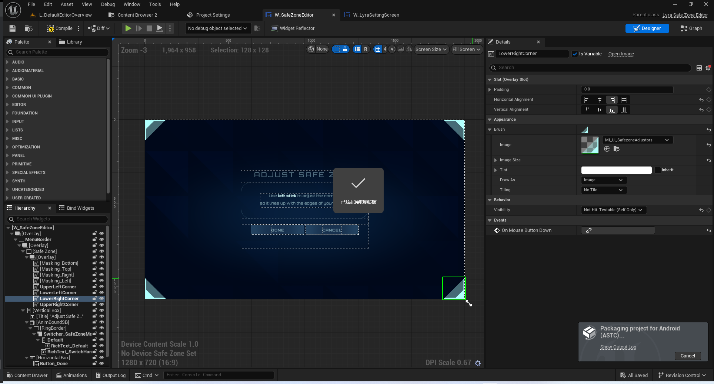
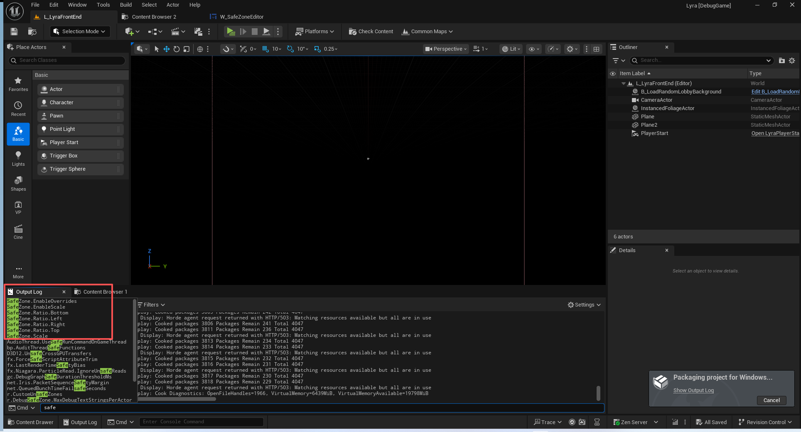

# UE5_Lyra学习指南_062_初始化视频设置

本文章仅为小刚-B站课堂-虚幻引擎视频课程Lyra-精讲的演讲手稿.  
本套课程链接:[[UE5]虚幻引擎游戏案例Lyra精讲](https://www.bilibili.com/cheese/play/ss112001159)  
前置课程链接:[[UE5]虚幻引擎UEC++从基础到进阶](https://www.bilibili.com/cheese/play/ss28043)  

文章内容由小刚撰写,采用了以下多种方式:  
1.口述转文字  
2.AI重构  
3.参考引擎源码  
4.Lyra工程源码  
5.结合社区论坛各位大佬的解析  

- [UE5\_Lyra学习指南\_062\_初始化视频设置](#ue5_lyra学习指南_062_初始化视频设置)
	- [概述](#概述)
	- [InitializeVideoSettings](#initializevideosettings)
	- [基准化测试入口](#基准化测试入口)
	- [SafeZone](#safezone)
	- [SafeZone的控件](#safezone的控件)
	- [其他GameSettings](#其他gamesettings)
	- [总结](#总结)


## 概述
本节主要讲解视频设置.和前面大同小异.直接给出代码即可.

## InitializeVideoSettings
``` cpp

UGameSettingCollection* ULyraGameSettingRegistry::InitializeVideoSettings(ULyraLocalPlayer* InLocalPlayer)
{
	// 创建一个游戏属性集合 作为视频选项的根设置用以返回
	UGameSettingCollection* Screen = NewObject<UGameSettingCollection>();
	// 设置唯一标识符
	Screen->SetDevName(TEXT("VideoCollection"));
	// 设置本地化名称
	Screen->SetDisplayName(LOCTEXT("VideoCollection_Name", "Video"));
	// 初始化游戏设置
	Screen->Initialize(InLocalPlayer);

	// 分离的动态枚举值
	UGameSettingValueDiscreteDynamic_Enum* WindowModeSetting = nullptr;
	// 移动端帧率模式
	UGameSetting* MobileFPSType = nullptr;

	// Display
	// 显示
	////////////////////////////////////////////////////////////////////////////////////
	{
		// 创建显示设置
		UGameSettingCollection* Display = NewObject<UGameSettingCollection>();
		Display->SetDevName(TEXT("DisplayCollection"));
		Display->SetDisplayName(LOCTEXT("DisplayCollection_Name", "Display"));
		// 添加到屏幕
		Screen->AddSetting(Display);

		//----------------------------------------------------------------------------------
		{
			// 枚举类型游戏设置
			UGameSettingValueDiscreteDynamic_Enum* Setting = NewObject<UGameSettingValueDiscreteDynamic_Enum>();
			// 设置开发者名称
			Setting->SetDevName(TEXT("WindowMode"));
			// 设置本地化名称
			Setting->SetDisplayName(LOCTEXT("WindowMode_Name", "Window Mode"));
			// 设置富文本介绍
			Setting->SetDescriptionRichText(LOCTEXT("WindowMode_Description", "In Windowed mode you can interact with other windows more easily, and drag the edges of the window to set the size. In Windowed Fullscreen mode you can easily switch between applications. In Fullscreen mode you cannot interact with other windows as easily, but the game will run slightly faster."));

			// Get,Set方法
			Setting->SetDynamicGetter(GET_LOCAL_SETTINGS_FUNCTION_PATH(GetFullscreenMode));
			Setting->SetDynamicSetter(GET_LOCAL_SETTINGS_FUNCTION_PATH(SetFullscreenMode));

			// 添加枚举选项和本地化名称
			Setting->AddEnumOption(EWindowMode::Fullscreen, LOCTEXT("WindowModeFullscreen", "Fullscreen"));
			Setting->AddEnumOption(EWindowMode::WindowedFullscreen, LOCTEXT("WindowModeWindowedFullscreen", "Windowed Fullscreen"));
			Setting->AddEnumOption(EWindowMode::Windowed, LOCTEXT("WindowModeWindowed", "Windowed"));

			// 添加编辑条件
			Setting->AddEditCondition(FWhenPlatformHasTrait::KillIfMissing(TAG_Platform_Trait_SupportsWindowedMode, TEXT("Platform does not support window mode")));

			// 存一下窗口模式的指针 后续要这个作为编辑条件
			WindowModeSetting = Setting;

			// 添加再显示的下属设置
			Display->AddSetting(Setting);
		}
		//----------------------------------------------------------------------------------
		{
			// 分辨率设置
			ULyraSettingValueDiscrete_Resolution* Setting = NewObject<ULyraSettingValueDiscrete_Resolution>();
			Setting->SetDevName(TEXT("Resolution"));
			Setting->SetDisplayName(LOCTEXT("Resolution_Name", "Resolution"));
			Setting->SetDescriptionRichText(LOCTEXT("Resolution_Description", "Display Resolution determines the size of the window in Windowed mode. In Fullscreen mode, Display Resolution determines the graphics card output resolution, which can result in black bars depending on monitor and graphics card. Display Resolution is inactive in Windowed Fullscreen mode."));

			// 添加编辑依赖 必须有窗口设置
			Setting->AddEditDependency(WindowModeSetting);
			// 添加编辑依赖 平台必须有支持窗口设置的平台特征
			Setting->AddEditCondition(FWhenPlatformHasTrait::KillIfMissing(TAG_Platform_Trait_SupportsWindowedMode, TEXT("Platform does not support window mode")));
			// 窗口设置的枚举不能是全屏
			Setting->AddEditCondition(MakeShared<FWhenCondition>([WindowModeSetting](const ULocalPlayer*, FGameSettingEditableState& InOutEditState)
			{
				if (WindowModeSetting->GetValue<EWindowMode::Type>() == EWindowMode::WindowedFullscreen)
				{
					InOutEditState.Disable(LOCTEXT("ResolutionWindowedFullscreen_Disabled", "When the Window Mode is set to <strong>Windowed Fullscreen</>, the resolution must match the native desktop resolution."));
				}
			}));

			// 添加到展示列表
			Display->AddSetting(Setting);
		}
		//----------------------------------------------------------------------------------
		{
			// 添加性能统计页 添加的是一个Page 与Collection是不一样的.
			AddPerformanceStatPage(Display, InLocalPlayer);
		}
		//----------------------------------------------------------------------------------
	}

	// Graphics
	// 图形
	////////////////////////////////////////////////////////////////////////////////////
	{
		UGameSettingCollection* Graphics = NewObject<UGameSettingCollection>();
		Graphics->SetDevName(TEXT("GraphicsCollection"));
		Graphics->SetDisplayName(LOCTEXT("GraphicsCollection_Name", "Graphics"));
		// 添加到屏幕
		Screen->AddSetting(Graphics);

		//----------------------------------------------------------------------------------
		{
			UGameSettingValueDiscreteDynamic_Enum* Setting = NewObject<UGameSettingValueDiscreteDynamic_Enum>();
			Setting->SetDevName(TEXT("ColorBlindMode"));
			Setting->SetDisplayName(LOCTEXT("ColorBlindMode_Name", "Color Blind Mode"));
			Setting->SetDescriptionRichText(LOCTEXT("ColorBlindMode_Description", "Using the provided images, test out the different color blind modes to find a color correction that works best for you."));
			
			Setting->SetDynamicGetter(GET_SHARED_SETTINGS_FUNCTION_PATH(GetColorBlindMode));
			Setting->SetDynamicSetter(GET_SHARED_SETTINGS_FUNCTION_PATH(SetColorBlindMode));
			Setting->SetDefaultValue(GetDefault<ULyraSettingsShared>()->GetColorBlindMode());

			// 添加对应的枚举选项
			Setting->AddEnumOption(EColorBlindMode::Off, LOCTEXT("ColorBlindRotatorSettingOff", "Off"));
			Setting->AddEnumOption(EColorBlindMode::Deuteranope, LOCTEXT("ColorBlindRotatorSettingDeuteranope", "Deuteranope"));
			Setting->AddEnumOption(EColorBlindMode::Protanope, LOCTEXT("ColorBlindRotatorSettingProtanope", "Protanope"));
			Setting->AddEnumOption(EColorBlindMode::Tritanope, LOCTEXT("ColorBlindRotatorSettingTritanope", "Tritanope"));

			Setting->AddEditCondition(FWhenPlayingAsPrimaryPlayer::Get());

			Graphics->AddSetting(Setting);
		}
		//----------------------------------------------------------------------------------
		{
			UGameSettingValueDiscreteDynamic_Number* Setting = NewObject<UGameSettingValueDiscreteDynamic_Number>();
			Setting->SetDevName(TEXT("ColorBlindStrength"));
			Setting->SetDisplayName(LOCTEXT("ColorBlindStrength_Name", "Color Blind Strength"));
			Setting->SetDescriptionRichText(LOCTEXT("ColorBlindStrength_Description", "Using the provided images, test out the different strengths to find a color correction that works best for you."));

			Setting->SetDynamicGetter(GET_SHARED_SETTINGS_FUNCTION_PATH(GetColorBlindStrength));
			Setting->SetDynamicSetter(GET_SHARED_SETTINGS_FUNCTION_PATH(SetColorBlindStrength));
			Setting->SetDefaultValue(GetDefault<ULyraSettingsShared>()->GetColorBlindStrength());

			// 添加数字选项
			for (int32 Index = 0; Index <= 10; Index++)
			{
				Setting->AddOption(Index, FText::AsNumber(Index));
			}

			Setting->AddEditCondition(FWhenPlayingAsPrimaryPlayer::Get());

			Graphics->AddSetting(Setting);
		}
		//----------------------------------------------------------------------------------
		{
			UGameSettingValueScalarDynamic* Setting = NewObject<UGameSettingValueScalarDynamic>();
			Setting->SetDevName(TEXT("Brightness"));
			Setting->SetDisplayName(LOCTEXT("Brightness_Name", "Brightness"));
			Setting->SetDescriptionRichText(LOCTEXT("Brightness_Description", "Adjusts the brightness."));

			Setting->SetDynamicGetter(GET_LOCAL_SETTINGS_FUNCTION_PATH(GetDisplayGamma));
			Setting->SetDynamicSetter(GET_LOCAL_SETTINGS_FUNCTION_PATH(SetDisplayGamma));
			Setting->SetDefaultValue(2.2);
			Setting->SetDisplayFormat([](double SourceValue, double NormalizedValue) {
				return FText::Format(LOCTEXT("BrightnessFormat", "{0}%"), (int32)FMath::GetMappedRangeValueClamped(FVector2D(0, 1), FVector2D(50, 150), NormalizedValue));
			});
			// 设置范围约束
			Setting->SetSourceRangeAndStep(TRange<double>(1.7, 2.7), 0.01);

			Setting->AddEditCondition(FWhenPlayingAsPrimaryPlayer::Get());
			Setting->AddEditCondition(FWhenPlatformHasTrait::KillIfMissing(TAG_Platform_Trait_NeedsBrightnessAdjustment, TEXT("Platform does not require brightness adjustment.")));

			Graphics->AddSetting(Setting);
		}
		//----------------------------------------------------------------------------------
		{
			ULyraSettingAction_SafeZoneEditor* Setting = NewObject<ULyraSettingAction_SafeZoneEditor>();
			Setting->SetDevName(TEXT("SafeZone"));
			Setting->SetDisplayName(LOCTEXT("SafeZone_Name", "Safe Zone"));
			Setting->SetDescriptionRichText(LOCTEXT("SafeZone_Description", "Set the UI safe zone for the platform."));
			Setting->SetActionText(LOCTEXT("SafeZone_Action", "Set Safe Zone"));
			Setting->SetNamedAction(GameSettings_Action_EditSafeZone);

			Setting->AddEditCondition(FWhenPlayingAsPrimaryPlayer::Get());
			// 这里我们获取不到安全区
			// 因为我们默认是0
			Setting->AddEditCondition(MakeShared<FWhenCondition>([](const ULocalPlayer*, FGameSettingEditableState& InOutEditState) {
				FDisplayMetrics Metrics;
				FSlateApplication::Get().GetCachedDisplayMetrics(Metrics);
				if (Metrics.TitleSafePaddingSize.Size() == 0)
				{
					InOutEditState.Kill(TEXT("Platform does not have any TitleSafePaddingSize configured in the display metrics."));
				}
			}));

			Graphics->AddSetting(Setting);
		}
		//----------------------------------------------------------------------------------
	}


	// Graphics Quality
	// 图形质量

	////////////////////////////////////////////////////////////////////////////////////
	{
		UGameSettingCollection* GraphicsQuality = NewObject<UGameSettingCollection>();
		GraphicsQuality->SetDevName(TEXT("GraphicsQuality"));
		GraphicsQuality->SetDisplayName(LOCTEXT("GraphicsQuality_Name", "Graphics Quality"));
		Screen->AddSetting(GraphicsQuality);

		UGameSetting* AutoSetQuality = nullptr;
		UGameSetting* GraphicsQualityPresets = nullptr;

		//----------------------------------------------------------------------------------
		{
			// Console-style device profile selection
			UGameSettingValueDiscreteDynamic* Setting = NewObject<UGameSettingValueDiscreteDynamic>();
			// 控制台式设备配置选择
			Setting->SetDevName(TEXT("DeviceProfileSuffix"));
			Setting->SetDisplayName(LOCTEXT("DeviceProfileSuffix_Name", "Quality Presets"));
			Setting->SetDescriptionRichText(LOCTEXT("DeviceProfileSuffix_Description", "Choose between different quality presets to make a trade off between quality and speed."));
			Setting->SetDynamicGetter(GET_LOCAL_SETTINGS_FUNCTION_PATH(GetDesiredDeviceProfileQualitySuffix));
			Setting->SetDynamicSetter(GET_LOCAL_SETTINGS_FUNCTION_PATH(SetDesiredDeviceProfileQualitySuffix));

			// 这里读取的是平台渲染设置
			const ULyraPlatformSpecificRenderingSettings* PlatformSettings = ULyraPlatformSpecificRenderingSettings::Get();

			Setting->SetDefaultValueFromString(PlatformSettings->DefaultDeviceProfileSuffix);
			for (const FLyraQualityDeviceProfileVariant& Variant : PlatformSettings->UserFacingDeviceProfileOptions)
			{
				if (FPlatformMisc::GetMaxRefreshRate() >= Variant.MinRefreshRate)
				{
					Setting->AddDynamicOption(Variant.DeviceProfileSuffix, Variant.DisplayName);
				}
			}
			// 这里我们看不到 因为没有写!
			if (Setting->GetDynamicOptions().Num() > 1)
			{
				GraphicsQuality->AddSetting(Setting);
			}
		}

		//----------------------------------------------------------------------------------
		{
			// Mobile style frame rate selection
			// 移动设备的帧率选择功能
			ULyraSettingValueDiscrete_MobileFPSType* Setting = NewObject<ULyraSettingValueDiscrete_MobileFPSType>();
			MobileFPSType = Setting;

			Setting->SetDevName(TEXT("FrameRateLimit_Mobile"));
			Setting->SetDisplayName(LOCTEXT("FrameRateLimit_Mobile_Name", "Frame Rate Limit"));
			Setting->SetDescriptionRichText(LOCTEXT("FrameRateLimit_Mobile_Description", "Select a desired framerate. Use this to fine tune performance on your device."));

			// 必须是移动端控制风格
			Setting->AddEditCondition(MakeShared<FGameSettingEditCondition_FramePacingMode>(ELyraFramePacingMode::MobileStyle));

			GraphicsQuality->AddSetting(Setting);
		}

		//----------------------------------------------------------------------------------
		{

			// 这里是游戏设置事件
			// 执行基准化测试
			UGameSettingAction* Setting = NewObject<UGameSettingAction>();
			
			Setting->SetDevName(TEXT("AutoSetQuality"));
			Setting->SetDisplayName(LOCTEXT("AutoSetQuality_Name", "Auto-Set Quality"));
			Setting->SetDescriptionRichText(LOCTEXT("AutoSetQuality_Description", "Automatically configure the graphics quality options based on a benchmark of the hardware."));

			Setting->SetDoesActionDirtySettings(true);
			Setting->SetActionText(LOCTEXT("AutoSetQuality_Action", "Auto-Set"));
			Setting->SetCustomAction([](ULocalPlayer* LocalPlayer)
			{
				const ULyraPlatformSpecificRenderingSettings* PlatformSettings = ULyraPlatformSpecificRenderingSettings::Get();
				if (PlatformSettings->FramePacingMode == ELyraFramePacingMode::MobileStyle)
				{
					ULyraSettingsLocal::Get()->ResetToMobileDeviceDefaults();
				}
				else
				{
					const ULyraLocalPlayer* LyraLocalPlayer = CastChecked<ULyraLocalPlayer>(LocalPlayer);
					// We don't save state until users apply the settings.
					// 在用户应用设置之前，我们不会保存状态。
					constexpr bool bImmediatelySaveState = false;
					LyraLocalPlayer->GetLocalSettings()->RunAutoBenchmark(bImmediatelySaveState);
				}
			});
			// 添加编辑条件 移动端不可以使用基准测试 以及是否桌面端开启了基准测试
			Setting->AddEditCondition(MakeShared<FWhenCondition>([](const ULocalPlayer* LocalPlayer, FGameSettingEditableState& InOutEditState)
			{
				const ULyraPlatformSpecificRenderingSettings* PlatformSettings = ULyraPlatformSpecificRenderingSettings::Get();
				const bool bCanUseDueToMobile = (PlatformSettings->FramePacingMode == ELyraFramePacingMode::MobileStyle);

				const ULyraLocalPlayer* LyraLocalPlayer = CastChecked<ULyraLocalPlayer>(LocalPlayer);
				const bool bCanBenchmark = LyraLocalPlayer->GetLocalSettings()->CanRunAutoBenchmark();

				if (!bCanUseDueToMobile && !bCanBenchmark)
				{
					InOutEditState.Kill(TEXT("Auto quality not supported"));
				}
			}));
			// 是否创建了移动端帧率选择这个功能 如果有的话 可以添加到对应移动端开启条件
			if (MobileFPSType != nullptr)
			{
				MobileFPSType->AddEditDependency(Setting);
			}

			GraphicsQuality->AddSetting(Setting);

			AutoSetQuality = Setting;
		}
		//----------------------------------------------------------------------------------
		{
			// 质量整体预设
			
			ULyraSettingValueDiscrete_OverallQuality* Setting = NewObject<ULyraSettingValueDiscrete_OverallQuality>();
			Setting->SetDevName(TEXT("GraphicsQualityPresets"));
			Setting->SetDisplayName(LOCTEXT("GraphicsQualityPresets_Name", "Quality Presets"));
			Setting->SetDescriptionRichText(LOCTEXT("GraphicsQualityPresets_Description", "Quality Preset allows you to adjust multiple video options at once. Try a few options to see what fits your preference and device's performance."));

			Setting->AddEditDependency(AutoSetQuality);
			// 不能是控制终端驱动
			Setting->AddEditCondition(MakeShared<FGameSettingEditCondition_FramePacingMode>(ELyraFramePacingMode::ConsoleStyle, EFramePacingEditCondition::DisableIf));

			if (MobileFPSType != nullptr)
			{
				Setting->AddEditDependency(MobileFPSType);
				MobileFPSType->AddEditDependency(Setting);
			}

			GraphicsQuality->AddSetting(Setting);

			GraphicsQualityPresets = Setting;
		}
		//----------------------------------------------------------------------------------
		{	// 分辨率设置
			
			UGameSettingValueScalarDynamic* Setting = NewObject<UGameSettingValueScalarDynamic>();
			Setting->SetDevName(TEXT("ResolutionScale"));
			Setting->SetDisplayName(LOCTEXT("ResolutionScale_Name", "3D Resolution"));
			
			// 3D 分辨率决定了游戏中物体的渲染分辨率，但对主菜单的显示分辨率没有影响。较低的分辨率能够显著提高帧率。
			Setting->SetDescriptionRichText(LOCTEXT("ResolutionScale_Description", "3D resolution determines the resolution that objects are rendered in game, but does not affect the main menu.  Lower resolutions can significantly increase frame rate."));

			Setting->SetDynamicGetter(GET_LOCAL_SETTINGS_FUNCTION_PATH(GetResolutionScaleNormalized));
			Setting->SetDynamicSetter(GET_LOCAL_SETTINGS_FUNCTION_PATH(SetResolutionScaleNormalized));
			
			Setting->SetDisplayFormat(UGameSettingValueScalarDynamic::ZeroToOnePercent);

			Setting->AddEditDependency(AutoSetQuality);
			Setting->AddEditDependency(GraphicsQualityPresets);
			Setting->AddEditCondition(MakeShared<FGameSettingEditCondition_VideoQuality>(TEXT("Platform does not support 3D Resolution")));
			//@TODO: Add support for 3d res on mobile
			//@待办事项：为移动端添加 3D 图形支持
			
			// When this setting changes, it can GraphicsQualityPresets to be set to custom, or a particular preset.
			// 当此设置发生变化时，可以将“图形质量预设”设置为“自定义”模式，或者选择某个特定的预设模式。
			GraphicsQualityPresets->AddEditDependency(Setting);
			GraphicsQuality->AddSetting(Setting);
		}
		//----------------------------------------------------------------------------------
		{	// 全局光照质量
			
			UGameSettingValueDiscreteDynamic_Number* Setting = NewObject<UGameSettingValueDiscreteDynamic_Number>();

			Setting->SetDevName(TEXT("GlobalIlluminationQuality"));
			Setting->SetDisplayName(LOCTEXT("GlobalIlluminationQuality_Name", "Global Illumination"));

			// 全局光照控制着动态计算出的间接光照反射、天空阴影以及环境光遮蔽的质量。将“高”级别及以上的设置开启时，会采用更精确的光线追踪方法来解决照明问题，但可能会降低性能。
			Setting->SetDescriptionRichText(LOCTEXT("GlobalIlluminationQuality_Description", "Global Illumination controls the quality of dynamically calculated indirect lighting bounces, sky shadowing and Ambient Occlusion. Settings of 'High' and above use more accurate ray tracing methods to solve lighting, but can reduce performance."));

			
			Setting->SetDynamicGetter(GET_LOCAL_SETTINGS_FUNCTION_PATH(GetGlobalIlluminationQuality));
			Setting->SetDynamicSetter(GET_LOCAL_SETTINGS_FUNCTION_PATH(SetGlobalIlluminationQuality));
			
			Setting->AddOption(0, LOCTEXT("VisualEffectQualityLow", "Low"));
			Setting->AddOption(1, LOCTEXT("VisualEffectQualityMedium", "Medium"));
			Setting->AddOption(2, LOCTEXT("VisualEffectQualityHigh", "High"));
			Setting->AddOption(3, LOCTEXT("VisualEffectQualityEpic", "Epic"));

			Setting->AddEditDependency(AutoSetQuality);
			Setting->AddEditDependency(GraphicsQualityPresets);
			
			Setting->AddEditCondition(MakeShared<FGameSettingEditCondition_VideoQuality>(TEXT("Platform does not support GlobalIlluminationQuality")));

			// When this setting changes, it can GraphicsQualityPresets to be set to custom, or a particular preset.
			// 当此设置发生变化时，可以将“图形质量预设”设置为“自定义”模式，或者选择某个特定的预设模式。
			GraphicsQualityPresets->AddEditDependency(Setting);

			GraphicsQuality->AddSetting(Setting);
		}
		//----------------------------------------------------------------------------------
		{
			// 阴影质量决定了动态阴影的分辨率和可视距离。阴影能够提升视觉效果并提供更好的深度感知，但可能会降低性能。
			UGameSettingValueDiscreteDynamic_Number* Setting = NewObject<UGameSettingValueDiscreteDynamic_Number>();
			
			Setting->SetDevName(TEXT("Shadows"));
			Setting->SetDisplayName(LOCTEXT("Shadows_Name", "Shadows"));
			Setting->SetDescriptionRichText(LOCTEXT("Shadows_Description", "Shadow quality determines the resolution and view distance of dynamic shadows. Shadows improve visual quality and give better depth perception, but can reduce performance."));

			Setting->SetDynamicGetter(GET_LOCAL_SETTINGS_FUNCTION_PATH(GetShadowQuality));
			Setting->SetDynamicSetter(GET_LOCAL_SETTINGS_FUNCTION_PATH(SetShadowQuality));
			
			Setting->AddOption(0, LOCTEXT("ShadowLow", "Off"));
			Setting->AddOption(1, LOCTEXT("ShadowMedium", "Medium"));
			Setting->AddOption(2, LOCTEXT("ShadowHigh", "High"));
			Setting->AddOption(3, LOCTEXT("ShadowEpic", "Epic"));

			Setting->AddEditDependency(AutoSetQuality);
			Setting->AddEditDependency(GraphicsQualityPresets);
			Setting->AddEditCondition(MakeShared<FGameSettingEditCondition_VideoQuality>(TEXT("Platform does not support Shadows")));

			// When this setting changes, it can GraphicsQualityPresets to be set to custom, or a particular preset.
			// 当此设置发生变化时，可以将“图形质量预设”设置为“自定义”模式，或者选择某个特定的预设模式。
			GraphicsQualityPresets->AddEditDependency(Setting);

			GraphicsQuality->AddSetting(Setting);
		}
		//----------------------------------------------------------------------------------
		{
			// 抗锯齿
			
			UGameSettingValueDiscreteDynamic_Number* Setting = NewObject<UGameSettingValueDiscreteDynamic_Number>();
			Setting->SetDevName(TEXT("AntiAliasing"));
			Setting->SetDisplayName(LOCTEXT("AntiAliasing_Name", "Anti-Aliasing"));
			// 抗锯齿技术可减少几何图形边缘处的锯齿状瑕疵。提高此设置会使边缘看起来更加平滑，但可能会降低性能。设置值越高，抗锯齿效果就越强。
			Setting->SetDescriptionRichText(LOCTEXT("AntiAliasing_Description", "Anti-Aliasing reduces jaggy artifacts along geometry edges. Increasing this setting will make edges look smoother, but can reduce performance. Higher settings mean more anti-aliasing."));

			Setting->SetDynamicGetter(GET_LOCAL_SETTINGS_FUNCTION_PATH(GetAntiAliasingQuality));
			Setting->SetDynamicSetter(GET_LOCAL_SETTINGS_FUNCTION_PATH(SetAntiAliasingQuality));
			
			Setting->AddOption(0, LOCTEXT("AntiAliasingLow", "Off"));
			Setting->AddOption(1, LOCTEXT("AntiAliasingMedium", "Medium"));
			Setting->AddOption(2, LOCTEXT("AntiAliasingHigh", "High"));
			Setting->AddOption(3, LOCTEXT("AntiAliasingEpic", "Epic"));

			Setting->AddEditDependency(AutoSetQuality);
			Setting->AddEditDependency(GraphicsQualityPresets);
			Setting->AddEditCondition(MakeShared<FGameSettingEditCondition_VideoQuality>(TEXT("Platform does not support Anti-Aliasing")));

			// When this setting changes, it can GraphicsQualityPresets to be set to custom, or a particular preset.
			// 当此设置发生变化时，可以将“图形质量预设”设置为“自定义”模式，或者选择某个特定的预设模式。
			GraphicsQualityPresets->AddEditDependency(Setting);

			GraphicsQuality->AddSetting(Setting);
		}
		//----------------------------------------------------------------------------------
		{	// 视距
			UGameSettingValueDiscreteDynamic_Number* Setting = NewObject<UGameSettingValueDiscreteDynamic_Number>();
			Setting->SetDevName(TEXT("ViewDistance"));
			Setting->SetDisplayName(LOCTEXT("ViewDistance_Name", "View Distance"));
			// 视距决定了系统在进行性能优化时剔除对象的范围。
			Setting->SetDescriptionRichText(LOCTEXT("ViewDistance_Description", "View distance determines how far away objects are culled for performance."));

			Setting->SetDynamicGetter(GET_LOCAL_SETTINGS_FUNCTION_PATH(GetViewDistanceQuality));
			Setting->SetDynamicSetter(GET_LOCAL_SETTINGS_FUNCTION_PATH(SetViewDistanceQuality));
			
			Setting->AddOption(0, LOCTEXT("ViewDistanceNear", "Near"));
			Setting->AddOption(1, LOCTEXT("ViewDistanceMedium", "Medium"));
			Setting->AddOption(2, LOCTEXT("ViewDistanceFar", "Far"));
			Setting->AddOption(3, LOCTEXT("ViewDistanceEpic", "Epic"));

			Setting->AddEditDependency(AutoSetQuality);
			Setting->AddEditDependency(GraphicsQualityPresets);
			Setting->AddEditCondition(MakeShared<FGameSettingEditCondition_VideoQuality>(TEXT("Platform does not support View Distance")));

			// When this setting changes, it can GraphicsQualityPresets to be set to custom, or a particular preset.
			// 当此设置发生变化时，可以将“图形质量预设”设置为“自定义”模式，或者选择某个特定的预设模式。
			GraphicsQualityPresets->AddEditDependency(Setting);

			GraphicsQuality->AddSetting(Setting);
		}
		//----------------------------------------------------------------------------------
		{
			// 纹理
			
			UGameSettingValueDiscreteDynamic_Number* Setting = NewObject<UGameSettingValueDiscreteDynamic_Number>();
			Setting->SetDevName(TEXT("TextureQuality"));
			Setting->SetDisplayName(LOCTEXT("TextureQuality_Name", "Textures"));
			// 材质质量决定了游戏中材质的清晰度。提高这一设置会使物体更加精细，但可能会降低游戏性能。
			Setting->SetDescriptionRichText(LOCTEXT("TextureQuality_Description", "Texture quality determines the resolution of textures in game. Increasing this setting will make objects more detailed, but can reduce performance."));

			Setting->SetDynamicGetter(GET_LOCAL_SETTINGS_FUNCTION_PATH(GetTextureQuality));
			Setting->SetDynamicSetter(GET_LOCAL_SETTINGS_FUNCTION_PATH(SetTextureQuality));
			
			Setting->AddOption(0, LOCTEXT("TextureQualityLow", "Low"));
			Setting->AddOption(1, LOCTEXT("TextureQualityMedium", "Medium"));
			Setting->AddOption(2, LOCTEXT("TextureQualityHigh", "High"));
			Setting->AddOption(3, LOCTEXT("TextureQualityEpic", "Epic"));

			Setting->AddEditDependency(AutoSetQuality);
			Setting->AddEditDependency(GraphicsQualityPresets);
			Setting->AddEditCondition(MakeShared<FGameSettingEditCondition_VideoQuality>(TEXT("Platform does not support Texture quality")));

			// When this setting changes, it can GraphicsQualityPresets to be set to custom, or a particular preset.
			// 当此设置发生变化时，可以将“图形质量预设”设置为“自定义”模式，或者选择某个特定的预设模式。
			GraphicsQualityPresets->AddEditDependency(Setting);

			GraphicsQuality->AddSetting(Setting);
		}
		//----------------------------------------------------------------------------------
		{
			//视觉效果质量
			
			UGameSettingValueDiscreteDynamic_Number* Setting = NewObject<UGameSettingValueDiscreteDynamic_Number>();
			Setting->SetDevName(TEXT("VisualEffectQuality"));
			Setting->SetDisplayName(LOCTEXT("VisualEffectQuality_Name", "Effects"));
			// 效果设置决定了游戏中的视觉效果和灯光的质量。提高此设置会提升视觉效果的质量，但可能会降低性能。
			Setting->SetDescriptionRichText(LOCTEXT("VisualEffectQuality_Description", "Effects determines the quality of visual effects and lighting in game. Increasing this setting will increase the quality of visual effects, but can reduce performance."));

			Setting->SetDynamicGetter(GET_LOCAL_SETTINGS_FUNCTION_PATH(GetVisualEffectQuality));
			Setting->SetDynamicSetter(GET_LOCAL_SETTINGS_FUNCTION_PATH(SetVisualEffectQuality));
			
			Setting->AddOption(0, LOCTEXT("VisualEffectQualityLow", "Low"));
			Setting->AddOption(1, LOCTEXT("VisualEffectQualityMedium", "Medium"));
			Setting->AddOption(2, LOCTEXT("VisualEffectQualityHigh", "High"));
			Setting->AddOption(3, LOCTEXT("VisualEffectQualityEpic", "Epic"));

			Setting->AddEditDependency(AutoSetQuality);
			Setting->AddEditDependency(GraphicsQualityPresets);
			Setting->AddEditCondition(MakeShared<FGameSettingEditCondition_VideoQuality>(TEXT("Platform does not support VisualEffectQuality")));

			// When this setting changes, it can GraphicsQualityPresets to be set to custom, or a particular preset.
			// 当此设置发生变化时，可以将“图形质量预设”设置为“自定义”模式，或者选择某个特定的预设模式。
			GraphicsQualityPresets->AddEditDependency(Setting);

			GraphicsQuality->AddSetting(Setting);
		}
		//----------------------------------------------------------------------------------
		{
			// 反射质量
			
			UGameSettingValueDiscreteDynamic_Number* Setting = NewObject<UGameSettingValueDiscreteDynamic_Number>();
			Setting->SetDevName(TEXT("ReflectionQuality"));
			Setting->SetDisplayName(LOCTEXT("ReflectionQuality_Name", "Reflections"));
			// 反射质量决定了反射的清晰度和准确性。设置为“高”及以上会采用更精确的光线追踪方法来解决反射问题，但可能会降低性能。
			Setting->SetDescriptionRichText(LOCTEXT("ReflectionQuality_Description", "Reflection quality determines the resolution and accuracy of reflections.  Settings of 'High' and above use more accurate ray tracing methods to solve reflections, but can reduce performance."));

			Setting->SetDynamicGetter(GET_LOCAL_SETTINGS_FUNCTION_PATH(GetReflectionQuality));
			Setting->SetDynamicSetter(GET_LOCAL_SETTINGS_FUNCTION_PATH(SetReflectionQuality));
			
			Setting->AddOption(0, LOCTEXT("VisualEffectQualityLow", "Low"));
			Setting->AddOption(1, LOCTEXT("VisualEffectQualityMedium", "Medium"));
			Setting->AddOption(2, LOCTEXT("VisualEffectQualityHigh", "High"));
			Setting->AddOption(3, LOCTEXT("VisualEffectQualityEpic", "Epic"));

			Setting->AddEditDependency(AutoSetQuality);
			Setting->AddEditDependency(GraphicsQualityPresets);
			Setting->AddEditCondition(MakeShared<FGameSettingEditCondition_VideoQuality>(TEXT("Platform does not support ReflectionQuality")));

			// When this setting changes, it can GraphicsQualityPresets to be set to custom, or a particular preset.
			// 当此设置发生变化时，可以将“图形质量预设”设置为“自定义”模式，或者选择某个特定的预设模式。
			GraphicsQualityPresets->AddEditDependency(Setting);

			GraphicsQuality->AddSetting(Setting);
		}
		//----------------------------------------------------------------------------------
		{
			// 后处理质量
			
			UGameSettingValueDiscreteDynamic_Number* Setting = NewObject<UGameSettingValueDiscreteDynamic_Number>();
			Setting->SetDevName(TEXT("PostProcessingQuality"));
			Setting->SetDisplayName(LOCTEXT("PostProcessingQuality_Name", "Post Processing"));
			// 后期处理效果包括运动模糊、景深和光晕。提高此设置可提升后期处理效果的质量，但可能会降低性能。
			Setting->SetDescriptionRichText(LOCTEXT("PostProcessingQuality_Description", "Post Processing effects include Motion Blur, Depth of Field and Bloom. Increasing this setting improves the quality of post process effects, but can reduce performance."));  

			Setting->SetDynamicGetter(GET_LOCAL_SETTINGS_FUNCTION_PATH(GetPostProcessingQuality));
			Setting->SetDynamicSetter(GET_LOCAL_SETTINGS_FUNCTION_PATH(SetPostProcessingQuality));
			
			Setting->AddOption(0, LOCTEXT("PostProcessingQualityLow", "Low"));
			Setting->AddOption(1, LOCTEXT("PostProcessingQualityMedium", "Medium"));
			Setting->AddOption(2, LOCTEXT("PostProcessingQualityHigh", "High"));
			Setting->AddOption(3, LOCTEXT("PostProcessingQualityEpic", "Epic"));

			Setting->AddEditDependency(AutoSetQuality);
			Setting->AddEditDependency(GraphicsQualityPresets);
			Setting->AddEditCondition(MakeShared<FGameSettingEditCondition_VideoQuality>(TEXT("Platform does not support PostProcessingQuality")));

			// When this setting changes, it can GraphicsQualityPresets to be set to custom, or a particular preset.
			// 当此设置发生变化时，可以将“图形质量预设”设置为“自定义”模式，或者选择某个特定的预设模式。
			GraphicsQualityPresets->AddEditDependency(Setting);

			GraphicsQuality->AddSetting(Setting);
		}

	}

	// Advanced Graphics
	// 高级图形
	////////////////////////////////////////////////////////////////////////////////////
	{
		
		UGameSettingCollection* AdvancedGraphics = NewObject<UGameSettingCollection>();
		AdvancedGraphics->SetDevName(TEXT("AdvancedGraphics"));
		AdvancedGraphics->SetDisplayName(LOCTEXT("AdvancedGraphics_Name", "Advanced Graphics"));
		// 添加到屏幕
		Screen->AddSetting(AdvancedGraphics);

		//----------------------------------------------------------------------------------
		{
			// 垂直同步
			UGameSettingValueDiscreteDynamic_Bool* Setting = NewObject<UGameSettingValueDiscreteDynamic_Bool>();
			Setting->SetDevName(TEXT("VerticalSync"));
			Setting->SetDisplayName(LOCTEXT("VerticalSync_Name", "Vertical Sync"));
			// 启用垂直同步可消除屏幕撕裂现象，因为其会始终完整地渲染并呈现一帧画面。禁用垂直同步则能提供更高的帧率和更出色的输入响应，但可能会导致水平屏幕撕裂。
			Setting->SetDescriptionRichText(LOCTEXT("VerticalSync_Description", "Enabling Vertical Sync eliminates screen tearing by always rendering and presenting a full frame. Disabling Vertical Sync can give higher frame rate and better input response, but can result in horizontal screen tearing."));

			Setting->SetDynamicGetter(GET_LOCAL_SETTINGS_FUNCTION_PATH(IsVSyncEnabled));
			Setting->SetDynamicSetter(GET_LOCAL_SETTINGS_FUNCTION_PATH(SetVSyncEnabled));
			Setting->SetDefaultValue(false);

			// 需要是桌面端
			Setting->AddEditCondition(MakeShared<FGameSettingEditCondition_FramePacingMode>(ELyraFramePacingMode::DesktopStyle));

			// 受到桌面窗口的依赖设置
			Setting->AddEditDependency(WindowModeSetting);
			// 添加全屏约束条件
			Setting->AddEditCondition(MakeShared<FWhenCondition>([WindowModeSetting](const ULocalPlayer*, FGameSettingEditableState& InOutEditState) {
				if (WindowModeSetting->GetValue<EWindowMode::Type>() != EWindowMode::Fullscreen)
				{
					InOutEditState.Disable(LOCTEXT("FullscreenNeededForVSync", "This feature only works if 'Window Mode' is set to 'Fullscreen'."));
				}
			}));

			AdvancedGraphics->AddSetting(Setting);
		}
	}
	// 视频页已创建好!
	return Screen;
}

```

## 基准化测试入口
``` cpp
		//----------------------------------------------------------------------------------
		{

			// 这里是游戏设置事件
			// 执行基准化测试
			UGameSettingAction* Setting = NewObject<UGameSettingAction>();
			
			Setting->SetDevName(TEXT("AutoSetQuality"));
			Setting->SetDisplayName(LOCTEXT("AutoSetQuality_Name", "Auto-Set Quality"));
			Setting->SetDescriptionRichText(LOCTEXT("AutoSetQuality_Description", "Automatically configure the graphics quality options based on a benchmark of the hardware."));

			Setting->SetDoesActionDirtySettings(true);
			Setting->SetActionText(LOCTEXT("AutoSetQuality_Action", "Auto-Set"));
			Setting->SetCustomAction([](ULocalPlayer* LocalPlayer)
			{
				const ULyraPlatformSpecificRenderingSettings* PlatformSettings = ULyraPlatformSpecificRenderingSettings::Get();
				if (PlatformSettings->FramePacingMode == ELyraFramePacingMode::MobileStyle)
				{
					ULyraSettingsLocal::Get()->ResetToMobileDeviceDefaults();
				}
				else
				{
					const ULyraLocalPlayer* LyraLocalPlayer = CastChecked<ULyraLocalPlayer>(LocalPlayer);
					// We don't save state until users apply the settings.
					// 在用户应用设置之前，我们不会保存状态。
					constexpr bool bImmediatelySaveState = false;
					LyraLocalPlayer->GetLocalSettings()->RunAutoBenchmark(bImmediatelySaveState);
				}
			});
			// 添加编辑条件 移动端不可以使用基准测试 以及是否桌面端开启了基准测试
			Setting->AddEditCondition(MakeShared<FWhenCondition>([](const ULocalPlayer* LocalPlayer, FGameSettingEditableState& InOutEditState)
			{
				const ULyraPlatformSpecificRenderingSettings* PlatformSettings = ULyraPlatformSpecificRenderingSettings::Get();
				const bool bCanUseDueToMobile = (PlatformSettings->FramePacingMode == ELyraFramePacingMode::MobileStyle);

				const ULyraLocalPlayer* LyraLocalPlayer = CastChecked<ULyraLocalPlayer>(LocalPlayer);
				const bool bCanBenchmark = LyraLocalPlayer->GetLocalSettings()->CanRunAutoBenchmark();

				if (!bCanUseDueToMobile && !bCanBenchmark)
				{
					InOutEditState.Kill(TEXT("Auto quality not supported"));
				}
			}));
			// 是否创建了移动端帧率选择这个功能 如果有的话 可以添加到对应移动端开启条件
			if (MobileFPSType != nullptr)
			{
				MobileFPSType->AddEditDependency(Setting);
			}

			GraphicsQuality->AddSetting(Setting);

			AutoSetQuality = Setting;
		}

```

## SafeZone
移动端会有一个SafeZone的Action需要注意以下.
``` cpp
		{
			ULyraSettingAction_SafeZoneEditor* Setting = NewObject<ULyraSettingAction_SafeZoneEditor>();
			Setting->SetDevName(TEXT("SafeZone"));
			Setting->SetDisplayName(LOCTEXT("SafeZone_Name", "Safe Zone"));
			Setting->SetDescriptionRichText(LOCTEXT("SafeZone_Description", "Set the UI safe zone for the platform."));
			Setting->SetActionText(LOCTEXT("SafeZone_Action", "Set Safe Zone"));
			Setting->SetNamedAction(GameSettings_Action_EditSafeZone);

			Setting->AddEditCondition(FWhenPlayingAsPrimaryPlayer::Get());
			// 这里我们获取不到安全区
			// 这个是针对移动端的操作
			Setting->AddEditCondition(MakeShared<FWhenCondition>([](const ULocalPlayer*, FGameSettingEditableState& InOutEditState) {
				FDisplayMetrics Metrics;
				FSlateApplication::Get().GetCachedDisplayMetrics(Metrics);
				if (Metrics.TitleSafePaddingSize.Size() == 0)
				{
					InOutEditState.Kill(TEXT("Platform does not have any TitleSafePaddingSize configured in the display metrics."));
				}
			}));

			Graphics->AddSetting(Setting);
		}
```

``` cpp
UCLASS()
class ULyraSettingValueScalarDynamic_SafeZoneValue : public UGameSettingValueScalarDynamic
{
	GENERATED_BODY()

public:
	virtual void ResetToDefault() override;
	virtual void RestoreToInitial() override;
};

UCLASS()
class ULyraSettingAction_SafeZoneEditor : public UGameSettingAction
{
	GENERATED_BODY()
	
public:
	ULyraSettingAction_SafeZoneEditor();
	virtual TArray<UGameSetting*> GetChildSettings() override;

private:
	UPROPERTY()
	TObjectPtr<ULyraSettingValueScalarDynamic_SafeZoneValue> SafeZoneValueSetting;
};


```

``` cpp

ULyraSettingAction_SafeZoneEditor::ULyraSettingAction_SafeZoneEditor()
{
	SafeZoneValueSetting = NewObject<ULyraSettingValueScalarDynamic_SafeZoneValue>();
	SafeZoneValueSetting->SetDevName(TEXT("SafeZoneValue"));
	SafeZoneValueSetting->SetDisplayName(LOCTEXT("SafeZoneValue_Name", "Safe Zone Value"));
	SafeZoneValueSetting->SetDescriptionRichText(LOCTEXT("SafeZoneValue_Description", "The safezone area percentage."));
	SafeZoneValueSetting->SetDefaultValue(0.0f);
	SafeZoneValueSetting->SetDynamicGetter(GET_LOCAL_SETTINGS_FUNCTION_PATH(GetSafeZone));
	SafeZoneValueSetting->SetDynamicSetter(GET_LOCAL_SETTINGS_FUNCTION_PATH(SetSafeZone));
	SafeZoneValueSetting->SetDisplayFormat([](double SourceValue, double NormalizedValue){ return FText::AsNumber(SourceValue); });
	SafeZoneValueSetting->SetSettingParent(this);
}

TArray<UGameSetting*> ULyraSettingAction_SafeZoneEditor::GetChildSettings()
{
	return { SafeZoneValueSetting };
}

void ULyraSettingValueScalarDynamic_SafeZoneValue::ResetToDefault()
{
	Super::ResetToDefault();
	SSafeZone::SetGlobalSafeZoneScale(TOptional<float>(DefaultValue.Get(0.0f)));
}

void ULyraSettingValueScalarDynamic_SafeZoneValue::RestoreToInitial()
{
	Super::RestoreToInitial();
	SSafeZone::SetGlobalSafeZoneScale(TOptional<float>(InitialValue));
}


```
## SafeZone的控件

``` cpp
UCLASS(Abstract)
class ULyraSafeZoneEditor : public UCommonActivatableWidget, public IGameSettingActionInterface
{
	GENERATED_BODY()

public:
	FSimpleMulticastDelegate OnSafeZoneSet;
	
public:
	ULyraSafeZoneEditor(const FObjectInitializer& Initializer);

	// Begin IGameSettingActionInterface
	virtual bool ExecuteActionForSetting_Implementation(FGameplayTag ActionTag, UGameSetting* InSetting) override;
	// End IGameSettingActionInterface

protected:

	UPROPERTY(EditAnywhere, Category = "Restrictions")
	bool bCanCancel = true;

	virtual void NativeOnActivated() override;
	virtual void NativeOnInitialized() override;
	virtual FReply NativeOnAnalogValueChanged(const FGeometry& InGeometry, const FAnalogInputEvent& InAnalogEvent) override;
	virtual FReply NativeOnMouseWheel(const FGeometry& InGeometry, const FPointerEvent& InMouseEvent) override;
	
	void HandleInputModeChanged(ECommonInputType InInputType);

private:
	UFUNCTION()
	void HandleBackClicked();

	UFUNCTION()
	void HandleDoneClicked();

	TWeakObjectPtr<UGameSettingValueScalar> ValueSetting;

	UPROPERTY(BlueprintReadOnly, meta = (BindWidget, AllowPrivateAccess = true))
	TObjectPtr<UWidgetSwitcher> Switcher_SafeZoneMessage;

	UPROPERTY(BlueprintReadOnly, meta = (BindWidget, AllowPrivateAccess = true))
	TObjectPtr<UCommonRichTextBlock> RichText_Default;

	UPROPERTY(BlueprintReadOnly, meta = (BindWidget, AllowPrivateAccess = true))
	TObjectPtr<UCommonButtonBase> Button_Back;

	UPROPERTY(BlueprintReadOnly, meta = (BindWidget, AllowPrivateAccess = true))
	TObjectPtr<UCommonButtonBase> Button_Done;
};

```
``` cpp
void ULyraSafeZoneEditor::HandleDoneClicked()
{
	if (ValueSetting.IsValid())
	{
		ValueSetting.Get()->SetValue(SSafeZone::GetGlobalSafeZoneScale().Get(1.0f));
	}
	else
	{
		ULyraSettingsLocal::Get()->SetSafeZone(SSafeZone::GetGlobalSafeZoneScale().Get(1.0f));
	}
	OnSafeZoneSet.Broadcast();
	DeactivateWidget();
}
```


这里不太好演示效果
我们可以在命令行输入



## 其他GameSettings
关于LyraSettingValueDiscrete_***等设置不再需要讲解.均大同小异.直接移植即可使用.
如:
LyraSettingValueDiscrete_MobileFPSType
LyraSettingValueDiscrete_OverallQuality
LyraSettingValueDiscrete_OverallQuality
等等.
LyraSettingValueDiscrete_PerfStat会在下节讲解
## 总结
本节主要讲解了视频相关设置,关于性能分析的设置将在下节讲解!