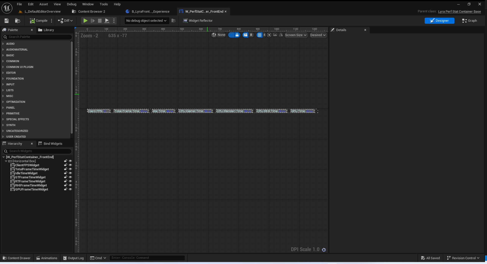
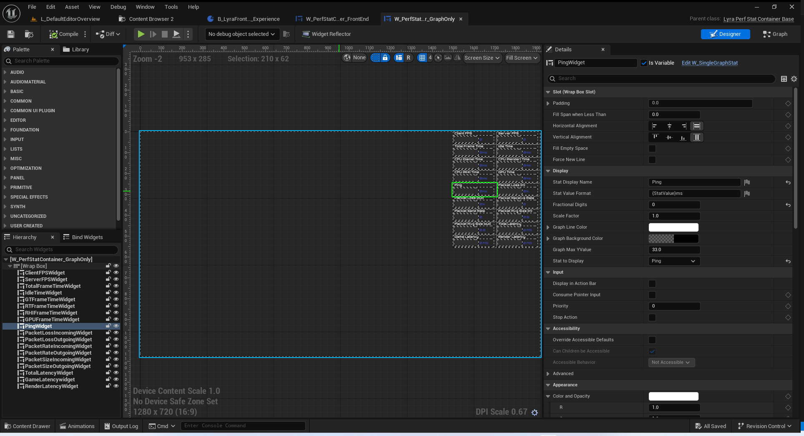
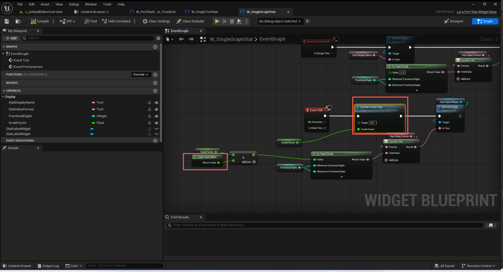

# UE5_Lyra学习指南_063_初始化性能分析设置

本文章仅为小刚-B站课堂-虚幻引擎视频课程Lyra-精讲的演讲手稿.  
本套课程链接:[[UE5]虚幻引擎游戏案例Lyra精讲](https://www.bilibili.com/cheese/play/ss112001159)  
前置课程链接:[[UE5]虚幻引擎UEC++从基础到进阶](https://www.bilibili.com/cheese/play/ss28043)  

文章内容由小刚撰写,采用了以下多种方式:  
1.口述转文字  
2.AI重构  
3.参考引擎源码  
4.Lyra工程源码  
5.结合社区论坛各位大佬的解析  

- [UE5\_Lyra学习指南\_063\_初始化性能分析设置](#ue5_lyra学习指南_063_初始化性能分析设置)
	- [概述](#概述)
	- [编辑条件](#编辑条件)
	- [AddPerformanceStatPage](#addperformancestatpage)
	- [LyraSettingValueDiscrete\_PerfStat](#lyrasettingvaluediscrete_perfstat)
	- [统计性能分析数据](#统计性能分析数据)
		- [分类的枚举](#分类的枚举)
		- [统计数据](#统计数据)
		- [性能分析的引擎接口](#性能分析的引擎接口)
		- [处理帧数据](#处理帧数据)
		- [通过枚举获取数据](#通过枚举获取数据)
		- [采样数据定义](#采样数据定义)
	- [蓝图展示数据](#蓝图展示数据)
	- [通过Slate绘制图表](#通过slate绘制图表)
	- [总结](#总结)


## 概述
本节主要讲解关于性能测试的这些图表是如何统计数据渲染出来的.
## 编辑条件
``` cpp

// Checks if the current platform can even support latency stats (game, render, total, etc latency stats)
// 检查当前平台是否真的能够支持延迟数据统计（游戏延迟、渲染延迟、总延迟等）
class FGameSettingEditCondition_LatencyStatsSupported final : public FGameSettingEditCondition
{
public:
	FGameSettingEditCondition_LatencyStatsSupported() = default;

	virtual void GatherEditState(const ULocalPlayer * InLocalPlayer, FGameSettingEditableState & InOutEditState) const override
	{
		if (!ULyraSettingsLocal::DoesPlatformSupportLatencyTrackingStats())
		{
			InOutEditState.Disable(LOCTEXT("PlatformDoesNotSupportLatencyStates", "Latency performance stats are not supported on this device"));
		}
	}
};

// Checks if latency stats are currently enabled and listens for when that changes to correclt update the edit condition state
// 检查当前是否已启用延迟统计信息，并监听其状态变化，以便及时更新编辑条件状态
class FGameSettingEditCondition_LatencyStatsCurrentlyEnabled final : public FGameSettingEditCondition
{
public:
	FGameSettingEditCondition_LatencyStatsCurrentlyEnabled() = default;

	virtual ~FGameSettingEditCondition_LatencyStatsCurrentlyEnabled() override
	{
		if (!SettingChangedDelegate.IsValid())
		{
			return;
		}
		
		ULyraSettingsLocal* Settings = ULyraSettingsLocal::Get();
		if (!Settings)
		{
			return;
		}
		
		Settings->OnLatencyStatIndicatorSettingsChangedEvent().Remove(SettingChangedDelegate);
	}

private:
	
	virtual void Initialize(const ULocalPlayer* InLocalPlayer) override
	{
		// Bind to an event for when the settings are updated so that we can broadcast that we need
		// to be re-evaluated
		// 为设置更新时的某个事件进行绑定，以便我们能够发出信号表明需要重新评估了
		ULyraSettingsLocal* Settings = ULyraSettingsLocal::Get();
		if (!Settings)
		{
			return;
		}

		SettingChangedDelegate = Settings->OnLatencyStatIndicatorSettingsChangedEvent().AddSP(this->AsShared(), &FGameSettingEditCondition_LatencyStatsCurrentlyEnabled::BroadcastEditConditionChanged);
	}
	
	virtual void GatherEditState(const ULocalPlayer * InLocalPlayer, FGameSettingEditableState & InOutEditState) const override
	{
		const ULyraSettingsLocal* Settings = ULyraSettingsLocal::Get();
		if (!Settings)
		{
			return;
		}

		if (!Settings->GetEnableLatencyTrackingStats())
		{
			InOutEditState.Disable(LOCTEXT("LatencyMarkerRequireStatsEnabled", "Latency Tracking Stats must be enabled to use this."));
		}	
	}
	
	FDelegateHandle SettingChangedDelegate;
};

// Checks if latency markers are supported on the current platform
// 检查当前平台是否支持延迟标记
class FGameSettingEditCondition_LatencyMarkersSupported final : public FGameSettingEditCondition
{
public:
	FGameSettingEditCondition_LatencyMarkersSupported() = default;

	virtual void GatherEditState(const ULocalPlayer * InLocalPlayer, FGameSettingEditableState & InOutEditState) const override
	{
		if (!ULyraSettingsLocal::DoesPlatformSupportLatencyMarkers())
		{
			InOutEditState.Disable(LOCTEXT("PlatformDoesNotSupportLatencyMarkers", "Latency markers are not supported on this device"));
		}

		// Lyra is only going to use the "Reflex" plugin to track these latency stats, so restrict these settings to NVIDIA devices.
		// 莱拉只会使用“反射”插件来追踪这些延迟数据，因此请将这些设置限制在 NVIDIA 设备上。
		if (CVarLatencyMarkersRequireNVIDIA.GetValueOnAnyThread() && !IsRHIDeviceNVIDIA())
		{
			InOutEditState.Disable(LOCTEXT("InputLatencyMarkersRequiresNVIDIA", "Latency markers only work on NVIDIA devices."));
		}
	}
};

//////////////////////////////////////////////////////////////////////

```
## AddPerformanceStatPage
``` cpp

void ULyraGameSettingRegistry::AddPerformanceStatPage(UGameSettingCollection* PerfStatsOuterCategory, ULyraLocalPlayer* InLocalPlayer)
{
	//----------------------------------------------------------------------------------
	{
		// 这里需要确认枚举的数量为18个
		static_assert((int32)ELyraDisplayablePerformanceStat::Count == 18, "Consider updating this function to deal with new performance stats");

		// 注意 这里New的时导航页 所以是一个导航事件
		UGameSettingCollectionPage* StatsPage = NewObject<UGameSettingCollectionPage>();
		StatsPage->SetDevName(TEXT("PerfStatsPage"));
		StatsPage->SetDisplayName(LOCTEXT("PerfStatsPage_Name", "Performance Stats"));
		StatsPage->SetDescriptionRichText(LOCTEXT("PerfStatsPage_Description", "Configure the display of performance statistics."));
		StatsPage->SetNavigationText(LOCTEXT("PerfStatsPage_Navigation", "Edit"));
		// 添加编辑条件为 需要时主玩家
		StatsPage->AddEditCondition(FWhenPlayingAsPrimaryPlayer::Get());

		// 添加到Screen
		PerfStatsOuterCategory->AddSetting(StatsPage);

		// Performance stats
		// 性能下分栏
		////////////////////////////////////////////////////////////////////////////////////
		{
			// 创建一个性能的集合
			UGameSettingCollection* StatCategory_Performance = NewObject<UGameSettingCollection>();
			StatCategory_Performance->SetDevName(TEXT("StatCategory_Performance"));
			StatCategory_Performance->SetDisplayName(LOCTEXT("StatCategory_Performance_Name", "Performance"));
			StatsPage->AddSetting(StatCategory_Performance);

			//----------------------------------------------------------------------------------
			// 往性能集合立马筛入数据
			{
				ULyraSettingValueDiscrete_PerfStat* Setting = NewObject<ULyraSettingValueDiscrete_PerfStat>();
				Setting->SetStat(ELyraDisplayablePerformanceStat::ClientFPS);
				Setting->SetDisplayName(LOCTEXT("PerfStat_ClientFPS", "Client FPS"));
				Setting->SetDescriptionRichText(LOCTEXT("PerfStatDescription_ClientFPS", "Client frame rate (higher is better)"));
				StatCategory_Performance->AddSetting(Setting);
			}
			//----------------------------------------------------------------------------------
			{
				ULyraSettingValueDiscrete_PerfStat* Setting = NewObject<ULyraSettingValueDiscrete_PerfStat>();
				Setting->SetStat(ELyraDisplayablePerformanceStat::ServerFPS);
				Setting->SetDisplayName(LOCTEXT("PerfStat_ServerFPS", "Server FPS"));
				Setting->SetDescriptionRichText(LOCTEXT("PerfStatDescription_ServerFPS", "Server frame rate"));
				StatCategory_Performance->AddSetting(Setting);
			}
			//----------------------------------------------------------------------------------
			{
				ULyraSettingValueDiscrete_PerfStat* Setting = NewObject<ULyraSettingValueDiscrete_PerfStat>();
				Setting->SetStat(ELyraDisplayablePerformanceStat::FrameTime);
				Setting->SetDisplayName(LOCTEXT("PerfStat_FrameTime", "Frame Time"));
				Setting->SetDescriptionRichText(LOCTEXT("PerfStatDescription_FrameTime", "The total frame time."));
				StatCategory_Performance->AddSetting(Setting);
			}
			//----------------------------------------------------------------------------------
			{
				ULyraSettingValueDiscrete_PerfStat* Setting = NewObject<ULyraSettingValueDiscrete_PerfStat>();
				Setting->SetStat(ELyraDisplayablePerformanceStat::IdleTime);
				Setting->SetDisplayName(LOCTEXT("PerfStat_IdleTime", "Idle Time"));
				Setting->SetDescriptionRichText(LOCTEXT("PerfStatDescription_IdleTime", "The amount of time spent waiting idle for frame pacing."));
				StatCategory_Performance->AddSetting(Setting);
			}
			//----------------------------------------------------------------------------------
			{
				ULyraSettingValueDiscrete_PerfStat* Setting = NewObject<ULyraSettingValueDiscrete_PerfStat>();
				Setting->SetStat(ELyraDisplayablePerformanceStat::FrameTime_GameThread);
				Setting->SetDisplayName(LOCTEXT("PerfStat_FrameTime_GameThread", "CPU Game Time"));
				Setting->SetDescriptionRichText(LOCTEXT("PerfStatDescription_FrameTime_GameThread", "The amount of time spent on the main game thread."));
				StatCategory_Performance->AddSetting(Setting);
			}
			//----------------------------------------------------------------------------------
			{
				ULyraSettingValueDiscrete_PerfStat* Setting = NewObject<ULyraSettingValueDiscrete_PerfStat>();
				Setting->SetStat(ELyraDisplayablePerformanceStat::FrameTime_RenderThread);
				Setting->SetDisplayName(LOCTEXT("PerfStat_FrameTime_RenderThread", "CPU Render Time"));
				Setting->SetDescriptionRichText(LOCTEXT("PerfStatDescription_FrameTime_RenderThread", "The amount of time spent on the rendering thread."));
				StatCategory_Performance->AddSetting(Setting);
			}
			//----------------------------------------------------------------------------------
			{
				ULyraSettingValueDiscrete_PerfStat* Setting = NewObject<ULyraSettingValueDiscrete_PerfStat>();
				Setting->SetStat(ELyraDisplayablePerformanceStat::FrameTime_RHIThread);
				Setting->SetDisplayName(LOCTEXT("PerfStat_FrameTime_RHIThread", "CPU RHI Time"));
				Setting->SetDescriptionRichText(LOCTEXT("PerfStatDescription_FrameTime_RHIThread", "The amount of time spent on the Render Hardware Interface thread."));
				StatCategory_Performance->AddSetting(Setting);
			}
			//----------------------------------------------------------------------------------
			{
				ULyraSettingValueDiscrete_PerfStat* Setting = NewObject<ULyraSettingValueDiscrete_PerfStat>();
				Setting->SetStat(ELyraDisplayablePerformanceStat::FrameTime_GPU);
				Setting->SetDisplayName(LOCTEXT("PerfStat_FrameTime_GPU", "GPU Render Time"));
				Setting->SetDescriptionRichText(LOCTEXT("PerfStatDescription_FrameTime_GPU", "The amount of time spent on the GPU."));
				StatCategory_Performance->AddSetting(Setting);
			}
			//----------------------------------------------------------------------------------
		}

		// Network stats
		// 网络下分栏
		////////////////////////////////////////////////////////////////////////////////////
		{
			UGameSettingCollection* StatCategory_Network = NewObject<UGameSettingCollection>();
			StatCategory_Network->SetDevName(TEXT("StatCategory_Network"));
			StatCategory_Network->SetDisplayName(LOCTEXT("StatCategory_Network_Name", "Network"));
			StatsPage->AddSetting(StatCategory_Network);

			//----------------------------------------------------------------------------------
			{
				ULyraSettingValueDiscrete_PerfStat* Setting = NewObject<ULyraSettingValueDiscrete_PerfStat>();
				Setting->SetStat(ELyraDisplayablePerformanceStat::Ping);
				Setting->SetDisplayName(LOCTEXT("PerfStat_Ping", "Ping"));
				Setting->SetDescriptionRichText(LOCTEXT("PerfStatDescription_Ping", "The roundtrip latency of your connection to the server."));
				StatCategory_Network->AddSetting(Setting);
			}
			//----------------------------------------------------------------------------------
			{
				ULyraSettingValueDiscrete_PerfStat* Setting = NewObject<ULyraSettingValueDiscrete_PerfStat>();
				Setting->SetStat(ELyraDisplayablePerformanceStat::PacketLoss_Incoming);
				Setting->SetDisplayName(LOCTEXT("PerfStat_PacketLoss_Incoming", "Incoming Packet Loss"));
				Setting->SetDescriptionRichText(LOCTEXT("PerfStatDescription_PacketLoss_Incoming", "The percentage of incoming packets lost."));
				StatCategory_Network->AddSetting(Setting);
			}
			//----------------------------------------------------------------------------------
			{
				ULyraSettingValueDiscrete_PerfStat* Setting = NewObject<ULyraSettingValueDiscrete_PerfStat>();
				Setting->SetStat(ELyraDisplayablePerformanceStat::PacketLoss_Outgoing);
				Setting->SetDisplayName(LOCTEXT("PerfStat_PacketLoss_Outgoing", "Outgoing Packet Loss"));
				Setting->SetDescriptionRichText(LOCTEXT("PerfStatDescription_PacketLoss_Outgoing", "The percentage of outgoing packets lost."));
				StatCategory_Network->AddSetting(Setting);
			}
			//----------------------------------------------------------------------------------
			{
				ULyraSettingValueDiscrete_PerfStat* Setting = NewObject<ULyraSettingValueDiscrete_PerfStat>();
				Setting->SetStat(ELyraDisplayablePerformanceStat::PacketRate_Incoming);
				Setting->SetDisplayName(LOCTEXT("PerfStat_PacketRate_Incoming", "Incoming Packet Rate"));
				Setting->SetDescriptionRichText(LOCTEXT("PerfStatDescription_PacketRate_Incoming", "Rate of incoming packets (per second)"));
				StatCategory_Network->AddSetting(Setting);
			}
			//----------------------------------------------------------------------------------
			{
				ULyraSettingValueDiscrete_PerfStat* Setting = NewObject<ULyraSettingValueDiscrete_PerfStat>();
				Setting->SetStat(ELyraDisplayablePerformanceStat::PacketRate_Outgoing);
				Setting->SetDisplayName(LOCTEXT("PerfStat_PacketRate_Outgoing", "Outgoing Packet Rate"));
				Setting->SetDescriptionRichText(LOCTEXT("PerfStatDescription_PacketRate_Outgoing", "Rate of outgoing packets (per second)"));
				StatCategory_Network->AddSetting(Setting);
			}
			//----------------------------------------------------------------------------------
			{
				ULyraSettingValueDiscrete_PerfStat* Setting = NewObject<ULyraSettingValueDiscrete_PerfStat>();
				Setting->SetStat(ELyraDisplayablePerformanceStat::PacketSize_Incoming);
				Setting->SetDisplayName(LOCTEXT("PerfStat_PacketSize_Incoming", "Incoming Packet Size"));
				Setting->SetDescriptionRichText(LOCTEXT("PerfStatDescription_PacketSize_Incoming", "The average size (in bytes) of packets recieved in the last second."));
				StatCategory_Network->AddSetting(Setting);
			}
			//----------------------------------------------------------------------------------
			{
				ULyraSettingValueDiscrete_PerfStat* Setting = NewObject<ULyraSettingValueDiscrete_PerfStat>();
				Setting->SetStat(ELyraDisplayablePerformanceStat::PacketSize_Outgoing);
				Setting->SetDisplayName(LOCTEXT("PerfStat_PacketSize_Outgoing", "Outgoing Packet Size"));
				Setting->SetDescriptionRichText(LOCTEXT("PerfStatDescription_PacketSize_Outgoing", "The average size (in bytes) of packets sent in the last second."));
				StatCategory_Network->AddSetting(Setting);
			}
			//----------------------------------------------------------------------------------
		}

		// Latency stats
		// 延迟统计
		////////////////////////////////////////////////////////////////////////////////////
		{
			UGameSettingCollection* StatCategory_Latency = NewObject<UGameSettingCollection>();
			StatCategory_Latency->SetDevName(TEXT("StatCategory_Latency"));
			StatCategory_Latency->SetDisplayName(LOCTEXT("StatCategory_Latency_Name", "Latency"));
			StatsPage->AddSetting(StatCategory_Latency);

			//----------------------------------------------------------------------------------
			{
				// 这个是动态分离的bool值 调用的位置也是从蓝图过W_SettingsListEntry_Discrete->UGameSettingListEntrySetting_Discrete->HandleOptionIncrease
				UGameSettingValueDiscreteDynamic_Bool* Setting = NewObject<UGameSettingValueDiscreteDynamic_Bool>();
				Setting->SetDevName(TEXT("InputLatencyTrackingStats"));
				Setting->SetDisplayName(LOCTEXT("InputLatencyTrackingStats_Name", "Enable Latency Tracking Stats"));
				Setting->SetDescriptionRichText(LOCTEXT("InputLatencyTrackingStats_Description", "Enabling Input Latency stat tracking"));

				Setting->SetDynamicGetter(GET_LOCAL_SETTINGS_FUNCTION_PATH(GetEnableLatencyTrackingStats));
				Setting->SetDynamicSetter(GET_LOCAL_SETTINGS_FUNCTION_PATH(SetEnableLatencyTrackingStats));

				// Set the default value to true if the platform supports latency tracking stats
				// 若平台支持延迟跟踪统计数据，则将默认值设为“真”
				Setting->SetDefaultValue(ULyraSettingsLocal::DoesPlatformSupportLatencyTrackingStats());
				Setting->AddEditCondition(MakeShared<FGameSettingEditCondition_LatencyStatsSupported>());
				
				StatCategory_Latency->AddSetting(Setting);
			}
			//----------------------------------------------------------------------------------
			{
				UGameSettingValueDiscreteDynamic_Bool* Setting = NewObject<UGameSettingValueDiscreteDynamic_Bool>();
				Setting->SetDevName(TEXT("InputLatencyMarkers"));
				Setting->SetDisplayName(LOCTEXT("InputLatencyMarkers_Name", "Enable Latency Markers"));
				Setting->SetDescriptionRichText(LOCTEXT("InputLatencyMarkers_Description", "Enabling Input Latency Markers to flash the screen"));

				Setting->SetDynamicGetter(GET_LOCAL_SETTINGS_FUNCTION_PATH(GetEnableLatencyFlashIndicators));
				Setting->SetDynamicSetter(GET_LOCAL_SETTINGS_FUNCTION_PATH(SetEnableLatencyFlashIndicators));
				Setting->SetDefaultValue(false);

				// Latency markers require the stats to be supported and enabled
				// 延迟标记需要相关的统计数据得以支持并启用
				Setting->AddEditCondition(MakeShared<FGameSettingEditCondition_LatencyStatsSupported>());
				Setting->AddEditCondition(MakeShared<FGameSettingEditCondition_LatencyStatsCurrentlyEnabled>());
				
				Setting->AddEditCondition(MakeShared<FGameSettingEditCondition_LatencyMarkersSupported>());

				StatCategory_Latency->AddSetting(Setting);
			}
			
			//----------------------------------------------------------------------------------
			{
				ULyraSettingValueDiscrete_PerfStat* Setting = NewObject<ULyraSettingValueDiscrete_PerfStat>();
				Setting->SetStat(ELyraDisplayablePerformanceStat::Latency_Total);
				Setting->SetDisplayName(LOCTEXT("PerfStat_Latency_Total", "Total Game Latency"));
				Setting->SetDescriptionRichText(LOCTEXT("PerfStatDescription_Latency_Total", "The total amount of latency"));
				Setting->AddEditCondition(MakeShared<FGameSettingEditCondition_LatencyStatsSupported>());
				Setting->AddEditCondition(MakeShared<FGameSettingEditCondition_LatencyStatsCurrentlyEnabled>());
				StatCategory_Latency->AddSetting(Setting);
			}
			//----------------------------------------------------------------------------------
			{
				ULyraSettingValueDiscrete_PerfStat* Setting = NewObject<ULyraSettingValueDiscrete_PerfStat>();
				Setting->SetStat(ELyraDisplayablePerformanceStat::Latency_Game);
				Setting->SetDisplayName(LOCTEXT("PerfStat_Latency_Game", "Game Latency"));
				Setting->SetDescriptionRichText(LOCTEXT("PerfStatDescription_Latency_Game", "Game simulation start to driver submission end"));
				Setting->AddEditCondition(MakeShared<FGameSettingEditCondition_LatencyStatsSupported>());
				Setting->AddEditCondition(MakeShared<FGameSettingEditCondition_LatencyStatsCurrentlyEnabled>());
				StatCategory_Latency->AddSetting(Setting);
			}
			//----------------------------------------------------------------------------------
			{
				ULyraSettingValueDiscrete_PerfStat* Setting = NewObject<ULyraSettingValueDiscrete_PerfStat>();
				Setting->SetStat(ELyraDisplayablePerformanceStat::Latency_Render);
				Setting->SetDisplayName(LOCTEXT("PerfStat_Latency_Render", "Render Latency"));
				Setting->SetDescriptionRichText(LOCTEXT("PerfStatDescription_Latency_Render", "OS render queue start to GPU render end"));
				Setting->AddEditCondition(MakeShared<FGameSettingEditCondition_LatencyStatsSupported>());
				Setting->AddEditCondition(MakeShared<FGameSettingEditCondition_LatencyStatsCurrentlyEnabled>());
				StatCategory_Latency->AddSetting(Setting);
			}
		}
	}
}


```

## LyraSettingValueDiscrete_PerfStat
``` cpp

UCLASS()
class ULyraSettingValueDiscrete_PerfStat : public UGameSettingValueDiscrete
{
	GENERATED_BODY()
	
public:
	// 构造函数无代码
	ULyraSettingValueDiscrete_PerfStat();

	// 初始化指向的性能枚举类型 并添加编辑条件
	void SetStat(ELyraDisplayablePerformanceStat InStat);

	/** UGameSettingValue */
	// 存储初始值
	virtual void StoreInitial() override;
	// 恢复默认数据
	virtual void ResetToDefault() override;
	// 恢复成初始化值
	virtual void RestoreToInitial() override;

	/** UGameSettingValueDiscrete */
	virtual void SetDiscreteOptionByIndex(int32 Index) override;
	virtual int32 GetDiscreteOptionIndex() const override;
	virtual TArray<FText> GetDiscreteOptions() const override;

protected:
	/** UGameSettingValue */
	virtual void OnInitialized() override;
	
	void AddMode(FText&& Label, ELyraStatDisplayMode Mode);
protected:
	TArray<FText> Options;
	TArray<ELyraStatDisplayMode> DisplayModes;

	ELyraDisplayablePerformanceStat StatToDisplay;
	ELyraStatDisplayMode InitialMode;
};

```

``` cpp
void ULyraSettingValueDiscrete_PerfStat::OnInitialized()
{
	Super::OnInitialized();

	AddMode(LOCTEXT("PerfStatDisplayMode_None", "None"), ELyraStatDisplayMode::Hidden);
	AddMode(LOCTEXT("PerfStatDisplayMode_TextOnly", "Text Only"), ELyraStatDisplayMode::TextOnly);
	AddMode(LOCTEXT("PerfStatDisplayMode_GraphOnly", "Graph Only"), ELyraStatDisplayMode::GraphOnly);
	AddMode(LOCTEXT("PerfStatDisplayMode_TextAndGraph", "Text and Graph"), ELyraStatDisplayMode::TextAndGraph);
}

```

## 统计性能分析数据
### 分类的枚举
``` cpp

// Way to display the stat
// 显示状态的方式
UENUM(BlueprintType)
enum class ELyraStatDisplayMode : uint8
{
	// Don't show this stat
	// 不显示此统计数据
	Hidden,

	// Show this stat in text form
	// 以文本形式显示此统计数据
	TextOnly,

	// Show this stat in graph form
	// 将此数据以图表形式展示出来
	GraphOnly,

	// Show this stat as both text and graph
	// 将此统计数据以文字和图表两种形式展示出来
	TextAndGraph
};

//////////////////////////////////////////////////////////////////////

// Different kinds of stats that can be displayed on-screen
// 可以在屏幕上显示的各种统计数据
UENUM(BlueprintType)
enum class ELyraDisplayablePerformanceStat : uint8
{
	// stat fps (in Hz)
	// 显示帧率（单位：赫兹）
	ClientFPS,

	// server tick rate (in Hz)
	// 服务器更新频率（单位：赫兹）
	ServerFPS,
	
	// idle time spent waiting for vsync or frame rate limit (in seconds)
	// 空闲时间（以秒为单位）用于等待垂直同步或帧率限制完成
	IdleTime,

	// Stat unit overall (in seconds)
	// 总计统计单位（以秒为单位）
	FrameTime,

	// Stat unit (game thread, in seconds)
	// 状态单位（游戏线程，以秒为单位）
	FrameTime_GameThread,

	// Stat unit (render thread, in seconds)
	// 统计单位（渲染线程，以秒为单位）
	FrameTime_RenderThread,

	// Stat unit (RHI thread, in seconds)
	// 状态单位（RHI 线程，以秒为单位）
	FrameTime_RHIThread,

	// Stat unit (inferred GPU time, in seconds)
	// 状态单位（推断出的 GPU 运行时间，单位为秒）
	FrameTime_GPU,

	// Network ping (in ms)
	// 网络响应时间（以毫秒为单位）
	Ping,

	// The incoming packet loss percentage (%)
	// 正在传输的数据包丢失率（%）
	PacketLoss_Incoming,

	// The outgoing packet loss percentage (%)
	// 丢弃数据包的百分比（%）
	PacketLoss_Outgoing,

	// The number of packets received in the last second
	// 上一秒接收到的数据包数量
	PacketRate_Incoming,

	// The number of packets sent in the past second
	// 在过去一秒内发送的数据包数量
	PacketRate_Outgoing,

	// The avg. size (in bytes) of packets received
	// 接收的报文的平均大小（以字节为单位）
	PacketSize_Incoming,

	// The avg. size (in bytes) of packets sent
	// 发送的报文的平均大小（以字节为单位）
	PacketSize_Outgoing,

	// The total latency in MS of the game
	// 游戏的总延迟时间（以毫秒为单位）
	Latency_Total,

	// Game simulation start to driver submission end
	// 游戏模拟从驾驶员提交开始到结束
	Latency_Game,

	// OS render queue start to GPU render end
	// 操作系统渲染队列从开始到发送至 GPU 完成渲染
	Latency_Render,

	// New stats should go above here
	// 新的统计数据应在此处列出
	Count UMETA(Hidden)
};
```
### 统计数据
``` cpp
// Subsystem to allow access to performance stats for display purposes
// 该子系统用于提供性能数据以供显示之用，以便于查看和分析。
UCLASS(BlueprintType)
class ULyraPerformanceStatSubsystem : public UGameInstanceSubsystem
{
	GENERATED_BODY()

public:
	UFUNCTION(BlueprintCallable)
	double GetCachedStat(ELyraDisplayablePerformanceStat Stat) const;

	const FSampledStatCache* GetCachedStatData(const ELyraDisplayablePerformanceStat Stat) const;

	//~USubsystem interface
	virtual void Initialize(FSubsystemCollectionBase& Collection) override;
	virtual void Deinitialize() override;
	//~End of USubsystem interface

protected:
	
	TSharedPtr<FLyraPerformanceStatCache> Tracker;
};

```
``` cpp
void ULyraPerformanceStatSubsystem::Initialize(FSubsystemCollectionBase& Collection)
{
	Tracker = MakeShared<FLyraPerformanceStatCache>(this);
	GEngine->AddPerformanceDataConsumer(Tracker);
}


```
``` cpp
double ULyraPerformanceStatSubsystem::GetCachedStat(ELyraDisplayablePerformanceStat Stat) const
{
	return Tracker->GetCachedStat(Stat);
}

const FSampledStatCache* ULyraPerformanceStatSubsystem::GetCachedStatData(const ELyraDisplayablePerformanceStat Stat) const
{
	return Tracker->GetCachedStatData(Stat);
}
```

### 性能分析的引擎接口
``` cpp

//////////////////////////////////////////////////////////////////////
// IPerformanceDataConsumer

// This is an interface for any consumer of per-frame performance data
// such as FPS charts, PerfCounters, analytics, etc...

class IPerformanceDataConsumer
{
public:
	struct FFrameData
	{
		// Estimate of how long the last frame was (this is either TrueDeltaSeconds or TrueDeltaSeconds - IdleSeconds, depending on the cvar t.FPSChart.ExcludeIdleTime)
		double DeltaSeconds;

		// Time elapsed since the last time the performance tracking system ran
		double TrueDeltaSeconds;

		// How long did we burn idling until this frame (FApp::GetIdleTime) (e.g., when running faster than a frame rate target on a dedicated server)
		double IdleSeconds;

		// How long did we burn idling beyond what we requested this frame (FApp::GetIdleTimeOvershoot). WaitTime we requested for the frame = IdleSeconds - IdleOvershootSeconds.
		double IdleOvershootSeconds;

		// Duration of each of the major functional units (GPU time is frequently inferred rather than actual)
		double GameThreadTimeSeconds;
		double RenderThreadTimeSeconds;
		double RHIThreadTimeSeconds;
		double GPUTimeSeconds;
		/** Duration of the primary networking portion of the frame (that is, communication between server and clients). Currently happens on the game thread on both client and server. */
		double GameDriverTickFlushTimeSeconds;
		/** Duration of the replay networking portion of the frame. Can happen in a separate thread (not on servers). */
		double DemoDriverTickFlushTimeSeconds;

		/** Dynamic resolution screen percentage. 0.0 if dynamic resolution is disabled. */
		double DynamicResolutionScreenPercentage;

		/** Total time spent flushing async loading on the game thread this frame. */
		double FlushAsyncLoadingTime;
		/** Total number of times FlushAsyncLoading() was called this frame. */
		uint32 FlushAsyncLoadingCount;
		/** The number of sync loads performed in this frame. */
		uint32 SyncLoadCount;

		/** Number of async packages in the loading queue */
		int32 NumAsyncPackages;

		// Should this frame be considered for histogram generation (controlled by t.FPSChart.MaxFrameDeltaSecsBeforeDiscarding)
		bool bBinThisFrame;

		// Was this frame bound in one of the major functional units (only set if bBinThisFrame is true and the frame was longer than FEnginePerformanceTargets::GetTargetFrameTimeThresholdMS) 
		bool bGameThreadBound;
		bool bRenderThreadBound;
		bool bRHIThreadBound;
		bool bGPUBound;

		// Did we hitch?
		EFrameHitchType HitchStatus;

		// If a hitch, how was it bound
		//@TODO: This uses different logic to the three bools above but probably shouldn't (though it also ignores the MaxFrameDeltaSecsBeforeDiscarding)

		FFrameData()
			: DeltaSeconds(0.0)
			, TrueDeltaSeconds(0.0)
			, IdleSeconds(0.0)
			, IdleOvershootSeconds(0.0)
			, GameThreadTimeSeconds(0.0)
			, RenderThreadTimeSeconds(0.0)
			, RHIThreadTimeSeconds(0.0)
			, GPUTimeSeconds(0.0)
			, GameDriverTickFlushTimeSeconds(0.0)
			, DemoDriverTickFlushTimeSeconds(0.0)
			, DynamicResolutionScreenPercentage(0.0)
			, FlushAsyncLoadingTime(0.0)
			, FlushAsyncLoadingCount(0)
			, SyncLoadCount(0)
			, NumAsyncPackages(0)
			, bBinThisFrame(false)
			, bGameThreadBound(false)
			, bRenderThreadBound(false)
			, bRHIThreadBound(false)
			, bGPUBound(false)
			, HitchStatus(EFrameHitchType::NoHitch)
		{
		}
	};

	virtual void StartCharting()=0;
	virtual void ProcessFrame(const FFrameData& FrameData)=0;
	virtual void StopCharting()=0;
	virtual ~IPerformanceDataConsumer() {}
};


```
``` cpp
// Observer which caches the stats for the previous frame
// 一个缓存上一帧统计数据的观察者
struct FLyraPerformanceStatCache : public IPerformanceDataConsumer
{
public:
	FLyraPerformanceStatCache(ULyraPerformanceStatSubsystem* InSubsystem)
		: MySubsystem(InSubsystem)
	{
	}

	//~IPerformanceDataConsumer interface
	
	virtual void StartCharting() override;
	virtual void ProcessFrame(const FFrameData& FrameData) override;
	virtual void StopCharting() override;
	//~End of IPerformanceDataConsumer interface

	/**
	* Returns the latest cached value for the given stat type
	* 返回指定统计类型所缓存的最新值
	* 
	*/
	double GetCachedStat(ELyraDisplayablePerformanceStat Stat) const;

	

	/**
	 * Returns a pointer to the cache for the given stat type. This can be used it
	 * get the min/max/average of this stat, the latest stat, and iterate all of the samples.
	 * This is useful for generating some UI, like an FPS chart over time.
	 *
	 * 返回指定状态类型对应的缓存指针。此指针可用于获取该状态的最小值/最大值/平均值、最新状态以及遍历所有样本数据。
     * 这对于生成某些用户界面（例如随时间变化的帧率图表）非常有用。
	 * 
	 */
	const FSampledStatCache* GetCachedStatData(const ELyraDisplayablePerformanceStat Stat) const;

protected:

	void RecordStat(const ELyraDisplayablePerformanceStat Stat, const double Value);
	
	ULyraPerformanceStatSubsystem* MySubsystem;

	/**
	 * Caches the sampled data for each of the performance stats currently available
	 * 对当前可用的各项性能指标所采集的数据进行缓存
	 */
	TMap<ELyraDisplayablePerformanceStat, FSampledStatCache> PerfStateCache;
};

```

### 处理帧数据
``` cpp

void FLyraPerformanceStatCache::ProcessFrame(const FFrameData& FrameData)
{
	// Record stats about the frame data
	// 记录帧数据的相关统计信息
	{
		RecordStat(
			ELyraDisplayablePerformanceStat::ClientFPS,
			(FrameData.TrueDeltaSeconds != 0.0) ?
			1.0 / FrameData.TrueDeltaSeconds :
			0.0);

		RecordStat(ELyraDisplayablePerformanceStat::IdleTime, FrameData.IdleSeconds);
		RecordStat(ELyraDisplayablePerformanceStat::FrameTime, FrameData.TrueDeltaSeconds);
		RecordStat(ELyraDisplayablePerformanceStat::FrameTime_GameThread, FrameData.GameThreadTimeSeconds);
		RecordStat(ELyraDisplayablePerformanceStat::FrameTime_RenderThread, FrameData.RenderThreadTimeSeconds);
		RecordStat(ELyraDisplayablePerformanceStat::FrameTime_RHIThread, FrameData.RHIThreadTimeSeconds);
		RecordStat(ELyraDisplayablePerformanceStat::FrameTime_GPU, FrameData.GPUTimeSeconds);	
	}

	if (UWorld* World = MySubsystem->GetGameInstance()->GetWorld())
	{  
		// Record some networking related stats
		// 记录一些与网络相关的数据统计信息
		if (const ALyraGameState* GameState = World->GetGameState<ALyraGameState>())
		{
			RecordStat(ELyraDisplayablePerformanceStat::ServerFPS, GameState->GetServerFPS());
		}

		if (APlayerController* LocalPC = GEngine->GetFirstLocalPlayerController(World))
		{
			if (APlayerState* PS = LocalPC->GetPlayerState<APlayerState>())
			{
				RecordStat(ELyraDisplayablePerformanceStat::Ping, PS->GetPingInMilliseconds());
			}

			if (UNetConnection* NetConnection = LocalPC->GetNetConnection())
			{
				const UNetConnection::FNetConnectionPacketLoss& InLoss = NetConnection->GetInLossPercentage();
				RecordStat(ELyraDisplayablePerformanceStat::PacketLoss_Incoming, InLoss.GetAvgLossPercentage());
				
				const UNetConnection::FNetConnectionPacketLoss& OutLoss = NetConnection->GetOutLossPercentage();
				RecordStat(ELyraDisplayablePerformanceStat::PacketLoss_Outgoing, OutLoss.GetAvgLossPercentage());
				
				RecordStat(ELyraDisplayablePerformanceStat::PacketRate_Incoming, NetConnection->InPacketsPerSecond);
				RecordStat(ELyraDisplayablePerformanceStat::PacketRate_Outgoing, NetConnection->OutPacketsPerSecond);

				RecordStat(ELyraDisplayablePerformanceStat::PacketSize_Incoming, (NetConnection->InPacketsPerSecond != 0) ? (NetConnection->InBytesPerSecond / (float)NetConnection->InPacketsPerSecond) : 0.0f);
				RecordStat(ELyraDisplayablePerformanceStat::PacketSize_Outgoing, (NetConnection->OutPacketsPerSecond != 0) ? (NetConnection->OutBytesPerSecond / (float)NetConnection->OutPacketsPerSecond) : 0.0f);
			}
			
			// Finally, record some input latency related stats if they are enabled
			// 最后，如果输入延迟相关统计信息被启用，则记录这些信息。
			TArray<ILatencyMarkerModule*> LatencyMarkerModules = IModularFeatures::Get().GetModularFeatureImplementations<ILatencyMarkerModule>(ILatencyMarkerModule::GetModularFeatureName());
			for (ILatencyMarkerModule* LatencyMarkerModule : LatencyMarkerModules)
			{
				if (LatencyMarkerModule->GetEnabled())
				{
					const float TotalLatencyMs = LatencyMarkerModule->GetTotalLatencyInMs();
					if (TotalLatencyMs > 0.0f)
					{
						// Record some stats about the latency of the game
						RecordStat(ELyraDisplayablePerformanceStat::Latency_Total, TotalLatencyMs);
						RecordStat(ELyraDisplayablePerformanceStat::Latency_Game, LatencyMarkerModule->GetGameLatencyInMs());
						RecordStat(ELyraDisplayablePerformanceStat::Latency_Render, LatencyMarkerModule->GetRenderLatencyInMs());

						// Record some CSV profile stats.
						// You can see these by using the following commands
						// Start and stop the profile:
						//	CsvProfile Start
						//	CsvProfile Stop
						//
						// Or, you can profile for a certain number of frames:
						// CsvProfile Frames=10
						//
						// And this will output a .csv file to the Saved\Profiling\CSV folder
#if CSV_PROFILER
						if (FCsvProfiler* Profiler = FCsvProfiler::Get())
						{
							static const FName TotalLatencyStatName = TEXT("Lyra_Latency_Total");
							Profiler->RecordCustomStat(TotalLatencyStatName, CSV_CATEGORY_INDEX(LyraPerformance), TotalLatencyMs, ECsvCustomStatOp::Set);

							static const FName GameLatencyStatName = TEXT("Lyra_Latency_Game");
							Profiler->RecordCustomStat(GameLatencyStatName, CSV_CATEGORY_INDEX(LyraPerformance), LatencyMarkerModule->GetGameLatencyInMs(), ECsvCustomStatOp::Set);

							static const FName RenderLatencyStatName = TEXT("Lyra_Latency_Render");
							Profiler->RecordCustomStat(RenderLatencyStatName, CSV_CATEGORY_INDEX(LyraPerformance), LatencyMarkerModule->GetRenderLatencyInMs(), ECsvCustomStatOp::Set);
						}
#endif

						// Some more fine grain latency numbers can be found on the marker module if desired
						//LatencyMarkerModule->GetRenderLatencyInMs()));
						//LatencyMarkerModule->GetDriverLatencyInMs()));
						//LatencyMarkerModule->GetOSRenderQueueLatencyInMs()));
						//LatencyMarkerModule->GetGPURenderLatencyInMs()));
						break;	
					}
				}
			}
		}
	}
}


```
### 通过枚举获取数据
``` cpp
double FLyraPerformanceStatCache::GetCachedStat(ELyraDisplayablePerformanceStat Stat) const
{
	static_assert((int32)ELyraDisplayablePerformanceStat::Count == 18, "Need to update this function to deal with new performance stats");

	if (const FSampledStatCache* Cache = GetCachedStatData(Stat))
	{
		return Cache->GetLastCachedStat();
	}

	return 0.0;
}

const FSampledStatCache* FLyraPerformanceStatCache::GetCachedStatData(const ELyraDisplayablePerformanceStat Stat) const
{
	static_assert((int32)ELyraDisplayablePerformanceStat::Count == 18, "Need to update this function to deal with new performance stats");
	
	return PerfStateCache.Find(Stat);
}


```

### 采样数据定义
``` cpp

/**
 * Stores a buffer of the given sample size and provides an interface to get data
 * like the min, max, and average of that group.
 *
 * 保存一个指定大小的缓冲区，并提供一个接口来获取该组数据的相关信息，例如最小值、最大值和平均值。
 * 
 */
class FSampledStatCache
{
public:

	FSampledStatCache(const int32 InSampleSize = 125)
		: SampleSize(InSampleSize)
	{
		check(InSampleSize > 0);
		
		Samples.Empty();
		Samples.AddZeroed(SampleSize);
	}
		
	void RecordSample(const double Sample)
	{
		// A simple little ring buffer for storing the samples over time
		Samples[CurrentSampleIndex] = Sample;
	
		CurrentSampleIndex++;
		if (CurrentSampleIndex >= Samples.Num())
		{
			CurrentSampleIndex = 0u;
		}
	}

	double GetCurrentCachedStat() const
	{
		return Samples[CurrentSampleIndex];
	}
		
	double GetLastCachedStat() const
	{
		int32 LastIndex = CurrentSampleIndex - 1;
		if (LastIndex < 0)
		{
			LastIndex = Samples.Num() - 1;
		}
			
		return Samples[LastIndex];
	}

	/**
	 * Iterates all the samples, starting at the most recently sampled index
	 * 对所有样本进行迭代，从最近一次采样的索引位置开始
	 */
	void ForEachCurrentSample(const TFunctionRef<void(const double Stat)> Func) const
	{
		int32 Index = CurrentSampleIndex;
	
		for (int32 i = 0; i < SampleSize; i++)
		{
			Func(Samples[Index]);
				
			Index++;
			if (Index == SampleSize)
			{
				Index = 0;
			}
		}
	}

	inline int32 GetSampleSize() const
	{
		return SampleSize;
	}

	inline double GetAverage() const
	{
		double Sum = 0.0;
		ForEachCurrentSample([&Sum](const double Stat)
		{
			Sum += Stat;
		});

		// Return the average stat value
		// 返回平均值
		return Sum / static_cast<double>(SampleSize);
	}

	inline double GetMin() const
	{
		return *Algo::MinElement(Samples);
	}

	inline double GetMax() const
	{
		return *Algo::MaxElement(Samples);
	}
		
private:
	const int32 SampleSize = 125;

	int32 CurrentSampleIndex = 0;
	
	TArray<double> Samples;
};

```

## 蓝图展示数据



``` cpp

/**
 * ULyraPerfStatsContainerBase
 *
 * Panel that contains a set of ULyraPerfStatWidgetBase widgets and manages
 * their visibility based on user settings.
 * * 包含一组 ULyraPerfStatWidgetBase 组件的面板，并根据用户设置来管理这些组件的可见性。
 */
 UCLASS(Abstract)
class ULyraPerfStatContainerBase : public UCommonUserWidget
{
public:
	ULyraPerfStatContainerBase(const FObjectInitializer& ObjectInitializer = FObjectInitializer::Get());

	GENERATED_BODY()

	//~UUserWidget interface
	virtual void NativeConstruct() override;
	virtual void NativeDestruct() override;
	//~End of UUserWidget interface

	UFUNCTION(BlueprintCallable)
	void UpdateVisibilityOfChildren();

protected:
	// Are we showing text or graph stats?
	UPROPERTY(EditAnywhere, Category=Display)
	ELyraStatDisplayMode StatDisplayModeFilter = ELyraStatDisplayMode::TextAndGraph;
};


```
``` cpp
void ULyraPerfStatContainerBase::UpdateVisibilityOfChildren()
{
	ULyraSettingsLocal* UserSettings = ULyraSettingsLocal::Get();

	const bool bShowTextWidgets = (StatDisplayModeFilter == ELyraStatDisplayMode::TextOnly) || (StatDisplayModeFilter == ELyraStatDisplayMode::TextAndGraph);
	const bool bShowGraphWidgets = (StatDisplayModeFilter == ELyraStatDisplayMode::GraphOnly) || (StatDisplayModeFilter == ELyraStatDisplayMode::TextAndGraph);
	
	check(WidgetTree);
	WidgetTree->ForEachWidget([&](UWidget* Widget)
	{
		if (ULyraPerfStatWidgetBase* TypedWidget = Cast<ULyraPerfStatWidgetBase>(Widget))
		{
			const ELyraStatDisplayMode SettingMode = UserSettings->GetPerfStatDisplayState(TypedWidget->GetStatToDisplay());

			bool bShowWidget = false;
			switch (SettingMode)
			{
			case ELyraStatDisplayMode::Hidden:
				bShowWidget = false;
				break;
			case ELyraStatDisplayMode::TextOnly:
				bShowWidget = bShowTextWidgets;
				break;
			case ELyraStatDisplayMode::GraphOnly:
				bShowWidget = bShowGraphWidgets;
				break;
			case ELyraStatDisplayMode::TextAndGraph:
				bShowWidget = bShowTextWidgets || bShowGraphWidgets;
				break;
			}

			TypedWidget->SetVisibility(bShowWidget ? ESlateVisibility::HitTestInvisible : ESlateVisibility::Collapsed);
		}
	});
}

```
## 通过Slate绘制图表
``` cpp

class SLyraLatencyGraph : public SLeafWidget
{
public:
	/** Begin the arguments for this slate widget */
	/** 开始此滑块控件的参数设置 */
	SLATE_BEGIN_ARGS(SLyraLatencyGraph)
		: _DesiredSize(150, 50),
		_MaxLatencyToGraph(33.0),
		_LineColor(255, 255, 255, 255),
		_BackgroundColor(0, 0, 0, 128)
	{
		_Clipping = EWidgetClipping::ClipToBounds;
	}

	SLATE_ARGUMENT(FVector2D, DesiredSize)
	SLATE_ARGUMENT(double, MaxLatencyToGraph)
	SLATE_ARGUMENT(FColor, LineColor)
	SLATE_ARGUMENT(FColor, BackgroundColor)
	SLATE_END_ARGS()

	/** Contruct function needed for every Widget */
	/** 每个控件都需要的构造函数 */
	void Construct(const FArguments& InArgs);

	/** Called with the elements to be drawn */
	virtual int32 OnPaint(const FPaintArgs& Args,
		const FGeometry& AllottedGeometry,
		const FSlateRect& MyClippingRect,
		FSlateWindowElementList& OutDrawElements,
		int32 LayerId,
		const FWidgetStyle& InWidgetStyle,
		bool bParentEnabled) const override;

	virtual bool ComputeVolatility() const override { return true; }
	
	virtual FVector2D ComputeDesiredSize(float LayoutScaleMultiplier) const override;

	inline void SetLineColor(const FColor& InColor)
	{
		LineColor = InColor;	
	}

	inline void SetMaxYValue(const double InValue)
	{
		MaxYAxisOfGraph = InValue;
	}

	inline void SetBackgroundColor(const FColor& InColor)
	{
		BackgroundColor = InColor;
	}

	inline void UpdateGraphData(const FSampledStatCache* StatData, const float InScaleFactor)
	{
		GraphData = StatData;
		ScaleFactor = InScaleFactor;
	}
	
private:
	
	void DrawTotalLatency(const FGeometry& AllottedGeometry, FSlateWindowElementList& OutDrawElements, int32 LayerId) const;

	/**
	 * The size of the graph to draw
	 * 	要绘制的图表的大小
	 */
	FVector2D DesiredSize = { 150.0, 50.0 };

	/**
	 * Max Y value of the graph. The values drawn will be clamped to this
	 * 图表的最大 Y 值。所绘制的值将被限制在这个范围内。
	 */
	double MaxYAxisOfGraph = 33.0;

	float ScaleFactor = 1.0f;

	/**
	 * Color of the line to draw on the graph
	 * 在图表上绘制线条的颜色
	 */
	FColor LineColor = FColor(255, 255, 255, 255);

	/**
	 * The background color to draw when drawing the graph
	 * 	绘制图表时所使用的背景颜色
	 */
	FColor BackgroundColor = FColor(0, 0, 0, 128);

	/**
	 * The cache of data that this graph widget needs to draw
	 * 	此图表组件绘制所需的数据缓存内容
	 * 
	 */
	const FSampledStatCache* GraphData = nullptr;
};

```
``` cpp

/**
 * ULyraPerfStatGraph
 *
 * Base class for a widget that displays the graph of a stat over time.
 * 用于显示某一统计指标随时间变化趋势的控件的基类。
 */
UCLASS(meta = (DisableNativeTick))
class ULyraPerfStatGraph : public UUserWidget
{
	GENERATED_BODY()

public:
	ULyraPerfStatGraph(const FObjectInitializer& ObjectInitializer);
	
	void SetLineColor(const FColor& InColor);
	
	void SetMaxYValue(const float InValue);
	
	void SetBackgroundColor(const FColor& InValue);

	void UpdateGraphData(const FSampledStatCache* StatData, const float ScaleFactor);
	
protected:
	// Begin UWidget interface
	virtual TSharedRef<SWidget> RebuildWidget() override;
	virtual void ReleaseSlateResources(bool bReleaseChildren) override;
	// End UWidget interface

	// The actual slate widget which will draw the graph. Created in RebuildWidget and
	// destroyed in ReleaseSlateResources.
	// 实际的绘图板组件，用于绘制图表。在“重建组件”过程中创建，在“释放绘图资源”过程中销毁。
	TSharedPtr<SLyraLatencyGraph> SlateLatencyGraph;
};


```

``` cpp
/**
 * ULyraPerfStatWidgetBase
 *
 * Base class for a widget that displays a single stat, e.g., FPS, ping, etc...
 * 用于显示单个状态（例如帧率、延迟等）的控件的基类。
 * 
 */
 UCLASS(Abstract)
class ULyraPerfStatWidgetBase : public UCommonUserWidget
{
public:
	GENERATED_BODY()

public:
	// Returns the stat this widget is supposed to display
 	// 返回此控件应显示的统计信息
	UFUNCTION(BlueprintPure)
	ELyraDisplayablePerformanceStat GetStatToDisplay() const
	{
		return StatToDisplay;
	}

	// Polls for the value of this stat (unscaled)
 	// 对此统计值（未缩放）的测量值进行统计计算
	UFUNCTION(BlueprintPure)
	double FetchStatValue();

	UFUNCTION(BlueprintCallable)
	void UpdateGraphData(const float ScaleFactor = 1.0f);

protected:

 	virtual void NativeConstruct() override;

 	ULyraPerformanceStatSubsystem* GetStatSubsystem();

	/**
	 * An optional stat graph widget to display this stat's value over time.
 	 * 一个可选的统计图表组件，用于显示该统计指标随时间的变化情况。
 	 * 
 	 */
	UPROPERTY(BlueprintReadWrite, meta=(BindWidget, OptionalWidget=true))
 	TObjectPtr<ULyraPerfStatGraph> PerfStatGraph;
 	
	// Cached subsystem pointer
 	// 缓存子系统指针
	UPROPERTY(Transient)
	TObjectPtr<ULyraPerformanceStatSubsystem> CachedStatSubsystem;

 	UPROPERTY(EditAnywhere, Category = Display)
 	FColor GraphLineColor = FColor(255, 255, 255, 255);
	
 	UPROPERTY(EditAnywhere, Category = Display)
 	FColor GraphBackgroundColor = FColor(0, 0, 0, 128);

 	/**
	  * The max value of the Y axis to clamp the graph to.
	  * Y 轴的最大值，用于将图表限制在此范围内。
	  */
 	UPROPERTY(EditAnywhere, Category = Display)
 	double GraphMaxYValue = 33.0;

	// The stat to display
 	// 要显示的统计数据
	UPROPERTY(EditAnywhere, BlueprintReadOnly, Category=Display)
	ELyraDisplayablePerformanceStat StatToDisplay;
 };


```

获取数据
``` cpp
double ULyraPerfStatWidgetBase::FetchStatValue()
{
	if (ULyraPerformanceStatSubsystem* Subsystem = GetStatSubsystem())
	{
		return CachedStatSubsystem->GetCachedStat(StatToDisplay);
	}
	else
	{
		return 0.0;
	}
}
```



``` cpp

void ULyraPerfStatWidgetBase::UpdateGraphData(const float ScaleFactor)
{
	// When we cache the subsystem also update the graph data pointer if we have a graph widget
	// 当我们对子系统进行缓存时，如果存在图形控件，还需更新图形数据指针。
	if (PerfStatGraph)
	{
		if (const FSampledStatCache* GraphData = CachedStatSubsystem->GetCachedStatData(StatToDisplay))
		{
			PerfStatGraph->UpdateGraphData(GraphData, ScaleFactor);
		}	
	}
}

```
``` cpp
void ULyraPerfStatGraph::UpdateGraphData(const FSampledStatCache* StatData, const float ScaleFactor)
{
	SlateLatencyGraph->UpdateGraphData(StatData, ScaleFactor);
}

	inline void UpdateGraphData(const FSampledStatCache* StatData, const float InScaleFactor)
	{
		GraphData = StatData;
		ScaleFactor = InScaleFactor;
	}
```

``` cpp
int32 SLyraLatencyGraph::OnPaint(const FPaintArgs& Args, const FGeometry& AllottedGeometry, const FSlateRect& MyClippingRect,
	FSlateWindowElementList& OutDrawElements, int32 LayerId, const FWidgetStyle& InWidgetStyle, bool bParentEnabled) const
{
	int32 MaxLayerId = LayerId;

	// Draw the background
	// 绘制背景
	FSlateDrawElement::MakeRotatedBox(
		OutDrawElements,
		MaxLayerId,
		AllottedGeometry.ToPaintGeometry(),
		FCoreStyle::Get().GetBrush("BlackBrush"),
		ESlateDrawEffect::NoPixelSnapping,
		0,
		TOptional<FVector2D>(),
		FSlateDrawElement::RelativeToElement,
		BackgroundColor);

	// We need to actually draw the graph plot on top of the background
	// so increment the layer
	// 我们需要在背景之上实际绘制出图表
	// 所以要增加图层的层级编号
	MaxLayerId++;

	// Actually draw the graph plot
	// 实际绘制图表图形
	DrawTotalLatency(AllottedGeometry, OutDrawElements, MaxLayerId);
	
	MaxLayerId++;

	return MaxLayerId;
}
```
``` cpp

void SLyraLatencyGraph::DrawTotalLatency(const FGeometry& AllottedGeometry, FSlateWindowElementList& OutDrawElements, int32 LayerId) const
{
	if (!GraphData)
	{
		return;
	}
	
	static TArray<FVector2D> Points;
	Points.Reset(GraphData->GetSampleSize() + 1);
	
	const FVector2D WidgetSize = AllottedGeometry.GetLocalSize();
	const float LineThickness = 1.0f;
	const double XSlice = WidgetSize.X / static_cast<double>(GraphData->GetSampleSize());
	const double Border = 1.0;

	int32 i = 0;
	
	GraphData->ForEachCurrentSample([&](const double Stat)
	{
		double Y = WidgetSize.Y - FMath::Clamp((Stat * ScaleFactor), 0.0, MaxYAxisOfGraph) / MaxYAxisOfGraph * WidgetSize.Y;
		Y = FMath::Clamp(Y, Border, WidgetSize.Y - Border);

		Points.Emplace(XSlice * double(++i), Y);
	});

	// Why does this not just draw a straight line??
	// 为什么它不是直接画出一条直线呢？
	/**
	* 根据所提供的点创建一条直线*
	* @参数 ElementList：用于添加元素的列表
	* @参数 InLayer：绘制元素所处的层
	* @参数 PaintGeometry：绘制空间的位置和尺寸；请参阅 FPaintGeometry
	* @参数 Points：构成线条的点。这些点会相互连接。例如，如果 Points 包含 A、B、C，那么这条线就是 A-B-C。要绘制非连接的线段，请多次调用 MakeLines
	* @参数 InDrawEffects：可选的绘制效果
	* @参数 InTint：用于给元素着色的颜色
	* @参数 bAntialias：是否应为线条应用抗锯齿效果？
	* @参数 Thickness：线条的粗细*/
	FSlateDrawElement::MakeLines(
		OutDrawElements,
		LayerId,
		AllottedGeometry.ToPaintGeometry(),
		Points,
		ESlateDrawEffect::NoPixelSnapping,
		LineColor,
		false,
		LineThickness);
}
```
## 总结
简而言之,性能分析的数据是通过引擎接口每帧去获取处理的,然后再处理好的数据传递给Slate进行绘制即可!