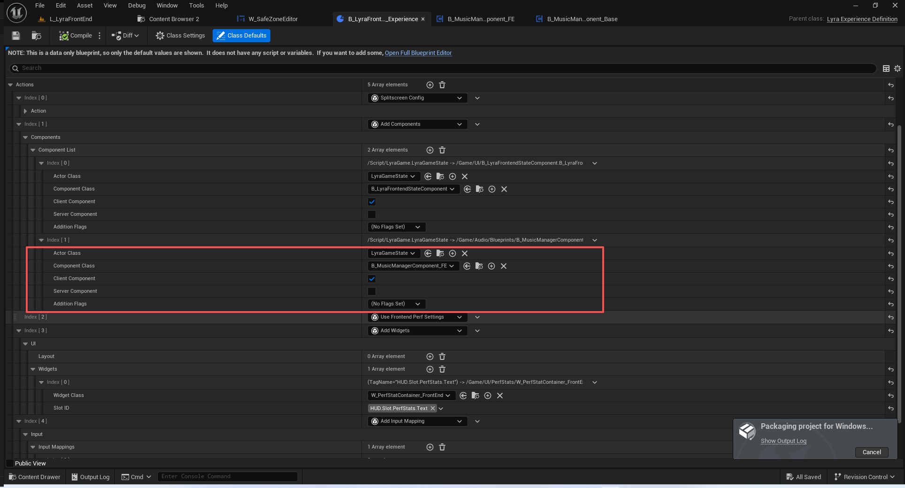
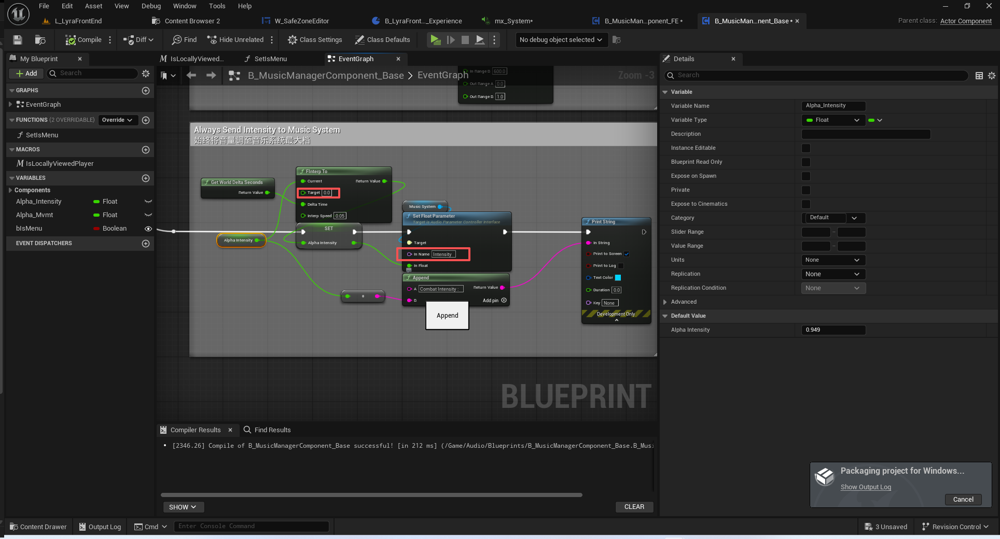
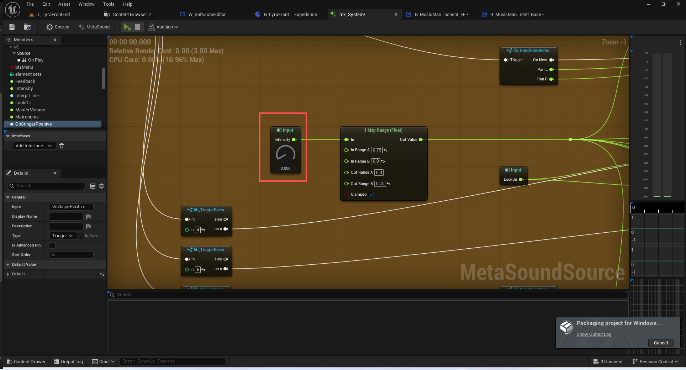
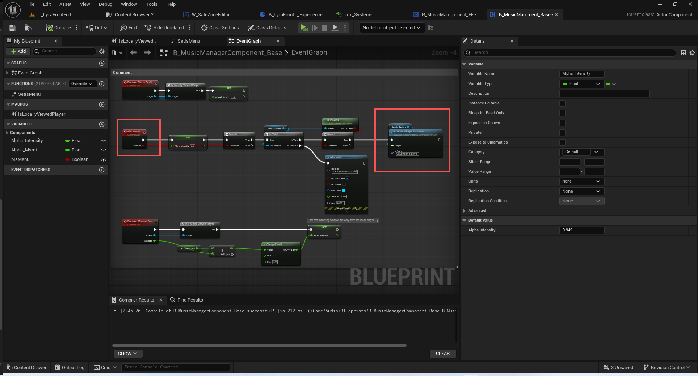
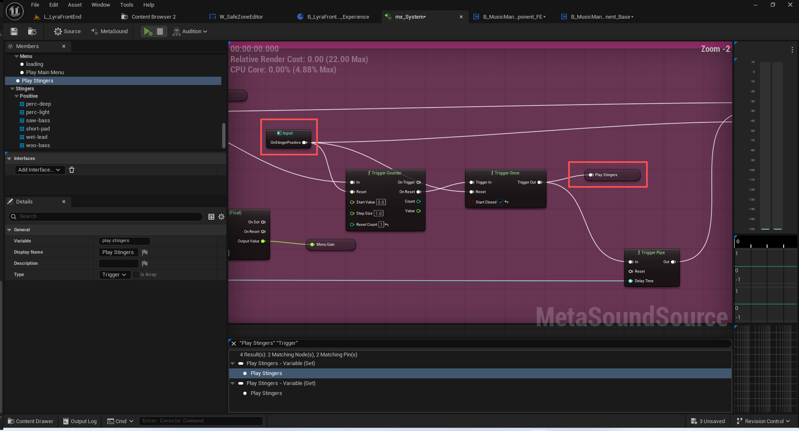
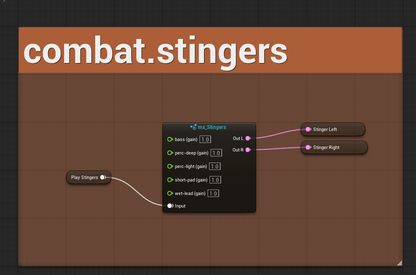

# UE5_Lyra学习指南_064_音乐组件

本文章仅为小刚-B站课堂-虚幻引擎视频课程Lyra-精讲的演讲手稿.  
本套课程链接:[[UE5]虚幻引擎游戏案例Lyra精讲](https://www.bilibili.com/cheese/play/ss112001159)  
前置课程链接:[[UE5]虚幻引擎UEC++从基础到进阶](https://www.bilibili.com/cheese/play/ss28043)  

文章内容由小刚撰写,采用了以下多种方式:  
1.口述转文字  
2.AI重构  
3.参考引擎源码  
4.Lyra工程源码  
5.结合社区论坛各位大佬的解析  

- [UE5\_Lyra学习指南\_064\_音乐组件](#ue5_lyra学习指南_064_音乐组件)
	- [概述](#概述)
	- [战斗强度Intensity](#战斗强度intensity)
	- [游戏停火](#游戏停火)
	- [其他](#其他)
	- [总结](#总结)

## 概述
本节应该是前端界面的最后一节.我们主要是创建一下音频组件,并通过体验附加到游戏实例上即可.
音频组件的作用主要用于播放背景音乐.同时接收各类游戏动态信息,对MetaSound里面的参数进行微调使用即可.

## 战斗强度Intensity
这个值始终是向0在逼近,如果出现战斗了,那么将它设为1,背景音乐将会变小!

## 游戏停火

## 其他
创建音频组件指定MetaSound的图表不赘述.
监听到死亡或者受伤时,降低背景音乐的图表不赘述.
在tick里面非菜单的情况下.传递玩家的Pawn数值不再赘述.
传递是否菜单给MetaSounc的图表不赘述. 

## 总结
本节主要讲解了B_MusicManagerComponent_Base.
B_MusicManagerComponent_FE只是修改了是否在菜单这一参数.
到此,我们的前端界面基本结束了.还剩了回放以及编辑器下选择关卡的内容.这部分内容后续章节选择讲解.