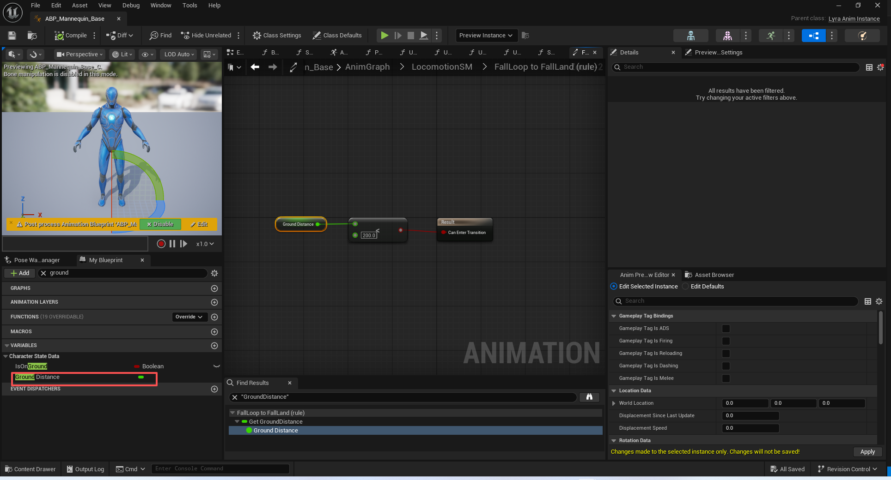
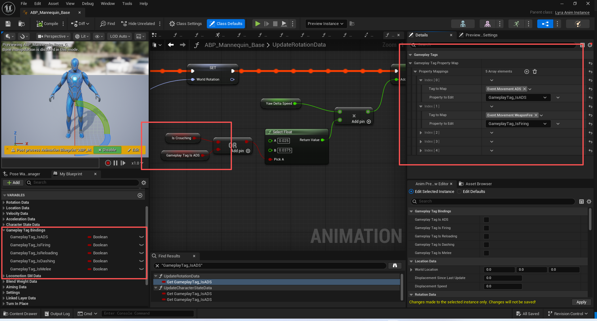

# UE5_Lyra学习指南_067移动组件和动画蓝图

本文章仅为小刚-B站课堂-虚幻引擎视频课程Lyra-精讲的演讲手稿.  
本套课程链接:[[UE5]虚幻引擎游戏案例Lyra精讲](https://www.bilibili.com/cheese/play/ss112001159)  
前置课程链接:[[UE5]虚幻引擎UEC++从基础到进阶](https://www.bilibili.com/cheese/play/ss28043)  

文章内容由小刚撰写,采用了以下多种方式:  
1.口述转文字  
2.AI重构  
3.参考引擎源码  
4.Lyra工程源码  
5.结合社区论坛各位大佬的解析  

- [UE5\_Lyra学习指南\_067移动组件和动画蓝图](#ue5_lyra学习指南_067移动组件和动画蓝图)
	- [概述](#概述)
	- [LyraCharacterMovementComponent](#lyracharactermovementcomponent)
		- [指定使用该子类移动组件](#指定使用该子类移动组件)
		- [加速度](#加速度)
			- [接收角色同步过来的加速度](#接收角色同步过来的加速度)
			- [在模拟移动过程中使用我们同步过来的加速度](#在模拟移动过程中使用我们同步过来的加速度)
			- [模拟移动](#模拟移动)
			- [引擎自带的加速度同步](#引擎自带的加速度同步)
		- [通过Tag限制旋转](#通过tag限制旋转)
		- [通过Tag限制移动](#通过tag限制移动)
		- [蹲伏下可跳跃](#蹲伏下可跳跃)
		- [采集地面信息给动画蓝图使用](#采集地面信息给动画蓝图使用)
		- [代码](#代码)
	- [LyraAnimInstance](#lyraaniminstance)
		- [每帧获取地面高度](#每帧获取地面高度)
		- [绑定ASC的tag以便调整动画状态机](#绑定asc的tag以便调整动画状态机)
		- [监听ASC的tag变化](#监听asc的tag变化)
		- [tag的变化回调](#tag的变化回调)
		- [代码](#代码-1)
	- [总结](#总结)


## 概述
本节主要讲解Lyra项目拓展的移动组件和项目所使用的动画蓝图C++类.

## LyraCharacterMovementComponent

### 指定使用该子类移动组件
``` cpp
ALyraCharacter::ALyraCharacter(const FObjectInitializer& ObjectInitializer)
	: Super(ObjectInitializer.SetDefaultSubobjectClass<ULyraCharacterMovementComponent>(ACharacter::CharacterMovementComponentName))
{
	// ...
}
```
### 加速度
#### 接收角色同步过来的加速度
``` cpp
	// 由Character调用 收到服务器同步到客户端的加速度值
	UE_API void SetReplicatedAcceleration(const FVector& InAcceleration);


```
``` cpp
void ULyraCharacterMovementComponent::SetReplicatedAcceleration(const FVector& InAcceleration)
{
	bHasReplicatedAcceleration = true;
	Acceleration = InAcceleration;
}

```

#### 在模拟移动过程中使用我们同步过来的加速度
``` cpp
void ULyraCharacterMovementComponent::SimulateMovement(float DeltaTime)
{
	if (bHasReplicatedAcceleration)
	{
		// Preserve our replicated acceleration
		// 保持我们的复制加速功能
		const FVector OriginalAcceleration = Acceleration;
		// 在	Super::SimulateMovement->	UpdateProxyAcceleration();发现其实没有开启引擎的同步加速度.又修改了Acceleration的值.
		// 所以我们该给它改回去
		Super::SimulateMovement(DeltaTime);
		Acceleration = OriginalAcceleration;
	}
	else
	{
		Super::SimulateMovement(DeltaTime);
	}
}

```
#### 模拟移动
``` cpp

void UCharacterMovementComponent::SimulateMovement(float DeltaSeconds)
{
	if (!HasValidData() || UpdatedComponent->Mobility != EComponentMobility::Movable || UpdatedComponent->IsSimulatingPhysics())
	{
		return;
	}

	const bool bIsSimulatedProxy = (CharacterOwner->GetLocalRole() == ROLE_SimulatedProxy);

	const FRepMovement& ConstRepMovement = CharacterOwner->GetReplicatedMovement();

	// Workaround for replication not being updated initially
	if (bIsSimulatedProxy &&
		ConstRepMovement.Location.IsZero() &&
		ConstRepMovement.Rotation.IsZero() &&
		ConstRepMovement.LinearVelocity.IsZero())
	{
		return;
	}

	// If base is not resolved on the client, we should not try to simulate at all
	if (CharacterOwner->GetReplicatedBasedMovement().IsBaseUnresolved())
	{
		UE_LOG(LogCharacterMovement, Verbose, TEXT("Base for simulated character '%s' is not resolved on client, skipping SimulateMovement"), *CharacterOwner->GetName());
		return;
	}

	FVector OldVelocity;
	FVector OldLocation;

	// Scoped updates can improve performance of multiple MoveComponent calls.
	{
		FScopedCapsuleMovementUpdate ScopedMovementUpdate(UpdatedComponent, bEnableScopedMovementUpdates);

		bool bHandledNetUpdate = false;
		if (bIsSimulatedProxy)
		{
			// Handle network changes
			if (bNetworkUpdateReceived)
			{
				bNetworkUpdateReceived = false;
				bHandledNetUpdate = true;
				UE_LOG(LogCharacterMovement, Verbose, TEXT("Proxy %s received net update"), *CharacterOwner->GetName());
				if (bNetworkGravityDirectionChanged)
				{
					SetGravityDirection(CharacterOwner->GetReplicatedGravityDirection());
					bNetworkGravityDirectionChanged = false;
				}

				if (bNetworkMovementModeChanged)
				{
					ApplyNetworkMovementMode(CharacterOwner->GetReplicatedMovementMode());
					bNetworkMovementModeChanged = false;
				}
				else if (bJustTeleported || bForceNextFloorCheck)
				{
					// Make sure floor is current. We will continue using the replicated base, if there was one.
					bJustTeleported = false;
					UpdateFloorFromAdjustment();
				}
			}
			else if (bForceNextFloorCheck)
			{
				UpdateFloorFromAdjustment();
			}
		}

		UpdateCharacterStateBeforeMovement(DeltaSeconds);

		if (MovementMode != MOVE_None)
		{
			//TODO: Also ApplyAccumulatedForces()?
			HandlePendingLaunch();
		}
		ClearAccumulatedForces();

		if (MovementMode == MOVE_None)
		{
			return;
		}

		const bool bSimGravityDisabled = (bIsSimulatedProxy && CharacterOwner->bSimGravityDisabled);
		const bool bZeroReplicatedGroundVelocity = (bIsSimulatedProxy && IsMovingOnGround() && ConstRepMovement.LinearVelocity.IsZero());
		
		// bSimGravityDisabled means velocity was zero when replicated and we were stuck in something. Avoid external changes in velocity as well.
		// Being in ground movement with zero velocity, we cannot simulate proxy velocities safely because we might not get any further updates from the server.
		if (bSimGravityDisabled || bZeroReplicatedGroundVelocity)
		{
			Velocity = FVector::ZeroVector;
		}

		MaybeUpdateBasedMovement(DeltaSeconds);

		// simulated pawns predict location
		OldVelocity = Velocity;
		OldLocation = UpdatedComponent->GetComponentLocation();

		UpdateProxyAcceleration();

		// May only need to simulate forward on frames where we haven't just received a new position update.
		if (!bHandledNetUpdate || !bNetworkSkipProxyPredictionOnNetUpdate || !CharacterMovementCVars::NetEnableSkipProxyPredictionOnNetUpdate)
		{
			UE_LOG(LogCharacterMovement, Verbose, TEXT("Proxy %s simulating movement"), *GetNameSafe(CharacterOwner));
			FStepDownResult StepDownResult;
			MoveSmooth(Velocity, DeltaSeconds, &StepDownResult);

			// find floor and check if falling
			if (IsMovingOnGround() || MovementMode == MOVE_Falling)
			{
				const bool bShouldFindFloor = GetGravitySpaceZ(Velocity) <= UE_KINDA_SMALL_NUMBER;

				if (StepDownResult.bComputedFloor)
				{
					CurrentFloor = StepDownResult.FloorResult;
				}
				else if (bShouldFindFloor)
				{
					FindFloor(UpdatedComponent->GetComponentLocation(), CurrentFloor, Velocity.IsZero(), NULL);
				}
				else
				{
					CurrentFloor.Clear();
				}

				// Possible for dynamic movement bases, particularly those that align to slopes while the character does not, to encroach the character.
				// Check to see if we can resolve the penetration in those cases, and if so find the floor.
				if (CurrentFloor.HitResult.bStartPenetrating && MovementBaseUtility::IsDynamicBase(GetMovementBase()))
				{
					// Follows PhysWalking approach for encroachment on floor tests
					FHitResult Hit(CurrentFloor.HitResult);
					Hit.TraceEnd = Hit.TraceStart - GetGravityDirection() * MAX_FLOOR_DIST;
					
					const FVector RequestedAdjustment = GetPenetrationAdjustment(Hit);
					const bool bResolved = ResolvePenetration(RequestedAdjustment, Hit, UpdatedComponent->GetComponentQuat());
					bForceNextFloorCheck |= bResolved;
				}
				else if (!CurrentFloor.IsWalkableFloor())
				{
					if (!bSimGravityDisabled)
					{
						// No floor, must fall.
						if (GetGravitySpaceZ(Velocity) <= UE_KINDA_SMALL_NUMBER || bApplyGravityWhileJumping || !CharacterOwner->IsJumpProvidingForce())
						{
							Velocity = NewFallVelocity(Velocity, -GetGravityDirection() * GetGravityZ(), DeltaSeconds);
						}
					}
					SetMovementMode(MOVE_Falling);
				}
				else
				{
					// Walkable floor
					if (IsMovingOnGround())
					{
						AdjustFloorHeight();
						SetBaseFromFloor(CurrentFloor);
					}
					else if (MovementMode == MOVE_Falling)
					{
						if (CurrentFloor.FloorDist <= MIN_FLOOR_DIST || (bSimGravityDisabled && CurrentFloor.FloorDist <= MAX_FLOOR_DIST))
						{
							// Landed
							SetPostLandedPhysics(CurrentFloor.HitResult);
						}
						else
						{
							if (!bSimGravityDisabled)
							{
								// Continue falling.
								Velocity = NewFallVelocity(Velocity, -GetGravityDirection() * GetGravityZ(), DeltaSeconds);
							}
							CurrentFloor.Clear();
						}
					}
				}
			}
		}
		else
		{
			UE_LOG(LogCharacterMovement, Verbose, TEXT("Proxy %s SKIPPING simulate movement"), *GetNameSafe(CharacterOwner));
		}

		UpdateCharacterStateAfterMovement(DeltaSeconds);

		// consume path following requested velocity
		LastUpdateRequestedVelocity = bHasRequestedVelocity ? RequestedVelocity : FVector::ZeroVector;
		bHasRequestedVelocity = false;

		OnMovementUpdated(DeltaSeconds, OldLocation, OldVelocity);
	} // End scoped movement update

	// Call custom post-movement events. These happen after the scoped movement completes in case the events want to use the current state of overlaps etc.
	CallMovementUpdateDelegate(DeltaSeconds, OldLocation, OldVelocity);

	if (CharacterMovementCVars::BasedMovementMode == 0)
	{
		SaveBaseLocation(); // behaviour before implementing this fix
	}
	else
	{
		MaybeSaveBaseLocation();
	}
	UpdateComponentVelocity();
	bJustTeleported = false;

	LastUpdateLocation = UpdatedComponent ? UpdatedComponent->GetComponentLocation() : FVector::ZeroVector;
	LastUpdateRotation = UpdatedComponent ? UpdatedComponent->GetComponentQuat() : FQuat::Identity;
	LastUpdateVelocity = Velocity;
}
```
主要看一下		UpdateProxyAcceleration();这个函数即可
因为我们实际上没有走引擎同步的加速度.所以这里的Acceleration是被修改成了不正确的值.
实际上我们可以重写UpdateProxyAcceleration这个方法来适应我们的逻辑.
``` cpp
/**
在“模拟移动”过程中，此函数会为代理计算一个新的加速度值，然后再运行代理模拟。
基础实现方式是直接从归一化的速度值中得出一个值，这可能有助于那些希望获得移动方向指示的动画效果。
默认情况下，代理不会实现预测性加速度，因此此值不会用于实际的模拟过程。*/
void UCharacterMovementComponent::UpdateProxyAcceleration()
{
	const FRepMovement& ReplicatedMovement = CharacterOwner->GetReplicatedMovement();
	if (ReplicatedMovement.bRepAcceleration)
	{
		Acceleration = ReplicatedMovement.Acceleration;
		AnalogInputModifier = ComputeAnalogInputModifier();
	}
	else
	{
		// If acceleration isn't replicated for simulated movement, make it non-zero for animations that may want it, based on velocity.
		// Note that this represents Acceleration with units in the range [0, 1] instead of representing cm/s^2.
		Acceleration = Velocity.GetSafeNormal();
		AnalogInputModifier = 1.0f;
	}
}
```
#### 引擎自带的加速度同步
``` cpp
// CVars
namespace CharacterCVars
{
	// Allows characters to include acceleration in the data replicated to sim proxies
	int32 EnableCharacterAccelerationReplication = 0;
	static FAutoConsoleVariableRef CVarEnableCharacterAccelerationReplication(
		TEXT("p.EnableCharacterAccelerationReplication"),
		EnableCharacterAccelerationReplication,
		TEXT("Whether to author acceleration data with character movement replication to sim proxies."));

	static int32 UseLegacyDoJump = 1;
	static FAutoConsoleVariableRef CVarUseLegacyDoJump(
		TEXT("p.UseLegacyDoJump"),
		UseLegacyDoJump,
		TEXT("Should CheckJumpInput call the legacy DoJump or the new DoJump. Default is true while we are still deprecating the old DoJump"),
		ECVF_Default);
}


```
``` cpp
class ACharacter : public APawn
{
protected:
	/** Whether this Character should include acceleration data in its replicated movement */
	virtual bool ShouldReplicateAcceleration() const { return CharacterCVars::EnableCharacterAccelerationReplication != 0; }

}
```

``` cpp
void ACharacter::GatherCurrentMovement()
{
	Super::GatherCurrentMovement();

	if (IsReplicatingMovement())
	{
		FRepMovement& MutableRepMovement = GetReplicatedMovement_Mutable();

		if (ShouldReplicateAcceleration()) 
		{
			MutableRepMovement.bRepAcceleration = true;
			MutableRepMovement.Acceleration = CharacterMovement->GetCurrentAcceleration();
		}
		else
		{
			MutableRepMovement.bRepAcceleration = false;
		}
	}
}

```

``` cpp

void AActor::PreReplication(IRepChangedPropertyTracker & ChangedPropertyTracker)
{
#if WITH_PUSH_MODEL
	const AActor* const OldAttachParent = AttachmentReplication.AttachParent;
	const UActorComponent* const OldAttachComponent = AttachmentReplication.AttachComponent;
#endif

	// Attachment replication gets filled in by GatherCurrentMovement(), but in the case of a detached root we need to trigger remote detachment.
	AttachmentReplication.AttachParent = nullptr;
	AttachmentReplication.AttachComponent = nullptr;

	GatherCurrentMovement();

	DOREPLIFETIME_ACTIVE_OVERRIDE_FAST(AActor, ReplicatedMovement, IsReplicatingMovement());

	// Don't need to replicate AttachmentReplication if the root component replicates, because it already handles it.
	DOREPLIFETIME_ACTIVE_OVERRIDE_FAST(AActor, AttachmentReplication, RootComponent && !RootComponent->GetIsReplicated());


#if WITH_PUSH_MODEL
	if (UNLIKELY(OldAttachParent != AttachmentReplication.AttachParent || OldAttachComponent != AttachmentReplication.AttachComponent))
	{
		MARK_PROPERTY_DIRTY_FROM_NAME(AActor, AttachmentReplication, this);
	}
#endif
}

```
### 通过Tag限制旋转
``` cpp
	//~UMovementComponent interface
	/** 返回在时间间隔 DeltaTime 内角色应旋转的角度。*/
	// 这里嵌入的逻辑是为了方便通过Tag停止旋转
	UE_API virtual FRotator GetDeltaRotation(float DeltaTime) const override;
```
``` cpp

FRotator ULyraCharacterMovementComponent::GetDeltaRotation(float DeltaTime) const
{
	if (UAbilitySystemComponent* ASC = UAbilitySystemGlobals::GetAbilitySystemComponentFromActor(GetOwner()))
	{
		if (ASC->HasMatchingGameplayTag(TAG_Gameplay_MovementStopped))
		{
			return FRotator(0,0,0);
		}
	}

	return Super::GetDeltaRotation(DeltaTime);
}


```
### 通过Tag限制移动
``` cpp
	// 这里嵌入的逻辑是为了方便通过Tag停止移动
	// 返回当前运动模式下组件的最大运行速度。
	UE_API virtual float GetMaxSpeed() const override;

```
``` cpp
float ULyraCharacterMovementComponent::GetMaxSpeed() const
{
	if (UAbilitySystemComponent* ASC = UAbilitySystemGlobals::GetAbilitySystemComponentFromActor(GetOwner()))
	{
		if (ASC->HasMatchingGameplayTag(TAG_Gameplay_MovementStopped))
		{
			return 0;
		}
	}

	return Super::GetMaxSpeed();
}


```
### 蹲伏下可跳跃
``` cpp

bool ULyraCharacterMovementComponent::CanAttemptJump() const
{
	// Same as UCharacterMovementComponent's implementation but without the crouch check
	// 与 UCharacterMovementComponent 的实现方式相同，但不包含蹲伏检查功能
	return IsJumpAllowed() &&
		(IsMovingOnGround() || IsFalling());
	// Falling included for double-jump and non-zero jump hold time, but validated by character.
	// 在进行双跳和非零跳跃保持时间的操作时会加入下落效果，但具体实现方式需根据角色情况进行验证。
}
```
### 采集地面信息给动画蓝图使用
``` cpp
/**
 * FLyraCharacterGroundInfo
 *
 *	Information about the ground under the character.  It only gets updated as needed.
 * 关于该角色脚下地面的信息。该信息仅在需要时进行更新。
 *	
 */
USTRUCT(BlueprintType)
struct FLyraCharacterGroundInfo
{
	GENERATED_BODY()

	FLyraCharacterGroundInfo()
		: LastUpdateFrame(0)
		, GroundDistance(0.0f)
	{}

	uint64 LastUpdateFrame;

	UPROPERTY(BlueprintReadOnly)
	FHitResult GroundHitResult;

	UPROPERTY(BlueprintReadOnly)
	float GroundDistance;
};


```
``` cpp
public:

	// Returns the current ground info.  Calling this will update the ground info if it's out of date.
	// 返回当前的地面信息。调用此函数将会更新（若信息已过期）当前的地面信息。
	// 在动画蓝图中使用ULyraAnimInstance::NativeUpdateAnimation有个GroundDistance变量可以在蓝图中访问使用
	UFUNCTION(BlueprintCallable, Category = "Lyra|CharacterMovement")
	UE_API const FLyraCharacterGroundInfo& GetGroundInfo();

protected:

	// Cached ground info for the character.  Do not access this directly!  It's only updated when accessed via GetGroundInfo().
	// 该角色的缓存地面信息。请勿直接访问此数据！其信息仅在通过“获取地面信息”方法进行访问时才会更新。
	FLyraCharacterGroundInfo CachedGroundInfo;

	// 是否开启了我们手动的加速度同步功能
	UPROPERTY(Transient)
	bool bHasReplicatedAcceleration = false;

```

``` cpp
const FLyraCharacterGroundInfo& ULyraCharacterMovementComponent::GetGroundInfo()
{
	// 合法性判定
	if (!CharacterOwner || (GFrameCounter == CachedGroundInfo.LastUpdateFrame))
	{
		return CachedGroundInfo;
	}

	// 行走时 地面距离为0
	if (MovementMode == MOVE_Walking)
	{
		CachedGroundInfo.GroundHitResult = CurrentFloor.HitResult;
		CachedGroundInfo.GroundDistance = 0.0f;
	}
	else
	{
		// 打个射线看一下
		
		const UCapsuleComponent* CapsuleComp = CharacterOwner->GetCapsuleComponent();
		check(CapsuleComp);

		const float CapsuleHalfHeight = CapsuleComp->GetUnscaledCapsuleHalfHeight();
		const ECollisionChannel CollisionChannel = (UpdatedComponent ? UpdatedComponent->GetCollisionObjectType() : ECC_Pawn);
		// 发射位置是胶囊体的中心.Actor的在世界场景中的位置
		// 返回受控角色的位置——即碰撞包围盒的中心位置
		const FVector TraceStart(GetActorLocation());
		// 注意这里检测距离多加了一个胶囊体的半高 说明是中人物的腰部往下计算的
		const FVector TraceEnd(TraceStart.X, TraceStart.Y, (TraceStart.Z - LyraCharacter::GroundTraceDistance - CapsuleHalfHeight));

		FCollisionQueryParams QueryParams(SCENE_QUERY_STAT(LyraCharacterMovementComponent_GetGroundInfo), false, CharacterOwner);
		FCollisionResponseParams ResponseParam;
		InitCollisionParams(QueryParams, ResponseParam);

		FHitResult HitResult;
		GetWorld()->LineTraceSingleByChannel(HitResult, TraceStart, TraceEnd, CollisionChannel, QueryParams, ResponseParam);

		CachedGroundInfo.GroundHitResult = HitResult;
		CachedGroundInfo.GroundDistance = LyraCharacter::GroundTraceDistance;

		if (MovementMode == MOVE_NavWalking)
		{
			// 导地面距离 地面距离为0
			CachedGroundInfo.GroundDistance = 0.0f;
		}
		else if (HitResult.bBlockingHit)
		{
			// 注意这里距离减去了胶囊体的半高 说明这里的距离需要是从脚步到地面
			CachedGroundInfo.GroundDistance = FMath::Max((HitResult.Distance - CapsuleHalfHeight), 0.0f);
		}
	}

	// 记录帧数
	CachedGroundInfo.LastUpdateFrame = GFrameCounter;

	return CachedGroundInfo;
}

```


### 代码
``` cpp

/**
 * FLyraCharacterGroundInfo
 *
 *	Information about the ground under the character.  It only gets updated as needed.
 * 关于该角色脚下地面的信息。该信息仅在需要时进行更新。
 *	
 */
USTRUCT(BlueprintType)
struct FLyraCharacterGroundInfo
{
	GENERATED_BODY()

	FLyraCharacterGroundInfo()
		: LastUpdateFrame(0)
		, GroundDistance(0.0f)
	{}

	uint64 LastUpdateFrame;

	UPROPERTY(BlueprintReadOnly)
	FHitResult GroundHitResult;

	UPROPERTY(BlueprintReadOnly)
	float GroundDistance;
};


/**
 * ULyraCharacterMovementComponent
 *
 *	The base character movement component class used by this project.
 *	本项目所使用的基础角色移动组件类。
 */
UCLASS(MinimalAPI, Config = Game)
class ULyraCharacterMovementComponent : public UCharacterMovementComponent
{
	GENERATED_BODY()

public:

	// 构造函数无作用
	UE_API ULyraCharacterMovementComponent(const FObjectInitializer& ObjectInitializer);

	// 这里的设计不是很完美 应该是直接重写父类的逻辑
	// 而不是 在父类执行前 把我们从Character计算的加速度存一下 然后在父类执行完成之后 再把我们存的加速度设置上去
	// 因为引擎实际上是没有开启同步加速度的逻辑 而是我们自己手动同步的加速度 所以看起来有点怪怪的
	UE_API virtual void SimulateMovement(float DeltaTime) override;

	UE_API virtual bool CanAttemptJump() const override;

	// Returns the current ground info.  Calling this will update the ground info if it's out of date.
	// 返回当前的地面信息。调用此函数将会更新（若信息已过期）当前的地面信息。
	// 在动画蓝图中使用ULyraAnimInstance::NativeUpdateAnimation有个GroundDistance变量可以在蓝图中访问使用
	UFUNCTION(BlueprintCallable, Category = "Lyra|CharacterMovement")
	UE_API const FLyraCharacterGroundInfo& GetGroundInfo();

	// 由Character调用 收到服务器同步到客户端的加速度值
	UE_API void SetReplicatedAcceleration(const FVector& InAcceleration);

	//~UMovementComponent interface
	/** 返回在时间间隔 DeltaTime 内角色应旋转的角度。*/
	// 这里嵌入的逻辑是为了方便通过Tag停止旋转
	UE_API virtual FRotator GetDeltaRotation(float DeltaTime) const override;
	
	// 这里嵌入的逻辑是为了方便通过Tag停止移动
	// 返回当前运动模式下组件的最大运行速度。
	UE_API virtual float GetMaxSpeed() const override;
	//~End of UMovementComponent interface

protected:
	// 无作用
	UE_API virtual void InitializeComponent() override;

protected:

	// Cached ground info for the character.  Do not access this directly!  It's only updated when accessed via GetGroundInfo().
	// 该角色的缓存地面信息。请勿直接访问此数据！其信息仅在通过“获取地面信息”方法进行访问时才会更新。
	FLyraCharacterGroundInfo CachedGroundInfo;

	// 是否开启了我们手动的加速度同步功能
	UPROPERTY(Transient)
	bool bHasReplicatedAcceleration = false;
};

```


## LyraAnimInstance

### 每帧获取地面高度
``` cpp
	// 每帧从移动组件中读取的地面信息,有动画图表访问使用
	UPROPERTY(BlueprintReadOnly, Category = "Character State Data")
	float GroundDistance = -1.0f;
```
``` cpp
void ULyraAnimInstance::NativeUpdateAnimation(float DeltaSeconds)
{
	Super::NativeUpdateAnimation(DeltaSeconds);

	const ALyraCharacter* Character = Cast<ALyraCharacter>(GetOwningActor());
	if (!Character)
	{
		return;
	}

	ULyraCharacterMovementComponent* CharMoveComp = CastChecked<ULyraCharacterMovementComponent>(Character->GetCharacterMovement());
	const FLyraCharacterGroundInfo& GroundInfo = CharMoveComp->GetGroundInfo();
	GroundDistance = GroundInfo.GroundDistance;
}

```


### 绑定ASC的tag以便调整动画状态机




``` cpp
void ULyraAnimInstance::NativeInitializeAnimation()
{
	Super::NativeInitializeAnimation();

	if (AActor* OwningActor = GetOwningActor())
	{
		if (UAbilitySystemComponent* ASC = UAbilitySystemGlobals::GetAbilitySystemComponentFromActor(OwningActor))
		{
			InitializeWithAbilitySystem(ASC);
		}
	}
}
```
``` cpp
void ULyraAnimInstance::InitializeWithAbilitySystem(UAbilitySystemComponent* ASC)
{
	check(ASC);

	GameplayTagPropertyMap.Initialize(this, ASC);
}

```
``` cpp
	// Gameplay tags that can be mapped to blueprint variables. The variables will automatically update as the tags are added or removed.
	// These should be used instead of manually querying for the gameplay tags.
	// 可以映射到蓝图变量的游戏玩法标签。当这些标签被添加或移除时，相关变量会自动更新。
	// 应当使用这些标签，而不要通过手动查询来获取游戏玩法标签。
	UPROPERTY(EditDefaultsOnly, Category = "GameplayTags")
	FGameplayTagBlueprintPropertyMap GameplayTagPropertyMap;
```

``` cpp
/**
 * Struct used to manage gameplay tag blueprint property mappings.
 * It registers the properties with delegates on an ability system component.
 * This struct can not be used in containers (such as TArray) since it uses a raw pointer
 * to bind the delegate and it's address could change causing an invalid binding.
 */
USTRUCT()
struct FGameplayTagBlueprintPropertyMap
{
	GENERATED_BODY()

public:

	UE_API FGameplayTagBlueprintPropertyMap();
	UE_API FGameplayTagBlueprintPropertyMap(const FGameplayTagBlueprintPropertyMap& Other);
	UE_API ~FGameplayTagBlueprintPropertyMap();

	/** Call this to initialize and bind the properties with the ability system component. */
	UE_API void Initialize(UObject* Owner, class UAbilitySystemComponent* ASC);

	/** Call to manually apply the current tag state, can handle cases where callbacks were skipped */
	UE_API void ApplyCurrentTags();

#if WITH_EDITOR
	UE_DEPRECATED(5.3, "The signature for IsDataValid has changed.  Please use the one that takes a FDataValidationContext")
	EDataValidationResult IsDataValid(const UObject* ContainingAsset, TArray<FText>& ValidationErrors) { return EDataValidationResult::NotValidated; }

	/** This can optionally be called in the owner's IsDataValid() for data validation. */
	UE_API EDataValidationResult IsDataValid(const UObject* ContainingAsset, class FDataValidationContext& Context) const;
#endif // #if WITH_EDITOR

protected:

	UE_API void Unregister();

	UE_API void GameplayTagEventCallback(const FGameplayTag Tag, int32 NewCount, TWeakObjectPtr<UObject> RegisteredOwner);

	UE_API bool IsPropertyTypeValid(const FProperty* Property) const;

	UE_API EGameplayTagEventType::Type GetGameplayTagEventType(const FProperty* Property) const;

protected:

	TWeakObjectPtr<UObject> CachedOwner;
	TWeakObjectPtr<UAbilitySystemComponent> CachedASC;

	UPROPERTY(EditAnywhere, Category = GameplayTagBlueprintProperty)
	TArray<FGameplayTagBlueprintPropertyMapping> PropertyMappings;
};
```
``` cpp

/**
 * Struct used to update a blueprint property with a gameplay tag count.
 * The property is automatically updated as the gameplay tag count changes.
 * It only supports boolean, integer, and float properties.
 */
USTRUCT()
struct FGameplayTagBlueprintPropertyMapping
{
	GENERATED_BODY()

public:

	FGameplayTagBlueprintPropertyMapping() {}
	FGameplayTagBlueprintPropertyMapping(const FGameplayTagBlueprintPropertyMapping& Other)
	{
		// Don't copy handle
		TagToMap = Other.TagToMap;
		PropertyToEdit = Other.PropertyToEdit;
		PropertyName = Other.PropertyName;
		PropertyGuid = Other.PropertyGuid;
	}

	// Pretty weird that the assignment operator copies the handle when the copy constructor doesn't - bug?
	FGameplayTagBlueprintPropertyMapping& operator=(const FGameplayTagBlueprintPropertyMapping& Other) = default;

	/** Gameplay tag being counted. */
	UPROPERTY(EditAnywhere, Category = GameplayTagBlueprintProperty)
	FGameplayTag TagToMap;

	/** Property to update with the gameplay tag count. */
	UPROPERTY(VisibleAnywhere, Category = GameplayTagBlueprintProperty)
	TFieldPath<FProperty> PropertyToEdit;

	/** Name of property being edited. */
	UPROPERTY(VisibleAnywhere, Category = GameplayTagBlueprintProperty)
	FName PropertyName;

	/** Guid of property being edited. */
	UPROPERTY(VisibleAnywhere, Category = GameplayTagBlueprintProperty)
	FGuid PropertyGuid;

	/** Handle to delegate bound on the ability system component. */
	FDelegateHandle DelegateHandle;
};
```
### 监听ASC的tag变化
``` cpp

void FGameplayTagBlueprintPropertyMap::Initialize(UObject* Owner, UAbilitySystemComponent* ASC)
{
	UClass* OwnerClass = (Owner ? Owner->GetClass() : nullptr);
	if (!OwnerClass)
	{
		ABILITY_LOG(Error, TEXT("FGameplayTagBlueprintPropertyMap: Initialize() called with an invalid Owner."));
		return;
	}

	if (!ASC)
	{
		ABILITY_LOG(Error, TEXT("FGameplayTagBlueprintPropertyMap: Initialize() called with an invalid AbilitySystemComponent."));
		return;
	}

	if ((CachedOwner == Owner) && (CachedASC == ASC))
	{
		// Already initialized.
		return;
	}

	if (CachedOwner.IsValid())
	{
		Unregister();
	}

	CachedOwner = Owner;
	CachedASC = ASC;

	FOnGameplayEffectTagCountChanged::FDelegate Delegate = FOnGameplayEffectTagCountChanged::FDelegate::CreateRaw(this, &FGameplayTagBlueprintPropertyMap::GameplayTagEventCallback, CachedOwner);

	// Process array starting at the end so we can remove invalid entries.
	for (int32 MappingIndex = (PropertyMappings.Num() - 1); MappingIndex >= 0; --MappingIndex)
	{
		FGameplayTagBlueprintPropertyMapping& Mapping = PropertyMappings[MappingIndex];

		if (Mapping.TagToMap.IsValid())
		{
			FProperty* Property = OwnerClass->FindPropertyByName(Mapping.PropertyName);
			if (Property && IsPropertyTypeValid(Property))
			{
				Mapping.PropertyToEdit = Property;
				Mapping.DelegateHandle = ASC->RegisterAndCallGameplayTagEvent(Mapping.TagToMap, Delegate, GetGameplayTagEventType(Property));
				continue;
			}
		}

		// Entry was invalid.  Remove it from the array.
		ABILITY_LOG(Error, TEXT("FGameplayTagBlueprintPropertyMap: Removing invalid GameplayTagBlueprintPropertyMapping [Index: %d, Tag:%s, Property:%s] for [%s]."),
			MappingIndex, *Mapping.TagToMap.ToString(), *Mapping.PropertyName.ToString(), *GetNameSafe(Owner));

		PropertyMappings.RemoveAtSwap(MappingIndex, EAllowShrinking::No);
	}
}
```

### tag的变化回调
``` cpp

void FGameplayTagBlueprintPropertyMap::GameplayTagEventCallback(const FGameplayTag Tag, int32 NewCount, TWeakObjectPtr<UObject> RegisteredOwner)
{
	if (!RegisteredOwner.IsValid() || !CachedOwner.IsValid())
	{
		ABILITY_LOG(Warning, TEXT("FGameplayTagBlueprintPropertyMap::GameplayTagEventCallback called with corrupted RegisteredOwner or corrupted CachedOwner!"));
		return;
	}
	
	// If the index and serial don't match with registered owner, the memory might be trashed so abort
	if (!ensure(RegisteredOwner.HasSameIndexAndSerialNumber(CachedOwner)))
	{
		ABILITY_LOG(Error, TEXT("FGameplayTagBlueprintPropertyMap::GameplayTagEventCallback called with corrupted Owner!"));
		return;
	}

	UObject* Owner = CachedOwner.Get();
	if (!Owner)
	{
		ABILITY_LOG(Warning, TEXT("FGameplayTagBlueprintPropertyMap::GameplayTagEventCallback has an invalid Owner."));
		return;
	}

	FGameplayTagBlueprintPropertyMapping* Mapping = PropertyMappings.FindByPredicate([Tag](const FGameplayTagBlueprintPropertyMapping& Test)
	{
		return (Tag == Test.TagToMap);
	});

	if (Mapping && Mapping->PropertyToEdit.Get())
	{
		if (const FBoolProperty* BoolProperty = CastField<const FBoolProperty>(Mapping->PropertyToEdit.Get()))
		{
			BoolProperty->SetPropertyValue_InContainer(Owner, NewCount > 0);
		}
		else if (const FIntProperty* IntProperty = CastField<const FIntProperty>(Mapping->PropertyToEdit.Get()))
		{
			IntProperty->SetPropertyValue_InContainer(Owner, NewCount);
		}
		else if (const FFloatProperty* FloatProperty = CastField<const FFloatProperty>(Mapping->PropertyToEdit.Get()))
		{
			FloatProperty->SetPropertyValue_InContainer(Owner, (float)NewCount);
		}
	}
}

```

### 代码

``` cpp

/**
 * ULyraAnimInstance
 *
 *	The base game animation instance class used by this project.
 * 本项目所使用的基础游戏动画实例类。
 * 
 */
UCLASS(Config = Game)
class ULyraAnimInstance : public UAnimInstance
{
	GENERATED_BODY()

public:
	// 构造函数 无作用
	ULyraAnimInstance(const FObjectInitializer& ObjectInitializer);

	// 使用ASC和这个动画蓝图进行Tag的绑定方便查询
	virtual void InitializeWithAbilitySystem(UAbilitySystemComponent* ASC);

protected:

#if WITH_EDITOR
	// 编辑器验证接口 主要验证tag等是否有效
	virtual EDataValidationResult IsDataValid(class FDataValidationContext& Context) const override;
#endif // WITH_EDITOR
	// 触发ASC的初始化绑定
	virtual void NativeInitializeAnimation() override;
	// 读取地面检测信息
	virtual void NativeUpdateAnimation(float DeltaSeconds) override;

protected:

	// Gameplay tags that can be mapped to blueprint variables. The variables will automatically update as the tags are added or removed.
	// These should be used instead of manually querying for the gameplay tags.
	// 可以映射到蓝图变量的游戏玩法标签。当这些标签被添加或移除时，相关变量会自动更新。
	// 应当使用这些标签，而不要通过手动查询来获取游戏玩法标签。
	UPROPERTY(EditDefaultsOnly, Category = "GameplayTags")
	FGameplayTagBlueprintPropertyMap GameplayTagPropertyMap;

	// 每帧从移动组件中读取的地面信息,有动画图表访问使用
	UPROPERTY(BlueprintReadOnly, Category = "Character State Data")
	float GroundDistance = -1.0f;
};

```
## 总结
本节讲解的移动组件和动画蓝图的功能极其实用.关于动画蓝图内容不在本章进行讲解.