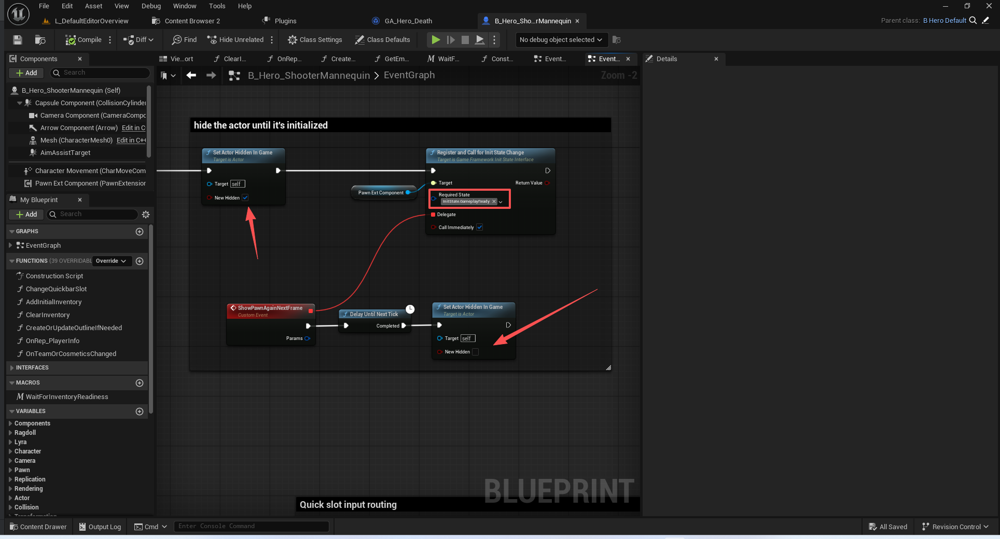

# UE5_Lyra学习指南_068_角色拓展中枢组件PawnExtension

本文章仅为小刚-B站课堂-虚幻引擎视频课程Lyra-精讲的演讲手稿.  
本套课程链接:[[UE5]虚幻引擎游戏案例Lyra精讲](https://www.bilibili.com/cheese/play/ss112001159)  
前置课程链接:[[UE5]虚幻引擎UEC++从基础到进阶](https://www.bilibili.com/cheese/play/ss28043)  

文章内容由小刚撰写,采用了以下多种方式:  
1.口述转文字  
2.AI重构  
3.参考引擎源码  
4.Lyra工程源码  
5.结合社区论坛各位大佬的解析  

- [UE5\_Lyra学习指南\_068\_角色拓展中枢组件PawnExtension](#ue5_lyra学习指南_068_角色拓展中枢组件pawnextension)
	- [概述](#概述)
	- [参考资料](#参考资料)
	- [父类](#父类)
		- [UPawnComponent](#upawncomponent)
		- [UGameFrameworkComponent](#ugameframeworkcomponent)
		- [IGameFrameworkInitStateInterface](#igameframeworkinitstateinterface)
	- [构造函数](#构造函数)
	- [分阶段推进](#分阶段推进)
		- [明确ActorFeature](#明确actorfeature)
		- [注册和取消注册ActorFeature](#注册和取消注册actorfeature)
		- [定义推进阶段和尝试推进](#定义推进阶段和尝试推进)
		- [阶段推进中](#阶段推进中)
			- [是否可以切换到下一阶段](#是否可以切换到下一阶段)
			- [实际切换逻辑](#实际切换逻辑)
			- [当其他ActorFeature变化时尝试推进自己](#当其他actorfeature变化时尝试推进自己)
	- [多个尝试推进的入口](#多个尝试推进的入口)
		- [Beginplay](#beginplay)
		- [监听的其他组件的ActorFeature发生阶段变化时](#监听的其他组件的actorfeature发生阶段变化时)
		- [设置Pawndata](#设置pawndata)
			- [服务端](#服务端)
			- [客户端](#客户端)
	- [接收角色发过来的控制器改变](#接收角色发过来的控制器改变)
	- [接收角色发过来的玩家状态类同步](#接收角色发过来的玩家状态类同步)
	- [接收角色发过来的玩家输入组件ok](#接收角色发过来的玩家输入组件ok)
	- [ASC的使用管理](#asc的使用管理)
		- [ASC的注册和停用](#asc的注册和停用)
		- [ASC的初始化完成和停用代理事件](#asc的初始化完成和停用代理事件)
		- [ASC初始化验证](#asc初始化验证)
		- [生命值组件绑定ASC的属性](#生命值组件绑定asc的属性)
		- [技能互斥Tag](#技能互斥tag)
	- [代码](#代码)
	- [总结](#总结)


## 概述
本节主要讲解PawnExtension的功能.
极其重要!
这个架构是为了解决在网络游戏过程中的时序问题,保证初始化中每个阶段按照稳定的执行结果来,当然执行的过程中是随机的.

## 参考资料
必看!!!
[游戏框架组件管理器](https://dev.epicgames.com/documentation/zh-cn/unreal-engine/game-framework-component-manager-in-unreal-engine)

## 父类
提供了一些通用方法.
### UPawnComponent
``` cpp

/**
 * PawnComponent is an actor component made for APawn and receives pawn events.
 */
UCLASS(MinimalAPI)
class UPawnComponent : public UGameFrameworkComponent
{
	GENERATED_BODY()

public:
	
	UE_API UPawnComponent(const FObjectInitializer& ObjectInitializer);

	/** Gets the pawn that owns the component, this will always be valid during gameplay but can return null in the editor */
	template <class T>
	T* GetPawn() const
	{
		static_assert(TPointerIsConvertibleFromTo<T, APawn>::Value, "'T' template parameter to GetPawn must be derived from APawn");
		return Cast<T>(GetOwner());
	}

	template <class T>
	T* GetPawnChecked() const
	{
		static_assert(TPointerIsConvertibleFromTo<T, APawn>::Value, "'T' template parameter to GetPawnChecked must be derived from APawn");
		return CastChecked<T>(GetOwner());
	}

	//////////////////////////////////////////////////////////////////////////////
	// Pawn accessors, only valid if called during gameplay
	//////////////////////////////////////////////////////////////////////////////

	/** Gets the player state that owns the component, this can return null on clients for player pawns that are still being replicated */
	template <class T>
	T* GetPlayerState() const
	{
		static_assert(TPointerIsConvertibleFromTo<T, APlayerState>::Value, "'T' template parameter to GetPlayerState must be derived from APlayerState");
		return GetPawnChecked<APawn>()->GetPlayerState<T>();
	}

	/** Gets the controller that owns the component, this will usually be null on clients */
	template <class T>
	T* GetController() const
	{
		static_assert(TPointerIsConvertibleFromTo<T, AController>::Value, "'T' template parameter to GetController must be derived from AController");
		return GetPawnChecked<APawn>()->GetController<T>();
	}

};

```
### UGameFrameworkComponent
``` cpp

/**
 * GameFrameworkComponent is a base class for actor components made for the basic game framework classes.
 */
UCLASS(MinimalAPI, Blueprintable, BlueprintType, HideCategories=(Trigger, PhysicsVolume))
class UGameFrameworkComponent : public UActorComponent
{
	GENERATED_BODY()

public:
	
	UE_API UGameFrameworkComponent(const FObjectInitializer& ObjectInitializer);

	/** Gets the game instance this component is a part of, this will return null if not called during normal gameplay */
	template <class T>
	T* GetGameInstance() const
	{
		static_assert(TPointerIsConvertibleFromTo<T, UGameInstance>::Value, "'T' template parameter to GetGameInstance must be derived from UGameInstance");
		AActor* Owner = GetOwner();
		return Owner ? Owner->GetGameInstance<T>() : nullptr;
	}

	template <class T>
	T* GetGameInstanceChecked() const
	{
		static_assert(TPointerIsConvertibleFromTo<T, UGameInstance>::Value, "'T' template parameter to GetGameInstance must be derived from UGameInstance");
		AActor* Owner = GetOwner();
		check(Owner);
		T* GameInstance = Owner->GetGameInstance<T>();
		check(GameInstance);
		return GameInstance;
	}

	/** Returns true if the owner's role is ROLE_Authority */
	UE_API bool HasAuthority() const;

	/** Returns the world's timer manager */
	UE_API class FTimerManager& GetWorldTimerManager() const;
};
```
### IGameFrameworkInitStateInterface
``` cpp

/** Interface that can be implemented by actors/components to make interacting with the init state system easier */
/** 该接口可由角色/组件实现，以便更轻松地与初始化状态系统进行交互 */
UINTERFACE(MinimalAPI, NotBlueprintable)
class UGameFrameworkInitStateInterface : public UInterface
{
	GENERATED_BODY()
};

class IGameFrameworkInitStateInterface
{
	GENERATED_BODY()
public:

	/** Returns the Actor this object is bound to, might be this object */
	/** 返回此对象所绑定的演员对象（可能是本对象本身） */
	UE_API virtual AActor* GetOwningActor() const;

	/** Gets the component manager corresponding to this object based on owning actor */
	/** 根据拥有者角色获取与此对象相对应的组件管理器 */
	UE_API UGameFrameworkComponentManager* GetComponentManager() const;

	/** Returns the feature this object implements, this interface is only meant for simple objects with a single feature like Actor */
	/** 返回此对象所实现的特性，此接口仅适用于具有单一特性的简单对象，例如“演员”此类对象 */
	UFUNCTION(BlueprintCallable, Category = "InitState")
	virtual FName GetFeatureName() const { return NAME_None; }

	/** Returns the current feature state of this object, the default behavior is to query the manager */
	/** 返回此对象的当前特征状态，默认行为是向管理器查询 */
	UFUNCTION(BlueprintCallable, Category = "InitState")
	UE_API virtual FGameplayTag GetInitState() const;

	/** Checks the component manager to see if we have already reached the desired state or a later one */
	/** 检查组件管理器，以确定我们是否已经达到了预期状态或更高级的状态 */
	UFUNCTION(BlueprintCallable, Category = "InitState")
	UE_API virtual bool HasReachedInitState(FGameplayTag DesiredState) const;

	/** Should be overridden to perform class-specific checks to see if the desired state can be reached */
	/** 应当被重写以执行针对特定类的检查，以确定是否能够达到所需状态 */
	virtual bool CanChangeInitState(UGameFrameworkComponentManager* Manager, FGameplayTag CurrentState, FGameplayTag DesiredState) const { return true; }

	/** Should be overridden to perform class-specific state changes, this is called right before notifying the component manager */
	/** 应被重写以执行特定于类的状态更改操作，此方法会在通知组件管理器之前被调用 */
	virtual void HandleChangeInitState(UGameFrameworkComponentManager* Manager, FGameplayTag CurrentState, FGameplayTag DesiredState) {}

	/** Checks to see if a change is possible, then calls execute and notify */
	/** 检查是否可以进行更改，然后调用“执行”和“通知”操作 */
	UE_API virtual bool TryToChangeInitState(FGameplayTag DesiredState);

	/** Tries to follow a chain of connected init states, will progress states in order and returns the final state reached */
	/** 尝试按照一系列相互关联的初始化状态进行推进，会按顺序推进各状态，并返回最终达到的状态 */
	UE_API virtual FGameplayTag ContinueInitStateChain(const TArray<FGameplayTag>& InitStateChain);

	/** Override to try and progress the default initialization path, likely using ContinueInitStateChain */
	/** 重写此方法以尝试推进默认的初始化路径，可能使用“继续初始化状态链”这一机制 */
	virtual void CheckDefaultInitialization() {}

	/** This will call CheckDefaultInitialization on all other feature implementers using this interface, useful to update the state of any dependencies */
	/** 此代码将对使用此接口的所有其他功能实现者调用“检查默认初始化”函数，有助于更新任何依赖项的状态 */
	UE_API virtual void CheckDefaultInitializationForImplementers();

	/** Signature for handling a game feature state, this is not registered by default */
	/** 用于处理游戏功能状态的签名，此功能默认情况下未进行注册 */
	virtual void OnActorInitStateChanged(const FActorInitStateChangedParams& Params) {}

	/** Call to bind the OnActorInitStateChanged function to the appropriate delegate on the component manager */
	/** 调用以将 OnActorInitStateChanged 函数绑定到组件管理器中的相应委托上 */
	UE_API virtual void BindOnActorInitStateChanged(FName FeatureName, FGameplayTag RequiredState, bool bCallIfReached);

	/** Call to register with the component manager during spawn if this is a game world */
	/** 在游戏世界中进行实例化时，若需要注册到组件管理器中，则调用此方法 */
	UE_API virtual void RegisterInitStateFeature();

	/** Unregisters state and delegate binding with component manager */
	/** 注销状态设置以及与组件管理器的委托绑定 */
	UE_API virtual void UnregisterInitStateFeature();

	/** Binds a BP delegate to get called on a state change for this feature */
	/** 将一个 BP 代理绑定到该功能的状态变化时执行回调操作 */
	UFUNCTION(BlueprintCallable, Category = "InitState")
	UE_API virtual bool RegisterAndCallForInitStateChange(FGameplayTag RequiredState, FActorInitStateChangedBPDelegate Delegate, bool bCallImmediately = true);

	/** Unbinds a BP delegate from changes to this feature */
	/** 从本功能的变化中解除绑定业务流程委托 */
	UFUNCTION(BlueprintCallable, Category = "InitState")
	UE_API virtual bool UnregisterInitStateDelegate(FActorInitStateChangedBPDelegate Delegate);

	/** Returns Current state and any additional debug information for the active state */
	/** 返回当前状态以及与当前状态相关的任何附加调试信息 */
	UE_API virtual FString GetDebugState() const;

protected:
	/** Default handle created from calling BindOnActorInitStateChanged */
	/** 由调用“BindOnActorInitStateChanged”而创建的默认处理程序 */
	FDelegateHandle ActorInitStateChangedHandle;
};

```
## 构造函数
``` cpp
	/**
	 * 构造函数
	 * 关闭Tick
	 * 开启网络同步
	 * 初始化变量
	 * @param ObjectInitializer 
	 */
	UE_API ULyraPawnExtensionComponent(const FObjectInitializer& ObjectInitializer);


```
``` cpp
ULyraPawnExtensionComponent::ULyraPawnExtensionComponent(const FObjectInitializer& ObjectInitializer)
	: Super(ObjectInitializer)
{
	PrimaryComponentTick.bStartWithTickEnabled = false;
	PrimaryComponentTick.bCanEverTick = false;

	SetIsReplicatedByDefault(true);

	PawnData = nullptr;
	AbilitySystemComponent = nullptr;
}
```

## 分阶段推进
### 明确ActorFeature
``` cpp
const FName ULyraPawnExtensionComponent::NAME_ActorFeatureName("PawnExtension");

```
``` cpp
	/** The name of this overall feature, this one depends on the other named component features */
	/** 此整体功能的名称，该名称取决于其他已命名的组件功能 */
	static UE_API const FName NAME_ActorFeatureName;

	//~ Begin IGameFrameworkInitStateInterface interface
	/** 返回此对象所实现的特性，此接口仅适用于具有单一特性的简单对象，例如“演员”此类对象 */
	virtual FName GetFeatureName() const override { return NAME_ActorFeatureName; }
```

### 注册和取消注册ActorFeature
``` cpp

void ULyraPawnExtensionComponent::OnRegister()
{
	Super::OnRegister();

	const APawn* Pawn = GetPawn<APawn>();
	ensureAlwaysMsgf((Pawn != nullptr), TEXT("LyraPawnExtensionComponent on [%s] can only be added to Pawn actors."), *GetNameSafe(GetOwner()));

	TArray<UActorComponent*> PawnExtensionComponents;
	Pawn->GetComponents(ULyraPawnExtensionComponent::StaticClass(), PawnExtensionComponents);
	ensureAlwaysMsgf((PawnExtensionComponents.Num() == 1), TEXT("Only one LyraPawnExtensionComponent should exist on [%s]."), *GetNameSafe(GetOwner()));

	// Register with the init state system early, this will only work if this is a game world
	// 请尽早在初始化状态系统中进行注册，只有在这是一个游戏世界的情况下，此操作才会有效。
	// 将我们的ActorFeatureName给注册进去!
	RegisterInitStateFeature();
}

void ULyraPawnExtensionComponent::EndPlay(const EEndPlayReason::Type EndPlayReason)
{
	UninitializeAbilitySystem();
	UnregisterInitStateFeature();

	Super::EndPlay(EndPlayReason);
}

```
### 定义推进阶段和尝试推进

``` cpp
void ULyraPawnExtensionComponent::BeginPlay()
{
	Super::BeginPlay();

	// Listen for changes to all features
	// 监听所有功能的变化
	/** 调用以将 OnActorInitStateChanged 函数绑定到组件管理器中的相应委托上 */
	// 因为我们是中枢组件,所以一定要可以监听到其他所有组件的变化
	BindOnActorInitStateChanged(NAME_None, FGameplayTag(), false);
	
	// Notifies state manager that we have spawned, then try rest of default initialization
	// 向状态管理器通知我们已启动，然后尝试完成默认初始化的剩余部分
	ensure(TryToChangeInitState(LyraGameplayTags::InitState_Spawned));
	CheckDefaultInitialization();
}

```

``` cpp
void ULyraPawnExtensionComponent::CheckDefaultInitialization()
{
	// Before checking our progress, try progressing any other features we might depend on
	// 在检查当前进度之前，先尝试推进我们可能依赖的其他功能
	CheckDefaultInitializationForImplementers();

	// 我们可以在不同的ActorFeature里面使用不同的StateChain.比如角色拓展组件可以是4个阶段,其他组件可以是5,7,8个阶段.
	// 但是为了方便统一推进,所以当前项目只划分了4个阶段.
	static const TArray<FGameplayTag> StateChain = {
		LyraGameplayTags::InitState_Spawned,
		LyraGameplayTags::InitState_DataAvailable,
		LyraGameplayTags::InitState_DataInitialized,
		LyraGameplayTags::InitState_GameplayReady };

	// This will try to progress from spawned (which is only set in BeginPlay) through the data initialization stages until it gets to gameplay ready
	// 这将从“已生成”状态（该状态仅在“开始游戏”时设置）开始，依次经过数据初始化阶段，直至达到游戏准备就绪状态。
	ContinueInitStateChain(StateChain);
}

```
当前四个阶段分别是
InitState_Spawned
InitState_DataAvailable
InitState_DataInitialized
InitState_GameplayReady
当最后一个阶段到达时.我们认为我们的初始化流程ok了


### 阶段推进中
``` cpp
	/** 应当被重写以执行针对特定类的检查，以确定是否能够达到所需状态 */
	UE_API virtual bool CanChangeInitState(UGameFrameworkComponentManager* Manager, FGameplayTag CurrentState, FGameplayTag DesiredState) const override;

	/** 应被重写以执行特定于类的状态更改操作，此方法会在通知组件管理器之前被调用 */
	UE_API virtual void HandleChangeInitState(UGameFrameworkComponentManager* Manager, FGameplayTag CurrentState, FGameplayTag DesiredState) override;

	/** 用于处理游戏功能状态的签名，此功能默认情况下未进行注册 */
	UE_API virtual void OnActorInitStateChanged(const FActorInitStateChangedParams& Params) override;

```
#### 是否可以切换到下一阶段
``` cpp

bool ULyraPawnExtensionComponent::CanChangeInitState(UGameFrameworkComponentManager* Manager, FGameplayTag CurrentState, FGameplayTag DesiredState) const
{
	check(Manager);

	APawn* Pawn = GetPawn<APawn>();
	// 从0->1 当前状态应该是不可用的!
	// 1阶段是 InitState_Spawned
	if (!CurrentState.IsValid() && DesiredState == LyraGameplayTags::InitState_Spawned)
	{
		// As long as we are on a valid pawn, we count as spawned
		// 只要我们处于有效的兵状态，就视为已生成。
		if (Pawn)
		{
			return true;
		}
	}

	// 从1->2 当前必须是InitState_Spawned
	// 2阶段是 InitState_DataAvailable
	if (CurrentState == LyraGameplayTags::InitState_Spawned && DesiredState == LyraGameplayTags::InitState_DataAvailable)
	{
		// Pawn data is required.
		// 必须提供兵卒数据。
		// 所以当PawnData从服务端属性同步过来后 需要CheckDefaultInitialization 尝试推进流程
		if (!PawnData)
		{
			return false;
		}

		const bool bHasAuthority = Pawn->HasAuthority();
		const bool bIsLocallyControlled = Pawn->IsLocallyControlled();
		// 如果是具有服务器的权威性,那么它的控制器也必须是有效的才行!
		if (bHasAuthority || bIsLocallyControlled)
		{
			// Check for being possessed by a controller.
			// 检查是否被某个控制器所控制。
			if (!GetController<AController>())
			{
				return false;
			}
		}

		return true;
	}
	// 从2->3 当前必须是InitState_DataAvailable
	// 3阶段是 InitState_DataInitialized
	else if (CurrentState == LyraGameplayTags::InitState_DataAvailable && DesiredState == LyraGameplayTags::InitState_DataInitialized)
	{
		// Transition to initialize if all features have their data available
		// 若所有功能均已具备所需数据，则进行初始化过渡操作
		// 其他组件必须达到InitState_DataAvailable这个阶段才行!!!
		return Manager->HaveAllFeaturesReachedInitState(Pawn, LyraGameplayTags::InitState_DataAvailable);
	}
	// 从3->4 当前必须是InitState_DataInitialized
	// 4阶段是 InitState_GameplayReady.
	else if (CurrentState == LyraGameplayTags::InitState_DataInitialized && DesiredState == LyraGameplayTags::InitState_GameplayReady)
	{
		return true;
	}

	return false;
}
```
#### 实际切换逻辑
``` cpp
void ULyraPawnExtensionComponent::HandleChangeInitState(UGameFrameworkComponentManager* Manager, FGameplayTag CurrentState, FGameplayTag DesiredState)
{
	// 这里是实际初始化业务地方,不需要我们中枢组件来关心
	if (DesiredState == LyraGameplayTags::InitState_DataInitialized)
	{
		// This is currently all handled by other components listening to this state change
		// 目前这一切都是由其他监听此状态变化的组件来处理的。
	}
}
```

#### 当其他ActorFeature变化时尝试推进自己
``` cpp

void ULyraPawnExtensionComponent::OnActorInitStateChanged(const FActorInitStateChangedParams& Params)
{
	// If another feature is now in DataAvailable, see if we should transition to DataInitialized
	// 如果当前“数据可用”状态下的另一个特征已处于“数据已初始化”状态，那么就判断是否应将状态转换为“数据已初始化”状态。

	// 这里说明监听的不是自己 ,而是其他的ActorFeature推进阶段
	if (Params.FeatureName != NAME_ActorFeatureName)
	{
		// 如果其他组件已经推进到了InitState_DataAvailable这个阶段,那么尝试推进一下自己的阶段
		// 因为我们是角色拓展组件,我们是中枢组件,必须等其他所有组件都按照要求推进后,再推进自己,再统一推进进度
		if (Params.FeatureState == LyraGameplayTags::InitState_DataAvailable)
		{
			CheckDefaultInitialization();
		}
	}
}

```
## 多个尝试推进的入口
### Beginplay
``` cpp
void ULyraPawnExtensionComponent::BeginPlay()
{
	Super::BeginPlay();

	// Listen for changes to all features
	// 监听所有功能的变化
	/** 调用以将 OnActorInitStateChanged 函数绑定到组件管理器中的相应委托上 */
	// 因为我们是中枢组件,所以一定要可以监听到其他所有组件的变化
	BindOnActorInitStateChanged(NAME_None, FGameplayTag(), false);
	
	// Notifies state manager that we have spawned, then try rest of default initialization
	// 向状态管理器通知我们已启动，然后尝试完成默认初始化的剩余部分
	ensure(TryToChangeInitState(LyraGameplayTags::InitState_Spawned));
	CheckDefaultInitialization();
}

```
### 监听的其他组件的ActorFeature发生阶段变化时
``` cpp
void ULyraPawnExtensionComponent::OnActorInitStateChanged(const FActorInitStateChangedParams& Params)
{
	// If another feature is now in DataAvailable, see if we should transition to DataInitialized
	// 如果当前“数据可用”状态下的另一个特征已处于“数据已初始化”状态，那么就判断是否应将状态转换为“数据已初始化”状态。

	// 这里说明监听的不是自己 ,而是其他的ActorFeature推进阶段
	if (Params.FeatureName != NAME_ActorFeatureName)
	{
		// 如果其他组件已经推进到了InitState_DataAvailable这个阶段,那么尝试推进一下自己的阶段
		// 因为我们是角色拓展组件,我们是中枢组件,必须等其他所有组件都按照要求推进后,再推进自己,再统一推进进度
		if (Params.FeatureState == LyraGameplayTags::InitState_DataAvailable)
		{
			CheckDefaultInitialization();
		}
	}
}

```


### 设置Pawndata

#### 服务端
``` cpp

APawn* ALyraGameMode::SpawnDefaultPawnAtTransform_Implementation(AController* NewPlayer, const FTransform& SpawnTransform)
{
	FActorSpawnParameters SpawnInfo;
	SpawnInfo.Instigator = GetInstigator();
	SpawnInfo.ObjectFlags |= RF_Transient;	// Never save the default player pawns into a map.// 请勿将默认的玩家棋子保存到地图中。
	/* 决定是否运行构建脚本。如果为真，则不会在生成的角色上运行构建脚本。仅在角色是从蓝图中生成的情况下适用。*/
	// 延迟构造Actor
	SpawnInfo.bDeferConstruction = true;

	if (UClass* PawnClass = GetDefaultPawnClassForController(NewPlayer))
	{
		if (APawn* SpawnedPawn = GetWorld()->SpawnActor<APawn>(PawnClass, SpawnTransform, SpawnInfo))
		{
			if (ULyraPawnExtensionComponent* PawnExtComp = ULyraPawnExtensionComponent::FindPawnExtensionComponent(SpawnedPawn))
			{
				if (const ULyraPawnData* PawnData = GetPawnDataForController(NewPlayer))
				{
					// 很重要 传递了PawnData
					PawnExtComp->SetPawnData(PawnData);
				}
				else
				{
					UE_LOG(LogLyra, Error, TEXT("Game mode was unable to set PawnData on the spawned pawn [%s]."), *GetNameSafe(SpawnedPawn));
				}
			}

			SpawnedPawn->FinishSpawning(SpawnTransform);

			return SpawnedPawn;
		}
		else
		{
			UE_LOG(LogLyra, Error, TEXT("Game mode was unable to spawn Pawn of class [%s] at [%s]."), *GetNameSafe(PawnClass), *SpawnTransform.ToHumanReadableString());
		}
	}
	else
	{
		UE_LOG(LogLyra, Error, TEXT("Game mode was unable to spawn Pawn due to NULL pawn class."));
	}

	return nullptr;
}

```
``` cpp
void ULyraPawnExtensionComponent::SetPawnData(const ULyraPawnData* InPawnData)
{
	check(InPawnData);

	APawn* Pawn = GetPawnChecked<APawn>();

	if (Pawn->GetLocalRole() != ROLE_Authority)
	{
		return;
	}

	if (PawnData)
	{
		UE_LOG(LogLyra, Error, TEXT("Trying to set PawnData [%s] on pawn [%s] that already has valid PawnData [%s]."), *GetNameSafe(InPawnData), *GetNameSafe(Pawn), *GetNameSafe(PawnData));
		return;
	}

	PawnData = InPawnData;

	Pawn->ForceNetUpdate();

	CheckDefaultInitialization();
}

```

#### 客户端

``` cpp
	/** Pawn data used to create the pawn. Specified from a spawn function or on a placed instance. */
	/** 用于创建兵卒的数据。该数据可在生成函数中指定，或在放置实例时指定。*/
	UPROPERTY(EditInstanceOnly, ReplicatedUsing = OnRep_PawnData, Category = "Lyra|Pawn")
	TObjectPtr<const ULyraPawnData> PawnData;
```

``` cpp
void ULyraPawnExtensionComponent::OnRep_PawnData()
{
	CheckDefaultInitialization();
}

```

## 接收角色发过来的控制器改变
``` cpp
	/** Should be called by the owning pawn when the pawn's controller changes. */
	/** 当棋子的控制者发生变化时，应由该棋子的拥有者调用此函数。*/
	// 刷新ASC信息
	UE_API void HandleControllerChanged();
```
``` cpp
void ULyraPawnExtensionComponent::HandleControllerChanged()
{
	if (AbilitySystemComponent && (AbilitySystemComponent->GetAvatarActor() == GetPawnChecked<APawn>()))
	{
		ensure(AbilitySystemComponent->AbilityActorInfo->OwnerActor == AbilitySystemComponent->GetOwnerActor());
		// 如果ASC的拥有者不存在了 或者还没有 我们应当确保这个ASC是干净的
		if (AbilitySystemComponent->GetOwnerActor() == nullptr)
		{
			UninitializeAbilitySystem();
		}
		else
		{
			/**
			 * 这将根据当前的“角色信息”来更新“能力”的“角色信息”结构。也就是说，“角色化身”将保持不变，但我们会寻找新的“动画实例”、“移动组件”、“玩家控制器”等。
			 * 
			 */
			AbilitySystemComponent->RefreshAbilityActorInfo();
		}
	}
	// 尝试推进流程 因为我们可能在初始化进程中 需要判定其他组件是否已经ok
	CheckDefaultInitialization();
}

```
## 接收角色发过来的玩家状态类同步
``` cpp
	/** Should be called by the owning pawn when the player state has been replicated. */
	/** 当玩家状态被复制后，应由拥有该状态的棋子调用此方法。*/
	UE_API void HandlePlayerStateReplicated();

```
``` cpp
void ULyraPawnExtensionComponent::HandlePlayerStateReplicated()
{
	// 我们的PlayerState已经ok了,尝试推进初始化进程
	CheckDefaultInitialization();
}

```
## 接收角色发过来的玩家输入组件ok
``` cpp
	/** Should be called by the owning pawn when the input component is setup. */
	/** 当输入组件设置完成后，应由所属棋子调用此函数。*/
	UE_API void SetupPlayerInputComponent();
```
``` cpp
void ULyraPawnExtensionComponent::SetupPlayerInputComponent()
{
	// 我们的输入组件已经ok了,尝试推进初始化进程
	CheckDefaultInitialization();
}
```
## ASC的使用管理
### ASC的注册和停用
主要由Hero组件调用.
当Hero组件从InitState_DataAvailable过渡到InitState_DataInitialized时使用数据进行初始化.
不能由PawnExt,因为我们是中枢组件,不执行具体业务.只做接收和转发业务.
``` cpp
	/** Gets the current ability system component, which may be owned by a different actor */
	/** 获取当前的能力系统组件，该组件可能属于不同的角色 */
	UFUNCTION(BlueprintPure, Category = "Lyra|Pawn")
	ULyraAbilitySystemComponent* GetLyraAbilitySystemComponent() const { return AbilitySystemComponent; }


	/** Should be called by the owning pawn to become the avatar of the ability system. */
	/** 应由拥有该能力的棋子调用，以成为能力系统的化身。*/
	// 由Hero组件调用,在角色初始化过程中,需要在数据可用,切换到数据初始化完成中调用
	UE_API void InitializeAbilitySystem(ULyraAbilitySystemComponent* InASC, AActor* InOwnerActor);

	/** Should be called by the owning pawn to remove itself as the avatar of the ability system. */
	/** 应由拥有该能力的棋子调用，以解除自身作为能力系统化身的角色身份。*/
	UE_API void UninitializeAbilitySystem();

	/** Pointer to the ability system component that is cached for convenience. */
	/** 指向用于缓存的“能力系统”组件的指针，此举旨在方便使用。*/
	UPROPERTY(Transient)
	TObjectPtr<ULyraAbilitySystemComponent> AbilitySystemComponent;
```
### ASC的初始化完成和停用代理事件
主要是通知生命值组件去绑定属性,回显血条!

``` cpp
	/** Register with the OnAbilitySystemInitialized delegate and broadcast if our pawn has been registered with the ability system component */
	/** 注册到“OnAbilitySystemInitialized”委托中，并在我们的角色已与能力系统组件完成注册后进行广播 */
	UE_API void OnAbilitySystemInitialized_RegisterAndCall(FSimpleMulticastDelegate::FDelegate Delegate);

	/** Register with the OnAbilitySystemUninitialized delegate fired when our pawn is removed as the ability system's avatar actor */
	/** 向 OnAbilitySystemUninitialized 事件注册，该事件会在我们的角色被当作能力系统的角色扮演者而移除时触发 */
	UE_API void OnAbilitySystemUninitialized_Register(FSimpleMulticastDelegate::FDelegate Delegate);


	/** Delegate fired when our pawn becomes the ability system's avatar actor */
	/** 当我们的兵卒成为能力系统中的角色扮演者时触发的委托事件 */
	FSimpleMulticastDelegate OnAbilitySystemInitialized;

	/** Delegate fired when our pawn is removed as the ability system's avatar actor */
	/** 当我们的棋子因能力系统中的角色扮演机制而被移除时触发的委托事件 */
	FSimpleMulticastDelegate OnAbilitySystemUninitialized;
```

### ASC初始化验证
``` cpp

void ULyraPawnExtensionComponent::InitializeAbilitySystem(ULyraAbilitySystemComponent* InASC, AActor* InOwnerActor)
{
	check(InASC);
	check(InOwnerActor);

	if (AbilitySystemComponent == InASC)
	{
		// The ability system component hasn't changed.
		// 能力系统组件并未发生任何变化。
		return;
	}

	if (AbilitySystemComponent)
	{
		// Clean up the old ability system component.
		// 清理旧的能力系统组件。
		UninitializeAbilitySystem();
	}

	// 我们当前使用的替身
	APawn* Pawn = GetPawnChecked<APawn>();
	// ASC指向的替身,正常情况应该是空值
	AActor* ExistingAvatar = InASC->GetAvatarActor();

	UE_LOG(LogLyra, Verbose, TEXT("Setting up ASC [%s] on pawn [%s] owner [%s], existing [%s] "), *GetNameSafe(InASC), *GetNameSafe(Pawn), *GetNameSafe(InOwnerActor), *GetNameSafe(ExistingAvatar));
	// 这里是为了处理ASC居然在初始化之前就有了替身
	if ((ExistingAvatar != nullptr) && (ExistingAvatar != Pawn))
	{
		UE_LOG(LogLyra, Log, TEXT("Existing avatar (authority=%d)"), ExistingAvatar->HasAuthority() ? 1 : 0);

		// There is already a pawn acting as the ASC's avatar, so we need to kick it out
		// This can happen on clients if they're lagged: their new pawn is spawned + possessed before the dead one is removed

		// 已经有一个角色充当着 ASC 的化身，所以我们需要将其移除
		// 如果客户端出现延迟，这种情况就可能发生：新的角色会先生成并被附身，然后才移除掉死亡的角色
		ensure(!ExistingAvatar->HasAuthority());
		// 拿到之前的替身,将其正常释放掉,保证我们当前的ASC是干净的.
		if (ULyraPawnExtensionComponent* OtherExtensionComponent = FindPawnExtensionComponent(ExistingAvatar))
		{
			// 这里是另外一个角色拓展组件,但是它使用的ASC是我们即将使用的,所以需要由上一个角色拓展组件将其释放掉
			OtherExtensionComponent->UninitializeAbilitySystem();
		}
	}
	// 把当前使用的ASC缓存起来,这样我们就不需要到处去找了
	AbilitySystemComponent = InASC;
	// 初始化信息
	AbilitySystemComponent->InitAbilityActorInfo(InOwnerActor, Pawn);

	// 将我们的能力映射表设置上去
	if (ensure(PawnData))
	{
		InASC->SetTagRelationshipMapping(PawnData->TagRelationshipMapping);
	}
	// 我们的ASC 初始化好了 让生命值组件去完成属性绑定
	OnAbilitySystemInitialized.Broadcast();
}

```
### 生命值组件绑定ASC的属性

``` cpp
ALyraCharacter::ALyraCharacter(const FObjectInitializer& ObjectInitializer)
	: Super(ObjectInitializer.SetDefaultSubobjectClass<ULyraCharacterMovementComponent>(ACharacter::CharacterMovementComponentName))
{
	// 创建角色拓展组件
	PawnExtComponent = CreateDefaultSubobject<ULyraPawnExtensionComponent>(TEXT("PawnExtensionComponent"));
	// ASC初始化完成后调用,用于初始化生命值组件绑定属性,和Tag容器接口的初始化
	PawnExtComponent->OnAbilitySystemInitialized_RegisterAndCall(FSimpleMulticastDelegate::FDelegate::CreateUObject(this, &ThisClass::OnAbilitySystemInitialized));
	// ASC移除后调用,用于生命值组件取消绑定属性
	PawnExtComponent->OnAbilitySystemUninitialized_Register(FSimpleMulticastDelegate::FDelegate::CreateUObject(this, &ThisClass::OnAbilitySystemUninitialized));
}
```

``` cpp
void ALyraCharacter::OnAbilitySystemInitialized()
{
	ULyraAbilitySystemComponent* LyraASC = GetLyraAbilitySystemComponent();
	check(LyraASC);

	HealthComponent->InitializeWithAbilitySystem(LyraASC);

	InitializeGameplayTags();
}


```
``` cpp

void ULyraHealthComponent::InitializeWithAbilitySystem(ULyraAbilitySystemComponent* InASC)
{
	AActor* Owner = GetOwner();
	check(Owner);

	// 不应当重复绑定 只执行一次
	if (AbilitySystemComponent)
	{
		UE_LOG(LogLyra, Error, TEXT("LyraHealthComponent: Health component for owner [%s] has already been initialized with an ability system."), *GetNameSafe(Owner));
		return;
	}

	// 绑定不可为空
	AbilitySystemComponent = InASC;
	if (!AbilitySystemComponent)
	{
		UE_LOG(LogLyra, Error, TEXT("LyraHealthComponent: Cannot initialize health component for owner [%s] with NULL ability system."), *GetNameSafe(Owner));
		return;
	}

	// 获取到生命值的属性集 补补课为空
	HealthSet = AbilitySystemComponent->GetSet<ULyraHealthSet>();
	if (!HealthSet)
	{
		UE_LOG(LogLyra, Error, TEXT("LyraHealthComponent: Cannot initialize health component for owner [%s] with NULL health set on the ability system."), *GetNameSafe(Owner));
		return;
	}

	// Register to listen for attribute changes.
	// 注册以监听属性的变化。
	HealthSet->OnHealthChanged.AddUObject(this, &ThisClass::HandleHealthChanged);
	HealthSet->OnMaxHealthChanged.AddUObject(this, &ThisClass::HandleMaxHealthChanged);
	HealthSet->OnOutOfHealth.AddUObject(this, &ThisClass::HandleOutOfHealth);

	// TEMP: Reset attributes to default values.  Eventually this will be driven by a spread sheet.
	// 暂时设置：将属性恢复至默认值。最终将由电子表格来控制这一操作。
	// 这里应当根据人物的不同生命值上限来做读表设置,我们现在只需要默认100血即可
	AbilitySystemComponent->SetNumericAttributeBase(ULyraHealthSet::GetHealthAttribute(), HealthSet->GetMaxHealth());

	// 清除死亡流程tag
	ClearGameplayTags();

	// 通知蓝图更新血条
	OnHealthChanged.Broadcast(this, HealthSet->GetHealth(), HealthSet->GetHealth(), nullptr);
	OnMaxHealthChanged.Broadcast(this, HealthSet->GetHealth(), HealthSet->GetHealth(), nullptr);
}

```

### 技能互斥Tag
``` cpp

/** Struct that defines the relationship between different ability tags */
/** 定义不同能力标签之间关系的结构体 */
USTRUCT()
struct FLyraAbilityTagRelationship
{
	GENERATED_BODY()

	/** The tag that this container relationship is about. Single tag, but abilities can have multiple of these */
	/** 此容器关系所涉及的标签。单个标签，但某些功能可以有多个此类标签 */
	UPROPERTY(EditAnywhere, Category = Ability, meta = (Categories = "Gameplay.Action"))
	FGameplayTag AbilityTag;

	/** The other ability tags that will be blocked by any ability using this tag */
	/** 任何使用此标签的能力都会屏蔽的其他能力标签 */
	UPROPERTY(EditAnywhere, Category = Ability)
	FGameplayTagContainer AbilityTagsToBlock;

	/** The other ability tags that will be canceled by any ability using this tag */
	/** 任何使用此标签的技能都会取消的其他能力标签 */
	UPROPERTY(EditAnywhere, Category = Ability)
	FGameplayTagContainer AbilityTagsToCancel;

	/** If an ability has the tag, this is implicitly added to the activation required tags of the ability */
	/** 如果某个能力带有特定标签，那么该标签会自动添加到该能力所需的激活条件标签列表中 */
	UPROPERTY(EditAnywhere, Category = Ability)
	FGameplayTagContainer ActivationRequiredTags;

	/** If an ability has the tag, this is implicitly added to the activation blocked tags of the ability */
	/** 如果某个能力带有该标签，则该标签会自动添加到该能力的激活受阻标签列表中 */
	UPROPERTY(EditAnywhere, Category = Ability)
	FGameplayTagContainer ActivationBlockedTags;
};


/** Mapping of how ability tags block or cancel other abilities */
/** 描述能力标签如何阻止或取消其他能力的映射关系 */
UCLASS()
class ULyraAbilityTagRelationshipMapping : public UDataAsset
{
	GENERATED_BODY()

private:
	/** The list of relationships between different gameplay tags (which ones block or cancel others) */
	/** 不同游戏玩法标签之间的关系列表（哪些标签会阻止或取消其他标签的作用） */
	UPROPERTY(EditAnywhere, Category = Ability, meta=(TitleProperty="AbilityTag"))
	TArray<FLyraAbilityTagRelationship> AbilityTagRelationships;

public:
	/** Given a set of ability tags, parse the tag relationship and fill out tags to block and cancel */
	/** 给定一组能力标签，解析标签之间的关系，并填写出用于阻止和取消的操作标签 */
	// AbilityTags会阻塞那些Tag
	// AbilityTags会取消那些Tag
	void GetAbilityTagsToBlockAndCancel(const FGameplayTagContainer& AbilityTags, FGameplayTagContainer* OutTagsToBlock, FGameplayTagContainer* OutTagsToCancel) const;

	/** Given a set of ability tags, add additional required and blocking tags */
	/** 给定一组能力标签，添加额外的必填标签和限制标签 */
	// AbilityTags激活需要哪些tag
	// AbilityTags会被那些tag所阻塞
	void GetRequiredAndBlockedActivationTags(const FGameplayTagContainer& AbilityTags, FGameplayTagContainer* OutActivationRequired, FGameplayTagContainer* OutActivationBlocked) const;

	/** Returns true if the specified ability tags are canceled by the passed in action tag */
	/** 如果指定的能力标签被传入的动作标签取消，则返回 true */
	// ActionTag是否会被AbilityTags所取消
	bool IsAbilityCancelledByTag(const FGameplayTagContainer& AbilityTags, const FGameplayTag& ActionTag) const;
};

```
## 代码
``` cpp
/**
 * Component that adds functionality to all Pawn classes so it can be used for characters/vehicles/etc.
 * This coordinates the initialization of other components.
 *
 * 该组件为所有“Pawn”类添加了功能，使其能够用于角色/车辆等对象。
 * 此组件负责协调其他组件的初始化工作。
 * 
 */
UCLASS(MinimalAPI)
class ULyraPawnExtensionComponent : public UPawnComponent, public IGameFrameworkInitStateInterface
{
	GENERATED_BODY()

public:
	/**
	 * 构造函数
	 * 关闭Tick
	 * 开启网络同步
	 * 初始化变量
	 * @param ObjectInitializer 
	 */
	UE_API ULyraPawnExtensionComponent(const FObjectInitializer& ObjectInitializer);

	/** The name of this overall feature, this one depends on the other named component features */
	/** 此整体功能的名称，该名称取决于其他已命名的组件功能 */
	static UE_API const FName NAME_ActorFeatureName;

	//~ Begin IGameFrameworkInitStateInterface interface
	/** 返回此对象所实现的特性，此接口仅适用于具有单一特性的简单对象，例如“演员”此类对象 */
	virtual FName GetFeatureName() const override { return NAME_ActorFeatureName; }

	/** 应当被重写以执行针对特定类的检查，以确定是否能够达到所需状态 */
	UE_API virtual bool CanChangeInitState(UGameFrameworkComponentManager* Manager, FGameplayTag CurrentState, FGameplayTag DesiredState) const override;

	/** 应被重写以执行特定于类的状态更改操作，此方法会在通知组件管理器之前被调用 */
	UE_API virtual void HandleChangeInitState(UGameFrameworkComponentManager* Manager, FGameplayTag CurrentState, FGameplayTag DesiredState) override;

	/** 用于处理游戏功能状态的签名，此功能默认情况下未进行注册 */
	UE_API virtual void OnActorInitStateChanged(const FActorInitStateChangedParams& Params) override;
	
	// 检查当前初始化状态 并尝试进一步向下推进!
	UE_API virtual void CheckDefaultInitialization() override;
	//~ End IGameFrameworkInitStateInterface interface

	/** Returns the pawn extension component if one exists on the specified actor. */
	/** 返回指定角色上存在的兵类扩展组件。*/
	UFUNCTION(BlueprintPure, Category = "Lyra|Pawn")
	static ULyraPawnExtensionComponent* FindPawnExtensionComponent(const AActor* Actor)
	{ return (Actor ? Actor->FindComponentByClass<ULyraPawnExtensionComponent>() : nullptr); }

	/** Gets the pawn data, which is used to specify pawn properties in data */
	/** 获取兵卒数据，该数据用于指定兵卒的相关属性 */
	template <class T>
	const T* GetPawnData() const { return Cast<T>(PawnData); }

	/** Sets the current pawn data */
	/** 设置当前兵的属性 */
	// 这个函数很重要 由GameMode去生成一个角色时指定过来
	UE_API void SetPawnData(const ULyraPawnData* InPawnData);

	/** Gets the current ability system component, which may be owned by a different actor */
	/** 获取当前的能力系统组件，该组件可能属于不同的角色 */
	UFUNCTION(BlueprintPure, Category = "Lyra|Pawn")
	ULyraAbilitySystemComponent* GetLyraAbilitySystemComponent() const { return AbilitySystemComponent; }

	/** Should be called by the owning pawn to become the avatar of the ability system. */
	/** 应由拥有该能力的棋子调用，以成为能力系统的化身。*/
	// 由Hero组件调用,在角色初始化过程中,需要在数据可用,切换到数据初始化完成中调用
	UE_API void InitializeAbilitySystem(ULyraAbilitySystemComponent* InASC, AActor* InOwnerActor);

	/** Should be called by the owning pawn to remove itself as the avatar of the ability system. */
	/** 应由拥有该能力的棋子调用，以解除自身作为能力系统化身的角色身份。*/
	UE_API void UninitializeAbilitySystem();

	/** Should be called by the owning pawn when the pawn's controller changes. */
	/** 当棋子的控制者发生变化时，应由该棋子的拥有者调用此函数。*/
	// 刷新ASC信息
	UE_API void HandleControllerChanged();

	/** Should be called by the owning pawn when the player state has been replicated. */
	/** 当玩家状态被复制后，应由拥有该状态的棋子调用此方法。*/
	UE_API void HandlePlayerStateReplicated();

	/** Should be called by the owning pawn when the input component is setup. */
	/** 当输入组件设置完成后，应由所属棋子调用此函数。*/
	UE_API void SetupPlayerInputComponent();

	/** Register with the OnAbilitySystemInitialized delegate and broadcast if our pawn has been registered with the ability system component */
	/** 注册到“OnAbilitySystemInitialized”委托中，并在我们的角色已与能力系统组件完成注册后进行广播 */
	UE_API void OnAbilitySystemInitialized_RegisterAndCall(FSimpleMulticastDelegate::FDelegate Delegate);

	/** Register with the OnAbilitySystemUninitialized delegate fired when our pawn is removed as the ability system's avatar actor */
	/** 向 OnAbilitySystemUninitialized 事件注册，该事件会在我们的角色被当作能力系统的角色扮演者而移除时触发 */
	UE_API void OnAbilitySystemUninitialized_Register(FSimpleMulticastDelegate::FDelegate Delegate);

protected:

	// 确保组件添加的唯一性和正确性
	// 注册我们的ActorFeatureName
	UE_API virtual void OnRegister() override;

	// 监听其他所有ActorFeature的行动变化
	// 开始发起自身的推进流程
	UE_API virtual void BeginPlay() override;

	// 取消ASC的注册
	// 取消推进流程的注册
	UE_API virtual void EndPlay(const EEndPlayReason::Type EndPlayReason) override;

	// PawnData的成功从服务器同步下来,这也是推进的一部分
	UFUNCTION()
	UE_API void OnRep_PawnData();

	/** Delegate fired when our pawn becomes the ability system's avatar actor */
	/** 当我们的兵卒成为能力系统中的角色扮演者时触发的委托事件 */
	FSimpleMulticastDelegate OnAbilitySystemInitialized;

	/** Delegate fired when our pawn is removed as the ability system's avatar actor */
	/** 当我们的棋子因能力系统中的角色扮演机制而被移除时触发的委托事件 */
	FSimpleMulticastDelegate OnAbilitySystemUninitialized;

	/** Pawn data used to create the pawn. Specified from a spawn function or on a placed instance. */
	/** 用于创建兵卒的数据。该数据可在生成函数中指定，或在放置实例时指定。*/
	UPROPERTY(EditInstanceOnly, ReplicatedUsing = OnRep_PawnData, Category = "Lyra|Pawn")
	TObjectPtr<const ULyraPawnData> PawnData;

	/** Pointer to the ability system component that is cached for convenience. */
	/** 指向用于缓存的“能力系统”组件的指针，此举旨在方便使用。*/
	UPROPERTY(Transient)
	TObjectPtr<ULyraAbilitySystemComponent> AbilitySystemComponent;
};


```

## 总结
本节讲述了PawnExt的核心功能.
注意它所管理的ASC,HealthCompenent,HeroComponent还未详细讲解!