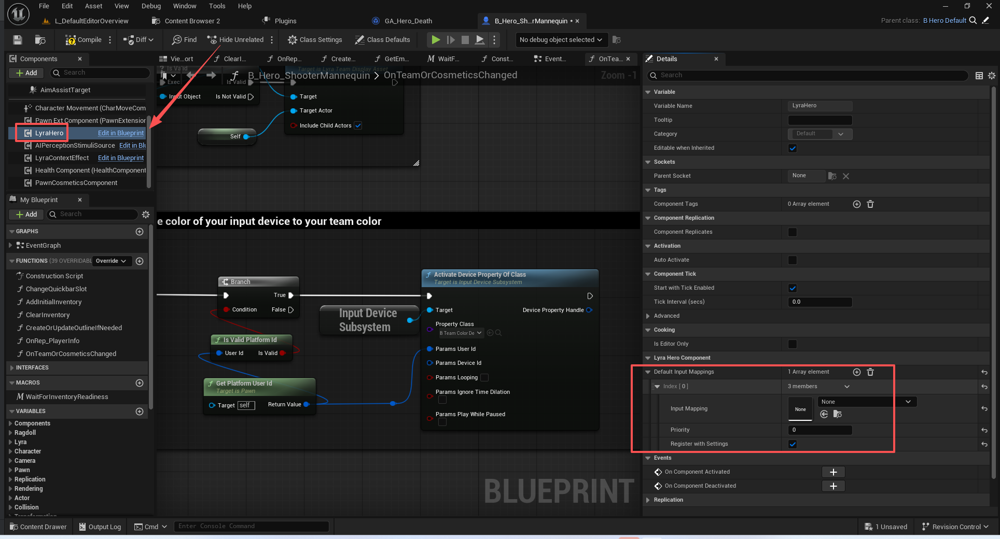
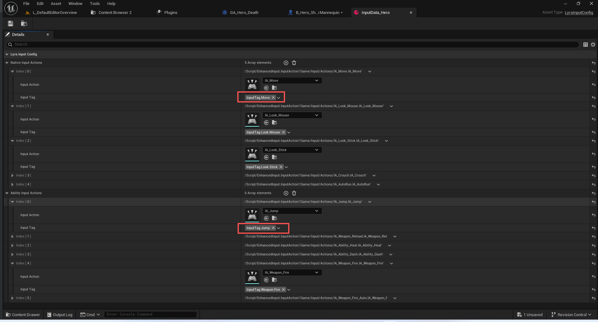
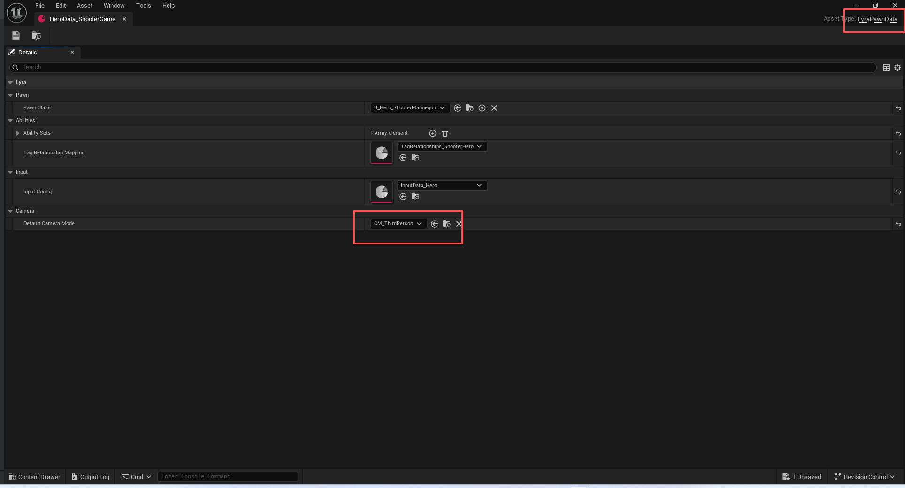
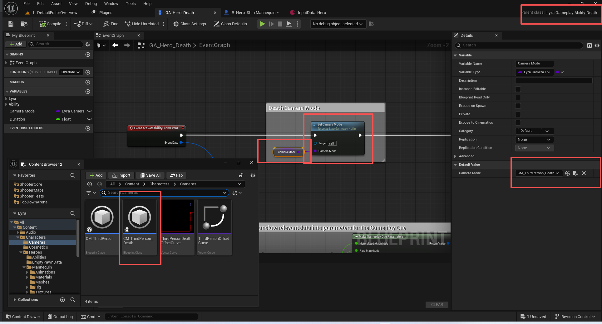

# UE5_Lyra学习指南_069_HeroComponent

本文章仅为小刚-B站课堂-虚幻引擎视频课程Lyra-精讲的演讲手稿.  
本套课程链接:[[UE5]虚幻引擎游戏案例Lyra精讲](https://www.bilibili.com/cheese/play/ss112001159)  
前置课程链接:[[UE5]虚幻引擎UEC++从基础到进阶](https://www.bilibili.com/cheese/play/ss28043)  

文章内容由小刚撰写,采用了以下多种方式:  
1.口述转文字  
2.AI重构  
3.参考引擎源码  
4.Lyra工程源码  
5.结合社区论坛各位大佬的解析  

- [UE5\_Lyra学习指南\_069\_HeroComponent](#ue5_lyra学习指南_069_herocomponent)
	- [概述](#概述)
	- [分阶段推进](#分阶段推进)
		- [注册ActorFeature](#注册actorfeature)
		- [发起推进初始化流程](#发起推进初始化流程)
		- [默认推进校验](#默认推进校验)
		- [过渡阶段判定](#过渡阶段判定)
		- [锁死2到3阶段的判定](#锁死2到3阶段的判定)
		- [每阶段切换的业务内容](#每阶段切换的业务内容)
	- [初始化ASC](#初始化asc)
	- [初始化输入系统](#初始化输入系统)
		- [GameFeatureAction支持](#gamefeatureaction支持)
			- [UGameFeatureAction\_AddInputBinding](#ugamefeatureaction_addinputbinding)
			- [UGameFeatureAction\_AddInputContextMapping](#ugamefeatureaction_addinputcontextmapping)
		- [绑定输入](#绑定输入)
			- [默认的输入上下文](#默认的输入上下文)
		- [添加动态输入](#添加动态输入)
			- [预留的拓展接口](#预留的拓展接口)
			- [添加原生输入](#添加原生输入)
				- [移动](#移动)
				- [鼠标旋转](#鼠标旋转)
				- [手柄旋转](#手柄旋转)
				- [蹲伏切换](#蹲伏切换)
				- [自动运行切换](#自动运行切换)
			- [添加能力输入](#添加能力输入)
				- [转发给ASC](#转发给asc)
				- [ASC收集句柄](#asc收集句柄)
				- [ASC每帧去处理输入的句柄](#asc每帧去处理输入的句柄)
	- [决定相机模式](#决定相机模式)
		- [设置相机模式](#设置相机模式)
		- [相机模式的使用](#相机模式的使用)
	- [代码](#代码)
	- [总结](#总结)


## 概述
HeroComponent组件主要用于处理玩家控制角色所特有的能力.
在Lyra项目中,AI也是玩家,所以也会有该组件.
输入响应.
相机模式.
初始化ASC.
等

## 分阶段推进
``` cpp
const FName ULyraHeroComponent::NAME_ActorFeatureName("Hero");

```
``` cpp

	//~ Begin IGameFrameworkInitStateInterface interface
	
	/** 返回此对象所实现的特性，此接口仅适用于具有单一特性的简单对象，例如“演员”此类对象 */
	virtual FName GetFeatureName() const override { return NAME_ActorFeatureName; }
	
	/** 应当被重写以执行针对特定类的检查，以确定是否能够达到所需状态 */
	UE_API virtual bool CanChangeInitState(UGameFrameworkComponentManager* Manager, FGameplayTag CurrentState, FGameplayTag DesiredState) const override;
	
	/** 应被重写以执行特定于类的状态更改操作，此方法会在通知组件管理器之前被调用 */
	UE_API virtual void HandleChangeInitState(UGameFrameworkComponentManager* Manager, FGameplayTag CurrentState, FGameplayTag DesiredState) override;

	/** 用于处理游戏功能状态的签名，此功能默认情况下未进行注册 */
	UE_API virtual void OnActorInitStateChanged(const FActorInitStateChangedParams& Params) override;
	
	// 检查当前初始化状态 并尝试进一步向下推进!
	UE_API virtual void CheckDefaultInitialization() override;
	
	//~ End IGameFrameworkInitStateInterface interface

```

### 注册ActorFeature
``` cpp

void ULyraHeroComponent::OnRegister()
{
	Super::OnRegister();

	if (!GetPawn<APawn>())
	{
		// 必须要添加到Pawn身上
		UE_LOG(LogLyra, Error, TEXT("[ULyraHeroComponent::OnRegister] This component has been added to a blueprint whose base class is not a Pawn. To use this component, it MUST be placed on a Pawn Blueprint."));

#if WITH_EDITOR
		if (GIsEditor)
		{
			static const FText Message = NSLOCTEXT("LyraHeroComponent", "NotOnPawnError", "has been added to a blueprint whose base class is not a Pawn. To use this component, it MUST be placed on a Pawn Blueprint. This will cause a crash if you PIE!");
			static const FName HeroMessageLogName = TEXT("LyraHeroComponent");
			
			FMessageLog(HeroMessageLogName).Error()
				->AddToken(FUObjectToken::Create(this, FText::FromString(GetNameSafe(this))))
				->AddToken(FTextToken::Create(Message));
				
			FMessageLog(HeroMessageLogName).Open();
		}
#endif
	}
	else
	{
		// Register with the init state system early, this will only work if this is a game world
		// 请尽早在初始化状态系统中进行注册，只有在这是一个游戏世界的情况下，此操作才会有效。
		RegisterInitStateFeature();
	}
}

```
``` cpp
void ULyraHeroComponent::EndPlay(const EEndPlayReason::Type EndPlayReason)
{
	UnregisterInitStateFeature();

	Super::EndPlay(EndPlayReason);
}
```
### 发起推进初始化流程
``` cpp
void ULyraHeroComponent::BeginPlay()
{
	Super::BeginPlay();

	// Listen for when the pawn extension component changes init state
	// 监听棋子扩展组件的初始化状态发生变化的情况
	// 重要!
	// 这里监听的时PawnExt的特性,它是我们的中枢组件,我们只需要监听它就可以了
	BindOnActorInitStateChanged(ULyraPawnExtensionComponent::NAME_ActorFeatureName, FGameplayTag(), false);

	// Notifies that we are done spawning, then try the rest of initialization
	// 通知我们已完成生成操作，然后尝试执行其余的初始化工作
	ensure(TryToChangeInitState(LyraGameplayTags::InitState_Spawned));
	
	CheckDefaultInitialization();
}

```
### 默认推进校验
``` cpp
void ULyraHeroComponent::CheckDefaultInitialization()
{
	static const TArray<FGameplayTag> StateChain = {
		LyraGameplayTags::InitState_Spawned,
		LyraGameplayTags::InitState_DataAvailable,
		LyraGameplayTags::InitState_DataInitialized,
		LyraGameplayTags::InitState_GameplayReady
	};

	// This will try to progress from spawned (which is only set in BeginPlay) through the data initialization stages until it gets to gameplay ready
	// 这将从“已生成”状态（该状态仅在“开始游戏”时设置）开始，依次经过数据初始化阶段，直至达到游戏准备就绪状态。
	ContinueInitStateChain(StateChain);
}
```
### 过渡阶段判定
``` cpp

bool ULyraHeroComponent::CanChangeInitState(UGameFrameworkComponentManager* Manager, FGameplayTag CurrentState, FGameplayTag DesiredState) const
{
	check(Manager);

	APawn* Pawn = GetPawn<APawn>();

	// 从0->1 此时不能有任何状态
	// 1阶段是 InitState_Spawned
	if (!CurrentState.IsValid() && DesiredState == LyraGameplayTags::InitState_Spawned)
	{
		// As long as we have a real pawn, let us transition
		// 只要我们有了真正的棋子，我们就开始行动吧
		if (Pawn)
		{
			return true;
		}
	}
	// 从1->2 当前状态是 InitState_Spawned
	// 2阶段是 InitState_DataAvailable
	else if (CurrentState == LyraGameplayTags::InitState_Spawned && DesiredState == LyraGameplayTags::InitState_DataAvailable)
	{
		// The player state is required.
		// 需要指定玩家状态。
		// 所以当玩家状态同步好后 需要尝试推进流程 依赖于PawnExt收到PlayerState后 通过依赖性推进过来!
		if (!GetPlayerState<ALyraPlayerState>())
		{
			return false;
		}

		// If we're authority or autonomous, we need to wait for a controller with registered ownership of the player state.
		// 如果我们是权威控制者或自主控制者，那么我们就需要等待一个拥有玩家状态注册所有权的控制者。
		// 这里是确保控制器哇和玩家状态类可以映射一致
		// 这里主要是依赖于PawnExt 收到控制器变更后推进过来
		if (Pawn->GetLocalRole() != ROLE_SimulatedProxy)
		{
			AController* Controller = GetController<AController>();

			const bool bHasControllerPairedWithPS = (Controller != nullptr) && \
				(Controller->PlayerState != nullptr) && \
				(Controller->PlayerState->GetOwner() == Controller);

			if (!bHasControllerPairedWithPS)
			{
				return false;
			}
		}

		const bool bIsLocallyControlled = Pawn->IsLocallyControlled();
		const bool bIsBot = Pawn->IsBotControlled();

		// 确保输入系统有效
		// 这里主要是依赖于PawnExt 收到输入组件初始化完成后推进过来
		if (bIsLocallyControlled && !bIsBot)
		{
			ALyraPlayerController* LyraPC = GetController<ALyraPlayerController>();

			// The input component and local player is required when locally controlled.
			// 当采用本地控制时，必须提供输入组件和本地玩家。
			if (!Pawn->InputComponent || !LyraPC || !LyraPC->GetLocalPlayer())
			{
				return false;
			}
		}

		return true;
	}
	// 从2到3 当前状态InitState_DataAvailable
	// 3阶段是InitState_DataInitialized
	else if (CurrentState == LyraGameplayTags::InitState_DataAvailable && DesiredState == LyraGameplayTags::InitState_DataInitialized)
	{
		// Wait for player state and extension component
		// 等待玩家状态和扩展组件的加载
		ALyraPlayerState* LyraPS = GetPlayerState<ALyraPlayerState>();

		// 这里非常重要!!!!!
		// 我们将所有组件都锁定到InitState_DataAvailable,
		// 当PawnExt检测到所有组件都推进到InitState_DataAvailable后,然后PawnExt主动推进到3阶段InitState_DataInitialized,
		// 然后其他组件才被允许推进到3阶段
		return LyraPS && Manager->HasFeatureReachedInitState(Pawn, ULyraPawnExtensionComponent::NAME_ActorFeatureName, LyraGameplayTags::InitState_DataInitialized);
	}
	// 从3到4 当前状态是InitState_DataInitialized
	// 4阶段是 InitState_GameplayReady
	else if (CurrentState == LyraGameplayTags::InitState_DataInitialized && DesiredState == LyraGameplayTags::InitState_GameplayReady)
	{
		// TODO add ability initialization checks?
		// TODO 增加能力初始化检查功能？
		return true;
	}

	return false;
}

```
### 锁死2到3阶段的判定
``` cpp
void ULyraHeroComponent::OnActorInitStateChanged(const FActorInitStateChangedParams& Params)
{
	// 这个地方时监听到我们的角色拓展组件推进到3阶段,那么我们也可以继续推进了!
	if (Params.FeatureName == ULyraPawnExtensionComponent::NAME_ActorFeatureName)
	{
		if (Params.FeatureState == LyraGameplayTags::InitState_DataInitialized)
		{
			// If the extension component says all all other components are initialized, try to progress to next state
			// 如果扩展组件表明所有其他组件均已初始化，则尝试进入下一个状态
			CheckDefaultInitialization();
		}
	}
}
```
### 每阶段切换的业务内容
``` cpp
void ULyraHeroComponent::HandleChangeInitState(UGameFrameworkComponentManager* Manager, FGameplayTag CurrentState, FGameplayTag DesiredState)
{
	// 从2到3 开始执行阶段过渡 因为前面已经确定了数据已经装准备好了.
	if (CurrentState == LyraGameplayTags::InitState_DataAvailable && DesiredState == LyraGameplayTags::InitState_DataInitialized)
	{
		APawn* Pawn = GetPawn<APawn>();
		ALyraPlayerState* LyraPS = GetPlayerState<ALyraPlayerState>();
		// 这里必须要有!
		if (!ensure(Pawn && LyraPS))
		{
			return;
		}

		const ULyraPawnData* PawnData = nullptr;
		// 初始化ASC
		if (ULyraPawnExtensionComponent* PawnExtComp = ULyraPawnExtensionComponent::FindPawnExtensionComponent(Pawn))
		{
			PawnData = PawnExtComp->GetPawnData<ULyraPawnData>();

			// The player state holds the persistent data for this player (state that persists across deaths and multiple pawns).
			// The ability system component and attribute sets live on the player state.
			
			// 玩家状态包含了此玩家的持久性数据（这些数据在死亡以及多个角色出现的情况下仍能保持不变）。
			// 能力系统组件和属性集都存在于玩家状态中。
			PawnExtComp->InitializeAbilitySystem(LyraPS->GetLyraAbilitySystemComponent(), LyraPS);
			
		}
		// 初始化输入系统
		if (ALyraPlayerController* LyraPC = GetController<ALyraPlayerController>())
		{
			if (Pawn->InputComponent != nullptr)
			{
				// 非常重要!
				InitializePlayerInput(Pawn->InputComponent);
			}
		}

		// Hook up the delegate for all pawns, in case we spectate later
		// 为所有兵种设置委托机制，以防之后我们进行旁观操作

		// 将PawnData的默认相机模式传递给相机组件
		// 将自身的能力相机模式传递给相机组件 方便后续使用开镜能力时 切换相机模式
		if (PawnData)
		{
			if (ULyraCameraComponent* CameraComponent = ULyraCameraComponent::FindCameraComponent(Pawn))
			{
				CameraComponent->DetermineCameraModeDelegate.BindUObject(this, &ThisClass::DetermineCameraMode);
			}
		}
	}
}

```
## 初始化ASC
``` cpp
void ULyraHeroComponent::HandleChangeInitState(UGameFrameworkComponentManager* Manager, FGameplayTag CurrentState, FGameplayTag DesiredState)
{
	// ..
		const ULyraPawnData* PawnData = nullptr;
		// 初始化ASC
		if (ULyraPawnExtensionComponent* PawnExtComp = ULyraPawnExtensionComponent::FindPawnExtensionComponent(Pawn))
		{
			PawnData = PawnExtComp->GetPawnData<ULyraPawnData>();

			// The player state holds the persistent data for this player (state that persists across deaths and multiple pawns).
			// The ability system component and attribute sets live on the player state.
			
			// 玩家状态包含了此玩家的持久性数据（这些数据在死亡以及多个角色出现的情况下仍能保持不变）。
			// 能力系统组件和属性集都存在于玩家状态中。
			PawnExtComp->InitializeAbilitySystem(LyraPS->GetLyraAbilitySystemComponent(), LyraPS);
			
		}


}

```
这里是调用中枢组件的方法进行验证.
我们不应当在英雄组件这里去调用其他组件.
``` cpp
void ULyraPawnExtensionComponent::InitializeAbilitySystem(ULyraAbilitySystemComponent* InASC, AActor* InOwnerActor)
{
	check(InASC);
	check(InOwnerActor);

	if (AbilitySystemComponent == InASC)
	{
		// The ability system component hasn't changed.
		// 能力系统组件并未发生任何变化。
		return;
	}

	if (AbilitySystemComponent)
	{
		// Clean up the old ability system component.
		// 清理旧的能力系统组件。
		UninitializeAbilitySystem();
	}

	// 我们当前使用的替身
	APawn* Pawn = GetPawnChecked<APawn>();
	// ASC指向的替身,正常情况应该是空值
	AActor* ExistingAvatar = InASC->GetAvatarActor();

	UE_LOG(LogLyra, Verbose, TEXT("Setting up ASC [%s] on pawn [%s] owner [%s], existing [%s] "), *GetNameSafe(InASC), *GetNameSafe(Pawn), *GetNameSafe(InOwnerActor), *GetNameSafe(ExistingAvatar));
	// 这里是为了处理ASC居然在初始化之前就有了替身
	if ((ExistingAvatar != nullptr) && (ExistingAvatar != Pawn))
	{
		UE_LOG(LogLyra, Log, TEXT("Existing avatar (authority=%d)"), ExistingAvatar->HasAuthority() ? 1 : 0);

		// There is already a pawn acting as the ASC's avatar, so we need to kick it out
		// This can happen on clients if they're lagged: their new pawn is spawned + possessed before the dead one is removed

		// 已经有一个角色充当着 ASC 的化身，所以我们需要将其移除
		// 如果客户端出现延迟，这种情况就可能发生：新的角色会先生成并被附身，然后才移除掉死亡的角色
		ensure(!ExistingAvatar->HasAuthority());
		// 拿到之前的替身,将其正常释放掉,保证我们当前的ASC是干净的.
		if (ULyraPawnExtensionComponent* OtherExtensionComponent = FindPawnExtensionComponent(ExistingAvatar))
		{
			// 这里是另外一个角色拓展组件,但是它使用的ASC是我们即将使用的,所以需要由上一个角色拓展组件将其释放掉
			OtherExtensionComponent->UninitializeAbilitySystem();
		}
	}
	// 把当前使用的ASC缓存起来,这样我们就不需要到处去找了
	AbilitySystemComponent = InASC;
	// 初始化信息
	AbilitySystemComponent->InitAbilityActorInfo(InOwnerActor, Pawn);

	// 将我们的能力映射表设置上去
	if (ensure(PawnData))
	{
		InASC->SetTagRelationshipMapping(PawnData->TagRelationshipMapping);
	}
	// 我们的ASC 初始化好了 让生命值组件去完成属性绑定
	OnAbilitySystemInitialized.Broadcast();
}

```


## 初始化输入系统
``` cpp
void ULyraHeroComponent::HandleChangeInitState(UGameFrameworkComponentManager* Manager, FGameplayTag CurrentState, FGameplayTag DesiredState)
{
	// ..

			// 初始化输入系统
		if (ALyraPlayerController* LyraPC = GetController<ALyraPlayerController>())
		{
			if (Pawn->InputComponent != nullptr)
			{
				// 非常重要!
				InitializePlayerInput(Pawn->InputComponent);
			}
		}

}

```
``` cpp
void ULyraHeroComponent::InitializePlayerInput(UInputComponent* PlayerInputComponent)
{
	check(PlayerInputComponent);

	const APawn* Pawn = GetPawn<APawn>();
	if (!Pawn)
	{
		return;
	}

	const APlayerController* PC = GetController<APlayerController>();
	check(PC);

	const ULyraLocalPlayer* LP = Cast<ULyraLocalPlayer>(PC->GetLocalPlayer());
	check(LP);

	UEnhancedInputLocalPlayerSubsystem* Subsystem = LP->GetSubsystem<UEnhancedInputLocalPlayerSubsystem>();
	check(Subsystem);
	
	// 移除所有已应用的映射上下文。
	Subsystem->ClearAllMappings();

	if (const ULyraPawnExtensionComponent* PawnExtComp = ULyraPawnExtensionComponent::FindPawnExtensionComponent(Pawn))
	{
		if (const ULyraPawnData* PawnData = PawnExtComp->GetPawnData<ULyraPawnData>())
		{
			if (const ULyraInputConfig* InputConfig = PawnData->InputConfig)
			{
				// 这部分代码没有用到
				for (const FInputMappingContextAndPriority& Mapping : DefaultInputMappings)
				{
					if (UInputMappingContext* IMC = Mapping.InputMapping.LoadSynchronous())
					{
						if (Mapping.bRegisterWithSettings)
						{
							if (UEnhancedInputUserSettings* Settings = Subsystem->GetUserSettings())
							{
								Settings->RegisterInputMappingContext(IMC);
							}
							
							FModifyContextOptions Options = {};

							/**
							 * 如果情况属实，那么在重新构建控制映射的过程中处于“按下”或“触发”状态的任何按键，
							 * 在其被“释放”之前都不会被增强输入功能处理。
							 * 例如，如果您正在添加一个带有键映射的映射上下文，将其键值设为“X”，
							 * 而且在添加该映射上下文时玩家正按住“X”键，
							 * 那么在玩家松开“X”键并再次按下它之前，不会产生“触发”事件。
							 * 如果对于上述示例将此设置为“false”，那么“触发”事件将会在即时通讯组件添加完成后立即触发。
							 * 默认值：True
							 * 注意：此功能仅对绑定至布尔型输入动作类型的按键有效。
							 * 注意：此功能涵盖玩家所按下的所有按键，而非仅限于在调用“重建控制映射”之前已在增强型输入中预先设置的按键。
							 * 
							 */
							Options.bIgnoreAllPressedKeysUntilRelease = false;
							// Actually add the config to the local player
							// 实际上将配置信息添加到本地玩家中
							Subsystem->AddMappingContext(IMC, Mapping.Priority, Options);
						}
					}
				}

				// The Lyra Input Component has some additional functions to map Gameplay Tags to an Input Action.
				// If you want this functionality but still want to change your input component class, make it a subclass
				// of the ULyraInputComponent or modify this component accordingly.

				// 莱拉输入组件具备一些额外的功能，可将游戏玩法标签映射到输入操作上。
				// 如果您希望具备此功能但又想更改输入组件类，请将其作为 ULyraInputComponent 的子类进行实现，或者相应地对该组件进行修改。
				
				ULyraInputComponent* LyraIC = Cast<ULyraInputComponent>(PlayerInputComponent);
				if (ensureMsgf(LyraIC, TEXT("Unexpected Input Component class! The Gameplay Abilities will not be bound to their inputs. Change the input component to ULyraInputComponent or a subclass of it.")))
				{
					// Add the key mappings that may have been set by the player
					// 添加可能由玩家设置的按键映射关系
					LyraIC->AddInputMappings(InputConfig, Subsystem);

					// This is where we actually bind and input action to a gameplay tag, which means that Gameplay Ability Blueprints will
					// be triggered directly by these input actions Triggered events.
					// 这就是我们实际将操作绑定并输入到游戏玩法标签中的地方，这意味着游戏玩法蓝图将直接通过这些输入操作所触发的事件来被激活。
					TArray<uint32> BindHandles;
					// 绑定按键激活的能力 比如 跳跃 射击 开镜 手榴弹 丢下武器 近战攻击等
					// 注意这个能力Tag是作为负载进行绑定使用的 Pressed和Released调用的时候可以知道具体是那个Tag被激活了
					LyraIC->BindAbilityActions(InputConfig, this, &ThisClass::Input_AbilityInputTagPressed, &ThisClass::Input_AbilityInputTagReleased, /*out*/ BindHandles);

					// 绑定原生的输入 比如上下左右 鼠标移动等.
					// 注意这里的Tag已经写死了 需要通过Tag去找到对应的输入资产,然后绑定函数
					LyraIC->BindNativeAction(InputConfig, LyraGameplayTags::InputTag_Move, ETriggerEvent::Triggered, this, &ThisClass::Input_Move, /*bLogIfNotFound=*/ false);
					LyraIC->BindNativeAction(InputConfig, LyraGameplayTags::InputTag_Look_Mouse, ETriggerEvent::Triggered, this, &ThisClass::Input_LookMouse, /*bLogIfNotFound=*/ false);
					LyraIC->BindNativeAction(InputConfig, LyraGameplayTags::InputTag_Look_Stick, ETriggerEvent::Triggered, this, &ThisClass::Input_LookStick, /*bLogIfNotFound=*/ false);
					LyraIC->BindNativeAction(InputConfig, LyraGameplayTags::InputTag_Crouch, ETriggerEvent::Triggered, this, &ThisClass::Input_Crouch, /*bLogIfNotFound=*/ false);
					LyraIC->BindNativeAction(InputConfig, LyraGameplayTags::InputTag_AutoRun, ETriggerEvent::Triggered, this, &ThisClass::Input_AutoRun, /*bLogIfNotFound=*/ false);
				}
			}
		}
	}
	// 确保只绑定一次
	if (ensure(!bReadyToBindInputs))
	{
		bReadyToBindInputs = true;
	}
	// 发送框架事件 绑定完成了 可以通过GameFeatureAction 添加额外的绑定
	UGameFrameworkComponentManager::SendGameFrameworkComponentExtensionEvent(const_cast<APlayerController*>(PC), NAME_BindInputsNow);
	UGameFrameworkComponentManager::SendGameFrameworkComponentExtensionEvent(const_cast<APawn*>(Pawn), NAME_BindInputsNow);
}

```

### GameFeatureAction支持
``` cpp
const FName ULyraHeroComponent::NAME_BindInputsNow("BindInputsNow");
```

``` cpp
	// 发送框架事件 绑定完成了 可以通过GameFeatureAction 添加额外的绑定
	UGameFrameworkComponentManager::SendGameFrameworkComponentExtensionEvent(const_cast<APlayerController*>(PC), NAME_BindInputsNow);
	UGameFrameworkComponentManager::SendGameFrameworkComponentExtensionEvent(const_cast<APawn*>(Pawn), NAME_BindInputsNow);


```
接收响应的地方

#### UGameFeatureAction_AddInputBinding
``` cpp
void UGameFeatureAction_AddInputBinding::HandlePawnExtension(AActor* Actor, FName EventName, FGameFeatureStateChangeContext ChangeContext)
{
	APawn* AsPawn = CastChecked<APawn>(Actor);
	FPerContextData& ActiveData = ContextData.FindOrAdd(ChangeContext);

	if ((EventName == UGameFrameworkComponentManager::NAME_ExtensionRemoved) || (EventName == UGameFrameworkComponentManager::NAME_ReceiverRemoved))
	{
		RemoveInputMapping(AsPawn, ActiveData);
	}
	else if ((EventName == UGameFrameworkComponentManager::NAME_ExtensionAdded) || (EventName == ULyraHeroComponent::NAME_BindInputsNow))
	{
		// 	UGameFrameworkComponentManager::SendGameFrameworkComponentExtensionEvent(const_cast<APlayerController*>(PC), NAME_BindInputsNow);
		// 接收绑定输入的事件 来自元HeroComponent的调用
		
		AddInputMappingForPlayer(AsPawn, ActiveData);
	}
}

```
#### UGameFeatureAction_AddInputContextMapping
``` cpp
void UGameFeatureAction_AddInputContextMapping::HandleControllerExtension(AActor* Actor, FName EventName, FGameFeatureStateChangeContext ChangeContext)
{
	APlayerController* AsController = CastChecked<APlayerController>(Actor);
	FPerContextData& ActiveData = ContextData.FindOrAdd(ChangeContext);

	// TODO Why does this code mix and match controllers and local players? ControllersAddedTo is never modified
	// 注意事项 这段代码为何会将控制器和本地玩家混在一起使用？而“ControllersAddedTo”这个变量从未被修改过
	if ((EventName == UGameFrameworkComponentManager::NAME_ExtensionRemoved) || (EventName == UGameFrameworkComponentManager::NAME_ReceiverRemoved))
	{
		RemoveInputMapping(AsController, ActiveData);
	}
	else if ((EventName == UGameFrameworkComponentManager::NAME_ExtensionAdded) || (EventName == ULyraHeroComponent::NAME_BindInputsNow))
	{
		AddInputMappingForPlayer(AsController->GetLocalPlayer(), ActiveData);
	}
}
```

### 绑定输入
#### 默认的输入上下文
``` cpp
	// 默认的输入上下文 木有用到
	UPROPERTY(EditAnywhere)
	TArray<FInputMappingContextAndPriority> DefaultInputMappings;
	

```
``` cpp
	// 这部分代码没有用到
				for (const FInputMappingContextAndPriority& Mapping : DefaultInputMappings)
				{
					if (UInputMappingContext* IMC = Mapping.InputMapping.LoadSynchronous())
					{
						if (Mapping.bRegisterWithSettings)
						{
							if (UEnhancedInputUserSettings* Settings = Subsystem->GetUserSettings())
							{
								Settings->RegisterInputMappingContext(IMC);
							}
							
							FModifyContextOptions Options = {};

							/**
							 * 如果情况属实，那么在重新构建控制映射的过程中处于“按下”或“触发”状态的任何按键，
							 * 在其被“释放”之前都不会被增强输入功能处理。
							 * 例如，如果您正在添加一个带有键映射的映射上下文，将其键值设为“X”，
							 * 而且在添加该映射上下文时玩家正按住“X”键，
							 * 那么在玩家松开“X”键并再次按下它之前，不会产生“触发”事件。
							 * 如果对于上述示例将此设置为“false”，那么“触发”事件将会在即时通讯组件添加完成后立即触发。
							 * 默认值：True
							 * 注意：此功能仅对绑定至布尔型输入动作类型的按键有效。
							 * 注意：此功能涵盖玩家所按下的所有按键，而非仅限于在调用“重建控制映射”之前已在增强型输入中预先设置的按键。
							 * 
							 */
							Options.bIgnoreAllPressedKeysUntilRelease = false;
							// Actually add the config to the local player
							// 实际上将配置信息添加到本地玩家中
							Subsystem->AddMappingContext(IMC, Mapping.Priority, Options);
						}
					}
				}

```

注意观察上面这个组件是从蓝图添加的,所以在C++层面是看不到依赖性的.

### 添加动态输入
``` cpp
// ....
if (const ULyraPawnExtensionComponent* PawnExtComp = ULyraPawnExtensionComponent::FindPawnExtensionComponent(Pawn))
	{
		if (const ULyraPawnData* PawnData = PawnExtComp->GetPawnData<ULyraPawnData>())
		{
			if (const ULyraInputConfig* InputConfig = PawnData->InputConfig)
			{
				
				// The Lyra Input Component has some additional functions to map Gameplay Tags to an Input Action.
				// If you want this functionality but still want to change your input component class, make it a subclass
				// of the ULyraInputComponent or modify this component accordingly.

				// 莱拉输入组件具备一些额外的功能，可将游戏玩法标签映射到输入操作上。
				// 如果您希望具备此功能但又想更改输入组件类，请将其作为 ULyraInputComponent 的子类进行实现，或者相应地对该组件进行修改。
				
				ULyraInputComponent* LyraIC = Cast<ULyraInputComponent>(PlayerInputComponent);
				if (ensureMsgf(LyraIC, TEXT("Unexpected Input Component class! The Gameplay Abilities will not be bound to their inputs. Change the input component to ULyraInputComponent or a subclass of it.")))
				{
					// Add the key mappings that may have been set by the player
					// 添加可能由玩家设置的按键映射关系
					LyraIC->AddInputMappings(InputConfig, Subsystem);

					// This is where we actually bind and input action to a gameplay tag, which means that Gameplay Ability Blueprints will
					// be triggered directly by these input actions Triggered events.
					// 这就是我们实际将操作绑定并输入到游戏玩法标签中的地方，这意味着游戏玩法蓝图将直接通过这些输入操作所触发的事件来被激活。
					TArray<uint32> BindHandles;
					// 绑定按键激活的能力 比如 跳跃 射击 开镜 手榴弹 丢下武器 近战攻击等
					// 注意这个能力Tag是作为负载进行绑定使用的 Pressed和Released调用的时候可以知道具体是那个Tag被激活了
					LyraIC->BindAbilityActions(InputConfig, this, &ThisClass::Input_AbilityInputTagPressed, &ThisClass::Input_AbilityInputTagReleased, /*out*/ BindHandles);

					// 绑定原生的输入 比如上下左右 鼠标移动等.
					// 注意这里的Tag已经写死了 需要通过Tag去找到对应的输入资产,然后绑定函数
					LyraIC->BindNativeAction(InputConfig, LyraGameplayTags::InputTag_Move, ETriggerEvent::Triggered, this, &ThisClass::Input_Move, /*bLogIfNotFound=*/ false);
					LyraIC->BindNativeAction(InputConfig, LyraGameplayTags::InputTag_Look_Mouse, ETriggerEvent::Triggered, this, &ThisClass::Input_LookMouse, /*bLogIfNotFound=*/ false);
					LyraIC->BindNativeAction(InputConfig, LyraGameplayTags::InputTag_Look_Stick, ETriggerEvent::Triggered, this, &ThisClass::Input_LookStick, /*bLogIfNotFound=*/ false);
					LyraIC->BindNativeAction(InputConfig, LyraGameplayTags::InputTag_Crouch, ETriggerEvent::Triggered, this, &ThisClass::Input_Crouch, /*bLogIfNotFound=*/ false);
					LyraIC->BindNativeAction(InputConfig, LyraGameplayTags::InputTag_AutoRun, ETriggerEvent::Triggered, this, &ThisClass::Input_AutoRun, /*bLogIfNotFound=*/ false);
				}
			}
		}
	}
```

#### 预留的拓展接口
``` cpp
void ULyraInputComponent::AddInputMappings(const ULyraInputConfig* InputConfig, UEnhancedInputLocalPlayerSubsystem* InputSubsystem) const
{
	check(InputConfig);
	check(InputSubsystem);

	// Here you can handle any custom logic to add something from your input config if required
	// 在此您可以执行任何自定义逻辑，以便根据需要从输入配置中添加相关内容。
}

```
#### 添加原生输入
``` cpp
					// 绑定原生的输入 比如上下左右 鼠标移动等.
					// 注意这里的Tag已经写死了 需要通过Tag去找到对应的输入资产,然后绑定函数
					LyraIC->BindNativeAction(InputConfig, LyraGameplayTags::InputTag_Move, ETriggerEvent::Triggered, this, &ThisClass::Input_Move, /*bLogIfNotFound=*/ false);
					LyraIC->BindNativeAction(InputConfig, LyraGameplayTags::InputTag_Look_Mouse, ETriggerEvent::Triggered, this, &ThisClass::Input_LookMouse, /*bLogIfNotFound=*/ false);
					LyraIC->BindNativeAction(InputConfig, LyraGameplayTags::InputTag_Look_Stick, ETriggerEvent::Triggered, this, &ThisClass::Input_LookStick, /*bLogIfNotFound=*/ false);
					LyraIC->BindNativeAction(InputConfig, LyraGameplayTags::InputTag_Crouch, ETriggerEvent::Triggered, this, &ThisClass::Input_Crouch, /*bLogIfNotFound=*/ false);
					LyraIC->BindNativeAction(InputConfig, LyraGameplayTags::InputTag_AutoRun, ETriggerEvent::Triggered, this, &ThisClass::Input_AutoRun, /*bLogIfNotFound=*/ false);
```

通过Tag去寻找指定的输入资产!!!!
这里的Tag是写死了的.所以蓝图必须使用这个Tag去标明对应的输入函数对应的资产.
```  cpp
// 绑定原生操作 这里的Tag在调用是写死了的 必须蓝图和C++Tag一致
// 前后左右 鼠标旋转
template<class UserClass, typename FuncType>
void ULyraInputComponent::BindNativeAction(const ULyraInputConfig* InputConfig, const FGameplayTag& InputTag, ETriggerEvent TriggerEvent, UserClass* Object, FuncType Func, bool bLogIfNotFound)
{
	check(InputConfig);
	if (const UInputAction* IA = InputConfig->FindNativeInputActionForTag(InputTag, bLogIfNotFound))
	{
		BindAction(IA, TriggerEvent, Object, Func);
	}
}

```
``` cpp
const UInputAction* ULyraInputConfig::FindNativeInputActionForTag(const FGameplayTag& InputTag, bool bLogNotFound) const
{
	for (const FLyraInputAction& Action : NativeInputActions)
	{
		if (Action.InputAction && (Action.InputTag == InputTag))
		{
			return Action.InputAction;
		}
	}

	if (bLogNotFound)
	{
		UE_LOG(LogLyra, Error, TEXT("Can't find NativeInputAction for InputTag [%s] on InputConfig [%s]."), *InputTag.ToString(), *GetNameSafe(this));
	}

	return nullptr;
}
```


##### 移动
``` cpp

void ULyraHeroComponent::Input_Move(const FInputActionValue& InputActionValue)
{
	APawn* Pawn = GetPawn<APawn>();
	AController* Controller = Pawn ? Pawn->GetController() : nullptr;

	// If the player has attempted to move again then cancel auto running
	// 如果玩家再次尝试移动，就取消自动移动功能
	if (ALyraPlayerController* LyraController = Cast<ALyraPlayerController>(Controller))
	{
		LyraController->SetIsAutoRunning(false);
	}
	
	if (Controller)
	{
		const FVector2D Value = InputActionValue.Get<FVector2D>();
		const FRotator MovementRotation(0.0f, Controller->GetControlRotation().Yaw, 0.0f);

		if (Value.X != 0.0f)
		{
			// 旋转由此旋转器所旋转的向量。
			const FVector MovementDirection = MovementRotation.RotateVector(FVector::RightVector);
			
			/**
			 * 按照给定的世界方向向量（通常已归一化）进行移动输入操作，并根据“ScaleValue”进行缩放。如果 ScaleValue 小于 0，则移动方向将与之相反。
			 * 基础的 Pawn 类不会自动应用移动功能，这需要用户在 Tick 事件中进行处理。诸如 Character 和 DefaultPawn 这样的子类会自动处理此输入并进行移动。*
			 * @参数 WorldDirection：在世界空间中应用输入的方向
			 * @参数 ScaleValue：应用于输入的缩放值。此值可用于模拟输入，例如值为 0.5 时将输入值乘以一半，而 -1.0 则会反转方向。
			 * @参数 bForce：如果为真，则始终添加输入，忽略 IsMoveInputIgnored() 的结果。
			 * @见 GetPendingMovementInputVector()、GetLastMovementInputVector()、ConsumeMovementInputVector()
			 * 
			 */
			Pawn->AddMovementInput(MovementDirection, Value.X);
		}

		if (Value.Y != 0.0f)
		{
			const FVector MovementDirection = MovementRotation.RotateVector(FVector::ForwardVector);
			Pawn->AddMovementInput(MovementDirection, Value.Y);
		}
	}
}

```

##### 鼠标旋转
``` cpp

void ULyraHeroComponent::Input_LookMouse(const FInputActionValue& InputActionValue)
{
	APawn* Pawn = GetPawn<APawn>();

	if (!Pawn)
	{
		return;
	}
	
	const FVector2D Value = InputActionValue.Get<FVector2D>();

	if (Value.X != 0.0f)
	{
		Pawn->AddControllerYawInput(Value.X);
	}

	if (Value.Y != 0.0f)
	{
		Pawn->AddControllerPitchInput(Value.Y);
	}
}


```
##### 手柄旋转
``` cpp
void ULyraHeroComponent::Input_LookStick(const FInputActionValue& InputActionValue)
{
	APawn* Pawn = GetPawn<APawn>();

	if (!Pawn)
	{
		return;
	}
	
	const FVector2D Value = InputActionValue.Get<FVector2D>();

	const UWorld* World = GetWorld();
	check(World);

	if (Value.X != 0.0f)
	{
		Pawn->AddControllerYawInput(Value.X * LyraHero::LookYawRate * World->GetDeltaSeconds());
	}

	if (Value.Y != 0.0f)
	{
		Pawn->AddControllerPitchInput(Value.Y * LyraHero::LookPitchRate * World->GetDeltaSeconds());
	}
}


```


##### 蹲伏切换
``` cpp
void ULyraHeroComponent::Input_Crouch(const FInputActionValue& InputActionValue)
{
	if (ALyraCharacter* Character = GetPawn<ALyraCharacter>())
	{
		Character->ToggleCrouch();
	}
}


```
##### 自动运行切换
``` cpp
void ULyraHeroComponent::Input_AutoRun(const FInputActionValue& InputActionValue)
{
	if (APawn* Pawn = GetPawn<APawn>())
	{
		if (ALyraPlayerController* Controller = Cast<ALyraPlayerController>(Pawn->GetController()))
		{
			// Toggle auto running
			// 切换自动运行模式
			Controller->SetIsAutoRunning(!Controller->GetIsAutoRunning());
		}	
	}
}


```


#### 添加能力输入
``` cpp
					// 绑定按键激活的能力 比如 跳跃 射击 开镜 手榴弹 丢下武器 近战攻击等
					// 注意这个能力Tag是作为负载进行绑定使用的 Pressed和Released调用的时候可以知道具体是那个Tag被激活了
					LyraIC->BindAbilityActions(InputConfig, this, &ThisClass::Input_AbilityInputTagPressed, &ThisClass::Input_AbilityInputTagReleased, /*out*/ BindHandles);

```
``` cpp
// 绑定能力操作 这里的Tag的是动态的,并且是负载,走蓝图配置过来即可,一路传递,C++层面并不关心这个Tag到底是啥
// 开火 跳跃等
template<class UserClass, typename PressedFuncType, typename ReleasedFuncType>
void ULyraInputComponent::BindAbilityActions(const ULyraInputConfig* InputConfig, UserClass* Object, PressedFuncType PressedFunc, ReleasedFuncType ReleasedFunc, TArray<uint32>& BindHandles)
{
	check(InputConfig);

	for (const FLyraInputAction& Action : InputConfig->AbilityInputActions)
	{
		if (Action.InputAction && Action.InputTag.IsValid())
		{
			if (PressedFunc)
			{
				BindHandles.Add(BindAction(Action.InputAction, ETriggerEvent::Triggered, Object, PressedFunc, Action.InputTag).GetHandle());
			}

			if (ReleasedFunc)
			{
				BindHandles.Add(BindAction(Action.InputAction, ETriggerEvent::Completed, Object, ReleasedFunc, Action.InputTag).GetHandle());
			}
		}
	}
}


```

##### 转发给ASC
``` cpp
void ULyraHeroComponent::Input_AbilityInputTagPressed(FGameplayTag InputTag)
{
	if (const APawn* Pawn = GetPawn<APawn>())
	{
		if (const ULyraPawnExtensionComponent* PawnExtComp = ULyraPawnExtensionComponent::FindPawnExtensionComponent(Pawn))
		{
			if (ULyraAbilitySystemComponent* LyraASC = PawnExtComp->GetLyraAbilitySystemComponent())
			{
				LyraASC->AbilityInputTagPressed(InputTag);
			}
		}	
	}
}

void ULyraHeroComponent::Input_AbilityInputTagReleased(FGameplayTag InputTag)
{
	const APawn* Pawn = GetPawn<APawn>();
	if (!Pawn)
	{
		return;
	}

	if (const ULyraPawnExtensionComponent* PawnExtComp = ULyraPawnExtensionComponent::FindPawnExtensionComponent(Pawn))
	{
		if (ULyraAbilitySystemComponent* LyraASC = PawnExtComp->GetLyraAbilitySystemComponent())
		{
			LyraASC->AbilityInputTagReleased(InputTag);
		}
	}
}

```
##### ASC收集句柄
``` cpp
void ULyraAbilitySystemComponent::AbilityInputTagPressed(const FGameplayTag& InputTag)
{
	if (InputTag.IsValid())
	{
		for (const FGameplayAbilitySpec& AbilitySpec : ActivatableAbilities.Items)
		{
			if (AbilitySpec.Ability && (AbilitySpec.GetDynamicSpecSourceTags().HasTagExact(InputTag)))
			{
				InputPressedSpecHandles.AddUnique(AbilitySpec.Handle);
				InputHeldSpecHandles.AddUnique(AbilitySpec.Handle);
			}
		}
	}
}

void ULyraAbilitySystemComponent::AbilityInputTagReleased(const FGameplayTag& InputTag)
{
	if (InputTag.IsValid())
	{
		for (const FGameplayAbilitySpec& AbilitySpec : ActivatableAbilities.Items)
		{
			if (AbilitySpec.Ability && (AbilitySpec.GetDynamicSpecSourceTags().HasTagExact(InputTag)))
			{
				InputReleasedSpecHandles.AddUnique(AbilitySpec.Handle);
				InputHeldSpecHandles.Remove(AbilitySpec.Handle);
			}
		}
	}
}

```

##### ASC每帧去处理输入的句柄
``` cpp
void ALyraPlayerController::PostProcessInput(const float DeltaTime, const bool bGamePaused)
{
	if (ULyraAbilitySystemComponent* LyraASC = GetLyraAbilitySystemComponent())
	{
		LyraASC->ProcessAbilityInput(DeltaTime, bGamePaused);
	}

	Super::PostProcessInput(DeltaTime, bGamePaused);
}
```

``` cpp


```

## 决定相机模式
``` cpp
void ULyraHeroComponent::HandleChangeInitState(UGameFrameworkComponentManager* Manager, FGameplayTag CurrentState, FGameplayTag DesiredState)
{
	// ..
		// Hook up the delegate for all pawns, in case we spectate later
		// 为所有兵种设置委托机制，以防之后我们进行旁观操作

		// 将PawnData的默认相机模式传递给相机组件
		// 将自身的能力相机模式传递给相机组件 方便后续使用开镜能力时 切换相机模式
		if (PawnData)
		{
			if (ULyraCameraComponent* CameraComponent = ULyraCameraComponent::FindCameraComponent(Pawn))
			{
				CameraComponent->DetermineCameraModeDelegate.BindUObject(this, &ThisClass::DetermineCameraMode);
			}
		}
	

}

```

``` cpp

TSubclassOf<ULyraCameraMode> ULyraHeroComponent::DetermineCameraMode() const
{
	if (AbilityCameraMode)
	{
		return AbilityCameraMode;
	}

	const APawn* Pawn = GetPawn<APawn>();
	if (!Pawn)
	{
		return nullptr;
	}

	if (ULyraPawnExtensionComponent* PawnExtComp = ULyraPawnExtensionComponent::FindPawnExtensionComponent(Pawn))
	{
		if (const ULyraPawnData* PawnData = PawnExtComp->GetPawnData<ULyraPawnData>())
		{
			return PawnData->DefaultCameraMode;
		}
	}

	return nullptr;
}
```
### 设置相机模式
``` cpp
void ULyraHeroComponent::SetAbilityCameraMode(TSubclassOf<ULyraCameraMode> CameraMode, const FGameplayAbilitySpecHandle& OwningSpecHandle)
{
	if (CameraMode)
	{
		AbilityCameraMode = CameraMode;
		AbilityCameraModeOwningSpecHandle = OwningSpecHandle;
	}
}

void ULyraHeroComponent::ClearAbilityCameraMode(const FGameplayAbilitySpecHandle& OwningSpecHandle)
{
	if (AbilityCameraModeOwningSpecHandle == OwningSpecHandle)
	{
		AbilityCameraMode = nullptr;
		AbilityCameraModeOwningSpecHandle = FGameplayAbilitySpecHandle();
	}
}

```
``` cpp
void ULyraGameplayAbility::SetCameraMode(TSubclassOf<ULyraCameraMode> CameraMode)
{
	ENSURE_ABILITY_IS_INSTANTIATED_OR_RETURN(SetCameraMode, );

	if (ULyraHeroComponent* HeroComponent = GetHeroComponentFromActorInfo())
	{
		HeroComponent->SetAbilityCameraMode(CameraMode, CurrentSpecHandle);
		ActiveCameraMode = CameraMode;
	}
}

void ULyraGameplayAbility::ClearCameraMode()
{
	ENSURE_ABILITY_IS_INSTANTIATED_OR_RETURN(ClearCameraMode, );

	if (ActiveCameraMode)
	{
		if (ULyraHeroComponent* HeroComponent = GetHeroComponentFromActorInfo())
		{
			HeroComponent->ClearAbilityCameraMode(CurrentSpecHandle);
		}

		ActiveCameraMode = nullptr;
	}
}


```

### 相机模式的使用
不在此处讲解.


``` cpp
void ULyraCameraComponent::UpdateCameraModes()
{
	check(CameraModeStack);

	if (CameraModeStack->IsStackActivate())
	{
		if (DetermineCameraModeDelegate.IsBound())
		{
			if (const TSubclassOf<ULyraCameraMode> CameraMode = DetermineCameraModeDelegate.Execute())
			{
				CameraModeStack->PushCameraMode(CameraMode);
			}
		}
	}
}
```
``` cpp
virtual void GetCameraView(float DeltaTime, FMinimalViewInfo& DesiredView) override;
void ULyraCameraComponent::GetCameraView(float DeltaTime, FMinimalViewInfo& DesiredView)
{
	check(CameraModeStack);

	UpdateCameraModes();
	// ......
}
```
## 代码
``` cpp

/**
 * Component that sets up input and camera handling for player controlled pawns (or bots that simulate players).
 * This depends on a PawnExtensionComponent to coordinate initialization.
 *
 * 用于为玩家控制的兵种（或模拟玩家的机器人）设置输入和摄像头处理的组件。
 * 这需要一个“兵种扩展组件”来协调初始化过程。
 */
UCLASS(MinimalAPI, Blueprintable, Meta=(BlueprintSpawnableComponent))
class ULyraHeroComponent : public UPawnComponent, public IGameFrameworkInitStateInterface
{
	GENERATED_BODY()

public:
	// 构造函数 初始化成员变量
	UE_API ULyraHeroComponent(const FObjectInitializer& ObjectInitializer);

	/** Returns the hero component if one exists on the specified actor. */
	/** 返回指定角色所拥有的英雄组件（如果存在的话）。*/
	UFUNCTION(BlueprintPure, Category = "Lyra|Hero")
	static ULyraHeroComponent* FindHeroComponent(const AActor* Actor)
	{ return (Actor ? Actor->FindComponentByClass<ULyraHeroComponent>() : nullptr); }

	/** Overrides the camera from an active gameplay ability */
	/** 替换当前游戏中的活跃技能所使用的摄像机 */
	UE_API void SetAbilityCameraMode(TSubclassOf<ULyraCameraMode> CameraMode, const FGameplayAbilitySpecHandle& OwningSpecHandle);

	/** Clears the camera override if it is set */
	/** 清除相机的自定义设置（若已设置） */
	UE_API void ClearAbilityCameraMode(const FGameplayAbilitySpecHandle& OwningSpecHandle);

	/** Adds mode-specific input config */
	/** 添加模式特定的输入配置 */
	// 通过GameFeatureAction过来的
	UE_API void AddAdditionalInputConfig(const ULyraInputConfig* InputConfig);

	/** Removes a mode-specific input config if it has been added */
	/** 如果已添加了特定模式的输入配置，则将其删除 */
	UE_API void RemoveAdditionalInputConfig(const ULyraInputConfig* InputConfig);

	/** True if this is controlled by a real player and has progressed far enough in initialization where additional input bindings can be added */
	/** 如果此内容是由真实玩家控制的，并且在初始化过程中已经进展到足够深入的阶段，以便能够添加更多的输入绑定，则返回 true */
	UE_API bool IsReadyToBindInputs() const;
	
	/** The name of the extension event sent via UGameFrameworkComponentManager when ability inputs are ready to bind */
	/** 当能力输入准备好进行绑定时，通过 UGameFrameworkComponentManager 发送的扩展事件的名称 */
	static UE_API const FName NAME_BindInputsNow;

	/** The name of this component-implemented feature */
	/** 此组件实现的功能的名称 */
	static UE_API const FName NAME_ActorFeatureName;

	//~ Begin IGameFrameworkInitStateInterface interface
	
	/** 返回此对象所实现的特性，此接口仅适用于具有单一特性的简单对象，例如“演员”此类对象 */
	virtual FName GetFeatureName() const override { return NAME_ActorFeatureName; }
	
	/** 应当被重写以执行针对特定类的检查，以确定是否能够达到所需状态 */
	UE_API virtual bool CanChangeInitState(UGameFrameworkComponentManager* Manager, FGameplayTag CurrentState, FGameplayTag DesiredState) const override;
	
	/** 应被重写以执行特定于类的状态更改操作，此方法会在通知组件管理器之前被调用 */
	UE_API virtual void HandleChangeInitState(UGameFrameworkComponentManager* Manager, FGameplayTag CurrentState, FGameplayTag DesiredState) override;

	/** 用于处理游戏功能状态的签名，此功能默认情况下未进行注册 */
	UE_API virtual void OnActorInitStateChanged(const FActorInitStateChangedParams& Params) override;
	
	// 检查当前初始化状态 并尝试进一步向下推进!
	UE_API virtual void CheckDefaultInitialization() override;
	
	//~ End IGameFrameworkInitStateInterface interface

protected:

	// 确保组件添加正确
	// 注册我们的初始化特性
	UE_API virtual void OnRegister() override;

	// 监听PawnExt的特性,并开始自己的特性
	UE_API virtual void BeginPlay() override;

	// 取消特性注册
	UE_API virtual void EndPlay(const EEndPlayReason::Type EndPlayReason) override;

	// 注册玩家的输入
	UE_API virtual void InitializePlayerInput(UInputComponent* PlayerInputComponent);

	// 传递给ASC即可
	UE_API void Input_AbilityInputTagPressed(FGameplayTag InputTag);
	UE_API void Input_AbilityInputTagReleased(FGameplayTag InputTag);

	// 移动
	UE_API void Input_Move(const FInputActionValue& InputActionValue);
	// 鼠标
	UE_API void Input_LookMouse(const FInputActionValue& InputActionValue);
	// 手柄
	UE_API void Input_LookStick(const FInputActionValue& InputActionValue);
	// 蹲伏
	UE_API void Input_Crouch(const FInputActionValue& InputActionValue);
	// 自动运行模拟输入
	UE_API void Input_AutoRun(const FInputActionValue& InputActionValue);

	// 决定要使用何种相机模式 一般是走默认的PawnData上面的相机模式
	// 开镜和死亡的时候 会通过GA来进行修改
	UE_API TSubclassOf<ULyraCameraMode> DetermineCameraMode() const;

protected:

	// 默认的输入上下文 木有用到
	UPROPERTY(EditAnywhere)
	TArray<FInputMappingContextAndPriority> DefaultInputMappings;
	
	/** Camera mode set by an ability. */
	/** 由某种能力设定的相机模式。*/
	UPROPERTY()
	TSubclassOf<ULyraCameraMode> AbilityCameraMode;

	/** Spec handle for the last ability to set a camera mode. */
	/** 用于设置摄像机模式的最后一个能力的规范处理程序。*/
	FGameplayAbilitySpecHandle AbilityCameraModeOwningSpecHandle;

	/** True when player input bindings have been applied, will never be true for non - players */
	/** 当玩家输入绑定已生效时为真，对于非玩家角色则永远不会为真 */
	bool bReadyToBindInputs;
};
```
## 总结
本节涉及到的ASC内容需要单独去讲解.
涉及的到相机堆栈切换也需要单独去讲解.