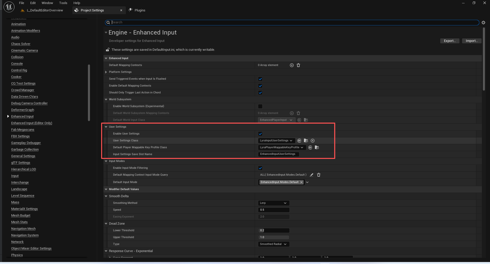
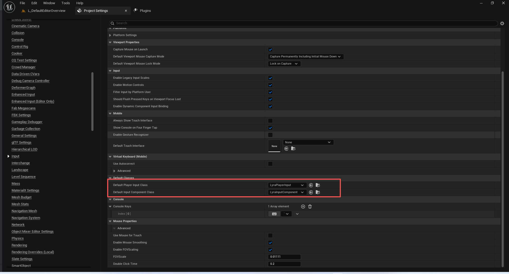

# UE5_Lyra学习指南_070_输入系统

本文章仅为小刚-B站课堂-虚幻引擎视频课程Lyra-精讲的演讲手稿.  
本套课程链接:[[UE5]虚幻引擎游戏案例Lyra精讲](https://www.bilibili.com/cheese/play/ss112001159)  
前置课程链接:[[UE5]虚幻引擎UEC++从基础到进阶](https://www.bilibili.com/cheese/play/ss28043)  

文章内容由小刚撰写,采用了以下多种方式:  
1.口述转文字  
2.AI重构  
3.参考引擎源码  
4.Lyra工程源码  
5.结合社区论坛各位大佬的解析  

- [UE5\_Lyra学习指南\_070\_输入系统](#ue5_lyra学习指南_070_输入系统)
	- [概述](#概述)
	- [配置](#配置)
	- [代码](#代码)
		- [LyraAimSensitivityData](#lyraaimsensitivitydata)
		- [LyraInputComponent](#lyrainputcomponent)
		- [LyraInputConfig](#lyrainputconfig)
		- [LyraInputModifiers](#lyrainputmodifiers)
		- [LyraInputUserSettings](#lyrainputusersettings)
		- [LyraPlayerInput](#lyraplayerinput)
		- [LyraPlayerMappableKeyProfile](#lyraplayermappablekeyprofile)
	- [总结](#总结)


## 概述
本节主要把Input的内容查漏补缺一下.因为大部分内容已经在前面的章节讲过了.

## 配置
DefaultInput.ini
``` ini
[/Script/Engine.PlayerInput]
;仅用于开发目的的键与符合 Exec() 格式的字符串的通用绑定操作
+DebugExecBindings=(Key=Insert,Command="Cheat Teleport")
+DebugExecBindings=(Key=Delete,Command="CycleDebugCameras")
+DebugExecBindings=(Key=Gamepad_Special_Left,Command="CycleDebugCameras")
+DebugExecBindings=(Key=Home,Command="ShowDebug")
+DebugExecBindings=(Key=End,Command="CycleAbilitySystemDebug")
+DebugExecBindings=(Key=PageDown,Command="PreviousDebugTarget")
+DebugExecBindings=(Key=PageUp,Command="NextDebugTarget")
+DebugExecBindings=(Key=K,Command="DamageSelfDestruct")
+DebugExecBindings=(Key=NumPadFour,Command="CancelActivatedAbilities")

[/Script/Engine.InputSettings]
;这位玩家对“轴向”的诠释
+AxisConfig=(AxisKeyName="Gamepad_LeftX",AxisProperties=(DeadZone=0.250000,Sensitivity=1.000000,Exponent=1.000000,bInvert=False))
+AxisConfig=(AxisKeyName="Gamepad_LeftY",AxisProperties=(DeadZone=0.250000,Sensitivity=1.000000,Exponent=1.000000,bInvert=False))
+AxisConfig=(AxisKeyName="Gamepad_RightX",AxisProperties=(DeadZone=0.250000,Sensitivity=1.000000,Exponent=1.000000,bInvert=False))
+AxisConfig=(AxisKeyName="Gamepad_RightY",AxisProperties=(DeadZone=0.250000,Sensitivity=1.000000,Exponent=1.000000,bInvert=False))
+AxisConfig=(AxisKeyName="MouseX",AxisProperties=(DeadZone=0.000000,Sensitivity=0.070000,Exponent=1.000000,bInvert=False))
+AxisConfig=(AxisKeyName="MouseY",AxisProperties=(DeadZone=0.000000,Sensitivity=0.070000,Exponent=1.000000,bInvert=False))
+AxisConfig=(AxisKeyName="MouseWheelAxis",AxisProperties=(DeadZone=0.000000,Sensitivity=1.000000,Exponent=1.000000,bInvert=False))
+AxisConfig=(AxisKeyName="Gamepad_LeftTriggerAxis",AxisProperties=(DeadZone=0.000000,Sensitivity=1.000000,Exponent=1.000000,bInvert=False))
+AxisConfig=(AxisKeyName="Gamepad_RightTriggerAxis",AxisProperties=(DeadZone=0.000000,Sensitivity=1.000000,Exponent=1.000000,bInvert=False))
+AxisConfig=(AxisKeyName="Gamepad_Special_Left_X",AxisProperties=(DeadZone=0.000000,Sensitivity=1.000000,Exponent=1.000000,bInvert=False))
+AxisConfig=(AxisKeyName="Gamepad_Special_Left_Y",AxisProperties=(DeadZone=0.000000,Sensitivity=1.000000,Exponent=1.000000,bInvert=False))
; 允许使用鼠标进行触摸操作
bUseMouseForTouch=False
; 控制是否在应用程序启动时使视口能够捕获鼠标操作
bCaptureMouseOnLaunch=True
; 如果启用，虚拟键盘将启用自动纠错功能。目前仅在移动设备上支持此功能。
bUseAutocorrect=False
; 该游戏视图的默认鼠标捕获模式
DefaultViewportMouseCaptureMode=CapturePermanently_IncludingInitialMouseDown
; 当视口获得捕获时的默认鼠标锁定状态行为
DefaultViewportMouseLockMode=LockOnCapture
; 用于将视野放大倍数进行乘法运算的系数
FOVScale=0.011110
; 如果在这一段时间内按键被按下两次，则会被视为“双击”操作。
DoubleClickTime=0.200000
; 该游戏的默认屏幕触摸输入界面（可设为空以关闭屏幕界面）
DefaultTouchInterface=None
; 玩家输入对象的默认类类型。可由玩家控制器进行覆盖。
DefaultPlayerInputClass=/Script/LyraGame.LyraPlayerInput
; 棋子输入组件的默认类类型。
DefaultInputComponentClass=/Script/LyraGame.LyraInputComponent
; 如果情况属实，那么 PlayerController::InputKey 函数将仅在输入事件来自属于 PlayerController 平台用户的输入设备时才对其进行处理。
bFilterInputByPlatformUser=True

[/Script/CommonUI.CommonUIInputSettings]
; 当使用游戏手柄时，确保鼠标指针会自动移动到当前处于焦点状态的任何控件的中心位置。
bLinkCursorToGamepadFocus=True
; 处理用户界面输入操作的输入组件的输入优先级。
; 值越低，该组件的优先级就越高。
; 默认情况下，该值设定得极高，以确保用户界面操作的处理优先级高于游戏元素。
; 如需调整，请根据项目中的输入堆栈情况，对要处理的用户界面输入组件进行相应的调整，使其在输入堆栈中的适当位置得到处理。
; 注意：当活动输入模式为 ECommonInputMode:：菜单 时，所有优先级低于此值的输入组件都将被完全阻断。
;  因此，如果任何游戏代理输入组件的优先级高于此值，则其行为将不符合预期。
UIActionProcessingPriority=10000
; 该项目的所有用户界面输入操作映射 
+InputActions=(ActionTag=UI.Action.Escape,DefaultDisplayName=NSLOCTEXT("[/Script/CommonUI]", "DDDC55F044A6D009AE3FC89634A4FBE3", "Back"),KeyMappings=((Key=Escape),(Key=Gamepad_Special_Right)))
; 模拟指针设置
AnalogCursorSettings=(PreprocessorPriority=2,PreprocessorRegistrationInfo=(Type=Game,Priority=2),bEnableCursorAcceleration=True,CursorAcceleration=1500.000000,CursorMaxSpeed=2200.000000,CursorDeadZone=0.250000,HoverSlowdownFactor=0.400000,ScrollDeadZone=0.200000,ScrollUpdatePeriod=0.100000,ScrollMultiplier=2.500000)

; 未找到这块内容 大概率有没用到
[/Script/OpenXRInput.OpenXRInputSettings]
bUseEnhancedInput=True
MappableInputConfig=None

[/Script/EnhancedInput.EnhancedInputDeveloperSettings]
; 如果情况属实，那么在每个增强型输入子系统中都会创建一个“用户设置”类的实例。
bEnableUserSettings=True
; 每个增强输入子系统用于用户设置所应使用的类。
; 每个增强输入子系统都会实例化此类，并将其作为存储用户设置（如按键映射、辅助功能设置等）的场所。
; 继承此类以为您的游戏添加更多自定义选项。
UserSettingsClass=/Script/LyraGame.LyraInputUserSettings
; 玩家可映射按键配置文件的默认类，用于存储玩家在用户设置中设定的按键映射关系。
DefaultPlayerMappableKeyProfileClass=/Script/LyraGame.LyraPlayerMappableKeyProfile


```




## 代码
### LyraAimSensitivityData
``` cpp
/** Defines a set of gamepad sensitivity to a float value. */
/** 定义了一组游戏手柄的灵敏度值（以浮点数形式表示）。*/
UCLASS(MinimalAPI, BlueprintType, Const, Meta = (DisplayName = "Lyra Aim Sensitivity Data", ShortTooltip = "Data asset used to define a map of Gamepad Sensitivty to a float value."))
class ULyraAimSensitivityData : public UPrimaryDataAsset
{
	GENERATED_BODY()

public:
	// 构造函数 给容器初始化一个值
	UE_API ULyraAimSensitivityData(const FObjectInitializer& ObjectInitializer);

	//将枚举转换成灵敏度系数
	UE_API const float SensitivtyEnumToFloat(const ELyraGamepadSensitivity InSensitivity) const;
	
protected:
	/** Map of SensitivityMap settings to their corresponding float */
	/** 保存了敏感度设置及其对应浮点数值的映射关系 */
	UPROPERTY(EditAnywhere, BlueprintReadWrite)
	TMap<ELyraGamepadSensitivity, float> SensitivityMap;
};


```

### LyraInputComponent
``` cpp
/**
 * ULyraInputComponent
 *
 *	Component used to manage input mappings and bindings using an input config data asset.
 * 用于通过输入配置数据资产来管理输入映射和绑定的组件。
 *	
 */
UCLASS(Config = Input)
class ULyraInputComponent : public UEnhancedInputComponent
{
	GENERATED_BODY()

public:
	// 无
	ULyraInputComponent(const FObjectInitializer& ObjectInitializer);

	// 拓展
	void AddInputMappings(const ULyraInputConfig* InputConfig, UEnhancedInputLocalPlayerSubsystem* InputSubsystem) const;
	void RemoveInputMappings(const ULyraInputConfig* InputConfig, UEnhancedInputLocalPlayerSubsystem* InputSubsystem) const;

	// 绑定原生操作
	template<class UserClass, typename FuncType>
	void BindNativeAction(const ULyraInputConfig* InputConfig, const FGameplayTag& InputTag, ETriggerEvent TriggerEvent, UserClass* Object, FuncType Func, bool bLogIfNotFound);

	// 绑定能力操作
	template<class UserClass, typename PressedFuncType, typename ReleasedFuncType>
	void BindAbilityActions(const ULyraInputConfig* InputConfig, UserClass* Object, PressedFuncType PressedFunc, ReleasedFuncType ReleasedFunc, TArray<uint32>& BindHandles);

	// 移除之前添加的输入资产绑定
	void RemoveBinds(TArray<uint32>& BindHandles);
};

// 绑定原生操作 这里的Tag在调用是写死了的 必须蓝图和C++Tag一致
// 前后左右 鼠标旋转
template<class UserClass, typename FuncType>
void ULyraInputComponent::BindNativeAction(const ULyraInputConfig* InputConfig, const FGameplayTag& InputTag, ETriggerEvent TriggerEvent, UserClass* Object, FuncType Func, bool bLogIfNotFound)
{
	check(InputConfig);
	if (const UInputAction* IA = InputConfig->FindNativeInputActionForTag(InputTag, bLogIfNotFound))
	{
		BindAction(IA, TriggerEvent, Object, Func);
	}
}
// 绑定能力操作 这里的Tag的是动态的,并且是负载,走蓝图配置过来即可,一路传递,C++层面并不关心这个Tag到底是啥
// 开火 跳跃等
template<class UserClass, typename PressedFuncType, typename ReleasedFuncType>
void ULyraInputComponent::BindAbilityActions(const ULyraInputConfig* InputConfig, UserClass* Object, PressedFuncType PressedFunc, ReleasedFuncType ReleasedFunc, TArray<uint32>& BindHandles)
{
	check(InputConfig);

	for (const FLyraInputAction& Action : InputConfig->AbilityInputActions)
	{
		if (Action.InputAction && Action.InputTag.IsValid())
		{
			if (PressedFunc)
			{
				BindHandles.Add(BindAction(Action.InputAction, ETriggerEvent::Triggered, Object, PressedFunc, Action.InputTag).GetHandle());
			}

			if (ReleasedFunc)
			{
				BindHandles.Add(BindAction(Action.InputAction, ETriggerEvent::Completed, Object, ReleasedFunc, Action.InputTag).GetHandle());
			}
		}
	}
}

```


### LyraInputConfig
``` cpp
/**
 * FLyraInputAction
 *
 *	Struct used to map a input action to a gameplay input tag.
 *  该结构体用于将输入操作映射到游戏玩法的输入标签上。
 */
USTRUCT(BlueprintType)
struct FLyraInputAction
{
	GENERATED_BODY()

public:

	UPROPERTY(EditDefaultsOnly, BlueprintReadOnly)
	TObjectPtr<const UInputAction> InputAction = nullptr;

	UPROPERTY(EditDefaultsOnly, BlueprintReadOnly, Meta = (Categories = "InputTag"))
	FGameplayTag InputTag;
};

/**
 * ULyraInputConfig
 *
 *	Non-mutable data asset that contains input configuration properties.
 *	不可变的数据资产，其中包含输入配置属性。
 */
UCLASS(BlueprintType, Const)
class ULyraInputConfig : public UDataAsset
{
	GENERATED_BODY()

public:

	ULyraInputConfig(const FObjectInitializer& ObjectInitializer);

	// 找到基本输入的Tag所映射的输入资产
	UFUNCTION(BlueprintCallable, Category = "Lyra|Pawn")
	const UInputAction* FindNativeInputActionForTag(const FGameplayTag& InputTag, bool bLogNotFound = true) const;

	// 找到技能输入的Tag所映射的输入资产
	UFUNCTION(BlueprintCallable, Category = "Lyra|Pawn")
	const UInputAction* FindAbilityInputActionForTag(const FGameplayTag& InputTag, bool bLogNotFound = true) const;

public:
	// List of input actions used by the owner.  These input actions are mapped to a gameplay tag and must be manually bound.
	// 所有者使用的输入操作列表。这些输入操作会映射到游戏玩法标签上，并且必须手动进行绑定。
	UPROPERTY(EditDefaultsOnly, BlueprintReadOnly, Meta = (TitleProperty = "InputAction"))
	TArray<FLyraInputAction> NativeInputActions;

	// List of input actions used by the owner.  These input actions are mapped to a gameplay tag and are automatically bound to abilities with matching input tags.
	// 该玩家所使用的输入操作列表。这些输入操作被映射到游戏玩法标签上，并会自动与具有相同输入标签的技能绑定在一起。
	UPROPERTY(EditDefaultsOnly, BlueprintReadOnly, Meta = (TitleProperty = "InputAction"))
	TArray<FLyraInputAction> AbilityInputActions;
};


```
### LyraInputModifiers
``` cpp

/** 
*  Scales input basedon a double property in the SharedUserSettings
*  根据“共享用户设置”中的双属性来输入数值
*/
UCLASS(NotBlueprintable, MinimalAPI, meta = (DisplayName = "Setting Based Scalar"))
class ULyraSettingBasedScalar : public UInputModifier
{
	GENERATED_BODY()

public:

	/** Name of the property that will be used to clamp the X Axis of this value */
	/** 用于限制此值 X 轴范围的属性名称 */
	UPROPERTY(EditInstanceOnly, BlueprintReadWrite, Category=Settings)
	FName XAxisScalarSettingName = NAME_None;

	/** Name of the property that will be used to clamp the Y Axis of this value */
	/** 用于限制此值 Y 轴范围的属性名称 */
	UPROPERTY(EditInstanceOnly, BlueprintReadWrite, Category=Settings)
	FName YAxisScalarSettingName = NAME_None;

	/** Name of the property that will be used to clamp the Z Axis of this value */
	/** 用于限制此值 Z 轴范围的属性名称 */
	UPROPERTY(EditInstanceOnly, BlueprintReadWrite, Category=Settings)
	FName ZAxisScalarSettingName = NAME_None;
	
	/** Set the maximium value of this setting on each axis. */
	/** 设置此设置在每个轴上的最大值。*/
	UPROPERTY(EditInstanceOnly, BlueprintReadWrite, Category=Settings)
	FVector MaxValueClamp = FVector(10.0, 10.0, 10.0);
	
	/** Set the minimum value of this setting on each axis. */
	/** 设置此设置在每个轴上的最小值。*/
	UPROPERTY(EditInstanceOnly, BlueprintReadWrite, Category=Settings)
	FVector MinValueClamp = FVector::ZeroVector;

protected:
	virtual FInputActionValue ModifyRaw_Implementation(const UEnhancedPlayerInput* PlayerInput, FInputActionValue CurrentValue, float DeltaTime) override;

	/** FProperty Cache that will be populated with any found FProperty's on the settings class so that we don't need to look them up each frame */
	/** 一个用于缓存所找到的“FProperty”对象的属性缓存，这些“FProperty”对象将存储在设置类中，这样我们就不必在每一帧都去查找它们了 */
	TArray<const FProperty*> PropertyCache;
};

/** Represents which stick that this deadzone is for, either the move or the look stick */
/** 表示此死区所对应的操纵杆类型，即移动操纵杆还是视角操纵杆 */
UENUM()
enum class EDeadzoneStick : uint8
{
	/** Deadzone for the movement stick */
	/** 运动杆的死区设置 */
	MoveStick = 0,

	/** Deadzone for the looking stick */
	/** 瞄准杆的死区范围 */
	LookStick = 1,
};

/**
 * This is a deadzone input modifier that will have it's thresholds driven by what is in the Lyra Shared game settings.
 * 这是一种“死区输入调节器”，其阈值将根据“莱拉共享游戏设置”中的内容进行设定。
 */
UCLASS(NotBlueprintable, MinimalAPI, meta = (DisplayName = "Lyra Settings Driven Dead Zone"))
class ULyraInputModifierDeadZone : public UInputModifier
{
	GENERATED_BODY()

public:

	UPROPERTY(EditInstanceOnly, BlueprintReadWrite, Category=Settings, Config)
	EDeadZoneType Type = EDeadZoneType::Radial;
	
	// Threshold above which input is clamped to 1
	// 超过此阈值后，输入值将被限制为 1
	UPROPERTY(EditInstanceOnly, BlueprintReadWrite, Category=Settings, Config)
	float UpperThreshold = 1.0f;

	/** Which stick this deadzone is for. This controls which setting will be used when calculating the deadzone */
	/** 此死区区域对应的是哪根拨杆。它决定了在计算死区时将使用哪个设置 */
	UPROPERTY(EditInstanceOnly, BlueprintReadWrite, Category=Settings, Config)
	EDeadzoneStick DeadzoneStick = EDeadzoneStick::MoveStick;

protected:
	virtual FInputActionValue ModifyRaw_Implementation(const UEnhancedPlayerInput* PlayerInput, FInputActionValue CurrentValue, float DeltaTime) override;

	// Visualize as black when unmodified. Red when blocked (with differing intensities to indicate axes)
	// Mirrors visualization in https://www.gamasutra.com/blogs/JoshSutphin/20130416/190541/Doing_Thumbstick_Dead_Zones_Right.php.
	// 未修改时呈现为黑色。被阻挡时呈现为红色（不同深浅的红色用于区分坐标轴）
	// 与 https://www.gamasutra.com/blogs/JoshSutphin/20130416/190541/Doing_Thumbstick_Dead_Zones_Right.php 中的可视化效果一致。
	virtual FLinearColor GetVisualizationColor_Implementation(FInputActionValue SampleValue, FInputActionValue FinalValue) const override;
};

/** The type of targeting sensitity that should be considered */
/** 应考虑的靶向敏感性类型 */
UENUM()
enum class ELyraTargetingType : uint8
{
	/** Sensitivity to be applied why normally looking around */
	/** 正常情况下四处张望时所应具备的敏感度 */
	Normal = 0,

	/** The sensitivity that should be applied while Aiming Down Sights */
	/** 在瞄准瞄准镜时应采用的灵敏度设置 */
	ADS = 1,
};

/** Applies a scalar modifier based on the current gamepad settings in Lyra Shared game settings.  */
/** 根据莱拉共享游戏设置中的当前游戏手柄设置应用标量修改器。*/
UCLASS(NotBlueprintable, MinimalAPI, meta = (DisplayName = "Lyra Gamepad Sensitivity"))
class ULyraInputModifierGamepadSensitivity : public UInputModifier
{
	GENERATED_BODY()
public:
	
	/** The type of targeting to use for this Sensitivity */
	/** 用于此敏感度的定位类型 */
	UPROPERTY(EditInstanceOnly, BlueprintReadWrite, Category=Settings, Config)
	ELyraTargetingType TargetingType = ELyraTargetingType::Normal;

	/** Asset that gives us access to the float scalar value being used for sensitivty */
	/** 该资产使我们能够获取用于灵敏度计算的浮点数值 */
	UPROPERTY(EditAnywhere, BlueprintReadOnly, meta=(AssetBundles="Client,Server"))
	TObjectPtr<const ULyraAimSensitivityData> SensitivityLevelTable;

protected:
	virtual FInputActionValue ModifyRaw_Implementation(const UEnhancedPlayerInput* PlayerInput, FInputActionValue CurrentValue, float DeltaTime) override;
};

/** Applies an inversion of axis values based on a setting in the Lyra Shared game settings */
/** 根据“莉拉共享”游戏设置中的设定，对轴值进行反转操作 */
UCLASS(NotBlueprintable, MinimalAPI, meta = (DisplayName = "Lyra Aim Inversion Setting"))
class ULyraInputModifierAimInversion : public UInputModifier
{
	GENERATED_BODY()
	
protected:
	virtual FInputActionValue ModifyRaw_Implementation(const UEnhancedPlayerInput* PlayerInput, FInputActionValue CurrentValue, float DeltaTime) override;	
};

```
### LyraInputUserSettings
``` cpp
/** 
 * Custom settings class for any input related settings for the Lyra game.
 * This will be serialized out at the same time as the Lyra Shared Settings and is
 * compatible with cloud saves through by calling the "Serialize" function.
 *
 * 用于 Lyra 游戏中所有与输入相关设置的自定义设置类。
 * 这些设置将在与 Lyra 共享设置一同序列化输出，并且通过调用“序列化”函数可与云保存功能兼容。
 */
UCLASS(MinimalAPI)
class ULyraInputUserSettings : public UEnhancedInputUserSettings
{
	GENERATED_BODY()
public:
	//~ Begin UEnhancedInputUserSettings interface
	UE_API virtual void ApplySettings() override;
	//~ End UEnhancedInputUserSettings interface

	// Add any additional Input Settings here!
	// Some ideas could be:
	// - "toggle vs. hold" to trigger in game actions
	// - aim sensitivity should go here
	// - etc

	// 在此添加任何额外的输入设置！
	// 可能的设置包括：
	// - “切换与保持”以触发游戏中的操作
	// - 目标灵敏度应设置于此处
	// - 等等

	// Make sure to mark your properties with the "SaveGame" metadata to have them serialize when saved
	//UPROPERTY(SaveGame, BlueprintReadWrite, Category="Enhanced Input|User Settings")
	// bool bSomeExampleProperty;

	// 请务必为您的属性添加“SaveGame”元数据，以便在保存时对其进行序列化处理
	//UPROPERTY(SaveGame，蓝图可读可写，类别“增强输入|用户设置”)
	// bool b某些示例属性
};

/**
 * Player Mappable Key settings are settings that are accessible per-action key mapping.
 * This is where you could place additional metadata that may be used by your settings UI,
 * input triggers, or other places where you want to know about a key setting.
 *
 * 玩家可映射键设置是指每个操作对应的键映射设置。
 * 在此区域，您可以放置一些额外的元数据，这些数据可能会被您的设置界面、输入触发器或其他您希望了解键设置的区域所使用。
 * 
 */
UCLASS(MinimalAPI)
class ULyraPlayerMappableKeySettings : public UPlayerMappableKeySettings
{
	GENERATED_BODY()
	
public:

	/** Returns the tooltip that should be displayed on the settings screen for this key */
	/** 返回在设置界面中应显示的与该键相关的工具提示信息 */
	UE_API const FText& GetTooltipText() const;

protected:
	/** The tooltip that should be associated with this action when displayed on the settings screen */
	/** 在设置界面显示时，与该操作相关联的提示信息 */
	UPROPERTY(EditAnywhere, BlueprintReadOnly, Category = "Settings", meta=(AllowPrivateAccess=true))
	FText Tooltip = FText::GetEmpty();
};

#undef UE_API

```
### LyraPlayerInput
``` cpp
/**
 * Custom player input class for Lyra. This extends the functionality of Enhanced Input to also include
 * some input latency tracking on key press.
 *
 * Extend this class if you have any special logic which you may want to run relating to when keys are pressed
 * or when input is flushed.
 */

/**
 * 为莱拉定制的玩家输入类。此类扩展了增强输入的功能，还增加了按键按下时的输入延迟跟踪功能。*
 * 如果您有任何与按键按下或输入刷新相关的特殊逻辑需要执行，请在此类中添加相关内容。
 * 或者，如果您有其他特殊需求，请在此类中进行相关设置。
 *   
 */
UCLASS(config = Input, transient)
class ULyraPlayerInput : public UEnhancedPlayerInput
{
	GENERATED_BODY()

public:
	ULyraPlayerInput();
	virtual ~ULyraPlayerInput() override;

protected:
	//~ Begin UEnhancedPlayerInput Interface
	virtual bool InputKey(const FInputKeyEventArgs& Params) override;
	//~ End of UEnhancedPlayerInput interface

	void ProcessInputEventForLatencyMarker(const FInputKeyEventArgs& Params);
	void BindToLatencyMarkerSettingChange();
	void UnbindLatencyMarkerSettingChangeListener();
	void HandleLatencyMarkerSettingChanged();

	bool bShouldTriggerLatencyFlash = false;
};
```

### LyraPlayerMappableKeyProfile
``` cpp
/**
 * UEnhancedPlayerMappableKeyProfile
 * 代表了用户可用于其玩家可映射按键的“一个‘配置文件’”
 * 
 */
UCLASS(MinimalAPI)
class ULyraPlayerMappableKeyProfile : public UEnhancedPlayerMappableKeyProfile
{
	GENERATED_BODY()

protected:

	//~ Begin UEnhancedPlayerMappableKeyProfile interface
	UE_API virtual void EquipProfile() override;
	UE_API virtual void UnEquipProfile() override;
	//~ End UEnhancedPlayerMappableKeyProfile interface
};

```


## 总结
在ShooterCoreRuntime/Public/Input下有关于辅助瞄准的输入修饰.不在这里讲解.
本节主要是解决掉项目/Input下的代码.