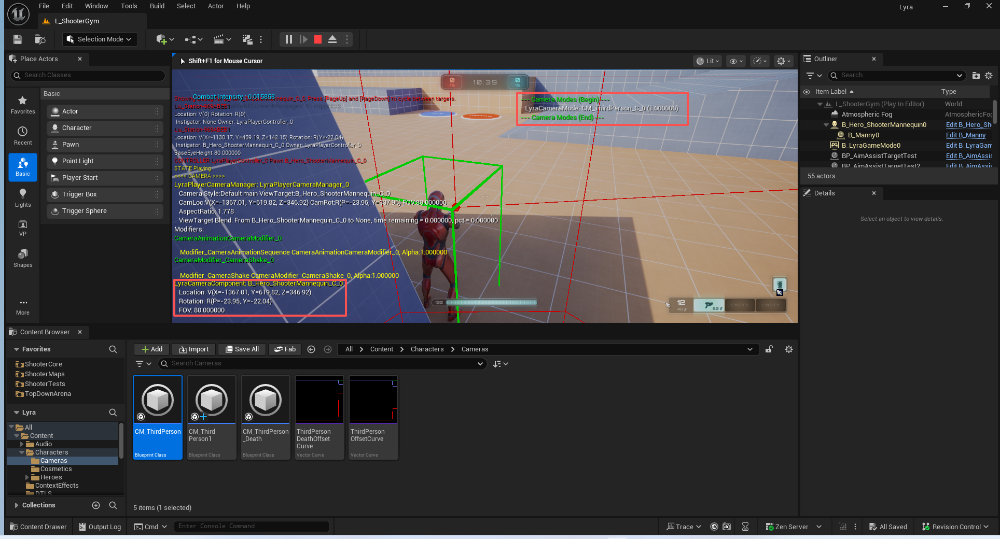

# UE5_Lyra学习指南_078_相机系统
本文章仅为小刚-B站课堂-虚幻引擎视频课程Lyra-精讲的演讲手稿.  
本套课程链接:[[UE5]虚幻引擎游戏案例Lyra精讲](https://www.bilibili.com/cheese/play/ss112001159)  
前置课程链接:[[UE5]虚幻引擎UEC++从基础到进阶](https://www.bilibili.com/cheese/play/ss28043)  

文章内容由小刚撰写,采用了以下多种方式:  
1.口述转文字  
2.AI重构  
3.参考引擎源码  
4.Lyra工程源码  
5.结合社区论坛各位大佬的解析  

- [UE5\_Lyra学习指南\_078\_相机系统](#ue5_lyra学习指南_078_相机系统)
	- [概述](#概述)
	- [调试命令](#调试命令)
	- [相机管理器](#相机管理器)
		- [APlayerCameraManager](#aplayercameramanager)
		- [ALyraPlayerCameraManager](#alyraplayercameramanager)
			- [代码](#代码)
		- [ULyraUICameraManagerComponent](#ulyrauicameramanagercomponent)
	- [相机模式](#相机模式)
		- [模式之间过渡的枚举](#模式之间过渡的枚举)
		- [相机模式传递的数据](#相机模式传递的数据)
		- [相机模式的定义](#相机模式的定义)
			- [构造函数](#构造函数)
			- [工具函数](#工具函数)
			- [核心函数](#核心函数)
			- [蹲伏的调整](#蹲伏的调整)
			- [代码](#代码-1)
		- [相机模式的容器](#相机模式的容器)
			- [推入新的相机模式](#推入新的相机模式)
			- [评估相机的栈](#评估相机的栈)
			- [获取当前相机模式的混合情况](#获取当前相机模式的混合情况)
			- [代码](#代码-2)
		- [相机组件](#相机组件)
			- [每帧刷新相机情况](#每帧刷新相机情况)
			- [获取最新的相机模式](#获取最新的相机模式)
			- [持有相机的容器](#持有相机的容器)
			- [获取使用当前混合状态数据](#获取使用当前混合状态数据)
			- [代码](#代码-3)
	- [总结](#总结)


## 概述
本章主要讲解Lyra的相机系统!
只有两个难点:
难点1,基于相机模式的容器管理.
难点2,处理相机穿透和阻挡得复杂计算模式.
有些小伙伴会问,为啥不用弹簧臂?
因为这样写比较高级,不容易读懂.hhh.其实这样写自由度更高,更可控.
## 调试命令
``` cmd 
ShowDebug CAMERA 
```

请用编辑器得下窗口运行改命令,如果以新得窗口运行会导致崩溃.

## 相机管理器

### APlayerCameraManager
一个“玩家摄像机管理器”负责管理特定玩家的摄像机。它定义了其他系统（例如渲染器）所使用的最终视图属性，这意味着你可以将其视为存在于世界中的虚拟眼球。它可以直接计算最终的摄像机属性，也可以在其他影响摄像机的对象或角色之间进行仲裁/混合（例如从一个摄像机角色过渡到另一个）。
玩家摄像机管理器的主要外部职责是可靠地响应各种“获取*”函数，例如“获取摄像机视点”。其余的一切都是实现细节，可由用户项目进行重写。
默认情况下，一个玩家摄像机管理器会维护一个“视图目标”，即摄像机所关联的主要角色。它还可以对最终视图状态应用各种“后置”效果，例如摄像机动画、抖动、后期处理效果或诸如镜头上的污渍之类的特殊效果。
``` cpp
/**
 * A PlayerCameraManager is responsible for managing the camera for a particular
 * player. It defines the final view properties used by other systems (e.g. the renderer),
 * meaning you can think of it as your virtual eyeball in the world. It can compute the 
 * final camera properties directly, or it can arbitrate/blend between other objects or 
 * actors that influence the camera (e.g. blending from one CameraActor to another).
 * 
 * The PlayerCameraManagers primary external responsibility is to reliably respond to
 * various Get*() functions, such as GetCameraViewPoint. Most everything else is
 * implementation detail and overrideable by user projects.
 * 
 * By default, a PlayerCameraManager maintains a "view target", which is the primary actor
 * the camera is associated with. It can also apply various "post" effects to the final 
 * view state, such as camera animations, shakes, post-process effects or special 
 * effects such as dirt on the lens.
 *
 * @see https://docs.unrealengine.com/latest/INT/Gameplay/Framework/Camera/
 */
UCLASS(notplaceable, transient, BlueprintType, Blueprintable, Config=Engine, MinimalAPI)
class APlayerCameraManager : public AActor
{
	// ......
}

```

这个类主要核心就在于它得UpdateViewTarget函数.在这函数中会去调用找到得相机组件得GetCameraView.这个就是我们介入得地方
``` cpp
	if (ACameraActor* CamActor = Cast<ACameraActor>(OutVT.Target))
	{
		// Viewing through a camera actor.
		CamActor->GetCameraComponent()->GetCameraView(DeltaTime, OutVT.POV);
	}
```
``` cpp

void APlayerCameraManager::UpdateViewTarget(FTViewTarget& OutVT, float DeltaTime)
{
	// Don't update outgoing viewtarget during an interpolation 
	if ((PendingViewTarget.Target != NULL) && BlendParams.bLockOutgoing && OutVT.Equal(ViewTarget))
	{
		return;
	}

	// Store previous POV, in case we need it later
	FMinimalViewInfo OrigPOV = OutVT.POV;

	// Reset the view target POV fully
	static const FMinimalViewInfo DefaultViewInfo;
	OutVT.POV = DefaultViewInfo;
	OutVT.POV.FOV = DefaultFOV;
	OutVT.POV.OrthoWidth = DefaultOrthoWidth;
	OutVT.POV.AspectRatio = DefaultAspectRatio;
	OutVT.POV.bConstrainAspectRatio = bDefaultConstrainAspectRatio;
	OutVT.POV.ProjectionMode = bIsOrthographic ? ECameraProjectionMode::Orthographic : ECameraProjectionMode::Perspective;
	OutVT.POV.PostProcessBlendWeight = 1.0f;
	OutVT.POV.bAutoCalculateOrthoPlanes = bAutoCalculateOrthoPlanes;
	OutVT.POV.AutoPlaneShift = AutoPlaneShift;
	OutVT.POV.bUpdateOrthoPlanes = bUpdateOrthoPlanes;
	OutVT.POV.bUseCameraHeightAsViewTarget = bUseCameraHeightAsViewTarget;

	bool bDoNotApplyModifiers = false;

	if (ACameraActor* CamActor = Cast<ACameraActor>(OutVT.Target))
	{
		// Viewing through a camera actor.
		CamActor->GetCameraComponent()->GetCameraView(DeltaTime, OutVT.POV);
	}
	else
	{

		static const FName NAME_Fixed = FName(TEXT("Fixed"));
		static const FName NAME_ThirdPerson = FName(TEXT("ThirdPerson"));
		static const FName NAME_FreeCam = FName(TEXT("FreeCam"));
		static const FName NAME_FreeCam_Default = FName(TEXT("FreeCam_Default"));
		static const FName NAME_FirstPerson = FName(TEXT("FirstPerson"));

		if (CameraStyle == NAME_Fixed)
		{
			// do not update, keep previous camera position by restoring
			// saved POV, in case CalcCamera changes it but still returns false
			OutVT.POV = OrigPOV;

			// don't apply modifiers when using this debug camera mode
			bDoNotApplyModifiers = true;
		}
		else if (CameraStyle == NAME_ThirdPerson || CameraStyle == NAME_FreeCam || CameraStyle == NAME_FreeCam_Default)
		{
			// Simple third person view implementation
			FVector Loc = OutVT.Target->GetActorLocation();
			FRotator Rotator = OutVT.Target->GetActorRotation();

			if (OutVT.Target == PCOwner)
			{
				Loc = PCOwner->GetFocalLocation();
			}

			// Take into account Mesh Translation so it takes into account the PostProcessing we do there.
			// @fixme, can crash in certain BP cases where default mesh is null
//			APawn* TPawn = Cast<APawn>(OutVT.Target);
// 			if ((TPawn != NULL) && (TPawn->Mesh != NULL))
// 			{
// 				Loc += FQuatRotationMatrix(OutVT.Target->GetActorQuat()).TransformVector(TPawn->Mesh->RelativeLocation - GetDefault<APawn>(TPawn->GetClass())->Mesh->RelativeLocation);
// 			}

			//OutVT.Target.GetActorEyesViewPoint(Loc, Rot);
			if( CameraStyle == NAME_FreeCam || CameraStyle == NAME_FreeCam_Default )
			{
				Rotator = PCOwner->GetControlRotation();
			}

			FVector Pos = Loc + ViewTargetOffset + FRotationMatrix(Rotator).TransformVector(FreeCamOffset) - Rotator.Vector() * FreeCamDistance;
			FCollisionQueryParams BoxParams(SCENE_QUERY_STAT(FreeCam), false, this);
			BoxParams.AddIgnoredActor(OutVT.Target);
			FHitResult Result;

			GetWorld()->SweepSingleByChannel(Result, Loc, Pos, FQuat::Identity, ECC_Camera, FCollisionShape::MakeBox(FVector(12.f)), BoxParams);
			OutVT.POV.Location = !Result.bBlockingHit ? Pos : Result.Location;
			OutVT.POV.Rotation = Rotator;

			// don't apply modifiers when using this debug camera mode
			bDoNotApplyModifiers = true;
		}
		else if (CameraStyle == NAME_FirstPerson)
		{
			// Simple first person, view through viewtarget's 'eyes'
			OutVT.Target->GetActorEyesViewPoint(OutVT.POV.Location, OutVT.POV.Rotation);
	
			// don't apply modifiers when using this debug camera mode
			bDoNotApplyModifiers = true;
		}
		else
		{
			UpdateViewTargetInternal(OutVT, DeltaTime);
		}
	}

	if (!bDoNotApplyModifiers || bAlwaysApplyModifiers)
	{
		// Apply camera modifiers at the end (view shakes for example)
		ApplyCameraModifiers(DeltaTime, OutVT.POV);
	}

	// Synchronize the actor with the view target results
	SetActorLocationAndRotation(OutVT.POV.Location, OutVT.POV.Rotation, false);
	if (bAutoCalculateOrthoPlanes && OutVT.Target)
	{
		OutVT.POV.SetCameraToViewTarget(OutVT.Target->GetActorLocation());
	}

	UpdateCameraLensEffects(OutVT);
}

```
### ALyraPlayerCameraManager
这个类基本无作用.除了给了一个用于拓展UI相机下得处理.

``` cpp
ALyraPlayerController::ALyraPlayerController(const FObjectInitializer& ObjectInitializer)
	: Super(ObjectInitializer)
{
	// 指定相机管理类
	PlayerCameraManagerClass = ALyraPlayerCameraManager::StaticClass();

#if USING_CHEAT_MANAGER
	// 指定作弊器的类
	CheatClass = ULyraCheatManager::StaticClass();
#endif // #if USING_CHEAT_MANAGER
}

```


``` cpp
ALyraPlayerCameraManager::ALyraPlayerCameraManager(const FObjectInitializer& ObjectInitializer)
	: Super(ObjectInitializer)
{
	DefaultFOV = LYRA_CAMERA_DEFAULT_FOV;
	ViewPitchMin = LYRA_CAMERA_DEFAULT_PITCH_MIN;
	ViewPitchMax = LYRA_CAMERA_DEFAULT_PITCH_MAX;

	UICamera = CreateDefaultSubobject<ULyraUICameraManagerComponent>(UICameraComponentName);
}

```
``` cpp
void ALyraPlayerCameraManager::UpdateViewTarget(FTViewTarget& OutVT, float DeltaTime)
{
	// If the UI Camera is looking at something, let it have priority.
	// 如果用户界面摄像机正在拍摄某个对象，那就让它拥有优先权。
	if (UICamera->NeedsToUpdateViewTarget())
	{
		Super::UpdateViewTarget(OutVT, DeltaTime);
		UICamera->UpdateViewTarget(OutVT, DeltaTime);
		return;
	}

	Super::UpdateViewTarget(OutVT, DeltaTime);
}


```

#### 代码
``` cpp
/**
 * ALyraPlayerCameraManager
 *
 *	The base player camera manager class used by this project.
 *  本项目所使用的基础玩家摄像机管理类。
 */
UCLASS(notplaceable, MinimalAPI)
class ALyraPlayerCameraManager : public APlayerCameraManager
{
	GENERATED_BODY()

public:

	// 构造函数 初始化成员变量
	ALyraPlayerCameraManager(const FObjectInitializer& ObjectInitializer);

	// 获取UI相机管理组件
	ULyraUICameraManagerComponent* GetUICameraComponent() const;

protected:
	// 根据给定的目标视点计算出新的视角位置。
	// 可以关注一下它的父类调用
	// 这里主要是嵌入UI相机管理
	virtual void UpdateViewTarget(FTViewTarget& OutVT, float DeltaTime) override;

	// 转发给相机 绘制调试信息
	virtual void DisplayDebug(UCanvas* Canvas, const FDebugDisplayInfo& DebugDisplay, float& YL, float& YPos) override;

private:
	/** The UI Camera Component, controls the camera when UI is doing something important that gameplay doesn't get priority over. */
	/** 该 UI 摄像头组件用于在游戏玩法无法优先处理某些重要事项时控制摄像机。*/
	UPROPERTY(Transient)
	TObjectPtr<ULyraUICameraManagerComponent> UICamera;
};

```

### ULyraUICameraManagerComponent
没啥作用.可以略过.
``` cpp

UCLASS( Transient, Within=LyraPlayerCameraManager )
class ULyraUICameraManagerComponent : public UActorComponent
{
	GENERATED_BODY()

public:
	// 获取UI相机管理组件
	static ULyraUICameraManagerComponent* GetComponent(APlayerController* PC);

public:
	// 构造函数 注入回调的钩子
	ULyraUICameraManagerComponent();
	// 无作用
	virtual void InitializeComponent() override;

	// 是否正在设置视角Actor
	bool IsSettingViewTarget() const { return bUpdatingViewTarget; }
	// 获取视角对象
	AActor* GetViewTarget() const { return ViewTarget; }
	// 重新设置一个视角对象
	void SetViewTarget(AActor* InViewTarget, FViewTargetTransitionParams TransitionParams = FViewTargetTransitionParams());

	// 是否需要更新视角对象
	bool NeedsToUpdateViewTarget() const;
	
	// 无
	// 嵌入到相机管理组件 可以修改特定需要的视角
	void UpdateViewTarget(struct FTViewTarget& OutVT, float DeltaTime);
	// 无
	void OnShowDebugInfo(AHUD* HUD, UCanvas* Canvas, const FDebugDisplayInfo& DisplayInfo, float& YL, float& YPos);

private:
	UPROPERTY(Transient)
	TObjectPtr<AActor> ViewTarget;
	
	UPROPERTY(Transient)
	bool bUpdatingViewTarget;
};

```

## 相机模式
### 模式之间过渡的枚举
``` cpp
/**
 * ELyraCameraModeBlendFunction
 *
 *	Blend function used for transitioning between camera modes.
 *	用于在相机模式之间过渡的混合函数。
 */
UENUM(BlueprintType)
enum class ELyraCameraModeBlendFunction : uint8
{
	// Does a simple linear interpolation.
	// 进行简单的线性插值。
	Linear,

	// Immediately accelerates, but smoothly decelerates into the target.  Ease amount controlled by the exponent.
	// 立即加速，但会平稳地减速直至抵达目标位置。减速幅度由指数值控制。
	EaseIn,

	// Smoothly accelerates, but does not decelerate into the target.  Ease amount controlled by the exponent.
	// 以平稳的方式加速，但不会减速直至抵达目标位置。减速幅度由指数值控制。
	EaseOut,

	// Smoothly accelerates and decelerates.  Ease amount controlled by the exponent.
	// 能平稳地加速和减速。减速幅度由指数值控制。
	EaseInOut,

	COUNT	UMETA(Hidden)
};


```
### 相机模式传递的数据
``` cpp
/**
 * FLyraCameraModeView
 *
 *	View data produced by the camera mode that is used to blend camera modes.
 *  查看由用于混合不同拍摄模式的相机模式所生成的数据。
 *	
 */
struct FLyraCameraModeView
{
public:

	FLyraCameraModeView();

	// 将自己与其他的相机模式混合数据进行混合
	void Blend(const FLyraCameraModeView& Other, float OtherWeight);

public:

	// 位置
	FVector Location;
	
	// 旋转
	FRotator Rotation;
	
	// 控制旋转
	FRotator ControlRotation;
	
	// FOV
	float FieldOfView;
};


```
这里需要注意下混合的时候,数据的插值处理
``` cpp
void FLyraCameraModeView::Blend(const FLyraCameraModeView& Other, float OtherWeight)
{
	if (OtherWeight <= 0.0f)
	{
		// 负数或者0 还没开始混入
		return;
	}
	else if (OtherWeight >= 1.0f)
	{
		// 大于等于1.0 直接赋值即可
		*this = Other;
		return;
	}

	// 插值.
	
	Location = FMath::Lerp(Location, Other.Location, OtherWeight);

	const FRotator DeltaRotation = (Other.Rotation - Rotation).GetNormalized();
	Rotation = Rotation + (OtherWeight * DeltaRotation);

	const FRotator DeltaControlRotation = (Other.ControlRotation - ControlRotation).GetNormalized();
	ControlRotation = ControlRotation + (OtherWeight * DeltaControlRotation);

	FieldOfView = FMath::Lerp(FieldOfView, Other.FieldOfView, OtherWeight);
}
```

### 相机模式的定义


#### 构造函数

``` cpp
ULyraCameraMode::ULyraCameraMode()
{
	FieldOfView = LYRA_CAMERA_DEFAULT_FOV;
	ViewPitchMin = LYRA_CAMERA_DEFAULT_PITCH_MIN;
	ViewPitchMax = LYRA_CAMERA_DEFAULT_PITCH_MAX;

	BlendTime = 0.5f;
	BlendFunction = ELyraCameraModeBlendFunction::EaseOut;
	BlendExponent = 4.0f;
	BlendAlpha = 1.0f;
	BlendWeight = 1.0f;
}


```
#### 工具函数

``` cpp
	// 获取相机组件 通过Outer去获取
	UE_API ULyraCameraComponent* GetLyraCameraComponent() const;

	// 获取世界
	UE_API virtual UWorld* GetWorld() const override;

	// 获取持有这个相机模式的Actor
	UE_API AActor* GetTargetActor() const;

	// 获取相机模式的视角数据
	const FLyraCameraModeView& GetCameraModeView() const { return View; }

	// Called when this camera mode is activated on the camera mode stack.
	// 当此相机模式在相机模式栈中被激活时触发此事件。
	virtual void OnActivation() {};

	// Called when this camera mode is deactivated on the camera mode stack.
	// 当此相机模式在相机模式栈中被停用时触发此事件。
	virtual void OnDeactivation() {};
	
	// ....


```

#### 核心函数
相机模式的核心在于持有视角数据,并且每帧跟新角色数据,生成最新的相机数据以供上层使用!
``` cpp
void ULyraCameraMode::UpdateCameraMode(float DeltaTime)
{
	UpdateView(DeltaTime);
	UpdateBlending(DeltaTime);
}


```
``` cpp

void ULyraCameraMode::UpdateView(float DeltaTime)
{
	FVector PivotLocation = GetPivotLocation();
	FRotator PivotRotation = GetPivotRotation();

	// 限制Y轴的大小值 ,避免在竖向转过头了
	PivotRotation.Pitch = FMath::ClampAngle(PivotRotation.Pitch, ViewPitchMin, ViewPitchMax);

	View.Location = PivotLocation;
	View.Rotation = PivotRotation;
	View.ControlRotation = View.Rotation;
	View.FieldOfView = FieldOfView;
}
```
``` cpp
void ULyraCameraMode::UpdateBlending(float DeltaTime)
{
	// 混合的时间应该是大于0的 否则就立刻混合完成
	if (BlendTime > 0.0f)
	{
		// 不断累积每帧加入的混合时间的程度
		BlendAlpha += (DeltaTime / BlendTime);
		// 但是这个程度最高为1 即混合完毕
		BlendAlpha = FMath::Min(BlendAlpha, 1.0f);
	}
	else
	{
		BlendAlpha = 1.0f;
	}
	// 混合的速度
	const float Exponent = (BlendExponent > 0.0f) ? BlendExponent : 1.0f;

	switch (BlendFunction)
	{
		// 如果是线性的 这个Alpha值就直接是混合权重
	case ELyraCameraModeBlendFunction::Linear:
		BlendWeight = BlendAlpha;
		break;

	case ELyraCameraModeBlendFunction::EaseIn:
		BlendWeight = FMath::InterpEaseIn(0.0f, 1.0f, BlendAlpha, Exponent);
		break;

	case ELyraCameraModeBlendFunction::EaseOut:
		BlendWeight = FMath::InterpEaseOut(0.0f, 1.0f, BlendAlpha, Exponent);
		break;

	case ELyraCameraModeBlendFunction::EaseInOut:
		BlendWeight = FMath::InterpEaseInOut(0.0f, 1.0f, BlendAlpha, Exponent);
		break;

	default:
		checkf(false, TEXT("UpdateBlending: Invalid BlendFunction [%d]\n"), (uint8)BlendFunction);
		break;
	}
}


```

#### 蹲伏的调整
``` cpp

FVector ULyraCameraMode::GetPivotLocation() const
{
	const AActor* TargetActor = GetTargetActor();
	check(TargetActor);

	if (const APawn* TargetPawn = Cast<APawn>(TargetActor))
	{
		// Height adjustments for characters to account for crouching.
		// 对角色的高度进行调整，以适应其蹲伏的动作。
		if (const ACharacter* TargetCharacter = Cast<ACharacter>(TargetPawn))
		{
			const ACharacter* TargetCharacterCDO = TargetCharacter->GetClass()->GetDefaultObject<ACharacter>();
			check(TargetCharacterCDO);

			const UCapsuleComponent* CapsuleComp = TargetCharacter->GetCapsuleComponent();
			check(CapsuleComp);

			const UCapsuleComponent* CapsuleCompCDO = TargetCharacterCDO->GetCapsuleComponent();
			check(CapsuleCompCDO);

			const float DefaultHalfHeight = CapsuleCompCDO->GetUnscaledCapsuleHalfHeight();
			const float ActualHalfHeight = CapsuleComp->GetUnscaledCapsuleHalfHeight();
			// 蹲下时调高相机位置 避免视角突然下沉
			const float HeightAdjustment = (DefaultHalfHeight - ActualHalfHeight) + TargetCharacterCDO->BaseEyeHeight;

			return TargetCharacter->GetActorLocation() + (FVector::UpVector * HeightAdjustment);
		}

		return TargetPawn->GetPawnViewLocation();
	}

	return TargetActor->GetActorLocation();
}


```


#### 代码
``` cpp
/**
 * ULyraCameraMode
 *
 *	Base class for all camera modes.
 *	所有相机模式的基类。
 */
UCLASS(MinimalAPI, Abstract, NotBlueprintable)
class ULyraCameraMode : public UObject
{
	GENERATED_BODY()

public:

	// 构造函数 初始化成员变量
	UE_API ULyraCameraMode();

	// 获取相机组件 通过Outer去获取
	UE_API ULyraCameraComponent* GetLyraCameraComponent() const;

	// 获取世界
	UE_API virtual UWorld* GetWorld() const override;

	// 获取持有这个相机模式的Actor
	UE_API AActor* GetTargetActor() const;

	// 获取相机模式的视角数据
	const FLyraCameraModeView& GetCameraModeView() const { return View; }

	// Called when this camera mode is activated on the camera mode stack.
	// 当此相机模式在相机模式栈中被激活时触发此事件。
	virtual void OnActivation() {};

	// Called when this camera mode is deactivated on the camera mode stack.
	// 当此相机模式在相机模式栈中被停用时触发此事件。
	virtual void OnDeactivation() {};

	// 更新相机模式
	UE_API void UpdateCameraMode(float DeltaTime);

	// 获取混合时间
	float GetBlendTime() const { return BlendTime; }
	// 获取混合权重
	float GetBlendWeight() const { return BlendWeight; }
	// 设置混合权重 需要根据当前相机的混合模式为设置
	// 外部调用 调整相机模式时使用
	// 正常是由Tick更新
	UE_API void SetBlendWeight(float Weight);

	// 获取到相机模式的tag 
	FGameplayTag GetCameraTypeTag() const
	{
		return CameraTypeTag;
	}
	// 绘制调试信息 由相机容器调用
	UE_API virtual void DrawDebug(UCanvas* Canvas) const;

protected:
	// 获取到相机的位置 考虑到蹲伏时胶囊提会发生变化
	UE_API virtual FVector GetPivotLocation() const;
	// 获取到相机的旋转
	UE_API virtual FRotator GetPivotRotation() const;

	// 更新视角数据
	UE_API virtual void UpdateView(float DeltaTime);

	// 更新混合数据
	UE_API virtual void UpdateBlending(float DeltaTime);

protected:
	// A tag that can be queried by gameplay code that cares when a kind of camera mode is active
	// without having to ask about a specific mode (e.g., when aiming downsights to get more accuracy)
	// 一个标签，可通过游戏代码进行查询，该代码能够了解某种摄像模式是否处于激活状态
	// 无需专门询问某一特定模式（例如，在瞄准时降低视角以提高准确性时）
	UPROPERTY(EditDefaultsOnly, Category = "Blending")
	FGameplayTag CameraTypeTag;

	// View output produced by the camera mode.
	// 查看由相机模式生成的输出内容。
	FLyraCameraModeView View;

	// The horizontal field of view (in degrees).
	// 水平视角范围（以度为单位）
	UPROPERTY(EditDefaultsOnly, Category = "View", Meta = (UIMin = "5.0", UIMax = "170", ClampMin = "5.0", ClampMax = "170.0"))
	float FieldOfView;

	// Minimum view pitch (in degrees).
	// 最小视角倾斜度（以度为单位）
	UPROPERTY(EditDefaultsOnly, Category = "View", Meta = (UIMin = "-89.9", UIMax = "89.9", ClampMin = "-89.9", ClampMax = "89.9"))
	float ViewPitchMin;

	// Maximum view pitch (in degrees).
	// 最大视角仰角（以度为单位）
	UPROPERTY(EditDefaultsOnly, Category = "View", Meta = (UIMin = "-89.9", UIMax = "89.9", ClampMin = "-89.9", ClampMax = "89.9"))
	float ViewPitchMax;

	// How long it takes to blend in this mode.
	// 在这种模式下完成混合所需的时间是多久。
	UPROPERTY(EditDefaultsOnly, Category = "Blending")
	float BlendTime;

	// Function used for blending.
	// 用于混合的函数。
	UPROPERTY(EditDefaultsOnly, Category = "Blending")
	ELyraCameraModeBlendFunction BlendFunction;

	// Exponent used by blend functions to control the shape of the curve.
	// 用于控制曲线形状的混合函数所使用的指数值。
	UPROPERTY(EditDefaultsOnly, Category = "Blending")
	float BlendExponent;

	// Linear blend alpha used to determine the blend weight.
	// 使用线性混合透明度来确定混合权重。
	float BlendAlpha;

	// Blend weight calculated using the blend alpha and function.
	// 利用混合透明度和函数计算混合权重。
	float BlendWeight;

protected:
	/** If true, skips all interpolation and puts camera in ideal location.  Automatically set to false next frame. */
	/** 若为真，则跳过所有插值操作，并将摄像机置于理想位置。该设置会自动在下一帧变为假。*/
	// 子类拓展使用
	UPROPERTY(transient)
	uint32 bResetInterpolation:1;
};

```

### 相机模式的容器
本章最重要的难点!!!!


#### 推入新的相机模式
``` cpp

void ULyraCameraModeStack::PushCameraMode(TSubclassOf<ULyraCameraMode> CameraModeClass)
{
	// 空的话就跳过
	if (!CameraModeClass)
	{
		return;
	}

	// 从对象池子里面取一个出来
	ULyraCameraMode* CameraMode = GetCameraModeInstance(CameraModeClass);
	check(CameraMode);

	int32 StackSize = CameraModeStack.Num();

	// 当前的栈的顶部已经是我们推送进来的这个相机模式了.
	if ((StackSize > 0) && (CameraModeStack[0] == CameraMode))
	{
		// Already top of stack.
		// 已位于栈顶。
		return;
	}

	// See if it's already in the stack and remove it.
	// Figure out how much it was contributing to the stack.

	// 检查它是否已在栈中，若已存在则将其移除。
	// 确定它对栈的贡献量是多少。
	
	int32 ExistingStackIndex = INDEX_NONE;
	float ExistingStackContribution = 1.0f;

	// 这个地方是本章的难点!!!!最好画图去理解.
	// 注意我们混合的时候 是从栈底开始向栈顶混合
	// 新添加的 相机模式最后混合!
	/*
	 * 栈顶->栈底  括号内为相机模式自身 的混合权重 每帧都在增加 大于1.0 之后 会得下部的相机模式无效化 被移除
	 *			A(0.3) B(0.7) C(0.2) D(1.0)      E(1.1)
	 *  栈贡献	0.3		0.49   0.042    0.168	   0
	 *	我们混合的顺序是 D->C>->B->A
	 * 
	 */
	for (int32 StackIndex = 0; StackIndex < StackSize; ++StackIndex)
	{
		if (CameraModeStack[StackIndex] == CameraMode)
		{
			ExistingStackIndex = StackIndex;

			// 记录当前自己这个相机模式使用的权重
			// 其实这里的CameraMode携程CameraModeStack[StackIndex] 更好理解
			// 意思当前这个index对相机栈的贡献
			ExistingStackContribution *= CameraMode->GetBlendWeight();
			break;
		}
		else
		{
			// 扣除已经使用掉的权重
			// 在剩下的栈权重中扣除本次使用掉的权重
			ExistingStackContribution *= (1.0f - CameraModeStack[StackIndex]->GetBlendWeight());
		}
	}

	if (ExistingStackIndex != INDEX_NONE)
	{
		// 将我们找到的这个相机模式提取出来
		// 这样后续我们使用的时候,可以保证这个相机模式的当前栈贡献一致
		CameraModeStack.RemoveAt(ExistingStackIndex);
		StackSize--;
	}
	else
	{
		// 因为没有 所以我们这个新的相机模式目前的栈贡献为0
		ExistingStackContribution = 0.0f;
	}

	// Decide what initial weight to start with.
	// 确定初始权重应设定为多少。

	// 如果这个新的相机模式本身由混合的时间,并且栈里面有其他的相机模式,所以它就需要混合
	const bool bShouldBlend = ((CameraMode->GetBlendTime() > 0.0f) && (StackSize > 0));
	
	// 如果需要混合,那么混合的权重有两种情况,
	// 1.如果它没有在栈中,那就是权重0.0,我们需要逐步加深这个权重值在UpdateStack里面.
	// 2.如果它在栈中,那就需要调整它在栈中的位置,并获取它的权重值作为初始值,先移除,再添加到栈顶.
	// 如果不需要混合,那么直接权重就是1.0,直接过渡过去即可.
	const float BlendWeight = (bShouldBlend ? ExistingStackContribution : 1.0f);

	CameraMode->SetBlendWeight(BlendWeight);

	// Add new entry to top of stack.
	// 将新条目添加至栈顶。
	CameraModeStack.Insert(CameraMode, 0);

	// Make sure stack bottom is always weighted 100%.
	// 确保栈底的重量始终保持 100%。
	CameraModeStack.Last()->SetBlendWeight(1.0f);

	// Let the camera mode know if it's being added to the stack.
	// 让相机模式知晓它是否被添加到堆栈中。
	if (ExistingStackIndex == INDEX_NONE)
	{
		CameraMode->OnActivation();
	}
}

```

调用位置
``` cpp
void ULyraCameraComponent::UpdateCameraModes()
{
	check(CameraModeStack);

	if (CameraModeStack->IsStackActivate())
	{
		if (DetermineCameraModeDelegate.IsBound())
		{
			if (const TSubclassOf<ULyraCameraMode> CameraMode = DetermineCameraModeDelegate.Execute())
			{
				CameraModeStack->PushCameraMode(CameraMode);
			}
		}
	}
}

```
#### 评估相机的栈
``` cpp
	// 评估相机的栈
	// 移除已经被使用完毕的相机混入模式
	// 获取最终的相机模式混入数据
	// 由相机组件调用
	bool EvaluateStack(float DeltaTime, FLyraCameraModeView& OutCameraModeView);


```
``` cpp
bool ULyraCameraModeStack::EvaluateStack(float DeltaTime, FLyraCameraModeView& OutCameraModeView)
{
	if (!bIsActive)
	{
		return false;
	}

	// 处理不需要再混入的旧的相机模式,他们都是栈底的.
	UpdateStack(DeltaTime);
	// 获取相机模式的视角数据
	BlendStack(OutCameraModeView);

	return true;
}


```


``` cpp
	// 内部功能实现函数 由EvaluateStack调用
	// 更新相机模式的栈容器权重
	void UpdateStack(float DeltaTime);
	// 内部功能实现函数 由EvaluateStack调用
	// 获取最终混合的相机视角效果
	void BlendStack(FLyraCameraModeView& OutCameraModeView) const;

```
``` cpp

void ULyraCameraModeStack::UpdateStack(float DeltaTime)
{
	const int32 StackSize = CameraModeStack.Num();
	// 空的就直接跳过
	if (StackSize <= 0)
	{
		return;
	}

	int32 RemoveCount = 0;
	int32 RemoveIndex = INDEX_NONE;

	// 从栈顶开始计算
	for (int32 StackIndex = 0; StackIndex < StackSize; ++StackIndex)
	{
		ULyraCameraMode* CameraMode = CameraModeStack[StackIndex];
		check(CameraMode);

		// 更新当前index的相机模式, 它会自己刷新提供的View和Weight
		CameraMode->UpdateCameraMode(DeltaTime);

		// 一旦这个相机模式的混入权重到达1.0之后.以这个相机模式之后其他相机模式都需要删掉.
		if (CameraMode->GetBlendWeight() >= 1.0f)
		{
			// Everything below this mode is now irrelevant and can be removed.
			// 从此模式之后的所有内容都已不再重要，可以删除了。
			RemoveIndex = (StackIndex + 1);
			RemoveCount = (StackSize - RemoveIndex);
			break;
		}
	}

	if (RemoveCount > 0)
	{
		// Let the camera modes know they being removed from the stack.
		// 让相机模式知晓它们已被从堆栈中移除。
		for (int32 StackIndex = RemoveIndex; StackIndex < StackSize; ++StackIndex)
		{
			ULyraCameraMode* CameraMode = CameraModeStack[StackIndex];
			check(CameraMode);

			CameraMode->OnDeactivation();
		}

		CameraModeStack.RemoveAt(RemoveIndex, RemoveCount);
	}
}


```

``` cpp

void ULyraCameraModeStack::BlendStack(FLyraCameraModeView& OutCameraModeView) const
{
	const int32 StackSize = CameraModeStack.Num();
	// 空的就跳过
	if (StackSize <= 0)
	{
		return;
	}

	// Start at the bottom and blend up the stack
	// 从底部开始，将各层逐渐融合在一起
	// 这里获取的是最底部的
	// 最底部的也就是最老的,最旧的,最稳定的.
	// 新的添加在栈顶,还没完全生效
	// 注意这里的最稳定的这个概念
	const ULyraCameraMode* CameraMode = CameraModeStack[StackSize - 1];
	check(CameraMode);

	OutCameraModeView = CameraMode->GetCameraModeView();

	// 从倒算第二个开始混入,因为倒数第一个已经列入混入的初始值
	for (int32 StackIndex = (StackSize - 2); StackIndex >= 0; --StackIndex)
	{
		// 注意这里的指针调整指向了
		// 其实为了便于理解 应当重新申请一个指针 但会增大开销.
		CameraMode = CameraModeStack[StackIndex];
		check(CameraMode);

		OutCameraModeView.Blend(CameraMode->GetCameraModeView(), CameraMode->GetBlendWeight());
	}
}


```

#### 获取当前相机模式的混合情况
``` cpp

void ULyraCameraModeStack::GetBlendInfo(float& OutWeightOfTopLayer, FGameplayTag& OutTagOfTopLayer) const
{
	if (CameraModeStack.Num() == 0)
	{
		// 证明当前无相机模式

		OutWeightOfTopLayer = 1.0f;
		OutTagOfTopLayer = FGameplayTag();
		return;
	}
	else
	{
		// 这个地方理解会有歧义.
		// 获取是最底部的,最稳定的,最老的这个相机模式.
		// 不可以理解成 最新添加的这个概念!!!!!!!!!!!!
		// 不可以理解成 最新添加的这个概念!!!!!!!!!!!!
		// 不可以理解成 最新添加的这个概念!!!!!!!!!!!!
		// 因为最新添加的相机模式 一般是混入权重是0,然后它在栈顶,逐步增加混入权重到1.0
		// 在这个过程中,栈底的老的相机模式还在生效,所以外部获取时应该获取基本盘.知道新的完全生效,老的被移除!!!!!
		// 这里是Last其实是栈的底部 就是我们的基本盘!!!!
		ULyraCameraMode* TopEntry = CameraModeStack.Last();
		check(TopEntry);

		OutWeightOfTopLayer = TopEntry->GetBlendWeight();
		OutTagOfTopLayer = TopEntry->GetCameraTypeTag();
	}
}

```

#### 代码
``` cpp
/**
 * ULyraCameraModeStack
 *
 *	Stack used for blending camera modes.
 *	用于切换相机模式的堆栈功能。
 *	注意,这里不要按照堆或者栈的思想去了解,就当成一个特殊的容器就行.要不然会很奇怪.
 */
UCLASS()
class ULyraCameraModeStack : public UObject
{
	GENERATED_BODY()

public:
	// 构造函数 默认激活自己的功能 避免重复激活 
	ULyraCameraModeStack();

	// 激活 转发给相机模式 触发激活函数
	void ActivateStack();
	// 取消激活 通知相机模式它们正在被停用。
	void DeactivateStack();

	// 当前相机容器是否激活
	bool IsStackActivate() const { return bIsActive; }

	// 将一个新的相机模式的类推送过来,进行实例化,注意内部会去重.
	void PushCameraMode(TSubclassOf<ULyraCameraMode> CameraModeClass);

	// 评估相机的栈
	// 移除已经被使用完毕的相机混入模式
	// 获取最终的相机模式混入数据
	// 由相机组件调用
	bool EvaluateStack(float DeltaTime, FLyraCameraModeView& OutCameraModeView);

	// 绘制相机调试信息
	void DrawDebug(UCanvas* Canvas) const;

	// Gets the tag associated with the top layer and the blend weight of it
	// 获取顶层所关联的标签及其混合权重
	void GetBlendInfo(float& OutWeightOfTopLayer, FGameplayTag& OutTagOfTopLayer) const;

protected:

	// 获取相机模式的实例
	// 对象池
	ULyraCameraMode* GetCameraModeInstance(TSubclassOf<ULyraCameraMode> CameraModeClass);

	// 内部功能实现函数 由EvaluateStack调用
	// 更新相机模式的栈容器权重
	void UpdateStack(float DeltaTime);
	// 内部功能实现函数 由EvaluateStack调用
	// 获取最终混合的相机视角效果
	void BlendStack(FLyraCameraModeView& OutCameraModeView) const;

protected:

	bool bIsActive;

	// 相机模式的对象池子 避免重复重建
	UPROPERTY()
	TArray<TObjectPtr<ULyraCameraMode>> CameraModeInstances;

	// 相机模式的容器,正在使用的对象们
	UPROPERTY()
	TArray<TObjectPtr<ULyraCameraMode>> CameraModeStack;
};

```
### 相机组件


#### 每帧刷新相机情况
``` cpp

void ULyraCameraComponent::GetCameraView(float DeltaTime, FMinimalViewInfo& DesiredView)
{
	// 确保相机模型的栈容器存在
	check(CameraModeStack);

	// 更新一下最新的相机模式
	UpdateCameraModes();

	FLyraCameraModeView CameraModeView;
	CameraModeStack->EvaluateStack(DeltaTime, CameraModeView);

	// Keep player controller in sync with the latest view.
	// 使玩家控制器与最新的视图保持同步。
	if (APawn* TargetPawn = Cast<APawn>(GetTargetActor()))
	{
		if (APlayerController* PC = TargetPawn->GetController<APlayerController>())
		{
			PC->SetControlRotation(CameraModeView.ControlRotation);
		}
	}

	// Apply any offset that was added to the field of view.
	// 应用此前添加到视野范围内的任何偏移量。
	CameraModeView.FieldOfView += FieldOfViewOffset;
	FieldOfViewOffset = 0.0f;

	// Keep camera component in sync with the latest view.
	// 使摄像机组件与最新的视图保持同步。
	SetWorldLocationAndRotation(CameraModeView.Location, CameraModeView.Rotation);
	FieldOfView = CameraModeView.FieldOfView;

	// Fill in desired view.
	// 填入所需的视图。
	DesiredView.Location = CameraModeView.Location;
	DesiredView.Rotation = CameraModeView.Rotation;
	DesiredView.FOV = CameraModeView.FieldOfView;
	DesiredView.OrthoWidth = OrthoWidth;
	DesiredView.OrthoNearClipPlane = OrthoNearClipPlane;
	DesiredView.OrthoFarClipPlane = OrthoFarClipPlane;
	DesiredView.AspectRatio = AspectRatio;
	DesiredView.bConstrainAspectRatio = bConstrainAspectRatio;
	DesiredView.bUseFieldOfViewForLOD = bUseFieldOfViewForLOD;
	DesiredView.ProjectionMode = ProjectionMode;

	// See if the CameraActor wants to override the PostProcess settings used.
	// 检查摄像机角色是否想要更改所使用的后期处理设置。
	DesiredView.PostProcessBlendWeight = PostProcessBlendWeight;
	if (PostProcessBlendWeight > 0.0f)
	{
		DesiredView.PostProcessSettings = PostProcessSettings;
	}


	if (IsXRHeadTrackedCamera())
	{
		// In XR much of the camera behavior above is irrellevant, but the post process settings are not.
		// 在 XR 中，上述大部分与摄像机相关的内容都无关紧要，但后期处理设置却是必不可少的。
		Super::GetCameraView(DeltaTime, DesiredView);
	}
}

```

#### 获取最新的相机模式
``` cpp
void ULyraCameraComponent::UpdateCameraModes()
{
	check(CameraModeStack);

	if (CameraModeStack->IsStackActivate())
	{
		if (DetermineCameraModeDelegate.IsBound())
		{
			if (const TSubclassOf<ULyraCameraMode> CameraMode = DetermineCameraModeDelegate.Execute())
			{
				CameraModeStack->PushCameraMode(CameraMode);
			}
		}
	}
}

```
``` cpp
	// Delegate used to query for the best camera mode.
	// 该委托用于查询最佳拍摄模式。
	FLyraCameraModeDelegate DetermineCameraModeDelegate;


```
``` cpp
void ULyraHeroComponent::HandleChangeInitState(UGameFrameworkComponentManager* Manager, FGameplayTag CurrentState, FGameplayTag DesiredState)
{
	// 从2到3 开始执行阶段过渡 因为前面已经确定了数据已经装准备好了.
	if (CurrentState == LyraGameplayTags::InitState_DataAvailable && DesiredState == LyraGameplayTags::InitState_DataInitialized)
	{
		APawn* Pawn = GetPawn<APawn>();
		ALyraPlayerState* LyraPS = GetPlayerState<ALyraPlayerState>();
		// 这里必须要有!
		if (!ensure(Pawn && LyraPS))
		{
			return;
		}

		const ULyraPawnData* PawnData = nullptr;
		// 初始化ASC
		if (ULyraPawnExtensionComponent* PawnExtComp = ULyraPawnExtensionComponent::FindPawnExtensionComponent(Pawn))
		{
			PawnData = PawnExtComp->GetPawnData<ULyraPawnData>();

			// The player state holds the persistent data for this player (state that persists across deaths and multiple pawns).
			// The ability system component and attribute sets live on the player state.
			
			// 玩家状态包含了此玩家的持久性数据（这些数据在死亡以及多个角色出现的情况下仍能保持不变）。
			// 能力系统组件和属性集都存在于玩家状态中。
			PawnExtComp->InitializeAbilitySystem(LyraPS->GetLyraAbilitySystemComponent(), LyraPS);
			
		}
		// 初始化输入系统
		if (ALyraPlayerController* LyraPC = GetController<ALyraPlayerController>())
		{
			if (Pawn->InputComponent != nullptr)
			{
				// 非常重要!
				InitializePlayerInput(Pawn->InputComponent);
			}
		}

		// Hook up the delegate for all pawns, in case we spectate later
		// 为所有兵种设置委托机制，以防之后我们进行旁观操作

		// 将PawnData的默认相机模式传递给相机组件
		// 将自身的能力相机模式传递给相机组件 方便后续使用开镜能力时 切换相机模式
		if (PawnData)
		{
			if (ULyraCameraComponent* CameraComponent = ULyraCameraComponent::FindCameraComponent(Pawn))
			{
				CameraComponent->DetermineCameraModeDelegate.BindUObject(this, &ThisClass::DetermineCameraMode);
			}
		}
	}
}

```
``` cpp
TSubclassOf<ULyraCameraMode> ULyraHeroComponent::DetermineCameraMode() const
{
	if (AbilityCameraMode)
	{
		return AbilityCameraMode;
	}

	const APawn* Pawn = GetPawn<APawn>();
	if (!Pawn)
	{
		return nullptr;
	}

	if (ULyraPawnExtensionComponent* PawnExtComp = ULyraPawnExtensionComponent::FindPawnExtensionComponent(Pawn))
	{
		if (const ULyraPawnData* PawnData = PawnExtComp->GetPawnData<ULyraPawnData>())
		{
			return PawnData->DefaultCameraMode;
		}
	}

	return nullptr;
}

```
``` cpp
void ULyraGameplayAbility::SetCameraMode(TSubclassOf<ULyraCameraMode> CameraMode)
{
	ENSURE_ABILITY_IS_INSTANTIATED_OR_RETURN(SetCameraMode, );

	if (ULyraHeroComponent* HeroComponent = GetHeroComponentFromActorInfo())
	{
		HeroComponent->SetAbilityCameraMode(CameraMode, CurrentSpecHandle);
		ActiveCameraMode = CameraMode;
	}
}


```

#### 持有相机的容器
``` cpp
	// Stack used to blend the camera modes.
	// 用于切换相机模式的栈结构。
	UPROPERTY()
	TObjectPtr<ULyraCameraModeStack> CameraModeStack;

```
``` cpp

void ULyraCameraComponent::OnRegister()
{
	Super::OnRegister();

	if (!CameraModeStack)
	{
		CameraModeStack = NewObject<ULyraCameraModeStack>(this);
		check(CameraModeStack);
	}
}
```
#### 获取使用当前混合状态数据
``` cpp
bool ULyraRangedWeaponInstance::UpdateMultipliers(float DeltaSeconds)
{
	// Determine if we are aiming down sights, and apply the bonus based on how far into the camera transition we are
	// 判断我们是否正在进行瞄准操作，并根据我们进入摄像机转换过程的深度来应用相应的加成效果
	float AimingAlpha = 0.0f;
	if (const ULyraCameraComponent* CameraComponent = ULyraCameraComponent::FindCameraComponent(Pawn))
	{
		float TopCameraWeight;
		FGameplayTag TopCameraTag;
		CameraComponent->GetBlendInfo(/*out*/ TopCameraWeight, /*out*/ TopCameraTag);

		AimingAlpha = (TopCameraTag == TAG_Lyra_Weapon_SteadyAimingCamera) ? TopCameraWeight : 0.0f;
		//@XGTEST:临时用于测试
		if (AimingAlpha>0.0f)
		{
			UE_LOG(LogTemp, Display, TEXT("AimingAlpha: %f"), AimingAlpha);
		}
	}
}	

```
``` cpp
void ULyraCameraComponent::GetBlendInfo(float& OutWeightOfTopLayer, FGameplayTag& OutTagOfTopLayer) const
{
	check(CameraModeStack);
	CameraModeStack->GetBlendInfo(/*out*/ OutWeightOfTopLayer, /*out*/ OutTagOfTopLayer);
}

```
``` cpp

void ULyraCameraModeStack::GetBlendInfo(float& OutWeightOfTopLayer, FGameplayTag& OutTagOfTopLayer) const
{
	if (CameraModeStack.Num() == 0)
	{
		// 证明当前无相机模式

		OutWeightOfTopLayer = 1.0f;
		OutTagOfTopLayer = FGameplayTag();
		return;
	}
	else
	{
		// 这个地方理解会有歧义.
		// 获取是最底部的,最稳定的,最老的这个相机模式.
		// 不可以理解成 最新添加的这个概念!!!!!!!!!!!!
		// 不可以理解成 最新添加的这个概念!!!!!!!!!!!!
		// 不可以理解成 最新添加的这个概念!!!!!!!!!!!!
		// 因为最新添加的相机模式 一般是混入权重是0,然后它在栈顶,逐步增加混入权重到1.0
		// 在这个过程中,栈底的老的相机模式还在生效,所以外部获取时应该获取基本盘.知道新的完全生效,老的被移除!!!!!
		// 这里是Last其实是栈的底部 就是我们的基本盘!!!!
		ULyraCameraMode* TopEntry = CameraModeStack.Last();
		check(TopEntry);

		OutWeightOfTopLayer = TopEntry->GetBlendWeight();
		OutTagOfTopLayer = TopEntry->GetCameraTypeTag();
	}
}


```


#### 代码

``` cpp


/**
 * ULyraCameraComponent
 *
 *	The base camera component class used by this project.
 *	此项目所使用的基础相机组件类。
 */
UCLASS()
class ULyraCameraComponent : public UCameraComponent
{
	GENERATED_BODY()

public:
	// 构造函数 初始化成员变量
	ULyraCameraComponent(const FObjectInitializer& ObjectInitializer);

	// Returns the camera component if one exists on the specified actor.
	// 若指定的演员对象上存在摄像机组件，则返回该组件。
	UFUNCTION(BlueprintPure, Category = "Lyra|Camera")
	static ULyraCameraComponent* FindCameraComponent(const AActor* Actor)
	{
		return (Actor ? Actor->FindComponentByClass<ULyraCameraComponent>() : nullptr);
	}

	// Returns the target actor that the camera is looking at.
	// 返回摄像机所注视的目标角色。
	virtual AActor* GetTargetActor() const { return GetOwner(); }

	// Delegate used to query for the best camera mode.
	// 该委托用于查询最佳拍摄模式。
	FLyraCameraModeDelegate DetermineCameraModeDelegate;

	// Add an offset to the field of view.  The offset is only for one frame, it gets cleared once it is applied.
	// 对视野范围添加偏移量。该偏移量仅适用于当前帧，一旦应用便会被清除。
	void AddFieldOfViewOffset(float FovOffset) { FieldOfViewOffset += FovOffset; }

	// 绘制Debug信息,由相机管理器调用
	virtual void DrawDebug(UCanvas* Canvas) const;

	// Gets the tag associated with the top layer and the blend weight of it
	// 获取顶层所关联的标签及其混合权重
	// 主要用于开镜时 获取我们相机混入的程度 来决定加成的程度
	void GetBlendInfo(float& OutWeightOfTopLayer, FGameplayTag& OutTagOfTopLayer) const;

protected:
	/**
	 * 当组件被注册时触发此事件，此时场景已设置完成，但尚未调用 CreateRenderState_Concurrent 或 OnCreatePhysicsState 方法。
	 * 确保有一个相机模式的栈容器
	 */
	virtual void OnRegister() override;

	/**
	 * 返回相机的视角。
	 * 由相机类调用。子类化并进行后期处理以添加任何效果。
	 * 
	 */
	virtual void GetCameraView(float DeltaTime, FMinimalViewInfo& DesiredView) override;

	// 读取代理,获取当前最新指定的相机模式,并尝试推送到栈中进行使用,内部已经进行对相机模式的去重使用
	virtual void UpdateCameraModes();

protected:
	// Stack used to blend the camera modes.
	// 用于切换相机模式的栈结构。
	UPROPERTY()
	TObjectPtr<ULyraCameraModeStack> CameraModeStack;

	// Offset applied to the field of view.  The offset is only for one frame, it gets cleared once it is applied.
	// 对视野范围所做的偏移。该偏移仅适用于当前一帧，一旦应用完毕便会自动清除。
	float FieldOfViewOffset;
};


```

## 总结
本节将Lyra的相机核心框架梳理完毕.
部分编辑器下的debug函数,部分工具函数的介绍已略过.