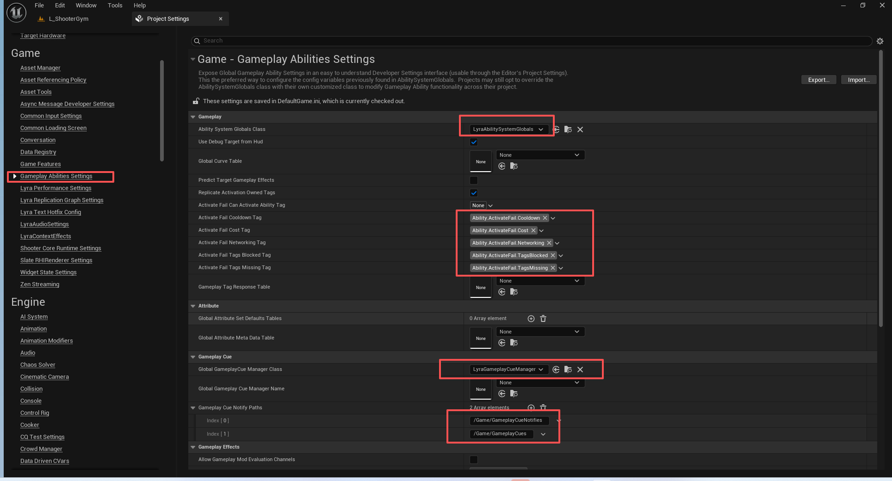
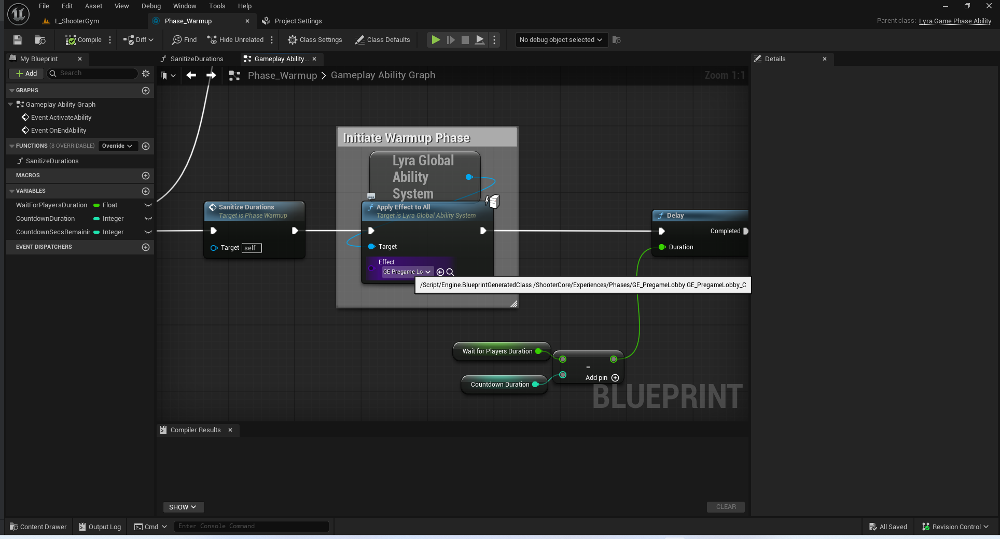

# UE5_Lyra学习指南_080_GAS的架构

本文章仅为小刚-B站课堂-虚幻引擎视频课程Lyra-精讲的演讲手稿.  
本套课程链接:[[UE5]虚幻引擎游戏案例Lyra精讲](https://www.bilibili.com/cheese/play/ss112001159)  
前置课程链接:[[UE5]虚幻引擎UEC++从基础到进阶](https://www.bilibili.com/cheese/play/ss28043)  

文章内容由小刚撰写,采用了以下多种方式:  
1.口述转文字  
2.AI重构  
3.参考引擎源码  
4.Lyra工程源码  
5.结合社区论坛各位大佬的解析  

- [UE5\_Lyra学习指南\_080\_GAS的架构](#ue5_lyra学习指南_080_gas的架构)
	- [概述](#概述)
	- [LyraAbilitySet](#lyraabilityset)
	- [ILyraAbilitySourceInterface](#ilyraabilitysourceinterface)
	- [LyraAbilitySystemComponent](#lyraabilitysystemcomponent)
	- [LyraAbilitySystemGlobals](#lyraabilitysystemglobals)
	- [LyraAbilityTagRelationshipMapping](#lyraabilitytagrelationshipmapping)
	- [LyraGameplayAbilityTargetData\_SingleTargetHit](#lyragameplayabilitytargetdata_singletargethit)
	- [LyraGameplayCueManager](#lyragameplaycuemanager)
	- [LyraGameplayEffectContext](#lyragameplayeffectcontext)
	- [LyraGlobalAbilitySystem](#lyraglobalabilitysystem)
	- [LyraTaggedActor](#lyrataggedactor)
	- [LyraGameplayAbility](#lyragameplayability)
	- [LyraAttributeSet](#lyraattributeset)
	- [GEEC](#geec)
	- [LyraAbilityCost](#lyraabilitycost)
	- [总结](#总结)


## 概述
本章开始讲解GAS系统.
因为UEC++基础教程中已经详细讲解了GAS的架构,包括了基本知识,跳跃技能,近战技能,远程技能,死亡技能,技能消耗,技能冷却,联动背包等功能.
所以本课程不会再阐述基本概念,如什么是ASC,什么是GAS,什么是属性.

## LyraAbilitySet
能力集.前面的章节已经提及过了.
主要是用于管理管理能力的资产定义.
``` cpp

/**
 * FLyraAbilitySet_GameplayAbility
 *
 *	Data used by the ability set to grant gameplay abilities.
 *	该能力集所使用的数据用于赋予游戏中的各种能力。
 */
USTRUCT(BlueprintType)
struct FLyraAbilitySet_GameplayAbility
{
	GENERATED_BODY()

public:

	// Gameplay ability to grant.
	// 授予的游戏能力
	UPROPERTY(EditDefaultsOnly)
	TSubclassOf<ULyraGameplayAbility> Ability = nullptr;

	// Level of ability to grant.
	// 级别
	UPROPERTY(EditDefaultsOnly)
	int32 AbilityLevel = 1;

	// Tag used to process input for the ability.
	// 用以处理输入的Tag
	UPROPERTY(EditDefaultsOnly, Meta = (Categories = "InputTag"))
	FGameplayTag InputTag;
};


/**
 * FLyraAbilitySet_GameplayEffect
 *
 *	Data used by the ability set to grant gameplay effects.
 *  该能力所使用的数据用于赋予游戏效果。
 */
USTRUCT(BlueprintType)
struct FLyraAbilitySet_GameplayEffect
{
	GENERATED_BODY()

public:

	// Gameplay effect to grant.
	// 授予的游戏效果
	UPROPERTY(EditDefaultsOnly)
	TSubclassOf<UGameplayEffect> GameplayEffect = nullptr;

	// Level of gameplay effect to grant.
	// 游戏效果的级别
	UPROPERTY(EditDefaultsOnly)
	float EffectLevel = 1.0f;
};

/**
 * FLyraAbilitySet_AttributeSet
 *
 *	Data used by the ability set to grant attribute sets.
 * 该能力所使用的数据用于生成属性集。
 */
USTRUCT(BlueprintType)
struct FLyraAbilitySet_AttributeSet
{
	GENERATED_BODY()

public:
	// Gameplay effect to grant.
	// 授予的属性集
	UPROPERTY(EditDefaultsOnly)
	TSubclassOf<UAttributeSet> AttributeSet;

};

/**
 * FLyraAbilitySet_GrantedHandles
 *
 *	Data used to store handles to what has been granted by the ability set.
 * 用于存储由能力集所赋予内容的句柄的存储数据。
 */
USTRUCT(BlueprintType)
struct FLyraAbilitySet_GrantedHandles
{
	GENERATED_BODY()

public:

	// 添加GA的句柄
	void AddAbilitySpecHandle(const FGameplayAbilitySpecHandle& Handle);
	
	// 添加GE的句柄
	void AddGameplayEffectHandle(const FActiveGameplayEffectHandle& Handle);

	// 添加的属性集
	void AddAttributeSet(UAttributeSet* Set);

	// 根据句柄容器移除对应的GA,GE,属性集
	void TakeFromAbilitySystem(ULyraAbilitySystemComponent* LyraASC);

protected:

	// Handles to the granted abilities.
	// 容器句柄
	UPROPERTY()
	TArray<FGameplayAbilitySpecHandle> AbilitySpecHandles;

	// Handles to the granted gameplay effects.
	// 容器句柄
	UPROPERTY()
	TArray<FActiveGameplayEffectHandle> GameplayEffectHandles;

	// Pointers to the granted attribute sets
	// 容器句柄
	UPROPERTY()
	TArray<TObjectPtr<UAttributeSet>> GrantedAttributeSets;
};


/**
 * ULyraAbilitySet
 *
 *	Non-mutable data asset used to grant gameplay abilities and gameplay effects.
 *  不可变的数据资产，用于赋予游戏能力及游戏效果。
 */
UCLASS(BlueprintType, Const)
class ULyraAbilitySet : public UPrimaryDataAsset
{
	GENERATED_BODY()

public:

	ULyraAbilitySet(const FObjectInitializer& ObjectInitializer = FObjectInitializer::Get());

	// Grants the ability set to the specified ability system component.
	// The returned handles can be used later to take away anything that was granted.
	// 将指定的能力设置应用到指定的能力系统组件上。
	// 返回的句柄可用于稍后撤销已赋予的任何内容。
	void GiveToAbilitySystem(ULyraAbilitySystemComponent* LyraASC, FLyraAbilitySet_GrantedHandles* OutGrantedHandles, UObject* SourceObject = nullptr) const;

protected:

	// Gameplay abilities to grant when this ability set is granted.
	// 当此能力集被激活时所赋予的游戏玩法能力。
	UPROPERTY(EditDefaultsOnly, Category = "Gameplay Abilities", meta=(TitleProperty=Ability))
	TArray<FLyraAbilitySet_GameplayAbility> GrantedGameplayAbilities;

	// Gameplay effects to grant when this ability set is granted.
	// 当此能力组合被激活时所产生游戏效果。
	UPROPERTY(EditDefaultsOnly, Category = "Gameplay Effects", meta=(TitleProperty=GameplayEffect))
	TArray<FLyraAbilitySet_GameplayEffect> GrantedGameplayEffects;

	// Attribute sets to grant when this ability set is granted.
	// 当此能力集被授予时所赋予的属性组合。
	UPROPERTY(EditDefaultsOnly, Category = "Attribute Sets", meta=(TitleProperty=AttributeSet))
	TArray<FLyraAbilitySet_AttributeSet> GrantedAttributes;
};


```
## ILyraAbilitySourceInterface
这个是用来本项目中去计算伤害距离衰减的接口.
会再GEEC的伤害计算中调用.
``` cpp

/** Base interface for anything acting as a ability calculation source */
/** 任何作为能力计算源的主体的基类接口 */
UINTERFACE()
class ULyraAbilitySourceInterface : public UInterface
{
	GENERATED_UINTERFACE_BODY()
};

class ILyraAbilitySourceInterface
{
	GENERATED_IINTERFACE_BODY()

	/**
	 * Compute the multiplier for effect falloff with distance
	 * 
	 * @param Distance			Distance from source to target for ability calculations (distance bullet traveled for a gun, etc...)
	 * @param SourceTags		Aggregated Tags from the source
	 * @param TargetTags		Aggregated Tags currently on the target
	 * 
	 * @return Multiplier to apply to the base attribute value due to distance
	 */
	/**
	计算与距离相关的衰减效果的乘数值*
	 * @参数 距离	用于能力计算的源点至目标点的距离（例如枪支发射的子弹飞行距离等）
	 * @参数 源标签	来自源点的综合标签
	 * @参数 目标标签	当前作用于目标的综合标签
	 * @返回 由于距离而需应用于基础属性值的乘数
	 * 
	 */
	virtual float GetDistanceAttenuation(float Distance, const FGameplayTagContainer* SourceTags = nullptr, const FGameplayTagContainer* TargetTags = nullptr) const = 0;

	// 这个接口是用来拓展武器击中特定的材质,根据这个材质的Tag来得到一个伤害系数.
	// 在ULyraRangedWeaponInstance写了实现 在GEEC的伤害计算中 调用.
	virtual float GetPhysicalMaterialAttenuation(const UPhysicalMaterial* PhysicalMaterial, const FGameplayTagContainer* SourceTags = nullptr, const FGameplayTagContainer* TargetTags = nullptr) const = 0;
};


```


``` cpp
ULyraAbilitySystemGlobals::ULyraAbilitySystemGlobals(const FObjectInitializer& ObjectInitializer)
	: Super(ObjectInitializer)
{
}

FGameplayEffectContext* ULyraAbilitySystemGlobals::AllocGameplayEffectContext() const
{
	return new FLyraGameplayEffectContext();
}

```

## LyraAbilitySystemComponent

``` cpp

/**
 * ULyraAbilitySystemComponent
 *
 *	Base ability system component class used by this project.
 * 本项目所使用的基础能力系统组件类。
 *	
 */
UCLASS(MinimalAPI)
class ULyraAbilitySystemComponent : public UAbilitySystemComponent
{
	GENERATED_BODY()

public:
	// 构造函数 初始化成员变量
	UE_API ULyraAbilitySystemComponent(const FObjectInitializer& ObjectInitializer = FObjectInitializer::Get());

	//~UActorComponent interface
	// 在项目定义的全局GAS系统中取消该对象的注册
	UE_API virtual void EndPlay(const EEndPlayReason::Type EndPlayReason) override;
	//~End of UActorComponent interface
	/**
	 * 初始化了“能力”对象的“角色信息”——这是一个用于保存有关我们所作用对象以及控制我们的人的信息的结构。
	 * 主控角色是实际拥有此组件的实体。
	 * 虚拟角色是我们在现实世界中所扮演的物理角色。通常是一个兵兵（Pawn），但也可能是塔（Tower）、建筑（Building）、炮塔（Turret）等，可能与主控角色相同。
	 * 
	 */
	UE_API virtual void InitAbilityActorInfo(AActor* InOwnerActor, AActor* InAvatarActor) override;

	// 根据传入的函数 来判断当前的能力是否需要取消
	typedef TFunctionRef<bool(const ULyraGameplayAbility* LyraAbility, FGameplayAbilitySpecHandle Handle)> TShouldCancelAbilityFunc;
	UE_API void CancelAbilitiesByFunc(TShouldCancelAbilityFunc ShouldCancelFunc, bool bReplicateCancelAbility);

	// 取消那些由输入激活的能力
	UE_API void CancelInputActivatedAbilities(bool bReplicateCancelAbility);

	// 根据增强型输入系统通过Hero组件传递过来的输入资产Tag来添加按下和释放的句柄
	UE_API void AbilityInputTagPressed(const FGameplayTag& InputTag);
	UE_API void AbilityInputTagReleased(const FGameplayTag& InputTag);

	// 通过玩家控制器处理输入调用 ,每帧去处理输入Tag句柄的容器
	UE_API void ProcessAbilityInput(float DeltaTime, bool bGamePaused);
	// 清理所有输入的句柄
	UE_API void ClearAbilityInput();

	// 判断传入的这个类别的能力是否可以激活 由GA调用
	UE_API bool IsActivationGroupBlocked(ELyraAbilityActivationGroup Group) const;
	// 将该能力的类别计数进行增加验证 由GA调用
	UE_API void AddAbilityToActivationGroup(ELyraAbilityActivationGroup Group, ULyraGameplayAbility* LyraAbility);
	// 将该能力的类别计数进行移除验证 由GA调用
	UE_API void RemoveAbilityFromActivationGroup(ELyraAbilityActivationGroup Group, ULyraGameplayAbility* LyraAbility);
	// 根据类别去取消之前冲突的能力
	UE_API void CancelActivationGroupAbilities(ELyraAbilityActivationGroup Group, ULyraGameplayAbility* IgnoreLyraAbility, bool bReplicateCancelAbility);

	// Uses a gameplay effect to add the specified dynamic granted tag.
	// 使用游戏玩法效果来添加指定的动态授予标签。
	UE_API void AddDynamicTagGameplayEffect(const FGameplayTag& Tag);

	// Removes all active instances of the gameplay effect that was used to add the specified dynamic granted tag.
	// 清除所有使用指定动态授予标签来添加游戏效果时所激活的实例。
	UE_API void RemoveDynamicTagGameplayEffect(const FGameplayTag& Tag);

	/** Gets the ability target data associated with the given ability handle and activation info */
	/** 获取与给定能力标识符及激活信息相关联的能力目标数据 */
	// 主要用户获取能力激活的上下文 是否有命中对象等等
	UE_API void GetAbilityTargetData(const FGameplayAbilitySpecHandle AbilityHandle, FGameplayAbilityActivationInfo ActivationInfo, FGameplayAbilityTargetDataHandle& OutTargetDataHandle);

	/** Sets the current tag relationship mapping, if null it will clear it out */
	/** 设置当前的标签关系映射，如果为 null，则会将其清除 */
	UE_API void SetTagRelationshipMapping(ULyraAbilityTagRelationshipMapping* NewMapping);
	
	/** Looks at ability tags and gathers additional required and blocking tags */\
	/** 查看能力标签，并收集所需的附加标签和阻碍性标签 */
	// 通过TagRelationship来收集 来确认当前能力是否可以释放!
	UE_API void GetAdditionalActivationTagRequirements(const FGameplayTagContainer& AbilityTags,
		FGameplayTagContainer& OutActivationRequired,
		FGameplayTagContainer& OutActivationBlocked) const;

	// 尝试激活出生时应当使用的能力
	// 需要对应的能力类型为生成时激活
	UE_API void TryActivateAbilitiesOnSpawn();

protected:
	/** 对于本地玩家始终会调用此方法。若游戏能力中设置了“bReplicateInputDirectly”标志，则在服务器端也会调用此方法。*/
	UE_API virtual void AbilitySpecInputPressed(FGameplayAbilitySpec& Spec) override;
	/** 对于本地玩家始终会调用此方法。若游戏能力中设置了“bReplicateInputDirectly”标志，则在服务器端也会调用此方法。*/
	UE_API virtual void AbilitySpecInputReleased(FGameplayAbilitySpec& Spec) override;

	// 能力激活时通知 添加到能力类别里面
	UE_API virtual void NotifyAbilityActivated(const FGameplayAbilitySpecHandle Handle, UGameplayAbility* Ability) override;
	// 能力激活失败时通知 根据情况是否需要通知给其他客户端
	UE_API virtual void NotifyAbilityFailed(const FGameplayAbilitySpecHandle Handle, UGameplayAbility* Ability, const FGameplayTagContainer& FailureReason) override;
	// 能力结束时通知 从能力类别中移除
	UE_API virtual void NotifyAbilityEnded(FGameplayAbilitySpecHandle Handle, UGameplayAbility* Ability, bool bWasCancelled) override;

	// 重写的方法 主要是把我们自定义的TagRelationshipMapping嵌入引擎的流程中
	UE_API virtual void ApplyAbilityBlockAndCancelTags(const FGameplayTagContainer& AbilityTags,
		UGameplayAbility* RequestingAbility, bool bEnableBlockTags, const FGameplayTagContainer& BlockTags,
		bool bExecuteCancelTags, const FGameplayTagContainer& CancelTags) override;
	// 无
	UE_API virtual void HandleChangeAbilityCanBeCanceled(const FGameplayTagContainer& AbilityTags, UGameplayAbility* RequestingAbility, bool bCanBeCanceled) override;

	/** Notify client that an ability failed to activate */
	/** 向客户端通知某项能力未能激活 */
	UFUNCTION(Client, Unreliable)
	UE_API void ClientNotifyAbilityFailed(const UGameplayAbility* Ability, const FGameplayTagContainer& FailureReason);
	// 实际执行某些能力未能激活
	UE_API void HandleAbilityFailed(const UGameplayAbility* Ability, const FGameplayTagContainer& FailureReason);
protected:

	// If set, this table is used to look up tag relationships for activate and cancel
	// 若已设置，此表用于查找激活和取消操作的标签关系
	UPROPERTY()
	TObjectPtr<ULyraAbilityTagRelationshipMapping> TagRelationshipMapping;

	// Handles to abilities that had their input pressed this frame.
	// 本帧中已按下输入的技能句柄。
	TArray<FGameplayAbilitySpecHandle> InputPressedSpecHandles;

	// Handles to abilities that had their input released this frame.
	// 当前帧中已解除输入的技能的处理指针。
	TArray<FGameplayAbilitySpecHandle> InputReleasedSpecHandles;

	// Handles to abilities that have their input held.
	// 持有输入操作的技能的处理程序。
	TArray<FGameplayAbilitySpecHandle> InputHeldSpecHandles;

	// Number of abilities running in each activation group.
	// 每个激活组中运行的能力数量。
	int32 ActivationGroupCounts[(uint8)ELyraAbilityActivationGroup::MAX];
};
```
## LyraAbilitySystemGlobals
DefaultGame.ini
``` ini

[/Script/GameplayAbilities.AbilitySystemGlobals]
; GAS的全局数据类
AbilitySystemGlobalsClassName=/Script/LyraGame.LyraAbilitySystemGlobals
; 使用HUD下的调试目标
bUseDebugTargetFromHud=True
; 存储有关有效属性的最小值、最大值以及堆叠规则的信息
GlobalAttributeMetaDataTableName=None
; 视觉特效指定所使用的类
GlobalGameplayCueManagerClass=/Script/LyraGame.LyraGameplayCueManager
; 管理类是使用的名字
GlobalGameplayCueManagerName=None
; 视觉特效的路径
+GameplayCueNotifyPaths=/Game/GameplayCueNotifies
; 视觉特效的路径
+GameplayCueNotifyPaths=/Game/GameplayCues
; 用于可缩放浮点数等的全局曲线表的名称，作为默认值。
GlobalCurveTableName=None
; 如果希望客户端尝试预测对目标所施加的游戏效果，则将此值设为“真”；若为“假”，则仅预测自身效果。
PredictTargetGameplayEffects=False
; 如果您希望从能力激活操作中授予的标签能够被复制给所有者，则将此设置为“真”。若为“假”，则激活所属标签仅在本地生效。
; 此设置仅应针对依赖于非复制激活所属标签的旧版游戏代码而禁用。
ReplicateActivationOwnedTags=True
; 尝试激活失败，因为正处于冷却时间内。
ActivateFailCooldownTag=(TagName="Ability.ActivateFail.Cooldown")
; 尝试激活失败，原因是无法支付费用。
ActivateFailCostTag=(TagName="Ability.ActivateFail.Cost")
; 由于网络设置无效，激活失败，这是设计错误。
ActivateFailNetworkingTag=(TagName="Ability.ActivateFail.Networking")
; 尝试激活失败，因为被其他能力所阻止。
ActivateFailTagsBlockedTag=(TagName="Ability.ActivateFail.TagsBlocked")
; 尝试激活失败，因为缺少必需的标签。
ActivateFailTagsMissingTag=(TagName="Ability.ActivateFail.TagsMissing")
; 要实例化的类为“GameplayTagResponseTable”。
GameplayTagResponseTableName=None
; 这款游戏是否应该允许使用游戏玩法评估渠道这一做法是否恰当
bAllowGameplayModEvaluationChannels=False
; 该游戏的默认模组评估通道
DefaultGameplayModEvaluationChannel=Channel0
; 针对游戏的特定命名别名，用于游戏玩法模组评估通道；只有拥有有效别名的通道才可在游戏中使用（除了通道 0，其始终有效）
GameplayModEvaluationChannelAliases[0]=None
GameplayModEvaluationChannelAliases[1]=None
GameplayModEvaluationChannelAliases[2]=None
GameplayModEvaluationChannelAliases[3]=None
GameplayModEvaluationChannelAliases[4]=None
GameplayModEvaluationChannelAliases[5]=None
GameplayModEvaluationChannelAliases[6]=None
GameplayModEvaluationChannelAliases[7]=None
GameplayModEvaluationChannelAliases[8]=None
GameplayModEvaluationChannelAliases[9]=None
; 在 FMinimalReplicationTagCountMap::NetSerialize 中，“标签数量”应使用多少位？
MinimalReplicationTagCountBits=5
```

``` cpp
/** 保存能力系统的所有全局数据。配置工作通过“开发者设置”中的“项目 -> 游戏能力设置”来完成  */
// 非常重要 必须指定FLyraGameplayEffectContext!!!如果不指定在LS打包后出现莫名其妙的网络bug或崩溃!!!!
UCLASS(Config=Game)
class ULyraAbilitySystemGlobals : public UAbilitySystemGlobals
{
	GENERATED_UCLASS_BODY()

	//~UAbilitySystemGlobals interface
	virtual FGameplayEffectContext* AllocGameplayEffectContext() const override;
	//~End of UAbilitySystemGlobals interface
};

```

## LyraAbilityTagRelationshipMapping
``` cpp
/** Struct that defines the relationship between different ability tags */
/** 定义不同能力标签之间关系的结构体 */
USTRUCT()
struct FLyraAbilityTagRelationship
{
	GENERATED_BODY()

	/** The tag that this container relationship is about. Single tag, but abilities can have multiple of these */
	/** 此容器关系所涉及的标签。单个标签，但某些功能可以有多个此类标签 */
	UPROPERTY(EditAnywhere, Category = Ability, meta = (Categories = "Gameplay.Action"))
	FGameplayTag AbilityTag;

	/** The other ability tags that will be blocked by any ability using this tag */
	/** 任何使用此标签的能力都会屏蔽的其他能力标签 */
	UPROPERTY(EditAnywhere, Category = Ability)
	FGameplayTagContainer AbilityTagsToBlock;

	/** The other ability tags that will be canceled by any ability using this tag */
	/** 任何使用此标签的技能都会取消的其他能力标签 */
	UPROPERTY(EditAnywhere, Category = Ability)
	FGameplayTagContainer AbilityTagsToCancel;

	/** If an ability has the tag, this is implicitly added to the activation required tags of the ability */
	/** 如果某个能力带有特定标签，那么该标签会自动添加到该能力所需的激活条件标签列表中 */
	UPROPERTY(EditAnywhere, Category = Ability)
	FGameplayTagContainer ActivationRequiredTags;

	/** If an ability has the tag, this is implicitly added to the activation blocked tags of the ability */
	/** 如果某个能力带有该标签，则该标签会自动添加到该能力的激活受阻标签列表中 */
	UPROPERTY(EditAnywhere, Category = Ability)
	FGameplayTagContainer ActivationBlockedTags;
};


/** Mapping of how ability tags block or cancel other abilities */
/** 描述能力标签如何阻止或取消其他能力的映射关系 */
UCLASS()
class ULyraAbilityTagRelationshipMapping : public UDataAsset
{
	GENERATED_BODY()

private:
	/** The list of relationships between different gameplay tags (which ones block or cancel others) */
	/** 不同游戏玩法标签之间的关系列表（哪些标签会阻止或取消其他标签的作用） */
	UPROPERTY(EditAnywhere, Category = Ability, meta=(TitleProperty="AbilityTag"))
	TArray<FLyraAbilityTagRelationship> AbilityTagRelationships;

public:
	/** Given a set of ability tags, parse the tag relationship and fill out tags to block and cancel */
	/** 给定一组能力标签，解析标签之间的关系，并填写出用于阻止和取消的操作标签 */
	// AbilityTags会阻塞那些Tag
	// AbilityTags会取消那些Tag
	void GetAbilityTagsToBlockAndCancel(const FGameplayTagContainer& AbilityTags, FGameplayTagContainer* OutTagsToBlock, FGameplayTagContainer* OutTagsToCancel) const;

	/** Given a set of ability tags, add additional required and blocking tags */
	/** 给定一组能力标签，添加额外的必填标签和限制标签 */
	// AbilityTags激活需要哪些tag
	// AbilityTags会被那些tag所阻塞
	void GetRequiredAndBlockedActivationTags(const FGameplayTagContainer& AbilityTags, FGameplayTagContainer* OutActivationRequired, FGameplayTagContainer* OutActivationBlocked) const;

	/** Returns true if the specified ability tags are canceled by the passed in action tag */
	/** 如果指定的能力标签被传入的动作标签取消，则返回 true */
	// ActionTag是否会被AbilityTags所取消
	bool IsAbilityCancelledByTag(const FGameplayTagContainer& AbilityTags, const FGameplayTag& ActionTag) const;
};


```
## LyraGameplayAbilityTargetData_SingleTargetHit
这个结构体需要在定义武器射击基类的时候进行网络传递命中结果.
``` cpp
/**
*	目标数据处理器。此组件有两个主要用途：
*		- 使我们无需在蓝图中复制整个目标数据结构
*		- 允许我们利用目标数据结构的多态性
*		- 使我们能够通过值形式在客户端/服务器之间实现网络序列化和复制*
*		避免使用 UObjects 可以让我们实现多态性，并且通过引用传递的方式在蓝图中实现这一点。
*		然而，当涉及到复制操作时，我们还是会陷入困境。*
*		- 值的复制
*		- 在蓝图中通过引用传递
*		- 目标数据结构中的多态性*/
```

``` cpp
/**
*	Handle for Targeting Data. This servers two main purposes:
*		-Avoid us having to copy around the full targeting data structure in Blueprints
*		-Allows us to leverage polymorphism in the target data structure
*		-Allows us to implement NetSerialize and replicate by value between clients/server
*
*		-Avoid using UObjects could be used to give us polymorphism and by reference passing in blueprints.
*		-However we would still be screwed when it came to replication
*
*		-Replication by value
*		-Pass by reference in blueprints
*		-Polymophism in TargetData structure
*/
USTRUCT(BlueprintType)
struct FGameplayAbilityTargetDataHandle
{
	GENERATED_USTRUCT_BODY()
}

```

``` cpp
/** Game-specific additions to SingleTargetHit tracking */
/** 与单目标命中追踪相关的游戏特定附加功能 */
USTRUCT()
struct FLyraGameplayAbilityTargetData_SingleTargetHit : public FGameplayAbilityTargetData_SingleTargetHit
{
	GENERATED_BODY()

	FLyraGameplayAbilityTargetData_SingleTargetHit()
		: CartridgeID(-1)
	{ }

	virtual void AddTargetDataToContext(FGameplayEffectContextHandle& Context, bool bIncludeActorArray) const override;

	/** ID to allow the identification of multiple bullets that were part of the same cartridge */
	/** 用于标识属于同一发子弹组的多枚子弹的编号 */
	UPROPERTY()
	int32 CartridgeID;

	// 补充序列化CartridgeID
	bool NetSerialize(FArchive& Ar, class UPackageMap* Map, bool& bOutSuccess);

	virtual UScriptStruct* GetScriptStruct() const override
	{
		return FLyraGameplayAbilityTargetData_SingleTargetHit::StaticStruct();
	}
};

template<>
struct TStructOpsTypeTraits<FLyraGameplayAbilityTargetData_SingleTargetHit> : public TStructOpsTypeTraitsBase2<FLyraGameplayAbilityTargetData_SingleTargetHit>
{
	enum
	{
		WithNetSerializer = true	// For now this is REQUIRED for FGameplayAbilityTargetDataHandle net serialization to work
		// 目前，这是实现 FGameplayAbilityTargetDataHandle 的网络序列化所必需的条件
	};
};


```

## LyraGameplayCueManager
已在前面的章节完全讲解完毕.
``` cpp
/** 单例管理对象，负责根据需要调度游戏提示并生成 GameplayCueNotify 角色实例 */
/**
 * ULyraGameplayCueManager
 *
 * Game-specific manager for gameplay cues
 * 专门针对游戏玩法提示的管理工具
 */
UCLASS()
class ULyraGameplayCueManager : public UGameplayCueManager
{
	GENERATED_BODY()

public:
	// 构造函数
	ULyraGameplayCueManager(const FObjectInitializer& ObjectInitializer = FObjectInitializer::Get());
}
```

## LyraGameplayEffectContext

这里需要考虑类似一个深拷贝和浅拷贝的概念.

注意这个Duplicate的调用时机.

``` cpp


TArray<FActiveGameplayEffectHandle> FGameplayAbilityTargetData::ApplyGameplayEffectSpec(FGameplayEffectSpec& InSpec, FPredictionKey PredictionKey)
{
	TArray<FActiveGameplayEffectHandle>	AppliedHandles;

	if (!ensure(InSpec.GetContext().IsValid() && InSpec.GetContext().GetInstigatorAbilitySystemComponent()))
	{
		return AppliedHandles;
	}

	TArray<TWeakObjectPtr<AActor> > Actors = GetActors();
	
	AppliedHandles.Reserve(Actors.Num());

	for (TWeakObjectPtr<AActor>& TargetActor : Actors)
	{
		UAbilitySystemComponent* TargetComponent = UAbilitySystemBlueprintLibrary::GetAbilitySystemComponent(TargetActor.Get());

		if (TargetComponent)
		{
			// We have to make a new effect spec and context here, because otherwise the targeting info gets accumulated and things take damage multiple times
			// 我们必须在此处制定一个新的效果规格和相关参数，否则目标信息将会累积，导致角色受到多次伤害。
			FGameplayEffectSpec	SpecToApply(InSpec);
			FGameplayEffectContextHandle EffectContext = SpecToApply.GetContext().Duplicate();
			SpecToApply.SetContext(EffectContext);

			AddTargetDataToContext(EffectContext, false);

			AppliedHandles.Add(EffectContext.GetInstigatorAbilitySystemComponent()->ApplyGameplayEffectSpecToTarget(SpecToApply, TargetComponent, PredictionKey));
		}
	}

	return AppliedHandles;
}
```
``` cpp
/**
 * Handle that wraps a FGameplayEffectContext or subclass, to allow it to be polymorphic and replicate properly
 “Handle”用于封装一个“FGameplayEffectContext”对象或其子类，以便使其具有多态性并能够正确地进行复制。
 */
USTRUCT(BlueprintType)
struct FGameplayEffectContextHandle
{
	GENERATED_USTRUCT_BODY()

	/** Creates a deep copy of this handle, used before modifying */
	FGameplayEffectContextHandle Duplicate() const
	{
		if (IsValid())
		{
			FGameplayEffectContext* NewContext = Data->Duplicate();
			return FGameplayEffectContextHandle(NewContext);
		}
		else
		{
			return FGameplayEffectContextHandle();
		}
	}
}

```
``` cpp
/**
 * Data structure that stores an instigator and related data, such as positions and targets
 * Games can subclass this structure and add game-specific information
 * It is passed throughout effect execution so it is a great place to track transient information about an execution

 * 用于存储发起者及相关数据（如位置和目标）的数据结构
* 游戏可以对该结构进行子类化，并添加特定于游戏的信息
* 它在整个效果执行过程中都会被传递，因此是一个很好的地方来跟踪与执行相关的临时信息
 */
USTRUCT()
struct FGameplayEffectContext
{
	/** Creates a copy of this context, used to duplicate for later modifications */
	virtual FGameplayEffectContext* Duplicate() const
	{
		FGameplayEffectContext* NewContext = new FGameplayEffectContext();
		*NewContext = *this;
		if (GetHitResult())
		{
			// Does a deep copy of the hit result
			NewContext->AddHitResult(*GetHitResult(), true);
		}
		return NewContext;
	}
}
```

``` cpp
/**
 * FGameplayEffectContext
 * 用于存储发起者及相关数据（如位置和目标）的数据结构
 * 游戏可以对该结构进行子类化，并添加特定于游戏的信息
 * 它在整个效果执行过程中被传递，因此是跟踪执行过程中临时信息的理想位置
 * 
 */
USTRUCT()
struct FLyraGameplayEffectContext : public FGameplayEffectContext
{
	GENERATED_BODY()

	FLyraGameplayEffectContext()
		: FGameplayEffectContext()
	{
	}

	FLyraGameplayEffectContext(AActor* InInstigator, AActor* InEffectCauser)
		: FGameplayEffectContext(InInstigator, InEffectCauser)
	{
	}

	/** Returns the wrapped FLyraGameplayEffectContext from the handle, or nullptr if it doesn't exist or is the wrong type */
	/** 返回由该句柄所对应的封装的 FLyraGameplayEffectContext 对象，若该对象不存在或类型错误，则返回 nullptr */
	static LYRAGAME_API FLyraGameplayEffectContext* ExtractEffectContext(struct FGameplayEffectContextHandle Handle);

	/** Sets the object used as the ability source */
	/** 设置用作能力来源的对象 */
	void SetAbilitySource(const ILyraAbilitySourceInterface* InObject, float InSourceLevel);

	/** Returns the ability source interface associated with the source object. Only valid on the authority. */
	/** 返回与源对象相关联的能力来源接口。仅在权限范围内有效。*/
	const ILyraAbilitySourceInterface* GetAbilitySource() const;

	// 类似于深拷贝 在对多个目标应用GE时,需要为每一个目标创建各自的上下文,这样是为了避免复用同一个上下文,导致的目标信息累计,如伤害累计等.
	/** 创建此上下文的副本，用于后续的修改操作的复制使用 */
	virtual FGameplayEffectContext* Duplicate() const override
	{
		FLyraGameplayEffectContext* NewContext = new FLyraGameplayEffectContext();
		*NewContext = *this;
		if (GetHitResult())
		{
			// Does a deep copy of the hit result
			// 对命中结果进行深度复制
			NewContext->AddHitResult(*GetHitResult(), true);
		}
		return NewContext;
	}
	/** 返回用于序列化的实际结构体，子类必须在此方法中进行重写！*/
	virtual UScriptStruct* GetScriptStruct() const override
	{
		return FLyraGameplayEffectContext::StaticStruct();
	}

	/** Overridden to serialize new fields */
	/** 重写此方法以对新字段进行序列化 */
	virtual bool NetSerialize(FArchive& Ar, class UPackageMap* Map, bool& bOutSuccess) override;

	/** Returns the physical material from the hit result if there is one */
	/** 如果命中结果中存在物理材质，则返回该物理材质 */
	const UPhysicalMaterial* GetPhysicalMaterial() const;

public:
	/** ID to allow the identification of multiple bullets that were part of the same cartridge */
	/** 用于标识属于同一发子弹组的多枚子弹的编号 */
	UPROPERTY()
	int32 CartridgeID = -1;

protected:
	/** Ability Source object (should implement ILyraAbilitySourceInterface). NOT replicated currently */
	/** 能力来源对象（应实现 ILyraAbilitySource 接口）。目前尚未进行复制操作 */
	UPROPERTY()
	TWeakObjectPtr<const UObject> AbilitySourceObject;
};

template<>
struct TStructOpsTypeTraits<FLyraGameplayEffectContext> : public TStructOpsTypeTraitsBase2<FLyraGameplayEffectContext>
{
	enum
	{
		WithNetSerializer = true,
		WithCopy = true
	};
};

```

## LyraGlobalAbilitySystem
一个简单的对象池设计.
方便我们对于全局对象施加技能或者效果.
比如过场阶段全局无敌!


``` cpp

USTRUCT()
struct FGlobalAppliedAbilityList
{
	GENERATED_BODY()

	UPROPERTY()
	TMap<TObjectPtr<ULyraAbilitySystemComponent>, FGameplayAbilitySpecHandle> Handles;

	void AddToASC(TSubclassOf<UGameplayAbility> Ability, ULyraAbilitySystemComponent* ASC);
	void RemoveFromASC(ULyraAbilitySystemComponent* ASC);
	void RemoveFromAll();
};

USTRUCT()
struct FGlobalAppliedEffectList
{
	GENERATED_BODY()

	UPROPERTY()
	TMap<TObjectPtr<ULyraAbilitySystemComponent>, FActiveGameplayEffectHandle> Handles;

	void AddToASC(TSubclassOf<UGameplayEffect> Effect, ULyraAbilitySystemComponent* ASC);
	void RemoveFromASC(ULyraAbilitySystemComponent* ASC);
	void RemoveFromAll();
};

UCLASS()
class ULyraGlobalAbilitySystem : public UWorldSubsystem
{
	GENERATED_BODY()

public:
	ULyraGlobalAbilitySystem();

	UFUNCTION(BlueprintCallable, BlueprintAuthorityOnly, Category="Lyra")
	void ApplyAbilityToAll(TSubclassOf<UGameplayAbility> Ability);

	UFUNCTION(BlueprintCallable, BlueprintAuthorityOnly, Category="Lyra")
	void ApplyEffectToAll(TSubclassOf<UGameplayEffect> Effect);

	UFUNCTION(BlueprintCallable, BlueprintAuthorityOnly, Category = "Lyra")
	void RemoveAbilityFromAll(TSubclassOf<UGameplayAbility> Ability);

	UFUNCTION(BlueprintCallable, BlueprintAuthorityOnly, Category = "Lyra")
	void RemoveEffectFromAll(TSubclassOf<UGameplayEffect> Effect);

	/** Register an ASC with global system and apply any active global effects/abilities. */
	void RegisterASC(ULyraAbilitySystemComponent* ASC);

	/** Removes an ASC from the global system, along with any active global effects/abilities. */
	/** 从全局系统中移除一个 ASC（即“高级技能”），并清除其任何正在生效的全局效果/能力。*/
	void UnregisterASC(ULyraAbilitySystemComponent* ASC);

private:
	UPROPERTY()
	TMap<TSubclassOf<UGameplayAbility>, FGlobalAppliedAbilityList> AppliedAbilities;

	UPROPERTY()
	TMap<TSubclassOf<UGameplayEffect>, FGlobalAppliedEffectList> AppliedEffects;

	UPROPERTY()
	TArray<TObjectPtr<ULyraAbilitySystemComponent>> RegisteredASCs;
};

```

## LyraTaggedActor
``` cpp
// An actor that implements the gameplay tag asset interface
// 一个实现了游戏玩法标签资源接口的演员类
// 主要用于换装的时候标明性别,体型等.
UCLASS()
class ALyraTaggedActor : public AActor, public IGameplayTagAssetInterface
{
	GENERATED_BODY()

public:

	ALyraTaggedActor(const FObjectInitializer& ObjectInitializer = FObjectInitializer::Get());

	//~IGameplayTagAssetInterface
	virtual void GetOwnedGameplayTags(FGameplayTagContainer& TagContainer) const override;
	//~End of IGameplayTagAssetInterface

	//~UObject interface
#if WITH_EDITOR
	virtual bool CanEditChange(const FProperty* InProperty) const override;
#endif
	//~End of UObject interface

protected:
	// Gameplay-related tags associated with this actor
	// 与该角色相关的游戏玩法相关标签
	UPROPERTY(EditAnywhere, BlueprintReadOnly, Category=Actor)
	FGameplayTagContainer StaticGameplayTags;
};

```
## LyraGameplayAbility
``` cpp
/**
 * ELyraAbilityActivationPolicy
 *
 *	Defines how an ability is meant to activate.
 *	定义了该能力应如何被激活的方式。
 */
UENUM(BlueprintType)
enum class ELyraAbilityActivationPolicy : uint8
{
	// Try to activate the ability when the input is triggered.
	// 在输入被触发时尝试激活该能力。
	OnInputTriggered,

	// Continually try to activate the ability while the input is active.
	// 在输入处于激活状态时，持续尝试激活该能力。
	WhileInputActive,

	// Try to activate the ability when an avatar is assigned.
	// 当为角色分配了形象时，尝试激活该能力。
	OnSpawn
};


/**
 * ELyraAbilityActivationGroup
 *
 *	Defines how an ability activates in relation to other abilities.
 * 定义了某一能力与其他能力激活方式之间的关系。
 *	
 */
UENUM(BlueprintType)
enum class ELyraAbilityActivationGroup : uint8
{
	// Ability runs independently of all other abilities.
	// 能力是独立于其他所有能力存在的。
	Independent,

	// Ability is canceled and replaced by other exclusive abilities.
	// 能力被取消，并被其他独特的能力所取代。
	Exclusive_Replaceable,

	// Ability blocks all other exclusive abilities from activating.
	// 该技能会阻止其他所有特殊能力的激活。
	Exclusive_Blocking,

	MAX	UMETA(Hidden)
};

/** Failure reason that can be used to play an animation montage when a failure occurs */
/** 可用于在出现故障时播放动画剪辑的故障原因 */
USTRUCT(BlueprintType)
struct FLyraAbilityMontageFailureMessage
{
	GENERATED_BODY()

public:
	// Player controller that failed to activate the ability, if the AbilitySystemComponent was player owned
	// 如果拥有能力系统的组件属于玩家所有，而玩家控制器未能激活该能力的话
	UPROPERTY(BlueprintReadWrite)
	TObjectPtr<APlayerController> PlayerController = nullptr;

	// Avatar actor that failed to activate the ability
	// 虚拟角色未能激活该能力
	UPROPERTY(BlueprintReadWrite)
	TObjectPtr<AActor> AvatarActor = nullptr;

	// All the reasons why this ability has failed
	// 这种能力未能发挥作用的所有原因
	UPROPERTY(BlueprintReadWrite)
	FGameplayTagContainer FailureTags;

	// 失败可以用于播放的蒙太奇
	UPROPERTY(BlueprintReadWrite)
	TObjectPtr<UAnimMontage> FailureMontage = nullptr;
};

/**
 * ULyraGameplayAbility
 *
 *	The base gameplay ability class used by this project.
 *	Lyra项目使用的基础GA
 */
UCLASS(MinimalAPI, Abstract, HideCategories = Input, Meta = (ShortTooltip = "The base gameplay ability class used by this project."))
class ULyraGameplayAbility : public UGameplayAbility
{
	GENERATED_BODY()
	// 友元ASC 方便一些内部方法仅限ASC调用转发
	friend class ULyraAbilitySystemComponent;

public:
	// 构造函数 极其重要
	UE_API ULyraGameplayAbility(const FObjectInitializer& ObjectInitializer = FObjectInitializer::Get());

	// 获取ASC
	UFUNCTION(BlueprintCallable, Category = "Lyra|Ability")
	UE_API ULyraAbilitySystemComponent* GetLyraAbilitySystemComponentFromActorInfo() const;

	// 获取玩家控制器
	UFUNCTION(BlueprintCallable, Category = "Lyra|Ability")
	UE_API ALyraPlayerController* GetLyraPlayerControllerFromActorInfo() const;

	// 获取控制器
	UFUNCTION(BlueprintCallable, Category = "Lyra|Ability")
	UE_API AController* GetControllerFromActorInfo() const;

	// 获取角色类
	UFUNCTION(BlueprintCallable, Category = "Lyra|Ability")
	UE_API ALyraCharacter* GetLyraCharacterFromActorInfo() const;

	// 获取英雄组件
	UFUNCTION(BlueprintCallable, Category = "Lyra|Ability")
	UE_API ULyraHeroComponent* GetHeroComponentFromActorInfo() const;

	// 获取GA的激活策略
	ELyraAbilityActivationPolicy GetActivationPolicy() const { return ActivationPolicy; }
	// 获取GA的激活组类别
	ELyraAbilityActivationGroup GetActivationGroup() const { return ActivationGroup; }

	// 在ASC初始化之后调用,尝试激活生成时就需要激活的能力
	UE_API void TryActivateAbilityOnSpawn(const FGameplayAbilityActorInfo* ActorInfo, const FGameplayAbilitySpec& Spec) const;

	// Returns true if the requested activation group is a valid transition.
	// 若所请求的激活组为有效的转换，则返回 true 。
	// 仅在死亡能力激活时中调用
	UFUNCTION(BlueprintCallable, BlueprintPure = false, Category = "Lyra|Ability", Meta = (ExpandBoolAsExecs = "ReturnValue"))
	UE_API bool CanChangeActivationGroup(ELyraAbilityActivationGroup NewGroup) const;

	// Tries to change the activation group.  Returns true if it successfully changed.
	// 尝试更改激活组。若成功更改则返回 true 。
	// 仅在死亡能力激活中调用 主要时为了阻塞其他的可替换和阻塞能力
	UFUNCTION(BlueprintCallable, BlueprintPure = false, Category = "Lyra|Ability", Meta = (ExpandBoolAsExecs = "ReturnValue"))
	UE_API bool ChangeActivationGroup(ELyraAbilityActivationGroup NewGroup);

	// Sets the ability's camera mode.
	// 设置该能力的摄像机模式。
	UFUNCTION(BlueprintCallable, Category = "Lyra|Ability")
	UE_API void SetCameraMode(TSubclassOf<ULyraCameraMode> CameraMode);

	// Clears the ability's camera mode.  Automatically called if needed when the ability ends.
	// 清除该能力的摄像模式。当该能力结束时，若有必要则会自动执行此操作。
	UFUNCTION(BlueprintCallable, Category = "Lyra|Ability")
	UE_API void ClearCameraMode();

	// 接收ASC的转发 能力激活失败了
	void OnAbilityFailedToActivate(const FGameplayTagContainer& FailedReason) const
	{
		NativeOnAbilityFailedToActivate(FailedReason);
		ScriptOnAbilityFailedToActivate(FailedReason);
	}

protected:

	// Called when the ability fails to activate
	// 当该能力无法激活时触发此事件
	UE_API virtual void NativeOnAbilityFailedToActivate(const FGameplayTagContainer& FailedReason) const;

	// Called when the ability fails to activate
	// 当该能力无法激活时触发此事件
	UFUNCTION(BlueprintImplementableEvent)
	UE_API void ScriptOnAbilityFailedToActivate(const FGameplayTagContainer& FailedReason) const;

	//~UGameplayAbility interface

	/** 如果此能力当前可以激活，则返回 true。此操作不会产生任何副作用 */
	// 主要是添加了我们的策略组判定
	UE_API virtual bool CanActivateAbility(const FGameplayAbilitySpecHandle Handle, const FGameplayAbilityActorInfo* ActorInfo,
		const FGameplayTagContainer* SourceTags, const FGameplayTagContainer* TargetTags, FGameplayTagContainer* OptionalRelevantTags) const override;
	
	/** 设置该能力是否应忽略取消请求。仅适用于实例化能力 */
	// 如果当前策略组是可替换的,则只能设置为可以被取消
	UE_API virtual void SetCanBeCanceled(bool bCanBeCanceled) override;
	
	/** 当该能力被赋予给“能力系统组件”时会调用此函数 */
	// 调用蓝图的能力添加事件
	// 同时尝试激活如果是生成时就要赋予的能力 因为可能有能力的动态注册的情况 这样就不能指望ASC初始化时去调用
	UE_API virtual void OnGiveAbility(const FGameplayAbilityActorInfo* ActorInfo, const FGameplayAbilitySpec& Spec) override;
	
	/** 当该能力从“能力系统组件”中移除时调用 */
	// 调用蓝图的能力移除事件
	UE_API virtual void OnRemoveAbility(const FGameplayAbilityActorInfo* ActorInfo, const FGameplayAbilitySpec& Spec) override;

	/** 实际上激活能力，切勿直接调用此方法 */
	// 无
	// 这个函数很重要 需要根据实际情况是否进行覆写 最好是在蓝图调用CommitAbility 并考虑激活失败后调用EnaAbility
	UE_API virtual void ActivateAbility(const FGameplayAbilitySpecHandle Handle, const FGameplayAbilityActorInfo* ActorInfo,
		const FGameplayAbilityActivationInfo ActivationInfo, const FGameplayEventData* TriggerEventData) override;
	
	/** 原生函数，当能力正常结束或异常结束时会调用此函数。若将 bReplicate 设置为 true，则尝试将结束情况复制给客户端/服务器 */
	// 取消相机模式
	UE_API virtual void EndAbility(const FGameplayAbilitySpecHandle Handle, const FGameplayAbilityActorInfo* ActorInfo,
		const FGameplayAbilityActivationInfo ActivationInfo, bool bReplicateEndAbility, bool bWasCancelled) override;

	/** 检查费用。如果能够支付该能力的费用，则返回 true；否则返回 false */
	UE_API virtual bool CheckCost(const FGameplayAbilitySpecHandle Handle, const FGameplayAbilityActorInfo* ActorInfo,
		OUT FGameplayTagContainer* OptionalRelevantTags = nullptr) const override;
	
	/** 将该能力的消耗值施加于目标对象上 */
	UE_API virtual void ApplyCost(const FGameplayAbilitySpecHandle Handle, const FGameplayAbilityActorInfo* ActorInfo,
		const FGameplayAbilityActivationInfo ActivationInfo) const override;

	/** 根据指定的演员信息返回一个效果上下文 */
	// 这里这个函数没有执行父类 是我们自定义抽取形成的
	UE_API virtual FGameplayEffectContextHandle MakeEffectContext(const FGameplayAbilitySpecHandle Handle,
		const FGameplayAbilityActorInfo* ActorInfo) const override;

	/** 将该能力的标签添加到给定的游戏效果规范中。此方法可能会根据项目需求进行重写。*/
	// 追加命中结果的物理材质所带有的Tag到Target身上
	UE_API virtual void ApplyAbilityTagsToGameplayEffectSpec(FGameplayEffectSpec& Spec, FGameplayAbilitySpec* AbilitySpec) const override;
	
	/** 若该能力的标签均未被屏蔽，且不带有“屏蔽”标签，并且拥有所有“必需”标签，则返回 true 。*/
	// 注意该方法也没有调用父类 是完全重写的逻辑
	UE_API virtual bool DoesAbilitySatisfyTagRequirements(const UAbilitySystemComponent& AbilitySystemComponent,
		const FGameplayTagContainer* SourceTags = nullptr, const FGameplayTagContainer* TargetTags = nullptr,
		OUT FGameplayTagContainer* OptionalRelevantTags = nullptr) const override;
	//~End of UGameplayAbility interface

	// 当设置到Pawn身上进行调用, 由ASC初始化InitAbilityActorInfo调用.
	// 注意如果是动态赋予的能力.而Pawn没有发生变化,那么可能不会触发!!!
	UE_API virtual void OnPawnAvatarSet();

	// 获取能力源头的上下文的构造要素
	UE_API virtual void GetAbilitySource(FGameplayAbilitySpecHandle Handle, const FGameplayAbilityActorInfo* ActorInfo,
		float& OutSourceLevel, const ILyraAbilitySourceInterface*& OutAbilitySource, AActor*& OutEffectCauser) const;

	/** Called when this ability is granted to the ability system component. */
	/** 当此能力被授予给能力系统组件时会调用此方法。*/
	UFUNCTION(BlueprintImplementableEvent, Category = Ability, DisplayName = "OnAbilityAdded")
	UE_API void K2_OnAbilityAdded();

	/** Called when this ability is removed from the ability system component. */
	/** 当此能力从能力系统组件中移除时会调用此方法。*/
	UFUNCTION(BlueprintImplementableEvent, Category = Ability, DisplayName = "OnAbilityRemoved")
	UE_API void K2_OnAbilityRemoved();

	/** Called when the ability system is initialized with a pawn avatar. */
	/** 当能力系统与角色模型关联起来并完成初始化时会调用此函数。*/
	UFUNCTION(BlueprintImplementableEvent, Category = Ability, DisplayName = "OnPawnAvatarSet")
	UE_API void K2_OnPawnAvatarSet();

protected:

	// Defines how this ability is meant to activate.
	// 定义了此能力的激活方式。
	UPROPERTY(EditDefaultsOnly, BlueprintReadOnly, Category = "Lyra|Ability Activation")
	ELyraAbilityActivationPolicy ActivationPolicy;

	// Defines the relationship between this ability activating and other abilities activating.
	// 界定此能力激活与其它能力激活之间的关系。
	UPROPERTY(EditDefaultsOnly, BlueprintReadOnly, Category = "Lyra|Ability Activation")
	ELyraAbilityActivationGroup ActivationGroup;

	// Additional costs that must be paid to activate this ability
	// 激活此能力所必须支付的额外费用
	UPROPERTY(EditDefaultsOnly, Instanced, Category = Costs)
	TArray<TObjectPtr<ULyraAbilityCost>> AdditionalCosts;

	// Map of failure tags to simple error messages
	// 失败标签与简单错误消息的映射关系
	UPROPERTY(EditDefaultsOnly, Category = "Advanced")
	TMap<FGameplayTag, FText> FailureTagToUserFacingMessages;

	// Map of failure tags to anim montages that should be played with them
	// 与失败标签相对应的动画片段映射表，其中列出了应与这些标签配合播放的动画片段。
	UPROPERTY(EditDefaultsOnly, Category = "Advanced")
	TMap<FGameplayTag, TObjectPtr<UAnimMontage>> FailureTagToAnimMontage;

	// If true, extra information should be logged when this ability is canceled. This is temporary, used for tracking a bug.
	// 若为真，则在该能力被取消时应记录额外信息。此操作为临时性操作，用于追踪故障。
	UPROPERTY(EditDefaultsOnly, Category = "Advanced")
	bool bLogCancelation;

	// Current camera mode set by the ability.
	// 当前的相机模式由该功能设定。
	TSubclassOf<ULyraCameraMode> ActiveCameraMode;
};
```

## LyraAttributeSet
``` cpp
/**
 * This macro defines a set of helper functions for accessing and initializing attributes.
 *
 * The following example of the macro:
 *		ATTRIBUTE_ACCESSORS(ULyraHealthSet, Health)
 * will create the following functions:
 *		static FGameplayAttribute GetHealthAttribute();
 *		float GetHealth() const;
 *		void SetHealth(float NewVal);
 *		void InitHealth(float NewVal);
 */
/**
 * 此宏定义了一组用于访问和初始化属性的辅助函数。以下这个宏的示例：
 *		ATTRIBUTE_ACCESSORS(ULyraHealthSet, Health)
 * 将会生成以下函数：
 *		静态函数 FGameplayAttribute GetHealthAttribute()；
 *		函数 float GetHealth() ；（该函数为常量函数）
 *		函数 void SetHealth(float NewVal) ；
 *		函数 void InitHealth(float NewVal) ；
 *		
 */
#define ATTRIBUTE_ACCESSORS(ClassName, PropertyName) \
	GAMEPLAYATTRIBUTE_PROPERTY_GETTER(ClassName, PropertyName) \
	GAMEPLAYATTRIBUTE_VALUE_GETTER(PropertyName) \
	GAMEPLAYATTRIBUTE_VALUE_SETTER(PropertyName) \
	GAMEPLAYATTRIBUTE_VALUE_INITTER(PropertyName)

/** 
 * Delegate used to broadcast attribute events, some of these parameters may be null on clients: 
 * @param EffectInstigator	The original instigating actor for this event
 * @param EffectCauser		The physical actor that caused the change
 * @param EffectSpec		The full effect spec for this change
 * @param EffectMagnitude	The raw magnitude, this is before clamping
 * @param OldValue			The value of the attribute before it was changed
 * @param NewValue			The value after it was changed
*/
/**
 * 委托过去会广播属性事件，其中一些参数在客户端可能是空值：
 * @参数 作用源：此事件的原始触发者
 * @参数 作用原因：导致此变化的实际执行者
 * @参数 效果规格：此变化的完整效果规格
 * @参数 效果强度：原始强度值，即未进行限制之前
 * @参数 原始值：属性更改之前的状态值
 * @参数 新值：属性更改之后的状态值
 * 
 */
DECLARE_MULTICAST_DELEGATE_SixParams(FLyraAttributeEvent, AActor* /*EffectInstigator*/, AActor* /*EffectCauser*/, const FGameplayEffectSpec* /*EffectSpec*/, float /*EffectMagnitude*/, float /*OldValue*/, float /*NewValue*/);

/**
 * ULyraAttributeSet
 *
 *	Base attribute set class for the project.
 * 该项目的基础属性集类。
 *	
 */
UCLASS(MinimalAPI)
class ULyraAttributeSet : public UAttributeSet
{
	GENERATED_BODY()

public:

	UE_API ULyraAttributeSet();

	UE_API UWorld* GetWorld() const override;

	UE_API ULyraAbilitySystemComponent* GetLyraAbilitySystemComponent() const;
};

```
## GEEC
``` cpp
/**
 * ULyraDamageExecution
 *
 *	Execution used by gameplay effects to apply damage to the health attributes.
 * 游戏玩法效果所使用的执行机制，用于对生命值属性造成伤害。
 *
 *	
 */
UCLASS()
class ULyraDamageExecution : public UGameplayEffectExecutionCalculation
{
	GENERATED_BODY()

public:

	ULyraDamageExecution();

protected:

	virtual void Execute_Implementation(const FGameplayEffectCustomExecutionParameters& ExecutionParams, FGameplayEffectCustomExecutionOutput& OutExecutionOutput) const override;
};

```

``` cpp
/**
 * ULyraHealExecution
 *
 *	Execution used by gameplay effects to apply healing to the health attributes.
 * 游戏玩法效果所使用的执行机制，用于对生命值属性进行治疗。
 *	
 */
UCLASS()
class ULyraHealExecution : public UGameplayEffectExecutionCalculation
{
	GENERATED_BODY()

public:

	ULyraHealExecution();

protected:

	virtual void Execute_Implementation(const FGameplayEffectCustomExecutionParameters& ExecutionParams, FGameplayEffectCustomExecutionOutput& OutExecutionOutput) const override;
};


```
## LyraAbilityCost
``` cpp

/**
 * ULyraAbilityCost
 *
 * Base class for costs that a LyraGameplayAbility has (e.g., ammo or charges)
 * 用于表示莉拉游戏能力所具有的成本的基类（例如，弹药或充能值）
 *
 * 
 */
UCLASS(MinimalAPI, DefaultToInstanced, EditInlineNew, Abstract)
class ULyraAbilityCost : public UObject
{
	GENERATED_BODY()

public:
	ULyraAbilityCost()
	{
	}

	/**
	 * Checks if we can afford this cost.
	 * 检查一下我们是否能够承担这笔费用。
	 * 
	 *
	 * A failure reason tag can be added to OptionalRelevantTags (if non-null), which can be queried
	 * elsewhere to determine how to provide user feedback (e.g., a clicking noise if a weapon is out of ammo)
	 * 可以在“可选相关标签”中添加一个“失败原因标签”（如果该标签不为空），然后可以在其他地方查询该标签以确定如何向用户提供反馈（例如，如果武器没子弹，则发出点击声）
	 * 
	 * Ability and ActorInfo are guaranteed to be non-null on entry, but OptionalRelevantTags can be nullptr.
	 * “能力”和“演员信息”在进入时必定不为空，但“相关选项标签”可以为“nullptr”。
	 * 
	 * @return true if we can pay for the ability, false otherwise.
	 */
	virtual bool CheckCost(const ULyraGameplayAbility* Ability, const FGameplayAbilitySpecHandle Handle,
		const FGameplayAbilityActorInfo* ActorInfo, FGameplayTagContainer* OptionalRelevantTags) const
	{
		return true;
	}

	/**
	 * Applies the ability's cost to the target
	 * 将该技能的消耗效果施加于目标身上
	 *
	 * Notes:
	 * - Your implementation don't need to check ShouldOnlyApplyCostOnHit(), the caller does that for you.
 	 * - Ability and ActorInfo are guaranteed to be non-null on entry.
 	 *
	 * 注释：
	 *  - 您的实现无需检查 ShouldOnlyApplyCostOnHit() 方法，因为调用者会为您完成这一检查工作。
	 * - Ability 和 ActorInfo 在进入函数时肯定不会为 null 。
 	 * 
	 */
	virtual void ApplyCost(const ULyraGameplayAbility* Ability, const FGameplayAbilitySpecHandle Handle, const FGameplayAbilityActorInfo* ActorInfo, const FGameplayAbilityActivationInfo ActivationInfo)
	{
	}

	/** If true, this cost should only be applied if this ability hits successfully */
	/** 如果为真，则只有当此能力成功命中时，才应应用此费用 */
	bool ShouldOnlyApplyCostOnHit() const { return bOnlyApplyCostOnHit; }

protected:
	/** If true, this cost should only be applied if this ability hits successfully */
	/** 如果为真，则只有当此能力成功命中时，才应应用此费用 */
	UPROPERTY(EditAnywhere, BlueprintReadOnly, Category=Costs)
	bool bOnlyApplyCostOnHit = false;
};


```

## 总结
