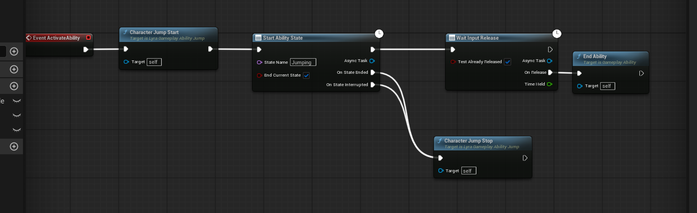

# UE5_Lyra学习指南_082_讲解GA_Jump

本文章仅为小刚-B站课堂-虚幻引擎视频课程Lyra-精讲的演讲手稿.  
本套课程链接:[[UE5]虚幻引擎游戏案例Lyra精讲](https://www.bilibili.com/cheese/play/ss112001159)  
前置课程链接:[[UE5]虚幻引擎UEC++从基础到进阶](https://www.bilibili.com/cheese/play/ss28043)  

文章内容由小刚撰写,采用了以下多种方式:  
1.口述转文字  
2.AI重构  
3.参考引擎源码  
4.Lyra工程源码  
5.结合社区论坛各位大佬的解析  

- [UE5\_Lyra学习指南\_082\_讲解GA\_Jump](#ue5_lyra学习指南_082_讲解ga_jump)
	- [概述](#概述)
	- [AbilityState的旧版本失效问题](#abilitystate的旧版本失效问题)
	- [等待输入释放](#等待输入释放)
	- [代码](#代码)
	- [总结](#总结)


## 概述
比较简单.直接上代码即可.

## AbilityState的旧版本失效问题
``` cpp
void UAbilityTask_StartAbilityState::OnDestroy(bool AbilityEnded)
{
	using namespace UE::AbilitySystem::AbilityTask_StartAbilityState;

	// Unbind delegates so this doesn't get recursively called
	if (Ability)
	{
		Ability->OnGameplayAbilityCancelled.Remove(InterruptStateHandle);
		Ability->OnGameplayAbilityStateEnded.Remove(EndStateHandle);
	}

	if (bWasInterrupted && OnStateInterrupted.IsBound())
	{
		if (CustomShouldBroadcastAbilityTaskDelegates(Ability))
		{
			OnStateInterrupted.Broadcast();
		}
	}
	else if ((bWasEnded || AbilityEnded) && OnStateEnded.IsBound())
	{
		if (CustomShouldBroadcastAbilityTaskDelegates(Ability))
		{
			OnStateEnded.Broadcast();
		}
	}

	// This will invalidate the task so needs to happen after callbacks
	Super::OnDestroy(AbilityEnded);
}
```

``` cpp
/**
 * An ability state is simply an ability task that provides a way to handle the ability being interrupted.
 * You can use ability states to do state-specific cleanup if the ability ends or was interrupted at a certain point during it's execution.
 *
 * An ability state will always result in either 'OnStateEnded' or 'OnStateInterrupted' being called.
 *
 * 'OnStateEnded' will be called if:
 * - The ability itself ends via AGameplayAbility::EndAbility
 * - The ability state is manually ended via AGameplayAbility::EndAbilityState
 * - Another ability state is started will 'bEndCurrentState' set to true
 *
 * 'OnStateInterrupted' will be called if:
 * - The ability itself is cancelled via AGameplayAbility::CancelAbility
 */
UCLASS(MinimalAPI)
class UAbilityTask_StartAbilityState : public UAbilityTask
{
	// ....
}

```

``` cpp
void UGameplayAbility::EndAbility(const FGameplayAbilitySpecHandle Handle, const FGameplayAbilityActorInfo* ActorInfo, const FGameplayAbilityActivationInfo ActivationInfo, bool bReplicateEndAbility, bool bWasCancelled)
{
	
		// ......
		if (GetInstancingPolicy() != EGameplayAbilityInstancingPolicy::NonInstanced)
		{
			bIsActive = false;
			bIsAbilityEnding = false;
		}

		// Tell all our tasks that we are finished and they should cleanup
		for (int32 TaskIdx = ActiveTasks.Num() - 1; TaskIdx >= 0 && ActiveTasks.Num() > 0; --TaskIdx)
		{
			UGameplayTask* Task = ActiveTasks[TaskIdx];
			if (Task)
			{	
				// 这里触发Task的销毁
				Task->TaskOwnerEnded();
			}
		}
		ActiveTasks.Reset();	// Empty the array but don't resize memory, since this object is probably going to be destroyed very soon anyways.

		// ......
}
```
``` cpp

void UGameplayTask::TaskOwnerEnded()
{
	UE_VLOG(GetGameplayTasksComponent(), LogGameplayTasks, Verbose
		, TEXT("%s TaskOwnerEnded called, current State: %s")
		, *GetName(), *GetTaskStateName());

	if (TaskState != EGameplayTaskState::Finished)
	{
		bOwnerFinished = true;
		if (IsValidChecked(this))
		{
			OnDestroy(true);
		}
		else
		{
			// mark as finished, just to be on the safe side 
			TaskState = EGameplayTaskState::Finished;
		}
	}
}
```

## 等待输入释放
``` cpp
/**
 *	Waits until the input is released from activating an ability. Clients will replicate a 'release input' event to the server, but not the exact time it was held locally.
 *	We expect server to execute this task in parallel and keep its own time.
 */
UCLASS(MinimalAPI)
class UAbilityTask_WaitInputRelease : public UAbilityTask
{
	GENERATED_UCLASS_BODY()

	UPROPERTY(BlueprintAssignable)
	FInputReleaseDelegate	OnRelease;

	UFUNCTION()
	UE_API void OnReleaseCallback();

	UE_API virtual void Activate() override;

	/** Wait until the user releases the input button for this ability's activation. Returns time from hitting this node, till release. Will return 0 if input was already released. */
	UFUNCTION(BlueprintCallable, Category="Ability|Tasks", meta = (HidePin = "OwningAbility", DefaultToSelf = "OwningAbility", BlueprintInternalUseOnly = "TRUE"))
	static UE_API UAbilityTask_WaitInputRelease* WaitInputRelease(UGameplayAbility* OwningAbility, bool bTestAlreadyReleased=false);

protected:

	float StartTime;
	bool bTestInitialState;
	FDelegateHandle DelegateHandle;
};


```
``` cpp
void UAbilityTask_WaitInputRelease::Activate()
{
	StartTime = GetWorld()->GetTimeSeconds();

	UAbilitySystemComponent* ASC = AbilitySystemComponent.Get();
	if (ASC && Ability)
	{
		if (bTestInitialState && IsLocallyControlled())
		{
			FGameplayAbilitySpec *Spec = Ability->GetCurrentAbilitySpec();
			if (Spec && !Spec->InputPressed)
			{
				OnReleaseCallback();
				return;
			}
		}

		DelegateHandle = ASC->AbilityReplicatedEventDelegate(EAbilityGenericReplicatedEvent::InputReleased, GetAbilitySpecHandle(), GetActivationPredictionKey()).AddUObject(this, &UAbilityTask_WaitInputRelease::OnReleaseCallback);
		if (IsForRemoteClient())
		{
			if (!ASC->CallReplicatedEventDelegateIfSet(EAbilityGenericReplicatedEvent::InputReleased, GetAbilitySpecHandle(), GetActivationPredictionKey()))
			{
				SetWaitingOnRemotePlayerData();
			}
		}
	}
}


```
``` cpp
void ULyraAbilitySystemComponent::AbilitySpecInputReleased(FGameplayAbilitySpec& Spec)
{
	Super::AbilitySpecInputReleased(Spec);

	// We don't support UGameplayAbility::bReplicateInputDirectly.
	// Use replicated events instead so that the WaitInputRelease ability task works.
	// 我们不支持 UGameplayAbility::bReplicateInputDirectly 这个特性。
	// 请改用复制事件的方式，以便“等待输入释放”能力任务能够正常运行。
	if (Spec.IsActive())
	{
PRAGMA_DISABLE_DEPRECATION_WARNINGS
		const UGameplayAbility* Instance = Spec.GetPrimaryInstance();
		FPredictionKey OriginalPredictionKey = Instance ? Instance->GetCurrentActivationInfo().GetActivationPredictionKey() : Spec.ActivationInfo.GetActivationPredictionKey();
PRAGMA_ENABLE_DEPRECATION_WARNINGS

		// Invoke the InputReleased event. This is not replicated here. If someone is listening, they may replicate the InputReleased event to the server.
		// 调用“输入释放”事件。此操作在此处未作详细说明。若有人在监听，则可将“输入释放”事件发送至服务器。
		InvokeReplicatedEvent(EAbilityGenericReplicatedEvent::InputReleased, Spec.Handle, OriginalPredictionKey);
	}
}
```
## 代码
``` cpp
/**
 * ULyraGameplayAbility_Jump
 *
 *	Gameplay ability used for character jumping.
 *  游戏玩法中用于角色跳跃的功能。
 */
UCLASS(Abstract)
class ULyraGameplayAbility_Jump : public ULyraGameplayAbility
{
	GENERATED_BODY()

public:
	// 构造函数
	// NetExecutionPolicy
	ULyraGameplayAbility_Jump(const FObjectInitializer& ObjectInitializer = FObjectInitializer::Get());

protected:
	// 调用角色类 判断是否可以跳跃
	virtual bool CanActivateAbility(const FGameplayAbilitySpecHandle Handle, const FGameplayAbilityActorInfo* ActorInfo, const FGameplayTagContainer* SourceTags, const FGameplayTagContainer* TargetTags, FGameplayTagContainer* OptionalRelevantTags) const override;
	virtual void EndAbility(const FGameplayAbilitySpecHandle Handle, const FGameplayAbilityActorInfo* ActorInfo, const FGameplayAbilityActivationInfo ActivationInfo, bool bReplicateEndAbility, bool bWasCancelled) override;

	// 转发给角色类
	UFUNCTION(BlueprintCallable, Category = "Lyra|Ability")
	void CharacterJumpStart();

	// 转发给角色类
	UFUNCTION(BlueprintCallable, Category = "Lyra|Ability")
	void CharacterJumpStop();
};


```

``` cpp
ULyraGameplayAbility_Jump::ULyraGameplayAbility_Jump(const FObjectInitializer& ObjectInitializer)
	: Super(ObjectInitializer)
{
	InstancingPolicy = EGameplayAbilityInstancingPolicy::InstancedPerActor;
	// 重要
	NetExecutionPolicy = EGameplayAbilityNetExecutionPolicy::LocalPredicted;
}

bool ULyraGameplayAbility_Jump::CanActivateAbility(const FGameplayAbilitySpecHandle Handle, const FGameplayAbilityActorInfo* ActorInfo, const FGameplayTagContainer* SourceTags, const FGameplayTagContainer* TargetTags, FGameplayTagContainer* OptionalRelevantTags) const
{
	if (!ActorInfo || !ActorInfo->AvatarActor.IsValid())
	{
		return false;
	}

	const ALyraCharacter* LyraCharacter = Cast<ALyraCharacter>(ActorInfo->AvatarActor.Get());
	if (!LyraCharacter || !LyraCharacter->CanJump())
	{
		return false;
	}

	if (!Super::CanActivateAbility(Handle, ActorInfo, SourceTags, TargetTags, OptionalRelevantTags))
	{
		return false;
	}

	return true;
}

void ULyraGameplayAbility_Jump::EndAbility(const FGameplayAbilitySpecHandle Handle, const FGameplayAbilityActorInfo* ActorInfo, const FGameplayAbilityActivationInfo ActivationInfo, bool bReplicateEndAbility, bool bWasCancelled)
{
	// Stop jumping in case the ability blueprint doesn't call it.
	// 在此停止跳跃，以防能力蓝图未调用此动作。
	CharacterJumpStop();

	Super::EndAbility(Handle, ActorInfo, ActivationInfo, bReplicateEndAbility, bWasCancelled);
}

void ULyraGameplayAbility_Jump::CharacterJumpStart()
{
	if (ALyraCharacter* LyraCharacter = GetLyraCharacterFromActorInfo())
	{
		if (LyraCharacter->IsLocallyControlled() && !LyraCharacter->bPressedJump)
		{
			LyraCharacter->UnCrouch();
			LyraCharacter->Jump();
		}
	}
}

void ULyraGameplayAbility_Jump::CharacterJumpStop()
{
	if (ALyraCharacter* LyraCharacter = GetLyraCharacterFromActorInfo())
	{
		if (LyraCharacter->IsLocallyControlled() && LyraCharacter->bPressedJump)
		{
			LyraCharacter->StopJumping();
		}
	}
}

```
``` cpp
	/** 
	 * Make the character jump on the next update.	 
	 * If you want your character to jump according to the time that the jump key is held,
	 * then you can set JumpMaxHoldTime to some non-zero value. Make sure in this case to
	 * call StopJumping() when you want the jump's z-velocity to stop being applied (such 
	 * as on a button up event), otherwise the character will carry on receiving the 
	 * velocity until JumpKeyHoldTime reaches JumpMaxHoldTime.
	 */
	UFUNCTION(BlueprintCallable, Category=Character)
	ENGINE_API virtual void Jump();

	/** 
	 * Stop the character from jumping on the next update. 
	 * Call this from an input event (such as a button 'up' event) to cease applying
	 * jump Z-velocity. If this is not called, then jump z-velocity will be applied
	 * until JumpMaxHoldTime is reached.
	 */
	UFUNCTION(BlueprintCallable, Category=Character)
	ENGINE_API virtual void StopJumping();

```
## 总结
因为人物类的jump自带网络同步所以直接在合适的时机调用即可.