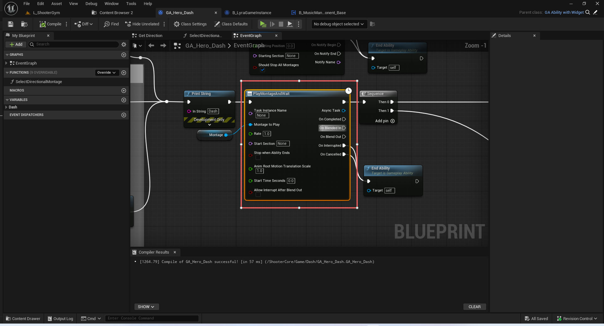
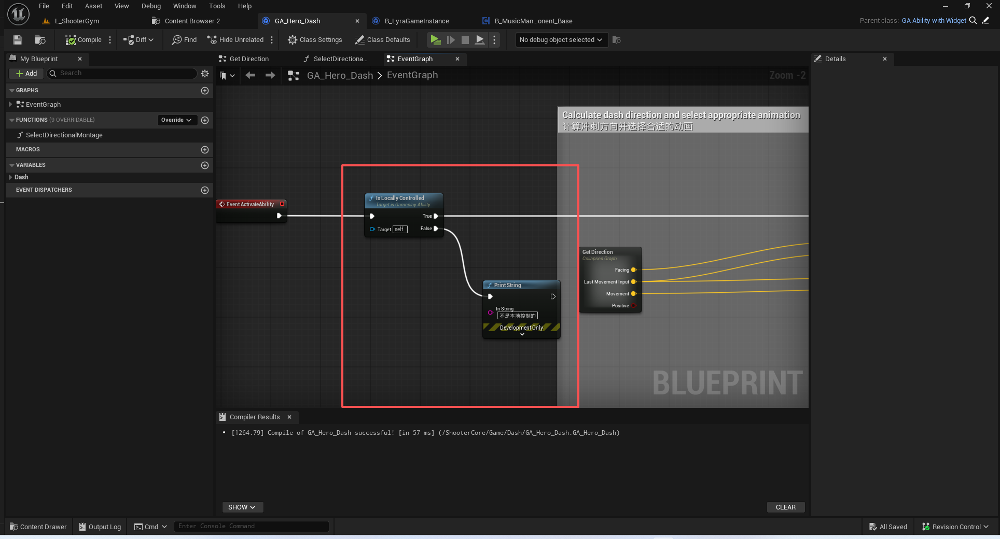
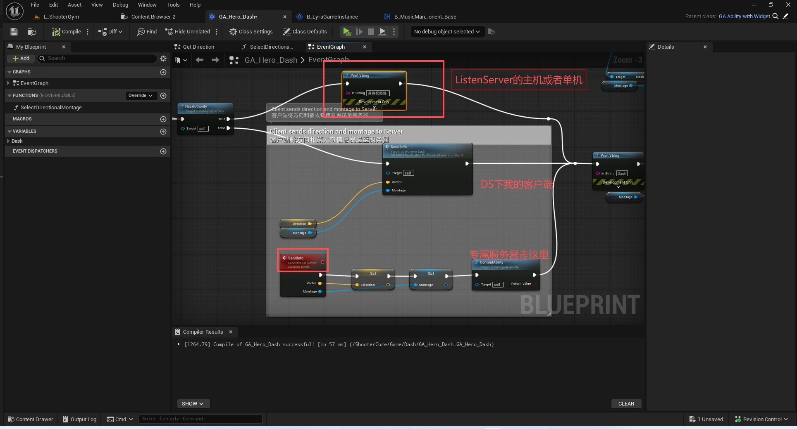
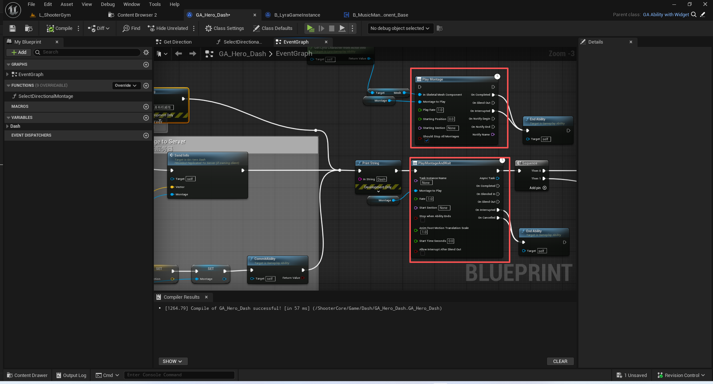

# UE5_Lyra学习指南_083_讲解GA_Dash

本文章仅为小刚-B站课堂-虚幻引擎视频课程Lyra-精讲的演讲手稿.  
本套课程链接:[[UE5]虚幻引擎游戏案例Lyra精讲](https://www.bilibili.com/cheese/play/ss112001159)  
前置课程链接:[[UE5]虚幻引擎UEC++从基础到进阶](https://www.bilibili.com/cheese/play/ss28043)  

文章内容由小刚撰写,采用了以下多种方式:  
1.口述转文字  
2.AI重构  
3.参考引擎源码  
4.Lyra工程源码  
5.结合社区论坛各位大佬的解析  

- [UE5\_Lyra学习指南\_083\_讲解GA\_Dash](#ue5_lyra学习指南_083_讲解ga_dash)
	- [概述](#概述)
	- [流程](#流程)
	- [UAbilityTask\_PlayMontageAndWait](#uabilitytask_playmontageandwait)
	- [UAbilityTask\_ApplyRootMotionConstantForce](#uabilitytask_applyrootmotionconstantforce)
	- [总结](#总结)


## 概述
本节主要通过GA_Dash这个本地预测的冲刺技能来讲解设计一个网络的技能的拉蓝图逻辑.

## 流程
这里一定要区分单机,监听,专属服务器的模式.
这里以专属服务器为例.
因为这个技能是本地预测.所以客户端和服务端都会进来.
我们直接屏蔽服务端.因为只有客户端才能拿到准确的玩家操作信息去计算方向


如下图所示.

最终,我的客户端本地预测播放动画
服务器,通过属性同步去播放动画!

注意这里必须用AbilityTask的播放蒙太奇.否者就只有我的客户端和专属服务器会播放,其他模拟的客户端无动画效果!!!

其他如根运动的距离手动计算,并非跟随动画
在服务器端触发GameplayeCue的残影特效
广播冷却时间
预估结算时间,避免连续播放节能就略过了
## UAbilityTask_PlayMontageAndWait

``` cpp
UAbilityTask_PlayMontageAndWait* UAbilityTask_PlayMontageAndWait::CreatePlayMontageAndWaitProxy(UGameplayAbility* OwningAbility,
	FName TaskInstanceName, UAnimMontage *MontageToPlay, float Rate, FName StartSection, bool bStopWhenAbilityEnds, float AnimRootMotionTranslationScale, float StartTimeSeconds, bool bAllowInterruptAfterBlendOut)
{

	UAbilitySystemGlobals::NonShipping_ApplyGlobalAbilityScaler_Rate(Rate);

	UAbilityTask_PlayMontageAndWait* MyObj = NewAbilityTask<UAbilityTask_PlayMontageAndWait>(OwningAbility, TaskInstanceName);
	MyObj->MontageToPlay = MontageToPlay;
	MyObj->Rate = Rate;
	MyObj->StartSection = StartSection;
	MyObj->AnimRootMotionTranslationScale = AnimRootMotionTranslationScale;
	MyObj->bStopWhenAbilityEnds = bStopWhenAbilityEnds;
	MyObj->bAllowInterruptAfterBlendOut = bAllowInterruptAfterBlendOut;
	MyObj->StartTimeSeconds = StartTimeSeconds;
	
	return MyObj;
}

```
``` cpp


void UAbilityTask_PlayMontageAndWait::Activate()
{
	if (Ability == nullptr)
	{
		return;
	}

	bool bPlayedMontage = false;

	if (UAbilitySystemComponent* ASC = AbilitySystemComponent.Get())
	{
		const FGameplayAbilityActorInfo* ActorInfo = Ability->GetCurrentActorInfo();
		UAnimInstance* AnimInstance = ActorInfo->GetAnimInstance();
		if (AnimInstance != nullptr)
		{
			if (ASC->PlayMontage(Ability, Ability->GetCurrentActivationInfo(), MontageToPlay, Rate, StartSection, StartTimeSeconds) > 0.f)
			{
				// Playing a montage could potentially fire off a callback into game code which could kill this ability! Early out if we are  pending kill.
				if (ShouldBroadcastAbilityTaskDelegates() == false)
				{
					return;
				}

				InterruptedHandle = Ability->OnGameplayAbilityCancelled.AddUObject(this, &UAbilityTask_PlayMontageAndWait::OnGameplayAbilityCancelled);

				BlendedInDelegate.BindUObject(this, &UAbilityTask_PlayMontageAndWait::OnMontageBlendedIn);
				AnimInstance->Montage_SetBlendedInDelegate(BlendedInDelegate, MontageToPlay);

				BlendingOutDelegate.BindUObject(this, &UAbilityTask_PlayMontageAndWait::OnMontageBlendingOut);
				AnimInstance->Montage_SetBlendingOutDelegate(BlendingOutDelegate, MontageToPlay);

				MontageEndedDelegate.BindUObject(this, &UAbilityTask_PlayMontageAndWait::OnMontageEnded);
				AnimInstance->Montage_SetEndDelegate(MontageEndedDelegate, MontageToPlay);

				ACharacter* Character = Cast<ACharacter>(GetAvatarActor());
				if (Character && (Character->GetLocalRole() == ROLE_Authority ||
								  (Character->GetLocalRole() == ROLE_AutonomousProxy && Ability->GetNetExecutionPolicy() == EGameplayAbilityNetExecutionPolicy::LocalPredicted)))
				{
					Character->SetAnimRootMotionTranslationScale(AnimRootMotionTranslationScale);
				}

				bPlayedMontage = true;
			}
		}
		else
		{
			ABILITY_LOG(Warning, TEXT("UAbilityTask_PlayMontageAndWait call to PlayMontage failed!"));
		}
	}
	else
	{
		ABILITY_LOG(Warning, TEXT("UAbilityTask_PlayMontageAndWait called on invalid AbilitySystemComponent"));
	}

	if (!bPlayedMontage)
	{
		ABILITY_LOG(Warning, TEXT("UAbilityTask_PlayMontageAndWait called in Ability %s failed to play montage %s; Task Instance Name %s."), *Ability->GetName(), *GetNameSafe(MontageToPlay),*InstanceName.ToString());
		if (ShouldBroadcastAbilityTaskDelegates())
		{
			OnCancelled.Broadcast();
		}
	}

	SetWaitingOnAvatar();
}

```
``` cpp
	/** Plays a montage and handles replication and prediction based on passed in ability/activation info */
	UE_API virtual float PlayMontage(UGameplayAbility* AnimatingAbility, FGameplayAbilityActivationInfo ActivationInfo, UAnimMontage* Montage, float InPlayRate, FName StartSectionName = NAME_None, float StartTimeSeconds = 0.0f);


```

``` cpp

float UAbilitySystemComponent::PlayMontageInternal(UGameplayAbility* InAnimatingAbility, FGameplayAbilityActivationInfo ActivationInfo, UAnimMontage* NewAnimMontage, float InPlayRate, FName StartSectionName, float StartTimeSeconds, TFunctionRef<void(FGameplayAbilityRepAnimMontage&)> MutateRepAnimMontageFunction)
{
	float Duration = -1.f;

	UAnimInstance* AnimInstance = AbilityActorInfo.IsValid() ? AbilityActorInfo->GetAnimInstance() : nullptr;
	if (AnimInstance && NewAnimMontage)
	{
		Duration = AnimInstance->Montage_Play(NewAnimMontage, InPlayRate, EMontagePlayReturnType::MontageLength, StartTimeSeconds);
		if (Duration > 0.f)
		{
			if (const UGameplayAbility* RawAnimatingAbility = LocalAnimMontageInfo.AnimatingAbility.Get())
			{
				if (RawAnimatingAbility != InAnimatingAbility)
				{
					// The ability that was previously animating will have already gotten the 'interrupted' callback.
					// It may be a good idea to make this a global policy and 'cancel' the ability.
					// 
					// For now, we expect it to end itself when this happens.
				}
			}

			UAnimSequenceBase* Animation = NewAnimMontage->IsDynamicMontage() ? NewAnimMontage->GetFirstAnimReference() : NewAnimMontage;

			if (NewAnimMontage->HasRootMotion() && AnimInstance->GetOwningActor())
			{
				UE_LOG(LogRootMotion, Log, TEXT("UAbilitySystemComponent::PlayMontage %s, Role: %s")
					, *GetNameSafe(Animation)
					, *UEnum::GetValueAsString(TEXT("Engine.ENetRole"), AnimInstance->GetOwningActor()->GetLocalRole())
					);
			}

			LocalAnimMontageInfo.AnimMontage = NewAnimMontage;
			LocalAnimMontageInfo.AnimatingAbility = InAnimatingAbility;
			LocalAnimMontageInfo.PlayInstanceId = (LocalAnimMontageInfo.PlayInstanceId < UINT8_MAX ? LocalAnimMontageInfo.PlayInstanceId + 1 : 0);
			
			if (InAnimatingAbility)
			{
				InAnimatingAbility->SetCurrentMontage(NewAnimMontage);
			}
			
			// Start at a given Section.
			if (StartSectionName != NAME_None)
			{
				AnimInstance->Montage_JumpToSection(StartSectionName, NewAnimMontage);
			}

			// Replicate for non-owners and for replay recordings
			// The data we set from GetRepAnimMontageInfo_Mutable() is used both by the server to replicate to clients and by clients to record replays.
			// We need to set this data for recording clients because there exists network configurations where an abilities montage data will not replicate to some clients (for example: if the client is an autonomous proxy.)
			if (ShouldRecordMontageReplication())
			{
				FGameplayAbilityRepAnimMontage& MutableRepAnimMontageInfo = GetRepAnimMontageInfo_Mutable();

				// Those are static parameters, they are only set when the montage is played. They are not changed after that.
				MutableRepAnimMontageInfo.Animation = Animation;
				MutableRepAnimMontageInfo.PlayInstanceId = (MutableRepAnimMontageInfo.PlayInstanceId < UINT8_MAX ? MutableRepAnimMontageInfo.PlayInstanceId + 1 : 0);

				MutableRepAnimMontageInfo.SectionIdToPlay = 0;
				if (MutableRepAnimMontageInfo.Animation && StartSectionName != NAME_None)
				{
					// we add one so INDEX_NONE can be used in the on rep
					MutableRepAnimMontageInfo.SectionIdToPlay = NewAnimMontage->GetSectionIndex(StartSectionName) + 1;
				}

				if (NewAnimMontage->IsDynamicMontage())
				{
					check(!NewAnimMontage->SlotAnimTracks.IsEmpty());
					MutableRepAnimMontageInfo.SlotName = NewAnimMontage->SlotAnimTracks[0].SlotName;
					MutableRepAnimMontageInfo.BlendOutTime = NewAnimMontage->GetDefaultBlendInTime();
				}

				// Give the caller the opportunity to modify the rep info for this montage, used by "slot animation as dynamic montage" to replicate play count parameter
				MutateRepAnimMontageFunction(MutableRepAnimMontageInfo);

				// Update parameters that change during Montage life time.
				AnimMontage_UpdateReplicatedData();
			}

			// Replicate to non-owners
			if (IsOwnerActorAuthoritative())
			{
				// Force net update on our avatar actor.
				if (AbilityActorInfo->AvatarActor != nullptr)
				{
					AbilityActorInfo->AvatarActor->ForceNetUpdate();
				}
			}
			else
			{
				// If this prediction key is rejected, we need to end the preview
				FPredictionKey PredictionKey = GetPredictionKeyForNewAction();
				if (PredictionKey.IsValidKey())
				{
					PredictionKey.NewRejectedDelegate().BindUObject(this, &UAbilitySystemComponent::OnPredictiveMontageRejected, NewAnimMontage);
				}
			}
		}
	}

	return Duration;
}

```
``` cpp


void UAbilitySystemComponent::AnimMontage_UpdateReplicatedData(FGameplayAbilityRepAnimMontage& OutRepAnimMontageInfo)
{
	const UAnimInstance* AnimInstance = AbilityActorInfo.IsValid() ? AbilityActorInfo->GetAnimInstance() : nullptr;
	if (AnimInstance && LocalAnimMontageInfo.AnimMontage)
	{
		if (LocalAnimMontageInfo.AnimMontage->IsDynamicMontage())
		{
			OutRepAnimMontageInfo.Animation = LocalAnimMontageInfo.AnimMontage->GetFirstAnimReference();
			OutRepAnimMontageInfo.BlendOutTime = LocalAnimMontageInfo.AnimMontage->GetDefaultBlendOutTime();
		}
		else
		{
			OutRepAnimMontageInfo.Animation = LocalAnimMontageInfo.AnimMontage;
			OutRepAnimMontageInfo.BlendOutTime = 0.0f;
		}

		// Compressed Flags
		const bool bIsStopped = AnimInstance->Montage_GetIsStopped(LocalAnimMontageInfo.AnimMontage);

		if (!bIsStopped)
		{
			OutRepAnimMontageInfo.PlayRate = AnimInstance->Montage_GetPlayRate(LocalAnimMontageInfo.AnimMontage);
			OutRepAnimMontageInfo.Position = AnimInstance->Montage_GetPosition(LocalAnimMontageInfo.AnimMontage);
			OutRepAnimMontageInfo.BlendTime = AnimInstance->Montage_GetBlendTime(LocalAnimMontageInfo.AnimMontage);
		}

		if (OutRepAnimMontageInfo.IsStopped != bIsStopped)
		{
			// Set this prior to calling UpdateShouldTick, so we start ticking if we are playing a Montage
			OutRepAnimMontageInfo.IsStopped = bIsStopped;

			if (bIsStopped)
			{
				// Use AnyThread because GetValueOnGameThread will fail check() when doing replays
				constexpr bool bForceGameThreadValue = true;
				if (CVarGasFixClientSideMontageBlendOutTime.GetValueOnAnyThread(bForceGameThreadValue))
				{
					// Replicate blend out time. This requires a manual search since Montage_GetBlendTime will fail
					// in GetActiveInstanceForMontage for Montages that are stopped.
					for (const FAnimMontageInstance* MontageInstance : AnimInstance->MontageInstances)
					{
						if (MontageInstance->Montage == LocalAnimMontageInfo.AnimMontage)
						{
							OutRepAnimMontageInfo.BlendTime = MontageInstance->GetBlendTime();
							break;
						}
					}
				}
			}

			// When we start or stop an animation, update the clients right away for the Avatar Actor
			if (AbilityActorInfo->AvatarActor != nullptr)
			{
				AbilityActorInfo->AvatarActor->ForceNetUpdate();
			}

			// When this changes, we should update whether or not we should be ticking
			UpdateShouldTick();
		}

		// Replicate NextSectionID to keep it in sync.
		// We actually replicate NextSectionID+1 on a BYTE to put INDEX_NONE in there.
		int32 CurrentSectionID = LocalAnimMontageInfo.AnimMontage->GetSectionIndexFromPosition(OutRepAnimMontageInfo.Position);
		if (CurrentSectionID != INDEX_NONE)
		{
			constexpr bool bForceGameThreadValue = true;
			if (CVarUpdateMontageSectionIdToPlay.GetValueOnAnyThread(bForceGameThreadValue))
			{
				OutRepAnimMontageInfo.SectionIdToPlay = uint8(CurrentSectionID + 1);
			}

			int32 NextSectionID = AnimInstance->Montage_GetNextSectionID(LocalAnimMontageInfo.AnimMontage, CurrentSectionID);
			if (NextSectionID >= (256 - 1))
			{
				ABILITY_LOG( Error, TEXT("AnimMontage_UpdateReplicatedData. NextSectionID = %d.  RepAnimMontageInfo.Position: %.2f, CurrentSectionID: %d. LocalAnimMontageInfo.AnimMontage %s"), 
					NextSectionID, OutRepAnimMontageInfo.Position, CurrentSectionID, *GetNameSafe(LocalAnimMontageInfo.AnimMontage) );
				ensure(NextSectionID < (256 - 1));
			}
			OutRepAnimMontageInfo.NextSectionID = uint8(NextSectionID + 1);
		}
		else
		{
			OutRepAnimMontageInfo.NextSectionID = 0;
		}
	}
}

```

主要看这两行代码.会触发属性同步!成功在其他客户端播放动画
``` cpp
	/** Data structure for montages that were instigated locally (everything if server, predictive if client. replicated if simulated proxy) */
	UPROPERTY()
	FGameplayAbilityLocalAnimMontage LocalAnimMontageInfo;

```
``` cpp

	FGameplayAbilityRepAnimMontage& MutableRepAnimMontageInfo = GetRepAnimMontageInfo_Mutable();


```
``` cpp
FGameplayAbilityRepAnimMontage& UAbilitySystemComponent::GetRepAnimMontageInfo_Mutable()
{
	MARK_PROPERTY_DIRTY_FROM_NAME(UAbilitySystemComponent, RepAnimMontageInfo, this);
	return RepAnimMontageInfo;
}
	UE_DEPRECATED(4.26, "This will be made private in future engine versions. Use SetRepAnimMontageInfo, GetRepAnimMontageInfo, or GetRepAnimMontageInfo_Mutable instead.")
	/** Data structure for replicating montage info to simulated clients */
	UPROPERTY(ReplicatedUsing=OnRep_ReplicatedAnimMontage)
	FGameplayAbilityRepAnimMontage RepAnimMontageInfo;
```

## UAbilityTask_ApplyRootMotionConstantForce

``` cpp

void UAbilityTask_ApplyRootMotionConstantForce::SharedInitAndApply()
{
	UAbilitySystemComponent* ASC = AbilitySystemComponent.Get();
	if (ASC && ASC->AbilityActorInfo->MovementComponent.IsValid())
	{
		MovementComponent = Cast<UCharacterMovementComponent>(ASC->AbilityActorInfo->MovementComponent.Get());
		StartTime = GetWorld()->GetTimeSeconds();
		EndTime = StartTime + Duration;

		if (MovementComponent.IsValid())
		{
			ForceName = ForceName.IsNone() ? FName("AbilityTaskApplyRootMotionConstantForce"): ForceName;
			TSharedPtr<FRootMotionSource_ConstantForce> ConstantForce = MakeShared<FRootMotionSource_ConstantForce>();
			ConstantForce->InstanceName = ForceName;
			ConstantForce->AccumulateMode = bIsAdditive ? ERootMotionAccumulateMode::Additive : ERootMotionAccumulateMode::Override;
			ConstantForce->Priority = 5;
			ConstantForce->Force = WorldDirection * Strength;
			ConstantForce->Duration = Duration;
			ConstantForce->StrengthOverTime = StrengthOverTime;
			ConstantForce->FinishVelocityParams.Mode = FinishVelocityMode;
			ConstantForce->FinishVelocityParams.SetVelocity = FinishSetVelocity;
			ConstantForce->FinishVelocityParams.ClampVelocity = FinishClampVelocity;
			if (bEnableGravity)
			{
				ConstantForce->Settings.SetFlag(ERootMotionSourceSettingsFlags::IgnoreZAccumulate);
			}
			RootMotionSourceID = MovementComponent->ApplyRootMotionSource(ConstantForce);
		}
	}
	else
	{
		ABILITY_LOG(Warning, TEXT("UAbilityTask_ApplyRootMotionConstantForce called in Ability %s with null MovementComponent; Task Instance Name %s."), 
			Ability ? *Ability->GetName() : TEXT("NULL"), 
			*InstanceName.ToString());
	}
}

```
``` cpp
uint16 UCharacterMovementComponent::ApplyRootMotionSource(TSharedPtr<FRootMotionSource> SourcePtr)
{
	if (ensure(SourcePtr.IsValid()))
	{
		// Set default StartTime if it hasn't been set manually
		if (!SourcePtr->IsStartTimeValid())
		{
			if (CharacterOwner)
			{
				if (CharacterOwner->GetLocalRole() == ROLE_AutonomousProxy)
				{
					// Autonomous defaults to local timestamp
					FNetworkPredictionData_Client_Character* ClientData = GetPredictionData_Client_Character();
					if (ClientData)
					{
						SourcePtr->StartTime = ClientData->CurrentTimeStamp;
					}
				}
				else if (CharacterOwner->GetLocalRole() == ROLE_Authority && !IsNetMode(NM_Client))
				{
					// Authority defaults to current client time stamp, meaning it'll start next tick if not corrected
					FNetworkPredictionData_Server_Character* ServerData = GetPredictionData_Server_Character();
					if (ServerData)
					{
						SourcePtr->StartTime = ServerData->CurrentClientTimeStamp;
					}
				}
			}
		}

		OnRootMotionSourceBeingApplied(SourcePtr.Get());

		return CurrentRootMotion.ApplyRootMotionSource(SourcePtr);
	}

	return (uint16)ERootMotionSourceID::Invalid;
}


```
## 总结
本节主要通过现象看本质去理解.
记得开启GA的同步,否则使用RPC在这个GA会报错