# UE5_Lyra学习指南_087_生命值组件与GA_Death

本文章仅为小刚-B站课堂-虚幻引擎视频课程Lyra-精讲的演讲手稿.  
本套课程链接:[[UE5]虚幻引擎游戏案例Lyra精讲](https://www.bilibili.com/cheese/play/ss112001159)  
前置课程链接:[[UE5]虚幻引擎UEC++从基础到进阶](https://www.bilibili.com/cheese/play/ss28043)  

文章内容由小刚撰写,采用了以下多种方式:  
1.口述转文字  
2.AI重构  
3.参考引擎源码  
4.Lyra工程源码  
5.结合社区论坛各位大佬的解析  

- [UE5\_Lyra学习指南\_087\_生命值组件与GA\_Death](#ue5_lyra学习指南_087_生命值组件与ga_death)
	- [概述](#概述)
	- [生命值组件绑定流程](#生命值组件绑定流程)
		- [HeroComp阶段转换时初始化ASC](#herocomp阶段转换时初始化asc)
		- [PawnExt触发停用ASC](#pawnext触发停用asc)
			- [人物销毁时触发](#人物销毁时触发)
			- [组件销毁时触发](#组件销毁时触发)
			- [启动ASC时确保旧的已停用](#启动asc时确保旧的已停用)
			- [控制器变更时确保旧的已停用](#控制器变更时确保旧的已停用)
		- [PawnExt广播能力系统的初始化和停用](#pawnext广播能力系统的初始化和停用)
		- [角色类转发到生命值组件](#角色类转发到生命值组件)
			- [绑定转发的代理](#绑定转发的代理)
			- [转发给生命值组件](#转发给生命值组件)
			- [生命值组件做属性绑定](#生命值组件做属性绑定)
		- [监听生命值变化](#监听生命值变化)
		- [显示生命值](#显示生命值)
		- [自我毁灭的伤害](#自我毁灭的伤害)
		- [触发死亡技能](#触发死亡技能)
	- [死亡流程](#死亡流程)
		- [死亡枚举](#死亡枚举)
		- [触发死亡](#触发死亡)
		- [死亡技能](#死亡技能)
		- [关联触发器](#关联触发器)
		- [能力的注册](#能力的注册)
		- [激活死亡能力](#激活死亡能力)
		- [触发开始死亡](#触发开始死亡)
		- [触发完成死亡](#触发完成死亡)
		- [死亡网络同步开始](#死亡网络同步开始)
		- [客户端收到同步死亡](#客户端收到同步死亡)
		- [完成死亡](#完成死亡)
	- [重生流程](#重生流程)
	- [重置流程](#重置流程)
	- [总结](#总结)


## 概述
本节主要补充之前章节中关于人物初始化中的生命值组件作用.
并由它开始触发GA_Death,并同步死亡流程.

## 生命值组件绑定流程

### HeroComp阶段转换时初始化ASC

``` cpp

void ULyraHeroComponent::HandleChangeInitState(UGameFrameworkComponentManager* Manager, FGameplayTag CurrentState, FGameplayTag DesiredState)
{
	// 从2到3 开始执行阶段过渡 因为前面已经确定了数据已经装准备好了.
	if (CurrentState == LyraGameplayTags::InitState_DataAvailable && DesiredState == LyraGameplayTags::InitState_DataInitialized)
	{
		APawn* Pawn = GetPawn<APawn>();
		ALyraPlayerState* LyraPS = GetPlayerState<ALyraPlayerState>();
		// 这里必须要有!
		if (!ensure(Pawn && LyraPS))
		{
			return;
		}

		const ULyraPawnData* PawnData = nullptr;
		// 初始化ASC
		if (ULyraPawnExtensionComponent* PawnExtComp = ULyraPawnExtensionComponent::FindPawnExtensionComponent(Pawn))
		{
			PawnData = PawnExtComp->GetPawnData<ULyraPawnData>();

			// The player state holds the persistent data for this player (state that persists across deaths and multiple pawns).
			// The ability system component and attribute sets live on the player state.
			
			// 玩家状态包含了此玩家的持久性数据（这些数据在死亡以及多个角色出现的情况下仍能保持不变）。
			// 能力系统组件和属性集都存在于玩家状态中。
			PawnExtComp->InitializeAbilitySystem(LyraPS->GetLyraAbilitySystemComponent(), LyraPS);
			
		}

		// ....
	}
}

```

### PawnExt触发停用ASC
#### 人物销毁时触发
``` cpp

void ALyraCharacter::UninitAndDestroy()
{
	if (GetLocalRole() == ROLE_Authority)
	{
		/** 调用此函数可安全地将兵卒从其控制器处分离出来，要知道我们很快就会被摧毁。*/
		DetachFromControllerPendingDestroy();
		SetLifeSpan(0.1f);
	}

	// Uninitialize the ASC if we're still the avatar actor (otherwise another pawn already did it when they became the avatar actor)
	// 如果我们仍是角色扮演者，则解除 ASC 的初始化（否则，当其他玩家成为角色扮演者时，他们已经完成了这一操作）
	if (ULyraAbilitySystemComponent* LyraASC = GetLyraAbilitySystemComponent())
	{
		if (LyraASC->GetAvatarActor() == this)
		{
			PawnExtComponent->UninitializeAbilitySystem();
		}
	}
	// 将该角色设置为游戏中的隐藏状态 true 关联组件也隐藏
	SetActorHiddenInGame(true);
}
```
#### 组件销毁时触发
``` cpp

void ULyraPawnExtensionComponent::EndPlay(const EEndPlayReason::Type EndPlayReason)
{
	UninitializeAbilitySystem();
	UnregisterInitStateFeature();

	Super::EndPlay(EndPlayReason);
}
```
#### 启动ASC时确保旧的已停用
``` cpp
void ULyraPawnExtensionComponent::InitializeAbilitySystem(ULyraAbilitySystemComponent* InASC, AActor* InOwnerActor)
{
	// ...

	if (AbilitySystemComponent)
	{
		// Clean up the old ability system component.
		// 清理旧的能力系统组件。
		UninitializeAbilitySystem();
	}

	if ((ExistingAvatar != nullptr) && (ExistingAvatar != Pawn))
	{
		UE_LOG(LogLyra, Log, TEXT("Existing avatar (authority=%d)"), ExistingAvatar->HasAuthority() ? 1 : 0);

		// There is already a pawn acting as the ASC's avatar, so we need to kick it out
		// This can happen on clients if they're lagged: their new pawn is spawned + possessed before the dead one is removed

		// 已经有一个角色充当着 ASC 的化身，所以我们需要将其移除
		// 如果客户端出现延迟，这种情况就可能发生：新的角色会先生成并被附身，然后才移除掉死亡的角色
		ensure(!ExistingAvatar->HasAuthority());
		// 拿到之前的替身,将其正常释放掉,保证我们当前的ASC是干净的.
		if (ULyraPawnExtensionComponent* OtherExtensionComponent = FindPawnExtensionComponent(ExistingAvatar))
		{
			// 这里是另外一个角色拓展组件,但是它使用的ASC是我们即将使用的,所以需要由上一个角色拓展组件将其释放掉
			OtherExtensionComponent->UninitializeAbilitySystem();
		}
	}
	// ...
}

```

#### 控制器变更时确保旧的已停用
``` cpp
void ULyraPawnExtensionComponent::HandleControllerChanged()
{
	if (AbilitySystemComponent && (AbilitySystemComponent->GetAvatarActor() == GetPawnChecked<APawn>()))
	{
		ensure(AbilitySystemComponent->AbilityActorInfo->OwnerActor == AbilitySystemComponent->GetOwnerActor());
		// 如果ASC的拥有者不存在了 或者还没有 我们应当确保这个ASC是干净的
		if (AbilitySystemComponent->GetOwnerActor() == nullptr)
		{
			UninitializeAbilitySystem();
		}
		else
		{
			/**
			 * 这将根据当前的“角色信息”来更新“能力”的“角色信息”结构。也就是说，“角色化身”将保持不变，但我们会寻找新的“动画实例”、“移动组件”、“玩家控制器”等。
			 * 
			 */
			AbilitySystemComponent->RefreshAbilityActorInfo();
		}
	}
	// 尝试推进流程 因为我们可能在初始化进程中 需要判定其他组件是否已经ok
	CheckDefaultInitialization();
}
```
### PawnExt广播能力系统的初始化和停用

``` cpp
void ULyraPawnExtensionComponent::InitializeAbilitySystem(ULyraAbilitySystemComponent* InASC, AActor* InOwnerActor)
{
	check(InASC);
	check(InOwnerActor);

	if (AbilitySystemComponent == InASC)
	{
		// The ability system component hasn't changed.
		// 能力系统组件并未发生任何变化。
		return;
	}

	if (AbilitySystemComponent)
	{
		// Clean up the old ability system component.
		// 清理旧的能力系统组件。
		UninitializeAbilitySystem();
	}

	// 我们当前使用的替身
	APawn* Pawn = GetPawnChecked<APawn>();
	// ASC指向的替身,正常情况应该是空值
	AActor* ExistingAvatar = InASC->GetAvatarActor();

	UE_LOG(LogLyra, Verbose, TEXT("Setting up ASC [%s] on pawn [%s] owner [%s], existing [%s] "), *GetNameSafe(InASC), *GetNameSafe(Pawn), *GetNameSafe(InOwnerActor), *GetNameSafe(ExistingAvatar));
	// 这里是为了处理ASC居然在初始化之前就有了替身
	if ((ExistingAvatar != nullptr) && (ExistingAvatar != Pawn))
	{
		UE_LOG(LogLyra, Log, TEXT("Existing avatar (authority=%d)"), ExistingAvatar->HasAuthority() ? 1 : 0);

		// There is already a pawn acting as the ASC's avatar, so we need to kick it out
		// This can happen on clients if they're lagged: their new pawn is spawned + possessed before the dead one is removed

		// 已经有一个角色充当着 ASC 的化身，所以我们需要将其移除
		// 如果客户端出现延迟，这种情况就可能发生：新的角色会先生成并被附身，然后才移除掉死亡的角色
		ensure(!ExistingAvatar->HasAuthority());
		// 拿到之前的替身,将其正常释放掉,保证我们当前的ASC是干净的.
		if (ULyraPawnExtensionComponent* OtherExtensionComponent = FindPawnExtensionComponent(ExistingAvatar))
		{
			// 这里是另外一个角色拓展组件,但是它使用的ASC是我们即将使用的,所以需要由上一个角色拓展组件将其释放掉
			OtherExtensionComponent->UninitializeAbilitySystem();
		}
	}
	// 把当前使用的ASC缓存起来,这样我们就不需要到处去找了
	AbilitySystemComponent = InASC;
	// 初始化信息
	AbilitySystemComponent->InitAbilityActorInfo(InOwnerActor, Pawn);

	// 将我们的能力映射表设置上去
	if (ensure(PawnData))
	{
		InASC->SetTagRelationshipMapping(PawnData->TagRelationshipMapping);
	}
	// 我们的ASC 初始化好了 让生命值组件去完成属性绑定
	OnAbilitySystemInitialized.Broadcast();
}

```
``` cpp
void ULyraPawnExtensionComponent::UninitializeAbilitySystem()
{
	if (!AbilitySystemComponent)
	{
		return;
	}

	// Uninitialize the ASC if we're still the avatar actor (otherwise another pawn already did it when they became the avatar actor)
	// 如果我们仍是角色扮演者，则解除 ASC 的初始化（否则，当其他玩家成为角色扮演者时，他们已经完成了这一操作）
	if (AbilitySystemComponent->GetAvatarActor() == GetOwner())
	{
		FGameplayTagContainer AbilityTypesToIgnore;
		AbilityTypesToIgnore.AddTag(LyraGameplayTags::Ability_Behavior_SurvivesDeath);
		/** 取消具有指定标签的所有能力。不会取消“忽略”实例 */
		// 有这个WithTags会被取消,如果传空,则通通取消
		// 没有这个WithoutTags会被取消,如果传空,则通通取消
		// 那么这里的条件就是除了拥有Ability_Behavior_SurvivesDeath的能力以外的所有Tag能力都会被取消
		AbilitySystemComponent->CancelAbilities(nullptr, &AbilityTypesToIgnore);
		// 取消我们在ASC收到的缓存输入
		AbilitySystemComponent->ClearAbilityInput();
		/** 清除自身添加的任何游戏提示，即并非作为游戏效果的一部分添加的。*/
		AbilitySystemComponent->RemoveAllGameplayCues();

		if (AbilitySystemComponent->GetOwnerActor() != nullptr)
		{
			// 清除替身
			AbilitySystemComponent->SetAvatarActor(nullptr);
		}
		else
		{
			// If the ASC doesn't have a valid owner, we need to clear *all* actor info, not just the avatar pairing
			// 如果 ASC 没有有效的所有者，我们就需要清除所有与角色相关的信息，而不仅仅是角色与虚拟形象的配对信息。
			AbilitySystemComponent->ClearActorInfo();
		}
		// 通知生命值组件 ASC已经停止注册 让它取消属性绑定
		OnAbilitySystemUninitialized.Broadcast();
	}
	// 取消缓存的ASC指针
	AbilitySystemComponent = nullptr;
}

```

### 角色类转发到生命值组件
#### 绑定转发的代理
注意这里有两处转发:
1.转发PawnExt的能力系统初始化和停用事件到生命值组件
2.接收生命值组件传递过来的死亡流程开始和结束事件.
``` cpp
ALyraCharacter::ALyraCharacter(const FObjectInitializer& ObjectInitializer)
	: Super(ObjectInitializer.SetDefaultSubobjectClass<ULyraCharacterMovementComponent>(ACharacter::CharacterMovementComponentName))
{
	// ....

	// 创建角色拓展组件
	PawnExtComponent = CreateDefaultSubobject<ULyraPawnExtensionComponent>(TEXT("PawnExtensionComponent"));
	// ASC初始化完成后调用,用于初始化生命值组件绑定属性,和Tag容器接口的初始化
	PawnExtComponent->OnAbilitySystemInitialized_RegisterAndCall(FSimpleMulticastDelegate::FDelegate::CreateUObject(this, &ThisClass::OnAbilitySystemInitialized));
	// ASC移除后调用,用于生命值组件取消绑定属性
	PawnExtComponent->OnAbilitySystemUninitialized_Register(FSimpleMulticastDelegate::FDelegate::CreateUObject(this, &ThisClass::OnAbilitySystemUninitialized));

	// 创建生命值组件
	HealthComponent = CreateDefaultSubobject<ULyraHealthComponent>(TEXT("HealthComponent"));
	// 绑定生命值组件上关于死亡的流程,开始死亡时禁用移动和关闭碰撞
	HealthComponent->OnDeathStarted.AddDynamic(this, &ThisClass::OnDeathStarted);
	// 绑定生命值组件上关于死亡的流程,死亡完成时,出发蓝图调用,并最终销毁
	HealthComponent->OnDeathFinished.AddDynamic(this, &ThisClass::OnDeathFinished);
}

```
#### 转发给生命值组件
``` cpp
void ALyraCharacter::OnAbilitySystemInitialized()
{
	ULyraAbilitySystemComponent* LyraASC = GetLyraAbilitySystemComponent();
	check(LyraASC);

	HealthComponent->InitializeWithAbilitySystem(LyraASC);

	InitializeGameplayTags();
}

```
``` cpp
void ALyraCharacter::OnAbilitySystemUninitialized()
{
	HealthComponent->UninitializeFromAbilitySystem();
}

```
#### 生命值组件做属性绑定
``` cpp


void ULyraHealthComponent::InitializeWithAbilitySystem(ULyraAbilitySystemComponent* InASC)
{
	AActor* Owner = GetOwner();
	check(Owner);

	// 不应当重复绑定 只执行一次
	if (AbilitySystemComponent)
	{
		UE_LOG(LogLyra, Error, TEXT("LyraHealthComponent: Health component for owner [%s] has already been initialized with an ability system."), *GetNameSafe(Owner));
		return;
	}

	// 绑定不可为空
	AbilitySystemComponent = InASC;
	if (!AbilitySystemComponent)
	{
		UE_LOG(LogLyra, Error, TEXT("LyraHealthComponent: Cannot initialize health component for owner [%s] with NULL ability system."), *GetNameSafe(Owner));
		return;
	}

	// 获取到生命值的属性集 补补课为空
	HealthSet = AbilitySystemComponent->GetSet<ULyraHealthSet>();
	if (!HealthSet)
	{
		UE_LOG(LogLyra, Error, TEXT("LyraHealthComponent: Cannot initialize health component for owner [%s] with NULL health set on the ability system."), *GetNameSafe(Owner));
		return;
	}

	// Register to listen for attribute changes.
	// 注册以监听属性的变化。
	HealthSet->OnHealthChanged.AddUObject(this, &ThisClass::HandleHealthChanged);
	HealthSet->OnMaxHealthChanged.AddUObject(this, &ThisClass::HandleMaxHealthChanged);
	HealthSet->OnOutOfHealth.AddUObject(this, &ThisClass::HandleOutOfHealth);

	// TEMP: Reset attributes to default values.  Eventually this will be driven by a spread sheet.
	// 暂时设置：将属性恢复至默认值。最终将由电子表格来控制这一操作。
	// 这里应当根据人物的不同生命值上限来做读表设置,我们现在只需要默认100血即可
	AbilitySystemComponent->SetNumericAttributeBase(ULyraHealthSet::GetHealthAttribute(), HealthSet->GetMaxHealth());

	// 清除死亡流程tag
	ClearGameplayTags();

	// 通知蓝图更新血条
	OnHealthChanged.Broadcast(this, HealthSet->GetHealth(), HealthSet->GetHealth(), nullptr);
	OnMaxHealthChanged.Broadcast(this, HealthSet->GetHealth(), HealthSet->GetHealth(), nullptr);
}
```
``` cpp
void ULyraHealthComponent::UninitializeFromAbilitySystem()
{
	// 清除死亡Tag
	ClearGameplayTags();

	// 解除绑定
	if (HealthSet)
	{
		HealthSet->OnHealthChanged.RemoveAll(this);
		HealthSet->OnMaxHealthChanged.RemoveAll(this);
		HealthSet->OnOutOfHealth.RemoveAll(this);
	}

	// 清除缓存的指针
	HealthSet = nullptr;
	AbilitySystemComponent = nullptr;
}

```

### 监听生命值变化
``` cpp
void ULyraHealthComponent::HandleHealthChanged(AActor* DamageInstigator, AActor* DamageCauser, const FGameplayEffectSpec* DamageEffectSpec, float DamageMagnitude, float OldValue, float NewValue)
{
	OnHealthChanged.Broadcast(this, OldValue, NewValue, DamageInstigator);
}

void ULyraHealthComponent::HandleMaxHealthChanged(AActor* DamageInstigator, AActor* DamageCauser, const FGameplayEffectSpec* DamageEffectSpec, float DamageMagnitude, float OldValue, float NewValue)
{
	OnMaxHealthChanged.Broadcast(this, OldValue, NewValue, DamageInstigator);
}


```
### 显示生命值

``` cpp

	// Returns the current health value.
	// 返回当前的生命值。
	UFUNCTION(BlueprintCallable, Category = "Lyra|Health")
	UE_API float GetHealth() const;

	// Returns the current maximum health value.
	// 返回当前的最大生命值。
	UFUNCTION(BlueprintCallable, Category = "Lyra|Health")
	UE_API float GetMaxHealth() const;

	// Returns the current health in the range [0.0, 1.0].
	// 返回当前的生命值，范围在 [0.0, 1.0] 之间。
	UFUNCTION(BlueprintCallable, Category = "Lyra|Health")
	UE_API float GetHealthNormalized() const;
```

注意绑定和移除绑定的时机
注意,一定要去更新一次,要不然第一次的数据可能不正确.
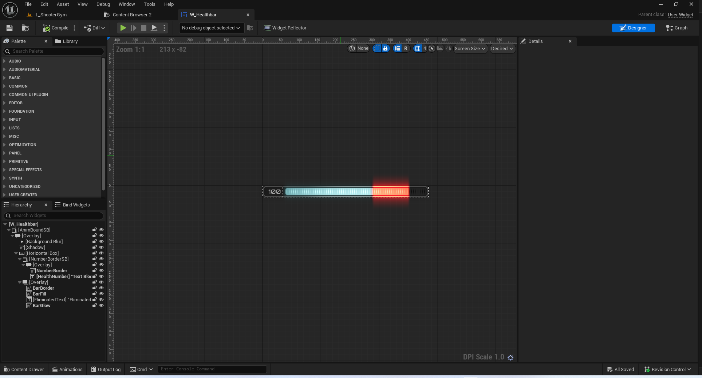

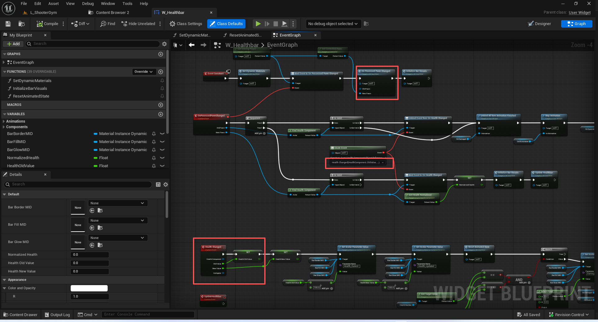

注意下面这个,写法比较特殊.在后面的章节再讲.这个是用来标识场景内其他角色的血条.
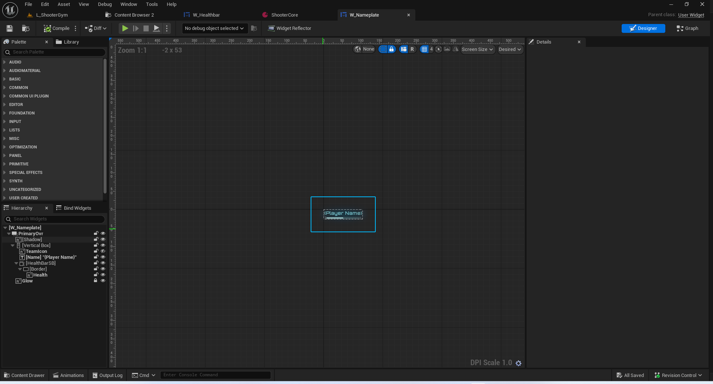

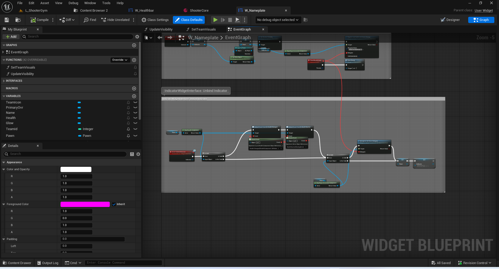

### 自我毁灭的伤害

``` cpp
void ALyraCharacter::FellOutOfWorld(const class UDamageType& dmgType)
{
	HealthComponent->DamageSelfDestruct(/*bFellOutOfWorld=*/ true);
}

```
``` cpp
void ULyraCheatManager::DamageSelfDestruct()
{
	if (ALyraPlayerController* LyraPC = Cast<ALyraPlayerController>(GetOuterAPlayerController()))
	{
 		if (const ULyraPawnExtensionComponent* PawnExtComp = ULyraPawnExtensionComponent::FindPawnExtensionComponent(LyraPC->GetPawn()))
		{
			if (PawnExtComp->HasReachedInitState(LyraGameplayTags::InitState_GameplayReady))
			{
				if (ULyraHealthComponent* HealthComponent = ULyraHealthComponent::FindHealthComponent(LyraPC->GetPawn()))
				{
					HealthComponent->DamageSelfDestruct();
				}
			}
		}
	}
}
```
``` cpp
void ULyraBotCreationComponent::RemoveOneBot()
{
	if (SpawnedBotList.Num() > 0)
	{
		// Right now this removes a random bot as they're all the same; could prefer to remove one
		// that's high skill or low skill or etc... depending on why you are removing one
		// 目前，我们会随机移除一个机器人，因为它们都是相同的；但也可以选择移除一个技能水平较高或较低的机器人，这取决于你为何要移除某个机器人。
		const int32 BotToRemoveIndex = FMath::RandRange(0, SpawnedBotList.Num() - 1);

		AAIController* BotToRemove = SpawnedBotList[BotToRemoveIndex];
		SpawnedBotList.RemoveAtSwap(BotToRemoveIndex);

		if (BotToRemove)
		{
			// If we can find a health component, self-destruct it, otherwise just destroy the actor
			// 如果我们能找到一个健康组件，就将其销毁，否则就直接摧毁该角色。
			if (APawn* ControlledPawn = BotToRemove->GetPawn())
			{
				if (ULyraHealthComponent* HealthComponent = ULyraHealthComponent::FindHealthComponent(ControlledPawn))
				{
					// Note, right now this doesn't work quite as desired: as soon as the player state goes away when
					// the controller is destroyed, the abilities like the death animation will be interrupted immediately
					// 需要注意的是，目前这一功能的运行效果并不完全如预期：一旦玩家状态因控制器被销毁而消失，诸如死亡动画之类的功能就会立即中断。
					HealthComponent->DamageSelfDestruct();
				}
				else
				{
					ControlledPawn->Destroy();
				}
			}

			// Destroy the controller (will cause it to Logout, etc...)
			// 销毁控制器（这将导致其退出登录等操作）
			BotToRemove->Destroy();
		}
	}
}


```

``` cpp
void ULyraHealthComponent::DamageSelfDestruct(bool bFellOutOfWorld)
{
	if ((DeathState == ELyraDeathState::NotDead) && AbilitySystemComponent)
	{
		const TSubclassOf<UGameplayEffect> DamageGE = ULyraAssetManager::GetSubclass(ULyraGameData::Get().DamageGameplayEffect_SetByCaller);
		if (!DamageGE)
		{
			UE_LOG(LogLyra, Error, TEXT("LyraHealthComponent: DamageSelfDestruct failed for owner [%s]. Unable to find gameplay effect [%s]."), *GetNameSafe(GetOwner()), *ULyraGameData::Get().DamageGameplayEffect_SetByCaller.GetAssetName());
			return;
		}

		FGameplayEffectSpecHandle SpecHandle = AbilitySystemComponent->MakeOutgoingSpec(DamageGE, 1.0f, AbilitySystemComponent->MakeEffectContext());
		FGameplayEffectSpec* Spec = SpecHandle.Data.Get();

		if (!Spec)
		{
			UE_LOG(LogLyra, Error, TEXT("LyraHealthComponent: DamageSelfDestruct failed for owner [%s]. Unable to make outgoing spec for [%s]."), *GetNameSafe(GetOwner()), *GetNameSafe(DamageGE));
			return;
		}

		Spec->AddDynamicAssetTag(TAG_Gameplay_DamageSelfDestruct);

		if (bFellOutOfWorld)
		{
			Spec->AddDynamicAssetTag(TAG_Gameplay_FellOutOfWorld);
		}

		const float DamageAmount = GetMaxHealth();

		Spec->SetSetByCallerMagnitude(LyraGameplayTags::SetByCaller_Damage, DamageAmount);
		AbilitySystemComponent->ApplyGameplayEffectSpecToSelf(*Spec);
	}
}


```

### 触发死亡技能
``` cpp

void ULyraHealthComponent::HandleOutOfHealth(AActor* DamageInstigator, AActor* DamageCauser, const FGameplayEffectSpec* DamageEffectSpec, float DamageMagnitude, float OldValue, float NewValue)
{
	//只在服务器上处理!
#if WITH_SERVER_CODE
	if (AbilitySystemComponent && DamageEffectSpec)
	{
		// Send the "GameplayEvent.Death" gameplay event through the owner's ability system.  This can be used to trigger a death gameplay ability.
		// 通过对象的能力系统发送“GameplayEvent.Death”这一游戏事件。此操作可用于触发死亡类游戏能力。
		{
			FGameplayEventData Payload;
			Payload.EventTag = LyraGameplayTags::GameplayEvent_Death;
			Payload.Instigator = DamageInstigator;
			Payload.Target = AbilitySystemComponent->GetAvatarActor();
			Payload.OptionalObject = DamageEffectSpec->Def;
			Payload.ContextHandle = DamageEffectSpec->GetEffectContext();
			Payload.InstigatorTags = *DamageEffectSpec->CapturedSourceTags.GetAggregatedTags();
			Payload.TargetTags = *DamageEffectSpec->CapturedTargetTags.GetAggregatedTags();
			Payload.EventMagnitude = DamageMagnitude;

			FScopedPredictionWindow NewScopedWindow(AbilitySystemComponent, true);
			AbilitySystemComponent->HandleGameplayEvent(Payload.EventTag, &Payload);
		}

		// Send a standardized verb message that other systems can observe
		// 发送一条标准化的动词信息，以便其他系统能够进行观察
		{
			FLyraVerbMessage Message;
			Message.Verb = TAG_Lyra_Elimination_Message;
			Message.Instigator = DamageInstigator;
			Message.InstigatorTags = *DamageEffectSpec->CapturedSourceTags.GetAggregatedTags();
			Message.Target = ULyraVerbMessageHelpers::GetPlayerStateFromObject(AbilitySystemComponent->GetAvatarActor());
			Message.TargetTags = *DamageEffectSpec->CapturedTargetTags.GetAggregatedTags();
			//@TODO: Fill out context tags, and any non-ability-system source/instigator tags
			//@TODO: Determine if it's an opposing team kill, self-own, team kill, etc...

			//@待办事项：填写情境标签，以及任何非能力系统来源/发起者标签
			//@待办事项：确定这是对方队伍击杀、自身失误击杀还是团队击杀等情况。
			UGameplayMessageSubsystem& MessageSystem = UGameplayMessageSubsystem::Get(GetWorld());
			MessageSystem.BroadcastMessage(Message.Verb, Message);
		}

		//@TODO: assist messages (could compute from damage dealt elsewhere)?
		//@待办事项：辅助信息提示（是否可以从其他地方计算得出造成的伤害值？）
	}

#endif // #if WITH_SERVER_CODE
}


```

## 死亡流程
### 死亡枚举
``` cpp

UENUM(BlueprintType)
enum class ELyraDeathState : uint8
{
	NotDead = 0,
	DeathStarted,
	DeathFinished
};

```
### 触发死亡
``` cpp
void ULyraHealthComponent::HandleOutOfHealth(AActor* DamageInstigator, AActor* DamageCauser, const FGameplayEffectSpec* DamageEffectSpec, float DamageMagnitude, float OldValue, float NewValue)
{
	//只在服务器上处理!
#if WITH_SERVER_CODE
	if (AbilitySystemComponent && DamageEffectSpec)
	{
		// Send the "GameplayEvent.Death" gameplay event through the owner's ability system.  This can be used to trigger a death gameplay ability.
		// 通过对象的能力系统发送“GameplayEvent.Death”这一游戏事件。此操作可用于触发死亡类游戏能力。
		{
			FGameplayEventData Payload;
			Payload.EventTag = LyraGameplayTags::GameplayEvent_Death;
			Payload.Instigator = DamageInstigator;
			Payload.Target = AbilitySystemComponent->GetAvatarActor();
			Payload.OptionalObject = DamageEffectSpec->Def;
			Payload.ContextHandle = DamageEffectSpec->GetEffectContext();
			Payload.InstigatorTags = *DamageEffectSpec->CapturedSourceTags.GetAggregatedTags();
			Payload.TargetTags = *DamageEffectSpec->CapturedTargetTags.GetAggregatedTags();
			Payload.EventMagnitude = DamageMagnitude;

			FScopedPredictionWindow NewScopedWindow(AbilitySystemComponent, true);
			AbilitySystemComponent->HandleGameplayEvent(Payload.EventTag, &Payload);
		}
		// ....

	}

#endif // #if WITH_SERVER_CODE
}
```

### 死亡技能
``` cpp

/**
 * ULyraGameplayAbility_Death
 *
 *	Gameplay ability used for handling death.
 *	Ability is activated automatically via the "GameplayEvent.Death" ability trigger tag.
 * 游戏玩法中用于应对死亡的机制。
 * 该能力会自动通过“GameplayEvent.Death”这一能力触发标签来激活。
 */
UCLASS(Abstract)
class ULyraGameplayAbility_Death : public ULyraGameplayAbility
{
	GENERATED_BODY()

public:

	// 构造函数
	// 修改了NetExecutionPolicy 很重要!!!
	ULyraGameplayAbility_Death(const FObjectInitializer& ObjectInitializer = FObjectInitializer::Get());

protected:

	virtual void ActivateAbility(const FGameplayAbilitySpecHandle Handle, const FGameplayAbilityActorInfo* ActorInfo, const FGameplayAbilityActivationInfo ActivationInfo, const FGameplayEventData* TriggerEventData) override;
	virtual void EndAbility(const FGameplayAbilitySpecHandle Handle, const FGameplayAbilityActorInfo* ActorInfo, const FGameplayAbilityActivationInfo ActivationInfo, bool bReplicateEndAbility, bool bWasCancelled) override;

	// Starts the death sequence.
	// 开始死亡流程。
	UFUNCTION(BlueprintCallable, Category = "Lyra|Ability")
	void StartDeath();

	// Finishes the death sequence.
	// 完成死亡过程。
	UFUNCTION(BlueprintCallable, Category = "Lyra|Ability")
	void FinishDeath();

protected:

	// If enabled, the ability will automatically call StartDeath.  FinishDeath is always called when the ability ends if the death was started.
	// 若启用此功能，则该能力会自动调用“开始死亡”函数。若死亡过程已开始，则无论该能力何时结束，都会自动调用“结束死亡”函数。
	UPROPERTY(EditDefaultsOnly, BlueprintReadOnly, Category = "Lyra|Death")
	bool bAutoStartDeath;
};


```

### 关联触发器
``` cpp

ULyraGameplayAbility_Death::ULyraGameplayAbility_Death(const FObjectInitializer& ObjectInitializer)
	: Super(ObjectInitializer)
{
	InstancingPolicy = EGameplayAbilityInstancingPolicy::InstancedPerActor;
	// 重要!!!
	// 此功能由服务器启动，但若本地客户端存在，则也会在其上运行。
	NetExecutionPolicy = EGameplayAbilityNetExecutionPolicy::ServerInitiated;

	bAutoStartDeath = true;

	if (HasAnyFlags(RF_ClassDefaultObject))
	{
		// Add the ability trigger tag as default to the CDO.
		// 将“能力触发”标签默认添加到 CDO 中。
		FAbilityTriggerData TriggerData;
		TriggerData.TriggerTag = LyraGameplayTags::GameplayEvent_Death;
		TriggerData.TriggerSource = EGameplayAbilityTriggerSource::GameplayEvent;
		AbilityTriggers.Add(TriggerData);
	}
}

```
### 能力的注册
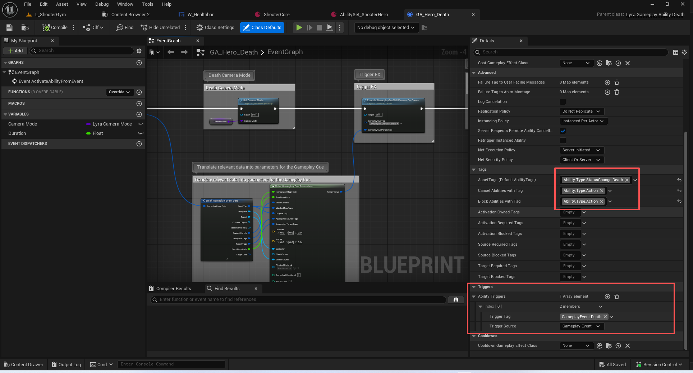
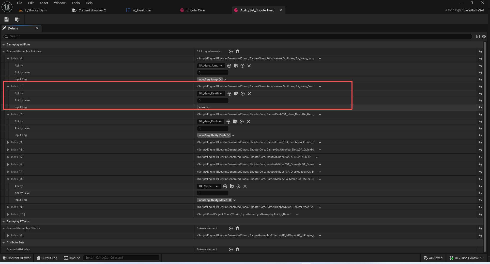

### 激活死亡能力
``` cpp
void ULyraGameplayAbility_Death::ActivateAbility(const FGameplayAbilitySpecHandle Handle, const FGameplayAbilityActorInfo* ActorInfo, const FGameplayAbilityActivationInfo ActivationInfo, const FGameplayEventData* TriggerEventData)
{
	check(ActorInfo);

	ULyraAbilitySystemComponent* LyraASC = CastChecked<ULyraAbilitySystemComponent>(ActorInfo->AbilitySystemComponent.Get());

	FGameplayTagContainer AbilityTypesToIgnore;
	AbilityTypesToIgnore.AddTag(LyraGameplayTags::Ability_Behavior_SurvivesDeath);

	// Cancel all abilities and block others from starting.
	// 撤销所有能力，并阻止他人开始。
	// 没有AbilityTypesToIgnore的都要被取消掉
	LyraASC->CancelAbilities(nullptr, &AbilityTypesToIgnore, this);

	// 自己本身不可被取消
	SetCanBeCanceled(false);

	// 将自己设置为阻塞的激活策略
	if (!ChangeActivationGroup(ELyraAbilityActivationGroup::Exclusive_Blocking))
	{
		UE_LOG(LogLyraAbilitySystem, Error,
			TEXT("ULyraGameplayAbility_Death::ActivateAbility: Ability [%s] failed to change activation group to blocking."), *GetName());
	}

	// 自动开始死亡 转发出去
	if (bAutoStartDeath)
	{
		StartDeath();
	}

	Super::ActivateAbility(Handle, ActorInfo, ActivationInfo, TriggerEventData);
}


```

``` cpp

void ULyraGameplayAbility::ActivateAbility(const FGameplayAbilitySpecHandle Handle, const FGameplayAbilityActorInfo* ActorInfo, const FGameplayAbilityActivationInfo ActivationInfo, const FGameplayEventData* TriggerEventData)
{
	Super::ActivateAbility(Handle, ActorInfo, ActivationInfo, TriggerEventData);

	
	
	// 原生子类应当重写 ActivateAbility 方法，并调用 CommitAbility 方法。
	// CommitAbility 方法用于进行最后的资源消耗检查。
	// 此函数的先前版本会调用 CommitAbility 方法，但这会导致调用者无法得知结果。您的重写版本应当调用该方法并检查结果。
	// Here is some starter code:

	
	//	if (!CommitAbility(Handle, ActorInfo, ActivationInfo))
	//	{			
	//		constexpr bool bReplicateEndAbility = true;
	//		constexpr bool bWasCancelled = true;
	//		EndAbility(Handle, ActorInfo, ActivationInfo, bReplicateEndAbility, bWasCancelled);
	//	}
	
}
```

``` cpp
void UGameplayAbility::ActivateAbility(const FGameplayAbilitySpecHandle Handle, const FGameplayAbilityActorInfo* ActorInfo, const FGameplayAbilityActivationInfo ActivationInfo, const FGameplayEventData* TriggerEventData)
{
	if (TriggerEventData && bHasBlueprintActivateFromEvent)
	{
		// A Blueprinted ActivateAbility function must call CommitAbility somewhere in its execution chain.
		K2_ActivateAbilityFromEvent(*TriggerEventData);
	}
	else if (bHasBlueprintActivate)
	{
		// A Blueprinted ActivateAbility function must call CommitAbility somewhere in its execution chain.
		K2_ActivateAbility();
	}
	else if (bHasBlueprintActivateFromEvent)
	{
		UE_LOG(LogAbilitySystem, Warning, TEXT("Ability %s expects event data but none is being supplied. Use 'Activate Ability' instead of 'Activate Ability From Event' in the Blueprint."), *GetName());
		constexpr bool bReplicateEndAbility = false;
		constexpr bool bWasCancelled = true;
		EndAbility(Handle, ActorInfo, ActivationInfo, bReplicateEndAbility, bWasCancelled);
	}
	else
	{
		// Native child classes should override ActivateAbility and call CommitAbility.
		// CommitAbility is used to do one last check for spending resources.
		// Previous versions of this function called CommitAbility but that prevents the callers
		// from knowing the result. Your override should call it and check the result.
		// Here is some starter code:
		
		//	if (!CommitAbility(Handle, ActorInfo, ActivationInfo))
		//	{			
		//		constexpr bool bReplicateEndAbility = true;
		//		constexpr bool bWasCancelled = true;
		//		EndAbility(Handle, ActorInfo, ActivationInfo, bReplicateEndAbility, bWasCancelled);
		//	}
	}
}

```
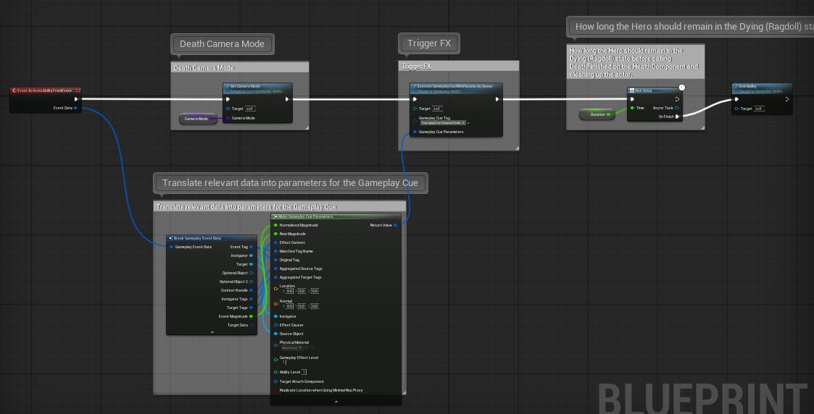


死亡的粒子效果:
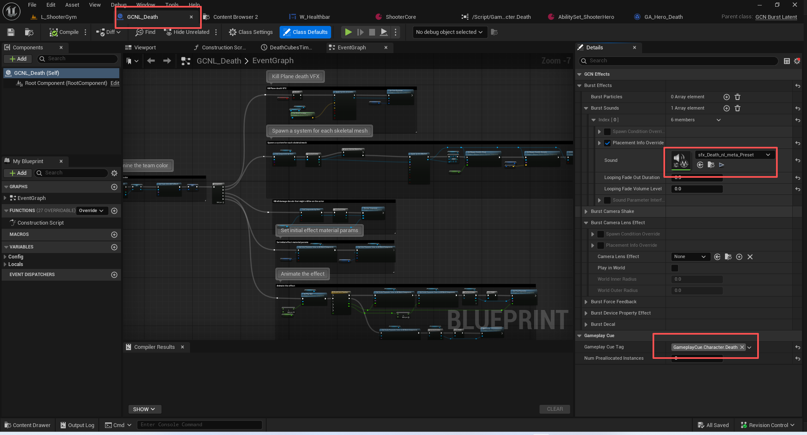


### 触发开始死亡
``` cpp
void ULyraGameplayAbility_Death::StartDeath()
{
	if (ULyraHealthComponent* HealthComponent = ULyraHealthComponent::FindHealthComponent(GetAvatarActorFromActorInfo()))
	{
		if (HealthComponent->GetDeathState() == ELyraDeathState::NotDead)
		{
			HealthComponent->StartDeath();
		}
	}
}

```

### 触发完成死亡

``` cpp
void ULyraGameplayAbility_Death::EndAbility(const FGameplayAbilitySpecHandle Handle, const FGameplayAbilityActorInfo* ActorInfo, const FGameplayAbilityActivationInfo ActivationInfo, bool bReplicateEndAbility, bool bWasCancelled)
{
	check(ActorInfo);

	// Always try to finish the death when the ability ends in case the ability doesn't.
	// This won't do anything if the death hasn't been started.

	// 无论何时，只要该技能结束，就一定要确保完成死亡效果，以防该技能无法生效。
	// 如果死亡效果尚未开始，此操作将毫无作用。
	
	FinishDeath();

	Super::EndAbility(Handle, ActorInfo, ActivationInfo, bReplicateEndAbility, bWasCancelled);
}

```
``` cpp
void ULyraGameplayAbility_Death::FinishDeath()
{
	if (ULyraHealthComponent* HealthComponent = ULyraHealthComponent::FindHealthComponent(GetAvatarActorFromActorInfo()))
	{
		if (HealthComponent->GetDeathState() == ELyraDeathState::DeathStarted)
		{
			HealthComponent->FinishDeath();
		}
	}
}

```

### 死亡网络同步开始

``` cpp
	// Replicated state used to handle dying.
	// 用于处理对象死亡情况的复制状态。
	UPROPERTY(ReplicatedUsing = OnRep_DeathState)
	ELyraDeathState DeathState;

```

``` cpp
void ULyraHealthComponent::StartDeath()
{
	// 注意这里的死亡 服务器是从GA过来的
	// 客户端时走网络同步过来的
	
	
	if (DeathState != ELyraDeathState::NotDead)
	{
		return;
	}

	DeathState = ELyraDeathState::DeathStarted;

	if (AbilitySystemComponent)
	{
		AbilitySystemComponent->SetLooseGameplayTagCount(LyraGameplayTags::Status_Death_Dying, 1);
	}

	AActor* Owner = GetOwner();
	check(Owner);

	OnDeathStarted.Broadcast(Owner);

	Owner->ForceNetUpdate();
}


```

触发布娃娃
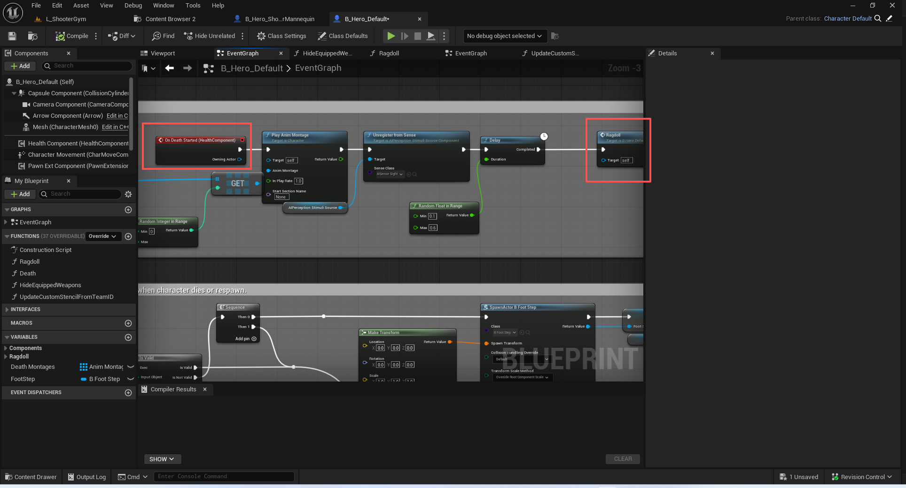

``` cpp

void ALyraCharacter::OnDeathStarted(AActor*)
{
	DisableMovementAndCollision();
}
```
``` cpp

void ALyraCharacter::DisableMovementAndCollision()
{
	if (GetController())
	{
		GetController()->SetIgnoreMoveInput(true);
	}

	UCapsuleComponent* CapsuleComp = GetCapsuleComponent();
	check(CapsuleComp);
	CapsuleComp->SetCollisionEnabled(ECollisionEnabled::NoCollision);
	CapsuleComp->SetCollisionResponseToAllChannels(ECR_Ignore);

	ULyraCharacterMovementComponent* LyraMoveComp = CastChecked<ULyraCharacterMovementComponent>(GetCharacterMovement());
	LyraMoveComp->StopMovementImmediately();
	LyraMoveComp->DisableMovement();
}

```
### 客户端收到同步死亡
``` cpp
void ULyraHealthComponent::OnRep_DeathState(ELyraDeathState OldDeathState)
{
	const ELyraDeathState NewDeathState = DeathState;

	// Revert the death state for now since we rely on StartDeath and FinishDeath to change it.
	// 现在先恢复死亡状态，因为我们是通过调用 StartDeath 和 FinishDeath 来改变该状态的。
	DeathState = OldDeathState;

	// 我们已经预判了服务器的死亡,所以这里不做处理,当然这是不对的.
	if (OldDeathState > NewDeathState)
	{
		// The server is trying to set us back but we've already predicted past the server state.
		// 服务器试图让我们原地不动，但我们已经超出了服务器所处的状态范围。
		UE_LOG(LogLyra, Warning, TEXT("LyraHealthComponent: Predicted past server death state [%d] -> [%d] for owner [%s]."), (uint8)OldDeathState, (uint8)NewDeathState, *GetNameSafe(GetOwner()));
		return;
	}

	if (OldDeathState == ELyraDeathState::NotDead)
	{
		if (NewDeathState == ELyraDeathState::DeathStarted)
		{
			// 开始死亡
			StartDeath();
		}
		else if (NewDeathState == ELyraDeathState::DeathFinished)
		{
			// 开始死亡
			StartDeath();
			// 完成死亡
			FinishDeath();
		}
		else
		{
			// 无效的过度
			UE_LOG(LogLyra, Error, TEXT("LyraHealthComponent: Invalid death transition [%d] -> [%d] for owner [%s]."), (uint8)OldDeathState, (uint8)NewDeathState, *GetNameSafe(GetOwner()));
		}
	}
	else if (OldDeathState == ELyraDeathState::DeathStarted)
	{
		if (NewDeathState == ELyraDeathState::DeathFinished)
		{
			// 完成死亡
			FinishDeath();
		}
		else
		{
			UE_LOG(LogLyra, Error, TEXT("LyraHealthComponent: Invalid death transition [%d] -> [%d] for owner [%s]."), (uint8)OldDeathState, (uint8)NewDeathState, *GetNameSafe(GetOwner()));
		}
	}

	ensureMsgf((DeathState == NewDeathState), TEXT("LyraHealthComponent: Death transition failed [%d] -> [%d] for owner [%s]."), (uint8)OldDeathState, (uint8)NewDeathState, *GetNameSafe(GetOwner()));
}

```
### 完成死亡
``` cpp
void ULyraHealthComponent::FinishDeath()
{

	if (DeathState != ELyraDeathState::DeathStarted)
	{
		return;
	}

	DeathState = ELyraDeathState::DeathFinished;

	if (AbilitySystemComponent)
	{
		AbilitySystemComponent->SetLooseGameplayTagCount(LyraGameplayTags::Status_Death_Dead, 1);
	}

	AActor* Owner = GetOwner();
	check(Owner);

	OnDeathFinished.Broadcast(Owner);

	Owner->ForceNetUpdate();
}

```
``` cpp
void ALyraCharacter::OnDeathFinished(AActor*)
{
	GetWorld()->GetTimerManager().SetTimerForNextTick(this, &ThisClass::DestroyDueToDeath);
}


```
``` cpp
void ALyraCharacter::DestroyDueToDeath()
{
	K2_OnDeathFinished();

	UninitAndDestroy();
}


```
``` cpp

void ALyraCharacter::UninitAndDestroy()
{
	if (GetLocalRole() == ROLE_Authority)
	{
		/** 调用此函数可安全地将兵卒从其控制器处分离出来，要知道我们很快就会被摧毁。*/
		DetachFromControllerPendingDestroy();
		SetLifeSpan(0.1f);
	}

	// Uninitialize the ASC if we're still the avatar actor (otherwise another pawn already did it when they became the avatar actor)
	// 如果我们仍是角色扮演者，则解除 ASC 的初始化（否则，当其他玩家成为角色扮演者时，他们已经完成了这一操作）
	if (ULyraAbilitySystemComponent* LyraASC = GetLyraAbilitySystemComponent())
	{
		if (LyraASC->GetAvatarActor() == this)
		{
			PawnExtComponent->UninitializeAbilitySystem();
		}
	}
	// 将该角色设置为游戏中的隐藏状态 true 关联组件也隐藏
	SetActorHiddenInGame(true);
}


```

## 重生流程
重生流程时通过GA_AutoRespawn完成.这个技能类似于被动技能
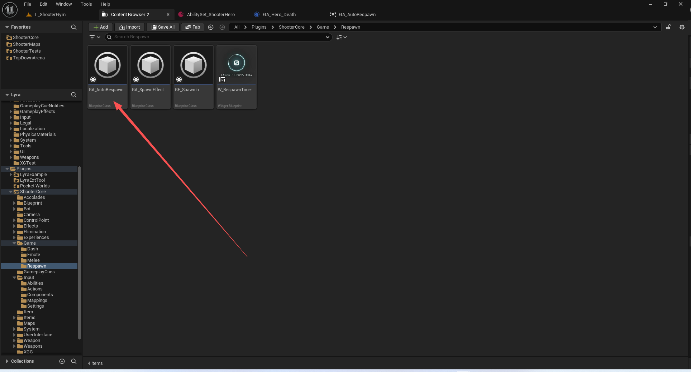
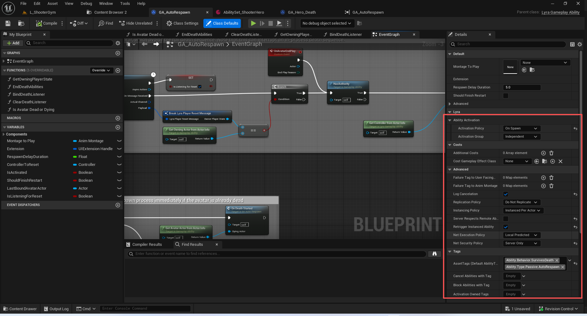
因为蓝图过多.用语言概括一下功能.
1.能力一直都是处于激活的状态.
2.有一个倒计时的UMG会被添加到视口.使用时可以看到倒计时.
3.该能力触发重置角色有三个入口:
a.通过Reset消息触发,用于过场动画结束后,重置玩家状态
b.角色销毁了,给玩家重新生成一个,不需要延时.
c.角色开始死亡了,延时后,给玩家重新生成一个,不停刷新倒计时器!
4.通过GameMode触发RequestPlayerRestartNextFrame!
5.记得需要通过RPC刷新倒计时,而不单是服务器这边的.

## 重置流程
``` cpp
/**
 * ULyraGameplayAbility_Reset
 *
 *	Gameplay ability used for handling quickly resetting the player back to initial spawn state.
 *	Ability is activated automatically via the "GameplayEvent.RequestReset" ability trigger tag (server only).
 *
 * 游戏玩法中用于迅速将玩家恢复至初始生成状态的功能。
 * 此功能会通过“GameplayEvent.RequestReset”能力触发标签自动激活（仅限服务器端）。
 *	
 */
UCLASS(MinimalAPI)
class ULyraGameplayAbility_Reset : public ULyraGameplayAbility
{
	GENERATED_BODY()

public:
	UE_API ULyraGameplayAbility_Reset(const FObjectInitializer& ObjectInitializer = FObjectInitializer::Get());

protected:
	
	UE_API virtual void ActivateAbility(const FGameplayAbilitySpecHandle Handle, const FGameplayAbilityActorInfo* ActorInfo, const FGameplayAbilityActivationInfo ActivationInfo, const FGameplayEventData* TriggerEventData) override;
};


USTRUCT(BlueprintType)
struct FLyraPlayerResetMessage
{
	GENERATED_BODY()

	UPROPERTY(BlueprintReadOnly)
	TObjectPtr<AActor> OwnerPlayerState = nullptr;
};


```
``` cpp
ULyraGameplayAbility_Reset::ULyraGameplayAbility_Reset(const FObjectInitializer& ObjectInitializer)
	: Super(ObjectInitializer)
{
	InstancingPolicy = EGameplayAbilityInstancingPolicy::InstancedPerActor;
	// 重要
	NetExecutionPolicy = EGameplayAbilityNetExecutionPolicy::ServerInitiated;

	if (HasAnyFlags(RF_ClassDefaultObject))
	{
		// Add the ability trigger tag as default to the CDO.
		// 将“能力触发”标签默认添加到 CDO 中。
		FAbilityTriggerData TriggerData;
		TriggerData.TriggerTag = LyraGameplayTags::GameplayEvent_RequestReset;
		TriggerData.TriggerSource = EGameplayAbilityTriggerSource::GameplayEvent;
		AbilityTriggers.Add(TriggerData);
	}
}

void ULyraGameplayAbility_Reset::ActivateAbility(const FGameplayAbilitySpecHandle Handle, const FGameplayAbilityActorInfo* ActorInfo, const FGameplayAbilityActivationInfo ActivationInfo, const FGameplayEventData* TriggerEventData)
{
	check(ActorInfo);

	ULyraAbilitySystemComponent* LyraASC = CastChecked<ULyraAbilitySystemComponent>(ActorInfo->AbilitySystemComponent.Get());

	FGameplayTagContainer AbilityTypesToIgnore;
	AbilityTypesToIgnore.AddTag(LyraGameplayTags::Ability_Behavior_SurvivesDeath);

	// Cancel all abilities and block others from starting.
	// 撤销所有能力，并阻止他人开始。
	LyraASC->CancelAbilities(nullptr, &AbilityTypesToIgnore, this);

	SetCanBeCanceled(false);

	// Execute the reset from the character
	// 从角色角度执行重置操作
	if (ALyraCharacter* LyraChar = Cast<ALyraCharacter>(CurrentActorInfo->AvatarActor.Get()))
	{
		LyraChar->Reset();
	}

	// Let others know a reset has occurred
	// 让其他人知晓已进行过重置操作
	FLyraPlayerResetMessage Message;
	Message.OwnerPlayerState = CurrentActorInfo->OwnerActor.Get();
	UGameplayMessageSubsystem& MessageSystem = UGameplayMessageSubsystem::Get(this);
	MessageSystem.BroadcastMessage(LyraGameplayTags::GameplayEvent_Reset, Message);

	Super::ActivateAbility(Handle, ActorInfo, ActivationInfo, TriggerEventData);

	const bool bReplicateEndAbility = true;
	const bool bWasCanceled = false;
	EndAbility(CurrentSpecHandle, CurrentActorInfo, CurrentActivationInfo, bReplicateEndAbility, bWasCanceled);
}


```
用于暖场阶段后重置能力.
这部分逻辑后续章节章节

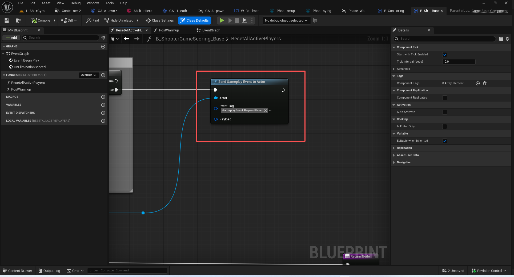


## 总结
本节基本上把人物的死亡于重生流程阐述完毕.


