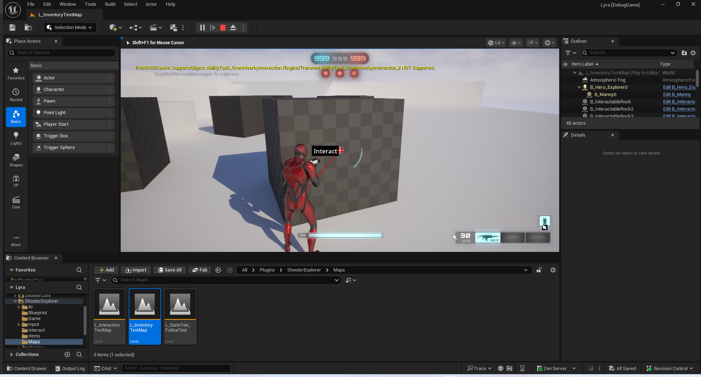

# UE5_Lyra学习指南_089_可交互拾取功能

本文章仅为小刚-B站课堂-虚幻引擎视频课程Lyra-精讲的演讲手稿.  
本套课程链接:[[UE5]虚幻引擎游戏案例Lyra精讲](https://www.bilibili.com/cheese/play/ss112001159)  
前置课程链接:[[UE5]虚幻引擎UEC++从基础到进阶](https://www.bilibili.com/cheese/play/ss28043)  

文章内容由小刚撰写,采用了以下多种方式:  
1.口述转文字  
2.AI重构  
3.参考引擎源码  
4.Lyra工程源码  
5.结合社区论坛各位大佬的解析  

- [UE5\_Lyra学习指南\_089\_可交互拾取功能](#ue5_lyra学习指南_089_可交互拾取功能)
	- [概述](#概述)
	- [可收集的物品定义](#可收集的物品定义)
	- [可拾取物品接口](#可拾取物品接口)
	- [可交互对象接口](#可交互对象接口)
		- [交互选项](#交互选项)
		- [交互查询](#交互查询)
		- [交互发起者接口](#交互发起者接口)
	- [工具函数](#工具函数)
	- [辅助生成Actor](#辅助生成actor)
	- [总结](#总结)


## 概述

这部分的代码,上层部分并没有全部完成.
并且和射击游戏本体不是强相关的,学习时主要区分!
## 可收集的物品定义
``` cpp
/**
 * 
 */
UCLASS(Abstract, Blueprintable)
class ALyraWorldCollectable : public AActor, public IInteractableTarget, public IPickupable
{
	GENERATED_BODY()

public:

	ALyraWorldCollectable();

	virtual void GatherInteractionOptions(const FInteractionQuery& InteractQuery, FInteractionOptionBuilder& InteractionBuilder) override;
	virtual FInventoryPickup GetPickupInventory() const override;

protected:
	UPROPERTY(EditAnywhere)
	FInteractionOption Option;

	UPROPERTY(EditAnywhere)
	FInventoryPickup StaticInventory;
};


```
## 可拾取物品接口
``` cpp
/**  */
class IPickupable
{
	GENERATED_BODY()

public:
	UFUNCTION(BlueprintCallable)
	virtual FInventoryPickup GetPickupInventory() const = 0;
};

/**  */
UCLASS()
class UPickupableStatics : public UBlueprintFunctionLibrary
{
	GENERATED_BODY()

public:
	UPickupableStatics();

public:
	UFUNCTION(BlueprintPure)
	static TScriptInterface<IPickupable> GetFirstPickupableFromActor(AActor* Actor);

	UFUNCTION(BlueprintCallable, BlueprintAuthorityOnly, meta = (WorldContext = "Ability"))
	static void AddPickupToInventory(ULyraInventoryManagerComponent* InventoryComponent, TScriptInterface<IPickupable> Pickup);
};
```
## 可交互对象接口
``` cpp
/**  */
class FInteractionOptionBuilder
{
public:
	FInteractionOptionBuilder(TScriptInterface<IInteractableTarget> InterfaceTargetScope, TArray<FInteractionOption>& InteractOptions)
		: Scope(InterfaceTargetScope)
		, Options(InteractOptions)
	{
	}

	void AddInteractionOption(const FInteractionOption& Option)
	{
		FInteractionOption& OptionEntry = Options.Add_GetRef(Option);
		OptionEntry.InteractableTarget = Scope;
	}

private:
	TScriptInterface<IInteractableTarget> Scope;
	TArray<FInteractionOption>& Options;
};

/**  */
UINTERFACE(MinimalAPI, meta = (CannotImplementInterfaceInBlueprint))
class UInteractableTarget : public UInterface
{
	GENERATED_BODY()
};

/**  */
class IInteractableTarget
{
	GENERATED_BODY()

public:
	/**  */
	virtual void GatherInteractionOptions(const FInteractionQuery& InteractQuery, FInteractionOptionBuilder& OptionBuilder) = 0;

	/**  */
	virtual void CustomizeInteractionEventData(const FGameplayTag& InteractionEventTag, FGameplayEventData& InOutEventData) { }
};

```
### 交互选项
``` cpp
/**  */
USTRUCT(BlueprintType)
struct FInteractionOption
{
	GENERATED_BODY()

public:
	/** The interactable target */
	/** 可交互的目标 */
	UPROPERTY(BlueprintReadWrite)
	TScriptInterface<IInteractableTarget> InteractableTarget;

	/** Simple text the interaction might return */
	/** 该交互可能返回的简单文本内容 */
	UPROPERTY(EditAnywhere, BlueprintReadWrite)
	FText Text;

	/** Simple sub-text the interaction might return */
	/** 该交互可能返回的简短辅助信息 */
	UPROPERTY(EditAnywhere, BlueprintReadWrite)
	FText SubText;

	// METHODS OF INTERACTION
	//--------------------------------------------------------------

	// 1) Place an ability on the avatar that they can activate when they perform interaction.

	/** The ability to grant the avatar when they get near interactable objects. */

	// 互动方式//--------------------------------------------------------------

	// 1) 为角色设定一项能力，当他们进行互动时即可激活该能力。
	/** 具备在角色靠近可交互物体时为其赋予虚拟形象的能力。*/
	UPROPERTY(EditAnywhere, BlueprintReadOnly)
	TSubclassOf<UGameplayAbility> InteractionAbilityToGrant;

	// - OR -

	// 2) Allow the object we're interacting with to have its own ability system and interaction ability, that we can activate instead.

	/** The ability system on the target that can be used for the TargetInteractionHandle and sending the event, if needed. */
	// - 或者 -

	// 2) 允许我们所操作的对象拥有自己的能力系统和交互能力，而我们可以自行激活这些功能。
	/** 目标上的能力系统，可用于“目标交互处理”操作以及在必要时发送事件。*/
	UPROPERTY(BlueprintReadOnly)
	TObjectPtr<UAbilitySystemComponent> TargetAbilitySystem = nullptr;

	/** The ability spec to activate on the object for this option. */
	/** 用于激活此选项的对象上的能力规格。*/
	UPROPERTY(BlueprintReadOnly)
	FGameplayAbilitySpecHandle TargetInteractionAbilityHandle;

	// UI
	//--------------------------------------------------------------

	/** The widget to show for this kind of interaction. */
	/** 此类交互所对应的显示的控件。*/
	UPROPERTY(EditAnywhere, BlueprintReadWrite)
	TSoftClassPtr<UUserWidget> InteractionWidgetClass;

	//--------------------------------------------------------------

public:
	FORCEINLINE bool operator==(const FInteractionOption& Other) const
	{
		return InteractableTarget == Other.InteractableTarget &&
			InteractionAbilityToGrant == Other.InteractionAbilityToGrant&&
			TargetAbilitySystem == Other.TargetAbilitySystem &&
			TargetInteractionAbilityHandle == Other.TargetInteractionAbilityHandle &&
			InteractionWidgetClass == Other.InteractionWidgetClass &&
			Text.IdenticalTo(Other.Text) &&
			SubText.IdenticalTo(Other.SubText);
	}

	FORCEINLINE bool operator!=(const FInteractionOption& Other) const
	{
		return !operator==(Other);
	}

	FORCEINLINE bool operator<(const FInteractionOption& Other) const
	{
		return InteractableTarget.GetInterface() < Other.InteractableTarget.GetInterface();
	}
};


```
### 交互查询
``` cpp
/**  */
USTRUCT(BlueprintType)
struct FInteractionQuery
{
	GENERATED_BODY()

public:
	/** The requesting pawn. */
	/** 请求方的棋子。*/
	UPROPERTY(BlueprintReadWrite)
	TWeakObjectPtr<AActor> RequestingAvatar;

	/** Allow us to specify a controller - does not need to match the owner of the requesting avatar. */
	/** 允许我们指定控制器——无需与请求操作的虚拟角色的所有者相匹配。*/
	UPROPERTY(BlueprintReadWrite)
	TWeakObjectPtr<AController> RequestingController;

	/** A generic UObject to shove in extra data required for the interaction */
	/** 一个通用的 UObject（对象字节码），用于存放与交互相关的额外数据 */
	UPROPERTY(BlueprintReadWrite)
	TWeakObjectPtr<UObject> OptionalObjectData;
};

```

### 交互发起者接口
``` cpp
/**  */
UINTERFACE(MinimalAPI, meta = (CannotImplementInterfaceInBlueprint))
class UInteractionInstigator : public UInterface
{
	GENERATED_BODY()
};

/**
 * Implementing this interface allows you to add an arbitrator to the interaction process.  For example,
 * some games present the user with a menu to pick which interaction they want to perform.  This will allow you
 * to take the multiple matches (Assuming your ULyraGameplayAbility_Interact subclass generates more than one option).
 */
/**
实现此接口后，您便能够将仲裁者添加到交互过程中。例如，
* 有些游戏会向用户展示一个菜单，让用户选择想要执行的交互操作。这样就能让您
* 获取到多种匹配结果（假设您的 ULyraGameplayAbility_Interact 子类生成了不止一个选项）。*/
class IInteractionInstigator
{
	GENERATED_BODY()

public:
	/** Will be called if there are more than one InteractOptions that need to be decided on. */
	virtual FInteractionOption ChooseBestInteractionOption(const FInteractionQuery& InteractQuery, const TArray<FInteractionOption>& InteractOptions) = 0;
};

```
## 工具函数
``` cpp
/**  */
UCLASS()
class UInteractionStatics : public UBlueprintFunctionLibrary
{
	GENERATED_BODY()

public:
	UInteractionStatics();

public:
	// 通过接口获取正在交互的对象
	UFUNCTION(BlueprintCallable)
	static AActor* GetActorFromInteractableTarget(TScriptInterface<IInteractableTarget> InteractableTarget);

	// 通过Actor获取可以交互的接口
	UFUNCTION(BlueprintCallable)
	static void GetInteractableTargetsFromActor(AActor* Actor, TArray<TScriptInterface<IInteractableTarget>>& OutInteractableTargets);

	// 从重叠结果中获取交互接口对象
	static void AppendInteractableTargetsFromOverlapResults(const TArray<FOverlapResult>& OverlapResults, TArray<TScriptInterface<IInteractableTarget>>& OutInteractableTargets);
	// 从碰撞检测接口中获取可交互的对象
	static void AppendInteractableTargetsFromHitResult(const FHitResult& HitResult, TArray<TScriptInterface<IInteractableTarget>>& OutInteractableTargets);
};

```

## 辅助生成Actor
这里主要是解释UAbilityTask_WaitTargetData的执行流程.
为什么BeginSpawningActor可以执行!
``` cpp

/**
* 能力任务是独立的小型操作，可在执行能力的过程中进行。
* 它们具有隐含性/异步性。通常会遵循“启动某项操作并等待其完成或被中断”的模式。*
* 在 K2Node_LatentAbilityCall 中，我们编写了相关代码以简化这些内容在蓝图中的使用。要熟悉 AbilityTasks，最好的方法是
* 研究现有的任务，比如 UAbilityTask_WaitOverlap（非常简单）和 UAbilityTask_WaitTargetData（要复杂得多）。*
* 这些是使用能力任务的基本要求：*
1) 在您的“能力任务”中定义动态组播以及可蓝图赋值的委托。这些就是您任务的输出结果。当这些委托触发时，执行将返回到调用的蓝图中继续进行。*
* 2) 您的输入是由一个静态工厂函数来定义的，该函数会实例化您的任务实例。此函数的参数定义了您任务的输入内容。所有工厂函数所要做的就是实例化您的任务，并可能设置初始参数。它不应调用任何回调委托！*
* 3) 实现一个名为“Activate()”的函数（该函数在基类中已定义好）。此函数应实际启动/执行您的任务逻辑。在此处调用回调委托是安全的。*
*
* 这就是完成基本能力任务所需的一切。*
*
* 检查清单：
* - 替代 ：：OnDestroy() 方法，并取消注册该任务所注册的任何回调函数。同时也要调用 Super:：EndTask 方法！
* - 实现了一个激活函数，该函数真正地“启动”任务。切勿在静态工厂函数中启动任务！*
*
*	--------------------------------------*
* 我们为那些希望生成角色的“能力任务”提供了额外的支持。虽然这一功能可以通过“激活”函数来实现，但无法传入动态的“在生成时暴露”角色属性。这是蓝图的强大功能之一，为了支持这一功能，您需要执行以下步骤 3：*
* 与其使用“Activate()”函数，您应当实现“BeginSpawningActor()”和“FinishSpawningActor()”这两个函数。*
*	“BeginSpawningActor()” 函数必须接收一个名为“Class”的 TSubclassOf<YourActorClassToSpawn> 类型的参数。此外，它还必须有一个名为“SpawnedActor”且类型为 YourActorClassToSpawn*& 的输出引用参数。该函数可以自行决定是否要生成该角色（如果希望根据网络权威来判断角色生成与否，则此功能很有用）。*
*	BeginSpawningActor() 可以使用 SpawnActorDeferred 来实例化一个角色。这一点非常重要，否则用户界面控制信号（UCS）会在 spawn 参数设置完成之前就运行。
*	BeginSpawningActor() 还应当将 SpawnedActor 参数设置为所实例化的角色。*
* 【接下来，生成的字节代码会将“生成时的参数暴露设置”调整为用户所设定的值】*
* 如果您创建了某个对象，那么会调用 FinishSpawningActor() 函数，并传入刚刚创建的该对象本身。您必须在这个对象上调用 ExecuteConstruction 和 PostActorConstruction 这两个函数！*
* 这里有诸多步骤，但总体而言，AbilityTask_SpawnActor() 函数提供了一个清晰且简洁的示例。*
*
*/
```

## 总结
这两节的内容,较为晦涩难懂.需要在下一节,给大家演示整个交互能力流程后才较为清晰!!!
