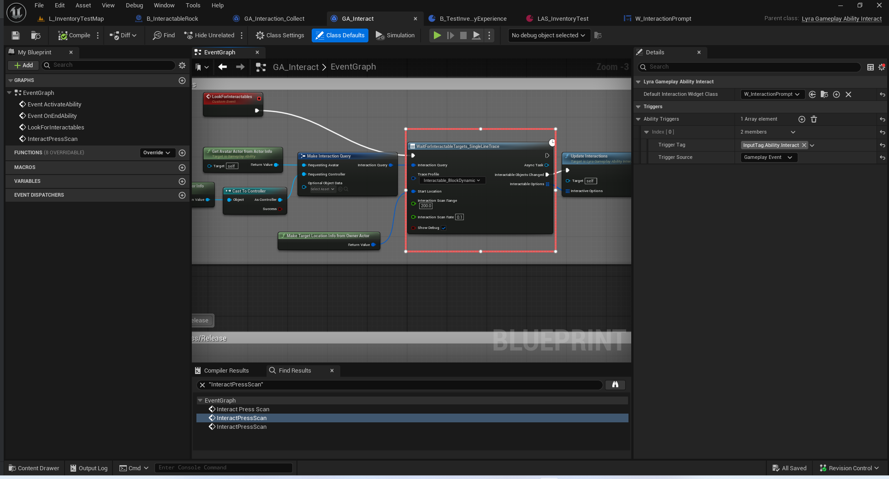

# UE5_Lyra学习指南_090_交互拾取流程

本文章仅为小刚-B站课堂-虚幻引擎视频课程Lyra-精讲的演讲手稿.  
本套课程链接:[[UE5]虚幻引擎游戏案例Lyra精讲](https://www.bilibili.com/cheese/play/ss112001159)  
前置课程链接:[[UE5]虚幻引擎UEC++从基础到进阶](https://www.bilibili.com/cheese/play/ss28043)  

文章内容由小刚撰写,采用了以下多种方式:  
1.口述转文字  
2.AI重构  
3.参考引擎源码  
4.Lyra工程源码  
5.结合社区论坛各位大佬的解析  

- [UE5\_Lyra学习指南\_090\_交互拾取流程](#ue5_lyra学习指南_090_交互拾取流程)
	- [概述](#概述)
	- [定时扫描任务](#定时扫描任务)
		- [扫描周围可交互的物品](#扫描周围可交互的物品)
		- [射线检测当前指向的交互目标](#射线检测当前指向的交互目标)
		- [更新提示](#更新提示)
	- [交互能力代码](#交互能力代码)
	- [按键执行交互](#按键执行交互)
	- [总结](#总结)


## 概述
本节主要讲解ShooterExplorer中的能力内容.
注意区分GA_Interact和GA_Interaction_Collect.
GA_Interact是不停的检测场景中交互的对象
GA_Interaction_Collect是交互中的对象基于的拾取能力!

## 定时扫描任务

### 扫描周围可交互的物品
将交互能力注册到自己的ASC上面.避免重复交易
``` cpp
UCLASS()
class UAbilityTask_GrantNearbyInteraction : public UAbilityTask
{
	GENERATED_UCLASS_BODY()

	virtual void Activate() override;

	/** Wait until an overlap occurs. This will need to be better fleshed out so we can specify game specific collision requirements */
	/** 等待出现重叠情况。这需要进一步完善，以便我们能够明确游戏特定的碰撞要求 */
	UFUNCTION(BlueprintCallable, Category="Ability|Tasks", meta = (HidePin = "OwningAbility", DefaultToSelf = "OwningAbility", BlueprintInternalUseOnly = "TRUE"))
	static UAbilityTask_GrantNearbyInteraction* GrantAbilitiesForNearbyInteractors(UGameplayAbility* OwningAbility,
		float InteractionScanRange, float InteractionScanRate);

private:

	virtual void OnDestroy(bool AbilityEnded) override;

	void QueryInteractables();

	float InteractionScanRange = 100;
	float InteractionScanRate = 0.100;

	FTimerHandle QueryTimerHandle;

	TMap<FObjectKey, FGameplayAbilitySpecHandle> InteractionAbilityCache;
};


```
### 射线检测当前指向的交互目标
``` cpp
UCLASS()
class UAbilityTask_WaitForInteractableTargets_SingleLineTrace : public UAbilityTask_WaitForInteractableTargets
{
	GENERATED_UCLASS_BODY()

	virtual void Activate() override;

	/** Wait until we trace new set of interactables.  This task automatically loops. */
	/** 等待我们追踪到新的交互对象。此任务会自动循环执行。*/
	UFUNCTION(BlueprintCallable, Category="Ability|Tasks", meta = (HidePin = "OwningAbility", DefaultToSelf = "OwningAbility", BlueprintInternalUseOnly = "TRUE"))
	static UAbilityTask_WaitForInteractableTargets_SingleLineTrace* WaitForInteractableTargets_SingleLineTrace(UGameplayAbility* OwningAbility, FInteractionQuery InteractionQuery, FCollisionProfileName TraceProfile, FGameplayAbilityTargetingLocationInfo StartLocation, float InteractionScanRange = 100, float InteractionScanRate = 0.100, bool bShowDebug = false);

private:

	virtual void OnDestroy(bool AbilityEnded) override;

	void PerformTrace();

	UPROPERTY()
	FInteractionQuery InteractionQuery;

	UPROPERTY()
	FGameplayAbilityTargetingLocationInfo StartLocation;

	float InteractionScanRange = 100;
	float InteractionScanRate = 0.100;
	bool bShowDebug = false;

	FTimerHandle TimerHandle;
};

```



### 更新提示
``` cpp
void ULyraGameplayAbility_Interact::UpdateInteractions(const TArray<FInteractionOption>& InteractiveOptions)
{
	if (ALyraPlayerController* PC = GetLyraPlayerControllerFromActorInfo())
	{
		// 是在这里更新指示器信息!!!!
		
		if (ULyraIndicatorManagerComponent* IndicatorManager = ULyraIndicatorManagerComponent::GetComponent(PC))
		{
			for (UIndicatorDescriptor* Indicator : Indicators)
			{
				IndicatorManager->RemoveIndicator(Indicator);
			}
			Indicators.Reset();

			for (const FInteractionOption& InteractionOption : InteractiveOptions)
			{
				AActor* InteractableTargetActor = UInteractionStatics::GetActorFromInteractableTarget(InteractionOption.InteractableTarget);

				TSoftClassPtr<UUserWidget> InteractionWidgetClass = 
					InteractionOption.InteractionWidgetClass.IsNull() ? DefaultInteractionWidgetClass : InteractionOption.InteractionWidgetClass;

				UIndicatorDescriptor* Indicator = NewObject<UIndicatorDescriptor>();
				Indicator->SetDataObject(InteractableTargetActor);
				Indicator->SetSceneComponent(InteractableTargetActor->GetRootComponent());
				Indicator->SetIndicatorClass(InteractionWidgetClass);
				IndicatorManager->AddIndicator(Indicator);

				Indicators.Add(Indicator);
			}
		}
		else
		{
			//TODO This should probably be a noisy warning.  Why are we updating interactions on a PC that can never do anything with them?
		}
	}

	CurrentOptions = InteractiveOptions;
}

```
## 交互能力代码
``` cpp
/**
 * ULyraGameplayAbility_Interact
 *
 * Gameplay ability used for character interacting
 * 用于角色互动的游戏操作能力
 */
UCLASS(Abstract)
class ULyraGameplayAbility_Interact : public ULyraGameplayAbility
{
	GENERATED_BODY()

public:
	// 构造函数 设置策略
	// 该能力属于被动能力, 生成时就激活.
	ULyraGameplayAbility_Interact(const FObjectInitializer& ObjectInitializer = FObjectInitializer::Get());

	virtual void ActivateAbility(const FGameplayAbilitySpecHandle Handle,
		const FGameplayAbilityActorInfo* ActorInfo, const FGameplayAbilityActivationInfo ActivationInfo, const FGameplayEventData* TriggerEventData) override;

	// 更新提示器
	UFUNCTION(BlueprintCallable)
	void UpdateInteractions(const TArray<FInteractionOption>& InteractiveOptions);

	UFUNCTION(BlueprintCallable)
	void TriggerInteraction();

protected:
	UPROPERTY(BlueprintReadWrite)
	TArray<FInteractionOption> CurrentOptions;

	UPROPERTY()
	TArray<TObjectPtr<UIndicatorDescriptor>> Indicators;

protected:

	// 交互扫描频率
	UPROPERTY(EditDefaultsOnly)
	float InteractionScanRate = 0.1f;

	// 交互扫描范围
	UPROPERTY(EditDefaultsOnly)
	float InteractionScanRange = 500;

	UPROPERTY(EditDefaultsOnly)
	TSoftClassPtr<UUserWidget> DefaultInteractionWidgetClass;
};

```
## 按键执行交互


## 总结
本节代码确实很凌乱.从蓝图连线都能看出后期的匆忙.