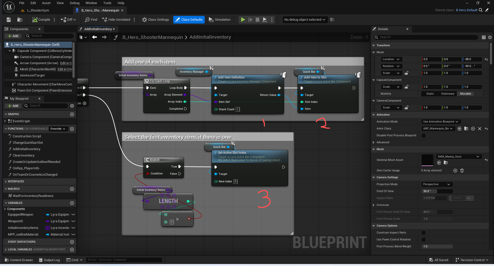
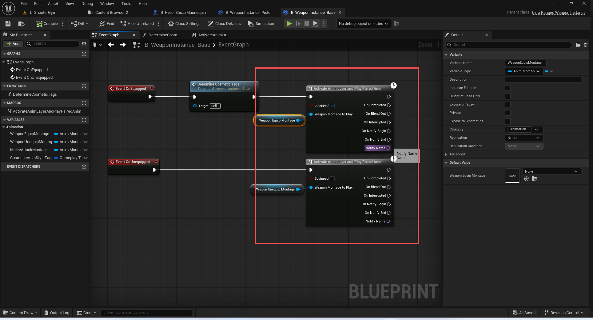
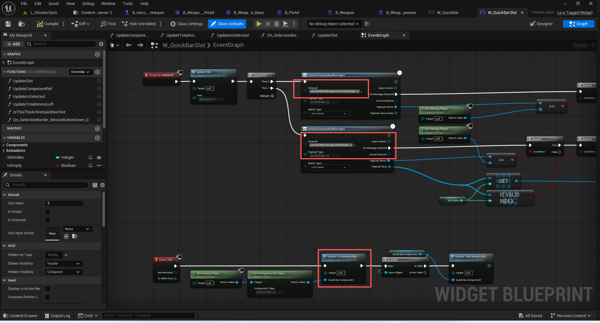

# UE5_Lyra学习指南_091_装备系统架构

本文章仅为小刚-B站课堂-虚幻引擎视频课程Lyra-精讲的演讲手稿.  
本套课程链接:[[UE5]虚幻引擎游戏案例Lyra精讲](https://www.bilibili.com/cheese/play/ss112001159)  
前置课程链接:[[UE5]虚幻引擎UEC++从基础到进阶](https://www.bilibili.com/cheese/play/ss28043)  

文章内容由小刚撰写,采用了以下多种方式:  
1.口述转文字  
2.AI重构  
3.参考引擎源码  
4.Lyra工程源码  
5.结合社区论坛各位大佬的解析  

- [UE5\_Lyra学习指南\_091\_装备系统架构](#ue5_lyra学习指南_091_装备系统架构)
	- [概述](#概述)
	- [一次装备武器的流程](#一次装备武器的流程)
		- [1.添加到库存中](#1添加到库存中)
		- [2.添加到快捷栏中](#2添加到快捷栏中)
		- [3.激活物品实例生成装备实例](#3激活物品实例生成装备实例)
			- [生成装备实例](#生成装备实例)
			- [移除装备实例](#移除装备实例)
	- [装备的枪械拓展](#装备的枪械拓展)
	- [快捷栏的循环切换](#快捷栏的循环切换)
	- [装备授予能力的工具函数](#装备授予能力的工具函数)
	- [快捷栏UI](#快捷栏ui)
	- [代码](#代码)
		- [装备定义](#装备定义)
		- [装备实例](#装备实例)
		- [装备管理组件](#装备管理组件)
		- [快捷栏组件](#快捷栏组件)
		- [拾取定义资产](#拾取定义资产)
	- [总结](#总结)


## 概述
本节开始讲解武器系统.
主要涉及到三个核心组件,装备管理组件,武器管理组件,快捷栏组件.
## 一次装备武器的流程

1.先将物品实例添加到库存组件中.
2.将这个物品实例的引用添加到快捷栏中
3.从快捷栏中将该物品实例激活到装备组件中!

### 1.添加到库存中
``` cpp
ULyraInventoryItemInstance* ULyraInventoryManagerComponent::AddItemDefinition(TSubclassOf<ULyraInventoryItemDefinition> ItemDef, int32 StackCount)
{
	ULyraInventoryItemInstance* Result = nullptr;
	if (ItemDef != nullptr)
	{
		Result = InventoryList.AddEntry(ItemDef, StackCount);
		
		if (IsUsingRegisteredSubObjectList() && IsReadyForReplication() && Result)
		{
			AddReplicatedSubObject(Result);
		}
	}
	return Result;
}


```
``` cpp

ULyraInventoryItemInstance* FLyraInventoryList::AddEntry(TSubclassOf<ULyraInventoryItemDefinition> ItemDef, int32 StackCount)
{
	ULyraInventoryItemInstance* Result = nullptr;

	check(ItemDef != nullptr);
 	check(OwnerComponent);

	AActor* OwningActor = OwnerComponent->GetOwner();
	check(OwningActor->HasAuthority());


	FLyraInventoryEntry& NewEntry = Entries.AddDefaulted_GetRef();
	// 注意这里传递的是Actor 而非组件
	NewEntry.Instance = NewObject<ULyraInventoryItemInstance>(OwnerComponent->GetOwner());  //@TODO: Using the actor instead of component as the outer due to UE-127172
	NewEntry.Instance->SetItemDef(ItemDef);
	for (ULyraInventoryItemFragment* Fragment : GetDefault<ULyraInventoryItemDefinition>(ItemDef)->Fragments)
	{
		if (Fragment != nullptr)
		{
			// 一定要调用初始化 避免片段的功能失效
			Fragment->OnInstanceCreated(NewEntry.Instance);
		}
	}
	NewEntry.StackCount = StackCount;
	Result = NewEntry.Instance;

	//const ULyraInventoryItemDefinition* ItemCDO = GetDefault<ULyraInventoryItemDefinition>(ItemDef);

	// 很重要这一步
	MarkItemDirty(NewEntry);

	return Result;
}

```

### 2.添加到快捷栏中
``` cpp
void ULyraQuickBarComponent::AddItemToSlot(int32 SlotIndex, ULyraInventoryItemInstance* Item)
{
	if (Slots.IsValidIndex(SlotIndex) && (Item != nullptr))
	{
		if (Slots[SlotIndex] == nullptr)
		{
			Slots[SlotIndex] = Item;
			OnRep_Slots();
		}
	}
}

```

### 3.激活物品实例生成装备实例
``` cpp
void ULyraQuickBarComponent::SetActiveSlotIndex_Implementation(int32 NewIndex)
{
	// 确认有变动
	if (Slots.IsValidIndex(NewIndex) && (ActiveSlotIndex != NewIndex))
	{
		// 脱下装备
		UnequipItemInSlot();

		ActiveSlotIndex = NewIndex;

		// 穿戴新的装备
		EquipItemInSlot();

		// 在服务器端触发变更信息
		OnRep_ActiveSlotIndex();
	}
}

```
#### 生成装备实例
``` cpp
void ULyraQuickBarComponent::EquipItemInSlot()
{
	check(Slots.IsValidIndex(ActiveSlotIndex));
	check(EquippedItem == nullptr);

	if (ULyraInventoryItemInstance* SlotItem = Slots[ActiveSlotIndex])
	{
		if (const UInventoryFragment_EquippableItem* EquipInfo = SlotItem->FindFragmentByClass<UInventoryFragment_EquippableItem>())
		{
			TSubclassOf<ULyraEquipmentDefinition> EquipDef = EquipInfo->EquipmentDefinition;
			if (EquipDef != nullptr)
			{
				if (ULyraEquipmentManagerComponent* EquipmentManager = FindEquipmentManager())
				{
					EquippedItem = EquipmentManager->EquipItem(EquipDef);
					if (EquippedItem != nullptr)
					{
						// 这一步很重要 传递了发起者!
						EquippedItem->SetInstigator(SlotItem);
					}
				}
			}
		}
	}
}

```

``` cpp

ULyraEquipmentInstance* ULyraEquipmentManagerComponent::EquipItem(TSubclassOf<ULyraEquipmentDefinition> EquipmentClass)
{
	ULyraEquipmentInstance* Result = nullptr;
	if (EquipmentClass != nullptr)
	{
		Result = EquipmentList.AddEntry(EquipmentClass);
		if (Result != nullptr)
		{
			Result->OnEquipped();

			if (IsUsingRegisteredSubObjectList() && IsReadyForReplication())
			{
				AddReplicatedSubObject(Result);
			}
		}
	}
	return Result;
}
```
``` cpp


ULyraEquipmentInstance* FLyraEquipmentList::AddEntry(TSubclassOf<ULyraEquipmentDefinition> EquipmentDefinition)
{
	ULyraEquipmentInstance* Result = nullptr;

	check(EquipmentDefinition != nullptr);
 	check(OwnerComponent);
	check(OwnerComponent->GetOwner()->HasAuthority());
	// 合法性判断
	// 只在服务器上调用

	// 获取到装备定义
	const ULyraEquipmentDefinition* EquipmentCDO = GetDefault<ULyraEquipmentDefinition>(EquipmentDefinition);

	// 获取装备实例的类类型 如果没有就生成一个空白的
	TSubclassOf<ULyraEquipmentInstance> InstanceType = EquipmentCDO->InstanceType;
	if (InstanceType == nullptr)
	{
		InstanceType = ULyraEquipmentInstance::StaticClass();
	}
	
	FLyraAppliedEquipmentEntry& NewEntry = Entries.AddDefaulted_GetRef();
	NewEntry.EquipmentDefinition = EquipmentDefinition;
	// 这里使用Actor而非组件
	NewEntry.Instance = NewObject<ULyraEquipmentInstance>(OwnerComponent->GetOwner(), InstanceType);
	//@TODO: Using the actor instead of component as the outer due to UE-127172
	Result = NewEntry.Instance;

	// 授予能力!
	if (ULyraAbilitySystemComponent* ASC = GetAbilitySystemComponent())
	{
		for (const TObjectPtr<const ULyraAbilitySet>& AbilitySet : EquipmentCDO->AbilitySetsToGrant)
		{
			// 注意这个Result入参 它是SourceObject. 在它对应的GA中,我们可以获取到这个
			AbilitySet->GiveToAbilitySystem(ASC, /*inout*/ &NewEntry.GrantedHandles, Result);
		}
	}
	else
	{
		//@TODO: Warning logging?
	}
	// 生成关联的Actor
	// 注意这里的Actor必须是开启复制同步的 因为现在这个父类是蓝图 所以不要漏了!
	// B_Weapon
	Result->SpawnEquipmentActors(EquipmentCDO->ActorsToSpawn);


	MarkItemDirty(NewEntry);

	return Result;
}
```
#### 移除装备实例
``` cpp
void ULyraQuickBarComponent::UnequipItemInSlot()
{
	if (ULyraEquipmentManagerComponent* EquipmentManager = FindEquipmentManager())
	{
		if (EquippedItem != nullptr)
		{
			EquipmentManager->UnequipItem(EquippedItem);
			EquippedItem = nullptr;
		}
	}
}

```
``` cpp

void ULyraEquipmentManagerComponent::UnequipItem(ULyraEquipmentInstance* ItemInstance)
{
	if (ItemInstance != nullptr)
	{
		if (IsUsingRegisteredSubObjectList())
		{
			RemoveReplicatedSubObject(ItemInstance);
		}

		ItemInstance->OnUnequipped();
		EquipmentList.RemoveEntry(ItemInstance);
	}
}
```
``` cpp
void FLyraEquipmentList::RemoveEntry(ULyraEquipmentInstance* Instance)
{
	for (auto EntryIt = Entries.CreateIterator(); EntryIt; ++EntryIt)
	{
		FLyraAppliedEquipmentEntry& Entry = *EntryIt;
		if (Entry.Instance == Instance)
		{
			// 停用能力
			if (ULyraAbilitySystemComponent* ASC = GetAbilitySystemComponent())
			{
				Entry.GrantedHandles.TakeFromAbilitySystem(ASC);
			}
			// 摧毁关联的装备演员
			Instance->DestroyEquipmentActors();
			

			EntryIt.RemoveCurrent();
			MarkArrayDirty();
		}
	}
}

```

## 装备的枪械拓展
B_WeaponInstance_Pistol->B_WeaponInstance_Base->ULyraRangedWeaponInstance->ULyraWeaponInstance->ULyraEquipmentInstance

在这个宏里面播放穿戴装备的蒙太奇,同时切换动画图层!


## 快捷栏的循环切换
``` cpp
void ULyraQuickBarComponent::CycleActiveSlotForward()
{
	// 合法性判定
	if (Slots.Num() < 2)
	{
		return;
	}

	const int32 OldIndex = (ActiveSlotIndex < 0 ? Slots.Num()-1 : ActiveSlotIndex);
	int32 NewIndex = ActiveSlotIndex;
	do
	{
		NewIndex = (NewIndex + 1) % Slots.Num();
		if (Slots[NewIndex] != nullptr)
		{
			SetActiveSlotIndex(NewIndex);
			return;
		}
	} while (NewIndex != OldIndex);
}

void ULyraQuickBarComponent::CycleActiveSlotBackward()
{
	if (Slots.Num() < 2)
	{
		return;
	}

	const int32 OldIndex = (ActiveSlotIndex < 0 ? Slots.Num()-1 : ActiveSlotIndex);
	int32 NewIndex = ActiveSlotIndex;
	do
	{
		NewIndex = (NewIndex - 1 + Slots.Num()) % Slots.Num();
		if (Slots[NewIndex] != nullptr)
		{
			SetActiveSlotIndex(NewIndex);
			return;
		}
	} while (NewIndex != OldIndex);
}


```

## 装备授予能力的工具函数
``` cpp
/**
 * ULyraGameplayAbility_FromEquipment
 *
 * An ability granted by and associated with an equipment instance
 * 一种由特定装备实例赋予并与其相关联的能力
 *
 * 简而言之 方便我们找到关联装备定义和物品实例 从而方便获取数据进行能力管理
 */
UCLASS()
class ULyraGameplayAbility_FromEquipment : public ULyraGameplayAbility
{
	GENERATED_BODY()

public:
	// 构造函数 无作用
	ULyraGameplayAbility_FromEquipment(const FObjectInitializer& ObjectInitializer = FObjectInitializer::Get());

	// 获取装备实例
	// 获取方法是来自于能力注册时的入参 SourceObject
	UFUNCTION(BlueprintCallable, Category="Lyra|Ability")
	ULyraEquipmentInstance* GetAssociatedEquipment() const;

	// 获取物品实例
	// 先获取装备实例 通过装备实例Instigator获取
	UFUNCTION(BlueprintCallable, Category = "Lyra|Ability")
	ULyraInventoryItemInstance* GetAssociatedItem() const;

#if WITH_EDITOR
	// 编辑器函数 用于验证GA的类型正确
	virtual EDataValidationResult IsDataValid(class FDataValidationContext& Context) const override;
#endif

};


```

## 快捷栏UI



## 代码
### 装备定义
``` cpp
USTRUCT()
struct FLyraEquipmentActorToSpawn
{
	GENERATED_BODY()

	FLyraEquipmentActorToSpawn()
	{}
	// 具体的对象
	UPROPERTY(EditAnywhere, Category=Equipment)
	TSubclassOf<AActor> ActorToSpawn;
	// 插槽名称
	UPROPERTY(EditAnywhere, Category=Equipment)
	FName AttachSocket;
	// 插槽附加位置
	UPROPERTY(EditAnywhere, Category=Equipment)
	FTransform AttachTransform;
};


/**
 * ULyraEquipmentDefinition
 *
 * Definition of a piece of equipment that can be applied to a pawn
 * 用于定于施加到角色上的装备片段
 */
UCLASS(Blueprintable, Const, Abstract, BlueprintType)
class ULyraEquipmentDefinition : public UObject
{
	GENERATED_BODY()

public:
	ULyraEquipmentDefinition(const FObjectInitializer& ObjectInitializer = FObjectInitializer::Get());

	// Class to spawn
	// 生成的装备实例
	// 注意这是U类,并不是场景中的Actor
	UPROPERTY(EditDefaultsOnly, Category=Equipment)
	TSubclassOf<ULyraEquipmentInstance> InstanceType;

	// Gameplay ability sets to grant when this is equipped
	// 当此装备时所赋予的游戏玩法能力设定
	UPROPERTY(EditDefaultsOnly, Category=Equipment)
	TArray<TObjectPtr<const ULyraAbilitySet>> AbilitySetsToGrant;

	// Actors to spawn on the pawn when this is equipped
	// 当此装备被穿戴时，会在角色身上生成的动画角色（即“角色附带动画”）
	UPROPERTY(EditDefaultsOnly, Category=Equipment)
	TArray<FLyraEquipmentActorToSpawn> ActorsToSpawn;
};

```

### 装备实例
``` cpp

/**
 * ULyraEquipmentInstance
 *
 * A piece of equipment spawned and applied to a pawn
 * 当一个装备添加到角色上,应当生成的实例
 */
UCLASS(BlueprintType, Blueprintable)
class ULyraEquipmentInstance : public UObject
{
	GENERATED_BODY()

public:
	// 构造函数
	// 无作用
	ULyraEquipmentInstance(const FObjectInitializer& ObjectInitializer = FObjectInitializer::Get());

	//~UObject interface
	// 开启网络同步 类似物品实例
	virtual bool IsSupportedForNetworking() const override { return true; }
	// 获取世界 从拥有者获取
	virtual UWorld* GetWorld() const override final;
	//~End of UObject interface

	// 获取发起者
	UFUNCTION(BlueprintPure, Category=Equipment)
	UObject* GetInstigator() const { return Instigator; }

	// 设置发起者 应当是物品实例
	void SetInstigator(UObject* InInstigator) { Instigator = InInstigator; }

	// 获取拥有它的角色
	UFUNCTION(BlueprintPure, Category=Equipment)
	APawn* GetPawn() const;

	// 获取指定类型的它的拥有者
	UFUNCTION(BlueprintPure, Category=Equipment, meta=(DeterminesOutputType=PawnType))
	APawn* GetTypedPawn(TSubclassOf<APawn> PawnType) const;

	// 获取它所管理的装备演员
	UFUNCTION(BlueprintPure, Category=Equipment)
	TArray<AActor*> GetSpawnedActors() const { return SpawnedActors; }
	// 根据定义 生成关联的装备演员
	virtual void SpawnEquipmentActors(const TArray<FLyraEquipmentActorToSpawn>& ActorsToSpawn);
	// 摧毁 关联的装备演员
	virtual void DestroyEquipmentActors();
	// 调用装备事件
	virtual void OnEquipped();
	// 调用取下装备事件
	virtual void OnUnequipped();

protected:
#if UE_WITH_IRIS
	/** Register all replication fragments */
	virtual void RegisterReplicationFragments(UE::Net::FFragmentRegistrationContext& Context, UE::Net::EFragmentRegistrationFlags RegistrationFlags) override;
#endif // UE_WITH_IRIS

	UFUNCTION(BlueprintImplementableEvent, Category=Equipment, meta=(DisplayName="OnEquipped"))
	void K2_OnEquipped();

	UFUNCTION(BlueprintImplementableEvent, Category=Equipment, meta=(DisplayName="OnUnequipped"))
	void K2_OnUnequipped();

private:
	UFUNCTION()
	void OnRep_Instigator();

private:
	// 发起者 应当是物品实例
	UPROPERTY(ReplicatedUsing=OnRep_Instigator)
	TObjectPtr<UObject> Instigator;

	// 生成的管理演员
	UPROPERTY(Replicated)
	TArray<TObjectPtr<AActor>> SpawnedActors;
};

```

### 装备管理组件
``` cpp

/** A single piece of applied equipment */
/** 一件应用中的设备 */
USTRUCT(BlueprintType)
struct FLyraAppliedEquipmentEntry : public FFastArraySerializerItem
{
	GENERATED_BODY()

	FLyraAppliedEquipmentEntry()
	{}
	// 调试字符串函数
	FString GetDebugString() const;

private:
	friend FLyraEquipmentList;
	friend ULyraEquipmentManagerComponent;

	// The equipment class that got equipped
	// 装备定义
	UPROPERTY()
	TSubclassOf<ULyraEquipmentDefinition> EquipmentDefinition;

	// 装备实例
	UPROPERTY()
	TObjectPtr<ULyraEquipmentInstance> Instance = nullptr;

	// Authority-only list of granted handles
	// 授予的能力句柄
	UPROPERTY(NotReplicated)
	FLyraAbilitySet_GrantedHandles GrantedHandles;
};

/** List of applied equipment */
/** 已使用的设备列表 */
USTRUCT(BlueprintType)
struct FLyraEquipmentList : public FFastArraySerializer
{
	GENERATED_BODY()

	FLyraEquipmentList()
		: OwnerComponent(nullptr)
	{
	}

	FLyraEquipmentList(UActorComponent* InOwnerComponent)
		: OwnerComponent(InOwnerComponent)
	{
	}

public:
	//~FFastArraySerializer contract
	// 触发脱下装备事件
	void PreReplicatedRemove(const TArrayView<int32> RemovedIndices, int32 FinalSize);
	// 触发穿上装备事件
	void PostReplicatedAdd(const TArrayView<int32> AddedIndices, int32 FinalSize);
	void PostReplicatedChange(const TArrayView<int32> ChangedIndices, int32 FinalSize);
	//~End of FFastArraySerializer contract

	// 网络序列化
	bool NetDeltaSerialize(FNetDeltaSerializeInfo& DeltaParms)
	{
		return FFastArraySerializer::FastArrayDeltaSerialize<FLyraAppliedEquipmentEntry, FLyraEquipmentList>(Entries, DeltaParms, *this);
	}
	// 生成一个装备实例
	ULyraEquipmentInstance* AddEntry(TSubclassOf<ULyraEquipmentDefinition> EquipmentDefinition);
	// 移除一个装备实例
	void RemoveEntry(ULyraEquipmentInstance* Instance);

private:
	// 获取ASC
	ULyraAbilitySystemComponent* GetAbilitySystemComponent() const;

	friend ULyraEquipmentManagerComponent;

private:
	// Replicated list of equipment entries
	// 设备条目列表的副本
	UPROPERTY()
	TArray<FLyraAppliedEquipmentEntry> Entries;

	UPROPERTY(NotReplicated)
	TObjectPtr<UActorComponent> OwnerComponent;
};

template<>
struct TStructOpsTypeTraits<FLyraEquipmentList> : public TStructOpsTypeTraitsBase2<FLyraEquipmentList>
{
	enum { WithNetDeltaSerializer = true };
};


/**
 * Manages equipment applied to a pawn
 * 装备管理组件
 */
UCLASS(MinimalAPI, BlueprintType, Const)
class ULyraEquipmentManagerComponent : public UPawnComponent
{
	GENERATED_BODY()

public:
	// 构造函数 开启网路同步 因为添加方法比较特殊 是通过GameFeature进行添加的
	UE_API ULyraEquipmentManagerComponent(const FObjectInitializer& ObjectInitializer = FObjectInitializer::Get());

	// 同库存组件用法 通过定义添加 转发到容器
	// 需要开启RegisteredSubObjectList
	// 只在服务器上调用
	UFUNCTION(BlueprintCallable, BlueprintAuthorityOnly)
	UE_API ULyraEquipmentInstance* EquipItem(TSubclassOf<ULyraEquipmentDefinition> EquipmentDefinition);

	// 取下装备
	// 只在服务器调用
	UFUNCTION(BlueprintCallable, BlueprintAuthorityOnly)
	UE_API void UnequipItem(ULyraEquipmentInstance* ItemInstance);

	//~UObject interface
	// 同库存组件
	// 允许一个组件在角色上复制其他子对象。如果有任何数据被序列化到该集合中，则必须返回 true。
	// 此方法仅在 bReplicateUsingRegisteredSubObjectList 为 false 时使用。否则，此函数不会被调用，只会使用 ReplicatedSubObjects 列表。
	UE_API virtual bool ReplicateSubobjects(class UActorChannel* Channel, class FOutBunch* Bunch, FReplicationFlags* RepFlags) override;
	//~End of UObject interface

	//~UActorComponent interface
	// virtual void EndPlay() override;

	// 无作用
	UE_API virtual void InitializeComponent() override;

	// 回收所有装备实例
	UE_API virtual void UninitializeComponent() override;

	// Register existing LyraEquipmentInstances
	// 避免遗漏注册 装备实例
	UE_API virtual void ReadyForReplication() override;
	//~End of UActorComponent interface

	/** Returns the first equipped instance of a given type, or nullptr if none are found */
	/** 返回具有给定类型且处于装备状态的第一个实例，若未找到则返回 nullptr */
	UFUNCTION(BlueprintCallable, BlueprintPure)
	UE_API ULyraEquipmentInstance* GetFirstInstanceOfType(TSubclassOf<ULyraEquipmentInstance> InstanceType);

 	/** Returns all equipped instances of a given type, or an empty array if none are found */
	/** 返回指定类型的所有已装备实例，若未找到则返回一个空数组 */
 	UFUNCTION(BlueprintCallable, BlueprintPure)
	UE_API TArray<ULyraEquipmentInstance*> GetEquipmentInstancesOfType(TSubclassOf<ULyraEquipmentInstance> InstanceType) const;

	// 泛型
	template <typename T>
	T* GetFirstInstanceOfType()
	{
		return (T*)GetFirstInstanceOfType(T::StaticClass());
	}

private:
	// FastArray的容器
	UPROPERTY(Replicated)
	FLyraEquipmentList EquipmentList;
};

```
### 快捷栏组件
``` cpp
// 快捷栏 主要用于切换不同装备的穿戴和取下
UCLASS(Blueprintable, meta=(BlueprintSpawnableComponent))
class ULyraQuickBarComponent : public UControllerComponent
{
	GENERATED_BODY()

public:
	// 构造函数 开启网路同步
	ULyraQuickBarComponent(const FObjectInitializer& ObjectInitializer = FObjectInitializer::Get());

	// 向前激活快捷栏
	UFUNCTION(BlueprintCallable, Category="Lyra")
	void CycleActiveSlotForward();

	// 向后激活快捷栏
	UFUNCTION(BlueprintCallable, Category="Lyra")
	void CycleActiveSlotBackward();

	// 设置当前激活索引
	// 从客户端呼叫服务器调用!
	UFUNCTION(Server, Reliable, BlueprintCallable, Category="Lyra")
	void SetActiveSlotIndex(int32 NewIndex);

	// 获取当前快捷栏中的所有物品实例
	UFUNCTION(BlueprintCallable, BlueprintPure=false)
	TArray<ULyraInventoryItemInstance*> GetSlots() const
	{
		return Slots;
	}

	// 获取当前激活索引
	UFUNCTION(BlueprintCallable, BlueprintPure=false)
	int32 GetActiveSlotIndex() const { return ActiveSlotIndex; }

	// 获取当前激活的物品实例
	UFUNCTION(BlueprintCallable, BlueprintPure = false)
	ULyraInventoryItemInstance* GetActiveSlotItem() const;

	// 获取下一个空白的插槽
	UFUNCTION(BlueprintCallable, BlueprintPure=false)
	int32 GetNextFreeItemSlot() const;

	// 将物品实例添加到指定插槽
	// 只能往空的里面添加
	UFUNCTION(BlueprintCallable, BlueprintAuthorityOnly)
	void AddItemToSlot(int32 SlotIndex, ULyraInventoryItemInstance* Item);

	// 移除对应索引的物品插槽
	UFUNCTION(BlueprintCallable, BlueprintAuthorityOnly)
	ULyraInventoryItemInstance* RemoveItemFromSlot(int32 SlotIndex);

	// 初始化总的快捷栏数量
	virtual void BeginPlay() override;

private:
	// 取下装备
	void UnequipItemInSlot();
	// 装备
	void EquipItemInSlot();

	// 找到对应的装备组件
	ULyraEquipmentManagerComponent* FindEquipmentManager() const;

protected:
	// 插槽预设数量
	UPROPERTY()
	int32 NumSlots = 3;

	UFUNCTION()
	void OnRep_Slots();

	UFUNCTION()
	void OnRep_ActiveSlotIndex();

private:
	UPROPERTY(ReplicatedUsing=OnRep_Slots)
	TArray<TObjectPtr<ULyraInventoryItemInstance>> Slots;

	UPROPERTY(ReplicatedUsing=OnRep_ActiveSlotIndex)
	int32 ActiveSlotIndex = -1;

	UPROPERTY()
	TObjectPtr<ULyraEquipmentInstance> EquippedItem;
};

```

### 拾取定义资产
``` cpp

/**
 * 物品拾取定义
 * 注意 于交互系统无关
 * 仅用于武器生成器这边的拾取物生成
 */
UCLASS(MinimalAPI, Blueprintable, BlueprintType, Const, Meta = (DisplayName = "Lyra Pickup Data", ShortTooltip = "Data asset used to configure a pickup."))
class ULyraPickupDefinition : public UDataAsset
{
	GENERATED_BODY()
	
public:

	//Defines the pickup's actors to spawn, abilities to grant, and tags to add
	// 定义了拾取物品时要生成的玩家角色、要赋予的技能以及要添加的标签
	UPROPERTY(EditDefaultsOnly, BlueprintReadOnly, Category = "Lyra|Pickup|Equipment")
	TSubclassOf<ULyraInventoryItemDefinition> InventoryItemDefinition;

	//Visual representation of the pickup
	// 车辆取货过程的可视化展示
	UPROPERTY(EditDefaultsOnly, BlueprintReadOnly, Category = "Lyra|Pickup|Mesh")
	TObjectPtr<UStaticMesh> DisplayMesh;

	//Cool down time between pickups in seconds
	// 两次拾取物品之间的冷却时间（以秒为单位）
	UPROPERTY(EditDefaultsOnly, BlueprintReadOnly, Category = "Lyra|Pickup")
	int32 SpawnCoolDownSeconds;

	//Sound to play when picked up
	// 拾起时播放的声音
	UPROPERTY(EditDefaultsOnly, BlueprintReadOnly, Category = "Lyra|Pickup")
	TObjectPtr<USoundBase> PickedUpSound;

	//Sound to play when pickup is respawned
	// 当拾取物品复活后将播放的音效
	UPROPERTY(EditDefaultsOnly, BlueprintReadOnly, Category = "Lyra|Pickup")
	TObjectPtr<USoundBase> RespawnedSound;

	//Particle FX to play when picked up
	// 当拾起时播放的粒子特效
	UPROPERTY(EditDefaultsOnly, BlueprintReadOnly, Category = "Lyra|Pickup")
	TObjectPtr<UNiagaraSystem> PickedUpEffect;

	//Particle FX to play when pickup is respawned
	// 当拾取物品被重新生成时播放粒子效果
	UPROPERTY(EditDefaultsOnly, BlueprintReadOnly, Category = "Lyra|Pickup")
	TObjectPtr<UNiagaraSystem> RespawnedEffect;
};

// 武器拾取定义
UCLASS(MinimalAPI, Blueprintable, BlueprintType, Const, Meta = (DisplayName = "Lyra Weapon Pickup Data", ShortTooltip = "Data asset used to configure a weapon pickup."))
class ULyraWeaponPickupDefinition : public ULyraPickupDefinition
{
	GENERATED_BODY()

public:

	//Sets the height of the display mesh above the Weapon spawner
	// 设置显示网格在武器生成器上方的高度
	UPROPERTY(EditDefaultsOnly, BlueprintReadOnly, Category = "Lyra|Pickup|Mesh")
	FVector WeaponMeshOffset;

	//Sets the height of the display mesh above the Weapon spawner
	// 设置显示网格在武器生成器上方的高度
	UPROPERTY(EditDefaultsOnly, BlueprintReadOnly, Category = "Lyra|Pickup|Mesh")
	FVector WeaponMeshScale = FVector(1.0f, 1.0f, 1.0f);
};

```

## 总结
本节主要讲解了,枪械系统的底层关于装备者一部分.
注意,这部分的蓝图牵连到队伍系统,换装系统,动画系统.剖析代码时需要切割开来.