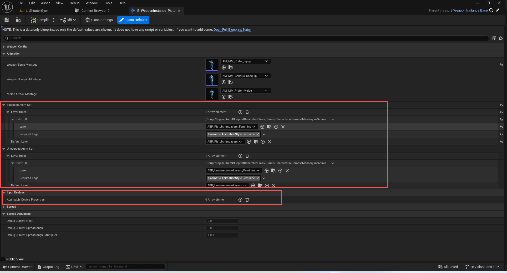
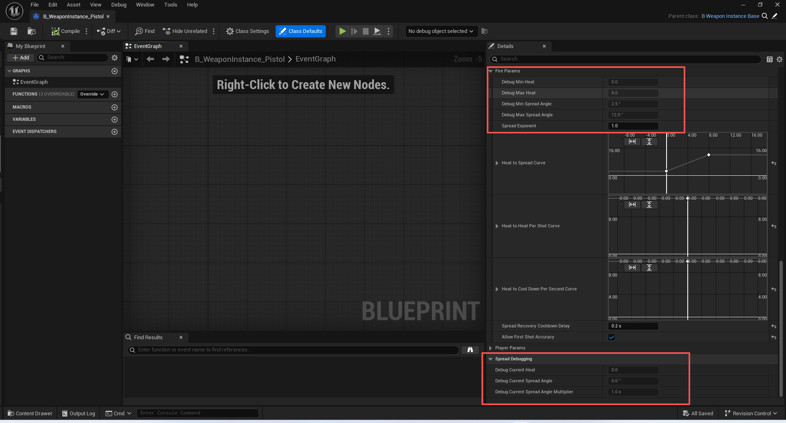
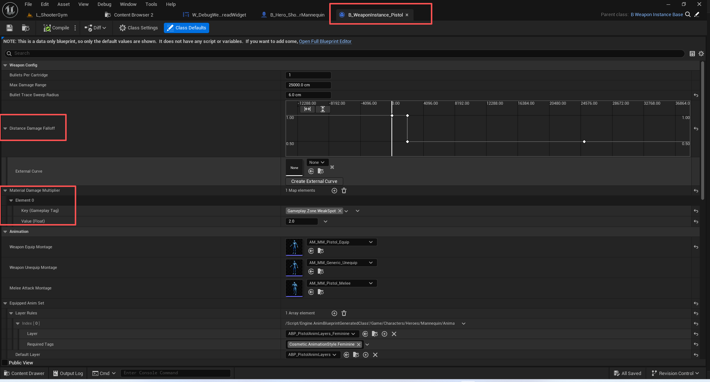
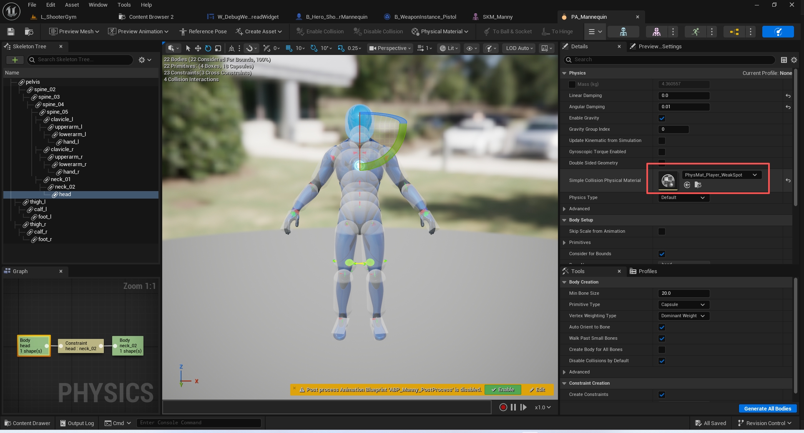
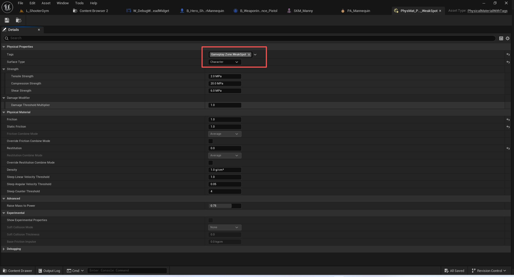

# UE5_Lyra学习指南_092_枪械系统_远程武器定义

本文章仅为小刚-B站课堂-虚幻引擎视频课程Lyra-精讲的演讲手稿.  
本套课程链接:[[UE5]虚幻引擎游戏案例Lyra精讲](https://www.bilibili.com/cheese/play/ss112001159)  
前置课程链接:[[UE5]虚幻引擎UEC++从基础到进阶](https://www.bilibili.com/cheese/play/ss28043)  

文章内容由小刚撰写,采用了以下多种方式:  
1.口述转文字  
2.AI重构  
3.参考引擎源码  
4.Lyra工程源码  
5.结合社区论坛各位大佬的解析  

- [UE5\_Lyra学习指南\_092\_枪械系统\_远程武器定义](#ue5_lyra学习指南_092_枪械系统_远程武器定义)
	- [概述](#概述)
	- [武器实例的定义](#武器实例的定义)
	- [武器调试设置](#武器调试设置)
	- [远程武器定义](#远程武器定义)
		- [代码](#代码)
		- [调试数据显示](#调试数据显示)
		- [实际扩散角度](#实际扩散角度)
		- [热度和乘数计算](#热度和乘数计算)
			- [热度计算](#热度计算)
			- [乘数计算](#乘数计算)
			- [第一次精准射击](#第一次精准射击)
				- [控件调试](#控件调试)
				- [武器数据计算](#武器数据计算)
		- [伤害系数](#伤害系数)
			- [接口来源](#接口来源)
			- [GEEC](#geec)
			- [距离计算](#距离计算)
			- [命中物理材质计算](#命中物理材质计算)
		- [穿戴与脱下时初始化值](#穿戴与脱下时初始化值)
			- [调用位置](#调用位置)
			- [初始化值](#初始化值)
			- [开枪后增加热度](#开枪后增加热度)
	- [远程武器射击技能](#远程武器射击技能)
	- [总结](#总结)


## 概述
本节讲解战斗最核心的板块-枪械系统!

## 武器实例的定义


``` cpp
/**
 * ULyraWeaponInstance
 *
 * A piece of equipment representing a weapon spawned and applied to a pawn
 * 所有武器的父类 当这个物品被应用到角色时取生成
 */
UCLASS(MinimalAPI)
class ULyraWeaponInstance : public ULyraEquipmentInstance
{
	GENERATED_BODY()

public:
	// 构造函数
	// 绑定属于玩家的角色死亡时,去移除设备属性
	UE_API ULyraWeaponInstance(const FObjectInitializer& ObjectInitializer = FObjectInitializer::Get());

	//~ULyraEquipmentInstance interface
	// 触发设备属性
	UE_API virtual void OnEquipped() override;
	// 移除设备属性
	UE_API virtual void OnUnequipped() override;
	//~End of ULyraEquipmentInstance interface

	// 更新上次开火的时间
	UFUNCTION(BlueprintCallable)
	UE_API void UpdateFiringTime();

	// Returns how long it's been since the weapon was interacted with (fired or equipped)
	// 返回自武器被使用（开火或装备）以来所经过的时间长度
	// 在GA_Weapon_AutoReload中调用
	UFUNCTION(BlueprintPure)
	UE_API float GetTimeSinceLastInteractedWith() const;

protected:
	// 装备时 所进行选择的动画图层
	UPROPERTY(EditAnywhere, BlueprintReadOnly, Category=Animation)
	FLyraAnimLayerSelectionSet EquippedAnimSet;

	// 移除装备时 所进行选择的动画图层
	UPROPERTY(EditAnywhere, BlueprintReadOnly, Category=Animation)
	FLyraAnimLayerSelectionSet UneuippedAnimSet;

	/**
	 * Device properties that should be applied while this weapon is equipped.
	 * These properties will be played in with the "Looping" flag enabled, so they will
	 * play continuously until this weapon is unequipped! 
	 * 
	 * 当此武器装备时应应用的设备属性。
	 * 这些属性将在“循环”标志开启的情况下一同播放，因此它们会
	 * 持续播放直至此武器被卸下！
	 * 
	 */
	UPROPERTY(EditDefaultsOnly, Instanced, BlueprintReadOnly, Category = "Input Devices")
	TArray<TObjectPtr<UInputDeviceProperty>> ApplicableDeviceProperties;

	// Choose the best layer from EquippedAnimSet or UneuippedAnimSet based on the specified gameplay tags
	// 根据指定的游戏玩法标签，从装备动画集或未装备动画集中选择最佳的层。
	UFUNCTION(BlueprintCallable, BlueprintPure=false, Category=Animation)
	UE_API TSubclassOf<UAnimInstance>
	PickBestAnimLayer(bool bEquipped, const FGameplayTagContainer& CosmeticTags) const;

	/** Returns the owning Pawn's Platform User ID */
	/** 返回所属棋子的平台用户 ID */
	UFUNCTION(BlueprintCallable)
	UE_API const FPlatformUserId GetOwningUserId() const;

	/** Callback for when the owning pawn of this weapon dies. Removes all spawned device properties. */
	/** 当此武器所附带的棋子死亡时的回调函数。 会移除所有生成的设备属性。*/
	UFUNCTION()
	UE_API void OnDeathStarted(AActor* OwningActor);

	/**
	 * Apply the ApplicableDeviceProperties to the owning pawn of this weapon.
	 * Populate the DevicePropertyHandles so that they can be removed later. This will
	 * Play the device properties in Looping mode so that they will share the lifetime of the
	 * weapon being Equipped.
	 */
	/**
	* 将“适用设备属性”应用到此武器的所属棋子上。
	* 填充“设备属性句柄”，以便日后能够将其删除。这将会
	将设备属性设置为循环模式，以便它们与所装备的武器的使用寿命保持一致。*/
	UE_API void ApplyDeviceProperties();

	/** Remove any device proeprties that were activated in ApplyDeviceProperties. */
	/** 清除在“应用设备属性”操作中激活的任何设备属性。*/
	UE_API void RemoveDeviceProperties();

private:
	/** Set of device properties activated by this weapon. Populated by ApplyDeviceProperties */
	UPROPERTY(Transient)
	TSet<FInputDevicePropertyHandle> DevicePropertyHandles;

	double TimeLastEquipped = 0.0;
	double TimeLastFired = 0.0;
};

```

## 武器调试设置
``` cpp

/**
 * Developer debugging settings for weapons
 */
UCLASS(config=EditorPerProjectUserSettings)
class ULyraWeaponDebugSettings : public UDeveloperSettingsBackedByCVars
{
	GENERATED_BODY()

public:
	ULyraWeaponDebugSettings();

	//~UDeveloperSettings interface
	virtual FName GetCategoryName() const override;
	//~End of UDeveloperSettings interface

public:
	// Should we do debug drawing for bullet traces (if above zero, sets how long (in seconds)
	// 我们是否应该为子弹轨迹绘制调试图形（如果数值大于零，则设定该轨迹显示的持续时间（以秒为单位）？
	UPROPERTY(config, EditAnywhere, Category=General, meta=(ConsoleVariable="lyra.Weapon.DrawBulletTraceDuration", ForceUnits=s))
	float DrawBulletTraceDuration;

	// Should we do debug drawing for bullet impacts (if above zero, sets how long (in seconds)
	// 我们是否应该对子弹撞击进行调试绘图（如果数值大于零，则设定撞击持续时间（以秒为单位）？
	UPROPERTY(config, EditAnywhere, Category = General, meta = (ConsoleVariable = "lyra.Weapon.DrawBulletHitDuration", ForceUnits = s))
	float DrawBulletHitDuration;

	// When bullet hit debug drawing is enabled (see DrawBulletHitDuration), how big should the hit radius be? (in cm)
	// 当子弹击中时（此时调试绘图功能已开启，详情请参阅“绘制子弹命中持续时间”），子弹的命中范围应设定为多大？（单位：厘米）
	UPROPERTY(config, EditAnywhere, Category = General, meta = (ConsoleVariable = "lyra.Weapon.DrawBulletHitRadius", ForceUnits=cm))
	float DrawBulletHitRadius;
};

```
``` cpp
namespace LyraConsoleVariables
{
	static float DrawBulletTracesDuration = 0.0f;
	static FAutoConsoleVariableRef CVarDrawBulletTraceDuraton(
		TEXT("lyra.Weapon.DrawBulletTraceDuration"),
		DrawBulletTracesDuration,
		TEXT("Should we do debug drawing for bullet traces (if above zero, sets how long (in seconds))"),
		ECVF_Default);

	static float DrawBulletHitDuration = 0.0f;
	static FAutoConsoleVariableRef CVarDrawBulletHits(
		TEXT("lyra.Weapon.DrawBulletHitDuration"),
		DrawBulletHitDuration,
		TEXT("Should we do debug drawing for bullet impacts (if above zero, sets how long (in seconds))"),
		ECVF_Default);

	static float DrawBulletHitRadius = 3.0f;
	static FAutoConsoleVariableRef CVarDrawBulletHitRadius(
		TEXT("lyra.Weapon.DrawBulletHitRadius"),
		DrawBulletHitRadius,
		TEXT(
			"When bullet hit debug drawing is enabled (see DrawBulletHitDuration), how big should the hit radius be? (in uu)"),
		ECVF_Default);
}


```
## 远程武器定义
### 代码
``` cpp
/**
 * ULyraRangedWeaponInstance
 *
 * A piece of equipment representing a ranged weapon spawned and applied to a pawn
 * 一件代表远程武器的装备生成并安装在了一名角色身上。
 */
UCLASS()
class ULyraRangedWeaponInstance : public ULyraWeaponInstance, public ILyraAbilitySourceInterface
{
	GENERATED_BODY()

public:
	// 构造函数 给曲线赋初值
	ULyraRangedWeaponInstance(const FObjectInitializer& ObjectInitializer = FObjectInitializer::Get());

	// 更新debug函数数据
	virtual void PostLoad() override;

#if WITH_EDITOR
	// 更新debug数据
	virtual void PostEditChangeProperty(struct FPropertyChangedEvent& PropertyChangedEvent) override;
	// 将当前值更新到debug数据中
	void UpdateDebugVisualization();
#endif
	
	// 获取单个弹药盒中发射的子弹数量（通常为 1 发，但霰弹枪可能为多发）
	int32 GetBulletsPerCartridge() const
	{
		return BulletsPerCartridge;
	}
	
	/** Returns the current spread angle (in degrees, diametrical) */
	/** 返回当前的扩散角度（以度为单位，为直径方向） */
	float GetCalculatedSpreadAngle() const
	{
		return CurrentSpreadAngle;
	}
	// 获取当前的“综合”扩散角度乘数,如果开启第一次准确射击,则为0
	float GetCalculatedSpreadAngleMultiplier() const
	{
		return bHasFirstShotAccuracy ? 0.0f : CurrentSpreadAngleMultiplier;
	}

	// 是否开启了第一次精准射击
	bool HasFirstShotAccuracy() const
	{
		return bHasFirstShotAccuracy;
	}
	// 获取扩散系数
	float GetSpreadExponent() const
	{
		return SpreadExponent;
	}
	// 最大射程
	float GetMaxDamageRange() const
	{
		return MaxDamageRange;
	}
	// 获取子弹轨迹的半径用于绘制扫面球体
	float GetBulletTraceSweepRadius() const
	{
		return BulletTraceSweepRadius;
	}

protected:
#if WITH_EDITORONLY_DATA
	// 调试 最小热度值
	UPROPERTY(VisibleAnywhere, Category = "Spread|Fire Params")
	float Debug_MinHeat = 0.0f;
	// 调试 最大热度值
	UPROPERTY(VisibleAnywhere, Category = "Spread|Fire Params")
	float Debug_MaxHeat = 0.0f;

	// 调试 最小角度值
	UPROPERTY(VisibleAnywhere, Category="Spread|Fire Params", meta=(ForceUnits=deg))
	float Debug_MinSpreadAngle = 0.0f;
	// 调试 最大角度值
	UPROPERTY(VisibleAnywhere, Category="Spread|Fire Params", meta=(ForceUnits=deg))
	float Debug_MaxSpreadAngle = 0.0f;

	// 调试 当前热度值
	UPROPERTY(VisibleAnywhere, Category="Spread Debugging")
	float Debug_CurrentHeat = 0.0f;

	// 调试 当前角度值
	UPROPERTY(VisibleAnywhere, Category="Spread Debugging", meta = (ForceUnits=deg))
	float Debug_CurrentSpreadAngle = 0.0f;

	// The current *combined* spread angle multiplier
	// 当前的“综合”扩散角度乘数
	UPROPERTY(VisibleAnywhere, Category = "Spread Debugging", meta=(ForceUnits=x))
	float Debug_CurrentSpreadAngleMultiplier = 1.0f;

#endif

	// Spread exponent, affects how tightly shots will cluster around the center line
	// when the weapon has spread (non-perfect accuracy). Higher values will cause shots
	// to be closer to the center (default is 1.0 which means uniformly within the spread range)
	// 扩散指数，影响武器出现扩散（非完美精准度）时射击点在中心线周围聚集的紧密程度
	// 较高的数值会使射击点更靠近中心（默认值为 1.0，表示均匀地分布在扩散范围内）
	UPROPERTY(EditAnywhere, BlueprintReadOnly, meta=(ClampMin=0.1), Category="Spread|Fire Params")
	float SpreadExponent = 1.0f;

	// A curve that maps the heat to the spread angle
	// The X range of this curve typically sets the min/max heat range of the weapon
	// The Y range of this curve is used to define the min and maximum spread angle
	// 一条将热量与发射角度关联起来的曲线
	// 该曲线的 X 轴范围通常决定了武器的最小/最大热量范围
	// 该曲线的 Y 轴范围则用于设定最小和最大发射角度
	UPROPERTY(EditAnywhere, Category = "Spread|Fire Params")
	FRuntimeFloatCurve HeatToSpreadCurve;

	// A curve that maps the current heat to the amount a single shot will further 'heat up'
	// This is typically a flat curve with a single data point indicating how much heat a shot adds,
	// but can be other shapes to do things like punish overheating by adding progressively more heat.
	// 一条曲线用于将当前的热量映射到单次射击会进一步“升温”的量值上
	// 这通常是一条平滑的曲线，只有一个数据点表示一次射击会增加多少热量，
	// 但也可以是其他形状的曲线，例如通过逐渐增加更多的热量来惩罚过热情况。
	UPROPERTY(EditAnywhere, Category="Spread|Fire Params")
	FRuntimeFloatCurve HeatToHeatPerShotCurve;
	
	// A curve that maps the current heat to the heat cooldown rate per second
	// This is typically a flat curve with a single data point indicating how fast the heat
	// wears off, but can be other shapes to do things like punish overheating by slowing down
	// recovery at high heat.
	// 一条曲线，用于将当前热量与每秒的热量冷却速率进行映射
	// 这通常是一条平缓的曲线，只有一个数据点来表示热量消散的速度，但也可以是其他形状，例如通过在高温情况下减缓恢复速度来对过热进行惩罚。
	UPROPERTY(EditAnywhere, Category="Spread|Fire Params")
	FRuntimeFloatCurve HeatToCoolDownPerSecondCurve;

	// Time since firing before spread cooldown recovery begins (in seconds)
	// 自触发射击动作后开始恢复扩散冷却时间所需的时间（单位：秒）
	UPROPERTY(EditAnywhere, Category="Spread|Fire Params", meta=(ForceUnits=s))
	float SpreadRecoveryCooldownDelay = 0.0f;

	// Should the weapon have perfect accuracy when both player and weapon spread are at their minimum value
	// 若此时（玩家与武器的分散程度）均处于最小值，且武器的射击精度应能达到最佳状态
	UPROPERTY(EditAnywhere, Category="Spread|Fire Params")
	bool bAllowFirstShotAccuracy = false;

	// Multiplier when in an aiming camera mode
	// 在瞄准模式下的作用力系数
	UPROPERTY(EditAnywhere, Category="Spread|Player Params", meta=(ForceUnits=x))
	float SpreadAngleMultiplier_Aiming = 1.0f;

	// Multiplier when standing still or moving very slowly
	// (starts to fade out at StandingStillSpeedThreshold, and is gone completely by StandingStillSpeedThreshold + StandingStillToMovingSpeedRange)
	// 静止或移动速度极慢时的倍数
	// （在“静止速度阈值”时开始逐渐减弱，超过“静止速度阈值 + 静止至移动速度范围”时则完全消失）
	UPROPERTY(EditAnywhere, BlueprintReadOnly, Category="Spread|Player Params", meta=(ForceUnits=x))
	float SpreadAngleMultiplier_StandingStill = 1.0f;

	// Rate at which we transition to/from the standing still accuracy (higher values are faster, though zero is instant; @see FInterpTo)
	// 我们从静止状态过渡到其他状态以及从其他状态过渡回静止状态的速度（数值越大，过渡速度越快，但零表示瞬间完成；请参阅 FInterpTo）
	UPROPERTY(EditAnywhere, BlueprintReadOnly, Category="Spread|Player Params")
	float TransitionRate_StandingStill = 5.0f;

	// Speeds at or below this are considered standing still
	// 速度达到或低于此值则被视为处于静止状态
	UPROPERTY(EditAnywhere, BlueprintReadOnly, Category="Spread|Player Params", meta=(ForceUnits="cm/s"))
	float StandingStillSpeedThreshold = 80.0f;

	// Speeds no more than this above StandingStillSpeedThreshold are used to feather down the standing still bonus until it's back to 1.0
	// 速度超过“静止速度阈值”的部分不得超过此数值，否则静止状态的加成效果将逐渐减弱，直至恢复至 1.0 。
	UPROPERTY(EditAnywhere, BlueprintReadOnly, Category="Spread|Player Params", meta=(ForceUnits="cm/s"))
	float StandingStillToMovingSpeedRange = 20.0f;


	// Multiplier when crouching, smoothly blended to based on TransitionRate_Crouching
	// 蹲下时的乘数，会根据“蹲下过渡速率”进行平滑过渡调整
	UPROPERTY(EditAnywhere, BlueprintReadOnly, Category="Spread|Player Params", meta=(ForceUnits=x))
	float SpreadAngleMultiplier_Crouching = 1.0f;

	// Rate at which we transition to/from the crouching accuracy (higher values are faster, though zero is instant; @see FInterpTo)
	// 我们从蹲姿切换至标准姿势以及从标准姿势切换回蹲姿的速率（数值越大，切换速度越快，但为零时切换即刻完成；请参阅 FInterpTo）
	UPROPERTY(EditAnywhere, BlueprintReadOnly, Category="Spread|Player Params")
	float TransitionRate_Crouching = 5.0f;


	// Spread multiplier while jumping/falling, smoothly blended to based on TransitionRate_JumpingOrFalling
	// 跳跃/下落时的扩散倍数，根据“跳跃或下落过渡速率”进行平滑过渡调整
	UPROPERTY(EditAnywhere, BlueprintReadOnly, Category="Spread|Player Params", meta=(ForceUnits=x))
	float SpreadAngleMultiplier_JumpingOrFalling = 1.0f;

	// Rate at which we transition to/from the jumping/falling accuracy (higher values are faster, though zero is instant; @see FInterpTo)
	// 我们从跳跃状态切换至静止状态或从静止状态切换至跳跃状态的速率（数值越大，切换速度越快，但为零时切换即刻完成；请参阅 FInterpTo）
	UPROPERTY(EditAnywhere, BlueprintReadOnly, Category="Spread|Player Params")
	float TransitionRate_JumpingOrFalling = 5.0f;

	// Number of bullets to fire in a single cartridge (typically 1, but may be more for shotguns)
	// 单个弹药盒中发射的子弹数量（通常为 1 发，但霰弹枪可能为多发）
	UPROPERTY(EditAnywhere, BlueprintReadOnly, Category="Weapon Config")
	int32 BulletsPerCartridge = 1;

	// The maximum distance at which this weapon can deal damage
	// 该武器能够造成伤害的最大射程
	UPROPERTY(EditAnywhere, BlueprintReadOnly, Category="Weapon Config", meta=(ForceUnits=cm))
	float MaxDamageRange = 25000.0f;

	// The radius for bullet traces sweep spheres (0.0 will result in a line trace)
	// 子弹轨迹的半径用于绘制扫面球体（若设置为 0.0，则会进行线段追踪）
	UPROPERTY(EditAnywhere, BlueprintReadOnly, Category="Weapon Config", meta=(ForceUnits=cm))
	float BulletTraceSweepRadius = 0.0f;

	// A curve that maps the distance (in cm) to a multiplier on the base damage from the associated gameplay effect
	// If there is no data in this curve, then the weapon is assumed to have no falloff with distance
	// 一条曲线，它将距离（以厘米为单位）映射为与相关游戏效果相关的基础伤害值的乘数
	// 如果此曲线中没有数据，则假定该武器在距离上没有衰减效果
	UPROPERTY(EditAnywhere, Category = "Weapon Config")
	FRuntimeFloatCurve DistanceDamageFalloff;

	// List of special tags that affect how damage is dealt
	// These tags will be compared to tags in the physical material of the thing being hit
	// If more than one tag is present, the multipliers will be combined multiplicatively
	// 影响伤害计算的特殊标签列表
	// 这些标签将与被攻击物体的物理材质中的标签进行比较
	// 若存在多个标签，则乘数将按相乘方式累加计算
	UPROPERTY(EditAnywhere, Category = "Weapon Config")
	TMap<FGameplayTag, float> MaterialDamageMultiplier;

private:
	// Time since this weapon was last fired (relative to world time)
	// 此武器上次发射后经过的时间（相对于世界时间）
	double LastFireTime = 0.0;

	// The current heat
	// 当前的热度
	float CurrentHeat = 0.0f;

	// The current spread angle (in degrees, diametrical)
	// 当前的扩散角度（以度为单位，为直径方向）
	float CurrentSpreadAngle = 0.0f;

	// Do we currently have first shot accuracy?
	// 我们目前的首次射击精度如何？
	bool bHasFirstShotAccuracy = false;

	// The current *combined* spread angle multiplier
	// 当前的“综合”扩散角度乘数
	float CurrentSpreadAngleMultiplier = 1.0f;

	// The current standing still multiplier
	// 当前的静止倍增系数
	float StandingStillMultiplier = 1.0f;

	// The current jumping/falling multiplier
	// 当前的跳跃/下落倍数
	float JumpFallMultiplier = 1.0f;

	// The current crouching multiplier
	// 当前的蹲伏倍增系数
	float CrouchingMultiplier = 1.0f;

public:
	// 这个Tikc触发很有意思
	// 它是从武器组件过来的
	void Tick(float DeltaSeconds);

	//~ULyraEquipmentInstance interface
	// 武器装备时 初始化值
	virtual void OnEquipped();
	virtual void OnUnequipped();
	//~End of ULyraEquipmentInstance interface

	// 开枪后 添加散射
	void AddSpread();

	//~ILyraAbilitySourceInterface interface
	// 读取距离衰减系数
	virtual float GetDistanceAttenuation(float Distance, const FGameplayTagContainer* SourceTags = nullptr, const FGameplayTagContainer* TargetTags = nullptr) const override;
	// 读取物理材质系数
	virtual float GetPhysicalMaterialAttenuation(const UPhysicalMaterial* PhysicalMaterial, const FGameplayTagContainer* SourceTags = nullptr, const FGameplayTagContainer* TargetTags = nullptr) const override;
	//~End of ILyraAbilitySourceInterface interface

private:
	// 计算散射角度的范围
	void ComputeSpreadRange(float& MinSpread, float& MaxSpread);
	// 计算热量的方位
	void ComputeHeatRange(float& MinHeat, float& MaxHeat);

	inline float ClampHeat(float NewHeat)
	{
		float MinHeat;
		float MaxHeat;
		ComputeHeatRange(/*out*/ MinHeat, /*out*/ MaxHeat);

		return FMath::Clamp(NewHeat, MinHeat, MaxHeat);
	}

	// Updates the spread and returns true if the spread is at minimum
	// 更新角度波动幅度，并返回布尔值表示该波动幅度是否处于最小值状态
	bool UpdateSpread(float DeltaSeconds);

	// Updates the multipliers and returns true if they are at minimum
	// 更新乘数并返回布尔值，表示这些乘数是否处于最小值状态
	bool UpdateMultipliers(float DeltaSeconds);
};

```

### 调试数据显示
``` cpp

void ULyraRangedWeaponInstance::UpdateDebugVisualization()
{
	// 计算出当前最小和最大的热度值
	ComputeHeatRange(/*out*/ Debug_MinHeat, /*out*/ Debug_MaxHeat);
	// 获取最小和最大的散射角度
	ComputeSpreadRange(/*out*/ Debug_MinSpreadAngle, /*out*/ Debug_MaxSpreadAngle);
	// 获取当前值
	Debug_CurrentHeat = CurrentHeat;
	Debug_CurrentSpreadAngle = CurrentSpreadAngle;
	Debug_CurrentSpreadAngleMultiplier = CurrentSpreadAngleMultiplier;
}
```




### 实际扩散角度

``` cpp
void ULyraGameplayAbility_RangedWeapon::TraceBulletsInCartridge(const FRangedWeaponFiringInput& InputData,
                                                                OUT TArray<FHitResult>& OutHits)
{
	// ...
		// 获取基础的扩大角度
		const float BaseSpreadAngle = WeaponData->GetCalculatedSpreadAngle();
		// 获取扩大角度系数
		const float SpreadAngleMultiplier = WeaponData->GetCalculatedSpreadAngleMultiplier();
		// 得到实际的扩大角度
		const float ActualSpreadAngle = BaseSpreadAngle * SpreadAngleMultiplier;
		// 角度转弧度 取一半
		const float HalfSpreadAngleInRadians = FMath::DegreesToRadians(ActualSpreadAngle * 0.5f);
		//VRandConeNormalDistribution（锥体随机正态分布）
		const FVector BulletDir = VRandConeNormalDistribution(InputData.AimDir, HalfSpreadAngleInRadians,
		                                                      WeaponData->GetSpreadExponent());
	// ....

}
```

### 热度和乘数计算
``` cpp
void ULyraRangedWeaponInstance::Tick(float DeltaSeconds)
{
	APawn* Pawn = GetPawn();
	check(Pawn != nullptr);
	
	// 更新散射角度 并看看是否处于最小值
	const bool bMinSpread = UpdateSpread(DeltaSeconds);
	
	// 更新乘数 并看看是否处于最小值
	const bool bMinMultipliers = UpdateMultipliers(DeltaSeconds);

	// 同时满足时 开启精准射击
	bHasFirstShotAccuracy = bAllowFirstShotAccuracy && bMinMultipliers && bMinSpread;

	//更新可视化数据
#if WITH_EDITOR
	UpdateDebugVisualization();
#endif
}


```
#### 热度计算
``` cpp

bool ULyraRangedWeaponInstance::UpdateSpread(float DeltaSeconds)
{
	// 距离上次开火 过了多少时间
	const float TimeSinceFired = GetWorld()->TimeSince(LastFireTime);

	// 可以进入冷却状态了
	if (TimeSinceFired > SpreadRecoveryCooldownDelay)
	{
		// 根据当前热度获取当前的冷却速率
		const float CooldownRate = HeatToCoolDownPerSecondCurve.GetRichCurveConst()->Eval(CurrentHeat);
		// 冷却热度
		CurrentHeat = ClampHeat(CurrentHeat - (CooldownRate * DeltaSeconds));
		// 根据最新的热度计算当前散射角度
		CurrentSpreadAngle = HeatToSpreadCurve.GetRichCurveConst()->Eval(CurrentHeat);
	}
	
	float MinSpread;
	float MaxSpread;
	ComputeSpreadRange(/*out*/ MinSpread, /*out*/ MaxSpread);
	// 看看是不是接近最小值了!
	return FMath::IsNearlyEqual(CurrentSpreadAngle, MinSpread, KINDA_SMALL_NUMBER);
}

```
通过曲线读取最大值和最小值
``` cpp
void ULyraRangedWeaponInstance::ComputeSpreadRange(float& MinSpread, float& MaxSpread)
{
	HeatToSpreadCurve.GetRichCurveConst()->GetValueRange(/*out*/ MinSpread, /*out*/ MaxSpread);
}
```
#### 乘数计算

注意这里的乘数需要通过蓝图配置,不同武器不一样.
可以理解为 啥效果都没有就是1.0
运动,跳跃等回加强扩散系数就会大于1.0
蹲伏,开镜会降低扩散系数就会小于1.0
每个系数变化是逼近的.
最后复合得到最终的系数!

``` cpp


bool ULyraRangedWeaponInstance::UpdateMultipliers(float DeltaSeconds)
{
	// 相等最小阈值
	const float MultiplierNearlyEqualThreshold = 0.05f;

	APawn* Pawn = GetPawn();
	check(Pawn != nullptr);
	UCharacterMovementComponent* CharMovementComp = Cast<UCharacterMovementComponent>(Pawn->GetMovementComponent());

	// See if we are standing still, and if so, smoothly apply the bonus
	// 检查我们是否处于静止状态，如果是这样，就平稳地应用奖励机制
	const float PawnSpeed = Pawn->GetVelocity().Size();
	// 80->80+20
	//  1->1  注意手枪时0.9->1
	const float MovementTargetValue = FMath::GetMappedRangeValueClamped(
		/*InputRange=*/ FVector2D(StandingStillSpeedThreshold, StandingStillSpeedThreshold + StandingStillToMovingSpeedRange),
		/*OutputRange=*/ FVector2D(SpreadAngleMultiplier_StandingStill, 1.0f),
		/*Alpha=*/ PawnSpeed);
	// 朝目标值进行插值逼近
	StandingStillMultiplier = FMath::FInterpTo(StandingStillMultiplier, MovementTargetValue, DeltaSeconds, TransitionRate_StandingStill);
	
	// 判断当前禁止系数是否符合最小值
	const bool bStandingStillMultiplierAtMin = FMath::IsNearlyEqual(StandingStillMultiplier, SpreadAngleMultiplier_StandingStill, SpreadAngleMultiplier_StandingStill*0.1f);

	// See if we are crouching, and if so, smoothly apply the bonus
	// 检查我们是否处于蹲伏状态，如果是这样，就平稳地给予加成效果
	const bool bIsCrouching = (CharMovementComp != nullptr) && CharMovementComp->IsCrouching();
	// 期望值 手枪是0.65
	const float CrouchingTargetValue = bIsCrouching ? SpreadAngleMultiplier_Crouching : 1.0f;
	
	CrouchingMultiplier = FMath::FInterpTo(CrouchingMultiplier, CrouchingTargetValue, DeltaSeconds, TransitionRate_Crouching);
	
	// 判断是否接近蹲伏期望值
	const bool bCrouchingMultiplierAtTarget = FMath::IsNearlyEqual(CrouchingMultiplier, CrouchingTargetValue, MultiplierNearlyEqualThreshold);

	// See if we are in the air (jumping/falling), and if so, smoothly apply the penalty
	// 检查我们是否处于空中（正在跳跃或下落），如果是这样，就平稳地执行处罚措施
	const bool bIsJumpingOrFalling = (CharMovementComp != nullptr) && CharMovementComp->IsFalling();
	// 期望值
	// 手枪1.25
	const float JumpFallTargetValue = bIsJumpingOrFalling ? SpreadAngleMultiplier_JumpingOrFalling : 1.0f;
	JumpFallMultiplier = FMath::FInterpTo(JumpFallMultiplier, JumpFallTargetValue, DeltaSeconds, TransitionRate_JumpingOrFalling);
	// 是否接近期望值
	const bool bJumpFallMultiplerIs1 = FMath::IsNearlyEqual(JumpFallMultiplier, 1.0f, MultiplierNearlyEqualThreshold);

	// Determine if we are aiming down sights, and apply the bonus based on how far into the camera transition we are
	// 判断我们是否正在进行瞄准操作，并根据我们进入摄像机转换过程的深度来应用相应的加成效果
	float AimingAlpha = 0.0f;
	if (const ULyraCameraComponent* CameraComponent = ULyraCameraComponent::FindCameraComponent(Pawn))
	{
		float TopCameraWeight;
		FGameplayTag TopCameraTag;
		CameraComponent->GetBlendInfo(/*out*/ TopCameraWeight, /*out*/ TopCameraTag);
		// 读取相机的最稳定的那个相机层Tag,所以这个值要么是开镜完全过渡后的1,要么就是0.不存在其他值.
		AimingAlpha = (TopCameraTag == TAG_Lyra_Weapon_SteadyAimingCamera) ? TopCameraWeight : 0.0f;
		//@XGTEST:临时用于测试
		if (AimingAlpha>0.0f)
		{
			//UE_LOG(LogTemp, Display, TEXT("AimingAlpha: %f"), AimingAlpha);
		}
	}
	// SpreadAngleMultiplier_Aiming 手枪0.65
	// 当我们完全瞄准时 乘数下降
	const float AimingMultiplier = FMath::GetMappedRangeValueClamped(
		/*InputRange=*/ FVector2D(0.0f, 1.0f),
		/*OutputRange=*/ FVector2D(1.0f, SpreadAngleMultiplier_Aiming),
		/*Alpha=*/ AimingAlpha);
	// 是否接近稳定的瞄准状态了
	const bool bAimingMultiplierAtTarget = FMath::IsNearlyEqual(AimingMultiplier, SpreadAngleMultiplier_Aiming, KINDA_SMALL_NUMBER);

	// Combine all the multipliers
	// 将所有乘数合并起来
	const float CombinedMultiplier = AimingMultiplier * StandingStillMultiplier * CrouchingMultiplier * JumpFallMultiplier;
	CurrentSpreadAngleMultiplier = CombinedMultiplier;

	// need to handle these spread multipliers indicating we are not at min spread
	// 需要处理这些表示“最小间距未达到”的倍数值
	return bStandingStillMultiplierAtMin && bCrouchingMultiplierAtTarget && bJumpFallMultiplerIs1 && bAimingMultiplierAtTarget;
}

```
#### 第一次精准射击
当我们的扩散角度最小,全部系数都处于最稳定的情况,并且允许开启第一次精准射击.
那么我们开始这一次的精准射击功能
``` cpp
	// 同时满足时 开启精准射击
	bHasFirstShotAccuracy = bAllowFirstShotAccuracy && bMinMultipliers && bMinSpread;

```
##### 控件调试
``` cpp
	// 获取当前的“综合”扩散角度乘数,如果开启第一次准确射击,则为0
	float GetCalculatedSpreadAngleMultiplier() const
	{
		return bHasFirstShotAccuracy ? 0.0f : CurrentSpreadAngleMultiplier;
	}

```
在准星容器的控件中进行调用计算.用于调试W_DebugWeaponSpreadWidget.
``` cpp
float ULyraReticleWidgetBase::ComputeSpreadAngle() const
{
	if (const ULyraRangedWeaponInstance* RangedWeapon = Cast<const ULyraRangedWeaponInstance>(WeaponInstance))
	{
		const float BaseSpreadAngle = RangedWeapon->GetCalculatedSpreadAngle();
		const float SpreadAngleMultiplier = RangedWeapon->GetCalculatedSpreadAngleMultiplier();
		const float ActualSpreadAngle = BaseSpreadAngle * SpreadAngleMultiplier;

		return ActualSpreadAngle;
	}
	else
	{
		return 0.0f;
	}
}

```
##### 武器数据计算
``` cpp
	// 获取当前的“综合”扩散角度乘数,如果开启第一次准确射击,则为0
	float GetCalculatedSpreadAngleMultiplier() const
	{
		return bHasFirstShotAccuracy ? 0.0f : CurrentSpreadAngleMultiplier;
	}

```

``` cpp
void ULyraGameplayAbility_RangedWeapon::TraceBulletsInCartridge(const FRangedWeaponFiringInput& InputData,
                                                                OUT TArray<FHitResult>& OutHits)
{
	// ...
		// 获取基础的扩大角度
		const float BaseSpreadAngle = WeaponData->GetCalculatedSpreadAngle();
		// 获取扩大角度系数
		const float SpreadAngleMultiplier = WeaponData->GetCalculatedSpreadAngleMultiplier();
		// 得到实际的扩大角度
		const float ActualSpreadAngle = BaseSpreadAngle * SpreadAngleMultiplier;
		// 角度转弧度 取一半
		const float HalfSpreadAngleInRadians = FMath::DegreesToRadians(ActualSpreadAngle * 0.5f);
		//VRandConeNormalDistribution（锥体随机正态分布）
		const FVector BulletDir = VRandConeNormalDistribution(InputData.AimDir, HalfSpreadAngleInRadians,
		                                                      WeaponData->GetSpreadExponent());
	// ....

}
```
### 伤害系数


#### 接口来源
``` cpp
/** Base interface for anything acting as a ability calculation source */
/** 任何作为能力计算源的主体的基类接口 */
UINTERFACE()
class ULyraAbilitySourceInterface : public UInterface
{
	GENERATED_UINTERFACE_BODY()
};

class ILyraAbilitySourceInterface
{
	GENERATED_IINTERFACE_BODY()

	/**
	 * Compute the multiplier for effect falloff with distance
	 * 
	 * @param Distance			Distance from source to target for ability calculations (distance bullet traveled for a gun, etc...)
	 * @param SourceTags		Aggregated Tags from the source
	 * @param TargetTags		Aggregated Tags currently on the target
	 * 
	 * @return Multiplier to apply to the base attribute value due to distance
	 */
	/**
	计算与距离相关的衰减效果的乘数值*
	 * @参数 距离	用于能力计算的源点至目标点的距离（例如枪支发射的子弹飞行距离等）
	 * @参数 源标签	来自源点的综合标签
	 * @参数 目标标签	当前作用于目标的综合标签
	 * @返回 由于距离而需应用于基础属性值的乘数
	 * 
	 */
	virtual float GetDistanceAttenuation(float Distance, const FGameplayTagContainer* SourceTags = nullptr, const FGameplayTagContainer* TargetTags = nullptr) const = 0;

	// 这个接口是用来拓展武器击中特定的材质,根据这个材质的Tag来得到一个伤害系数.
	// 在ULyraRangedWeaponInstance写了实现 在GEEC的伤害计算中 调用.
	virtual float GetPhysicalMaterialAttenuation(const UPhysicalMaterial* PhysicalMaterial, const FGameplayTagContainer* SourceTags = nullptr, const FGameplayTagContainer* TargetTags = nullptr) const = 0;
};

```
#### GEEC
``` cpp

void ULyraDamageExecution::Execute_Implementation(const FGameplayEffectCustomExecutionParameters& ExecutionParams, FGameplayEffectCustomExecutionOutput& OutExecutionOutput) const
{
	// ...
	// Apply ability source modifiers
	// 应用能力来源的修正值
	float PhysicalMaterialAttenuation = 1.0f;
	float DistanceAttenuation = 1.0f;
	if (const ILyraAbilitySourceInterface* AbilitySource = TypedContext->GetAbilitySource())
	{	// 命中的物理材质 是PhysMat_Player 还是PhysMat_Player_WeakSpot?
		if (const UPhysicalMaterial* PhysMat = TypedContext->GetPhysicalMaterial())
		{
			// 读取武器上面的伤害系数
			// 在ULyraRangedWeaponInstance实现 需要查看B_WeaponInstance_Pistol
			// 可以看到手枪的弱点命中是2.0
			// 步枪是1.5
			// 霰弹枪是1.75
			PhysicalMaterialAttenuation = AbilitySource->GetPhysicalMaterialAttenuation(PhysMat, SourceTags, TargetTags);
		}
		// 读取武器上面的距离衰减系数
		DistanceAttenuation = AbilitySource->GetDistanceAttenuation(Distance, SourceTags, TargetTags);
	}
	// 距离衰减系数应该大于0
	DistanceAttenuation = FMath::Max(DistanceAttenuation, 0.0f);

}
```
#### 距离计算
``` cpp

float ULyraRangedWeaponInstance::GetDistanceAttenuation(float Distance, const FGameplayTagContainer* SourceTags, const FGameplayTagContainer* TargetTags) const
{
	const FRichCurve* Curve = DistanceDamageFalloff.GetRichCurveConst();
	return Curve->HasAnyData() ? Curve->Eval(Distance) : 1.0f;
}
```
#### 命中物理材质计算


``` cpp
float ULyraRangedWeaponInstance::GetPhysicalMaterialAttenuation(const UPhysicalMaterial* PhysicalMaterial, const FGameplayTagContainer* SourceTags, const FGameplayTagContainer* TargetTags) const
{
	float CombinedMultiplier = 1.0f;
	if (const UPhysicalMaterialWithTags* PhysMatWithTags = Cast<const UPhysicalMaterialWithTags>(PhysicalMaterial))
	{
		for (const FGameplayTag MaterialTag : PhysMatWithTags->Tags)
		{
			if (const float* pTagMultiplier = MaterialDamageMultiplier.Find(MaterialTag))
			{
				CombinedMultiplier *= *pTagMultiplier;
			}
		}
	}

	return CombinedMultiplier;
}

```


### 穿戴与脱下时初始化值

#### 调用位置
``` cpp

	//~ULyraEquipmentInstance interface
	// 武器装备时 初始化值
	virtual void OnEquipped();
	virtual void OnUnequipped();
	//~End of ULyraEquipmentInstance interface

```

``` cpp
void FLyraEquipmentList::PostReplicatedAdd(const TArrayView<int32> AddedIndices, int32 FinalSize)
{
	for (int32 Index : AddedIndices)
	{
		const FLyraAppliedEquipmentEntry& Entry = Entries[Index];
		if (Entry.Instance != nullptr)
		{
			Entry.Instance->OnEquipped();
		}
	}
}


```
``` cpp

ULyraEquipmentInstance* ULyraEquipmentManagerComponent::EquipItem(TSubclassOf<ULyraEquipmentDefinition> EquipmentClass)
{
	ULyraEquipmentInstance* Result = nullptr;
	if (EquipmentClass != nullptr)
	{
		Result = EquipmentList.AddEntry(EquipmentClass);
		if (Result != nullptr)
		{
			Result->OnEquipped();

			if (IsUsingRegisteredSubObjectList() && IsReadyForReplication())
			{
				AddReplicatedSubObject(Result);
			}
		}
	}
	return Result;
}

```

#### 初始化值

``` cpp

void ULyraRangedWeaponInstance::OnEquipped()
{
	Super::OnEquipped();

	// Start heat in the middle
	// 从中间开始加热
	float MinHeatRange;
	float MaxHeatRange;
	ComputeHeatRange(/*out*/ MinHeatRange, /*out*/ MaxHeatRange);
	CurrentHeat = (MinHeatRange + MaxHeatRange) * 0.5f;

	// Derive spread
	// 计算 散射角度
	CurrentSpreadAngle = HeatToSpreadCurve.GetRichCurveConst()->Eval(CurrentHeat);

	// Default the multipliers to 1x
	// 将乘数默认设置为 1 倍
	CurrentSpreadAngleMultiplier = 1.0f;
	StandingStillMultiplier = 1.0f;
	JumpFallMultiplier = 1.0f;
	CrouchingMultiplier = 1.0f;
}

void ULyraRangedWeaponInstance::OnUnequipped()
{
	Super::OnUnequipped();
}

```

#### 开枪后增加热度
``` cpp

void ULyraRangedWeaponInstance::AddSpread()
{
	// Sample the heat up curve
	// 对加热曲线进行采样
	const float HeatPerShot = HeatToHeatPerShotCurve.GetRichCurveConst()->Eval(CurrentHeat);
	CurrentHeat = ClampHeat(CurrentHeat + HeatPerShot);

	// Map the heat to the spread angle
	// 将热量与扩散角度关联起来
	CurrentSpreadAngle = HeatToSpreadCurve.GetRichCurveConst()->Eval(CurrentHeat);

#if WITH_EDITOR
	UpdateDebugVisualization();
#endif
}

```

在开枪后的GAS时主动调用
``` cpp
void ULyraGameplayAbility_RangedWeapon::OnTargetDataReadyCallback(const FGameplayAbilityTargetDataHandle& InData,
                                                                  FGameplayTag ApplicationTag)
{
		// .....

		// See if we still have ammo
		// 查看我们是否还有弹药
		if (bIsTargetDataValid && CommitAbility(CurrentSpecHandle, CurrentActorInfo, CurrentActivationInfo))
		{
			// We fired the weapon, add spread
			// 我们发射了武器，并增加了弹道扩散效果
			ULyraRangedWeaponInstance* WeaponData = GetWeaponInstance();
			check(WeaponData);
			WeaponData->AddSpread();

			// Let the blueprint do stuff like apply effects to the targets
			// 让蓝图执行诸如对目标应用效果之类的操作
			// 这里很重要
			// 后续会触发GE的伤害流程 以及各类特效
			OnRangedWeaponTargetDataReady(LocalTargetDataHandle);
		}
		else
		{
			// 这里是能力提交失败了 直接结束能力
			UE_LOG(LogLyraAbilitySystem, Warning, TEXT("Weapon ability %s failed to commit (bIsTargetDataValid=%d)"),
			       *GetPathName(), bIsTargetDataValid ? 1 : 0);
			K2_EndAbility();
		}
	

}


```
## 远程武器射击技能

该技能极其复杂!!!!!
是本套课程最重要的知识点.
下一节再讲解!


## 总结
