# UE5_Lyra学习指南_093_枪械系统_武器开火技能定义

本文章仅为小刚-B站课堂-虚幻引擎视频课程Lyra-精讲的演讲手稿.  
本套课程链接:[[UE5]虚幻引擎游戏案例Lyra精讲](https://www.bilibili.com/cheese/play/ss112001159)  
前置课程链接:[[UE5]虚幻引擎UEC++从基础到进阶](https://www.bilibili.com/cheese/play/ss28043)  

文章内容由小刚撰写,采用了以下多种方式:  
1.口述转文字  
2.AI重构  
3.参考引擎源码  
4.Lyra工程源码  
5.结合社区论坛各位大佬的解析  

- [UE5\_Lyra学习指南\_093\_枪械系统\_武器开火技能定义](#ue5_lyra学习指南_093_枪械系统_武器开火技能定义)
	- [概述](#概述)
	- [LyraGameplayAbility\_RangedWeapon](#lyragameplayability_rangedweapon)
		- [构造函数](#构造函数)
		- [关联远程武器实例](#关联远程武器实例)
			- [从父类获取能力来源](#从父类获取能力来源)
			- [SourceObject的来源](#sourceobject的来源)
		- [是否能激活的判断](#是否能激活的判断)
			- [检验远程武器实例](#检验远程武器实例)
			- [检查是否有弹药](#检查是否有弹药)
		- [提交能力检查](#提交能力检查)
			- [触发能力激活回调](#触发能力激活回调)
			- [执行弹药消耗](#执行弹药消耗)
		- [能力的预测](#能力的预测)
		- [激活能力\_Cpp](#激活能力_cpp)
			- [绑定目标数据设置后的回调处理](#绑定目标数据设置后的回调处理)
			- [本地端收集数据](#本地端收集数据)
				- [本地目标检测](#本地目标检测)
				- [一发子弹有多枚弹丸](#一发子弹有多枚弹丸)
				- [两种检测方式](#两种检测方式)
				- [圆锥分布](#圆锥分布)
			- [添加未确认命中的标记](#添加未确认命中的标记)
			- [传递处理核心数据](#传递处理核心数据)
			- [传递数据到服务端](#传递数据到服务端)
			- [服务端通知客户端确认命中标记](#服务端通知客户端确认命中标记)
			- [转发到蓝图处理并回收数据](#转发到蓝图处理并回收数据)
		- [蓝图处理激活好的数据](#蓝图处理激活好的数据)
		- [激活开火的特效](#激活开火的特效)
			- [生成预设效果](#生成预设效果)
			- [音频参数调整](#音频参数调整)
			- [激活武器射击效果](#激活武器射击效果)
				- [弹壳效果](#弹壳效果)
				- [击中物体时的效果](#击中物体时的效果)
				- [生成的贴花效果](#生成的贴花效果)
		- [激活子弹命中点的效果](#激活子弹命中点的效果)
		- [根据一次子弹多枚弹丸的数据去施加GE](#根据一次子弹多枚弹丸的数据去施加ge)
	- [GEEC的伤害计算](#geec的伤害计算)
	- [代码](#代码)
	- [总结](#总结)


## 概述
本节主要讲解LyraGameplayAbility_RangedWeapon和GA_Weapon_Fire.
极其重要!!!!!
本套课程内最重要的知识点,没有其他之一!!!!!!
逐行逐图讲解!
## LyraGameplayAbility_RangedWeapon
### 构造函数
``` cpp
ULyraGameplayAbility_RangedWeapon::ULyraGameplayAbility_RangedWeapon(const FObjectInitializer& ObjectInitializer)
	: Super(ObjectInitializer)
{
	SourceBlockedTags.AddTag(TAG_WeaponFireBlocked);
}

```
### 关联远程武器实例
#### 从父类获取能力来源
``` cpp
ULyraRangedWeaponInstance* ULyraGameplayAbility_RangedWeapon::GetWeaponInstance() const
{
	return Cast<ULyraRangedWeaponInstance>(GetAssociatedEquipment());
}

```
``` cpp
ULyraEquipmentInstance* ULyraGameplayAbility_FromEquipment::GetAssociatedEquipment() const
{
	if (FGameplayAbilitySpec* Spec = UGameplayAbility::GetCurrentAbilitySpec())
	{
		return Cast<ULyraEquipmentInstance>(Spec->SourceObject.Get());
	}

	return nullptr;
}


```
#### SourceObject的来源
``` cpp
ULyraEquipmentInstance* ULyraEquipmentManagerComponent::EquipItem(TSubclassOf<ULyraEquipmentDefinition> EquipmentClass)
{
	ULyraEquipmentInstance* Result = nullptr;
	if (EquipmentClass != nullptr)
	{
		Result = EquipmentList.AddEntry(EquipmentClass);
		if (Result != nullptr)
		{
			Result->OnEquipped();

			if (IsUsingRegisteredSubObjectList() && IsReadyForReplication())
			{
				AddReplicatedSubObject(Result);
			}
		}
	}
	return Result;
}

```
``` cpp

ULyraEquipmentInstance* FLyraEquipmentList::AddEntry(TSubclassOf<ULyraEquipmentDefinition> EquipmentDefinition)
{
	ULyraEquipmentInstance* Result = nullptr;

	check(EquipmentDefinition != nullptr);
 	check(OwnerComponent);
	check(OwnerComponent->GetOwner()->HasAuthority());
	// 合法性判断
	// 只在服务器上调用

	// 获取到装备定义
	const ULyraEquipmentDefinition* EquipmentCDO = GetDefault<ULyraEquipmentDefinition>(EquipmentDefinition);

	// 获取装备实例的类类型 如果没有就生成一个空白的
	TSubclassOf<ULyraEquipmentInstance> InstanceType = EquipmentCDO->InstanceType;
	if (InstanceType == nullptr)
	{
		InstanceType = ULyraEquipmentInstance::StaticClass();
	}
	
	FLyraAppliedEquipmentEntry& NewEntry = Entries.AddDefaulted_GetRef();
	NewEntry.EquipmentDefinition = EquipmentDefinition;
	// 这里使用Actor而非组件
	NewEntry.Instance = NewObject<ULyraEquipmentInstance>(OwnerComponent->GetOwner(), InstanceType);
	//@TODO: Using the actor instead of component as the outer due to UE-127172
	Result = NewEntry.Instance;

	// 授予能力!
	if (ULyraAbilitySystemComponent* ASC = GetAbilitySystemComponent())
	{
		for (const TObjectPtr<const ULyraAbilitySet>& AbilitySet : EquipmentCDO->AbilitySetsToGrant)
		{
			// 注意这个Result入参 它是SourceObject. 在它对应的GA中,我们可以获取到这个
			AbilitySet->GiveToAbilitySystem(ASC, /*inout*/ &NewEntry.GrantedHandles, Result);
		}
	}
	else
	{
		//@TODO: Warning logging?
	}
	// 生成关联的Actor
	// 注意这里的Actor必须是开启复制同步的 因为现在这个父类是蓝图 所以不要漏了!
	// B_Weapon
	Result->SpawnEquipmentActors(EquipmentCDO->ActorsToSpawn);


	MarkItemDirty(NewEntry);

	return Result;
}
```
### 是否能激活的判断

#### 检验远程武器实例
``` cpp

bool ULyraGameplayAbility_RangedWeapon::CanActivateAbility(const FGameplayAbilitySpecHandle Handle,
                                                           const FGameplayAbilityActorInfo* ActorInfo,
                                                           const FGameplayTagContainer* SourceTags,
                                                           const FGameplayTagContainer* TargetTags,
                                                           FGameplayTagContainer* OptionalRelevantTags) const
{
	bool bResult = Super::CanActivateAbility(Handle, ActorInfo, SourceTags, TargetTags, OptionalRelevantTags);

	if (bResult)
	{
		if (GetWeaponInstance() == nullptr)
		{
			UE_LOG(LogLyraAbilitySystem, Error,
			       TEXT(
				       "Weapon ability %s cannot be activated because there is no associated ranged weapon (equipment instance=%s but needs to be derived from %s)"
			       ),
			       *GetPathName(),
			       *GetPathNameSafe(GetAssociatedEquipment()),
			       *ULyraRangedWeaponInstance::StaticClass()->GetName());
			bResult = false;
		}
	}

	return bResult;
}

```
#### 检查是否有弹药

``` cpp

bool ULyraGameplayAbility::CanActivateAbility(const FGameplayAbilitySpecHandle Handle, const FGameplayAbilityActorInfo* ActorInfo,
	const FGameplayTagContainer* SourceTags, const FGameplayTagContainer* TargetTags, FGameplayTagContainer* OptionalRelevantTags) const
{
	// 合法性判定
	if (!ActorInfo || !ActorInfo->AbilitySystemComponent.IsValid())
	{
		return false;
	}

	// 父类判定
	if (!Super::CanActivateAbility(Handle, ActorInfo, SourceTags, TargetTags, OptionalRelevantTags))
	{
		return false;
	}

	//@TODO Possibly remove after setting up tag relationships
	//@待办事项：在建立标签关系后可能需要删除此内容
	ULyraAbilitySystemComponent* LyraASC = CastChecked<ULyraAbilitySystemComponent>(ActorInfo->AbilitySystemComponent.Get());
	if (LyraASC->IsActivationGroupBlocked(ActivationGroup))
	{
		if (OptionalRelevantTags)
		{
			OptionalRelevantTags->AddTag(LyraGameplayTags::Ability_ActivateFail_ActivationGroup);
		}
		return false;
	}

	return true;
}

```
``` cpp


bool UGameplayAbility::CanActivateAbility(const FGameplayAbilitySpecHandle Handle, const FGameplayAbilityActorInfo* ActorInfo, const FGameplayTagContainer* SourceTags, const FGameplayTagContainer* TargetTags, OUT FGameplayTagContainer* OptionalRelevantTags) const
{
	//.....

	if (!AbilitySystemGlobals.ShouldIgnoreCosts() && !CheckCost(Handle, ActorInfo, OptionalRelevantTags))
	{
		if (FScopedCanActivateAbilityLogEnabler::IsLoggingEnabled())
		{
			UE_LOG(LogAbilitySystem, Verbose, TEXT("%s: %s could not be activated due to Cost (%s)"), *GetNameSafe(ActorInfo->OwnerActor.Get()), *GetNameSafe(Spec->Ability), OptionalRelevantTags ? *OptionalRelevantTags->ToStringSimple() : TEXT("Unknown"));
			UE_VLOG(ActorInfo->OwnerActor.Get(), VLogAbilitySystem, Verbose, TEXT("%s could not be activated due to Cost (%s)"), *GetNameSafe(Spec->Ability), OptionalRelevantTags ? *OptionalRelevantTags->ToStringSimple() : TEXT("Unknown"));
		}
		return false;
	}
	// .....
	return true;
}

```
``` cpp
bool ULyraAbilityCost_ItemTagStack::CheckCost(const ULyraGameplayAbility* Ability, const FGameplayAbilitySpecHandle Handle, const FGameplayAbilityActorInfo* ActorInfo, FGameplayTagContainer* OptionalRelevantTags) const
{
	if (const ULyraGameplayAbility_FromEquipment* EquipmentAbility = Cast<const ULyraGameplayAbility_FromEquipment>(Ability))
	{
		if (ULyraInventoryItemInstance* ItemInstance = EquipmentAbility->GetAssociatedItem())
		{
			const int32 AbilityLevel = Ability->GetAbilityLevel(Handle, ActorInfo);

			const float NumStacksReal = Quantity.GetValueAtLevel(AbilityLevel);
			const int32 NumStacks = FMath::TruncToInt(NumStacksReal);
			const bool bCanApplyCost = ItemInstance->GetStatTagStackCount(Tag) >= NumStacks;

			// Inform other abilities why this cost cannot be applied
			// 向其他能力说明为何此费用无法使用
			if (!bCanApplyCost && OptionalRelevantTags && FailureTag.IsValid())
			{
				OptionalRelevantTags->AddTag(FailureTag);				
			}
			return bCanApplyCost;
		}
	}
	return false;
}

```
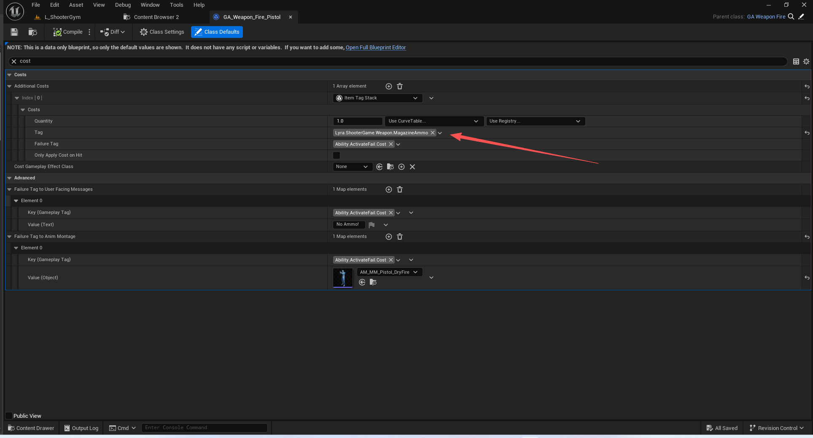

### 提交能力检查
转发激活失败时的消息通知

``` cpp
bool UGameplayAbility::CommitAbility(const FGameplayAbilitySpecHandle Handle, const FGameplayAbilityActorInfo* ActorInfo, const FGameplayAbilityActivationInfo ActivationInfo, OUT FGameplayTagContainer* OptionalRelevantTags)
{
	// Last chance to fail (maybe we no longer have resources to commit since we after we started this ability activation)
	if (!CommitCheck(Handle, ActorInfo, ActivationInfo, OptionalRelevantTags))
	{
		return false;
	}

	CommitExecute(Handle, ActorInfo, ActivationInfo);

	// Fixme: Should we always call this or only if it is implemented? A noop may not hurt but could be bad for perf (storing a HasBlueprintCommit per instance isn't good either)
	K2_CommitExecute();

	// Broadcast this commitment
	ActorInfo->AbilitySystemComponent->NotifyAbilityCommit(this);

	return true;
}
```
#### 触发能力激活回调
``` cpp

void ULyraAbilitySystemComponent::NotifyAbilityFailed(const FGameplayAbilitySpecHandle Handle,
	UGameplayAbility* Ability, const FGameplayTagContainer& FailureReason)
{
	Super::NotifyAbilityFailed(Handle, Ability, FailureReason);

	if (APawn* Avatar = Cast<APawn>(GetAvatarActor()))
	{
		/**
		 *IsSupportedForNetworking
		 *	我们只能复制以下内容的引用：
		 *	- CDO 和数据资产（例如，静态、非实例化的游戏能力）
		 *	- 正在实例化的且将被在客户端创建的那些能力。*
	 	 *	其他情况下则不予以支持，而是会在客户端重新生成。
		 *	
		 */
		// 如果这个Pawn不是本地控制的,但是这个能力又是需要网络的.那么我们就手动一个RPC通知出去
		if (!Avatar->IsLocallyControlled() && Ability->IsSupportedForNetworking())
		{
			ClientNotifyAbilityFailed(Ability, FailureReason);
			return;
		}
	}

	HandleAbilityFailed(Ability, FailureReason);
}

```
``` cpp

void UAbilitySystemComponent::NotifyAbilityCommit(UGameplayAbility* Ability)
{
	AbilityCommittedCallbacks.Broadcast(Ability);
}
```

``` cpp
	// 接收ASC的转发 能力激活失败了
	void OnAbilityFailedToActivate(const FGameplayTagContainer& FailedReason) const
	{
		NativeOnAbilityFailedToActivate(FailedReason);
		ScriptOnAbilityFailedToActivate(FailedReason);
	}


```
``` cpp
void ULyraGameplayAbility::NativeOnAbilityFailedToActivate(const FGameplayTagContainer& FailedReason) const
{
	bool bSimpleFailureFound = false;
	for (FGameplayTag Reason : FailedReason)
	{
		if (!bSimpleFailureFound)
		{
			if (const FText* pUserFacingMessage = FailureTagToUserFacingMessages.Find(Reason))
			{
				FLyraAbilitySimpleFailureMessage Message;
				Message.PlayerController = GetActorInfo().PlayerController.Get();
				Message.FailureTags = FailedReason;
				Message.UserFacingReason = *pUserFacingMessage;

				UGameplayMessageSubsystem& MessageSystem = UGameplayMessageSubsystem::Get(GetWorld());
				MessageSystem.BroadcastMessage(TAG_ABILITY_SIMPLE_FAILURE_MESSAGE, Message);
				bSimpleFailureFound = true;
			}
		}
		
		if (UAnimMontage* pMontage = FailureTagToAnimMontage.FindRef(Reason))
		{
			FLyraAbilityMontageFailureMessage Message;
			Message.PlayerController = GetActorInfo().PlayerController.Get();
			Message.AvatarActor = GetActorInfo().AvatarActor.Get();
			Message.FailureTags = FailedReason;
			Message.FailureMontage = pMontage;

			UGameplayMessageSubsystem& MessageSystem = UGameplayMessageSubsystem::Get(GetWorld());
			MessageSystem.BroadcastMessage(TAG_ABILITY_PLAY_MONTAGE_FAILURE_MESSAGE, Message);
		}
	}
}


```

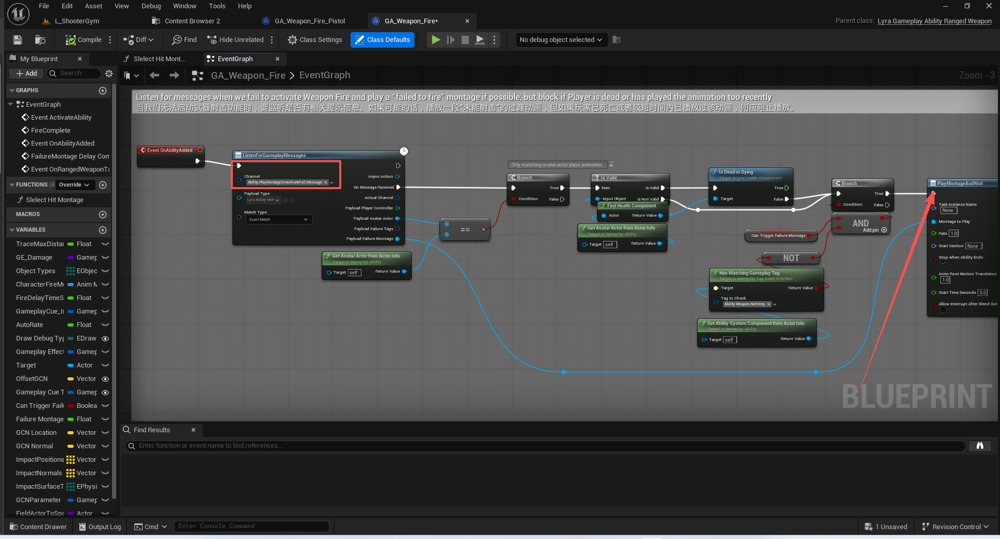
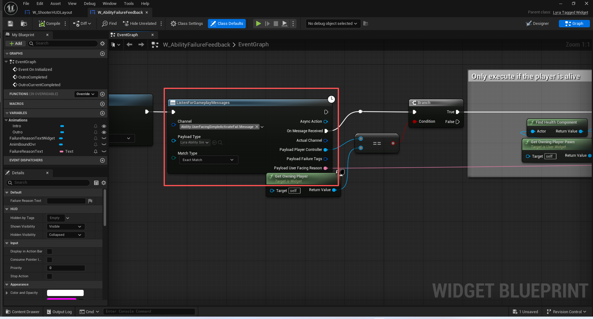
#### 执行弹药消耗

``` cpp
void UGameplayAbility::CommitExecute(const FGameplayAbilitySpecHandle Handle, const FGameplayAbilityActorInfo* ActorInfo, const FGameplayAbilityActivationInfo ActivationInfo)
{
	ApplyCooldown(Handle, ActorInfo, ActivationInfo);

	ApplyCost(Handle, ActorInfo, ActivationInfo);
}

```
``` cpp
void UGameplayAbility::ApplyCost(const FGameplayAbilitySpecHandle Handle, const FGameplayAbilityActorInfo* ActorInfo, const FGameplayAbilityActivationInfo ActivationInfo) const
{
	UGameplayEffect* CostGE = GetCostGameplayEffect();
	if (CostGE)
	{
		ApplyGameplayEffectToOwner(Handle, ActorInfo, ActivationInfo, CostGE, GetAbilityLevel(Handle, ActorInfo));
	}
}

```
``` cpp


void ULyraGameplayAbility::ApplyCost(const FGameplayAbilitySpecHandle Handle, const FGameplayAbilityActorInfo* ActorInfo, const FGameplayAbilityActivationInfo ActivationInfo) const
{
	Super::ApplyCost(Handle, ActorInfo, ActivationInfo);

	check(ActorInfo);

	// Used to determine if the ability actually hit a target (as some costs are only spent on successful attempts)
	// 用于判断该能力是否确实击中了目标（因为某些费用仅在成功攻击时才会消耗）
	auto DetermineIfAbilityHitTarget = [&]()
	{
		if (ActorInfo->IsNetAuthority())
		{
			if (ULyraAbilitySystemComponent* ASC = Cast<ULyraAbilitySystemComponent>(ActorInfo->AbilitySystemComponent.Get()))
			{
				FGameplayAbilityTargetDataHandle TargetData;
				ASC->GetAbilityTargetData(Handle, ActivationInfo, TargetData);
				for (int32 TargetDataIdx = 0; TargetDataIdx < TargetData.Data.Num(); ++TargetDataIdx)
				{
					if (UAbilitySystemBlueprintLibrary::TargetDataHasHitResult(TargetData, TargetDataIdx))
					{
						return true;
					}
				}
			}
		}

		return false;
	};

	// Pay any additional costs
	// 支付任何额外费用
	// 是否集中目标
	bool bAbilityHitTarget = false;
	// 是否已经执行过命中判定了
	bool bHasDeterminedIfAbilityHitTarget = false;
	for (const TObjectPtr<ULyraAbilityCost>& AdditionalCost : AdditionalCosts)
	{
		if (AdditionalCost != nullptr)
		{
			// 是否是只在命中时产生消耗
			if (AdditionalCost->ShouldOnlyApplyCostOnHit())
			{
				// 如果没有执行过命中判定,那么就在第一次的时候执行一次
				// 这样写阅读起来很奇怪 可能时考虑到只在这种情况下需要判定一次执行 不应当这样写
				if (!bHasDeterminedIfAbilityHitTarget)
				{
					bAbilityHitTarget = DetermineIfAbilityHitTarget();
					// 判定过了 后续不需要再判定了
					bHasDeterminedIfAbilityHitTarget = true;
				}
				// 根据判定结果 执行是否需要进行消耗.
				if (!bAbilityHitTarget)
				{
					continue;
				}
			}
			
			// 施加消耗
			AdditionalCost->ApplyCost(this, Handle, ActorInfo, ActivationInfo);
		}
	}
}
```
``` cpp

void ULyraAbilityCost_ItemTagStack::ApplyCost(const ULyraGameplayAbility* Ability, const FGameplayAbilitySpecHandle Handle, const FGameplayAbilityActorInfo* ActorInfo, const FGameplayAbilityActivationInfo ActivationInfo)
{
	if (ActorInfo->IsNetAuthority())
	{
		if (const ULyraGameplayAbility_FromEquipment* EquipmentAbility = Cast<const ULyraGameplayAbility_FromEquipment>(Ability))
		{
			if (ULyraInventoryItemInstance* ItemInstance = EquipmentAbility->GetAssociatedItem())
			{
				const int32 AbilityLevel = Ability->GetAbilityLevel(Handle, ActorInfo);

				const float NumStacksReal = Quantity.GetValueAtLevel(AbilityLevel);
				const int32 NumStacks = FMath::TruncToInt(NumStacksReal);

				ItemInstance->RemoveStatTagStack(Tag, NumStacks);
			}
		}
	}
}

```


### 能力的预测
GameplayPrediction.h
``` cpp
/**
 *	
 *	Overview of Gameplay Ability Prediction
 *	
 *	High Level Goals:
 *	At the GameplayAbility level (implementing an ability) prediction is transparent. An ability says "Do X->Y->Z", and we will automatically predict the parts of that that we can. 
 *	We wish to avoid having logic such as "If Authority: Do X. Else: Do predictive version of X" in the ability itself.
 *	
 *	At this point, not all cases are solved, but we have a very solid framework for working with client side prediction.
 *
 *	When we say "client side prediction" we really mean client predicting game simulation state. Things can still be 'completely client side' without having to work within a prediction system.
 *	For example, footsteps are completely client side and never interact with this system. But clients predicting their mana going from 100 to 90 when they cast a spell is 'client side prediction'.
 *		
 *	What do we currently predict?
 *	-Initial GameplayAbility activation (and chained activation with caveats)
 *	-Triggered Events
 *	-GameplayEffect application:
 *		-Attribute modification	(EXCEPTIONS: Executions do not currently predict, only attribute modifiers)
 *		-GameplayTag modification
 *	-Gameplay Cue events (both from within predictive gameplay effect and on their own)
 *		
 *	-Montages
 *	-Movement (built into UE UCharacterMovement)
 *	
 *	
 *	Some things we don't predict (most of these we potentially could, but currently dont):
 *	-GameplayEffect removal
 *	-GameplayEffect periodic effects (dots ticking)
 *	
 *	
 *	Problems we attempt to solve:
 *	1. "Can I do this?" Basic protocol for prediction.
 *	2. "Undo" How to undo side effects when a prediction fails.
 *	3. "Redo" How to avoid replaying side effects that we predicted locally but that also get replicated from the server.
 *	4. "Completeness" How to be sure we /really/ predicted all side effects.
 *	5. "Dependencies" How to manage dependent prediction and chains of predicted events.
 *	6. "Override" How to override state predictively that is otherwise replicated/owned by the server.
 *	
 *	---------------------------------------------------------
 *	
 *	Implementation Details
 *	
 *	*** PredictionKey ***
 *	
 *	A fundamental concept in this system is the Prediction Key (FPredictionKey). A prediction key on its own is simply a unique ID that is generated in a central place on the client. The client will send its prediction key to the server, 
 *	and associate predictive actions and side effects with this key. The server may respond with an accept/reject for the prediction key, and will also associate the server-side created side effects with this prediction key.
 *	
 *	(IMPORTANT) FPredictionKey always replicate client -> server, but when replicating server -> clients they *only* replicate to the client that sent the prediction key to the server in the first place. 
 *	This happens in FPredictionKey::NetSerialize. All other clients will receive an invalid (0) prediction key when a prediction key sent from a client is replicated back down through a replicated property.
 *	
 *	
 *	*** Ability Activation ***
 *	
 *	Ability Activation is a first class predictive action -- it generates an initial prediction key. Whenever a client predictively activates an ability, it explicitly asks the server and the server explicitly responds. Once an ability has been
 *	predictively activated (but the request has not yet been sent), the client has a valid 'prediction window' where predictive side effects can happen which are not explicitly 'asked about'. (E.g., we do not explicitly ask 'Can I decrement mana, Can I
 *	put this ability on cooldown. Those actions are considered logically atomic with activating an ability). You can think of this prediction window as being the initial callstack of ActivateAbility. Once ActivateAbility ends, your
 *  prediction window (and therefore your prediction key) is no longer valid. This is important, because many things can invalidate your prediction window such as any timers or latent nodes in your Blueprint; we do not predict over multiple frames.
 *	
 *	
 *	AbilitySystemComponent provides a set of functions for communicating ability activation between clients and server: TryActivateAbility -> ServerTryActivateAbility ->  ClientActivateAbility(Failed/Succeed).
 *	
 *	1. Client calls TryActivateAbility which generates a new FPredictionKey and calls ServerTryActivateAbility.
 *	2. Client continues (before hearing back from server) and calls ActivateAbility with the generated PredictionKey associated with the Ability's ActivationInfo.
 *	3. Any side effects that happen /before the call to ActivateAbility finish/ have the generated FPredictionKey associated with them.
 *	4. Server decides if the ability really happened in ServerTryActivateAbility, calls ClientActivateAbility(Failed/Succeed) and sets UAbilitySystemComponent::ReplicatedPredictionKey to the generated key that was sent with the request by the client.
 *	5. If client receives ClientAbilityFailed, it immediately kills the ability and rolls back side effects that were associated with the prediction key.
 *		5a. 'Rolling back' logic is registered via FPredictionKeyDelegates and FPredictionKey::NewRejectedDelegate/NewCaughtUpDelegate/NewRejectOrCaughtUpDelegate.
 *		5b. ClientAbilityFailed is really the only case where we 'reject' prediction keys and thus all of our current predictions rely on if an ability activates or not.
 *	6. If ServerTryActivateAbility succeeds, client must wait until property replication catches up (the Succeed RPC will be sent immediately, property replication will happen on its own). Once the ReplicatedPredictionKey catches up to the
 *		key used previous steps, the client can undo its predictive side effects.
 *		See FReplicatedPredictionKeyItem::OnRep for the CatchUpTo logic. See UAbilitySystemComponent::ReplicatedPredictionKeyMap for how the keys actually get replicated. See ~FScopedPredictionWindow where the server acknowledges keys.
 *						
 *			 
 *	*** GameplayEffect Prediction ***
 *
 *	GameplayEffects are considered side effects of ability activation and are not separately accepted/rejected.
 *	
 *	1. GameplayEffects are only applied on clients if there is a valid prediction key. (If no prediction key, it simply skips the application on client).
 *	2. Attributes, GameplayCues, and GameplayTags are all predicted if the GameplayEffect is predicted.
 *	3. When the FActiveGameplayEffect is created, it stores the prediction key (FActiveGameplayEffect::PredictionKey)
 *		3a. Instant effects are explained below in "Attribute Prediction".
 *	4. On the server, the same prediction key is also set on the server's FActiveGameplayEffect that will be replicated down.
 *	5. As a client, if you get a replicated FActiveGameplayEffect with a valid prediction key on it, you check to see if you have an ActiveGameplayEffect with that same key, if there is match, we do not apply
 *		the 'on applied' type of logic, e.g., GameplayCues. The solves the "Redo" problem. However we will have 2 of the 'same' GameplayEffects in our ActiveGameplayEffects container, temporarily:
 *	6. At the same time, FReplicatedPredictionKeyItem::OnRep will catch up and the predictive effects will be removed. When they are removed in this case, we again check PredictionKey and decide 
 *		if we should not do the 'On Remove' logic / GameplayCue.
 *		
 *	At this point, we have effectively predicted a gameplay effect as a side effect and handled the 'Undo' and 'Redo' problems.
 *		
 *  See FActiveGameplayEffectsContainer::ApplyGameplayEffectSpec where it registers what to do when caught-up (RemoveActiveGameplayEffect_NoReturn).
 *	See FActiveGameplayEffect::PostReplicatedAdd, FActiveGameplayEffect::PreReplicatedRemove, and FActiveGameplayCue::PostReplicatedAdd for examples of how FPredictionKey is associated with the GE's and GC's.
 *
 *	*** Attribute Prediction ***
 *	
 *	Since attributes are replicated as standard uproperties, predicting modification to them can be tricky ("Override" problem). Instantaneous modification can be even harder since these are non stateful by nature.
 *	(E.g., rolling back an attribute mod is difficult if there is no book keeping past the modification). This makes the "Undo" and "Redo" problem also hard in this case.
 *	
 *	The basic plan of attack is to treat attribute prediction as delta prediction rather than absolute value prediction. We do not predict that we have 90 mana, we predict that we have -10 mana from the server value, until 
 *	the server confirms our prediction key. Basically, treat instant modifications as /infinite duration modifications/ to attributes while they are done predictively. The solves "Undo" and "Redo".
 *	
 *	For the "override" problem, we can handle this in the properties OnRep by treating the replicated (server) value as the 'base value' instead of 'final value' of the attribute, and to 
 *	reaggregate our 'final value' after a replication happens.
 *	
 *	
 *	1. We treat predictive instant gameplay effects as infinite duration gameplay effects. See UAbilitySystemComponent::ApplyGameplayEffectSpecToSelf.
 *	2. We have to *always* receive RepNotify calls on our attributes (not just when there is a change from last local value, since we will predict the change ahead of time). Done with REPNOTIFY_Always.
 *	3. In the attribute RepNotify, we call into the AbilitySystemComponent::ActiveGameplayEffects to update our 'final value' give the new 'base value'. the GAMEPLAYATTRIBUTE_REPNOTIFY can do this.
 *	4. Everything else will work like above (GameplayEffect prediction) : when the prediction key is caught up, the predictive GameplayEffect is removed and we will return to the server given value.
 *	
 *	
 *	Example:
 *	
 *	void UMyHealthSet::GetLifetimeReplicatedProps(TArray< FLifetimeProperty > & OutLifetimeProps) const
 *	{
 *		Super::GetLifetimeReplicatedProps(OutLifetimeProps);
 *
 *		DOREPLIFETIME_CONDITION_NOTIFY(UMyHealthSet, Health, COND_None, REPNOTIFY_Always);
 *	}
 *	
 *  void UMyHealthSet::OnRep_Health()
 *  {
 *		GAMEPLAYATTRIBUTE_REPNOTIFY(UMyHealthSet, Health);
 *  }
 *  
 *  *** Gameplay Cue Events ***
 *  
 *  Outside of GameplayEffects which are already explained, Gameplay Cues can be activated on their own. These functions (UAbilitySystemComponent::ExecuteGameplayCue etc)  take network role and prediction keys into account.
 *  
 *  1. In UAbilitySystemComponent::ExecuteGameplayCue, if authority then do the multicast event (with replication key). If non authority but w/ a valid prediction key, predict the GameplayCue.
 *  2. On the receiving end (NetMulticast_InvokeGameplayCueExecuted etc), if there is a replication key, then don't do the event (assume you predicted it).
 *  
 *  Remember that FPredictionKeys only replicate to the originating owner. This is an intrinsic property of FReplicationKey.
 *	
 *	*** Triggered Data Prediction ***
 *	
 *	Triggered Data is currently used to activate abilities. Essentially this all goes through the same code path as ActivateAbility. Rather than the ability being activated from input press, it is activated from
 *	another game code driven event. Clients are able to predictively execute these events which predictively activate abilities. 
 *	
 *	There are some nuances to however, since the server will also run the code that triggers events. The server won't just wait to hear from the client. The server will keep a list of triggered abilities that have been
 *	activated from a predictive ability. When receiving a TryActivate from a triggered ability, the server will look to see if /it/ has already run this ability, and respond with that information.
 *	
 *	The issue is we do not properly rollback these operations. There is work left to do on Triggered Events and replication. (explained at the end).
 * 
 *	
 *	---------------------------------------------------------	
 *	
 *	Advanced topic!	
 *	
 *	*** Dependencies ***
 *	
 *	We can have situations such as "Ability X activates and immediately triggers an event which activates Ability Y which triggers another Ability Z". The dependency chain is X->Y->Z.
 *	Each of those abilities could be rejected by the server. If Y is rejected, then Z also never happened, but the server never tries to run Z, so the server doesn't explicitly decide 'no Z can't run'.
 *	
 *	To handle this, we have a concept of a Base PredictionKey, which is a member of FPredictionKey. When calling TryActivateAbility, we pass in the current PredictionKey (if applicable). That prediction key
 *	is used as the base for any new prediction keys generated. We build a chain of keys this way, and can then invalidate Z if Y is rejected.
 *	
 *	This is slightly more nuanced though. In the X->Y->Z case, the server will only receive the PredictionKey for X before trying to run the chain itself. E.g., it will TryActivate Y and Z with the original prediction key
 *	sent to it from the client, whereas the client will generate a new PredictionKey each time it calls TryActivateAbility. The client *has* to generate a new PredictionKey for each ability activate, since each activate
 *	is not logically atomic. Each side effect produced in the chain of events has to have a unique PredictionKey. We cannot have GameplayEffects produced in X have the same PredictionKey produced in Z.
 *	
 *	To get around this, The prediction key of X is considered the Base key for Y and Z. The dependency from Y to Z is kept completely client side, which is done in by FPredictionKeyDelegates::AddDependancy. We add delegates
 *	to reject/catchup Z if Y rejected/confirmed.
 *	
 *	This dependency system allows us to have multiple predictive actions that are not logically atomic within a single prediction window/scope.
 *  
 *  There is a problem though: because the dependencies are kept client side, the server does not actually know if it had previously rejected a dependent action. You can design around this issue by using activation tags
 *  in your gameplay abilities. For instance, when predicting dependents GA_Combo1 -> GA_Combo2, you could make GA_Combo2 only activate if it has a GameplayTag given by GA_Combo1. Thus a rejection of GA_Combo1 would also
 *  cause the server to reject the activation of GA_Combo2.
 *	
 *	
 *	*** Additional Prediction Windows (within an Ability) ***
 *	
 *	As stated, A prediction key is only usable during a single logical scope. Once ActivateAbility returns, we are essentially done with that key. If the ability is waiting on an external event or timer, it's possible
 *	we will have already received a confirm/reject from the server by the time we're ready to continue execution. Thus any additional side effects produced after the initial activation can no longer be tied to the lifespan of the original key.
 *	
 *	This isn't that bad, except that abilities will sometimes want to react to player input. For example, 'a hold down and charge' ability wants to instantly predict some stuff when the button is released. It is possible
 *	to create a new prediction window within an ability with FScopedPredictionWindow. 
 *	
 *	FScopedPredictionWindows provides a way to send the server a new prediction key and have the server pick up and use that key within the same logical scope.
 *	
 *	UAbilityTask_WaitInputRelease::OnReleaseCallback is a good example. The flow of events is as followed:
 *	1. Client enters UAbilityTask_WaitInputRelease::OnReleaseCallback and starts a new FScopedPredictionWindow. This creates a new prediction key for this scope (FScopedPredictionWindow::ScopedPredictionKey).
 *	2. Client calls AbilitySystemComponent->ServerInputRelease which passes ScopedPrediction.ScopedPredictionKey as a parameter.
 *	3. Server runs ServerInputRelease_Implementation which takes the passed in PredictionKey and sets it as UAbilitySystemComponent::ScopedPredictionKey with an FScopedPredictionWindow.
 *	4. Server runs UAbilityTask_WaitInputRelease::OnReleaseCallback /within the same scope/
 *	5. When the server hits the FScopedPredictionWindow in ::OnReleaseCallback, it gets the prediction key from UAbilitySystemComponent::ScopedPredictionKey. That is now used for all side effects within this logical scope.
 *	6. Once the server ends this scoped prediction window, the prediction key used is finished and set to ReplicatedPredictionKey.
 *	7. All side effects created in this scope now share a key between client and server.
 *	
 *	The key to this working is that ::OnReleaseCallback calls ::ServerInputRelease which calls ::OnReleaseCallback on the server. There is no room for anything else to happen and use the given prediction key.
 *	
 *	While there is no "Try/Failed/Succeed" calls in this example, all side effects are procedurally grouped/atomic. This solves the "Undo" and "Redo" problems for any arbitrary function calls that run on the server and client.
 *	
 *	
 *	---------------------------------------------------------
 *	
 *	Unsupported / Issues/ Todo
 *	
 *	Triggered events do not explicitly replicate. E.g., if a triggered event only runs on the server, the client will never hear about it. This also prevents us from doing cross player/AI etc events. Support
 *	for this should eventually be added and it should follow the same pattern that GameplayEffect and GameplayCues follow (predict triggered event with a prediction key, ignore the RPC event if it has a prediction key).
 *	
 *	Big caveat with this whole system: Rollback of any chained activations (including triggered events) is currently not possible out of the box. The reason for this is because each ServerTryActivateAbility is going to be responded to in order.
 *  Let's chain dependent GA's as an example: GA_Mispredict -> GA_Predict1. In this example, when GA_Mispredict is activated and predicted locally it will immediately also activate GA_Predict1. The client sends ServerTryActivateAbility for GA_Mispredict,
 *  and the server rejects it (sending back a ClientActivateAbilityFailed). As it stands, we don't have any delegates that reject dependent abilities on the client (and the server isn't even aware there are dependencies).  On the server, it also
 *  receives a ServerTryActivateAbility for GA_Predict1. Assuming that succeeds, the Client and Server are now both executing GA_Predict1 even though GA_Mispredict never happened. You can design around this by using the tag system to ensure GA_Mispredict succeeded.
 *
 *	*** Predicting "Meta" Attributes such as Damage/Healing vs "real" attributes such as Health ***
 *	
 *	We are unable to apply meta attributes predictively. Meta attributes only work on instant effects, in the back end of GameplayEffect (Pre/Post Modify Attribute on the UAttributeSet). These events are not called when
 *	applying duration-based gameplay effects. E.g., a GameplayEffect that modifies damage for 5 seconds doesn't make sense. 
 *	
 *	In order to support this, we would probably add some limited support for duration based meta attributes, and move the transform of the instant gameplay effect from the front end (UAbilitySystemComponent::ApplyGameplayEffectSpecToSelf)
 *	to the backend (UAttributeSet::PostModifyAttribute). 
 * 
 *			 
 *	*** Predicting ongoing multiplicative GameplayEffects ***
 *	
 *	There are also limitations when predicting % based gameplay effects. Since the server replicates down the 'final value' of an attribute, but not the entire aggregator chain of what is modifying it, we may run into cases where
 *	the client cannot accurately predict new gameplay effects.
 *	
 *	For example: 
 *	-Client has a perm +10% movement speed buff with base movement speed of 500 -> 550 is the final movement speed for this client.
 *	-Client has an ability which grants an additional 10% movement speed buff. It is expected to *sum* the % based multipliers for a final 20% bonus to 500 -> 600 movement speed.
 *	-However on the client, we just apply a 10% buff to 550 -> 605.
 *	
 *	This will need to be fixed by replicating down the aggregator chain for attributes. We already replicate some of this data, but not the full modifier list. We will need to look into supporting this eventually.
 *	 
 *	
 *	*** "Weak Prediction" ***
 *	
 *	We will probably still have cases that do not fit well into this system. Some situations will exist where a prediction key exchange is not feasible. For example, an ability where any one that player collides with/touches
 *	receives a GameplayEffect that slows them and their material blue. Since we can't send Server RPCs every time this happens (and the server couldn't necessarily handle the message at its point in the simulation), there is no 
 *	way to correlate the gameplay effect side effects between client and server.
 *	
 *	One approach here may be to think about a weaker form of prediction. One where there is not a fresh prediction key used and instead the server assumes the client will predict all side effects from an entire ability. This would
 *	at least solve the "redo" problem but would not solve the "completeness" problem. If the client side prediction could be made as minimal as possible - for example only predicting an initial particle effect rather than
 *	predicting the state and attribute change - then the problems get less severe.
 *	
 *	I can envision a weak prediction mode which is what (certain abilities? All abilities?) fall back to when there is no fresh prediction key that can accurately correlate side effects. When in weak prediction mode, perhaps
 *	only certain actions can be predicted - for example GameplayCue execute events, but not OnAdded/OnRemove events.
 *	
 *	
 */


/**
 *	FPredictionKey is a generic way of supporting Clientside Prediction in the GameplayAbility system.
 *	A FPredictionKey is essentially an ID for identifying predictive actions and side effects that are
 *	done on a client. UAbilitySystemComponent supports synchronization of the prediction key and its side effects
 *	between client and server.
 *	
 *	Essentially, anything can be associated with a PredictionKey, for example activating an Ability.
 *	The client can generate a fresh PredictionKey and sends it to the server in its ServerTryActivateAbility call.
 *	The server can confirm or reject this call (ClientActivateAbilitySucceed/Failed). 
 *	
 *	While the client is predicting its ability, it is creating side effects (GameplayEffects, TriggeredEvents, Animations, etc).
 *	As the client predicts these side effects, it associates each one with the prediction key generated at the start of the ability
 *	activation.
 *	
 *	If the ability activation is rejected, the client can immediately revert these side effects. 
 *	If the ability activation is accepted, the client must wait until the replicated side effects are sent to the server.
 *		(the ClientActivatbleAbilitySucceed RPC will be immediately sent. Property replication may happen a few frames later).
 *		Once replication of the server created side effects is finished, the client can undo its locally predictive side effects.
 *		
 *	The main things FPredictionKey itself provides are:
 *		-Unique ID and a system for having dependant chains of Prediction Keys ("Current" and "Base" integers)
 *		-A special implementation of ::NetSerialize *** which only serializes the prediction key to the predicting client ***
 *			-This is important as it allows us to serialize prediction keys in replicated state, knowing that only clients that gave the server the prediction key will actually see them!
 *	
 */
```

``` cpp
* 游戏玩法能力预测概述*
* 高级目标：
* 在游戏能力层面（实现一项能力）中，预测过程是透明的。一项能力会表述为“执行 X -> Y -> Z”，我们会自动预测出其中我们能够执行的部分。
* 我们希望避免在能力本身中出现诸如“如果权限：执行 X。否则：执行 X 的预测版本”这样的逻辑。*
* 在目前阶段，并非所有问题都已得到解决，但我们已经为处理客户端预测工作建立了一个非常稳固的框架。*
当我们说“客户端预测”时，实际上是指客户端对游戏模拟状态的预测。即便不使用预测系统，事情仍可以完全由客户端来完成。
例如，脚步声完全是客户端控制的，与这个系统毫无关联。但当客户端预测玩家施法时其法力值从 100 降至 90 这种情况就是“客户端预测”。*
* 我们目前的预测内容是什么？
* - 初始游戏能力的激活（以及与之相关的连锁激活，但需注意相关条件）
* - 触发事件
* - 游戏效果的应用：
*	- 属性修改（特殊情况：目前的执行过程无法进行预测，仅能预测属性修改）
*	- 游戏标签的修改
* - 游戏提示事件（既包括来自预测游戏效果内部的事件，也包括单独的事件）*
* - 蒙太奇
* - 运动（内置于 UE UCharacterMovement 中）*
*
* 有些事情我们无法预测（其中大部分我们其实本可以预测，但目前还无法做到）：
* - 游戏效果的移除
* - 游戏效果的周期性效果（持续闪烁的图标）*
*
*	我们试图解决的问题：
*	1. “我能这样做吗？”这是进行预测的基本准则。
*	2. “撤销”当预测失败时，如何撤销所产生的副作用。
*	3. “重做”如何避免重复执行我们本地预测但同时也会从服务器复制过来的副作用。
*	4. “完整性”如何确保我们真正地预测了所有的副作用。
*	5. “依赖关系”如何管理依赖于预测的事件以及预测事件链。
*	6. “覆盖”如何根据预测结果覆盖原本由服务器复制/掌控的状态。*
*	---------------------------------------------------------
```

``` cpp
*	实施细节*
*	*** 预测密钥 ****
* 该系统中的一个基本概念是“预测密钥”（FPredictionKey）。单独来看，预测密钥只是一个在客户端的中央位置生成的唯一标识符。客户端会将其预测密钥发送至服务器，并将预测操作和副作用与该密钥相关联。服务器可能会对预测密钥作出接受/拒绝的回应，并且还会将服务器端创建的副作用与该预测密钥相关联。*
（重要提示）FPredictionKey 总是实现客户端到服务器的复制，但在服务器到客户端的复制过程中，它们只会复制到最初向服务器发送预测键的那个客户端。
* 这种情况发生在 FPredictionKey::NetSerialize 方法中。当从客户端发送的预测键通过复制属性回传时，所有其他客户端都会收到无效的（0）预测键。*
*
*	*** 能力激活 ****
“能力激活”是一种高级的预测性操作——它会生成一个初始的预测关键值。每当客户端进行预测性地激活某项能力时，它会明确地向服务器发出请求，而服务器也会明确地作出响应。一旦某项能力被成功预测性地激活（但请求尚未发送出去），客户端便拥有了一个有效的“预测窗口”，在此期间可能会出现一些预测性的影响，而这些影响并不会被明确地“询问”（例如，我们不会明确询问“我可以减少法力值吗？我可以将此能力置于冷却状态吗？”这些操作在逻辑上与激活能力是原子性的）。你可以将这个预测窗口视为“激活能力”的初始调用栈。一旦“激活能力”结束，你的预测窗口（以及因此产生的预测关键值）就不再有效了。这一点非常重要，因为许多因素都可能使你的预测窗口失效，比如你的蓝图中的任何计时器或潜伏节点；我们不会在多个帧内进行预测。*
*
* 能力系统组件提供了一套用于在客户端与服务器之间进行能力激活通信的函数：TryActivateAbility -> ServerTryActivateAbility -> ClientActivateAbility（失败/成功）。*
1. 客户端调用 TryActivateAbility 方法，该方法会生成一个新的 FPredictionKey 并调用 ServerTryActivateAbility 方法。
2. 在收到服务器回复之前，客户端继续执行操作，并使用与能力激活信息相关联的生成的 PredictionKey 调用 ActivateAbility 方法。
3. 在调用 ActivateAbility 方法之前发生的任何副作用都会与生成的 FPredictionKey 相关联。
4. 服务器在 ServerTryActivateAbility 方法中决定该能力是否真的发生，并调用 ClientActivateAbility(Failed/Succeed) 方法，并将客户端随请求发送的生成的键设置为 UAbilitySystemComponent:：ReplicatedPredictionKey 的值。
5. 如果客户端收到 ClientAbilityFailed，它会立即终止该能力，并回滚与预测键相关联的所有副作用。
  5a. 回滚逻辑通过 FPredictionKeyDelegates、FPredictionKey:：NewRejectedDelegate、FPredictionKey:：NewCaughtUpDelegate 和 FPredictionKey:：NewRejectOrCaughtUpDelegate 来注册。
  5b. ClientAbilityFailed 实际上是唯一一种我们拒绝预测键的情况，因此我们当前的所有预测都依赖于能力是否激活。
6.如果 ServerTryActivateAbility 操作成功，客户端必须等待属性复制完成（Succeed RPC 会立即发送，属性复制会自行进行）。一旦 ReplicatedPredictionKey 与之前步骤中使用的键保持一致，客户端就可以撤销其预测带来的影响。
* 请参阅 FReplicatedPredictionKeyItem:：OnRep 以了解 CatchUpTo 的逻辑。请参阅 UAbilitySystemComponent:：ReplicatedPredictionKeyMap 了解键的实际复制方式。请参阅 ~FScopedPredictionWindow 以了解服务器如何确认这些键。*
*
*	*** 游戏效果预测 ****
* 游戏玩法效果被视为能力激活所产生的副作用，因此不会单独进行接受或拒绝的判定。*
* 1. 只有在存在有效的预测密钥的情况下，游戏效果才会在客户端生效。（如果没有预测密钥，则直接跳过在客户端的生效操作）。
* 2. 属性、游戏提示和游戏标签都会根据游戏效果的预测结果进行预测。
* 3. 当创建 FActiveGameplayEffect 时，它会存储预测密钥（FActiveGameplayEffect:：PredictionKey）。
* 3a. 瞬时效果将在“属性预测”部分进行详细说明。
* 4. 在服务器端，与将要复制下来的 FActiveGameplayEffect 相对应的服务器端 FActiveGameplayEffect 也会设置相同的预测密钥。
* 5. 作为客户端，如果接收到带有有效预测密钥的复制的 FActiveGameplayEffect，则会检查是否在 ActiveGameplayEffect 中存在相同的密钥，如果匹配，则不会应用“已应用”类型的逻辑，例如游戏提示。这解决了“重做”问题。然而，在我们的 ActiveGameplayEffects 容器中，会暂时存在两个“相同的”游戏效果：
* 6. 同时，FReplicatedPredictionKeyItem:：OnRep 会进行更新，预测效果将被移除。在这种情况下，当它们被移除时，我们会再次检查预测密钥并做出决定。* 如果我们不执行“移除时的逻辑”/“游戏提示”操作。*
此时，我们已经成功地将一种游戏效果视为一种附带效应，并解决了“撤销”和“重做”这两个问题。*
*  请参阅 FActiveGameplayEffectsContainer::ApplyGameplayEffectSpec 中的相关内容，其中说明了在被捕获时应执行的操作（即 RemoveActiveGameplayEffect_NoReturn）。
*  请参阅 FActiveGameplayEffect::PostReplicatedAdd、FActiveGameplayEffect:：PreReplicatedRemove 和 FActiveGameplayCue:：PostReplicatedAdd，以获取 FPredictionKey 与 GE（游戏效果）和 GC（游戏控制）关联方式的示例。*
*	*** 属性预测 ****
* 由于属性会被作为标准的上层属性进行复制，因此预测其修改情况可能会比较困难（存在“覆盖”问题）。而即时修改则会更加困难，因为这些属性本质上是非状态化的。
* （例如，如果在修改操作之后没有进行任何记录，那么回滚属性修改就比较困难）。这也就使得在这种情况下“撤销”和“重做”问题变得复杂。*
基本的攻击策略是将属性预测视为差值预测而非绝对值预测。我们不会预测自己拥有 90 点法力值，而是会预测相对于服务器值我们少了 10 点法力值，直到
* 服务器确认我们的预测键为止。基本上，在进行预测性修改时，将即时修改视为具有“无限持续时间”的属性修改。这解决了“撤销”和“重做”问题。*
对于“覆盖”问题，我们可以在属性的“OnRep”方法中进行处理，将被复制（服务器端）的值视为该属性的“基础值”而非“最终值”，并且在复制操作完成后重新计算“最终值”。*
*
* 1. 我们将预测的即时游戏效果视为无限持续的游戏效果。请参考 UAbilitySystemComponent::ApplyGameplayEffectSpecToSelf。
* 2. 我们必须始终接收属性的 RepNotify 调用（不仅仅是在本地值发生变化时，因为我们会提前预测变化）。使用 REPNOTIFY_Always 来实现。
* 3. 在属性的 RepNotify 中，我们调用 AbilitySystemComponent:：ActiveGameplayEffects 来更新我们的“最终值”，并根据新的“基础值”进行更新。GAMEPLAYATTRIBUTE_REPNOTIFY 可以完成此操作。
* 4. 其余部分的工作方式与上述（游戏效果预测）相同：当预测的关键值被捕捉到时，预测的游戏效果将被移除，然后我们将返回服务器提供的值。*
 *	Example:
 *	
 *	void UMyHealthSet::GetLifetimeReplicatedProps(TArray< FLifetimeProperty > & OutLifetimeProps) const
 *	{
 *		Super::GetLifetimeReplicatedProps(OutLifetimeProps);
 *
 *		DOREPLIFETIME_CONDITION_NOTIFY(UMyHealthSet, Health, COND_None, REPNOTIFY_Always);
 *	}
 *	
 *  void UMyHealthSet::OnRep_Health()
 *  {
 *		GAMEPLAYATTRIBUTE_REPNOTIFY(UMyHealthSet, Health);
 *  }

 *  *** 游戏玩法提示事件 ****
* 除了已经解释过的游戏效果之外，游戏提示也可以单独激活。这些功能（如 UAbilitySystemComponent::ExecuteGameplayCue 等）会考虑网络角色和预测键的因素。*
1. 在 UAbilitySystemComponent::ExecuteGameplayCue 方法中，如果具有权限，则执行多播事件（并使用复制键）。如果无权限但具有有效的预测键，则预测游戏事件。
2. 在接收端（NetMulticast_InvokeGameplayCueExecuted 等），如果存在复制键，则不执行该事件（假定已经进行了预测）。*
* 要记住，FPredictionKeys 仅会复制给其原始所有者。这是 FReplicationKey 的固有特性。*
*	*** 触发式数据预测 ****
* 触发数据目前用于激活能力。实际上，这一切都遵循与“激活能力”相同的代码路径。与通过输入操作来激活能力不同，它是通过另一段游戏代码驱动的事件来激活的。客户端能够预先执行这些事件，从而预先激活能力。*
不过，这其中也有一些细微差别。因为服务器还会执行触发事件的代码。服务器不会只是等待客户端的反馈。服务器会保存一份已激活的预测能力所触发的能力列表。当接收到触发能力的“尝试激活”指令时，服务器会查看“它”是否已经运行过此能力，并据此给出回应。*
问题在于我们没有正确地撤销这些操作。在“触发事件”和“复制”方面还有工作要做。（详情见下文说明）*
```

``` cpp
* 高级话题！*
*	*** 依赖项 ****
* 我们可能会遇到这样的情况：“能力 X 激活后会立即触发一个事件，该事件会激活能力 Y，而能力 Y 又会触发能力 Z”。这种依赖关系链是 X->Y->Z。
* 每种能力都可能被服务器拒绝。如果 Y 被拒绝，那么 Z 也永远不会触发，但服务器从不尝试运行 Z，所以服务器也不会明确地判定“Z 无法运行”。*
为了解决这个问题，我们引入了一个“基础预测键”的概念，它是“预测键”的一个组成部分。在调用“尝试激活能力”时，我们会传入当前的预测键（如果适用的话）。这个预测键
* 会被用作生成任何新预测键的基础。我们通过这种方式构建一系列的键，并且如果 Y 被拒绝，就可以失效 Z 。*
* 这一点稍微有些复杂。在 X -> Y -> Z 的情况下，服务器在尝试运行整个链路之前只会先接收到 X 的预测密钥。例如，它会使用从客户端发送给它的原始预测密钥来尝试激活 Y 和 Z，而客户端每次调用 TryActivateAbility 时都会生成一个新的预测密钥。客户端必须为每次激活能力都生成一个新的预测密钥，因为每次激活本身并非逻辑上的原子操作。事件链中的每个副作用都必须有唯一的预测密钥。我们不能让在 X 中产生的游戏效果拥有与在 Z 中产生的相同的预测密钥。*
为了解决这个问题，X 的预测键被视为 Y 和 Z 的基础键。Y 对 Z 的依赖关系完全在客户端实现，这是通过 FPredictionKeyDelegates:：AddDependancy 方法来完成的。我们添加了委托来拒绝/赶上 Z，具体操作取决于 Y 的拒绝/确认情况。*
* 这种依赖系统使我们能够执行多个预测操作，而这些操作在单个预测窗口/范围内并非是逻辑上相互独立的。*
不过存在一个问题：由于依赖关系是在客户端保存的，服务器实际上并不知道之前是否已经拒绝过某个依赖操作。您可以通过在游戏能力中使用激活标签来解决这个问题。
例如，在预测依赖项 GA_Combo1 -> GA_Combo2 时，您可以让 GA_Combo2 只在接收到由 GA_Combo1 传递的游戏能力标签的情况下才激活。因此，如果拒绝了 GA_Combo1，服务器也会拒绝激活 GA_Combo2。
*	*** 能力内的附加预测窗口 ****
* 如前所述，预测键仅在单个逻辑范围内有效。一旦 ActivateAbility 函数返回，我们就基本上完成了对该键的操作。如果该能力正等待外部事件或计时器触发，那么在我们准备继续执行时，有可能已经从服务器收到了确认/拒绝的回复。因此，在初始激活之后产生的任何其他副作用都不再与原始键的生命周期相关联。*
* 这情况还算不算太糟呢，只是有些能力有时会需要根据玩家的操作做出反应。比如说，“持续按压并加速”这种能力在按钮松开时就需要即时预测一些情况。这是有可能的
* 通过使用 FScopedPredictionWindow 在某个能力中创建一个新的预测窗口。*
*	FScopedPredictionWindows 提供了一种向服务器发送新预测密钥的方式，并且能让服务器在相同的逻辑范围内接收并使用该密钥。*
*	UAbilityTask_WaitInputRelease::OnReleaseCallback 是一个很好的示例。事件的流程如下：
*	1. 客户端进入 UAbilityTask_WaitInputRelease:：OnReleaseCallback 并启动一个新的 FScopedPredictionWindow。这为该范围创建了一个新的预测键（FScopedPredictionWindow:：ScopedPredictionKey）。
*	2. 客户端调用 AbilitySystemComponent->ServerInputRelease 并将 ScopedPrediction.ScopedPredictionKey 作为参数传递给它。
*	3. 服务器运行 ServerInputRelease_Implementation，该实现接收传入的 PredictionKey 并将其设置为 UAbilitySystemComponent::ScopedPredictionKey，并使用 FScopedPredictionWindow 进行保存。
*	4. 服务器在同一个范围内运行 UAbilityTask_WaitInputRelease:：OnReleaseCallback。
*	5. 当服务器在 ：：OnReleaseCallback 中遇到 FScopedPredictionWindow 时，它会从 UAbilitySystemComponent:：ScopedPredictionKey 中获取预测键。现在，该预测键将用于此逻辑范围内的所有副作用。
*	6. 当服务器结束这个范围内的预测窗口时，使用的预测键已结束并设置为 ReplicatedPredictionKey。
*	7. 在这个范围内创建的所有副作用现在在客户端和服务器之间共享同一个键。*
该工作的关键在于：：：OnReleaseCallback 调用 ：：ServerInputRelease，而 ：：ServerInputRelease 又会再次调用 ：：OnReleaseCallback 以在服务器端执行操作。在此过程中，没有任何其他操作能够介入并使用所提供的预测键。*
* 在此示例中，并不存在“尝试/失败/成功”的调用方式，但所有副作用都是以程序化的方式进行分组/原子化的处理。这解决了服务器和客户端上运行的任何任意函数调用的“撤销”和“重做”问题。*
*
```
``` cpp
---------------------------------------------------------
*
*  不支持 / 问题 / 任务清单*
* 触发事件不会进行明确的复制。例如，如果一个触发事件仅在服务器端运行，那么客户端将永远无法得知该事件的存在。这也使得我们无法实现跨玩家/人工智能等类型的事件。支持
* 对于此部分最终应予以添加，并且其应遵循与“游戏效果”和“游戏提示”相同的模式（通过预测键来预测触发事件，如果 RPC 事件有预测键则忽略该事件）。*
* 这整个系统有一个重要的注意事项：目前无法在系统默认状态下撤销任何链式激活（包括触发事件）。之所以这样是因为每个 ServerTryActivateAbility 都会按照顺序进行响应。
* 以依赖关系的全局激活（GA）为例：GA_Mispredict -> GA_Predict1。在这个例子中，当 GA_Mispredict 被本地激活并预测成功时，它也会立即激活 GA_Predict1。客户端会发送 ServerTryActivateAbility 请求给服务器，
* 服务器会拒绝该请求（返回 ClientActivateAbilityFailed）。目前，我们没有在客户端设置任何拒绝依赖能力的委托（而且服务器甚至都不知道存在依赖关系）。在服务器端，它也会收到 ServerTryActivateAbility 请求给 GA_Predict1。假设该请求成功，客户端和服务器现在都在执行 GA_Predict1，尽管 GA_Mispredict 并未发生。您可以通过使用标签系统来解决这个问题，以确保 GA_Mispredict 成功执行。*
*	*** 预测“元”属性（如伤害/治疗）与“真实”属性（如生命值）之间的关系 ****
* 我们无法对元属性进行预测性设置。元属性仅适用于即时效果，且仅在游戏玩法效果的后端（在 UAttributeSet 中的“预/后修改属性”部分）起作用。当应用基于持续时间的游戏玩法效果时（例如，一个持续 5 秒修改伤害的游戏玩法效果）是不会调用这些事件的。这种效果是没有意义的。*
为了实现这一目标，我们可能会为基于持续时间的元属性添加一些有限的支持，并将即时游戏效果的转换从前端（UAbilitySystemComponent::ApplyGameplayEffectSpecToSelf）移到后端（UAttributeSet::PostModifyAttribute）。*
*
*	*** 预测持续存在的乘法式游戏效果 ****
在预测基于游戏玩法的百分比效果时也存在一些限制。由于服务器会复制属性的“最终值”，但不会复制影响该属性的整个聚合链，因此可能会出现以下情况：
* 客户端无法准确预测新的游戏效果。*
* 例如：
* - 客户端拥有一个提升 10% 移动速度的永久增益效果，其基础移动速度为 500 -> 最终该客户端的移动速度为 550。
* - 客户端拥有一种能额外提供 10% 移动速度增益的技能。预计会将基于百分比的乘数相加，从而为 500 -> 600 的移动速度带来最终 20% 的加成。
* - 但在客户端上，我们只是将 10% 的增益应用到 550 上 -> 结果是 605。*
* 这需要通过向下复制属性聚合链来解决。我们已经对部分数据进行了复制，但并未涵盖完整的修饰符列表。我们最终需要研究如何实现这一功能。*
*
*	*** “预测不准确” ****
* 我们可能会仍有一些情况无法完全纳入这个系统之中。有些情况下，预测性的密钥交换是不可行的。例如，有一种能力是这样的：当任何一名玩家发生碰撞/接触时，都会接收到一个会使他们及其所穿装备减速的“游戏效果”。由于我们不能每次出现这种情况时都发送服务器远程调用请求（而且服务器在模拟过程中也未必能够处理这样的消息），所以就无法在客户端和服务器之间关联游戏效果的副作用。
这里的一种方法可能是考虑采用一种较弱形式的预测方式。在这种方式中，不再使用新的预测关键字，而是服务器假定客户端会根据整个技能来预测所有副作用。这将会
* 至少能解决“重做”问题，但无法解决“完整性”问题。如果客户端的预测能够尽可能简化——例如仅预测初始的粒子效果，而非预测状态和属性的变化——那么问题就会减轻一些。
* 我可以设想一种较弱的预测模式，即（某些能力？所有能力？）在没有能够准确关联副作用的新预测键的情况下，它们会自动回归到这种模式。在弱预测模式下，或许
* 只有某些操作能够被预测——例如游戏事件的执行事件，但不包括“添加”/“移除”事件。
*
*/

```
``` cpp
/**
* FPredictionKey 是一种通用的机制，用于在游戏能力系统中支持客户端预测功能。
* FPredictionKey 实质上是一个用于标识在客户端执行的预测动作及其副作用的标识符。
* UAbilitySystemComponent 支持在客户端和服务器之间同步预测键及其副作用。*
* 从根本上说，任何事物都可以与预测密钥相关联，例如激活一项能力。
* 客户端可以生成一个新的预测密钥，并在其“服务器尝试激活能力”调用中将其发送至服务器。
* 服务器可以确认或拒绝此调用（“客户端激活能力成功/失败”）。*
* 当客户端预测其能力时，会引发一些副作用（如游戏效果、触发事件、动画等）。
* 在客户端预测这些副作用的过程中，会将每个副作用与在能力激活之初生成的预测键进行关联。*
* 如果能力激活被拒绝，客户端可以立即撤销这些副作用。
* 如果能力激活被接受，客户端必须等到复制的副作用发送至服务器。
* （客户端激活可成功 RPC 将立即发送。属性复制可能会在几帧之后进行）。
* 一旦服务器创建的副作用的复制完成，客户端就可以撤销其本地预测的副作用。*
FPredictionKey 本身提供的主要功能包括：
- 一个唯一的标识符以及一个用于生成依赖链的预测键系统（“当前”和“基础”整数）
- 一种特殊的 ：：NetSerialize 实现 *** 该实现仅将预测键序列化给预测客户端 ***
- 这非常重要，因为它使我们能够以复制状态序列化预测键，同时知道只有向服务器提供预测键的客户端才会真正看到这些键！*
*/

```
### 激活能力_Cpp

#### 绑定目标数据设置后的回调处理
``` cpp
void ULyraGameplayAbility_RangedWeapon::ActivateAbility(const FGameplayAbilitySpecHandle Handle,
                                                        const FGameplayAbilityActorInfo* ActorInfo,
                                                        const FGameplayAbilityActivationInfo ActivationInfo,
                                                        const FGameplayEventData* TriggerEventData)
{
	// Bind target data callback
	// 绑定目标数据回调函数
	UAbilitySystemComponent* MyAbilityComponent = CurrentActorInfo->AbilitySystemComponent.Get();
	check(MyAbilityComponent);

	OnTargetDataReadyCallbackDelegateHandle =
		MyAbilityComponent->AbilityTargetDataSetDelegate(CurrentSpecHandle,
		                                                 CurrentActivationInfo.GetActivationPredictionKey()).AddUObject(
			this, &ThisClass::OnTargetDataReadyCallback);

	// Update the last firing time
	// 更新上一次触发时间
	ULyraRangedWeaponInstance* WeaponData = GetWeaponInstance();
	check(WeaponData);
	WeaponData->UpdateFiringTime();

	Super::ActivateAbility(Handle, ActorInfo, ActivationInfo, TriggerEventData);
}

```
#### 本地端收集数据
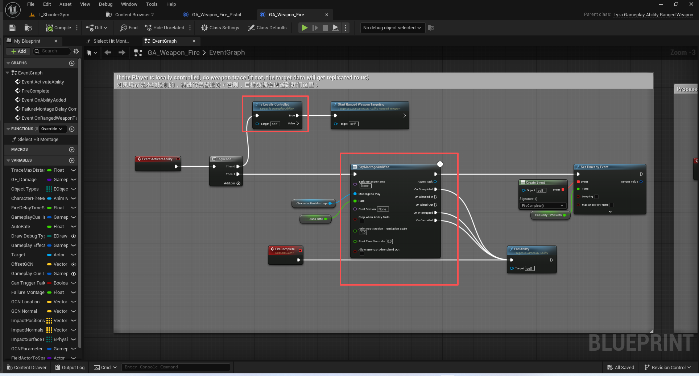

``` cpp

void ULyraGameplayAbility_RangedWeapon::StartRangedWeaponTargeting()
{
	check(CurrentActorInfo);

	AActor* AvatarActor = CurrentActorInfo->AvatarActor.Get();
	check(AvatarActor);

	UAbilitySystemComponent* MyAbilityComponent = CurrentActorInfo->AbilitySystemComponent.Get();
	check(MyAbilityComponent);

	AController* Controller = GetControllerFromActorInfo();
	check(Controller);
	ULyraWeaponStateComponent* WeaponStateComponent = Controller->FindComponentByClass<ULyraWeaponStateComponent>();

	// 构建本地预测的窗口
	FScopedPredictionWindow ScopedPrediction(MyAbilityComponent, CurrentActivationInfo.GetActivationPredictionKey());
	
	// 执行子弹检测
	TArray<FHitResult> FoundHits;
	PerformLocalTargeting(/*out*/ FoundHits);

	// Fill out the target data from the hit results
	// 根据命中结果填写目标数据
	FGameplayAbilityTargetDataHandle TargetData;
	
	// 这里获取容器的数量 作为新的一个索引
	TargetData.UniqueId = WeaponStateComponent ? WeaponStateComponent->GetUnconfirmedServerSideHitMarkerCount() : 0;

	// 这里的命中结果其实是很多个弹丸 它们都来自于一次发射
	if (FoundHits.Num() > 0)
	{
		const int32 CartridgeID = FMath::Rand();

		for (const FHitResult& FoundHit : FoundHits)
		{
			FLyraGameplayAbilityTargetData_SingleTargetHit* NewTargetData = new
				FLyraGameplayAbilityTargetData_SingleTargetHit();
			
			NewTargetData->HitResult = FoundHit;
			NewTargetData->CartridgeID = CartridgeID;

			TargetData.Add(NewTargetData);
		}
	}

	// Send hit marker information
	// 发送命中标记信息
	if (WeaponStateComponent != nullptr)
	{
		WeaponStateComponent->AddUnconfirmedServerSideHitMarkers(TargetData, FoundHits);
	}

	// Process the target data immediately
	// 即刻处理目标数据
	OnTargetDataReadyCallback(TargetData, FGameplayTag());
}

```
##### 本地目标检测
``` cpp
struct FRangedWeaponFiringInput
	{
		// Start of the trace
		// 射线七点
		FVector StartTrace;

		// End of the trace if aim were perfect
		// 若射击目标完全准确，追踪过程便至此结束
		FVector EndAim;

		// The direction of the trace if aim were perfect
		// 若瞄准精准的话，轨迹的方向将是这样的
		FVector AimDir;

		// The weapon instance / source of weapon data
		// 武器实例 / 武器数据的来源
		ULyraRangedWeaponInstance* WeaponData = nullptr;

		// Can we play bullet FX for hits during this trace
		// 在这次追踪过程中，我们能否为击中动作播放子弹特效呢？
		bool bCanPlayBulletFX = false;

		FRangedWeaponFiringInput()
			: StartTrace(ForceInitToZero)
			, EndAim(ForceInitToZero)
			, AimDir(ForceInitToZero)
		{
		}
	};

```


``` cpp
void ULyraGameplayAbility_RangedWeapon::PerformLocalTargeting(OUT TArray<FHitResult>& OutHits)
{
	APawn* const AvatarPawn = Cast<APawn>(GetAvatarActorFromActorInfo());

	ULyraRangedWeaponInstance* WeaponData = GetWeaponInstance();

	if (AvatarPawn && AvatarPawn->IsLocallyControlled() && WeaponData)
	{
		FRangedWeaponFiringInput InputData;
		InputData.WeaponData = WeaponData;
		InputData.bCanPlayBulletFX = (AvatarPawn->GetNetMode() != NM_DedicatedServer);

		//@TODO: Should do more complicated logic here when the player is close to a wall, etc...
		//@待办事项：当玩家靠近墙壁等位置时，这里应该加入更复杂的逻辑处理……
		const FTransform TargetTransform = GetTargetingTransform(
			AvatarPawn, ELyraAbilityTargetingSource::CameraTowardsFocus);

		// 获取射击方向
		InputData.AimDir = TargetTransform.GetUnitAxis(EAxis::X);
		// 获取射线起点
		InputData.StartTrace = TargetTransform.GetTranslation();
		// 瞄准的终点计算
		InputData.EndAim = InputData.StartTrace + InputData.AimDir * WeaponData->GetMaxDamageRange();

#if ENABLE_DRAW_DEBUG
		// 调试
		if (LyraConsoleVariables::DrawBulletTracesDuration > 0.0f)
		{
			static float DebugThickness = 2.0f;
			DrawDebugLine(GetWorld(), InputData.StartTrace, InputData.StartTrace + (InputData.AimDir * 100.0f),
			              FColor::Yellow, false, LyraConsoleVariables::DrawBulletTracesDuration, 0, DebugThickness);
		}
#endif
		// 在弹壳中追踪子弹
		TraceBulletsInCartridge(InputData, /*out*/ OutHits);
	}
}


```
##### 一发子弹有多枚弹丸
``` cpp

void ULyraGameplayAbility_RangedWeapon::TraceBulletsInCartridge(const FRangedWeaponFiringInput& InputData,
                                                                OUT TArray<FHitResult>& OutHits)
{
	ULyraRangedWeaponInstance* WeaponData = InputData.WeaponData;
	check(WeaponData);

	// 获取弹丸数量 一般为1  霰弹枪会有很多
	const int32 BulletsPerCartridge = WeaponData->GetBulletsPerCartridge();

	for (int32 BulletIndex = 0; BulletIndex < BulletsPerCartridge; ++BulletIndex)
	{
		// 获取基础的扩大角度
		const float BaseSpreadAngle = WeaponData->GetCalculatedSpreadAngle();
		// 获取扩大角度系数
		const float SpreadAngleMultiplier = WeaponData->GetCalculatedSpreadAngleMultiplier();
		// 得到实际的扩大角度
		const float ActualSpreadAngle = BaseSpreadAngle * SpreadAngleMultiplier;
		// 角度转弧度 取一半
		const float HalfSpreadAngleInRadians = FMath::DegreesToRadians(ActualSpreadAngle * 0.5f);
		//VRandConeNormalDistribution（锥体随机正态分布）
		const FVector BulletDir = VRandConeNormalDistribution(InputData.AimDir, HalfSpreadAngleInRadians,
		                                                      WeaponData->GetSpreadExponent());

		const FVector EndTrace = InputData.StartTrace + (BulletDir * WeaponData->GetMaxDamageRange());
		FVector HitLocation = EndTrace;

		TArray<FHitResult> AllImpacts;

		// 进行单个的 弹丸检测
		FHitResult Impact = DoSingleBulletTrace(InputData.StartTrace, EndTrace, WeaponData->GetBulletTraceSweepRadius(),
		                                        /*bIsSimulated=*/ false, /*out*/ AllImpacts);
		// 看看能不能拿到演员
		const AActor* HitActor = Impact.GetActor();

		if (HitActor)
		{
#if ENABLE_DRAW_DEBUG
			if (LyraConsoleVariables::DrawBulletHitDuration > 0.0f)
			{
				DrawDebugPoint(GetWorld(), Impact.ImpactPoint, LyraConsoleVariables::DrawBulletHitRadius, FColor::Red,
				               false, LyraConsoleVariables::DrawBulletHitRadius);
			}
#endif
			// 在本次碰撞结果添加进去
			if (AllImpacts.Num() > 0)
			{
				OutHits.Append(AllImpacts);
			}
			// 记录命中点
			HitLocation = Impact.ImpactPoint;
		}

		// Make sure there's always an entry in OutHits so the direction can be used for tracers, etc...
		// 请务必确保“OutHits”表中始终有记录，以便能够将方向信息用于追踪器等用途……
		if (OutHits.Num() == 0)
		{
			if (!Impact.bBlockingHit)
			{
				// Locate the fake 'impact' at the end of the trace
				// 找出轨迹末端的虚假“撞击”点
				Impact.Location = EndTrace;
				Impact.ImpactPoint = EndTrace;
			}

			OutHits.Add(Impact);
		}
	}
}

```
##### 两种检测方式
``` cpp

FHitResult ULyraGameplayAbility_RangedWeapon::DoSingleBulletTrace(const FVector& StartTrace, const FVector& EndTrace,
                                                                  float SweepRadius, bool bIsSimulated,
                                                                  OUT TArray<FHitResult>& OutHits) const
{
#if ENABLE_DRAW_DEBUG
	if (LyraConsoleVariables::DrawBulletTracesDuration > 0.0f)
	{
		static float DebugThickness = 1.0f;
		DrawDebugLine(GetWorld(), StartTrace, EndTrace, FColor::Red, false,
		              LyraConsoleVariables::DrawBulletTracesDuration, 0, DebugThickness);
	}
#endif // ENABLE_DRAW_DEBUG

	FHitResult Impact;

	// Trace and process instant hit if something was hit
	// First trace without using sweep radius
	// 如果有命中目标，则追踪并处理即时命中
	// 首先不使用扫射半径进行追踪
	if (FindFirstPawnHitResult(OutHits) == INDEX_NONE)
	{
		Impact = WeaponTrace(StartTrace, EndTrace, /*SweepRadius=*/ 0.0f, bIsSimulated, /*out*/ OutHits);
	}

	if (FindFirstPawnHitResult(OutHits) == INDEX_NONE)
	{
		// If this weapon didn't hit anything with a line trace and supports a sweep radius, try that
		// 如果此武器在进行线性追踪时未击中任何目标，并且具备扫射半径功能，那就试试这种模式吧
		if (SweepRadius > 0.0f)
		{
			TArray<FHitResult> SweepHits;
			Impact = WeaponTrace(StartTrace, EndTrace, SweepRadius, bIsSimulated, /*out*/ SweepHits);

			// If the trace with sweep radius enabled hit a pawn, check if we should use its hit results
			// 如果带有扫描半径的轨迹命中了一个棋子，就检查我们是否应该使用该棋子的碰撞结果
			const int32 FirstPawnIdx = FindFirstPawnHitResult(SweepHits);
			if (SweepHits.IsValidIndex(FirstPawnIdx))
			{
				// If we had a blocking hit in our line trace that occurs in SweepHits before our
				// hit pawn, we should just use our initial hit results since the Pawn hit should be blocked
				// 如果在我们的线追踪过程中，在扫射命中事件发生之前就出现了阻挡性命中（即发生在我们的命中方块之前），那么我们就应该直接使用最初的命中结果，因为命中方块本身应该会被阻挡。
				bool bUseSweepHits = true;
				for (int32 Idx = 0; Idx < FirstPawnIdx; ++Idx)
				{
					const FHitResult& CurHitResult = SweepHits[Idx];

					// 准备一个Lambda
					auto Pred = [&CurHitResult](const FHitResult& Other)
					{
						return Other.HitObjectHandle == CurHitResult.HitObjectHandle;
					};
					// 现在的这个检测结果出现了阻挡
					// 并且这个阻挡结果在之前的检测结果中也是出现过的
					// 证明本次扫射是失败的,那么就应当应用第一次射线检测的命中结果
					if (CurHitResult.bBlockingHit && OutHits.ContainsByPredicate(Pred))
					{
						bUseSweepHits = false;
						break;
					}
				}
				//成功击中目标 未被阻挡
				if (bUseSweepHits)
				{
					OutHits = SweepHits;
				}
			}
		}
	}

	return Impact;
}
```

##### 圆锥分布
``` cpp

FVector VRandConeNormalDistribution(const FVector& Dir, const float ConeHalfAngleRad, const float Exponent)
{
	if (ConeHalfAngleRad > 0.f)
	{
		// 弧度转换角度
		const float ConeHalfAngleDegrees = FMath::RadiansToDegrees(ConeHalfAngleRad);

		// consider the cone a concatenation of two rotations. one "away" from the center line, and another "around" the circle
		// apply the exponent to the away-from-center rotation. a larger exponent will cluster points more tightly around the center

		// 将该圆锥视为两个旋转的组合。一个旋转方向与中心线垂直，另一个旋转方向围绕圆周
		// 对远离中心的旋转应用指数运算。指数值越大，点就会更紧密地聚集在中心周围
		const float FromCenter = FMath::Pow(FMath::FRand(), Exponent);
		const float AngleFromCenter = FromCenter * ConeHalfAngleDegrees;
		const float AngleAround = FMath::FRand() * 360.0f;

		FRotator Rot = Dir.Rotation();
		FQuat DirQuat(Rot);
		FQuat FromCenterQuat(FRotator(0.0f, AngleFromCenter, 0.0f));
		FQuat AroundQuat(FRotator(0.0f, 0.0, AngleAround));
		FQuat FinalDirectionQuat = DirQuat * AroundQuat * FromCenterQuat;
		FinalDirectionQuat.Normalize();

		return FinalDirectionQuat.RotateVector(FVector::ForwardVector);
	}
	else
	{
		return Dir.GetSafeNormal();
	}
}

```
#### 添加未确认命中的标记
``` cpp
void ULyraWeaponStateComponent::AddUnconfirmedServerSideHitMarkers(const FGameplayAbilityTargetDataHandle& InTargetData, const TArray<FHitResult>& FoundHits)
{
	// 我们是本地控制的
	// 这个需要在本地控制侧添加
	FLyraServerSideHitMarkerBatch& NewUnconfirmedHitMarker = UnconfirmedServerSideHitMarkers.Emplace_GetRef(InTargetData.UniqueId);

	if (APlayerController* OwnerPC = GetController<APlayerController>())
	{
		for (const FHitResult& Hit : FoundHits)
		{
			FVector2D HitScreenLocation;
			// 将给定的三维世界空间点转换为其对应的二维屏幕空间坐标。
			if (UGameplayStatics::ProjectWorldToScreen(OwnerPC, Hit.Location, /*out*/ HitScreenLocation, /*bPlayerViewportRelative=*/ false))
			{
				FLyraScreenSpaceHitLocation& Entry = NewUnconfirmedHitMarker.Markers.AddDefaulted_GetRef();
				Entry.Location = HitScreenLocation;
				Entry.bShowAsSuccess = ShouldShowHitAsSuccess(Hit);

				// Determine the hit zone
				// 确定击中区域
				FGameplayTag HitZone;
				if (const UPhysicalMaterialWithTags* PhysMatWithTags = Cast<const UPhysicalMaterialWithTags>(Hit.PhysMaterial.Get()))
				{
					for (const FGameplayTag MaterialTag : PhysMatWithTags->Tags)
					{
						if (MaterialTag.MatchesTag(TAG_Gameplay_Zone))
						{
							Entry.HitZone = MaterialTag;
							break;
						}
					}
				}
			}
		}
	}
}

```
#### 传递处理核心数据
``` cpp

void ULyraGameplayAbility_RangedWeapon::OnTargetDataReadyCallback(const FGameplayAbilityTargetDataHandle& InData,
                                                                  FGameplayTag ApplicationTag)
{
	UAbilitySystemComponent* MyAbilityComponent = CurrentActorInfo->AbilitySystemComponent.Get();
	check(MyAbilityComponent);

	if (const FGameplayAbilitySpec* AbilitySpec = MyAbilityComponent->FindAbilitySpecFromHandle(CurrentSpecHandle))
	{
		FScopedPredictionWindow ScopedPrediction(MyAbilityComponent);

		// Take ownership of the target data to make sure no callbacks into game code invalidate it out from under us
		// 对目标数据进行掌控，以确保不会有任何回调操作破坏游戏代码中的数据，从而使其在我们面前失效。
		FGameplayAbilityTargetDataHandle LocalTargetDataHandle(
			MoveTemp(const_cast<FGameplayAbilityTargetDataHandle&>(InData)));
		// 什么时候需要通知服务器 当我们是本地控制,但是又不具有网络权威性时.
		// 比如 DS 下的这个玩家客户端就需要去通知服务器!
		// 但是 单机游戏, 或者LS下的1号玩家就不要!
		const bool bShouldNotifyServer = CurrentActorInfo->IsLocallyControlled() && !CurrentActorInfo->IsNetAuthority();
		if (bShouldNotifyServer)
		{
			// 通过ASC呼叫处理
			// 因为我们已经在ASC中做了绑定
			// ActivateAbility
			// 所以这里呼叫之后,会在服务端重入函数!!!
			MyAbilityComponent->CallServerSetReplicatedTargetData(CurrentSpecHandle,
			                                                      CurrentActivationInfo.GetActivationPredictionKey(),
			                                                      LocalTargetDataHandle, ApplicationTag,
			                                                      MyAbilityComponent->ScopedPredictionKey);
		}

		const bool bIsTargetDataValid = true;

		bool bProjectileWeapon = false;

#if WITH_SERVER_CODE
		// 服务端代码
		if (!bProjectileWeapon)
		{
			if (AController* Controller = GetControllerFromActorInfo())
			{
				if (Controller->GetLocalRole() == ROLE_Authority)
				{
					// Confirm hit markers
					// 确认命中标记
					if (ULyraWeaponStateComponent* WeaponStateComponent = Controller->FindComponentByClass<
						ULyraWeaponStateComponent>())
					{
						TArray<uint8> HitReplaces;
						for (uint8 i = 0; (i < LocalTargetDataHandle.Num()) && (i < 255); ++i)
						{
							if (FGameplayAbilityTargetData_SingleTargetHit* SingleTargetHit = static_cast<
								FGameplayAbilityTargetData_SingleTargetHit*>(LocalTargetDataHandle.Get(i)))
							{
								// 实际上 我们目前没有替代任何检测结果 所以这里应当是一个空值
								// 直接使用 玩家本地的检测结果即可!
								if (SingleTargetHit->bHitReplaced)
								{
									HitReplaces.Add(i);
								}
							}
						}
						// 通知客户端 确认命中标记
						WeaponStateComponent->ClientConfirmTargetData(LocalTargetDataHandle.UniqueId,
						                                              bIsTargetDataValid, HitReplaces);
					}
				}
			}
		}
#endif //WITH_SERVER_CODE


		// See if we still have ammo
		// 查看我们是否还有弹药
		if (bIsTargetDataValid && CommitAbility(CurrentSpecHandle, CurrentActorInfo, CurrentActivationInfo))
		{
			// We fired the weapon, add spread
			// 我们发射了武器，并增加了弹道扩散效果
			ULyraRangedWeaponInstance* WeaponData = GetWeaponInstance();
			check(WeaponData);
			WeaponData->AddSpread();

			// Let the blueprint do stuff like apply effects to the targets
			// 让蓝图执行诸如对目标应用效果之类的操作
			// 这里很重要
			// 后续会触发GE的伤害流程 以及各类特效
			OnRangedWeaponTargetDataReady(LocalTargetDataHandle);
		}
		else
		{
			// 这里是能力提交失败了 直接结束能力
			UE_LOG(LogLyraAbilitySystem, Warning, TEXT("Weapon ability %s failed to commit (bIsTargetDataValid=%d)"),
			       *GetPathName(), bIsTargetDataValid ? 1 : 0);
			K2_EndAbility();
		}
	}

	// We've processed the data
	// 我们已经处理了这些数据
	MyAbilityComponent->ConsumeClientReplicatedTargetData(CurrentSpecHandle,
	                                                      CurrentActivationInfo.GetActivationPredictionKey());
}

```
####  传递数据到服务端
// 客户端到服务器的 RPC 批处理
// 这是一项正在进行中的功能，用于将客户端到服务器的通信进行批处理。此功能为可选功能，尚未完成。它仅对以下函数进行批处理。在批处理窗口期间调用其他服务器 RPC 是不安全的。只有在您清楚自己在做什么的情况下才选择启用！
``` cpp
void UAbilitySystemComponent::CallServerSetReplicatedTargetData(FGameplayAbilitySpecHandle AbilityHandle, FPredictionKey AbilityOriginalPredictionKey, const FGameplayAbilityTargetDataHandle& ReplicatedTargetDataHandle, FGameplayTag ApplicationTag, FPredictionKey CurrentPredictionKey)
{
	UE_CLOG(AbilitySystemLogServerRPCBatching, LogAbilitySystem, Display, TEXT("::CallServerSetReplicatedTargetData %s %s %s %s %s"), 
		*AbilityHandle.ToString(), *AbilityOriginalPredictionKey.ToString(), ReplicatedTargetDataHandle.IsValid(0) ? *ReplicatedTargetDataHandle.Get(0)->ToString() : TEXT("NULL"), *ApplicationTag.ToString(), *CurrentPredictionKey.ToString());

	/** Queue this call up if we are in  a batch window, otherwise just push it through now */
	if (FServerAbilityRPCBatch* ExistingBatchData = LocalServerAbilityRPCBatchData.FindByKey(AbilityHandle))
	{
		if (!ExistingBatchData->Started)
		{
			// A batch window was setup but we didn't see the normal try activate -> target data -> end path. So let this unbatched rpc through.
			FGameplayAbilitySpec* Spec = FindAbilitySpecFromHandle(AbilityHandle);
			UE_CLOG(AbilitySystemLogServerRPCBatching, LogAbilitySystem, Display, TEXT("::CallServerSetReplicatedTargetData called for ability (%s) when CallServerTryActivateAbility has not been called"), Spec ? *GetNameSafe(Spec->Ability) : TEXT("INVALID"));
			ServerSetReplicatedTargetData(AbilityHandle, AbilityOriginalPredictionKey, ReplicatedTargetDataHandle, ApplicationTag, CurrentPredictionKey);
			return;
		}

		if (ExistingBatchData->PredictionKey.IsValidKey() == false)
		{
			FGameplayAbilitySpec* Spec = FindAbilitySpecFromHandle(AbilityHandle);
			ABILITY_LOG(Warning, TEXT("::CallServerSetReplicatedTargetData called for ability (%s) when the prediction key is not valid."), Spec ? *GetNameSafe(Spec->Ability) : TEXT("INVALID"));
		}


		ExistingBatchData->TargetData = ReplicatedTargetDataHandle;
	}
	else
	{
		ServerSetReplicatedTargetData(AbilityHandle, AbilityOriginalPredictionKey, ReplicatedTargetDataHandle, ApplicationTag, CurrentPredictionKey);
	}

}

```
``` cpp
	/** Replicates targeting data to the server */
	UFUNCTION(Server, reliable, WithValidation)
	UE_API void ServerSetReplicatedTargetData(FGameplayAbilitySpecHandle AbilityHandle, FPredictionKey AbilityOriginalPredictionKey, const FGameplayAbilityTargetDataHandle& ReplicatedTargetDataHandle, FGameplayTag ApplicationTag, FPredictionKey CurrentPredictionKey);

```
``` cpp

void UAbilitySystemComponent::ServerSetReplicatedTargetData_Implementation(FGameplayAbilitySpecHandle AbilityHandle, FPredictionKey AbilityOriginalPredictionKey, const FGameplayAbilityTargetDataHandle& ReplicatedTargetDataHandle, FGameplayTag ApplicationTag, FPredictionKey CurrentPredictionKey)
{
	FScopedPredictionWindow ScopedPrediction(this, CurrentPredictionKey);

	// Always adds to cache to store the new data
	TSharedRef<FAbilityReplicatedDataCache> ReplicatedData = AbilityTargetDataMap.FindOrAdd(FGameplayAbilitySpecHandleAndPredictionKey(AbilityHandle, AbilityOriginalPredictionKey));

	if (ReplicatedData->TargetData.Num() > 0)
	{
		FGameplayAbilitySpec* Spec = FindAbilitySpecFromHandle(AbilityHandle);
		if (Spec && Spec->Ability)
		{
			// Can happen under normal circumstances if ServerForceClientTargetData is hit
			ABILITY_LOG(Display, TEXT("Ability %s is overriding pending replicated target data."), *Spec->Ability->GetName());
		}
	}

	ReplicatedData->TargetData = ReplicatedTargetDataHandle;
	ReplicatedData->ApplicationTag = ApplicationTag;
	ReplicatedData->bTargetConfirmed = true;
	ReplicatedData->bTargetCancelled = false;
	ReplicatedData->PredictionKey = CurrentPredictionKey;

	ReplicatedData->TargetSetDelegate.Broadcast(ReplicatedTargetDataHandle, ReplicatedData->ApplicationTag);
}

bool UAbilitySystemComponent::ServerSetReplicatedTargetData_Validate(FGameplayAbilitySpecHandle AbilityHandle, FPredictionKey AbilityOriginalPredictionKey, const FGameplayAbilityTargetDataHandle& ReplicatedTargetDataHandle, FGameplayTag ApplicationTag, FPredictionKey CurrentPredictionKey)
{
	// check the data coming from the client to ensure it's valid
	for (const TSharedPtr<FGameplayAbilityTargetData>& TgtData : ReplicatedTargetDataHandle.Data)
	{
		if (!ensure(TgtData.IsValid()))
		{
			return false;
		}
	}

	return true;
}
```

这个广播的绑定是来自我们自己的
``` cpp
FAbilityTargetDataSetDelegate& UAbilitySystemComponent::AbilityTargetDataSetDelegate(FGameplayAbilitySpecHandle AbilityHandle, FPredictionKey AbilityOriginalPredictionKey)
{
	return AbilityTargetDataMap.FindOrAdd(FGameplayAbilitySpecHandleAndPredictionKey(AbilityHandle, AbilityOriginalPredictionKey))->TargetSetDelegate;
}


```
``` cpp

void ULyraGameplayAbility_RangedWeapon::ActivateAbility(const FGameplayAbilitySpecHandle Handle,
                                                        const FGameplayAbilityActorInfo* ActorInfo,
                                                        const FGameplayAbilityActivationInfo ActivationInfo,
                                                        const FGameplayEventData* TriggerEventData)
{
	// Bind target data callback
	// 绑定目标数据回调函数
	UAbilitySystemComponent* MyAbilityComponent = CurrentActorInfo->AbilitySystemComponent.Get();
	check(MyAbilityComponent);

	OnTargetDataReadyCallbackDelegateHandle =
		MyAbilityComponent->AbilityTargetDataSetDelegate(CurrentSpecHandle,
		                                                 CurrentActivationInfo.GetActivationPredictionKey()).AddUObject(
			this, &ThisClass::OnTargetDataReadyCallback);

	// Update the last firing time
	// 更新上一次触发时间
	ULyraRangedWeaponInstance* WeaponData = GetWeaponInstance();
	check(WeaponData);
	WeaponData->UpdateFiringTime();

	Super::ActivateAbility(Handle, ActorInfo, ActivationInfo, TriggerEventData);
}

```

#### 服务端通知客户端确认命中标记


``` cpp

	UFUNCTION(Client, Reliable)
	void ClientConfirmTargetData(uint16 UniqueId, bool bSuccess, const TArray<uint8>& HitReplaces);

```

``` cpp


void ULyraWeaponStateComponent::ClientConfirmTargetData_Implementation(uint16 UniqueId, bool bSuccess, const TArray<uint8>& HitReplaces)
{
	for (int i = 0; i < UnconfirmedServerSideHitMarkers.Num(); i++)
	{
		FLyraServerSideHitMarkerBatch& Batch = UnconfirmedServerSideHitMarkers[i];
		if (Batch.UniqueId == UniqueId)
		{
			if (bSuccess && (HitReplaces.Num() != Batch.Markers.Num()))
			{
				UWorld* World = GetWorld();
				bool bFoundShowAsSuccessHit = false;

				int32 HitLocationIndex = 0;
				for (const FLyraScreenSpaceHitLocation& Entry : Batch.Markers)
				{
					// 这里的理解是 服务器没有修改这个检测结果 表示服务器认可 同时它需要被显示出来
					if (!HitReplaces.Contains(HitLocationIndex) && Entry.bShowAsSuccess)
					{
						// Only need to do this once
						// 仅需执行此操作一次即可
						if (!bFoundShowAsSuccessHit)
						{
							ActuallyUpdateDamageInstigatedTime();
						}

						bFoundShowAsSuccessHit = true;

						LastWeaponDamageScreenLocations.Add(Entry);
					}
					++HitLocationIndex;
				}
			}
			// 不需要再循环了 所以在此移除
			UnconfirmedServerSideHitMarkers.RemoveAt(i);
			break;
		}
	}
}
```
``` cpp
void ULyraWeaponStateComponent::ActuallyUpdateDamageInstigatedTime()
{
	// If our LastWeaponDamageInstigatedTime was not very recent, clear our LastWeaponDamageScreenLocations array
	// 如果我们上次发动武器攻击的时间并非很近之前，就清空“上次武器攻击位置”数组
	UWorld* World = GetWorld();
	if (World->GetTimeSeconds() - LastWeaponDamageInstigatedTime > 0.1)
	{
		LastWeaponDamageScreenLocations.Reset();
	}
	LastWeaponDamageInstigatedTime = World->GetTimeSeconds();
}

```
#### 转发到蓝图处理并回收数据
``` cpp
void ULyraGameplayAbility_RangedWeapon::OnTargetDataReadyCallback(const FGameplayAbilityTargetDataHandle& InData,
                                                                  FGameplayTag ApplicationTag)
{
		// ......
		// See if we still have ammo
		// 查看我们是否还有弹药
		if (bIsTargetDataValid && CommitAbility(CurrentSpecHandle, CurrentActorInfo, CurrentActivationInfo))
		{
			// We fired the weapon, add spread
			// 我们发射了武器，并增加了弹道扩散效果
			ULyraRangedWeaponInstance* WeaponData = GetWeaponInstance();
			check(WeaponData);
			WeaponData->AddSpread();

			// Let the blueprint do stuff like apply effects to the targets
			// 让蓝图执行诸如对目标应用效果之类的操作
			// 这里很重要
			// 后续会触发GE的伤害流程 以及各类特效
			OnRangedWeaponTargetDataReady(LocalTargetDataHandle);
		}
		else
		{
			// 这里是能力提交失败了 直接结束能力
			UE_LOG(LogLyraAbilitySystem, Warning, TEXT("Weapon ability %s failed to commit (bIsTargetDataValid=%d)"),
			       *GetPathName(), bIsTargetDataValid ? 1 : 0);
			K2_EndAbility();
		}
	

	// We've processed the data
	// 我们已经处理了这些数据
	MyAbilityComponent->ConsumeClientReplicatedTargetData(CurrentSpecHandle,
	                                                      CurrentActivationInfo.GetActivationPredictionKey());
}
```

### 蓝图处理激活好的数据

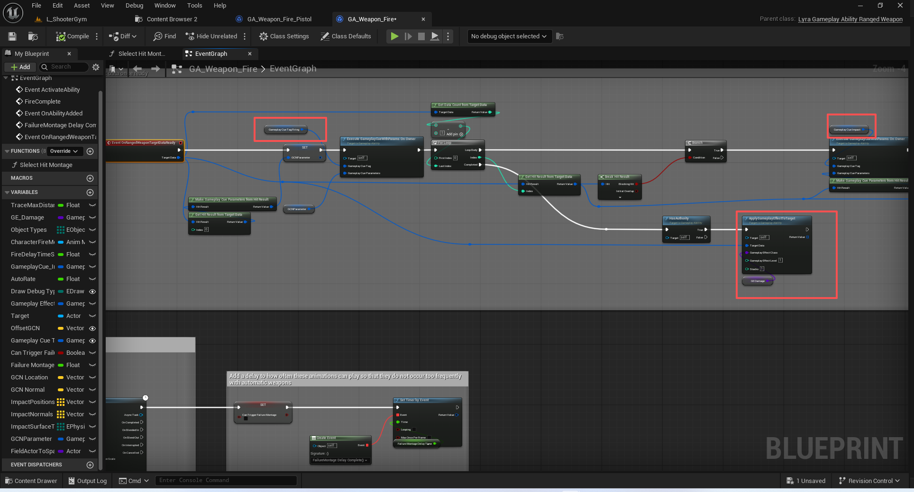

### 激活开火的特效
(TagName="GameplayCue.Weapon.Pistol.Fire")
GCN_Weapon_Pistol_Fire
枪声:
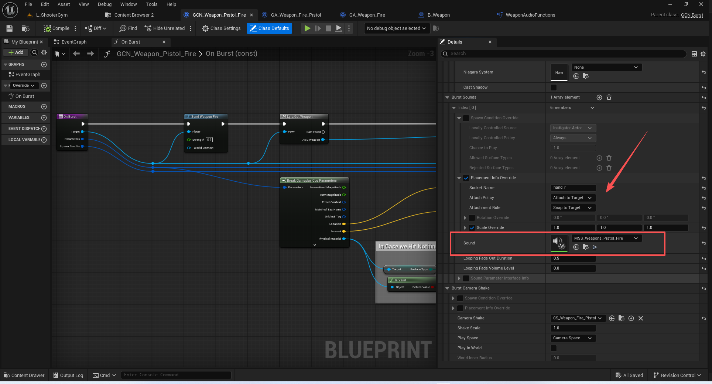
#### 生成预设效果
C++激活预设类
``` cpp
/**
 * UGameplayCueNotify_Burst
 *
 *	This is a non-instanced gameplay cue notify for effects that are one-offs.
 *	Since it is not instanced, it cannot do latent actions such as delays and time lines.
 */
UCLASS(Blueprintable, Category = "GameplayCueNotify", Meta = (ShowWorldContextPin, DisplayName = "GCN Burst", ShortTooltip = "A one-off GameplayCueNotify that is never spawned into the world."), MinimalAPI)
class UGameplayCueNotify_Burst : public UGameplayCueNotify_Static
{
	GENERATED_BODY()

public:

	UE_API UGameplayCueNotify_Burst();

protected:

	UE_API virtual bool OnExecute_Implementation(AActor* Target, const FGameplayCueParameters& Parameters) const override;

	UFUNCTION(BlueprintImplementableEvent)
	UE_API void OnBurst(AActor* Target, const FGameplayCueParameters& Parameters, const FGameplayCueNotify_SpawnResult& SpawnResults) const;

#if WITH_EDITOR
	UE_API virtual EDataValidationResult IsDataValid(class FDataValidationContext& Context) const override;
#endif // #if WITH_EDITOR

protected:

	// Default condition to check before spawning anything.  Applies for all spawns unless overridden.
	UPROPERTY(EditDefaultsOnly, BlueprintReadOnly, Category = "GCN Defaults")
	FGameplayCueNotify_SpawnCondition DefaultSpawnCondition;

	// Default placement rules.  Applies for all spawns unless overridden.
	UPROPERTY(EditDefaultsOnly, BlueprintReadOnly, Category = "GCN Defaults")
	FGameplayCueNotify_PlacementInfo DefaultPlacementInfo;

	// List of effects to spawn on burst.
	UPROPERTY(EditDefaultsOnly, BlueprintReadOnly, Category = "GCN Effects")
	FGameplayCueNotify_BurstEffects BurstEffects;
};


```
``` cpp
bool UGameplayCueNotify_Burst::OnExecute_Implementation(AActor* Target, const FGameplayCueParameters& Parameters) const
{
	UWorld* World = (Target ? Target->GetWorld() : GetWorld());

	FGameplayCueNotify_SpawnContext SpawnContext(World, Target, Parameters);
	SpawnContext.SetDefaultSpawnCondition(&DefaultSpawnCondition);
	SpawnContext.SetDefaultPlacementInfo(&DefaultPlacementInfo);

	if (DefaultSpawnCondition.ShouldSpawn(SpawnContext))
	{
		FGameplayCueNotify_SpawnResult SpawnResult;

		BurstEffects.ExecuteEffects(SpawnContext, SpawnResult);

		OnBurst(Target, Parameters, SpawnResult);
	}

	return false;
}

```
``` cpp
void FGameplayCueNotify_BurstEffects::ExecuteEffects(const FGameplayCueNotify_SpawnContext& SpawnContext, FGameplayCueNotify_SpawnResult& OutSpawnResult) const
{
	if (!SpawnContext.World)
	{
		UE_LOG(LogGameplayCueNotify, Error, TEXT("GameplayCueNotify: Trying to execute Burst effects with a NULL world."));
		return;
	}

	for (const FGameplayCueNotify_ParticleInfo& ParticleInfo : BurstParticles)
	{
		ParticleInfo.PlayParticleEffect(SpawnContext, OutSpawnResult);
	}

	for (const FGameplayCueNotify_SoundInfo& SoundInfo : BurstSounds)
	{
		SoundInfo.PlaySound(SpawnContext, OutSpawnResult);
	}

	BurstCameraShake.PlayCameraShake(SpawnContext, OutSpawnResult);
	BurstCameraLensEffect.PlayCameraLensEffect(SpawnContext, OutSpawnResult);
	BurstForceFeedback.PlayForceFeedback(SpawnContext, OutSpawnResult);
	BurstDevicePropertyEffect.SetDeviceProperties(SpawnContext, OutSpawnResult);
	BurstDecal.SpawnDecal(SpawnContext, OutSpawnResult);
}

```

#### 音频参数调整
背景音乐
回声
风声
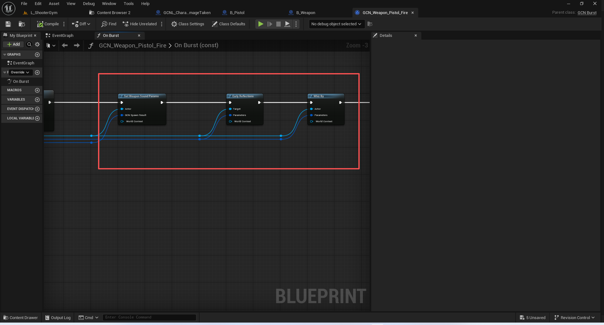

#### 激活武器射击效果
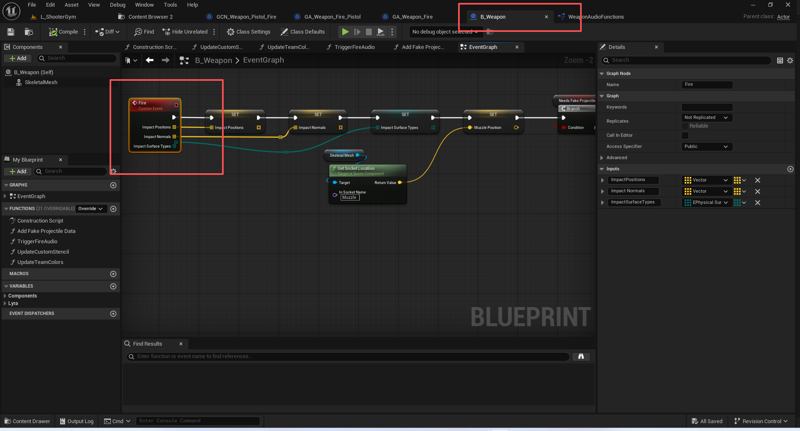
##### 弹壳效果
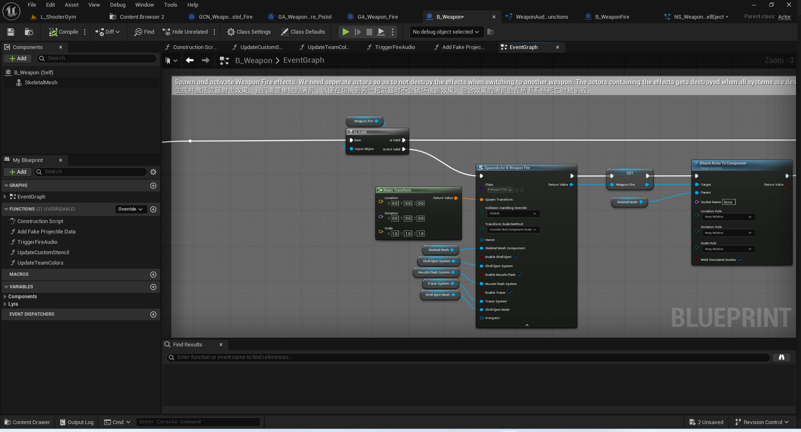
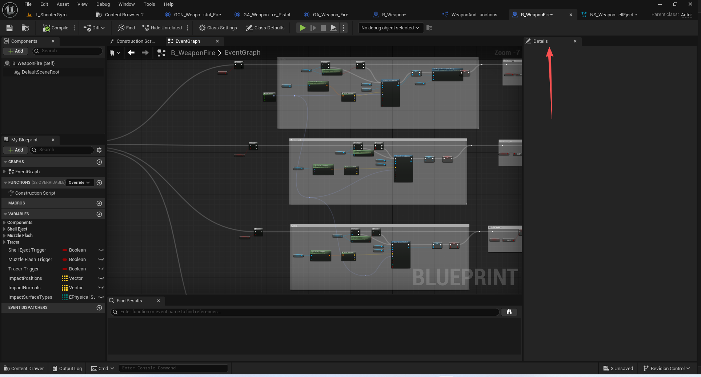
Shell Eject
Muzzle Flash
Tracer
##### 击中物体时的效果
注意这里的人物受击产生的粒子效果移到了DamageTaken里面
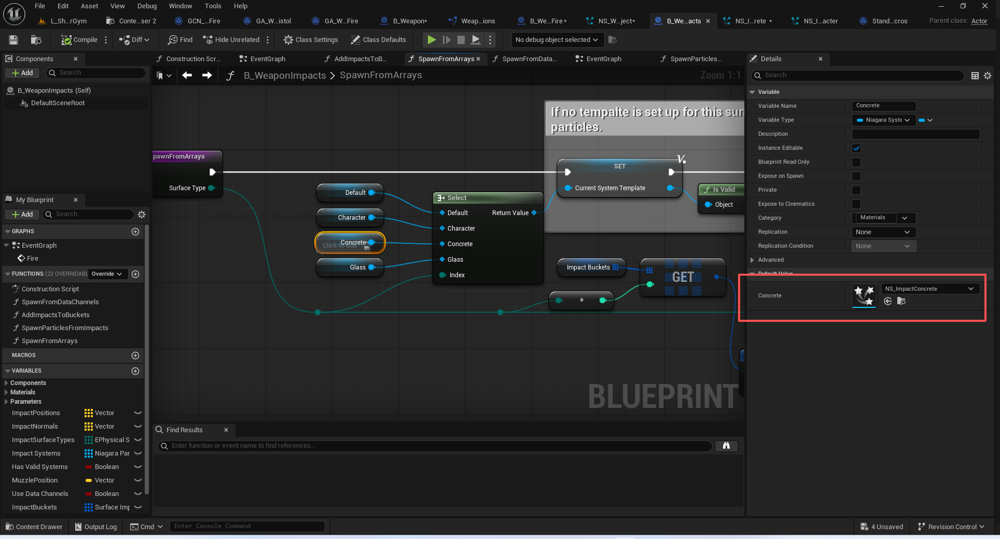
##### 生成的贴花效果
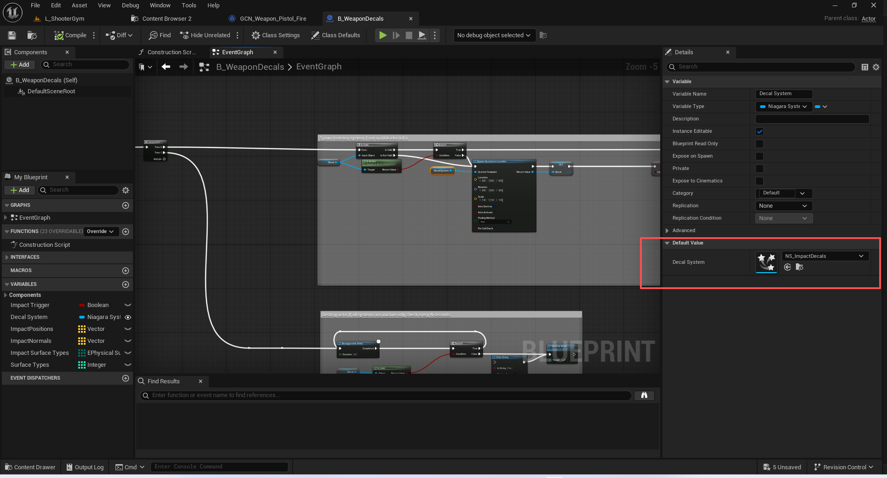
注意这里同样有一部分贴花效果挪到了DamageTaken里面
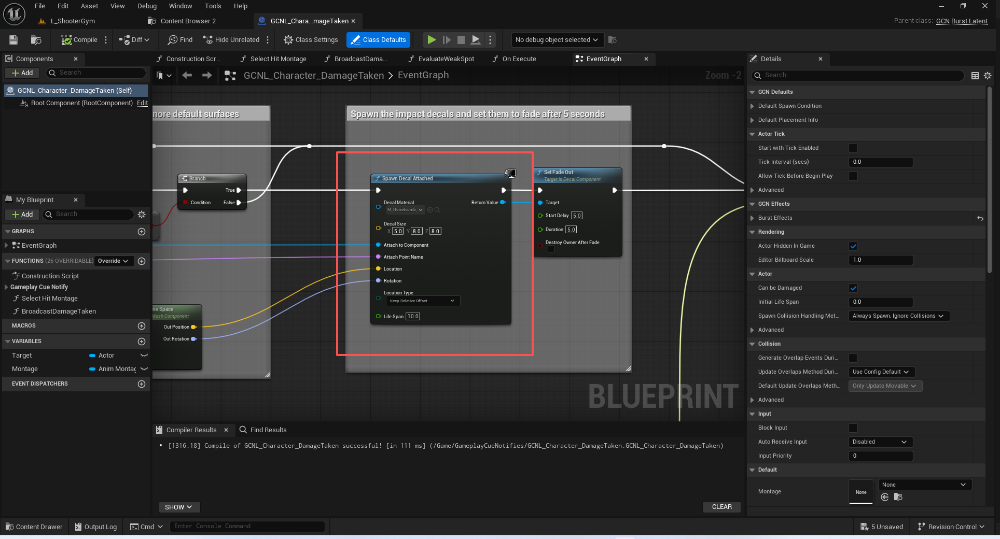

### 激活子弹命中点的效果
(TagName="GameplayCue.Weapon.Rifle.Impact")

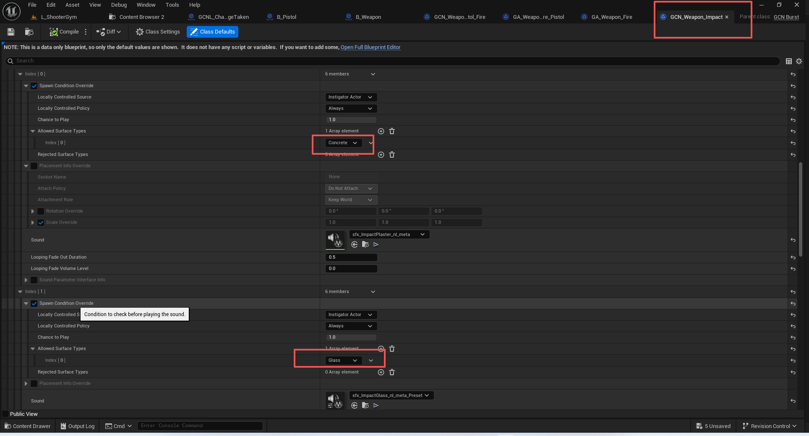

### 根据一次子弹多枚弹丸的数据去施加GE
这里需要弄明白 为什么霰弹枪只开了一次枪 施加了一次GE 造成了多次伤害
``` cpp
TArray<FActiveGameplayEffectHandle> UGameplayAbility::BP_ApplyGameplayEffectToTarget(FGameplayAbilityTargetDataHandle Target, TSubclassOf<UGameplayEffect> GameplayEffectClass, int32 GameplayEffectLevel, int32 Stacks)
{
	return ApplyGameplayEffectToTarget(CurrentSpecHandle, CurrentActorInfo, CurrentActivationInfo, Target, GameplayEffectClass, GameplayEffectLevel, Stacks);
}


```
``` cpp

TArray<FActiveGameplayEffectHandle> UGameplayAbility::ApplyGameplayEffectToTarget(const FGameplayAbilitySpecHandle Handle, const FGameplayAbilityActorInfo* ActorInfo, const FGameplayAbilityActivationInfo ActivationInfo, const FGameplayAbilityTargetDataHandle& Target, TSubclassOf<UGameplayEffect> GameplayEffectClass, float GameplayEffectLevel, int32 Stacks) const
{
	SCOPE_CYCLE_COUNTER(STAT_ApplyGameplayEffectToTarget);
	SCOPE_CYCLE_UOBJECT(This, this);
	SCOPE_CYCLE_UOBJECT(Effect, GameplayEffectClass);

	TArray<FActiveGameplayEffectHandle> EffectHandles;

	if (HasAuthority(&ActivationInfo) == false && UAbilitySystemGlobals::Get().ShouldPredictTargetGameplayEffects() == false)
	{
		// Early out to avoid making effect specs that we can't apply
		return EffectHandles;
	}

	// This batches all created cues together
	FScopedGameplayCueSendContext GameplayCueSendContext;

	if (GameplayEffectClass == nullptr)
	{
		ABILITY_LOG(Error, TEXT("ApplyGameplayEffectToTarget called on ability %s with no GameplayEffect."), *GetName());
	}
	else if (HasAuthorityOrPredictionKey(ActorInfo, &ActivationInfo))
	{
		FGameplayEffectSpecHandle SpecHandle = MakeOutgoingGameplayEffectSpec(Handle, ActorInfo, ActivationInfo, GameplayEffectClass, GameplayEffectLevel);
		if (SpecHandle.Data.IsValid())
		{
			SpecHandle.Data->SetStackCount(Stacks);

			SCOPE_CYCLE_UOBJECT(Source, SpecHandle.Data->GetContext().GetSourceObject());
			EffectHandles.Append(ApplyGameplayEffectSpecToTarget(Handle, ActorInfo, ActivationInfo, SpecHandle, Target));
		}
		else
		{
			ABILITY_LOG(Warning, TEXT("UGameplayAbility::ApplyGameplayEffectToTarget failed to create valid spec handle. Ability: %s"), *GetPathName());
		}
	}

	return EffectHandles;
}

```
``` cpp
TArray<FActiveGameplayEffectHandle> UGameplayAbility::ApplyGameplayEffectSpecToTarget(const FGameplayAbilitySpecHandle AbilityHandle, const FGameplayAbilityActorInfo* ActorInfo, const FGameplayAbilityActivationInfo ActivationInfo, const FGameplayEffectSpecHandle SpecHandle, const FGameplayAbilityTargetDataHandle& TargetData) const
{
	TArray<FActiveGameplayEffectHandle> EffectHandles;
	
	if (SpecHandle.IsValid() && HasAuthorityOrPredictionKey(ActorInfo, &ActivationInfo))
	{
		TARGETLIST_SCOPE_LOCK(*ActorInfo->AbilitySystemComponent);
		for (TSharedPtr<FGameplayAbilityTargetData> Data : TargetData.Data)
		{
			if (Data.IsValid())
			{
				EffectHandles.Append(Data->ApplyGameplayEffectSpec(*SpecHandle.Data.Get(), ActorInfo->AbilitySystemComponent->GetPredictionKeyForNewAction()));
			}
			else
			{
				ABILITY_LOG(Warning, TEXT("UGameplayAbility::ApplyGameplayEffectSpecToTarget invalid target data passed in. Ability: %s"), *GetPathName());
			}
		}
	}
	return EffectHandles;
}

```
``` cpp

TArray<FActiveGameplayEffectHandle> FGameplayAbilityTargetData::ApplyGameplayEffectSpec(FGameplayEffectSpec& InSpec, FPredictionKey PredictionKey)
{
	TArray<FActiveGameplayEffectHandle>	AppliedHandles;

	if (!ensure(InSpec.GetContext().IsValid() && InSpec.GetContext().GetInstigatorAbilitySystemComponent()))
	{
		return AppliedHandles;
	}

	TArray<TWeakObjectPtr<AActor> > Actors = GetActors();
	
	AppliedHandles.Reserve(Actors.Num());

	for (TWeakObjectPtr<AActor>& TargetActor : Actors)
	{
		UAbilitySystemComponent* TargetComponent = UAbilitySystemBlueprintLibrary::GetAbilitySystemComponent(TargetActor.Get());

		if (TargetComponent)
		{
			// We have to make a new effect spec and context here, because otherwise the targeting info gets accumulated and things take damage multiple times
			// 我们必须在此处制定一个新的效果规格和相关背景信息，否则目标信息将会累积，导致角色受到多次伤害。
			FGameplayEffectSpec	SpecToApply(InSpec);
			FGameplayEffectContextHandle EffectContext = SpecToApply.GetContext().Duplicate();
			SpecToApply.SetContext(EffectContext);

			AddTargetDataToContext(EffectContext, false);

			AppliedHandles.Add(EffectContext.GetInstigatorAbilitySystemComponent()->ApplyGameplayEffectSpecToTarget(SpecToApply, TargetComponent, PredictionKey));
		}
	}

	return AppliedHandles;
}
```
## GEEC的伤害计算
后续的伤害计算同前面的章节.
这个GCNL后续会单独讲解.
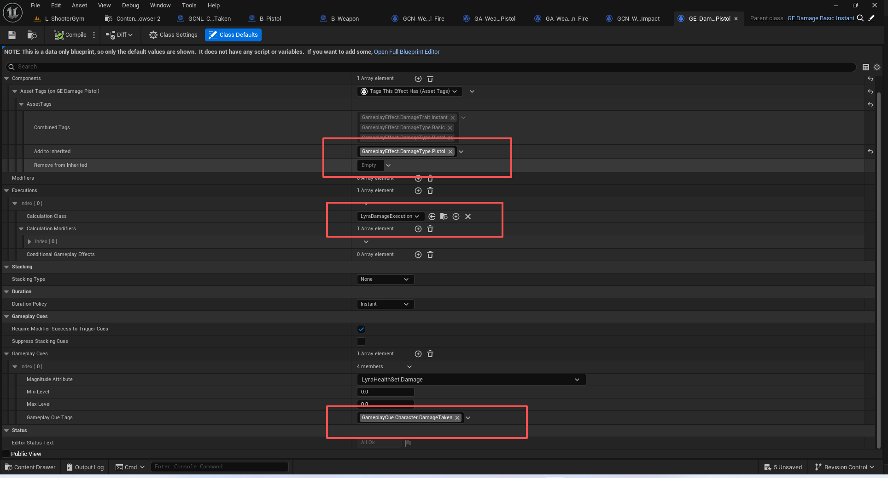
## 代码
``` cpp
/**
 * ULyraGameplayAbility_RangedWeapon
 *
 * An ability granted by and associated with a ranged weapon instance
 * 一种由远程武器实例赋予并与其相关联的能力
 */
UCLASS()
class ULyraGameplayAbility_RangedWeapon : public ULyraGameplayAbility_FromEquipment
{
	GENERATED_BODY()

public:
	// 构造函数
	// 添加默认开火阻塞的tag互斥
	ULyraGameplayAbility_RangedWeapon(const FObjectInitializer& ObjectInitializer = FObjectInitializer::Get());

	// 获取管理的装备实例 然后转型成远程武器装备实例
	UFUNCTION(BlueprintCallable, Category="Lyra|Ability")
	ULyraRangedWeaponInstance* GetWeaponInstance() const;

	//~UGameplayAbility interface
	// 调用父类 加入了必须找到关联的远程武器装备实例才行 否则后续射击逻辑会出错!
	virtual bool CanActivateAbility(const FGameplayAbilitySpecHandle Handle,
		const FGameplayAbilityActorInfo* ActorInfo, 
		const FGameplayTagContainer* SourceTags = nullptr, 
		const FGameplayTagContainer* TargetTags = nullptr, 
		OUT FGameplayTagContainer* OptionalRelevantTags = nullptr) const override;
	
	// 很重要 注册了关于射击数据的回调!!!!
	virtual void ActivateAbility(const FGameplayAbilitySpecHandle Handle,
		const FGameplayAbilityActorInfo* ActorInfo, 
		const FGameplayAbilityActivationInfo ActivationInfo,
		const FGameplayEventData* TriggerEventData) override;
	
	virtual void EndAbility(const FGameplayAbilitySpecHandle Handle,
		const FGameplayAbilityActorInfo* ActorInfo, 
		const FGameplayAbilityActivationInfo ActivationInfo, 
		bool bReplicateEndAbility,
		bool bWasCancelled) override;
	//~End of UGameplayAbility interface

protected:
	struct FRangedWeaponFiringInput
	{
		// Start of the trace
		// 射线七点
		FVector StartTrace;

		// End of the trace if aim were perfect
		// 若射击目标完全准确，追踪过程便至此结束
		FVector EndAim;

		// The direction of the trace if aim were perfect
		// 若瞄准精准的话，轨迹的方向将是这样的
		FVector AimDir;

		// The weapon instance / source of weapon data
		// 武器实例 / 武器数据的来源
		ULyraRangedWeaponInstance* WeaponData = nullptr;

		// Can we play bullet FX for hits during this trace
		// 在这次追踪过程中，我们能否为击中动作播放子弹特效呢？
		bool bCanPlayBulletFX = false;

		FRangedWeaponFiringInput()
			: StartTrace(ForceInitToZero)
			, EndAim(ForceInitToZero)
			, AimDir(ForceInitToZero)
		{
		}
	};

protected:
	// 找到第一枚击中角色的检测结果的索引
	static int32 FindFirstPawnHitResult(const TArray<FHitResult>& HitResults);

	// Does a single weapon trace, either sweeping or ray depending on if SweepRadius is above zero
	// 对于单个武器轨迹的绘制，会根据“扫射半径”是否大于零来决定是采用扫射模式还是射线模式。
	FHitResult WeaponTrace(const FVector& StartTrace, const FVector& EndTrace, float SweepRadius, bool bIsSimulated, OUT TArray<FHitResult>& OutHitResults) const;

	// Wrapper around WeaponTrace to handle trying to do a ray trace before falling back to a sweep trace if there were no hits and SweepRadius is above zero 
	// 对“武器追踪”进行封装，用于处理在没有命中结果且“扫射半径”不为零的情况下，先尝试进行光线追踪，若仍未命中则切换为扫射追踪的操作。
	FHitResult DoSingleBulletTrace(const FVector& StartTrace, const FVector& EndTrace, float SweepRadius, bool bIsSimulated, OUT TArray<FHitResult>& OutHits) const;

	// Traces all of the bullets in a single cartridge
	// 记录同一发子弹中的所有弹丸信息
	// 根据我们构建的子弹信息去打印多条射线
	void TraceBulletsInCartridge(const FRangedWeaponFiringInput& InputData, OUT TArray<FHitResult>& OutHits);

	// 添加关联的需要忽略的演员 
	virtual void AddAdditionalTraceIgnoreActors(FCollisionQueryParams& TraceParams) const;

	// Determine the trace channel to use for the weapon trace(s)
	// 确定用于武器轨迹绘制的追踪通道
	virtual ECollisionChannel DetermineTraceChannel(FCollisionQueryParams& TraceParams, bool bIsSimulated) const;

	// 执行本地的目标检测
	void PerformLocalTargeting(OUT TArray<FHitResult>& OutHits);
	
	// 获取角色位置作为目标其实源位置
	FVector GetWeaponTargetingSourceLocation() const;
	// 根据瞄准方式构建射线信息
	// 这个函数的核心是根据不同的目标来源，计算一个起始位置和方向，用于后续的射线检测或生成投射物等。
	// 真实性：不同瞄准源提供不同层次的精确度	游戏体验：
	//		相机瞄准：最高精度，适合核心射击机制
	//  	武器瞄准：考虑武器模型位置，更真实
	//		角色瞄准：简化瞄准，适合快节奏游戏
	//   	AI兼容：为AI控制器提供合理的瞄准基准
	FTransform GetTargetingTransform(APawn* SourcePawn, ELyraAbilityTargetingSource Source) const;

	// 处理我们准备好的数据
	void OnTargetDataReadyCallback(const FGameplayAbilityTargetDataHandle& InData, FGameplayTag ApplicationTag);

	// 开始远程远程命中检测
	// 有本地控制的玩家进行检测
	// 蓝图调用
	UFUNCTION(BlueprintCallable)
	void StartRangedWeaponTargeting();

	// Called when target data is ready
	// 当目标数据准备就绪时触发此事件
	UFUNCTION(BlueprintImplementableEvent)
	void OnRangedWeaponTargetDataReady(const FGameplayAbilityTargetDataHandle& TargetData);

private:
	FDelegateHandle OnTargetDataReadyCallbackDelegateHandle;
};

```
## 总结
本节花了大量篇幅去讲解整套远程武器施加伤害的流程.
主要理解FLyraGameplayAbilityTargetData_SingleTargetHit的创建,传递,使用即可!
部分内容后接着补充,如武器组件如何通过Slate显示命中标记,GCNL_Character_DamageTaken后续处理等等.