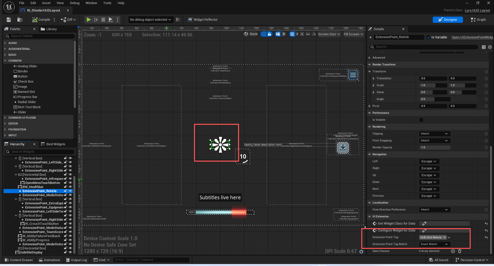
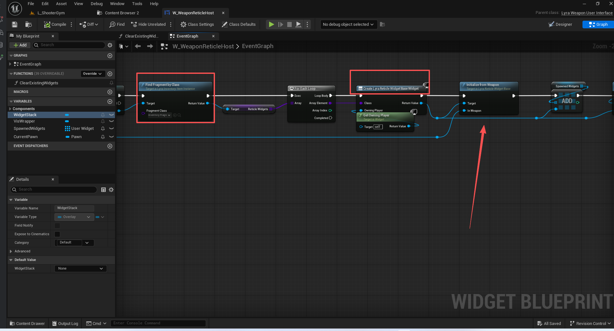
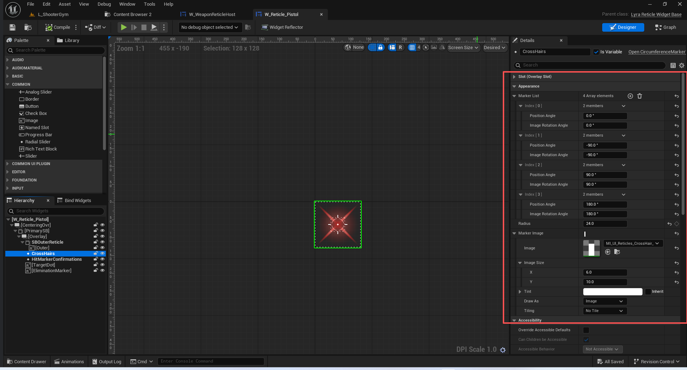
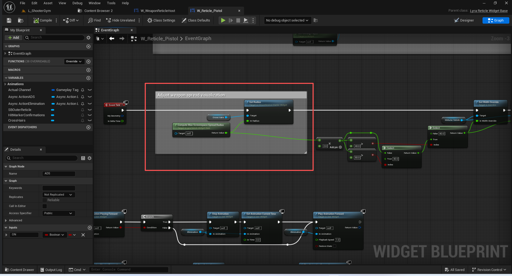
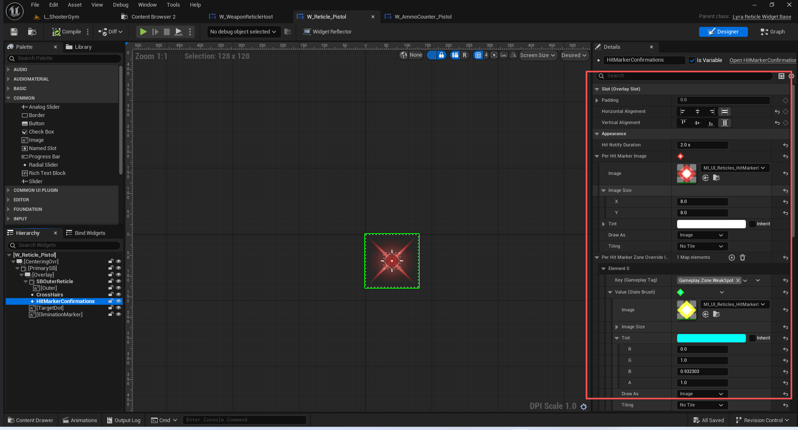
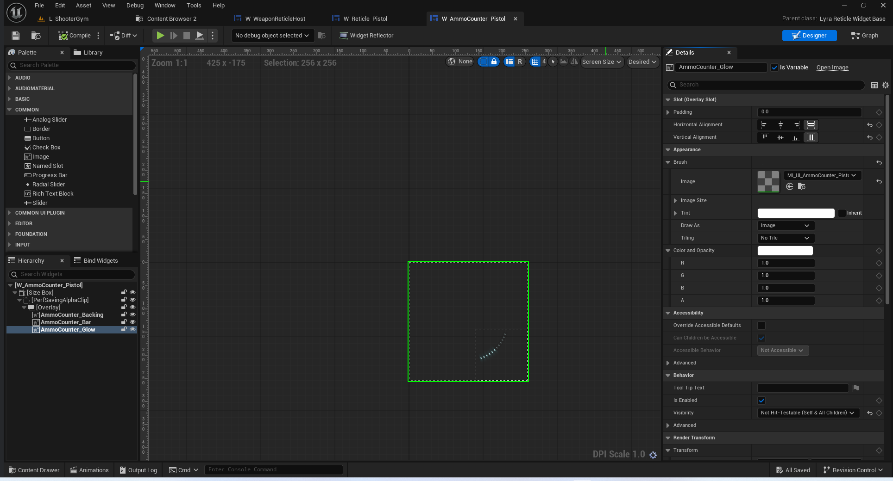
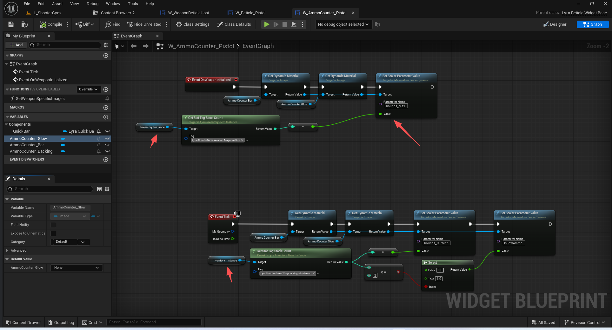

# UE5_Lyra学习指南_094_枪械系统_武器准心

本文章仅为小刚-B站课堂-虚幻引擎视频课程Lyra-精讲的演讲手稿.  
本套课程链接:[[UE5]虚幻引擎游戏案例Lyra精讲](https://www.bilibili.com/cheese/play/ss112001159)  
前置课程链接:[[UE5]虚幻引擎UEC++从基础到进阶](https://www.bilibili.com/cheese/play/ss28043)  

文章内容由小刚撰写,采用了以下多种方式:  
1.口述转文字  
2.AI重构  
3.参考引擎源码  
4.Lyra工程源码  
5.结合社区论坛各位大佬的解析  

- [UE5\_Lyra学习指南\_094\_枪械系统\_武器准心](#ue5_lyra学习指南_094_枪械系统_武器准心)
	- [概述](#概述)
	- [武器组件](#武器组件)
		- [代码](#代码)
		- [在本地端添加一个未被确认的命中标记](#在本地端添加一个未被确认的命中标记)
		- [服务端呼叫客户端确认显示标记](#服务端呼叫客户端确认显示标记)
	- [用户武器的接口控件-准心的容器控件](#用户武器的接口控件-准心的容器控件)
	- [每帧监听武器实例的变化](#每帧监听武器实例的变化)
	- [准心控件的通用父类](#准心控件的通用父类)
		- [计算最大扩散半径](#计算最大扩散半径)
		- [接收初始化](#接收初始化)
		- [访问射击信息](#访问射击信息)
	- [瞄准指示器](#瞄准指示器)
		- [动态散射的准心控件](#动态散射的准心控件)
			- [UMG](#umg)
			- [Slate](#slate)
		- [射击标记控件](#射击标记控件)
			- [UMG](#umg-1)
			- [Slate](#slate-1)
	- [弹药监视](#弹药监视)
	- [总结](#总结)


## 概述
本节主要讲解武器组件跟Slate界面进行联动,从而让准心系统可以扩大散射角度,添加命中标记.

## 武器组件
### 代码
``` cpp
// Tracks weapon state and recent confirmed hit markers to display on screen
// 监控武器状态以及近期确认的命中标记，并将其显示在屏幕上
UCLASS()
class ULyraWeaponStateComponent : public UControllerComponent
{
	GENERATED_BODY()

public:

	ULyraWeaponStateComponent(const FObjectInitializer& ObjectInitializer = FObjectInitializer::Get());

	virtual void TickComponent(float DeltaTime, enum ELevelTick TickType, FActorComponentTickFunction* ThisTickFunction) override;

	UFUNCTION(Client, Reliable)
	void ClientConfirmTargetData(uint16 UniqueId, bool bSuccess, const TArray<uint8>& HitReplaces);

	// 添加一次未确认的命中标记 需要在本地控制端进去添加
	void AddUnconfirmedServerSideHitMarkers(const FGameplayAbilityTargetDataHandle& InTargetData, const TArray<FHitResult>& FoundHits);

	/** Updates this player's last damage instigated time */
	/** 更新此玩家上次发起攻击的时间 */
	void UpdateDamageInstigatedTime(const FGameplayEffectContextHandle& EffectContext);

	/** Gets the array of most recent locations this player instigated damage, in screen-space */
	/** 获取该玩家造成伤害的最近位置数组（以屏幕空间坐标表示） */
	void GetLastWeaponDamageScreenLocations(TArray<FLyraScreenSpaceHitLocation>& WeaponDamageScreenLocations)
	{
		WeaponDamageScreenLocations = LastWeaponDamageScreenLocations;
	}

	/** Returns the elapsed time since the last (outgoing) damage hit notification occurred */
	/** 返回自上一次（向外发送的）伤害提示通知发生以来所经过的时间 */
	double GetTimeSinceLastHitNotification() const;

	int32 GetUnconfirmedServerSideHitMarkerCount() const
	{
		return UnconfirmedServerSideHitMarkers.Num();
	}

protected:
	// This is called to filter hit results to determine whether they should be considered as a successful hit or not
	// The default behavior is to treat it as a success if being done to a team actor that belongs to a different team
	// to the owning controller's pawn
	// 这个操作的作用是筛选命中结果，以确定这些命中是否应被视为成功命中
	// 默认情况下，如果该操作针对的是属于与控制方角色所属团队不同团队的团队角色，则将其视为成功命中。
	virtual bool ShouldShowHitAsSuccess(const FHitResult& Hit) const;

	virtual bool ShouldUpdateDamageInstigatedTime(const FGameplayEffectContextHandle& EffectContext) const;

	void ActuallyUpdateDamageInstigatedTime();

private:
	/** Last time this controller instigated weapon damage */
	double LastWeaponDamageInstigatedTime = 0.0;

	/** Screen-space locations of our most recently instigated weapon damage (the confirmed hits) */
	/** 我们最近触发的武器伤害（已确认的命中位置）在屏幕空间中的坐标 */
	TArray<FLyraScreenSpaceHitLocation> LastWeaponDamageScreenLocations;

	/** The unconfirmed hits */
	/** 未确认的命中情况 */
	TArray<FLyraServerSideHitMarkerBatch> UnconfirmedServerSideHitMarkers;
};


```
### 在本地端添加一个未被确认的命中标记
``` cpp
void ULyraWeaponStateComponent::AddUnconfirmedServerSideHitMarkers(const FGameplayAbilityTargetDataHandle& InTargetData, const TArray<FHitResult>& FoundHits)
{
	// 我们是本地控制的
	// 这个需要在本地控制侧添加
	FLyraServerSideHitMarkerBatch& NewUnconfirmedHitMarker = UnconfirmedServerSideHitMarkers.Emplace_GetRef(InTargetData.UniqueId);

	if (APlayerController* OwnerPC = GetController<APlayerController>())
	{
		for (const FHitResult& Hit : FoundHits)
		{
			FVector2D HitScreenLocation;
			// 将给定的三维世界空间点转换为其对应的二维屏幕空间坐标。
			if (UGameplayStatics::ProjectWorldToScreen(OwnerPC, Hit.Location, /*out*/ HitScreenLocation, /*bPlayerViewportRelative=*/ false))
			{
				FLyraScreenSpaceHitLocation& Entry = NewUnconfirmedHitMarker.Markers.AddDefaulted_GetRef();
				Entry.Location = HitScreenLocation;
				Entry.bShowAsSuccess = ShouldShowHitAsSuccess(Hit);

				// Determine the hit zone
				// 确定击中区域
				FGameplayTag HitZone;
				if (const UPhysicalMaterialWithTags* PhysMatWithTags = Cast<const UPhysicalMaterialWithTags>(Hit.PhysMaterial.Get()))
				{
					for (const FGameplayTag MaterialTag : PhysMatWithTags->Tags)
					{
						if (MaterialTag.MatchesTag(TAG_Gameplay_Zone))
						{
							Entry.HitZone = MaterialTag;
							break;
						}
					}
				}
			}
		}
	}
}

```
### 服务端呼叫客户端确认显示标记
``` cpp

void ULyraWeaponStateComponent::ClientConfirmTargetData_Implementation(uint16 UniqueId, bool bSuccess, const TArray<uint8>& HitReplaces)
{
	for (int i = 0; i < UnconfirmedServerSideHitMarkers.Num(); i++)
	{
		FLyraServerSideHitMarkerBatch& Batch = UnconfirmedServerSideHitMarkers[i];
		if (Batch.UniqueId == UniqueId)
		{
			if (bSuccess && (HitReplaces.Num() != Batch.Markers.Num()))
			{
				UWorld* World = GetWorld();
				bool bFoundShowAsSuccessHit = false;

				int32 HitLocationIndex = 0;
				for (const FLyraScreenSpaceHitLocation& Entry : Batch.Markers)
				{
					// 这里的理解是 服务器没有修改这个检测结果 表示服务器认可 同时它需要被显示出来
					if (!HitReplaces.Contains(HitLocationIndex) && Entry.bShowAsSuccess)
					{
						// Only need to do this once
						// 仅需执行此操作一次即可
						if (!bFoundShowAsSuccessHit)
						{
							ActuallyUpdateDamageInstigatedTime();
						}

						bFoundShowAsSuccessHit = true;

						LastWeaponDamageScreenLocations.Add(Entry);
					}
					++HitLocationIndex;
				}
			}
			// 不需要再循环了 所以在此移除
			UnconfirmedServerSideHitMarkers.RemoveAt(i);
			break;
		}
	}
}

```
``` cpp
void ULyraWeaponStateComponent::ActuallyUpdateDamageInstigatedTime()
{
	// If our LastWeaponDamageInstigatedTime was not very recent, clear our LastWeaponDamageScreenLocations array
	// 如果我们上次发动武器攻击的时间并非很近之前，就清空“上次武器攻击位置”数组
	UWorld* World = GetWorld();
	if (World->GetTimeSeconds() - LastWeaponDamageInstigatedTime > 0.1)
	{
		LastWeaponDamageScreenLocations.Reset();
	}
	LastWeaponDamageInstigatedTime = World->GetTimeSeconds();
}

```
## 用户武器的接口控件-准心的容器控件



``` cpp
// 用户武器接口空间蓝图
UCLASS()
class ULyraWeaponUserInterface : public UCommonUserWidget
{
	GENERATED_BODY()

public:
	// 构造函数 无作用
	ULyraWeaponUserInterface(const FObjectInitializer& ObjectInitializer = FObjectInitializer::Get());

	// 无
	virtual void NativeConstruct() override;
	// 无
	virtual void NativeDestruct() override;
	// 每帧监听是否武器发生了变动
	virtual void NativeTick(const FGeometry& MyGeometry, float InDeltaTime) override;

	// 自己作为容器去触发子项的武器变动
	UFUNCTION(BlueprintImplementableEvent)
	void OnWeaponChanged(ULyraWeaponInstance* OldWeapon, ULyraWeaponInstance* NewWeapon);

private:
	// 无
	void RebuildWidgetFromWeapon();

private:
	// 监听的当前武器实例
	UPROPERTY(Transient)
	TObjectPtr<ULyraWeaponInstance> CurrentInstance;
};

```


## 每帧监听武器实例的变化
```  cpp
void ULyraWeaponUserInterface::NativeTick(const FGeometry& MyGeometry, float InDeltaTime)
{
	Super::NativeTick(MyGeometry, InDeltaTime);
	// 监听
	if (APawn* Pawn = GetOwningPlayerPawn())
	{
		if (ULyraEquipmentManagerComponent* EquipmentManager = Pawn->FindComponentByClass<ULyraEquipmentManagerComponent>())
		{
			if (ULyraWeaponInstance* NewInstance = EquipmentManager->GetFirstInstanceOfType<ULyraWeaponInstance>())
			{
				if (NewInstance != CurrentInstance && NewInstance->GetInstigator() != nullptr)
				{
					ULyraWeaponInstance* OldWeapon = CurrentInstance;
					CurrentInstance = NewInstance;
					RebuildWidgetFromWeapon();
					OnWeaponChanged(OldWeapon, CurrentInstance);
				}
			}
		}
	}
}


```

## 准心控件的通用父类

``` cpp

// 准星空间的父类
UCLASS(Abstract)
class ULyraReticleWidgetBase : public UCommonUserWidget
{
	GENERATED_BODY()

public:
	// 构造函数
	ULyraReticleWidgetBase(const FObjectInitializer& ObjectInitializer = FObjectInitializer::Get());

	// 武器初始化后调用 交给蓝图去初始化弹匣容量
	UFUNCTION(BlueprintImplementableEvent)
	void OnWeaponInitialized();

	// 从光标的容器进行调用,主要是接收武器变动后,来修改对应的自身控件
	UFUNCTION(BlueprintCallable)
	void InitializeFromWeapon(ULyraWeaponInstance* InWeapon);

	/** Returns the current weapon's diametrical spread angle, in degrees */
	/** 返回当前武器的直径扩散角度（以度为单位） */
	
	UFUNCTION(BlueprintCallable, BlueprintPure)
	float ComputeSpreadAngle() const;

	/** Returns the current weapon's maximum spread radius in screenspace units (pixels) */
	/** 返回当前武器在屏幕空间单位（像素）中的最大扩散半径 */
	UFUNCTION(BlueprintCallable, BlueprintPure)
	float ComputeMaxScreenspaceSpreadRadius() const;

	/**
	 * Returns true if the current weapon is at 'first shot accuracy'
	 * (the weapon allows it and it is at min spread)
	 * 
	 * 如果当前武器处于“首次射击精度”状态（即该武器允许如此，并且射击时的散布处于最小值范围内）则返回真值。
	 * 
	 */
	UFUNCTION(BlueprintCallable, BlueprintPure)
	bool HasFirstShotAccuracy() const;

protected:
	UPROPERTY(BlueprintReadOnly)
	TObjectPtr<ULyraWeaponInstance> WeaponInstance;

	UPROPERTY(BlueprintReadOnly)
	TObjectPtr<ULyraInventoryItemInstance> InventoryInstance;
};

```
### 计算最大扩散半径
``` cpp

float ULyraReticleWidgetBase::ComputeMaxScreenspaceSpreadRadius() const
{
	const float LongShotDistance = 10000.f;

	APlayerController* PC = GetOwningPlayer();
	if (PC && PC->PlayerCameraManager)
	{
		// A weapon's spread can be thought of as a cone shape. To find the screenspace spread for reticle visualization,
		// we create a line on the edge of the cone at a long distance. The end of that point is on the edge of the cone's circle.
		// We then project it back onto the screen. Its distance from screen center is the spread radius.

		// This isn't perfect, due to there being some distance between the camera location and the gun muzzle.
		
		// 武器的扩散效果可以看作是一个圆锥形的形状。为了确定用于视图中瞄准线显示的屏幕空间扩散范围，
		// 我们在圆锥边缘的远处绘制一条线。该点的末端位于圆锥圆周的边缘上。
		// 然后我们将它投影回屏幕。它与屏幕中心的距离就是扩散半径。
		// 这并不是完美的解决方案，因为摄像机的位置与枪口之间存在一定的距离。

		const float SpreadRadiusRads = FMath::DegreesToRadians(ComputeSpreadAngle() * 0.5f);
		const float SpreadRadiusAtDistance = FMath::Tan(SpreadRadiusRads) * LongShotDistance;

		FVector CamPos;
		FRotator CamOrient;
		PC->PlayerCameraManager->GetCameraViewPoint(CamPos, CamOrient);

		FVector CamForwDir = CamOrient.RotateVector(FVector::ForwardVector);
		FVector CamUpDir   = CamOrient.RotateVector(FVector::UpVector);

		FVector OffsetTargetAtDistance = CamPos + (CamForwDir * LongShotDistance) + (CamUpDir * SpreadRadiusAtDistance);

		FVector2D OffsetTargetInScreenspace;

		if (PC->ProjectWorldLocationToScreen(OffsetTargetAtDistance, OffsetTargetInScreenspace, true))
		{
			int32 ViewportSizeX(0), ViewportSizeY(0);
			PC->GetViewportSize(ViewportSizeX, ViewportSizeY);

			const FVector2D ScreenSpaceCenter(FVector::FReal(ViewportSizeX) * 0.5f, FVector::FReal(ViewportSizeY) * 0.5f);

			return (OffsetTargetInScreenspace - ScreenSpaceCenter).Length();
		}
	}
	
	return 0.0f;
}

```

### 接收初始化
``` cpp
void ULyraReticleWidgetBase::InitializeFromWeapon(ULyraWeaponInstance* InWeapon)
{
	WeaponInstance = InWeapon;
	InventoryInstance = nullptr;
	if (WeaponInstance)
	{
		InventoryInstance = Cast<ULyraInventoryItemInstance>(WeaponInstance->GetInstigator());
	}
	OnWeaponInitialized();
}

```

### 访问射击信息
``` cpp
float ULyraReticleWidgetBase::ComputeSpreadAngle() const
{
	if (const ULyraRangedWeaponInstance* RangedWeapon = Cast<const ULyraRangedWeaponInstance>(WeaponInstance))
	{
		const float BaseSpreadAngle = RangedWeapon->GetCalculatedSpreadAngle();
		const float SpreadAngleMultiplier = RangedWeapon->GetCalculatedSpreadAngleMultiplier();
		const float ActualSpreadAngle = BaseSpreadAngle * SpreadAngleMultiplier;

		return ActualSpreadAngle;
	}
	else
	{
		return 0.0f;
	}
}

bool ULyraReticleWidgetBase::HasFirstShotAccuracy() const
{
	if (const ULyraRangedWeaponInstance* RangedWeapon = Cast<const ULyraRangedWeaponInstance>(WeaponInstance))
	{
		return RangedWeapon->HasFirstShotAccuracy();
	}
	else
	{
		return false;
	}
}


```


## 瞄准指示器
W_Reticle_Pistol
### 动态散射的准心控件



####  UMG
``` cpp

// 准心控件
UCLASS()
class UCircumferenceMarkerWidget : public UWidget
{
	GENERATED_BODY()

public:
	UCircumferenceMarkerWidget(const FObjectInitializer& ObjectInitializer);

	//~UWidget interface
public:
	/**
	 * 如果可能的话，会将所有属性应用到原生控件上。
	 * 此操作会在控件构建完成后进行。
	 * 此外，编辑器也可以调用此函数来更新已修改的状态，因此请务必在此处完成对控件属性的所有初始化操作，否则属性和视觉状态可能会出现不一致的情况。
	 */
	virtual void SynchronizeProperties() override;
protected:
	/**
	 * 当底层的 SWidget 需要被构建时，所有 UWidget 子类所实现的功能都会被调用。	  
	 */
	virtual TSharedRef<SWidget> RebuildWidget() override;
	//~End of UWidget interface

	//~UVisual interface
public:
	/// 释放资源
	virtual void ReleaseSlateResources(bool bReleaseChildren) override;
	//~End of UVisual interface
	
public:
	/** The list of positions/orientations to draw the markers at. */
	/** 用于绘制标记的坐标/方向列表。*/
	UPROPERTY(EditAnywhere, BlueprintReadOnly, Category=Appearance)
	TArray<FCircumferenceMarkerEntry> MarkerList;

	/** The radius of the circle. */
	/** 圆的半径。*/
	UPROPERTY(EditAnywhere, BlueprintReadOnly, Category=Appearance, meta=(ClampMin=0.0))
	float Radius = 48.0f;

	/** The marker image to place around the circle. */
	/** 用于环绕圆圈放置的标记图像。*/
	UPROPERTY(EditAnywhere, BlueprintReadOnly, Category=Appearance)
	FSlateBrush MarkerImage;

	/** Whether reticle corner images are placed outside the spread radius */
	//@TODO: Make this a 0-1 float alignment instead (e.g., inside/on/outside the radius)?
	/** 是否将十字准线的角落图像放置在扩散半径之外 */
	//@待办事项：将此设置改为 0 到 1 之间的浮点数对齐方式（例如，位于半径内部/内部/外部）？
	UPROPERTY(EditAnywhere, Category=Corner)
	uint8 bReticleCornerOutsideSpreadRadius : 1;

public:
	/** Sets the radius of the circle. */
	/** 设置圆的半径。*/
	UFUNCTION(BlueprintCallable, Category = "Appearance")
	void SetRadius(float InRadius);

private:
	/** Internal slate widget representing the actual marker visuals */
	/** 内部的Slate组件，用于呈现实际的标记视觉效果 */
	TSharedPtr<SCircumferenceMarkerWidget> MyMarkerWidget;
};

```
#### Slate
``` cpp
USTRUCT(BlueprintType)
struct FCircumferenceMarkerEntry
{
	GENERATED_BODY()

	// The angle to place this marker around the circle (in degrees)
	// 将此标记放置在圆周上的角度（以度为单位）
	UPROPERTY(EditAnywhere, BlueprintReadWrite, meta=(ForceUnits=deg))
	float PositionAngle = 0.0f;

	// The angle to rotate the marker image (in degrees)
	// 用于旋转标记图像的角度（以度为单位）
	UPROPERTY(EditAnywhere, BlueprintReadWrite, meta=(ForceUnits=deg))
	float ImageRotationAngle = 0.0f;
};

class SCircumferenceMarkerWidget : public SLeafWidget
{
	SLATE_BEGIN_ARGS(SCircumferenceMarkerWidget)
		: _MarkerBrush(FCoreStyle::Get().GetBrush("Throbber.CircleChunk"))
		, _Radius(48.0f)
	{
	}
		/** What each marker on the circumference looks like */
		/** 圆周上的每个标记的外观是怎样的 */
		SLATE_ARGUMENT(const FSlateBrush*, MarkerBrush)
		/** At which angles should a marker be drawn */
		/** 应将标记绘制在何种角度上 */
		SLATE_ARGUMENT(TArray<FCircumferenceMarkerEntry>, MarkerList)
		/** The radius of the circle */
		/** 圆的半径 */
		SLATE_ATTRIBUTE(float, Radius)
		/** The color and opacity of the marker */
		/** 标记的颜色和透明度 */
		SLATE_ATTRIBUTE(FSlateColor, ColorAndOpacity)
	SLATE_END_ARGS()

public:
	// 传递参数
	void Construct(const FArguments& InArgs);
	// 无
	SCircumferenceMarkerWidget();

	//~SWidget interface
	
	/**
	该组件应通过将 OutDrawElements 数组填充为表示自身及其任何子元素的 FDrawElements 来做出响应。此操作由非虚函数 OnPaint 调用，用于在 OnPaint 期间执行前置/后置条件检查。*
	* @参数 Args：描绘此控件所需的所有参数（@待办事项：将所有参数移入此结构体中）
	* @参数 AllottedGeometry：描述控件应显示区域的 FGeometry 对象。
	* @参数 MyCullingRect：代表当前用于完全剔除控件的边界范围的矩形。除非 IsChildWidgetCulled(...) 函数返回 true，否则您应绘制该控件。
	* @参数 OutDrawElements：用于填充输出的 FDrawElements 列表。
	* @参数 LayerId：此控件应渲染到的层。
	* @参数 InColorAndOpacity：应用于正在绘制的控件的所有子控件的颜色和透明度。
	* @参数 bParentEnabled：此控件的父控件是否处于启用状态。
	* 返回值：此控件或其任何子控件所达到的最大层 ID。*/
	virtual int32 OnPaint(const FPaintArgs& Args, const FGeometry& AllottedGeometry, 
		const FSlateRect& MyCullingRect, 
		FSlateWindowElementList& OutDrawElements, int32 LayerId,
		const FWidgetStyle& InWidgetStyle, bool bParentEnabled) const override;
	
	
	/*
	* 计算显示此控件所需的理想尺寸。
	* 对于聚合控件（例如面板）而言，该尺寸应包括显示其所有子控件所需的尺寸。
	* CacheDesiredSize() 确保先计算并缓存子控件的尺寸，然后再计算父控件的尺寸，因此在实现此方法时，可以安全地对任何子控件调用 GetDesiredSize() 。
	* 请注意，ComputeDesiredSize() 旨在为开发者提供帮助。它并非在所有情况下都具有很高的可靠性。
	* 如果您的控件模拟的是一个弹跳球，您只需返回一个合理的尺寸，例如 160x160。
	* 让程序员制定一个合理的调整弹跳球模拟尺寸的规则。
	* 形参:
	* 布局缩放倍数乘数 — 对于大多数控件而言，此参数可忽略不计；它仅对文本测量产生影响。
	* 返回:
	* 所需的尺寸。
	 */
	virtual FVector2D ComputeDesiredSize(float) const override;
	virtual bool ComputeVolatility() const override { return true; }
	//~End of SWidget interface

	void SetRadius(float NewRadius);
	void SetMarkerList(TArray<FCircumferenceMarkerEntry>& NewMarkerList);

private:
	FSlateRenderTransform GetMarkerRenderTransform(const FCircumferenceMarkerEntry& Marker, const float BaseRadius, const float HUDScale) const;

private:
	/** What each marker on the circumference looks like */
	/** 圆周上的每个标记的外观是怎样的 */
	const FSlateBrush* MarkerBrush;

	/** Angles around the reticle center to place ReticleCornerImage icons */
	/** 以围绕十字中心的角度来放置十字角落图像图标 */
	TArray<FCircumferenceMarkerEntry> MarkerList;

	/** The radius of the circle */
	/** 圆的半径 */
	TAttribute<float> Radius;

	/** Color and opacity of the markers */
	/** 标记的颜色和透明度 */
	TAttribute<FSlateColor> ColorAndOpacity;
	bool bColorAndOpacitySet;

	/** Whether reticle corner images are placed outside the spread radius */
	//@TODO: Make this a 0-1 float alignment instead (e.g., inside/on/outside the radius)?
	/** 是否将十字准线的角落图像放置在扩散半径之外 */
	//@待办事项：将此设置改为 0 到 1 之间的浮点数对齐方式（例如，位于半径内部/内部/外部）？
	uint8 bReticleCornerOutsideSpreadRadius : 1;
};


```


### 射击标记控件

#### UMG
``` cpp

UCLASS()
class UHitMarkerConfirmationWidget : public UWidget
{
	GENERATED_BODY()

public:
	// 初始化部分信息
	UHitMarkerConfirmationWidget(const FObjectInitializer& ObjectInitializer);

	//~UWidget interface
protected:
	// 构建Slate 传递上下文
	virtual TSharedRef<SWidget> RebuildWidget() override;
	//~End of UWidget interface

	//~UVisual interface
public:
	// 释放界面
	virtual void ReleaseSlateResources(bool bReleaseChildren) override;
	//~End of UVisual interface
	
public:
	/** The duration (in seconds) to display hit notifies (they fade to transparent over this time)  */
	/** 显示命中提示信息的持续时间（以秒为单位，该提示信息会在此期间逐渐变淡至透明） */
	UPROPERTY(EditAnywhere, BlueprintReadOnly, Category=Appearance, meta=(ClampMin=0.0, ForceUnits=s))
	float HitNotifyDuration = 0.4f;

	/** The marker image to draw for individual hit markers. */
	/** 用于绘制单个命中标记的标记图像。*/
	UPROPERTY(EditAnywhere, BlueprintReadOnly, Category=Appearance)
	FSlateBrush PerHitMarkerImage;

	/** Map from zone tag (e.g., weak spot) to override marker images for individual location hits. */
	/** 该映射表将区域标签（例如弱点）与针对特定位置命中情况的覆盖标记图像进行关联。*/
	UPROPERTY(EditAnywhere, BlueprintReadOnly, Category=Appearance)
	TMap<FGameplayTag, FSlateBrush> PerHitMarkerZoneOverrideImages;

	/** The marker image to draw if there are any hits at all. */
	/** 若有任何命中情况，则绘制的标记图像。*/
	UPROPERTY(EditAnywhere, BlueprintReadOnly, Category = Appearance)
	FSlateBrush AnyHitsMarkerImage;

private:
	/** Internal slate widget representing the actual marker visuals */
	/** 内部的Slate组件，用于呈现实际的标记视觉效果 */
	TSharedPtr<SHitMarkerConfirmationWidget> MyMarkerWidget;
};


```

#### Slate


``` cpp
class SHitMarkerConfirmationWidget : public SLeafWidget
{
	SLATE_BEGIN_ARGS(SHitMarkerConfirmationWidget)
		: _PerHitMarkerImage(FCoreStyle::Get().GetBrush("Throbber.CircleChunk"))
		, _AnyHitsMarkerImage(nullptr)
		, _HitNotifyDuration(0.4f)
	{
	}
		/** The marker image to draw for individual hit markers. */
		/** 用于绘制单个命中标记的标记图像。*/
		SLATE_ARGUMENT(const FSlateBrush*, PerHitMarkerImage)
		/** The marker image to draw if there are any hits at all. */
		/** 若有任何命中情况，则绘制的标记图像。*/
		SLATE_ARGUMENT(const FSlateBrush*, AnyHitsMarkerImage)
		/** The duration (in seconds) to display hit notifies (they fade to transparent over this time)  */
		/** 显示命中通知的持续时间（以秒为单位）（在此时间内，通知会逐渐变淡至透明） */
		SLATE_ATTRIBUTE(float, HitNotifyDuration)
		/** The color and opacity of the marker */
		/** 标记的颜色和透明度 */
		SLATE_ATTRIBUTE(FSlateColor, ColorAndOpacity)
	SLATE_END_ARGS()

public:
	// 传递参数
	void Construct(const FArguments& InArgs, const FLocalPlayerContext& InContext, const TMap<FGameplayTag, FSlateBrush>& ZoneOverrideImages);

	SHitMarkerConfirmationWidget();

	//~SWidget interface
	virtual int32 OnPaint(const FPaintArgs& Args, const FGeometry& AllottedGeometry, const FSlateRect& MyCullingRect, FSlateWindowElementList& OutDrawElements, int32 LayerId, const FWidgetStyle& InWidgetStyle, bool bParentEnabled) const override;
	virtual void Tick(const FGeometry& AllottedGeometry, const double InCurrentTime, const float InDeltaTime) override;
	virtual FVector2D ComputeDesiredSize(float) const override;
	virtual bool ComputeVolatility() const override { return true; }
	//~End of SWidget interface

private:
	/** The marker image to draw for individual hit markers. */
	/** 用于绘制单个命中标记的标记图像。*/
	const FSlateBrush* PerHitMarkerImage = nullptr;

	/** Map from zone tag (e.g., weak spot) to override marker images. */
	/** 从区域标签（例如弱点）到覆盖标记图片的映射。*/
	TMap<FGameplayTag, FSlateBrush> PerHitMarkerZoneOverrideImages;

	/** The marker image to draw if there are any hits at all. */
	/** 若有任何命中情况，则绘制的标记图像。若有任何命中情况，则绘制的标记图像。*/
	const FSlateBrush* AnyHitsMarkerImage = nullptr;

	/** The opacity for the hit markers */
	/** 指示器的透明度 */
	float HitNotifyOpacity = 0.0f;

	/** The duration (in seconds) to display hit notifies (they fade to transparent over this time)  */
	/** 显示命中通知的持续时间（以秒为单位）（在此时间内，通知会逐渐变淡至透明） */
	float HitNotifyDuration = 0.4f;

	/** Color and opacity of the markers */
	/** 标记的颜色和透明度 */
	TAttribute<FSlateColor> ColorAndOpacity;
	bool bColorAndOpacitySet;

	/** Player context for the owning HUD */
	/** 用于控制主 HUD 的玩家相关上下文信息 */
	FLocalPlayerContext MyContext;
};


```
## 弹药监视


## 总结
本节讲解了关于准心处与武器组件联动的交互过程.其中关于Slate控件的绘制代码了解即可.