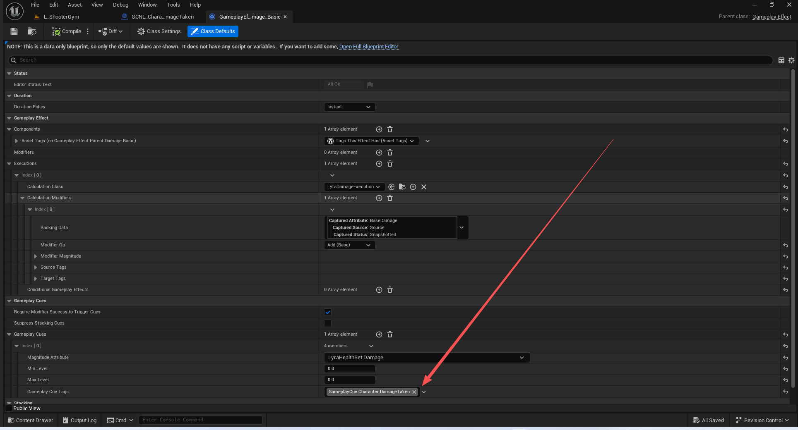
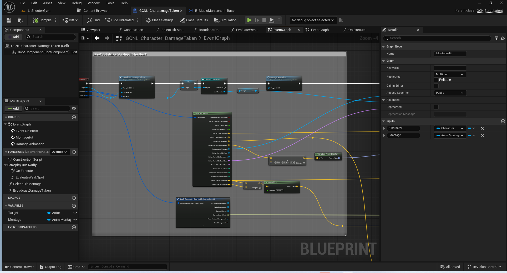
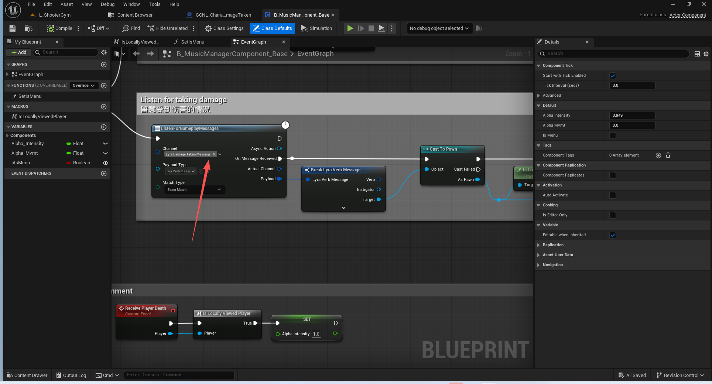
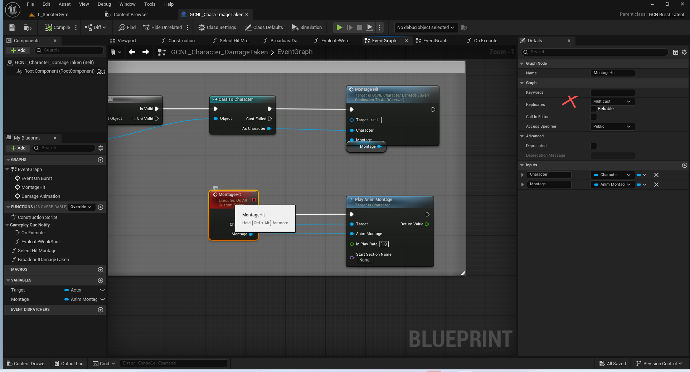
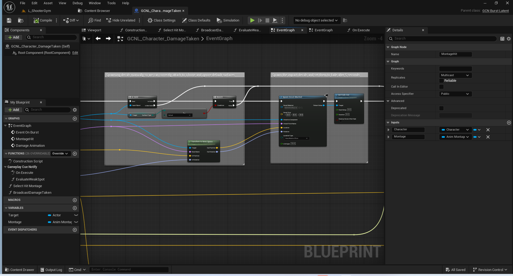
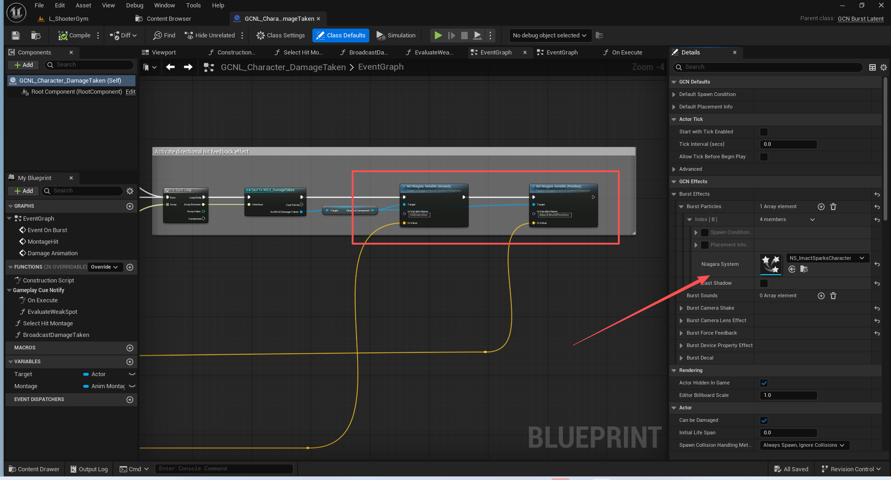
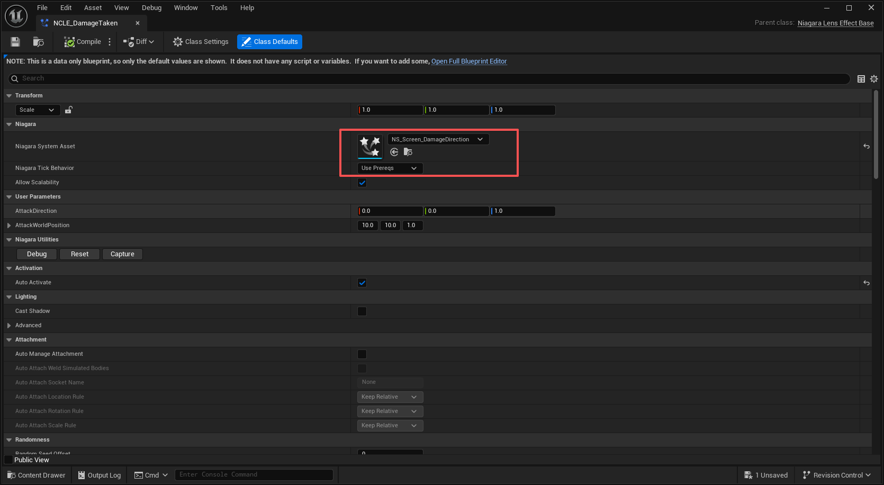
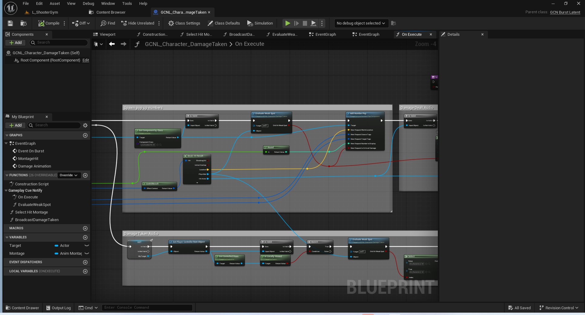
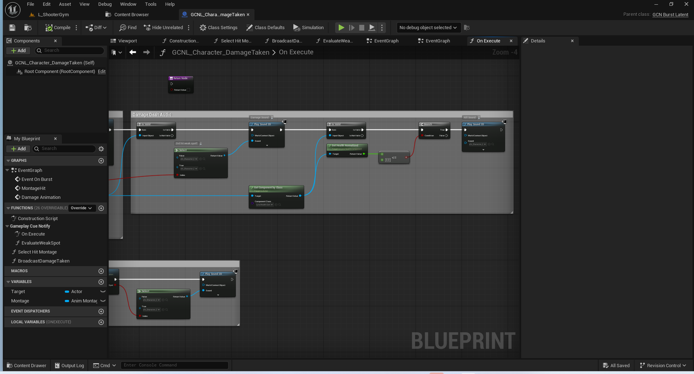
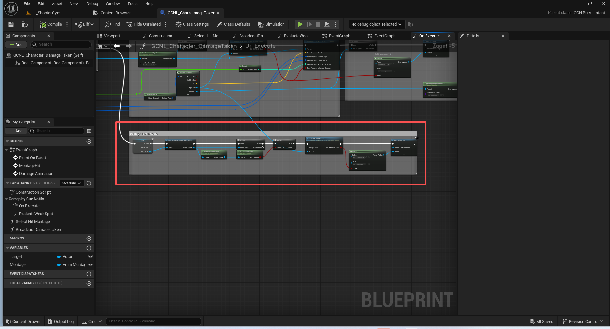

# UE5_Lyra学习指南_095_伤害反馈效果

本文章仅为小刚-B站课堂-虚幻引擎视频课程Lyra-精讲的演讲手稿.  
本套课程链接:[[UE5]虚幻引擎游戏案例Lyra精讲](https://www.bilibili.com/cheese/play/ss112001159)  
前置课程链接:[[UE5]虚幻引擎UEC++从基础到进阶](https://www.bilibili.com/cheese/play/ss28043)  

文章内容由小刚撰写,采用了以下多种方式:  
1.口述转文字  
2.AI重构  
3.参考引擎源码  
4.Lyra工程源码  
5.结合社区论坛各位大佬的解析  

- [UE5\_Lyra学习指南\_095\_伤害反馈效果](#ue5_lyra学习指南_095_伤害反馈效果)
	- [概述](#概述)
	- [激活位置](#激活位置)
	- [注意区分Burst和BurstLatent](#注意区分burst和burstlatent)
		- [GameplayCueNotify\_BurstLatent](#gameplaycuenotify_burstlatent)
		- [GameplayCueNotify\_Burst](#gameplaycuenotify_burst)
	- [执行顺序](#执行顺序)
	- [调整音频参数和播放蒙太奇](#调整音频参数和播放蒙太奇)
		- [调整音频参数](#调整音频参数)
		- [播放蒙太奇](#播放蒙太奇)
	- [生成贴花](#生成贴花)
	- [受击方向和受击粒子](#受击方向和受击粒子)
	- [伤害数字的生成](#伤害数字的生成)
	- [施加伤害和击杀的反馈声音](#施加伤害和击杀的反馈声音)
	- [或者 受到伤害的反馈声音](#或者-受到伤害的反馈声音)
	- [伤害数字的生成逻辑](#伤害数字的生成逻辑)
	- [总结](#总结)


## 概述
本节主要讲解GCNL_Character_DamageTaken.因为这个效果非常重要,所以单独写文档强调.
注意,距离上一节文档,已经通过视频,讲快捷栏操作,武器射击的前后效果等都讲解完毕了.这些涉及到材质,例子,声音,主要是由蓝图配置为主!
## 激活位置

其之类都默认带有该效果,如GE_Damage_Pistol.
## 注意区分Burst和BurstLatent
### GameplayCueNotify_BurstLatent
这是一种针对一次性效果的实例化游戏玩法提示。
由于它是实例化的，所以可以执行诸如时间线或延迟之类的隐性操作。
``` cpp
/**
 * AGameplayCueNotify_BurstLatent
 *
 *	This is an instanced gameplay cue notify for effects that are one-offs.
 *	Since it is instanced, it can do latent things like time lines or delays.
 */
UCLASS(Blueprintable, notplaceable, Category = "GameplayCueNotify", Meta = (ShowWorldContextPin, DisplayName = "GCN Burst Latent", ShortTooltip = "A one-off GameplayCueNotify that can use latent actions such as timelines."), MinimalAPI)
class AGameplayCueNotify_BurstLatent : public AGameplayCueNotify_Actor
{
	GENERATED_BODY()

public:

	UE_API AGameplayCueNotify_BurstLatent();

protected:

	UE_API virtual bool Recycle() override;

	UE_API virtual bool OnExecute_Implementation(AActor* Target, const FGameplayCueParameters& Parameters) override;

	UFUNCTION(BlueprintImplementableEvent)
	UE_API void OnBurst(AActor* Target, const FGameplayCueParameters& Parameters, const FGameplayCueNotify_SpawnResult& SpawnResults);

#if WITH_EDITOR
	UE_API virtual EDataValidationResult IsDataValid(class FDataValidationContext& Context) const override;
#endif // #if WITH_EDITOR

protected:

	// Default condition to check before spawning anything.  Applies for all spawns unless overridden.
	UPROPERTY(EditDefaultsOnly, BlueprintReadOnly, Category = "GCN Defaults")
	FGameplayCueNotify_SpawnCondition DefaultSpawnCondition;

	// Default placement rules.  Applies for all spawns unless overridden.
	UPROPERTY(EditDefaultsOnly, BlueprintReadOnly, Category = "GCN Defaults")
	FGameplayCueNotify_PlacementInfo DefaultPlacementInfo;

	// List of effects to spawn on burst.
	UPROPERTY(EditDefaultsOnly, BlueprintReadOnly, Category = "GCN Effects")
	FGameplayCueNotify_BurstEffects BurstEffects;

	// Results of spawned burst effects.
	UPROPERTY(BlueprintReadOnly, Category = "GCN Effects")
	FGameplayCueNotify_SpawnResult BurstSpawnResults;
};


```
### GameplayCueNotify_Burst

``` cpp
/**
 * UGameplayCueNotify_Burst
 *
 *	This is a non-instanced gameplay cue notify for effects that are one-offs.
 *	Since it is not instanced, it cannot do latent actions such as delays and time lines.
 */
UCLASS(Blueprintable, Category = "GameplayCueNotify", Meta = (ShowWorldContextPin, DisplayName = "GCN Burst", ShortTooltip = "A one-off GameplayCueNotify that is never spawned into the world."), MinimalAPI)
class UGameplayCueNotify_Burst : public UGameplayCueNotify_Static
{
	GENERATED_BODY()

public:

	UE_API UGameplayCueNotify_Burst();

protected:

	UE_API virtual bool OnExecute_Implementation(AActor* Target, const FGameplayCueParameters& Parameters) const override;

	UFUNCTION(BlueprintImplementableEvent)
	UE_API void OnBurst(AActor* Target, const FGameplayCueParameters& Parameters, const FGameplayCueNotify_SpawnResult& SpawnResults) const;

#if WITH_EDITOR
	UE_API virtual EDataValidationResult IsDataValid(class FDataValidationContext& Context) const override;
#endif // #if WITH_EDITOR

protected:

	// Default condition to check before spawning anything.  Applies for all spawns unless overridden.
	UPROPERTY(EditDefaultsOnly, BlueprintReadOnly, Category = "GCN Defaults")
	FGameplayCueNotify_SpawnCondition DefaultSpawnCondition;

	// Default placement rules.  Applies for all spawns unless overridden.
	UPROPERTY(EditDefaultsOnly, BlueprintReadOnly, Category = "GCN Defaults")
	FGameplayCueNotify_PlacementInfo DefaultPlacementInfo;

	// List of effects to spawn on burst.
	UPROPERTY(EditDefaultsOnly, BlueprintReadOnly, Category = "GCN Effects")
	FGameplayCueNotify_BurstEffects BurstEffects;
};


```
## 执行顺序
蓝图OnExecute->蓝图 Parent:On Execute->C++ OnExecute_Implementation->蓝图Event OnBrust

原因:

``` cpp

	/** Called when a GameplayCue is executed, this is used for instant effects or periodic ticks */
	UFUNCTION(BlueprintNativeEvent, Category = "GameplayCueNotify")
	UE_API bool OnExecute(AActor* MyTarget, const FGameplayCueParameters& Parameters);

```
``` cpp
	UFUNCTION(BlueprintImplementableEvent)
	UE_API void OnBurst(AActor* Target, const FGameplayCueParameters& Parameters, const FGameplayCueNotify_SpawnResult& SpawnResults);


```
``` cpp
bool AGameplayCueNotify_BurstLatent::OnExecute_Implementation(AActor* Target, const FGameplayCueParameters& Parameters)
{
	UWorld* World = GetWorld();

	FGameplayCueNotify_SpawnContext SpawnContext(World, Target, Parameters);
	SpawnContext.SetDefaultSpawnCondition(&DefaultSpawnCondition);
	SpawnContext.SetDefaultPlacementInfo(&DefaultPlacementInfo);

	if (DefaultSpawnCondition.ShouldSpawn(SpawnContext))
	{
		BurstEffects.ExecuteEffects(SpawnContext, BurstSpawnResults);

		OnBurst(Target, Parameters, BurstSpawnResults);
	}

	// Handle GC removal by default. This is a simple default to handle all cases we can currently think of.
	// If we didn't do this, we'd be relying on every BurstLatent GC manually setting up its removal within BP graphs,
	// or some inference based on parameters.
	if (World)
	{
		const float Lifetime = FMath::Max<float>(AutoDestroyDelay, DefaultBurstLatentLifetime);
		World->GetTimerManager().SetTimer(FinishTimerHandle, this, &AGameplayCueNotify_Actor::GameplayCueFinishedCallback, Lifetime);
	}

	return false;
}

```
## 调整音频参数和播放蒙太奇

### 调整音频参数


### 播放蒙太奇
注意,这里的多播是不需要的了!!!
在一个DS,两个客户端的情况下.
这个特效只会执行两次.并且在服务器上不执行!!!!

## 生成贴花


## 受击方向和受击粒子




注意这个受击方向 依赖于传递过来的位置数据.
在施加伤害的时候 必须有效传入. 否则方向显示不一定准确.
这里受到枪械伤害的时候 在稍远的距离基本准确.但是受到近战伤害的时候或者距离较近,并不准确.
可能的原因有,未传入HitResult,或者距离过近时的粒子算法不准等.
## 伤害数字的生成

注意这个粒子效果的伤害数字只有三位数,超过之后会溢出,需要修改奶瓜粒子的采样方式!!!!
## 施加伤害和击杀的反馈声音

## 或者 受到伤害的反馈声音


## 伤害数字的生成逻辑
见下一节.
## 总结
本节主要讲解了GCNL的受击效果!