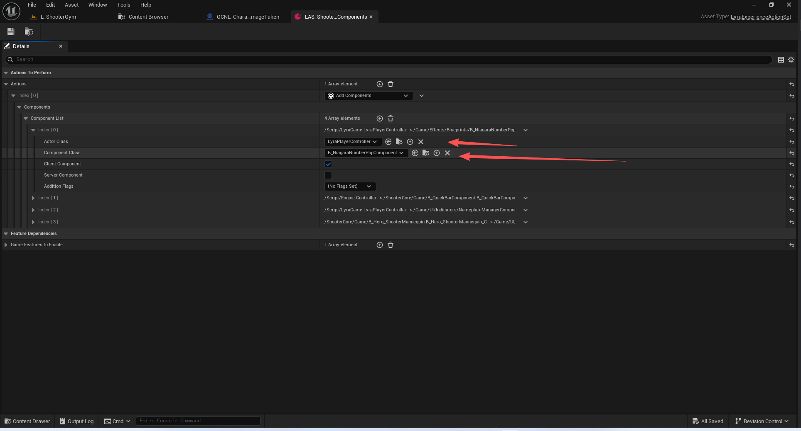
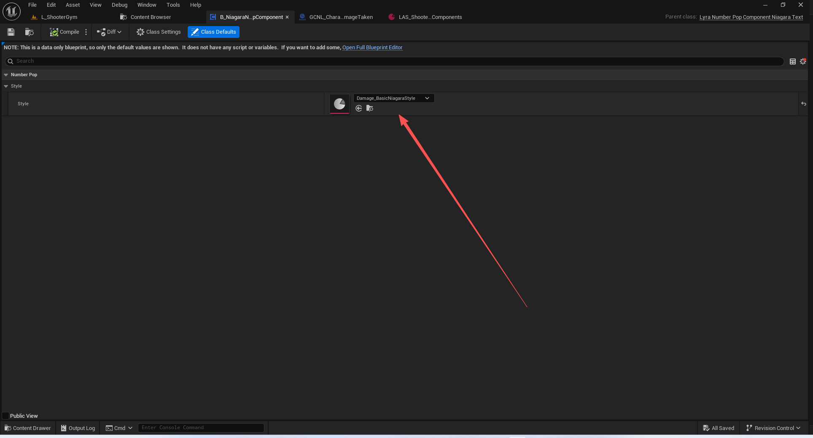
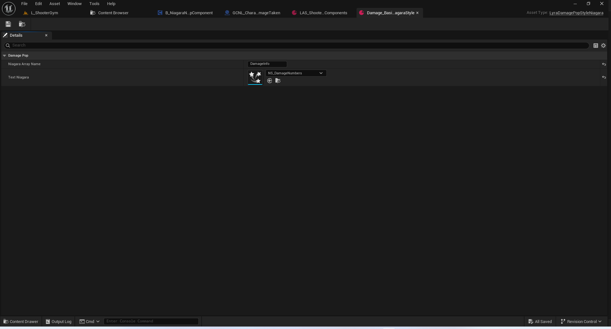
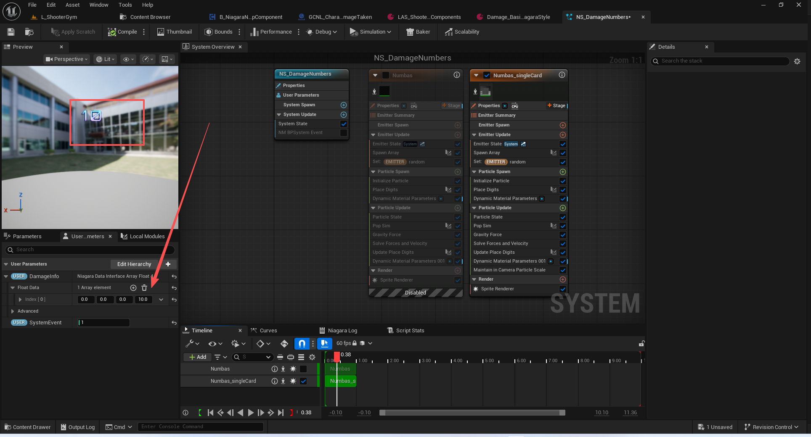
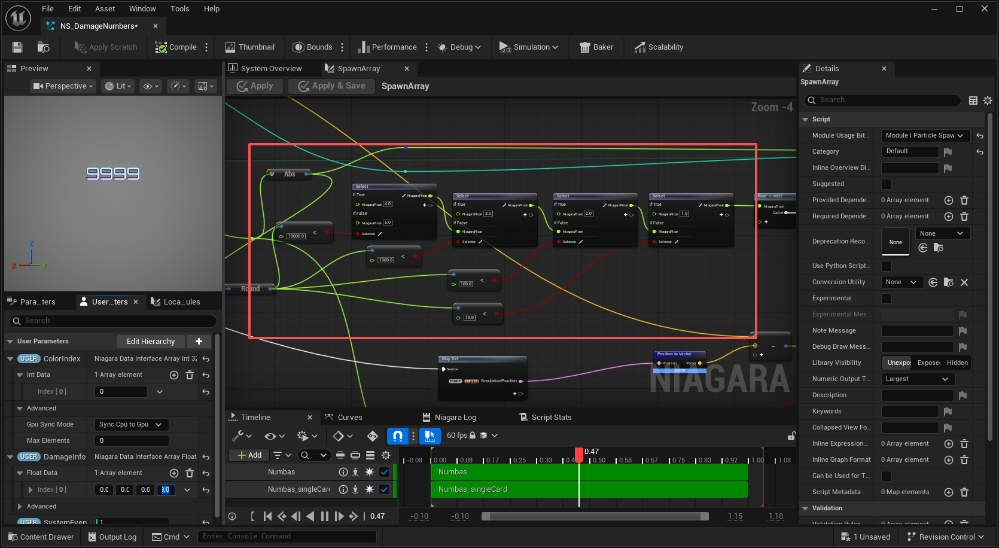
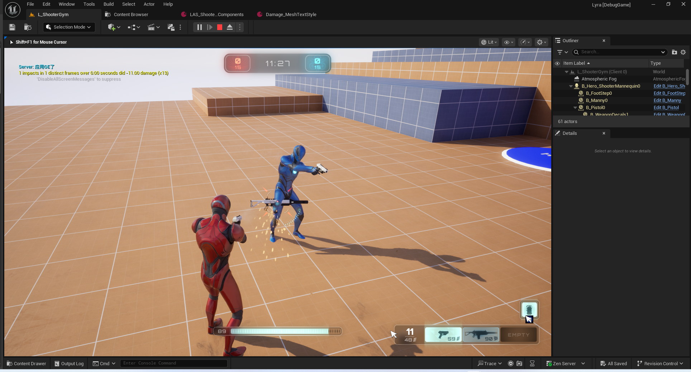
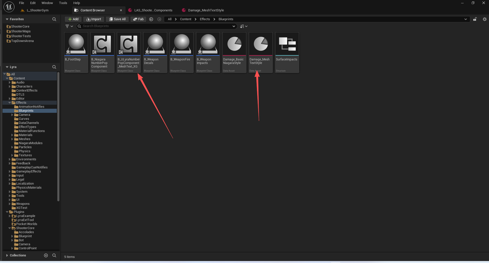

# UE5_Lyra学习指南_096_伤害数字的生成

本文章仅为小刚-B站课堂-虚幻引擎视频课程Lyra-精讲的演讲手稿.  
本套课程链接:[[UE5]虚幻引擎游戏案例Lyra精讲](https://www.bilibili.com/cheese/play/ss112001159)  
前置课程链接:[[UE5]虚幻引擎UEC++从基础到进阶](https://www.bilibili.com/cheese/play/ss28043)  

文章内容由小刚撰写,采用了以下多种方式:  
1.口述转文字  
2.AI重构  
3.参考引擎源码  
4.Lyra工程源码  
5.结合社区论坛各位大佬的解析  

- [UE5\_Lyra学习指南\_096\_伤害数字的生成](#ue5_lyra学习指南_096_伤害数字的生成)
	- [概述](#概述)
	- [请求生成伤害数字](#请求生成伤害数字)
		- [请求结构体](#请求结构体)
		- [组件父类](#组件父类)
		- [组件的添加](#组件的添加)
		- [粒子数字组件的实现](#粒子数字组件的实现)
		- [网格体数字组件的实现](#网格体数字组件的实现)
	- [总结](#总结)


## 概述
本节主要讲解伤害数字的生成流程
## 请求生成伤害数字
### 请求结构体
``` cpp
USTRUCT(BlueprintType)
struct FLyraNumberPopRequest
{
	GENERATED_BODY()

	// The world location to create the number pop at
	// 创建数字弹出窗口的世界位置
	UPROPERTY(EditAnywhere, BlueprintReadWrite, Category = "Lyra|Number Pops")
	FVector WorldLocation;

	// Tags related to the source/cause of the number pop (for determining a style)
	// 与数字弹出的来源/原因相关的标签（用于确定样式）
	UPROPERTY(EditAnywhere, BlueprintReadWrite, Category = "Lyra|Number Pops")
	FGameplayTagContainer SourceTags;

	// Tags related to the target of the number pop (for determining a style)
	// 与数字弹出操作的目标相关联的标签（用于确定样式）// 与数字弹出操作的目标相关联的标签（用于确定样式）
	UPROPERTY(EditAnywhere, BlueprintReadWrite, Category="Lyra|Number Pops")
	FGameplayTagContainer TargetTags;

	// The number to display
	// 显示的数字
	UPROPERTY(EditAnywhere, BlueprintReadWrite, Category = "Lyra|Number Pops")
	int32 NumberToDisplay = 0;

	// Whether the number is 'critical' or not (@TODO: move to a tag)
	// 这个数字是否属于“关键”类别（@待办事项：将其移至标签中）
	UPROPERTY(EditAnywhere, BlueprintReadWrite, Category = "Lyra|Number Pops")
	bool bIsCriticalDamage = false;

	FLyraNumberPopRequest()
		: WorldLocation(ForceInitToZero)
	{
	}
};

```
### 组件父类
``` cpp
UCLASS(Abstract)
class ULyraNumberPopComponent : public UControllerComponent
{
	GENERATED_BODY()

public:

	ULyraNumberPopComponent(const FObjectInitializer& ObjectInitializer = FObjectInitializer::Get());

	/** Adds a damage number to the damage number list for visualization */
	/** 将伤害数值添加到伤害数值列表中，以便进行可视化显示 */
	UFUNCTION(BlueprintCallable, Category = Foo)
	virtual void AddNumberPop(const FLyraNumberPopRequest& NewRequest) {}
};

```

### 组件的添加






``` cpp
/*PopStyle is used to define what Niagara asset should be used for the Damage System representation*/
/*“PopStyle”用于确定在伤害系统的表现中应使用奶瓜的何种资源*/
UCLASS()
class ULyraDamagePopStyleNiagara : public UDataAsset
{
	GENERATED_BODY()

public:

	//Name of the Niagra Array to set the Damage informations
	// 奶瓜阵列的名称，用于设置损伤信息
	UPROPERTY(EditDefaultsOnly, Category="DamagePop")
	FName NiagaraArrayName;

	//Niagara System used to display the damages
	//奶瓜系统用于展示损害情况
	UPROPERTY(EditDefaultsOnly, Category="DamagePop")
	TObjectPtr<UNiagaraSystem> TextNiagara;
};


```

``` cpp
UCLASS(Blueprintable)
class ULyraNumberPopComponent_NiagaraText : public ULyraNumberPopComponent
{
	GENERATED_BODY()

public:

	ULyraNumberPopComponent_NiagaraText(const FObjectInitializer& ObjectInitializer = FObjectInitializer::Get());

	//~ULyraNumberPopComponent interface
	virtual void AddNumberPop(const FLyraNumberPopRequest& NewRequest) override;
	//~End of ULyraNumberPopComponent interface

protected:
	
	TArray<int32> DamageNumberArray;

	/** Style patterns to attempt to apply to the incoming number pops */
	/** 用于尝试应用于输入号码的样式模式 */
	UPROPERTY(EditDefaultsOnly, Category = "Number Pop|Style")
	TObjectPtr<ULyraDamagePopStyleNiagara> Style;

	//Niagara Component used to display the damage
	// 奶瓜组件用于显示损伤情况
	UPROPERTY(EditDefaultsOnly, Category = "Number Pop|Style")
	TObjectPtr<UNiagaraComponent> NiagaraComp;
};


```

### 粒子数字组件的实现
``` cpp
void ULyraNumberPopComponent_NiagaraText::AddNumberPop(const FLyraNumberPopRequest& NewRequest)
{
	int32 LocalDamage = NewRequest.NumberToDisplay;

	//Change Damage to negative to differentiate Critial vs Normal hit
	// 将伤害值改为负值，以区分致命攻击与普通攻击
	if (NewRequest.bIsCriticalDamage)
	{
		LocalDamage *= -1;
	}

	//Add a NiagaraComponent if we don't already have one
	// 如果我们尚未添加“尼加拉组件”，则添加一个。
	if (!NiagaraComp)
	{
		NiagaraComp = NewObject<UNiagaraComponent>(GetOwner());
		if (Style != nullptr)
		{
			NiagaraComp->SetAsset(Style->TextNiagara);
			NiagaraComp->bAutoActivate = false;
			
		}
		NiagaraComp->SetupAttachment(nullptr);
		check(NiagaraComp);
		NiagaraComp->RegisterComponent();
	}


	NiagaraComp->Activate(false);
	NiagaraComp->SetWorldLocation(NewRequest.WorldLocation);

	UE_LOG(LogLyra, Log, TEXT("DamageHit location : %s"), *(NewRequest.WorldLocation.ToString()));
	//Add Damage information to the current Niagara list - Damage informations are packed inside a FVector4 where XYZ = Position, W = Damage
	// 将伤害信息添加到当前的尼加拉列表中 - 伤害信息被封装在一个 FVector4 类型的变量中，其中 X、Y、Z 分别代表位置，W 代表伤害值。
	TArray<FVector4> DamageList = UNiagaraDataInterfaceArrayFunctionLibrary::GetNiagaraArrayVector4(NiagaraComp, Style->NiagaraArrayName);
	DamageList.Add(FVector4(NewRequest.WorldLocation.X, NewRequest.WorldLocation.Y, NewRequest.WorldLocation.Z, LocalDamage));
	UNiagaraDataInterfaceArrayFunctionLibrary::SetNiagaraArrayVector4(NiagaraComp, Style->NiagaraArrayName, DamageList);
	
}


```


关于伤害数字提高上限的实现位置


### 网格体数字组件的实现



``` cpp
UCLASS()
class ULyraDamagePopStyle : public UDataAsset
{
	GENERATED_BODY()

public:

	ULyraDamagePopStyle();

	UPROPERTY(EditDefaultsOnly, Category="DamagePop")
	FString DisplayText;

	UPROPERTY(EditDefaultsOnly, Category="DamagePop")
	FGameplayTagQuery MatchPattern;

	UPROPERTY(EditDefaultsOnly, Category="DamagePop", meta=(EditCondition=bOverrideColor))
	FLinearColor Color;

	UPROPERTY(EditDefaultsOnly, Category="DamagePop", meta=(EditCondition=bOverrideColor))
	FLinearColor CriticalColor;

	UPROPERTY(EditDefaultsOnly, Category="DamagePop", meta=(EditCondition=bOverrideMesh))
	TObjectPtr<UStaticMesh> TextMesh;

	UPROPERTY()
	bool bOverrideColor = false;

	UPROPERTY()
	bool bOverrideMesh = false;
};


```

``` cpp
UCLASS(Blueprintable)
class ULyraNumberPopComponent_MeshText : public ULyraNumberPopComponent
{
	GENERATED_BODY()

public:

	ULyraNumberPopComponent_MeshText(const FObjectInitializer& ObjectInitializer = FObjectInitializer::Get());

	//~ULyraNumberPopComponent interface
	virtual void AddNumberPop(const FLyraNumberPopRequest& NewRequest) override;
	//~End of ULyraNumberPopComponent interface

protected:
	void SetMaterialParameters(const FLyraNumberPopRequest& Request, FTempNumberPopInfo& NewDamageNumberInfo, const FTransform& CameraTransform, const FVector& NumberLocation);

	FLinearColor DetermineColor(const FLyraNumberPopRequest& Request) const;
	UStaticMesh* DetermineStaticMesh(const FLyraNumberPopRequest& Request) const;


	/** Releases components back to the pool that have exceeded their lifespan */
	/** 将已超出使用期限的组件放回资源池中 */
	void ReleaseNextComponents();

	/** Style patterns to attempt to apply to the incoming number pops */
	/** 用于尝试应用于输入号码的样式模式 */
	UPROPERTY(EditDefaultsOnly, Category="Number Pop|Style")
	TArray<TObjectPtr<ULyraDamagePopStyle>> Styles;

	UPROPERTY(EditDefaultsOnly, BlueprintReadWrite, Category = "Number Pop|Style")
	float ComponentLifespan;

	UPROPERTY(EditDefaultsOnly, Category = "Number Pop|Style")
	float DistanceFromCameraBeforeDoublingSize;
	
	UPROPERTY(EditDefaultsOnly, Category = "Number Pop|Style")
	float CriticalHitSizeMultiplier;

	UPROPERTY(EditDefaultsOnly, Category = "Number Pop|Font")
	float FontXSize;

	UPROPERTY(EditDefaultsOnly, Category = "Number Pop|Font")
	float FontYSize;

	UPROPERTY(EditDefaultsOnly, Category = "Number Pop|Font")
	float SpacingPercentageForOnes;

	UPROPERTY(EditDefaultsOnly, Category = "Number Pop|Style")
	float NumberOfNumberRotations;

	UPROPERTY(EditDefaultsOnly, Category = "Number Pop|Material Bindings")
	FName SignDigitParameterName;

	UPROPERTY(EditDefaultsOnly, Category = "Number Pop|Material Bindings")
	FName ColorParameterName;

	UPROPERTY(EditDefaultsOnly, Category = "Number Pop|Material Bindings")
	FName AnimationLifespanParameterName;

	UPROPERTY(EditDefaultsOnly, Category = "Number Pop|Material Bindings")
	FName IsCriticalHitParameterName;

	/** Damage numbers by default are given a depth close to the camera in the material to make sure they are never occluded. This can be toggled off here, should only be 0/1. */
	/** 默认情况下，伤害数值在材质中会被设置为与摄像机距离相近的数值，以确保它们不会被遮挡。此设置可在此处关闭，且只能为 0 或 1 。*/
	UPROPERTY(EditDefaultsOnly, Category = "Number Pop|Material Bindings")
	FName MoveToCameraParameterName;

	UPROPERTY(EditDefaultsOnly, Category = "Number Pop|Material Bindings")
	TArray<FName> PositionParameterNames;

	UPROPERTY(EditDefaultsOnly, Category = "Number Pop|Material Bindings")
	TArray<FName> ScaleRotationAngleParameterNames;

	UPROPERTY(EditDefaultsOnly, Category = "Number Pop|Material Bindings")
	TArray<FName> DurationParameterNames;

	UPROPERTY(Transient)
	TMap<TObjectPtr<UStaticMesh>, FPooledNumberPopComponentList> PooledComponentMap;

	UPROPERTY(transient)
	TArray<FLiveNumberPopEntry> LiveComponents;

	FTimerHandle ReleaseTimerHandle;
};


```
## 总结
本文主要讲解了Lyra的两种数字实现方式.
注意.Lyra项目展示了奶瓜这种实现.另外一种需要自己配置相关的实例.