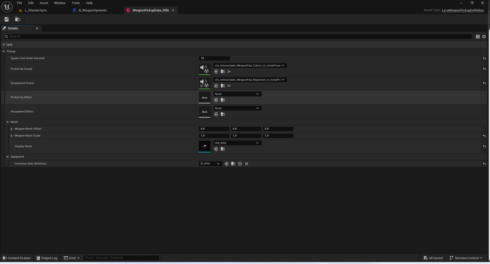
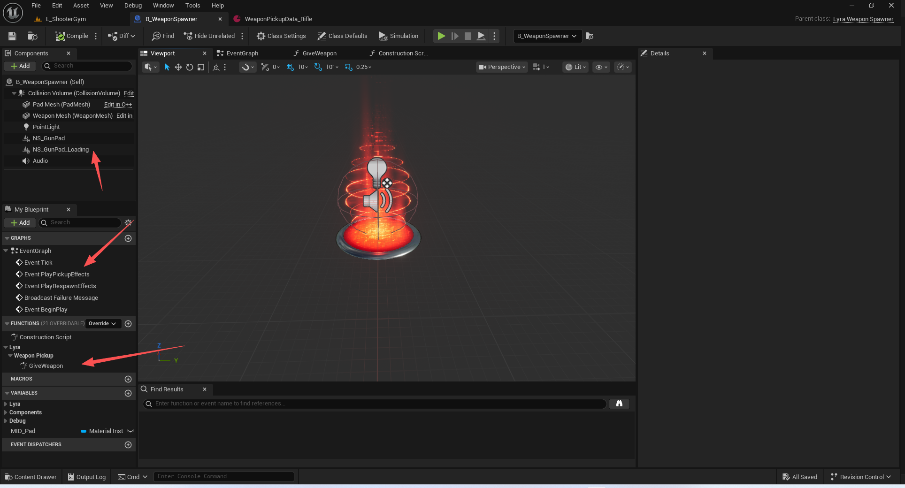
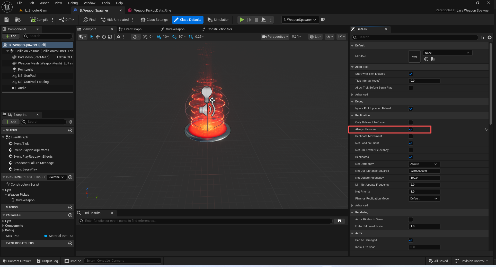
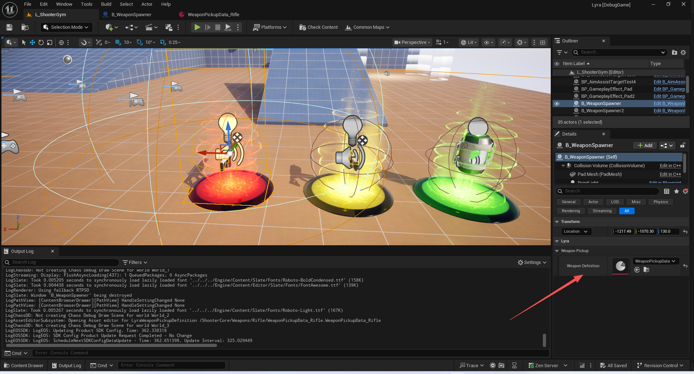
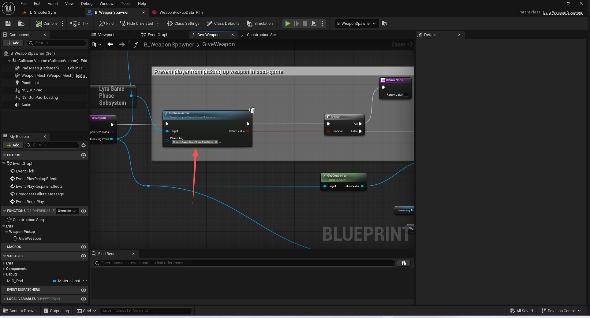
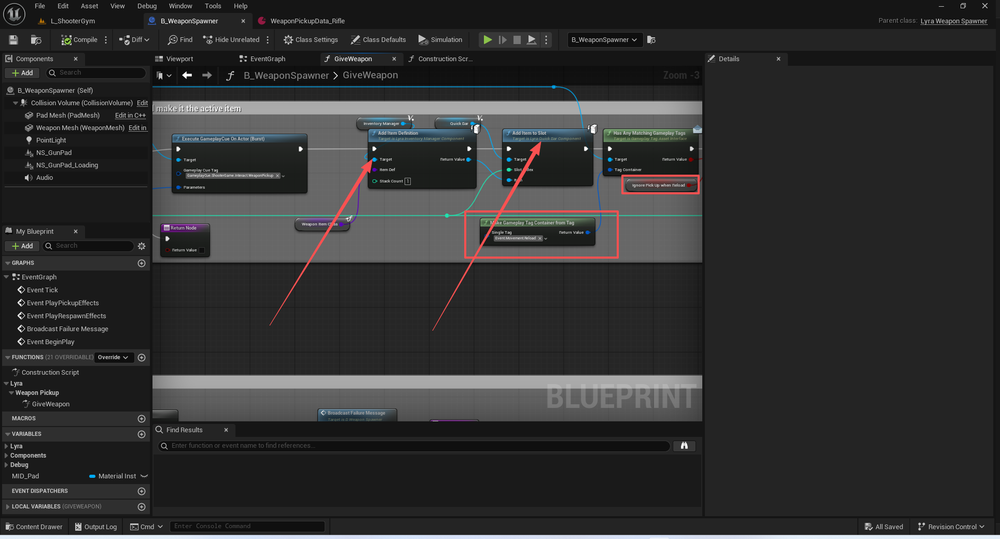
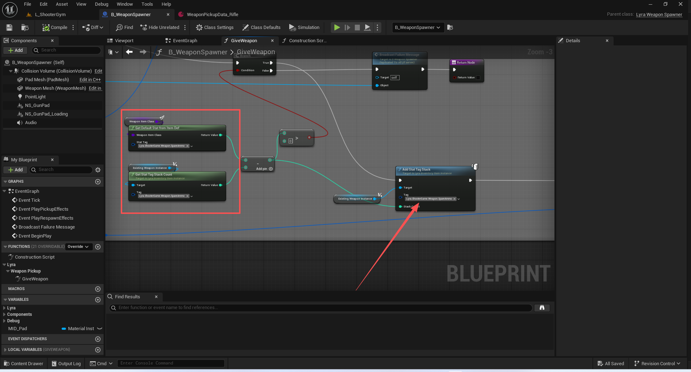
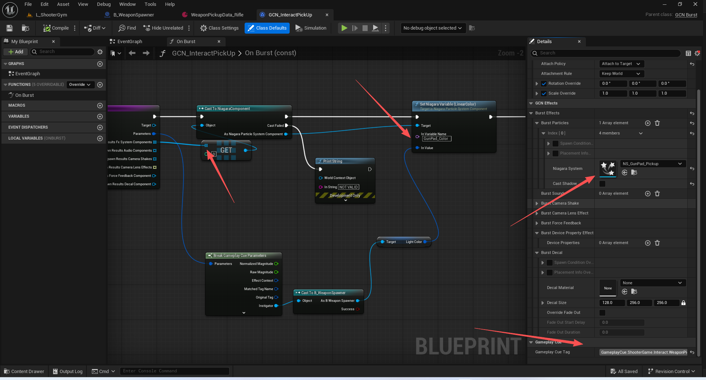

# UE5_Lyra学习指南_097_武器生成器

本文章仅为小刚-B站课堂-虚幻引擎视频课程Lyra-精讲的演讲手稿.  
本套课程链接:[[UE5]虚幻引擎游戏案例Lyra精讲](https://www.bilibili.com/cheese/play/ss112001159)  
前置课程链接:[[UE5]虚幻引擎UEC++从基础到进阶](https://www.bilibili.com/cheese/play/ss28043)  

文章内容由小刚撰写,采用了以下多种方式:  
1.口述转文字  
2.AI重构  
3.参考引擎源码  
4.Lyra工程源码  
5.结合社区论坛各位大佬的解析  

- [UE5\_Lyra学习指南\_097\_武器生成器](#ue5_lyra学习指南_097_武器生成器)
	- [概述](#概述)
	- [关于不可靠RPC的限制](#关于不可靠rpc的限制)
	- [C++定义](#c定义)
		- [构造函数初始化](#构造函数初始化)
		- [重叠函数绑定](#重叠函数绑定)
		- [冷却的定时器](#冷却的定时器)
		- [检测已重叠的定时器](#检测已重叠的定时器)
		- [清除定时器](#清除定时器)
		- [客户端效果播放](#客户端效果播放)
		- [武器资产定义](#武器资产定义)
		- [旋转](#旋转)
		- [根据资产初始化](#根据资产初始化)
		- [播放效果](#播放效果)
		- [获取Tag](#获取tag)
	- [蓝图定义](#蓝图定义)
		- [阶段判断](#阶段判断)
		- [新增武器](#新增武器)
		- [补充弹药](#补充弹药)
		- [触发拾取特效](#触发拾取特效)
	- [总结](#总结)


## 概述
本节主要讲解武器生成器.它的作用有两个,一个是添加武器,另一个是补充弹药.

## 关于不可靠RPC的限制
DefaultEngine.ini
``` ini
[ConsoleVariables]
// 最大的RPC数量
// 每次网络更新允许的最大不可靠多播 RPC 调用次数，超过此次数的调用将被丢弃。
net.MaxRPCPerNetUpdate=10
```
``` cpp
void UGameplayCueManager::CheckForTooManyRPCs(FName FuncName, const FGameplayCuePendingExecute& PendingCue, const FString& CueID, const FGameplayEffectContext* EffectContext)
{
	if (GameplayCueCheckForTooManyRPCs)
	{
		static IConsoleVariable* MaxRPCPerNetUpdateCVar = IConsoleManager::Get().FindConsoleVariable(TEXT("net.MaxRPCPerNetUpdate"));
		if (MaxRPCPerNetUpdateCVar)
		{
			AActor* Owner = PendingCue.OwningComponent ? PendingCue.OwningComponent->GetOwner() : nullptr;
			UWorld* World = Owner ? Owner->GetWorld() : nullptr;
			UNetDriver* NetDriver = World ? World->GetNetDriver() : nullptr;
			if (NetDriver)
			{
				const int32 MaxRPCs = MaxRPCPerNetUpdateCVar->GetInt();
				for (UNetConnection* ClientConnection : NetDriver->ClientConnections)
				{
					if (ClientConnection)
					{
						UActorChannel** OwningActorChannelPtr = ClientConnection->FindActorChannel(Owner);
						TSharedRef<FObjectReplicator>* ComponentReplicatorPtr = (OwningActorChannelPtr && *OwningActorChannelPtr) ? (*OwningActorChannelPtr)->ReplicationMap.Find(PendingCue.OwningComponent) : nullptr;
						if (ComponentReplicatorPtr)
						{
							const TArray<FObjectReplicator::FRPCCallInfo>& RemoteFuncInfo = (*ComponentReplicatorPtr)->RemoteFuncInfo;
							for (const FObjectReplicator::FRPCCallInfo& CallInfo : RemoteFuncInfo)
							{
								if (CallInfo.FuncName == FuncName)
								{
									if (CallInfo.Calls > MaxRPCs)
									{
										const FString Instigator = EffectContext ? EffectContext->ToString() : TEXT("None");
										ABILITY_LOG(Warning, TEXT("Attempted to fire %s when no more RPCs are allowed this net update. Max:%d Cue:%s Instigator:%s Component:%s"), *FuncName.ToString(), MaxRPCs, *CueID, *Instigator, *GetPathNameSafe(PendingCue.OwningComponent));
									
										// Returning here to only log once per offending RPC.
										return;
									}

									break;
								}
							}
						}
					}
				}
			}
		}
	}
}

```

## C++定义

### 构造函数初始化
``` cpp
// Sets default values
ALyraWeaponSpawner::ALyraWeaponSpawner()
{
 	// Set this actor to call Tick() every frame.  You can turn this off to improve performance if you don't need it.
	// 将此角色设置为每帧调用“Tick()”方法。如果您不需要此功能，可以将其关闭以提高性能。
	PrimaryActorTick.bCanEverTick = true;

	RootComponent = CollisionVolume = CreateDefaultSubobject<UCapsuleComponent>(TEXT("CollisionVolume"));
	CollisionVolume->InitCapsuleSize(80.f, 80.f);
	CollisionVolume->OnComponentBeginOverlap.AddDynamic(this, &ALyraWeaponSpawner::OnOverlapBegin);

	PadMesh = CreateDefaultSubobject<UStaticMeshComponent>(TEXT("PadMesh"));
	PadMesh->SetupAttachment(RootComponent);

	WeaponMesh = CreateDefaultSubobject<UStaticMeshComponent>(TEXT("WeaponMesh"));
	WeaponMesh->SetupAttachment(RootComponent);

	WeaponMeshRotationSpeed = 40.0f;
	CoolDownTime = 30.0f;
	CheckExistingOverlapDelay = 0.25f;
	bIsWeaponAvailable = true;
	// 重要!!!
	bReplicates = true;
}

```


### 重叠函数绑定
``` cpp
void ALyraWeaponSpawner::OnOverlapBegin(UPrimitiveComponent* OverlappedComponent, AActor* OtherActor, UPrimitiveComponent* OtherComp, int32 OtherBodyIndex, bool bFromSweep, const FHitResult& SweepHitResult)
{
	APawn* OverlappingPawn = Cast<APawn>(OtherActor);
	if (GetLocalRole() == ROLE_Authority && bIsWeaponAvailable && OverlappingPawn != nullptr)
	{
		AttemptPickUpWeapon(OverlappingPawn);
	}
}

```

### 冷却的定时器

``` cpp
void ALyraWeaponSpawner::AttemptPickUpWeapon_Implementation(APawn* Pawn)
{
	if (GetLocalRole() == ROLE_Authority && bIsWeaponAvailable && UAbilitySystemBlueprintLibrary::GetAbilitySystemComponent(Pawn))
	{
		TSubclassOf<ULyraInventoryItemDefinition> WeaponItemDefinition = WeaponDefinition ? WeaponDefinition->InventoryItemDefinition : nullptr;
		if (WeaponItemDefinition != nullptr)
		{
			//Attempt to grant the weapon
			// 尝试授予武器
			if (GiveWeapon(WeaponItemDefinition, Pawn))
			{
				//Weapon picked up by pawn
				// 该角色拾取了武器
				bIsWeaponAvailable = false;
				SetWeaponPickupVisibility(false);
				PlayPickupEffects();
				StartCoolDown();
			}
		}		
	}
}


```

``` cpp
void ALyraWeaponSpawner::StartCoolDown()
{
	if (UWorld* World = GetWorld())
	{
		World->GetTimerManager().SetTimer(CoolDownTimerHandle, this, &ALyraWeaponSpawner::OnCoolDownTimerComplete, CoolDownTime);
	}
}


```

``` cpp
void ALyraWeaponSpawner::OnCoolDownTimerComplete()
{
	ResetCoolDown();
}


```
``` cpp
void ALyraWeaponSpawner::ResetCoolDown()
{
	UWorld* World = GetWorld();

	if (World)
	{
		World->GetTimerManager().ClearTimer(CoolDownTimerHandle);
	}

	if (GetLocalRole() == ROLE_Authority)
	{
		bIsWeaponAvailable = true;
		PlayRespawnEffects();
		SetWeaponPickupVisibility(true);

		if (World)
		{
			World->GetTimerManager().SetTimer(CheckOverlapsDelayTimerHandle, this, &ALyraWeaponSpawner::CheckForExistingOverlaps, CheckExistingOverlapDelay);
		}
	}

	CoolDownPercentage = 0.0f;
}

```

### 检测已重叠的定时器
``` cpp
void ALyraWeaponSpawner::CheckForExistingOverlaps()
{
	TArray<AActor*> OverlappingActors;
	
	// 返回该演员所涉及的重叠角色列表（即任何角色组件与任何其他角色组件的重叠情况）。不包括自身。形参:
	// 重叠角色 — [输出] 返回重叠的角色列表
	// 类过滤器 — [可选] 若设置，则仅返回此类或其子类的角色
	GetOverlappingActors(OverlappingActors, APawn::StaticClass());

	for (AActor* OverlappingActor : OverlappingActors)
	{
		AttemptPickUpWeapon(Cast<APawn>(OverlappingActor));
	}
}

```
### 清除定时器
``` cpp

// Called when the game starts or when spawned
// 当游戏开始或被生成时触发此事件
void ALyraWeaponSpawner::BeginPlay()
{
	Super::BeginPlay();

	if (WeaponDefinition && WeaponDefinition->InventoryItemDefinition)
	{
		CoolDownTime = WeaponDefinition->SpawnCoolDownSeconds;	
	}
	else if (const UWorld* World = GetWorld())
	{
		if (!World->IsPlayingReplay())
		{
			UE_LOG(LogLyra, Error, TEXT("'%s' does not have a valid weapon definition! Make sure to set this data on the instance!"), *GetNameSafe(this));	
		}
	}
}

void ALyraWeaponSpawner::EndPlay(const EEndPlayReason::Type EndPlayReason)
{
	if (UWorld* World = GetWorld())
	{
		World->GetTimerManager().ClearTimer(CoolDownTimerHandle);
		World->GetTimerManager().ClearTimer(CheckOverlapsDelayTimerHandle);
	}
	
	Super::EndPlay(EndPlayReason);
}

```
### 客户端效果播放
``` cpp
	UPROPERTY(EditDefaultsOnly, BlueprintReadWrite, ReplicatedUsing = OnRep_WeaponAvailability, Category = "Lyra|WeaponPickup")
	bool bIsWeaponAvailable;

```
``` cpp
void ALyraWeaponSpawner::OnRep_WeaponAvailability()
{
	if (bIsWeaponAvailable)
	{
		PlayRespawnEffects();
		SetWeaponPickupVisibility(true);
	}
	else
	{
		SetWeaponPickupVisibility(false);
		StartCoolDown();
		PlayPickupEffects();
	}	
}

```
### 武器资产定义
``` cpp
/**
 * 物品拾取定义
 * 注意 于交互系统无关
 * 仅用于武器生成器这边的拾取物生成
 */
UCLASS(MinimalAPI, Blueprintable, BlueprintType, Const, Meta = (DisplayName = "Lyra Pickup Data", ShortTooltip = "Data asset used to configure a pickup."))
class ULyraPickupDefinition : public UDataAsset
{
	GENERATED_BODY()
	
public:

	//Defines the pickup's actors to spawn, abilities to grant, and tags to add
	// 定义了拾取物品时要生成的玩家角色、要赋予的技能以及要添加的标签
	UPROPERTY(EditDefaultsOnly, BlueprintReadOnly, Category = "Lyra|Pickup|Equipment")
	TSubclassOf<ULyraInventoryItemDefinition> InventoryItemDefinition;

	//Visual representation of the pickup
	// 车辆取货过程的可视化展示
	UPROPERTY(EditDefaultsOnly, BlueprintReadOnly, Category = "Lyra|Pickup|Mesh")
	TObjectPtr<UStaticMesh> DisplayMesh;

	//Cool down time between pickups in seconds
	// 两次拾取物品之间的冷却时间（以秒为单位）
	UPROPERTY(EditDefaultsOnly, BlueprintReadOnly, Category = "Lyra|Pickup")
	int32 SpawnCoolDownSeconds;

	//Sound to play when picked up
	// 拾起时播放的声音
	UPROPERTY(EditDefaultsOnly, BlueprintReadOnly, Category = "Lyra|Pickup")
	TObjectPtr<USoundBase> PickedUpSound;

	//Sound to play when pickup is respawned
	// 当拾取物品复活后将播放的音效
	UPROPERTY(EditDefaultsOnly, BlueprintReadOnly, Category = "Lyra|Pickup")
	TObjectPtr<USoundBase> RespawnedSound;

	//Particle FX to play when picked up
	// 当拾起时播放的粒子特效
	UPROPERTY(EditDefaultsOnly, BlueprintReadOnly, Category = "Lyra|Pickup")
	TObjectPtr<UNiagaraSystem> PickedUpEffect;

	//Particle FX to play when pickup is respawned
	// 当拾取物品被重新生成时播放粒子效果
	UPROPERTY(EditDefaultsOnly, BlueprintReadOnly, Category = "Lyra|Pickup")
	TObjectPtr<UNiagaraSystem> RespawnedEffect;
};

// 武器拾取定义
UCLASS(MinimalAPI, Blueprintable, BlueprintType, Const, Meta = (DisplayName = "Lyra Weapon Pickup Data", ShortTooltip = "Data asset used to configure a weapon pickup."))
class ULyraWeaponPickupDefinition : public ULyraPickupDefinition
{
	GENERATED_BODY()

public:

	//Sets the height of the display mesh above the Weapon spawner
	// 设置显示网格在武器生成器上方的高度
	UPROPERTY(EditDefaultsOnly, BlueprintReadOnly, Category = "Lyra|Pickup|Mesh")
	FVector WeaponMeshOffset;

	//Sets the height of the display mesh above the Weapon spawner
	// 设置显示网格在武器生成器上方的高度
	UPROPERTY(EditDefaultsOnly, BlueprintReadOnly, Category = "Lyra|Pickup|Mesh")
	FVector WeaponMeshScale = FVector(1.0f, 1.0f, 1.0f);
};

```
### 旋转
``` cpp
// Called every frame
void ALyraWeaponSpawner::Tick(float DeltaTime)
{
	Super::Tick(DeltaTime);

	//Update the CoolDownPercentage property to drive respawn time indicators
	// 更新“冷却时间百分比”属性，以驱动重生时间指示器的显示
	UWorld* World = GetWorld();
	if (World->GetTimerManager().IsTimerActive(CoolDownTimerHandle))
	{
		CoolDownPercentage = 1.0f - World->GetTimerManager().GetTimerRemaining(CoolDownTimerHandle)/CoolDownTime;
	}

	WeaponMesh->AddRelativeRotation(FRotator(0.0f, World->GetDeltaSeconds() * WeaponMeshRotationSpeed, 0.0f));
}
```

### 根据资产初始化
``` cpp
void ALyraWeaponSpawner::OnConstruction(const FTransform& Transform)
{
	if (WeaponDefinition != nullptr && WeaponDefinition->DisplayMesh != nullptr)
	{
		WeaponMesh->SetStaticMesh(WeaponDefinition->DisplayMesh);
		WeaponMesh->SetRelativeLocation(WeaponDefinition->WeaponMeshOffset);
		WeaponMesh->SetRelativeScale3D(WeaponDefinition->WeaponMeshScale);
	}	
}
```
### 播放效果
``` cpp


void ALyraWeaponSpawner::SetWeaponPickupVisibility(bool bShouldBeVisible)
{
	WeaponMesh->SetVisibility(bShouldBeVisible, true);
}

void ALyraWeaponSpawner::PlayPickupEffects_Implementation()
{
	if (WeaponDefinition != nullptr)
	{
		USoundBase* PickupSound = WeaponDefinition->PickedUpSound;
		if (PickupSound != nullptr)
		{
			UGameplayStatics::PlaySoundAtLocation(this, PickupSound, GetActorLocation());
		}

		UNiagaraSystem* PickupEffect = WeaponDefinition->PickedUpEffect;
		if (PickupEffect != nullptr)
		{
			UNiagaraFunctionLibrary::SpawnSystemAtLocation(this, PickupEffect, WeaponMesh->GetComponentLocation());
		}
	}
}

void ALyraWeaponSpawner::PlayRespawnEffects_Implementation()
{
	if (WeaponDefinition != nullptr)
	{
		USoundBase* RespawnSound = WeaponDefinition->RespawnedSound;
		if (RespawnSound != nullptr)
		{
			UGameplayStatics::PlaySoundAtLocation(this, RespawnSound, GetActorLocation());
		}

		UNiagaraSystem* RespawnEffect = WeaponDefinition->RespawnedEffect;
		if (RespawnEffect != nullptr)
		{
			UNiagaraFunctionLibrary::SpawnSystemAtLocation(this, RespawnEffect, WeaponMesh->GetComponentLocation());
		}
	}
}
```

### 获取Tag
```  cpp
int32 ALyraWeaponSpawner::GetDefaultStatFromItemDef(const TSubclassOf<ULyraInventoryItemDefinition> WeaponItemClass, FGameplayTag StatTag)
{
	if (WeaponItemClass != nullptr)
	{
		if (ULyraInventoryItemDefinition* WeaponItemCDO = WeaponItemClass->GetDefaultObject<ULyraInventoryItemDefinition>())
		{
			if (const UInventoryFragment_SetStats* ItemStatsFragment = Cast<UInventoryFragment_SetStats>( WeaponItemCDO->FindFragmentByClass(UInventoryFragment_SetStats::StaticClass()) ))
			{
				return ItemStatsFragment->GetItemStatByTag(StatTag);
			}
		}
	}

	return 0;
}


```
## 蓝图定义


``` cpp
protected:
	//Data asset used to configure a Weapon Spawner
	// 用于配置武器生成器的数据资产
	UPROPERTY(EditInstanceOnly, BlueprintReadOnly, Category = "Lyra|WeaponPickup")
	TObjectPtr<ULyraWeaponPickupDefinition> WeaponDefinition;

```

因为这个是在实例上才能设置的,所以类的默认设置看不到,很坑



### 阶段判断

### 新增武器

### 补充弹药


### 触发拾取特效


## 总结
本节比较简单.注意此时还没有讲阶段切换系统.其实就是个询问.
注意定时器的激活管理.避免资源额外开销等.
还有就是武器生成器的网络同步性.需要和场景可拾取物进行区分!
