# UE5_Lyra学习指南_098_手榴弹技能

本文章仅为小刚-B站课堂-虚幻引擎视频课程Lyra-精讲的演讲手稿.  
本套课程链接:[[UE5]虚幻引擎游戏案例Lyra精讲](https://www.bilibili.com/cheese/play/ss112001159)  
前置课程链接:[[UE5]虚幻引擎UEC++从基础到进阶](https://www.bilibili.com/cheese/play/ss28043)  

文章内容由小刚撰写,采用了以下多种方式:  
1.口述转文字  
2.AI重构  
3.参考引擎源码  
4.Lyra工程源码  
5.结合社区论坛各位大佬的解析  

- [UE5\_Lyra学习指南\_098\_手榴弹技能](#ue5_lyra学习指南_098_手榴弹技能)
	- [概述](#概述)
	- [手榴弹技能](#手榴弹技能)
		- [GAS的警告](#gas的警告)
		- [控件的添加](#控件的添加)
		- [投掷物的位置计算](#投掷物的位置计算)
		- [冷却时间的传递](#冷却时间的传递)
	- [投掷物定义](#投掷物定义)
		- [初始化](#初始化)
			- [Pre stream grenade explosion](#pre-stream-grenade-explosion)
			- [Prevent Pawn / Grenade from blocking one another](#prevent-pawn--grenade-from-blocking-one-another)
			- [Re-Enabling Pawn / Grenade Collision, allow Velocity to drive Rotation](#re-enabling-pawn--grenade-collision-allow-velocity-to-drive-rotation)
			- [Setup VFX Trail with custom colors](#setup-vfx-trail-with-custom-colors)
			- [定时爆炸](#定时爆炸)
		- [穿过传送门](#穿过传送门)
		- [碰撞事件](#碰撞事件)
		- [引爆](#引爆)
			- [触发特效 关闭投掷移动组件](#触发特效-关闭投掷移动组件)
			- [重叠检测](#重叠检测)
	- [总结](#总结)


## 概述
本节注意讲解手榴弹技能.
## 手榴弹技能
### GAS的警告
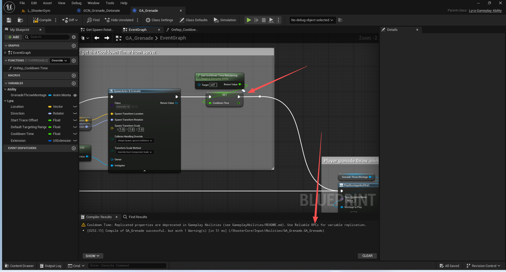
GA通过属性同步已经过时了,应当通过可靠RPC去做!
### 控件的添加
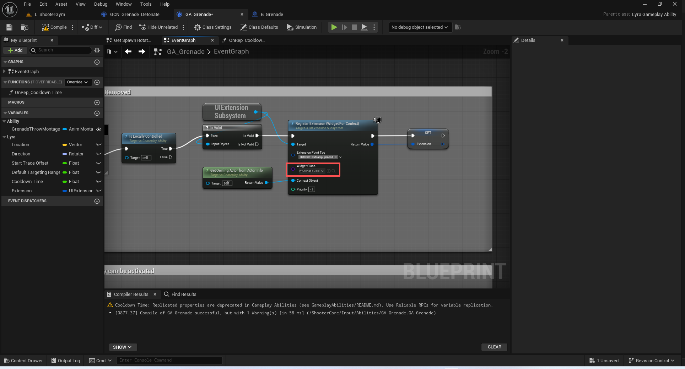

### 投掷物的位置计算
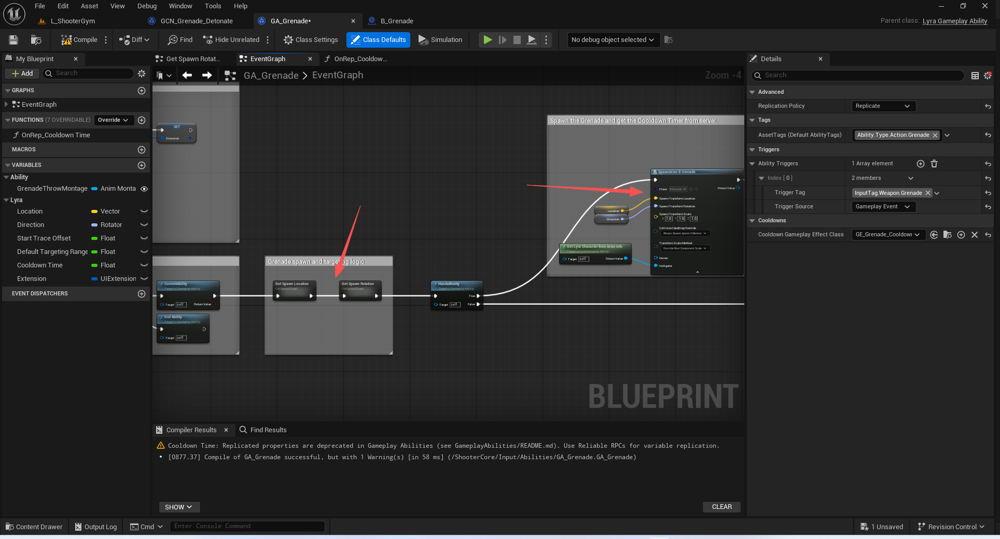

### 冷却时间的传递
注意这里其实是写死了5秒

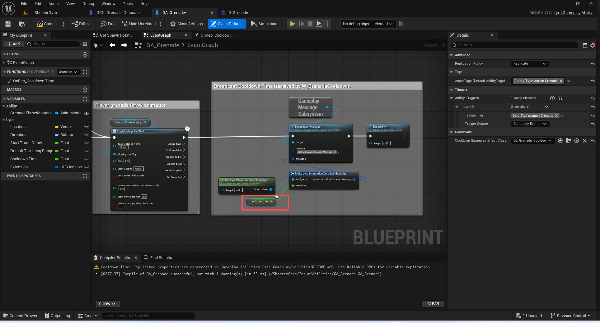

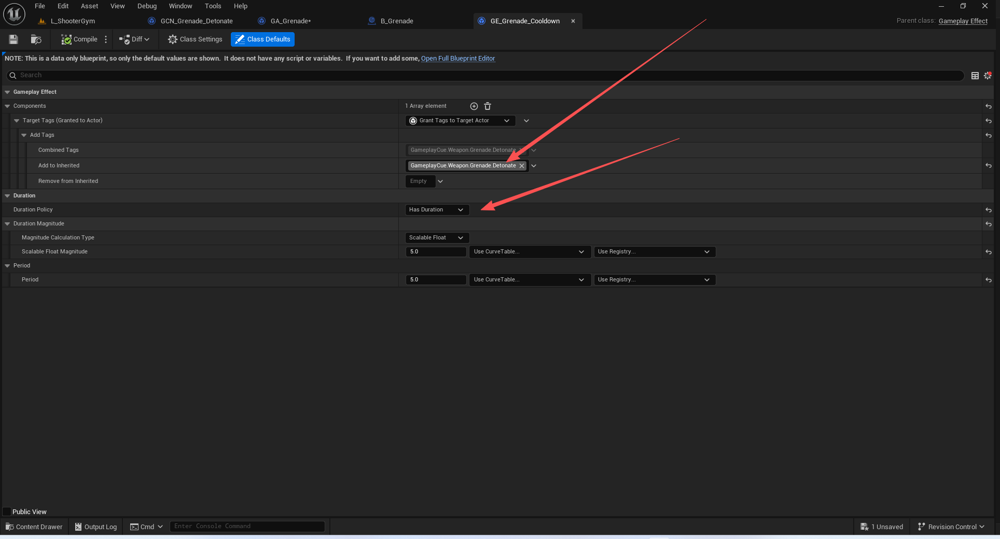

## 投掷物定义
B_Grenade
### 初始化
#### Pre stream grenade explosion
加载手榴弹的爆炸资源
``` cpp
/**
* 强制流媒体系统在指定的时间段内忽略常规逻辑，
* 而是始终加载此材质所使用的所有纹理的全部纹理层次。*
* @参数 OverrideForceMiplevelsToBeResident - 是否使用（设为 true）或忽略（设为 false）“bForceMiplevelsToBeResidentValue”参数。
* @参数 bForceMiplevelsToBeResidentValue - 真值会强制所有纹理层次都进行内存缓存。假值则让其他因素决定如何处理这些纹理层次。
* @参数 ForceDuration - 在不考虑常规优先级逻辑的情况下，将所有纹理层次保留在内存中的秒数。负值则将其关闭。
* @参数 CinematicTextureGroups - 表示应使用超高分辨率纹理层次的纹理组的位掩码。
* @参数 bFastResponse - 请务必谨慎使用！快速响应纹理会带来较大的图形处理开销，并干扰流媒体指标的计算。尽可能避免使用。*/
	UFUNCTION(BlueprintCallable, Category = "Rendering|Material")
	ENGINE_API virtual void SetForceMipLevelsToBeResident( bool OverrideForceMiplevelsToBeResident, bool bForceMiplevelsToBeResidentValue, float ForceDuration, int32 CinematicTextureGroups = 0, bool bFastResponse = false );

```

#### Prevent Pawn / Grenade from blocking one another
防止兵卒/手榴弹相互阻挡
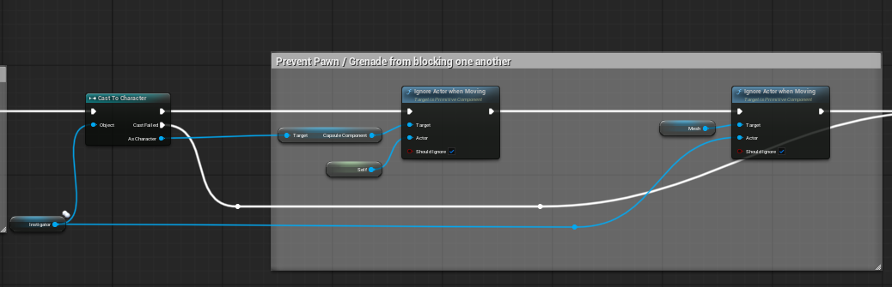

#### Re-Enabling Pawn / Grenade Collision, allow Velocity to drive Rotation
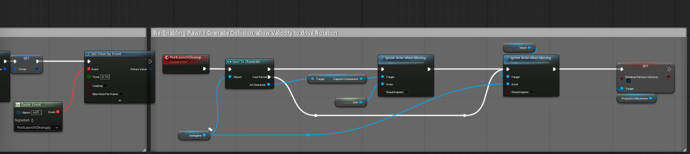


#### Setup VFX Trail with custom colors
建立尾部粒子效果
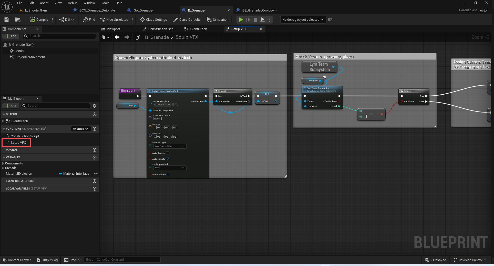

#### 定时爆炸
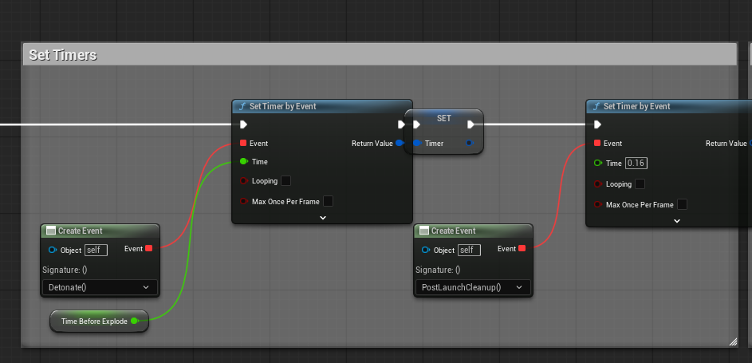

### 穿过传送门
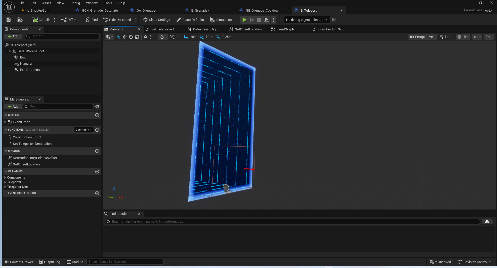

瞬移手榴弹 - 在停止移动前保持速度，解除移动状态后进行瞬移，然后将退出点的向前向量乘以所保持的速度（略微降低）以获得新的方向速度，并应用。


### 碰撞事件

碰撞事件 - 触发音频始终开启，被敌方兵种撞击时会爆炸
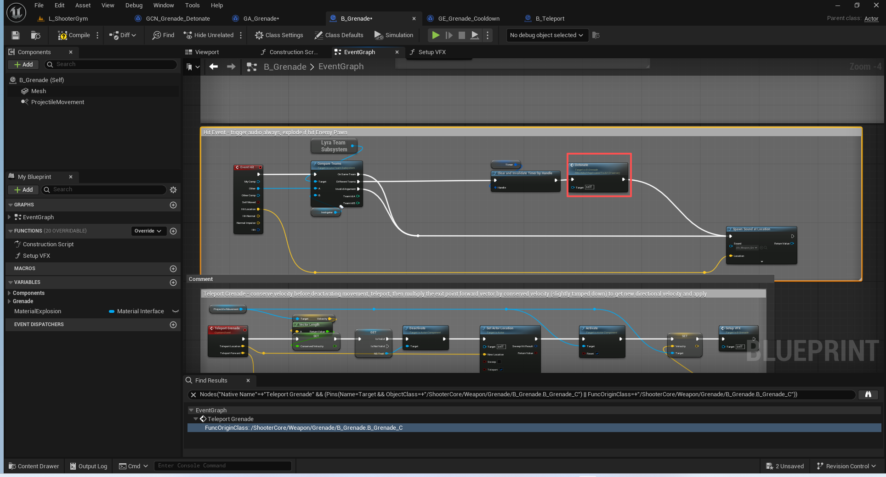

### 引爆
#### 触发特效 关闭投掷移动组件
为视觉特效、音频等设置火焰游戏提示，隐藏网格并禁用弹丸移动功能
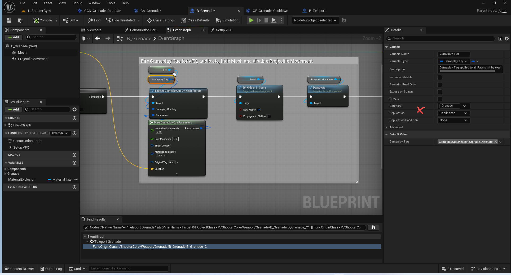

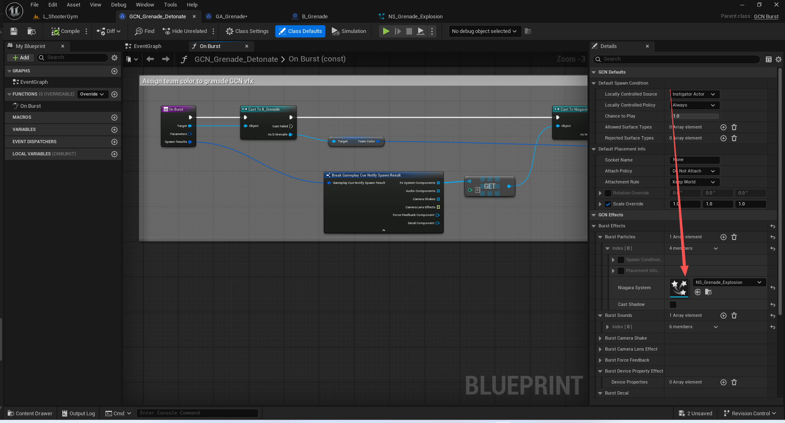
#### 重叠检测
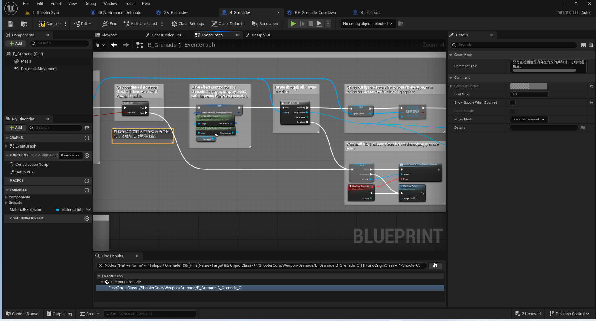
在服务器端，捕获爆炸半径内的所有兵。
为“手榴弹伤害”这一游戏效果制定相关情境设定，将投掷者设定为引发者。
遍历半径范围内的所有兵
将我们的忽略角色列表设置为包含半径范围内的所有角色，但不包括我们正在与之进行比较的那个角色。
使用“武器胶囊轨迹”功能来检查当前兵目标是否命中有效，同时忽略半径范围内的其他兵，以免它们阻挡命中效果。
对符合条件的目标施加手榴弹伤害效果
在 NS_Trail 完成之前，请不要销毁手榴弹角色。

注意这个伤害递减
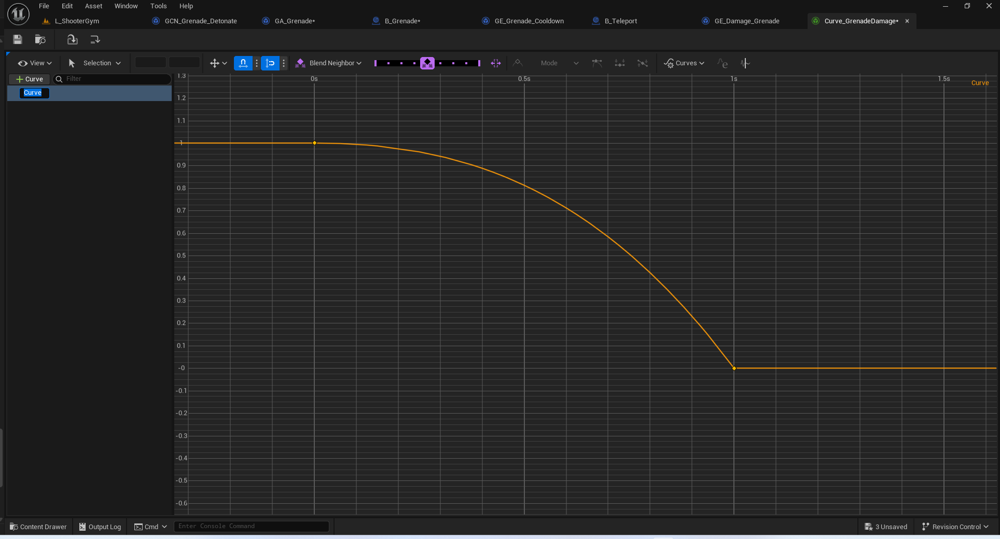
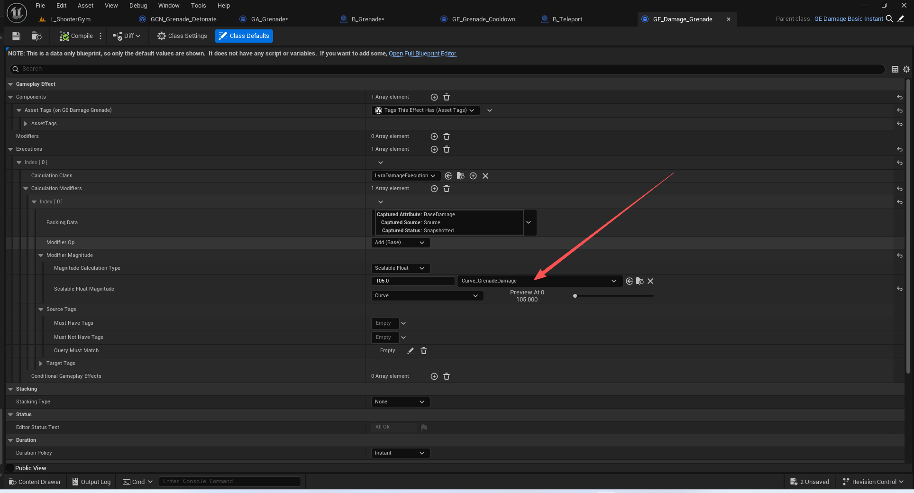


## 总结
到此基本上枪械所有系统都讲解完毕了.
目前还没有讲解队伍系统,所以有些颜色的设置可以先不处理.
还有外轮廓线绘制,换装系统的处理.
还有击杀的荣誉提示等等.