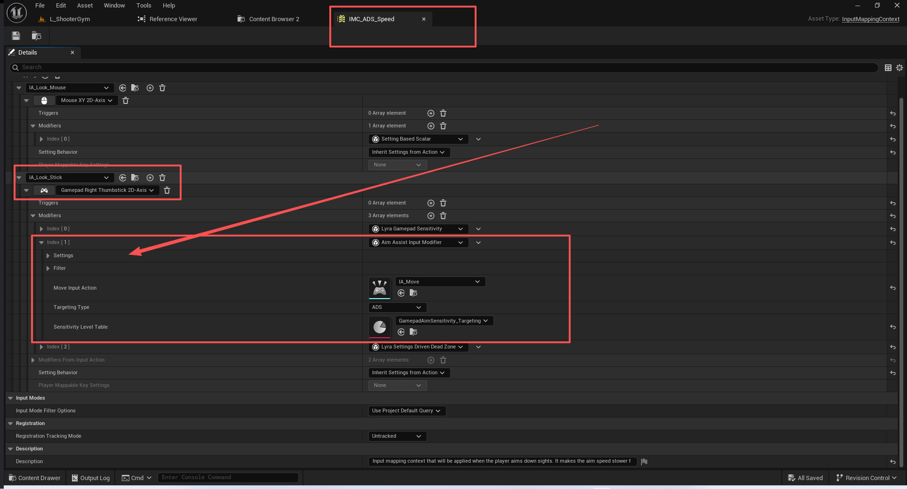
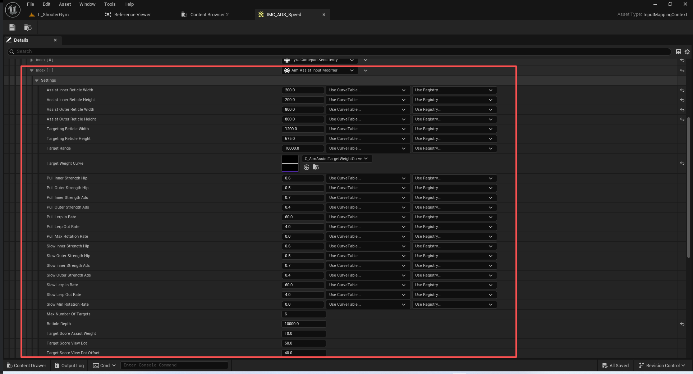
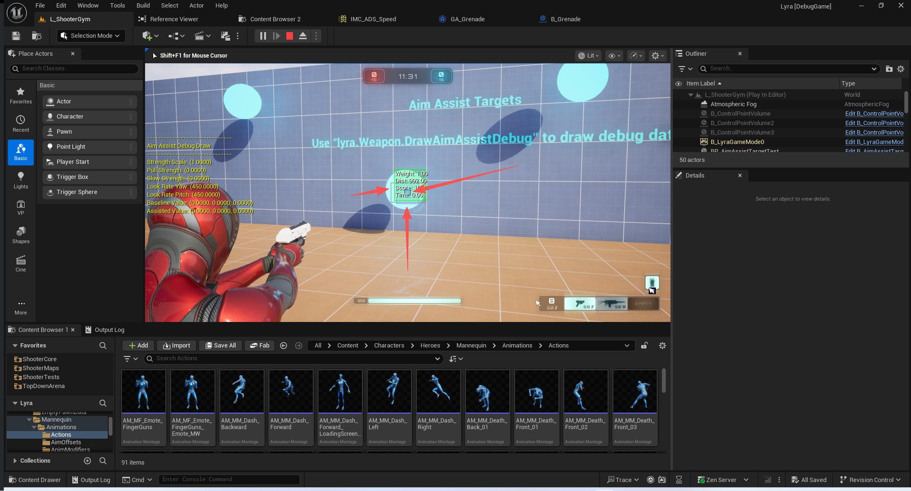
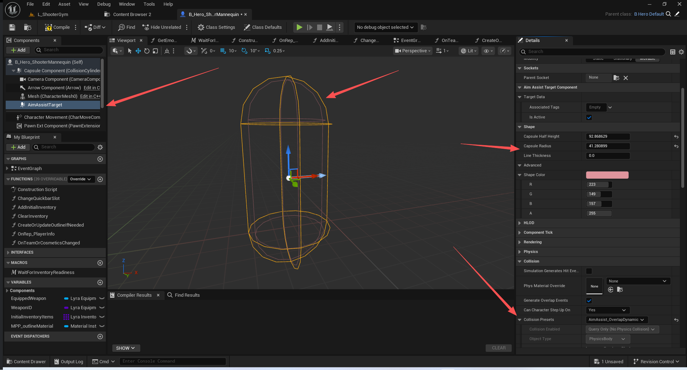
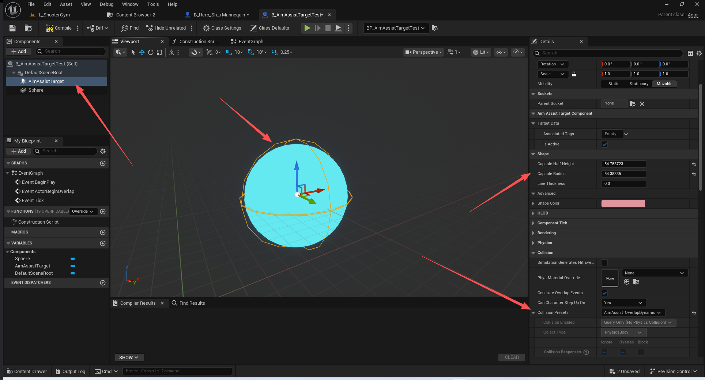
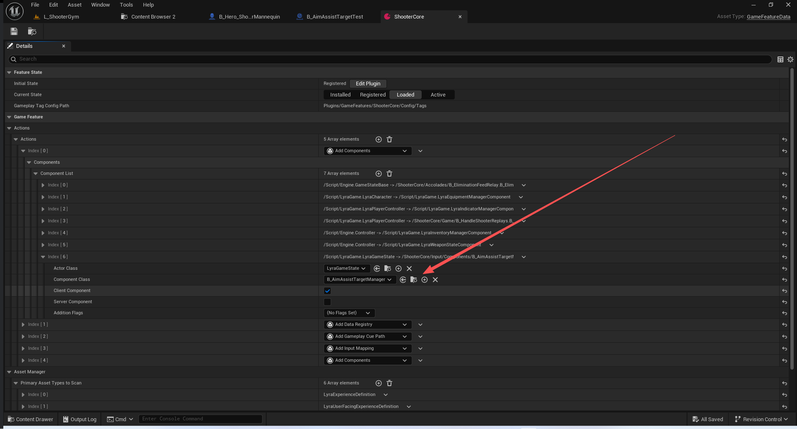
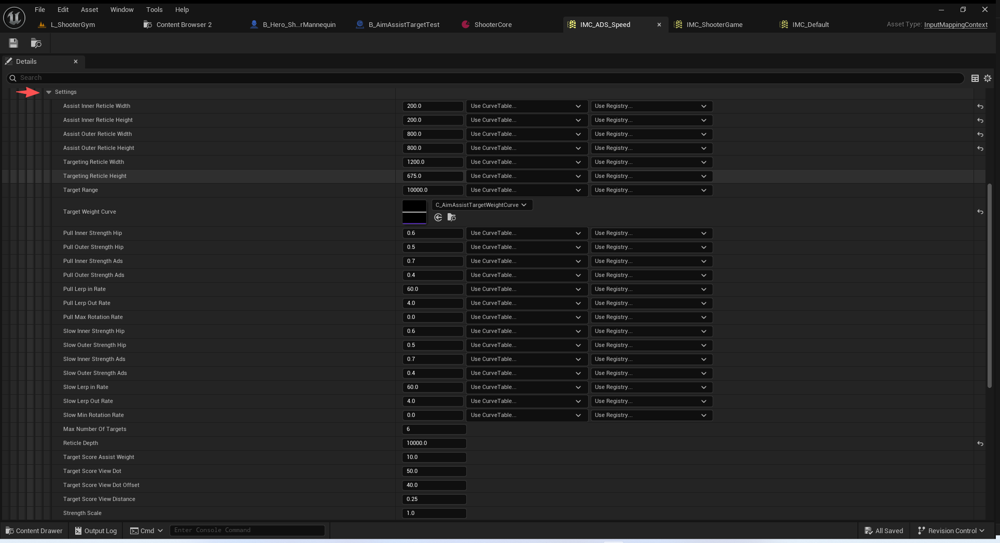
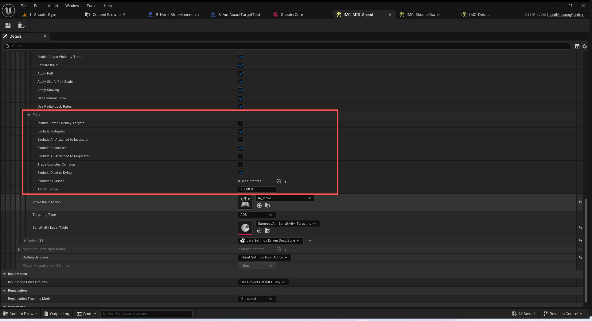

# UE5_Lyra学习指南_099_辅助射击系统

本文章仅为小刚-B站课堂-虚幻引擎视频课程Lyra-精讲的演讲手稿.  
本套课程链接:[[UE5]虚幻引擎游戏案例Lyra精讲](https://www.bilibili.com/cheese/play/ss112001159)  
前置课程链接:[[UE5]虚幻引擎UEC++从基础到进阶](https://www.bilibili.com/cheese/play/ss28043)  

文章内容由小刚撰写,采用了以下多种方式:  
1.口述转文字  
2.AI重构  
3.参考引擎源码  
4.Lyra工程源码  
5.结合社区论坛各位大佬的解析  

- [UE5\_Lyra学习指南\_099\_辅助射击系统](#ue5_lyra学习指南_099_辅助射击系统)
	- [概述](#概述)
	- [辅助射击的目标选项](#辅助射击的目标选项)
	- [辅助射击的接口定义](#辅助射击的接口定义)
	- [辅助射击的目标组件](#辅助射击的目标组件)
		- [游戏人物](#游戏人物)
		- [测试球体](#测试球体)
	- [辅助射击管理器](#辅助射击管理器)
		- [蓝图添加](#蓝图添加)
	- [辅助瞄准输入修饰](#辅助瞄准输入修饰)
		- [辅助瞄准设置](#辅助瞄准设置)
		- [辅助瞄准过滤选项](#辅助瞄准过滤选项)
		- [辅助瞄准修饰器](#辅助瞄准修饰器)
		- [视角数据](#视角数据)
		- [目标数据](#目标数据)
	- [辅助瞄准过程](#辅助瞄准过程)
		- [命令行控制](#命令行控制)
		- [调试数据绘制](#调试数据绘制)
		- [修饰输入](#修饰输入)
	- [核心计算流程](#核心计算流程)
		- [调用顺序](#调用顺序)
		- [一.帧开始获取原始输入](#一帧开始获取原始输入)
		- [二.更新视图数据 (OwnerViewData.UpdateViewData)](#二更新视图数据-ownerviewdataupdateviewdata)
		- [三.更新目标数据 (UpdateTargetData)](#三更新目标数据-updatetargetdata)
		- [四.计算旋转速度 (UpdateRotationalVelocity)](#四计算旋转速度-updaterotationalvelocity)
		- [五.将旋转速度转换为输入值](#五将旋转速度转换为输入值)
	- [添加自动瞄准](#添加自动瞄准)
	- [总结](#总结)


## 概述
本节主要讲解Lyra用于辅助射击的功能实现.
注意该效果在手柄上比较明显.如果需要应用在鼠标上面,需要添加对应的输入修饰器.





## 辅助射击的目标选项
``` cpp

USTRUCT(BlueprintType)
struct FAimAssistTargetOptions
{
	GENERATED_BODY()
	
	FAimAssistTargetOptions()
		: bIsActive(true)
	{}

	/** The shape component that should be used when considering this target's hitbox */
	/** 在考虑此目标的碰撞区域时应使用的形状组件 */
	TWeakObjectPtr<UShapeComponent> TargetShapeComponent;

	/**
	 * Gameplay tags that are associated with this target that can be used to filter it out.
	 *
	 * If the player's aim assist settings have any tags that match these, it will be excluded.
	 * 
	 * 	与该目标相关联的、可用于对其进行筛选的游戏玩法标签。*
     * 如果玩家的瞄准辅助设置中存在任何与这些条件相匹配的标签，那么该设置将被排除在外。
	 * 
	 * 
	 */
	UPROPERTY(BlueprintReadWrite, EditAnywhere)
	FGameplayTagContainer AssociatedTags;

	/** Whether or not this target is currently active. If false, it will not be considered for aim assist */
	/** 此目标当前是否处于激活状态。若为假，则不会将其纳入瞄准辅助的考虑范围 */
	UPROPERTY(BlueprintReadWrite, EditAnywhere)
	uint8 bIsActive : 1;
};
```
## 辅助射击的接口定义
``` cpp

UINTERFACE(MinimalAPI, meta = (CannotImplementInterfaceInBlueprint))
class UAimAssistTaget : public UInterface
{
	GENERATED_BODY()
};

/**
 * Used to define the shape of an aim assist target as well as let the aim assist manager know
 * about any associated gameplay tags.
 * 
 * The target will be considered when it is within the view of a player's outer reticle
 * 
 * 用于定义瞄准辅助目标的形状，并让瞄准辅助管理器知晓
 * 与之相关的任何游戏玩法标签。
 * 目标处于玩家外侧瞄准镜的视野范围内时，就会将其纳入考虑范围。
 * 
 *
 * @see UAimAssistTargetComponent for an example
 */
class IAimAssistTaget
{
	GENERATED_BODY()

public:
	/** Populate the given target data with this interface. This will be called when a target is within view of the player */
	/** 根据此接口填充给定的目标数据。当目标处于玩家视野范围内时，此方法将会被调用 */
	virtual void GatherTargetOptions(OUT FAimAssistTargetOptions& TargetData) = 0;
};

```

## 辅助射击的目标组件

``` cpp
/**
 * This component can be added to any actor to have it register with the Aim Assist Target Manager.
 * 此组件可添加至任何角色上，使其能够向“瞄准辅助目标管理器”进行注册。
 */
UCLASS(MinimalAPI, BlueprintType, meta=(BlueprintSpawnableComponent))
class UAimAssistTargetComponent : public UCapsuleComponent, public IAimAssistTaget
{
	GENERATED_BODY()

public:
	
	//~ Begin IAimAssistTaget interface
	UE_API virtual void GatherTargetOptions(OUT FAimAssistTargetOptions& TargetData) override;
	//~ End IAimAssistTaget interface
	
protected:
	
	UPROPERTY(BlueprintReadWrite, EditAnywhere)
	FAimAssistTargetOptions TargetData {};
};


```

``` cpp
void UAimAssistTargetComponent::GatherTargetOptions(FAimAssistTargetOptions& OutTargetData)
{
	if (!TargetData.TargetShapeComponent.IsValid())
	{
		if (AActor* Owner = GetOwner())
		{
			TargetData.TargetShapeComponent = Owner->FindComponentByClass<UShapeComponent>();	
		}
	}
	OutTargetData = TargetData;
}


```

### 游戏人物



### 测试球体


## 辅助射击管理器

``` cpp
/**
 * The Aim Assist Target Manager Component is used to gather all aim assist targets that are within
 * a given player's view. Targets must implement the IAimAssistTargetInterface and be on the
 * collision channel that is set in the ShooterCoreRuntimeSettings. 
 * “瞄准辅助目标管理器组件”用于收集处于特定玩家视野范围内的所有瞄准辅助目标。这些目标必须实现“IAimAssistTargetInterface”接口，并且必须位于在“射击者核心运行时设置”中所设定的碰撞通道内。
 * 
 */
UCLASS(MinimalAPI, Blueprintable)
class UAimAssistTargetManagerComponent : public UGameStateComponent
{
	GENERATED_BODY()

public:

	/** Gets all visible active targets based on the given local player and their ViewTransform */
	/** 根据给定的本地玩家及其视图变换获取所有可见的活动目标 */
	UE_API void GetVisibleTargets(const FAimAssistFilter& Filter, const FAimAssistSettings& Settings, const FAimAssistOwnerViewData& OwnerData, const TArray<FLyraAimAssistTarget>& OldTargets, OUT TArray<FLyraAimAssistTarget>& OutNewTargets);

	/** Get a Player Controller's FOV scaled based on their current input type. */
	/** 获取玩家控制器的视野范围，并根据其当前的输入类型进行缩放。*/
	static UE_API float GetFOVScale(const APlayerController* PC, ECommonInputType InputType);

	/** Get the collision channel that should be used to find targets within the player's view. */
	/** 获取应用于在玩家视野范围内查找目标的碰撞通道。*/
	UE_API ECollisionChannel GetAimAssistChannel() const;
	
protected:

	/**
	 * Returns true if the given target passes the filter based on the current player owner data.
	 * False if the given target should be excluded from aim assist calculations 
	 */
	/**
	 * 如果给定的目标符合根据当前玩家所有者数据所设定的筛选条件，则返回真；否则返回假。
	 * 如果给定的目标应被排除在瞄准辅助计算之外，则返回假。
	 * 
	 */
	UE_API bool DoesTargetPassFilter(const FAimAssistOwnerViewData& OwnerData, const FAimAssistFilter& Filter, const FAimAssistTargetOptions& Target, const float AcceptableRange) const;

	/** Determine if the given target is visible based on our current view data. */
	/** 根据当前的视图数据判断给定的目标是否可见。*/
	UE_API void DetermineTargetVisibility(FLyraAimAssistTarget& Target, const FAimAssistSettings& Settings, const FAimAssistFilter& Filter, const FAimAssistOwnerViewData& OwnerData);
	
	/** Setup CollisionQueryParams to ignore a set of actors based on filter settings. Such as Ignoring Requester or Instigator. */
	/** 通过设置碰撞查询参数，根据过滤条件来忽略一组特定的物体。例如，可以忽略发起者或煽动者。*/
	UE_API void InitTargetSelectionCollisionParams(FCollisionQueryParams& OutParams, const AActor& RequestedBy, const FAimAssistFilter& Filter) const;
};

```

### 蓝图添加


## 辅助瞄准输入修饰
### 辅助瞄准设置
``` cpp
/** Settings for how aim assist should behave when there are active targets */
/** 当存在目标时，瞄准辅助功能应如何表现的设置 */
USTRUCT(BlueprintType)
struct FAimAssistSettings
{
	GENERATED_BODY()

	FAimAssistSettings();

	float GetTargetWeightForTime(float Time) const;
	float GetTargetWeightMaxTime() const;
	
	// Width of aim assist inner reticle in world space.
	// 在世界空间中瞄准辅助内十字线的宽度。
	UPROPERTY(EditAnywhere)
	FScalableFloat AssistInnerReticleWidth;

	// Height of aim assist inner reticle in world space.
	// 在世界坐标系中瞄准辅助内标尺的高度。
	UPROPERTY(EditAnywhere)
	FScalableFloat AssistInnerReticleHeight;

	// Width of aim assist outer reticle in world space.
	// 在世界坐标系中瞄准辅助外瞄准盘的宽度。
	UPROPERTY(EditAnywhere)
	FScalableFloat AssistOuterReticleWidth;

	// Height of aim assist outer reticle in world space.
	// 在世界坐标系中瞄准辅助外瞄准标尺的高度。
	UPROPERTY(EditAnywhere)
	FScalableFloat AssistOuterReticleHeight;

	// Width of targeting reticle in world space.
	// 在世界空间中瞄准十字线的宽度。
	UPROPERTY(EditAnywhere)
	FScalableFloat TargetingReticleWidth;

	// Height of targeting reticle in world space.
	// 在世界坐标系中的瞄准十字线高度。
	UPROPERTY(EditAnywhere)
	FScalableFloat TargetingReticleHeight;

	// Range from player's camera used to gather potential targets.
	// Note: This is scaled using the field of view in order to limit targets by their screen size.
	// 从玩家视角相机中获取的范围用于筛选潜在目标。
	// 注意：此范围会根据视野大小进行缩放，以根据屏幕尺寸限制目标数量。
	UPROPERTY(EditAnywhere)
	FScalableFloat TargetRange;

	// How much weight the target has based on the time it has been targeted.  (0 = None, 1 = Max)
	// 根据目标被攻击的持续时间来确定其所承受的权重值。 (0 表示无权重，1 表示最大权重)
	UPROPERTY(EditAnywhere)
	TObjectPtr<const UCurveFloat> TargetWeightCurve = nullptr;

	// How much target and player movement contributes to the aim assist pull when target is under the inner reticle. (0 = None, 1 = Max)
	// 当目标位于内视图十字线下方时，目标和玩家的移动对瞄准辅助效果的影响程度为多少。（0 表示无影响，1 表示影响最大）
	// 在目标位于辅助瞄准内部区域时, 目标和玩家的移动对于瞄准辅助效果的影响程度 （0 表示无影响，1 表示影响最大）
	// 腰射
	UPROPERTY(EditAnywhere)
	FScalableFloat PullInnerStrengthHip;

	// How much target and player movement contributes to the aim assist pull when target is under the outer reticle. (0 = None, 1 = Max)
	// 当目标位于外侧瞄准十字线之下时，目标移动和玩家移动对瞄准辅助效果的影响程度为多少。（0 表示无影响，1 表示影响最大）
	// 当目标位于辅助瞄准区域外部区域内时,目标和玩家的移动对于瞄准辅助效果的影响程度 （0 表示无影响，1 表示影响最大）
	// 腰射
	UPROPERTY(EditAnywhere)
	FScalableFloat PullOuterStrengthHip;

	// How much target and player movement contributes to the aim assist pull when target is under the inner reticle. (0 = None, 1 = Max)
	// 当目标位于内视图十字线下方时，目标和玩家的移动对瞄准辅助效果的影响程度为多少。（0 表示无影响，1 表示影响最大）
	// 在目标位于辅助瞄准内部区域时, 目标和玩家的移动对于瞄准辅助效果的影响程度 （0 表示无影响，1 表示影响最大）
	// 开镜
	UPROPERTY(EditAnywhere)
	FScalableFloat PullInnerStrengthAds;

	// How much target and player movement contributes to the aim assist pull when target is under the outer reticle. (0 = None, 1 = Max)
	// 当目标位于辅助瞄准区域外部区域内时,目标和玩家的移动对于瞄准辅助效果的影响程度 （0 表示无影响，1 表示影响最大）
	// 开镜
	UPROPERTY(EditAnywhere)
	FScalableFloat PullOuterStrengthAds;

	// Exponential interpolation rate used to ramp up the pull strength.  Set to '0' to disable.
	// 用于逐步增强拉力的指数插值速率。将其设置为“0”可禁用此功能。
	UPROPERTY(EditAnywhere)
	FScalableFloat PullLerpInRate;

	// Exponential interpolation rate used to ramp down the pull strength.  Set to '0' to disable.
	// 用于逐步降低拉力强度的指数插值速率。将其设置为“0”可禁用该功能。
	UPROPERTY(EditAnywhere)
	FScalableFloat PullLerpOutRate;

	// Rotation rate maximum cap on amount of aim assist pull.  Set to '0' to disable.
	// Note: This is scaled based on the field of view so it feels the same regardless of zoom.
	// 旋转速率上限，用于限制瞄准辅助拉力的使用量。将其设置为“0”可禁用该功能。
	// 注意：此值是根据视野范围进行调整的，因此无论镜头放大倍数如何，其感受效果都保持一致。
	UPROPERTY(EditAnywhere)
	FScalableFloat PullMaxRotationRate;

	// Amount of aim assist slow applied to desired turn rate when target is under the inner reticle. (0 = None, 1 = Max)
	// 当目标位于内瞄准十字线之下时，针对期望转弯速率所施加的瞄准辅助减速量。（0 表示无，1 表示最大）
	UPROPERTY(EditAnywhere)
	FScalableFloat SlowInnerStrengthHip;

	// Amount of aim assist slow applied to desired turn rate when target is under the outer reticle. (0 = None, 1 = Max)
	// 当目标位于外侧瞄准十字线之下时，针对期望转弯速率所施加的瞄准辅助减速量。（0 表示无，1 表示最大）
	UPROPERTY(EditAnywhere)
	FScalableFloat SlowOuterStrengthHip;

	// Amount of aim assist slow applied to desired turn rate when target is under the inner reticle. (0 = None, 1 = Max)
	// 当目标位于内瞄准十字线之下时，针对期望转弯速率所施加的瞄准辅助减速量。（0 表示无，1 表示最大）
	UPROPERTY(EditAnywhere)
	FScalableFloat SlowInnerStrengthAds;

	// Amount of aim assist slow applied to desired turn rate when target is under the outer reticle. (0 = None, 1 = Max)
	// 当目标位于外侧瞄准十字线之下时，针对期望转弯速率所施加的瞄准辅助减速量。（0 表示无，1 表示最大）
	UPROPERTY(EditAnywhere)
	FScalableFloat SlowOuterStrengthAds;

	// Exponential interpolation rate used to ramp up the slow strength.  Set to '0' to disable.
	// 用于逐步提升缓慢强度的指数插值速率。将其设置为“0”可禁用该功能。
	UPROPERTY(EditAnywhere)
	FScalableFloat SlowLerpInRate;

	// Exponential interpolation rate used to ramp down the slow strength.  Set to '0' to disable.
	// 用于逐步降低缓慢强度的指数插值速率。将其设置为“0”可禁用该功能。
	UPROPERTY(EditAnywhere)
	FScalableFloat SlowLerpOutRate;

	// Rotation rate minimum cap on amount to aim assist slow.  Set to '0' to disable.
	// Note: This is scaled based on the field of view so it feels the same regardless of zoom.
	// 旋转速率的最低限制，用于设定辅助减速的目标值。将其设置为“0”可禁用该功能。
	// 注意：此值是根据视野范围进行调整的，因此无论镜头缩放如何，其效果都保持一致。
	UPROPERTY(EditAnywhere)
	FScalableFloat SlowMinRotationRate;
	
	/** The maximum number of targets that can be considered during a given frame. */
	/** 在某一特定帧内可被考虑的目标的最大数量。*/
	UPROPERTY(EditAnywhere)
	int32 MaxNumberOfTargets = 6;

	/**  */
	UPROPERTY(EditAnywhere)
	float ReticleDepth = 3000.0f;

	UPROPERTY(EditAnywhere)
	float TargetScore_AssistWeight = 10.0f;

	UPROPERTY(EditAnywhere)
	float TargetScore_ViewDot = 50.0f;

	UPROPERTY(EditAnywhere)
	float TargetScore_ViewDotOffset = 40.0f;

	UPROPERTY(EditAnywhere)
	float TargetScore_ViewDistance = 0.25f;

	UPROPERTY(EditAnywhere)
	float StrengthScale = 1.0f;

	/** Enabled/Disable asynchronous visibility traces. */
	/** 启用/禁用异步可见性跟踪。*/
	UPROPERTY(EditAnywhere)
	uint8 bEnableAsyncVisibilityTrace : 1;

	/** Whether or not we require input for aim assist to be applied */
	/** 我们是否需要输入目标辅助信息以使其生效 */
	UPROPERTY(EditAnywhere)
	uint8 bRequireInput : 1;

	/** Whether or not pull should be applied to aim assist */
	/** 是否应将拉力作用于瞄准辅助功能 */
	UPROPERTY(EditAnywhere)
	uint8 bApplyPull : 1;

	/** Whether or not to apply a strafe pull based off of movement input */
	/** 是否根据移动输入应用横移拉力 */
	UPROPERTY(EditAnywhere)
	uint8 bApplyStrafePullScale : 1;
	
	/** Whether or not to apply a slowing effect during aim assist */
	/** 是否在瞄准辅助过程中应用减速效果 */
	UPROPERTY(EditAnywhere)
	uint8 bApplySlowing : 1;

	/** Whether or not to apply a dynamic slow effect based off of look input */
	/** 是否根据观察输入应用动态的缓慢效果 */
	UPROPERTY(EditAnywhere)
	uint8 bUseDynamicSlow : 1;

	/** Whether or not look rates should blend between yaw and pitch based on stick deflection using radial look rates */
	/** 是否应根据操纵杆偏转情况，基于径向观测速率，在俯仰和偏航之间实现观测速率的平滑过渡 */
	UPROPERTY(EditAnywhere)
	uint8 bUseRadialLookRates : 1;
};


```


### 辅助瞄准过滤选项
``` cpp
/** Options for filtering out certain aim assist targets */
/** 用于筛选排除某些目标辅助射击选项 */
USTRUCT(BlueprintType)
struct FAimAssistFilter
{
	GENERATED_BODY()

	FAimAssistFilter()
		: bIncludeSameFriendlyTargets(false)
		, bExcludeInstigator(true)
		, bExcludeAllAttachedToInstigator(false)
		, bExcludeRequester(true)
		, bExcludeAllAttachedToRequester(false)
		, bTraceComplexCollision(false)
		, bExcludeDeadOrDying(true)
	{}

	/** If true, then we should include any targets even if they are on our team */
	/** 如果为真，则无论这些目标是否属于我们团队，我们都应将其纳入考虑范围 */
	UPROPERTY(EditAnywhere, BlueprintReadOnly)
	uint8 bIncludeSameFriendlyTargets : 1;
	
	/** Exclude 'RequestedBy->Instigator' Actor */
	/** 排除“请求者 -> 诱因方”角色对象 */
	UPROPERTY(EditAnywhere, BlueprintReadOnly, Category = TargetSelection)
	uint8 bExcludeInstigator : 1;
	
	/** Exclude all actors attached to 'RequestedBy->Instigator' Actor */
	/** 排除所有与“请求者->发起者”角色关联的演员 */
	UPROPERTY(EditAnywhere, BlueprintReadOnly, Category = TargetSelection)
	uint32 bExcludeAllAttachedToInstigator : 1;

	/** Exclude 'RequestedBy Actor */
	/** 排除“请求者角色” */
	UPROPERTY(EditAnywhere, BlueprintReadOnly, Category = TargetSelection)
	uint8 bExcludeRequester : 1;
	
	/** Exclude all actors attached to 'RequestedBy Actor */
	/** 排除所有与“请求者角色”相关的角色 */
	UPROPERTY(EditAnywhere, BlueprintReadOnly, Category = TargetSelection)
	uint8 bExcludeAllAttachedToRequester : 1;
	
	/** Trace against complex collision. */
	/** 对复杂碰撞进行追踪。*/
	UPROPERTY(EditAnywhere, BlueprintReadOnly, Category = TargetSelection)
	uint8 bTraceComplexCollision : 1;
	
	/** Exclude all dead or dying targets */
	/** 排除所有已死亡或濒临死亡的目标 */
	UPROPERTY(EditAnywhere, BlueprintReadOnly, Category = TargetSelection)
	uint8 bExcludeDeadOrDying : 1;

	/** Any target whose owning actor is of this type will be excluded. */
	/** 任何其所属角色所属类型为本类型的目标都将被排除在外。*/
	UPROPERTY(EditAnywhere, BlueprintReadOnly)
	TSet<TObjectPtr<UClass>> ExcludedClasses;

	/** Targets with any of these tags will be excluded. */
	/** 具有以下任何标签的目标将被排除在外。*/
	FGameplayTagContainer ExclusionGameplayTags;

	/** Any target outside of this range will be excluded */
	/** 超出此范围的任何目标都将被排除在外 */
	UPROPERTY(EditAnywhere, BlueprintReadOnly)
	double TargetRange = 10000.0;
};

```



### 辅助瞄准修饰器
``` cpp
/**
 * An input modifier to help gamepad players have better targeting.
 * 一种输入调节器，旨在帮助游戏手柄玩家实现更精准的瞄准。
 */
UCLASS()
class UAimAssistInputModifier : public UInputModifier
{
	GENERATED_BODY()
	
public:
		
	UPROPERTY(EditInstanceOnly, BlueprintReadWrite, Category=Settings, Config)
	FAimAssistSettings Settings {};

	UPROPERTY(EditInstanceOnly, BlueprintReadWrite, Category=Settings, Config)
	FAimAssistFilter Filter {};

	/** The input action that represents the actual movement of the player */
	/** 表示玩家实际移动动作的输入操作 */
	UPROPERTY(EditInstanceOnly, BlueprintReadWrite, Category=Settings)
	TObjectPtr<const UInputAction> MoveInputAction = nullptr;
	
	/** The type of targeting to use for this Sensitivity */
	/** 用于此敏感度设置的定位类型 */
	UPROPERTY(EditInstanceOnly, BlueprintReadWrite, Category=Settings, Config)
	ELyraTargetingType TargetingType = ELyraTargetingType::Normal;

	/** Asset that gives us access to the float scalar value being used for sensitivty */
	/** 该资产使我们能够获取用于灵敏度计算的浮点数值 */
	UPROPERTY(EditAnywhere, BlueprintReadOnly, meta=(AssetBundles="Client,Server"))
	TObjectPtr<const ULyraAimSensitivityData> SensitivityLevelTable = nullptr;
	
protected:
	
	// 重写入口
	virtual FInputActionValue ModifyRaw_Implementation(const UEnhancedPlayerInput* PlayerInput, FInputActionValue CurrentValue, float DeltaTime) override;

	/**
	* Swaps the target cache's and determines what targets are currently visible.
	* Updates the score of each target to determine
	* how much pull/slow effect should be applied to each
	* 
	* 交换目标缓存的内容，并确定当前哪些目标是可见的。
	* 更新每个目标的得分，以确定
	* 应对每个目标施加何种吸引力/减速效果。
	* 
	*/
	void UpdateTargetData(float DeltaTime);

	FRotator UpdateRotationalVelocity(APlayerController* PC, float DeltaTime, FVector CurrentLookInputValue, FVector CurrentMoveInputValue);

	/** Calcualte the pull and slow strengh of a given target */
	/** 计算给定目标的拉力和减速力 */
	void CalculateTargetStrengths(const FLyraAimAssistTarget& Target, float& OutPullStrength, float& OutSlowStrength) const;

	FRotator GetLookRates(const FVector& LookInput);
	
	void SwapTargetCaches() { TargetCacheIndex ^= 1; }
	const TArray<FLyraAimAssistTarget>& GetPreviousTargetCache() const	{ return ((TargetCacheIndex == 0) ? TargetCache1 : TargetCache0); }
	TArray<FLyraAimAssistTarget>& GetPreviousTargetCache()				{ return ((TargetCacheIndex == 0) ? TargetCache1 : TargetCache0); }

	const TArray<FLyraAimAssistTarget>& GetCurrentTargetCache() const	{ return ((TargetCacheIndex == 0) ? TargetCache0 : TargetCache1); }
	TArray<FLyraAimAssistTarget>& GetCurrentTargetCache()				{ return ((TargetCacheIndex == 0) ? TargetCache0 : TargetCache1); }

	bool HasAnyCurrentTargets() const { return !GetCurrentTargetCache().IsEmpty(); }

	const float GetSensitivtyScalar(const ULyraSettingsShared* SharedSettings) const;
	
	// Tracking of the current and previous frame's targets
	// 对当前帧和前一帧目标的追踪
	UPROPERTY()
	TArray<FLyraAimAssistTarget> TargetCache0;

	UPROPERTY()
	TArray<FLyraAimAssistTarget> TargetCache1;

	/** The current in use target cache */
	/** 当前正在使用的目标缓存 */
	uint32 TargetCacheIndex;

	FAimAssistOwnerViewData OwnerViewData;

	float LastPullStrength = 0.0f;
	float LastSlowStrength = 0.0f;
	
#if ENABLE_DRAW_DEBUG
	float LastLookRateYaw;
	float LastLookRatePitch;

	FVector LastOutValue;
	FVector LastBaselineValue;

	// TODO: Remove this variable and move debug visualization out of this 
	// 注意：请删除此变量，并将调试可视化功能移出此部分。
	bool bRegisteredDebug = false;

	void AimAssistDebugDraw(class UCanvas* Canvas, APlayerController* PC);
	FDelegateHandle	DebugDrawHandle;
#endif
};


```
### 视角数据
``` cpp

/** A container for some commonly used viewport data based on the current pawn */
/** 一个基于当前角色的常用视口数据容器 */
struct FAimAssistOwnerViewData
{
	FAimAssistOwnerViewData() { ResetViewData(); }

	/**
	 * Update the "owner" information based on our current player controller. This calculates and stores things like the view matrix
	 * and current rotation that is used to determine what targets are visible
	 * 
	 * 根据我们当前的玩家控制器更新“所有者”信息。这会计算并存储诸如视图矩阵和当前旋转角度等数据，这些数据用于确定哪些目标是可见的。
	 * 
	 */
	void UpdateViewData(const APlayerController* PC);

	/** Reset all the properties on this set of data to their defaults */
	/** 将此数据集中的所有属性重置为默认值 */
	void ResetViewData();

	/** Returns true if this owner struct has a valid player controller */
	/** 如果此所有者结构体拥有有效的玩家控制器，则返回 true */
	bool IsDataValid() const { return PlayerController != nullptr && LocalPlayer != nullptr; }

	FBox2D ProjectReticleToScreen(float ReticleWidth, float ReticleHeight, float ReticleDepth) const;
	FBox2D ProjectBoundsToScreen(const FBox& Bounds) const;
	FBox2D ProjectShapeToScreen(const FCollisionShape& Shape, const FVector& ShapeOrigin, const FTransform& WorldTransform) const;
	FBox2D ProjectBoxToScreen(const FCollisionShape& Shape, const FVector& ShapeOrigin, const FTransform& WorldTransform) const;
	FBox2D ProjectSphereToScreen(const FCollisionShape& Shape, const FVector& ShapeOrigin, const FTransform& WorldTransform) const;
	FBox2D ProjectCapsuleToScreen(const FCollisionShape& Shape, const FVector& ShapeOrigin, const FTransform& WorldTransform) const;

	/** Pointer to the player controller that can be used to calculate the data we need to check for visible targets */
	/** 指向玩家控制器的指针，该指针可用于计算我们所需的用于检查可见目标的数据 */
	const APlayerController* PlayerController = nullptr;

	const ULocalPlayer* LocalPlayer = nullptr;
	
	FMatrix ProjectionMatrix = FMatrix::Identity;
	
	FMatrix ViewProjectionMatrix = FMatrix::Identity;
	
	FIntRect ViewRect = FIntRect(0, 0, 0, 0);
	
	FTransform ViewTransform = FTransform::Identity;
	
	FVector ViewForward = FVector::ZeroVector;
	
	// Player transform is the actor's location and the controller's rotation.
	// 玩家的变换数据即为角色所在的位置以及控制器的旋转角度。
	FTransform PlayerTransform = FTransform::Identity;
	
	FTransform PlayerInverseTransform = FTransform::Identity;

	/** The movement delta between the current frame and the last */
	/** 当前帧与上一帧之间的移动增量 */
	FVector DeltaMovement = FVector::ZeroVector;

	/** The ID of the team that this owner is from. It is populated from the ALyraPlayerState. If the owner does not have a player state, then it will be INDEX_NONE */
	/** 该所有者所属团队的团队编号。该编号是从“ALyraPlayerState”中获取的。如果该所有者没有玩家状态，则该编号将为“INDEX_NONE” */
	int32 TeamID = INDEX_NONE;
};

```
### 目标数据
``` cpp

/** A container for keeping the state of targets between frames that can be cached */
/** 用于在不同帧之间保存目标状态的容器，该状态可被缓存 */
USTRUCT(BlueprintType)
struct FLyraAimAssistTarget
{
	GENERATED_BODY()

	FLyraAimAssistTarget() { ResetTarget(); }

	bool IsTargetValid() const { return TargetShapeComponent.IsValid(); }

	void ResetTarget();

	FRotator GetRotationFromMovement(const FAimAssistOwnerViewData& OwnerInfo) const;
	
	TWeakObjectPtr<UShapeComponent> TargetShapeComponent;
	
	FVector Location = FVector::ZeroVector;
	FVector DeltaMovement = FVector::ZeroVector;
	FBox2D ScreenBounds;

	float ViewDistance = 0.0f;
	float SortScore = 0.0f;

	float AssistTime = 0.0f;
	float AssistWeight = 0.0f;

	FTraceHandle VisibilityTraceHandle;
	
	uint8 bIsVisible : 1;
	
	uint8 bUnderAssistInnerReticle : 1;
	
	uint8 bUnderAssistOuterReticle : 1;
	
protected:

	float CalculateRotationToTarget2D(float TargetX, float TargetY, float OffsetY) const;
};
```


## 辅助瞄准过程
### 命令行控制
``` cpp
namespace LyraConsoleVariables
{
	static bool bEnableAimAssist = true;
	static FAutoConsoleVariableRef CVarEnableAimAssist(
		TEXT("lyra.Weapon.EnableAimAssist"),
		bEnableAimAssist,
		TEXT("Should we enable aim assist while shooting?"),
		ECVF_Cheat);

	static bool bDrawAimAssistDebug = false;
	static FAutoConsoleVariableRef CVarDrawAimAssistDebug(
		TEXT("lyra.Weapon.DrawAimAssistDebug"),
		bDrawAimAssistDebug,
		TEXT("Should we draw some debug stats about aim assist?"),
		ECVF_Cheat);
}

```
### 调试数据绘制
``` cpp
#if ENABLE_DRAW_DEBUG
void UAimAssistInputModifier::AimAssistDebugDraw(UCanvas* Canvas, APlayerController* PC)
{
	if (!Canvas || !OwnerViewData.IsDataValid() || !LyraConsoleVariables::bDrawAimAssistDebug)
	{
		return;
	}

	const bool bIsADS = (TargetingType == ELyraTargetingType::ADS);
	
	FDisplayDebugManager& DisplayDebugManager = Canvas->DisplayDebugManager;
	DisplayDebugManager.Initialize(Canvas, GEngine->GetSmallFont(), FVector2D((bIsADS ? 4.0f : 170.0f), 150.0f));
	DisplayDebugManager.SetDrawColor(FColor::Yellow);

	DisplayDebugManager.DrawString(FString(TEXT("------------------------------")));
	DisplayDebugManager.DrawString(FString(TEXT("Aim Assist Debug Draw")));
	DisplayDebugManager.DrawString(FString(TEXT("------------------------------")));
	DisplayDebugManager.DrawString(FString::Printf(TEXT("Strength Scale: (%.4f)"), Settings.StrengthScale));
	DisplayDebugManager.DrawString(FString::Printf(TEXT("Pull Strength: (%.4f)"), LastPullStrength));
	DisplayDebugManager.DrawString(FString::Printf(TEXT("Slow Strength: (%.4f)"), LastSlowStrength));
	DisplayDebugManager.DrawString(FString::Printf(TEXT("Look Rate Yaw: (%.4f)"), LastLookRateYaw));
	DisplayDebugManager.DrawString(FString::Printf(TEXT("Look Rate Pitch: (%.4f)"), LastLookRatePitch));
	DisplayDebugManager.DrawString(FString::Printf(TEXT("Baseline Value: (%.4f, %.4f, %.4f)"), LastBaselineValue.X, LastBaselineValue.Y, LastBaselineValue.Z));
	DisplayDebugManager.DrawString(FString::Printf(TEXT("Assisted Value: (%.4f, %.4f, %.4f)"), LastOutValue.X, LastOutValue.Y, LastOutValue.Z));

	
	UWorld* World = OwnerViewData.PlayerController->GetWorld();
	check(World);

	const FBox2D AssistInnerReticleBounds = OwnerViewData.ProjectReticleToScreen(Settings.AssistInnerReticleWidth.GetValue(), Settings.AssistInnerReticleHeight.GetValue(), Settings.ReticleDepth);
	const FBox2D AssistOuterReticleBounds = OwnerViewData.ProjectReticleToScreen(Settings.AssistOuterReticleWidth.GetValue(), Settings.AssistOuterReticleHeight.GetValue(), Settings.ReticleDepth);
	const FBox2D TargetingReticleBounds = OwnerViewData.ProjectReticleToScreen(Settings.TargetingReticleWidth.GetValue(), Settings.TargetingReticleHeight.GetValue(), Settings.ReticleDepth);

	if (TargetingReticleBounds.bIsValid)
	{
		FLinearColor ReticleColor(0.25f, 0.25f, 0.25f, 1.0f);
		DrawDebugCanvas2DBox(Canvas, TargetingReticleBounds, ReticleColor, 1.0f);	
	}

	if (AssistInnerReticleBounds.bIsValid)
	{
		FLinearColor ReticleColor(0.0f, 0.0f, 1.0f, 0.2f);

		FCanvasTileItem ReticleTileItem(AssistInnerReticleBounds.Min, AssistInnerReticleBounds.GetSize(), ReticleColor);
		ReticleTileItem.BlendMode = SE_BLEND_Translucent;
		Canvas->DrawItem(ReticleTileItem);

		ReticleColor.A = 1.0f;
		DrawDebugCanvas2DBox(Canvas, AssistInnerReticleBounds, ReticleColor, 1.0f);
	}

	if (AssistOuterReticleBounds.bIsValid)
	{
		FLinearColor ReticleColor(0.25f, 0.25f, 1.0f, 0.2f);

		FCanvasTileItem ReticleTileItem(AssistOuterReticleBounds.Min, AssistOuterReticleBounds.GetSize(), ReticleColor);
		ReticleTileItem.BlendMode = SE_BLEND_Translucent;
		Canvas->DrawItem(ReticleTileItem);

		ReticleColor.A = 1.0f;
		DrawDebugCanvas2DBox(Canvas, AssistOuterReticleBounds, ReticleColor, 1.0f);
	}

	const TArray<FLyraAimAssistTarget>& TargetCache = GetCurrentTargetCache();
	for (const FLyraAimAssistTarget& Target : TargetCache)
	{
		if (Target.ScreenBounds.bIsValid)
		{
			FLinearColor TargetColor = ((Target.AssistWeight > 0.0f) ? FLinearColor::LerpUsingHSV(FLinearColor::Yellow, FLinearColor::Green, Target.AssistWeight) : FLinearColor::Black);
			TargetColor.A = 0.2f;

			FCanvasTileItem TargetTileItem(Target.ScreenBounds.Min, Target.ScreenBounds.GetSize(), TargetColor);
			TargetTileItem.BlendMode = SE_BLEND_Translucent;
			Canvas->DrawItem(TargetTileItem);

			if (Target.bIsVisible)
			{
				TargetColor.A = 1.0f;
				DrawDebugCanvas2DBox(Canvas, Target.ScreenBounds, TargetColor, 1.0f);
			}

			FCanvasTextItem TargetTextItem(FVector2D::ZeroVector, FText::FromString(FString::Printf(TEXT("Weight: %.2f\nDist: %.2f\nScore: %.2f\nTime: %.2f"), Target.AssistWeight, Target.ViewDistance, Target.SortScore, Target.AssistTime)), GEngine->GetSmallFont(), FLinearColor::White);
			TargetTextItem.EnableShadow(FLinearColor::Black);
			Canvas->DrawItem(TargetTextItem, FVector2D(FMath::CeilToFloat(Target.ScreenBounds.Min.X), FMath::CeilToFloat(Target.ScreenBounds.Min.Y)));
		}
	}
}
#endif	// ENABLE_DRAW_DEBUG


```

### 修饰输入
``` cpp

FInputActionValue UAimAssistInputModifier::ModifyRaw_Implementation(const UEnhancedPlayerInput* PlayerInput, FInputActionValue CurrentValue, float DeltaTime)
{
	TRACE_CPUPROFILER_EVENT_SCOPE(UAimAssistInputModifier::ModifyRaw_Implementation);

#if ENABLE_DRAW_DEBUG
	if (LyraConsoleVariables::bDrawAimAssistDebug)
	{
		if (!DebugDrawHandle.IsValid())
		{
			DebugDrawHandle = UDebugDrawService::Register(TEXT("Game"), FDebugDrawDelegate::CreateUObject(this, &UAimAssistInputModifier::AimAssistDebugDraw));
		}
		else
		{
			UDebugDrawService::Unregister(DebugDrawHandle);
			DebugDrawHandle.Reset();
		}
		bRegisteredDebug = true;
	}
#endif

#if !UE_BUILD_SHIPPING
	if (!LyraConsoleVariables::bEnableAimAssist)
	{
		return CurrentValue;
	}
#endif //UE_BUILD_SHIPPING

	APlayerController* PC = PlayerInput ? Cast<APlayerController>(PlayerInput->GetOuter()) : nullptr;
	if (!PC)
	{
		return CurrentValue;
	}

	// Update the "owner" information based on our current player controller. This calculates and stores things like the view matrix
	// and current rotation that is used to determine what targets are visible
	// 根据当前的玩家控制器更新“所有者”信息。这会计算并存储诸如视图矩阵和当前旋转角度等数据，这些数据用于确定哪些目标是可见的。
	OwnerViewData.UpdateViewData(PC);

	if (!OwnerViewData.IsDataValid())
	{
		return CurrentValue;
	}
	
	// Swaps the target cache's and determines what targets are currently visible. Updates the score of each target to determine
	// how much pull/slow effect should be applied to each
	// 交换目标缓存，并确定当前哪些目标是可见的。更新每个目标的得分，以确定应为每个目标施加何种吸引/减速效果。
	UpdateTargetData(DeltaTime);

	FVector BaselineInput = CurrentValue.Get<FVector>();
	
	FVector OutAssistedInput = BaselineInput;
	FVector CurrentMoveInput = MoveInputAction ? PlayerInput->GetActionValue(MoveInputAction).Get<FVector>() : FVector::ZeroVector;	

	// Something about the look rates is incorrect
	// 关于注视率的部分数据存在错误
	FRotator LookRates = GetLookRates(BaselineInput);
	
	const FRotator RotationalVelocity = UpdateRotationalVelocity(PC, DeltaTime, BaselineInput, CurrentMoveInput);
	
	if (LookRates.Yaw > 0.0f)
	{
		OutAssistedInput.X = (RotationalVelocity.Yaw / LookRates.Yaw);
		OutAssistedInput.X = FMath::Clamp(OutAssistedInput.X, -1.0f, 1.0f);
	}
	
	if (LookRates.Pitch > 0.0f)
	{
		OutAssistedInput.Y = (RotationalVelocity.Pitch / LookRates.Pitch);
		OutAssistedInput.Y = FMath::Clamp(OutAssistedInput.Y, -1.0f, 1.0f);
	}

#if ENABLE_DRAW_DEBUG
	LastBaselineValue = BaselineInput;
	LastLookRatePitch = LookRates.Pitch;
	LastLookRateYaw = LookRates.Yaw;
	LastOutValue = OutAssistedInput;
#endif
	return OutAssistedInput;
}

```
## 核心计算流程
### 调用顺序
1.帧开始：ModifyRaw_Implementation 被调用
2.视图更新：OwnerViewData.UpdateViewData(PC)
获取玩家视角矩阵
计算视图投影矩阵
更新玩家变换和逆变换
3.目标更新：UpdateTargetData(DeltaTime)
获取目标管理器
交换目标缓存（双缓冲）
TargetManager->GetVisibleTargets(...)
计算FOV缩放和投影
执行物理重叠检测
收集目标数据
筛选和排序目标
执行可见性检测
更新目标权重和时间
归一化目标权重
4.旋转计算：UpdateRotationalVelocity(...)
计算死区和灵敏度
遍历目标，累积旋转需求和强度
应用全局缩放和插值
应用拉力效果（Pull）
应用减速效果（Slow）
5.输入转换：将旋转速度转换为标准化输入值
6.帧结束：返回修改后的输入值

### 一.帧开始获取原始输入

``` cpp

FInputActionValue UAimAssistInputModifier::ModifyRaw_Implementation(const UEnhancedPlayerInput* PlayerInput, FInputActionValue CurrentValue, float DeltaTime)
{
	TRACE_CPUPROFILER_EVENT_SCOPE(UAimAssistInputModifier::ModifyRaw_Implementation);

#if ENABLE_DRAW_DEBUG
	// 调试开关检查（略过）
	if (LyraConsoleVariables::bDrawAimAssistDebug)
	{
		if (!DebugDrawHandle.IsValid())
		{
			DebugDrawHandle = UDebugDrawService::Register(TEXT("Game"), FDebugDrawDelegate::CreateUObject(this, &UAimAssistInputModifier::AimAssistDebugDraw));
		}
		else
		{
			UDebugDrawService::Unregister(DebugDrawHandle);
			DebugDrawHandle.Reset();
		}
		bRegisteredDebug = true;
	}
#endif
    // 检查全局控制变量
#if !UE_BUILD_SHIPPING
	if (!LyraConsoleVariables::bEnableAimAssist)
	{
		return CurrentValue;
	}
#endif //UE_BUILD_SHIPPING

	APlayerController* PC = PlayerInput ? Cast<APlayerController>(PlayerInput->GetOuter()) : nullptr;
	if (!PC)
	{
		return CurrentValue;
		// 没有有效的玩家控制器，直接返回
	}
	// ..
}
```
### 二.更新视图数据 (OwnerViewData.UpdateViewData)

``` cpp
	// Update the "owner" information based on our current player controller. This calculates and stores things like the view matrix
	// and current rotation that is used to determine what targets are visible
	// 根据当前的玩家控制器更新“所有者”信息。这会计算并存储诸如视图矩阵和当前旋转角度等数据，这些数据用于确定哪些目标是可见的。
	OwnerViewData.UpdateViewData(PC);

	if (!OwnerViewData.IsDataValid())
	{
		return CurrentValue;
	}

```

// 检查数据有效性
``` cpp
void FAimAssistOwnerViewData::UpdateViewData(const APlayerController* PC) {
    FSceneViewProjectionData ProjectionData;
    PlayerController = PC;
    LocalPlayer = PlayerController ? PlayerController->GetLocalPlayer() : nullptr;
    
    if (!IsDataValid() || !PlayerController || !LocalPlayer) {
        ResetViewData();  // 重置数据
        return;
    }

```
// 获取Pawn和视图数据
``` cpp
    const APawn* Pawn = Cast<APawn>(PlayerController->GetPawn());
    
    if (!Pawn || !LocalPlayer || !LocalPlayer->ViewportClient || 
        !LocalPlayer->GetProjectionData(LocalPlayer->ViewportClient->Viewport, ProjectionData)) {
        ResetViewData();
        return;
    }

```
// 计算视图矩阵和变换

``` cpp

    // 获取玩家当前视角位置和旋转
    FVector ViewLocation;
    FRotator ViewRotation;
    PC->GetPlayerViewPoint(ViewLocation, ViewRotation);
    
    // 存储投影矩阵和视图投影矩阵
    ProjectionMatrix = ProjectionData.ProjectionMatrix;
    ViewProjectionMatrix = ProjectionData.ComputeViewProjectionMatrix();  // 关键：视图×投影矩阵
    ViewRect = ProjectionData.GetConstrainedViewRect();
    
    // 创建视图变换（位置+旋转）
    ViewTransform = FTransform(ViewRotation, ViewLocation);
    ViewForward = ViewTransform.GetUnitAxis(EAxis::X);  // 前向向量
    
    // 计算玩家移动
    const FVector OldLocation = PlayerTransform.GetTranslation();
    const FVector NewLocation = Pawn->GetActorLocation();
    const FRotator NewRotation = PC->GetControlRotation();
    
    PlayerTransform = FTransform(NewRotation, NewLocation);
    PlayerInverseTransform = PlayerTransform.Inverse();  // 逆变换，用于局部坐标转换
    
    DeltaMovement = (NewLocation - OldLocation);  // 玩家移动增量
    
    // 获取队伍ID
    if (ALyraPlayerState* LyraPS = PlayerController->GetPlayerState<ALyraPlayerState>()) {
        TeamID = LyraPS->GetTeamId();
    } else {
        TeamID = INDEX_NONE;
    }
}
```
返回 ModifyRaw_Implementation 继续执行...
### 三.更新目标数据 (UpdateTargetData)

``` cpp

// 调用 UpdateTargetData(DeltaTime)
UpdateTargetData(DeltaTime);
```

// 获取目标管理器
``` cpp
void UAimAssistInputModifier::UpdateTargetData(float DeltaTime) {
    if(!ensure(OwnerViewData.PlayerController)) {
        UE_LOG(LogAimAssist, Error, TEXT("[UAimAssistInputModifier::UpdateTargetData] Invalid player controller!"));
        return;
    }
    
    UAimAssistTargetManagerComponent* TargetManager = nullptr;
    
    // 从GameState中查找目标管理器
    if (UWorld* World = OwnerViewData.PlayerController->GetWorld()) {
        if (AGameStateBase* GameState = World->GetGameState()) {
            TargetManager = GameState->FindComponentByClass<UAimAssistTargetManagerComponent>();    
        }
    }
    
    if (!TargetManager) {
        return;  // 没有目标管理器，无法继续
    }

```

// 交互目标缓存
``` cpp
    // 交换目标缓存（双缓冲机制）
    SwapTargetCaches();  // 执行 TargetCacheIndex ^= 1;
    const TArray<FLyraAimAssistTarget>& OldTargetCache = GetPreviousTargetCache();  // 上一帧目标
    TArray<FLyraAimAssistTarget>& NewTargetCache = GetCurrentTargetCache();  // 当前帧目标（待填充）
```
获取可见目标
``` cpp
	// 调用目标管理器获取可见目标
	TargetManager->GetVisibleTargets(Filter, Settings, OwnerViewData, OldTargetCache, NewTargetCache);

```
目标管理器获取可见目标流程 (UAimAssistTargetManagerComponent::GetVisibleTargets)
```cpp
void UAimAssistTargetManagerComponent::GetVisibleTargets(const FAimAssistFilter& Filter, const FAimAssistSettings& Settings, const FAimAssistOwnerViewData& OwnerData, const TArray<FLyraAimAssistTarget>& OldTargets, OUT TArray<FLyraAimAssistTarget>& OutNewTargets)
{
	TRACE_CPUPROFILER_EVENT_SCOPE(UAimAssistTargetManagerComponent::GetVisibleTargets);
	OutNewTargets.Reset();
	const APlayerController* PC = OwnerData.PlayerController;
	
	// 初始化检查
	
	if (!PC)
	{
		UE_LOG(LogAimAssist, Error, TEXT("Invalid player controller passed to GetVisibleTargets!"));
		return;
	}

	const APawn* OwnerPawn = PC->GetPawn();

	if (!OwnerPawn)
	{
		UE_LOG(LogAimAssist, Error, TEXT("Could not find a valid pawn for aim assist!"));
		return;	
	}
	// 计算FOV缩放和投影参数
	
	const FVector ViewLocation = OwnerData.ViewTransform.GetTranslation();
	const FVector ViewForward = OwnerData.ViewTransform.GetUnitAxis(EAxis::X);
	
	// 计算FOV缩放（根据输入类型）
	const float FOVScale = GetFOVScale(PC, ECommonInputType::Gamepad);
	const float InvFieldOfViewScale = (FOVScale > 0.0f) ? (1.0f / FOVScale) : 1.0f;
	const float TargetRange = (Settings.TargetRange.GetValue() * InvFieldOfViewScale);
	
	// 计算瞄准镜深度（考虑FOV缩放）
	// Use the field of view to scale the reticle projection.  This maintains the same reticle size regardless of field of view.
	// 利用视场范围来调整瞄准镜的投影效果。这样无论视场范围如何变化，瞄准镜的尺寸都能保持不变。
	const float ReticleDepth = (Settings.ReticleDepth * InvFieldOfViewScale);

	// 计算三个瞄准区域在屏幕上的投影
	// Calculate the bounds of this reticle in screen space
	const FBox2D AssistInnerReticleBounds = OwnerData.ProjectReticleToScreen(Settings.AssistInnerReticleWidth.GetValue(), Settings.AssistInnerReticleHeight.GetValue(), ReticleDepth);
	const FBox2D AssistOuterReticleBounds = OwnerData.ProjectReticleToScreen(Settings.AssistOuterReticleWidth.GetValue(), Settings.AssistOuterReticleHeight.GetValue(), ReticleDepth);
	const FBox2D TargetingReticleBounds = OwnerData.ProjectReticleToScreen(Settings.TargetingReticleWidth.GetValue(), Settings.TargetingReticleHeight.GetValue(), ReticleDepth);

	static TArray<FOverlapResult> OverlapResults;
	// Do a world trace on the Aim Assist channel to get any visible targets
	// 对“瞄准辅助”通道进行全局追踪，以获取所有可见的目标
	{
		UWorld* World = GetWorld();
		
		OverlapResults.Reset();

		const FVector PawnLocation = OwnerPawn->GetActorLocation();
		ECollisionChannel AimAssistChannel = GetAimAssistChannel();
		FCollisionQueryParams Params(SCENE_QUERY_STAT(AimAssist_QueryTargetsInRange), true);
		Params.AddIgnoredActor(OwnerPawn);

		// 创建检测盒子（基于外瞄准镜尺寸）
		// Need to multiply these by 0.5 because MakeBox takes in half extents
		FCollisionShape BoxShape = FCollisionShape::MakeBox(FVector3f(ReticleDepth * 0.5f, Settings.AssistOuterReticleWidth.GetValue() * 0.5f, Settings.AssistOuterReticleHeight.GetValue() * 0.5f));						
		//  执行重叠检测
		World->OverlapMultiByChannel(OUT OverlapResults, PawnLocation, OwnerData.PlayerTransform.GetRotation(), AimAssistChannel, BoxShape, Params);

#if ENABLE_DRAW_DEBUG && !UE_BUILD_SHIPPING
		if(LyraConsoleVariables::bDrawDebugViewfinder)
		{
			DrawDebugBox(World, PawnLocation, BoxShape.GetBox(), OwnerData.PlayerTransform.GetRotation(), FColor::Red);	
		}
#endif
	}

	// Gather target options from any visibile hit results that implement the IAimAssistTarget interface
	// 从任何实现了“IAimAssistTarget”接口的可见命中结果中收集目标选项
	TArray<FAimAssistTargetOptions> NewTargetData;
	{
		for (const FOverlapResult& Overlap : OverlapResults)
		{
			// 检查Actor是否实现接口
			TScriptInterface<IAimAssistTaget> TargetActor(Overlap.GetActor());
			if (TargetActor)
			{
				FAimAssistTargetOptions TargetData;
				TargetActor->GatherTargetOptions(TargetData);
				NewTargetData.Add(TargetData);
			}
			
			// 检查Component是否实现接口
			TScriptInterface<IAimAssistTaget> TargetComponent(Overlap.GetComponent());
			if (TargetComponent)
			{
				FAimAssistTargetOptions TargetData;
				TargetComponent->GatherTargetOptions(TargetData);
				NewTargetData.Add(TargetData);
			}			
		}
	}
	
	// Gather targets that are in front of the player
	// 收集位于玩家前方的目标物
	{
		const FVector PawnLocation = OwnerPawn->GetActorLocation();		
		
		for (FAimAssistTargetOptions& AimAssistTarget : NewTargetData)
		{
			// 检查目标是否通过筛选
			if (!DoesTargetPassFilter(OwnerData, Filter, AimAssistTarget, TargetRange))
			{
				continue;// 跳过不合格的目标
			}
			
			AActor* OwningActor = AimAssistTarget.TargetShapeComponent->GetOwner();

			FTransform TargetTransform;
			FCollisionShape TargetShape;
			FVector TargetShapeOrigin;
			// 获取目标形状信息
			if (!GatherTargetInfo(OwningActor, AimAssistTarget.TargetShapeComponent.Get(), TargetTransform, TargetShape, TargetShapeOrigin))
			{
				continue;
			}
			// 计算目标在玩家视野中的位置
			const FVector TargetViewLocation = TargetTransform.TransformPositionNoScale(TargetShapeOrigin);
			const FVector TargetViewVector = (TargetViewLocation - ViewLocation);

			FVector TargetViewDirection;
			float TargetViewDistance;
			TargetViewVector.ToDirectionAndLength(TargetViewDirection, TargetViewDistance);
			// 检查目标是否在玩家前方
			const float TargetViewDot = FVector::DotProduct(TargetViewDirection, ViewForward);
			if (TargetViewDot <= 0.0f)
			{
				continue;
			}
			// 查找上一帧的目标数据（用于插值）
			const FLyraAimAssistTarget* OldTarget = FindTarget(OldTargets, AimAssistTarget.TargetShapeComponent.Get());

			// Calculate the screen bounds for this target
			// 计算目标在屏幕上的边界框
			FBox2D TargetScreenBounds(ForceInitToZero);
			const bool bUpdateTargetProjections = true;
			if (bUpdateTargetProjections)
			{
				// 投影目标形状到屏幕空间
				TargetScreenBounds = OwnerData.ProjectShapeToScreen(TargetShape, TargetShapeOrigin, TargetTransform);
			}
			else
			{
				// Target projections are not being updated so use the values from the previous frame if the target existed.
				// 使用上一帧的数据（如果存在）
				if (OldTarget)
				{
					TargetScreenBounds = OldTarget->ScreenBounds;
				}
			}

			if (!TargetScreenBounds.bIsValid)
			{
				continue; // 投影无效
			}
			// 检查目标是否在瞄准区域内
			if (!TargetingReticleBounds.Intersect(TargetScreenBounds))
			{
				continue;// 不在瞄准区域内
			}

			//创建新的目标数据
			FLyraAimAssistTarget NewTarget;

			NewTarget.TargetShapeComponent = AimAssistTarget.TargetShapeComponent;
			NewTarget.Location = TargetTransform.GetTranslation();
			NewTarget.ScreenBounds = TargetScreenBounds;
			NewTarget.ViewDistance = TargetViewDistance;
			
			// 检查目标在哪个瞄准区域 
			NewTarget.bUnderAssistInnerReticle = AssistInnerReticleBounds.Intersect(TargetScreenBounds);
			NewTarget.bUnderAssistOuterReticle = AssistOuterReticleBounds.Intersect(TargetScreenBounds);
			
			// Transfer target data from last frame.
			// 从上一帧继承数据（用于平滑）
			if (OldTarget)
			{
				NewTarget.DeltaMovement = (NewTarget.Location - OldTarget->Location);
				NewTarget.AssistTime = OldTarget->AssistTime;
				NewTarget.AssistWeight = OldTarget->AssistWeight;
				NewTarget.VisibilityTraceHandle = OldTarget->VisibilityTraceHandle;
			}

			// Calculate a score used for sorting based on previous weight, distance from target, and distance from reticle.
			// 根据先前的权重、与目标的距离以及与瞄准器的距离计算出用于排序的分数。
			const float AssistWeightScore = (NewTarget.AssistWeight * Settings.TargetScore_AssistWeight);
			const float ViewDotScore = ((TargetViewDot * Settings.TargetScore_ViewDot) - Settings.TargetScore_ViewDotOffset);
			const float ViewDistanceScore = ((1.0f - (TargetViewDistance / TargetRange)) * Settings.TargetScore_ViewDistance);

			NewTarget.SortScore = (AssistWeightScore + ViewDotScore + ViewDistanceScore);

			// 添加到输出列表
			OutNewTargets.Add(NewTarget);
		}
	}

	// Sort the targets by their score so if there are too many so we can limit the amount of visibility traces performed.
	// 按照目标的得分对它们进行排序，这样就能避免执行过多的可见性跟踪操作。
	// 如果目标数量超过限制，按评分排序并截断
	if (OutNewTargets.Num() > Settings.MaxNumberOfTargets)
	{
		OutNewTargets.Sort([](const FLyraAimAssistTarget& TargetA, const FLyraAimAssistTarget& TargetB)
		{
			return (TargetA.SortScore > TargetB.SortScore);
		});
		
		OutNewTargets.SetNum(Settings.MaxNumberOfTargets, EAllowShrinking::No);
	}

	// Do visibliity traces on the targets
	// 对目标进行可见性追踪
	{
		for (FLyraAimAssistTarget& Target : OutNewTargets)
		{
			DetermineTargetVisibility(Target, Settings, Filter, OwnerData);
		}
	}
}

```
计算目标权重
``` cpp
    // 更新目标权重
    float TotalAssistWeight = 0.0f;

    for (FLyraAimAssistTarget& Target : NewTargetCache) {
        if (Target.bUnderAssistOuterReticle && Target.bIsVisible) {
            // 目标在瞄准区域内且可见，增加辅助时间
            const float MaxAssistTime = Settings.GetTargetWeightMaxTime();
            Target.AssistTime = FMath::Min((Target.AssistTime + DeltaTime), MaxAssistTime);
        } else {
            // 不在区域内或不可见，减少辅助时间
            Target.AssistTime = FMath::Max((Target.AssistTime - DeltaTime), 0.0f);
        }

        // 根据辅助时间查表获取权重
        Target.AssistWeight = Settings.GetTargetWeightForTime(Target.AssistTime);
        TotalAssistWeight += Target.AssistWeight;
    }

```

归一化权重
``` cpp

    // 归一化权重（使所有权重之和为1）
    if (TotalAssistWeight > 0.0f) {
        for (FLyraAimAssistTarget& Target : NewTargetCache) {
            Target.AssistWeight = (Target.AssistWeight / TotalAssistWeight);
        }
    }
}
```
### 四.计算旋转速度 (UpdateRotationalVelocity)
准备基础数据
``` cpp
FVector BaselineInput = CurrentValue.Get<FVector>();  // 原始输入值
FVector OutAssistedInput = BaselineInput;  // 最终输出（初始化为原始值）

// 获取移动输入（用于侧移缩放）
FVector CurrentMoveInput = MoveInputAction ? 
    PlayerInput->GetActionValue(MoveInputAction).Get<FVector>() : FVector::ZeroVector;    

// 获取基础视角旋转速率
FRotator LookRates = GetLookRates(BaselineInput);
```
计算旋转速度
``` cpp
const FRotator RotationalVelocity = UpdateRotationalVelocity(PC, DeltaTime, BaselineInput, CurrentMoveInput);
```
``` cpp
FRotator UAimAssistInputModifier::UpdateRotationalVelocity(APlayerController* PC, float DeltaTime, FVector CurrentLookInputValue, FVector CurrentMoveInputValue)
{
	FRotator RotationalVelocity(ForceInitToZero);
	FRotator RotationNeeded(ForceInitToZero);
	
	float PullStrength = 0.0f;
	float SlowStrength = 0.0f;
	
	// 获取当前帧目标
	const TArray<FLyraAimAssistTarget>& TargetCache = GetCurrentTargetCache();

	// 计算死区和灵敏度缩放
	float LookStickDeadzone = 0.25f;
	float MoveStickDeadzone = 0.25f;
	float SettingStrengthScalar = (TargetingType == ELyraTargetingType::Normal) ? 1.0f : 0.5f;

	if (ULyraLocalPlayer* LP = Cast<ULyraLocalPlayer>(PC->GetLocalPlayer()))
	{
		ULyraSettingsShared* SharedSettings = LP->GetSharedSettings();
		LookStickDeadzone = SharedSettings->GetGamepadLookStickDeadZone();
		MoveStickDeadzone = SharedSettings->GetGamepadMoveStickDeadZone();
		SettingStrengthScalar = GetSensitivtyScalar(SharedSettings);
	}
	
	// 遍历所有目标，累积旋转需求和强度
	for (const FLyraAimAssistTarget& Target : TargetCache)
	{
		if (Target.bUnderAssistOuterReticle && Target.bIsVisible)
		{
			// Add up total rotation needed to follow weighted targets based on target and player movement.
			// 根据目标和玩家的移动情况，计算出为追踪加权目标所需的总旋转角度。
			RotationNeeded += (Target.GetRotationFromMovement(OwnerViewData) * Target.AssistWeight);

			float TargetPullStrength = 0.0f;
			float TargetSlowStrength = 0.0f;
			// 计算单个目标的拉力和减速强度
			CalculateTargetStrengths(Target, TargetPullStrength, TargetSlowStrength);

			// Add up total amount of weighted pull and slow from the targets.
			// 将目标处的加权拉力和缓慢力的总和相加。
			PullStrength += TargetPullStrength;
			SlowStrength += TargetSlowStrength;
		}
	}

	// You could also apply some scalars based on the current weapon that is equipped, the player's movement state,
	// or any other factors you want here
	// 您还可以根据当前所装备的武器、玩家的移动状态，或者您在此处想要考虑的任何其他因素来应用一些数值。
	// 应用全局缩放
	PullStrength *= Settings.StrengthScale * SettingStrengthScalar;
	SlowStrength *= Settings.StrengthScale * SettingStrengthScalar;

	//  拉力强度插值（平滑过渡）
	const float PullLerpRate = (PullStrength > LastPullStrength) ? Settings.PullLerpInRate.GetValue() : Settings.PullLerpOutRate.GetValue();
	if (PullLerpRate > 0.0f)
	{
		PullStrength = FMath::FInterpConstantTo(LastPullStrength, PullStrength, DeltaTime, PullLerpRate);
	}
	// 减速强度插值
	const float SlowLerpRate = (SlowStrength > LastSlowStrength) ? Settings.SlowLerpInRate.GetValue() : Settings.SlowLerpOutRate.GetValue();
	if (SlowLerpRate > 0.0f)
	{
		SlowStrength = FMath::FInterpConstantTo(LastSlowStrength, SlowStrength, DeltaTime, SlowLerpRate);
	}
	// 保存当前强度供下一帧使用
	LastPullStrength = PullStrength;
	LastSlowStrength = SlowStrength;

	// 检查输入是否激活
	
	// 检查摇杆输入是否超过死区
	// 根据设置决定是否需要输入
	
	const bool bIsLookInputActive =  (CurrentLookInputValue.SizeSquared() > FMath::Square(LookStickDeadzone));
	const bool bIsMoveInputActive = (CurrentMoveInputValue.SizeSquared() > FMath::Square(MoveStickDeadzone));
	
	const bool bIsApplyingLookInput = (bIsLookInputActive || !Settings.bRequireInput);
	const bool bIsApplyingMoveInput = (bIsMoveInputActive || !Settings.bRequireInput);
	const bool bIsApplyingAnyInput = (bIsApplyingLookInput || bIsApplyingMoveInput);

	
	// Apply pulling towards the target
	// 向目标方向施加拉力
	if (Settings.bApplyPull && bIsApplyingAnyInput && !FMath::IsNearlyZero(PullStrength))
	{
		// 拉力旋转量 = 所需旋转 × 拉力强度
		
		// The amount of pull is a percentage of the rotation needed to stay on target.
		// 拉力的大小是保持目标位置所需旋转角度的百分比值。
		FRotator PullRotation = (RotationNeeded * PullStrength);

		// 侧移缩放（如果玩家没有主动转动视角）
		if (!bIsApplyingLookInput && Settings.bApplyStrafePullScale)
		{
			// Scale pull strength by amount of player strafe if the player isn't actively looking around.
			// This helps prevent view yanks when running forward past targets.
			// 根据玩家的侧身移动量来调整拉力强度，若玩家未主动转动头部看向其他方向。
			// 这有助于避免在向前奔跑接近目标时出现视角晃动的情况。
			float StrafePullScale = FMath::Abs(CurrentMoveInputValue.Y);
		
			PullRotation.Yaw *= StrafePullScale;
			PullRotation.Pitch *= StrafePullScale;
		}

		// Clamp the maximum amount of pull rotation to prevent it from yanking the player's view too much.
		// The clamped rate is scaled so it feels the same regardless of field of view.
		// 对拉伸旋转的最大幅度进行限制，以防止其使玩家的视角发生过大变动。
		// 限制后的速率经过调整，以确保无论视野范围如何，其效果都保持一致。
		// 限制最大旋转速度（考虑FOV缩放）
		const float FOVScale = UAimAssistTargetManagerComponent::GetFOVScale(PC, ECommonInputType::Gamepad);
		const float PullMaxRotationRate = (Settings.PullMaxRotationRate.GetValue() * FOVScale);
		if (PullMaxRotationRate > 0.0f)
		{
			const float PullMaxRotation = (PullMaxRotationRate * DeltaTime); // 帧时间内的最大旋转

			PullRotation.Yaw = FMath::Clamp(PullRotation.Yaw, -PullMaxRotation, PullMaxRotation);
			PullRotation.Pitch = FMath::Clamp(PullRotation.Pitch, -PullMaxRotation, PullMaxRotation);
		}
		//更新旋转需求并计算速度
		RotationNeeded -= PullRotation;// 减去已应用的拉力
		RotationalVelocity += (PullRotation * (1.0f / DeltaTime));// 转换为角速度
	}
	
	
	// 获取基础视角速率（用于计算减速）
	FRotator LookRates = GetLookRates(CurrentLookInputValue);

	// Apply slowing
	// 使减速
	if (Settings.bApplySlowing && bIsApplyingLookInput && !FMath::IsNearlyZero(SlowStrength))
	{
		// The slowed rotation rate is a percentage of the normal look rotation rates.
		// 旋转速度的减缓是相对于正常视角旋转速度而言的，其数值为百分比形式。
		// 计算减速后的旋转速率
		FRotator SlowRates = (LookRates * (1.0f - SlowStrength));

		const bool bUseDynamicSlow = true;

		// 动态减速增强
		if (Settings.bUseDynamicSlow)
		{
			const FRotator BoostRotation = (RotationNeeded * (1.0f / DeltaTime));

			const float YawDynamicBoost = (BoostRotation.Yaw * FMath::Sign(CurrentLookInputValue.X));
			if (YawDynamicBoost > 0.0f)
			{
				SlowRates.Yaw += YawDynamicBoost;// 增强偏航减速
			}

			const float PitchDynamicBoost = (BoostRotation.Pitch * FMath::Sign(CurrentLookInputValue.Y));
			if (PitchDynamicBoost > 0.0f)
			{
				SlowRates.Pitch += PitchDynamicBoost; // 增强俯仰减速
			}
		}

		// Clamp the minimum amount of slow to prevent it from feeling sluggish on low sensitivity settings.
		// The clamped rate is scaled so it feels the same regardless of field of view.
		// 对缓慢动作的最小幅度进行限制，以避免在低灵敏度设置下使其显得迟缓。
		// 限制后的速率经过调整，以确保无论视野范围如何，其感觉都保持一致。
		// 限制最小旋转速度
		const float FOVScale = UAimAssistTargetManagerComponent::GetFOVScale(PC, ECommonInputType::Gamepad);
		const float SlowMinRotationRate = (Settings.SlowMinRotationRate.GetValue() * FOVScale);
		if (SlowMinRotationRate > 0.0f)
		{
			SlowRates.Yaw = FMath::Max(SlowRates.Yaw, SlowMinRotationRate);
			SlowRates.Pitch = FMath::Max(SlowRates.Pitch, SlowMinRotationRate);
		}

		// Make sure the slow rate isn't faster then our default.
		// 确保慢速模式的速度不会比我们的默认速度更快。
		SlowRates.Yaw = FMath::Min(SlowRates.Yaw, LookRates.Yaw);
		SlowRates.Pitch = FMath::Min(SlowRates.Pitch, LookRates.Pitch);

		// 计算最终旋转速度
		RotationalVelocity.Yaw += (CurrentLookInputValue.X * SlowRates.Yaw);
		RotationalVelocity.Pitch += (CurrentLookInputValue.Y * SlowRates.Pitch);
		RotationalVelocity.Roll = 0.0f;
	}
	else
	{
		// 不应用减速，使用默认速率
		RotationalVelocity.Yaw += (CurrentLookInputValue.X * LookRates.Yaw);
		RotationalVelocity.Pitch += (CurrentLookInputValue.Y * LookRates.Pitch);
		RotationalVelocity.Roll = 0.0f;
	}

	return RotationalVelocity; // 返回计算出的旋转速度
}

```
``` cpp
void UAimAssistInputModifier::CalculateTargetStrengths(const FLyraAimAssistTarget& Target, float& OutPullStrength, float& OutSlowStrength) const
{
	const bool bIsADS = (TargetingType == ELyraTargetingType::ADS);
	
	if (Target.bUnderAssistInnerReticle)
	{
		// 目标在内瞄准区域
		if (bIsADS)
		{
			OutPullStrength = Settings.PullInnerStrengthAds.GetValue();
			OutSlowStrength = Settings.SlowInnerStrengthAds.GetValue();
		}
		else
		{
			OutPullStrength = Settings.PullInnerStrengthHip.GetValue();
			OutSlowStrength = Settings.SlowInnerStrengthHip.GetValue();
		}
	}
	else if (Target.bUnderAssistOuterReticle)
	{        // 目标在外瞄准区域
		if (bIsADS)
		{
			OutPullStrength = Settings.PullOuterStrengthAds.GetValue();
			OutSlowStrength = Settings.SlowOuterStrengthAds.GetValue();
		}
		else
		{
			OutPullStrength = Settings.PullOuterStrengthHip.GetValue();
			OutSlowStrength = Settings.SlowOuterStrengthHip.GetValue();
		}
	}
	else
	{        // 不在瞄准区域内
		OutPullStrength = 0.0f;
		OutSlowStrength = 0.0f;
	}
	// 乘以目标权重
	OutPullStrength *= Target.AssistWeight;
	OutSlowStrength *= Target.AssistWeight;
}


```
### 五.将旋转速度转换为输入值
将旋转速度转换为标准化的输入值（范围[-1, 1]）
``` cpp
if (LookRates.Yaw > 0.0f) {
    OutAssistedInput.X = (RotationalVelocity.Yaw / LookRates.Yaw);
    OutAssistedInput.X = FMath::Clamp(OutAssistedInput.X, -1.0f, 1.0f);
}

if (LookRates.Pitch > 0.0f) {
    OutAssistedInput.Y = (RotationalVelocity.Pitch / LookRates.Pitch);
    OutAssistedInput.Y = FMath::Clamp(OutAssistedInput.Y, -1.0f, 1.0f);
}
```
存储调试数据并返回
``` cpp
#if ENABLE_DRAW_DEBUG
    // 存储调试数据
    LastBaselineValue = BaselineInput;
    LastLookRatePitch = LookRates.Pitch;
    LastLookRateYaw = LookRates.Yaw;
    LastOutValue = OutAssistedInput;
#endif

    return OutAssistedInput;  // 返回修改后的输入值

```
## 添加自动瞄准
``` cpp

FRotator FLyraAimAssistTarget::GetAbsoluteRotationToTarget(const FAimAssistOwnerViewData& OwnerInfo) const
{
	ensure(OwnerInfo.IsDataValid());

	// 将目标位置转换到玩家空间（相对于玩家相机）
	const FVector TargetInPlayerSpace = OwnerInfo.ViewTransform.Inverse().TransformPositionNoScale(Location);
    
	// 检查目标是否在玩家前方
	if (TargetInPlayerSpace.X <= 0.0f)
	{
		return FRotator::ZeroRotator;  // 目标在身后，不考虑
	}

	FRotator RotationToTarget;
    
	// 计算偏航角：Y轴相对于X轴的角度（左右）
	// atan2(Y, X) 返回从正X轴到点(X,Y)的角度
	RotationToTarget.Yaw = FMath::RadiansToDegrees(FMath::Atan2(TargetInPlayerSpace.Y, TargetInPlayerSpace.X));
    
	// 计算俯仰角：Z轴相对于X轴的角度（上下）
	// atan2(Z, X) 返回从正X轴到点(X,Z)的角度
	RotationToTarget.Pitch = FMath::RadiansToDegrees(FMath::Atan2(TargetInPlayerSpace.Z, TargetInPlayerSpace.X));
	RotationToTarget.Pitch *=-1;
	RotationToTarget.Roll = 0.0f;

	// 注意：这个角度是相对于玩家正前方的角度
	// 如果玩家正前方就是目标，那么Yaw=0, Pitch=0
	// 如果目标在右方，Yaw为正；在左方，Yaw为负
	// 如果目标在上方，Pitch为正；在下方，Pitch为负

	return RotationToTarget;
}

```
## 总结
这个流程每帧执行一次，确保辅助射击效果实时更新，响应玩家输入和目标移动。
部分源码解读来自DeepSeek.
注意这个功能没有自动瞄准功能.我稍微改了一下.用作临时演示