# UE5_Lyra学习指南_100_换装系统

本文章仅为小刚-B站课堂-虚幻引擎视频课程Lyra-精讲的演讲手稿.  
本套课程链接:[[UE5]虚幻引擎游戏案例Lyra精讲](https://www.bilibili.com/cheese/play/ss112001159)  
前置课程链接:[[UE5]虚幻引擎UEC++从基础到进阶](https://www.bilibili.com/cheese/play/ss28043)  

文章内容由小刚撰写,采用了以下多种方式:  
1.口述转文字  
2.AI重构  
3.参考引擎源码  
4.Lyra工程源码  
5.结合社区论坛各位大佬的解析  

- [UE5\_Lyra学习指南\_100\_换装系统](#ue5_lyra学习指南_100_换装系统)
	- [概述](#概述)
	- [动画层的Tag选择](#动画层的tag选择)
	- [主骨骼的模型选择](#主骨骼的模型选择)
	- [控制器上申请添加装饰入口](#控制器上申请添加装饰入口)
	- [控制器换装组件](#控制器换装组件)
		- [添加的部分定义](#添加的部分定义)
		- [转发给角色换装组件处理](#转发给角色换装组件处理)
		- [监听角色切换时的处理](#监听角色切换时的处理)
			- [重新生成](#重新生成)
			- [调试来源](#调试来源)
			- [应用开发者设置](#应用开发者设置)
		- [作弊器拓展](#作弊器拓展)
		- [获取角色换装组件](#获取角色换装组件)
	- [角色换装组件](#角色换装组件)
		- [换装请求定义](#换装请求定义)
		- [换装的句柄](#换装的句柄)
		- [换装FastArray元素](#换装fastarray元素)
		- [换装FastArray的容器](#换装fastarray的容器)
		- [换装组件](#换装组件)
		- [换装流程](#换装流程)
			- [入口](#入口)
			- [生成实体](#生成实体)
			- [同步添加后处理](#同步添加后处理)
			- [Gyra关于这里的特殊处理](#gyra关于这里的特殊处理)
		- [移除实体](#移除实体)
		- [同步后修改处理](#同步后修改处理)
		- [通知发生改变了](#通知发生改变了)
	- [总结](#总结)


## 概述
本节主要讲解Lyra的换装系统.
通过重定向动画蓝图或者复制动画蓝图可以驱动不同的模型.

## 动画层的Tag选择
``` cpp
USTRUCT(BlueprintType)
struct FLyraAnimLayerSelectionEntry
{
	GENERATED_BODY()

	// Layer to apply if the tag matches
	// 如果标签匹配，则应用的层
	UPROPERTY(EditAnywhere, BlueprintReadWrite)
	TSubclassOf<UAnimInstance> Layer;

	// Cosmetic tags required (all of these must be present to be considered a match)
	// 必须有化妆品标签（所有这些标签都必须存在，否则不能视为匹配）
	UPROPERTY(EditAnywhere, BlueprintReadWrite, meta=(Categories="Cosmetic"))
	FGameplayTagContainer RequiredTags;
};

```

``` cpp
USTRUCT(BlueprintType)
struct FLyraAnimLayerSelectionSet
{
	GENERATED_BODY()
		
	// List of layer rules to apply, first one that matches will be used
	// 需要应用的图层规则列表，最先匹配到的规则将被使用。
	UPROPERTY(EditAnywhere, BlueprintReadWrite, meta=(TitleProperty=Layer))
	TArray<FLyraAnimLayerSelectionEntry> LayerRules;

	// The layer to use if none of the LayerRules matches
	// 若上述所有“层规则”均不匹配，则应使用以下层设置
	UPROPERTY(EditAnywhere, BlueprintReadWrite)
	TSubclassOf<UAnimInstance> DefaultLayer;

	// Choose the best layer given the rules
	// 根据规则选择最佳层
	TSubclassOf<UAnimInstance> SelectBestLayer(const FGameplayTagContainer& CosmeticTags) const;
};


```
``` cpp
TSubclassOf<UAnimInstance> FLyraAnimLayerSelectionSet::SelectBestLayer(const FGameplayTagContainer& CosmeticTags) const
{
	for (const FLyraAnimLayerSelectionEntry& Rule : LayerRules)
	{
		if ((Rule.Layer != nullptr) && CosmeticTags.HasAll(Rule.RequiredTags))
		{
			return Rule.Layer;
		}
	}

	return DefaultLayer;
}


```

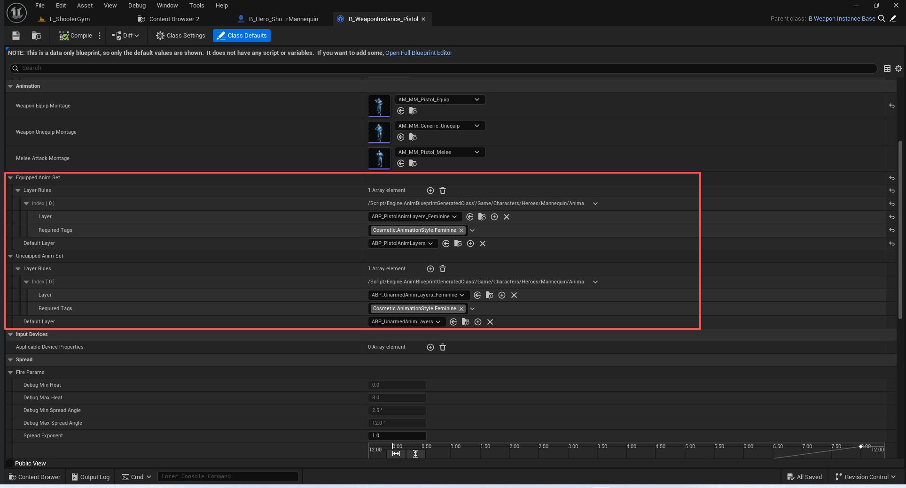
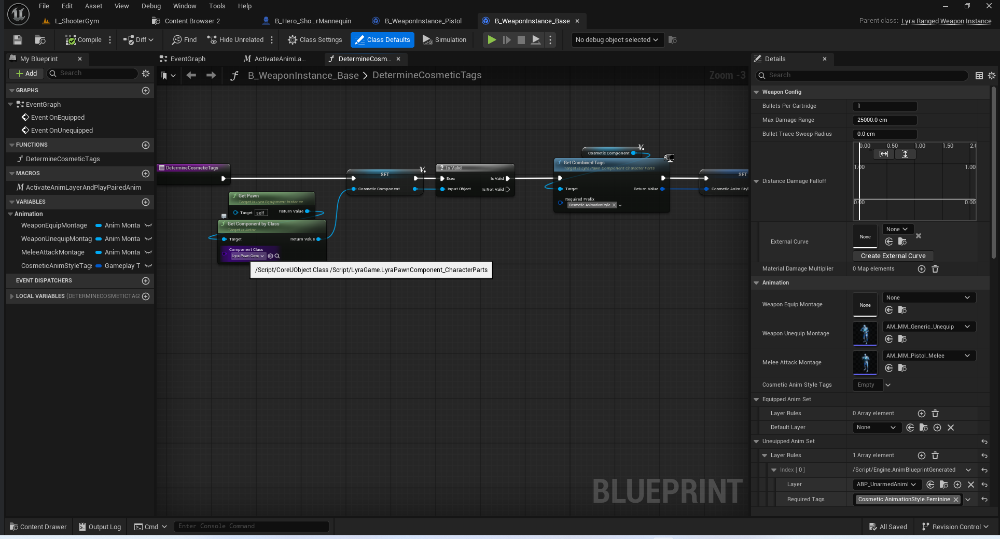
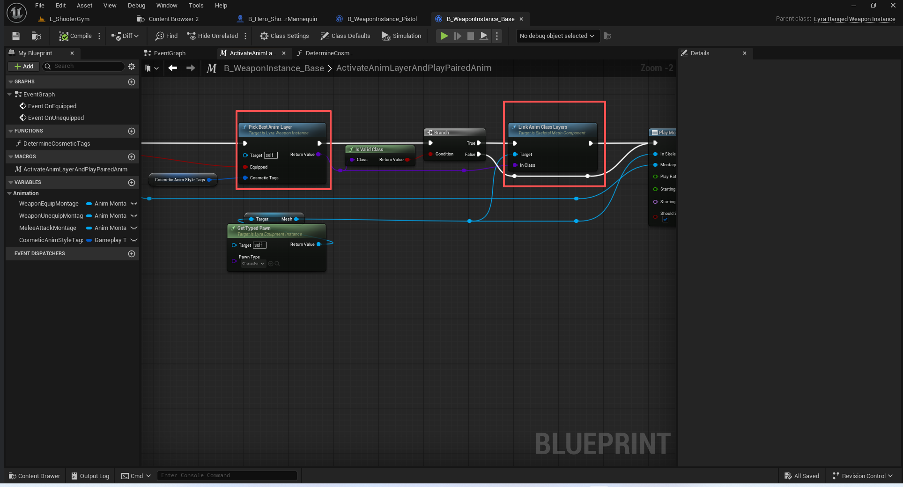


## 主骨骼的模型选择
``` cpp
USTRUCT(BlueprintType)
struct FLyraAnimBodyStyleSelectionEntry
{
	GENERATED_BODY()

	// Layer to apply if the tag matches
	// 如果标签匹配则应用的图层
	UPROPERTY(EditAnywhere, BlueprintReadWrite)
	TObjectPtr<USkeletalMesh> Mesh = nullptr;

	// Cosmetic tags required (all of these must be present to be considered a match)
	// 必须有化妆品标签（所有这些标签都必须存在，否则不能视为匹配）
	UPROPERTY(EditAnywhere, BlueprintReadWrite, meta=(Categories="Cosmetic"))
	FGameplayTagContainer RequiredTags;
};


```
``` cpp
USTRUCT(BlueprintType)
struct FLyraAnimBodyStyleSelectionSet
{
	GENERATED_BODY()
		
	// List of layer rules to apply, first one that matches will be used
	// 应用的图层规则列表，最先匹配的规则将被使用
	UPROPERTY(EditAnywhere, BlueprintReadWrite, meta=(TitleProperty=Mesh))
	TArray<FLyraAnimBodyStyleSelectionEntry> MeshRules;

	// The layer to use if none of the LayerRules matches
	// 若上述所有“层规则”均不匹配，则应使用以下层设置
	UPROPERTY(EditAnywhere, BlueprintReadWrite)
	TObjectPtr<USkeletalMesh> DefaultMesh = nullptr;

	// If set, ensures this physics asset is always used
	// 若上述所有“层规则”均不匹配，则应使用以下层设置
	UPROPERTY(EditAnywhere)
	TObjectPtr<UPhysicsAsset> ForcedPhysicsAsset = nullptr;

	// Choose the best body style skeletal mesh given the rules
	// 根据规则选择最合适的骨骼模型体形
	USkeletalMesh* SelectBestBodyStyle(const FGameplayTagContainer& CosmeticTags) const;
};

```

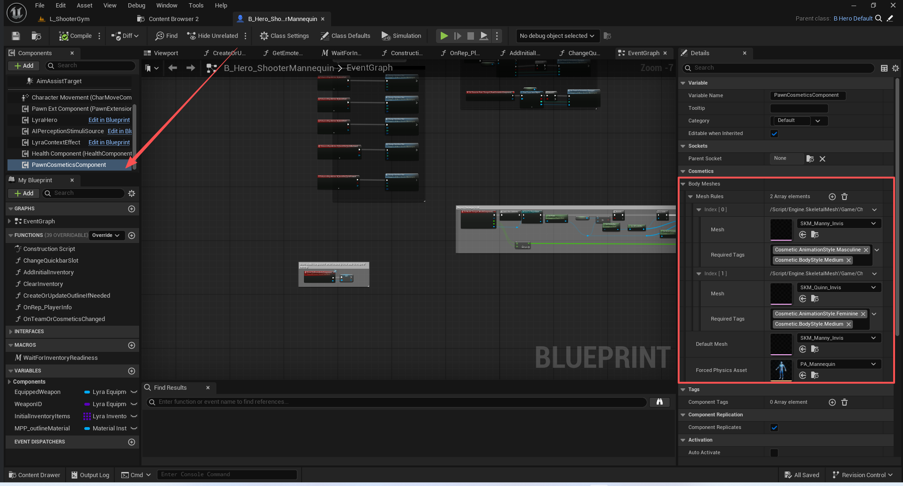
## 控制器上申请添加装饰入口
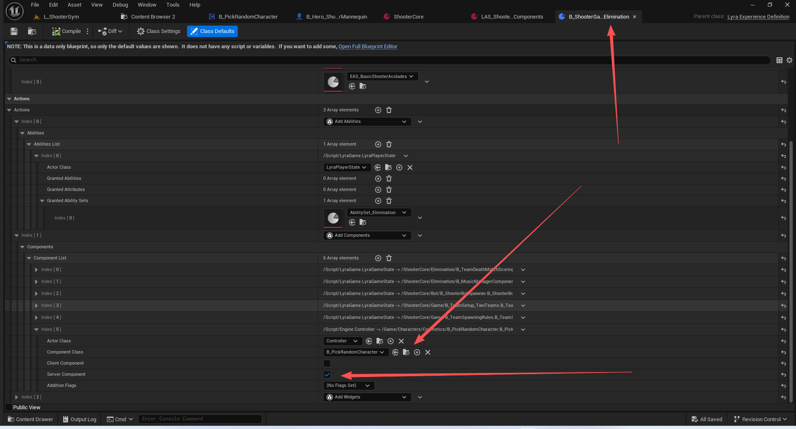
这里是通过Experience添加的组件.仅在服务器上添加
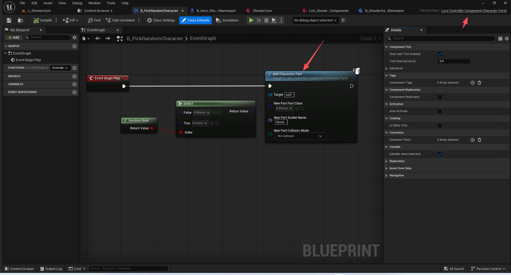
注意Tag的指定获取
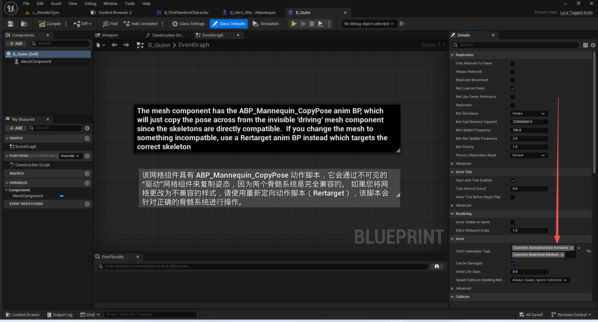
## 控制器换装组件

### 添加的部分定义
``` cpp
// A character part requested on a controller component
// 控制器组件中所要求的角色部分
USTRUCT()
struct FLyraControllerCharacterPartEntry
{
	GENERATED_BODY()

	FLyraControllerCharacterPartEntry()
	{}

public:
	// The character part being represented
	// 所展示的角色部分
	UPROPERTY(EditAnywhere, meta=(ShowOnlyInnerProperties))
	FLyraCharacterPart Part;

	// The handle if already applied to a pawn
	// 应用的句柄
	FLyraCharacterPartHandle Handle;

	// The source of this part
	// 该部分的来源
	ECharacterPartSource Source = ECharacterPartSource::Natural;
};
```
### 转发给角色换装组件处理
``` cpp
void ULyraControllerComponent_CharacterParts::AddCharacterPart(const FLyraCharacterPart& NewPart)
{
	AddCharacterPartInternal(NewPart, ECharacterPartSource::Natural);
}

void ULyraControllerComponent_CharacterParts::AddCharacterPartInternal(const FLyraCharacterPart& NewPart, ECharacterPartSource Source)
{
	FLyraControllerCharacterPartEntry& NewEntry = CharacterParts.AddDefaulted_GetRef();
	NewEntry.Part = NewPart;
	NewEntry.Source = Source;

	if (ULyraPawnComponent_CharacterParts* PawnCustomizer = GetPawnCustomizer())
	{
		if (NewEntry.Source != ECharacterPartSource::NaturalSuppressedViaCheat)
		{
			NewEntry.Handle = PawnCustomizer->AddCharacterPart(NewPart);
		}
	}

}

```
``` cpp
void ULyraControllerComponent_CharacterParts::RemoveCharacterPart(const FLyraCharacterPart& PartToRemove)
{
	for (auto EntryIt = CharacterParts.CreateIterator(); EntryIt; ++EntryIt)
	{
		if (FLyraCharacterPart::AreEquivalentParts(EntryIt->Part, PartToRemove))
		{
			if (ULyraPawnComponent_CharacterParts* PawnCustomizer = GetPawnCustomizer())
			{
				PawnCustomizer->RemoveCharacterPart(EntryIt->Handle);
			}

			EntryIt.RemoveCurrent();
			break;
		}
	}
}
``` 
``` cpp
void ULyraControllerComponent_CharacterParts::RemoveAllCharacterParts()
{
	if (ULyraPawnComponent_CharacterParts* PawnCustomizer = GetPawnCustomizer())
	{
		for (FLyraControllerCharacterPartEntry& Entry : CharacterParts)
		{
			PawnCustomizer->RemoveCharacterPart(Entry.Handle);
		}
	}

	CharacterParts.Reset();
}
```
### 监听角色切换时的处理
``` cpp
void ULyraControllerComponent_CharacterParts::BeginPlay()
{
	Super::BeginPlay();

	// Listen for pawn possession changed events
	if (HasAuthority())
	{
		if (AController* OwningController = GetController<AController>())
		{
			OwningController->OnPossessedPawnChanged.AddDynamic(this, &ThisClass::OnPossessedPawnChanged);

			if (APawn* ControlledPawn = GetPawn<APawn>())
			{
				OnPossessedPawnChanged(nullptr, ControlledPawn);
			}
		}

		ApplyDeveloperSettings();
	}
}

```
``` cpp
void ULyraControllerComponent_CharacterParts::EndPlay(const EEndPlayReason::Type EndPlayReason)
{
	RemoveAllCharacterParts();
	Super::EndPlay(EndPlayReason);
}
```
#### 重新生成
``` cpp
void ULyraControllerComponent_CharacterParts::OnPossessedPawnChanged(APawn* OldPawn, APawn* NewPawn)
{
	// Remove from the old pawn
	if (ULyraPawnComponent_CharacterParts* OldCustomizer = OldPawn ? OldPawn->FindComponentByClass<ULyraPawnComponent_CharacterParts>() : nullptr)
	{
		for (FLyraControllerCharacterPartEntry& Entry : CharacterParts)
		{
			OldCustomizer->RemoveCharacterPart(Entry.Handle);
			Entry.Handle.Reset();
		}
	}

	// Apply to the new pawn
	if (ULyraPawnComponent_CharacterParts* NewCustomizer = NewPawn ? NewPawn->FindComponentByClass<ULyraPawnComponent_CharacterParts>() : nullptr)
	{
		for (FLyraControllerCharacterPartEntry& Entry : CharacterParts)
		{
			// Don't readd if it's already there, this can get called with a null oldpawn
			if (!Entry.Handle.IsValid() && Entry.Source != ECharacterPartSource::NaturalSuppressedViaCheat)
			{
				Entry.Handle = NewCustomizer->AddCharacterPart(Entry.Part);
			}
		}
	}
}

```
#### 调试来源
``` cpp
enum class ECharacterPartSource : uint8
{
	// 游戏自然进程
	Natural,

	// 通过命令切换游戏自然生成的配件,当我们需要调试的时候会
	NaturalSuppressedViaCheat,

	// 来自于开发者设置
	AppliedViaDeveloperSettingsCheat,

	// 通过作弊器进行设置
	AppliedViaCheatManager
};

```

#### 应用开发者设置
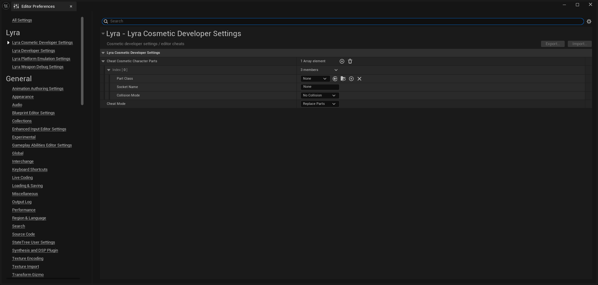
根据模式可以选择替换之前所有,或者追加
``` cpp
void ULyraControllerComponent_CharacterParts::ApplyDeveloperSettings()
{
#if UE_WITH_CHEAT_MANAGER
	const ULyraCosmeticDeveloperSettings* Settings = GetDefault<ULyraCosmeticDeveloperSettings>();

	// Suppress or unsuppress natural parts if needed
	// 根据需要抑制或解除抑制自然部分
	const bool bSuppressNaturalParts = (Settings->CheatMode == ECosmeticCheatMode::ReplaceParts) && (Settings->CheatCosmeticCharacterParts.Num() > 0);
	SetSuppressionOnNaturalParts(bSuppressNaturalParts);

	// Remove anything added by developer settings and re-add it
	// 清除由开发者设置添加的内容，并重新添加回去
	ULyraPawnComponent_CharacterParts* PawnCustomizer = GetPawnCustomizer();
	for (auto It = CharacterParts.CreateIterator(); It; ++It)
	{
		if (It->Source == ECharacterPartSource::AppliedViaDeveloperSettingsCheat)
		{
			if (PawnCustomizer != nullptr)
			{
				PawnCustomizer->RemoveCharacterPart(It->Handle);
			}
			It.RemoveCurrent();
		}
	}

	// Add new parts
	// 添加新部件
	for (const FLyraCharacterPart& PartDesc : Settings->CheatCosmeticCharacterParts)
	{
		AddCharacterPartInternal(PartDesc, ECharacterPartSource::AppliedViaDeveloperSettingsCheat);
	}
#endif
}


```

``` cpp
UENUM()
enum class ECosmeticCheatMode
{
	ReplaceParts,

	AddParts
};

/**
 * Cosmetic developer settings / editor cheats
 */
UCLASS(config=EditorPerProjectUserSettings, MinimalAPI)
class ULyraCosmeticDeveloperSettings : public UDeveloperSettingsBackedByCVars
{
	GENERATED_BODY()

public:
	ULyraCosmeticDeveloperSettings();

	//~UDeveloperSettings interface
	virtual FName GetCategoryName() const override;
	//~End of UDeveloperSettings interface

public:
	UPROPERTY(Transient, EditAnywhere)
	TArray<FLyraCharacterPart> CheatCosmeticCharacterParts;

	UPROPERTY(Transient, EditAnywhere)
	ECosmeticCheatMode CheatMode;

#if WITH_EDITOR
public:
	// Called by the editor engine to let us pop reminder notifications when cheats are active
	LYRAGAME_API void OnPlayInEditorStarted() const;

private:
	void ApplySettings();
	void ReapplyLoadoutIfInPIE();
#endif

public:
	//~UObject interface
#if WITH_EDITOR
	virtual void PostEditChangeProperty(FPropertyChangedEvent& PropertyChangedEvent) override;
	virtual void PostReloadConfig(FProperty* PropertyThatWasLoaded) override;
	virtual void PostInitProperties() override;
#endif
	//~End of UObject interface

private:


};


```
### 作弊器拓展
``` cpp
/** Cheats related to bots */
UCLASS(NotBlueprintable)
class ULyraCosmeticCheats final : public UCheatManagerExtension
{
	GENERATED_BODY()

public:
	ULyraCosmeticCheats();

	// Adds a character part
	UFUNCTION(Exec, BlueprintAuthorityOnly)
	void AddCharacterPart(const FString& AssetName, bool bSuppressNaturalParts = true);

	// Replaces previous cheat parts with a new one
	UFUNCTION(Exec, BlueprintAuthorityOnly)
	void ReplaceCharacterPart(const FString& AssetName, bool bSuppressNaturalParts = true);

	// Clears any existing cheats
	UFUNCTION(Exec, BlueprintAuthorityOnly)
	void ClearCharacterPartOverrides();

private:
	ULyraControllerComponent_CharacterParts* GetCosmeticComponent() const;
};


```
``` cpp
friend class ULyraCosmeticCheats;
```
```cpp
void ULyraControllerComponent_CharacterParts::AddCheatPart(const FLyraCharacterPart& NewPart, bool bSuppressNaturalParts)
{
#if UE_WITH_CHEAT_MANAGER
	SetSuppressionOnNaturalParts(bSuppressNaturalParts);
	AddCharacterPartInternal(NewPart, ECharacterPartSource::AppliedViaCheatManager);
#endif
}

void ULyraControllerComponent_CharacterParts::ClearCheatParts()
{
#if UE_WITH_CHEAT_MANAGER
	ULyraPawnComponent_CharacterParts* PawnCustomizer = GetPawnCustomizer();

	// Remove anything added by cheat manager cheats
	for (auto It = CharacterParts.CreateIterator(); It; ++It)
	{
		if (It->Source == ECharacterPartSource::AppliedViaCheatManager)
		{
			if (PawnCustomizer != nullptr)
			{
				PawnCustomizer->RemoveCharacterPart(It->Handle);
			}
			It.RemoveCurrent();
		}
	}

	ApplyDeveloperSettings();
#endif
}


```
注册
``` cpp
ULyraCosmeticCheats::ULyraCosmeticCheats()
{
#if UE_WITH_CHEAT_MANAGER
	if (HasAnyFlags(RF_ClassDefaultObject))
	{
		UCheatManager::RegisterForOnCheatManagerCreated(FOnCheatManagerCreated::FDelegate::CreateLambda(
			[](UCheatManager* CheatManager)
			{
				CheatManager->AddCheatManagerExtension(NewObject<ThisClass>(CheatManager));
			}));
	}
#endif
}

```

### 获取角色换装组件
``` cpp
ULyraPawnComponent_CharacterParts* ULyraControllerComponent_CharacterParts::GetPawnCustomizer() const
{
	if (APawn* ControlledPawn = GetPawn<APawn>())
	{
		return ControlledPawn->FindComponentByClass<ULyraPawnComponent_CharacterParts>();
	}
	return nullptr;
}


```

## 角色换装组件

### 换装请求定义

``` cpp
// How should collision be configured on the spawned part actor
// 在生成的部件角色上应如何配置碰撞设置？
UENUM()
enum class ECharacterCustomizationCollisionMode : uint8
{
	// Disable collision on spawned character parts
	// 禁用已生成角色部件的碰撞功能
	NoCollision,

	// Leave the collision settings on character parts alone
	// 请保持角色各部位的碰撞设置不变
	UseCollisionFromCharacterPart
};


```

``` cpp
//////////////////////////////////////////////////////////////////////
// A character part request
// 一个换装请求
USTRUCT(BlueprintType)
struct FLyraCharacterPart
{
	GENERATED_BODY()

	// The part to spawn
	// 需要生成的演员
	UPROPERTY(EditAnywhere, BlueprintReadWrite)
	TSubclassOf<AActor> PartClass;

	// The socket to attach the part to (if any)
	// 插槽
	UPROPERTY(EditAnywhere, BlueprintReadWrite)
	FName SocketName;

	// How to handle collision for the primitive components in the part
	// 碰撞处理方式
	UPROPERTY(EditAnywhere, BlueprintReadWrite)
	ECharacterCustomizationCollisionMode CollisionMode = ECharacterCustomizationCollisionMode::NoCollision;

	// Compares against another part, ignoring the collision mode
	// 相等性判断
	static bool AreEquivalentParts(const FLyraCharacterPart& A, const FLyraCharacterPart& B)
	{
		return (A.PartClass == B.PartClass) && (A.SocketName == B.SocketName);
	}
};


```
### 换装的句柄
``` cpp
// A handle created by adding a character part entry, can be used to remove it later
// 通过添加角色部分项而创建的“句柄”，日后可以用来将其删除。
USTRUCT(BlueprintType)
struct FLyraCharacterPartHandle
{
	GENERATED_BODY()

	void Reset()
	{
		PartHandle = INDEX_NONE;
	}

	bool IsValid() const
	{
		return PartHandle != INDEX_NONE;
	}

private:
	UPROPERTY()
	int32 PartHandle = INDEX_NONE;

	friend FLyraCharacterPartList;
};

```

### 换装FastArray元素
``` cpp
// A single applied character part
// 一个单独的应用角色部分
USTRUCT()
struct FLyraAppliedCharacterPartEntry : public FFastArraySerializerItem
{
	GENERATED_BODY()

	FLyraAppliedCharacterPartEntry()
	{}

	FString GetDebugString() const;

private:
	friend FLyraCharacterPartList;
	friend ULyraPawnComponent_CharacterParts;

private:
	// The character part being represented
	// 代表的角色部分
	UPROPERTY()
	FLyraCharacterPart Part;

	// Handle index we returned to the user (server only)
	// 部位索引
	UPROPERTY(NotReplicated)
	int32 PartHandle = INDEX_NONE;

	// The spawned actor instance (client only)
	// 客户端的实际演员
	UPROPERTY(NotReplicated)
	TObjectPtr<UChildActorComponent> SpawnedComponent = nullptr;
};


```

### 换装FastArray的容器
``` cpp
// Replicated list of applied character parts
// 角色部分同步容器
USTRUCT(BlueprintType)
struct FLyraCharacterPartList : public FFastArraySerializer
{
	GENERATED_BODY()

	FLyraCharacterPartList()
		: OwnerComponent(nullptr)
	{
	}

public:
	//~FFastArraySerializer contract
	void PreReplicatedRemove(const TArrayView<int32> RemovedIndices, int32 FinalSize);
	void PostReplicatedAdd(const TArrayView<int32> AddedIndices, int32 FinalSize);
	void PostReplicatedChange(const TArrayView<int32> ChangedIndices, int32 FinalSize);
	//~End of FFastArraySerializer contract

	bool NetDeltaSerialize(FNetDeltaSerializeInfo& DeltaParms)
	{
		return FFastArraySerializer::FastArrayDeltaSerialize<FLyraAppliedCharacterPartEntry, FLyraCharacterPartList>(Entries, DeltaParms, *this);
	}

	FLyraCharacterPartHandle AddEntry(FLyraCharacterPart NewPart);
	void RemoveEntry(FLyraCharacterPartHandle Handle);
	void ClearAllEntries(bool bBroadcastChangeDelegate);
	// 获取Tag
	FGameplayTagContainer CollectCombinedTags() const;

	void SetOwnerComponent(ULyraPawnComponent_CharacterParts* InOwnerComponent)
	{
		OwnerComponent = InOwnerComponent;
	}
	
private:
	friend ULyraPawnComponent_CharacterParts;

	bool SpawnActorForEntry(FLyraAppliedCharacterPartEntry& Entry);
	bool DestroyActorForEntry(FLyraAppliedCharacterPartEntry& Entry);

private:
	// Replicated list of equipment entries
	// 容器
	UPROPERTY()
	TArray<FLyraAppliedCharacterPartEntry> Entries;

	// The component that contains this list
	// 这个组件拥有的
	UPROPERTY(NotReplicated)
	TObjectPtr<ULyraPawnComponent_CharacterParts> OwnerComponent;

	// Upcounter for handles
	// 计数
	int32 PartHandleCounter = 0;
};

template<>
struct TStructOpsTypeTraits<FLyraCharacterPartList> : public TStructOpsTypeTraitsBase2<FLyraCharacterPartList>
{
	enum { WithNetDeltaSerializer = true };
};


```

### 换装组件
``` cpp
// A component that handles spawning cosmetic actors attached to the owner pawn on all clients
// 一个组件，用于在所有客户端上生成附着于主角色的装饰性角色模型
UCLASS(meta=(BlueprintSpawnableComponent))
class ULyraPawnComponent_CharacterParts : public UPawnComponent
{
	GENERATED_BODY()

public:
	ULyraPawnComponent_CharacterParts(const FObjectInitializer& ObjectInitializer = FObjectInitializer::Get());

	//~UActorComponent interface
	virtual void BeginPlay() override;
	virtual void EndPlay(const EEndPlayReason::Type EndPlayReason) override;
	virtual void OnRegister() override;
	//~End of UActorComponent interface

	// Adds a character part to the actor that owns this customization component, should be called on the authority only
	// 为拥有此自定义组件的演员添加一个角色部分，此方法仅应在授权范围内调用
	UFUNCTION(BlueprintCallable, BlueprintAuthorityOnly, Category=Cosmetics)
	FLyraCharacterPartHandle AddCharacterPart(const FLyraCharacterPart& NewPart);

	// Removes a previously added character part from the actor that owns this customization component, should be called on the authority only
	// 从拥有此自定义组件的角色对象中移除之前添加的字符部分，此操作仅应在授权范围内调用
	UFUNCTION(BlueprintCallable, BlueprintAuthorityOnly, Category=Cosmetics)
	void RemoveCharacterPart(FLyraCharacterPartHandle Handle);

	// Removes all added character parts, should be called on the authority only
	// 清除所有添加的字符部分，此操作仅应由授权人员执行
	UFUNCTION(BlueprintCallable, BlueprintAuthorityOnly, Category=Cosmetics)
	void RemoveAllCharacterParts();

	// Gets the list of all spawned character parts from this component
	// 获取此组件中所有生成的角色部件的列表
	UFUNCTION(BlueprintCallable, BlueprintPure=false, BlueprintCosmetic, Category=Cosmetics)
	TArray<AActor*> GetCharacterPartActors() const;

	// If the parent actor is derived from ACharacter, returns the Mesh component, otherwise nullptr
	// 如果父角色类是 ACharacter 的派生类，则返回其 Mesh 组件，否则返回 nullptr
	USkeletalMeshComponent* GetParentMeshComponent() const;

	// Returns the scene component to attach the spawned actors to
	// If the parent actor is derived from ACharacter, we'll use the Mesh component, otherwise the root component
	// 返回用于将生成的角色附加到其上的场景组件
	// 如果父角色是基于 ACharacter 类型创建的，我们将使用其 Mesh 组件，否则将使用根组件
	USceneComponent* GetSceneComponentToAttachTo() const;

	// Returns the set of combined gameplay tags from attached character parts, optionally filtered to only tags that start with the specified root
	// 返回附加角色部件所构成的游戏玩法标签集合，可选择性地对标签进行过滤，仅保留以指定根词开头的标签。
	UFUNCTION(BlueprintCallable, BlueprintPure=false, BlueprintCosmetic, Category=Cosmetics)
	FGameplayTagContainer GetCombinedTags(FGameplayTag RequiredPrefix) const;

	void BroadcastChanged();

public:
	// Delegate that will be called when the list of spawned character parts has changed
	// 当生成的角色部件列表发生变化时将调用的委托方法
	UPROPERTY(BlueprintAssignable, Category=Cosmetics, BlueprintCallable)
	FLyraSpawnedCharacterPartsChanged OnCharacterPartsChanged;

private:
	// List of character parts
	// 角色组成部分列表
	UPROPERTY(Replicated, Transient)
	FLyraCharacterPartList CharacterPartList;

	// Rules for how to pick a body style mesh for animation to play on, based on character part cosmetics tags
	// 关于如何选取用于动画播放的肢体造型网格的规则，这些规则依据的是角色各部位的外观标签制定。
	UPROPERTY(EditAnywhere, Category=Cosmetics)
	FLyraAnimBodyStyleSelectionSet BodyMeshes;
};

```

### 换装流程
#### 入口
``` cpp
FLyraCharacterPartHandle ULyraPawnComponent_CharacterParts::AddCharacterPart(const FLyraCharacterPart& NewPart)
{
	return CharacterPartList.AddEntry(NewPart);
}

void ULyraPawnComponent_CharacterParts::RemoveCharacterPart(FLyraCharacterPartHandle Handle)
{
	CharacterPartList.RemoveEntry(Handle);
}

void ULyraPawnComponent_CharacterParts::RemoveAllCharacterParts()
{
	CharacterPartList.ClearAllEntries(/*bBroadcastChangeDelegate=*/ true);
}

```

#### 生成实体
``` cpp

FLyraCharacterPartHandle FLyraCharacterPartList::AddEntry(FLyraCharacterPart NewPart)
{
	FLyraCharacterPartHandle Result;
	Result.PartHandle = PartHandleCounter++;

	if (ensure(OwnerComponent && OwnerComponent->GetOwner() && OwnerComponent->GetOwner()->HasAuthority()))
	{
		FLyraAppliedCharacterPartEntry& NewEntry = Entries.AddDefaulted_GetRef();
		NewEntry.Part = NewPart;
		NewEntry.PartHandle = Result.PartHandle;
	
		if (SpawnActorForEntry(NewEntry))
		{
			OwnerComponent->BroadcastChanged();
		}

		MarkItemDirty(NewEntry);
	}

	return Result;
}

```
``` cpp
bool FLyraCharacterPartList::SpawnActorForEntry(FLyraAppliedCharacterPartEntry& Entry)
{
	bool bCreatedAnyActors = false;
	// 看这里!!!!!!!
	// DS上不生成这个对象!!!!!!!!
	if (ensure(OwnerComponent) && !OwnerComponent->IsNetMode(NM_DedicatedServer))
	{
		if (Entry.Part.PartClass != nullptr)
		{
			UWorld* World = OwnerComponent->GetWorld();

			if (USceneComponent* ComponentToAttachTo = OwnerComponent->GetSceneComponentToAttachTo())
			{
				const FTransform SpawnTransform = ComponentToAttachTo->GetSocketTransform(Entry.Part.SocketName);

				UChildActorComponent* PartComponent = NewObject<UChildActorComponent>(OwnerComponent->GetOwner());

				PartComponent->SetupAttachment(ComponentToAttachTo, Entry.Part.SocketName);
				PartComponent->SetChildActorClass(Entry.Part.PartClass);
				PartComponent->RegisterComponent();

				if (AActor* SpawnedActor = PartComponent->GetChildActor())
				{
					switch (Entry.Part.CollisionMode)
					{
					case ECharacterCustomizationCollisionMode::UseCollisionFromCharacterPart:
						// Do nothing
						break;

					case ECharacterCustomizationCollisionMode::NoCollision:
						SpawnedActor->SetActorEnableCollision(false);
						break;
					}

					// Set up a direct tick dependency to work around the child actor component not providing one
					// 建立一个直接的定时依赖关系，以解决子演员组件无法提供该依赖关系的问题
					if (USceneComponent* SpawnedRootComponent = SpawnedActor->GetRootComponent())
					{
						SpawnedRootComponent->AddTickPrerequisiteComponent(ComponentToAttachTo);
					}
				}

				Entry.SpawnedComponent = PartComponent;
				bCreatedAnyActors = true;
			}
		}
	}

	return bCreatedAnyActors;
}


```
#### 同步添加后处理
``` cpp

void FLyraCharacterPartList::PostReplicatedAdd(const TArrayView<int32> AddedIndices, int32 FinalSize)
{
	bool bCreatedAnyActors = false;
	for (int32 Index : AddedIndices)
	{
		FLyraAppliedCharacterPartEntry& Entry = Entries[Index];
		bCreatedAnyActors |= SpawnActorForEntry(Entry);
	}

	if (bCreatedAnyActors && ensure(OwnerComponent))
	{
		OwnerComponent->BroadcastChanged();
	}
}
```
#### Gyra关于这里的特殊处理
``` cpp
bool FGyraCharacterPartList::SpawnActorForEntry(FGyraAppliedCharacterPartEntry& Entry)
{
	bool bCreatedAnyActors = false;

	if (ensure(OwnerComponent) && !OwnerComponent->IsNetMode(NM_DedicatedServer))
	{
		if (Entry.Part.PartClass != nullptr)
		{
			UWorld* World = OwnerComponent->GetWorld();

			if (USceneComponent* ComponentToAttachTo = OwnerComponent->GetSceneComponentToAttachTo())
			{
				const FTransform SpawnTransform = ComponentToAttachTo->GetSocketTransform(Entry.Part.SocketName);
				
				UChildActorComponent* PartComponent = NewObject<UChildActorComponent>(OwnerComponent->GetOwner());
				// 这里主要是为了处理重定向问题 所以让替身使者可以获取到拥有者
				// 获取属性名称
				FName PropertyName = TEXT("bSetOwner");

				// 查找属性
				FProperty* Property = PartComponent->GetClass()->FindPropertyByName(PropertyName);
    
				if (Property && Property->IsA(FBoolProperty::StaticClass()))
				{
					FBoolProperty* BoolProperty = CastField<FBoolProperty>(Property);
        
					// 设置属性值
					BoolProperty->SetPropertyValue_InContainer(PartComponent, true);
        
					// 如果需要标记为已修改（对于保存和网络复制很重要）
					PartComponent->Modify();
        
					// 如果属性有RepNotify，可能需要手动调用
					// TargetComponent->PostEditChange();
				}
				else
				{
					UE_LOG(LogGyraGame, Warning, TEXT("Property %s not found or not a boolean"), *PropertyName.ToString());
				}

				PartComponent->SetupAttachment(ComponentToAttachTo, Entry.Part.SocketName);
				PartComponent->SetChildActorClass(Entry.Part.PartClass);
				PartComponent->RegisterComponent();

				if (AActor* SpawnedActor = PartComponent->GetChildActor())
				{
					switch (Entry.Part.CollisionMode)
					{
					case ECharacterCustomizationCollisionMode::UseCollisionFromCharacterPart:
						// Do nothing
						break;

					case ECharacterCustomizationCollisionMode::NoCollision:
						SpawnedActor->SetActorEnableCollision(false);
						break;
					}

					// Set up a direct tick dependency to work around the child actor component not providing one
					if (USceneComponent* SpawnedRootComponent = SpawnedActor->GetRootComponent())
					{
						SpawnedRootComponent->AddTickPrerequisiteComponent(ComponentToAttachTo);
					}
				}

				Entry.SpawnedComponent = PartComponent;
				bCreatedAnyActors = true;
			}
		}
	}

	return bCreatedAnyActors;
}


```

``` cpp

/** A component that spawns an Actor when registered, and destroys it when unregistered.*/
UCLASS(ClassGroup=Utility, hidecategories=(Object,LOD,Physics,Lighting,TextureStreaming,Activation,"Components|Activation",Collision), meta=(BlueprintSpawnableComponent), MinimalAPI)
class UChildActorComponent : public USceneComponent
{
	GENERATED_UCLASS_BODY()

	/**
	 * Sets the class to use for the child actor. 
	 * If called on a template component (owned by a CDO), the properties of any existing child actor template will be copied as best possible to the template. 
	 * If called on a component instance in a world (and the class is changing), the created ChildActor will use the class defaults as template.
	 * @param InClass The Actor subclass to spawn as a child actor
	 */
	UFUNCTION(BlueprintCallable, Category=ChildActorComponent)
	void SetChildActorClass(TSubclassOf<AActor> InClass)
	{
		SetChildActorClass(InClass, nullptr);
	}

	/**
	 * Sets then class to use for the child actor providing an optional Actor to use as the template.
	 * If called on a template component (owned by a CDO) and NewChildActorTemplate is not null, the new child actor template will be created using the supplied Actor as template.
	 * If called on a template component and NewChildActorTemplate is null, the properties of any existing child actor template will be copied as best possible to the template.
	 * If called on a component instance in a world with NewChildActorTemplate not null, then if registered a new child actor will be created using the supplied Actor as template, 
	 *    otherwise if not registered it will ensure. If the class also changed, then future ChildActors created by this component the class defaults will be used.
	 * If called on a component instance in a world with NewChildActorTemplate null and the class is changing, the created ChildActor will use the class defaults as template.
	 * @param InClass                 The Actor subclass to spawn as a child actor
	 * @param NewChildActorTemplate   An Actor to use as the template when spawning a child actor using this component (per the rules listed above)
	 */
	ENGINE_API void SetChildActorClass(TSubclassOf<AActor> InClass, AActor* NewChildActorTemplate);

	TSubclassOf<AActor> GetChildActorClass() const { return ChildActorClass; }

	friend class FChildActorComponentDetails;

private:
	/** The class of Actor to spawn */
	UPROPERTY(EditAnywhere, BlueprintReadOnly, Category=ChildActorComponent, meta=(OnlyPlaceable, AllowPrivateAccess="true", ForceRebuildProperty="ChildActorTemplate"))
	TSubclassOf<AActor>	ChildActorClass;

	/** The actor that we spawned and own */
	UPROPERTY(Replicated, BlueprintReadOnly, ReplicatedUsing=OnRep_ChildActor, Category=ChildActorComponent, TextExportTransient, DuplicateTransient, meta=(AllowPrivateAccess="true"))
	TObjectPtr<AActor>	ChildActor;

	/** Property to point to the template child actor for details panel purposes */
	UPROPERTY(VisibleDefaultsOnly, DuplicateTransient, Category=ChildActorComponent, meta=(ShowInnerProperties))
	TObjectPtr<AActor> ChildActorTemplate;

	/** We try to keep the child actor's name as best we can, so we store it off here when destroying */
	FName ChildActorName;

	/** Detect when the parent actor is renamed, in which case we can't preserve the child actor's name */
	UObject* ActorOuter;

	/** Cached copy of the instance data when the ChildActor is destroyed to be available when needed */
	mutable FChildActorComponentInstanceData* CachedInstanceData;

#if WITH_EDITORONLY_DATA
	/** Indicates how this component will be visualized for editing in a tree view. Users can change this setting per instance via the context menu in the Blueprint/SCS editor. */
	UPROPERTY()
	EChildActorComponentTreeViewVisualizationMode EditorTreeViewVisualizationMode;
#endif

	/**
	 * Should the spawned actor be marked as transient?
	 * @note The spawned actor will also be marked transient if this component or its owner actor are transient, regardless of the state of this flag.
	 */
	UPROPERTY(EditDefaultsOnly, Category=ChildActorComponent)
	uint8 bChildActorIsTransient:1;

	/**
	 * Should the owner of this component be set as the owner of the child actor?
	 */
	UPROPERTY(EditDefaultsOnly, Category=ChildActorComponent)
	uint8 bSetOwner:1;
	// ...

};

```

``` cpp

void UChildActorComponent::CreateChildActor(TFunction<void(AActor*)> CustomizerFunc)
{
	if (bSetOwner)
	{
		Params.Owner = MyOwner;
	}
				
	// ....
}
```

### 移除实体

``` cpp
void FLyraCharacterPartList::RemoveEntry(FLyraCharacterPartHandle Handle)
{
	for (auto EntryIt = Entries.CreateIterator(); EntryIt; ++EntryIt)
	{
		FLyraAppliedCharacterPartEntry& Entry = *EntryIt;
		if (Entry.PartHandle == Handle.PartHandle)
		{
			const bool bDestroyedActor = DestroyActorForEntry(Entry);
			EntryIt.RemoveCurrent();
			MarkArrayDirty();

			if (bDestroyedActor && ensure(OwnerComponent))
			{
				OwnerComponent->BroadcastChanged();
			}

			break;
		}
	}
}

```

### 同步后修改处理
``` cpp
void FLyraCharacterPartList::PreReplicatedRemove(const TArrayView<int32> RemovedIndices, int32 FinalSize)
{
	bool bDestroyedAnyActors = false;
	for (int32 Index : RemovedIndices)
	{
		FLyraAppliedCharacterPartEntry& Entry = Entries[Index];
		bDestroyedAnyActors |= DestroyActorForEntry(Entry);
	}

	if (bDestroyedAnyActors && ensure(OwnerComponent))
	{
		OwnerComponent->BroadcastChanged();
	}
}

```
``` cpp
void FLyraCharacterPartList::PostReplicatedChange(const TArrayView<int32> ChangedIndices, int32 FinalSize)
{
	bool bChangedAnyActors = false;

	// We don't support dealing with propagating changes, just destroy and recreate
	// 我们不支持处理传播性更改，只支持销毁并重新创建。
	for (int32 Index : ChangedIndices)
	{
		FLyraAppliedCharacterPartEntry& Entry = Entries[Index];

		bChangedAnyActors |= DestroyActorForEntry(Entry);
		bChangedAnyActors |= SpawnActorForEntry(Entry);
	}

	if (bChangedAnyActors && ensure(OwnerComponent))
	{
		OwnerComponent->BroadcastChanged();
	}
}

```
### 通知发生改变了

``` cpp

void ULyraPawnComponent_CharacterParts::BroadcastChanged()
{
	const bool bReinitPose = true;

	// Check to see if the body type has changed
	// 检查一下身体类型是否发生了变化
	if (USkeletalMeshComponent* MeshComponent = GetParentMeshComponent())
	{
		// Determine the mesh to use based on cosmetic part tags
		// 根据外观部件标签确定要使用的网格结构
		const FGameplayTagContainer MergedTags = GetCombinedTags(FGameplayTag());
		USkeletalMesh* DesiredMesh = BodyMeshes.SelectBestBodyStyle(MergedTags);

		// Apply the desired mesh (this call is a no-op if the mesh hasn't changed)
		// 应用所需的网格（如果网格未发生改变，则此调用将不起作用）
		MeshComponent->SetSkeletalMesh(DesiredMesh, /*bReinitPose=*/ bReinitPose);

		// Apply the desired physics asset if there's a forced override independent of the one from the mesh
		// 如果存在独立于网格所设定的强制性覆盖设置，则应用所需的物理属性。
		if (UPhysicsAsset* PhysicsAsset = BodyMeshes.ForcedPhysicsAsset)
		{
			MeshComponent->SetPhysicsAsset(PhysicsAsset, /*bForceReInit=*/ bReinitPose);
		}
	}

	// Let observers know, e.g., if they need to apply team coloring or similar
	// 例如，让观察者们知晓他们是否需要进行团队颜色标注之类的操作
	OnCharacterPartsChanged.Broadcast(this);
}


```
方便修改队伍颜色
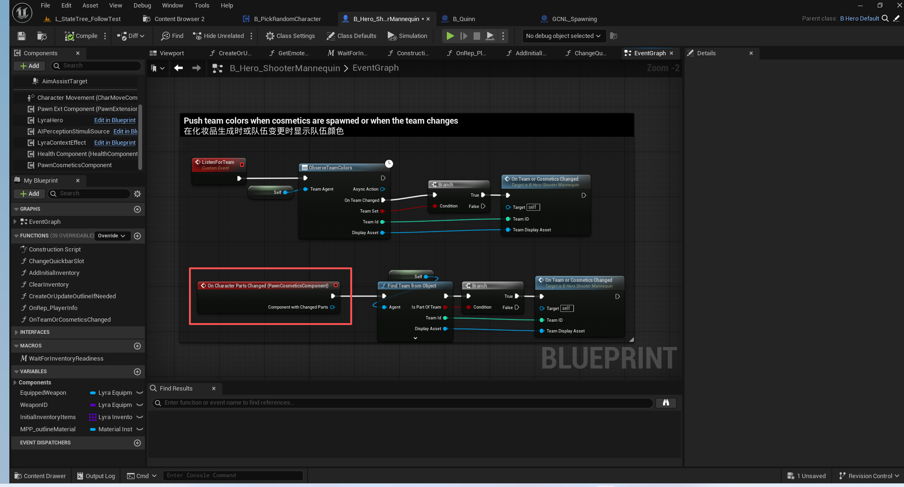
生成时的效果效果
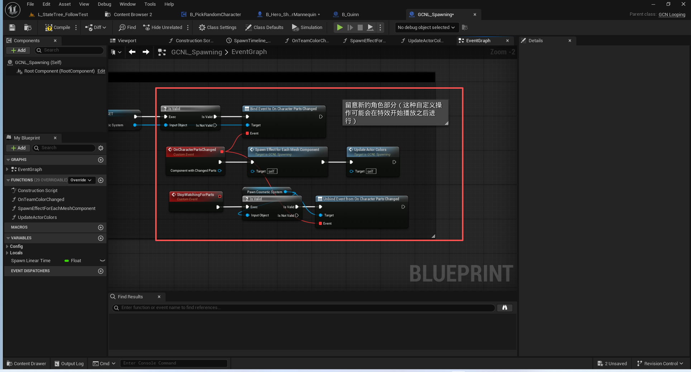
这里是手动添加的很容易漏
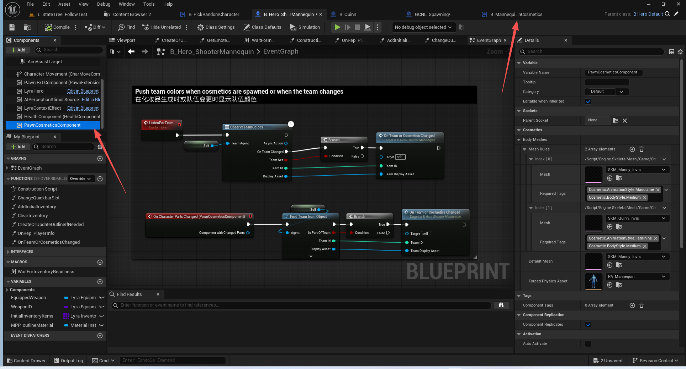
使用到的重定向和复制蓝图
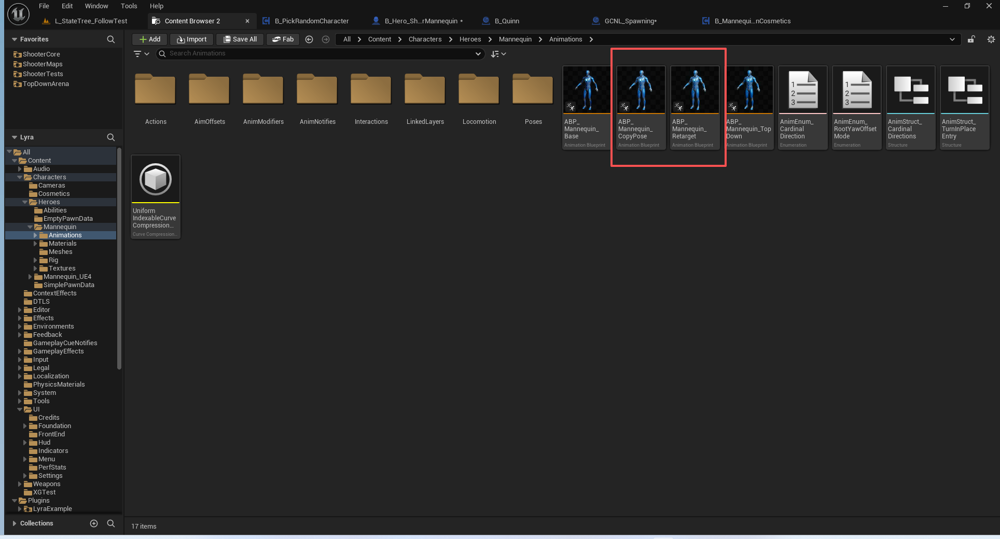
注意5.6的重定向有很大的改动.如果这里没有正确获取到源姿势,会导致定向失败
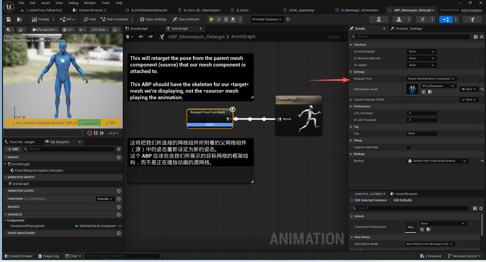
## 总结
换装系统基本讲解完毕.强烈推荐大家使用虚幻的人物换装示例Mutable!!!
这个功能可以解决穿模问题.虽然有一定的学习使用成本!