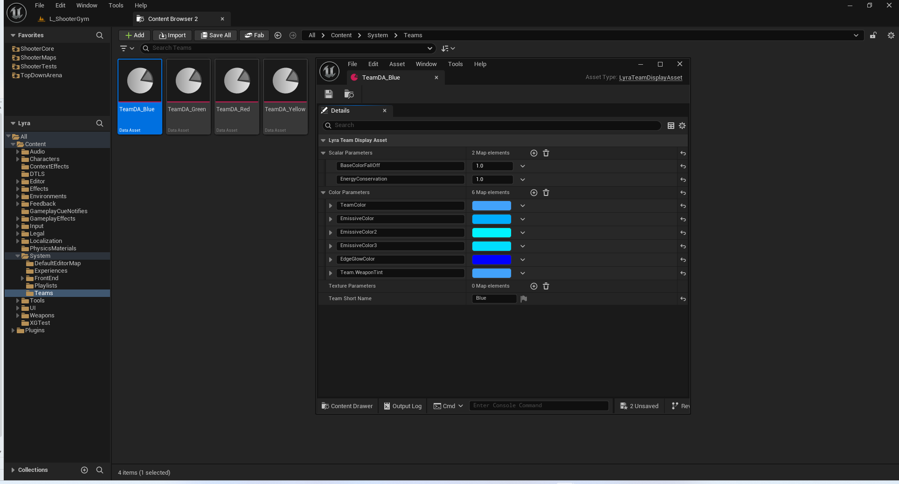
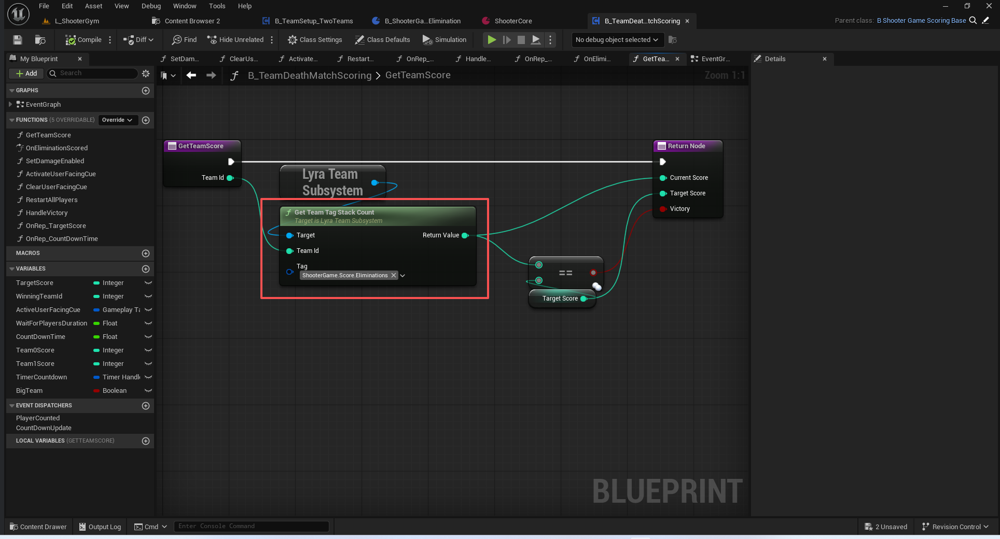
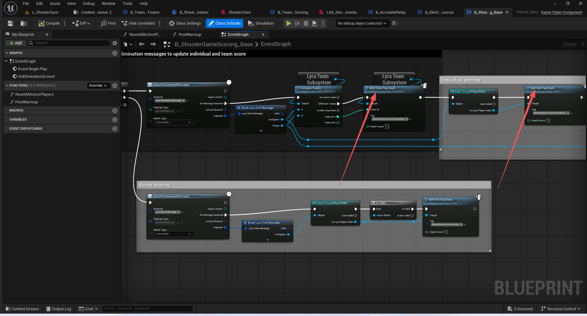
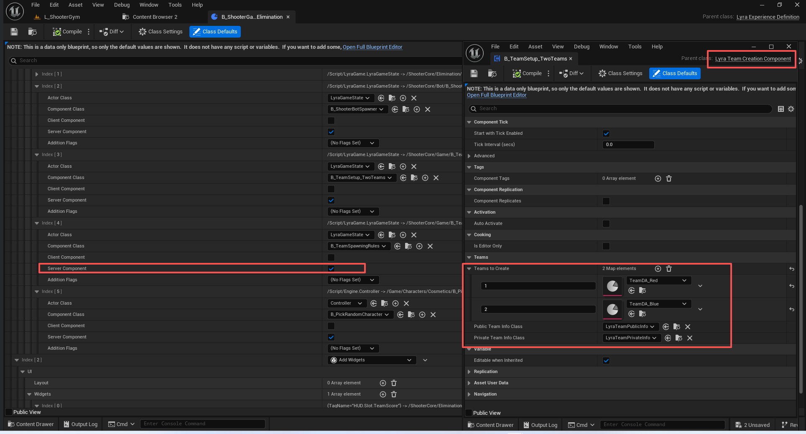
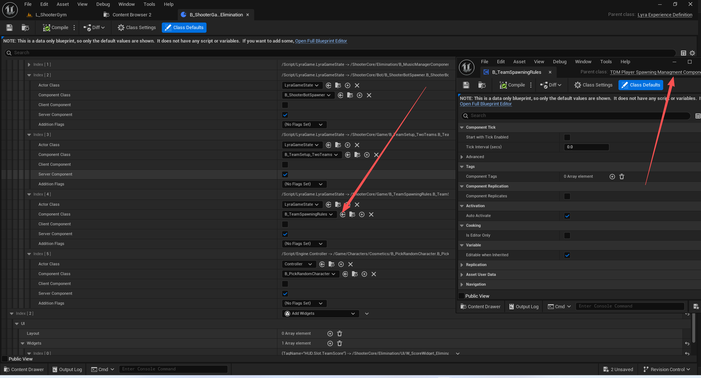
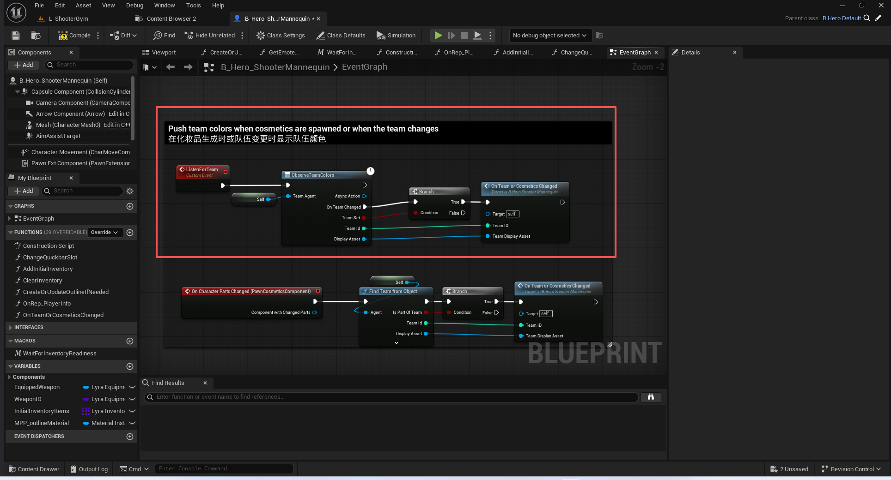
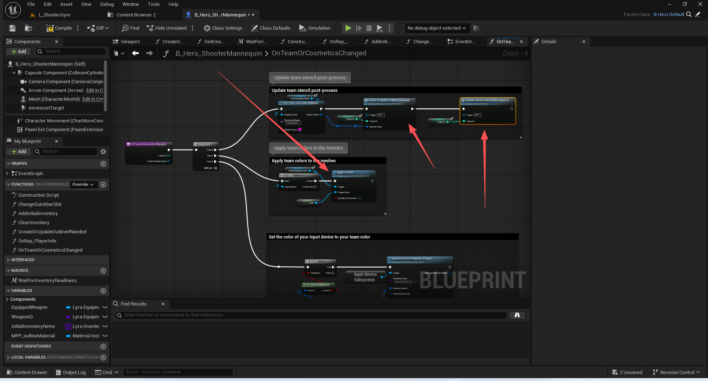
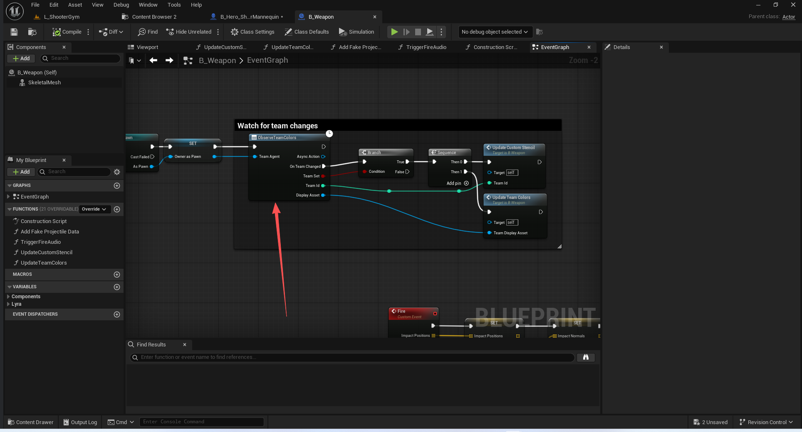

# UE5_Lyra学习指南_101_队伍系统

本文章仅为小刚-B站课堂-虚幻引擎视频课程Lyra-精讲的演讲手稿.  
本套课程链接:[[UE5]虚幻引擎游戏案例Lyra精讲](https://www.bilibili.com/cheese/play/ss112001159)  
前置课程链接:[[UE5]虚幻引擎UEC++从基础到进阶](https://www.bilibili.com/cheese/play/ss28043)  

文章内容由小刚撰写,采用了以下多种方式:  
1.口述转文字  
2.AI重构  
3.参考引擎源码  
4.Lyra工程源码  
5.结合社区论坛各位大佬的解析  

- [UE5\_Lyra学习指南\_101\_队伍系统](#ue5_lyra学习指南_101_队伍系统)
	- [概述](#概述)
	- [队伍接口](#队伍接口)
	- [队伍定义资产](#队伍定义资产)
	- [工具函数](#工具函数)
	- [队伍信息定义](#队伍信息定义)
		- [队伍信息基类](#队伍信息基类)
			- [注册队伍进去](#注册队伍进去)
			- [注意同步的属性](#注意同步的属性)
		- [公开信息](#公开信息)
		- [私有信息](#私有信息)
	- [队伍子系统](#队伍子系统)
		- [队伍信息追踪](#队伍信息追踪)
		- [队伍比较枚举](#队伍比较枚举)
		- [注册作弊监听](#注册作弊监听)
		- [注册队伍](#注册队伍)
		- [判断一个对象的队伍状态](#判断一个对象的队伍状态)
		- [改变一个对象的队伍](#改变一个对象的队伍)
		- [比较两个对象的队伍](#比较两个对象的队伍)
		- [友伤判断](#友伤判断)
		- [队伍比分获取](#队伍比分获取)
		- [获取对应的队伍资产](#获取对应的队伍资产)
		- [代码](#代码)
	- [队伍作弊器拓展](#队伍作弊器拓展)
	- [创建队伍流程](#创建队伍流程)
		- [创建队伍的组件](#创建队伍的组件)
		- [构造函数](#构造函数)
		- [体验加载完毕后](#体验加载完毕后)
		- [服务器初始化队伍架构](#服务器初始化队伍架构)
			- [创建队伍](#创建队伍)
			- [分配玩家](#分配玩家)
		- [玩家队伍ID计算](#玩家队伍id计算)
		- [出生点选取规则](#出生点选取规则)
			- [默认出生点规则](#默认出生点规则)
			- [团队竞技比分模式下的生成规则](#团队竞技比分模式下的生成规则)
	- [观察队伍的变更(会立即获取一次)](#观察队伍的变更会立即获取一次)
		- [观察ID](#观察id)
		- [观察颜色](#观察颜色)
	- [注意异步蓝图节点会导致内存的泄露!!!!!如果没有释放的话!!!](#注意异步蓝图节点会导致内存的泄露如果没有释放的话)
	- [总结](#总结)


## 概述
本节开始讲解队伍系统相关.前面已经或多或少涉及到了队伍接口.队伍系统主要时基于这个队伍接口的变更传递增加附加定义的资产.
## 队伍接口
``` cpp
DECLARE_DYNAMIC_MULTICAST_DELEGATE_ThreeParams(FOnLyraTeamIndexChangedDelegate, UObject*, ObjectChangingTeam, int32, OldTeamID, int32, NewTeamID);

inline int32 GenericTeamIdToInteger(FGenericTeamId ID)
{
	return (ID == FGenericTeamId::NoTeam) ? INDEX_NONE : (int32)ID;
}

inline FGenericTeamId IntegerToGenericTeamId(int32 ID)
{
	return (ID == INDEX_NONE) ? FGenericTeamId::NoTeam : FGenericTeamId((uint8)ID);
}

/** Interface for actors which can be associated with teams */
UINTERFACE(MinimalAPI, meta=(CannotImplementInterfaceInBlueprint))
class ULyraTeamAgentInterface : public UGenericTeamAgentInterface
{
	GENERATED_UINTERFACE_BODY()
};

class ILyraTeamAgentInterface : public IGenericTeamAgentInterface
{
	GENERATED_IINTERFACE_BODY()

	// 获取队伍改变的代理
	virtual FOnLyraTeamIndexChangedDelegate* GetOnTeamIndexChangedDelegate() { return nullptr; }

	// 广播队伍发生了改变
	static UE_API void ConditionalBroadcastTeamChanged(TScriptInterface<ILyraTeamAgentInterface> This, FGenericTeamId OldTeamID, FGenericTeamId NewTeamID);

	// 带有检查的获取队伍改变的代理
	FOnLyraTeamIndexChangedDelegate& GetTeamChangedDelegateChecked()
	{
		FOnLyraTeamIndexChangedDelegate* Result = GetOnTeamIndexChangedDelegate();
		check(Result);
		return *Result;
	}
};
```

## 队伍定义资产

``` cpp
// Represents the display information for team definitions (e.g., colors, display names, textures, etc...)
// 表示团队定义的显示信息（例如，颜色、显示名称、纹理等）
UCLASS(BlueprintType)
class ULyraTeamDisplayAsset : public UDataAsset
{
	GENERATED_BODY()
	
public:
	UPROPERTY(EditAnywhere, BlueprintReadOnly)
	TMap<FName, float> ScalarParameters;

	UPROPERTY(EditAnywhere, BlueprintReadOnly)
	TMap<FName, FLinearColor> ColorParameters;

	UPROPERTY(EditAnywhere, BlueprintReadOnly)
	TMap<FName, TObjectPtr<UTexture>> TextureParameters;

	UPROPERTY(EditAnywhere, BlueprintReadOnly)
	FText TeamShortName;

public:
	UFUNCTION(BlueprintCallable, Category=Teams)
	void ApplyToMaterial(UMaterialInstanceDynamic* Material);

	UFUNCTION(BlueprintCallable, Category=Teams)
	void ApplyToMeshComponent(UMeshComponent* MeshComponent);

	UFUNCTION(BlueprintCallable, Category=Teams)
	void ApplyToNiagaraComponent(UNiagaraComponent* NiagaraComponent);

	UFUNCTION(BlueprintCallable, Category=Teams, meta=(DefaultToSelf="TargetActor"))
	void ApplyToActor(AActor* TargetActor, bool bIncludeChildActors = true);

public:

	//~UObject interface
#if WITH_EDITOR
	virtual void PostEditChangeProperty(FPropertyChangedEvent& PropertyChangedEvent) override;
#endif
	//~End of UObject interface
};


```


## 工具函数
``` cpp
/** A subsystem for easy access to team information for team-based actors (e.g., pawns or player states) */
/** 一个用于方便获取团队成员信息的子系统，适用于基于团队的参与者（例如兵士或玩家状态） */
// 工具函数库
UCLASS()
class ULyraTeamStatics : public UBlueprintFunctionLibrary
{
	GENERATED_BODY()

public:

	// Returns the team this object belongs to, or INDEX_NONE if it is not part of a team
	// 返回此对象所属的团队编号，若该对象不属于任何团队，则返回 INDEX_NONE 作为默认值。
	UFUNCTION(BlueprintCallable, Category=Teams, meta=(Keywords="GetTeamFromObject", DefaultToSelf="Agent", AdvancedDisplay="bLogIfNotSet"))
	static void FindTeamFromObject(const UObject* Agent, bool& bIsPartOfTeam, int32& TeamId, ULyraTeamDisplayAsset*& DisplayAsset, bool bLogIfNotSet = false);

	UFUNCTION(BlueprintCallable, Category=Teams, meta=(WorldContext="WorldContextObject"))
	static ULyraTeamDisplayAsset* GetTeamDisplayAsset(const UObject* WorldContextObject, int32 TeamId);

	UFUNCTION(BlueprintCallable, Category = Teams)
	static float GetTeamScalarWithFallback(ULyraTeamDisplayAsset* DisplayAsset, FName ParameterName, float DefaultValue);

	UFUNCTION(BlueprintCallable, Category = Teams)
	static FLinearColor GetTeamColorWithFallback(ULyraTeamDisplayAsset* DisplayAsset, FName ParameterName, FLinearColor DefaultValue);

	UFUNCTION(BlueprintCallable, Category = Teams)
	static UTexture* GetTeamTextureWithFallback(ULyraTeamDisplayAsset* DisplayAsset, FName ParameterName, UTexture* DefaultValue);
};

```


## 队伍信息定义
### 队伍信息基类
``` cpp
UCLASS(Abstract)
class ALyraTeamInfoBase : public AInfo
{
	GENERATED_BODY()

public:
	ALyraTeamInfoBase(const FObjectInitializer& ObjectInitializer = FObjectInitializer::Get());

	int32 GetTeamId() const { return TeamId; }

	//~AActor interface
	virtual void BeginPlay() override;
	virtual void EndPlay(const EEndPlayReason::Type EndPlayReason) override;
	//~End of AActor interface

protected:
	virtual void RegisterWithTeamSubsystem(ULyraTeamSubsystem* Subsystem);
	void TryRegisterWithTeamSubsystem();

private:
	void SetTeamId(int32 NewTeamId);

	UFUNCTION()
	void OnRep_TeamId();

public:
	friend ULyraTeamCreationComponent;

	UPROPERTY(Replicated)
	FGameplayTagStackContainer TeamTags;

private:
	UPROPERTY(ReplicatedUsing=OnRep_TeamId)
	int32 TeamId;
};

```

#### 注册队伍进去
``` cpp
void ALyraTeamInfoBase::BeginPlay()
{
	Super::BeginPlay();

	TryRegisterWithTeamSubsystem();
}

```
``` cpp
void ALyraTeamInfoBase::SetTeamId(int32 NewTeamId)
{
	check(HasAuthority());
	check(TeamId == INDEX_NONE);
	check(NewTeamId != INDEX_NONE);

	TeamId = NewTeamId;

	TryRegisterWithTeamSubsystem();
}

```
#### 注意同步的属性
``` cpp
public:
	friend ULyraTeamCreationComponent;

	UPROPERTY(Replicated)
	FGameplayTagStackContainer TeamTags;

private:
	UPROPERTY(ReplicatedUsing=OnRep_TeamId)
	int32 TeamId;
```
``` cpp

void ALyraTeamInfoBase::GetLifetimeReplicatedProps(TArray<FLifetimeProperty>& OutLifetimeProps) const
{
	Super::GetLifetimeReplicatedProps(OutLifetimeProps);

	DOREPLIFETIME(ThisClass, TeamTags);
	DOREPLIFETIME_CONDITION(ThisClass, TeamId, COND_InitialOnly);
}

```
### 公开信息
``` cpp
UCLASS()
class ALyraTeamPublicInfo : public ALyraTeamInfoBase
{
	GENERATED_BODY()

	friend ULyraTeamCreationComponent;

public:
	ALyraTeamPublicInfo(const FObjectInitializer& ObjectInitializer = FObjectInitializer::Get());

	ULyraTeamDisplayAsset* GetTeamDisplayAsset() const { return TeamDisplayAsset; }

private:
	UFUNCTION()
	void OnRep_TeamDisplayAsset();

	void SetTeamDisplayAsset(TObjectPtr<ULyraTeamDisplayAsset> NewDisplayAsset);

private:
	UPROPERTY(ReplicatedUsing=OnRep_TeamDisplayAsset)
	TObjectPtr<ULyraTeamDisplayAsset> TeamDisplayAsset;
};

```
### 私有信息
``` cpp
UCLASS()
class ALyraTeamPrivateInfo : public ALyraTeamInfoBase
{
	GENERATED_BODY()

public:
	ALyraTeamPrivateInfo(const FObjectInitializer& ObjectInitializer = FObjectInitializer::Get());
};


```


## 队伍子系统
### 队伍信息追踪
``` cpp
DECLARE_DYNAMIC_MULTICAST_DELEGATE_OneParam(FOnLyraTeamDisplayAssetChangedDelegate, const ULyraTeamDisplayAsset*, DisplayAsset);

USTRUCT()
struct FLyraTeamTrackingInfo
{
	GENERATED_BODY()

public:
	UPROPERTY()
	TObjectPtr<ALyraTeamPublicInfo> PublicInfo = nullptr;

	UPROPERTY()
	TObjectPtr<ALyraTeamPrivateInfo> PrivateInfo = nullptr;

	UPROPERTY()
	TObjectPtr<ULyraTeamDisplayAsset> DisplayAsset = nullptr;

	UPROPERTY()
	FOnLyraTeamDisplayAssetChangedDelegate OnTeamDisplayAssetChanged;

public:
	void SetTeamInfo(ALyraTeamInfoBase* Info);
	void RemoveTeamInfo(ALyraTeamInfoBase* Info);
};
```

### 队伍比较枚举
``` cpp
// Result of comparing the team affiliation for two actors
// 对两名演员所属团队的比较结果
UENUM(BlueprintType)
enum class ELyraTeamComparison : uint8
{
	// Both actors are members of the same team
	// 两位演员都是同一团队的成员
	OnSameTeam,

	// The actors are members of opposing teams
	// 这些演员分别来自对立的两个团队。
	DifferentTeams,

	// One (or both) of the actors was invalid or not part of any team
	// 有一名（或两名）演员资格不符或者未加入任何团队
	InvalidArgument
};

```
### 注册作弊监听
``` cpp
void ULyraTeamSubsystem::Initialize(FSubsystemCollectionBase& Collection)
{
	Super::Initialize(Collection);
	
	auto AddTeamCheats = [](UCheatManager* CheatManager)
	{
		CheatManager->AddCheatManagerExtension(NewObject<ULyraTeamCheats>(CheatManager));
	};

	CheatManagerRegistrationHandle = UCheatManager::RegisterForOnCheatManagerCreated(FOnCheatManagerCreated::FDelegate::CreateLambda(AddTeamCheats));
}

void ULyraTeamSubsystem::Deinitialize()
{
	UCheatManager::UnregisterFromOnCheatManagerCreated(CheatManagerRegistrationHandle);

	Super::Deinitialize();
}

```
### 注册队伍
``` cpp

	// Tries to registers a new team
	// 尝试注册一个新的团队
	UE_API bool RegisterTeamInfo(ALyraTeamInfoBase* TeamInfo);

	// Tries to unregister a team, will return false if it didn't work
	// 尝试注销一个团队，如果操作失败则返回 false
	UE_API bool UnregisterTeamInfo(ALyraTeamInfoBase* TeamInfo);
```
``` cpp
bool ULyraTeamSubsystem::RegisterTeamInfo(ALyraTeamInfoBase* TeamInfo)
{
	if (!ensure(TeamInfo))
	{
		return false;
	}

	const int32 TeamId = TeamInfo->GetTeamId();
	if (ensure(TeamId != INDEX_NONE))
	{
		FLyraTeamTrackingInfo& Entry = TeamMap.FindOrAdd(TeamId);
		Entry.SetTeamInfo(TeamInfo);

		return true;
	}

	return false;
}

bool ULyraTeamSubsystem::UnregisterTeamInfo(ALyraTeamInfoBase* TeamInfo)
{
	if (!ensure(TeamInfo))
	{
		return false;
	}

	const int32 TeamId = TeamInfo->GetTeamId();
	if (ensure(TeamId != INDEX_NONE))
	{
		FLyraTeamTrackingInfo* Entry = TeamMap.Find(TeamId);

		// If it couldn't find the entry, this is probably a leftover actor from a previous world, ignore it
		if (Entry)
		{
			Entry->RemoveTeamInfo(TeamInfo);

			return true;
		}
	}

	return false;
}

```
### 判断一个对象的队伍状态
``` cpp
int32 ULyraTeamSubsystem::FindTeamFromObject(const UObject* TestObject) const
{
	// See if it's directly a team agent
	// 查看它是否直接属于团队代理人员范畴
	if (const ILyraTeamAgentInterface* ObjectWithTeamInterface = Cast<ILyraTeamAgentInterface>(TestObject))
	{
		return GenericTeamIdToInteger(ObjectWithTeamInterface->GetGenericTeamId());
	}

	if (const AActor* TestActor = Cast<const AActor>(TestObject))
	{
		// See if the instigator is a team actor
		// 查看是否该挑起事端者是团队成员之一
		if (const ILyraTeamAgentInterface* InstigatorWithTeamInterface = Cast<ILyraTeamAgentInterface>(TestActor->GetInstigator()))
		{
			return GenericTeamIdToInteger(InstigatorWithTeamInterface->GetGenericTeamId());
		}

		// TeamInfo actors don't actually have the team interface, so they need a special case
		// 团队信息类的演员实际上并不具备团队界面，因此需要一个特殊处理方式
		if (const ALyraTeamInfoBase* TeamInfo = Cast<ALyraTeamInfoBase>(TestActor))
		{
			return TeamInfo->GetTeamId();
		}

		// Fall back to finding the associated player state
		// 退而求其次，查找相关的玩家状态信息
		if (const ALyraPlayerState* LyraPS = FindPlayerStateFromActor(TestActor))
		{
			return LyraPS->GetTeamId();
		}
	}

	return INDEX_NONE;
}

const ALyraPlayerState* ULyraTeamSubsystem::FindPlayerStateFromActor(const AActor* PossibleTeamActor) const
{
	if (PossibleTeamActor != nullptr)
	{
		if (const APawn* Pawn = Cast<const APawn>(PossibleTeamActor))
		{
			//@TODO: Consider an interface instead or have team actors register with the subsystem and have it maintain a map? (or LWC style)
			if (ALyraPlayerState* LyraPS = Pawn->GetPlayerState<ALyraPlayerState>())
			{
				return LyraPS;
			}
		}
		else if (const AController* PC = Cast<const AController>(PossibleTeamActor))
		{
			if (ALyraPlayerState* LyraPS = Cast<ALyraPlayerState>(PC->PlayerState))
			{
				return LyraPS;
			}
		}
		else if (const ALyraPlayerState* LyraPS = Cast<const ALyraPlayerState>(PossibleTeamActor))
		{
			return LyraPS; 
		}

		// Try the instigator
// 		if (AActor* Instigator = PossibleTeamActor->GetInstigator())
// 		{
// 			if (ensure(Instigator != PossibleTeamActor))
// 			{
// 				return FindPlayerStateFromActor(Instigator);
// 			}
// 		}
	}

	return nullptr;
}

```
``` cpp
void ULyraTeamSubsystem::FindTeamFromActor(const UObject* TestObject, bool& bIsPartOfTeam, int32& TeamId) const
{
	TeamId = FindTeamFromObject(TestObject);
	bIsPartOfTeam = TeamId != INDEX_NONE;
}
```

### 改变一个对象的队伍
注意传递链条!!!
``` cpp
void ULyraTeamCheats::SetTeam(int32 TeamID)
{
	if (ULyraTeamSubsystem* TeamSubsystem = UWorld::GetSubsystem<ULyraTeamSubsystem>(GetWorld()))
	{
		if (TeamSubsystem->DoesTeamExist(TeamID))
		{
			APlayerController* PC = GetPlayerController();

			TeamSubsystem->ChangeTeamForActor(PC, TeamID);
		}
	}
}

```
``` cpp

bool ULyraTeamSubsystem::ChangeTeamForActor(AActor* ActorToChange, int32 NewTeamIndex)
{
	const FGenericTeamId NewTeamID = IntegerToGenericTeamId(NewTeamIndex);
	if (ALyraPlayerState* LyraPS = const_cast<ALyraPlayerState*>(FindPlayerStateFromActor(ActorToChange)))
	{
		LyraPS->SetGenericTeamId(NewTeamID);
		return true;
	}
	else if (ILyraTeamAgentInterface* TeamActor = Cast<ILyraTeamAgentInterface>(ActorToChange))
	{
		TeamActor->SetGenericTeamId(NewTeamID);
		return true;
	}
	else
	{
		return false;
	}
}

```
### 比较两个对象的队伍
``` cpp
	// Compare the teams of two actors and returns a value indicating if they are on same teams, different teams, or one/both are invalid
	// 比较两位演员所在的团队，并返回一个值，表明他们是在同一个团队、不同的团队，还是其中一个/两个团队无效。
	UFUNCTION(BlueprintCallable, BlueprintPure=false, Category=Teams, meta=(ExpandEnumAsExecs=ReturnValue))
	UE_API ELyraTeamComparison CompareTeams(const UObject* A, const UObject* B, int32& TeamIdA, int32& TeamIdB) const;

```
``` cpp
ELyraTeamComparison ULyraTeamSubsystem::CompareTeams(const UObject* A, const UObject* B, int32& TeamIdA, int32& TeamIdB) const
{
	TeamIdA = FindTeamFromObject(Cast<const AActor>(A));
	TeamIdB = FindTeamFromObject(Cast<const AActor>(B));

	if ((TeamIdA == INDEX_NONE) || (TeamIdB == INDEX_NONE))
	{
		return ELyraTeamComparison::InvalidArgument;
	}
	else
	{
		return (TeamIdA == TeamIdB) ? ELyraTeamComparison::OnSameTeam : ELyraTeamComparison::DifferentTeams;
	}
}


```

### 友伤判断
``` cpp
bool ULyraTeamSubsystem::CanCauseDamage(const UObject* Instigator, const UObject* Target, bool bAllowDamageToSelf) const
{
	if (bAllowDamageToSelf)
	{
		if ((Instigator == Target) || (FindPlayerStateFromActor(Cast<AActor>(Instigator)) == FindPlayerStateFromActor(Cast<AActor>(Target))))
		{
			return true;
		}
	}

	int32 InstigatorTeamId;
	int32 TargetTeamId;
	const ELyraTeamComparison Relationship = CompareTeams(Instigator, Target, /*out*/ InstigatorTeamId, /*out*/ TargetTeamId);
	if (Relationship == ELyraTeamComparison::DifferentTeams)
	{
		return true;
	}
	else if ((Relationship == ELyraTeamComparison::InvalidArgument) && (InstigatorTeamId != INDEX_NONE))
	{
		// Allow damaging non-team actors for now, as long as they have an ability system component
		//@TODO: This is temporary until the target practice dummy has a team assignment
		return UAbilitySystemGlobals::GetAbilitySystemComponentFromActor(Cast<const AActor>(Target)) != nullptr;
	}

	return false;
}


```
### 队伍比分获取
``` cpp
	// Adds a specified number of stacks to the tag (does nothing if StackCount is below 1)
	// 向标签中添加指定数量的堆栈（若堆栈数量少于 1，则不执行任何操作）
	UFUNCTION(BlueprintCallable, BlueprintAuthorityOnly, Category=Teams)
	UE_API void AddTeamTagStack(int32 TeamId, FGameplayTag Tag, int32 StackCount);

	// Removes a specified number of stacks from the tag (does nothing if StackCount is below 1)
	// 从标签中移除指定数量的堆栈（若“堆栈数量”小于 1，则不执行任何操作）
	UFUNCTION(BlueprintCallable, BlueprintAuthorityOnly, Category=Teams)
	UE_API void RemoveTeamTagStack(int32 TeamId, FGameplayTag Tag, int32 StackCount);

	// Returns the stack count of the specified tag (or 0 if the tag is not present)
	// 返回指定标签的栈数量（若该标签不存在则返回 0）
	UFUNCTION(BlueprintCallable, Category=Teams)
	UE_API int32 GetTeamTagStackCount(int32 TeamId, FGameplayTag Tag) const;
	// Returns true if there is at least one stack of the specified tag
	// 如果存在指定标签的至少一个栈，则返回 true
	UFUNCTION(BlueprintCallable, Category=Teams)
	UE_API bool TeamHasTag(int32 TeamId, FGameplayTag Tag) const;


```

转发给AInfo处理.因为我们这个子系统是不同步的!!!!
比如通过A类去获取同步信息!!!
``` cpp

void ULyraTeamSubsystem::AddTeamTagStack(int32 TeamId, FGameplayTag Tag, int32 StackCount)
{
	auto FailureHandler = [&](const FString& ErrorMessage)
	{
		UE_LOG(LogLyraTeams, Error, TEXT("AddTeamTagStack(TeamId: %d, Tag: %s, StackCount: %d) %s"), TeamId, *Tag.ToString(), StackCount, *ErrorMessage);
	};

	if (FLyraTeamTrackingInfo* Entry = TeamMap.Find(TeamId))
	{
		if (Entry->PublicInfo)
		{
			if (Entry->PublicInfo->HasAuthority())
			{
				Entry->PublicInfo->TeamTags.AddStack(Tag, StackCount);
			}
			else
			{
				FailureHandler(TEXT("failed because it was called on a client"));
			}
		}
		else
		{
			FailureHandler(TEXT("failed because there is no team info spawned yet (called too early, before the experience was ready)"));
		}
	}
	else
	{
		FailureHandler(TEXT("failed because it was passed an unknown team id"));
	}
}


void ULyraTeamSubsystem::RemoveTeamTagStack(int32 TeamId, FGameplayTag Tag, int32 StackCount)
{
	auto FailureHandler = [&](const FString& ErrorMessage)
	{
		UE_LOG(LogLyraTeams, Error, TEXT("RemoveTeamTagStack(TeamId: %d, Tag: %s, StackCount: %d) %s"), TeamId, *Tag.ToString(), StackCount, *ErrorMessage);
	};

	if (FLyraTeamTrackingInfo* Entry = TeamMap.Find(TeamId))
	{
		if (Entry->PublicInfo)
		{
			if (Entry->PublicInfo->HasAuthority())
			{
				Entry->PublicInfo->TeamTags.RemoveStack(Tag, StackCount);
			}
			else
			{
				FailureHandler(TEXT("failed because it was called on a client"));
			}
		}
		else
		{
			FailureHandler(TEXT("failed because there is no team info spawned yet (called too early, before the experience was ready)"));
		}
	}
	else
	{
		FailureHandler(TEXT("failed because it was passed an unknown team id"));
	}
}

int32 ULyraTeamSubsystem::GetTeamTagStackCount(int32 TeamId, FGameplayTag Tag) const
{
	if (const FLyraTeamTrackingInfo* Entry = TeamMap.Find(TeamId))
	{
		const int32 PublicStackCount = (Entry->PublicInfo != nullptr) ? Entry->PublicInfo->TeamTags.GetStackCount(Tag) : 0;
		const int32 PrivateStackCount = (Entry->PrivateInfo != nullptr) ? Entry->PrivateInfo->TeamTags.GetStackCount(Tag) : 0;
		return PublicStackCount + PrivateStackCount;
	}
	else
	{
		UE_LOG(LogLyraTeams, Verbose, TEXT("GetTeamTagStackCount(TeamId: %d, Tag: %s) failed because it was passed an unknown team id"), TeamId, *Tag.ToString());
		return 0;
	}
}

bool ULyraTeamSubsystem::TeamHasTag(int32 TeamId, FGameplayTag Tag) const
{
	return GetTeamTagStackCount(TeamId, Tag) > 0;
}
```

注意这里有一个计分的流程.稍后来讲




### 获取对应的队伍资产
``` cpp
	// Gets the team display asset for the specified team, from the perspective of the specified team
	// (You have to specify a viewer too, in case the game mode is in a 'local player is always blue team' sort of situation)
	// 根据指定团队的视角获取指定团队的团队显示资源
	// （您还需要指定一个查看者，以防游戏模式处于“本地玩家始终属于蓝队”这样的情况）
	UFUNCTION(BlueprintCallable, Category=Teams)
	UE_API ULyraTeamDisplayAsset* GetTeamDisplayAsset(int32 TeamId, int32 ViewerTeamId);

	// Gets the team display asset for the specified team, from the perspective of the specified team
	// (You have to specify a viewer too, in case the game mode is in a 'local player is always blue team' sort of situation)
	// 根据指定团队的视角获取指定团队的团队显示资源
	// （您还需要指定一个查看者，以防游戏模式处于“本地玩家始终属于蓝队”这样的情况）
	UFUNCTION(BlueprintCallable, Category = Teams)
	UE_API ULyraTeamDisplayAsset* GetEffectiveTeamDisplayAsset(int32 TeamId, UObject* ViewerTeamAgent);


	// Called when a team display asset has been edited, causes all team color observers to update
	// 当团队展示资产被编辑时触发此事件，会促使所有团队颜色观察者进行更新
	UE_API void NotifyTeamDisplayAssetModified(ULyraTeamDisplayAsset* ModifiedAsset);
```
注意这里的DisplayAsset需要接收AInfo的设置才会有!!!!
``` cpp
ULyraTeamDisplayAsset* ULyraTeamSubsystem::GetTeamDisplayAsset(int32 TeamId, int32 ViewerTeamId)
{
	// Currently ignoring ViewerTeamId
	// 目前忽略“查看者团队编号”这一项
	if (FLyraTeamTrackingInfo* Entry = TeamMap.Find(TeamId))
	{
		return Entry->DisplayAsset;
	}

	return nullptr;
}

```
``` cpp
ULyraTeamDisplayAsset* ULyraTeamSubsystem::GetEffectiveTeamDisplayAsset(int32 TeamId, UObject* ViewerTeamAgent)
{
	return GetTeamDisplayAsset(TeamId, FindTeamFromObject(ViewerTeamAgent));
}

void ULyraTeamSubsystem::NotifyTeamDisplayAssetModified(ULyraTeamDisplayAsset* /*ModifiedAsset*/)
{
	// Broadcasting to all observers when a display asset is edited right now, instead of only the edited one
	// 当显示资产被编辑时，现在会向所有观察者发送通知，而不再仅向被编辑的那一个发送通知。
	for (const auto& KVP : TeamMap)
	{
		const int32 TeamId = KVP.Key;
		const FLyraTeamTrackingInfo& TrackingInfo = KVP.Value;

		TrackingInfo.OnTeamDisplayAssetChanged.Broadcast(TrackingInfo.DisplayAsset);
	}
}

```
``` cpp
bool ULyraTeamSubsystem::RegisterTeamInfo(ALyraTeamInfoBase* TeamInfo)
{
	if (!ensure(TeamInfo))
	{
		return false;
	}

	const int32 TeamId = TeamInfo->GetTeamId();
	if (ensure(TeamId != INDEX_NONE))
	{
		FLyraTeamTrackingInfo& Entry = TeamMap.FindOrAdd(TeamId);
		Entry.SetTeamInfo(TeamInfo);

		return true;
	}

	return false;
}
```
``` cpp
void FLyraTeamTrackingInfo::SetTeamInfo(ALyraTeamInfoBase* Info)
{
	if (ALyraTeamPublicInfo* NewPublicInfo = Cast<ALyraTeamPublicInfo>(Info))
	{
		ensure((PublicInfo == nullptr) || (PublicInfo == NewPublicInfo));
		PublicInfo = NewPublicInfo;

		ULyraTeamDisplayAsset* OldDisplayAsset = DisplayAsset;
		DisplayAsset = NewPublicInfo->GetTeamDisplayAsset();

		if (OldDisplayAsset != DisplayAsset)
		{
			OnTeamDisplayAssetChanged.Broadcast(DisplayAsset);
		}
	}
	else if (ALyraTeamPrivateInfo* NewPrivateInfo = Cast<ALyraTeamPrivateInfo>(Info))
	{
		ensure((PrivateInfo == nullptr) || (PrivateInfo == NewPrivateInfo));
		PrivateInfo = NewPrivateInfo;
	}
	else
	{
		checkf(false, TEXT("Expected a public or private team info but got %s"), *GetPathNameSafe(Info))
	}
}

```

### 代码
``` cpp

/** A subsystem for easy access to team information for team-based actors (e.g., pawns or player states) */
/** 一个用于方便获取团队成员信息的子系统（适用于基于团队的参与者，例如兵种或玩家状态） */
UCLASS(MinimalAPI)
class ULyraTeamSubsystem : public UWorldSubsystem
{
	GENERATED_BODY()

public:
	UE_API ULyraTeamSubsystem();

	//~USubsystem interface
	UE_API virtual void Initialize(FSubsystemCollectionBase& Collection) override;
	UE_API virtual void Deinitialize() override;
	//~End of USubsystem interface

	// Tries to registers a new team
	// 尝试注册一个新的团队
	UE_API bool RegisterTeamInfo(ALyraTeamInfoBase* TeamInfo);

	// Tries to unregister a team, will return false if it didn't work
	// 尝试注销一个团队，如果操作失败则返回 false
	UE_API bool UnregisterTeamInfo(ALyraTeamInfoBase* TeamInfo);

	// Changes the team associated with this actor if possible
	// Note: This function can only be called on the authority
	// 可能会更改与此角色关联的团队
	// 注意：此函数只能在拥有相应权限的情况下调用
	UE_API bool ChangeTeamForActor(AActor* ActorToChange, int32 NewTeamId);

	// Returns the team this object belongs to, or INDEX_NONE if it is not part of a team
	// 返回此对象所属的团队编号，若该对象不属于任何团队，则返回 INDEX_NONE 作为默认值。
	UE_API int32 FindTeamFromObject(const UObject* TestObject) const;

	// Returns the associated player state for this actor, or INDEX_NONE if it is not associated with a player
	// 返回此角色所关联的玩家状态，若该角色未与任何玩家关联，则返回 INDEX_NONE 。
	UE_API const ALyraPlayerState* FindPlayerStateFromActor(const AActor* PossibleTeamActor) const;

	// Returns the team this object belongs to, or INDEX_NONE if it is not part of a team
	// 返回此对象所属的团队编号，若该对象不属于任何团队，则返回 INDEX_NONE 作为默认值。
	UFUNCTION(BlueprintCallable, BlueprintPure=false, Category=Teams, meta=(Keywords="Get"))
	UE_API void FindTeamFromActor(const UObject* TestActor, bool& bIsPartOfTeam, int32& TeamId) const;

	// Compare the teams of two actors and returns a value indicating if they are on same teams, different teams, or one/both are invalid
	// 比较两位演员所在的团队，并返回一个值，表明他们是在同一个团队、不同的团队，还是其中一个/两个团队无效。
	UFUNCTION(BlueprintCallable, BlueprintPure=false, Category=Teams, meta=(ExpandEnumAsExecs=ReturnValue))
	UE_API ELyraTeamComparison CompareTeams(const UObject* A, const UObject* B, int32& TeamIdA, int32& TeamIdB) const;

	// Compare the teams of two actors and returns a value indicating if they are on same teams, different teams, or one/both are invalid
	// 比较两位演员所在的团队，并返回一个值，表明他们是在同一个团队、不同的团队，还是其中一个/两个团队无效。
	UE_API ELyraTeamComparison CompareTeams(const UObject* A, const UObject* B) const;

	// Returns true if the instigator can damage the target, taking into account the friendly fire settings
	// 若攻击发起者能够对目标造成伤害（同时考虑友军火力抑制设置），则返回 true
	UE_API bool CanCauseDamage(const UObject* Instigator, const UObject* Target, bool bAllowDamageToSelf = true) const;

	// Adds a specified number of stacks to the tag (does nothing if StackCount is below 1)
	// 向标签中添加指定数量的堆栈（若堆栈数量少于 1，则不执行任何操作）
	UFUNCTION(BlueprintCallable, BlueprintAuthorityOnly, Category=Teams)
	UE_API void AddTeamTagStack(int32 TeamId, FGameplayTag Tag, int32 StackCount);

	// Removes a specified number of stacks from the tag (does nothing if StackCount is below 1)
	// 从标签中移除指定数量的堆栈（若“堆栈数量”小于 1，则不执行任何操作）
	UFUNCTION(BlueprintCallable, BlueprintAuthorityOnly, Category=Teams)
	UE_API void RemoveTeamTagStack(int32 TeamId, FGameplayTag Tag, int32 StackCount);

	// Returns the stack count of the specified tag (or 0 if the tag is not present)
	// 返回指定标签的栈数量（若该标签不存在则返回 0）
	UFUNCTION(BlueprintCallable, Category=Teams)
	UE_API int32 GetTeamTagStackCount(int32 TeamId, FGameplayTag Tag) const;

	// Returns true if there is at least one stack of the specified tag
	// 如果存在指定标签的至少一个栈，则返回 true
	UFUNCTION(BlueprintCallable, Category=Teams)
	UE_API bool TeamHasTag(int32 TeamId, FGameplayTag Tag) const;

	// Returns true if the specified team exists
	// 如果指定的团队存在，则返回 true
	UFUNCTION(BlueprintCallable, Category=Teams)
	UE_API bool DoesTeamExist(int32 TeamId) const;

	// Gets the team display asset for the specified team, from the perspective of the specified team
	// (You have to specify a viewer too, in case the game mode is in a 'local player is always blue team' sort of situation)
	// 根据指定团队的视角获取指定团队的团队显示资源
	// （您还需要指定一个查看者，以防游戏模式处于“本地玩家始终属于蓝队”这样的情况）
	UFUNCTION(BlueprintCallable, Category=Teams)
	UE_API ULyraTeamDisplayAsset* GetTeamDisplayAsset(int32 TeamId, int32 ViewerTeamId);

	// Gets the team display asset for the specified team, from the perspective of the specified team
	// (You have to specify a viewer too, in case the game mode is in a 'local player is always blue team' sort of situation)
	// 根据指定团队的视角获取指定团队的团队显示资源
	// （您还需要指定一个查看者，以防游戏模式处于“本地玩家始终属于蓝队”这样的情况）
	UFUNCTION(BlueprintCallable, Category = Teams)
	UE_API ULyraTeamDisplayAsset* GetEffectiveTeamDisplayAsset(int32 TeamId, UObject* ViewerTeamAgent);

	// Gets the list of teams
	// 获取团队列表
	UFUNCTION(BlueprintCallable, BlueprintPure=false, Category=Teams)
	UE_API TArray<int32> GetTeamIDs() const;

	// Called when a team display asset has been edited, causes all team color observers to update
	// 当团队展示资产被编辑时触发此事件，会促使所有团队颜色观察者进行更新
	UE_API void NotifyTeamDisplayAssetModified(ULyraTeamDisplayAsset* ModifiedAsset);

	// Register for a team display asset notification for the specified team ID
	// 为指定的团队 ID 注册团队展示资产通知服务
	UE_API FOnLyraTeamDisplayAssetChangedDelegate& GetTeamDisplayAssetChangedDelegate(int32 TeamId);

private:
	UPROPERTY()
	TMap<int32, FLyraTeamTrackingInfo> TeamMap;

	FDelegateHandle CheatManagerRegistrationHandle;
};
```


## 队伍作弊器拓展
转发到子系统处理
``` cpp
/** Cheats related to teams */
UCLASS()
class ULyraTeamCheats : public UCheatManagerExtension
{
	GENERATED_BODY()

public:
	// Moves this player to the next available team, wrapping around to the
	// first team if at the end of the list of teams
	// 将此玩家移动至下一个可用的队伍，若已处于队伍列表的末尾，则会自动回到第一个队伍。
	UFUNCTION(Exec, BlueprintAuthorityOnly)
	virtual void CycleTeam();

	// Moves this player to the specified team
	// 将此玩家移至指定队伍
	UFUNCTION(Exec, BlueprintAuthorityOnly)
	virtual void SetTeam(int32 TeamID);

	// Prints a list of all of the teams
	// 打印出所有团队的列表
	UFUNCTION(Exec)
	virtual void ListTeams();
};

```

## 创建队伍流程
### 创建队伍的组件

### 构造函数
``` cpp
ULyraTeamCreationComponent::ULyraTeamCreationComponent(const FObjectInitializer& ObjectInitializer)
	: Super(ObjectInitializer)
{
	PublicTeamInfoClass = ALyraTeamPublicInfo::StaticClass();
	PrivateTeamInfoClass = ALyraTeamPrivateInfo::StaticClass();
}


```
### 体验加载完毕后
``` cpp
void ULyraTeamCreationComponent::BeginPlay()
{
	Super::BeginPlay();

	// Listen for the experience load to complete
	AGameStateBase* GameState = GetGameStateChecked<AGameStateBase>();
	ULyraExperienceManagerComponent* ExperienceComponent = GameState->FindComponentByClass<ULyraExperienceManagerComponent>();
	check(ExperienceComponent);
	ExperienceComponent->CallOrRegister_OnExperienceLoaded_HighPriority(FOnLyraExperienceLoaded::FDelegate::CreateUObject(this, &ThisClass::OnExperienceLoaded));
}
```
### 服务器初始化队伍架构
``` cpp
void ULyraTeamCreationComponent::OnExperienceLoaded(const ULyraExperienceDefinition* Experience)
{
#if WITH_SERVER_CODE
	if (HasAuthority())
	{
		ServerCreateTeams();
		ServerAssignPlayersToTeams();
	}
#endif
}

```
#### 创建队伍
``` cpp
void ULyraTeamCreationComponent::ServerCreateTeams()
{
	for (const auto& KVP : TeamsToCreate)
	{
		const int32 TeamId = KVP.Key;
		ServerCreateTeam(TeamId, KVP.Value);
	}
}

```
``` cpp
void ULyraTeamCreationComponent::ServerCreateTeam(int32 TeamId, ULyraTeamDisplayAsset* DisplayAsset)
{
	check(HasAuthority());

	//@TODO: ensure the team doesn't already exist

	UWorld* World = GetWorld();
	check(World);

	FActorSpawnParameters SpawnInfo;
	SpawnInfo.SpawnCollisionHandlingOverride = ESpawnActorCollisionHandlingMethod::AlwaysSpawn;

	ALyraTeamPublicInfo* NewTeamPublicInfo = World->SpawnActor<ALyraTeamPublicInfo>(PublicTeamInfoClass, SpawnInfo);
	checkf(NewTeamPublicInfo != nullptr, TEXT("Failed to create public team actor from class %s"), *GetPathNameSafe(*PublicTeamInfoClass));
	NewTeamPublicInfo->SetTeamId(TeamId);
	NewTeamPublicInfo->SetTeamDisplayAsset(DisplayAsset);

	ALyraTeamPrivateInfo* NewTeamPrivateInfo = World->SpawnActor<ALyraTeamPrivateInfo>(PrivateTeamInfoClass, SpawnInfo);
	checkf(NewTeamPrivateInfo != nullptr, TEXT("Failed to create private team actor from class %s"), *GetPathNameSafe(*PrivateTeamInfoClass));
	NewTeamPrivateInfo->SetTeamId(TeamId);
}

```
#### 分配玩家
``` cpp
void ULyraTeamCreationComponent::ServerAssignPlayersToTeams()
{
	// Assign players that already exist to teams
	// 将已存在的玩家分配到团队中
	AGameStateBase* GameState = GetGameStateChecked<AGameStateBase>();
	for (APlayerState* PS : GameState->PlayerArray)
	{
		if (ALyraPlayerState* LyraPS = Cast<ALyraPlayerState>(PS))
		{
			ServerChooseTeamForPlayer(LyraPS);
		}
	}

	// Listen for new players logging in
	ALyraGameMode* GameMode = Cast<ALyraGameMode>(GameState->AuthorityGameMode);
	check(GameMode);

	GameMode->OnGameModePlayerInitialized.AddUObject(this, &ThisClass::OnPlayerInitialized);
}
```
``` cpp
void ULyraTeamCreationComponent::OnPlayerInitialized(AGameModeBase* GameMode, AController* NewPlayer)
{
	check(NewPlayer);
	check(NewPlayer->PlayerState);
	if (ALyraPlayerState* LyraPS = Cast<ALyraPlayerState>(NewPlayer->PlayerState))
	{
		ServerChooseTeamForPlayer(LyraPS);
	}
}
```
### 玩家队伍ID计算
``` cpp
void ULyraTeamCreationComponent::ServerChooseTeamForPlayer(ALyraPlayerState* PS)
{
	if (PS->IsOnlyASpectator())
	{
		PS->SetGenericTeamId(FGenericTeamId::NoTeam);
	}
	else
	{
		const FGenericTeamId TeamID = IntegerToGenericTeamId(GetLeastPopulatedTeamID());
		PS->SetGenericTeamId(TeamID);
	}
}
```
``` cpp
/** 返回活跃玩家数量最少的团队编号，如果没有有效的团队则返回 INDEX_NONE */
int32 ULyraTeamCreationComponent::GetLeastPopulatedTeamID() const
{
	const int32 NumTeams = TeamsToCreate.Num();
	if (NumTeams > 0)
	{
		TMap<int32, uint32> TeamMemberCounts;
		TeamMemberCounts.Reserve(NumTeams);

		for (const auto& KVP : TeamsToCreate)
		{
			const int32 TeamId = KVP.Key;
			TeamMemberCounts.Add(TeamId, 0);
		}

		AGameStateBase* GameState = GetGameStateChecked<AGameStateBase>();
		for (APlayerState* PS : GameState->PlayerArray)
		{
			if (ALyraPlayerState* LyraPS = Cast<ALyraPlayerState>(PS))
			{
				const int32 PlayerTeamID = LyraPS->GetTeamId();

				if ((PlayerTeamID != INDEX_NONE) && !LyraPS->IsInactive())	// do not count unassigned or disconnected players
				{
					check(TeamMemberCounts.Contains(PlayerTeamID))
					TeamMemberCounts[PlayerTeamID] += 1;
				}
			}
		}

		// sort by lowest team population, then by team ID
		int32 BestTeamId = INDEX_NONE;
		uint32 BestPlayerCount = TNumericLimits<uint32>::Max();
		for (const auto& KVP : TeamMemberCounts)
		{
			const int32 TestTeamId = KVP.Key;
			const uint32 TestTeamPlayerCount = KVP.Value;

			if (TestTeamPlayerCount < BestPlayerCount)
			{
				BestTeamId = TestTeamId;
				BestPlayerCount = TestTeamPlayerCount;
			}
			else if (TestTeamPlayerCount == BestPlayerCount)
			{
				if ((TestTeamId < BestTeamId) || (BestTeamId == INDEX_NONE))
				{
					BestTeamId = TestTeamId;
					BestPlayerCount = TestTeamPlayerCount;
				}
			}
		}

		return BestTeamId;
	}

	return INDEX_NONE;
}
```
### 出生点选取规则

#### 默认出生点规则
``` cpp
/**
 * @class ULyraPlayerSpawningManagerComponent
 *
 * 用来辅助GameMode管理玩家的生成
 * 
 */
UCLASS(MinimalAPI)
class ULyraPlayerSpawningManagerComponent : public UGameStateComponent
{
	GENERATED_BODY()

public:
	UE_API ULyraPlayerSpawningManagerComponent(const FObjectInitializer& ObjectInitializer);

	/** UActorComponent */
	UE_API virtual void InitializeComponent() override;
	UE_API virtual void TickComponent(float DeltaTime, enum ELevelTick TickType, FActorComponentTickFunction* ThisTickFunction) override;
	/** ~UActorComponent */

protected:
	// Utility
	// 找到第一个随机的未被占用的玩家出生点
	UE_API APlayerStart* GetFirstRandomUnoccupiedPlayerStart(AController* Controller, const TArray<ALyraPlayerStart*>& FoundStartPoints) const;

	// 自定义的筛选规则,需要自行拓展
	virtual AActor* OnChoosePlayerStart(AController* Player, TArray<ALyraPlayerStart*>& PlayerStarts) { return nullptr; }
	// 自定义的玩家完成重启事件
	virtual void OnFinishRestartPlayer(AController* Player, const FRotator& StartRotation) { }

	// 用于蓝图拓展的自定义玩家完成重启事件
	UFUNCTION(BlueprintImplementableEvent, meta=(DisplayName=OnFinishRestartPlayer))
	UE_API void K2_OnFinishRestartPlayer(AController* Player, const FRotator& StartRotation);

private:

	/** We proxy these calls from ALyraGameMode, to this component so that each experience can more easily customize the respawn system they want. */
	/** 我们从 AlyraGameMode 中对这些调用进行代理处理，使其传递至本组件，这样每个体验就能更方便地根据自身需求定制重生系统。*/
	UE_API AActor* ChoosePlayerStart(AController* Player);
	UE_API bool ControllerCanRestart(AController* Player);
	UE_API void FinishRestartPlayer(AController* NewPlayer, const FRotator& StartRotation);
	friend class ALyraGameMode;
	/** ~ALyraGameMode */

	UPROPERTY(Transient)
	TArray<TWeakObjectPtr<ALyraPlayerStart>> CachedPlayerStarts;

private:
	// 处理新增关卡的玩家出生点逻辑
	UE_API void OnLevelAdded(ULevel* InLevel, UWorld* InWorld);
	// 处理动态生成的玩家出生点
	UE_API void HandleOnActorSpawned(AActor* SpawnedActor);

#if WITH_EDITOR
	// PIE模型下寻找最近出生点
	UE_API APlayerStart* FindPlayFromHereStart(AController* Player);
#endif
};

```
#### 团队竞技比分模式下的生成规则
``` cpp
/**
 * 
 */
UCLASS()
class UTDM_PlayerSpawningManagmentComponent : public ULyraPlayerSpawningManagerComponent
{
	GENERATED_BODY()

public:

	UTDM_PlayerSpawningManagmentComponent(const FObjectInitializer& ObjectInitializer);

	virtual AActor* OnChoosePlayerStart(AController* Player, TArray<ALyraPlayerStart*>& PlayerStarts) override;
	virtual void OnFinishRestartPlayer(AController* Player, const FRotator& StartRotation) override;

protected:

};

```
注意这个出生点的运算存在多对多的情况,有两个For循环.
``` cpp


AActor* UTDM_PlayerSpawningManagmentComponent::OnChoosePlayerStart(AController* Player, TArray<ALyraPlayerStart*>& PlayerStarts)
{
	ULyraTeamSubsystem* TeamSubsystem = GetWorld()->GetSubsystem<ULyraTeamSubsystem>();
	if (!ensure(TeamSubsystem))
	{
		return nullptr;
	}

	const int32 PlayerTeamId = TeamSubsystem->FindTeamFromObject(Player);

	// We should have a TeamId by now, but early login stuff before post login can try to do stuff, ignore it.
	// 目前我们应该已经有了团队编号了，但在登录成功之前进行的早期登录操作可以尝试执行一些操作，但请忽略这些操作。
	if (!ensure(PlayerTeamId != INDEX_NONE))
	{
		return nullptr;
	}

	ALyraGameState* GameState = GetGameStateChecked<ALyraGameState>();

	ALyraPlayerStart* BestPlayerStart = nullptr;
	double MaxDistance = 0;
	ALyraPlayerStart* FallbackPlayerStart = nullptr;
	double FallbackMaxDistance = 0;

	for (APlayerState* PS : GameState->PlayerArray)
	{
		const int32 TeamId = TeamSubsystem->FindTeamFromObject(PS);
		
		// We should have a TeamId by now...
		// 现在我们应该已经有了团队编号了吧……
		if (PS->IsOnlyASpectator() || !ensure(TeamId != INDEX_NONE))
		{
			continue;
		}

		// If the other player isn't on the same team, lets find the furthest spawn from them.
		// 如果对方玩家不在同一队伍中，那就找出离他们最远的起始点位置。
		if (TeamId != PlayerTeamId)
		{
			for (ALyraPlayerStart* PlayerStart : PlayerStarts)
			{
				if (APawn* Pawn = PS->GetPawn())
				{
					const double Distance = PlayerStart->GetDistanceTo(Pawn);

					if (PlayerStart->IsClaimed())
					{
						if (FallbackPlayerStart == nullptr || Distance > FallbackMaxDistance)
						{
							FallbackPlayerStart = PlayerStart;
							FallbackMaxDistance = Distance;
						}
					}
					else if (PlayerStart->GetLocationOccupancy(Player) < ELyraPlayerStartLocationOccupancy::Full)
					{
						if (BestPlayerStart == nullptr || Distance > MaxDistance)
						{
							BestPlayerStart = PlayerStart;
							MaxDistance = Distance;
						}
					}
				}
			}
		}
	}

	if (BestPlayerStart)
	{
		return BestPlayerStart;
	}

	return FallbackPlayerStart;
}
```
## 观察队伍的变更(会立即获取一次)
### 观察ID
``` cpp

DECLARE_DYNAMIC_MULTICAST_DELEGATE_TwoParams(FTeamObservedAsyncDelegate, bool, bTeamSet, int32, TeamId);

/**
 * Watches for team changes in the specified object
 * 针对指定对象的团队变更进行监控
 */
UCLASS()
class UAsyncAction_ObserveTeam : public UCancellableAsyncAction
{
	GENERATED_UCLASS_BODY()

public:
	// Watches for team changes on the specified team agent
	//  - It will will fire once immediately to give the current team assignment
	//  - For anything that can ever belong to a team (implements ILyraTeamAgentInterface),
	//    it will also listen for team assignment changes in the future
	// 监控指定团队代理中的团队变更情况
	// - 它会立即触发一次，以提供当前的团队分配信息
	// - 对于任何可能属于团队的实体（实现 ILyraTeamAgentInterface 接口），它还会在未来监听团队分配的变更情况
	UFUNCTION(BlueprintCallable, meta=(BlueprintInternalUseOnly="true", Keywords="Watch"))
	static UAsyncAction_ObserveTeam* ObserveTeam(UObject* TeamAgent);

	//~UBlueprintAsyncActionBase interface
	virtual void Activate() override;
	virtual void SetReadyToDestroy() override;
	//~End of UBlueprintAsyncActionBase interface

public:
	// Called when the team is set or changed
	// 当团队设置或变更时触发此事件
	UPROPERTY(BlueprintAssignable)
	FTeamObservedAsyncDelegate OnTeamChanged;

private:
	// Watches for team changes on the specified team actor
	// 监控指定团队参与者所在团队的人员变动情况
	static UAsyncAction_ObserveTeam* InternalObserveTeamChanges(TScriptInterface<ILyraTeamAgentInterface> TeamActor);

private:
	UFUNCTION()
	void OnWatchedAgentChangedTeam(UObject* TeamAgent, int32 OldTeam, int32 NewTeam);

	TWeakInterfacePtr<ILyraTeamAgentInterface> TeamInterfacePtr;
};

```
``` cpp

void UAsyncAction_ObserveTeam::SetReadyToDestroy()
{
	Super::SetReadyToDestroy();

	// If we're being canceled we need to unhook everything we might have tried listening to.
	// 如果我们的请求被取消，那么我们就需要解除所有可能曾用于监听的连接。
	if (ILyraTeamAgentInterface* TeamInterface = TeamInterfacePtr.Get())
	{
		TeamInterface->GetTeamChangedDelegateChecked().RemoveAll(this);
	}
}

void UAsyncAction_ObserveTeam::Activate()
{
	bool bCouldSucceed = false;
	int32 CurrentTeamIndex = INDEX_NONE;

	if (ILyraTeamAgentInterface* TeamInterface = TeamInterfacePtr.Get())
	{
		CurrentTeamIndex = GenericTeamIdToInteger(TeamInterface->GetGenericTeamId());

		TeamInterface->GetTeamChangedDelegateChecked().AddDynamic(this, &ThisClass::OnWatchedAgentChangedTeam);

		bCouldSucceed = true;
	}

	// Broadcast once so users get the current state
	// 一次性广播一次，以便用户能获取到当前状态
	OnTeamChanged.Broadcast(CurrentTeamIndex != INDEX_NONE, CurrentTeamIndex);

	// We weren't able to bind to a delegate so we'll never get any additional updates
	// 我们无法与委托进行绑定，因此我们永远也无法获取任何新的更新信息。
	if (!bCouldSucceed)
	{
		SetReadyToDestroy();
	}
}
```
### 观察颜色
``` cpp
DECLARE_DYNAMIC_MULTICAST_DELEGATE_ThreeParams(FTeamColorObservedAsyncDelegate, bool, bTeamSet, int32, TeamId, const ULyraTeamDisplayAsset*, DisplayAsset);

/**
 * Watches for team color changes in the specified object
 */
UCLASS()
class UAsyncAction_ObserveTeamColors : public UCancellableAsyncAction
{
	GENERATED_UCLASS_BODY()

public:
	// Watches for team changes on the specified team agent
	//  - It will will fire once immediately to give the current team assignment
	//  - For anything that can ever belong to a team (implements ILyraTeamAgentInterface),
	//    it will also listen for team assignment changes in the future
	// 监控指定团队代理中的团队变更情况
	// - 它会立即触发一次，以提供当前的团队分配信息
	// - 对于任何可能属于团队的实体（实现 ILyraTeamAgentInterface 接口），它还会在未来监听团队分配的变化情况
	UFUNCTION(BlueprintCallable, meta=(BlueprintInternalUseOnly="true", Keywords="Watch"))
	static UAsyncAction_ObserveTeamColors* ObserveTeamColors(UObject* TeamAgent);

	//~UBlueprintAsyncActionBase interface
	virtual void Activate() override;
	virtual void SetReadyToDestroy() override;
	//~End of UBlueprintAsyncActionBase interface

public:
	// Called when the team is set or changed
	// 当团队设置或变更时触发此事件
	UPROPERTY(BlueprintAssignable)
	FTeamColorObservedAsyncDelegate OnTeamChanged;

private:
	void BroadcastChange(int32 NewTeam, const ULyraTeamDisplayAsset* DisplayAsset);

	UFUNCTION()
	void OnWatchedAgentChangedTeam(UObject* TeamAgent, int32 OldTeam, int32 NewTeam);

	UFUNCTION()
	void OnDisplayAssetChanged(const ULyraTeamDisplayAsset* DisplayAsset);

	TWeakInterfacePtr<ILyraTeamAgentInterface> TeamInterfacePtr;
	TWeakObjectPtr<UObject> TeamInterfaceObj;

	int32 LastBroadcastTeamId = INDEX_NONE;
};


```
注意这里需要监听队伍和资产的两种变化!!!
``` cpp
void UAsyncAction_ObserveTeamColors::Activate()
{
	bool bCouldSucceed = false;
	int32 CurrentTeamIndex = INDEX_NONE;
	ULyraTeamDisplayAsset* CurrentDisplayAsset = nullptr;

	if (ILyraTeamAgentInterface* TeamInterface = TeamInterfacePtr.Get())
	{
		if (UWorld* World = GEngine->GetWorldFromContextObject(TeamInterfaceObj.Get(), EGetWorldErrorMode::LogAndReturnNull))
		{
			// Get current team info
			// 获取当前团队信息
			CurrentTeamIndex = GenericTeamIdToInteger(TeamInterface->GetGenericTeamId());
			CurrentDisplayAsset = ULyraTeamStatics::GetTeamDisplayAsset(World, CurrentTeamIndex);

			// Listen for team changes in the future
			// 未来留意团队成员的变化情况
			TeamInterface->GetTeamChangedDelegateChecked().AddDynamic(this, &ThisClass::OnWatchedAgentChangedTeam);

			bCouldSucceed = true;
		}
	}

	// Broadcast once so users get the current state
	// 一次性广播一次，以便用户能获取到当前状态
	BroadcastChange(CurrentTeamIndex, CurrentDisplayAsset);

	// We weren't able to bind to a delegate so we'll never get any additional updates
	// 我们无法与委托进行绑定，因此我们永远也无法获取任何新的更新信息。
	if (!bCouldSucceed)
	{
		SetReadyToDestroy();
	}
}

void UAsyncAction_ObserveTeamColors::BroadcastChange(int32 NewTeam, const ULyraTeamDisplayAsset* DisplayAsset)
{
	UWorld* World = GEngine->GetWorldFromContextObject(TeamInterfaceObj.Get(), EGetWorldErrorMode::LogAndReturnNull);
	ULyraTeamSubsystem* TeamSubsystem = UWorld::GetSubsystem<ULyraTeamSubsystem>(World);

	const bool bTeamChanged = (LastBroadcastTeamId != NewTeam);

	// Stop listening on the old team
	if ((TeamSubsystem != nullptr) && bTeamChanged && (LastBroadcastTeamId != INDEX_NONE))
	{
		TeamSubsystem->GetTeamDisplayAssetChangedDelegate(LastBroadcastTeamId).RemoveAll(this);
	}

	// Broadcast
	LastBroadcastTeamId = NewTeam;
	OnTeamChanged.Broadcast(NewTeam != INDEX_NONE, NewTeam, DisplayAsset);

	// Start listening on the new team
	if ((TeamSubsystem != nullptr) && bTeamChanged && (NewTeam != INDEX_NONE))
	{
		TeamSubsystem->GetTeamDisplayAssetChangedDelegate(NewTeam).AddDynamic(this, &ThisClass::OnDisplayAssetChanged);
	}
}

void UAsyncAction_ObserveTeamColors::OnWatchedAgentChangedTeam(UObject* TeamAgent, int32 OldTeam, int32 NewTeam)
{
	ULyraTeamDisplayAsset* DisplayAsset = ULyraTeamStatics::GetTeamDisplayAsset(TeamAgent, NewTeam);
	BroadcastChange(NewTeam, DisplayAsset);
}

void UAsyncAction_ObserveTeamColors::OnDisplayAssetChanged(const ULyraTeamDisplayAsset* DisplayAsset)
{
	BroadcastChange(LastBroadcastTeamId, DisplayAsset);
}
```



## 注意异步蓝图节点会导致内存的泄露!!!!!如果没有释放的话!!!
## 总结
本节补上了之前一直没有讲完的队伍系统.
注意关于队伍接口的依赖性传递,并没有在这里反复强调了.特别是关于PlayerState,PlayerContrller,Character,LocalPlayer关于队伍ID的来源问题.
接下来会讲解,外轮廓线,指示器系统等内容.
注意,除了异步监听队伍变更外,还有一些工具函数直接访问我们的队伍相关资产,从而去设置颜色效果!比如手榴弹的光影等.