# UE5_Lyra学习指南_102_外轮廓线

本文章仅为小刚-B站课堂-虚幻引擎视频课程Lyra-精讲的演讲手稿.  
本套课程链接:[[UE5]虚幻引擎游戏案例Lyra精讲](https://www.bilibili.com/cheese/play/ss112001159)  
前置课程链接:[[UE5]虚幻引擎UEC++从基础到进阶](https://www.bilibili.com/cheese/play/ss28043)  

文章内容由小刚撰写,采用了以下多种方式:  
1.口述转文字  
2.AI重构  
3.参考引擎源码  
4.Lyra工程源码  
5.结合社区论坛各位大佬的解析  

- [UE5\_Lyra学习指南\_102\_外轮廓线](#ue5_lyra学习指南_102_外轮廓线)
	- [概述](#概述)
	- [开启Stencil设置](#开启stencil设置)
	- [设置渲染自定义深度](#设置渲染自定义深度)
	- [视图中查看](#视图中查看)
	- [材质处理](#材质处理)
	- [材质内部计算](#材质内部计算)
		- [1.拿到画面内容 叠加颜色](#1拿到画面内容-叠加颜色)
		- [2.区分队伍ID是否应用](#2区分队伍id是否应用)
		- [3.根据深度差确认是否有遮挡](#3根据深度差确认是否有遮挡)
		- [4.区分边缘像素的宽度 从四个方向出发](#4区分边缘像素的宽度-从四个方向出发)
	- [排除自己的后处理](#排除自己的后处理)
	- [添加到相机而非全局后处理](#添加到相机而非全局后处理)
	- [参考文献](#参考文献)
	- [总结](#总结)

## 概述
涉及到材质,比较麻烦.注意运算过程即可
## 开启Stencil设置
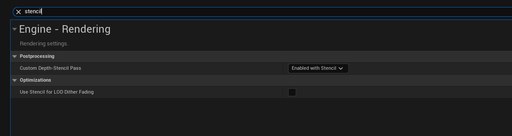
## 设置渲染自定义深度
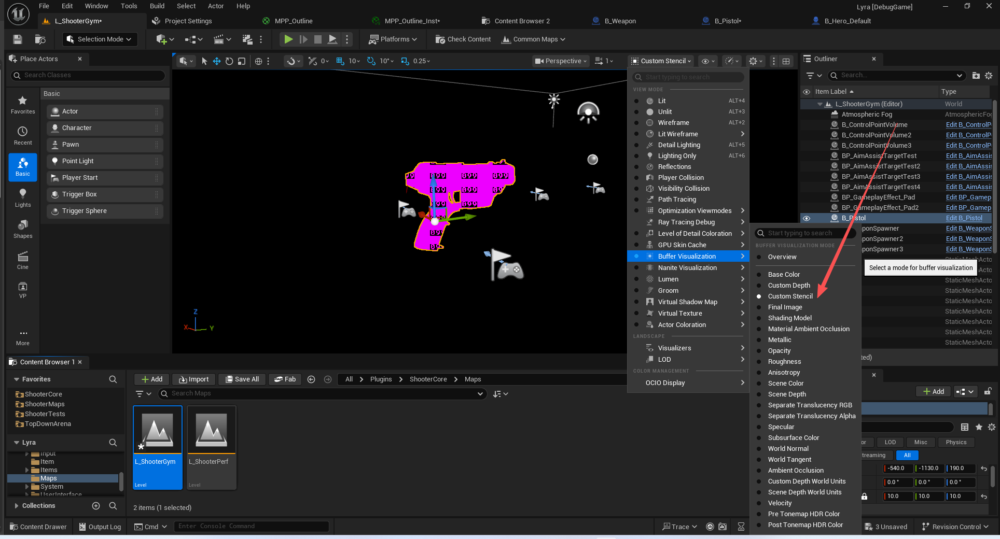
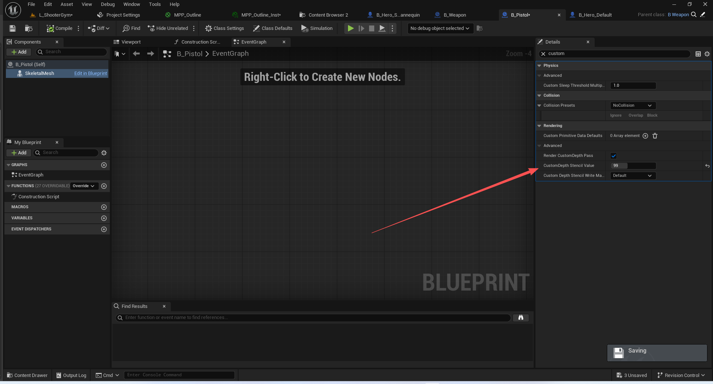

## 视图中查看

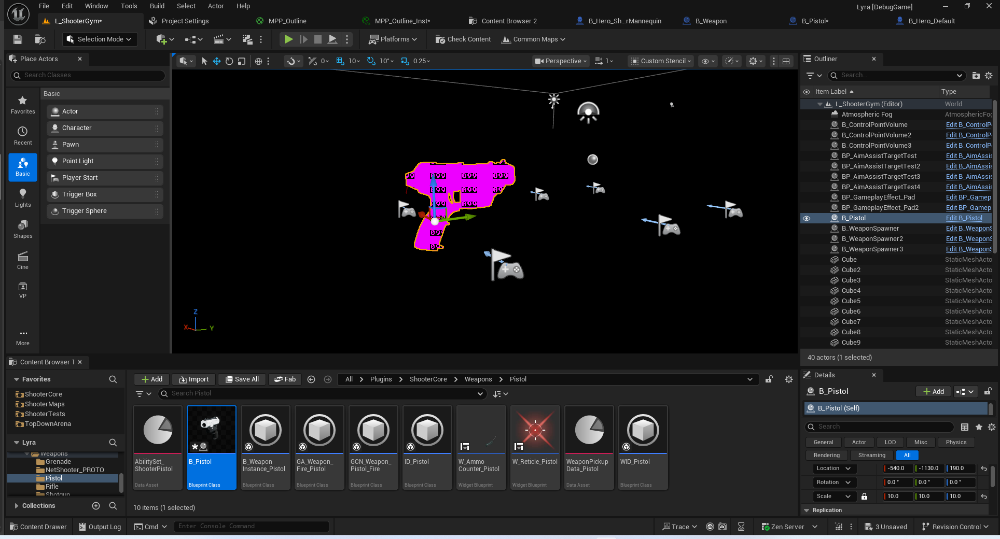

## 材质处理

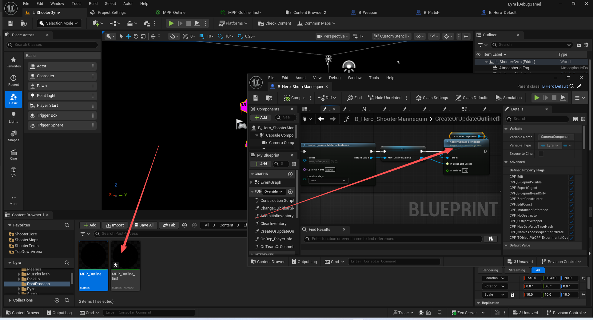
这个材质需要添加到后处理中或者相机上.

## 材质内部计算
### 1.拿到画面内容 叠加颜色
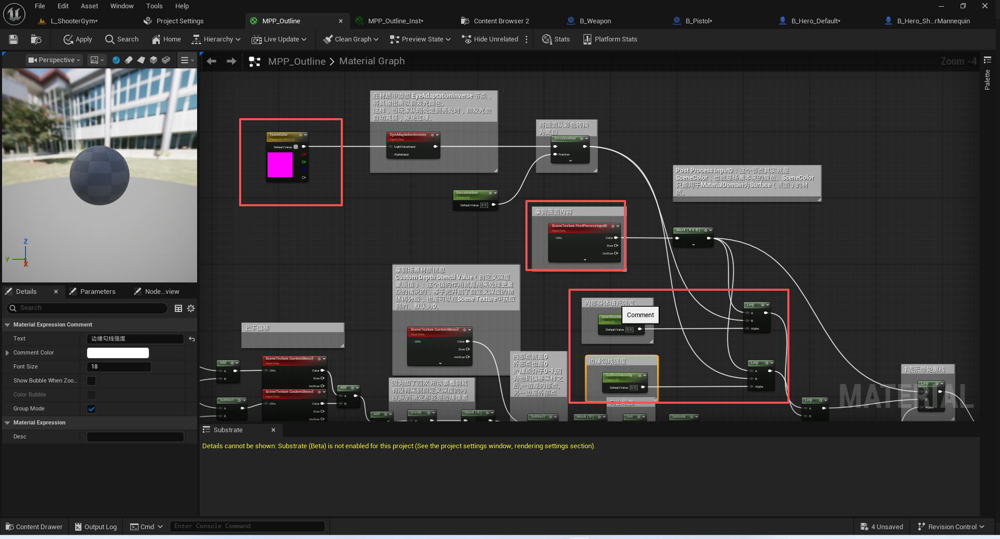
注意颜色叠加分两种情况,
第一种情况,内部叠加,浅色填充
第二种情况,边缘叠加,深色填充
### 2.区分队伍ID是否应用
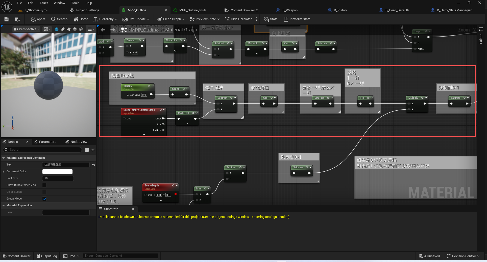
### 3.根据深度差确认是否有遮挡
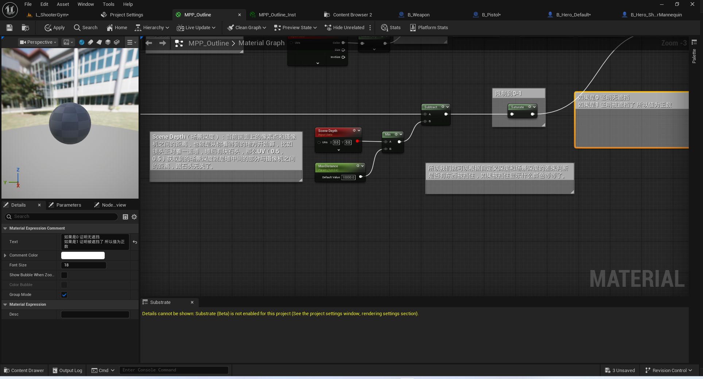
### 4.区分边缘像素的宽度 从四个方向出发
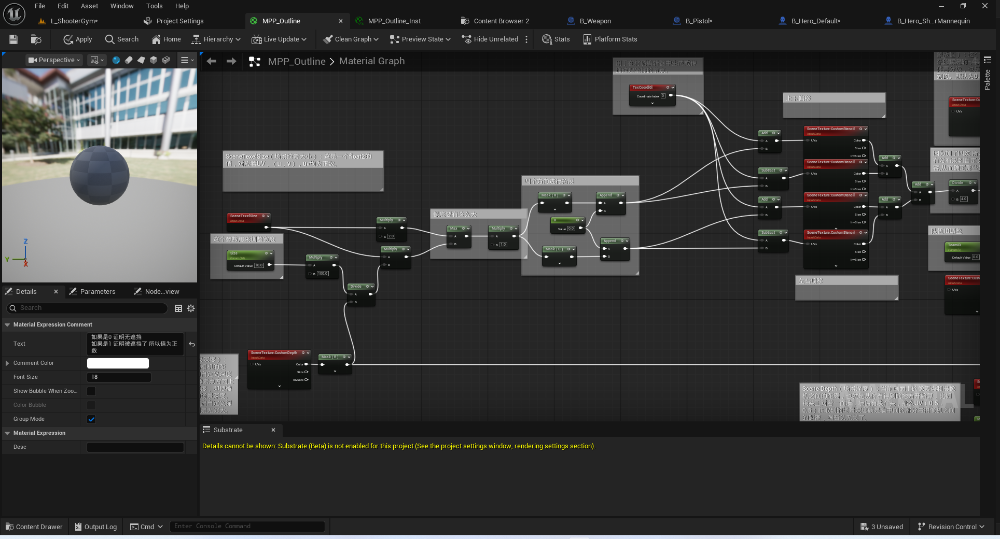

## 排除自己的后处理
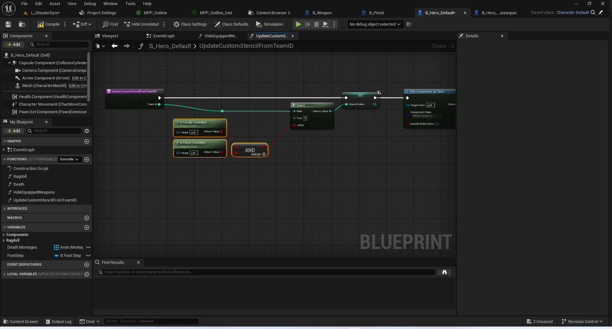

## 添加到相机而非全局后处理
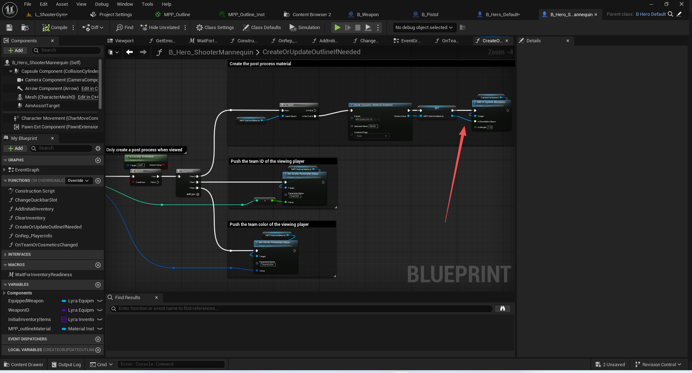

## 参考文献
https://dev.epicgames.com/documentation/en-us/unreal-engine/post-process-materials-in-unreal-engine?application_version=5.6&utm_source=editor&utm_medium=docs&utm_campaign=rich_tooltips
https://www.cnblogs.com/Dreammoon/p/18389077
https://developer.aliyun.com/article/1321504
## 总结
注意该外轮廓需要监听队伍的变化,从而更新颜色!