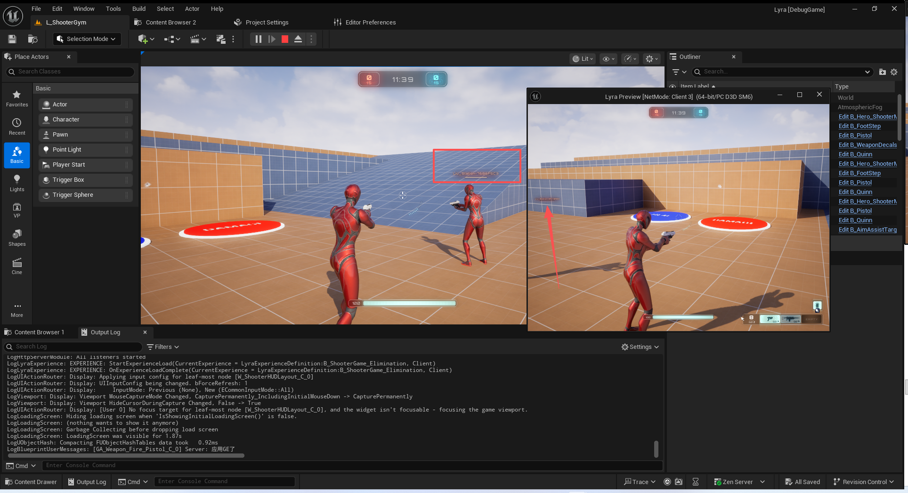
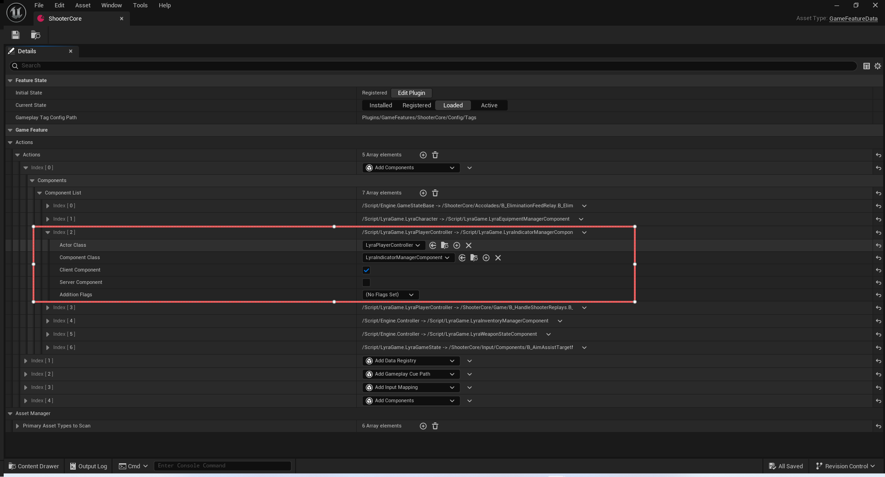
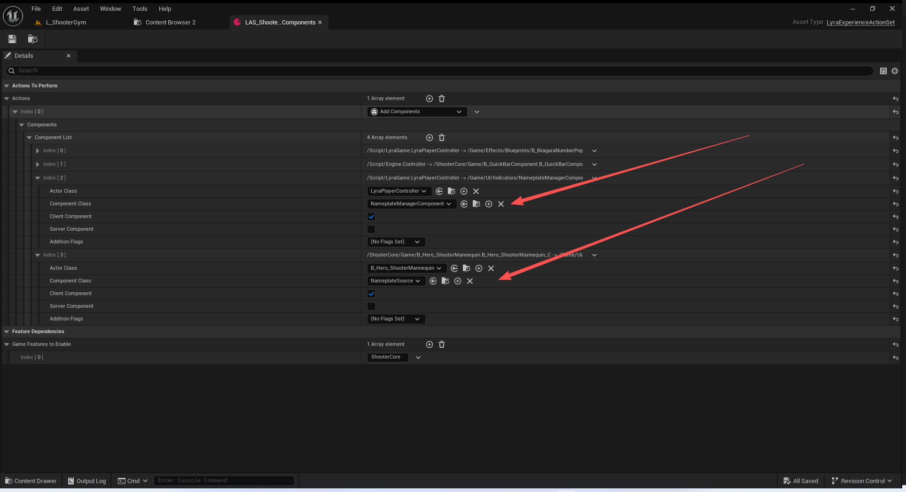
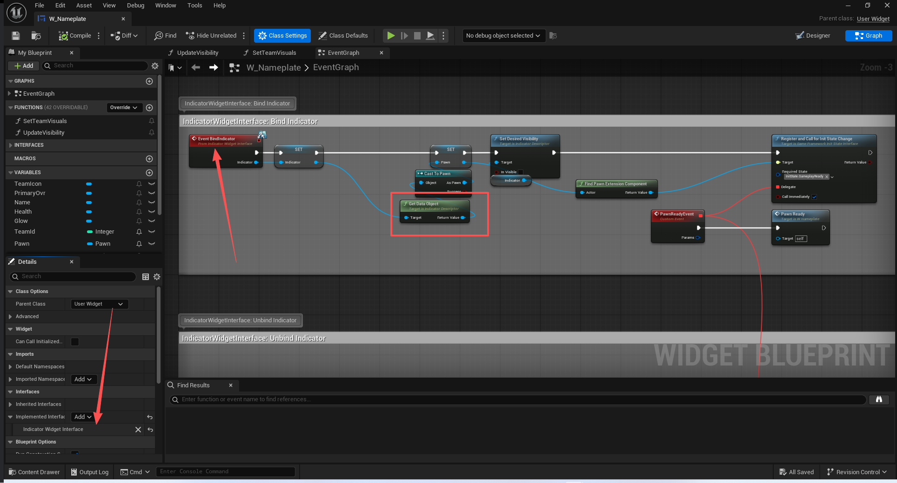
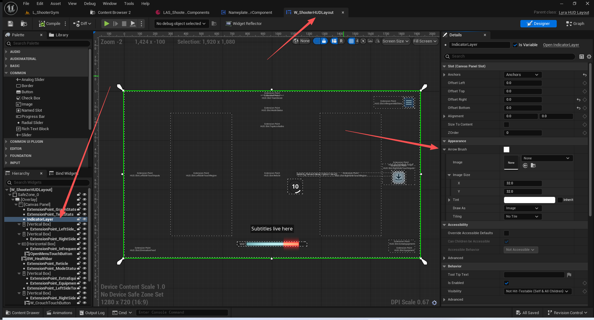
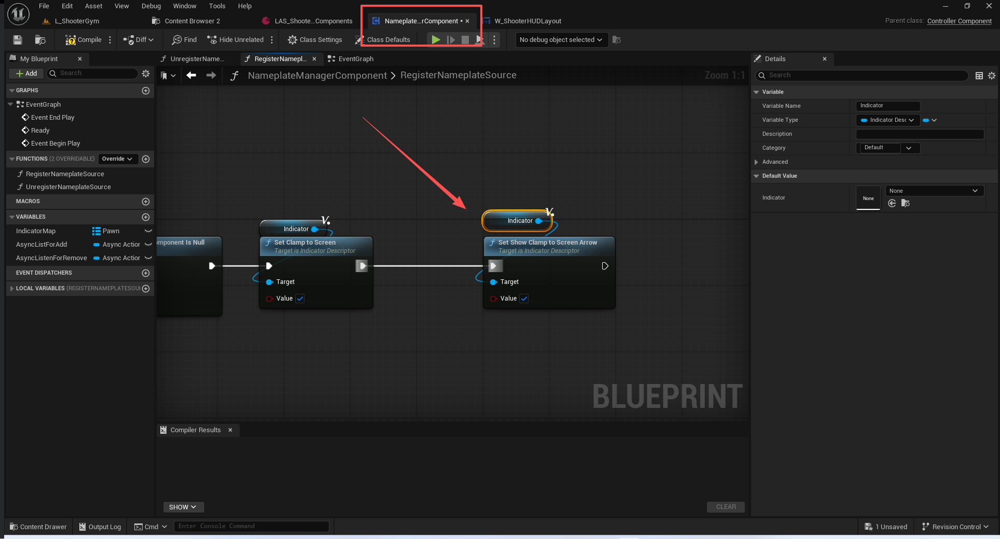
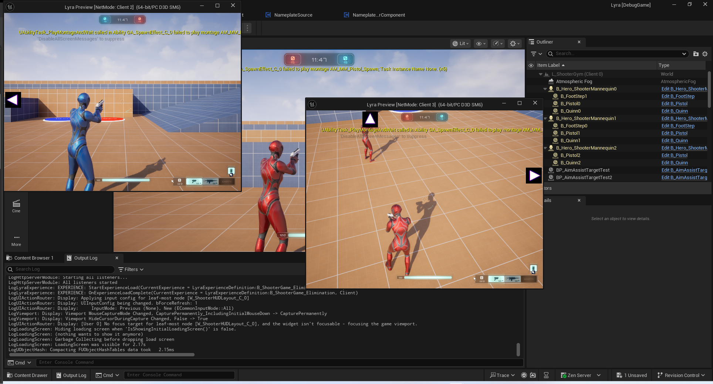
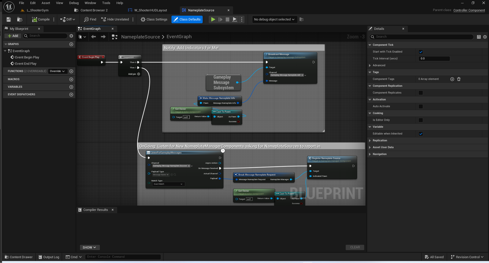
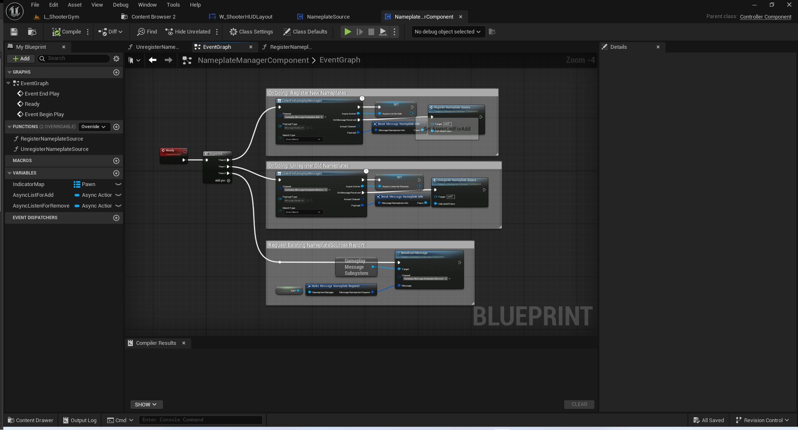
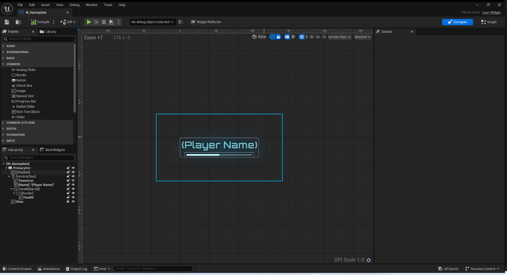

# UE5_Lyra学习指南_103_指示器系统

本文章仅为小刚-B站课堂-虚幻引擎视频课程Lyra-精讲的演讲手稿.  
本套课程链接:[[UE5]虚幻引擎游戏案例Lyra精讲](https://www.bilibili.com/cheese/play/ss112001159)  
前置课程链接:[[UE5]虚幻引擎UEC++从基础到进阶](https://www.bilibili.com/cheese/play/ss28043)  

文章内容由小刚撰写,采用了以下多种方式:  
1.口述转文字  
2.AI重构  
3.参考引擎源码  
4.Lyra工程源码  
5.结合社区论坛各位大佬的解析  

- [UE5\_Lyra学习指南\_103\_指示器系统](#ue5_lyra学习指南_103_指示器系统)
	- [概述](#概述)
	- [配置](#配置)
		- [架构层](#架构层)
		- [在控制器上添加指示器管理器](#在控制器上添加指示器管理器)
		- [申请层](#申请层)
	- [指示器的描述接口](#指示器的描述接口)
	- [指示器的数据定义](#指示器的数据定义)
		- [基本数据](#基本数据)
		- [布局数据](#布局数据)
		- [位置投射计算](#位置投射计算)
	- [指示器组件](#指示器组件)
	- [工具函数](#工具函数)
	- [指示器画布IndicatorLayer-UMG](#指示器画布indicatorlayer-umg)
		- [开启渲染箭头功能](#开启渲染箭头功能)
	- [SActorCanvas-Slate](#sactorcanvas-slate)
		- [构造函数传递参数](#构造函数传递参数)
			- [预分配箭头数量](#预分配箭头数量)
			- [更新活跃计时器](#更新活跃计时器)
			- [调用位置](#调用位置)
		- [Slate语法](#slate语法)
		- [槽位定义](#槽位定义)
			- [箭头槽位](#箭头槽位)
			- [正常槽位](#正常槽位)
		- [防止GC](#防止gc)
		- [更新指示器画布](#更新指示器画布)
			- [性能计数](#性能计数)
			- [与绘制函数交互](#与绘制函数交互)
			- [指示器的监听处理](#指示器的监听处理)
				- [转发到画布处理指](#转发到画布处理指)
				- [实际创建或移除](#实际创建或移除)
			- [更新指示器的投射数据](#更新指示器的投射数据)
			- [更新计时器执行预期](#更新计时器执行预期)
			- [计算投射屏幕位置](#计算投射屏幕位置)
			- [绘制过程](#绘制过程)
					- [调用子项的绘制](#调用子项的绘制)
				- [准备子项绘制信息](#准备子项绘制信息)
				- [不发生截断的信息添加](#不发生截断的信息添加)
				- [截断的位置调整](#截断的位置调整)
	- [蓝图申请添加](#蓝图申请添加)
		- [角色作为申请源](#角色作为申请源)
		- [组件管理所有的申请源](#组件管理所有的申请源)
		- [名片空间](#名片空间)
	- [修复交互系统的指示器代码](#修复交互系统的指示器代码)
	- [总结](#总结)


## 概述
本节主要讲解Lyra中的敌方或者友方的血条.
这个血条有个特点,可以限制到屏幕的边框.
还有就是,可以额外渲染一个箭头的图表在血条旁边.

## 配置
### 架构层
### 在控制器上添加指示器管理器

### 申请层
在控制器上添加名片管理组件
在角色身上添加名片来源组件

## 指示器的描述接口
``` cpp

/**
 * 用来传递指示描述器的接口
 * 控件来实现它,从而接收数据源对象
 * 控件由SActorCanvas实例化并调用
 * 调用位置:
 	// Create the widget from the pool.
	// 从池中创建该组件。
	if (UUserWidget* IndicatorWidget = IndicatorPool.GetOrCreateInstance(TSubclassOf<UUserWidget>(IndicatorClass.Get())))
	{
		if (IndicatorWidget->GetClass()->ImplementsInterface(UIndicatorWidgetInterface::StaticClass()))
		{
			IIndicatorWidgetInterface::Execute_BindIndicator(IndicatorWidget, Indicator);
		}
 * 
 */
UINTERFACE(MinimalAPI, BlueprintType)
class UIndicatorWidgetInterface : public UInterface
{
	GENERATED_BODY()
};

class IIndicatorWidgetInterface
{
	GENERATED_BODY()

public:
	// 绑定指示器
	UFUNCTION(BlueprintNativeEvent, Category = "Indicator")
	void BindIndicator(UIndicatorDescriptor* Indicator);

	// 解除指示器绑定
	UFUNCTION(BlueprintNativeEvent, Category = "Indicator")
	void UnbindIndicator(const UIndicatorDescriptor* Indicator);
};


```



## 指示器的数据定义
### 基本数据
``` cpp
private:
	friend class SActorCanvas;
	// 数据源
	UPROPERTY()
	TObjectPtr<UObject> DataObject;
	
	// 场景组件
	UPROPERTY()
	TObjectPtr<USceneComponent> Component;

	// 插槽名称
	UPROPERTY()
	FName ComponentSocketName = NAME_None;

	// 控件的类类型
	UPROPERTY()
	TSoftClassPtr<UUserWidget> IndicatorWidgetClass;

	// 指示器管理组件
	UPROPERTY()
	TWeakObjectPtr<ULyraIndicatorManagerComponent> ManagerPtr;

	// 没用到
	TWeakPtr<SWidget> Content;
	// 画布的Slate 由画布生成的渲染入口时通过SAssignNew分配过来!
	// 我们回收的时候也会用到
	TWeakPtr<SWidget> CanvasHost;

```
``` cpp
public:
	// 获取/设置绑定的数据对象
	UFUNCTION(BlueprintCallable)
	UObject* GetDataObject() const { return DataObject; }
	UFUNCTION(BlueprintCallable)
	void SetDataObject(UObject* InDataObject) { DataObject = InDataObject; }
	
	// 获取/设置场景组件
	UFUNCTION(BlueprintCallable)
	USceneComponent* GetSceneComponent() const { return Component; }
	UFUNCTION(BlueprintCallable)
	void SetSceneComponent(USceneComponent* InComponent) { Component = InComponent; }

	// 获取/设置插槽的名称
	UFUNCTION(BlueprintCallable)
	FName GetComponentSocketName() const { return ComponentSocketName; }
	UFUNCTION(BlueprintCallable)
	void SetComponentSocketName(FName SocketName) { ComponentSocketName = SocketName; }

	// 获取/设置使用的渲染控件类
	// 这个控件要实现指示器的接口,这样才能获取到绑定的数据源
	UFUNCTION(BlueprintCallable)
	TSoftClassPtr<UUserWidget> GetIndicatorClass() const { return IndicatorWidgetClass; }
	UFUNCTION(BlueprintCallable)
	void SetIndicatorClass(TSoftClassPtr<UUserWidget> InIndicatorWidgetClass)
	{
		IndicatorWidgetClass = InIndicatorWidgetClass;
	}

public:
	// TODO Organize this better.
	// （待办事项）将此内容整理得更有序一些。
	// 我们生成的控件 主要通过它去执行控件的接口函数
	TWeakObjectPtr<UUserWidget> IndicatorWidget;

```
### 布局数据
``` cpp
	UPROPERTY()
	bool bVisible = true;
	UPROPERTY()
	bool bClampToScreen = false;
	UPROPERTY()
	bool bShowClampToScreenArrow = false;
	UPROPERTY()
	bool bOverrideScreenPosition = false;
	UPROPERTY()
	bool bAutoRemoveWhenIndicatorComponentIsNull = false;

	UPROPERTY()
	EActorCanvasProjectionMode ProjectionMode = EActorCanvasProjectionMode::ComponentPoint;
	UPROPERTY()
	TEnumAsByte<EHorizontalAlignment> HAlignment = HAlign_Center;
	UPROPERTY()
	TEnumAsByte<EVerticalAlignment> VAlignment = VAlign_Center;

	UPROPERTY()
	int32 Priority = 0;

	UPROPERTY()
	FVector BoundingBoxAnchor = FVector(0.5, 0.5, 0.5);
	UPROPERTY()
	FVector2D ScreenSpaceOffset = FVector2D(0, 0);
	UPROPERTY()
	FVector WorldPositionOffset = FVector(0, 0, 0);

```

``` cpp

public:
	// Layout Properties
	//=======================
	// 获取可视性
	UFUNCTION(BlueprintCallable)
	bool GetIsVisible() const { return IsValid(GetSceneComponent()) && bVisible; }
	// 设置可视性
	UFUNCTION(BlueprintCallable)
	void SetDesiredVisibility(bool InVisible)
	{
		bVisible = InVisible;
	}
	// 获取/设置投射模型
	UFUNCTION(BlueprintCallable)
	EActorCanvasProjectionMode GetProjectionMode() const { return ProjectionMode; }
	UFUNCTION(BlueprintCallable)
	void SetProjectionMode(EActorCanvasProjectionMode InProjectionMode)
	{
		ProjectionMode = InProjectionMode;
	}

	// Horizontal alignment to the point in space to place the indicator at.
	// 将指示器水平对齐至空间中的指定位置。
	UFUNCTION(BlueprintCallable)
	EHorizontalAlignment GetHAlign() const { return HAlignment; }
	UFUNCTION(BlueprintCallable)
	void SetHAlign(EHorizontalAlignment InHAlignment)
	{
		HAlignment = InHAlignment;
	}

	// Vertical alignment to the point in space to place the indicator at.
	// 将指示器垂直对齐至空间中的指定位置。
	UFUNCTION(BlueprintCallable)
	EVerticalAlignment GetVAlign() const { return VAlignment; }
	UFUNCTION(BlueprintCallable)
	void SetVAlign(EVerticalAlignment InVAlignment)
	{
		VAlignment = InVAlignment;
	}

	// Clamp the indicator to the edge of the screen?
	// 将指示器固定在屏幕边缘？
	UFUNCTION(BlueprintCallable)
	bool GetClampToScreen() const { return bClampToScreen; }
	UFUNCTION(BlueprintCallable)
	void SetClampToScreen(bool bValue)
	{
		bClampToScreen = bValue;
	}

	// Show the arrow if clamping to the edge of the screen?
	// 如果将内容限制在屏幕边缘，是否显示箭头？
	UFUNCTION(BlueprintCallable)
	bool GetShowClampToScreenArrow() const { return bShowClampToScreenArrow; }
	UFUNCTION(BlueprintCallable)
	void SetShowClampToScreenArrow(bool bValue)
	{
		bShowClampToScreenArrow = bValue;
	}

	// The position offset for the indicator in world space.
	// 指示器在世界空间中的位置偏移量。
	UFUNCTION(BlueprintCallable)
	FVector GetWorldPositionOffset() const { return WorldPositionOffset; }
	UFUNCTION(BlueprintCallable)
	void SetWorldPositionOffset(FVector Offset)
	{
		WorldPositionOffset = Offset;
	}

	// The position offset for the indicator in screen space.
	// 指示器在屏幕空间中的位置偏移量。
	UFUNCTION(BlueprintCallable)
	FVector2D GetScreenSpaceOffset() const { return ScreenSpaceOffset; }
	UFUNCTION(BlueprintCallable)
	void SetScreenSpaceOffset(FVector2D Offset)
	{
		ScreenSpaceOffset = Offset;
	}
	//获取边界框锚点
	UFUNCTION(BlueprintCallable)
	FVector GetBoundingBoxAnchor() const { return BoundingBoxAnchor; }
	UFUNCTION(BlueprintCallable)
	void SetBoundingBoxAnchor(FVector InBoundingBoxAnchor)
	{
		BoundingBoxAnchor = InBoundingBoxAnchor;
	}

public:
	// Sorting Properties
	// 排序属性
	//=======================

	// Allows sorting the indicators (after they are sorted by depth), to allow some group of indicators
	// to always be in front of others.
	// 允许对指标进行排序（在按照深度排序之后），以便某些组的指标能够始终排在其他指标之前。
	UFUNCTION(BlueprintCallable)
	int32 GetPriority() const { return Priority; }
	UFUNCTION(BlueprintCallable)
	void SetPriority(int32 InPriority)
	{
		Priority = InPriority;
	}

public:
	ULyraIndicatorManagerComponent* GetIndicatorManagerComponent() { return ManagerPtr.Get(); }
	UE_API void SetIndicatorManagerComponent(ULyraIndicatorManagerComponent* InManager);
	
	UFUNCTION(BlueprintCallable)
	UE_API void UnregisterIndicator();
```
### 位置投射计算
``` cpp
UENUM(BlueprintType)
enum class EActorCanvasProjectionMode : uint8
{
	// 组件位置
	ComponentPoint,
	// 组件包围盒子
	ComponentBoundingBox,
	// 组件屏幕控件包围盒子
	ComponentScreenBoundingBox,
	// 对象包围盒子
	ActorBoundingBox,
	// 对象屏幕控件包围盒子
	ActorScreenBoundingBox
};
```
``` cpp
struct FIndicatorProjection
{
	bool Project(const UIndicatorDescriptor& IndicatorDescriptor,
		const FSceneViewProjectionData& InProjectionData,
		const FVector2f& ScreenSize, 
		FVector& ScreenPositionWithDepth);
};
```

## 指示器组件
``` cpp
/**
 * @class ULyraIndicatorManagerComponent
 * 指示器管理组件,记录所有进行渲染的指示器
 * 指示器由蓝图的名片管理器进行添加
 * 都是只需要在客户端需要有这个组件,由GameFeatureAction进行添加
 * 
 */
UCLASS(MinimalAPI, BlueprintType, Blueprintable)
class ULyraIndicatorManagerComponent : public UControllerComponent
{
	GENERATED_BODY()

public:
	// 构造函数
	// 让这个组件自动注册自动激活即可
	UE_API ULyraIndicatorManagerComponent(const FObjectInitializer& ObjectInitializer);

	// 工具函数 找到指示器管理器
	static UE_API ULyraIndicatorManagerComponent* GetComponent(AController* Controller);

	// 添加一个指示器 需要由画布来接收代理新增
	UFUNCTION(BlueprintCallable, Category = Indicator)
	UE_API void AddIndicator(UIndicatorDescriptor* IndicatorDescriptor);
	
	// 移除一个指示器 需要由画布来接收代理移除
	UFUNCTION(BlueprintCallable, Category = Indicator)
	UE_API void RemoveIndicator(UIndicatorDescriptor* IndicatorDescriptor);

	DECLARE_EVENT_OneParam(ULyraIndicatorManagerComponent, FIndicatorEvent, UIndicatorDescriptor* Descriptor)
	// 让对应的Slate控件可以监听新增或者减少的指示器
	FIndicatorEvent OnIndicatorAdded;
	FIndicatorEvent OnIndicatorRemoved;

	// 由画布调用
	// 因为世界切换之后,场景对象都消亡了,需要执行重新初始化时使用!
	const TArray<UIndicatorDescriptor*>& GetIndicators() const { return Indicators; }

private:
	// 容器
	UPROPERTY()
	TArray<TObjectPtr<UIndicatorDescriptor>> Indicators;
};

``` 

## 工具函数
``` cpp
UCLASS(MinimalAPI)
class UIndicatorLibrary : public UBlueprintFunctionLibrary
{
	GENERATED_BODY()

public:
	UE_API UIndicatorLibrary();
	
	/**  寻找指示器管理组件 */
	UFUNCTION(BlueprintCallable, Category = Indicator)
	static UE_API ULyraIndicatorManagerComponent* GetIndicatorManagerComponent(AController* Controller);
};

```

## 指示器画布IndicatorLayer-UMG
``` cpp
UCLASS()
class UIndicatorLayer : public UWidget
{
	GENERATED_UCLASS_BODY()

public:
	/** Default arrow brush to use if UI is clamped to the screen and needs to show an arrow. */
	UPROPERTY(EditAnywhere, BlueprintReadOnly, Category=Appearance)
	FSlateBrush ArrowBrush;

protected:
	// UWidget interface
	virtual void ReleaseSlateResources(bool bReleaseChildren) override;
	virtual TSharedRef<SWidget> RebuildWidget() override;
	// End UWidget

protected:
	TSharedPtr<SActorCanvas> MyActorCanvas;
};


```


``` cpp
UIndicatorLayer::UIndicatorLayer(const FObjectInitializer& ObjectInitializer)
	: Super(ObjectInitializer)
{
	// 允许将控件作为蓝图中的变量进行公开。并非所有控件都需要公开为变量，因此这仅允许最有用的控件最终被公开。
	bIsVariable = true;
	SetVisibility(ESlateVisibility::HitTestInvisible);
}

void UIndicatorLayer::ReleaseSlateResources(bool bReleaseChildren)
{
	Super::ReleaseSlateResources(bReleaseChildren);

	MyActorCanvas.Reset();
}

```

``` cpp

TSharedRef<SWidget> UIndicatorLayer::RebuildWidget()
{
	// 判断是否是游戏时
	if (!IsDesignTime())
	{
		ULocalPlayer* LocalPlayer = GetOwningLocalPlayer();
		// 我们应当要有一个有效的本地玩家类
		if (ensureMsgf(LocalPlayer, TEXT("Attempting to rebuild a UActorCanvas without a valid LocalPlayer!")))
		{
			// 将我们的本地玩家对象和箭头材质传递过去!
			MyActorCanvas = SNew(SActorCanvas, FLocalPlayerContext(LocalPlayer), &ArrowBrush);
			return MyActorCanvas.ToSharedRef();
		}
	}

	// Give it a trivial box, NullWidget isn't safe to use from a UWidget
	// 给它一个简单的框，使用 NullWidget 从 UWidget 中进行操作是不安全的。
	return SNew(SBox);
}

```




### 开启渲染箭头功能



## SActorCanvas-Slate
此处需要讲解AsyncMixin这个插件.
详细参照下片文档!

### 构造函数传递参数
``` cpp
TSharedRef<SWidget> UIndicatorLayer::RebuildWidget()
{
	if (!IsDesignTime())
	{
		ULocalPlayer* LocalPlayer = GetOwningLocalPlayer();
		if (ensureMsgf(LocalPlayer, TEXT("Attempting to rebuild a UActorCanvas without a valid LocalPlayer!")))
		{
			MyActorCanvas = SNew(SActorCanvas, FLocalPlayerContext(LocalPlayer), &ArrowBrush);
			return MyActorCanvas.ToSharedRef();
		}
	}

	// Give it a trivial box, NullWidget isn't safe to use from a UWidget
	// 给它一个简单的框，使用 NullWidget 从 UWidget 中进行操作是不安全的。
	return SNew(SBox);
}

```


``` cpp

	SActorCanvas()
		: CanvasChildren(this)
		, ArrowChildren(this)
		, AllChildren(this)
	{
		AllChildren.AddChildren(CanvasChildren);
		AllChildren.AddChildren(ArrowChildren);
	}
	// 构造函数 用来接收SNew传递过来的上下文信息
	void Construct(const FArguments& InArgs, const FLocalPlayerContext& InCtx, const FSlateBrush* ActorCanvasArrowBrush);


```
#### 预分配箭头数量
``` cpp
	// 本地玩家上下文信息
	LocalPlayerContext = InLocalPlayerContext;
	// 箭头材质信息
	ActorCanvasArrowBrush = InActorCanvasArrowBrush;

	// 设置指示器对象池的上下文世界
	IndicatorPool.SetWorld(LocalPlayerContext.GetWorld());

	// 不需要Tick
	SetCanTick(false);
	// 可见但不可进行点击测试（无法与光标交互）并且不会影响子元素（若有）的点击测试。
	SetVisibility(EVisibility::SelfHitTestInvisible);

	// Create 10 arrows for starters
	// 开始时,创建 10 个箭头图标
	for (int32 i = 0; i < 10; ++i)
	{
		TSharedRef<SActorCanvasArrowWidget> ArrowWidget = SNew(SActorCanvasArrowWidget, ActorCanvasArrowBrush);
		// 先让它处于折叠状态,我们需要使用的时候再展开
		ArrowWidget->SetVisibility(EVisibility::Collapsed);
		
		// 添加到我们的槽位上
		ArrowChildren.AddSlot(MoveTemp(
			FArrowSlot::FSlotArguments(MakeUnique<FArrowSlot>())
			[
				ArrowWidget
			]
		));
	}
	// 更新指示器激活时处理的定时器
	UpdateActiveTimer();
}
```
#### 更新活跃计时器
``` cpp
	// 用于更新设置指示器激活时的处理
	// 当我们有指示器关联内容的时候 必须要有这个定时器去更新指示器信息
	// 当我们上下文信息发生变化的时候 也必须要有这个定时器去触发一次更新 
	void UpdateActiveTimer();
```


``` cpp
void SActorCanvas::UpdateActiveTimer()
{
	// 1.我们有指示器或者箭头的时候,必须有这个定时器
	// 2.这里时考虑到组件释放之后需要重新更新
	const bool NeedsTicks = AllIndicators.Num() > 0 || !IndicatorComponentPtr.IsValid();

	// 当我们需要有这个定时器,当时我们的句柄居然是无效的 ,那我们就去开启这个定时器
	if (NeedsTicks && !TickHandle.IsValid())
	{
		/**
		 * 注册一个“活动计时器”委托，该委托将在一定的时间间隔内执行。只有在指定的时间间隔结束后，TickFunction 才会执行。
		 * 一个控件可以注册所需的任意数量的委托。在注册时要小心，以免出现重复的活动计时器。*
			一个活跃的计时器可以通过以下三种方式被注销：
	 		1. 调用 UnRegisterActiveTimer 函数，并使用此处返回的活跃计时器句柄进行操作。
			2. 由您的委托函数返回 EActiveTimerReturnType:：Stop。
			3. 销毁该控件。
	     * 活动定时器
	  	 * --------------
		 * Slate在一段时间内没有用户交互的情况下可能会进入休眠状态以节省电量。
		 * 然而，某些用户界面元素可能需要“驱动”用户界面，即使用户没有提供任何输入
		 * （例如，动画、视口渲染、异步轮询等）。一个组件会通过注册一个“活动定时器”来通知Slate这一点，
		 * 这个定时器会在指定的频率下执行以驱动用户界面。
		 * 通过这种方式，当没有输入且不需要触发任何活动定时器时，Slate可以进入休眠状态。
		 * 当任何活动定时器需要触发时，Slate的所有部分都会执行一次“计时和绘制”过程。
		 * @参数 间隔时间：每次执行计时器时之间的等待时间。将参数设为 0 表示每帧执行一次计时器。
		 * 如果错过某个间隔时间，委托函数不会被调用超过一次。
		 * @参数 计时器委托：每间隔 Period 秒执行一次的活动计时器委托函数。
		 * @返回 活动计时器句柄，可用于稍后取消注册。
		 * 
		 */
		TickHandle = RegisterActiveTimer(0, FWidgetActiveTimerDelegate::CreateSP(this, &SActorCanvas::UpdateCanvas));
	}
}


```
``` cpp

// FWidgetActiveTimerDelegate 的返回类型。请勿向蓝图公开。
enum class EActiveTimerReturnType : uint8
{
	/** If this value is returned, the widget's active timer will be unregistered automatically. No need to call UnRegisterActiveTimer. */
	/** 若返回此值，则该控件的活动计时器将自动解除注册。无需调用 UnRegisterActiveTimer 方法。*/
	Stop,
	/** If this value is returned, the widget will continue to have its timer delegate called on it. */
	/** 如果返回此值，则该控件将继续调用其定时器委托函数。*/
	Continue,
};

```
#### 调用位置
``` cpp
SActorCanvas::FScopedWidgetSlotArguments SActorCanvas::AddActorSlot(UIndicatorDescriptor* Indicator)
{
	TWeakPtr<SActorCanvas> WeakCanvas = SharedThis(this);
	// 这个写法比较特殊
	// 理解一下 就是将以这个指示器构建一个槽位FSlot,然后添加到我们面板的槽位容器CanvasChildren中,添加完成后执行面板的更新活跃计时器
	return FScopedWidgetSlotArguments{ MakeUnique<FSlot>(Indicator), this->CanvasChildren, INDEX_NONE
		, [WeakCanvas](const FSlot*, int32)
		{
			if (TSharedPtr<SActorCanvas> Canvas = WeakCanvas.Pin())
			{
				Canvas->UpdateActiveTimer();
			}
		}};
}
```
``` cpp
int32 SActorCanvas::RemoveActorSlot(const TSharedRef<SWidget>& SlotWidget)
{
	for (int32 SlotIdx = 0; SlotIdx < CanvasChildren.Num(); ++SlotIdx)
	{
		// 通过容器去移除指定的槽位,然后更新我们的活跃计时器
		if ( SlotWidget == CanvasChildren[SlotIdx].GetWidget() )
		{
			CanvasChildren.RemoveAt(SlotIdx);

			UpdateActiveTimer();

			return SlotIdx;
		}
	}

	return -1;
}
```


### Slate语法
``` cpp
	/** Begin the arguments for this slate widget */
	/** 开始此滑块控件的参数设置 */
	SLATE_BEGIN_ARGS(SActorCanvas) {
		_Visibility = EVisibility::HitTestInvisible;
	}

		/** Indicates that we have a slot that this widget supports */
		/** 表示我们拥有一个该控件所支持的插槽 */
		// * 在 SLATE_BEGIN_ARGS 和 SLATE_END_ARGS 之间使用此宏，
		//* 以便为采用构造模式的槽提供支持。
		SLATE_SLOT_ARGUMENT(SActorCanvas::FSlot, Slots)
	
	/** This always goes at the end 
	 *  这条注释总是在末尾出现
	 */
	SLATE_END_ARGS()

```
### 槽位定义
#### 箭头槽位
``` cpp
	/** ActorCanvas-specific slot class */
	// 特别指定箭头槽位定义
	class FArrowSlot : public TSlotBase<FArrowSlot>
	{
	};

```
#### 正常槽位
``` cpp
	/** ActorCanvas-specific slot class */
	// 正常绘制所使用的槽位定义
	class FSlot : public TSlotBase<FSlot>
	{
	public: 

		FSlot(UIndicatorDescriptor* InIndicator)
			: TSlotBase<FSlot>()
			, Indicator(InIndicator)
			, ScreenPosition(FVector2D::ZeroVector)
			, Depth(0)
			, Priority(0.f)
			, bIsIndicatorVisible(true)
			, bInFrontOfCamera(true)
			, bHasValidScreenPosition(false)
			, bDirty(true)
			, bWasIndicatorClamped(false)
			, bWasIndicatorClampedStatusChanged(false)
		{
		}
		// Slate语法
		SLATE_SLOT_BEGIN_ARGS(FSlot, TSlotBase<FSlot>)
		SLATE_SLOT_END_ARGS()
		// 复用这个构造函数
		using TSlotBase<FSlot>::Construct;
		
		// 获取/设置 指示器是否可见
		bool GetIsIndicatorVisible() const { return bIsIndicatorVisible; }
		void SetIsIndicatorVisible(bool bVisible)
		{
			if (bIsIndicatorVisible != bVisible)
			{
				bIsIndicatorVisible = bVisible;
				bDirty = true;
			}

			RefreshVisibility();
		}

		// 获取/设置 屏幕位置
		FVector2D GetScreenPosition() const { return ScreenPosition; }
		void SetScreenPosition(FVector2D InScreenPosition)
		{
			if (ScreenPosition != InScreenPosition)
			{
				ScreenPosition = InScreenPosition;
				bDirty = true;
			}
		}
		
		// 获取/设置 深度
		double GetDepth() const { return Depth; }
		void SetDepth(double InDepth)
		{
			if (Depth != InDepth)
			{
				Depth = InDepth;
				bDirty = true;
			}
		}

		// 获取/设置 优先级
		int32 GetPriority() const { return Priority; }
		void SetPriority(int32 InPriority)
		{
			if (Priority != InPriority)
			{
				Priority = InPriority;
				bDirty = true;
			}
		}

		// 获取/设置 是否在镜头前
		bool GetInFrontOfCamera() const { return bInFrontOfCamera; }
		void SetInFrontOfCamera(bool bInFront)
		{
			if (bInFrontOfCamera != bInFront)
			{
				bInFrontOfCamera = bInFront;
				bDirty = true;
			}

			RefreshVisibility();
		}

		// 获取/设置 是不是 有效的屏幕位置
		bool HasValidScreenPosition() const { return bHasValidScreenPosition; }
		void SetHasValidScreenPosition(bool bValidScreenPosition)
		{
			if (bHasValidScreenPosition != bValidScreenPosition)
			{
				bHasValidScreenPosition = bValidScreenPosition;
				bDirty = true;
			}

			RefreshVisibility();
		}

		// 是否是脏的
		bool bIsDirty() const { return bDirty; }

		// 清除脏标记
		void ClearDirtyFlag()
		{
			bDirty = false;
		}
		
		// 获取/设置 锁定在屏幕边缘
		bool WasIndicatorClamped() const { return bWasIndicatorClamped; }
		void SetWasIndicatorClamped(bool bWasClamped) const
		{
			if (bWasClamped != bWasIndicatorClamped)
			{
				bWasIndicatorClamped = bWasClamped;
				bWasIndicatorClampedStatusChanged = true;
			}
		}

		// 获取/设置 是否锁定状态发生了变化
		bool WasIndicatorClampedStatusChanged() const { return bWasIndicatorClampedStatusChanged; }
		void ClearIndicatorClampedStatusChangedFlag()
		{
			bWasIndicatorClampedStatusChanged = false;
		}

	private:
		// 刷新可视性
		void RefreshVisibility()
		{
			const bool bIsVisible = bIsIndicatorVisible && bHasValidScreenPosition;
			GetWidget()->SetVisibility(bIsVisible ? EVisibility::SelfHitTestInvisible : EVisibility::Collapsed);
		}

		//Kept Alive by SActorCanvas::AddReferencedObjects
		// 通过 SActorCanvas::AddReferencedObjects 方法得以保持运行状态
		// 避免GC回收掉了!!!!!!!!
		UIndicatorDescriptor* Indicator;
		// 屏幕位置
		FVector2D ScreenPosition;
		// 深度
		double Depth;
		// 优先级
		int32 Priority;

		// 是否可见
		uint8 bIsIndicatorVisible : 1;
		// 是否在镜头前
		uint8 bInFrontOfCamera : 1;
		// 是否是有效的屏幕位置
		uint8 bHasValidScreenPosition : 1;
		// 是否脏
		uint8 bDirty : 1;
		
		/** 
		 * Cached & frame-deferred value of whether the indicator was visually screen clamped last frame or not; 
		 * Semi-hacky mutable implementation as it is cached during a const paint operation
		 */
		/**
		* 存储并延迟处理上一帧中该指示器是否因屏幕遮挡而被截断的值；
		* 这是一种半不完美的可变实现方式，因为其是在常量绘制操作期间进行缓存的。*/
		mutable uint8 bWasIndicatorClamped : 1;
		mutable uint8 bWasIndicatorClampedStatusChanged : 1;

		// 友元持有它的容器
		friend class SActorCanvas;
	};


```

### 防止GC
来自FGCObject
此类为非 UObject 类型的对象提供了通用的垃圾回收注册机制。它是一个抽象基类，要求您实现 AddReferencedObjects() 方法。
``` cpp
class SActorCanvas : public SPanel, public FAsyncMixin, public FGCObject
{
	virtual FString GetReferencerName() const override;
	virtual void AddReferencedObjects( FReferenceCollector& Collector ) override;
}
```
``` CPP
FString SActorCanvas::GetReferencerName() const
{
	return TEXT("SActorCanvas");
}

void SActorCanvas::AddReferencedObjects( FReferenceCollector& Collector )
{
	Collector.AddReferencedObjects(AllIndicators);
}


```

### 更新指示器画布
``` cpp
	// 通过活跃定时器设定的执行函数,用来更新我们画布绘制所需要的数据
	EActiveTimerReturnType UpdateCanvas(double InCurrentTime, float InDeltaTime);

```
#### 性能计数
``` cpp
	QUICK_SCOPE_CYCLE_COUNTER(STAT_SActorCanvas_UpdateCanvas);
```
#### 与绘制函数交互
``` cpp
EActiveTimerReturnType SActorCanvas::UpdateCanvas(double InCurrentTime, float InDeltaTime)
{
	// ....
	// 需要有有效的绘制才可以执行,等待OnPaint执行后即可
	if (!OptionalPaintGeometry.IsSet())
	{
		return EActiveTimerReturnType::Continue;
	}
	// ....
}
```


``` cpp
int32 SActorCanvas::OnPaint(const FPaintArgs& Args, const FGeometry& AllottedGeometry, const FSlateRect& MyCullingRect, FSlateWindowElementList& OutDrawElements, int32 LayerId, const FWidgetStyle& InWidgetStyle, bool bParentEnabled) const
{
	QUICK_SCOPE_CYCLE_COUNTER(STAT_SActorCanvas_OnPaint);

	OptionalPaintGeometry = AllottedGeometry;
	
	// ,,,
}
```
#### 指示器的监听处理
``` cpp
	// Grab the local player
	// 获取本地玩家
	// 通过我们初始化传递过来的本地玩家上下文信息
	ULocalPlayer* LocalPlayer = LocalPlayerContext.GetLocalPlayer();
	// 是否 有缓存对应的指示器管理器
	ULyraIndicatorManagerComponent* IndicatorComponent = IndicatorComponentPtr.Get();
	if (IndicatorComponent == nullptr)
	{
		// 如果没有获取到就重新去获取一下,因为场景关卡切换,部分对象已经消亡的情况
		IndicatorComponent = ULyraIndicatorManagerComponent::GetComponent(LocalPlayerContext.GetPlayerController());
		if (IndicatorComponent)
		{
			// World may have changed
			// 世界或许已经发生了变化
			IndicatorPool.SetWorld(LocalPlayerContext.GetWorld());
			// 重新缓存
			IndicatorComponentPtr = IndicatorComponent;
			// 绑定 新增和移除指示器
			IndicatorComponent->OnIndicatorAdded.AddSP(this, &SActorCanvas::OnIndicatorAdded);
			IndicatorComponent->OnIndicatorRemoved.AddSP(this, &SActorCanvas::OnIndicatorRemoved);
			
			// 将现在已经有的添加进来
			for (UIndicatorDescriptor* Indicator : IndicatorComponent->GetIndicators())
			{
				OnIndicatorAdded(Indicator);
			}
		}
		else
		{
			//TODO HIDE EVERYTHING
			//  请务必隐藏所有内容
			return EActiveTimerReturnType::Continue;
		}
	}
```
##### 转发到画布处理指

``` cpp
	// 绑定在指示器管理组件上的 新增
	void OnIndicatorAdded(UIndicatorDescriptor* Indicator);
	// 绑定在指示器管理组件上的 移除
	void OnIndicatorRemoved(UIndicatorDescriptor* Indicator);

```

``` cpp
void SActorCanvas::OnIndicatorAdded(UIndicatorDescriptor* Indicator)
{
	AllIndicators.Add(Indicator);
	// 尚未激活的指示器
	InactiveIndicators.Add(Indicator);
	
	AddIndicatorForEntry(Indicator);
}

void SActorCanvas::OnIndicatorRemoved(UIndicatorDescriptor* Indicator)
{
	RemoveIndicatorForEntry(Indicator);
	
	AllIndicators.Remove(Indicator);
	// 尚未激活的指示器
	InactiveIndicators.Remove(Indicator);
}
```
##### 实际创建或移除

``` cpp
void SActorCanvas::AddIndicatorForEntry(UIndicatorDescriptor* Indicator)
{
	// Async load the indicator, and pool the results so that it's easy to use and reuse the widgets.
	// 异步加载指示器，并将结果进行池化处理，以便于使用和重复利用这些组件。
	TSoftClassPtr<UUserWidget> IndicatorClass = Indicator->GetIndicatorClass();
	
	if (!IndicatorClass.IsNull())
	{	// 注意这个WeakObjectPtr 因为说不准等我们加载完成 这个对象就已经回收了
		TWeakObjectPtr<UIndicatorDescriptor> IndicatorPtr(Indicator);
		
		AsyncLoad(IndicatorClass, [this, IndicatorPtr, IndicatorClass]() {
			
			if (UIndicatorDescriptor* Indicator = IndicatorPtr.Get())
			{
				// While async loading this indicator widget we could have removed it.
				// 在异步加载此指示器组件时，我们本可以将其移除。
				// 居然没有包含,那说明已经不需要渲染它了!
				if (!AllIndicators.Contains(Indicator))
				{
					return;
				}

				// Create the widget from the pool.
				// 从池中创建该组件。
				if (UUserWidget* IndicatorWidget = IndicatorPool.GetOrCreateInstance(TSubclassOf<UUserWidget>(IndicatorClass.Get())))
				{
					// 触发我们的接口!!!! 
					// 让控件可以拿到执行器,从而拿到绑定的数据源对象,比如我们的Pawn
					if (IndicatorWidget->GetClass()->ImplementsInterface(UIndicatorWidgetInterface::StaticClass()))
					{
						IIndicatorWidgetInterface::Execute_BindIndicator(IndicatorWidget, Indicator);
					}
					// 持有我们生成的控件 这也是一个弱指针
					// 它会放到我们这个容器面板中 所以ok
					Indicator->IndicatorWidget = IndicatorWidget;

					// 从尚未激活的指示器容器中移除
					InactiveIndicators.Remove(Indicator);

					AddActorSlot(Indicator)
					[
						// 这个Slate宏的意思 把我们这个控件分配到这个智能指针所在的位置
						SAssignNew(Indicator->CanvasHost, SBox)
						[
							// 通过UMG获取底层的Slate控件
							IndicatorWidget->TakeWidget()
						]
					];
				}
			}
		});
		// 这是FAsyncMixin的写法
		// 启动异步加载,当然,不写这个,它下一帧也会去加载
		// 具体看插件源码注释即可 比较简单好用
		StartAsyncLoading();
	}
}


void SActorCanvas::RemoveIndicatorForEntry(UIndicatorDescriptor* Indicator)
{
	// 先执行控件的移除指示器接口 如果我们实现了的华
	if (UUserWidget* IndicatorWidget = Indicator->IndicatorWidget.Get())
	{
		if (IndicatorWidget->GetClass()->ImplementsInterface(UIndicatorWidgetInterface::StaticClass()))
		{
			IIndicatorWidgetInterface::Execute_UnbindIndicator(IndicatorWidget, Indicator);
		}

		Indicator->IndicatorWidget = nullptr;
		// 对象池 释放资源
		/** 将一个组件对象归还至池中，以便日后能够再次使用该组件 */
		// 默认不释放Slate资源
		IndicatorPool.Release(IndicatorWidget);
	}

	// 注意这里使用的都是智能指针,所以释放的只是这里的引用,真正的资源回收,要所有的引用处都释放才可以
	// 注意区分TSharedPtr TWeakPtr

	// 释放对应的Slate资源
	TSharedPtr<SWidget> CanvasHost = Indicator->CanvasHost.Pin();
	if (CanvasHost.IsValid())
	{
		RemoveActorSlot(CanvasHost.ToSharedRef());
		Indicator->CanvasHost.Reset();
	}
}
```
``` cpp
SActorCanvas::FScopedWidgetSlotArguments SActorCanvas::AddActorSlot(UIndicatorDescriptor* Indicator)
{
	TWeakPtr<SActorCanvas> WeakCanvas = SharedThis(this);
	// 这个写法比较特殊
	// 理解一下 就是将以这个指示器构建一个槽位FSlot,然后添加到我们面板的槽位容器CanvasChildren中,添加完成后执行面板的更新活跃计时器
	return FScopedWidgetSlotArguments{ MakeUnique<FSlot>(Indicator), this->CanvasChildren, INDEX_NONE
		, [WeakCanvas](const FSlot*, int32)
		{
			if (TSharedPtr<SActorCanvas> Canvas = WeakCanvas.Pin())
			{
				Canvas->UpdateActiveTimer();
			}
		}};
}

int32 SActorCanvas::RemoveActorSlot(const TSharedRef<SWidget>& SlotWidget)
{
	for (int32 SlotIdx = 0; SlotIdx < CanvasChildren.Num(); ++SlotIdx)
	{
		// 通过容器去移除指定的槽位,然后更新我们的活跃计时器
		if ( SlotWidget == CanvasChildren[SlotIdx].GetWidget() )
		{
			CanvasChildren.RemoveAt(SlotIdx);

			UpdateActiveTimer();

			return SlotIdx;
		}
	}

	return -1;
}

```
注意每次更新后都需要刷新活跃计时器.

#### 更新指示器的投射数据
``` cpp
//Make sure we have a player. If we don't, we can't project anything
	// 请确保我们有一名玩家。如果没有玩家，我们就无法进行任何操作。
	if (LocalPlayer)
	{
		/*
		 * FGeometry
		 * 表示滑板中一个控件的位置、大小以及绝对位置。
		 * 几何体的绝对位置通常取决于其起始位置是在屏幕空间还是窗口空间。
		 * 几何体通常与一个 SWidget 指针一起使用，以提供有关特定控件的信息（参见 FArrangedWidget）。
		 * 几何体的父级通常被认为是对应父控件的几何体。
		 */
		const FGeometry PaintGeometry = OptionalPaintGeometry.GetValue();

		// 一个“FSceneView”的投影数据
		FSceneViewProjectionData ProjectionData;
		/**
	 	* 用于获取投影所需的各种数据的辅助函数*
		 * @参数  视口：视图客户端的视口
		 * @参数  投影数据：用于填充投影数据的结构体
		 * @参数  立体视图索引：使用立体显示时视图的索引
		 * @返回值  若没有视口，或者若该对象为 null，则返回 False
		 * 
		 */
		if (LocalPlayer->GetProjectionData(LocalPlayer->ViewportClient->Viewport, /*out*/ ProjectionData))
		{
			// 开启所有渲染
			SetShowAnyIndicators(true);

			// 指示器是否有改变
			bool IndicatorsChanged = false;

			// 先循环我们所有的普通子项
			for (int32 ChildIndex = 0; ChildIndex < CanvasChildren.Num(); ++ChildIndex)
			{
				SActorCanvas::FSlot& CurChild = CanvasChildren[ChildIndex];
				UIndicatorDescriptor* Indicator = CurChild.Indicator;

				// If the slot content is invalid and we have permission to remove it
				// 如果槽位内容无效，并且我们有权限将其删除
				if (Indicator->CanAutomaticallyRemove())
				{
					IndicatorsChanged = true;

					RemoveIndicatorForEntry(Indicator);
					// Decrement the current index to account for the removal 
					// 减少当前索引值，以反映该项的移除操作
					--ChildIndex;
					continue;
					
					// 这里的写法有点危险 就是在循环中移除指定的元素
					// 看了一下移除的代码,ok,因为移除之后,这个CanvasChildren.Num()是Reset了的,索引也得到了有效处理
					/*
					* 	TPanelChildren 
					* 	void RemoveAt( int32 Index )
						{
							// NOTE:
							// We don't do any invalidating here, that's handled by the FSlotBase, which eventually calls ConditionallyDetatchParentWidget

							// Steal the instance from the array, then free the element.
							// This alleviates issues where (misbehaving) destructors on the children may call back into this class and query children while they are being destroyed.
							TUniquePtr<SlotType> SlotToRemove = MoveTemp(Children[Index]);
							Children.RemoveAt(Index);
							SlotToRemove.Reset();
						}

					 */
					
				}
				
				// 现在这个指示器是有效的了 读取指示器的可视性
				CurChild.SetIsIndicatorVisible(Indicator->GetIsVisible());

				// 如果不可见的话
				if (!CurChild.GetIsIndicatorVisible())
				{
					// 是否是这一帧做的设置 修改了指示器的可见性或者屏幕位置
					// 如果是的话 将这个变化合并到IndicatorsChanged的信号量上
					IndicatorsChanged |= CurChild.bIsDirty();
					// 清除本帧标记
					CurChild.ClearDirtyFlag();
					continue;
				}

				// 是否这帧发生了锁定状态的变化
				
				// If the indicator changed clamp status between updates, alert the indicator and mark the indicators as changed
				// 如果指标在更新过程中状态发生了变化，则通知该指标并将其标记为已更改状态
				if (CurChild.WasIndicatorClampedStatusChanged())
				{
					//Indicator->OnIndicatorClampedStatusChanged(CurChild.WasIndicatorClamped());
					// 指示器 -> 当指示器被锁定状态发生变化时（当前子指示器的锁定状态是否发生改变）：CurChild.WasIndicatorClamped
					CurChild.ClearIndicatorClampedStatusChangedFlag();
					// 将变化合并上去
					IndicatorsChanged = true;
				}

				FVector ScreenPositionWithDepth;

				// 投射位置
				FIndicatorProjection Projector;
				const bool Success = Projector.Project(*Indicator, ProjectionData, PaintGeometry.Size, OUT ScreenPositionWithDepth);

				// 投射失败了
				if (!Success)
				{
					// 无效屏幕位置
					CurChild.SetHasValidScreenPosition(false);
					// 不在镜头前
					CurChild.SetInFrontOfCamera(false);

					// 看看是不是这帧导致的 还是一直都是!
					IndicatorsChanged |= CurChild.bIsDirty();
					CurChild.ClearDirtyFlag();
					continue;
				}

				// 投射成功了
				CurChild.SetInFrontOfCamera(Success);
				// 是否有效
				// 在玩家镜头前或者可以锁定在边缘
				CurChild.SetHasValidScreenPosition(CurChild.GetInFrontOfCamera() || Indicator->GetClampToScreen());

				// 是否是有效位置
				if (CurChild.HasValidScreenPosition())
				{
					// Only dirty the screen position if we can actually show this indicator.
					// 仅在能够实际显示此指示器的情况下才需对屏幕位置进行污损处理。
					// 获取X,Y作为屏幕位置
					CurChild.SetScreenPosition(FVector2D(ScreenPositionWithDepth));
					// 这里应该是写错了,应当是Z才对,不过我们应该没用到这个深度
					// OutScreenPositionWithDepth = FVector(OutScreenSpacePosition.X, OutScreenSpacePosition.Y, FVector::Dist(InProjectionData.ViewOrigin, ProjectWorldLocation));

					CurChild.SetDepth(ScreenPositionWithDepth.X);
				}
				// 设置优先级
				CurChild.SetPriority(Indicator->GetPriority());
				// 看看是不是有发生变化
				IndicatorsChanged |= CurChild.bIsDirty();
				CurChild.ClearDirtyFlag();
			}

			if (IndicatorsChanged)
			{
				/**
				 * 对于拥有此控件的布局缓存控件而言，会取消该控件的效力。
				 * 将迫使拥有该控件的控件在下一次绘制过程中重新绘制并缓存其子控件。
				 * 
				 */
				// Paint 当组件的图形已发生更改，但不影响尺寸时使用此方法。
				Invalidate(EInvalidateWidget::Paint);
			}
		}
		else
		{
			// 无有效投射数据,关闭所有渲染
			SetShowAnyIndicators(false);
		}
	}
	else
	{
		// 无有效本地玩家类,关闭所有渲染
		SetShowAnyIndicators(false);
	}

```

``` cpp
bool FIndicatorProjection::Project(const UIndicatorDescriptor& IndicatorDescriptor, const FSceneViewProjectionData& InProjectionData, const FVector2f& ScreenSize, FVector& OutScreenPositionWithDepth)
{
	if (USceneComponent* Component = IndicatorDescriptor.GetSceneComponent())
	{
		TOptional<FVector> WorldLocation;
		if (IndicatorDescriptor.GetComponentSocketName() != NAME_None)
		{
			WorldLocation = Component->GetSocketTransform(IndicatorDescriptor.GetComponentSocketName()).GetLocation();
		}
		else
		{
			WorldLocation = Component->GetComponentLocation();
		}

		const FVector ProjectWorldLocation = WorldLocation.GetValue() + IndicatorDescriptor.GetWorldPositionOffset();
		const EActorCanvasProjectionMode ProjectionMode = IndicatorDescriptor.GetProjectionMode();
		
		switch (ProjectionMode)
		{
			case EActorCanvasProjectionMode::ComponentPoint:
			{
				if (WorldLocation.IsSet())
				{
					FVector2D OutScreenSpacePosition;
					const bool bInFrontOfCamera = ULocalPlayer::GetPixelPoint(InProjectionData, ProjectWorldLocation, OutScreenSpacePosition, &ScreenSize);

					OutScreenSpacePosition.X += IndicatorDescriptor.GetScreenSpaceOffset().X * (bInFrontOfCamera ? 1 : -1);
					OutScreenSpacePosition.Y += IndicatorDescriptor.GetScreenSpaceOffset().Y;

					if (!bInFrontOfCamera && FBox2f(FVector2f::Zero(), ScreenSize).IsInside((FVector2f)OutScreenSpacePosition))
					{
						const FVector2f CenterToPosition = (FVector2f(OutScreenSpacePosition) - (ScreenSize / 2)).GetSafeNormal();
						OutScreenSpacePosition = FVector2D((ScreenSize / 2) + CenterToPosition * ScreenSize);
					}

					OutScreenPositionWithDepth = FVector(OutScreenSpacePosition.X, OutScreenSpacePosition.Y, FVector::Dist(InProjectionData.ViewOrigin, ProjectWorldLocation));

					return true;
				}

				return false;
			}
			case EActorCanvasProjectionMode::ComponentScreenBoundingBox:
			case EActorCanvasProjectionMode::ActorScreenBoundingBox:
			{
				FBox IndicatorBox;
				if (ProjectionMode == EActorCanvasProjectionMode::ActorScreenBoundingBox)
				{
					IndicatorBox = Component->GetOwner()->GetComponentsBoundingBox();
				}
				else
				{
					IndicatorBox = Component->Bounds.GetBox();
				}

				FVector2D LL, UR;
				const bool bInFrontOfCamera = ULocalPlayer::GetPixelBoundingBox(InProjectionData, IndicatorBox, LL, UR, &ScreenSize);
			
				const FVector& BoundingBoxAnchor = IndicatorDescriptor.GetBoundingBoxAnchor();
				const FVector2D& ScreenSpaceOffset = IndicatorDescriptor.GetScreenSpaceOffset();

				FVector ScreenPositionWithDepth;
				ScreenPositionWithDepth.X = FMath::Lerp(LL.X, UR.X, BoundingBoxAnchor.X) + ScreenSpaceOffset.X * (bInFrontOfCamera ? 1 : -1);
				ScreenPositionWithDepth.Y = FMath::Lerp(LL.Y, UR.Y, BoundingBoxAnchor.Y) + ScreenSpaceOffset.Y;
				ScreenPositionWithDepth.Z = FVector::Dist(InProjectionData.ViewOrigin, ProjectWorldLocation);

				const FVector2f ScreenSpacePosition = FVector2f(FVector2D(ScreenPositionWithDepth));
				if (!bInFrontOfCamera && FBox2f(FVector2f::Zero(), ScreenSize).IsInside(ScreenSpacePosition))
				{
					const FVector2f CenterToPosition = (ScreenSpacePosition - (ScreenSize / 2)).GetSafeNormal();
					const FVector2f ScreenPositionFromBehind = (ScreenSize / 2) + CenterToPosition * ScreenSize;
					ScreenPositionWithDepth.X = ScreenPositionFromBehind.X;
					ScreenPositionWithDepth.Y = ScreenPositionFromBehind.Y;
				}
				
				OutScreenPositionWithDepth = ScreenPositionWithDepth;
				return true;
			}
			case EActorCanvasProjectionMode::ActorBoundingBox:
			case EActorCanvasProjectionMode::ComponentBoundingBox:
			{
				FBox IndicatorBox;
				if (ProjectionMode == EActorCanvasProjectionMode::ActorBoundingBox)
				{
					IndicatorBox = Component->GetOwner()->GetComponentsBoundingBox();
				}
				else
				{
					IndicatorBox = Component->Bounds.GetBox();
				}

				const FVector ProjectBoxPoint = IndicatorBox.GetCenter() + (IndicatorBox.GetSize() * (IndicatorDescriptor.GetBoundingBoxAnchor() - FVector(0.5)));

				FVector2D OutScreenSpacePosition;
				const bool bInFrontOfCamera = ULocalPlayer::GetPixelPoint(InProjectionData, ProjectBoxPoint, OutScreenSpacePosition, &ScreenSize);
				OutScreenSpacePosition.X += IndicatorDescriptor.GetScreenSpaceOffset().X * (bInFrontOfCamera ? 1 : -1);
				OutScreenSpacePosition.Y += IndicatorDescriptor.GetScreenSpaceOffset().Y;

				if (!bInFrontOfCamera && FBox2f(FVector2f::Zero(), ScreenSize).IsInside((FVector2f)OutScreenSpacePosition))
				{
					const FVector2f CenterToPosition = (FVector2f(OutScreenSpacePosition) - (ScreenSize / 2)).GetSafeNormal();
					OutScreenSpacePosition = FVector2D((ScreenSize / 2) + CenterToPosition * ScreenSize);
				}

				OutScreenPositionWithDepth = FVector(OutScreenSpacePosition.X, OutScreenSpacePosition.Y, FVector::Dist(InProjectionData.ViewOrigin, ProjectBoxPoint));
					
				return true;
			}
		}
	}

	return false;
}

```
#### 更新计时器执行预期
``` cpp
	if (AllIndicators.Num() == 0)
	{
		TickHandle.Reset();
		return EActiveTimerReturnType::Stop;
	}
	else
	{
		return EActiveTimerReturnType::Continue;
	}
```

#### 计算投射屏幕位置
``` cpp
struct FIndicatorProjection
{
	/**
	 * 计算带有深度屏幕位置投射
	 * @param IndicatorDescriptor 指示器
	 * @param InProjectionData 玩家的场景投影数据
	 * @param ScreenSize 屏幕大小
	 * @param ScreenPositionWithDepth 带有深度的屏幕位置
	 * @return 是否成功
	 */
	bool Project(const UIndicatorDescriptor& IndicatorDescriptor,
	             const FSceneViewProjectionData& InProjectionData,
	             const FVector2f& ScreenSize, 
	             FVector& ScreenPositionWithDepth);
};

UENUM(BlueprintType)
enum class EActorCanvasProjectionMode : uint8
{
	// 组件位置
	ComponentPoint,
	// 组件包围盒子
	ComponentBoundingBox,
	// 组件屏幕控件包围盒子
	ComponentScreenBoundingBox,
	// 对象包围盒子
	ActorBoundingBox,
	// 对象屏幕控件包围盒子
	ActorScreenBoundingBox
};
```

``` cpp

bool FIndicatorProjection::Project(const UIndicatorDescriptor& IndicatorDescriptor,
                                   const FSceneViewProjectionData& InProjectionData,
                                   const FVector2f& ScreenSize,
                                   FVector& OutScreenPositionWithDepth)
{
	// 必须要能获取到场景组件
	// NameplateManagerComponent
	// 这个场景组件由蓝图名片管理器组件设置进来 是角色的胶囊体
	if (USceneComponent* Component = IndicatorDescriptor.GetSceneComponent())
	{
		TOptional<FVector> WorldLocation;
		// 获取Socker的位置
		if (IndicatorDescriptor.GetComponentSocketName() != NAME_None)
		{
			WorldLocation = Component->GetSocketTransform(IndicatorDescriptor.GetComponentSocketName()).GetLocation();
		}
		else
		{
			WorldLocation = Component->GetComponentLocation();
		}

		// 加上偏移
		const FVector ProjectWorldLocation = WorldLocation.GetValue() + IndicatorDescriptor.GetWorldPositionOffset();
		// 考虑投射模式
		const EActorCanvasProjectionMode ProjectionMode = IndicatorDescriptor.GetProjectionMode();

		switch (ProjectionMode)
		{
		case EActorCanvasProjectionMode::ComponentPoint:
			{
				if (WorldLocation.IsSet())
				{
					FVector2D OutScreenSpacePosition;
					// 玩家的场景投影数据,需要投射的场景位置,以及投射的屏幕大小,最后输出的尺寸

					/**
					   此功能将根据世界空间位置为您计算出像素空间中的一个坐标点。*
					 * @参数：InPoint		世界空间中的点
					 * @参数：OutPoint		像素空间中的点
					 * @返回值：若不存在视口，或者该矩形完全位于摄像机后方，则返回 False
					 * 
					 */
					const bool bInFrontOfCamera = ULocalPlayer::GetPixelPoint(
						InProjectionData, ProjectWorldLocation, OutScreenSpacePosition, &ScreenSize);

					// 考虑前后的影响
					// 确保X 恒定为正数,方便我们计算在身后的溢出距离!!!
					OutScreenSpacePosition.X += IndicatorDescriptor.GetScreenSpaceOffset().X * (
						bInFrontOfCamera ? 1 : -1);
					OutScreenSpacePosition.Y += IndicatorDescriptor.GetScreenSpaceOffset().Y;

					// 如果不在镜头前方 那么是否在我们屏幕大小的盒子内呢?
					// 检查给定的点是否位于此矩形区域内。
					if (!bInFrontOfCamera && FBox2f(FVector2f::Zero(), ScreenSize).IsInside(
						(FVector2f)OutScreenSpacePosition))
					{
						// 如果是的话 需要调整到屏幕边缘
						// 获取一下当前这个点 指向了那一边
						// ScreenSize / 2是像素空间的中心
						// CenterToPosition是由像素中心指向输出的这个点的方向
						// 最后中心点  加上这个方向乘以屏幕的距离 肯定是溢出这个box的 就正好对应了不在镜头前方,但是像素空间的距离计算应当是边缘以外,而不是屏幕盒子内部!

						// 指向那边 上下还是左右?
						const FVector2f CenterToPosition = (FVector2f(OutScreenSpacePosition) - (ScreenSize / 2)).
							GetSafeNormal();

						// 补充溢出的距离
						OutScreenSpacePosition = FVector2D((ScreenSize / 2) + CenterToPosition * ScreenSize);
					}
					// 将值返回出去
					// 深度就是两个点的距离
					OutScreenPositionWithDepth = FVector(OutScreenSpacePosition.X, OutScreenSpacePosition.Y,
					                                     FVector::Dist(InProjectionData.ViewOrigin,
					                                                   ProjectWorldLocation));

					return true;
				}

				return false;
			}
		case EActorCanvasProjectionMode::ComponentScreenBoundingBox:
		case EActorCanvasProjectionMode::ActorScreenBoundingBox:
			{
				FBox IndicatorBox;
				if (ProjectionMode == EActorCanvasProjectionMode::ActorScreenBoundingBox)
				{
					// 返回此角色中所有组件在世界空间中的边界框。
					IndicatorBox = Component->GetOwner()->GetComponentsBoundingBox();
				}
				else
				{
					// 返回这个组件的边界框
					IndicatorBox = Component->Bounds.GetBox();
				}

				FVector2D LL, UR;

				/**
				 * 此功能将为您提供两个位于像素空间中的点，它们围绕着世界空间中的矩形区域。*
				 * @参数  角色框：世界空间框
				 * @参数  OutLowerLeft：像素空间框的左下角
				 * @参数  OutUpperRight：像素空间框的右上角
				 * @返回值  若不存在视口，或者该框完全位于摄像机后方，则返回 False
				 * 
				 */
				const bool bInFrontOfCamera = ULocalPlayer::GetPixelBoundingBox(
					InProjectionData, IndicatorBox, LL, UR, &ScreenSize);

				// 这个由蓝图设置
				const FVector& BoundingBoxAnchor = IndicatorDescriptor.GetBoundingBoxAnchor();
				const FVector2D& ScreenSpaceOffset = IndicatorDescriptor.GetScreenSpaceOffset();

				// 插值计算位置	
				FVector ScreenPositionWithDepth;
				ScreenPositionWithDepth.X = FMath::Lerp(LL.X, UR.X, BoundingBoxAnchor.X) + ScreenSpaceOffset.X * (
					bInFrontOfCamera ? 1 : -1);
				ScreenPositionWithDepth.Y = FMath::Lerp(LL.Y, UR.Y, BoundingBoxAnchor.Y) + ScreenSpaceOffset.Y;
				ScreenPositionWithDepth.Z = FVector::Dist(InProjectionData.ViewOrigin, ProjectWorldLocation);

				// 在屏幕的上位置
				const FVector2f ScreenSpacePosition = FVector2f(FVector2D(ScreenPositionWithDepth));
				// 不在相机正前方 但是又在投射框内 必须限制到边缘去!
				if (!bInFrontOfCamera && FBox2f(FVector2f::Zero(), ScreenSize).IsInside(ScreenSpacePosition))
				{
					const FVector2f CenterToPosition = (ScreenSpacePosition - (ScreenSize / 2)).GetSafeNormal();
					const FVector2f ScreenPositionFromBehind = (ScreenSize / 2) + CenterToPosition * ScreenSize;
					
					ScreenPositionWithDepth.X = ScreenPositionFromBehind.X;
					ScreenPositionWithDepth.Y = ScreenPositionFromBehind.Y;
				}

				OutScreenPositionWithDepth = ScreenPositionWithDepth;
				return true;
			}
		case EActorCanvasProjectionMode::ActorBoundingBox:
		case EActorCanvasProjectionMode::ComponentBoundingBox:
			{
				FBox IndicatorBox;
				if (ProjectionMode == EActorCanvasProjectionMode::ActorBoundingBox)
				{
					IndicatorBox = Component->GetOwner()->GetComponentsBoundingBox();
				}
				else
				{
					IndicatorBox = Component->Bounds.GetBox();
				}
				// 边界框的中心锚点位置
				// 因为蓝图传过来的是(0.5,0.5,1.0) 
				// 所以这个点应该是调整到头顶上了!
				const FVector ProjectBoxPoint = IndicatorBox.GetCenter() + (IndicatorBox.GetSize() * (
					IndicatorDescriptor.GetBoundingBoxAnchor() - FVector(0.5)));

				FVector2D OutScreenSpacePosition;
				// 下面的步骤同第一种方式
				// 区别就是这个点获取位置不是组件的世界位置,而是通过碰撞盒子的世界位置大小和尺寸确定的
				const bool bInFrontOfCamera = ULocalPlayer::GetPixelPoint(
					InProjectionData, ProjectBoxPoint, OutScreenSpacePosition, &ScreenSize);
				
				OutScreenSpacePosition.X += IndicatorDescriptor.GetScreenSpaceOffset().X * (bInFrontOfCamera ? 1 : -1);
				OutScreenSpacePosition.Y += IndicatorDescriptor.GetScreenSpaceOffset().Y;

				if (!bInFrontOfCamera && FBox2f(FVector2f::Zero(), ScreenSize).IsInside(
					(FVector2f)OutScreenSpacePosition))
				{
					const FVector2f CenterToPosition = (FVector2f(OutScreenSpacePosition) - (ScreenSize / 2)).
						GetSafeNormal();
					OutScreenSpacePosition = FVector2D((ScreenSize / 2) + CenterToPosition * ScreenSize);
				}

				OutScreenPositionWithDepth = FVector(OutScreenSpacePosition.X, OutScreenSpacePosition.Y,
				                                     FVector::Dist(InProjectionData.ViewOrigin, ProjectBoxPoint));

				return true;
			}
		}
	}

	return false;
}

```

#### 绘制过程
``` cpp
	/**
	 * 计算所有子元素的几何形状，并将它们的值添加到“已排列子元素”列表中。
	 * 每种类型的布局面板都应根据预期的行为来排列子元素。*
	 * @参数 分配的几何图形  由父组件为该控件分配的几何图形。
	 * @参数 安排的子元素  用于添加代表已安排子元素的 WidgetGeometries 的数组。
	 * 
	 */
	virtual void OnArrangeChildren( const FGeometry& AllottedGeometry, FArrangedChildren& ArrangedChildren ) const override;
	
	// 面板在屏幕上排列其子元素所需的空间大小，同时要确保所有子元素的期望大小以及用户指定的任何与布局相关的选项均能得到满足。请参见“堆叠面板”示例以了解详情。
	virtual FVector2D ComputeDesiredSize(float) const override { return FVector2D::ZeroVector; }
	/**
	 * 所有控件都必须提供一种在布局无关的情况下访问其子控件的方法。
	 * 面板将其子控件存储在槽中，这带来了一个难题。大多数面板
	 * 可以将子控件存储在 TPanelChildren<Slot> 中，其中 Slot 类
	 * 提供了所存储子控件的布局信息。在这种情况下
	 * GetChildren 方法应直接返回 TPanelChildren<Slot> 类型的值。请参考 StackPanel 示例以获取更多信息。*/
	virtual FChildren* GetChildren() override { return &AllChildren; }
	
	/**
	 * 该组件应通过将 OutDrawElements 数组填充为表示自身及其任何子元素的 FDrawElements 来做出响应。此操作由非虚函数 OnPaint 调用，用于在 OnPaint 期间执行前置/后置条件检查。*
	 * @参数 Args：描绘此控件所需的所有参数（@待办事项：将所有参数移入此结构体中）
	 * @参数 AllottedGeometry：描述控件应显示区域的 FGeometry 对象。
	 * @参数 MyCullingRect：代表当前用于完全剔除控件的边界范围的矩形。除非 IsChildWidgetCulled(...) 函数返回 true，否则您应绘制该控件。
	 * @参数 OutDrawElements：用于填充输出的 FDrawElements 列表。
	 * @参数 LayerId：此控件应渲染到的层。
	 * @参数 InColorAndOpacity：应用于正在绘制的控件的所有子控件的颜色和透明度。
	 * @参数 bParentEnabled：此控件的父控件是否已启用。
	 * 返回值：此控件或其任何子控件所达到的最大层 ID。*
	 * 
	 */
	virtual int32 OnPaint(const FPaintArgs& Args, const FGeometry& AllottedGeometry, const FSlateRect& MyCullingRect, FSlateWindowElementList& OutDrawElements, int32 LayerId, const FWidgetStyle& InWidgetStyle, bool bParentEnabled) const;
	// End SWidget

	// 设置是否按照添加顺序进行位置
	void SetDrawElementsInOrder(bool bInDrawElementsInOrder) { bDrawElementsInOrder = bInDrawElementsInOrder; }
```

###### 调用子项的绘制
``` cpp
int32 SActorCanvas::OnPaint(const FPaintArgs& Args, 
	const FGeometry& AllottedGeometry, 
	const FSlateRect& MyCullingRect,
	FSlateWindowElementList& OutDrawElements, 
	int32 LayerId, 
	const FWidgetStyle& InWidgetStyle, 
	bool bParentEnabled) const
{
	// 计时
	QUICK_SCOPE_CYCLE_COUNTER(STAT_SActorCanvas_OnPaint);

	// 设置我们专门的绘制集合体
	OptionalPaintGeometry = AllottedGeometry;

	//整理我们要绘制的子项
	FArrangedChildren ArrangedChildren(EVisibility::Visible);
	ArrangeChildren(AllottedGeometry, ArrangedChildren);

	int32 MaxLayerId = LayerId;

	const FPaintArgs NewArgs = Args.WithNewParent(this);
	const bool bShouldBeEnabled = ShouldBeEnabled(bParentEnabled);

	// 传递给子项调用
	for (const FArrangedWidget& CurWidget : ArrangedChildren.GetInternalArray())
	{
		if (!IsChildWidgetCulled(MyCullingRect, CurWidget))
		{
			SWidget* MutableWidget = const_cast<SWidget*>(&CurWidget.Widget.Get());

			const int32 CurWidgetsMaxLayerId = CurWidget.Widget->Paint(NewArgs, CurWidget.Geometry, MyCullingRect, OutDrawElements, 
				bDrawElementsInOrder ? MaxLayerId : LayerId, InWidgetStyle, bShouldBeEnabled);
			
			MaxLayerId = FMath::Max(MaxLayerId, CurWidgetsMaxLayerId);
		}
		else
		{
			//SlateGI - RemoveContent
		}
	}

	return MaxLayerId;
}
```
##### 准备子项绘制信息

``` cpp
void SActorCanvas::OnArrangeChildren(const FGeometry& AllottedGeometry, FArrangedChildren& ArrangedChildren) const
{
	QUICK_SCOPE_CYCLE_COUNTER(STAT_SActorCanvas_OnArrangeChildren);

	// 当前使用的 下一个箭头索引
	NextArrowIndex = 0;

	//Make sure we have a player. If we don't, we can't project anything
	// 请确保我们有一名玩家。如果没有玩家，我们就无法进行任何操作。
	
	// 这个标志位由我们的更新画布调用
	if (bShowAnyIndicators)
	{
		// ....详细见下面
	}
	
	// 把没有使用到的箭头隐藏掉
	if (NextArrowIndex < ArrowIndexLastUpdate)
	{

		for (int32 ArrowRemovedIndex = NextArrowIndex; ArrowRemovedIndex < ArrowIndexLastUpdate; ArrowRemovedIndex++)
		{
			ArrowChildren.GetChildAt(ArrowRemovedIndex)->SetVisibility(EVisibility::Collapsed);
		}
	}

	// 记录一下上次使用到的下一个索引位置
	ArrowIndexLastUpdate = NextArrowIndex;
}

```
##### 不发生截断的信息添加
``` cpp
// 这个标志位由我们的更新画布调用
	if (bShowAnyIndicators)
	{
		const FVector2D ArrowWidgetSize = ActorCanvasArrowBrush->GetImageSize();
		const FIntPoint FixedPadding = FIntPoint(10.0f, 10.0f) + FIntPoint(ArrowWidgetSize.X, ArrowWidgetSize.Y);
		// 我们的画布中心 其实就是屏幕中心
		const FVector Center = FVector(AllottedGeometry.Size * 0.5f, 0.0f);

		// Sort the children
		// 对子项进行排序
		// 准备一个容器接收排序后的子项
		TArray<const SActorCanvas::FSlot*> SortedSlots;
		for (int32 ChildIndex = 0; ChildIndex < CanvasChildren.Num(); ++ChildIndex)
		{
			SortedSlots.Add(&CanvasChildren[ChildIndex]);
		}
		// 比较方式
		// 先比较优先级
		// 然后比较深度

		// 数组排序
		// 优先级的数字越小,越靠前
		// 同样优先级数字,深度的数字越大,越靠前
		// https://dev.epicgames.com/documentation/zh-cn/unreal-engine/array-containers-in-unreal-engine#sorting
		SortedSlots.StableSort([](const SActorCanvas::FSlot& A, const SActorCanvas::FSlot& B)
		{
			return A.GetPriority() == B.GetPriority() ? A.GetDepth() > B.GetDepth() : A.GetPriority() < B.GetPriority();
		});

		// Go through all the sorted children
		// 对所有已排序的子项进行遍历
		for (int32 ChildIndex = 0; ChildIndex < SortedSlots.Num(); ++ChildIndex)
		{
			// grab a child
			// 获取到子项
			const SActorCanvas::FSlot& CurChild = *SortedSlots[ChildIndex];
			const UIndicatorDescriptor* Indicator = CurChild.Indicator;

			// Skip this indicator if it's invalid or has an invalid world position
			// 若该指标无效或其世界坐标无效，则跳过此指标
			if (!ArrangedChildren.Accepts(CurChild.GetWidget()->GetVisibility()))
			{
				// 无效渲染 也不需要截断到屏幕边缘
				CurChild.SetWasIndicatorClamped(false);
				continue;
			}

			FVector2D ScreenPosition = CurChild.GetScreenPosition();
			const bool bInFrontOfCamera = CurChild.GetInFrontOfCamera();

			// Don't bother if we can't project the position and the indicator doesn't want to be clamped
			// 如果我们无法确定位置，或者指标也不愿意被固定住，那就别费心了
			const bool bShouldClamp = Indicator->GetClampToScreen();

			//get the offset and final size of the slot
			// 获取槽位的偏移量和最终大小
			FVector2D SlotSize, SlotOffset, SlotPaddingMin, SlotPaddingMax;
			GetOffsetAndSize(Indicator, SlotSize, SlotOffset, SlotPaddingMin, SlotPaddingMax);

			bool bWasIndicatorClamped = false;

			// If we don't have to clamp this thing, we can skip a lot of work
			// 如果我们不必对这个东西加以限制的话，我们就可以省去很多工作了。
			
			// 如果不需要计算的话,直接调用添加节点信息即可
			if (bShouldClamp)
			{
				// 详细见下面
			}

			CurChild.SetWasIndicatorClamped(bWasIndicatorClamped);

			// Add the information about this child to the output list (ArrangedChildren)
			// 将此子节点的相关信息添加到输出列表（ArrangedChildren）中
			ArrangedChildren.AddWidget(AllottedGeometry.MakeChild(
				CurChild.GetWidget(),
				ScreenPosition + SlotOffset,
				SlotSize,
				1.f
			));
		}
	}


```
##### 截断的位置调整

``` cpp
// 箭头方向/截断方向
namespace EArrowDirection
{
	enum Type
	{
		Left,
		Top,
		Right,
		Bottom,
		MAX
	};
}

// Angles for the direction of the arrow to display
// 显示箭头方向所对应的角度
const float ArrowRotations[EArrowDirection::MAX] =
{
	270.0f,
	0.0f,
	90.0f,
	180.0f
};

// Offsets for the each direction that the arrow can point
// 指向各个方向时箭头所对应的偏移量
const FVector2D ArrowOffsets[EArrowDirection::MAX] =
{
	FVector2D(-1.0f, 0.0f),
	FVector2D(0.0f, -1.0f),
	FVector2D(1.0f, 0.0f),
	FVector2D(0.0f, 1.0f)
};


```

``` cpp


			// If we don't have to clamp this thing, we can skip a lot of work
			// 如果我们不必对这个东西加以限制的话，我们就可以省去很多工作了。
			
			// 如果不需要计算的话,直接调用添加节点信息即可
			if (bShouldClamp)
			{
				//figure out if we clamped to any edge of the screen
				//判断我们是否卡在了屏幕的任何边缘上
				EArrowDirection::Type ClampDir = EArrowDirection::MAX;

				// Determine the size of inner screen rect to clamp within
				// 确定内屏幕矩形的尺寸，以便将其限制在该范围内
				
				// 这里是根据我们的绘制集合体计算 其实就是我们的屏幕大小
				
				const FIntPoint RectMin = FIntPoint(SlotPaddingMin.X, SlotPaddingMin.Y) + FixedPadding;
				const FIntPoint RectMax = FIntPoint(AllottedGeometry.Size.X - SlotPaddingMax.X, AllottedGeometry.Size.Y - SlotPaddingMax.Y) - FixedPadding;
				const FIntRect ClampRect(RectMin, RectMax);

				// Make sure the screen position is within the clamp rect
				// 确保屏幕位置在裁剪矩形范围内
				
				if (!ClampRect.Contains(FIntPoint(ScreenPosition.X, ScreenPosition.Y)))
				{
					// 不包含这个点
					
					const FPlane Planes[] =
					{
						FPlane(FVector(1.0f, 0.0f, 0.0f), ClampRect.Min.X),	// Left
						FPlane(FVector(0.0f, 1.0f, 0.0f), ClampRect.Min.Y),	// Top
						FPlane(FVector(-1.0f, 0.0f, 0.0f), -ClampRect.Max.X),	// Right
						FPlane(FVector(0.0f, -1.0f, 0.0f), -ClampRect.Max.Y)	// Bottom
					};

					for (int32 i = 0; i < EArrowDirection::MAX; ++i)
					{
						FVector NewPoint;
						// 看看跟那个边相交!!!从而确定截断方向!!!
						/**
						 * 如果由起始点 StartPoint 和结束点 Endpoint 所指定的线段与多边形 Plane 所在的平面存在交点，则返回 true。
						 * 如果存在交点，则将该点放置在 out_IntersectionPoint 中。
						 * @参数 起始点 - 线段的起始点
						 * @参数 结束点 - 线段的结束点
						 * @参数 平面 - 与之相交的平面
						 * @参数 out_IntersectionPoint - 用于存储与网格相交的线段上的点（如果有）的输出变量
						 * @返回 如果发生交点则返回 true
						 * 
						 */
						if (FMath::SegmentPlaneIntersection(Center, FVector(ScreenPosition, 0.0f), Planes[i], NewPoint))
						{
							ClampDir = (EArrowDirection::Type)i;
							ScreenPosition = FVector2D(NewPoint);
						}
					}
				}
				else if (!bInFrontOfCamera)
				{
					// 如果包含这个点
					// 但是这个是在相机的后方
					
					// 归一化区域划分
					const float ScreenXNorm = ScreenPosition.X / (RectMax.X - RectMin.X);
					const float ScreenYNorm = ScreenPosition.Y / (RectMax.Y - RectMin.Y);
					//we need to pin this thing to the side of the screen
					//我们需要将这个东西固定在屏幕的一侧。
					if (ScreenXNorm < ScreenYNorm)
					{
						//在第一根斜线的下方
						// 注意 X向右为正 Y向下为正
						//斜线由(0,0)->(1,1)
						
						//要么截断在左边 要么截断在下边
						
						//在第二根斜线的上方
						// 斜线由(0,-1)指向(0,1)
						// 相交区域 上半部分为左侧截断 下半部分为底侧截断
						if (ScreenXNorm < (-ScreenYNorm + 1.0f))
						{
							ClampDir = EArrowDirection::Left;
							ScreenPosition.X = ClampRect.Min.X;
						}
						else
						{
							ClampDir = EArrowDirection::Bottom;
							ScreenPosition.Y = ClampRect.Max.Y;
						}
					}
					else
					{
						//在第一根斜线的上方
						// 注意 X向右为正 Y向下为正
						// 斜线由(0,0)->(1,1)
						
						//要么截断在右边 要么截断在上边
						
						//在第二根斜线的上方
						// 斜线由(0,-1)指向(0,1)
						// 相交区域 上半部分为上侧截断 下半部分为右侧截断					
						if (ScreenXNorm < (-ScreenYNorm + 1.0f))
						{
							ClampDir = EArrowDirection::Top;
							ScreenPosition.Y = ClampRect.Min.Y;
						}
						else
						{
							ClampDir = EArrowDirection::Right;
							ScreenPosition.X = ClampRect.Max.X;
						}
					}
				}
				// 是否发生了截断
				bWasIndicatorClamped = (ClampDir != EArrowDirection::MAX);

				// should we show an arrow
				// 我们是否应该展示一个箭头？
				// 开启了这个功能,同时发生了截断,当前的箭头是可用的
				if (Indicator->GetShowClampToScreenArrow() &&
					bWasIndicatorClamped &&
					ArrowChildren.IsValidIndex(NextArrowIndex))
				{
					// 根据截断方向旋转箭头的偏移方向
					const FVector2D ArrowOffsetDirection = ArrowOffsets[ClampDir];
					const float ArrowRotation = ArrowRotations[ClampDir];

					//grab an arrow widget
					// 获取一个箭头控件
					TSharedRef<SActorCanvasArrowWidget> ArrowWidgetToUse = StaticCastSharedRef<SActorCanvasArrowWidget>(ArrowChildren.GetChildAt(NextArrowIndex));
					NextArrowIndex++;

					//set the rotation of the arrow
					// 设置箭头的旋转角度
					ArrowWidgetToUse->SetRotation(ArrowRotation);

					//figure out the magnitude of the offset
					//确定偏移量的大小
					const FVector2D OffsetMagnitude = (SlotSize + ArrowWidgetSize) * 0.5f;

					//used to center the arrow on the position
					// 用于将箭头定位在指定位置的中心位置
					const FVector2D ArrowCenteringOffset = -(ArrowWidgetSize * 0.5f);

					FVector2D ArrowAlignmentOffset = FVector2D::ZeroVector;
					switch (Indicator->VAlignment)
					{
					case VAlign_Top:
						ArrowAlignmentOffset = SlotSize * FVector2D(0.0f, 0.5f);
						break;
					case VAlign_Bottom:
						ArrowAlignmentOffset = SlotSize * FVector2D(0.0f, -0.5f);
						break;
					}

					//figure out the offset for the arrow
					// 确定箭头的偏移量
					const FVector2D WidgetOffset = (OffsetMagnitude * ArrowOffsetDirection);

					const FVector2D FinalOffset = (WidgetOffset + ArrowAlignmentOffset + ArrowCenteringOffset);

					//get the final position
					// 获取最终位置
					const FVector2D FinalPosition = (ScreenPosition + FinalOffset);

					ArrowWidgetToUse->SetVisibility(EVisibility::HitTestInvisible);

					// Inject the arrow on top of the indicator
					// 在指标的上方插入箭头
					ArrangedChildren.AddWidget(AllottedGeometry.MakeChild(
						ArrowWidgetToUse,			// The child widget being arranged
						FinalPosition,				// Child's local position (i.e. position within parent)
						ArrowWidgetSize,			// Child's size
						1.f							// Child's scale
					));
				}
			}
```


## 蓝图申请添加
### 角色作为申请源

### 组件管理所有的申请源

### 名片空间

## 修复交互系统的指示器代码
``` cpp
void ULyraGameplayAbility_Interact::UpdateInteractions(const TArray<FInteractionOption>& InteractiveOptions)
{
	if (ALyraPlayerController* PC = GetLyraPlayerControllerFromActorInfo())
	{
		// 是在这里更新指示器信息!!!!
		
		if (ULyraIndicatorManagerComponent* IndicatorManager = ULyraIndicatorManagerComponent::GetComponent(PC))
		{
			for (UIndicatorDescriptor* Indicator : Indicators)
			{
				IndicatorManager->RemoveIndicator(Indicator);
			}
			Indicators.Reset();

			for (const FInteractionOption& InteractionOption : InteractiveOptions)
			{
				AActor* InteractableTargetActor = UInteractionStatics::GetActorFromInteractableTarget(InteractionOption.InteractableTarget);

				TSoftClassPtr<UUserWidget> InteractionWidgetClass = 
					InteractionOption.InteractionWidgetClass.IsNull() ? DefaultInteractionWidgetClass : InteractionOption.InteractionWidgetClass;

				UIndicatorDescriptor* Indicator = NewObject<UIndicatorDescriptor>();
				Indicator->SetDataObject(InteractableTargetActor);
				Indicator->SetSceneComponent(InteractableTargetActor->GetRootComponent());
				Indicator->SetIndicatorClass(InteractionWidgetClass);
				IndicatorManager->AddIndicator(Indicator);

				Indicators.Add(Indicator);
			}
		}
		else
		{
			//TODO This should probably be a noisy warning.  Why are we updating interactions on a PC that can never do anything with them?
		}
	}

	CurrentOptions = InteractiveOptions;
}
```
## 总结
涉及Slate的控件部分.理解流程即可.
这块的代码写的比较好,独立性很强,移植也很方便.Slate部分不要求掌握!
