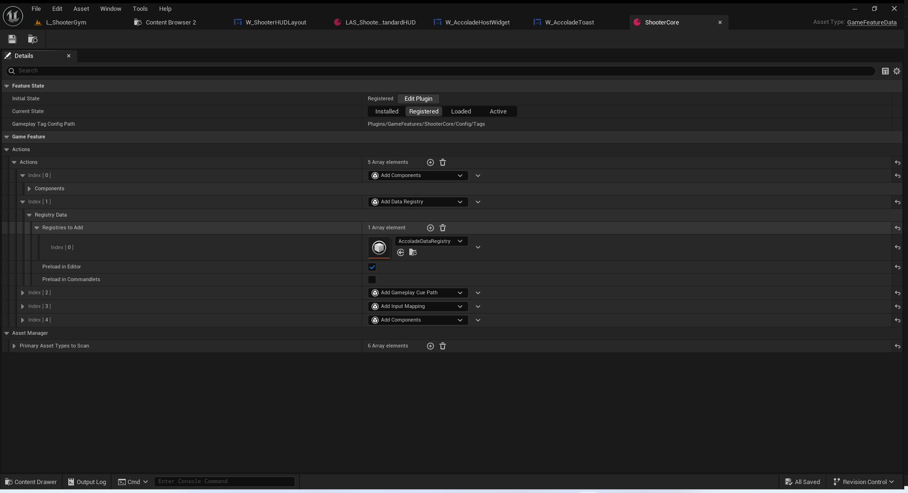
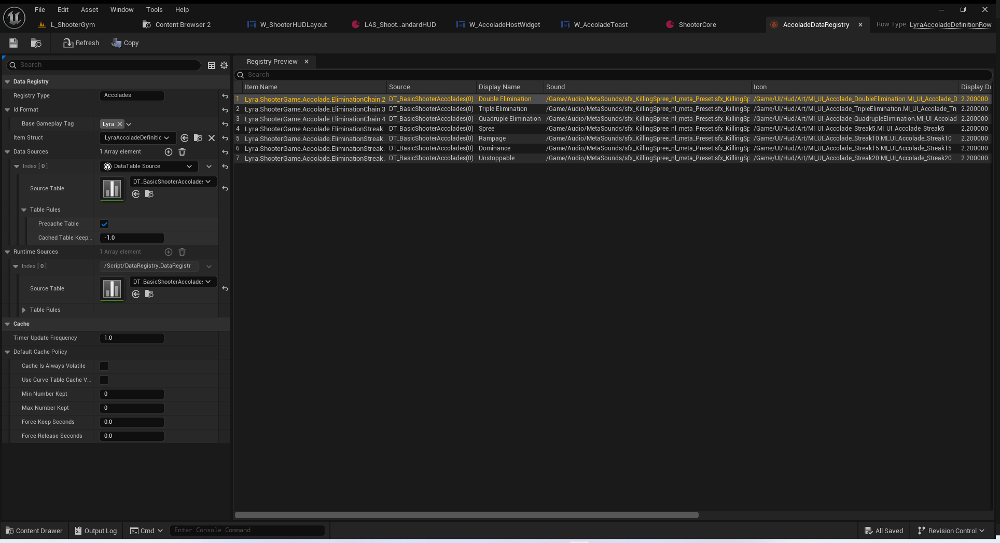
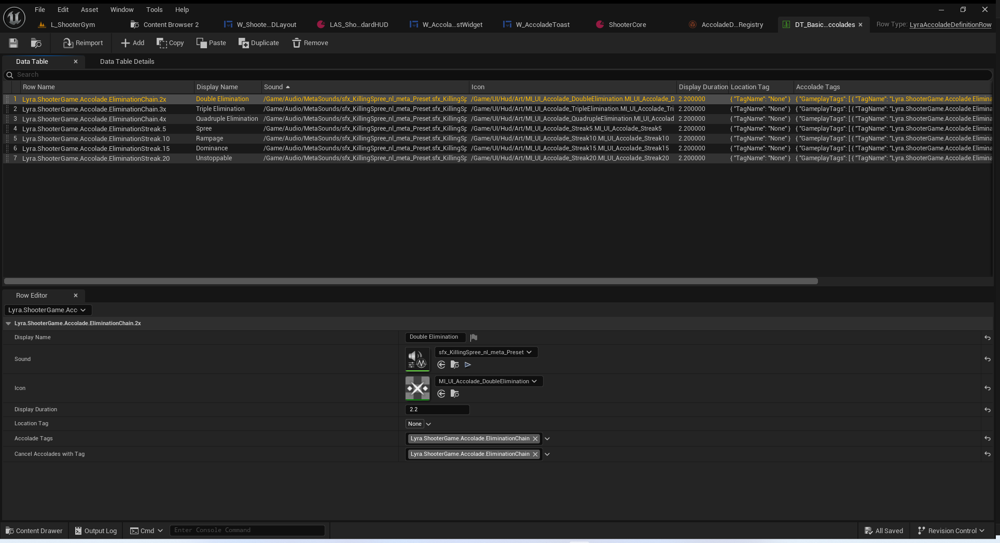
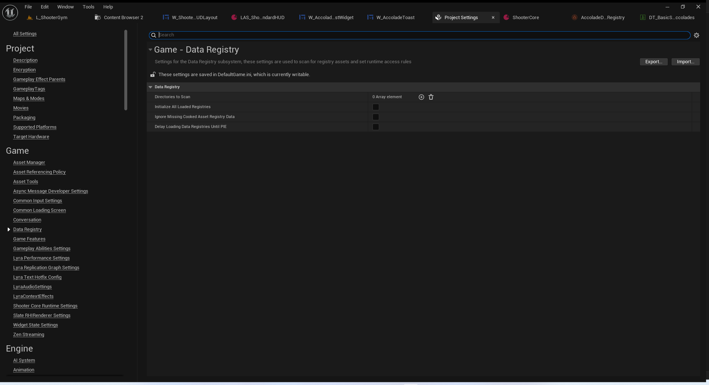
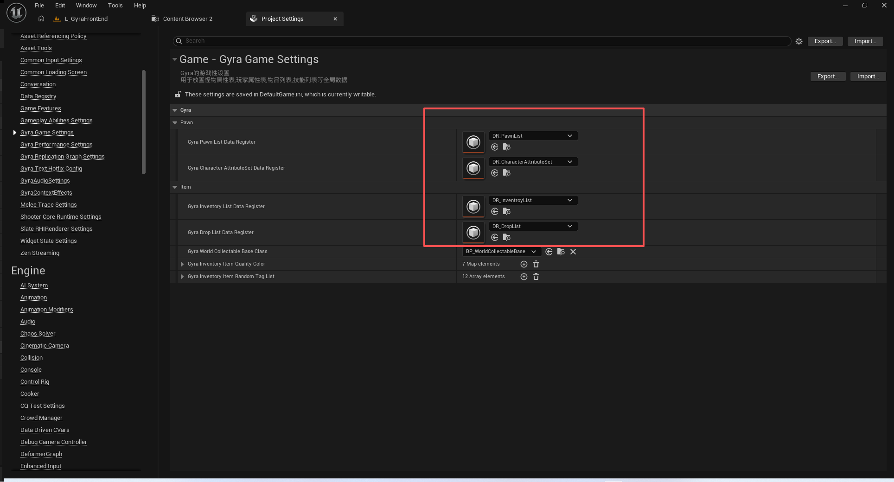
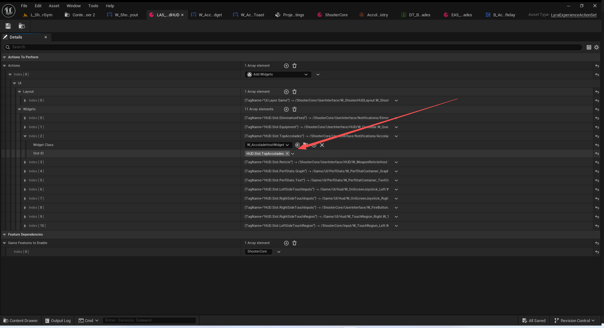
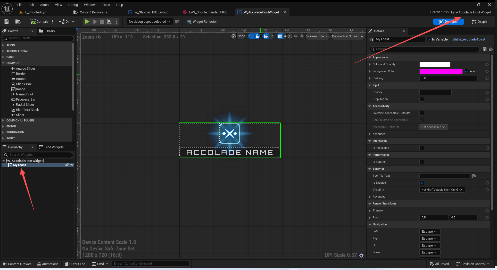
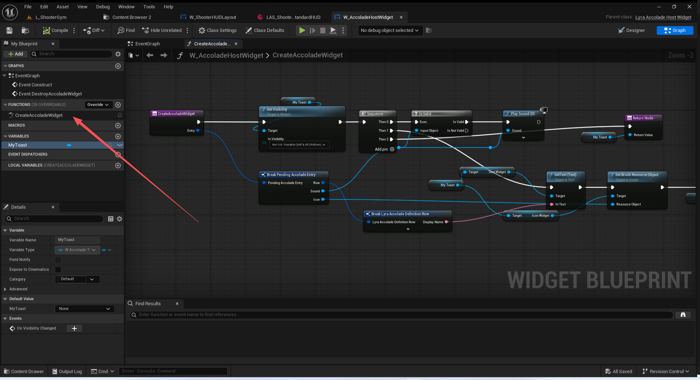

# UE5_Lyra学习指南_105_荣誉系统

本文章仅为小刚-B站课堂-虚幻引擎视频课程Lyra-精讲的演讲手稿.  
本套课程链接:[[UE5]虚幻引擎游戏案例Lyra精讲](https://www.bilibili.com/cheese/play/ss112001159)  
前置课程链接:[[UE5]虚幻引擎UEC++从基础到进阶](https://www.bilibili.com/cheese/play/ss28043)  

文章内容由小刚撰写,采用了以下多种方式:  
1.口述转文字  
2.AI重构  
3.参考引擎源码  
4.Lyra工程源码  
5.结合社区论坛各位大佬的解析  

- [UE5\_Lyra学习指南\_105\_荣誉系统](#ue5_lyra学习指南_105_荣誉系统)
	- [概述](#概述)
		- [蓝图配置](#蓝图配置)
			- [添加数据注册表](#添加数据注册表)
			- [Gyra中的特殊处理](#gyra中的特殊处理)
			- [UI显示效果](#ui显示效果)
		- [荣誉表结构体定义](#荣誉表结构体定义)
		- [荣誉容器控件](#荣誉容器控件)
			- [传递给蓝图的结构体](#传递给蓝图的结构体)
			- [接收游戏机制发过来的荣誉消息](#接收游戏机制发过来的荣誉消息)
			- [构造函数监听荣誉信息](#构造函数监听荣誉信息)
			- [接收消息加载注册表](#接收消息加载注册表)
			- [根据注册表软引用加载资产对象](#根据注册表软引用加载资产对象)
			- [按照顺序轮询播放荣誉信息](#按照顺序轮询播放荣誉信息)
			- [荣誉信息的互斥处理](#荣誉信息的互斥处理)
			- [头文件](#头文件)
	- [总结](#总结)
	- [参考文献](#参考文献)


## 概述
本节主要讲解荣誉系统.包括连续击杀,瞬间击杀.
可以理解为就是MOBA游戏中的,双杀,三杀,四杀或者是暴走,超神等等.
需要注意实现方式为数据注册表.同时还考虑了资产的软引用和硬引用加载过程.

### 蓝图配置
#### 添加数据注册表
// 记得开启插件

// 创建相关资产


// 有一些数据注册表可以考虑常驻在内存中

``` cpp
// Copyright Epic Games, Inc. All Rights Reserved.

#pragma once

#include "GameFeatureAction.h"
#include "GameFeatureAction_DataRegistry.generated.h"

class UDataRegistry;

/** Specifies a list of Data Registries to load and initialize with this feature */
UCLASS(MinimalAPI, meta = (DisplayName = "Add Data Registry"))
class UGameFeatureAction_DataRegistry : public UGameFeatureAction
{
	GENERATED_BODY()

public:
	virtual void OnGameFeatureRegistering() override;
	virtual void OnGameFeatureUnregistering() override;
	virtual void OnGameFeatureActivating() override;
	virtual void OnGameFeatureDeactivating(FGameFeatureDeactivatingContext& Context) override;

	/** If true, we should load the registry at registration time instead of activation time */
	virtual bool ShouldPreloadAtRegistration();

#if WITH_EDITORONLY_DATA
	virtual void AddAdditionalAssetBundleData(FAssetBundleData& AssetBundleData) override;
#endif

	//~UObject interface
#if WITH_EDITOR
	virtual EDataValidationResult IsDataValid(class FDataValidationContext& Context) const override;
#endif
	//~End of UObject interface

private:
	/** List of registry assets to load and initialize */
	UPROPERTY(EditAnywhere, Category = "Registry Data")
	TArray<TSoftObjectPtr<UDataRegistry> > RegistriesToAdd;

	/** If true, this will preload the registries when the feature is registered in the editor to support the editor pickers */
	UPROPERTY(EditAnywhere, Category = "Registry Data")
	bool bPreloadInEditor;

	/** If true, this will preload the registries when the feature is registered whilst a commandlet is running */
	UPROPERTY(EditAnywhere, Category = "Registry Data")
	bool bPreloadInCommandlets;
};


```
``` cpp
void UGameFeatureAction_DataRegistry::OnGameFeatureRegistering()
{
	Super::OnGameFeatureRegistering();

	if (ShouldPreloadAtRegistration())
	{
		// TODO: Right now this loads the source for both editor and runtime usage, in the future the preload could be changed to only allow resolves and not full data gets

		UDataRegistrySubsystem* DataRegistrySubsystem = UDataRegistrySubsystem::Get();
		if (ensure(DataRegistrySubsystem))
		{
			for (const TSoftObjectPtr<UDataRegistry>& RegistryToAdd : RegistriesToAdd)
			{
				if (!RegistryToAdd.IsNull())
				{
					const FSoftObjectPath RegistryPath = RegistryToAdd.ToSoftObjectPath();

					UE_LOG(LogGameFeatures, Log, TEXT("OnGameFeatureRegistering %s: Preloading DataRegistry %s for editor preview"), *GetPathName(), *RegistryPath.ToString())
					DataRegistrySubsystem->LoadRegistryPath(RegistryPath);
				}
			}
		}
	}
}


```

``` cpp
bool UDataRegistrySubsystem::LoadRegistryPath(const FSoftObjectPath& RegistryAssetPath)
{
	if (RegistryPathsToLoad.AddUnique(RegistryAssetPath) != INDEX_NONE)
	{
		RegistryPathsToIgnore.Remove(RegistryAssetPath);
		if (bReadyForInitialization)
		{
			// Need to make sure it's in memory
			RegistryAssetPath.TryLoad();

			// If we're past initialization, add it to the path list so it doesn't get filtered out
			AssetScanPaths.AddUnique(RegistryAssetPath.ToString());

			RefreshRegistryMap();
			InitializeAllRegistries(false);
		}

		return true;
	}
	return false;
}
```
``` cpp

/** Specifies a list of source assets to add to Data Registries when this feature is activated */
UCLASS(MinimalAPI, meta = (DisplayName = "Add Data Registry Source"))
class UGameFeatureAction_DataRegistrySource : public UGameFeatureAction
{
	GENERATED_BODY()

public:
	virtual void OnGameFeatureRegistering() override;
	virtual void OnGameFeatureUnregistering() override;
	virtual void OnGameFeatureActivating() override;
	virtual void OnGameFeatureDeactivating(FGameFeatureDeactivatingContext& Context) override;

	/** If true, we should load the sources at registration time instead of activation time */
	virtual bool ShouldPreloadAtRegistration();

#if WITH_EDITORONLY_DATA
	virtual void AddAdditionalAssetBundleData(FAssetBundleData& AssetBundleData) override;
#endif

	//~UObject interface
#if WITH_EDITOR
	virtual EDataValidationResult IsDataValid(class FDataValidationContext& Context) const override;
#endif
	//~End of UObject interface

#if WITH_EDITOR
	/** Used by an editor tool to programmatically register a new source */
	GAMEFEATURES_API void AddSource(const FDataRegistrySourceToAdd& NewSource);
#endif

private:
	/** List of sources to add when this feature is activated */
	UPROPERTY(EditAnywhere, Category = "Registry Data", meta=(TitleProperty="RegistryToAddTo"))
	TArray<FDataRegistrySourceToAdd> SourcesToAdd;

	/** If true, this will preload the sources when the feature is registered in the editor to support the editor pickers */
	UPROPERTY(EditAnywhere, Category = "Registry Data")
	bool bPreloadInEditor;
};

```
#### Gyra中的特殊处理

``` cpp
/**
 * Gyra的游戏性设置
 * 用于放置怪物属性表,玩家属性表,物品列表,技能列表等全局数据
 *
 */
UCLASS(config = Game, defaultconfig, meta = (DisplayName = "Gyra Game Settings"))
class UGyraGameSettings : public UDeveloperSettings
{
	GENERATED_BODY()

public:

	UGyraGameSettings();

public:

	UPROPERTY(Config, EditDefaultsOnly, Category = "Gyra|Pawn", meta = (DisplayName = "Gyra Pawn List Data Register", AllowedClasses = "/Script/DataRegistry.DataRegistry", ConfigRestartRequired = true))
	FSoftObjectPath PawnListName;

	UPROPERTY(Config, EditDefaultsOnly, Category = "Gyra|Pawn", meta = (DisplayName = "Gyra Character AttributeSet Data Register", AllowedClasses = "/Script/DataRegistry.DataRegistry", ConfigRestartRequired = true))
	FSoftObjectPath CharacterAttributeSetName;

	UPROPERTY(Config, EditDefaultsOnly, Category = "Gyra|Item", meta = (DisplayName = "Gyra Inventory List Data Register", AllowedClasses = "/Script/DataRegistry.DataRegistry", ConfigRestartRequired = true))
	FSoftObjectPath InventoryListName;

	UPROPERTY(Config, EditDefaultsOnly, Category = "Gyra|Item", meta = (DisplayName = "Gyra Drop List Data Register", AllowedClasses = "/Script/DataRegistry.DataRegistry", ConfigRestartRequired = true))
	FSoftObjectPath DropListName;

	UPROPERTY(Config, EditDefaultsOnly, Category = "Gyra|Item", meta = (DisplayName = "Gyra World Collectable Base Class", AllowedClasses = "/Script/GyraGame.GyraWorldCollectable", ConfigRestartRequired = true))
	FSoftClassPath WorldCollectableBaseClassName = AGyraWorldCollectable::StaticClass();

	UPROPERTY(Config, EditDefaultsOnly, Category = "Gyra|Item", meta = (DisplayName = "Gyra Inventory Item Quality Color"))
	TMap<EGyraInventoryItemQuality, FLinearColor> QualityColorList;

	UPROPERTY(Config, EditDefaultsOnly, Category = "Gyra|Item", meta = (DisplayName = "Gyra Inventory Item Random Tag List"))
	TArray<FGyraItemInstanceTagDefiniton> RandomTagDefaultList;

public:

	UFUNCTION(BlueprintCallable, Category = "Gyra|Settings")
	static UGyraGameSettings* GetGyraGameSettings();

	UFUNCTION(BlueprintPure, Category = "Gyra|Settings")
	UDataRegistry* GetPawnListDataRegistry();

	UFUNCTION(BlueprintPure, Category = "Gyra|Settings")
	UDataRegistry* GetCharacterAttributeSetDataRegistry();

	UFUNCTION(BlueprintPure, Category = "Gyra|Settings")
	UDataRegistry* GetInventoryListDataRegistry();

	UFUNCTION(BlueprintPure, Category = "Gyra|Settings")
	UDataRegistry* GetDropListDataRegistry();

	UFUNCTION(BlueprintPure, Category = "Gyra|Settings")
	TSubclassOf<AGyraWorldCollectable> GetWorldCollectableBase();

	UFUNCTION(BlueprintPure, Category = "Gyra|Settings")
	FLinearColor GetItemQualityColor(EGyraInventoryItemQuality InItemQuality);

	UFUNCTION(BlueprintPure, Category = "Gyra|Settings")
	TArray<FGyraItemInstanceTagDefiniton> GetRandomTagDefaultList( );


protected:

	UPROPERTY()
	TObjectPtr<UDataRegistry> PawnListDataRegistry;

	UPROPERTY()
	TObjectPtr<UDataRegistry> CharacterAttributeSetDataRegistry;

	UPROPERTY()
	TObjectPtr<UDataRegistry> InventoryListDataRegistry;

	UPROPERTY()
	TObjectPtr<UDataRegistry> DropListDataRegistry;

	UPROPERTY()
	TSubclassOf<AGyraWorldCollectable> WorldCollectableBaseClass;

};


```

``` cpp
UDataRegistry* UGyraGameSettings::GetPawnListDataRegistry()
{
	if (!PawnListDataRegistry)
	{
		if (PawnListName.IsValid())
		{
			PawnListDataRegistry = Cast<UDataRegistry>(PawnListName.TryLoad());
			PawnListDataRegistry->AddToRoot();
		}
	}
	return PawnListDataRegistry;
}


```

#### UI显示效果



### 荣誉表结构体定义
表格行的结构体定义
``` cpp
USTRUCT(BlueprintType)
struct FLyraAccoladeDefinitionRow : public FTableRowBase
{
	GENERATED_BODY()

public:
	// The message to display
	// 要显示的消息
	UPROPERTY(EditAnywhere, BlueprintReadOnly)
	FText DisplayName;

	// The sound to play
	// 要播放的声音
	// 软的
	UPROPERTY(EditAnywhere, BlueprintReadOnly)
	TSoftObjectPtr<USoundBase> Sound;

	// The icon to display	
	// 显示的图标
	// 软的
	UPROPERTY(EditAnywhere, BlueprintReadOnly, meta=(DisplayThumbnail="true", AllowedClasses="Texture,MaterialInterface,SlateTextureAtlasInterface", DisallowedClasses="MediaTexture"))
	TSoftObjectPtr<UObject> Icon;

	// Duration (in seconds) to display this accolade
	// 显示此荣誉所用的时间（以秒为单位）
	UPROPERTY(EditAnywhere, BlueprintReadOnly)
	float DisplayDuration = 1.0f;

	// Location to display this accolade
	// 显示此荣誉的位置
	UPROPERTY(EditAnywhere, BlueprintReadOnly)
	FGameplayTag LocationTag;

	// Tags associated with this accolade
	// 与此次荣誉相关的标签
	UPROPERTY(EditAnywhere, BlueprintReadOnly)
	FGameplayTagContainer AccoladeTags;

	// When this accolade is displayed, any existing displayed/pending accolades with any of
	// these tags will be removed (e.g., getting a triple-elim will suppress a double-elim)
	// 当此奖项被展示时，所有已显示/待显示且带有上述任何标签的奖项都将被移除（例如，获得三连败将取消两连败的显示）
	UPROPERTY(EditAnywhere, BlueprintReadOnly)
	FGameplayTagContainer CancelAccoladesWithTag;
};
```

``` cpp
/**
 * 游戏资产的定义
 * 未使用,应该是之前的设计
 */
UCLASS(BlueprintType)
class ULyraAccoladeDefinition : public UDataAsset
{
	GENERATED_BODY()

public:
	// The sound to play
	// 将要播放的声音
	UPROPERTY(EditAnywhere, BlueprintReadOnly)
	TObjectPtr<USoundBase> Sound;

	// The icon to display	
	// 显示的图标
	UPROPERTY(EditAnywhere, BlueprintReadWrite, meta=(DisplayThumbnail="true", AllowedClasses="Texture,MaterialInterface,SlateTextureAtlasInterface", DisallowedClasses="MediaTexture"))
	TObjectPtr<UObject> Icon;

	// Tags associated with this accolade
	// 与此次荣誉相关的标签
	UPROPERTY(EditAnywhere, BlueprintReadWrite)
	FGameplayTagContainer AccoladeTags;

	// When this accolade is displayed, any existing displayed/pending accolades with any of
	// these tags will be removed (e.g., getting a triple-elim will suppress a double-elim)
	// 当此奖项被展示时，所有已显示/待显示且带有上述任何标签的奖项都将被移除（例如，获得三连败将取消两连败的显示）
	UPROPERTY(EditAnywhere, BlueprintReadWrite)
	FGameplayTagContainer CancelAccoladesWithTag;
};

```
### 荣誉容器控件
#### 传递给蓝图的结构体
``` cpp
// 传递给蓝图使用
USTRUCT(BlueprintType)
struct FPendingAccoladeEntry
{
	GENERATED_BODY();

	// 具体那行
	// 里面有软引用
	UPROPERTY(BlueprintReadOnly)
	FLyraAccoladeDefinitionRow Row; 

	// 声音
	// 硬的
	UPROPERTY(BlueprintReadOnly)
	TObjectPtr<USoundBase> Sound = nullptr;

	// 图表
	// 硬的
	UPROPERTY(BlueprintReadOnly)
	TObjectPtr<UObject> Icon = nullptr;

	// 控件
	UPROPERTY()
	TObjectPtr<UUserWidget> AllocatedWidget = nullptr;

	int32 SequenceID = 0;

	// 是否完成了加载 因为我们的行结构体里面是软引用 需要加载后变成硬的给Entry
	bool bFinishedLoading = false;

	// 没有使用 也没有实现的 代码
	void CancelDisplay();
};
```
#### 接收游戏机制发过来的荣誉消息
``` cpp
// A message destined for a transient log (e.g., an elimination feed or inventory pickup stream)
// 一条发往临时日志的消息（例如，歼灭对象推送信息或库存提取流）
USTRUCT(BlueprintType)
struct FLyraNotificationMessage
{
	GENERATED_BODY()

	// The destination channel
	// 目的地频道
	UPROPERTY(BlueprintReadWrite, Category=Notification)
	FGameplayTag TargetChannel;

	// The target player (if none is set then it will display for all local players)
	// 目标玩家（如果没有设定，则会显示给所有本地玩家）
	UPROPERTY(BlueprintReadWrite, Category=Notification)
	TObjectPtr<APlayerState> TargetPlayer = nullptr;

	// The message to display
	// 要显示的消息
	UPROPERTY(BlueprintReadWrite, Category=Notification)
	FText PayloadMessage;

	// Extra payload specific to the target channel (e.g., a style or definition asset)
	// 与目标频道特定相关的附加内容（例如，某种样式或定义性资源）
	UPROPERTY(BlueprintReadWrite, Category=Notification)
	FGameplayTag PayloadTag;

	// Extra payload specific to the target channel (e.g., a style or definition asset)
	// 与目标频道特定相关的附加内容（例如，某种样式或定义性资源）
	UPROPERTY(BlueprintReadWrite, Category=Notification)
	TObjectPtr<UObject> PayloadObject = nullptr;
};


```

#### 构造函数监听荣誉信息
``` cpp
void ULyraAccoladeHostWidget::NativeConstruct()
{
	Super::NativeConstruct();

	// 绑定添加提示信息
	UGameplayMessageSubsystem& MessageSubsystem = UGameplayMessageSubsystem::Get(this);
	ListenerHandle = MessageSubsystem.RegisterListener(TAG_Lyra_AddNotification_Message, this, &ThisClass::OnNotificationMessage);
}

void ULyraAccoladeHostWidget::NativeDestruct()
{
	// 解除绑定
	UGameplayMessageSubsystem& MessageSubsystem = UGameplayMessageSubsystem::Get(this);
	MessageSubsystem.UnregisterListener(ListenerHandle);

	// 调用异步混入插件的回收资源
	CancelAsyncLoading();

	Super::NativeDestruct();
}

```

#### 接收消息加载注册表
``` cpp
void ULyraAccoladeHostWidget::OnNotificationMessage(FGameplayTag Channel, const FLyraNotificationMessage& Notification)
{
	// 判断通道
	if (Notification.TargetChannel == TAG_Lyra_ShooterGame_Accolade)
	{
		// Ignore notifications for other players
		// 忽略其他玩家的通知
		if (Notification.TargetPlayer != nullptr)
		{
			APlayerController* PC = GetOwningPlayer();
			if ((PC == nullptr) || (PC->PlayerState != Notification.TargetPlayer))
			{
				return;
			}
		}

		// Load the data registry row for this accolade
		// 加载与此荣誉相关的数据注册行
		const int32 NextID = AllocatedSequenceID;
		++AllocatedSequenceID;
		// 根据我们的数据注册表名NAME_AccoladeRegistryID Accolades 必须在/ShooterCore/Accolades/AccoladeDataRegistry.AccoladeDataRegistry这个资产中标明这个名字
		// 根据我们选定传递的Tag,这个具体tag由荣誉相关组件接收歼灭信息处理后转换成荣誉信息传递过来!!!!
		FDataRegistryId ItemID(NAME_AccoladeRegistryID, Notification.PayloadTag.GetTagName());
		/** 启动对一个项目的异步加载操作，获取操作成功或失败时会调用委托函数。若无法安排委托函数的执行，则返回 false */
		// 尝试加载可以运行,等待回调结果
		if (!UDataRegistrySubsystem::Get()->AcquireItem(ItemID, FDataRegistryItemAcquiredCallback::CreateUObject(this, &ThisClass::OnRegistryLoadCompleted, NextID)))
		{
			// 无法执行了 可能是没有或者写错了 那就不显示这个
			UE_LOG(LogLyra, Error, TEXT("Failed to find accolade registry for tag %s, accolades will not appear"), *Notification.PayloadTag.GetTagName().ToString());
			--AllocatedSequenceID;
		}
	}
}


```

#### 根据注册表软引用加载资产对象
``` cpp

void ULyraAccoladeHostWidget::OnRegistryLoadCompleted(const FDataRegistryAcquireResult& AccoladeHandle, int32 SequenceID)
{
	// 获取到具体每我们要的那一行
	if (const FLyraAccoladeDefinitionRow* AccoladeRow = AccoladeHandle.GetItem<FLyraAccoladeDefinitionRow>())
	{
		// 添加到异步荣誉加载的列表中
		// 因为是异步的所以 有偏差
		FPendingAccoladeEntry& PendingEntry = PendingAccoladeLoads.AddDefaulted_GetRef();
		PendingEntry.Row = *AccoladeRow;
		PendingEntry.SequenceID = SequenceID;

		// 看看有多少软的资产需要加载进来
		TArray<FSoftObjectPath> AssetsToLoad;
		AssetsToLoad.Add(AccoladeRow->Sound.ToSoftObjectPath());
		AssetsToLoad.Add(AccoladeRow->Icon.ToSoftObjectPath());
		// 申请调用异步混入插件开始加载
		AsyncLoad(AssetsToLoad, [this, SequenceID]
		{
			// 异步加载具体资产已经完成了
			// 把我们加载好的资产对象的指针给我们的Entry 以便传递给控件蓝图使用
			FPendingAccoladeEntry* EntryThatFinishedLoading = PendingAccoladeLoads.FindByPredicate([SequenceID](const FPendingAccoladeEntry& Entry) { return Entry.SequenceID == SequenceID; });
			if (ensure(EntryThatFinishedLoading))
			{
				EntryThatFinishedLoading->Sound = EntryThatFinishedLoading->Row.Sound.Get();
				EntryThatFinishedLoading->Icon = EntryThatFinishedLoading->Row.Icon.Get();
				EntryThatFinishedLoading->bFinishedLoading = true;
				
				ConsiderLoadedAccolades();
			}
		});
		// 开始异步加载
		StartAsyncLoading();
	}
	else
	{
		ensure(false);
	}
}

```

#### 按照顺序轮询播放荣誉信息
``` cpp
void ULyraAccoladeHostWidget::ConsiderLoadedAccolades()
{
	int32 PendingIndexToDisplay;
	
	// 先做一次然后循环判断
	do
	{	// 找到我们要播放的荣誉序列
		PendingIndexToDisplay = PendingAccoladeLoads.IndexOfByPredicate([DesiredID=NextDisplaySequenceID](const FPendingAccoladeEntry& Entry) { return Entry.bFinishedLoading && Entry.SequenceID == DesiredID; });
		
		// 如果可以找到
		if (PendingIndexToDisplay != INDEX_NONE)
		{
			// 把它移出来 不需要考虑容器内的顺序 因为我们通过序列ID确保了顺序 容器内乱序即可
			FPendingAccoladeEntry Entry = MoveTemp(PendingAccoladeLoads[PendingIndexToDisplay]);
			PendingAccoladeLoads.RemoveAtSwap(PendingIndexToDisplay);

			// 顺序正确可以进行处理
			ProcessLoadedAccolade(Entry);
			++NextDisplaySequenceID;
		}
	} while (PendingIndexToDisplay != INDEX_NONE);
}
```
#### 荣誉信息的互斥处理
``` cpp

void ULyraAccoladeHostWidget::ProcessLoadedAccolade(const FPendingAccoladeEntry& Entry)
{
	// 目前这个Location是空的 表里面是空的 我们的控件也是空的 所以不用管
	if (Entry.Row.LocationTag == LocationName)
	{
		// 是否需要重新创建
		// 如果没有肯定要重新创建
		bool bRecreateWidget = PendingAccoladeDisplays.Num() == 0;
		for (int32 Index = 0; Index < PendingAccoladeDisplays.Num(); )
		{
			// 过往荣誉是否有被当前展示的荣誉互斥
			if (PendingAccoladeDisplays[Index].Row.AccoladeTags.HasAny(Entry.Row.CancelAccoladesWithTag))
			{
				// 确认互斥了
				// 回收掉它
				// 实际上蓝图这里的回收 只是隐藏掉 不需要销毁
				if (UUserWidget* OldWidget = PendingAccoladeDisplays[Index].AllocatedWidget)
				{
					DestroyAccoladeWidget(OldWidget);
					// 当前使用的被移除了 所以需要创新创建
					bRecreateWidget = true;
				}
				// 从旧的荣誉列表中进行移除
				PendingAccoladeDisplays.RemoveAt(Index);
			}
			else
			{
				++Index;
			}
		}
		// 添加当前的荣誉
		PendingAccoladeDisplays.Add(Entry);
		
		// 只有第一个荣誉或者出现互斥荣誉的时候才需要去重新创建
		// 如果是补充同类的另一个荣誉那么就等 旧的荣誉自动移除时再去展示吧.
		if (bRecreateWidget)
		{
			DisplayNextAccolade();
		}
	}
}


```
``` cpp

void ULyraAccoladeHostWidget::DisplayNextAccolade()
{
	// 有需要等待展示的荣誉
	if (PendingAccoladeDisplays.Num() > 0)
	{
		// 取第一个
		FPendingAccoladeEntry& Entry = PendingAccoladeDisplays[0];

		// 按照时间到后进行回收 并尝试展示下一个
		GetWorld()->GetTimerManager().SetTimer(NextTimeToReconsiderHandle, this, &ThisClass::PopDisplayedAccolade, Entry.Row.DisplayDuration);
		// 交给控件蓝图去展示
		Entry.AllocatedWidget = CreateAccoladeWidget(Entry);
	}
}

```

``` cpp
void ULyraAccoladeHostWidget::PopDisplayedAccolade()
{
	// 回收当前正在使用的荣誉
	if (PendingAccoladeDisplays.Num() > 0)
	{
		if (UUserWidget* OldWidget = PendingAccoladeDisplays[0].AllocatedWidget)
		{
			// 呼叫控件蓝图进行回收
			DestroyAccoladeWidget(OldWidget);
		}
		PendingAccoladeDisplays.RemoveAt(0);
	}
	// 尝试展示下一个
	DisplayNextAccolade();
}


```
#### 头文件
``` cpp

/**
 * 荣誉的容器控件
 */
UCLASS(BlueprintType)
class ULyraAccoladeHostWidget : public UCommonUserWidget, public FAsyncMixin
{
	GENERATED_BODY()

public:
	// The location tag (used to filter incoming messages to only display the appropriate accolades in a given location)
	// 地点标签（用于筛选接收到的消息，以便仅在特定地点显示相应的表扬内容）
	// 目前都是空的
	UPROPERTY(EditAnywhere, BlueprintReadOnly)
	FGameplayTag LocationName;

	//~UUserWidget interface
	// 构造函数 监听游戏机制的荣誉信息
	virtual void NativeConstruct() override;
	virtual void NativeDestruct() override;
	//~End of UUserWidget interface

	// 交给蓝图实现 当出现互斥的时候 需要回收旧的荣誉 蓝图只是将其隐藏即可
	UFUNCTION(BlueprintImplementableEvent)
	void DestroyAccoladeWidget(UUserWidget* Widget);

	// 交给蓝图实现 目前蓝图复用了这个控件 创建和回收时都只是切换可视性
	UFUNCTION(BlueprintImplementableEvent)
	UUserWidget* CreateAccoladeWidget(const FPendingAccoladeEntry& Entry);
private:
	// 监听游戏机制的句柄
	FGameplayMessageListenerHandle ListenerHandle;

	// 下一个需要播放的荣誉序列
	int32 NextDisplaySequenceID = 0;
	// 已经分配的荣誉序列唯一性ID
	int32 AllocatedSequenceID = 0;

	// 用来播放荣誉的定时器句柄
	FTimerHandle NextTimeToReconsiderHandle;

	// List of async pending load accolades (which might come in the wrong order due to the row read)
	// 异步加载任务的待处理列表（由于行读取操作可能会导致顺序出现偏差）
	// 我们需要按照顺序进行处理
	UPROPERTY(Transient)
	TArray<FPendingAccoladeEntry> PendingAccoladeLoads;

	// List of pending accolades (due to one at a time display duration; the first one in the list is the current visible one)
	// 待颁发奖项列表（由于每次显示仅能展示一项，因此列表中的第一项即为当前可见的奖项）
	UPROPERTY(Transient)
	TArray<FPendingAccoladeEntry> PendingAccoladeDisplays;

	// 监听游戏机制的回调函数
	void OnNotificationMessage(FGameplayTag Channel, const FLyraNotificationMessage& Notification);
	// 数据表加载的完成回调
	void OnRegistryLoadCompleted(const FDataRegistryAcquireResult& AccoladeHandle, int32 SequenceID);

	// 资产已经加载完毕,需要不断轮询以确保顺序添加从PendingAccoladeLoads到PendingAccoladeDisplays中
	void ConsiderLoadedAccolades();
	// 时间到了弹出我们当前使用的第一个荣誉 同时尝试显示下一个
	void PopDisplayedAccolade();
	// 每次有新的荣誉加载完成后,在ConsiderLoadedAccolades调用 用来处理新旧荣誉的互斥关系
	void ProcessLoadedAccolade(const FPendingAccoladeEntry& Entry);
	// 尝试展示下一个荣誉 需要确保调用时 上一个荣誉已经被回收了 或者没有才行!
	void DisplayNextAccolade();
};

```

## 总结
本节主要讲了荣誉系统如何进行响应的.关于连杀,瞬杀等组件实现由下一篇文档讲解!

## 参考文献
[数据注册表](https://dev.epicgames.com/documentation/zh-cn/unreal-engine/data-registries-in-unreal-engine)
[数据注册表快速入门](https://dev.epicgames.com/documentation/zh-cn/unreal-engine/quick-start-guide-for-unreal-engine-data-registries)